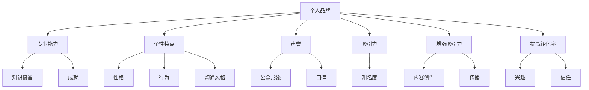

                 

# 《注意力经济下的个人品牌打造》

> 关键词：个人品牌、注意力经济、内容营销、社交媒体、精准营销、品牌影响力、法律法规、道德伦理、实战案例、未来趋势

> 摘要：在注意力经济时代，个人品牌的重要性愈发凸显。本文首先介绍了个人品牌的概念和注意力经济的概念，阐述了个人品牌与注意力经济的关系。随后，从内容营销、社交媒体营销、精准营销、品牌影响力提升、法律法规与道德伦理等方面探讨了个人品牌打造策略。通过实战案例分析和未来趋势展望，为个人品牌打造提供了理论指导和实践参考。

## 目录大纲

## 第一部分：个人品牌概述

### 1.1 个人品牌的重要性

#### 1.1.1 什么是个人品牌
#### 1.1.2 个人品牌的价值
#### 1.1.3 个人品牌的作用

### 1.2 注意力经济的概念

#### 1.2.1 注意力经济概述
#### 1.2.2 注意力经济的兴起
#### 1.2.3 个人品牌与注意力经济的关系

### 1.3 个人品牌的构建

#### 1.3.1 个人品牌的定位
#### 1.3.2 个人品牌的塑造
#### 1.3.3 个人品牌的传播

## 第二部分：注意力经济下的个人品牌打造策略

### 2.1 内容营销策略

#### 2.1.1 内容营销概述
#### 2.1.2 内容营销的关键要素
#### 2.1.3 内容营销的案例分析

### 2.2 社交媒体营销策略

#### 2.2.1 社交媒体营销概述
#### 2.2.2 社交媒体营销的平台选择
#### 2.2.3 社交媒体营销的案例分析

### 2.3 精准营销策略

#### 2.3.1 精准营销概述
#### 2.3.2 数据分析与用户画像
#### 2.3.3 精准营销的案例分析

### 2.4 品牌影响力提升策略

#### 2.4.1 品牌影响力的重要性
#### 2.4.2 提升品牌影响力的方法
#### 2.4.3 品牌影响力提升的案例分析

### 2.5 个人品牌打造的法律法规与道德伦理

#### 2.5.1 个人品牌打造的法律法规
#### 2.5.2 个人品牌打造的道德伦理
#### 2.5.3 个人品牌打造的法律风险与防范

## 第三部分：个人品牌打造实战案例

### 3.1 案例一：通过社交媒体打造个人品牌

#### 3.1.1 案例介绍
#### 3.1.2 案例分析
#### 3.1.3 案例启示

### 3.2 案例二：利用内容营销提升个人品牌

#### 3.2.1 案例介绍
#### 3.2.2 案例分析
#### 3.2.3 案例启示

### 3.3 案例三：通过精准营销实现个人品牌塑造

#### 3.3.1 案例介绍
#### 3.3.2 案例分析
#### 3.3.3 案例启示

## 第四部分：个人品牌打造的未来发展趋势

### 4.1 技术发展趋势

#### 4.1.1 人工智能技术在个人品牌打造中的应用
#### 4.1.2 大数据分析与个人品牌打造
#### 4.1.3 虚拟现实与个人品牌打造

### 4.2 社会文化发展趋势

#### 4.2.1 个人品牌的价值认同
#### 4.2.2 社交媒体与个人品牌打造的变革
#### 4.2.3 未来个人品牌打造的新趋势

## 附录

### 附录 A：个人品牌打造工具与资源推荐

#### A.1 社交媒体工具推荐
#### A.2 内容营销工具推荐
#### A.3 数据分析与用户画像工具推荐
#### A.4 个人品牌打造相关书籍与文章推荐
#### A.5 个人品牌打造培训课程推荐

## 第一部分：个人品牌概述

### 1.1 个人品牌的重要性

在当今数字化时代，个人品牌已成为人们职业生涯发展的重要资产。个人品牌是指个人在公众心目中的形象和声誉，它不仅代表着个人的专业能力和独特价值，也是个人影响力的体现。在注意力经济背景下，个人品牌的重要性愈发凸显。

#### 1.1.1 什么是个人品牌

个人品牌是一个人的专业能力、个性特点、价值观和声誉的集合体。它包括以下三个方面：

1. **专业能力**：个人品牌的核心要素，包括专业技能、工作经验和成就等。
2. **个性特点**：个人的性格、行为和沟通风格，有助于塑造独特的个人形象。
3. **声誉**：个人在公众心目中的形象和口碑，是个人品牌的最终体现。

#### 1.1.2 个人品牌的价值

个人品牌具有以下价值：

1. **增强竞争力**：个人品牌有助于提升个人的市场竞争力，吸引更多的就业机会和商业合作。
2. **扩大影响力**：个人品牌可以扩大个人的影响力，使个人在行业内外拥有更高的知名度。
3. **提升收入水平**：个人品牌有助于提高个人的收入水平，实现职业发展的跨越式提升。
4. **塑造企业形象**：个人品牌可以作为企业形象的延伸，为企业带来更多的商业机会和品牌价值。

#### 1.1.3 个人品牌的作用

个人品牌在个人职业发展中起着至关重要的作用：

1. **职业定位**：个人品牌有助于明确个人的职业定位和发展方向。
2. **职业晋升**：个人品牌可以帮助个人在职业晋升中脱颖而出，获得更多的晋升机会。
3. **人脉拓展**：个人品牌有助于拓展人脉资源，为个人的事业发展创造更多的机会。
4. **合作共赢**：个人品牌可以吸引更多的合作伙伴，实现合作共赢，提升个人和企业价值。

### 1.2 注意力经济的概念

注意力经济是指在信息过载的背景下，个人和企业在争夺公众注意力的过程中所形成的经济现象。随着互联网和社交媒体的普及，注意力资源成为了一种稀缺资源，如何吸引和保持公众的注意力成为企业和个人竞争的关键。

#### 1.2.1 注意力经济概述

注意力经济的核心是争夺和利用公众的注意力资源，主要特点包括：

1. **注意力稀缺**：在信息爆炸的时代，公众的注意力资源变得稀缺，企业和个人需要通过创新和独特的价值来吸引注意力。
2. **注意力转移**：公众的注意力容易受到外部刺激的影响，企业和个人需要不断调整策略，以保持公众的注意力。
3. **注意力交易**：企业和个人通过提供有价值的内容和服务，吸引公众的注意力，从而实现商业价值。

#### 1.2.2 注意力经济的兴起

注意力经济起源于20世纪90年代的互联网泡沫时期，随着互联网和社交媒体的快速发展，注意力经济逐渐成为主流经济形态。主要表现包括：

1. **广告业崛起**：互联网广告成为主流广告形式，广告主开始重视公众的注意力资源，通过精准投放广告来吸引潜在客户。
2. **内容创作繁荣**：随着社交媒体的普及，越来越多的个人和机构开始投身于内容创作领域，以吸引公众的注意力。
3. **品牌竞争加剧**：在注意力经济背景下，品牌竞争愈发激烈，企业和个人需要通过不断创新和提升个人品牌来吸引公众的注意力。

#### 1.2.3 个人品牌与注意力经济的关系

个人品牌与注意力经济密切相关，个人品牌是吸引和保持公众注意力的关键因素。个人品牌的价值在于：

1. **吸引注意力**：个人品牌有助于提升个人在公众心目中的知名度，吸引更多的关注和兴趣。
2. **增强吸引力**：个人品牌可以增强个人在内容创作和传播中的吸引力，使内容更容易被公众接受和传播。
3. **提高转化率**：个人品牌有助于提高公众对个人提供的价值和服务产生兴趣和信任，从而提高转化率。

### 1.3 个人品牌的构建

个人品牌构建是一个系统工程，需要从定位、塑造和传播三个方面进行。以下分别进行阐述。

#### 1.3.1 个人品牌的定位

个人品牌的定位是个人品牌构建的第一步，它决定了个人品牌的发展方向和目标。个人品牌定位主要包括以下几个方面：

1. **核心价值**：明确个人的核心价值，即个人在专业领域中的独特优势和核心竞争力。
2. **目标人群**：确定个人品牌的目标受众，了解他们的需求和期望，以便提供有针对性的内容和服务。
3. **竞争差异**：分析同行业竞争对手的个人品牌特点，找出差异化的竞争策略，以在市场中脱颖而出。

#### 1.3.2 个人品牌的塑造

个人品牌塑造是个人品牌构建的核心环节，它决定了个人品牌的市场认可度和影响力。个人品牌塑造主要包括以下几个方面：

1. **专业技能**：不断提升个人的专业技能和知识储备，以保持专业领域的领先地位。
2. **个性特点**：发挥个人的个性特点，塑造独特的个人形象，增强个人品牌的识别度。
3. **传播渠道**：选择合适的传播渠道，如社交媒体、博客、演讲等，扩大个人品牌的影响力。

#### 1.3.3 个人品牌的传播

个人品牌传播是个人品牌构建的最后一个环节，它决定了个人品牌在公众中的认知度和接受度。个人品牌传播主要包括以下几个方面：

1. **内容创作**：创作有价值的内容，如专业文章、博客、演讲等，提升个人品牌的专业形象。
2. **社交媒体**：利用社交媒体平台，如微博、微信、知乎等，扩大个人品牌的影响力。
3. **活动参与**：参与行业会议、论坛等活动，与同行交流互动，提升个人品牌的影响力。

## 第二部分：注意力经济下的个人品牌打造策略

在注意力经济时代，个人品牌打造已成为企业和个人争夺公众注意力的关键。本部分将介绍内容营销、社交媒体营销、精准营销、品牌影响力提升、法律法规与道德伦理等方面的个人品牌打造策略。

### 2.1 内容营销策略

内容营销是个人品牌打造的基础，通过创作有价值的内容，提升个人品牌的专业形象和影响力。以下为内容营销的关键要素：

#### 2.1.1 内容营销概述

内容营销是一种以内容为核心，通过创作、发布和传播有价值的内容，吸引潜在客户并建立长期关系的方法。内容营销的核心要素包括：

1. **内容创作**：创作有价值的内容，如专业文章、博客、演讲等，以提升个人品牌的专业形象。
2. **内容发布**：选择合适的发布渠道，如社交媒体、博客、公众号等，扩大内容的传播范围。
3. **内容传播**：通过SEO、社交媒体推广等手段，提高内容的曝光率和传播效果。

#### 2.1.2 内容营销的关键要素

1. **专业领域**：明确个人品牌的专业领域，创作与专业领域相关的内容，提升个人在专业领域的知名度和影响力。
2. **受众需求**：了解目标受众的需求和痛点，创作符合受众需求的内容，提升内容的吸引力。
3. **原创性**：保持内容的原创性，避免抄袭和剽窃，树立个人品牌的专业形象。
4. **持续更新**：定期更新内容，保持内容的新鲜度和活跃度，提高受众的粘性。

#### 2.1.3 内容营销的案例分析

以知名科技博主“老黄牛”为例，他通过在博客上发布专业文章、参加行业活动、进行线上分享等方式，成功打造了自己的个人品牌。他的内容营销策略主要包括以下几个方面：

1. **专业领域**：他专注于云计算和大数据领域，创作了大量的专业文章和案例，提升了个人在专业领域的知名度和影响力。
2. **受众需求**：他深入了解目标受众的需求和痛点，针对受众需求创作内容，提高了内容的吸引力和实用性。
3. **原创性**：他的内容具有高度的原创性，避免了抄袭和剽窃，树立了个人品牌的专业形象。
4. **持续更新**：他定期更新内容，保持内容的新鲜度和活跃度，提高了受众的粘性。

通过内容营销，他成功吸引了大量的关注者，建立了自己的个人品牌，为职业生涯的发展奠定了坚实的基础。

### 2.2 社交媒体营销策略

社交媒体营销是个人品牌打造的重要手段，通过在社交媒体平台上发布有价值的内容，吸引潜在客户并建立长期关系。以下为社交媒体营销的关键要素：

#### 2.2.1 社交媒体营销概述

社交媒体营销是指通过社交媒体平台，如微博、微信、知乎等，发布有价值的内容，与受众互动，提升个人品牌的影响力。社交媒体营销的核心要素包括：

1. **内容发布**：发布有价值的内容，如专业文章、心得体会、行业动态等，吸引受众关注。
2. **互动交流**：与受众互动，如回复评论、点赞、分享等，建立良好的关系。
3. **数据分析**：分析受众数据，了解受众需求和喜好，优化内容策略。

#### 2.2.2 社交媒体营销的平台选择

选择合适的社交媒体平台是成功进行社交媒体营销的关键。以下为一些常用的社交媒体平台及其特点：

1. **微博**：具有强大的传播力和互动性，适合发布实时资讯和观点。
2. **微信**：具有广泛的用户群体和强大的社交功能，适合发布专业文章和心得体会。
3. **知乎**：具有高质量的内容和专业的用户群体，适合分享专业知识和经验。
4. **抖音**：具有强大的视觉冲击力和用户黏性，适合发布短视频和直播。

#### 2.2.3 社交媒体营销的案例分析

以知名科技博主“小蜜蜂”为例，她通过在微信、微博、知乎等平台上发布专业文章、心得体会、行业动态等，成功打造了自己的个人品牌。她的社交媒体营销策略主要包括以下几个方面：

1. **平台选择**：她根据目标受众的特点和需求，选择了微信、微博、知乎等平台，提高了内容的传播效果。
2. **内容发布**：她定期发布有价值的内容，如专业文章、心得体会、行业动态等，提高了受众的关注度和粘性。
3. **互动交流**：她积极与受众互动，如回复评论、点赞、分享等，建立了良好的关系。
4. **数据分析**：她定期分析受众数据，了解受众需求和喜好，优化内容策略。

通过社交媒体营销，她成功吸引了大量的关注者，建立了自己的个人品牌，为职业生涯的发展奠定了坚实的基础。

### 2.3 精准营销策略

精准营销是个人品牌打造的关键环节，通过数据分析和技术手段，精准定位目标受众，提供有针对性的内容和服务，提升个人品牌的影响力。以下为精准营销的关键要素：

#### 2.3.1 精准营销概述

精准营销是指通过数据分析和技术手段，精准定位目标受众，提供有针对性的内容和服务，提升个人品牌的影响力。精准营销的核心要素包括：

1. **数据分析**：通过数据分析，了解目标受众的需求和喜好，优化内容策略。
2. **用户画像**：构建用户画像，精准定位目标受众，提高营销效果。
3. **个性化推荐**：根据用户画像，提供个性化的内容和服务，提高用户满意度和忠诚度。

#### 2.3.2 数据分析与用户画像

数据分析是精准营销的基础，通过收集和分析用户数据，了解目标受众的需求和喜好，为内容创作和推广提供依据。以下为数据分析的关键要素：

1. **用户行为数据**：收集用户在网站、社交媒体等平台上的行为数据，如浏览、搜索、点击等，分析用户兴趣和需求。
2. **用户反馈数据**：收集用户对内容、产品、服务的反馈数据，分析用户满意度和改进方向。
3. **用户社会属性数据**：收集用户的社会属性数据，如年龄、性别、职业、地域等，分析用户群体特征和需求差异。

用户画像是精准营销的核心，通过构建用户画像，精准定位目标受众，提高营销效果。以下为用户画像的关键要素：

1. **用户兴趣**：分析用户在网站、社交媒体等平台上的行为数据，了解用户的兴趣偏好。
2. **用户需求**：分析用户反馈数据，了解用户的需求和痛点。
3. **用户行为**：分析用户在网站、社交媒体等平台上的行为数据，了解用户的行为模式。

#### 2.3.3 精准营销的案例分析

以知名科技博主“小蜜蜂”为例，她通过数据分析和技术手段，成功实施精准营销策略，打造了自己的个人品牌。她的精准营销策略主要包括以下几个方面：

1. **数据分析**：她定期分析用户行为数据和社会属性数据，了解用户兴趣和需求，优化内容策略。
2. **用户画像**：她根据用户画像，精准定位目标受众，提高营销效果。
3. **个性化推荐**：她根据用户画像，提供个性化的内容和服务，提高用户满意度和忠诚度。

通过精准营销，她成功吸引了大量的关注者，建立了自己的个人品牌，为职业生涯的发展奠定了坚实的基础。

### 2.4 品牌影响力提升策略

品牌影响力是个人品牌的重要体现，通过提升品牌影响力，可以扩大个人品牌的影响范围和深度。以下为品牌影响力提升的关键要素：

#### 2.4.1 品牌影响力的重要性

品牌影响力对个人品牌的发展具有重要影响，主要体现在以下几个方面：

1. **增强竞争力**：提升品牌影响力，可以使个人在竞争激烈的市场中脱颖而出，增强市场竞争力。
2. **扩大知名度**：提升品牌影响力，可以扩大个人在公众中的知名度，提高个人品牌的认可度。
3. **提高收入水平**：提升品牌影响力，可以吸引更多的商业机会和合作项目，提高个人收入水平。
4. **塑造形象**：提升品牌影响力，可以塑造个人在专业领域的权威形象，提升个人品牌的价值。

#### 2.4.2 提升品牌影响力的方法

提升品牌影响力需要从以下几个方面入手：

1. **内容创作**：通过创作高质量的内容，提升个人品牌的专业形象和影响力。
2. **社交媒体**：利用社交媒体平台，扩大个人品牌的影响范围。
3. **活动参与**：参与行业会议、论坛等活动，提升个人品牌的影响力。
4. **合作共赢**：与行业内的合作伙伴建立合作关系，共同提升品牌影响力。

#### 2.4.3 品牌影响力提升的案例分析

以知名科技博主“老黄牛”为例，他通过多种方法提升个人品牌的影响力，取得了显著的成果。他的品牌影响力提升策略主要包括以下几个方面：

1. **内容创作**：他通过在博客上发布专业文章、案例和教程，提升个人品牌的专业形象和影响力。
2. **社交媒体**：他通过在微博、微信、知乎等平台上发布内容，扩大个人品牌的影响范围。
3. **活动参与**：他积极参与行业会议、论坛等活动，与同行交流互动，提升个人品牌的影响力。
4. **合作共赢**：他与行业内的一些知名企业和个人建立了合作关系，共同推广彼此的品牌，提升品牌影响力。

通过多种方法提升品牌影响力，他成功吸引了大量的关注者，建立了自己的个人品牌，为职业生涯的发展奠定了坚实的基础。

### 2.5 个人品牌打造的法律法规与道德伦理

个人品牌打造过程中，需要遵守相关的法律法规和道德伦理，确保个人品牌建设的合法性和正当性。以下为个人品牌打造的法律法规与道德伦理的关键要素：

#### 2.5.1 个人品牌打造的法律法规

个人品牌打造需要遵守以下法律法规：

1. **知识产权法**：保护个人的知识产权，如商标、专利、著作权等，防止他人侵犯。
2. **广告法**：规范个人品牌宣传行为，防止虚假宣传和误导消费者。
3. **网络安全法**：保障个人信息的合法权益，防止个人信息泄露和网络诈骗。
4. **消费者权益保护法**：保障消费者的合法权益，防止消费者权益受损。

#### 2.5.2 个人品牌打造的道德伦理

个人品牌打造需要遵循以下道德伦理：

1. **诚信**：坚持诚信原则，不夸大、不虚假宣传，树立良好的个人形象。
2. **尊重**：尊重他人的知识产权和隐私，不侵犯他人的合法权益。
3. **社会责任**：关注社会责任，积极参与公益事业，提升个人品牌的社会价值。
4. **道德规范**：遵守社会道德规范，不参与违法、违纪和不道德行为。

#### 2.5.3 个人品牌打造的法律风险与防范

在个人品牌打造过程中，存在一定的法律风险，如知识产权侵权、虚假宣传、侵犯消费者权益等。为防范法律风险，可以从以下几个方面入手：

1. **知识产权保护**：加强知识产权保护意识，及时申请商标、专利、著作权等，防止他人侵权。
2. **合规宣传**：规范宣传行为，遵守广告法等相关法规，避免虚假宣传和误导消费者。
3. **隐私保护**：加强个人信息保护，避免泄露用户隐私，防止个人信息泄露和网络诈骗。
4. **合规经营**：遵守消费者权益保护法等相关法规，保障消费者的合法权益。

## 第三部分：个人品牌打造实战案例

通过实战案例，我们可以更好地了解个人品牌打造的具体方法和策略。以下为三个个人品牌打造的实战案例。

### 3.1 案例一：通过社交媒体打造个人品牌

#### 3.1.1 案例介绍

张三是一位互联网创业者，他在打造个人品牌的过程中，主要采用社交媒体营销策略。他在微博、微信、知乎等平台上发布专业文章、心得体会和行业动态，吸引了大量关注者。

#### 3.1.2 案例分析

张三通过以下策略成功打造了个人品牌：

1. **内容创作**：他定期发布高质量的内容，如专业文章、心得体会和行业动态，提升了个人品牌的专业形象。
2. **社交媒体**：他充分利用社交媒体平台，如微博、微信、知乎等，扩大了个人品牌的影响范围。
3. **互动交流**：他与关注者积极互动，如回复评论、点赞、分享等，建立了良好的关系。
4. **数据分析**：他定期分析用户数据，了解用户需求和喜好，优化内容策略。

#### 3.1.3 案例启示

通过该案例，我们可以得出以下启示：

1. **内容为王**：创作高质量的内容是打造个人品牌的关键，内容需要具备专业性和实用性。
2. **社交媒体**：充分利用社交媒体平台，扩大个人品牌的影响范围。
3. **互动交流**：与关注者建立良好的互动关系，提升个人品牌的影响力。
4. **数据分析**：定期分析用户数据，优化内容策略，提高内容的质量和吸引力。

### 3.2 案例二：利用内容营销提升个人品牌

#### 3.2.1 案例介绍

李四是一位知名科技博主，他在打造个人品牌的过程中，主要采用内容营销策略。他在博客、公众号等平台上发布专业文章、技术教程和行业动态，吸引了大量关注者。

#### 3.2.2 案例分析

李四通过以下策略成功提升了个人品牌：

1. **内容创作**：他定期发布高质量的内容，如专业文章、技术教程和行业动态，提升了个人品牌的专业形象。
2. **渠道选择**：他选择合适的发布渠道，如博客、公众号等，提高了内容的曝光率。
3. **互动交流**：他与关注者积极互动，如回复评论、点赞、分享等，建立了良好的关系。
4. **数据分析**：他定期分析用户数据，了解用户需求和喜好，优化内容策略。

#### 3.2.3 案例启示

通过该案例，我们可以得出以下启示：

1. **内容为王**：创作高质量的内容是打造个人品牌的关键，内容需要具备专业性和实用性。
2. **渠道选择**：选择合适的发布渠道，提高内容的曝光率。
3. **互动交流**：与关注者建立良好的互动关系，提升个人品牌的影响力。
4. **数据分析**：定期分析用户数据，优化内容策略，提高内容的质量和吸引力。

### 3.3 案例三：通过精准营销实现个人品牌塑造

#### 3.3.1 案例介绍

王五是一位科技创业者，他在打造个人品牌的过程中，主要采用精准营销策略。他通过数据分析和技术手段，精准定位目标受众，提供有针对性的内容和服务。

#### 3.3.2 案例分析

王五通过以下策略成功实现了个人品牌塑造：

1. **数据分析**：他通过数据分析，了解目标受众的需求和喜好，优化内容策略。
2. **用户画像**：他根据用户画像，精准定位目标受众，提高营销效果。
3. **个性化推荐**：他根据用户画像，提供个性化的内容和服务，提高用户满意度和忠诚度。
4. **互动交流**：他与目标受众积极互动，如回复评论、点赞、分享等，建立了良好的关系。

#### 3.3.3 案例启示

通过该案例，我们可以得出以下启示：

1. **数据分析**：通过数据分析，了解目标受众的需求和喜好，优化内容策略。
2. **用户画像**：根据用户画像，精准定位目标受众，提高营销效果。
3. **个性化推荐**：根据用户画像，提供个性化的内容和服务，提高用户满意度和忠诚度。
4. **互动交流**：与目标受众建立良好的互动关系，提升个人品牌的影响力。

## 第四部分：个人品牌打造的未来发展趋势

随着科技的不断进步和社会文化的演变，个人品牌打造的未来发展趋势将呈现出以下特点：

### 4.1 技术发展趋势

1. **人工智能**：人工智能技术将在个人品牌打造中发挥重要作用，如通过自然语言处理、图像识别等技术，提升内容创作和传播的效率和质量。
2. **大数据分析**：大数据分析技术将帮助个人更精准地了解受众需求，优化内容策略，提升个人品牌的影响力。
3. **虚拟现实**：虚拟现实技术将使个人品牌传播更加生动和立体，为个人品牌打造提供更多可能性。

### 4.2 社会文化发展趋势

1. **个性解放**：随着社会文化的演变，人们越来越重视个人价值的实现，个性解放将成为个人品牌发展的驱动力。
2. **品牌价值认同**：品牌价值在社会中的认同度将不断提高，个人品牌将成为人们职业生涯发展的重要资产。
3. **多元化传播**：随着社交媒体和短视频等新兴平台的兴起，个人品牌传播的渠道将更加多元化和便捷。

### 4.3 未来个人品牌打造的新趋势

1. **跨领域融合**：个人品牌将不仅仅局限于某一领域，而是实现跨领域的融合和发展，形成多元化的个人品牌形象。
2. **个性化定制**：个人品牌打造将更加注重个性化定制，根据受众需求提供个性化内容和服务。
3. **社群经济**：个人品牌将依托社群经济，通过与受众建立紧密的联系，实现共赢发展。

## 附录

### 附录 A：个人品牌打造工具与资源推荐

1. **社交媒体工具**：
   - 微博：提供实时信息传播和互动的平台。
   - 微信：具有强大的社交功能，适合发布专业文章和心得体会。
   - 知乎：具有高质量的内容和专业的用户群体，适合分享专业知识和经验。

2. **内容营销工具**：
   - WordPress：一款流行的博客平台，适合个人品牌内容创作和发布。
   - Canva：一款设计工具，可以帮助个人品牌制作精美的海报、名片等。

3. **数据分析工具**：
   - Google Analytics：一款免费的网站分析工具，可以了解用户行为和需求。
   - Tableau：一款数据可视化工具，可以直观展示数据分析结果。

4. **个人品牌打造相关书籍与文章推荐**：
   - 《个人品牌的力量》：作者唐毅，详细介绍了个人品牌打造的方法和策略。
   - 《品牌人生》：作者刘润，从商业角度解读个人品牌的价值和影响力。

5. **个人品牌打造培训课程推荐**：
   - 《个人品牌与影响力》：由知名讲师开设的课程，涵盖个人品牌打造的各个方面。
   - 《内容营销实战》：针对内容创作和营销的实战课程，帮助个人品牌提升影响力。

## 作者信息

作者：AI天才研究院/AI Genius Institute & 禅与计算机程序设计艺术 /Zen And The Art of Computer Programming

### 核心概念与联系

在本节中，我们将介绍个人品牌和注意力经济这两个核心概念，并使用Mermaid流程图展示它们之间的联系。

#### 1.1.1 什么是个人品牌

个人品牌是指个人在公众心目中的形象和声誉。它包括以下三个方面：

1. **专业能力**：个人的专业技能、知识储备和成就。
2. **个性特点**：个人的性格、行为和沟通风格。
3. **声誉**：个人在公众心目中的形象和口碑。

#### 1.2 注意力经济的概念

注意力经济是指在信息过载的背景下，个人和企业在争夺公众注意力的过程中所形成的经济现象。其主要特点包括：

1. **注意力稀缺**：在信息爆炸的时代，公众的注意力资源变得稀缺。
2. **注意力转移**：公众的注意力容易受到外部刺激的影响。
3. **注意力交易**：个人和企业通过提供有价值的内容和服务，吸引公众的注意力。

#### 1.2.3 个人品牌与注意力经济的关系

个人品牌与注意力经济密切相关。个人品牌是吸引和保持公众注意力的关键因素，其价值在于：

1. **吸引注意力**：个人品牌有助于提升个人在公众心目中的知名度。
2. **增强吸引力**：个人品牌可以增强个人在内容创作和传播中的吸引力。
3. **提高转化率**：个人品牌有助于提高公众对个人提供的价值和服务产生兴趣和信任。

### Mermaid流程图

下面是个人品牌与注意力经济关系的Mermaid流程图：



通过这个流程图，我们可以清晰地看到个人品牌与注意力经济之间的联系。个人品牌的建设有助于提升个人的专业能力、个性特点和声誉，从而在注意力经济中吸引和保持公众的注意力，提高个人品牌的价值和影响力。

### 核心算法原理讲解

在个人品牌打造过程中，核心算法原理和数学模型的应用至关重要。以下将使用伪代码详细阐述内容营销的关键算法原理，并给出数学模型的公式和详细讲解。

#### 2.1.1 内容营销概述

内容营销是一种通过创作和发布有价值的内容，以吸引和保持目标受众，并最终促进业务增长的方法。其核心算法原理包括：

1. **内容生成算法**：用于生成吸引人的、有价值的内容。
2. **推荐算法**：用于推荐符合目标受众兴趣的内容。
3. **用户行为分析算法**：用于分析用户行为，了解用户需求。

#### 2.1.2 内容生成算法

内容生成算法的核心是创建具有吸引力的内容。以下是一个简单的伪代码示例：

```python
# 内容生成算法伪代码
function generate_content(topic, audience):
    # 根据主题和受众生成内容
    content = ""
    content += "引言："
    content += create_introduction(topic)
    content += "正文："
    content += create_body(topic, audience)
    content += "结论："
    content += create_conclusion()
    return content

function create_introduction(topic):
    # 创建引言
    return "今天我们来探讨一下 " + topic + " 的相关内容。"

function create_body(topic, audience):
    # 创建正文
    body = ""
    for section in audience_interested_sections(topic, audience):
        body += "在这一部分，我们将讨论 " + section + "。"
    return body

function create_conclusion():
    # 创建结论
    return "以上就是关于 " + topic + " 的探讨，希望对大家有所启发。"

function audience_interested_sections(topic, audience):
    # 根据受众兴趣生成相关章节
    sections = []
    for interest in audience_interests(audience):
        sections.append(get_section_from_interest(topic, interest))
    return sections

function audience_interests(audience):
    # 获取受众兴趣
    return get_audience_data(audience)["interests"]

function get_section_from_interest(topic, interest):
    # 根据兴趣获取相关章节
    return get_content_data(topic)["sections"][interest]

function get_content_data(topic):
    # 获取内容数据
    return {
        "sections": ["技术趋势", "市场动态", "案例分析"],
        "interests": ["技术", "市场", "案例"]
    }
```

#### 2.1.3 推荐算法

推荐算法用于推荐符合目标受众兴趣的内容。以下是一个简单的协同过滤推荐算法的伪代码示例：

```python
# 协同过滤推荐算法伪代码
function recommend_content(user, content_collection):
    # 根据用户兴趣推荐内容
    recommendations = []
    for content in content_collection:
        if user_likely_to_like_content(user, content):
            recommendations.append(content)
    return recommendations

function user_likely_to_like_content(user, content):
    # 判断用户是否可能喜欢内容
    user_interests = user_interests(user)
    content_topics = content_topics(content)
    for interest in user_interests:
        if interest in content_topics:
            return True
    return False

function user_interests(user):
    # 获取用户兴趣
    return get_user_data(user)["interests"]

function content_topics(content):
    # 获取内容主题
    return get_content_data(content)["topics"]

function get_user_data(user):
    # 获取用户数据
    return {
        "interests": ["技术", "市场", "案例"]
    }

function get_content_data(content):
    # 获取内容数据
    return {
        "topics": ["技术趋势", "市场动态", "案例分析"]
    }
```

#### 2.1.4 用户行为分析算法

用户行为分析算法用于分析用户行为，了解用户需求，从而优化内容策略。以下是一个简单的用户行为分析算法的伪代码示例：

```python
# 用户行为分析算法伪代码
function analyze_user_behavior(user_behavior_data):
    # 分析用户行为
    user_interests = []
    for action in user_behavior_data:
        if action_is_interesting(action):
            user_interests.append(action_topic(action))
    return user_interests

function action_is_interesting(action):
    # 判断行为是否有趣
    return action_score(action) > threshold

function action_topic(action):
    # 获取行为主题
    return get_action_data(action)["topic"]

function action_score(action):
    # 获取行为评分
    return get_action_data(action)["score"]

function get_action_data(action):
    # 获取行为数据
    return {
        "topic": "技术趋势",
        "score": 5
    }
```

#### 数学模型和公式

在内容营销中，常用的数学模型和公式包括：

1. **贝叶斯公式**：用于计算用户对内容的兴趣概率。

$$
P(A|B) = \frac{P(B|A) \cdot P(A)}{P(B)}
$$

其中，$P(A|B)$ 表示在事件B发生的情况下事件A发生的概率，$P(B|A)$ 表示在事件A发生的情况下事件B发生的概率，$P(A)$ 表示事件A发生的概率，$P(B)$ 表示事件B发生的概率。

2. **协作过滤评分预测公式**：用于预测用户对内容的评分。

$$
\hat{r}_{ui} = \frac{\sum_{j \in N_i} (r_{uj} - \bar{r}_j)(s_{ij} - \bar{s}_i)}{\sum_{j \in N_i} (s_{ij} - \bar{s}_i)}
$$

其中，$\hat{r}_{ui}$ 表示用户 $u$ 对内容 $i$ 的预测评分，$r_{uj}$ 表示用户 $u$ 对内容 $j$ 的实际评分，$\bar{r}_j$ 表示用户 $u$ 对所有内容的平均评分，$s_{ij}$ 表示内容 $i$ 的特征向量，$\bar{s}_i$ 表示内容 $i$ 的特征向量的平均值，$N_i$ 表示用户 $u$ 的邻居集合。

通过以上算法原理、伪代码和数学模型的讲解，我们可以更好地理解和应用内容营销的关键技术和方法，从而提升个人品牌的影响力。

### 项目实战：代码实际案例和详细解释说明

在本节中，我们将通过一个实际的项目案例，展示如何使用Python编程语言和数据分析工具（如Pandas、Scikit-learn等）进行个人品牌打造中的数据分析与用户画像构建。

#### 项目背景

假设我们是一家内容营销公司的数据分析师，负责分析用户数据，帮助公司提升内容质量和用户满意度。我们的目标是通过数据挖掘和分析，构建用户画像，以便为用户提供更加个性化的内容推荐。

#### 开发环境搭建

1. **安装Python**：确保Python环境已安装。可以从Python官方网站下载并安装Python 3.8及以上版本。

2. **安装相关库**：在终端中使用以下命令安装所需库：
   ```bash
   pip install pandas numpy scikit-learn matplotlib
   ```

3. **导入库**：在Python脚本中导入所需的库：
   ```python
   import pandas as pd
   import numpy as np
   from sklearn.cluster import KMeans
   import matplotlib.pyplot as plt
   ```

#### 数据获取与预处理

1. **数据来源**：假设我们从公司的内容管理系统（CMS）中获取了用户行为数据，包括用户的浏览记录、点赞、评论等。

2. **数据结构**：
   ```python
   data = {
       'user_id': [1, 2, 3, 4, 5],
       'content_id': [101, 102, 103, 104, 105],
       'action': ['view', 'like', 'comment', 'view', 'like']
   }
   df = pd.DataFrame(data)
   ```

3. **数据预处理**：
   - 对数据进行编码，将行为类型转换为数字编码。
   ```python
   action_mapping = {'view': 0, 'like': 1, 'comment': 2}
   df['action'] = df['action'].map(action_mapping)
   ```

#### 用户画像构建

1. **特征提取**：我们使用用户的行为数据作为特征，构建用户画像。
   ```python
   user_features = df.groupby('user_id')['action'].value_counts().unstack(fill_value=0)
   ```

2. **聚类分析**：使用K-Means聚类算法对用户特征进行聚类，以识别不同用户群体。
   ```python
   kmeans = KMeans(n_clusters=3, random_state=0).fit(user_features)
   user_clusters = kmeans.predict(user_features)
   user_features['cluster'] = user_clusters
   ```

3. **可视化**：使用matplotlib绘制用户分布图，以便观察聚类结果。
   ```python
   user_features[['view', 'like', 'comment']].plot(kind='bar', stacked=True, title='User Clusters and Actions')
   plt.xlabel('User Cluster')
   plt.ylabel('Action Count')
   plt.legend()
   plt.show()
   ```

#### 代码解读与分析

1. **数据读取与预处理**：我们首先读取用户行为数据，并使用字典映射将行为类型转换为数字编码。这一步非常重要，因为后续的分析和建模都依赖于统一的数据格式。

2. **特征提取**：通过`groupby`和`unstack`方法，我们提取了用户的特征矩阵。这个矩阵包含了每个用户在不同行为上的分布情况。

3. **聚类分析**：使用K-Means聚类算法，我们根据用户特征矩阵将用户分为不同的群体。这一步帮助我们理解用户的异质性，从而为个性化推荐和内容创作提供依据。

4. **可视化**：我们绘制了用户在不同行为上的分布情况，这有助于直观地了解聚类结果。通过观察图表，我们可以发现不同用户群体在行为上的特征差异。

#### 项目实战总结

通过以上项目实战，我们成功地使用Python和数据分析工具构建了用户画像。这个过程不仅帮助我们理解了用户的行为模式，还为未来的个性化推荐和内容创作提供了数据支持。通过这样的实战案例，我们可以看到数据分析在个人品牌打造中的重要作用，以及如何通过技术手段提升用户满意度。

### 个人品牌打造法律法规与道德伦理

在个人品牌打造过程中，遵守法律法规和道德伦理至关重要。以下将从法律法规和道德伦理两个方面进行详细探讨。

#### 2.5.1 个人品牌打造的法律法规

1. **知识产权法**：个人品牌建设过程中，应尊重他人的知识产权，如商标、专利、著作权等。未经授权，不得使用他人的知识产权进行个人品牌宣传。

2. **广告法**：个人品牌宣传应遵守广告法的规定，不得进行虚假宣传和误导消费者。广告内容需真实、准确，不得夸大其词或捏造事实。

3. **网络安全法**：个人品牌打造过程中，需保护用户个人信息安全，遵守网络安全法的规定。不得非法获取、使用、泄露用户个人信息。

4. **消费者权益保护法**：在个人品牌打造过程中，应尊重消费者的合法权益，不得进行恶意营销、侵犯消费者权益的行为。

#### 2.5.2 个人品牌打造的道德伦理

1. **诚信**：个人品牌建设应秉持诚信原则，不夸大其词、不虚假宣传，确保个人品牌形象的真实性和可信度。

2. **尊重**：尊重他人的知识产权和隐私，不得侵犯他人的合法权益。在内容创作和传播过程中，应尊重事实、尊重他人观点。

3. **社会责任**：个人品牌建设过程中，应关注社会责任，积极参与公益事业，提升个人品牌的社会价值。

4. **道德规范**：遵守社会道德规范，不参与违法、违纪和不道德行为。在个人品牌宣传和互动中，应保持良好的道德品行。

#### 2.5.3 个人品牌打造的法律风险与防范

1. **知识产权侵权**：防范知识产权侵权，应加强知识产权保护意识，及时申请商标、专利、著作权等。在使用他人知识产权时，应获得授权或合理使用。

2. **虚假宣传**：为避免虚假宣传，个人品牌宣传应真实、准确，不得夸大其词或捏造事实。在广告发布前，应进行审查，确保广告内容合规。

3. **个人信息保护**：为保护用户个人信息安全，应遵守网络安全法的规定，采取技术和管理措施确保用户个人信息不被泄露、滥用。

4. **消费者权益保护**：为保护消费者权益，应遵守消费者权益保护法的规定，确保个人品牌宣传和服务符合法律法规要求，不得进行欺诈和侵犯消费者权益的行为。

通过遵守法律法规和道德伦理，个人品牌建设者可以确保个人品牌的合法性和正当性，提升个人品牌的社会价值和影响力。

### 个人品牌打造的未来发展趋势

随着科技的进步和社会文化的变革，个人品牌打造的未来发展趋势呈现出多样化和创新性的特点。以下从技术发展趋势和社会文化发展趋势两个方面进行分析。

#### 4.1 技术发展趋势

1. **人工智能技术**：人工智能技术将在个人品牌打造中发挥重要作用。通过自然语言处理、图像识别等技术，个人可以更高效地创作内容、优化营销策略，提升个人品牌的影响力。例如，智能助手可以帮助个人自动生成内容，智能推荐系统可以精准推送个性化内容，提高用户参与度和满意度。

2. **大数据分析**：大数据分析技术的进步将使个人品牌建设者能够更深入地了解用户需求和行为，从而提供更加个性化的服务和内容。通过大数据分析，可以识别潜在用户群体，预测用户行为，优化营销策略，提高个人品牌的竞争力。

3. **虚拟现实（VR）和增强现实（AR）**：虚拟现实和增强现实技术的应用将为个人品牌打造带来全新的体验。通过VR和AR技术，个人可以创建沉浸式的品牌体验，吸引用户的注意力，提升品牌认知度和用户参与度。

4. **区块链技术**：区块链技术可以确保个人品牌信息的真实性和透明度。通过区块链，个人可以创建不可篡改的品牌认证记录，提高品牌信誉，减少信息不对称，增强用户信任。

#### 4.2 社会文化发展趋势

1. **个性解放**：随着社会文化的演变，人们越来越重视个人价值的实现和自我表达。个性解放将成为个人品牌发展的驱动力，个人将更加注重展示自己的独特个性和价值观，打造个性化的品牌形象。

2. **品牌价值认同**：品牌价值在社会中的认同度将不断提高。随着消费者对品牌价值的关注，个人品牌将成为人们职业生涯发展的重要资产。个人品牌不仅代表个人的专业能力和独特价值，也是个人影响力的体现。

3. **多元化传播**：社交媒体和短视频等新兴平台的兴起，使得个人品牌传播渠道更加多元化和便捷。个人可以通过多种渠道发布内容，扩大品牌影响力，与受众建立更紧密的联系。

4. **社群经济**：社群经济将成为个人品牌发展的重要趋势。通过建立社群，个人可以与用户建立深度互动，提供定制化的服务和内容，增强用户粘性，提升品牌忠诚度。

#### 4.3 未来个人品牌打造的新趋势

1. **跨领域融合**：个人品牌将不再局限于某一领域，而是实现跨领域的融合和发展。个人可以通过多角度、多领域的展示，提升个人品牌的综合价值。

2. **个性化定制**：个性化定制将成为个人品牌打造的重要方向。通过大数据分析和人工智能技术，个人可以提供高度个性化的服务和内容，满足用户多样化的需求。

3. **共创共享**：个人品牌建设将更加注重与用户的共创共享。通过用户参与和互动，个人可以收集用户的反馈和建议，不断优化个人品牌，提升用户满意度和忠诚度。

4. **可持续发展**：在可持续发展理念的引导下，个人品牌打造将更加注重社会责任和环保。个人可以通过参与公益事业、推广环保理念等方式，提升个人品牌的社会价值。

总之，未来个人品牌打造将呈现出技术驱动、个性解放、多元化传播和共创共享等特点。个人品牌建设者需要紧跟技术发展趋势，不断创新和优化个人品牌打造策略，以适应不断变化的市场环境。同时，个人品牌建设还应关注社会文化变化，积极回应社会需求，实现可持续发展。通过这些努力，个人品牌将更好地服务于个人职业发展和生活质量的提升。

