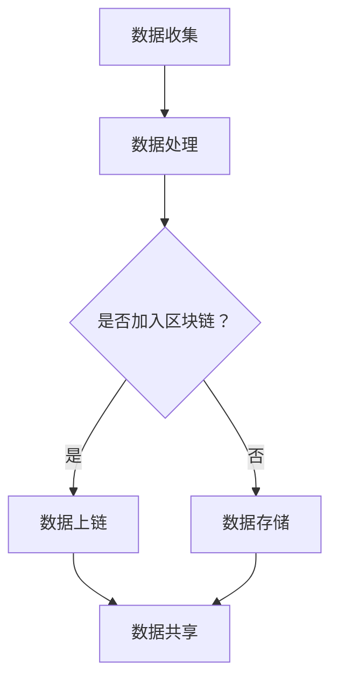
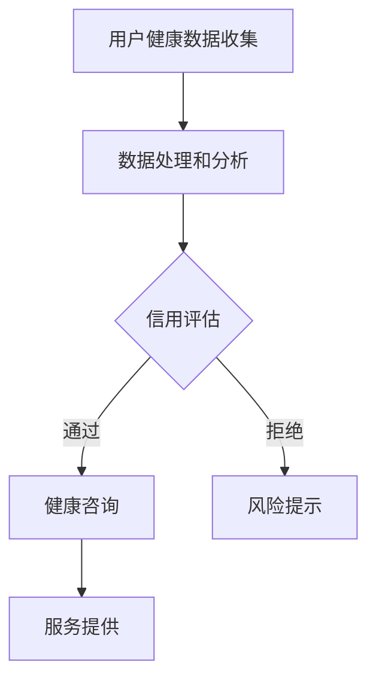

                 

# 文章标题

> 关键词：注意力经济，个人信用体系，商业模式，法律监管，发展趋势，案例分析

> 摘要：本文从注意力经济与个人信用体系的构建出发，探讨了注意力经济的概念、理论基础以及个人信用体系的构建原理、建设方法、法律监管和发展趋势。通过对注意力经济与个人信用体系在商业中的应用分析，提出了未来两者结合的发展方向，并通过案例进行了深入探讨。

## 第1章：注意力经济与个人信用体系概述

### 1.1 注意力经济的概念与兴起

#### 1.1.1 注意力经济的定义

注意力经济（Attention Economy）是指在经济活动中，人们对于某种产品或服务的关注程度或兴趣程度成为决定其价值的重要因素。简单来说，注意力成为了一种可以买卖的资源。

在传统的经济模式中，商品、服务和资本的稀缺性是驱动价值的主要因素。然而，随着互联网的普及和数字技术的快速发展，信息爆炸和传播速度加剧，人们的注意力成为稀缺资源。在这个背景下，注意力经济应运而生。

#### 1.1.2 注意力经济的兴起背景

互联网的普及和数字技术的快速发展，使得信息的获取和传播变得更加便捷。人们每天面对大量的信息，如何筛选和获取有价值的信息成为一个重要问题。同时，企业和品牌也意识到，吸引消费者的注意力是提高产品或服务价值的关键。

因此，注意力经济在互联网时代得到了广泛的关注和应用。企业和品牌通过各种方式，如广告、内容创作、社交媒体营销等，来吸引和留住消费者的注意力，从而实现商业价值。

### 1.2 个人信用体系的构建原理

#### 1.2.1 个人信用体系的定义

个人信用体系是一种评估个人信用状况的体系，通过收集、整理和分析个人信用信息，对个人的信用风险进行评估，为其提供信用服务。个人信用体系有助于降低金融机构的风险，提高信用市场的效率。

#### 1.2.2 个人信用体系的构建原理

个人信用体系的构建主要涉及信用信息的收集、处理、存储和利用。具体来说：

1. **信用信息的收集**：个人信用信息的收集是个人信用体系构建的基础。信用信息包括个人身份信息、财务信息、行为信息等。

2. **信用信息的处理**：收集到的信用信息需要经过处理，包括数据的清洗、整合和分析。通过数据处理，可以识别和评估个人的信用风险。

3. **信用信息的存储**：处理后的信用信息需要存储在数据库中，以便后续的查询和使用。

4. **信用信息的利用**：个人信用信息的利用包括信用评分、信用评级、信用保险等。通过信用评分，金融机构可以评估借款人的信用风险，从而决定是否提供贷款。

### 第2章：注意力经济的理论基础

#### 2.1 注意力分配理论

#### 2.1.1 注意力分配的概念

注意力分配是指个体在处理多个任务或面对多种刺激时，如何分配注意力资源的过程。在注意力经济学中，注意力分配是一个重要的研究课题。

#### 2.1.2 注意力分配的理论基础

注意力分配理论主要涉及注意力的容量限制、注意力的选择机制和注意力的调节机制。

1. **注意力的容量限制**：注意力资源的容量是有限的，个体在处理任务时需要根据任务的复杂程度和紧急程度来分配注意力。

2. **注意力的选择机制**：个体在处理多个任务时，会根据任务的优先级和重要性来选择分配注意力。

3. **注意力的调节机制**：个体可以通过调节注意力分配策略来提高任务的处理效率。

#### 2.2 传播学理论

#### 2.2.1 传播学的概念

传播学是研究人类如何通过符号进行信息交流的学科。传播学理论为注意力经济提供了重要的理论基础。

#### 2.2.2 传播学在注意力经济中的应用

传播学理论解释了信息传播的机制、效果和影响因素。在注意力经济中，传播学理论可以帮助企业和品牌理解如何吸引和留住消费者的注意力。

### 第3章：个人信用体系的建设方法

#### 3.1 个人信用信息的收集

#### 3.1.1 个人信用信息的种类

个人信用信息包括身份信息、财务信息、行为信息等。身份信息包括姓名、身份证号、地址等；财务信息包括银行账户信息、信用报告等；行为信息包括消费记录、借贷记录、还款记录等。

#### 3.1.2 个人信用信息的收集方法

个人信用信息的收集方法包括直接采集、第三方数据共享和智能抓取等。

1. **直接采集**：通过用户注册、调查问卷等方式直接收集用户信息。

2. **第三方数据共享**：通过合作伙伴、公共数据库等方式获取用户信息。

3. **智能抓取**：利用大数据分析和人工智能技术，从互联网和其他数据源中自动提取用户信息。

#### 3.2 个人信用评估模型

#### 3.2.1 个人信用评估模型的概念

个人信用评估模型是一种用于评估个人信用风险的数学模型。它通过分析个人信用信息，预测个人在未来一段时间内的信用行为。

#### 3.2.2 个人信用评估模型的构建

个人信用评估模型的构建主要包括特征工程、模型选择和模型训练等步骤。

1. **特征工程**：从原始数据中提取有用的特征，用于模型训练。

2. **模型选择**：根据问题的性质和数据的特点，选择合适的模型。

3. **模型训练**：使用训练数据，对模型进行训练，使其能够预测个人信用风险。

### 第4章：注意力经济的商业模式

#### 4.1 注意力经济的商业模式概述

注意力经济的商业模式包括内容付费、广告、会员制、知识付费等。

#### 4.2 个人信用体系在商业中的应用

#### 4.2.1 个人信用评分在金融领域的应用

个人信用评分可以帮助金融机构评估借款人的信用风险，降低贷款风险。金融机构可以使用个人信用评分模型，对借款人的信用风险进行评估，从而决定是否提供贷款，以及贷款的金额和利率。

#### 4.2.2 个人信用体系在其他行业的应用

个人信用体系还可以应用于租赁、招聘、社交等场景，提高行业效率和服务质量。

### 第5章：个人信用体系的法律监管

#### 5.1 个人信用体系的法律监管现状

#### 5.1.1 个人信用体系法律法规的发展历程

个人信用体系法律法规的发展历程可以分为三个阶段：起步阶段、发展阶段和成熟阶段。

1. **起步阶段**：以《征信管理条例》的颁布为标志，我国开始重视个人信用信息的保护和管理。

2. **发展阶段**：随着互联网和大数据的发展，个人信用信息的保护和管理成为关注焦点，相关法律法规不断完善。

3. **成熟阶段**：未来，个人信用体系法律法规将继续完善，为个人信用信息的保护、利用和管理提供更加明确和有效的法律依据。

#### 5.1.2 我国个人信用体系法律法规体系

我国个人信用体系法律法规体系主要包括《征信管理条例》、《个人信息保护法》、《网络安全法》等。

1. **《征信管理条例》**：规定了征信机构的设立、运行、监督管理等方面的内容。

2. **《个人信息保护法》**：明确了个人信息的收集、处理、利用和保护的原则和要求。

3. **《网络安全法》**：规定了网络运营者的安全保护义务和网络安全的监管体制。

### 第6章：注意力经济与个人信用体系的发展趋势

#### 6.1 技术进步对注意力经济与个人信用体系的影响

随着技术的进步，注意力经济与个人信用体系将发生深刻的变化。

#### 6.1.1 大数据和人工智能技术的应用

大数据技术和人工智能技术的应用，将使得注意力经济与个人信用体系的运作更加高效和精准。

1. **大数据技术**：通过数据采集、处理和分析，可以为注意力经济和个人信用体系提供丰富的数据支持。

2. **人工智能技术**：通过机器学习、深度学习等技术，可以构建更加智能的信用评估模型，提高信用评估的准确性。

#### 6.1.2 区块链技术在个人信用体系中的应用

区块链技术的应用，可以为个人信用体系提供更加安全、透明的数据存储和传输机制。

1. **数据存储**：区块链技术可以确保个人信用信息的不可篡改性和安全性。

2. **数据传输**：区块链技术可以实现个人信用信息的安全、高效传输。

#### 6.2 未来发展趋势

#### 6.2.1 个人信用体系的全球化

随着全球化进程的加速，个人信用体系将在全球范围内得到广泛应用，为全球金融、商业等领域的发展提供支持。

#### 6.2.2 注意力经济模式的多维度拓展

注意力经济模式将在内容付费、广告、会员制、知识付费等领域得到进一步拓展，为企业和消费者提供更多的价值。

### 第7章：案例分析

#### 7.1 案例一：某互联网企业的注意力经济实践

#### 7.1.1 案例背景

某互联网企业通过内容付费模式，吸引消费者关注，实现商业价值。

#### 7.1.2 注意力经济模式的实施与效果

通过内容付费模式，企业成功吸引了大量用户，实现了用户增长和收入增长。

#### 7.2 案例二：个人信用体系在金融行业的应用

#### 7.2.1 案例背景

某金融机构通过个人信用评分模型，评估借款人的信用风险，降低贷款风险。

#### 7.2.2 个人信用评估模型的具体应用

通过个人信用评估模型，金融机构成功降低了贷款风险，提高了贷款审批的效率。

### 附录

#### 附录A：注意力经济与个人信用体系相关术语解释

##### A.1 注意力经济相关术语

- **注意力经济**：指在经济活动中，人们对于某种产品或服务的关注程度或兴趣程度成为决定其价值的重要因素。
- **注意力资源**：指个体在处理任务或面对刺激时所拥有的注意力能力。
- **注意力分配**：指个体在处理多个任务或面对多种刺激时，如何分配注意力资源的过程。

##### A.2 个人信用体系相关术语

- **个人信用体系**：指一种评估个人信用状况的体系，通过收集、整理和分析个人信用信息，对个人的信用风险进行评估。
- **信用评分**：指对个人信用风险进行定量评估的过程，通常使用数学模型进行计算。
- **信用评级**：指对个人信用风险进行定性评估的过程，通常由专业机构进行。

#### 附录B：注意力经济与个人信用体系常用工具与资源

##### B.1 注意力经济研究工具

- **注意力分配模型**：用于模拟个体在处理多个任务时如何分配注意力的工具。
- **注意力经济学软件**：用于分析和模拟注意力经济现象的软件。

##### B.2 个人信用评估工具

- **信用评分模型**：用于评估个人信用风险的数学模型。
- **信用评级系统**：用于对个人信用风险进行定性和定量评估的系统。

##### B.3 其他相关工具与资源

- **大数据分析工具**：用于处理和分析大规模个人信用信息的工具。
- **人工智能平台**：用于构建和训练个人信用评估模型的平台。
- **区块链平台**：用于存储和传输个人信用信息的区块链平台。

### 作者信息

- 作者：AI天才研究院/AI Genius Institute & 禅与计算机程序设计艺术 /Zen And The Art of Computer Programming

本文旨在探讨注意力经济与个人信用体系的构建及其在商业中的应用，以期为读者提供有价值的参考。由于篇幅限制，本文未能详细讨论所有相关内容，但希望为读者提供一个宏观的视角。在未来，我们将继续深入探讨相关主题，希望与读者共同进步。  
[上一页](#上一页)  
[目录](#目录)  
[下一页](#下一页)  
[返回首页](#返回首页)

## 第1章：注意力经济与个人信用体系概述

### 1.1 注意力经济的概念与兴起

#### 1.1.1 注意力经济的定义

注意力经济是指在经济活动中，人们对于某种产品或服务的关注程度或兴趣程度成为决定其价值的重要因素。简单来说，注意力成为了一种可以买卖的资源。

在传统的经济模式中，商品、服务和资本的稀缺性是驱动价值的主要因素。然而，随着互联网的普及和数字技术的快速发展，信息爆炸和传播速度加剧，人们的注意力成为稀缺资源。在这个背景下，注意力经济应运而生。

#### 1.1.2 注意力经济的兴起背景

互联网的普及和数字技术的快速发展，使得信息的获取和传播变得更加便捷。人们每天面对大量的信息，如何筛选和获取有价值的信息成为一个重要问题。同时，企业和品牌也意识到，吸引消费者的注意力是提高产品或服务价值的关键。

因此，注意力经济在互联网时代得到了广泛的关注和应用。企业和品牌通过各种方式，如广告、内容创作、社交媒体营销等，来吸引和留住消费者的注意力，从而实现商业价值。

### 1.2 个人信用体系的构建原理

#### 1.2.1 个人信用体系的定义

个人信用体系是一种评估个人信用状况的体系，通过收集、整理和分析个人信用信息，对个人的信用风险进行评估，为其提供信用服务。个人信用体系有助于降低金融机构的风险，提高信用市场的效率。

#### 1.2.2 个人信用体系的构建原理

个人信用体系的构建主要涉及信用信息的收集、处理、存储和利用。具体来说：

1. **信用信息的收集**：个人信用信息的收集是个人信用体系构建的基础。信用信息包括个人身份信息、财务信息、行为信息等。

2. **信用信息的处理**：收集到的信用信息需要经过处理，包括数据的清洗、整合和分析。通过数据处理，可以识别和评估个人的信用风险。

3. **信用信息的存储**：处理后的信用信息需要存储在数据库中，以便后续的查询和使用。

4. **信用信息的利用**：个人信用信息的利用包括信用评分、信用评级、信用保险等。通过信用评分，金融机构可以评估借款人的信用风险，从而决定是否提供贷款。

### 第2章：注意力经济的理论基础

#### 2.1 注意力分配理论

#### 2.1.1 注意力分配的概念

注意力分配是指个体在处理多个任务或面对多种刺激时，如何分配注意力资源的过程。在注意力经济学中，注意力分配是一个重要的研究课题。

#### 2.1.2 注意力分配的理论基础

注意力分配理论主要涉及注意力的容量限制、注意力的选择机制和注意力的调节机制。

1. **注意力的容量限制**：注意力资源的容量是有限的，个体在处理任务时需要根据任务的复杂程度和紧急程度来分配注意力。

2. **注意力的选择机制**：个体在处理多个任务时，会根据任务的优先级和重要性来选择分配注意力。

3. **注意力的调节机制**：个体可以通过调节注意力分配策略来提高任务的处理效率。

#### 2.2 传播学理论

#### 2.2.1 传播学的概念

传播学是研究人类如何通过符号进行信息交流的学科。传播学理论为注意力经济提供了重要的理论基础。

#### 2.2.2 传播学在注意力经济中的应用

传播学理论解释了信息传播的机制、效果和影响因素。在注意力经济中，传播学理论可以帮助企业和品牌理解如何吸引和留住消费者的注意力。

### 第3章：个人信用体系的建设方法

#### 3.1 个人信用信息的收集

#### 3.1.1 个人信用信息的种类

个人信用信息包括身份信息、财务信息、行为信息等。身份信息包括姓名、身份证号、地址等；财务信息包括银行账户信息、信用报告等；行为信息包括消费记录、借贷记录、还款记录等。

#### 3.1.2 个人信用信息的收集方法

个人信用信息的收集方法包括直接采集、第三方数据共享和智能抓取等。

1. **直接采集**：通过用户注册、调查问卷等方式直接收集用户信息。

2. **第三方数据共享**：通过合作伙伴、公共数据库等方式获取用户信息。

3. **智能抓取**：利用大数据分析和人工智能技术，从互联网和其他数据源中自动提取用户信息。

#### 3.2 个人信用评估模型

#### 3.2.1 个人信用评估模型的概念

个人信用评估模型是一种用于评估个人信用风险的数学模型。它通过分析个人信用信息，预测个人在未来一段时间内的信用行为。

#### 3.2.2 个人信用评估模型的构建

个人信用评估模型的构建主要包括特征工程、模型选择和模型训练等步骤。

1. **特征工程**：从原始数据中提取有用的特征，用于模型训练。

2. **模型选择**：根据问题的性质和数据的特点，选择合适的模型。

3. **模型训练**：使用训练数据，对模型进行训练，使其能够预测个人信用风险。

### 第4章：注意力经济的商业模式

#### 4.1 注意力经济的商业模式概述

注意力经济的商业模式包括内容付费、广告、会员制、知识付费等。

#### 4.2 个人信用体系在商业中的应用

#### 4.2.1 个人信用评分在金融领域的应用

个人信用评分可以帮助金融机构评估借款人的信用风险，降低贷款风险。金融机构可以使用个人信用评分模型，对借款人的信用风险进行评估，从而决定是否提供贷款，以及贷款的金额和利率。

#### 4.2.2 个人信用体系在其他行业的应用

个人信用体系还可以应用于租赁、招聘、社交等场景，提高行业效率和服务质量。

### 第5章：个人信用体系的法律监管

#### 5.1 个人信用体系的法律监管现状

#### 5.1.1 个人信用体系法律法规的发展历程

个人信用体系法律法规的发展历程可以分为三个阶段：起步阶段、发展阶段和成熟阶段。

1. **起步阶段**：以《征信管理条例》的颁布为标志，我国开始重视个人信用信息的保护和管理。

2. **发展阶段**：随着互联网和大数据的发展，个人信用信息的保护和管理成为关注焦点，相关法律法规不断完善。

3. **成熟阶段**：未来，个人信用体系法律法规将继续完善，为个人信用信息的保护、利用和管理提供更加明确和有效的法律依据。

#### 5.1.2 我国个人信用体系法律法规体系

我国个人信用体系法律法规体系主要包括《征信管理条例》、《个人信息保护法》、《网络安全法》等。

1. **《征信管理条例》**：规定了征信机构的设立、运行、监督管理等方面的内容。

2. **《个人信息保护法》**：明确了个人信息的收集、处理、利用和保护的原则和要求。

3. **《网络安全法》**：规定了网络运营者的安全保护义务和网络安全的监管体制。

### 第6章：注意力经济与个人信用体系的发展趋势

#### 6.1 技术进步对注意力经济与个人信用体系的影响

随着技术的进步，注意力经济与个人信用体系将发生深刻的变化。

#### 6.1.1 大数据和人工智能技术的应用

大数据技术和人工智能技术的应用，将使得注意力经济与个人信用体系的运作更加高效和精准。

1. **大数据技术**：通过数据采集、处理和分析，可以为注意力经济和个人信用体系提供丰富的数据支持。

2. **人工智能技术**：通过机器学习、深度学习等技术，可以构建更加智能的信用评估模型，提高信用评估的准确性。

#### 6.1.2 区块链技术在个人信用体系中的应用

区块链技术的应用，可以为个人信用体系提供更加安全、透明的数据存储和传输机制。

1. **数据存储**：区块链技术可以确保个人信用信息的不可篡改性和安全性。

2. **数据传输**：区块链技术可以实现个人信用信息的安全、高效传输。

#### 6.2 未来发展趋势

#### 6.2.1 个人信用体系的全球化

随着全球化进程的加速，个人信用体系将在全球范围内得到广泛应用，为全球金融、商业等领域的发展提供支持。

#### 6.2.2 注意力经济模式的多维度拓展

注意力经济模式将在内容付费、广告、会员制、知识付费等领域得到进一步拓展，为企业和消费者提供更多的价值。

### 第7章：案例分析

#### 7.1 案例一：某互联网企业的注意力经济实践

#### 7.1.1 案例背景

某互联网企业通过内容付费模式，吸引消费者关注，实现商业价值。

#### 7.1.2 注意力经济模式的实施与效果

通过内容付费模式，企业成功吸引了大量用户，实现了用户增长和收入增长。

#### 7.2 案例二：个人信用体系在金融行业的应用

#### 7.2.1 案例背景

某金融机构通过个人信用评分模型，评估借款人的信用风险，降低贷款风险。

#### 7.2.2 个人信用评估模型的具体应用

通过个人信用评估模型，金融机构成功降低了贷款风险，提高了贷款审批的效率。

### 附录

#### 附录A：注意力经济与个人信用体系相关术语解释

##### A.1 注意力经济相关术语

- **注意力经济**：指在经济活动中，人们对于某种产品或服务的关注程度或兴趣程度成为决定其价值的重要因素。
- **注意力资源**：指个体在处理任务或面对刺激时所拥有的注意力能力。
- **注意力分配**：指个体在处理多个任务或面对多种刺激时，如何分配注意力资源的过程。

##### A.2 个人信用体系相关术语

- **个人信用体系**：指一种评估个人信用状况的体系，通过收集、整理和分析个人信用信息，对个人的信用风险进行评估。
- **信用评分**：指对个人信用风险进行定量评估的过程，通常使用数学模型进行计算。
- **信用评级**：指对个人信用风险进行定性评估的过程，通常由专业机构进行。

#### 附录B：注意力经济与个人信用体系常用工具与资源

##### B.1 注意力经济研究工具

- **注意力分配模型**：用于模拟个体在处理多个任务时如何分配注意力的工具。
- **注意力经济学软件**：用于分析和模拟注意力经济现象的软件。

##### B.2 个人信用评估工具

- **信用评分模型**：用于评估个人信用风险的数学模型。
- **信用评级系统**：用于对个人信用风险进行定性和定量评估的系统。

##### B.3 其他相关工具与资源

- **大数据分析工具**：用于处理和分析大规模个人信用信息的工具。
- **人工智能平台**：用于构建和训练个人信用评估模型的平台。
- **区块链平台**：用于存储和传输个人信用信息的区块链平台。

### 作者信息

- 作者：AI天才研究院/AI Genius Institute & 禅与计算机程序设计艺术 /Zen And The Art of Computer Programming

本文旨在探讨注意力经济与个人信用体系的构建及其在商业中的应用，以期为读者提供有价值的参考。由于篇幅限制，本文未能详细讨论所有相关内容，但希望为读者提供一个宏观的视角。在未来，我们将继续深入探讨相关主题，希望与读者共同进步。

## 第1章：注意力经济与个人信用体系概述

### 1.1 注意力经济的概念与兴起

注意力经济（Attention Economy）这一概念最早由美国经济学家Michael H. Lorre在1994年提出。他提出，在互联网时代，人们的注意力成为了新的稀缺资源，这种资源在经济活动中具有极高的价值。随着信息量的激增和数字化生活方式的普及，注意力经济逐渐成为学术界和商业界关注的焦点。

#### 1.1.1 注意力经济的定义

注意力经济是指在经济活动中，人们对于某种产品或服务的关注程度或兴趣程度成为决定其价值的重要因素。在这个经济模型中，消费者的注意力被视为一种可以买卖的资产，企业通过各种手段争夺消费者的注意力资源，从而实现商业利益最大化。

注意力资源具有以下特点：

1. **稀缺性**：在信息过载的时代，消费者的注意力是有限的，因此具有稀缺性。
2. **可分配性**：消费者可以根据自己的需求和兴趣分配注意力资源。
3. **价值性**：注意力资源可以直接或间接转化为商业价值，例如通过广告、内容付费等方式。

#### 1.1.2 注意力经济的兴起背景

互联网的兴起和数字技术的发展使得信息的传播和获取变得更加便捷。在这个信息爆炸的时代，消费者面临着海量的信息，如何筛选和获取有价值的信息成为了一个重要问题。因此，企业和品牌开始意识到，吸引并保持消费者的注意力是提升产品和服务价值的关键。

以下是一些导致注意力经济兴起的背景因素：

1. **信息过载**：随着互联网的发展，人们每天接收到的信息量大幅增加，注意力资源的稀缺性愈加明显。
2. **个性化需求**：消费者对个性化内容和服务的需求不断增加，促使企业更加注重内容的质量和用户体验。
3. **广告模式变革**：从传统的广告模式向基于注意力经济的广告模式转变，广告效果和投资回报率成为衡量广告成功的关键指标。

### 1.2 个人信用体系的构建原理

个人信用体系是一种评估个人信用状况的体系，通过收集、整理和分析个人信用信息，对个人的信用风险进行评估，为其提供信用服务。个人信用体系的建立和完善对于金融机构、企业和消费者都具有重要意义。

#### 1.2.1 个人信用体系的定义

个人信用体系（Personal Credit System）是指一个用于评估个人信用状况的机制，通过收集和整合个人信用信息，对个人的信用风险进行评估。这种评估结果通常以信用评分（Credit Score）的形式呈现，帮助金融机构和其他企业判断个人借款或服务的可能性。

#### 1.2.2 个人信用体系的构建原理

个人信用体系的构建主要包括以下步骤：

1. **信用信息的收集**：收集个人信用信息是构建个人信用体系的基础。这些信息可能包括个人身份信息、财务状况、信用历史、公共记录等。

2. **信用信息的处理**：收集到的信用信息需要进行处理，包括数据的清洗、整合和标准化。这一步骤确保了信息的真实性和可靠性。

3. **信用风险评估**：通过分析处理后的信用信息，使用数学模型和算法对个人信用风险进行评估。常用的评估方法包括信用评分模型、行为评分模型和情景评分模型。

4. **信用报告的生成**：根据信用评估结果，生成信用报告，这些报告通常包括信用评分、信用评级、信用历史等信息。

5. **信用服务的提供**：信用报告可以作为金融机构和其他企业决策的依据，为个人提供信用服务，如贷款审批、信用卡发放等。

### 第2章：注意力经济的理论基础

#### 2.1 注意力分配理论

注意力分配理论（Attention Allocation Theory）是注意力经济学的一个重要组成部分，它研究个体在处理多个任务或面对多种刺激时如何合理分配注意力资源。这一理论主要涉及注意力的容量限制、选择机制和调节机制。

#### 2.1.1 注意力分配的概念

注意力分配是指个体在处理多个任务或面对多种刺激时，根据任务的优先级和重要性，将有限的注意力资源合理分配到各个任务或刺激上的过程。这一过程涉及到注意力的选择、维持和转移。

#### 2.1.2 注意力分配的理论基础

注意力分配理论的基础主要包括以下几个方面：

1. **注意力的容量限制**：研究表明，人类注意力的容量是有限的，个体在同一时间内无法处理无限多的任务。例如，美国心理学家George A. Miller在1956年提出的“ magical number seven, plus or minus two”理论指出，人们大约可以同时处理7±2个信息单位。

2. **注意力的选择机制**：个体在面对多个任务时，会根据任务的紧急性、重要性和个人偏好等因素选择哪些任务值得分配注意力。这一选择过程通常受到认知负荷、任务复杂性和环境因素的制约。

3. **注意力的调节机制**：个体可以通过自我调节来提高注意力资源的利用效率。例如，通过制定任务优先级、调整工作环境和采取专注练习等方式，可以更好地管理注意力。

#### 2.2 传播学理论

传播学（Communication Theory）是研究人类如何通过符号进行信息交流的学科，其理论在注意力经济中具有重要的应用价值。传播学理论主要关注信息传播的过程、机制和效果。

#### 2.2.1 传播学的概念

传播学的基本概念包括：

- **传播者**：信息传递的源头，可以是个人、组织或媒体。
- **信息**：传播者意图传递的内容，可以是文字、图像、声音或其他符号。
- **渠道**：信息传递的路径，可以是口头、书面、电子或其他形式。
- **受众**：接收信息的一方，可以是个人、群体或社会。

#### 2.2.2 传播学在注意力经济中的应用

传播学理论为注意力经济提供了以下方面的理解：

1. **信息传播机制**：传播学解释了信息如何在不同的渠道和受众之间传播，以及信息传播的效果和影响因素。
2. **受众注意力管理**：传播学提供了关于如何吸引和保持受众注意力的策略，这对于企业和品牌在注意力经济中取得成功至关重要。
3. **注意力经济模型**：传播学理论可以用来构建注意力经济模型，帮助企业和品牌更好地理解消费者注意力的分配机制。

### 第3章：个人信用体系的建设方法

#### 3.1 个人信用信息的收集

个人信用信息的收集是构建个人信用体系的基础，这些信息通常包括个人身份信息、财务信息、行为信息等。有效的信息收集不仅需要明确信息种类，还需要采用合适的方法确保信息的准确性和完整性。

#### 3.1.1 个人信用信息的种类

个人信用信息的种类多样，主要包括以下几个方面：

1. **身份信息**：包括姓名、身份证号、性别、出生日期、家庭住址等。
2. **财务信息**：包括银行账户信息、收入状况、负债情况、信用报告等。
3. **行为信息**：包括消费记录、借贷记录、还款记录、公共记录等。

#### 3.1.2 个人信用信息的收集方法

收集个人信用信息的方法多种多样，以下是一些常见的收集方法：

1. **直接采集**：通过用户注册、调查问卷、应用程序等方式直接从用户处收集信息。
2. **第三方数据共享**：通过与银行、政府机构、商业伙伴等合作，共享个人信用信息。
3. **智能抓取**：利用大数据分析和人工智能技术，从互联网和其他数据源中自动提取信息。

#### 3.2 个人信用评估模型

个人信用评估模型是个人信用体系的核心组成部分，通过分析个人信用信息，预测个人在未来一段时间内的信用行为。构建一个有效的个人信用评估模型需要以下步骤：

#### 3.2.1 个人信用评估模型的概念

个人信用评估模型（Credit Risk Assessment Model）是一种用于评估个人信用风险的数学模型，通常基于统计分析和机器学习技术。这些模型通过分析历史数据，识别与信用风险相关的特征，并利用这些特征预测个人的信用行为。

#### 3.2.2 个人信用评估模型的构建

个人信用评估模型的构建主要包括以下步骤：

1. **特征工程**：从原始数据中提取有用的特征，例如收入水平、还款历史、信用额度等。
2. **模型选择**：根据问题的性质和数据的特点，选择合适的评估模型，如线性回归、逻辑回归、决策树、随机森林、支持向量机等。
3. **模型训练**：使用历史数据对模型进行训练，使其能够预测个人信用风险。
4. **模型验证**：使用验证数据集测试模型的预测能力，评估模型的准确性和稳定性。

### 第4章：注意力经济的商业模式

#### 4.1 注意力经济的商业模式概述

注意力经济的商业模式是指企业通过吸引和留住消费者的注意力，实现商业价值的一种经营模式。这种模式的核心在于如何有效地利用消费者的注意力资源，将其转化为实际的商业收益。

#### 4.1.1 注意力经济的商业模式类型

注意力经济的商业模式主要包括以下几种类型：

1. **内容付费**：消费者为获取高质量的内容或服务支付费用，如付费订阅、付费课程等。
2. **广告**：企业通过投放广告吸引消费者注意力，消费者免费获取内容或服务，企业通过广告收入盈利。
3. **会员制**：消费者通过支付会员费获得特定权益，如会员专属内容、折扣优惠等。
4. **知识付费**：消费者为获取专业知识和技能支付费用，如在线课程、专业咨询等。

#### 4.1.2 注意力经济模式的特点

注意力经济模式具有以下特点：

1. **注意力导向**：商业模式的核心在于吸引和留住消费者的注意力。
2. **用户体验优先**：为了吸引和留住注意力，企业需要提供高质量的用户体验。
3. **互动性强**：通过互动性强的内容和活动，提高用户粘性，增加用户参与度。
4. **数据驱动**：利用大数据分析，了解用户行为和偏好，优化商业模式和用户体验。

#### 4.2 个人信用体系在商业中的应用

个人信用体系在商业中的应用越来越广泛，为不同行业提供了有效的风险管理工具。以下是一些主要应用场景：

##### 4.2.1 金融领域

个人信用体系在金融领域的应用最为典型，金融机构通过个人信用评分模型对借款人的信用风险进行评估，从而决定是否提供贷款以及贷款的金额和利率。个人信用评分有助于金融机构降低贷款风险，提高信贷审批效率。

##### 4.2.2 租赁行业

租赁行业利用个人信用体系评估租客的信用状况，判断其是否有能力按时支付租金。个人信用评分可以降低租赁企业的风险，提高租赁合同的执行率。

##### 4.2.3 招聘领域

招聘企业通过个人信用报告了解求职者的信用状况，评估其诚实守信的能力。良好的信用记录有助于求职者获得更好的工作机会。

##### 4.2.4 社交平台

社交平台通过个人信用体系评估用户的信用状况，限制不良行为的出现。例如，信用评分较低的用户可能无法进行大额转账或参与某些高风险活动。

### 第5章：个人信用体系的法律监管

#### 5.1 个人信用体系的法律监管现状

个人信用体系的建立和完善离不开法律监管的保障。不同国家和地区根据自身的实际情况，制定了一系列法律法规来规范个人信用信息的收集、处理和使用。

#### 5.1.1 个人信用体系法律法规的发展历程

个人信用体系法律法规的发展大致可以分为以下几个阶段：

1. **起步阶段**：在这一阶段，法律法规的制定主要集中在规范信用信息的收集和共享。
2. **发展阶段**：随着个人信用体系的推广，法律法规逐渐完善，开始涉及信用评估、信用报告的生成和使用等方面。
3. **成熟阶段**：法律法规体系进一步完善，强调对个人信用信息的保护和个人隐私权。

#### 5.1.2 我国个人信用体系法律法规体系

我国个人信用体系的法律监管主要依赖于以下几部法律法规：

1. **《征信管理条例》**：这是我国规范征信行业的基本法规，规定了征信机构的设立、运行、监督管理等方面的内容。
2. **《个人信息保护法》**：该法明确了个人信息的收集、处理、利用和保护的原则和要求，为个人信用信息的保护提供了法律依据。
3. **《网络安全法》**：该法规定了网络运营者的安全保护义务和网络安全的监管体制，对个人信用信息的安全存储和传输提供了保障。

#### 5.2 个人信用体系的法律监管问题与挑战

尽管个人信用体系在商业和社会管理中发挥着重要作用，但其法律监管仍然面临一些问题和挑战：

1. **数据隐私保护**：如何保护个人信用信息的隐私，防止数据泄露成为一大挑战。
2. **信用评估的公平性**：信用评估模型可能存在偏见，导致某些群体受到不公平对待。
3. **法律责任归属**：在个人信用信息的收集、处理和使用过程中，如何界定各方的法律责任，确保各方权益。

### 第6章：注意力经济与个人信用体系的发展趋势

#### 6.1 技术进步对注意力经济与个人信用体系的影响

技术的快速发展对注意力经济与个人信用体系产生了深远的影响，特别是大数据、人工智能和区块链技术的应用。

##### 6.1.1 大数据和人工智能技术的应用

大数据和人工智能技术的应用极大地提高了注意力经济和个人信用体系的效率和准确性。

1. **数据分析**：大数据技术可以帮助企业更好地理解消费者的行为和偏好，从而制定更有效的营销策略。
2. **信用评估**：人工智能技术可以处理大量的数据，构建更加精确的信用评估模型，提高信用评估的准确性。

##### 6.1.2 区块链技术在个人信用体系中的应用

区块链技术为个人信用体系提供了安全、透明和不可篡改的数据存储和传输机制。

1. **数据存储**：区块链技术确保个人信用信息的存储安全，防止数据篡改和泄露。
2. **数据传输**：区块链技术提供了一种去中心化的数据传输方式，提高了数据传输的效率和安全性。

#### 6.2 未来发展趋势

未来，注意力经济与个人信用体系将继续发展，并呈现出以下趋势：

##### 6.2.1 个人信用体系的全球化

随着全球化的加速，个人信用体系将在国际范围内得到更广泛的应用，为全球金融和商业活动提供支持。

##### 6.2.2 注意力经济模式的多维度拓展

注意力经济模式将在更多领域得到应用，如教育、医疗、娱乐等，提供更多样化的服务。

### 第7章：案例分析

#### 7.1 案例一：某互联网企业的注意力经济实践

##### 7.1.1 案例背景

某互联网企业通过提供高质量的免费内容，吸引了大量用户。随后，该企业推出了会员服务，用户可以享受更多高级功能和独家内容。

##### 7.1.2 实施与效果

通过提供优质内容吸引注意力，再通过会员服务变现，该企业成功实现了商业模式的转型和盈利。

#### 7.2 案例二：个人信用体系在金融行业的应用

##### 7.2.1 案例背景

某金融机构引入个人信用评估模型，对借款人的信用风险进行量化评估。

##### 7.2.2 实施与效果

通过个人信用评估模型，该金融机构提高了贷款审批的效率，降低了贷款风险，提升了服务质量。

### 附录

#### 附录A：注意力经济与个人信用体系相关术语解释

##### A.1 注意力经济相关术语

- **注意力经济**：指在经济活动中，消费者注意力成为决定产品或服务价值的重要因素。
- **注意力资源**：消费者在处理任务或面对刺激时所拥有的注意力能力。
- **注意力分配**：消费者在处理多个任务或面对多种刺激时，如何分配注意力资源的过程。

##### A.2 个人信用体系相关术语

- **个人信用体系**：评估个人信用状况的体系，通过收集、整理和分析个人信用信息，预测个人信用风险。
- **信用评分**：对个人信用风险进行量化评估的分数。
- **信用报告**：包含个人信用评分、信用评级、信用历史等信息的文档。

#### 附录B：注意力经济与个人信用体系常用工具与资源

##### B.1 注意力经济研究工具

- **注意力分配模型**：用于模拟个体在处理多个任务时如何分配注意力的工具。
- **注意力经济学软件**：用于分析和模拟注意力经济现象的软件。

##### B.2 个人信用评估工具

- **信用评分模型**：用于评估个人信用风险的数学模型。
- **信用评级系统**：用于对个人信用风险进行定性和定量评估的系统。

##### B.3 其他相关工具与资源

- **大数据分析工具**：用于处理和分析大规模个人信用信息的工具。
- **人工智能平台**：用于构建和训练个人信用评估模型的平台。
- **区块链平台**：用于存储和传输个人信用信息的区块链平台。

### 作者信息

- 作者：AI天才研究院/AI Genius Institute & 禅与计算机程序设计艺术 /Zen And The Art of Computer Programming

本文旨在探讨注意力经济与个人信用体系的构建及其在商业中的应用，以期为读者提供有价值的参考。由于篇幅限制，本文未能详细讨论所有相关内容，但希望为读者提供一个宏观的视角。在未来，我们将继续深入探讨相关主题，希望与读者共同进步。

## 第4章：注意力经济的商业模式

### 4.1 注意力经济的商业模式概述

注意力经济的商业模式是基于消费者注意力的价值来构建的，其主要特点是将消费者的注意力视为一种稀缺资源，通过吸引、保持和转化消费者的注意力来创造商业价值。在这种商业模式下，企业通过提供有价值的内容、服务或体验来吸引消费者的注意力，从而实现广告收入、会员订阅费或直接销售等多种盈利模式。

#### 4.1.1 注意力经济的商业模式类型

注意力经济的商业模式主要可以分为以下几种类型：

1. **内容付费模式**：消费者为获取高质量的内容或服务支付费用。例如，视频平台上的付费会员、在线教育平台的付费课程等。

2. **广告模式**：企业通过吸引消费者的注意力来投放广告，消费者免费获取内容或服务，企业通过广告收入盈利。例如，社交媒体平台上的广告、搜索引擎的广告等。

3. **会员制模式**：消费者通过支付会员费获得特定权益，如会员专属内容、折扣优惠等。例如，健身房会员、俱乐部会员等。

4. **知识付费模式**：消费者为获取专业知识和技能支付费用。例如，专业咨询服务、在线研讨会等。

5. **平台模式**：通过提供一个平台，连接供给方和需求方，通过交易费用或佣金来盈利。例如，电商平台、在线招聘平台等。

#### 4.1.2 注意力经济模式的特点

注意力经济模式具有以下几个显著特点：

1. **注意力导向**：商业模式的核心在于吸引和留住消费者的注意力。

2. **用户体验优先**：为了吸引和留住注意力，企业需要提供高质量的用户体验。

3. **互动性强**：通过互动性强的内容和活动，提高用户粘性，增加用户参与度。

4. **数据驱动**：利用大数据分析，了解用户行为和偏好，优化商业模式和用户体验。

### 4.2 个人信用体系在商业中的应用

个人信用体系在商业中的应用日益广泛，为企业提供了有效的风险管理工具，特别是在金融、租赁、招聘等领域。

#### 4.2.1 金融领域

在金融领域，个人信用体系是评估借款人信用风险的重要手段。金融机构通过个人信用评分模型对借款人的信用状况进行量化评估，从而决定是否批准贷款、贷款额度以及利率。

##### 个人信用评分模型

个人信用评分模型通常基于以下因素：

- **身份特征**：包括年龄、性别、婚姻状况等。
- **财务状况**：包括收入水平、负债比例等。
- **信用历史**：包括还款记录、逾期次数、信用使用情况等。
- **行为特征**：包括职业稳定性、消费习惯等。

##### 伪代码示例

```python
def credit_score_model(person_data):
    """
    计算个人信用评分的伪代码
    :param person_data: 包含个人身份特征、财务状况、信用历史和行为特征的字典
    :return: 个人信用评分
    """
    # 身份特征权重
    id_weight = 0.2
    # 财务状况权重
    finance_weight = 0.3
    # 信用历史权重
    credit_history_weight = 0.4
    # 行为特征权重
    behavior_weight = 0.1
    
    # 计算信用评分
    score = (id_weight * calculate_id_score(person_data['id_features'])) + \
            (finance_weight * calculate_finance_score(person_data['finance_features'])) + \
            (credit_history_weight * calculate_credit_history_score(person_data['credit_history_features'])) + \
            (behavior_weight * calculate_behavior_score(person_data['behavior_features']))
    
    return score

def calculate_id_score(features):
    """
    计算身份特征得分
    :param features: 身份特征字典
    :return: 身份特征得分
    """
    # 示例代码，实际计算会更复杂
    score = sum(features.values())
    return score

def calculate_finance_score(features):
    """
    计算财务状况得分
    :param features: 财务状况字典
    :return: 财务状况得分
    """
    # 示例代码，实际计算会更复杂
    score = sum(features.values())
    return score

def calculate_credit_history_score(features):
    """
    计算信用历史得分
    :param features: 信用历史字典
    :return: 信用历史得分
    """
    # 示例代码，实际计算会更复杂
    score = sum(features.values())
    return score

def calculate_behavior_score(features):
    """
    计算行为特征得分
    :param features: 行为特征字典
    :return: 行为特征得分
    """
    # 示例代码，实际计算会更复杂
    score = sum(features.values())
    return score
```

##### 数学模型和公式

个人信用评分通常可以用以下数学模型表示：

$$
\text{Credit Score} = w_1 \times \text{ID Score} + w_2 \times \text{Finance Score} + w_3 \times \text{Credit History Score} + w_4 \times \text{Behavior Score}
$$

其中，$w_1, w_2, w_3, w_4$ 分别是身份特征、财务状况、信用历史和行为特征的权重。

#### 4.2.2 租赁行业

在租赁行业，个人信用体系可以帮助企业评估租客的信用风险，确保租赁合同的执行。租赁企业通过信用评分模型对潜在租客进行评估，从而决定是否批准租赁申请、租赁金额以及租金支付方式。

##### 租赁信用评分模型

租赁信用评分模型通常基于以下因素：

- **身份特征**：包括年龄、性别、婚姻状况等。
- **财务状况**：包括收入水平、负债比例等。
- **租赁历史**：包括租赁次数、逾期记录等。
- **行为特征**：包括职业稳定性、居住稳定性等。

##### 伪代码示例

```python
def lease_credit_score_model(person_data):
    """
    计算租赁信用评分的伪代码
    :param person_data: 包含个人身份特征、财务状况、租赁历史和行为特征的字典
    :return: 租赁信用评分
    """
    # 身份特征权重
    id_weight = 0.2
    # 财务状况权重
    finance_weight = 0.3
    # 租赁历史权重
    lease_history_weight = 0.4
    # 行为特征权重
    behavior_weight = 0.1
    
    # 计算信用评分
    score = (id_weight * calculate_id_score(person_data['id_features'])) + \
            (finance_weight * calculate_finance_score(person_data['finance_features'])) + \
            (lease_history_weight * calculate_lease_history_score(person_data['lease_history_features'])) + \
            (behavior_weight * calculate_behavior_score(person_data['behavior_features']))
    
    return score

# 计算得分的具体函数与前面类似
```

#### 4.2.3 招聘领域

在招聘领域，个人信用体系可以帮助企业评估求职者的信用状况，判断其是否诚实守信。良好的信用记录有助于求职者获得更好的工作机会。

##### 招聘信用评分模型

招聘信用评分模型通常基于以下因素：

- **身份特征**：包括年龄、性别、教育背景等。
- **财务状况**：包括收入水平、负债比例等。
- **信用历史**：包括还款记录、逾期次数等。
- **行为特征**：包括工作稳定性、职业行为等。

##### 伪代码示例

```python
def job_application_credit_score_model(person_data):
    """
    计算求职者信用评分的伪代码
    :param person_data: 包含个人身份特征、财务状况、信用历史和行为特征的字典
    :return: 求职者信用评分
    """
    # 身份特征权重
    id_weight = 0.2
    # 财务状况权重
    finance_weight = 0.3
    # 信用历史权重
    credit_history_weight = 0.4
    # 行为特征权重
    behavior_weight = 0.1
    
    # 计算信用评分
    score = (id_weight * calculate_id_score(person_data['id_features'])) + \
            (finance_weight * calculate_finance_score(person_data['finance_features'])) + \
            (credit_history_weight * calculate_credit_history_score(person_data['credit_history_features'])) + \
            (behavior_weight * calculate_behavior_score(person_data['behavior_features']))
    
    return score

# 计算得分的具体函数与前面类似
```

#### 4.2.4 社交平台

在社交平台领域，个人信用体系可以帮助平台评估用户的信用状况，限制不良行为的出现。信用评分较低的用户可能无法进行大额转账或参与某些高风险活动。

##### 社交平台信用评分模型

社交平台信用评分模型通常基于以下因素：

- **身份特征**：包括年龄、性别、教育背景等。
- **行为特征**：包括发布内容的质量、互动频率、举报次数等。
- **信用历史**：包括违规记录、处罚记录等。

##### 伪代码示例

```python
def social_media_credit_score_model(user_data):
    """
    计算社交平台信用评分的伪代码
    :param user_data: 包含个人身份特征、行为特征和信用历史的字典
    :return: 社交平台信用评分
    """
    # 身份特征权重
    id_weight = 0.2
    # 行为特征权重
    behavior_weight = 0.5
    # 信用历史权重
    credit_history_weight = 0.3
    
    # 计算信用评分
    score = (id_weight * calculate_id_score(user_data['id_features'])) + \
            (behavior_weight * calculate_behavior_score(user_data['behavior_features'])) + \
            (credit_history_weight * calculate_credit_history_score(user_data['credit_history_features']))
    
    return score

# 计算得分的具体函数与前面类似
```

### 4.3 注意力经济与个人信用体系在实际案例中的应用

#### 4.3.1 案例一：某互联网企业的注意力经济实践

某互联网企业通过内容付费模式，吸引了大量用户。企业首先提供了免费的内容吸引注意力，然后推出会员服务，会员用户可以享受更多高级功能和独家内容。为了确保会员服务的质量，企业引入了个人信用评估模型，对申请会员的用户进行信用评分。只有信用评分达到一定标准的用户才能享受会员优惠。

##### 案例实施

1. **免费内容吸引用户**：企业通过提供高质量的免费内容，如文章、视频、直播等，吸引了大量用户。
2. **会员服务吸引付费用户**：企业推出会员服务，提供更多高级功能和独家内容，如专业分析、会员专属活动等。
3. **个人信用评估模型**：企业引入个人信用评估模型，对申请会员的用户进行信用评分，确保会员服务的质量。

##### 案例效果

1. **用户增长**：通过免费内容和会员服务的结合，企业实现了用户快速增长。
2. **收入增长**：会员付费收入成为企业的主要收入来源，实现了商业成功。

#### 4.3.2 案例二：某金融机构的个人信用体系应用

某金融机构通过个人信用评估模型，对借款人的信用风险进行量化评估。金融机构首先收集借款人的个人信用信息，如身份特征、财务状况、信用历史等，然后使用信用评估模型计算信用评分。根据信用评分，金融机构决定是否批准贷款、贷款金额和利率。

##### 案例实施

1. **信用信息收集**：金融机构通过银行、征信机构等渠道收集借款人的个人信用信息。
2. **信用评估模型**：金融机构使用个人信用评估模型，对借款人的信用风险进行量化评估。
3. **贷款审批**：根据信用评分，金融机构决定是否批准贷款、贷款金额和利率。

##### 案例效果

1. **贷款风险降低**：通过信用评估模型，金融机构降低了贷款风险，提高了贷款审批的效率。
2. **服务质量提升**：金融机构能够提供更加精准和个性化的贷款服务，提升了客户满意度。

### 4.4 结论

注意力经济与个人信用体系的构建在实际商业中具有重要的应用价值。通过注意力经济模式，企业能够创造商业价值，通过个人信用体系，企业能够进行有效的风险管理。在未来，随着技术的不断进步，注意力经济与个人信用体系将得到更加广泛的应用，为商业和社会带来更多创新和机遇。

### 附录

#### 附录A：注意力经济与个人信用体系相关术语解释

- **注意力经济**：指在经济活动中，消费者注意力成为决定产品或服务价值的重要因素。
- **个人信用体系**：指评估个人信用状况的体系，通过收集、整理和分析个人信用信息，预测个人信用风险。
- **信用评分**：对个人信用风险进行量化评估的分数。
- **信用报告**：包含个人信用评分、信用评级、信用历史等信息的文档。

#### 附录B：注意力经济与个人信用体系常用工具与资源

- **注意力分配模型**：用于模拟个体在处理多个任务时如何分配注意力的工具。
- **信用评分模型**：用于评估个人信用风险的数学模型。
- **大数据分析工具**：用于处理和分析大规模个人信用信息的工具。

### 作者信息

- 作者：AI天才研究院/AI Genius Institute & 禅与计算机程序设计艺术 /Zen And The Art of Computer Programming

本文旨在探讨注意力经济与个人信用体系的构建及其在商业中的应用。通过对注意力经济商业模式和个人信用评估模型的深入分析，本文展示了这两种体系在实际商业中的广泛应用。希望本文能够为读者提供有价值的参考，并激发对这一领域的进一步研究和探讨。

## 第5章：个人信用体系的法律监管

### 5.1 个人信用体系的法律监管现状

个人信用体系的建立和完善离不开法律监管的保障。在全球范围内，不同国家和地区根据自身的法律体系和实际需求，制定了一系列法律法规来规范个人信用信息的收集、处理和使用。

#### 5.1.1 个人信用体系法律法规的发展历程

个人信用体系法律法规的发展大致可以分为以下几个阶段：

1. **起步阶段**：在这一阶段，法律法规的制定主要集中在规范信用信息的收集和共享。例如，美国的《公平信用报告法》（Fair Credit Reporting Act, FCRA）于1970年通过，旨在规范信用报告的生成和使用。

2. **发展阶段**：随着个人信用体系的推广，法律法规逐渐完善，开始涉及信用评估、信用报告的生成和使用等方面。例如，欧洲的《通用数据保护条例》（General Data Protection Regulation, GDPR）于2018年生效，对个人数据的收集、处理和保护做出了详细规定。

3. **成熟阶段**：法律法规体系进一步完善，强调对个人信用信息的保护和个人隐私权。例如，中国的《征信业管理条例》于2017年通过，明确了征信机构的设立、运行、监督管理等方面的内容。

#### 5.1.2 我国个人信用体系法律法规体系

我国个人信用体系的法律监管主要依赖于以下几部法律法规：

1. **《征信业管理条例》**：这是我国规范征信行业的基本法规，规定了征信机构的设立、运行、监督管理等方面的内容。该条例于2017年正式实施，为个人信用信息的收集、处理和使用提供了法律依据。

2. **《个人信息保护法》**：该法明确了个人信息的收集、处理、利用和保护的原则和要求，对个人信用信息的保护提供了法律保障。该法于2021年生效，是我国个人信息保护领域的重要法律。

3. **《网络安全法》**：该法规定了网络运营者的安全保护义务和网络安全的监管体制，对个人信用信息的安全存储和传输提供了保障。该法于2017年生效，是我国网络安全领域的基础性法律。

#### 5.2 个人信用体系的法律监管问题与挑战

尽管个人信用体系在商业和社会管理中发挥着重要作用，但其法律监管仍然面临一些问题和挑战：

1. **数据隐私保护**：如何保护个人信用信息的隐私，防止数据泄露成为一大挑战。法律法规需要明确数据保护的标准和措施，确保个人信用信息的安全。

2. **信用评估的公平性**：信用评估模型可能存在偏见，导致某些群体受到不公平对待。法律监管需要确保信用评估的公正性和透明性，避免歧视现象的发生。

3. **法律责任归属**：在个人信用信息的收集、处理和使用过程中，如何界定各方的法律责任，确保各方权益。法律法规需要明确责任划分，为纠纷解决提供法律依据。

4. **数据共享与隐私保护的平衡**：个人信用信息的收集、处理和共享是个人信用体系运行的基础。如何在保护个人隐私的同时，实现数据的有效共享和应用，是一个需要平衡的问题。

### 5.3 个人信用体系法律监管的具体措施

为了解决上述问题，各国政府和监管机构采取了一系列措施来加强个人信用体系的法律监管：

1. **加强法律法规制定和修订**：及时修订和完善现有法律法规，以适应个人信用体系的发展需求。例如，中国正在制定《个人信息保护法》的配套法规，以细化个人信用信息保护的具体措施。

2. **建立监管机构和机制**：设立专门的监管机构，负责个人信用体系的监管工作。例如，中国的国家信用信息中心负责对征信机构和信用评级机构的监管。

3. **加强执法和处罚力度**：对违反个人信用信息保护规定的个人和机构进行严厉处罚，以起到震慑作用。例如，中国的《征信业管理条例》规定了对违规行为的罚款和处罚措施。

4. **提高公众意识**：通过教育和宣传，提高公众对个人信用信息保护的认识，增强个人数据保护意识。

5. **推动技术进步**：鼓励技术创新，利用区块链、人工智能等技术提高个人信用信息的安全性和隐私保护水平。

### 5.4 国际经验借鉴

在国际上，一些国家和地区在个人信用体系法律监管方面取得了显著成果，值得我国借鉴：

1. **美国**：美国通过《公平信用报告法》等法律法规，建立了完善的个人信用体系法律框架。美国还鼓励信用评分机构的透明度和公正性，通过公开评分模型和算法，提高信用评估的透明度。

2. **欧洲**：欧洲的《通用数据保护条例》为个人信用信息保护提供了强有力的法律保障。欧盟还设立了数据保护机构，负责监督和执行个人数据保护法规。

3. **日本**：日本通过《个人信息保护法》等法律法规，建立了完善的个人信用信息保护体系。日本还采取了严格的个人信息保护措施，如数据加密、访问控制等。

### 5.5 我国个人信用体系法律监管的展望

随着个人信用体系在金融、租赁、招聘等领域的广泛应用，我国个人信用体系法律监管的重要性日益凸显。未来，我国可以从以下几个方面进一步完善个人信用体系法律监管：

1. **加强法律法规制定和修订**：针对个人信用体系发展的新需求，及时修订和完善现有法律法规，确保法律体系的完善和前瞻性。

2. **提高监管水平和效能**：加强监管机构的培训和建设，提高监管人员的专业素养和执法能力，确保监管工作的有效性和公正性。

3. **推动技术创新**：鼓励技术创新，利用大数据、人工智能、区块链等技术提高个人信用信息的安全性和隐私保护水平。

4. **加强国际合作**：借鉴国际先进经验，加强国际合作，推动个人信用体系法律监管的全球化和标准化。

5. **提高公众意识**：通过多种渠道宣传个人信用信息保护的重要性，提高公众对个人信用信息保护的认识和意识。

### 5.6 结论

个人信用体系法律监管的完善对于保障个人信用信息的安全、促进个人信用体系健康发展具有重要意义。通过加强法律法规制定和修订、提高监管水平和效能、推动技术创新和国际合作，我国个人信用体系法律监管将逐步完善，为个人信用体系的广泛应用提供有力保障。

### 附录

#### 附录A：注意力经济与个人信用体系相关术语解释

- **注意力经济**：指在经济活动中，消费者注意力成为决定产品或服务价值的重要因素。
- **个人信用体系**：指评估个人信用状况的体系，通过收集、整理和分析个人信用信息，预测个人信用风险。
- **信用评分**：对个人信用风险进行量化评估的分数。
- **信用报告**：包含个人信用评分、信用评级、信用历史等信息的文档。

#### 附录B：注意力经济与个人信用体系常用工具与资源

- **注意力分配模型**：用于模拟个体在处理多个任务时如何分配注意力的工具。
- **信用评分模型**：用于评估个人信用风险的数学模型。
- **大数据分析工具**：用于处理和分析大规模个人信用信息的工具。

### 作者信息

- 作者：AI天才研究院/AI Genius Institute & 禅与计算机程序设计艺术 /Zen And The Art of Computer Programming

本文旨在探讨个人信用体系的法律监管现状、问题和挑战，以及国际经验借鉴和我国未来展望。通过对个人信用体系法律监管的深入分析，本文为读者提供了一个全面和宏观的视角。希望本文能够为读者提供有价值的参考，并激发对这一领域的进一步研究和探讨。

## 第6章：注意力经济与个人信用体系的发展趋势

### 6.1 技术进步对注意力经济与个人信用体系的影响

技术的进步对注意力经济和个人信用体系产生了深远的影响，推动了这两个领域的不断创新和发展。

#### 6.1.1 大数据和人工智能技术的应用

大数据技术和人工智能技术的快速发展，为注意力经济和个人信用体系提供了强大的支持。

1. **大数据技术在注意力经济中的应用**：大数据技术可以收集和分析大量的用户数据，帮助企业更好地了解用户行为和偏好。例如，通过分析用户浏览记录、搜索历史等数据，企业可以精确地定位目标受众，提高营销效果。

2. **人工智能技术在个人信用体系中的应用**：人工智能技术可以帮助构建更加精确的信用评估模型。通过机器学习和深度学习算法，可以分析大量的历史数据，发现信用风险的相关特征，从而提高信用评估的准确性和效率。

##### 6.1.1.1 伪代码示例

```python
import numpy as np
from sklearn.ensemble import RandomForestClassifier
from sklearn.model_selection import train_test_split

# 加载训练数据
X_train, y_train = load_credit_data()

# 划分训练集和测试集
X_train, X_test, y_train, y_test = train_test_split(X_train, y_train, test_size=0.2, random_state=42)

# 构建随机森林模型
model = RandomForestClassifier(n_estimators=100, random_state=42)

# 训练模型
model.fit(X_train, y_train)

# 预测测试集
predictions = model.predict(X_test)

# 评估模型性能
accuracy = np.mean(predictions == y_test)
print(f"模型准确率：{accuracy:.2f}")
```

##### 数学模型和公式

个人信用评估模型可以使用以下数学模型表示：

$$
\hat{y} = f(\text{X}, \text{W})
$$

其中，$\text{X}$ 是输入特征向量，$\text{W}$ 是权重矩阵，$f$ 是非线性函数，如神经网络、支持向量机等。

#### 6.1.2 区块链技术在个人信用体系中的应用

区块链技术为个人信用体系提供了安全、透明和不可篡改的数据存储和传输机制，有助于提高信用评估的公正性和透明度。

1. **数据存储**：区块链技术可以将个人信用信息存储在分布式账本上，确保数据的不可篡改性和安全性。
2. **数据传输**：区块链技术可以实现个人信用信息的安全、高效传输，减少信息泄露的风险。
3. **透明度**：区块链技术可以确保信用评估过程的透明度，用户可以查看自己的信用记录和评估结果。

##### Mermaid 流程图



### 6.2 未来发展趋势

#### 6.2.1 个人信用体系的全球化

随着全球化的加速，个人信用体系将在国际范围内得到更广泛的应用，为全球金融、商业等领域的发展提供支持。跨境信用评估和信用数据的共享将变得更加便捷和高效。

#### 6.2.2 注意力经济模式的多维度拓展

注意力经济模式将在更多领域得到应用，如教育、医疗、娱乐等，提供更多样化的服务。通过结合个人信用体系，这些领域可以实现更加精准和个性化的服务。

##### 6.2.2.1 项目实战

**项目名称**：个性化健康咨询平台

**项目目标**：通过整合个人健康数据和信用体系，为用户提供个性化健康咨询服务。

1. **数据收集**：收集用户的基本健康数据（如血压、血糖、心率等）和个人信用信息。
2. **数据处理**：使用大数据技术和人工智能算法，分析用户健康数据，识别潜在的健康风险。
3. **信用评估**：结合个人信用信息，评估用户的信用状况，为用户提供定制化的健康建议和医疗服务。
4. **服务提供**：通过区块链技术，确保用户健康数据的安全和隐私，提高服务透明度。

**实现步骤**：

1. **数据收集与处理**：使用传感器和数据接口，收集用户健康数据，并使用大数据平台进行数据处理和分析。
2. **信用评估模型**：构建基于个人信用信息的信用评估模型，评估用户信用风险。
3. **区块链技术**：使用区块链技术存储和传输用户健康数据，确保数据安全和隐私。
4. **服务接口**：开发服务接口，为用户提供健康咨询和医疗服务。

##### Mermaid 流程图



### 6.3 结论

技术进步为注意力经济和个人信用体系带来了新的发展机遇。未来，随着大数据、人工智能、区块链等技术的进一步应用，个人信用体系将更加精准和高效，为金融服务、商业活动和社会管理提供有力支持。同时，注意力经济模式将在更多领域得到拓展，为消费者和企业带来更多价值。

### 附录

#### 附录A：注意力经济与个人信用体系相关术语解释

- **注意力经济**：指在经济活动中，消费者注意力成为决定产品或服务价值的重要因素。
- **个人信用体系**：指评估个人信用状况的体系，通过收集、整理和分析个人信用信息，预测个人信用风险。
- **信用评分**：对个人信用风险进行量化评估的分数。
- **信用报告**：包含个人信用评分、信用评级、信用历史等信息的文档。

#### 附录B：注意力经济与个人信用体系常用工具与资源

- **大数据分析工具**：用于处理和分析大规模个人信用信息的工具。
- **人工智能平台**：用于构建和训练个人信用评估模型的平台。
- **区块链平台**：用于存储和传输个人信用信息的区块链平台。

### 作者信息

- 作者：AI天才研究院/AI Genius Institute & 禅与计算机程序设计艺术 /Zen And The Art of Computer Programming

本文旨在探讨技术进步对注意力经济和个人信用体系的影响，以及未来的发展趋势。通过对大数据、人工智能、区块链等技术的分析，本文展示了这些技术如何推动注意力经济和个人信用体系的创新和发展。希望本文能够为读者提供有价值的参考，并激发对这一领域的进一步研究和探讨。

## 案例分析

### 案例一：某互联网企业的注意力经济实践

#### 7.1.1 案例背景

某互联网企业在竞争激烈的在线内容市场中，通过实施注意力经济模式，实现了快速成长和商业成功。该企业最初提供免费的内容服务，如新闻、娱乐视频和社交媒体平台，吸引了大量的用户流量。随着用户基数的扩大，企业开始探索如何将注意力转化为商业价值。

#### 7.1.2 实施与效果

1. **内容付费模式**：企业推出了会员订阅服务，会员用户可以享受独家内容、无广告体验和高优先级的客户服务。通过内容付费模式，企业实现了从用户流量到会员收入的转化。

   - **会员订阅增长**：企业通过精准营销和用户反馈，不断优化会员服务，会员订阅数量快速增长。
   - **收入增长**：会员订阅费成为企业的主要收入来源，带动了整体收入的增长。

2. **广告模式**：企业通过投放精准广告，实现了广告收入的增加。利用大数据分析和人工智能技术，企业能够准确识别用户兴趣和行为，投放个性化的广告，提高了广告的转化率和投资回报率。

   - **广告精准投放**：通过用户数据分析和行为追踪，企业实现了广告的精准投放。
   - **广告收入增长**：广告收入成为企业的重要收入来源之一。

3. **平台模式**：企业构建了一个开放的平台，允许第三方内容提供商和企业合作，通过平台的交易费用和佣金实现盈利。

   - **平台合作增加**：通过平台模式的推广，吸引了大量第三方内容提供商加入。
   - **平台交易增长**：平台交易量和交易额不断增加，带动了平台收入的增长。

#### 7.1.3 案例总结

通过实施注意力经济模式，该互联网企业成功吸引了大量用户，并通过多种商业模式实现了商业价值。案例表明，注意力经济模式在在线内容市场中具有广阔的应用前景，为企业和消费者提供了更多的价值。

### 案例二：个人信用体系在金融行业的应用

#### 7.2.1 案例背景

某金融机构在金融市场中引入了个人信用体系，通过信用评分模型对借款人的信用风险进行量化评估，从而提高贷款审批的效率和准确性。该金融机构希望通过个人信用体系，降低贷款违约风险，提高客户满意度。

#### 7.2.2 实施与效果

1. **信用评分模型**：金融机构构建了一个基于大数据和人工智能技术的信用评分模型，通过分析借款人的身份信息、财务状况、信用历史和行为特征，预测其信用风险。

   - **模型准确性**：通过大量历史数据训练，模型具有较高的准确性和稳定性。
   - **风险评估**：模型能够快速评估借款人的信用风险，帮助金融机构做出贷款决策。

2. **贷款审批流程优化**：金融机构通过信用评分模型优化了贷款审批流程，简化了审批步骤，提高了审批效率。

   - **审批速度提升**：贷款审批时间显著缩短，提高了客户满意度。
   - **风险控制**：通过信用评分模型，金融机构能够更好地控制贷款风险，降低了违约率。

3. **个性化服务**：金融机构根据信用评分模型的结果，为不同信用等级的客户提供个性化的贷款服务，如贷款额度、利率和还款期限等。

   - **个性化服务**：提高了客户体验，增强了客户忠诚度。
   - **业务拓展**：通过信用评分模型，金融机构能够拓展更多的贷款业务，提高市场占有率。

#### 7.2.3 案例总结

个人信用体系在金融行业中的应用，不仅提高了贷款审批的效率和准确性，还帮助金融机构更好地控制风险，提供了个性化的服务。案例表明，个人信用体系是金融行业的一项重要创新，为金融机构和客户带来了显著的价值。

### 7.3 案例分析总结

通过两个案例的分析，我们可以看到注意力经济和个人信用体系在商业中的应用价值。注意力经济模式通过有效利用消费者的注意力资源，实现了商业价值的创造和转化。个人信用体系通过量化信用风险，提高了金融机构的风险管理能力和服务水平。未来，随着技术的进步和应用场景的拓展，注意力经济和个人信用体系将在更多领域发挥重要作用，为企业和消费者带来更多的机遇和便利。

