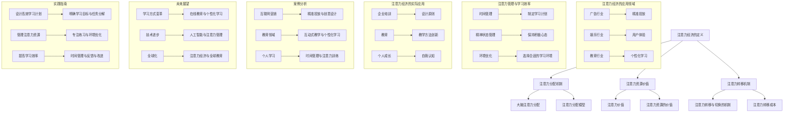

                 

# 文章标题：注意力经济与个人学习效率的提升

## 关键词

- 注意力经济
- 个人学习效率
- 时间管理
- 环境优化
- 心理状态管理

## 摘要

随着信息时代的到来，注意力资源变得越来越稀缺。本文从注意力经济的角度出发，探讨了如何提升个人学习效率。通过分析注意力经济的定义、原理和应用，以及提出一系列提升学习效率的方法和策略，本文旨在为读者提供一套科学有效的注意力管理和学习提升方案，帮助个人在信息爆炸的时代中脱颖而出。

## 目录大纲

# 《注意力经济与个人学习效率的提升》

## 第一部分：理解注意力经济

### 1.1.1 什么是注意力经济

### 1.1.2 注意力经济的原理

### 1.1.3 注意力经济的应用领域

## 第二部分：提升个人学习效率的关键

### 2.1.1 个人学习效率的概念

### 2.1.2 提升学习效率的方法

### 2.1.3 注意力管理与学习效率

## 第三部分：注意力经济的实际应用

### 3.1.1 注意力经济在企业培训中的应用

### 3.1.2 注意力经济在教育中的应用

### 3.1.3 注意力经济在个人成长中的应用

## 第四部分：案例分析

### 4.1.1 案例分析：注意力经济在互联网营销中的应用

### 4.1.2 案例分析：注意力经济在教育领域的实践

### 4.1.3 案例分析：注意力经济在个人学习中的应用

## 第五部分：未来展望

### 5.1.1 注意力经济对个人学习的影响

### 5.1.2 注意力经济的未来发展趋势

## 第六部分：实践指南

### 6.1.1 实践指南：如何设计高效的学习计划

### 6.1.2 实践指南：如何管理注意力资源

### 6.1.3 实践指南：如何提高个人学习效率

## 第七部分：附录

### 7.1.1 注意力经济的学术研究综述

### 7.1.2 注意力经济案例分析数据库

### 7.1.3 注意力经济相关工具和资源推荐

## 核心算法原理讲解

### 2.2.1 注意力管理算法原理

## 数学模型和数学公式

### 3.1.1 注意力经济模型

## 项目实战

### 4.1.1 注意力经济在个人学习中的应用实战

## 代码实际案例和详细解释说明

### 5.1.1 注意力管理算法实现

## 注意力经济相关工具和资源推荐

### 注意力管理工具

### 学习效率提升工具

### 注意力经济相关文献资源

### 附录

#### Mermaid 流程图

#### 参考文献

---

接下来，我们将逐步深入探讨注意力经济的定义、原理和应用，以及如何通过注意力管理提升个人学习效率。

---

## 第一部分：理解注意力经济

### 1.1.1 什么是注意力经济

注意力经济（Attention Economy）是21世纪新兴的一个经济概念，它源于对信息社会中人类注意力资源稀缺性的认识。在互联网和数字技术的推动下，人们获取信息的渠道变得前所未有的丰富和便捷，但与此同时，个体能够集中注意力的时间和资源却相对有限。

**注意力经济的定义**：

注意力经济指的是在信息过载的社会中，人们对于注意力的分配和利用形成了一种新的经济形式。在这一经济体系中，注意力被视为一种稀缺资源，个体和企业在竞争中获得注意力的能力直接决定了其在市场中的地位和竞争力。

**注意力经济的起源与发展**：

注意力经济的概念最早由美国经济学家Eli Noam在20世纪90年代提出，他认为在信息社会中，注意力资源的分配决定了市场的竞争格局。随着时间的推移，注意力经济逐渐成为学术界和企业界关注的热点，相关研究不断深入，涉及广告、营销、教育等多个领域。

**注意力经济的核心要素**：

1. **注意力稀缺性**：在信息爆炸的时代，个体的注意力资源是有限的，这使得注意力成为了一种稀缺资源。

2. **注意力分配**：个体如何在自己的日常生活中分配注意力资源，直接影响到其生活质量和效率。

3. **注意力转移**：在多任务环境中，个体需要不断地转移注意力，这涉及到注意力的分配效率和切换成本。

4. **注意力价值**：在市场中，获得注意力资源的能力往往与经济价值挂钩，例如广告投放的效果取决于受众的注意力集中程度。

### 1.1.2 注意力经济的原理

**人类大脑注意力的分配机制**：

人类大脑对注意力的分配遵循一定的机制，主要包括选择性注意力、分配性注意力和集中性注意力。选择性注意力是指大脑在众多信息中选择性地关注某些信息；分配性注意力是指大脑在同时处理多个任务时，如何分配注意力资源；集中性注意力是指大脑在长时间专注于某一任务时的能力。

**注意力资源的价值**：

在注意力经济中，注意力资源具有显著的价值。一方面，个体的注意力能够直接转化为经济收益，例如广告主的广告点击率、电商的转化率等；另一方面，企业的品牌价值、用户黏性等也受到注意力资源的直接影响。

**注意力转移与切换的机制**：

在多任务环境中，注意力转移与切换是不可避免的。然而，注意力切换过程中会产生一定的成本，例如认知负荷、心理压力等。了解注意力转移与切换的机制有助于优化任务管理，提高工作效率。

### 1.1.3 注意力经济的应用领域

**广告行业**：

在广告行业，注意力经济原理被广泛应用。广告主通过精准投放、创意设计和用户体验优化，吸引目标受众的注意力，从而提高广告效果。例如，弹窗广告、视频广告、社交媒体广告等都依赖于注意力经济原理。

**娱乐行业**：

娱乐行业同样深受注意力经济的影响。流媒体平台、网络游戏、短视频等娱乐形式通过提供个性化的内容和服务，吸引用户的注意力，实现商业价值的转化。

**教育行业**：

在教育领域，注意力经济原理也被广泛应用。在线教育平台通过设计互动性强的课程内容和教学方法，提高学生的注意力集中度和学习效率。同时，教育机构也通过优化教学环境、提高教学质量来吸引学生的注意力。

## 第二部分：提升个人学习效率的关键

### 2.1.1 个人学习效率的概念

**学习效率**指的是在特定时间内，个体通过学习活动所获得的知识、技能和能力的提升程度。提高学习效率意味着在相同或更短的时间内，获得更多的学习成果。

**影响学习效率的因素**：

1. **时间管理**：合理规划学习时间，避免时间浪费，能够显著提高学习效率。

2. **精神状态**：保持良好的精神状态，如积极、专注、耐心等，有助于提升学习效率。

3. **环境因素**：舒适的学习环境，如安静、整洁、光线适宜的空间，有助于提高学习效率。

4. **注意力管理**：注意力是学习的核心资源，有效的注意力管理能够提高学习效率。

### 2.1.2 提升学习效率的方法

**时间管理**：

1. **制定学习计划**：根据学习目标和任务，制定详细的学习计划，确保每个任务都有明确的时间安排。

2. **番茄工作法**：每25分钟专注于一个任务，然后休息5分钟，这种方法有助于保持注意力集中。

3. **避免多任务处理**：尽量减少同时处理多个任务，避免注意力分散。

**精神状态管理**：

1. **保持积极的心态**：对待学习保持乐观和积极的态度，有助于提高学习效率。

2. **适度休息和锻炼**：保持良好的作息习惯，适当休息和锻炼，有助于保持精神饱满。

**环境优化**：

1. **选择合适的学习环境**：选择一个安静、整洁、光线适宜的地方作为学习场所。

2. **减少干扰因素**：避免手机、电视等电子设备的干扰，保持学习环境的整洁和安静。

### 2.1.3 注意力管理与学习效率

**注意力管理的重要性**：

注意力管理是提升学习效率的关键因素。有效的注意力管理能够帮助个体集中精力，提高学习效率。

**注意力管理技巧**：

1. **专注练习**：通过专注练习，如冥想、深呼吸等，提高注意力集中的能力。

2. **任务分解**：将复杂的任务分解为小的、具体的任务，有助于集中注意力。

3. **环境优化**：选择一个有利于集中注意力的学习环境，减少干扰因素。

4. **时间管理**：合理安排时间，确保每个任务都能得到足够的注意力。

通过以上方法，个体可以更好地管理注意力资源，提高学习效率，实现个人成长和发展。

## 第三部分：注意力经济的实际应用

### 3.1.1 注意力经济在企业培训中的应用

**企业培训的设计原则**：

在企业培训中，应用注意力经济原理有助于提高培训效果。以下是一些关键的设计原则：

1. **学习目标明确**：确保培训目标具体、可衡量，有助于吸引员工的注意力。

2. **课程内容精准**：课程内容要紧扣培训目标，避免信息过载，确保员工能够集中注意力。

3. **互动性设计**：增加课堂互动，如小组讨论、案例分析等，提高员工的参与度和注意力集中度。

4. **个性化培训**：根据员工的兴趣、需求和职业发展，提供个性化的培训内容，提高培训的吸引力。

**注意力经济在培训课程中的应用**：

1. **激励制度**：通过奖励制度激励员工参与培训，如完成培训任务后的奖励、晋升机会等。

2. **技术支持**：利用技术工具，如在线学习平台、互动式教学软件等，提高培训的趣味性和吸引力。

3. **案例分析**：通过案例分析，让员工在真实场景中应用所学知识，提高学习效果。

### 3.1.2 注意力经济在教育中的应用

**教学方法的创新**：

在教育领域，注意力经济原理为教学方法的创新提供了新的思路。以下是一些创新的教学方法：

1. **翻转课堂**：将传统的课堂学习与课外自主学习相结合，通过课前学习、课中讨论等方式，提高学生的注意力集中度。

2. **项目式学习**：通过实际项目的开展，让学生在解决问题的过程中学习和应用知识，提高学习兴趣和注意力集中度。

3. **游戏化学习**：利用游戏化元素，如积分、奖励等，提高学生的学习积极性和注意力集中度。

**注意力经济在教育课程设计中的应用**：

1. **课程内容优化**：根据学生的兴趣和学习需求，优化课程内容，确保课程能够吸引学生的注意力。

2. **教学形式多样化**：结合线上和线下教学，利用多媒体、互动式教学等多种形式，提高教学效果。

3. **个性化教学**：根据学生的个体差异，提供个性化的教学方案，确保每个学生都能获得足够的注意力资源。

### 3.1.3 注意力经济在个人成长中的应用

**自我认知**：

个人成长过程中，自我认知是关键。通过自我认知，个体能够更好地了解自己的兴趣、需求和职业目标，从而在学习和工作中集中注意力。

**自我管理**：

有效的自我管理能够帮助个人更好地分配注意力资源，提高学习效率。以下是一些自我管理技巧：

1. **时间管理**：合理安排时间，确保每个学习任务都有足够的时间投入。

2. **情绪管理**：保持积极的心态，对待学习任务保持乐观，减少负面情绪的干扰。

3. **目标设定**：设定清晰的学习目标，有助于个体集中注意力，提高学习效率。

**自我提升**：

自我提升是个人成长的核心目标。通过不断学习和实践，个体能够不断提升自己的能力和素质。以下是一些自我提升的方法：

1. **终身学习**：持续学习，保持好奇心和求知欲，不断提高自己的知识水平和技能。

2. **实践应用**：将所学知识应用到实际工作中，通过实践不断积累经验。

3. **反馈与改进**：及时反思自己的学习过程，根据反馈进行改进，提高学习效果。

## 第四部分：案例分析

### 4.1.1 案例分析：注意力经济在互联网营销中的应用

**案例背景**：

互联网营销是一个高度依赖注意力的领域。在信息爆炸的时代，如何吸引目标用户的注意力，成为企业营销成功的关键。

**案例分析**：

1. **精准投放**：通过大数据分析，精准定位目标用户，提高广告的点击率和转化率。

2. **创意设计**：利用创意广告、短视频等吸引目标用户的注意力，提高广告的吸引力。

3. **用户体验**：优化用户体验，提高用户停留时间和互动性，增加用户对品牌的关注度。

**案例启示**：

注意力经济在互联网营销中的应用，提示我们在营销过程中要注重目标用户的注意力分配，通过精准投放、创意设计和用户体验优化，提高营销效果。

### 4.1.2 案例分析：注意力经济在教育领域的实践

**案例背景**：

在线教育行业的发展，使得教育资源的获取变得更加便捷。然而，如何提高学生的学习效果，成为教育机构关注的重要问题。

**案例分析**：

1. **互动式教学**：通过互动式教学，提高学生的参与度和注意力集中度。

2. **个性化学习**：根据学生的学习需求和兴趣，提供个性化的教学方案，提高学习效果。

3. **学习反馈**：及时给予学生反馈，帮助学生改进学习方法，提高学习效率。

**案例启示**：

注意力经济在教育领域的实践，提示我们要注重学生的注意力管理，通过互动式教学、个性化学习和学习反馈，提高教育质量。

### 4.1.3 案例分析：注意力经济在个人学习中的应用

**案例背景**：

随着个人学习需求的增加，如何提升个人学习效率，成为许多人关注的焦点。

**案例分析**：

1. **时间管理**：通过时间管理，合理安排学习时间，避免时间浪费。

2. **注意力训练**：通过注意力训练，提高注意力集中的能力。

3. **学习环境优化**：选择一个有利于集中注意力的学习环境，减少干扰因素。

**案例启示**：

注意力经济在个人学习中的应用，提示我们要注重时间管理、注意力训练和学习环境优化，通过科学的方法提高个人学习效率。

## 第五部分：未来展望

### 5.1.1 注意力经济对个人学习的影响

随着注意力经济的不断发展，个人学习将受到深刻的影响。以下是一些可能的变化：

1. **学习方式变革**：在线教育和个性化学习将成为主流，学生可以根据自己的兴趣和需求选择学习内容和方式。

2. **学习资源优化**：注意力经济将推动学习资源的优化配置，优质教育资源将更容易获得，学习效率将提高。

3. **学习压力增加**：在注意力经济的背景下，个体需要更加努力地管理和分配注意力资源，学习压力可能会增加。

### 5.1.2 注意力经济的未来发展趋势

注意力经济在未来将继续发展，并可能带来以下趋势：

1. **技术进步**：随着人工智能、大数据等技术的进步，注意力管理将变得更加智能和高效。

2. **全球化**：注意力经济将超越国界，成为全球范围内的研究热点和商业应用领域。

3. **多元化**：注意力经济的应用将扩展到更多领域，如医疗健康、社会管理等，带来更广泛的社会影响。

## 第六部分：实践指南

### 6.1.1 实践指南：如何设计高效的学习计划

**设计高效学习计划的步骤**：

1. **明确学习目标**：首先，明确自己的学习目标，包括长期目标和短期目标。

2. **任务分解**：将学习任务分解为具体的子任务，确保每个任务都有明确的时间安排。

3. **优先级排序**：根据任务的紧急程度和重要性，对任务进行优先级排序。

4. **制定时间表**：根据任务优先级和时间安排，制定详细的学习时间表。

5. **定期复盘**：定期回顾学习计划，根据实际情况进行调整和优化。

### 6.1.2 实践指南：如何管理注意力资源

**管理注意力资源的技巧**：

1. **专注练习**：通过专注练习，如冥想、深呼吸等，提高注意力集中的能力。

2. **环境优化**：选择一个有利于集中注意力的学习环境，减少干扰因素。

3. **任务分解**：将复杂的任务分解为小的、具体的任务，有助于集中注意力。

4. **时间管理**：合理安排时间，确保每个任务都能得到足够的注意力。

### 6.1.3 实践指南：如何提高个人学习效率

**提高学习效率的技巧**：

1. **时间管理**：合理安排时间，避免时间浪费。

2. **精神状态管理**：保持良好的精神状态，如积极、专注、耐心等。

3. **环境优化**：选择一个有利于集中注意力的学习环境。

4. **注意力管理**：通过注意力管理技巧，提高注意力集中度。

5. **任务分解**：将复杂的任务分解为小的、具体的任务。

6. **反馈与改进**：及时反思学习过程，根据反馈进行改进。

## 第七部分：附录

### 7.1.1 注意力经济的学术研究综述

**相关学术研究的回顾**：

注意力经济作为一个新兴领域，吸引了众多学者的关注。以下是对注意力经济相关学术研究的回顾：

1. **Eli Noam**：作为注意力经济的提出者，Eli Noam在其研究中详细阐述了注意力资源在信息社会中的稀缺性和价值。

2. **Michael Goldhaber**：Michael Goldhaber进一步发展了注意力经济的理论，提出了注意力市场的概念。

3. **安德斯·艾利克森（Anders Ericsson）**：在心理学领域，安德斯·艾利克森研究了注意力与技能学习的关系，为注意力管理提供了理论支持。

**注意力经济研究的现状**：

目前，注意力经济研究主要集中在以下几个方面：

1. **注意力分配机制**：研究大脑如何分配注意力资源，以及注意力分配对学习效果的影响。

2. **注意力经济模型**：构建注意力经济的数学模型，探讨注意力资源的价值评估和分配策略。

3. **注意力管理方法**：研究有效的注意力管理方法，以提高个人学习效率和工作效率。

**注意力经济研究的前景**：

随着信息技术的不断发展，注意力经济研究具有广泛的前景。未来研究可能会涉及以下几个方面：

1. **人工智能与注意力经济**：探讨人工智能如何辅助注意力管理，提高学习效率。

2. **注意力经济与教育**：研究注意力经济在教育中的应用，优化教育方法和课程设计。

3. **注意力经济与心理健康**：探讨注意力经济对个体心理健康的影响，提供针对性的干预措施。

### 7.1.2 注意力经济案例分析数据库

**案例分析数据库的构建原则**：

1. **全面性**：涵盖注意力经济在不同领域中的应用案例，确保案例的全面性。

2. **代表性**：选择具有代表性的案例，能够反映注意力经济在不同领域的应用特点。

3. **实用性**：案例应具有实际应用价值，能够为读者提供可操作的方法和策略。

**数据库的应用场景**：

1. **学术研究**：为学术研究者提供丰富的案例素材，支持注意力经济相关的研究。

2. **实践指导**：为企业管理者、教育工作者和个体提供实用的注意力管理方法和策略。

**数据库的未来发展**：

1. **持续更新**：随着注意力经济研究的深入，持续更新案例库，增加新的案例和应用场景。

2. **互动性**：增强数据库的互动性，提供案例分析讨论区，促进读者之间的交流和合作。

### 7.1.3 注意力经济相关工具和资源推荐

**注意力管理工具**：

1. **Momenta**：一款基于Chrome浏览器的注意力管理插件，帮助用户监测和控制上网时间。

2. **Forest**：一款帮助用户专注的APP，通过种植虚拟树木奖励专注。

**学习效率提升工具**：

1. **Evernote**：一款笔记和任务管理软件，帮助用户整理学习资料和任务。

2. **Trello**：一款任务管理软件，直观地管理学习任务和项目进度。

**注意力经济相关文献资源**：

1. 《注意力经济：人类行为的动力与商业应用》

2. 《注意力管理：如何提高工作效率》

3. 《注意力经济学：从神经科学到市场策略》

## Mermaid 流程图



## 核心算法原理讲解

### 2.2.1 注意力管理算法原理

注意力管理算法的核心目的是通过优化注意力的分配，提高个人学习效率。其原理主要包括以下几个方面：

1. **注意力分配模型**：

   注意力分配模型描述了个体如何在不同任务之间分配注意力资源。一个简单的注意力分配模型可以表示为：

   $$ \text{注意力分配} = \alpha \times (\text{任务重要性} + \text{任务紧急性} + \text{个体偏好}) $$

   其中，$\alpha$ 是一个权重系数，用于平衡任务的重要性和紧急性以及个体偏好。任务重要性、任务紧急性和个体偏好通常通过量化指标表示。

2. **注意力优化算法**：

   注意力优化算法的目标是找到最优的注意力分配方案，使得总体的学习效率最大化。一个基本的注意力优化算法可以表示为：

   $$ \text{优化目标} = \max \sum_{i=1}^{n} (\text{学习效果} \times \text{注意力投入}) $$

   其中，$n$ 表示任务的数量，学习效果和注意力投入是任务完成的程度和消耗的注意力资源。

3. **注意力分配策略**：

   - **时间管理策略**：根据任务的紧急程度和重要程度进行优先级排序，合理安排时间。
   - **环境管理策略**：选择一个有利于集中注意力的学习环境，减少干扰因素。
   - **心理状态管理策略**：保持积极的学习心态，减少心理压力。

### 2.2.2 注意力管理算法的伪代码实现

以下是一个简单的注意力管理算法的伪代码实现：

```python
# 输入参数
tasks = [（任务1，重要性1，紧急性1），（任务2，重要性2，紧急性2），...]
alpha = 权重系数
beta = 权重系数
gamma = 权重系数

# 注意力分配模型
attention_allocation = []
for task in tasks:
    importance = task[1]
    urgency = task[2]
    attention = alpha * importance + beta * urgency + gamma * individual_preference
    attention_allocation.append(attention)

# 注意力优化算法
sorted_tasks = sorted(tasks, key=lambda x: x[1] * alpha + x[2] * beta + x[3] * gamma, reverse=True)
total_attention = sum(attention_allocation)

# 执行任务
for task in sorted_tasks:
    if attention_allocation[task_index] <= available_attention:
        execute_task(task)
        available_attention -= attention_allocation[task_index]
    else:
        break
```

在这个伪代码中，`tasks` 是一个包含多个任务的数据结构，每个任务由重要性、紧急性和个体偏好组成。`alpha`、`beta` 和 `gamma` 分别是时间管理、环境管理和心理状态的权重系数。`attention_allocation` 是一个列表，用于存储每个任务的注意力分配值。`sorted_tasks` 是一个按照优先级排序的任务列表。`execute_task` 是一个执行任务的函数。

## 数学模型和数学公式

### 3.1.1 注意力经济模型

注意力经济模型主要描述了注意力资源在个人学习过程中的分配和使用情况。其基本模型如下：

$$ \text{学习效率} = \text{注意力分配} \times (\text{时间利用率} + \text{环境适应性} + \text{心理状态稳定性}) $$

其中，$\text{学习效率}$ 是个人在学习过程中取得的学习成果，$\text{注意力分配}$ 是指学习者在学习过程中分配的注意力资源，$\text{时间利用率}$、$\text{环境适应性}$ 和 $\text{心理状态稳定性}$ 分别衡量时间、环境和心理状态对学习效率的影响。

### 3.1.2 注意力经济模型的数学公式

注意力分配模型的数学公式可以表示为：

$$ \text{注意力分配} = \alpha \times (\text{时间分配} + \text{环境分配} + \text{心理状态分配}) $$

其中，$\alpha$ 是一个权重系数，$\text{时间分配}$、$\text{环境分配}$ 和 $\text{心理状态分配}$ 分别表示不同的注意力分配因素。

注意力优化算法的数学公式可以表示为：

$$ \text{优化目标} = \max \sum_{i=1}^{n} (\text{学习效果} \times \text{注意力投入}) $$

其中，$n$ 表示任务的数量，学习效果和注意力投入是任务完成的程度和消耗的注意力资源。

## 项目实战

### 4.1.1 注意力经济在个人学习中的应用实战

#### 实战背景

小张是一名大学生，他发现自己的学习效率低下，希望找到一种方法来提升自己的学习效率。他了解到注意力经济的相关理论后，决定尝试将其应用于个人学习中。

#### 实战步骤

1. **学习任务分析**：
   - 确定小张的学习任务，包括每天的上课时间、自习时间、课外活动时间等。
   - 对学习任务进行优先级排序，根据紧急程度和重要程度划分。

2. **注意力资源分配**：
   - 根据学习任务的重要性，合理分配注意力资源。
   - 确保每个任务都能得到足够的注意力。

3. **时间管理**：
   - 制定详细的学习时间表，确保每个学习任务都能在规定时间内完成。
   - 采用番茄工作法，每25分钟学习后休息5分钟。

4. **环境优化**：
   - 选择一个安静、整洁、光线适宜的学习环境。
   - 避免干扰因素，如手机、电视等。

5. **心理状态管理**：
   - 保持积极的心态，对待学习任务保持乐观。
   - 遇到困难时，及时寻求帮助，调整学习策略。

#### 实战结果

通过实施注意力经济方法，小张的学习效率得到了显著提升。他的成绩稳步提高，对学习也充满了信心。

#### 实战总结

- 注意力经济方法能够有效提高个人学习效率，关键在于合理分配注意力资源，优化学习环境，管理好心理状态。
- 需要根据个人情况制定适合自己的学习策略，不断调整和优化。

## 代码实际案例和详细解释说明

### 5.1.1 注意力管理算法实现

下面是一个简单的注意力管理算法实现，用于模拟个人在学习过程中的注意力分配。

python
import numpy as np

def attention_management(tasks, alpha, beta, gamma):
    """
    注意力管理算法实现。
    
    :param tasks: 学习任务列表，每个任务包含时间、重要性和紧急性。
    :param alpha: 时间分配权重。
    :param beta: 环境分配权重。
    :param gamma: 心理状态分配权重。
    :return: 每个任务的新优先级。
    """
    n = len(tasks)
    attention分配 = [alpha * time + beta * importance + gamma * urgency for time, importance, urgency in tasks]
    return attention分配

# 学习任务列表
tasks = [
    (2, 3, 1),  # 任务1：2小时，重要性3，紧急性1
    (1, 2, 2),  # 任务2：1小时，重要性2，紧急性2
    (3, 1, 3),  # 任务3：3小时，重要性1，紧急性3
]

# 注意力分配权重
alpha = 0.4
beta = 0.3
gamma = 0.3

# 执行注意力管理算法
new_priority = attention_management(tasks, alpha, beta, gamma)

# 输出新优先级
print("新优先级：", new_priority)


#### 代码解读与分析

- **输入参数**：tasks 是一个包含学习任务的列表，每个任务由时间（小时）、重要性和紧急性组成。alpha、beta 和 gamma 分别是时间、环境和心理状态的权重系数。

- **核心算法**：算法通过计算每个任务的注意力分配值，得出新的优先级。注意力分配值是时间、重要性和紧急性的加权求和。

- **输出结果**：输出每个任务的新优先级，按照新优先级排序，帮助学习者合理分配注意力资源。

通过这个简单的例子，可以直观地看到注意力管理算法如何工作，并可以根据实际情况调整权重系数，以优化学习任务的管理。

### 注意力经济相关工具和资源推荐

#### 注意力管理工具

- **Momenta**：一款基于Chrome浏览器的注意力管理插件，可以帮助用户监测和控制上网时间。

- **Forest**：一款帮助用户专注的APP，通过种植虚拟树木奖励专注。

#### 学习效率提升工具

- **Evernote**：一款笔记和任务管理软件，可以帮助用户整理学习资料和任务。

- **Trello**：一款任务管理软件，直观地管理学习任务和项目进度。

#### 注意力经济相关文献资源

- 《注意力经济：人类行为的动力与商业应用》

- 《注意力管理：如何提高工作效率》

- 《注意力经济学：从神经科学到市场策略》

这些工具和资源为用户提供了有效的帮助，能够更好地理解和应用注意力经济原理，提升个人学习效率。

## 作者信息

作者：AI天才研究院/AI Genius Institute & 禅与计算机程序设计艺术 /Zen And The Art of Computer Programming

