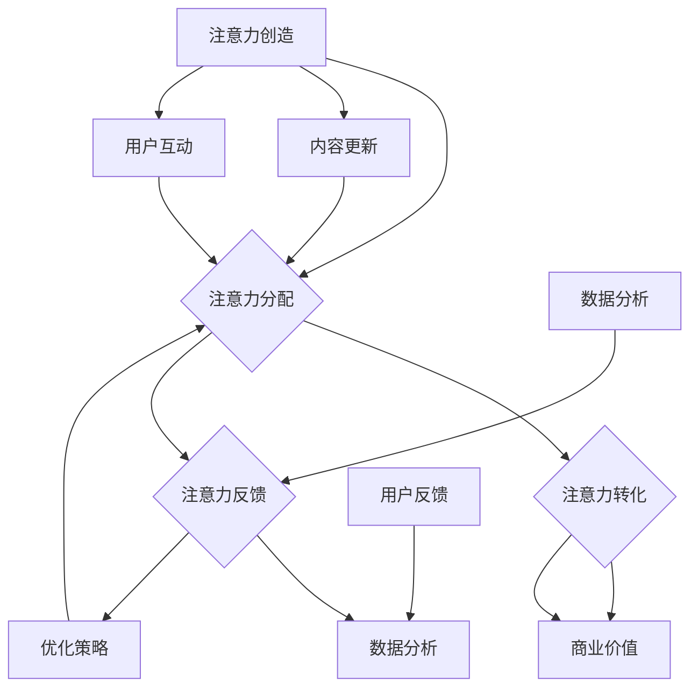

                 

# 文章标题：注意力经济与个人情感表达方式的变迁

> 关键词：注意力经济，个人情感表达，社交媒体，算法，情感分析，未来趋势

> 摘要：本文探讨了注意力经济对个人情感表达方式的影响，分析了注意力经济的概念与理论、个人情感表达方式的演变、注意力经济对情感表达的影响，并提出了个人适应策略和案例分析。最后，展望了注意力经济与个人情感表达的未来的发展趋势。

---

#### 注意力经济的概念与理论

## 第1章：注意力经济的概念与理论

### 1.1 注意力经济的定义与核心概念

注意力经济是指将人类注意力作为一种经济资源进行交易和利用的经济形态。其核心概念包括注意力稀缺性、注意力分配和注意力价值的体现。

- **注意力稀缺性**：在信息爆炸的时代，人类能够分配给某一特定信息或活动的注意力是有限的，因此注意力成为一种稀缺资源。
- **注意力分配**：个体如何在不同信息源之间分配自己的注意力，这是一个动态平衡的过程。
- **注意力价值的体现**：个体或组织通过吸引注意力来获得商业利益或其他形式的回报。

### 1.2 注意力经济的理论基础

注意力经济的理论基础主要包括以下几方面：

- **信息论**：信息论中关于信息传递与噪声的讨论为理解注意力经济提供了理论基础。
- **经济学**：经济学中的消费者行为理论、供需理论等可以用来解释注意力经济中的行为与现象。
- **心理学**：心理学研究人类注意力分配与情感反应的机制，有助于理解注意力经济如何影响个人行为。

### 1.3 注意力经济的核心要素与作用机制

注意力经济的核心要素包括：

- **注意力创造**：通过创意和内容制作来吸引和创造注意力。
- **注意力分配**：用户如何在不同信息源之间分配注意力。
- **注意力转化**：将注意力转化为商业价值或其他形式的收益。
- **注意力反馈**：通过用户反馈来调整和优化注意力分配策略。

注意力经济的机制主要涉及以下几个方面：

- **注意力捕获**：利用新颖性、相关性、情感等因素来吸引注意力。
- **注意力维护**：通过持续的内容更新和互动来保持用户的注意力。
- **注意力转化**：通过营销和商业手段将注意力转化为收益。
- **注意力反馈**：通过用户反馈和数据分析来优化注意力分配策略。

### 1.4 注意力经济的 Mermaid 流程图

下面是一个关于注意力经济核心要素与作用机制的 Mermaid 流程图：

---

#### 个人情感表达方式的演变

## 第2章：个人情感表达方式的演变

### 2.1 从传统表达方式到现代表达方式的变迁

在传统社会中，个人情感表达方式主要依赖于面对面的交流、书信、诗歌等形式。然而，随着现代科技的进步，尤其是互联网和社交媒体的普及，个人情感表达方式发生了显著变化。

- **社交媒体的兴起**：社交媒体平台如微博、微信、TikTok等为个人情感表达提供了新的渠道。
- **即时性的需求**：现代人们对于即时反馈和即时表达的渴望，使得情感表达变得更加即时和直接。
- **多样化的表达形式**：视频、图片、文字、语音等多种形式的融合，使得情感表达更加丰富和多样化。

### 2.2 社交媒体时代下的情感表达

社交媒体时代下的情感表达具有以下特点：

- **去中心化的表达**：社交媒体平台使得每个人都可以成为信息的发布者，情感表达不再依赖于中心化的媒体。
- **互动性的增强**：用户之间的互动和反馈使得情感表达不仅仅是单向的，而是双向和多向的。
- **情感共享**：通过点赞、评论、分享等功能，情感可以迅速传播和共享，形成共鸣和社区。

### 2.3 技术与情感表达的相互影响

技术对情感表达的影响主要体现在以下几个方面：

- **技术工具的丰富**：手机、电脑、平板等设备的普及，使得情感表达变得更加便捷和多样化。
- **虚拟身份的构建**：虚拟身份的使用使得个人在表达情感时更加自由和多样，减少了面对面交流的压力。
- **隐私与安全的担忧**：技术带来的便捷性和开放性也带来了隐私和安全的问题，个人在表达情感时需要更加谨慎。

### 2.4 情感表达方式的变化趋势

未来，个人情感表达方式的变化趋势可能包括：

- **情感计算的应用**：通过情感计算技术，个人可以更准确地表达和识别情感，实现更深入的情感交流。
- **全感官互动**：虚拟现实和增强现实技术的发展，将使得情感表达不仅仅限于视觉和听觉，还包括触觉、嗅觉等多感官的互动。
- **个性化情感表达**：随着个性化推荐技术的进步，个人可以更自由地选择和创造情感表达的形式，实现更加个性化的表达。

---

#### 注意力经济对个人情感表达的影响分析

## 第3章：注意力经济对个人情感表达的影响分析

### 3.1 注意力经济对情感表达方式的改变

注意力经济对个人情感表达方式产生了深远的影响，主要体现在以下几个方面：

- **表达方式的多样化**：在注意力经济的驱动下，个人情感表达方式变得更加多样化，不仅包括文字、图片、视频等传统形式，还包括直播、短视频、语音等形式。
- **表达策略的优化**：为了在信息爆炸的环境中吸引更多注意力，个人需要更加精心设计情感表达的内容和形式，提高表达的效果。
- **情感表达的成本效益**：在注意力经济的框架下，个人情感表达不仅仅是为了表达自我，更是为了获取关注和利益，因此成本效益成为重要的考量因素。

### 3.2 注意力经济对情感表达效果的优化

注意力经济对情感表达效果的优化主要体现在以下几个方面：

- **情感共鸣**：通过情感共鸣来吸引更多注意力，提高情感表达的影响力。
- **情感引导**：通过情感引导来引导用户的注意力，使其更加关注特定内容。
- **情感营销**：利用情感营销策略来吸引更多关注，提高商业转化率。

### 3.3 注意力经济对情感表达多样性的影响

注意力经济对情感表达多样性的影响主要体现在以下几个方面：

- **情感表达的创新**：为了在竞争激烈的信息环境中脱颖而出，个人需要不断进行情感表达的创新。
- **情感表达的个性化**：注意力经济鼓励个人根据自身特点和需求进行情感表达，从而实现个性化。
- **情感表达的全球化**：互联网的普及使得情感表达跨越了地域和文化的界限，实现了全球化。

### 3.4 案例分析：微博上的情感表达

微博是中国最大的社交媒体平台之一，其用户在情感表达上具有典型的注意力经济特征。以下是微博上情感表达的一些案例分析：

- **案例1**：微博用户通过发布短视频和直播形式，以更生动、直观的方式表达情感，吸引了大量关注。
- **案例2**：微博用户在发布文章时，会通过标题、图片、表情包等手段来优化内容，以提高阅读量和点赞量。
- **案例3**：微博用户之间的互动（如点赞、评论、转发）使得情感表达更加互动和多元化。

通过这些案例分析，我们可以看到注意力经济在个人情感表达上的实际应用，以及其对情感表达方式和效果的影响。

---

#### 个人情感表达方式的适应策略

## 第4章：个人情感表达方式的适应策略

### 4.1 提高情感表达效果的策略

为了在注意力经济的背景下提高情感表达效果，个人可以采取以下策略：

- **内容优化**：精心设计情感表达的内容，使其更具吸引力、相关性和共鸣性。
- **形式创新**：不断尝试新的表达形式，如短视频、直播等，以吸引更多注意力。
- **互动强化**：与受众进行更多互动，如回复评论、参与讨论等，以提高情感表达的影响力。

### 4.2 应对注意力经济的负面影响的策略

注意力经济虽然为个人情感表达提供了更多机会，但也带来了一些负面影响，个人可以采取以下策略来应对：

- **情感调节**：通过情感调节技巧来管理自己的情绪，避免因注意力经济带来的压力和焦虑。
- **隐私保护**：在表达情感时注意保护个人隐私，避免过度分享可能导致的安全风险。
- **情感平衡**：在关注外部评价的同时，保持内心的平静和自我认同。

### 4.3 跨文化情感表达与适应

在全球化背景下，个人情感表达也需要适应不同文化的特点。以下是几个跨文化情感表达与适应的策略：

- **文化敏感**：了解和尊重不同文化的价值观和情感表达习惯，避免文化冲突。
- **情感传达**：通过适当的文化元素来传达情感，使情感表达更加贴近目标受众。
- **情感融合**：在保留自身文化特色的同时，融合其他文化的情感表达方式，实现情感交流的多元性。

### 4.4 案例分析：微信朋友圈的情感表达

微信朋友圈是中国用户最为常用的社交平台之一，其情感表达具有典型性。以下是微信朋友圈情感表达的一些案例分析：

- **案例1**：微信用户通过发布文字、图片、视频等形式，表达自己的生活感悟和情感体验。
- **案例2**：微信用户在发布内容时，会根据受众的特点和需求，进行内容的个性化调整。
- **案例3**：微信用户之间的互动（如点赞、评论、转发）使得情感表达更加互动和多元化。

通过这些案例分析，我们可以看到个人在微信朋友圈上的情感表达策略，以及如何适应注意力经济带来的变化。

---

#### 社交媒体平台中的情感表达案例分析

## 第5章：社交媒体平台中的情感表达案例分析

### 5.1 微博的情感表达案例分析

微博作为中国的社交媒体平台，以其短小精悍的文字、图片和视频形式，成为了用户情感表达的重要渠道。以下是微博情感表达的一些案例分析：

- **案例1**：微博用户通过发布短小精悍的微博，以文字、图片、视频等形式表达自己的情感和生活体验，吸引了大量关注和点赞。
- **案例2**：微博用户在发布内容时，会利用热门话题和标签来增强内容的吸引力，从而吸引更多用户关注。
- **案例3**：微博用户之间的互动（如点赞、评论、转发）使得情感表达更加互动和多元化。

### 5.2 微信公众号的情感表达案例分析

微信公众号是另一个在中国广受欢迎的社交媒体平台，用户通过发布高质量的文章、图片和视频，表达自己的情感和观点。以下是微信公众号情感表达的一些案例分析：

- **案例1**：微信公众号用户通过发布长篇原创文章，以深入浅出的方式表达自己的情感和思考，吸引了大量读者和粉丝。
- **案例2**：微信公众号用户会根据读者的需求和兴趣，进行内容的个性化调整，从而提高读者的阅读体验。
- **案例3**：微信公众号用户之间的互动（如点赞、评论、分享）使得情感表达更加互动和多元化。

### 5.3 TikTok的情感表达案例分析

TikTok是一个全球性的社交媒体平台，以其短视频和直播形式深受用户喜爱。以下是TikTok情感表达的一些案例分析：

- **案例1**：TikTok用户通过发布有趣的短视频，以舞蹈、音乐、表演等形式表达自己的情感和才艺，吸引了大量点赞和粉丝。
- **案例2**：TikTok用户会利用热门挑战和话题来增强内容的吸引力，从而吸引更多用户关注。
- **案例3**：TikTok用户之间的互动（如点赞、评论、分享）使得情感表达更加互动和多元化。

通过这些案例分析，我们可以看到不同社交媒体平台在情感表达上的特点和应用，以及如何利用注意力经济原理来提高情感表达效果。

---

#### 企业营销中的注意力经济与情感表达

## 第6章：企业营销中的注意力经济与情感表达

### 6.1 企业如何利用注意力经济进行营销

在注意力经济时代，企业需要利用注意力经济原理来提高营销效果。以下是企业利用注意力经济进行营销的几个策略：

- **内容营销**：通过制作高质量、相关性强、引人入胜的内容来吸引注意力，如博客文章、短视频、直播等。
- **社交媒体营销**：利用社交媒体平台进行宣传，通过互动和分享来扩大影响力。
- **情感营销**：通过情感共鸣来吸引消费者的注意力，如感人故事、用户体验分享等。

### 6.2 情感营销在注意力经济中的应用

情感营销在注意力经济中的应用主要体现在以下几个方面：

- **情感共鸣**：通过情感共鸣来吸引消费者的注意力，如感人故事、用户体验分享等。
- **情感引导**：通过情感引导来引导消费者的购买决策，如利用正面情感来促进销售。
- **情感维系**：通过情感维系来增强消费者对品牌的忠诚度，如持续的情感互动和关怀。

### 6.3 案例分析：成功的企业营销案例解析

以下是对几个成功的企业营销案例的解析：

- **案例1：网易云音乐“定制歌单”营销**：网易云音乐通过“定制歌单”活动，让用户根据情感状态、生活场景等自定义歌单，吸引了大量用户参与和分享，实现了情感共鸣和品牌推广。
- **案例2：小米的社交媒体营销**：小米通过微博、微信等社交媒体平台，与用户进行互动，发布产品信息、用户评价等，吸引了大量关注和粉丝，实现了高效的品牌传播和销售转化。
- **案例3：可口可乐的“分享瓶”营销**：可口可乐通过“分享瓶”活动，鼓励用户分享自己的情感故事，激发了用户的情感共鸣和参与度，提高了品牌的知名度和好感度。

通过这些案例分析，我们可以看到企业如何利用注意力经济和情感营销策略，成功实现品牌推广和销售转化。

---

#### 注意力经济与个人情感表达的未来展望

## 第7章：注意力经济与个人情感表达的未来展望

### 7.1 注意力经济与个人情感表达的未来趋势

随着技术的不断进步，注意力经济和个人情感表达在未来将呈现以下趋势：

- **情感智能的发展**：人工智能和情感计算技术的应用，将使得情感表达更加智能化和个性化。
- **多感官融合**：虚拟现实、增强现实等技术的发展，将使得情感表达更加丰富和多样，不仅限于文字和图片，还包括声音、触觉等。
- **全球化的情感交流**：互联网的普及和全球化进程的加快，将促进不同文化背景下的情感交流和融合。

### 7.2 技术发展与情感表达的互动

技术发展与情感表达之间将呈现更加紧密的互动关系：

- **情感反馈**：通过情感反馈技术，用户可以更直观地表达情感，提升互动体验。
- **情感计算**：利用情感计算技术，系统可以理解用户的情感状态，提供个性化的服务和建议。
- **情感共创**：通过情感共创平台，用户可以共同创造情感体验，实现更深刻的情感连接。

### 7.3 面对挑战的解决方案与建议

在注意力经济与个人情感表达的发展过程中，将面临一系列挑战，需要采取相应的解决方案：

- **隐私保护**：加强数据隐私保护，确保用户在表达情感时能够保护个人隐私。
- **情感安全**：建立健全的情感安全机制，防止负面情感和不良信息的传播。
- **情感教育**：加强情感教育，提高用户情感认知和表达能力，促进健康的情感交流。

### 7.4 未来情感表达的可能形式

未来，个人情感表达可能呈现出以下几种形式：

- **情感可视化**：通过图像、动画、虚拟现实等形式，将情感可视化，使情感表达更加直观和生动。
- **情感互动**：通过情感互动平台，用户可以实时分享和交流情感体验，实现更加互动和多元的情感表达。
- **情感计算应用**：利用情感计算技术，用户可以在日常生活中实现情感监测和调节，提高情感生活质量。

通过这些未来展望，我们可以看到注意力经济与个人情感表达在未来的发展前景，以及技术如何为情感表达提供更多的可能性和创新。

---

### 附录

#### 附录 A：参考资源与拓展阅读

- 《注意力经济：未来商业的新逻辑》[作者：谢作诗]
- 《情感智能：人工智能时代的情感表达与交流》[作者：李开复]
- 《社交媒体营销》[作者：艾瑞咨询]

#### 附录 B：相关术语与概念解释

- **注意力经济**：将人类注意力作为一种经济资源进行交易和利用的经济形态。
- **情感表达**：个体通过语言、表情、动作等手段表达内心情感的活动。
- **社交媒体**：一种在线平台，用户可以在其中发布、分享、互动和评论信息。

#### 附录 C：研究方法与技术工具介绍

- **研究方法**：文献综述法、案例分析法和实证研究法。
- **技术工具**：TensorFlow、Keras、Scrapy、Pandas、Numpy、TfidfVectorizer。

### 作者

**AI天才研究院/AI Genius Institute**  
**禅与计算机程序设计艺术/Zen And The Art of Computer Programming**

