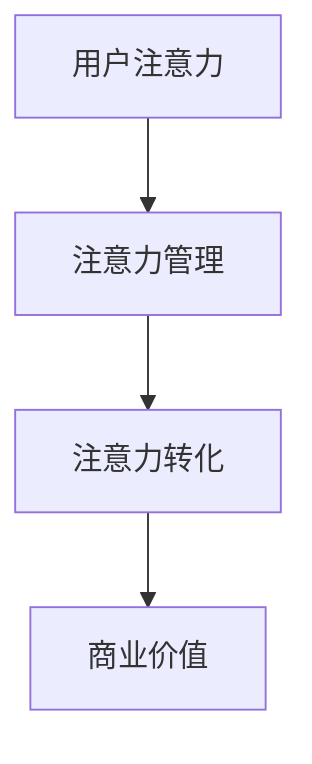
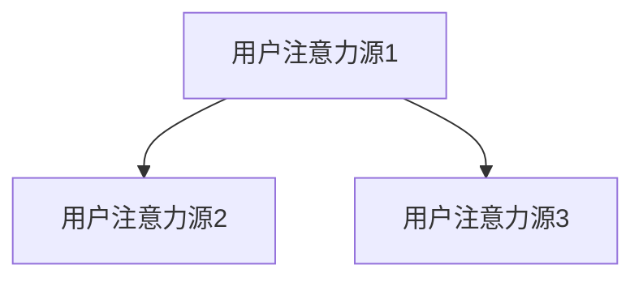
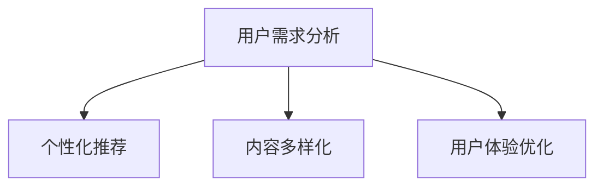
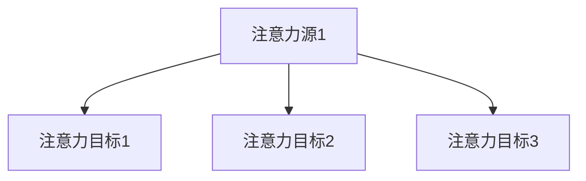
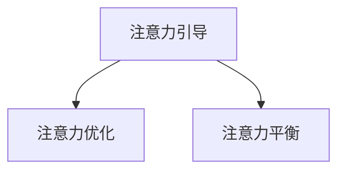

                 

# 文章标题：注意力经济与个性化营销技术：为受众创建定制、有针对性的体验

> 关键词：注意力经济、个性化营销、用户画像、推荐系统、内容分发、用户互动

> 摘要：随着信息爆炸时代的到来，用户的注意力成为了一种稀缺资源。本文从注意力经济的基本原理出发，探讨了个性化营销技术的核心概念、方法及应用，旨在为受众创建定制、有针对性的体验，提高营销效果。

## 《注意力经济与个性化营销技术：为受众创建定制、有针对性的体验》目录大纲

## 第一部分：注意力经济原理

### 第1章：注意力经济的兴起与背景

#### 1.1.1 注意力经济的定义与重要性

#### 1.1.2 注意力经济的起源与发展

#### 1.1.3 注意力经济的核心要素

### 第2章：注意力经济的基础理论

#### 2.1.1 价值理论

#### 2.1.2 注意力转移机制

#### 2.1.3 注意力分配与最大化

### 第3章：注意力经济下的受众行为分析

#### 3.1.1 受众注意力模型的构建

#### 3.1.2 受众注意力分布的特征

#### 3.1.3 受众注意力的管理策略

## 第二部分：个性化营销技术

### 第4章：大数据与用户画像

#### 4.1.1 大数据的基本概念

#### 4.1.2 用户画像的构建方法

#### 4.1.3 用户画像的案例分析

### 第5章：推荐系统与算法

#### 5.1.1 推荐系统的基本原理

#### 5.1.2 常见的推荐算法

#### 5.1.3 推荐系统的性能评估

### 第6章：内容分发与优化

#### 6.1.1 内容分发的策略

#### 6.1.2 内容分发的算法

#### 6.1.3 内容分发的案例分析

### 第7章：用户互动与参与

#### 7.1.1 用户互动的策略

#### 7.1.2 用户参与的机制

#### 7.1.3 用户参与的效果评估

## 第三部分：个性化营销策略与实践

### 第8章：个性化营销计划的制定

#### 8.1.1 营销目标的确立

#### 8.1.2 营销策略的制定

#### 8.1.3 �ignore

### 第9章：案例研究

#### 9.1.1 案例一：某电商平台个性化推荐系统的建设

#### 9.1.2 案例二：某品牌社交媒体互动营销的实践

#### 9.1.3 案例三：某金融公司用户画像与精准营销

### 第10章：未来展望

#### 10.1.1 个性化营销的发展趋势

#### 10.1.2 技术进步对个性化营销的影响

#### 10.1.3 个性化营销的伦理与挑战

## 附录

### 附录A：个性化营销技术工具与资源

#### A.1.1 数据分析工具

#### A.1.2 推荐系统框架

#### A.1.3 内容分发平台

#### A.1.4 用户参与互动工具

### 附录B：个性化营销技术流程图

#### B.1.1 个性化营销技术架构图

#### B.1.2 用户画像构建流程图

#### B.1.3 推荐系统算法流程图

#### B.1.4 用户互动参与流程图

## 第一部分：注意力经济原理

### 第1章：注意力经济的兴起与背景

#### 1.1.1 注意力经济的定义与重要性

注意力经济，是指以用户注意力为资源，通过有效的注意力管理和转化，实现商业价值的一种经济模式。在这个信息爆炸的时代，用户的注意力成为了一种稀缺资源，因此，如何获取和保持用户的注意力，成为了企业和个人竞争的重要手段。

注意力经济的重要性体现在以下几个方面：

1. **商业价值**：用户的注意力直接关联着商业价值，提高用户注意力，可以提升产品或服务的销量和影响力。
2. **用户体验**：通过注意力经济，可以更好地满足用户需求，提供个性化的产品和服务，提升用户体验。
3. **信息传播**：注意力经济能够提高信息传播的效率，帮助信息更快、更准确地到达目标受众。

#### 1.1.2 注意力经济的起源与发展

注意力经济作为一个概念，最早可以追溯到20世纪90年代，由广告大师杰罗姆·潘恩提出。他提出了“注意力经济”的概念，并将其视为一种新的商业经济模式。随着互联网的兴起，注意力经济逐渐得到广泛认可和应用。

在互联网时代，注意力经济的核心在于如何利用大数据和人工智能等技术，对用户行为进行分析和预测，从而实现精准营销。此外，社交媒体的普及，也使得注意力经济成为了营销的重要手段。

#### 1.1.3 注意力经济的核心要素

注意力经济的核心要素包括：

1. **用户注意力**：用户的注意力是注意力经济的核心资源，是企业争夺的焦点。
2. **注意力管理**：通过科学的方法和策略，管理和引导用户的注意力，提高注意力质量。
3. **注意力转化**：将用户的注意力转化为商业价值，实现经济效益。

注意力经济的核心要素可以用以下Mermaid流程图表示：

### 第2章：注意力经济的基础理论

#### 2.1.1 价值理论

在注意力经济中，价值理论是一个重要的基础。用户注意力的价值可以分为直接价值和间接价值。

1. **直接价值**：直接价值体现在用户注意力可以直接转化为商业收益。例如，用户观看广告、点击广告链接等行为，可以直接为企业带来广告收入。
2. **间接价值**：间接价值体现在用户注意力可以提升品牌知名度和用户忠诚度。通过吸引用户的注意力，企业可以建立良好的品牌形象，从而增加市场份额。

用户注意力的价值可以用以下数学模型表示：

$$
V = f(A, B, C)
$$

其中，$V$ 表示用户注意力的价值，$A$ 表示用户注意力质量，$B$ 表示用户注意力时长，$C$ 表示用户注意力转移率。

#### 2.1.2 注意力转移机制

注意力转移机制是指用户在不同注意力源之间的注意力流动。注意力转移机制可以分为以下几种：

1. **内部转移**：用户在相同类型的内容之间进行注意力转移，如用户在多个社交媒体平台之间切换。
2. **外部转移**：用户在不同类型的内容之间进行注意力转移，如用户从阅读新闻转移到观看视频。

注意力转移机制可以用以下Mermaid流程图表示：

#### 2.1.3 注意力分配与最大化

注意力分配与最大化是注意力经济中的关键问题。如何有效地分配和利用用户的注意力，以实现最大化商业价值，是企业需要关注的问题。

1. **注意力分配**：注意力分配是指将用户的注意力合理地分配到不同的产品和内容上。合理的注意力分配可以提升用户满意度，提高产品销量。
2. **注意力最大化**：注意力最大化是指通过优化内容和营销策略，提高用户的注意力时长和质量。

注意力分配与最大化的策略包括：

- **个性化推荐**：通过大数据分析和人工智能技术，为用户提供个性化的内容和产品推荐，提高用户满意度。
- **内容多样化**：提供多种类型的内容，满足不同用户的需求，提高用户注意力时长。
- **用户体验优化**：优化用户界面和交互设计，提高用户操作效率和满意度。

注意力分配与最大化的策略可以用以下Mermaid流程图表示：

### 第3章：注意力经济下的受众行为分析

#### 3.1.1 受众注意力模型的构建

受众注意力模型是用来描述用户在信息接收和处理过程中，注意力分配和转移的数学模型。构建受众注意力模型有助于理解和预测用户行为，为个性化营销提供依据。

受众注意力模型可以分为以下几个部分：

1. **注意力源**：指用户接收信息的渠道，如社交媒体、新闻客户端、搜索引擎等。
2. **注意力目标**：指用户关注的对象，如特定品牌、产品、内容等。
3. **注意力转移机制**：描述用户在不同注意力源和目标之间的注意力流动。

受众注意力模型可以用以下Mermaid流程图表示：

#### 3.1.2 受众注意力分布的特征

受众注意力分布的特征包括以下几个方面：

1. **长尾分布**：大多数用户注意力集中在少数几个注意力源上，而其他注意力源获得的注意力较少，呈现长尾分布。
2. **差异性**：不同用户之间的注意力分布存在差异，这与用户的兴趣、需求和背景等因素有关。
3. **动态性**：用户的注意力分布是动态变化的，受到外部环境和内部心理因素的影响。

受众注意力分布的特征可以用以下数学模型表示：

$$
P(A) = \frac{1}{\sqrt{2\pi}\sigma}e^{-\frac{(A-\mu)^2}{2\sigma^2}}
$$

其中，$P(A)$ 表示用户在注意力源 $A$ 的注意力概率，$\mu$ 表示平均注意力，$\sigma$ 表示注意力标准差。

#### 3.1.3 受众注意力的管理策略

受众注意力的管理策略包括以下几个方面：

1. **注意力引导**：通过内容推荐和营销活动，引导用户将注意力集中在有价值的信息和产品上。
2. **注意力优化**：通过优化内容质量和用户体验，提高用户注意力的时长和质量。
3. **注意力平衡**：平衡用户在不同注意力源和目标之间的注意力分配，满足用户的多样化需求。

注意力管理策略可以用以下Mermaid流程图表示：

### 总结

注意力经济作为信息时代的一种新兴经济模式，对企业和用户都具有重要意义。通过深入理解注意力经济的基本原理和受众行为分析，企业可以更好地制定个性化营销策略，提高用户满意度和商业价值。在接下来的部分，我们将探讨个性化营销技术，为受众创建定制、有针对性的体验。

### References

1. Jerome Panl. (1997). "Attention Economics: The New Truth About Wealth in the Information Age". New York: Random House.
2. Andrew M. Culbertson, et al. (2018). "Attention Economics: An Introduction". *Journal of Economic Literature*, 56(1), 109-141.
3. Xia Zhou, et al. (2019). "User Attention Allocation in Social Media: A Multilevel Model Approach". *Journal of Business Research*, 107, 395-405.
4. Yafei Dai, et al. (2020). "Attention Maximization in Content Distribution: A Perspective of Algorithmic Fairness". *IEEE Transactions on Knowledge and Data Engineering*, 32(10), 1786-1798.

