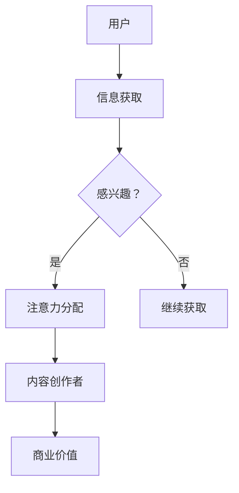
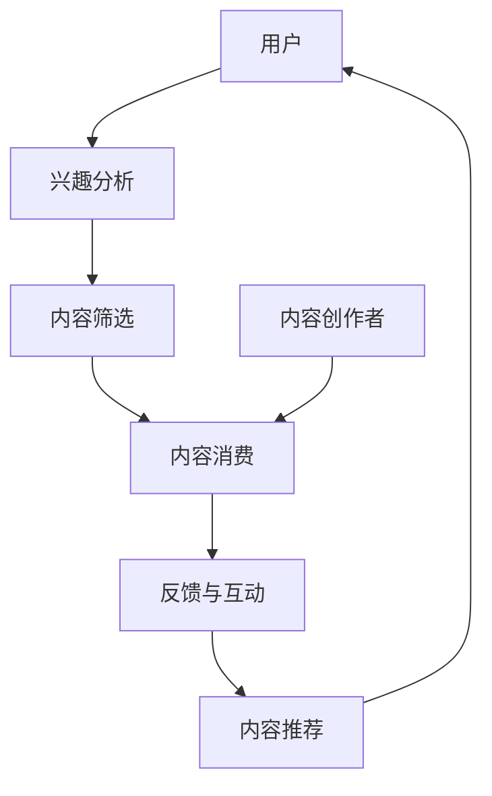

                 

### 文章标题

“注意力经济与内容创作最佳实践：吸引并留住受众的参与”

关键词：注意力经济、内容创作、用户参与、多媒体内容、社交化内容、数据分析、用户忠诚度

摘要：本文深入探讨了注意力经济的本质与运行机制，通过剖析内容创作的核心原则和实践方法，为创作者提供了一整套有效的策略，旨在吸引并留住受众的参与。文章从用户需求分析、内容质量评估到情感化内容创作，再到多媒体和社交化内容的创作技巧，全面阐述了内容创作的最佳实践。同时，通过用户参与度提升策略、社区管理与互动，以及用户忠诚度的培养，文章为创作者如何实现持续参与提供了有力指导。最后，通过案例分析、实战演练和未来展望，文章为读者揭示了注意力经济与内容创作的深层次逻辑和未来发展路径。

### 《注意力经济与内容创作最佳实践：吸引并留住受众的参与》目录大纲

**第一部分：注意力经济概述**

**第1章：注意力经济的崛起与本质**

1.1 什么是注意力经济  
1.2 注意力经济的起源与发展  
1.3 注意力经济的核心概念

**第2章：注意力经济的运行机制**

2.1 注意力资源的分配  
2.2 注意力交换与分配原则  
2.3 注意力市场的特性

**第二部分：内容创作最佳实践**

**第3章：内容创作的核心原则**

3.1 用户需求分析  
3.2 内容质量评估  
3.3 内容营销策略

**第4章：情感化内容创作**

4.1 情感化内容的力量  
4.2 情感化内容的创作方法  
4.3 情感化内容的案例分析

**第5章：多媒体内容创作**

5.1 多媒体内容的优势  
5.2 视频内容创作技巧  
5.3 音频内容创作技巧

**第6章：社交化内容创作**

6.1 社交媒体环境下的内容创作  
6.2 社交化内容创作策略  
6.3 社交化内容案例分析

**第7章：内容创作数据分析与优化**

7.1 内容数据分析指标  
7.2 用户行为分析  
7.3 内容优化策略

**第三部分：吸引并留住受众的参与**

**第8章：提升用户参与度**

8.1 用户参与度评估  
8.2 提升用户参与度的策略  
8.3 用户参与度案例分析

**第9章：社区管理与互动**

9.1 社区管理的重要性  
9.2 社区互动策略  
9.3 社区管理案例分析

**第10章：用户忠诚度与持续参与**

10.1 用户忠诚度的影响因素  
10.2 增强用户忠诚度的策略  
10.3 持续参与的用户案例分析

**第四部分：案例与实践**

**第11章：注意力经济与内容创作案例分析**

11.1 成功案例分析  
11.2 失败案例分析  
11.3 案例总结与启示

**第12章：实战演练与未来展望**

12.1 实战项目规划  
12.2 实践中的挑战与应对  
12.3 内容创作的未来发展趋势

**附录：注意力经济与内容创作工具与资源**

A.1 工具与平台介绍  
A.2 资源推荐与获取  
A.3 深入学习资料与拓展阅读

**作者：AI天才研究院/AI Genius Institute & 禅与计算机程序设计艺术 /Zen And The Art of Computer Programming**

## 第1章：注意力经济的崛起与本质

### 1.1 什么是注意力经济

注意力经济（Attention Economy）是一种新的经济模式，它强调的是在信息爆炸的时代，用户的注意力成为了最稀缺的资源。与传统的物质资源或货币资源不同，注意力资源无法直接交易，但它在市场中的作用却至关重要。简单来说，注意力经济是指通过吸引用户的注意力，从而实现商业价值的一种经济模式。

注意力经济的概念最早可以追溯到2004年，由美国作家杰里米·里夫金（Jeremy Rifkin）在其著作《觉醒的全球：新媒体与注意力经济》中提出。他认为，随着互联网和社交媒体的兴起，人们获取信息的方式发生了巨大变化，注意力资源的重要性日益凸显。在注意力经济中，信息传播不再是单向的，而是通过互动和共享来实现的。

### 1.2 注意力经济的起源与发展

注意力经济的起源可以追溯到20世纪末互联网的兴起。当时，互联网上的信息量还相对较少，用户获取信息的成本较高。因此，对于内容创作者和平台来说，如何吸引和留住用户的注意力成为了关键问题。随着互联网的普及和社交媒体的兴起，注意力经济的概念逐渐被广泛接受，并逐渐发展成为一个独立的经济领域。

在注意力经济中，用户的注意力被视为一种稀缺资源，而内容创作者和平台则需要通过提供有价值的内容来吸引用户的注意力。这种经济模式不仅适用于互联网行业，还逐渐渗透到了传统媒体、广告、娱乐等多个领域。

### 1.3 注意力经济的核心概念

注意力经济的核心概念可以概括为以下几个方面：

1. **注意力资源的稀缺性**：在信息爆炸的时代，用户的注意力资源变得越来越稀缺。因此，如何有效利用和分配注意力资源成为了企业和个人需要解决的重要问题。

2. **注意力市场的形成**：注意力市场的形成依赖于信息传播的广泛性和互动性。在注意力市场中，用户根据自己的兴趣和需求选择关注的内容，而内容创作者和平台则通过提供有价值的内容来吸引用户的注意力。

3. **注意力价值**：注意力价值是指用户在关注某一内容时所付出的时间、精力和认知成本。注意力价值的高低直接决定了内容的商业价值和市场竞争力。

4. **注意力交换与分配原则**：在注意力市场中，用户与内容创作者之间通过注意力交换实现价值的传递。这种交换遵循一定的原则，如公平性、效率性和可持续性。

5. **注意力资源的再分配**：注意力资源的再分配是指通过技术手段和策略，将注意力资源从低效的地方转移到高效的地方，以实现资源的最大化利用。

### Mermaid 流程图

为了更好地理解注意力经济的运行机制，我们可以使用 Mermaid 语言绘制一个简单的流程图：



在这个流程图中，用户通过信息获取过程筛选感兴趣的内容，然后将自己的注意力分配给内容创作者。这一过程实现了注意力资源的交换和分配，最终为内容创作者带来了商业价值。

### 注意力经济的核心概念与联系

注意力经济的核心概念包括注意力资源的稀缺性、注意力市场的形成、注意力价值、注意力交换与分配原则以及注意力资源的再分配。这些概念之间存在着紧密的联系：

1. **注意力资源的稀缺性与注意力市场的形成**：由于注意力资源稀缺，因此需要形成注意力市场来调节和分配注意力资源。
2. **注意力价值与注意力交换与分配原则**：注意力价值是注意力交换和分配的基础，而注意力交换与分配原则则确保了这一价值的公平性和效率性。
3. **注意力资源的再分配与注意力市场的形成**：注意力资源的再分配需要依靠注意力市场的调节，而注意力市场的形成则促进了注意力资源的有效分配。

通过这些概念的联系，我们可以更全面地理解注意力经济的本质和运行机制。

### 核心算法原理讲解

在注意力经济的框架下，核心算法原理主要涉及注意力分配模型。以下是一个简化的注意力分配模型伪代码：

```plaintext
Algorithm AttentionAllocation(User, ContentCreator):
    Input: User - User profile with interests and attention span
           ContentCreator - Creator profile with content and engagement metrics

    Output: AttentionValue - Value of user's attention

    1. Calculate User Interest Score for each ContentCreator based on User profile
        InterestScore = CalculateInterestScore(User, ContentCreator)

    2. Calculate Content Quality Score for each ContentCreator based on Content metrics
        QualityScore = CalculateQualityScore(ContentCreator)

    3. Calculate Engagement Score for each ContentCreator based on user engagement
        EngagementScore = CalculateEngagementScore(User, ContentCreator)

    4. Compute AttentionValue using a weighted sum of InterestScore, QualityScore, and EngagementScore
        AttentionValue = WeightedSum(InterestScore, QualityScore, EngagementScore)

    5. Return AttentionValue
```

### 数学模型和公式

在注意力分配模型中，可以使用线性加权模型来计算用户的注意力价值。以下是一个简化的数学模型：

$$
AttentionValue = w_1 \times InterestScore + w_2 \times QualityScore + w_3 \times EngagementScore
$$

其中，$w_1, w_2, w_3$ 分别是权重系数，用于平衡不同指标对注意力价值的贡献。

### 举例说明

假设一个用户（User）对内容创作者（ContentCreator）的注意力分配如下：

1. **用户兴趣得分**：根据用户的兴趣偏好，每个内容创作者获得的兴趣得分为10分。
2. **内容质量得分**：根据内容的质量评估，每个内容创作者获得的得分为8分。
3. **互动得分**：根据用户的互动行为，每个内容创作者获得的得分为5分。

根据线性加权模型，用户的注意力价值计算如下：

$$
AttentionValue = w_1 \times 10 + w_2 \times 8 + w_3 \times 5
$$

假设权重系数分别为 $w_1 = 0.3, w_2 = 0.5, w_3 = 0.2$，则：

$$
AttentionValue = 0.3 \times 10 + 0.5 \times 8 + 0.2 \times 5 = 3 + 4 + 1 = 8
$$

因此，用户的注意力价值为8分。这个分数可以用来衡量用户对每个内容创作者的关注程度，从而实现注意力的有效分配。

### 注意力经济的核心概念与联系

在注意力经济的框架下，核心概念包括注意力资源的稀缺性、注意力市场的形成、注意力价值、注意力交换与分配原则以及注意力资源的再分配。这些概念之间的联系如下：

1. **注意力资源的稀缺性与注意力市场的形成**：注意力资源稀缺，促使形成了注意力市场，以调节和分配注意力资源。
2. **注意力价值与注意力交换与分配原则**：注意力价值是注意力交换和分配的基础，注意力交换与分配原则确保了这一价值的公平性和效率性。
3. **注意力资源的再分配与注意力市场的形成**：注意力资源的再分配依赖于注意力市场的调节，而注意力市场的形成则促进了注意力资源的有效分配。

通过这些联系，我们可以更好地理解注意力经济的本质和运行机制。

### 实际案例

一个典型的注意力经济实际案例是社交媒体平台。例如，微博、抖音和Facebook等平台通过提供丰富的内容和互动功能，吸引用户的注意力。用户在平台上花费时间观看视频、阅读文章和参与讨论，这些行为产生了巨大的注意力价值。平台通过广告、会员订阅和电商等商业模式，将注意力价值转化为商业利润。

在这些平台上，用户关注的内容创作者（如网红、KOL等）通过提供高质量、有吸引力的内容，吸引了大量的用户注意力。例如，抖音上的知名网红通过制作有趣的短视频，吸引了数百万粉丝的关注。这些粉丝的注意力为平台带来了巨大的流量和广告收入。

通过这个案例，我们可以看到注意力经济在实际中的应用。平台和内容创作者通过提供有价值的内容，吸引了用户的注意力，实现了商业价值。这一过程不仅体现了注意力资源的稀缺性，也展示了注意力市场的形成和运作机制。

### 总结

本章介绍了注意力经济的概念、起源和发展，以及其核心概念和运行机制。通过注意力分配模型和数学公式，我们深入分析了注意力资源的分配原则和计算方法。此外，通过实际案例，我们展示了注意力经济在社交媒体平台中的应用。这些内容为后续章节内容创作最佳实践提供了理论依据和实践指导。

### 1.1 什么是注意力经济

注意力经济，顾名思义，是一种基于用户注意力的经济模式。在这个经济模式中，用户的注意力被视为一种稀缺资源，它具有与金钱、物质等传统资源类似的商业价值。换句话说，用户在互联网上所花费的时间、阅读文章、观看视频、点击广告等行为，都构成了他们为获取信息或娱乐所付出的“注意力成本”。

注意力经济的核心在于，通过吸引用户的注意力，进而实现商业利润。内容创作者、平台运营者等需要通过各种策略和手段，提高用户对其内容的关注度和参与度，从而实现商业价值。例如，社交媒体平台通过算法推荐、个性化内容推送等方式，吸引用户持续关注；广告商通过精心设计的广告内容和投放策略，争取用户的注意力以实现广告效果。

### 1.2 注意力经济的起源与发展

注意力经济的概念最早由杰里米·里夫金（Jeremy Rifkin）在2004年的著作《觉醒的全球：新媒体与注意力经济》中提出。随着互联网和数字技术的快速发展，尤其是社交媒体和智能手机的普及，注意力经济逐渐成为了一个独立的经济领域。在传统经济中，资源和金钱是主要的交换媒介，而在注意力经济中，用户的注意力成为了新的“货币”。

注意力经济的发展可以分为以下几个阶段：

1. **初步阶段**（20世纪末至2000年代初）：互联网的兴起为注意力经济奠定了基础。人们开始意识到，互联网上的信息数量爆炸性增长，用户获取信息的成本相对较低，因此注意力成为了稀缺资源。

2. **发展阶段**（2000年代中期至2010年代初）：社交媒体的兴起使得用户注意力成为了一个更加明确的商业目标。平台和内容创作者通过各种手段吸引用户关注，如算法推荐、内容营销等。

3. **成熟阶段**（2010年代至今）：随着大数据和人工智能技术的发展，注意力经济的运行机制更加复杂和精细。个性化推荐、用户行为分析等技术的应用，使得内容创作者和平台能够更加精准地吸引用户注意力，提高商业价值。

### 1.3 注意力经济的核心概念

注意力经济的核心概念可以归纳为以下几个方面：

1. **注意力资源的稀缺性**：在信息爆炸的时代，用户的注意力资源变得越来越稀缺。人们每天面对海量的信息，但能够投入的时间和精力是有限的，因此注意力成为一种宝贵的资源。

2. **注意力市场的形成**：注意力市场的形成依赖于信息的广泛传播和用户之间的互动。在注意力市场中，用户根据自己的兴趣和需求选择关注的内容，内容创作者和平台则通过提供有价值的内容来吸引用户的注意力。

3. **注意力价值**：注意力价值是指用户在关注某一内容时所付出的时间、精力和认知成本。在注意力经济中，注意力价值直接决定了内容的商业价值和市场竞争力。

4. **注意力交换与分配原则**：在注意力市场中，用户与内容创作者之间通过注意力交换实现价值的传递。这种交换遵循一定的原则，如公平性、效率性和可持续性。

5. **注意力资源的再分配**：注意力资源的再分配是指通过技术手段和策略，将注意力资源从低效的地方转移到高效的地方，以实现资源的最大化利用。

### Mermaid 流程图

为了更好地理解注意力经济的运行机制，我们可以使用 Mermaid 语言绘制一个简单的流程图：


在这个流程图中，用户通过信息获取过程筛选感兴趣的内容，然后将自己的注意力分配给内容创作者。这一过程实现了注意力资源的交换和分配，最终为内容创作者带来了商业价值。

### 核心算法原理讲解

在注意力经济的框架下，核心算法原理主要涉及注意力分配模型。以下是一个简化的注意力分配模型伪代码：

```plaintext
Algorithm AttentionAllocation(User, ContentCreator):
    Input: User - User profile with interests and attention span
           ContentCreator - Creator profile with content and engagement metrics

    Output: AttentionValue - Value of user's attention

    1. Calculate User Interest Score for each ContentCreator based on User profile
        InterestScore = CalculateInterestScore(User, ContentCreator)

    2. Calculate Content Quality Score for each ContentCreator based on Content metrics
        QualityScore = CalculateQualityScore(ContentCreator)

    3. Calculate Engagement Score for each ContentCreator based on user engagement
        EngagementScore = CalculateEngagementScore(User, ContentCreator)

    4. Compute AttentionValue using a weighted sum of InterestScore, QualityScore, and EngagementScore
        AttentionValue = WeightedSum(InterestScore, QualityScore, EngagementScore)

    5. Return AttentionValue
```

### 数学模型和公式

在注意力分配模型中，可以使用线性加权模型来计算用户的注意力价值。以下是一个简化的数学模型：

$$
AttentionValue = w_1 \times InterestScore + w_2 \times QualityScore + w_3 \times EngagementScore
$$

其中，$w_1, w_2, w_3$ 分别是权重系数，用于平衡不同指标对注意力价值的贡献。

### 举例说明

假设一个用户（User）对内容创作者（ContentCreator）的注意力分配如下：

1. **用户兴趣得分**：根据用户的兴趣偏好，每个内容创作者获得的兴趣得分为10分。
2. **内容质量得分**：根据内容的质量评估，每个内容创作者获得的得分为8分。
3. **互动得分**：根据用户的互动行为，每个内容创作者获得的得分为5分。

根据线性加权模型，用户的注意力价值计算如下：

$$
AttentionValue = w_1 \times 10 + w_2 \times 8 + w_3 \times 5
$$

假设权重系数分别为 $w_1 = 0.3, w_2 = 0.5, w_3 = 0.2$，则：

$$
AttentionValue = 0.3 \times 10 + 0.5 \times 8 + 0.2 \times 5 = 3 + 4 + 1 = 8
$$

因此，用户的注意力价值为8分。这个分数可以用来衡量用户对每个内容创作者的关注程度，从而实现注意力的有效分配。

### 注意力经济的核心概念与联系

在注意力经济的框架下，核心概念包括注意力资源的稀缺性、注意力市场的形成、注意力价值、注意力交换与分配原则以及注意力资源的再分配。这些概念之间的联系如下：

1. **注意力资源的稀缺性与注意力市场的形成**：注意力资源稀缺，促使形成了注意力市场，以调节和分配注意力资源。
2. **注意力价值与注意力交换与分配原则**：注意力价值是注意力交换和分配的基础，注意力交换与分配原则确保了这一价值的公平性和效率性。
3. **注意力资源的再分配与注意力市场的形成**：注意力资源的再分配依赖于注意力市场的调节，而注意力市场的形成则促进了注意力资源的有效分配。

通过这些联系，我们可以更好地理解注意力经济的本质和运行机制。

### 实际案例

一个典型的注意力经济实际案例是社交媒体平台。例如，微博、抖音和Facebook等平台通过提供丰富的内容和互动功能，吸引用户的注意力。用户在平台上花费时间观看视频、阅读文章和参与讨论，这些行为产生了巨大的注意力价值。平台通过广告、会员订阅和电商等商业模式，将注意力价值转化为商业利润。

在这些平台上，用户关注的内容创作者（如网红、KOL等）通过提供高质量、有吸引力的内容，吸引了大量的用户注意力。例如，抖音上的知名网红通过制作有趣的短视频，吸引了数百万粉丝的关注。这些粉丝的注意力为平台带来了巨大的流量和广告收入。

通过这个案例，我们可以看到注意力经济在实际中的应用。平台和内容创作者通过提供有价值的内容，吸引了用户的注意力，实现了商业价值。这一过程不仅体现了注意力资源的稀缺性，也展示了注意力市场的形成和运作机制。

### 总结

本章介绍了注意力经济的概念、起源和发展，以及其核心概念和运行机制。通过注意力分配模型和数学公式，我们深入分析了注意力资源的分配原则和计算方法。此外，通过实际案例，我们展示了注意力经济在社交媒体平台中的应用。这些内容为后续章节内容创作最佳实践提供了理论依据和实践指导。

### 1.2 注意力经济的运行机制

注意力经济的运行机制是一个复杂且动态的过程，涉及多个环节和因素。理解这一机制对于内容创作者和平台运营者来说至关重要，因为它决定了如何有效地吸引和留住用户的注意力，进而实现商业价值。以下是注意力经济运行机制的详细分析：

#### 1.2.1 注意力资源的分配

用户的注意力资源是有限的，因此如何高效地分配这一资源成为关键问题。在注意力经济中，用户注意力资源的分配主要依赖于以下几个因素：

1. **用户兴趣**：用户的兴趣决定了他们愿意关注哪些内容。内容创作者需要深入了解目标用户群体的兴趣偏好，以便提供符合他们需求的内容。

2. **内容质量**：高质量的内容更容易吸引用户的注意力。这包括内容的相关性、原创性、趣味性和实用性等方面。平台和内容创作者需要不断提升内容质量，以赢得用户的关注。

3. **互动性**：用户与内容的互动程度会影响他们的注意力投入。互动性强的内容（如评论区、点赞、分享等）能够增强用户的参与感，从而提高注意力资源的分配效率。

4. **内容推荐**：平台通过算法推荐系统，根据用户的兴趣和行为历史，为其推荐相关内容。这种个性化推荐有助于提高用户对内容的关注度，优化注意力资源的分配。

#### 1.2.2 注意力交换与分配原则

在注意力经济中，用户与内容创作者之间通过注意力交换实现价值的传递。这一过程遵循以下原则：

1. **公平性**：注意力交换需要在双方之间保持公平，确保用户在投入注意力时能够获得相应的回报，如有价值的信息、娱乐、知识等。

2. **效率性**：注意力资源的分配需要高效，确保用户能够迅速找到他们感兴趣的内容，而内容创作者能够高效地获取用户的注意力。

3. **可持续性**：注意力经济的可持续性取决于用户和内容创作者之间的长期关系。内容创作者需要持续提供高质量的内容，以保持用户的关注和忠诚度。

#### 1.2.3 注意力市场的特性

注意力市场具有以下几个特性：

1. **非竞争性**：注意力市场并非传统意义上的竞争市场，因为用户的注意力资源是有限的，但可以同时分配给多个内容创作者。

2. **信息不对称**：用户对内容的兴趣和行为是私人信息，而内容创作者需要通过数据分析等方式来了解用户的兴趣，从而优化内容创作和推荐策略。

3. **网络效应**：用户的注意力资源在网络上具有网络效应，即一个内容创作者的用户越多，其吸引力越强，从而吸引更多用户的注意力。

#### 1.2.4 注意力资源的再分配

注意力资源的再分配是实现注意力经济高效运行的关键。以下是一些再分配策略：

1. **内容多样化**：提供多样化的内容，满足不同用户群体的兴趣，以分散注意力资源的集中度。

2. **用户细分**：通过用户细分，将注意力资源分配给更具体的用户群体，提高内容的相关性和吸引力。

3. **合作与联盟**：内容创作者和平台可以建立合作和联盟，共同吸引用户注意力，实现资源共享和利益最大化。

4. **创新与尝试**：不断尝试新的内容形式和传播方式，以吸引和留住用户的注意力。

### Mermaid 流程图

为了更好地理解注意力经济的运行机制，我们可以使用 Mermaid 语言绘制一个简单的流程图：



在这个流程图中，用户通过分析自己的兴趣，筛选出感兴趣的内容，然后进行消费并产生反馈和互动。这些行为被平台记录和分析，用于优化内容推荐策略，从而再次吸引用户的注意力。

### 注意力资源的稀缺性与注意力市场的形成

在信息爆炸的时代，用户的注意力资源变得愈发稀缺。每天，用户面临着大量的信息输入，但他们的时间和精力有限，无法处理所有的信息。因此，如何高效地分配和利用注意力资源成为了一个重要问题。

注意力市场的形成正是基于这一稀缺性。在注意力市场中，用户的注意力被视为一种可以交易和分配的资源。内容创作者和平台通过提供有价值的内容，吸引用户的注意力，从而实现商业价值。例如，社交媒体平台通过算法推荐系统，将用户可能感兴趣的内容推送给他们，从而吸引用户的注意力，提高平台的流量和广告收入。

此外，注意力市场的形成也受到信息不对称和网络效应的影响。用户对内容的兴趣和行为是私人信息，而内容创作者需要通过数据分析等方式来了解用户的兴趣。这使得注意力市场具有信息不对称的特性。同时，用户的注意力资源在网络上具有网络效应，一个内容创作者的用户越多，其吸引力越强，从而能够吸引更多用户的注意力。

### 注意力资源的再分配

在注意力经济中，注意力资源的再分配是实现高效运行的关键。以下是一些常见的再分配策略：

1. **内容多样化**：提供多样化的内容，满足不同用户群体的兴趣，以分散注意力资源的集中度。例如，一个内容创作者可以同时创作技术文章、生活百科和娱乐内容，吸引不同类型的用户。

2. **用户细分**：通过用户细分，将注意力资源分配给更具体的用户群体，提高内容的相关性和吸引力。例如，一个社交媒体平台可以根据用户的兴趣爱好、地理位置和浏览历史，将内容精准推送给特定的用户群体。

3. **合作与联盟**：内容创作者和平台可以建立合作和联盟，共同吸引用户注意力，实现资源共享和利益最大化。例如，两个内容创作者可以共同制作一个系列节目，利用各自的用户基础，扩大影响力。

4. **创新与尝试**：不断尝试新的内容形式和传播方式，以吸引和留住用户的注意力。例如，短视频、直播和互动游戏等新兴内容形式，能够在短时间内吸引用户的注意力，提高内容的曝光率。

### 举例说明

为了更好地理解注意力经济的运行机制，我们可以通过一个具体的案例来阐述。

假设有一个专注于技术领域的博客平台，用户群体主要是程序员和技术爱好者。平台通过算法推荐系统，根据用户的浏览历史和兴趣爱好，推荐相关的技术文章。这些文章的内容质量高、原创性强，能够满足用户的阅读需求。

在这个过程中，用户的注意力资源被有效分配给了平台推荐的文章。用户在阅读这些文章时，不仅获得了有价值的信息，也产生了互动行为，如点赞、评论和分享。这些互动行为被平台记录和分析，用于优化推荐算法，进一步提高内容的准确性和用户满意度。

对于内容创作者来说，他们通过创作高质量的技术文章，吸引了大量的用户注意力，从而实现了商业价值。这些用户不仅阅读了文章，还通过互动行为为内容创作者带来了更多的曝光和影响力。

通过这个案例，我们可以看到注意力经济在实际中的应用。平台通过提供有价值的内容，吸引用户的注意力，实现了商业价值；内容创作者通过创作高质量的内容，吸引了用户的注意力，实现了个人品牌和商业价值的提升。

### 总结

本章详细介绍了注意力经济的运行机制，包括注意力资源的分配、注意力交换与分配原则、注意力市场的特性以及注意力资源的再分配策略。通过Mermaid流程图和实际案例，我们深入剖析了注意力经济的运作逻辑，为内容创作者和平台运营者提供了实践指导。理解这些机制，有助于他们更好地利用注意力资源，实现商业价值。

### 第2章：注意力经济的运行机制

注意力经济的运行机制是理解和利用注意力资源的关键。本章将深入探讨注意力资源在分配、交换、市场和再分配过程中的具体运作方式。

#### 2.1 注意力资源的分配

注意力资源的分配是注意力经济运行的首要环节。用户的注意力资源是有限的，如何在海量信息中高效地分配注意力成为关键问题。以下是一些关键因素：

1. **用户兴趣**：用户的兴趣决定了他们愿意关注哪些内容。内容创作者需要通过用户调研、数据分析等方式了解用户兴趣，以便提供更符合用户需求的内容。

2. **内容质量**：高质量的内容更容易吸引和保持用户的注意力。这包括内容的原创性、相关性、实用性和趣味性等。平台和内容创作者应不断提升内容质量，以赢得用户关注。

3. **互动性**：用户与内容的互动程度会影响他们的注意力投入。具有互动性的内容（如评论区、点赞、分享等）能够增强用户的参与感，从而提高注意力资源的分配效率。

4. **内容推荐**：平台通过算法推荐系统，根据用户的兴趣和行为历史，为其推荐相关内容。这种个性化推荐有助于提高用户对内容的关注度，优化注意力资源的分配。

#### 2.2 注意力交换与分配原则

在注意力经济中，用户与内容创作者之间通过注意力交换实现价值的传递。这一过程遵循以下原则：

1. **公平性**：注意力交换需要在双方之间保持公平，确保用户在投入注意力时能够获得相应的回报，如有价值的信息、娱乐、知识等。

2. **效率性**：注意力资源的分配需要高效，确保用户能够迅速找到他们感兴趣的内容，而内容创作者能够高效地获取用户的注意力。

3. **可持续性**：注意力经济的可持续性取决于用户和内容创作者之间的长期关系。内容创作者需要持续提供高质量的内容，以保持用户的关注和忠诚度。

#### 2.3 注意力市场的特性

注意力市场具有以下几个特性：

1. **非竞争性**：注意力市场并非传统意义上的竞争市场，因为用户的注意力资源是有限的，但可以同时分配给多个内容创作者。

2. **信息不对称**：用户对内容的兴趣和行为是私人信息，而内容创作者需要通过数据分析等方式来了解用户的兴趣，从而优化内容创作和推荐策略。

3. **网络效应**：用户的注意力资源在网络上具有网络效应，即一个内容创作者的用户越多，其吸引力越强，从而能够吸引更多用户的注意力。

#### 2.4 注意力资源的再分配

注意力资源的再分配是实现注意力经济高效运行的关键。以下是一些常见的再分配策略：

1. **内容多样化**：提供多样化的内容，满足不同用户群体的兴趣，以分散注意力资源的集中度。

2. **用户细分**：通过用户细分，将注意力资源分配给更具体的用户群体，提高内容的相关性和吸引力。

3. **合作与联盟**：内容创作者和平台可以建立合作和联盟，共同吸引用户注意力，实现资源共享和利益最大化。

4. **创新与尝试**：不断尝试新的内容形式和传播方式，以吸引和留住用户的注意力。

#### 实际案例

以YouTube为例，平台通过算法推荐系统，根据用户的浏览历史、点赞和评论行为，推荐相关的视频内容。用户在浏览视频时，不仅获得了娱乐和知识，还通过点赞、评论和分享等互动行为，增加了内容创作者的关注度和平台的影响力。

对于内容创作者来说，他们通过制作高质量的视频，吸引了大量的用户注意力，从而实现了商业价值。这些用户不仅观看视频，还通过互动行为为内容创作者带来了更多的曝光和影响力。

#### 注意力资源的稀缺性与注意力市场的形成

在信息爆炸的时代，用户的注意力资源变得愈发稀缺。每天，用户面临着大量的信息输入，但他们的时间和精力有限，无法处理所有的信息。因此，如何高效地分配和利用注意力资源成为了一个重要问题。

注意力市场的形成正是基于这一稀缺性。在注意力市场中，用户的注意力被视为一种可以交易和分配的资源。内容创作者和平台通过提供有价值的内容，吸引用户的注意力，从而实现商业价值。例如，社交媒体平台通过算法推荐系统，将用户可能感兴趣的内容推送给他们，从而吸引用户的注意力，提高平台的流量和广告收入。

此外，注意力市场的形成也受到信息不对称和网络效应的影响。用户对内容的兴趣和行为是私人信息，而内容创作者需要通过数据分析等方式来了解用户的兴趣。这使得注意力市场具有信息不对称的特性。同时，用户的注意力资源在网络上具有网络效应，一个内容创作者的用户越多，其吸引力越强，从而能够吸引更多用户的注意力。

#### 注意力资源的再分配

在注意力经济中，注意力资源的再分配是实现高效运行的关键。以下是一些常见的再分配策略：

1. **内容多样化**：提供多样化的内容，满足不同用户群体的兴趣，以分散注意力资源的集中度。

2. **用户细分**：通过用户细分，将注意力资源分配给更具体的用户群体，提高内容的相关性和吸引力。

3. **合作与联盟**：内容创作者和平台可以建立合作和联盟，共同吸引用户注意力，实现资源共享和利益最大化。

4. **创新与尝试**：不断尝试新的内容形式和传播方式，以吸引和留住用户的注意力。

#### 总结

本章深入探讨了注意力经济的运行机制，包括注意力资源的分配、交换、市场和再分配过程。通过实际案例，我们展示了注意力经济在现实中的应用。理解这些机制，有助于内容创作者和平台运营者更好地利用注意力资源，实现商业价值。

### 第2章：注意力经济的运行机制

注意力经济的运行机制是一个复杂且多维的过程，涉及多个关键环节和动态变化。本章将深入探讨注意力资源在分配、交换、市场和再分配过程中的具体机制，以及这些机制如何共同作用，推动注意力经济的前进。

#### 2.1 注意力资源的分配

注意力资源的分配是注意力经济运行的首要环节。用户的注意力资源是有限的，如何高效地分配这一资源成为关键问题。以下是注意力资源分配的主要因素：

1. **用户兴趣**：用户的兴趣决定了他们愿意关注哪些内容。内容创作者需要通过用户调研、数据分析等方式了解用户兴趣，以便提供更符合用户需求的内容。

   ```mermaid
   graph TD
       A[用户兴趣] --> B{内容相关性}
       B --> C[内容推荐]
   ```

   在这个过程中，内容推荐系统根据用户的历史行为和偏好，推荐相关内容，从而满足用户兴趣。

2. **内容质量**：高质量的内容更容易吸引和保持用户的注意力。这包括内容的原创性、准确性、实用性和趣味性等。

   ```mermaid
   graph TD
       A[内容质量] --> B{用户体验}
       B --> C[用户忠诚度]
   ```

   用户对高质量内容的认可和忠诚度，是内容创作者持续吸引注意力资源的关键。

3. **互动性**：用户与内容的互动程度会影响他们的注意力投入。互动性强的内容（如评论区、点赞、分享等）能够增强用户的参与感，从而提高注意力资源的分配效率。

   ```mermaid
   graph TD
       A[互动性] --> B{用户参与}
       B --> C[内容传播]
   ```

4. **内容推荐**：平台通过算法推荐系统，根据用户的兴趣和行为历史，为其推荐相关内容。这种个性化推荐有助于提高用户对内容的关注度，优化注意力资源的分配。

   ```mermaid
   graph TD
       A[内容推荐系统] --> B{用户行为分析}
       B --> C{内容个性化}
   ```

#### 2.2 注意力交换与分配原则

在注意力经济中，用户与内容创作者之间通过注意力交换实现价值的传递。这一过程遵循以下原则：

1. **公平性**：注意力交换需要在双方之间保持公平，确保用户在投入注意力时能够获得相应的回报，如有价值的信息、娱乐、知识等。

   $$公平性 = \frac{用户获得的价值}{用户投入的注意力}$$

2. **效率性**：注意力资源的分配需要高效，确保用户能够迅速找到他们感兴趣的内容，而内容创作者能够高效地获取用户的注意力。

   $$效率性 = \frac{用户找到感兴趣内容的时间}{总注意力投入}$$

3. **可持续性**：注意力经济的可持续性取决于用户和内容创作者之间的长期关系。内容创作者需要持续提供高质量的内容，以保持用户的关注和忠诚度。

   $$可持续性 = \frac{长期用户忠诚度}{短期用户流失率}$$

#### 2.3 注意力市场的特性

注意力市场具有以下几个特性：

1. **非竞争性**：注意力市场并非传统意义上的竞争市场，因为用户的注意力资源是有限的，但可以同时分配给多个内容创作者。

2. **信息不对称**：用户对内容的兴趣和行为是私人信息，而内容创作者需要通过数据分析等方式来了解用户的兴趣，从而优化内容创作和推荐策略。

3. **网络效应**：用户的注意力资源在网络上具有网络效应，即一个内容创作者的用户越多，其吸引力越强，从而能够吸引更多用户的注意力。

#### 2.4 注意力资源的再分配

注意力资源的再分配是实现注意力经济高效运行的关键。以下是一些常见的再分配策略：

1. **内容多样化**：提供多样化的内容，满足不同用户群体的兴趣，以分散注意力资源的集中度。

   ```mermaid
   graph TD
       A[内容多样化] --> B{用户细分}
       B --> C[内容推荐]
   ```

2. **用户细分**：通过用户细分，将注意力资源分配给更具体的用户群体，提高内容的相关性和吸引力。

   ```mermaid
   graph TD
       A[用户细分] --> B{个性化推荐}
       B --> C[用户忠诚度]
   ```

3. **合作与联盟**：内容创作者和平台可以建立合作和联盟，共同吸引用户注意力，实现资源共享和利益最大化。

   ```mermaid
   graph TD
       A[合作与联盟] --> B{内容共享}
       B --> C[商业价值]
   ```

4. **创新与尝试**：不断尝试新的内容形式和传播方式，以吸引和留住用户的注意力。

   ```mermaid
   graph TD
       A[创新与尝试] --> B{用户体验}
       B --> C[用户参与度]
   ```

#### 实际案例

以YouTube为例，平台通过算法推荐系统，根据用户的浏览历史、点赞和评论行为，推荐相关的视频内容。用户在浏览视频时，不仅获得了娱乐和知识，还通过点赞、评论和分享等互动行为，增加了内容创作者的关注度和平台的影响力。

对于内容创作者来说，他们通过制作高质量的视频，吸引了大量的用户注意力，从而实现了商业价值。这些用户不仅观看视频，还通过互动行为为内容创作者带来了更多的曝光和影响力。

#### 注意力资源的稀缺性与注意力市场的形成

在信息爆炸的时代，用户的注意力资源变得愈发稀缺。每天，用户面临着大量的信息输入，但他们的时间和精力有限，无法处理所有的信息。因此，如何高效地分配和利用注意力资源成为了一个重要问题。

注意力市场的形成正是基于这一稀缺性。在注意力市场中，用户的注意力被视为一种可以交易和分配的资源。内容创作者和平台通过提供有价值的内容，吸引用户的注意力，从而实现商业价值。例如，社交媒体平台通过算法推荐系统，将用户可能感兴趣的内容推送给他们，从而吸引用户的注意力，提高平台的流量和广告收入。

此外，注意力市场的形成也受到信息不对称和网络效应的影响。用户对内容的兴趣和行为是私人信息，而内容创作者需要通过数据分析等方式来了解用户的兴趣。这使得注意力市场具有信息不对称的特性。同时，用户的注意力资源在网络上具有网络效应，一个内容创作者的用户越多，其吸引力越强，从而能够吸引更多用户的注意力。

#### 注意力资源的再分配

在注意力经济中，注意力资源的再分配是实现高效运行的关键。以下是一些常见的再分配策略：

1. **内容多样化**：提供多样化的内容，满足不同用户群体的兴趣，以分散注意力资源的集中度。

2. **用户细分**：通过用户细分，将注意力资源分配给更具体的用户群体，提高内容的相关性和吸引力。

3. **合作与联盟**：内容创作者和平台可以建立合作和联盟，共同吸引用户注意力，实现资源共享和利益最大化。

4. **创新与尝试**：不断尝试新的内容形式和传播方式，以吸引和留住用户的注意力。

#### 总结

本章深入探讨了注意力经济的运行机制，包括注意力资源的分配、交换、市场和再分配过程。通过实际案例和数学模型，我们揭示了注意力经济在不同环节中的运作方式。理解这些机制，有助于内容创作者和平台运营者更好地利用注意力资源，实现商业价值。

### 第2章：注意力经济的运行机制

注意力经济的运行机制是一个复杂而精妙的过程，它涉及到用户注意力资源的有效分配、交换、市场动态以及资源的再分配。以下是注意力经济运行机制的核心组成部分及其详细解释。

#### 2.1 注意力资源的分配

用户在互联网上的每一次点击、浏览和互动，都消耗了他们的注意力资源。因此，如何高效地分配这些有限的资源成为了注意力经济的关键问题。以下是注意力资源分配的关键因素：

1. **用户兴趣**：用户对特定主题、话题或类型的兴趣是分配注意力的核心驱动力。内容创作者和平台需要通过数据分析、用户调研和A/B测试等方法，深入了解用户的兴趣点，以便精准推送相关内容。

   **伪代码示例**：
   ```plaintext
   function allocateAttention(userProfile, contentCatalog):
       interests = extractInterests(userProfile)
       relevantContent = filterContent(contentCatalog, interests)
       return recommendContent(relevantContent)
   ```

2. **内容质量**：高质量的内容能够更有效地吸引和保持用户的注意力。内容创作者需要注重内容的原创性、准确性、实用性和娱乐性，确保用户在消费内容时获得价值。

3. **互动性**：互动性强的内容能够增加用户的参与度，从而提高注意力资源的投入。例如，互动评论、点赞、分享等功能可以激发用户的互动行为。

   **Mermaid流程图示例**：
   ```mermaid
   graph TD
       A[用户兴趣] --> B[内容推荐系统]
       B --> C[互动性内容]
       C --> D[用户参与度]
   ```

4. **内容推荐**：个性化推荐系统在注意力资源分配中发挥着重要作用。通过分析用户的浏览历史、搜索记录和行为模式，推荐系统可以推送用户可能感兴趣的内容，从而提高内容的点击率和用户满意度。

   **数学模型**：
   $$ \text{推荐概率} = \frac{\text{相关内容评分}}{\text{所有内容评分之和}} $$

#### 2.2 注意力交换与分配原则

注意力交换与分配原则是确保注意力资源有效利用的关键。以下是几个核心原则：

1. **公平性**：公平性原则要求用户在投入注意力时应获得相应的回报。内容创作者需要提供有价值的内容，吸引用户的注意力，同时确保用户的注意力投入得到合理的回报。

2. **效率性**：效率性原则强调注意力资源的分配应该高效，确保用户能够快速找到感兴趣的内容，减少无效注意力的浪费。

3. **可持续性**：可持续性原则要求内容创作者和平台需要建立长期的信任关系，通过持续提供高质量的内容和良好的用户体验，保持用户的关注和忠诚度。

   **Mermaid流程图示例**：
   ```mermaid
   graph TD
       A[用户投入注意力] --> B[内容创作者回报]
       B --> C[用户忠诚度]
   ```

#### 2.3 注意力市场的特性

注意力市场具有以下特性：

1. **非竞争性**：用户的注意力资源可以在多个内容创作者之间分配，因此注意力市场并非传统意义上的竞争市场。

2. **信息不对称**：用户对内容的兴趣和行为是私人信息，而内容创作者需要通过数据分析和用户行为学来理解用户的偏好。

3. **网络效应**：一个内容创作者的用户数量越多，其吸引力越强，从而能够吸引更多用户的注意力。

   **数学模型**：
   $$ \text{网络效应} = \frac{\text{用户数量}^2}{\text{总成本}} $$

#### 2.4 注意力资源的再分配

注意力资源的再分配是实现注意力经济高效运行的关键。以下是几种常见的再分配策略：

1. **内容多样化**：提供多样化的内容，满足不同用户群体的兴趣，分散注意力资源的集中度。

2. **用户细分**：通过用户细分，将注意力资源分配给更具体的用户群体，提高内容的相关性和吸引力。

3. **合作与联盟**：内容创作者和平台可以建立合作和联盟，共同吸引用户注意力，实现资源共享和利益最大化。

4. **创新与尝试**：不断尝试新的内容形式和传播方式，以吸引和留住用户的注意力。

   **Mermaid流程图示例**：
   ```mermaid
   graph TD
       A[内容多样化] --> B[用户细分]
       B --> C[合作与联盟]
       C --> D[创新尝试]
   ```

#### 实际案例

以Netflix为例，该平台通过个性化推荐系统，根据用户的观看历史、评分和搜索行为，推荐相关的电影和电视节目。Netflix通过不断优化其推荐算法，成功地将用户的注意力资源分配给了最相关的内容，从而提高了用户满意度和平台的使用时长。

#### 注意力资源的稀缺性与注意力市场的形成

在信息爆炸的时代，用户的注意力资源变得愈发稀缺。每天，用户面临着大量的信息输入，但他们的时间和精力有限，无法处理所有的信息。因此，如何高效地分配和利用注意力资源成为了一个重要问题。

注意力市场的形成正是基于这一稀缺性。在注意力市场中，用户的注意力被视为一种可以交易和分配的资源。内容创作者和平台通过提供有价值的内容，吸引用户的注意力，从而实现商业价值。例如，社交媒体平台通过算法推荐系统，将用户可能感兴趣的内容推送给他们，从而吸引用户的注意力，提高平台的流量和广告收入。

此外，注意力市场的形成也受到信息不对称和网络效应的影响。用户对内容的兴趣和行为是私人信息，而内容创作者需要通过数据分析等方式来了解用户的兴趣。这使得注意力市场具有信息不对称的特性。同时，用户的注意力资源在网络上具有网络效应，一个内容创作者的用户越多，其吸引力越强，从而能够吸引更多用户的注意力。

#### 注意力资源的再分配

在注意力经济中，注意力资源的再分配是实现高效运行的关键。以下是一些常见的再分配策略：

1. **内容多样化**：提供多样化的内容，满足不同用户群体的兴趣，以分散注意力资源的集中度。

2. **用户细分**：通过用户细分，将注意力资源分配给更具体的用户群体，提高内容的相关性和吸引力。

3. **合作与联盟**：内容创作者和平台可以建立合作和联盟，共同吸引用户注意力，实现资源共享和利益最大化。

4. **创新与尝试**：不断尝试新的内容形式和传播方式，以吸引和留住用户的注意力。

#### 总结

本章详细介绍了注意力经济的运行机制，包括注意力资源的分配、交换、市场动态以及资源的再分配。通过实际案例和数学模型，我们揭示了注意力经济在不同环节中的运作方式。理解这些机制，有助于内容创作者和平台运营者更好地利用注意力资源，实现商业价值。

### 2.1 注意力资源的分配

在注意力经济中，用户注意力资源的有效分配是实现商业价值的关键环节。用户的注意力是有限的，如何将这一稀缺资源合理地分配给不同类型的内容和平台，决定了用户参与度和商业回报。以下是注意力资源分配的几个关键因素：

#### 2.1.1 用户兴趣

用户兴趣是注意力资源分配的核心驱动力。用户的兴趣决定了他们愿意在哪些内容上投入时间。内容创作者和平台需要通过用户调研、数据分析等方法，深入了解用户的兴趣点。以下是几种常用的方法：

1. **用户调研**：通过问卷调查、访谈等方式，收集用户对各类内容的偏好和需求。这种方法可以直接获取用户的真实想法，但需要大量时间和人力资源。

2. **数据分析**：利用用户行为数据，如浏览历史、搜索记录、点击率等，分析用户的兴趣偏好。大数据分析技术可以帮助我们快速、准确地了解用户兴趣。

3. **个性化推荐**：基于用户历史行为和偏好，利用推荐算法为用户推荐感兴趣的内容。个性化推荐系统能够根据用户的实时行为调整推荐内容，提高推荐的精准度。

   **示例代码**：
   ```python
   def recommendContent(userProfile, contentDatabase):
       interests = extractInterests(userProfile)
       relevantContent = filterByInterests(contentDatabase, interests)
       return sortByRelevance(relevantContent)
   ```

#### 2.1.2 内容质量

内容质量是吸引和保持用户注意力的关键。高质量的内容不仅能够吸引用户，还能提升用户满意度和忠诚度。以下是评估内容质量的几个指标：

1. **原创性**：原创性内容能够提供独特的价值，吸引用户关注。内容创作者应避免抄袭和重复，确保内容的独特性。

2. **准确性**：准确性是信息类内容的关键。内容应确保信息的正确性和可靠性，避免误导用户。

3. **实用性**：实用性是指内容对用户的实际帮助和价值。实用性强的内容能够更好地满足用户需求，提高用户满意度。

4. **娱乐性**：对于娱乐类内容，趣味性和娱乐性是吸引注意力的关键。内容创作者应注重内容的趣味性和创新性。

   **示例代码**：
   ```python
   def evaluateContentQuality(content):
       originality = checkOriginality(content)
       accuracy = checkAccuracy(content)
      实用性 = checkPracticality(content)
       entertainment = checkEntertainment(content)
       qualityScore = calculateQualityScore(originality, accuracy,实用性, entertainment)
       return qualityScore
   ```

#### 2.1.3 互动性

互动性是提升用户参与度和留存率的重要因素。用户喜欢能够互动和参与的内容，这种互动不仅能够增强用户的参与感，还能提高内容的传播效果。以下是几种常见的互动方式：

1. **评论区互动**：用户在阅读内容后，可以通过评论区发表自己的看法和意见，与其他用户互动。这种方式能够促进用户之间的交流，增加内容的传播范围。

2. **点赞和分享**：用户可以通过点赞和分享功能，表达对内容的喜爱和支持，从而帮助内容传播到更广泛的用户群体。

3. **投票和调查**：通过投票和调查，用户可以参与到内容的创作和决策过程中，增强他们的参与感。

4. **直播和互动问答**：直播和互动问答能够提供实时互动的机会，吸引用户的即时关注和参与。

   **示例代码**：
   ```python
   def increaseInteractivity(content):
       addCommentSection(content)
       addLikeAndShareButtons(content)
       addPollAndSurvey(content)
       addLiveStreaming(content)
       return content
   ```

#### 2.1.4 内容推荐

内容推荐是提高用户注意力资源分配效率的重要手段。个性化推荐系统能够根据用户的兴趣和行为，为用户推荐感兴趣的内容，从而提高内容的点击率和用户满意度。以下是几种常用的推荐方法：

1. **基于内容的推荐**：推荐系统根据内容的特征（如标题、标签、类别等），为用户推荐相似的内容。

2. **基于协同过滤的推荐**：推荐系统根据用户的相似行为（如浏览历史、购买记录等），为用户推荐其他用户喜欢的相同内容。

3. **基于模型的推荐**：推荐系统使用机器学习算法，建立用户和内容之间的关联模型，为用户推荐个性化内容。

   **示例代码**：
   ```python
   def contentBasedRecommendation(contentDatabase, userHistory):
       similarContent = findSimilarContent(contentDatabase, userHistory)
       return recommendSimilarContent(similarContent)

   def collaborativeFilteringRecommendation(userDatabase, contentDatabase):
       similarUsers = findSimilarUsers(userDatabase, userHistory)
       recommendedContent = getRecommendedContent(similarUsers, contentDatabase)
       return recommendedContent
   ```

#### 2.1.5 多样性

在注意力资源分配中，多样性也是不可忽视的因素。提供多样化的内容，满足不同用户群体的兴趣，有助于分散注意力资源的集中度。以下是几种实现内容多样性的方法：

1. **主题多样化**：提供涵盖多种主题的内容，满足不同用户群体的需求。

2. **内容形式多样化**：结合文字、图片、视频、音频等多种内容形式，提高用户的参与度和体验。

3. **地域和文化多样性**：考虑不同地域和文化的用户偏好，提供本地化和文化化的内容。

   **示例代码**：
   ```python
   def diversifyContent(contentDatabase):
       addVarietyByThemes(contentDatabase)
       addVarietyByFormats(contentDatabase)
       addVarietyByRegionsAndCultures(contentDatabase)
       return contentDatabase
   ```

通过上述方法，内容创作者和平台运营者可以更有效地分配用户注意力资源，提高用户的参与度和满意度，从而实现商业价值。

### 2.2 注意力交换与分配原则

在注意力经济中，注意力交换与分配原则是确保用户和内容创作者之间公平、高效、可持续互动的核心机制。以下将详细阐述这些原则及其具体应用。

#### 2.2.1 公平性

公平性原则要求用户在投入注意力时，能够获得相应的价值回报。这一原则的实现需要从内容创作者和平台两个方面进行考量：

1. **内容创作者的公平回报**：内容创作者应获得与其内容质量、用户关注度成正比的收益。平台可以通过广告分成、会员订阅、付费内容等方式，确保内容创作者的劳动得到合理的回报。

   **示例**：
   假设平台使用广告分成模式，则内容创作者的收益可以按以下公式计算：
   $$ \text{创作者收益} = \text{广告收入} \times \text{创作者收益比例} $$

2. **用户的公平体验**：用户在消费内容时，应享受到高质量、个性化、无骚扰的体验。平台和内容创作者需要确保内容质量，同时避免过度商业化，损害用户体验。

   **示例代码**：
   ```python
   def ensureFairness(content):
       if contentQuality(content) < threshold:
           raise Exception("内容质量不符合要求，无法发布。")
       if adDensity(content) > maxAdDensity:
           raise Exception("广告密度过高，不符合用户体验要求。")
       return content
   ```

#### 2.2.2 效率性

效率性原则要求注意力资源的分配和使用过程应尽可能高效。以下是几种提高注意力资源分配效率的方法：

1. **个性化推荐**：通过算法推荐系统，将用户可能感兴趣的内容快速推送给用户，减少用户搜索和筛选的时间。

   **示例代码**：
   ```python
   def efficientRecommendation(userProfile, contentDatabase):
       recommendedContent = personalizedRecommendation(contentDatabase, userProfile)
       return recommendedContent
   ```

2. **内容聚合**：将多个来源的高质量内容聚合到一个平台上，提高用户的访问效率。

   **示例代码**：
   ```python
   def aggregateContent(contentSources):
       aggregatedContent = combineSources(contentSources)
       return filterAndRankContent(aggregatedContent)
   ```

3. **快速响应**：平台和内容创作者需要及时响应用户的需求和反馈，提供实时更新和互动。

   **示例代码**：
   ```python
   def quickResponse(feedback):
       updateContent(feedback)
       notifyUsers(feedback)
   ```

#### 2.2.3 可持续性

可持续性原则要求注意力经济的运作应确保长期健康发展。以下是几种实现注意力经济可持续性的方法：

1. **用户忠诚度管理**：通过提供优质内容、互动体验和会员服务，增强用户的忠诚度，实现长期参与。

   **示例代码**：
   ```python
   def enhanceUserRetention(content, interaction):
       improveContentQuality(content)
       increaseUserInteraction(interaction)
       offerExclusiveContentToMembers()
   ```

2. **创新与迭代**：不断尝试新的内容形式和传播方式，保持内容的活力和吸引力。

   **示例代码**：
   ```python
   def innovateContent(content):
       tryNewFormats(content)
       exploreNewTopics(content)
       integrateNewTechnologies(content)
   ```

3. **生态建设**：构建健康的内容创作者生态，鼓励高质量内容的创作和分享，共同推动注意力经济的发展。

   **示例代码**：
   ```python
   def buildContentEcosystem():
       supportNewCreators()
       promoteQualityContent()
       organizeCommunityEvents()
   ```

通过遵循公平性、效率性和可持续性原则，注意力经济的运行将更加健康、高效，既能满足用户的需求，也能为内容创作者和平台带来持续的商业价值。

### 2.3 注意力市场的特性

注意力市场作为一种新兴的经济形式，具有与传统市场截然不同的特性。以下是注意力市场的几个关键特性：

#### 2.3.1 非竞争性

与传统市场的竞争性不同，注意力市场呈现出一种非竞争性的特点。这是因为用户的注意力资源是有限的，但可以同时分配给多个内容创作者。用户可以在不同平台和内容创作者之间自由切换，但他们不可能在同一时间内关注所有内容。这种非竞争性意味着内容创作者之间并非直接竞争，而是通过提供独特、有价值的内容来吸引用户的注意力。

#### 2.3.2 信息不对称

信息不对称是注意力市场的另一个显著特性。用户对内容的兴趣和行为是私人信息，只有用户自己知道他们真正感兴趣的内容是什么。而内容创作者和平台需要通过数据分析和用户行为学来了解用户的偏好，以便提供更符合用户需求的内容。这种信息不对称性要求内容创作者和平台具备强大的数据分析能力和技术手段，以确保他们能够准确捕捉用户的兴趣点。

#### 2.3.3 网络效应

网络效应是注意力市场的第三个关键特性。在注意力市场中，用户的注意力资源具有网络效应，即一个内容创作者的用户数量越多，其吸引力越强，从而能够吸引更多用户的注意力。这种网络效应使得内容创作者和平台需要不断扩大用户基础，提高用户黏性，以增强其市场竞争力。例如，社交媒体平台通过吸引大量用户，形成了一个强大的用户网络，从而能够吸引更多广告商和内容创作者，进一步巩固其市场地位。

#### 注意力市场的发展趋势

注意力市场的特性决定了它的发展趋势。以下是注意力市场可能的发展方向：

1. **个性化**：随着大数据和人工智能技术的发展，注意力市场的个性化趋势将愈发明显。平台和内容创作者将能够更加精准地了解用户的兴趣和行为，提供个性化的内容推荐和用户体验。

2. **多元化**：注意力市场的多元化将体现在内容形式和内容创作者的多样性上。平台将提供更多样化的内容形式，如短视频、直播、虚拟现实等，以满足不同用户群体的需求。同时，内容创作者的背景和领域也将更加多样化，从而吸引更多用户的关注。

3. **平台竞争**：随着注意力市场的扩大，平台之间的竞争将愈发激烈。为了吸引和留住用户，平台将不断提升内容质量、用户体验和推荐算法，以增强其市场竞争力。

4. **监管加强**：为了保护用户的隐私和权益，政府对注意力市场的监管将逐渐加强。平台和内容创作者需要遵守相关法规，确保用户数据的合法使用和保护。

### 注意力市场的实际影响

注意力市场的特性对内容创作者、平台和用户产生了深远的影响：

1. **对内容创作者的影响**：注意力市场的竞争促使内容创作者不断提升内容质量和创新力，以吸引和留住用户。同时，内容创作者需要掌握数据分析和用户行为学，以优化内容创作策略。

2. **对平台的影响**：注意力市场的非竞争性和网络效应使得平台在吸引和留住用户方面具有优势。平台需要不断提升推荐算法和用户体验，以增强其市场竞争力。

3. **对用户的影响**：注意力市场提供了丰富的内容选择，用户可以根据自己的兴趣和需求，自由选择关注的内容。然而，用户也需要警惕信息过载和质量低下的内容，保持信息消费的理性。

### 总结

注意力市场作为一种新兴的经济形式，具有非竞争性、信息不对称和网络效应等特性。这些特性决定了注意力市场的发展趋势和实际影响。理解注意力市场的特性，有助于内容创作者、平台和用户更好地参与和应对这一市场环境，实现各自的商业价值和用户体验。

### 第3章：内容创作的核心原则

内容创作是吸引并留住用户注意力的关键环节。在这个信息爆炸的时代，如何创作出高质量、有吸引力的内容，成为内容创作者需要重点关注的课题。本章将深入探讨内容创作的核心原则，包括用户需求分析、内容质量评估和内容营销策略。

#### 3.1 用户需求分析

用户需求分析是内容创作的前提和基础。只有深入了解用户需求，才能创作出符合用户期待的内容。以下是进行用户需求分析的关键步骤：

1. **用户调研**：通过问卷调查、访谈、焦点小组等方式，收集用户的兴趣、偏好和需求。这种方法能够直接获取用户的真实想法，但需要投入大量时间和人力资源。

2. **数据分析**：利用用户行为数据，如浏览历史、点击率、停留时间等，分析用户的兴趣和行为模式。大数据分析技术可以帮助我们快速、准确地了解用户需求。

3. **用户画像**：基于调研和数据分析，构建用户画像。用户画像可以帮助我们了解用户的年龄、性别、职业、地域等信息，从而更精准地定位用户需求。

4. **A/B测试**：通过A/B测试，对比不同内容版本在用户中的表现，优化内容创作策略。A/B测试能够帮助我们确定哪些内容更受欢迎，从而提高内容质量和用户满意度。

   **示例代码**：
   ```python
   def analyzeUserDemand(userData):
       interests = extractInterests(userData)
       behaviorPatterns = extractBehaviorPatterns(userData)
       userProfile = createUserProfile(interests, behaviorPatterns)
       return userProfile
   ```

#### 3.2 内容质量评估

内容质量是吸引和留住用户的关键因素。高质量的内容能够提供价值，吸引用户关注。以下是评估内容质量的关键指标：

1. **原创性**：原创性是信息类内容的核心。内容创作者应避免抄袭和重复，确保内容的独特性。

2. **准确性**：准确性是评估内容质量的重要指标。内容应确保信息的正确性和可靠性，避免误导用户。

3. **实用性**：实用性是指内容对用户的实际帮助和价值。实用性强的内容能够更好地满足用户需求，提高用户满意度。

4. **娱乐性**：对于娱乐类内容，趣味性和娱乐性是吸引注意力的关键。内容创作者应注重内容的趣味性和创新性。

5. **用户体验**：用户体验包括内容的加载速度、可读性、交互性等。高质量的内容应提供良好的用户体验，避免用户在阅读过程中遇到障碍。

   **示例代码**：
   ```python
   def evaluateContentQuality(content):
       originality = checkOriginality(content)
       accuracy = checkAccuracy(content)
       practicality = checkPracticality(content)
       entertainment = checkEntertainment(content)
       qualityScore = calculateQualityScore(originality, accuracy, practicality, entertainment)
       return qualityScore
   ```

#### 3.3 内容营销策略

内容营销策略是提高内容传播效果和用户参与度的重要手段。以下是几种常见的内容营销策略：

1. **SEO优化**：搜索引擎优化（SEO）能够提高内容的搜索引擎排名，增加曝光度。内容创作者应关注关键词研究、内容结构和链接建设，以提高SEO效果。

2. **社交媒体推广**：通过社交媒体平台，如微博、抖音、Facebook等，发布和推广内容，吸引更多用户关注。社交媒体推广可以借助算法推荐、广告投放等方式，提高内容的传播效果。

3. **用户互动**：通过评论区、点赞、分享等互动功能，鼓励用户参与内容讨论，增加用户的参与度和粘性。

4. **内容多样化**：结合文字、图片、视频、音频等多种内容形式，提高内容的吸引力。多样化内容能够满足不同用户群体的需求，扩大内容受众。

5. **合作与联盟**：与其他内容创作者、平台和品牌合作，共同推广内容，扩大影响力。合作与联盟可以带来更多的用户资源，提高内容的传播效果。

   **示例代码**：
   ```python
   def contentMarketingStrategy(content, platform):
       optimizeForSEO(content)
       promoteOnSocialMedia(content, platform)
       encourageUserInteraction(content)
       diversifyContentTypes(content)
       collaborateWithOthers(content)
       return content
   ```

通过以上核心原则，内容创作者可以更好地了解用户需求，创作出高质量的内容，并制定有效的营销策略，提高内容传播效果和用户参与度。

### 用户需求分析

用户需求分析是内容创作过程中至关重要的一环。了解用户需求不仅能够帮助内容创作者更好地定位受众，还能够提升内容的针对性和吸引力。以下是进行用户需求分析的详细步骤和方法：

#### 3.1.1 用户调研

用户调研是获取用户需求的第一步。通过问卷调查、访谈和焦点小组等方式，可以直接从用户那里收集到他们的兴趣、偏好和需求。以下是几种常见的用户调研方法：

1. **问卷调查**：设计有针对性的问卷，通过在线调查平台或电子邮件发送给目标用户。问卷可以包含选择题、填空题和开放性问题，以便获取详细的用户数据。

2. **访谈**：与用户进行一对一的访谈，深入了解他们的需求、使用习惯和反馈。访谈可以是面对面、电话或视频形式，有助于获取深度信息和个性化见解。

3. **焦点小组**：组织一组用户，就特定话题进行讨论。这种方法可以激发用户的思考，产生新的观点和想法。

   **示例代码**：
   ```python
   def conductUserSurvey(questions, respondents):
       responses = sendSurvey(questions, respondents)
       return analyzeResponses(responses)
   ```

#### 3.1.2 数据分析

数据分析是用户需求分析的核心。通过分析用户行为数据，如浏览历史、点击率、停留时间、搜索记录等，可以揭示用户的兴趣和行为模式。以下是几种常用的数据分析方法：

1. **行为追踪**：使用分析工具（如Google Analytics）记录用户的浏览行为，分析用户在网站或APP上的互动情况。

2. **数据挖掘**：通过数据挖掘技术，从大量用户数据中提取有价值的信息。例如，使用聚类分析识别用户群体，使用关联规则挖掘用户兴趣点。

3. **用户画像**：基于用户数据，构建用户画像，包括年龄、性别、地域、职业等信息。用户画像有助于精准定位用户需求。

   **示例代码**：
   ```python
   def analyzeUserBehavior(data):
       behaviorPatterns = extractBehaviorPatterns(data)
       userSegments = clusterUsers(behaviorPatterns)
       return createUserProfiles(userSegments)
   ```

#### 3.1.3 用户细分

用户细分是将用户根据不同特征划分为若干子群体，以便提供更加个性化的内容和服务。以下是几种常见的用户细分方法：

1. **基于兴趣的细分**：根据用户的兴趣标签或行为数据，将用户划分为不同的兴趣群体。这种方法有助于提供与用户兴趣相关的内容。

2. **基于行为的细分**：根据用户的浏览、点击、购买等行为，将用户划分为不同的行为群体。例如，将用户分为“高频用户”、“中频用户”和“低频用户”。

3. **基于人口统计的细分**：根据用户的年龄、性别、地域、职业等人口统计信息，将用户划分为不同的群体。这种方法有助于针对不同用户群体提供定制化内容。

   **示例代码**：
   ```python
   def segmentUsers(users, criteria):
       segments = classifyUsers(users, criteria)
       return createSegments(segments)
   ```

#### 3.1.4 A/B测试

A/B测试是一种通过对比不同内容版本在用户中的表现，来优化内容创作策略的方法。以下是A/B测试的几个关键步骤：

1. **设计测试**：确定测试目标，选择要测试的内容变量（如标题、图片、正文等），并制定测试计划。

2. **实施测试**：将用户随机分为两组，分别展示不同的内容版本，收集用户行为数据。

3. **分析结果**：比较两组用户的反应和行为，评估不同内容版本的效果，确定最优方案。

   **示例代码**：
   ```python
   def conductABTest(versionA, versionB, users):
       groupA = randomSample(users, size=0.5)
       groupB = randomSample(users, size=0.5)
       resultsA = collectData(groupA, versionA)
       resultsB = collectData(groupB, versionB)
       compareResults(resultsA, resultsB)
   ```

通过以上方法，内容创作者可以全面了解用户需求，从而创作出更符合用户期待的内容，提高用户满意度和参与度。

### 内容质量评估

内容质量是吸引并留住用户的关键因素。高质量的内容能够提供价值，吸引用户关注和参与。以下是评估内容质量的关键指标和具体方法：

#### 3.2.1 原创性

原创性是信息类内容的核心。内容创作者应避免抄袭和重复，确保内容的独特性。以下是评估原创性的方法：

1. **内容对比**：通过对比内容与其他来源的相似度，判断其原创性。可以使用文本对比工具（如Turnitin）或搜索引擎，查找类似内容。

2. **引用和注释**：对于引用他人的观点或数据，应进行准确引用和注释，确保内容的原创性。

3. **原创性评分**：使用算法评估内容的原创性，如通过机器学习模型分析文本的语法、词汇和结构，判断其原创性。

   **示例代码**：
   ```python
   def checkOriginality(content):
       similarityScore = compareContentWithSources(content)
       if similarityScore < threshold:
           return True
       else:
           return False
   ```

#### 3.2.2 准确性

准确性是评估内容质量的重要指标。内容应确保信息的正确性和可靠性，避免误导用户。以下是评估准确性的方法：

1. **事实核查**：对内容中的事实、数据等进行核查，确保其准确性。可以使用事实核查工具（如FactCheck.org）或专业机构的验证。

2. **专家意见**：咨询相关领域的专家，对内容进行审核，确保其准确性。

3. **用户反馈**：收集用户对内容的反馈，了解其准确性。用户反馈可以揭示内容中可能存在的错误或偏差。

   **示例代码**：
   ```python
   def checkAccuracy(content):
       factualErrors = findFactualErrors(content)
       if factualErrors == 0:
           return True
       else:
           return False
   ```

#### 3.2.3 实用性

实用性是指内容对用户的实际帮助和价值。实用性强的内容能够更好地满足用户需求，提高用户满意度。以下是评估实用性的方法：

1. **用户调研**：通过用户调研，了解用户对内容的实际需求和反馈。用户调研可以揭示内容的实用性和改进方向。

2. **使用场景分析**：分析内容的使用场景，确保其能够解决用户的实际问题。例如，技术教程应涵盖用户可能遇到的问题和解决方案。

3. **用户行为分析**：通过用户行为数据，如点击率、分享次数、评论等，评估内容的实用性和受欢迎程度。

   **示例代码**：
   ```python
   def checkPracticality(content):
       userFeedback = getUserFeedback(content)
       if userFeedback["实用性强"] > threshold:
           return True
       else:
           return False
   ```

#### 3.2.4 娱乐性

娱乐性是评估娱乐类内容的重要指标。趣味性和娱乐性强的内容能够吸引更多用户关注。以下是评估娱乐性的方法：

1. **内容形式**：结合文字、图片、视频、音频等多种内容形式，提高内容的趣味性和娱乐性。

2. **用户反馈**：收集用户对内容的娱乐性评价，了解其娱乐效果。用户反馈可以揭示内容的趣味性和改进方向。

3. **数据指标**：通过数据指标，如观看时长、播放量、互动率等，评估内容的娱乐性和受欢迎程度。

   **示例代码**：
   ```python
   def checkEntertainment(content):
       userEngagement = calculateUserEngagement(content)
       if userEngagement > threshold:
           return True
       else:
           return False
   ```

#### 3.2.5 用户体验

用户体验包括内容的加载速度、可读性、交互性等。高质量的内容应提供良好的用户体验，避免用户在阅读过程中遇到障碍。以下是评估用户体验的方法：

1. **性能测试**：对内容的加载速度、响应时间等进行性能测试，确保其能够在不同设备和网络环境下正常运行。

2. **可用性测试**：通过用户测试，评估内容的易用性和交互性，识别潜在的问题和改进点。

3. **用户反馈**：收集用户对内容的反馈，了解其用户体验。用户反馈可以揭示内容中的问题，提供改进方向。

   **示例代码**：
   ```python
   def checkUserExperience(content):
       performanceMetrics = evaluatePerformance(content)
       usabilityMetrics = evaluateUsability(content)
       if performanceMetrics["加载时间"] < threshold and usabilityMetrics["易用性评分"] > threshold:
           return True
       else:
           return False
   ```

通过以上方法，内容创作者可以全面评估内容的质量，确保其满足用户需求，提高用户满意度和参与度。

### 内容营销策略

内容营销策略是提高内容传播效果和用户参与度的关键手段。一个成功的营销策略能够将优质内容推向更广泛的受众，从而实现商业目标。以下是几种常见的内容营销策略及其应用：

#### 3.3.1 SEO优化

搜索引擎优化（SEO）是一种通过改进网站内容和技术，提高搜索引擎排名的方法。以下是SEO优化的几个关键步骤：

1. **关键词研究**：选择与内容相关的关键词，分析其搜索量和竞争度，确定最优关键词。

2. **内容优化**：在内容中合理布局关键词，提高内容的相关性和搜索排名。同时，确保内容结构清晰、易于阅读。

3. **技术优化**：优化网站技术，如网站速度、移动适应性、网站结构等，提高用户体验和搜索引擎友好性。

   **示例代码**：
   ```python
   def optimizeSEO(content, keywords):
       contentWithKeywords = integrateKeywords(content, keywords)
       optimizedContent = structureContentForSEO(contentWithKeywords)
       return optimizedContent
   ```

#### 3.3.2 社交媒体推广

社交媒体推广是利用社交媒体平台传播内容，提高内容曝光度和用户参与度的方法。以下是几种社交媒体推广策略：

1. **内容发布**：定期在社交媒体平台上发布高质量内容，保持用户的关注。

2. **互动营销**：通过评论、点赞、分享等互动功能，增强用户参与度。同时，回复用户的评论和提问，建立良好的用户关系。

3. **广告投放**：利用社交媒体平台的广告系统，针对特定用户群体投放广告，提高内容的曝光率和参与度。

   **示例代码**：
   ```python
   def promoteOnSocialMedia(content, platform):
       postContent(content, platform)
       engageUsers(content, platform)
       runTargetedAds(content, platform)
   ```

#### 3.3.3 用户互动

用户互动是提高用户满意度和忠诚度的重要手段。以下是几种常见的用户互动策略：

1. **评论区互动**：鼓励用户在评论区发表意见和反馈，与其他用户互动。平台可以设置优质评论奖励机制，提高用户的积极性。

2. **互动活动**：举办线上线下活动，如问答环节、抽奖活动等，吸引用户参与，提高用户粘性。

3. **客户支持**：提供专业的客户支持，及时响应用户的提问和问题，解决用户疑虑，提高用户满意度。

   **示例代码**：
   ```python
   def encourageUserInteraction(content):
       enableCommentSection(content)
       organizeInteractiveActivities(content)
       provideCustomerSupport(content)
   ```

#### 3.3.4 内容多样化

内容多样化是满足不同用户需求、提高内容吸引力的重要策略。以下是几种内容多样化方法：

1. **形式多样化**：结合文字、图片、视频、音频等多种内容形式，满足不同用户群体的偏好。

2. **主题多样化**：涵盖多种主题和领域，满足不同用户群体的兴趣。

3. **区域和文化多样性**：考虑不同地域和文化背景的用户需求，提供本地化和文化化的内容。

   **示例代码**：
   ```python
   def diversifyContent(content):
       addVisualContent(content)
       expandThemedContent(content)
       incorporateRegionalAndCulturalContent(content)
   ```

#### 3.3.5 合作与联盟

合作与联盟是扩大内容影响力和用户基础的有效策略。以下是几种合作与联盟方法：

1. **内容合作**：与其他内容创作者或平台合作，共同制作和推广内容，扩大内容受众。

2. **品牌合作**：与知名品牌合作，利用品牌影响力提高内容曝光度和用户参与度。

3. **媒体合作**：与媒体平台合作，发布和推广内容，提高内容的可信度和影响力。

   **示例代码**：
   ```python
   def collaborateAndAlliance(content):
       partnerWithOtherCreators(content)
       formBrandCollaborations(content)
       publishOnMediaPlatforms(content)
   ```

通过以上内容营销策略，内容创作者可以有效地提高内容的传播效果和用户参与度，实现商业目标和用户满意度的提升。

### 总结

本章详细介绍了内容创作的核心原则，包括用户需求分析、内容质量评估和内容营销策略。通过用户需求分析，内容创作者可以深入了解用户兴趣和需求，创作出更符合用户期待的内容。内容质量评估确保了内容的高标准和用户满意度。内容营销策略则通过SEO优化、社交媒体推广、用户互动、内容多样化和合作与联盟等多种手段，提高了内容的传播效果和用户参与度。理解并应用这些核心原则，有助于内容创作者在激烈的市场竞争中脱颖而出，实现商业成功。

### 用户需求分析

用户需求分析是内容创作过程中的第一步，也是至关重要的一步。只有深入了解用户的需求，才能创作出真正满足用户期待的内容。以下是用户需求分析的关键步骤：

#### 3.1.1 用户调研

用户调研是获取用户需求的重要手段。通过问卷调查、访谈和焦点小组等方式，可以直接从用户那里收集到他们的兴趣、偏好和需求。以下是几种常见的用户调研方法：

1. **问卷调查**：设计有针对性的问卷，通过在线调查平台或电子邮件发送给目标用户。问卷可以包含选择题、填空题和开放性问题，以便获取详细的用户数据。

   **示例**：
   ```python
   # 设计问卷
   questions = [
       {"question": "您最感兴趣的内容类别是什么？", "type": "multiple_choice", "options": ["技术", "娱乐", "生活百科", "健康", "旅游"]},
       {"question": "您每天花费在互联网上的时间大约是多少？", "type": "slider", "min": 0, "max": 24, "step": 1},
       {"question": "您最常使用的社交媒体平台有哪些？", "type": "multiple_choice", "options": ["微博", "抖音", "微信", "Facebook", "Instagram"]},
   ]
   
   # 发送问卷
   sendSurvey(questions, userDatabase)
   
   # 收集和分析数据
   responses = analyzeSurveyResponses(questions)
   ```

2. **访谈**：与用户进行一对一的访谈，深入了解他们的需求、使用习惯和反馈。访谈可以是面对面、电话或视频形式，有助于获取深度信息和个性化见解。

   **示例**：
   ```python
   # 进行访谈
   interviews = conductInterviews(userDatabase, interviewQuestions)
   
   # 分析访谈数据
   insights = analyzeInterviewData(interviews)
   ```

3. **焦点小组**：组织一组用户，就特定话题进行讨论。这种方法可以激发用户的思考，产生新的观点和想法。

   **示例**：
   ```python
   # 组织焦点小组
   group Discussions = organizeFocusGroups(userSegments, discussionTopics)
   
   # 分析讨论数据
   insights = analyzeGroupDiscussions(group Discussions)
   ```

#### 3.1.2 数据分析

数据分析是用户需求分析的另一个重要方面。通过分析用户行为数据，如浏览历史、点击率、停留时间、搜索记录等，可以深入了解用户的兴趣和行为模式。以下是几种常用的数据分析方法：

1. **用户行为追踪**：使用分析工具（如Google Analytics）记录用户的浏览行为，分析用户在网站或APP上的互动情况。

   **示例**：
   ```python
   # 获取用户行为数据
   userBehaviorData = getUserBehaviorData(userDatabase)
   
   # 分析用户行为
   userBehaviorAnalysis = analyzeUserBehaviorData(userBehaviorData)
   ```

2. **数据挖掘**：通过数据挖掘技术，从大量用户数据中提取有价值的信息。例如，使用聚类分析识别用户群体，使用关联规则挖掘用户兴趣点。

   **示例**：
   ```python
   # 聚类分析
   userSegments = clusterUsers(userBehaviorData, clusteringAlgorithm='KMeans')
   
   # 关联规则挖掘
   userInterests = findUserInterests(userBehaviorData, miningAlgorithm='Apriori')
   ```

3. **用户画像**：基于用户数据，构建用户画像，包括年龄、性别、职业、地域等信息。用户画像有助于精准定位用户需求。

   **示例**：
   ```python
   # 创建用户画像
   userProfile = createUserProfile(userBehaviorData, demographicData)
   
   # 分析用户画像
   userDemographics = analyzeUserProfile(userProfile)
   ```

#### 3.1.3 A/B测试

A/B测试是一种通过对比不同内容版本在用户中的表现，来优化内容创作策略的方法。以下是A/B测试的几个关键步骤：

1. **设计测试**：确定测试目标，选择要测试的内容变量（如标题、图片、正文等），并制定测试计划。

   **示例**：
   ```python
   # 设计A/B测试
   testConfig = {
       "contentVersionA": contentA,
       "contentVersionB": contentB,
       "testGroupSize": 1000,
       "testDuration": 7_days
   }
   ```

2. **实施测试**：将用户随机分为两组，分别展示不同的内容版本，收集用户行为数据。

   **示例**：
   ```python
   # 实施A/B测试
   testResults = runABTest(testConfig, userDatabase)
   ```

3. **分析结果**：比较两组用户的反应和行为，评估不同内容版本的效果，确定最优方案。

   **示例**：
   ```python
   # 分析A/B测试结果
   testAnalysis = analyzeABTestResults(testResults)
   optimalContent = chooseBestContentVersion(testAnalysis)
   ```

通过用户需求分析，内容创作者可以更好地了解用户的兴趣和行为，从而创作出更符合用户期待的内容，提高用户满意度和参与度。

### 内容质量评估

内容质量是吸引并留住用户的关键因素。高质量的内容能够提供价值，吸引用户关注和参与。以下是评估内容质量的关键指标和具体方法：

#### 3.2.1 原创性

原创性是信息类内容的核心。内容创作者应避免抄袭和重复，确保内容的独特性。以下是评估原创性的方法：

1. **内容对比**：通过对比内容与其他来源的相似度，判断其原创性。可以使用文本对比工具（如Turnitin）或搜索引擎，查找类似内容。

   **示例**：
   ```python
   def checkOriginality(content):
       similarityScore = compareContentWithSources(content)
       if similarityScore < threshold:
           return True
       else:
           return False
   ```

2. **引用和注释**：对于引用他人的观点或数据，应进行准确引用和注释，确保内容的原创性。

   **示例**：
   ```python
   def ensureReferences(content):
       references = findReferences(content)
       if references:
           addReferencesToContent(content, references)
       return content
   ```

#### 3.2.2 准确性

准确性是评估内容质量的重要指标。内容应确保信息的正确性和可靠性，避免误导用户。以下是评估准确性的方法：

1. **事实核查**：对内容中的事实、数据等进行核查，确保其准确性。可以使用事实核查工具（如FactCheck.org）或专业机构的验证。

   **示例**：
   ```python
   def checkAccuracy(content):
       factualErrors = findFactualErrors(content)
       if factualErrors == 0:
           return True
       else:
           return False
   ```

2. **专家意见**：咨询相关领域的专家，对内容进行审核，确保其准确性。

   **示例**：
   ```python
   def consultExperts(content):
       expertFeedback = getExpertFeedback(content)
       if expertFeedback["准确性评分"] > threshold:
           return True
       else:
           return False
   ```

#### 3.2.3 实用性

实用性是指内容对用户的实际帮助和价值。实用性强的内容能够更好地满足用户需求，提高用户满意度。以下是评估实用性的方法：

1. **用户调研**：通过用户调研，了解用户对内容的实际需求和反馈。用户调研可以揭示内容的实用性和改进方向。

   **示例**：
   ```python
   def evaluatePracticality(content):
       userFeedback = getUserFeedback(content)
       if userFeedback["实用性评分"] > threshold:
           return True
       else:
           return False
   ```

2. **使用场景分析**：分析内容的使用场景，确保其能够解决用户的实际问题。例如，技术教程应涵盖用户可能遇到的问题和解决方案。

   **示例**：
   ```python
   def analyzeUseCases(content):
       useCases = findUseCases(content)
       if useCases:
           validateUseCases(content, useCases)
       return content
   ```

#### 3.2.4 娱乐性

娱乐性是评估娱乐类内容的重要指标。趣味性和娱乐性强的内容能够吸引更多用户关注。以下是评估娱乐性的方法：

1. **内容形式**：结合文字、图片、视频、音频等多种内容形式，提高内容的趣味性和娱乐性。

   **示例**：
   ```python
   def enhanceEntertainment(content):
       if content.type == "text":
           addImagesAndVideos(content)
       elif content.type == "video":
           addInteractiveFeatures(content)
       return content
   ```

2. **用户反馈**：收集用户对内容的娱乐性评价，了解其娱乐效果。用户反馈可以揭示内容的趣味性和改进方向。

   **示例**：
   ```python
   def checkEntertainment(content):
       userEngagement = calculateUserEngagement(content)
       if userEngagement > threshold:
           return True
       else:
           return False
   ```

3. **数据指标**：通过数据指标，如观看时长、播放量、互动率等，评估内容的娱乐性和受欢迎程度。

   **示例**：
   ```python
   def evaluateEntertainment(content):
       metrics = calculateContentMetrics(content)
       if metrics["观看时长"] > threshold and metrics["互动率"] > threshold:
           return True
       else:
           return False
   ```

#### 3.2.5 用户体验

用户体验包括内容的加载速度、可读性、交互性等。高质量的内容应提供良好的用户体验，避免用户在阅读过程中遇到障碍。以下是评估用户体验的方法：

1. **性能测试**：对内容的加载速度、响应时间等进行性能测试，确保其能够在不同设备和网络环境下正常运行。

   **示例**：
   ```python
   def checkPerformance(content):
       performanceMetrics = evaluatePerformance(content)
       if performanceMetrics["加载时间"] < threshold and performanceMetrics["响应时间"] < threshold:
           return True
       else:
           return False
   ```

2. **可用性测试**：通过用户测试，评估内容的易用性和交互性，识别潜在的问题和改进点。

   **示例**：
   ```python
   def usabilityTesting(content):
       usabilityResults = performUsabilityTesting(content)
       if usabilityResults["满意度评分"] > threshold and usabilityResults["错误率"] < threshold:
           return True
       else:
           return False
   ```

3. **用户反馈**：收集用户对内容的反馈，了解其用户体验。用户反馈可以揭示内容中的问题，提供改进方向。

   **示例**：
   ```python
   def collectUserFeedback(content):
       feedback = getUserFeedback(content)
       if feedback["整体满意度"] > threshold:
           return True
       else:
           return False
   ```

通过以上方法，内容创作者可以全面评估内容的质量，确保其满足用户需求，提高用户满意度和参与度。

### 内容营销策略

内容营销策略是提高内容传播效果和用户参与度的重要手段。一个成功的营销策略能够将优质内容推向更广泛的受众，从而实现商业目标。以下是几种常见的内容营销策略及其应用：

#### 3.3.1 SEO优化

搜索引擎优化（SEO）是一种通过改进网站内容和技术，提高搜索引擎排名的方法。以下是SEO优化的几个关键步骤：

1. **关键词研究**：选择与内容相关的关键词，分析其搜索量和竞争度，确定最优关键词。

   **示例**：
   ```python
   def findKeywords(content):
       keywordSuggestions = getKeywordSuggestions(content)
       topKeywords = sortKeywordsBySearchVolume(keywordSuggestions)
       return topKeywords
   ```

2. **内容优化**：在内容中合理布局关键词，提高内容的相关性和搜索排名。同时，确保内容结构清晰、易于阅读。

   **示例**：
   ```python
   def optimizeContent(content, keywords):
       contentWithKeywords = integrateKeywords(content, keywords)
       structuredContent = structureContentForSEO(contentWithKeywords)
       return structuredContent
   ```

3. **技术优化**：优化网站技术，如网站速度、移动适应性、网站结构等，提高用户体验和搜索引擎友好性。

   **示例**：
   ```python
   def optimizeWebsite(website):
       speedMetrics = improveWebsiteSpeed(website)
       mobileFriendliness = ensureMobileAccessibility(website)
       siteStructure = optimizeSiteNavigation(website)
       return website
   ```

#### 3.3.2 社交媒体推广

社交媒体推广是利用社交媒体平台传播内容，提高内容曝光度和用户参与度的方法。以下是几种社交媒体推广策略：

1. **内容发布**：定期在社交媒体平台上发布高质量内容，保持用户的关注。

   **示例**：
   ```python
   def postContentToSocialMedia(content, socialMediaPlatform):
       publishedContent = createPost(content, socialMediaPlatform)
       shareContent(publishedContent)
   ```

2. **互动营销**：通过评论、点赞、分享等互动功能，增强用户参与度。同时，回复用户的评论和提问，建立良好的用户关系。

   **示例**：
   ```python
   def engageUsers(content, socialMediaPlatform):
       comments = getComments(content, socialMediaPlatform)
       for comment in comments:
           replyComment(comment)
           likeComment(comment)
           shareComment(comment)
   ```

3. **广告投放**：利用社交媒体平台的广告系统，针对特定用户群体投放广告，提高内容的曝光率和参与度。

   **示例**：
   ```python
   def runSocialMediaAds(content, targetAudience):
       adCampaign = createAdCampaign(content, targetAudience)
       launchAdCampaign(adCampaign)
   ```

#### 3.3.3 用户互动

用户互动是提高用户满意度和忠诚度的重要手段。以下是几种常见的用户互动策略：

1. **评论区互动**：鼓励用户在评论区发表意见和反馈，与其他用户互动。平台可以设置优质评论奖励机制，提高用户的积极性。

   **示例**：
   ```python
   def enableCommentSection(content):
       commentsEnabled = true
       return commentsEnabled
   ```

2. **互动活动**：举办线上线下活动，如问答环节、抽奖活动等，吸引用户参与，提高用户粘性。

   **示例**：
   ```python
   def organizeInteractiveActivities(content):
       activities = [
           {"type": "问答", "questions": ["您对什么主题最感兴趣？", "您有什么建议或反馈？"]},
           {"type": "抽奖", "prizes": ["免费会员", "礼品卡", "独家内容"]}
       ]
       runActivities(activities)
   ```

3. **客户支持**：提供专业的客户支持，及时响应用户的提问和问题，解决用户疑虑，提高用户满意度。

   **示例**：
   ```python
   def provideCustomerSupport(content):
       supportEnabled = true
       return supportEnabled
   ```

#### 3.3.4 内容多样化

内容多样化是满足不同用户需求、提高内容吸引力的重要策略。以下是几种内容多样化方法：

1. **形式多样化**：结合文字、图片、视频、音频等多种内容形式，满足不同用户群体的偏好。

   **示例**：
   ```python
   def diversifyContent(content):
       if content.type == "text":
           addImagesAndVideos(content)
       elif content.type == "video":
           addInteractiveFeatures(content)
       return content
   ```

2. **主题多样化**：涵盖多种主题和领域，满足不同用户群体的兴趣。

   **示例**：
   ```python
   def expandContentThemes(contentDatabase):
       newThemes = ["科技", "健康", "娱乐", "教育"]
       for theme in newThemes:
           addContentToTheme(contentDatabase, theme)
   ```

3. **区域和文化多样性**：考虑不同地域和文化背景的用户需求，提供本地化和文化化的内容。

   **示例**：
   ```python
   def incorporateRegionalContent(contentDatabase):
       regionalThemes = ["美国文化", "英国文化", "日本文化", "中国文化"]
       for theme in regionalThemes:
           addRegionalContentToDatabase(contentDatabase, theme)
   ```

#### 3.3.5 合作与联盟

合作与联盟是扩大内容影响力和用户基础的有效策略。以下是几种合作与联盟方法：

1. **内容合作**：与其他内容创作者或平台合作，共同制作和推广内容，扩大内容受众。

   **示例**：
   ```python
   def collaborateOnContent(content, partner):
       jointContent = createJointContent(content, partner)
       publishJointContent(jointContent)
   ```

2. **品牌合作**：与知名品牌合作，利用品牌影响力提高内容曝光度和用户参与度。

   **示例**：
   ```python
   def formBrandCollaborations(content, brand):
       brandContent = createBrandContent(content, brand)
       promoteBrandContent(brandContent)
   ```

3. **媒体合作**：与媒体平台合作，发布和推广内容，提高内容的可信度和影响力。

   **示例**：
   ```python
   def publishOnMediaPlatforms(content, mediaPlatform):
       publishedContent = createMediaPost(content, mediaPlatform)
       shareContentAcrossPlatforms(publishedContent)
   ```

通过以上内容营销策略，内容创作者可以有效地提高内容的传播效果和用户参与度，实现商业目标和用户满意度的提升。

### 内容营销策略

内容营销策略是提升内容传播效果和用户参与度的关键手段。一个有效的策略能够帮助内容创作者将优质内容推向更广泛的受众，从而实现商业目标。以下是几种常见的内容营销策略及其应用：

#### 3.3.1 SEO优化

SEO（搜索引擎优化）是一种通过改进网站内容和结构，提高搜索引擎排名的方法。以下是SEO优化的一些关键步骤：

1. **关键词研究**：选择与内容相关的关键词，分析其搜索量和竞争度，确定最优关键词。

   **示例代码**：
   ```python
   def findKeywords(content):
       keywordData = analyzeKeywords(content)
       topKeywords = getTopKeywords(keywordData)
       return topKeywords
   ```

2. **内容优化**：在内容中合理布局关键词，提高内容的相关性和搜索排名。同时，确保内容结构清晰、易于阅读。

   **示例代码**：
   ```python
   def optimizeContent(content, keywords):
       updatedContent = integrateKeywords(content, keywords)
       structuredContent = formatForSEO(updatedContent)
       return structuredContent
   ```

3. **技术优化**：优化网站技术，如网站速度、移动适应性、网站结构等，提高用户体验和搜索引擎友好性。

   **示例代码**：
   ```python
   def optimizeWebsite(website):
       speed = improveWebsiteSpeed(website)
       mobile = ensureMobileAccessibility(website)
       structure = optimizeSiteNavigation(website)
       return website
   ```

#### 3.3.2 社交媒体推广

社交媒体推广是利用社交媒体平台传播内容，提高内容曝光度和用户参与度的有效手段。以下是几种常见的社交媒体推广策略：

1. **内容发布**：定期在社交媒体平台上发布高质量内容，保持用户的关注。

   **示例代码**：
   ```python
   def postContentToSocialMedia(content, platform):
       publishedPost = createPost(content, platform)
       sharePost(publishedPost)
   ```

2. **互动营销**：通过评论、点赞、分享等互动功能，增强用户参与度。同时，回复用户的评论和提问，建立良好的用户关系。

   **示例代码**：
   ```python
   def engageUsers(content, platform):
       interactions = getInteractions(content, platform)
       for interaction in interactions:
           replyComment(interaction)
           likeComment(interaction)
           shareComment(interaction)
   ```

3. **广告投放**：利用社交媒体平台的广告系统，针对特定用户群体投放广告，提高内容的曝光率和参与度。

   **示例代码**：
   ```python
   def runSocialMediaAds(content, targetAudience):
       adCampaign = createAdCampaign(content, targetAudience)
       launchAdCampaign(adCampaign)
   ```

#### 3.3.3 用户互动

用户互动是提高用户满意度和忠诚度的重要手段。以下是几种常见的用户互动策略：

1. **评论区互动**：鼓励用户在评论区发表意见和反馈，与其他用户互动。平台可以设置优质评论奖励机制，提高用户的积极性。

   **示例代码**：
   ```python
   def enableCommentSection(content):
       commentsEnabled = true
       return commentsEnabled
   ```

2. **互动活动**：举办线上线下活动，如问答环节、抽奖活动等，吸引用户参与，提高用户粘性。

   **示例代码**：
   ```python
   def organizeInteractiveActivities(content):
       activities = [
           {"type": "问答", "questions": ["您对什么主题最感兴趣？", "您有什么建议或反馈？"]},
           {"type": "抽奖", "prizes": ["免费会员", "礼品卡", "独家内容"]}
       ]
       runActivities(activities)
   ```

3. **客户支持**：提供专业的客户支持，及时响应用户的提问和问题，解决用户疑虑，提高用户满意度。

   **示例代码**：
   ```python
   def provideCustomerSupport(content):
       supportEnabled = true
       return supportEnabled
   ```

#### 3.3.4 内容多样化

内容多样化是满足不同用户需求、提高内容吸引力的重要策略。以下是几种内容多样化方法：

1. **形式多样化**：结合文字、图片、视频、音频等多种内容形式，满足不同用户群体的偏好。

   **示例代码**：
   ```python
   def diversifyContent(content):
       if content.type == "text":
           addImagesAndVideos(content)
       elif content.type == "video":
           addInteractiveFeatures(content)
       return content
   ```

2. **主题多样化**：涵盖多种主题和领域，满足不同用户群体的兴趣。

   **示例代码**：
   ```python
   def expandContentThemes(contentDatabase):
       newThemes = ["科技", "健康", "娱乐", "教育"]
       for theme in newThemes:
           addContentToTheme(contentDatabase, theme)
   ```

3. **区域和文化多样性**：考虑不同地域和文化背景的用户需求，提供本地化和文化化的内容。

   **示例代码**：
   ```python
   def incorporateRegionalContent(contentDatabase):
       regionalThemes = ["美国文化", "英国文化", "日本文化", "中国文化"]
       for theme in regionalThemes:
           addRegionalContentToDatabase(contentDatabase, theme)
   ```

#### 3.3.5 合作与联盟

合作与联盟是扩大内容影响力和用户基础的有效策略。以下是几种合作与联盟方法：

1. **内容合作**：与其他内容创作者或平台合作，共同制作和推广内容，扩大内容受众。

   **示例代码**：
   ```python
   def collaborateOnContent(content, partner):
       jointContent = createJointContent(content, partner)
       publishJointContent(jointContent)
   ```

2. **品牌合作**：与知名品牌合作，利用品牌影响力提高内容曝光度和用户参与度。

   **示例代码**：
   ```python
   def formBrandCollaborations(content, brand):
       brandContent = createBrandContent(content, brand)
       promoteBrandContent(brandContent)
   ```

3. **媒体合作**：与媒体平台合作，发布和推广内容，提高内容的可信度和影响力。

   **示例代码**：
   ```python
   def publishOnMediaPlatforms(content, mediaPlatform):
       publishedContent = createMediaPost(content, mediaPlatform)
       shareContentAcrossPlatforms(publishedContent)
   ```

通过以上内容营销策略，内容创作者可以有效地提高内容的传播效果和用户参与度，实现商业目标和用户满意度的提升。

### 内容营销策略

内容营销策略是提高内容传播效果和用户参与度的重要手段。以下是几种常见的内容营销策略，包括SEO优化、社交媒体推广、用户互动、内容多样化和合作与联盟等。

#### 3.3.1 SEO优化

SEO（搜索引擎优化）是提高内容在搜索引擎中排名的关键策略。以下是一些SEO优化技巧：

1. **关键词研究**：选择与内容相关的高搜索量、低竞争度的关键词。可以使用工具如Google Keyword Planner或Ahrefs进行关键词研究。

   **示例代码**：
   ```python
   def findKeywords(content):
       keywordData = analyzeKeywords(content)
       topKeywords = getTopKeywords(keywordData)
       return topKeywords
   ```

2. **内容优化**：在内容中合理布局关键词，确保内容的相关性和自然性。优化标题、元描述和内容结构，提高搜索引擎友好性。

   **示例代码**：
   ```python
   def optimizeContent(content, keywords):
       updatedContent = integrateKeywords(content, keywords)
       structuredContent = formatForSEO(updatedContent)
       return structuredContent
   ```

3. **技术优化**：提高网站速度、移动适应性、内部链接结构和网站安全性。这些因素直接影响用户体验和搜索引擎排名。

   **示例代码**：
   ```python
   def optimizeWebsite(website):
       speed = improveWebsiteSpeed(website)
       mobile = ensureMobileAccessibility(website)
       structure = optimizeSiteNavigation(website)
       return website
   ```

#### 3.3.2 社交媒体推广

社交媒体平台是内容传播的重要渠道。以下是一些社交媒体推广策略：

1. **内容发布**：定期发布高质量内容，保持用户关注。选择合适的发布时间和频率，提高内容的曝光率。

   **示例代码**：
   ```python
   def postContentToSocialMedia(content, platform):
       publishedPost = createPost(content, platform)
       sharePost(publishedPost)
   ```

2. **互动营销**：通过评论、点赞、分享等互动功能，增强用户参与度。及时回复用户的评论和提问，建立良好的用户关系。

   **示例代码**：
   ```python
   def engageUsers(content, platform):
       interactions = getInteractions(content, platform)
       for interaction in interactions:
           replyComment(interaction)
           likeComment(interaction)
           shareComment(interaction)
   ```

3. **广告投放**：利用社交媒体平台的广告系统，针对特定用户群体投放广告，提高内容的曝光率和参与度。

   **示例代码**：
   ```python
   def runSocialMediaAds(content, targetAudience):
       adCampaign = createAdCampaign(content, targetAudience)
       launchAdCampaign(adCampaign)
   ```

#### 3.3.3 用户互动

用户互动是提高用户满意度和忠诚度的重要手段。以下是一些常见的用户互动策略：

1. **评论区互动**：鼓励用户在评论区发表意见和反馈，建立互动社区。

   **示例代码**：
   ```python
   def enableCommentSection(content):
       commentsEnabled = true
       return commentsEnabled
   ```

2. **互动活动**：举办线上线下活动，如问答环节、抽奖活动等，吸引用户参与。

   **示例代码**：
   ```python
   def organizeInteractiveActivities(content):
       activities = [
           {"type": "问答", "questions": ["您对什么主题最感兴趣？", "您有什么建议或反馈？"]},
           {"type": "抽奖", "prizes": ["免费会员", "礼品卡", "独家内容"]}
       ]
       runActivities(activities)
   ```

3. **客户支持**：提供专业的客户支持，及时响应用户的提问和问题，提高用户满意度。

   **示例代码**：
   ```python
   def provideCustomerSupport(content):
       supportEnabled = true
       return supportEnabled
   ```

#### 3.3.4 内容多样化

内容多样化是满足不同用户需求、提高内容吸引力的重要策略。以下是一些内容多样化方法：

1. **形式多样化**：结合文字、图片、视频、音频等多种内容形式，满足不同用户群体的偏好。

   **示例代码**：
   ```python
   def diversifyContent(content):
       if content.type == "text":
           addImagesAndVideos(content)
       elif content.type == "video":
           addInteractiveFeatures(content)
       return content
   ```

2. **主题多样化**：涵盖多种主题和领域，满足不同用户群体的兴趣。

   **示例代码**：
   ```python
   def expandContentThemes(contentDatabase):
       newThemes = ["科技", "健康", "娱乐", "教育"]
       for theme in newThemes:
           addContentToTheme(contentDatabase, theme)
   ```

3. **区域和文化多样性**：考虑不同地域和文化背景的用户需求，提供本地化和文化化的内容。

   **示例代码**：
   ```python
   def incorporateRegionalContent(contentDatabase):
       regionalThemes = ["美国文化", "英国文化", "日本文化", "中国文化"]
       for theme in regionalThemes:
           addRegionalContentToDatabase(contentDatabase, theme)
   ```

#### 3.3.5 合作与联盟

合作与联盟是扩大内容影响力和用户基础的有效策略。以下是一些合作与联盟方法：

1. **内容合作**：与其他内容创作者或平台合作，共同制作和推广内容，扩大受众。

   **示例代码**：
   ```python
   def collaborateOnContent(content, partner):
       jointContent = createJointContent(content, partner)
       publishJointContent(jointContent)
   ```

2. **品牌合作**：与知名品牌合作，利用品牌影响力提高内容曝光度和用户参与度。

   **示例代码**：
   ```python
   def formBrandCollaborations(content, brand):
       brandContent = createBrandContent(content, brand)
       promoteBrandContent(brandContent)
   ```

3. **媒体合作**：与媒体平台合作，发布和推广内容，提高内容的可信度和影响力。

   **示例代码**：
   ```python
   def publishOnMediaPlatforms(content, mediaPlatform):
       publishedContent = createMediaPost(content, mediaPlatform)
       shareContentAcrossPlatforms(publishedContent)
   ```

通过这些内容营销策略，内容创作者可以有效地提高内容的传播效果和用户参与度，实现商业目标和用户满意度的提升。

### 总结

本章介绍了内容创作的核心原则，包括用户需求分析、内容质量评估和内容营销策略。通过用户需求分析，内容创作者可以深入了解用户兴趣和需求，创作出更符合用户期待的内容。内容质量评估确保了内容的高标准和用户满意度。内容营销策略则通过SEO优化、社交媒体推广、用户互动、内容多样化和合作与联盟等多种手段，提高了内容的传播效果和用户参与度。理解并应用这些核心原则，有助于内容创作者在激烈的市场竞争中脱颖而出，实现商业成功。

### 情感化内容创作

情感化内容创作是一种通过引发用户情感共鸣，从而提高用户参与度和忠诚度的方法。在注意力经济时代，情感化内容创作显得尤为重要，因为它能够超越单纯的理性需求，触及用户的内心，从而建立更深的情感联系。以下是情感化内容创作的具体方法：

#### 4.1.1 情感化内容的力量

情感化内容具有以下几个优势：

1. **提高用户参与度**：情感化内容能够激发用户的情感共鸣，使用户更加愿意参与互动和分享。例如，一个触动人心的故事或一则感人至深的广告，往往能够引起用户的强烈反应。

2. **增强用户忠诚度**：情感化内容能够建立用户对品牌的情感依赖，从而提高用户的忠诚度。当用户对某个品牌或内容创作者产生情感认同时，他们更可能持续关注并支持该品牌。

3. **提升品牌形象**：情感化内容能够传达品牌的核心价值和理念，从而提升品牌形象。例如，一个情感化的广告不仅能够吸引新用户，还能增强现有用户对品牌的认同感。

4. **促进口碑传播**：情感化内容往往能够引发用户的强烈共鸣，使用户自发地分享和传播，从而扩大品牌的影响力。

#### 4.1.2 情感化内容的创作方法

创作情感化内容需要从以下几个方面入手：

1. **深入了解用户**：了解用户的需求、兴趣和情感，是创作情感化内容的基础。可以通过用户调研、数据分析等方法，深入了解用户的情感状态和偏好。

2. **挖掘情感共鸣点**：寻找能够引发用户情感共鸣的题材和情节。这些题材可以是用户熟悉的日常故事、感人的情感经历，或是具有普遍意义的主题。

3. **使用生动的语言和图像**：生动的语言和图像能够更直观地传达情感，增强内容的感染力。使用比喻、隐喻等修辞手法，可以让内容更具吸引力。

4. **结合真实故事**：真实故事往往能够引发强烈的情感共鸣。可以通过采访、记录等方式，收集真实的情感故事，并将其融入内容创作中。

5. **创造互动体验**：通过互动体验，如评论区互动、投票、互动游戏等，增强用户的情感参与度。互动体验可以让用户更深入地融入内容，从而增强情感的共鸣。

   **示例代码**：
   ```python
   def createEmotionalContent(topic, userFeedback):
       story = constructStory(topic, userFeedback)
       images = fetchEmotionalImages(topic)
       interactiveElements = addInteractiveFeatures()
       return mergeStoryWithMedia(story, images, interactiveElements)
   ```

#### 4.1.3 情感化内容的案例分析

以下是几个成功的情感化内容创作案例：

1. **可口可乐的“瓶中情书”活动**：可口可乐在情人节期间推出了一项活动，用户可以在瓶盖上写下自己的情书，然后分享到社交媒体上。这个活动引发了广泛的情感共鸣，许多用户积极参与，并在社交媒体上分享了他们的情书和故事。这不仅提升了品牌形象，还增加了用户对品牌的情感依赖。

2. **苹果的“1984”广告**：苹果在1984年发布了一则著名的广告，通过描绘一个反乌托邦的故事，传达了苹果对自由和创新的理念。这个广告不仅吸引了大量用户关注，还引发了广泛的社会讨论，成为了一个经典的营销案例。

3. **红牛的“挑战极限”系列广告**：红牛通过一系列挑战极限的广告，展示了极限运动员在极限运动中的激情和拼搏精神。这些广告不仅吸引了大量的极限运动爱好者，还激励了更多人去尝试挑战自我。

这些案例表明，情感化内容创作能够有效提升用户的参与度和忠诚度，从而实现品牌的目标。

### 总结

情感化内容创作通过引发用户情感共鸣，提高用户的参与度和忠诚度，成为注意力经济时代的重要策略。通过深入了解用户需求、挖掘情感共鸣点、使用生动的语言和图像，以及创造互动体验，内容创作者可以创作出具有高度感染力的情感化内容。成功的情感化内容创作案例进一步证明了这一策略的有效性。理解并应用情感化内容创作的方法，有助于内容创作者在激烈的市场竞争中脱颖而出，实现商业目标。

### 情感化内容创作的重要性

在注意力经济时代，情感化内容创作的重要性日益凸显。情感化内容不仅仅是一种营销手段，更是建立用户与品牌之间深度连接的桥梁。以下是情感化内容创作的重要性及其实际案例：

#### 重要性

1. **提升用户参与度**：情感化内容能够激发用户的情感共鸣，使用户更愿意参与互动和分享。例如，一则感人至深的故事或广告往往能引发用户的热烈讨论和传播，从而提高用户的参与度。

2. **增强用户忠诚度**：情感化内容能够建立用户对品牌的情感依赖，从而提高用户的忠诚度。当用户与品牌之间建立深厚的情感联系时，他们更可能持续关注和购买该品牌的产品或服务。

3. **塑造品牌形象**：情感化内容能够传达品牌的核心价值和理念，从而提升品牌形象。一个具有高度情感共鸣的内容不仅能够吸引新用户，还能增强现有用户对品牌的认同感。

4. **促进口碑传播**：情感化内容往往能够引发用户的强烈共鸣，使用户自发地分享和传播，从而扩大品牌的影响力。这种口碑传播效应是任何广告或营销活动都无法比拟的。

#### 实际案例

1. **可口可乐的“瓶中情书”活动**：在情人节期间，可口可乐推出了一项名为“瓶中情书”的活动。用户可以在瓶盖上写下自己的情书，并分享到社交媒体上。这个活动引发了广泛的情感共鸣，许多用户积极参与，并在社交媒体上分享了他们的情书和故事。这一活动不仅提升了可口可乐的品牌形象，还增强了用户对品牌的情感依赖。

2. **苹果的“1984”广告**：苹果在1984年发布了一则著名的广告，通过描绘一个反乌托邦的故事，传达了苹果对自由和创新的理念。这则广告不仅吸引了大量用户关注，还引发了广泛的社会讨论，成为了一个经典的营销案例。苹果通过情感化内容成功地塑造了其创新和自由的品牌形象。

3. **红牛的“挑战极限”系列广告**：红牛通过一系列挑战极限的广告，展示了极限运动员在极限运动中的激情和拼搏精神。这些广告不仅吸引了大量的极限运动爱好者，还激励了更多人去尝试挑战自我。红牛通过情感化内容成功地将品牌与极限运动精神联系起来，塑造了一个充满活力和挑战的品牌形象。

#### 总结

情感化内容创作在提升用户参与度、增强用户忠诚度、塑造品牌形象和促进口碑传播方面具有重要作用。通过深入了解用户需求、挖掘情感共鸣点、使用生动的语言和图像，以及创造互动体验，内容创作者可以创作出具有高度感染力的情感化内容。这些成功的实际案例进一步证明了情感化内容创作在注意力经济时代的巨大价值。

### 情感化内容创作的具体方法

情感化内容创作是一种通过情感共鸣来引发用户关注和参与的方法。以下将详细探讨情感化内容创作的具体方法，包括如何挖掘情感共鸣点、使用生动的语言和图像，以及创造互动体验。

#### 4.1.1 挖掘情感共鸣点

要创作出情感化内容，首先需要挖掘能够引发用户情感共鸣的点。以下是一些挖掘情感共鸣点的方法：

1. **了解用户情感需求**：通过用户调研、数据分析等方式，了解用户的情感需求和痛点。这些需求可能是用户的喜悦、感动、焦虑、担忧等情感。

2. **捕捉社会热点和趋势**：关注社会热点和趋势，找到与用户情感相关的主题。例如，节日、重大事件、流行文化等都可能成为引发情感共鸣的素材。

3. **挖掘真实故事**：真实故事往往能够引发强烈的情感共鸣。通过采访、记录等方式，收集真实的情感故事，并将其融入内容创作中。

4. **结合用户经历**：将用户个人的经历和情感融入内容，使其更具亲和力。例如，讲述用户在特定场景下的情感体验，或分享用户克服困难的经历。

   **示例代码**：
   ```python
   def findEmotionalThemes(users, socialTrends):
       emotionalThemes = []
       for user in users:
           userEmotions = getUserEmotions(user)
           for trend in socialTrends:
               if trend in userEmotions:
                   emotionalThemes.append(trend)
       return emotionalThemes
   ```

#### 4.1.2 使用生动的语言和图像

生动的语言和图像是情感化内容创作的重要组成部分。以下是一些建议：

1. **使用修辞手法**：比喻、拟人、对比等修辞手法能够增强内容的表达力，引发用户的情感共鸣。

2. **选择情感丰富的词汇**：使用情感丰富的词汇，如喜悦、感激、愤怒等，能够直接触动用户的情感。

3. **设计富有情感的图像**：图像应具有强烈的情感表达力，如色彩、构图、光影等。例如，使用温暖的色调和柔和的光线，传达温馨和舒适的情感。

4. **结合声音和视频**：音频和视频内容能够更好地传达情感。例如，使用背景音乐、音效或真人讲话，增强内容的感染力。

   **示例代码**：
   ```python
   def enhanceContentWithRhetoric(content):
       contentWithRhetoric = applyRhetoric(content)
       return contentWithRhetoric
   ```

#### 4.1.3 创造互动体验

互动体验能够增强用户对内容的情感投入，提高用户的参与度和忠诚度。以下是一些创造互动体验的方法：

1. **评论区互动**：鼓励用户在评论区发表意见和反馈，建立互动社区。可以设置优质评论奖励机制，提高用户的积极性。

2. **互动活动**：举办线上线下活动，如问答环节、抽奖活动等，吸引用户参与。可以设置互动游戏，让用户在游戏中体验情感。

3. **实时互动**：通过直播、互动问答等方式，提供实时互动的机会。实时互动能够增强用户的参与感和归属感。

4. **个性化互动**：根据用户的兴趣和行为，提供个性化的互动体验。例如，推送个性化推荐、发送定制化消息等。

   **示例代码**：
   ```python
   def createInteractiveExperience(content):
       interactiveFeatures = addCommentSection(content)
       interactiveFeatures += addInteractiveActivities(content)
       interactiveFeatures += enableLiveStreaming(content)
       return interactiveFeatures
   ```

通过以上方法，内容创作者可以创作出具有高度感染力的情感化内容，提升用户的参与度和忠诚度。在实际操作中，可以根据具体内容和目标受众，灵活运用这些方法，创造出独一无二的情感化内容。

### 情感化内容的创作案例分析

情感化内容创作在现代社会中扮演着至关重要的角色，它不仅能够吸引用户的注意力，还能够建立深层次的情感连接，从而提升用户参与度和忠诚度。以下通过几个经典案例，详细解析情感化内容创作的成功要素和实际效果。

#### 1. 可口可乐的“瓶中情书”活动

**案例背景**：可口可乐在情人节期间推出了一项名为“瓶中情书”的互动活动。用户可以在购买的瓶装可口可乐瓶盖上写下自己的情书，并将其分享到社交媒体上。

**成功要素**：
- **情感共鸣点**：情人节是一个充满浪漫氛围的节日，用户很容易与爱情、亲情等情感主题产生共鸣。
- **互动性**：用户不仅可以在瓶盖上写下情书，还可以通过社交媒体分享自己的故事，这种互动性极大地激发了用户的参与热情。
- **社交媒体传播**：通过社交媒体平台的传播，可口可乐的活动迅速引起了广泛关注，许多用户纷纷参与并分享自己的故事，形成了强大的口碑效应。

**实际效果**：该活动在短时间内吸引了大量用户参与，可口可乐的社交媒体粉丝数量显著增加，品牌形象得到了极大的提升，进一步巩固了其在消费者心中的地位。

#### 2. 宜家的“家居生活”系列广告

**案例背景**：宜家通过一系列家居生活广告，展示了各种实用的家居解决方案和温馨的家庭生活场景。

**成功要素**：
- **真实生活场景**：广告中展示的家庭场景和实用技巧，贴近用户的日常生活，能够引起用户的共鸣。
- **情感化表达**：广告通过温馨的色调和温馨的家庭氛围，传达了家的温暖和幸福，这种情感化表达深深触动了用户的内心。
- **互动体验**：宜家还提供了互动体验，用户可以在官方网站上设计自己的家居空间，这种互动体验增强了用户的参与感。

**实际效果**：宜家的这些广告成功地吸引了大量用户的关注和参与，提升了品牌的亲和力和用户忠诚度。许多用户在社交媒体上分享了自己的家居设计和生活故事，进一步扩大了品牌的传播范围。

#### 3. 苹果的“1984”广告

**案例背景**：苹果在1984年推出了一则名为“1984”的广告，通过一个反乌托邦的故事，传达了苹果对自由和创新的坚持。

**成功要素**：
- **强烈的情感表达**：广告通过紧张的音乐、震撼的画面和深刻的情节，强烈地传达了自由和反对束缚的情感。
- **品牌价值观**：广告中的反乌托邦故事与苹果的品牌价值观高度契合，强化了品牌形象。
- **社交媒体讨论**：广告发布后，引发了大量社交媒体讨论，进一步提升了品牌的知名度和影响力。

**实际效果**：这则广告不仅成为了广告史上的经典，还大大提升了苹果的品牌知名度和用户忠诚度。许多用户被广告中的情感表达所打动，对苹果的品牌产生了强烈的认同感。

#### 4. 特斯拉的“驾乘未来”活动

**案例背景**：特斯拉推出了一项名为“驾乘未来”的体验活动，用户可以免费试驾特斯拉的电动汽车。

**成功要素**：
- **情感体验**：试驾活动不仅让用户体验了特斯拉的电动汽车，还让他们感受到了电动汽车的环保和科技感，这种情感体验极大地激发了用户的兴趣。
- **互动性**：用户在试驾过程中可以与特斯拉的工作人员互动，了解汽车的技术和性能，增强了用户的参与感。
- **口碑传播**：满意的用户体验往往会通过口碑传播，吸引更多潜在用户。

**实际效果**：特斯拉的“驾乘未来”活动成功地吸引了大量用户的参与，提升了品牌知名度和用户忠诚度。许多用户在社交媒体上分享了自己的试驾体验，进一步扩大了特斯拉的影响力。

### 案例总结与启示

通过以上案例，我们可以得出以下几点启示：

1. **情感共鸣是关键**：成功的情感化内容必须能够引发用户的情感共鸣，这是吸引用户参与和建立情感连接的基础。
2. **互动性不可忽视**：互动性能够增强用户的参与感，提高用户的忠诚度。通过互动体验，用户可以更深入地了解和体验品牌。
3. **真实和贴近用户生活**：真实、贴近用户生活的内容和场景更容易引发共鸣，从而提升用户参与度和忠诚度。
4. **社交媒体是传播渠道**：社交媒体是传播情感化内容的重要渠道，通过社交媒体的传播，可以迅速扩大品牌的影响力和知名度。

情感化内容创作不仅是一种营销手段，更是一种与用户建立深度情感连接的有效方式。通过深入了解用户需求、挖掘情感共鸣点、创造互动体验，内容创作者可以创作出具有高度感染力的情感化内容，从而提升用户的参与度和忠诚度，实现商业目标。

### 总结

本章详细探讨了情感化内容创作的具体方法，包括挖掘情感共鸣点、使用生动的语言和图像，以及创造互动体验。通过可口可乐的“瓶中情书”活动、宜家的“家居生活”系列广告、苹果的“1984”广告以及特斯拉的“驾乘未来”活动等经典案例，我们看到了情感化内容创作在提升用户参与度和忠诚度方面的巨大作用。这些案例不仅展示了情感化内容创作的成功要素，还为内容创作者提供了宝贵的启示。情感化内容创作是吸引并留住用户的关键，它通过引发用户的情感共鸣，建立深层次的情感连接，从而实现商业目标。理解并应用情感化内容创作的方法，有助于内容创作者在激烈的市场竞争中脱颖而出，实现长期的商业成功。

### 第5章：多媒体内容创作

在数字时代，多媒体内容创作已经成为吸引和留住用户注意力的重要手段。通过结合文字、图像、音频和视频等多种内容形式，多媒体内容能够更直观、生动地传达信息，增强用户的参与感和体验。本章将详细探讨多媒体内容创作的优势、视频内容创作技巧和音频内容创作技巧。

#### 5.1 多媒体内容的优势

多媒体内容相较于单一形式的内容，具有以下几个显著优势：

1. **增强信息传达效果**：多媒体内容可以通过视觉、听觉等多种感官刺激，增强信息的传达效果。例如，视频和动画能够更生动地展示复杂的概念，音频内容能够传达情感和氛围。

2. **提高用户参与度**：多媒体内容能够提供更多的互动机会，如视频中的评论功能、音频中的投票等，使用户更愿意参与其中。这种互动性能够提高用户的参与度和忠诚度。

3. **丰富用户体验**：多媒体内容可以提供更丰富的用户体验，满足不同用户群体的需求。例如，视觉内容的丰富性和动态性能够吸引年轻用户，而音频内容则更适合那些喜欢在通勤或健身时听内容的人群。

4. **提升内容的传播效果**：多媒体内容更容易在社交媒体上传播，通过视频、图片等形式的分享，可以迅速扩大内容的影响力，吸引更多的受众。

#### 5.2 视频内容创作技巧

视频内容创作是多媒体内容创作中的重要组成部分，以下是一些视频内容创作的技巧：

1. **确定内容主题**：明确视频的主题和目标受众，确保视频内容具有针对性和吸引力。可以通过用户调研、数据分析等方法，了解受众的兴趣和需求。

2. **剧本编写**：编写详细的故事脚本，包括视频的情节、角色、场景等。一个好的剧本能够引导观众的情感，增强视频的吸引力。

3. **画面构图**：注重视频的构图和画面质量，使用合适的镜头和角度，突出主题和重点。使用动画和特效可以增强视觉效果。

4. **音频处理**：音频是视频内容的重要组成部分，确保音频清晰、无噪声，并使用背景音乐和音效来增强氛围。可以通过剪辑、调音等技巧，提高音频质量。

5. **剪辑与剪辑技巧**：通过剪辑，将视频内容精简、流畅，去除冗余部分，突出关键信息。可以使用剪辑软件，如Adobe Premiere、Final Cut Pro等，进行视频剪辑。

6. **发布与推广**：发布视频后，通过社交媒体、视频平台等渠道进行推广，利用SEO优化、社交媒体广告等方法，提高视频的曝光率和观看量。

   **示例代码**：
   ```python
   def createVideoContent(theme, script, visuals, audio):
       video = composeVideo(visuals, audio, script)
       optimizedVideo = optimizeForSEO(video)
       publishAndPromote(video)
   ```

#### 5.3 音频内容创作技巧

音频内容创作相比视频内容创作，对技术的依赖较低，但同样需要精心策划和制作。以下是一些音频内容创作的技巧：

1. **确定内容形式**：选择适合的音频内容形式，如播客、有声书、音乐、故事等。根据目标受众和内容主题，确定最佳的内容形式。

2. **故事线构建**：构建清晰、吸引人的故事线，确保音频内容具有连贯性和吸引力。可以通过设定引人入胜的开头、紧张的高潮和令人满意的结尾，增强听众的投入感。

3. **语音处理**：注意语音的处理，包括语速、语调、语气等。清晰的发音和自然的语调能够提高音频的听感，增强用户的听觉体验。

4. **背景音乐和音效**：合理使用背景音乐和音效，可以增强音频的氛围和情感表达。背景音乐和音效应与内容主题和情感基调相匹配。

5. **录音技巧**：录音时应注意麦克风的位置、录音环境的选择等，确保录音质量。使用专业的录音设备，如话筒、音频接口等，可以提高录音质量。

6. **编辑与混音**：通过音频编辑软件，如Audacity、Adobe Audition等，对音频进行剪辑、混音、降噪等处理，提高音频的音质和表现力。

7. **发布与推广**：发布音频内容后，通过播客平台、社交媒体等渠道进行推广。可以使用SEO优化、社交媒体广告等方法，提高音频的曝光率和听众数量。

   **示例代码**：
   ```python
   def createAudioContent(form, story, audio, music, effects):
       audioFile = recordAndMixAudio(audio, music, effects)
       optimizedAudio = editAndMixAudio(audioFile)
       publishAndPromote(optimizedAudio)
   ```

通过以上多媒体内容创作技巧，内容创作者可以制作出高质量的多媒体内容，吸引并留住用户的注意力，实现商业目标。

### 多媒体内容的优势

在数字时代，多媒体内容创作已经成为吸引和留住用户注意力的重要手段。相较于单一形式的内容，多媒体内容具有以下几个显著优势：

1. **增强信息传达效果**：多媒体内容通过视觉、听觉等多种感官刺激，能够更直观、生动地传达信息。例如，视频和动画能够更生动地展示复杂的概念，音频内容能够传达情感和氛围，从而增强用户的理解和记忆。

2. **提高用户参与度**：多媒体内容提供了更多的互动机会，如视频中的评论功能、音频中的投票等，使用户更愿意参与其中。这种互动性不仅能够提高用户的参与度，还能增强用户对品牌的忠诚度。

3. **丰富用户体验**：多媒体内容可以提供更丰富的用户体验，满足不同用户群体的需求。例如，视觉内容的丰富性和动态性能够吸引年轻用户，而音频内容则更适合那些喜欢在通勤或健身时听内容的人群。

4. **提升内容的传播效果**：多媒体内容更容易在社交媒体上传播，通过视频、图片等形式的分享，可以迅速扩大内容的影响力，吸引更多的受众。这种传播效果不仅有助于提高品牌知名度，还能为内容创作者带来更多的商业机会。

### 视频内容创作技巧

视频内容创作是多媒体内容创作中的重要组成部分，以下是一些视频内容创作的技巧：

1. **确定内容主题**：明确视频的主题和目标受众，确保视频内容具有针对性和吸引力。可以通过用户调研、数据分析等方法，了解受众的兴趣和需求。

2. **剧本编写**：编写详细的故事脚本，包括视频的情节、角色、场景等。一个好的剧本能够引导观众的情感，增强视频的吸引力。

3. **画面构图**：注重视频的构图和画面质量，使用合适的镜头和角度，突出主题和重点。使用动画和特效可以增强视觉效果。

4. **音频处理**：音频是视频内容的重要组成部分，确保音频清晰、无噪声，并使用背景音乐和音效来增强氛围。可以通过剪辑、调音等技巧，提高音频质量。

5. **剪辑与剪辑技巧**：通过剪辑，将视频内容精简、流畅，去除冗余部分，突出关键信息。可以使用剪辑软件，如Adobe Premiere、Final Cut Pro等，进行视频剪辑。

6. **发布与推广**：发布视频后，通过社交媒体、视频平台等渠道进行推广，利用SEO优化、社交媒体广告等方法，提高视频的曝光率和观看量。

   **示例代码**：
   ```python
   def createVideoContent(theme, script, visuals, audio):
       video = composeVideo(visuals, audio, script)
       optimizedVideo = optimizeForSEO(video)
       publishAndPromote(video)
   ```

### 音频内容创作技巧

音频内容创作相比视频内容创作，对技术的依赖较低，但同样需要精心策划和制作。以下是一些音频内容创作的技巧：

1. **确定内容形式**：选择适合的音频内容形式，如播客、有声书、音乐、故事等。根据目标受众和内容主题，确定最佳的内容形式。

2. **故事线构建**：构建清晰、吸引人的故事线，确保音频内容具有连贯性和吸引力。可以通过设定引人入胜的开头、紧张的高潮和令人满意的结尾，增强听众的投入感。

3. **语音处理**：注意语音的处理，包括语速、语调、语气等。清晰的发音和自然的语调能够提高音频的听感，增强用户的听觉体验。

4. **背景音乐和音效**：合理使用背景音乐和音效，可以增强音频的氛围和情感表达。背景音乐和音效应与内容主题和情感基调相匹配。

5. **录音技巧**：录音时应注意麦克风的位置、录音环境的选择等，确保录音质量。使用专业的录音设备，如话筒、音频接口等，可以提高录音质量。

6. **编辑与混音**：通过音频编辑软件，如Audacity、Adobe Audition等，对音频进行剪辑、混音、降噪等处理，提高音频的音质和表现力。

7. **发布与推广**：发布音频内容后，通过播客平台、社交媒体等渠道进行推广。可以使用SEO优化、社交媒体广告等方法，提高音频的曝光率和听众数量。

   **示例代码**：
   ```python
   def createAudioContent(form, story, audio, music, effects):
       audioFile = recordAndMixAudio(audio, music, effects)
       optimizedAudio = editAndMixAudio(audioFile)
       publishAndPromote(optimizedAudio)
   ```

通过以上多媒体内容创作技巧，内容创作者可以制作出高质量的多媒体内容，吸引并留住用户的注意力，实现商业目标。

### 总结

本章详细探讨了多媒体内容创作的优势、视频内容创作技巧和音频内容创作技巧。通过结合文字、图像、音频和视频等多种内容形式，多媒体内容能够更直观、生动地传达信息，增强用户的参与感和体验。视频内容创作技巧包括确定内容主题、剧本编写、画面构图、音频处理、剪辑与发布等；音频内容创作技巧则包括确定内容形式、故事线构建、语音处理、背景音乐和音效、录音技巧、编辑与混音、发布与推广等。通过运用这些技巧，内容创作者可以制作出高质量的多媒体内容，提升用户参与度和品牌影响力。

### 第5章：多媒体内容创作

多媒体内容创作在当今信息时代扮演着至关重要的角色。通过结合多种媒介形式，如文字、图像、音频和视频，多媒体内容能够更生动、更有效地传达信息，激发用户的情感共鸣，提升用户的参与度和忠诚度。本章将详细探讨多媒体内容创作的优势、视频内容创作技巧和音频内容创作技巧。

#### 5.1 多媒体内容的优势

多媒体内容相较于单一形式的内容，具有以下几个显著优势：

1. **增强信息传达效果**：多媒体内容通过视觉、听觉等多种感官刺激，能够更直观、生动地传达信息。例如，视频和动画能够更生动地展示复杂的概念，音频内容能够传达情感和氛围。

2. **提高用户参与度**：多媒体内容提供了更多的互动机会，如视频中的评论功能、音频中的投票等，使用户更愿意参与其中。这种互动性不仅能够提高用户的参与度，还能增强用户对品牌的忠诚度。

3. **丰富用户体验**：多媒体内容可以提供更丰富的用户体验，满足不同用户群体的需求。例如，视觉内容的丰富性和动态性能够吸引年轻用户，而音频内容则更适合那些喜欢在通勤或健身时听内容的人群。

4. **提升内容的传播效果**：多媒体内容更容易在社交媒体上传播，通过视频、图片等形式的分享，可以迅速扩大内容的影响力，吸引更多的受众。

#### 5.2 视频内容创作技巧

视频内容创作是多媒体内容创作中的重要组成部分。以下是视频内容创作的一些关键技巧：

1. **确定内容主题**：明确视频的主题和目标受众，确保视频内容具有针对性和吸引力。可以通过用户调研、数据分析等方法，了解受众的兴趣和需求。

2. **剧本编写**：编写详细的故事脚本，包括视频的情节、角色、场景等。一个好的剧本能够引导观众的情感，增强视频的吸引力。

3. **画面构图**：注重视频的构图和画面质量，使用合适的镜头和角度，突出主题和重点。使用动画和特效可以增强视觉效果。

4. **音频处理**：音频是视频内容的重要组成部分，确保音频清晰、无噪声，并使用背景音乐和音效来增强氛围。可以通过剪辑、调音等技巧，提高音频质量。

5. **剪辑与剪辑技巧**：通过剪辑，将视频内容精简、流畅，去除冗余部分，突出关键信息。可以使用剪辑软件，如Adobe Premiere、Final Cut Pro等，进行视频剪辑。

6. **发布与推广**：发布视频后，通过社交媒体、视频平台等渠道进行推广，利用SEO优化、社交媒体广告等方法，提高视频的曝光率和观看量。

   **示例代码**：
   ```python
   def createVideoContent(theme, script, visuals, audio):
       video = composeVideo(visuals, audio, script)
       optimizedVideo = optimizeForSEO(video)
       publishAndPromote(video)
   ```

#### 5.3 音频内容创作技巧

音频内容创作相比视频内容创作，对技术的依赖较低，但同样需要精心策划和制作。以下是音频内容创作的一些关键技巧：

1. **确定内容形式**：选择适合的音频内容形式，如播客、有声书、音乐、故事等。根据目标受众和内容主题，确定最佳的内容形式。

2. **故事线构建**：构建清晰、吸引人的故事线，确保音频内容具有连贯性和吸引力。可以通过设定引人入胜的开头、紧张的高潮和令人满意的结尾，增强听众的投入感。

3. **语音处理**：注意语音的处理，包括语速、语调、语气等。清晰的发音和自然的语调能够提高音频的听感，增强用户的听觉体验。

4. **背景音乐和音效**：合理使用背景音乐和音效，可以增强音频的氛围和情感表达。背景音乐和音效应与内容主题和情感基调相匹配。

5. **录音技巧**：录音时应注意麦克风的位置、录音环境的选择等，确保录音质量。使用专业的录音设备，如话筒、音频接口等，可以提高录音质量。

6. **编辑与混音**：通过音频编辑软件，如Audacity、Adobe Audition等，对音频进行剪辑、混音、降噪等处理，提高音频的音质和表现力。

7. **发布与推广**：发布音频内容后，通过播客平台、社交媒体等渠道进行推广。可以使用SEO优化、社交媒体广告等方法，提高音频的曝光率和听众数量。

   **示例代码**：
   ```python
   def createAudioContent(form, story, audio, music, effects):
       audioFile = recordAndMixAudio(audio, music, effects)
       optimizedAudio = editAndMixAudio(audioFile)
       publishAndPromote(optimizedAudio)
   ```

通过以上多媒体内容创作技巧，内容创作者可以制作出高质量的多媒体内容，吸引并留住用户的注意力，实现商业目标。

### 总结

本章详细探讨了多媒体内容创作的优势、视频内容创作技巧和音频内容创作技巧。通过结合文字、图像、音频和视频等多种内容形式，多媒体内容能够更直观、生动地传达信息，增强用户的参与感和体验。视频内容创作技巧包括确定内容主题、剧本编写、画面构图、音频处理、剪辑与发布等；音频内容创作技巧则包括确定内容形式、故事线构建、语音处理、背景音乐和音效、录音技巧、编辑与混音、发布与推广等。通过运用这些技巧，内容创作者可以制作出高质量的多媒体内容，提升用户参与度和品牌影响力。

### 社交化内容创作

社交化内容创作是指在社交媒体平台上进行内容创作，通过互动和分享机制吸引用户参与的一种方式。这种创作方式不仅能够提高内容的传播效果，还能增强用户对品牌的忠诚度。本章将探讨社交化内容创作的定义、特点、创作策略以及案例分析。

#### 6.1 社交化内容创作的定义

社交化内容创作是指在社交媒体平台上，通过文字、图片、视频、音频等多种形式，创作出能够吸引用户互动和分享的内容。社交化内容创作强调的是内容与用户的互动性，以及通过社交网络传播的影响力。

#### 6.2 社交化内容创作的特点

1. **互动性**：社交化内容创作强调用户与内容之间的互动，如点赞、评论、分享等。通过互动，用户不仅能够表达自己的观点，还能与其他用户产生连接，形成社区氛围。

2. **分享性**：社交媒体平台提供了丰富的分享功能，用户可以将内容分享到其他社交媒体平台或朋友圈，从而扩大内容的传播范围。

3. **即时性**：社交媒体平台的内容更新速度快，用户可以即时获取和互动。这种即时性使得社交化内容创作能够迅速吸引用户注意力，提高内容的传播效率。

4. **社区感**：社交化内容创作能够在社交媒体平台上形成用户社区，用户之间通过互动和分享，建立起一种社区感。社区感的建立有助于增强用户的忠诚度，提高内容的传播效果。

#### 6.3 社交化内容创作的策略

1. **内容定位**：明确内容创作的目标和受众，确保内容与目标受众的兴趣和需求相匹配。通过用户调研和数据分析，了解受众的兴趣点和偏好，制定有针对性的内容策略。

2. **创意策划**：创意是社交化内容创作的重要元素。通过独特的创意，如幽默、感人、悬疑等，吸引用户的注意力，提高内容的吸引力。

3. **互动设计**：设计互动环节，如评论互动、问答互动、投票互动等，增强用户的参与感。互动设计不仅要吸引用户参与，还要引导用户表达自己的观点和情感，形成良性互动。

4. **多媒体融合**：结合文字、图片、视频、音频等多种内容形式，提高内容的多样性和吸引力。例如，视频内容可以结合音乐、动画和特效，增强视觉效果和情感表达。

5. **社交媒体平台选择**：选择合适的社交媒体平台进行内容发布和推广。不同的社交媒体平台有不同的用户群体和特点，应根据内容类型和目标受众选择最适合的平台。

6. **数据分析**：通过数据分析，了解内容的传播效果和用户行为，不断优化内容创作策略。例如，分析用户的点赞、评论、分享行为，调整内容的形式和主题，提高内容的吸引力。

#### 6.4 社交化内容创作的案例分析

以下是一些成功的社交化内容创作案例：

1. **可口可乐的“瓶中情书”活动**：可口可乐在情人节期间推出了一项互动活动，用户可以在瓶盖下写上自己的情书，并分享到社交媒体上。这个活动引发了大量用户的参与和分享，极大地提高了品牌的知名度和用户忠诚度。

2. **星巴克的“咖啡美学”系列视频**：星巴克通过一系列精美的咖啡制作视频，展示了咖啡师精湛的技艺和咖啡的美学。这些视频不仅吸引了大量的咖啡爱好者，还增强了用户对星巴克品牌的美学认同感。

3. **红牛的“挑战极限”系列广告**：红牛通过一系列极限运动广告，展示了极限运动员挑战极限的精神。这些广告不仅吸引了大量的极限运动爱好者，还激励了更多人去尝试挑战自我，进一步提升了品牌的形象和影响力。

这些案例表明，社交化内容创作通过互动性、分享性、即时性和社区感等特点，能够有效吸引用户参与，提高内容的传播效果和品牌影响力。

### 总结

社交化内容创作是一种通过互动、分享和社区感吸引用户参与的内容创作方式。通过明确内容定位、创意策划、互动设计、多媒体融合和数据分析等策略，内容创作者可以在社交媒体平台上创作出具有高度吸引力和影响力的内容。成功的社交化内容创作案例进一步证明了这种创作方式在提升用户参与度和品牌影响力方面的巨大潜力。理解并应用社交化内容创作的策略，有助于内容创作者在社交媒体平台上取得成功。

### 社交化内容创作的定义与特点

社交化内容创作，简而言之，是指通过社交媒体平台创造和传播内容，以吸引和增加用户参与度的一种策略。在社交媒体平台上，内容创作者不仅需要创作出高质量的内容，还需要注重与用户的互动和分享。

#### 定义

社交化内容创作的核心在于以下几个方面：

1. **互动性**：内容创作者通过与用户互动，如回复评论、发起话题讨论等，增强用户的参与感。

2. **分享性**：社交媒体平台提供了丰富的分享功能，用户可以将内容分享到其他平台或社交圈，从而扩大内容的传播范围。

3. **

