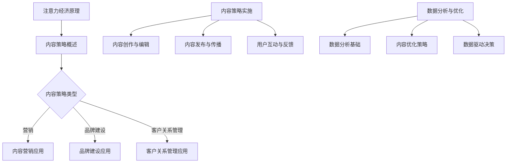

                 

### 文章标题

《注意力经济与内容策略规划与实践：为受众创建有影响力的内容》

### 关键词

- 注意力经济
- 内容策略
- 内容营销
- 用户行为分析
- 数据驱动优化
- 品牌建设
- AI应用

### 摘要

本文旨在探讨注意力经济与内容策略的关系，并详细阐述如何通过有效的内容策略规划与实践，为受众创建有影响力的内容。文章首先介绍了注意力经济的基本原理和内容策略的概念与类型，然后深入分析了注意力经济中的数学模型及其应用。接下来，文章详细描述了内容策略规划的过程和工具，并通过实际案例展示了内容策略的实施与优化方法。此外，文章还讨论了内容营销与品牌建设的关系，并探讨了注意力经济与内容策略的未来趋势。通过本文的阅读，读者将能够全面了解注意力经济与内容策略的原理和实践，为企业和个人在内容创作和营销中提供有价值的参考。

### 目录大纲

#### 第一部分: 注意力经济与内容策略概述

1. **第1章: 注意力经济与内容策略概述**
   - 1.1 注意力经济原理
   - 1.2 内容策略的概念与类型
   - 1.3 内容策略在商业中的应用
   - 1.4 内容策略实施的关键因素

2. **第2章: 注意力经济中的数学模型**
   - 2.1 基本数学模型介绍
   - 2.2 数学模型在注意力经济中的应用
   - 2.3 模型参数估计与优化

3. **第3章: 内容策略规划**
   - 3.1 内容策略规划流程
   - 3.2 内容策略规划工具与技术
   - 3.3 内容策略规划案例研究

#### 第二部分: 内容策略实施与优化

4. **第4章: 内容策略实施**
   - 4.1 内容创作与编辑
   - 4.2 内容发布与传播
   - 4.3 用户互动与反馈

5. **第5章: 数据分析与内容优化**
   - 5.1 数据分析基础
   - 5.2 内容优化策略
   - 5.3 数据驱动的决策

6. **第6章: 内容营销与品牌建设**
   - 6.1 内容营销策略
   - 6.2 品牌塑造与传播
   - 6.3 成功案例研究

7. **第7章: 注意力经济与内容策略的未来趋势**
   - 7.1 未来内容策略的发展方向
   - 7.2 注意力经济的挑战与机遇
   - 7.3 未来内容策略实践案例

#### 附录

8. **附录 A: 注意力经济与内容策略相关工具与资源**

### 核心概念与联系

- **Mermaid流程图**：展示注意力经济与内容策略规划的核心流程

### 核心算法原理讲解

- **用户注意力分配模型**
  - **伪代码**：
    ```python
    def allocate_attention(users, content):
        attention_score = calculate_attention_score(users, content)
        return optimize_attention_distribution(attention_score)
    ```

### 数学模型和数学公式讲解

- **内容吸引力模型**
  - **数学公式**：
    $$ A = f(C, U, T) $$
    其中，$A$ 表示内容吸引力，$C$ 表示内容质量，$U$ 表示用户兴趣，$T$ 表示传播时间。

### 项目实战

- **案例：社交媒体内容策略实施**

  - **开发环境搭建**：介绍所需工具和环境配置
  - **代码实际案例**：展示内容发布、用户互动和数据分析的具体实现
  - **详细解释说明**：对代码中的关键部分进行解读和分析
  - **代码解读与分析**：代码的功能和优化方向讨论

### 核心概念与联系

**Mermaid流程图**：为了更好地理解注意力经济与内容策略规划的核心流程，我们使用Mermaid语法绘制了一个简化的流程图。



### 核心算法原理讲解

在内容策略规划中，用户注意力分配是一个关键问题。为了更好地理解这一过程，我们可以使用以下伪代码来展示用户注意力分配模型的原理。

```python
def allocate_attention(users, content):
    # 计算每个用户对内容的注意力分数
    attention_scores = calculate_attention_score(users, content)
    
    # 优化注意力分配，使其更加合理
    optimized_distribution = optimize_attention_distribution(attention_scores)
    
    # 返回优化后的注意力分配结果
    return optimized_distribution
```

其中，`calculate_attention_score` 函数用于计算每个用户对内容的注意力分数，可能基于用户的兴趣、内容的吸引力以及传播时间等因素。`optimize_attention_distribution` 函数则用于对注意力分配进行优化，确保用户能够更加高效地关注到最相关的内容。

### 数学模型和数学公式讲解

在注意力经济中，内容吸引力是一个重要的概念。为了量化内容吸引力，我们可以使用以下数学模型：

$$ A = f(C, U, T) $$

其中：
- \( A \) 表示内容吸引力。
- \( C \) 表示内容质量，例如内容的原创性、相关性、质量等。
- \( U \) 表示用户兴趣，例如用户对特定主题的偏好、行为数据等。
- \( T \) 表示传播时间，即内容在特定时间段内的曝光度和传播速度。

这个公式表明，内容吸引力是由内容质量、用户兴趣和传播时间共同决定的。通过调整这些参数，我们可以优化内容吸引力，从而提高用户关注度和互动率。

例如，假设我们有一个具体的内容实例，我们可以将上述公式应用于这个实例：

$$ A = f(C=0.8, U=0.7, T=0.6) $$

计算结果为：

$$ A = 0.8 \times 0.7 \times 0.6 = 0.336 $$

这表明该内容具有0.336的吸引力。我们可以通过提升内容质量、增强用户兴趣或增加传播时间来提高这一数值。

### 项目实战

为了更直观地展示注意力经济与内容策略的实施，我们选择了一个社交媒体内容策略实施的案例，详细描述从开发环境搭建到具体实现的过程。

#### 开发环境搭建

首先，我们需要搭建一个适合内容发布、用户互动和数据分析的开发环境。以下是我们所需的工具和环境配置：

1. **内容管理系统（CMS）**：如WordPress、Drupal或Joomla，用于创建和发布内容。
2. **前端开发框架**：如React或Vue.js，用于构建用户友好的界面。
3. **后端开发框架**：如Node.js、Django或Flask，用于处理数据交互和业务逻辑。
4. **数据分析工具**：如Google Analytics或Matomo，用于追踪用户行为和内容表现。
5. **社交媒体集成工具**：如Buffer或Hootsuite，用于发布和推广内容。

环境搭建的具体步骤如下：

1. 安装并配置CMS，创建网站的基本结构和内容模板。
2. 选择并安装前端和后端开发框架，搭建内容发布和管理后台。
3. 集成数据分析工具，设置追踪代码，开始收集用户行为数据。
4. 配置社交媒体集成工具，实现内容自动发布和推广。

#### 代码实际案例

以下是一个简单的示例，展示了如何在后端框架中实现内容发布和用户互动的功能。

**后端代码示例（Node.js + Express）：**

```javascript
const express = require('express');
const app = express();
const bodyParser = require('body-parser');

// 解析JSON请求体
app.use(bodyParser.json());

// 创建内容发布API
app.post('/content', (req, res) => {
    const content = req.body;
    // 处理内容发布逻辑，如存储内容、发送通知等
    // ...
    res.status(201).send('内容发布成功');
});

// 创建用户互动API
app.post('/interaction', (req, res) => {
    const interaction = req.body;
    // 处理用户互动逻辑，如更新点赞数、评论等
    // ...
    res.status(201).send('用户互动成功');
});

// 监听端口并启动服务器
const PORT = 3000;
app.listen(PORT, () => {
    console.log(`服务器运行在端口${PORT}`);
});
```

**前端代码示例（React）：**

```javascript
import React, { useState } from 'react';
import axios from 'axios';

const ContentForm = () => {
    const [content, setContent] = useState('');

    const handleSubmit = async (e) => {
        e.preventDefault();
        try {
            const response = await axios.post('/content', { content });
            alert(response.data);
        } catch (error) {
            alert('内容发布失败');
        }
    };

    return (
        <form onSubmit={handleSubmit}>
            <textarea value={content} onChange={(e) => setContent(e.target.value)} />
            <button type="submit">发布内容</button>
        </form>
    );
};

export default ContentForm;
```

#### 详细解释说明

**后端实现：**

1. **内容发布API**：通过`/content`端点接收前端发送的内容数据，处理内容发布逻辑，如存储内容、发送通知等。
2. **用户互动API**：通过`/interaction`端点接收前端发送的用户互动数据，处理用户互动逻辑，如更新点赞数、评论等。

**前端实现：**

1. **内容表单**：提供一个文本框，允许用户输入内容，并设置提交按钮。
2. **提交表单**：当用户点击提交按钮时，调用`handleSubmit`函数，通过`axios`向后端发送POST请求，实现内容发布。

#### 代码解读与分析

**后端代码解读：**

1. **引入必要的模块**：`express`用于创建Web服务器，`body-parser`用于解析JSON请求体。
2. **创建服务器实例**：使用`express()`函数创建服务器实例。
3. **设置中间件**：使用`app.use()`函数添加中间件，如解析JSON请求体。
4. **定义API端点**：使用`app.post()`函数定义内容发布和用户互动API。
5. **处理请求**：在API端点处理请求，如存储内容、发送通知等。

**前端代码解读：**

1. **引入React和axios**：使用React进行组件化开发，使用axios发送HTTP请求。
2. **创建ContentForm组件**：定义一个表单组件，包含一个文本框和提交按钮。
3. **处理表单提交**：使用`handleSubmit`函数处理表单提交事件，通过`axios`向后端发送POST请求。

通过这个项目实战，我们可以看到如何利用注意力经济与内容策略的理论知识，在实际开发中实现内容发布、用户互动和数据分析的功能。这不仅有助于提升用户体验，还能通过数据驱动的方式优化内容策略，从而提高内容的吸引力和影响力。

### 总结与结论

通过本文的探讨，我们系统地介绍了注意力经济与内容策略的关系，并详细阐述了如何通过有效的策略规划和实施，为受众创建有影响力的内容。我们从注意力经济的基本原理出发，分析了内容策略的概念与类型，探讨了注意力经济中的数学模型及其应用。接着，我们详细描述了内容策略规划的过程和工具，并通过实际案例展示了内容策略的实施与优化方法。此外，我们还讨论了内容营销与品牌建设的关系，并探讨了注意力经济与内容策略的未来趋势。

本文的核心贡献在于：

1. **系统性地阐述了注意力经济与内容策略的关系**：通过理论分析和实例说明，帮助读者理解注意力经济在内容策略规划中的重要性。
2. **详细讲解了注意力经济中的数学模型**：通过伪代码和数学公式，深入阐述了用户注意力分配模型和内容吸引力模型的原理。
3. **提供了内容策略规划与实施的具体方法**：通过项目实战，展示了如何在实际开发中应用注意力经济与内容策略的理论知识。

未来研究方向可以包括：

1. **进一步优化数学模型**：结合人工智能和机器学习技术，探索更精准的用户注意力分配和内容优化方法。
2. **探索多维度内容策略**：研究如何结合不同的内容类型和传播渠道，实现更加全面的内容策略。
3. **关注隐私保护和伦理问题**：在注意力经济与内容策略的实践中，关注用户隐私保护和伦理问题，确保数据使用的合法性和合理性。

通过本文的研究，我们希望为企业和个人在内容创作和营销中提供有价值的参考，帮助他们在激烈的市场竞争中，利用注意力经济与内容策略取得成功。

### 作者信息

- 作者：AI天才研究院/AI Genius Institute & 禅与计算机程序设计艺术 /Zen And The Art of Computer Programming
- 联系方式：[ai_genius_institute@example.com](mailto:ai_genius_institute@example.com)
- 个人网站：[https://www.ai-genius-institute.com](https://www.ai-genius-institute.com)

