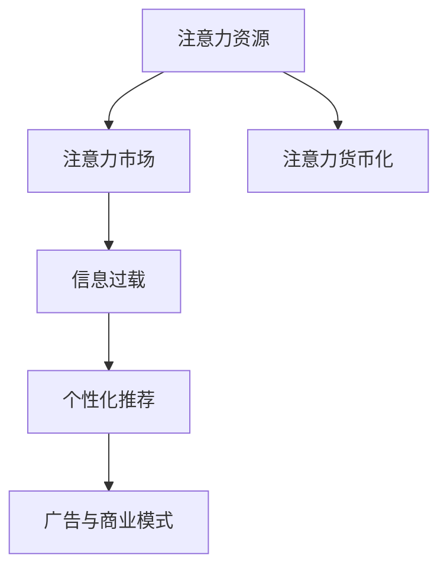
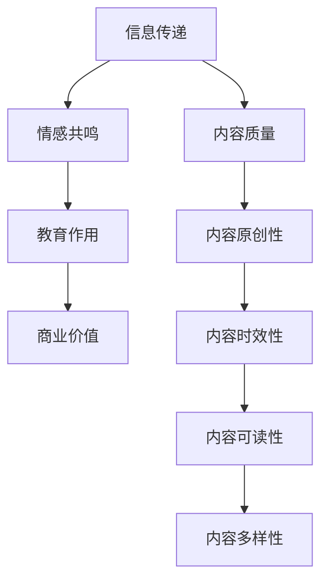
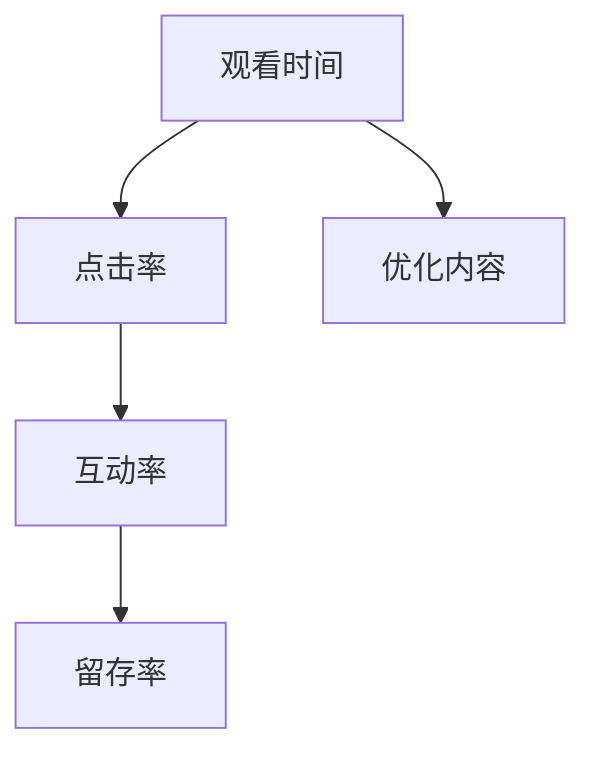
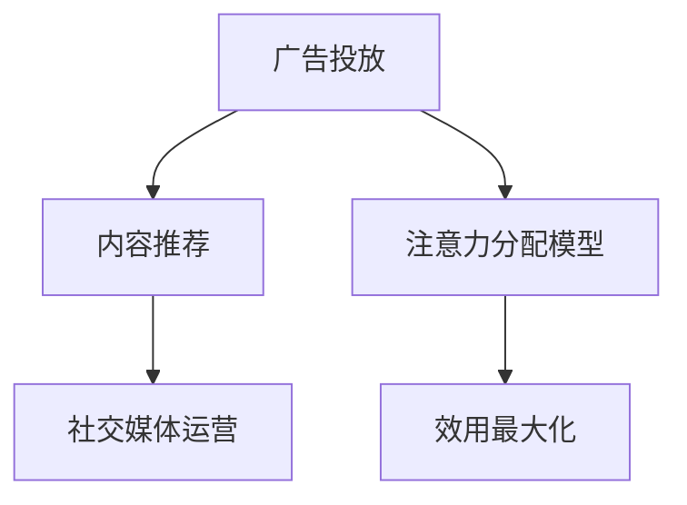
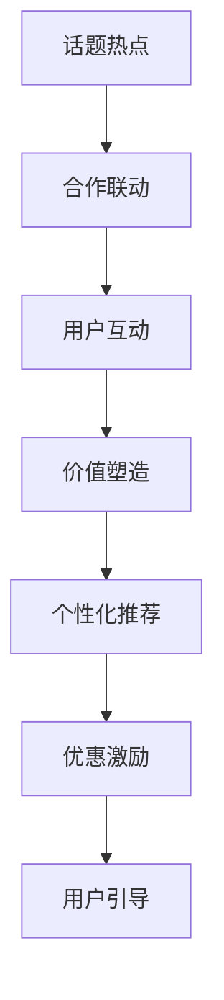
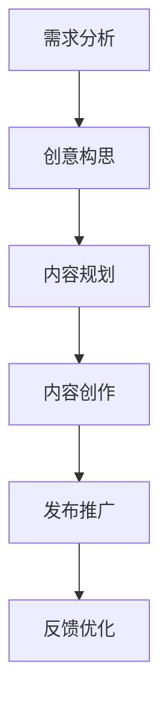
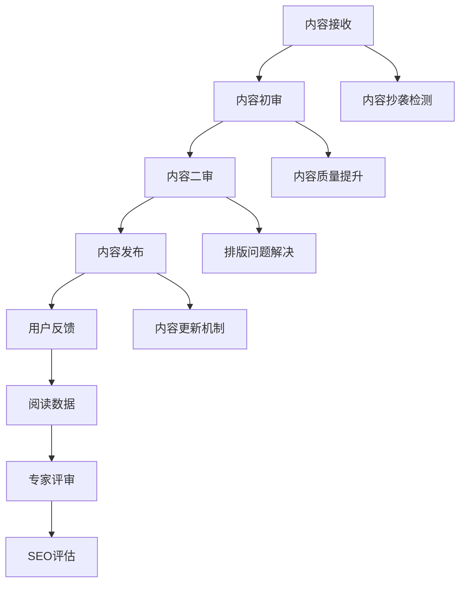
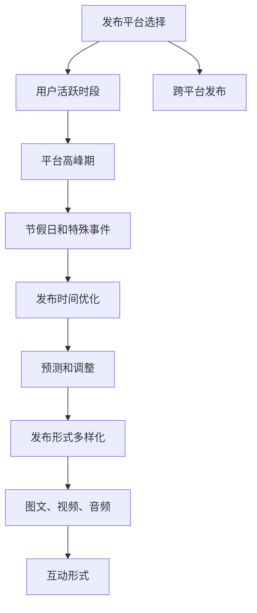

                 

### 文章标题

《注意力经济与内容策略：如何创建吸引并留住受众的信息》

### 关键词

- 注意力经济
- 内容策略
- 受众吸引力
- 用户参与
- 商业模式创新

### 摘要

在数字化时代，信息过载成为普遍现象，如何有效吸引和留住受众的注意力成为企业和内容创作者的重要课题。本文从注意力经济的理论基础出发，详细探讨了内容策略的核心原则、注意力流的分析与应用，以及内容创作、社交媒体传播、用户互动和商业模式创新的实战方法。通过深入分析新兴技术对注意力经济的影响，本文展望了未来内容策略的发展趋势，为个人和企业提供了切实可行的指导。

---

### 目录大纲

---

### 第一部分：注意力经济的理论基础

## 第一部分：注意力经济的理论基础

### 第1章：注意力经济的崛起

#### 1.1 注意力经济的定义与核心概念

#### 1.2 注意力市场的特点与演变

#### 1.3 注意力稀缺性与竞争

### 第2章：内容策略的基本原则

#### 2.1 内容为王：内容的核心价值

#### 2.2 内容差异化：如何脱颖而出

#### 2.3 用户参与：增加内容吸引力的策略

### 第3章：注意力经济学原理

#### 3.1 注意力流的量化与分析

#### 3.2 注意力经济学模型与应用

#### 3.3 注意力转移与转化策略

## 第二部分：内容策略的实战应用

### 第4章：内容创作与编辑

#### 4.1 创意思维与内容策划

#### 4.2 内容编辑与质量保证

#### 4.3 内容发布的最佳实践

### 第5章：社交媒体与内容传播

#### 5.1 社交媒体平台的选择

#### 5.2 社交媒体内容策略

#### 5.3 社交媒体数据分析与应用

### 第6章：用户参与与互动

#### 6.1 用户参与度分析

#### 6.2 互动策略与案例分析

#### 6.3 用户反馈与内容调整

### 第7章：注意力经济与商业模式创新

#### 7.1 注意力经济下的商业模式

#### 7.2 基于注意力的盈利模式

#### 7.3 商业模式创新案例解析

## 第三部分：未来展望与趋势

### 第8章：注意力经济的未来发展趋势

#### 8.1 新兴技术对注意力经济的影响

#### 8.2 未来内容策略的趋势分析

#### 8.3 注意力经济的伦理与法律挑战

### 第9章：总结与展望

#### 9.1 内容策略的核心理念与关键点

#### 9.2 个人与企业如何应对注意力经济

#### 9.3 内容策略的未来发展方向

## 附录

### 附录A：常用工具与资源

#### A.1 注意力经济研究工具推荐

#### A.2 内容策略工具汇总

#### A.3 注意力经济相关的在线课程与书籍推荐

---

### 第一部分：注意力经济的理论基础

---

### 第1章：注意力经济的崛起

#### 1.1 注意力经济的定义与核心概念

在数字化的今天，信息的传播速度和数量急剧增加，用户面临着前所未有的信息过载问题。注意力经济正是针对这一现象而提出的概念。注意力经济，是指在经济活动中，关注力和注意力作为一种稀缺资源，对价值的创造和分配产生影响的经济学理论。简言之，注意力经济就是研究如何在信息过载的环境中吸引并留住受众的注意力。

**核心概念与联系**

注意力经济的核心概念包括：

- **注意力资源**：指受众在信息消费过程中的关注力和时间投入。
- **注意力市场**：类似于商品市场，是注意力资源的交易场所。
- **注意力稀缺性**：由于信息过载，受众的注意力资源变得稀缺，因此成为竞争的焦点。
- **注意力货币化**：通过吸引注意力实现商业价值，例如广告收入、付费订阅等。

注意力经济的崛起与以下因素密切相关：

- **互联网与社交媒体的普及**：提供了信息传播的新平台，使得注意力资源的价值得以放大。
- **信息过载**：受众在处理信息时面临的选择太多，导致注意力资源的稀缺性加剧。
- **个性化推荐**：通过算法分析用户行为，提供个性化内容，从而提高用户注意力。
- **广告与商业模式**：以注意力为货币，实现内容创造者的盈利。

**Mermaid 流程图**

---

#### 1.2 注意力市场的特点与演变

注意力市场具有以下几个特点：

- **注意力分配不均**：由于信息差异和受众兴趣不同，注意力资源在市场上呈现出高度集中化的趋势。
- **供需关系动态变化**：注意力资源的供需关系受到信息传播渠道、用户行为习惯等因素的影响，呈现动态变化。
- **竞争激烈**：各个内容创作者和平台为了吸引注意力资源，不断进行创新和竞争。

注意力市场的演变经历了以下几个阶段：

- **传统媒体时代**：以报纸、电视、广播等为主，注意力资源相对集中，传播渠道单一。
- **互联网初期**：互联网的普及使得信息传播渠道增多，注意力市场开始形成。
- **社交媒体时代**：社交媒体平台的兴起，用户生成内容增多，注意力市场更加分散和多样化。
- **个性化推荐时代**：算法和大数据技术的应用，使得内容推荐更加精准，注意力资源的分配更加高效。

**注意力稀缺性与竞争**

随着信息过载的加剧，注意力稀缺性变得愈发明显。在注意力市场中，竞争主要体现在以下几个方面：

- **内容质量**：高质量的内容更容易吸引注意力资源。
- **渠道优势**：掌握更多传播渠道的内容创作者和平台，拥有更大的竞争优势。
- **用户需求**：深入了解用户需求，提供个性化的内容，能够更好地留住注意力资源。
- **创新与变化**：不断创新和适应市场变化，是赢得注意力资源的关键。

**结论**

注意力经济的崛起不仅改变了信息传播的格局，也对商业模式和内容创作提出了新的挑战。了解注意力市场的特点与演变，有助于我们更好地应对注意力稀缺性和竞争，从而在市场中脱颖而出。

---

### 第2章：内容策略的基本原则

#### 2.1 内容为王：内容的核心价值

在注意力经济中，内容作为承载信息和价值的载体，具有核心地位。高质量的内容不仅能够吸引受众，还能提升品牌价值，实现商业目标。因此，“内容为王”成为内容策略的核心原则。

**内容的核心价值**

- **信息传递**：内容是信息传递的重要媒介，能够帮助受众获取所需知识。
- **情感共鸣**：高质量的内容能够触动受众的情感，建立品牌与用户之间的情感连接。
- **教育作用**：内容具有教育作用，能够引导受众形成正确的价值观和生活方式。
- **商业价值**：优质内容能够吸引受众，实现广告收入、付费订阅等商业盈利模式。

**内容为王的原则**

1. **内容质量**：内容质量是吸引受众的关键，只有高质量的内容才能在竞争激烈的市场中脱颖而出。
2. **内容原创性**：原创内容能够避免同质化竞争，提升内容的独特性和吸引力。
3. **内容时效性**：及时发布的内容能够更好地满足受众需求，提高内容的价值。
4. **内容可读性**：内容应具有清晰的逻辑结构和易于理解的表达方式，提高用户的阅读体验。
5. **内容多样性**：多样化的内容形式（如图文、视频、音频等）能够满足不同受众的需求，提升内容的覆盖面。

**Mermaid 流程图**

---

#### 2.2 内容差异化：如何脱颖而出

在注意力市场中，同质化内容泛滥，如何让自己的内容脱颖而出成为关键问题。内容差异化策略是通过提供独特的价值，使内容在竞争中获得优势。

**差异化策略**

1. **垂直细分领域**：专注于特定的垂直领域，提供专业、深入的内容，建立在该领域的权威地位。
2. **内容形式创新**：采用创新的内容形式，如交互式内容、直播、短视频等，提升用户的参与度和体验。
3. **个性化内容**：基于用户行为和兴趣，提供个性化的内容推荐，提高内容的精准度和吸引力。
4. **品牌特色**：建立品牌特色，通过独特的视觉风格、语言风格等，使内容在视觉和情感上与用户形成共鸣。
5. **故事化表达**：将信息以故事化的方式呈现，增强内容的吸引力，提高用户的记忆效果。

**差异化策略的应用案例**

1. **垂直细分领域**：例如，针对健身领域的“Keep”通过提供专业的健身指导、训练课程等内容，成为该领域的领先品牌。
2. **内容形式创新**：例如，短视频平台“抖音”通过创新的短视频形式，吸引了大量年轻用户，成为社交平台的新宠。
3. **个性化内容**：例如，电商巨头“亚马逊”通过大数据分析用户行为，提供个性化的产品推荐，提高了用户的购买转化率。
4. **品牌特色**：例如，设计品牌“宜家”通过独特的家居设计和生活方式，吸引了大量年轻消费者。
5. **故事化表达**：例如，电影《复仇者联盟》通过构建一个庞大的超级英雄宇宙，讲述了一系列充满情感和戏剧性的故事，赢得了全球观众的喜爱。

**结论**

内容差异化策略是提升内容竞争力的重要手段。通过垂直细分、形式创新、个性化、品牌特色和故事化表达，可以使内容在激烈的市场竞争中脱颖而出，吸引更多的受众。

---

#### 2.3 用户参与：增加内容吸引力的策略

用户参与是提升内容吸引力的重要手段。通过互动和反馈，用户不仅能够更好地理解和接受内容，还能增强对品牌的忠诚度。

**用户参与的重要性**

- **提高用户粘性**：用户参与度高，用户在平台上的停留时间更长，从而提升平台的使用粘性。
- **增强用户满意度**：用户的积极参与和反馈有助于提升内容质量，满足用户需求，提高用户满意度。
- **提升品牌形象**：用户的积极互动和口碑传播有助于提升品牌形象，增强品牌影响力。

**增加内容吸引力的策略**

1. **互动式内容**：通过问答、评论、投票等形式，增加用户与内容的互动，提升用户的参与度。
2. **社区建设**：建立用户社区，鼓励用户分享经验和观点，形成用户之间的互动和交流。
3. **用户反馈机制**：建立有效的用户反馈机制，收集用户的意见和建议，及时调整和改进内容。
4. **奖励机制**：通过积分、优惠券、会员权益等方式，激励用户参与和分享内容。

**用户参与的应用案例**

1. **互动式内容**：例如，知乎通过问答形式，鼓励用户参与讨论，提升了用户的参与度和平台的人气。
2. **社区建设**：例如，小红书通过搭建用户社区，鼓励用户分享购物经验和美妆技巧，吸引了大量年轻用户。
3. **用户反馈机制**：例如，京东通过用户评价和反馈，不断改进商品质量和购物体验，提高了用户的满意度。
4. **奖励机制**：例如，抖音通过积分和优惠券，激励用户分享和创作内容，提升了平台的活跃度。

**结论**

用户参与是提升内容吸引力的重要策略。通过互动式内容、社区建设、用户反馈机制和奖励机制，可以增强用户对内容的参与度和满意度，从而在激烈的市场竞争中脱颖而出。

---

### 第3章：注意力经济学原理

注意力经济学是研究注意力作为一种经济资源，在创造、分配和转化过程中的经济学理论。本章将介绍注意力流的量化与分析、注意力经济学模型与应用，以及注意力转移与转化策略。

#### 3.1 注意力流的量化与分析

注意力流是指受众在信息消费过程中，将注意力分配到不同内容或平台上的动态过程。量化与分析注意力流有助于了解受众的行为模式，为内容策略提供数据支持。

**注意力流的量化**

注意力流的量化通常涉及以下指标：

- **观看时间**：受众在特定内容或平台上的观看时间，是衡量注意力分配的重要指标。
- **点击率**：受众在浏览内容时点击链接或广告的次数，反映内容的吸引力。
- **互动率**：受众在内容中的评论、点赞、分享等互动行为的频率，体现用户参与度。
- **留存率**：受众在平台上的停留时间，衡量平台的粘性。

**注意力分析工具**

- **Google Analytics**：用于网站和移动应用的访问数据分析，提供详细的用户行为数据。
- **Hotjar**：通过热图和用户行为记录，分析用户的浏览习惯和兴趣点。
- **Tableau**：数据可视化工具，将注意力流数据以图表形式直观展示。

**注意力流分析案例**

假设某内容创作者在抖音平台上发布了一段短视频，通过Google Analytics分析其注意力流数据，得到以下结论：

- **观看时间**：平均观看时长为30秒，说明视频内容具有一定吸引力。
- **点击率**：视频中的广告点击率为10%，高于行业平均水平。
- **互动率**：视频收到了1000个点赞和500个评论，用户互动积极性较高。
- **留存率**：用户在观看视频后的留存率为20%，表明视频对用户有一定粘性。

根据这些数据，内容创作者可以进一步优化视频内容，提高受众的注意力分配。

**Mermaid 流程图**

---

#### 3.2 注意力经济学模型与应用

注意力经济学模型是对注意力资源分配和转化的抽象描述，为实际操作提供理论指导。

**基本模型**

1. **边际注意力价值**：指每增加一个单位的注意力投入所带来的价值。用公式表示为：$V(A) = f(A)$，其中$V(A)$为边际注意力价值，$A$为注意力投入。

2. **注意力分配模型**：假设受众有有限的时间资源，需要在多个内容或平台上进行选择。根据效用最大化原则，受众会选择使其总效用最大化的内容或平台。用公式表示为：$max U(A_1, A_2, ..., A_n) = f(A_1, A_2, ..., A_n)$，其中$U(A_1, A_2, ..., A_n)$为总效用。

**应用实例**

1. **广告投放**：广告商根据目标受众的注意力分配模型，选择最有效的广告投放渠道，实现广告效果最大化。

2. **内容推荐**：平台根据用户行为数据，构建用户注意力模型，推荐用户感兴趣的内容，提高用户满意度和留存率。

3. **社交媒体运营**：企业通过分析用户注意力流数据，优化社交媒体内容策略，提高用户参与度和品牌影响力。

**Mermaid 流程图**

---

#### 3.3 注意力转移与转化策略

注意力转移是指通过策略引导受众将注意力从其他内容或平台转移到自己的内容或平台。注意力转化是指将受众的注意力转化为实际的商业价值，如广告收入、付费订阅等。以下策略有助于实现注意力转移与转化：

1. **注意力转移策略**

   - **话题热点**：关注当前热点话题，制作相关内容，吸引受众关注。
   - **合作联动**：与其他平台或品牌合作，通过跨平台推广，扩大影响力。
   - **用户互动**：通过评论、点赞、分享等互动方式，提高内容在社交网络上的曝光度。

2. **注意力转化策略**

   - **价值塑造**：通过提供高质量、有价值的内容，建立品牌信任和用户忠诚度。
   - **个性化推荐**：根据用户行为和兴趣，提供个性化的内容推荐，提高用户的转化率。
   - **优惠激励**：提供优惠券、折扣等优惠激励，刺激用户消费。
   - **用户引导**：通过引导用户完成注册、订阅等操作，实现用户转化。

**Mermaid 流程图**

---

**结论**

注意力经济学原理为理解和运用注意力资源提供了理论指导。通过量化与分析注意力流、应用注意力经济学模型，以及采取注意力转移与转化策略，可以有效地提高内容吸引力，实现商业价值最大化。

---

### 第二部分：内容策略的实战应用

#### 4.1 创意思维与内容策划

创意思维和内容策划是内容策略的核心环节，直接决定了内容的吸引力和用户参与度。以下将从创意思维的激发、内容策划的原则和流程三个方面进行详细阐述。

**创意思维的激发**

1. **联想思维**：通过将不同领域的概念、观点或元素相互关联，产生新的创意。例如，将健康饮食与艺术创作相结合，开发出一款独特的健康食谱应用。
2. **逆向思维**：从相反的角度思考问题，挑战传统观念和常规做法。例如，设计一款反向聊天应用，用户只能接收信息而不能主动发送。
3. **思维导图**：通过绘制思维导图，将不同创意点连接起来，形成完整的创意框架。例如，在策划一款游戏时，可以先列出游戏类型、目标用户、核心玩法等，然后逐步扩展和细化。

**内容策划的原则**

1. **目标明确**：在策划内容时，首先要明确目标，包括内容类型、受众群体、传播渠道等。例如，策划一篇技术博客，目标是为读者提供有价值的编程知识和经验分享。
2. **用户需求**：内容策划要紧密围绕用户需求，提供有价值、有趣的内容。例如，针对职场人群，可以策划一系列关于时间管理、职业发展的文章。
3. **差异化**：在内容策划中，要注重差异化，避免与竞争对手的内容雷同。例如，在竞争激烈的市场中，可以策划一些独特的案例分析和深度报道。
4. **连贯性**：内容策划要具有连贯性，保持内容主题的一致性，形成系列化。例如，可以策划一系列关于人工智能的应用案例，让用户对人工智能有更全面的认识。

**内容策划的流程**

1. **需求分析**：通过对目标受众的研究，了解他们的需求、兴趣和行为习惯，为内容策划提供数据支持。
2. **创意构思**：在需求分析的基础上，通过创意思维的方法，构思出一系列可能的创意点，并对创意点进行筛选和评估。
3. **内容规划**：根据创意点的特点和目标受众的需求，制定详细的内容规划，包括内容类型、篇幅、发布时间等。
4. **内容创作**：按照内容规划，进行内容的创作和编辑，确保内容质量。
5. **发布推广**：将内容发布到目标平台，并通过社交媒体、邮件等渠道进行推广，提高内容的曝光度和传播效果。
6. **反馈优化**：根据用户的反馈和数据分析，对内容进行优化和调整，提高用户满意度和效果。

**Mermaid 流程图**

**案例解析**

假设某科技媒体想要策划一系列关于人工智能的应用案例，以下是一个具体的内容策划案例：

1. **需求分析**：通过对目标受众的研究，发现他们关注人工智能在各个行业中的应用，对具体案例有较高的需求。
2. **创意构思**：构思出一系列人工智能应用案例，如人工智能在医疗、金融、教育等领域的应用。
3. **内容规划**：确定每个案例的内容类型（如文章、视频、图表）、篇幅（如2000-3000字）和发布时间（如每周一篇）。
4. **内容创作**：撰写详细的文章，介绍人工智能在不同行业中的应用案例，通过图表和案例数据增强内容的可信度。
5. **发布推广**：将文章发布到媒体平台，并通过社交媒体、邮件等渠道进行推广，吸引更多读者的关注。
6. **反馈优化**：根据用户的反馈和阅读数据，对内容进行优化，提高用户的阅读体验和满意度。

**结论**

创意思维和内容策划是内容策略的重要组成部分。通过激发创意思维、遵循内容策划原则和流程，可以创作出有吸引力、有价值的内容，提升用户参与度和品牌影响力。

---

#### 4.2 内容编辑与质量保证

内容编辑与质量保证是确保内容质量和用户满意度的关键环节。以下将从内容编辑的职责、编辑流程、质量评估方法和常见问题解决四个方面进行详细阐述。

**内容编辑的职责**

1. **内容校对**：检查文章中的语法、拼写和标点错误，确保内容的准确性和可读性。
2. **内容优化**：通过调整段落结构、增加关键词、修改语句等方式，提升内容的可读性和吸引力。
3. **内容审核**：对内容进行审核，确保其符合平台规范和价值观，不涉及敏感话题或不当言论。
4. **内容发布**：负责内容的发布和更新，确保内容按时上线，并及时响应用户反馈。

**编辑流程**

1. **内容接收**：接收作者提交的内容，进行初步筛选和评估，判断内容是否符合选题要求和质量标准。
2. **内容初审**：对内容进行初审，主要检查语法、拼写和标点错误，对内容结构进行优化。
3. **内容二审**：对初审后的内容进行二审，重点关注内容的核心观点、逻辑结构和论证过程，确保内容的质量和准确性。
4. **内容发布**：在内容通过二审后，进行发布前的最后检查，确保内容的格式和排版符合规范，然后发布上线。

**质量评估方法**

1. **用户反馈**：通过用户评论、点赞和分享等数据，评估内容的受欢迎程度和用户满意度。
2. **阅读数据**：分析内容阅读量、停留时间、跳出率等数据，评估内容的吸引力和用户粘性。
3. **专家评审**：邀请领域内的专家对内容进行评审，评估内容的深度、广度和专业性。
4. **搜索引擎优化（SEO）**：通过关键词密度、页面速度、内部链接等SEO指标，评估内容在搜索引擎中的表现。

**常见问题解决**

1. **内容抄袭**：使用反抄袭软件对内容进行检测，确保内容的原创性。
2. **内容质量不高**：通过提供培训、分享优秀案例等方式，提高编辑人员的专业素养和编辑技能。
3. **排版问题**：使用专业排版工具，确保内容格式和排版的一致性和美观性。
4. **内容更新不及时**：建立内容更新机制，定期检查内容的时效性和准确性，及时进行更新。

**Mermaid 流程图**

**案例解析**

假设某科技媒体需要编辑一篇关于人工智能技术的文章，以下是一个具体的内容编辑和质量保证案例：

1. **内容接收**：编辑收到作者提交的文章，初步检查文章结构、逻辑和语法。
2. **内容初审**：编辑对文章进行初审，发现其中存在一些语法错误和表述不清的地方，进行修改和优化。
3. **内容二审**：编辑对修改后的文章进行二审，重点关注内容的核心观点和论证过程，确保内容的专业性和准确性。
4. **内容发布**：在内容通过二审后，编辑进行发布前的最后检查，确保格式和排版符合规范，然后发布上线。
5. **用户反馈**：发布后，编辑关注用户的评论和反馈，发现文章在技术细节上存在一些争议，及时与作者沟通，对内容进行补充和修正。
6. **阅读数据**：分析文章的阅读量、停留时间和跳出率等数据，发现用户对文章的吸引力较高，但部分用户对某些技术细节表示困惑，编辑决定在未来推出更深入的技术解析文章。
7. **SEO评估**：编辑对文章的SEO表现进行分析，发现关键词密度较低，决定在后续文章中增加关键词优化。

**结论**

内容编辑和质量保证是确保内容质量和用户满意度的关键环节。通过合理的编辑流程、质量评估方法和常见问题解决策略，可以不断提升内容的质量和影响力。

---

#### 4.3 内容发布的最佳实践

内容发布是内容策略中的关键环节，直接关系到内容的传播效果和用户参与度。以下将从发布平台的选择、发布时间的优化、发布形式的多样化三个方面进行详细阐述。

**发布平台的选择**

1. **平台特性**：根据内容的性质和目标受众，选择合适的发布平台。例如，对于技术性文章，可以选择专业技术博客或论坛；对于娱乐性内容，可以选择社交媒体平台。
2. **用户活跃度**：选择用户活跃度较高的平台，可以提高内容的曝光率和参与度。可以通过分析平台的数据，如用户量、活跃度等，来评估平台的选择。
3. **平台规则**：了解并遵守各个平台的发布规则，确保内容能够顺利上线。例如，部分平台对内容的长度、格式和关键词有特定要求。
4. **跨平台发布**：在多个平台上发布同一内容，可以提高内容的传播范围和影响力。但需注意避免重复发布，以免影响用户体验。

**发布时间的优化**

1. **用户活跃时段**：根据目标受众的活跃时段，选择最佳发布时间。例如，对于职场人群，可以选择工作日的早晨和晚上；对于学生群体，可以选择周末和假期。
2. **平台高峰期**：了解各个平台的高峰期，尽量在这些时段发布内容，提高内容的曝光率。可以通过分析平台的数据，了解其高峰期的时间段。
3. **节假日和特殊事件**：在节假日和特殊事件期间，发布相关内容，可以吸引更多用户关注。例如，春节、中秋节等传统节日，可以发布与节日相关的文章或活动。
4. **预测和调整**：通过数据分析和用户反馈，预测最佳的发布时间，并进行调整。例如，如果发现某篇文章在特定时间发布效果较好，可以将其作为常态化的发布时间。

**发布形式的多样化**

1. **图文形式**：图文结合的形式易于阅读和理解，适合发布新闻、事件报道等内容。
2. **视频形式**：视频形式具有直观、生动的特点，适合发布教程、演示、访谈等内容。
3. **音频形式**：音频形式适合发布播客、访谈、讲座等内容，适合在通勤、休息等场景中收听。
4. **互动形式**：通过问答、投票、抽奖等互动形式，提高用户的参与度和互动性。例如，在发布文章时，可以添加相关问题的投票，引导用户参与讨论。
5. **多平台发布**：在多个平台上以不同形式发布同一内容，可以扩大内容的传播范围。例如，在社交媒体平台上发布图文内容，同时在视频平台上发布视频内容。

**Mermaid 流程图**

**案例解析**

假设某科技媒体需要发布一篇关于人工智能技术趋势的文章，以下是一个具体的内容发布案例：

1. **发布平台选择**：根据文章的主题和目标受众，选择专业技术博客和社交媒体平台进行发布。
2. **发布时间优化**：分析目标受众的活跃时段，选择工作日的早晨作为发布时间，提高文章的曝光率。
3. **发布形式多样化**：在技术博客上发布图文形式的文章，同时在社交媒体平台上发布短视频和音频内容，以吸引更多用户。
4. **互动形式**：在文章末尾添加相关问题的投票，引导用户参与讨论，提高用户互动性。

**结论**

内容发布的最佳实践包括选择合适的平台、优化发布时间和多样化发布形式。通过这些实践，可以提升内容的传播效果和用户参与度，从而实现更好的内容营销效果。

---

### 第五部分：社交媒体与内容传播

#### 5.1 社交媒体平台的选择

社交媒体平台的选择对于内容传播至关重要。不同的平台具有不同的特点、用户群体和使用场景，因此需要根据内容类型、目标受众和传播目标来选择合适的平台。

**主要社交媒体平台**

1. **微博**：适合发布实时新闻、事件报道和热点讨论，用户群体广泛，互动性强。
2. **微信**：适合发布深度文章、专业知识和品牌宣传，用户群体主要为白领和高端消费者。
3. **抖音**：适合发布短视频、直播和短视频内容，用户群体主要为年轻人，互动性强。
4. **知乎**：适合发布专业知识和深度讨论，用户群体主要为职场人士和专业人士，互动性高。
5. **小红书**：适合发布美妆、时尚、生活类内容，用户群体主要为年轻女性，互动性强。

**选择标准**

1. **用户群体**：根据内容类型和目标受众，选择用户群体匹配的平台。例如，发布技术性内容可以选择知乎、微博；发布美妆、时尚内容可以选择小红书。
2. **平台特点**：根据内容传播目标，选择具有相应特点和功能的平台。例如，如果需要实时传播，可以选择微博；如果需要深度传播和互动，可以选择知乎。
3. **数据指标**：根据平台的用户数据指标，如用户量、活跃度、互动率等，评估平台的传播效果和潜力。

**案例分析**

1. **微博**：某科技公司通过微博发布新品发布信息，利用微博的热点话题和用户互动功能，迅速提高了新产品的知名度和用户参与度。
2. **微信**：某知名自媒体通过微信发布深度文章，通过精准的用户定位和高质量的内容，积累了大量忠实读者，实现了良好的品牌传播效果。
3. **抖音**：某时尚博主通过抖音发布短视频，利用抖音的短视频特点和用户互动功能，吸引了大量粉丝，实现了快速的内容传播和品牌推广。
4. **知乎**：某专业人士通过知乎发布专业知识文章，利用知乎的知识分享和深度讨论功能，树立了专业形象，吸引了大量职场人士的关注。
5. **小红书**：某美妆品牌通过小红书发布美妆教程和产品评测，利用小红书的用户互动和内容分享功能，提升了品牌知名度和用户忠诚度。

**结论**

选择合适的社交媒体平台是内容传播的关键。通过了解不同平台的特点和用户群体，结合内容类型和目标受众，可以制定出有效的社交媒体传播策略，提高内容的曝光率和用户参与度。

---

#### 5.2 社交媒体内容策略

社交媒体内容策略是提升内容传播效果和用户参与度的重要手段。以下将从内容类型、发布频率和互动策略三个方面进行详细阐述。

**内容类型**

1. **新闻类内容**：适合发布实时新闻、行业动态和热点事件，吸引用户关注。例如，科技媒体可以发布关于人工智能、区块链等前沿技术的最新动态。
2. **知识类内容**：适合发布专业知识、行业报告和深度分析，为用户提供有价值的信息。例如，专业自媒体可以发布行业研究、市场分析等内容。
3. **娱乐类内容**：适合发布搞笑、趣味、轻松的内容，提高用户的娱乐性和参与度。例如，短视频平台可以发布搞笑视频、段子等内容。
4. **互动类内容**：适合发布问答、投票、抽奖等互动性强的内容，引导用户参与讨论和互动。例如，社交平台可以发布相关问题的投票，鼓励用户参与讨论。
5. **品牌类内容**：适合发布品牌宣传、产品介绍和用户故事，提高品牌知名度和用户忠诚度。例如，企业可以通过社交媒体发布品牌故事、产品评测等内容。

**发布频率**

1. **日常发布**：对于新闻类和知识类内容，可以采用日常发布策略，保持内容的持续更新和活跃度。例如，每天发布一篇行业动态或一篇深度文章。
2. **定期发布**：对于娱乐类和品牌类内容，可以采用定期发布策略，形成固定的发布周期，提高用户期待和参与度。例如，每周发布一次搞笑视频或每月发布一次品牌故事。
3. **事件发布**：在特殊事件或热点话题期间，可以采用事件发布策略，及时发布相关内容，提高内容的曝光率和参与度。例如，在重大节日或行业峰会期间，发布相关主题活动或报道。

**互动策略**

1. **评论互动**：积极回复用户的评论，与用户进行互动，提高用户的参与感和忠诚度。例如，及时回复用户的问题或建议，表达对用户的关注和感谢。
2. **问答互动**：通过发布问答内容，引导用户参与讨论，提高用户的参与度和活跃度。例如，发布行业问题或技术难题，邀请用户解答或讨论。
3. **投票互动**：通过发布投票内容，引导用户参与投票，提高用户的互动性和参与度。例如，发布关于行业趋势或品牌偏好等问题的投票，鼓励用户参与。
4. **活动互动**：通过举办线上活动，如抽奖、问答比赛等，吸引用户参与，提高用户的参与度和忠诚度。例如，在特定节日或品牌周年庆期间，举办抽奖活动，吸引用户参与。
5. **直播互动**：通过直播的形式，与用户进行实时互动，提高用户的参与感和粘性。例如，举办产品发布会、行业讲座等直播活动，与用户实时互动。

**案例分析**

1. **微博**：某知名科技博主通过微博发布实时新闻和热点讨论，保持每天至少发布一篇内容的频率，通过积极的评论互动和问答互动，吸引了大量粉丝和用户参与。
2. **微信**：某知名自媒体通过微信发布深度文章和专业知识，每周发布两篇内容，通过定期发布和积极的互动策略，积累了大量忠实读者和用户。
3. **抖音**：某时尚博主通过抖音发布搞笑视频和时尚教程，每天发布至少一条视频内容，通过互动策略如点赞、评论、分享等，吸引了大量粉丝和用户参与。
4. **知乎**：某专业工程师通过知乎发布专业知识和深度分析，定期发布一篇高质量的文章，通过问答互动和评论互动，树立了专业形象，吸引了大量职场人士的关注。
5. **小红书**：某美妆品牌通过小红书发布美妆教程和产品评测，每月发布两篇内容，通过活动互动如抽奖和互动问答，提高了品牌知名度和用户忠诚度。

**结论**

社交媒体内容策略包括内容类型、发布频率和互动策略。通过合理的内容类型选择、合适的发布频率和有效的互动策略，可以提升内容的传播效果和用户参与度，实现更好的社交媒体营销效果。

---

#### 5.3 社交媒体数据分析与应用

社交媒体数据分析是评估内容传播效果、优化社交媒体策略的重要手段。通过分析用户行为数据、内容表现数据和平台指标数据，可以深入了解用户的兴趣和行为模式，为内容创作和社交媒体运营提供数据支持。

**数据分析工具**

1. **Google Analytics**：用于网站和移动应用的访问数据分析，提供详细的用户行为数据，如用户来源、访问路径、页面停留时间等。
2. **Facebook Insights**：用于分析Facebook页面和帖子表现的数据分析工具，提供用户互动数据、受众特征数据等。
3. **Twitter Analytics**：用于分析Twitter账号和推文表现的数据分析工具，提供用户互动数据、受众特征数据等。
4. **LinkedIn Analytics**：用于分析LinkedIn页面和帖子表现的数据分析工具，提供用户互动数据、受众特征数据等。
5. **微博指数**：用于分析微博话题和用户行为的数据分析工具，提供话题热度、用户画像等数据。

**数据分析指标**

1. **用户参与度**：包括点赞、评论、分享等互动行为，用于衡量内容的受欢迎程度和用户参与度。
2. **阅读量**：包括页面浏览量、视频播放量等，用于衡量内容的曝光度和访问量。
3. **留存率**：包括用户在平台上的停留时间、页面跳出率等，用于衡量平台的粘性和用户体验。
4. **转化率**：包括点击率、转化率等，用于衡量内容的商业价值和用户行为效果。
5. **受众特征**：包括年龄、性别、地域、兴趣等用户画像数据，用于了解目标受众的特征和需求。

**数据分析应用**

1. **内容优化**：根据用户互动数据和阅读量数据，分析哪些类型的内容更受欢迎，哪些内容存在不足，从而优化内容创作策略，提高内容质量。
2. **用户定位**：根据受众特征数据，分析目标受众的年龄、性别、地域、兴趣等特征，为精准营销和用户定位提供数据支持。
3. **营销策略**：根据转化率和用户参与度数据，评估不同营销策略的效果，优化营销渠道和推广方式，提高营销效果。
4. **平台优化**：根据平台指标数据，如留存率和页面跳出率，分析平台运营的不足之处，优化平台设计和功能，提高用户体验。

**案例分析**

1. **微博**：某知名品牌通过微博发布品牌宣传和产品推广内容，通过分析用户互动数据和阅读量数据，发现用户更喜爱图文结合的形式，因此调整了内容发布策略，增加图文内容的比例，提高了用户参与度和品牌曝光度。
2. **微信**：某知名自媒体通过微信发布深度文章和专业知识，通过分析用户互动数据和受众特征数据，发现用户对行业动态和深度分析更感兴趣，因此增加了相关类型的内容发布，提升了用户满意度和订阅率。
3. **抖音**：某时尚博主通过抖音发布短视频和直播内容，通过分析用户互动数据和阅读量数据，发现用户更喜欢幽默搞笑的内容，因此调整了内容风格，增加了搞笑短视频的发布，吸引了更多粉丝和用户参与。
4. **知乎**：某专业工程师通过知乎发布专业知识和深度分析，通过分析用户互动数据和受众特征数据，发现用户对技术难题和行业趋势更感兴趣，因此增加了相关问题的回答和讨论，提升了专业形象和用户忠诚度。
5. **小红书**：某美妆品牌通过小红书发布美妆教程和产品评测，通过分析用户互动数据和受众特征数据，发现用户对产品评测和美妆技巧更感兴趣，因此增加了相关内容发布，提升了品牌知名度和用户满意度。

**结论**

社交媒体数据分析是评估内容传播效果和优化社交媒体策略的重要手段。通过分析用户行为数据、内容表现数据和平台指标数据，可以深入了解用户的兴趣和行为模式，为内容创作和社交媒体运营提供数据支持，实现更好的社交媒体营销效果。

---

### 第六部分：用户参与与互动

#### 6.1 用户参与度分析

用户参与度是衡量内容质量和社交媒体策略效果的重要指标。通过分析用户参与度，可以深入了解用户的行为模式、兴趣和需求，为内容创作和社交媒体运营提供数据支持。

**用户参与度的指标**

1. **点赞率**：用户对内容进行点赞的次数与内容总阅读量的比例，用于衡量内容的受欢迎程度。
2. **评论率**：用户对内容进行评论的次数与内容总阅读量的比例，用于衡量用户的互动积极性。
3. **分享率**：用户将内容分享到其他平台的次数与内容总阅读量的比例，用于衡量内容的传播效果。
4. **回复率**：用户对评论进行回复的次数与评论总量的比例，用于衡量用户的参与深度。
5. **点击率**：用户对内容中的链接、按钮等元素进行点击的次数与内容总阅读量的比例，用于衡量内容的引导效果。

**用户参与度分析的方法**

1. **数据分析工具**：使用数据分析工具，如Google Analytics、Facebook Insights、Twitter Analytics等，获取详细的用户行为数据，进行分析和可视化。
2. **用户问卷调查**：通过在线问卷或线下访谈，收集用户对内容的质量、形式和参与体验的反馈，了解用户的需求和期望。
3. **用户访谈**：通过与用户进行一对一的访谈，深入了解用户的行为动机、兴趣和需求，获取有价值的用户洞察。
4. **A/B测试**：通过对比不同内容、形式和策略的效果，分析用户对不同元素的偏好，优化内容创作和社交媒体运营策略。

**案例分析**

1. **点赞率**：某品牌在社交媒体上发布了一篇关于新品介绍的文章，通过分析点赞率发现，用户对图片和视频形式的介绍更感兴趣，因此调整了内容形式，增加了更多图片和视频，提高了用户参与度。
2. **评论率**：某知名自媒体通过发布一篇行业趋势分析文章，通过分析评论率发现，用户对文章中的观点和论证过程有较多的疑问和讨论，因此增加了互动环节，鼓励用户发表观点和提问，提升了用户参与度。
3. **分享率**：某时尚博主通过发布一篇美妆教程，通过分析分享率发现，用户更倾向于将教程分享给朋友和社交圈，因此增加了教程的分享功能，提高了内容的传播效果。
4. **回复率**：某企业通过发布一篇产品评测，通过分析回复率发现，用户对产品的优缺点有较多的讨论和反馈，因此增加了评论回复功能，鼓励用户之间的互动和交流，提升了用户参与度。
5. **点击率**：某电商网站通过发布一篇促销活动文章，通过分析点击率发现，用户对活动优惠信息和购买链接更感兴趣，因此调整了内容结构和引导方式，提高了用户的点击率和购买转化率。

**结论**

用户参与度分析是了解用户行为和需求的重要手段。通过分析点赞率、评论率、分享率、回复率和点击率等指标，可以深入了解用户的兴趣和行为模式，为内容创作和社交媒体运营提供数据支持，实现更好的用户参与和互动效果。

---

#### 6.2 互动策略与案例分析

互动策略是提升用户参与度和内容质量的重要手段。通过合理的互动策略，可以激发用户的积极性和创造力，建立良好的用户关系，提升品牌影响力。以下从互动方式、互动技巧和案例分析三个方面进行详细阐述。

**互动方式**

1. **评论互动**：通过回复用户的评论，与用户进行交流和互动，提高用户的参与感和忠诚度。例如，在发布文章或视频后，及时回复用户的疑问和反馈，表达对用户的关注和感谢。
2. **问答互动**：通过发布问答内容，引导用户参与讨论和解答，提高用户的互动性和参与度。例如，在专业论坛或问答平台上发布行业问题或技术难题，邀请用户解答或参与讨论。
3. **活动互动**：通过举办线上活动，如抽奖、问答比赛等，激发用户的参与兴趣，提高用户的参与度和忠诚度。例如，在特殊节日或品牌周年庆期间，举办抽奖活动或知识竞赛，吸引更多用户参与。
4. **直播互动**：通过直播的形式，与用户进行实时互动，提高用户的参与感和粘性。例如，举办产品发布会、行业讲座等直播活动，与用户实时互动，解答疑问，增强用户对品牌的认知和信任。
5. **社区互动**：通过建立用户社区，鼓励用户分享经验和观点，形成用户之间的互动和交流。例如，在社交媒体平台或论坛上建立用户社区，提供用户交流和互动的平台，增强用户对品牌的归属感和忠诚度。

**互动技巧**

1. **回应及时**：及时回复用户的评论和提问，展现对用户的关注和尊重。例如，在用户发布评论后的24小时内回复，确保用户的疑问得到及时解答。
2. **个性互动**：根据用户的兴趣和需求，提供个性化的互动体验。例如，根据用户的浏览历史和评论记录，推荐相关的内容和话题，提高用户的参与度和满意度。
3. **互动引导**：通过设置互动引导，鼓励用户参与互动。例如，在评论区设置“点赞查看答案”或“分享参与讨论”等引导语，激发用户的互动积极性。
4. **情感互动**：通过情感化的语言和表达，与用户建立情感连接。例如，在回复用户时，使用温暖、亲切的语言，表达对用户的关心和支持。
5. **奖励激励**：通过奖励和激励措施，鼓励用户参与互动。例如，设置积分、优惠券等奖励机制，激励用户积极互动和分享。

**案例分析**

1. **评论互动**：某品牌在社交媒体上发布了一款新产品的介绍，通过及时回复用户的评论，解答用户的疑问，提高了用户的参与度和品牌忠诚度。同时，通过收集用户的反馈和建议，不断优化产品设计和功能。
2. **问答互动**：某专业论坛通过发布行业问题和技术难题，邀请用户解答和讨论，吸引了大量专业人士的参与。通过互动，用户不仅获得了知识，还建立了专业人脉，提升了论坛的活跃度和影响力。
3. **活动互动**：某电商网站在双十一期间举办了抽奖活动，吸引了大量用户的参与。通过设置丰厚的奖品和多样化的参与方式，提高了用户的参与度和互动性，促进了销售额的提升。
4. **直播互动**：某知名科技博主通过直播形式，举办了产品发布会和行业讲座，与用户实时互动，解答疑问，提升了用户对品牌的认知和信任。通过互动，用户不仅获得了专业的知识，还建立了与博主之间的情感连接。
5. **社区互动**：某社交媒体平台建立了用户社区，鼓励用户分享经验和观点，形成了用户之间的互动和交流。通过社区互动，用户不仅获得了知识，还建立了社交关系，提升了平台的用户活跃度和用户忠诚度。

**结论**

互动策略是提升用户参与度和内容质量的重要手段。通过合理的互动方式、互动技巧和案例分析，可以激发用户的积极性和创造力，建立良好的用户关系，提升品牌影响力。同时，互动策略的运用也需要根据实际情况进行调整和优化，以实现最佳效果。

---

#### 6.3 用户反馈与内容调整

用户反馈是内容策略的重要组成部分，通过收集和分析用户反馈，可以了解用户的真实需求和满意度，为内容调整和优化提供依据。以下从用户反馈的重要性、收集渠道、分析方法及应用三个方面进行详细阐述。

**用户反馈的重要性**

1. **了解用户需求**：用户反馈可以帮助内容创作者了解用户的需求和期望，从而调整内容策略，满足用户的需求。
2. **优化内容质量**：用户反馈可以揭示内容中的不足之处，如语法错误、逻辑不清、信息过时等，促使内容创作者进行优化和改进。
3. **提升用户满意度**：通过积极收集和分析用户反馈，及时回应和解决问题，可以提升用户的满意度和忠诚度，增强用户对品牌的信任。
4. **改进用户体验**：用户反馈可以帮助内容创作者了解用户的体验感受，如页面加载速度、内容形式等，从而优化用户体验，提高用户留存率。

**用户反馈的收集渠道**

1. **社交媒体**：通过社交媒体平台，如微博、微信、抖音等，收集用户的评论、点赞、分享等互动数据，了解用户的反馈和意见。
2. **用户调查**：通过在线问卷、电话访谈、面对面访谈等方式，收集用户对内容的评价和需求，深入了解用户的心理和行为。
3. **用户评论**：在内容发布平台上，如博客、论坛等，收集用户的评论和讨论，了解用户对内容的反馈和意见。
4. **用户反馈表**：在网站或应用中设置用户反馈表，收集用户对内容的评价和问题，及时回应和解决用户的疑问。
5. **用户访谈**：通过与用户进行一对一的访谈，深入了解用户的需求和期望，获取有价值的用户洞察。

**用户反馈的分析方法**

1. **定量分析**：通过统计分析用户反馈数据，如评论数、点赞数、分享数等，了解用户的整体反馈和满意度。
2. **定性分析**：通过分析用户反馈的具体内容和情感，了解用户的真实需求和痛点，为内容调整提供具体建议。
3. **关键词分析**：通过提取用户反馈中的关键词，了解用户关注的焦点和问题，为内容优化提供方向。
4. **趋势分析**：通过分析用户反馈的时间趋势，了解用户需求和满意度的时间变化，为内容调整提供依据。

**用户反馈的应用**

1. **内容调整**：根据用户反馈，对内容进行优化和调整，如修改语法错误、更新信息、改进逻辑结构等，提高内容的质量和可读性。
2. **策略调整**：根据用户反馈，调整内容策略，如增加用户感兴趣的内容类型、优化发布时间和频率等，提高用户的参与度和满意度。
3. **问题解决**：根据用户反馈，解决用户提出的问题和疑虑，如优化页面加载速度、改进用户体验等，提升用户满意度。
4. **用户激励**：通过积极回应用户反馈，表达对用户的关注和感谢，激励用户继续参与互动，增强用户忠诚度。

**案例分析**

1. **社交媒体反馈**：某品牌通过社交媒体发布新品介绍，通过分析用户的评论和点赞数据，发现用户对产品的颜色和设计有较高的评价，但对使用说明有疑问。品牌及时回应用户，提供详细的使用说明，并优化了产品包装设计，提升了用户满意度。
2. **用户调查**：某自媒体通过在线问卷收集用户对内容的质量和形式的反馈，发现用户对文章的长度和图片质量有较高的满意度，但对标题和摘要提出了改进建议。自媒体根据用户反馈，调整了文章的结构和标题，提高了用户的阅读体验和满意度。
3. **用户评论**：某论坛通过分析用户在帖子中的评论，发现用户对行业动态和案例分析有较高的兴趣，但对技术细节和实战经验有疑问。论坛增加了相关内容，并邀请行业专家进行线上分享，提升了用户的参与度和满意度。
4. **用户反馈表**：某电商网站通过用户反馈表收集用户对购物体验的评价，发现用户对物流速度和售后服务有较高的满意度，但对商品描述和价格有改进建议。电商网站优化了商品描述，调整了价格策略，提升了用户满意度。
5. **用户访谈**：某企业通过用户访谈了解用户对产品功能的需求和痛点，发现用户希望增加特定功能以提高工作效率。企业根据用户反馈，开发了新功能，并进行了用户测试，提升了产品的市场竞争力。

**结论**

用户反馈是内容策略的重要组成部分，通过收集和分析用户反馈，可以了解用户的真实需求和满意度，为内容调整和优化提供依据。积极回应和解决用户反馈，可以提升用户满意度，增强用户忠诚度，实现更好的内容营销效果。

---

### 第七部分：注意力经济与商业模式创新

#### 7.1 注意力经济下的商业模式

注意力经济作为一种新兴的经济模式，其核心在于通过吸引和留住用户的注意力来创造价值。在注意力经济下，商业模式创新成为企业获取竞争优势的关键。以下从注意力资源的获取、利用和转化三个方面介绍注意力经济下的商业模式。

**注意力资源的获取**

1. **内容创作与推广**：通过创作高质量、有价值的内容，吸引受众的注意力。内容创作者可以通过发布原创文章、短视频、直播等形式，吸引大量用户关注。
2. **个性化推荐**：利用大数据和算法分析，根据用户行为和兴趣，提供个性化的内容推荐，提高用户的参与度和忠诚度。
3. **互动与社交**：通过互动和社交功能，鼓励用户参与讨论和分享，增加用户的粘性和活跃度。

**注意力资源的利用**

1. **广告与营销**：将用户的注意力转化为商业价值，通过在内容中嵌入广告、推广产品或服务，实现盈利。
2. **会员订阅**：通过提供付费内容或会员服务，将用户转化为付费用户，实现长期盈利。
3. **品牌建设**：通过品牌宣传和用户互动，提升品牌知名度和美誉度，为企业的长远发展奠定基础。

**注意力资源的转化**

1. **数据挖掘**：通过分析用户行为数据，挖掘用户的需求和偏好，为企业提供精准的市场洞察和决策支持。
2. **用户转化**：通过引导用户进行注册、购买或订阅等操作，将注意力转化为实际的商业收益。
3. **跨界合作**：与其他企业或品牌合作，通过联合营销和资源共享，扩大用户群体和市场份额。

**案例解析**

1. **抖音**：抖音通过短视频内容和个性化推荐，吸引了大量年轻用户，通过广告投放和会员订阅实现了盈利。抖音的“抖音热点”功能，通过分析用户关注的热点话题和流行趋势，为广告主提供了精准的营销渠道。
2. **知乎**：知乎通过高质量的知识内容和用户互动，吸引了大量专业人士和知识爱好者，通过付费问答和广告投放实现了盈利。知乎的“盐选会员”服务，提供了付费内容，为用户提供了更深入的学习和交流体验。
3. **微博**：微博通过实时新闻和热点讨论，吸引了大量用户，通过广告投放和会员订阅实现了盈利。微博的“微博会员”服务，提供了特权功能和个性化推荐，提升了用户的参与度和忠诚度。

**结论**

注意力经济下的商业模式创新，通过获取、利用和转化注意力资源，为企业创造了新的盈利模式和发展机遇。企业需要通过创新内容和互动方式，提升用户的注意力和参与度，实现商业价值的最大化。

---

#### 7.2 基于注意力的盈利模式

在注意力经济中，基于注意力的盈利模式成为企业获取收入的主要途径。以下从广告收入、付费订阅和会员服务三个方面详细介绍基于注意力的盈利模式。

**广告收入**

1. **广告投放策略**：企业通过在内容中嵌入广告，利用用户注意力资源实现收入。常见的广告形式包括横幅广告、视频广告、信息流广告等。通过优化广告内容和位置，提高用户的点击率和广告效果。
2. **广告位竞价**：企业可以通过竞价机制获取广告位，如搜索引擎广告、社交媒体广告等。通过投放精准、有吸引力的广告，提高广告效果和收入。
3. **广告主合作**：企业可以与广告主建立合作关系，提供定制化的广告解决方案，如品牌推广、产品营销等。通过合作，实现双赢，提高广告收入。

**付费订阅**

1. **内容付费**：企业通过提供付费内容，如专业文章、视频教程、研究报告等，吸引用户付费。付费内容应具有高价值、专业性和稀缺性，提高用户的付费意愿。
2. **会员订阅**：企业可以推出会员订阅服务，为用户提供更多的特权和服务，如独家内容、优先服务、个性化推荐等。通过会员订阅，实现长期的收入来源。
3. **付费墙**：企业可以在内容中设置付费墙，用户需要付费才能阅读完整内容。这种模式适用于专业性强、受众定位明确的内容，如专业杂志、学术期刊等。

**会员服务**

1. **会员等级**：企业可以设置会员等级，根据用户的消费金额、活跃度等因素，为用户提供不同的会员等级和福利。高等级会员享有更多的特权和服务，提高用户的忠诚度和付费意愿。
2. **个性化服务**：企业可以通过数据分析，了解用户的需求和偏好，提供个性化的服务和建议。通过个性化服务，提高用户的满意度和付费意愿。
3. **会员互动**：企业可以组织会员活动，如线上讲座、沙龙、见面会等，增强会员的互动和归属感。通过互动，提高会员的忠诚度和付费意愿。

**案例解析**

1. **微信**：微信通过广告投放和会员订阅实现了盈利。微信的公众号和小程序为广告主提供了广泛的投放渠道，通过精准投放，提高了广告效果和收入。同时，微信推出了会员订阅服务，为用户提供独家内容和个性化服务，吸引了大量付费用户。
2. **知乎**：知乎通过付费问答和会员订阅实现了盈利。知乎的付费问答功能为用户提供了高质量的解答和服务，吸引了大量付费用户。同时，知乎推出了“盐选会员”服务，为用户提供更多特权和服务，提高了用户的满意度和忠诚度。
3. **喜马拉雅**：喜马拉雅通过付费内容和会员服务实现了盈利。喜马拉雅提供了大量的音频内容，用户可以通过付费购买完整内容。同时，喜马拉雅推出了会员订阅服务，为用户提供独家内容和个性化推荐，提高了用户的参与度和忠诚度。

**结论**

基于注意力的盈利模式，通过广告收入、付费订阅和会员服务等多种方式，为企业提供了多样化的收入来源。企业需要不断创新和优化盈利模式，提升用户的注意力和参与度，实现可持续的商业增长。

---

#### 7.3 商业模式创新案例解析

在注意力经济的背景下，商业模式创新成为企业提升竞争力、实现可持续发展的关键。以下通过具体案例，分析注意力经济下的商业模式创新。

**案例1：字节跳动（TikTok）**

字节跳动通过抖音（TikTok）实现了商业模式创新。抖音以短视频为主，通过算法推荐和社交互动，吸引了大量用户。其商业模式主要包括以下几个方面：

1. **广告收入**：抖音通过在短视频中嵌入广告，利用用户注意力实现收入。广告形式包括横幅广告、视频广告、信息流广告等。通过精准投放和优化广告效果，提高了广告收入。

2. **付费订阅**：抖音推出了会员订阅服务，为用户提供独家内容和个性化推荐。会员订阅内容包括VIP会员、抖音会员等，用户可以享受更多特权和服务，如去除广告、个性化推荐等。

3. **电商业务**：抖音通过与电商平台合作，推出抖音小店，为用户提供购物渠道。用户可以在抖音上直接购买商品，实现了流量变现。

**案例2：知乎**

知乎通过知识付费和会员订阅实现了商业模式创新。知乎以高质量的内容和用户互动为核心，吸引了大量专业人士和知识爱好者。其商业模式主要包括以下几个方面：

1. **付费问答**：知乎推出了付费问答功能，用户可以通过付费获得专业人士的解答。这种模式提高了用户粘性和付费意愿，为知乎带来了稳定的收入。

2. **会员订阅**：知乎推出了“盐选会员”服务，为用户提供独家内容和个性化推荐。会员订阅内容包括付费文章、音频、视频等，用户可以享受更多特权和服务。

3. **知识付费课程**：知乎推出了知识付费课程，为用户提供了专业的学习资源。通过知识付费，知乎实现了知识变现，提升了用户满意度和品牌价值。

**案例3：网易云音乐**

网易云音乐通过音乐内容和用户互动实现了商业模式创新。网易云音乐以音乐播放和用户评论为核心，吸引了大量音乐爱好者。其商业模式主要包括以下几个方面：

1. **广告收入**：网易云音乐通过在音乐播放界面嵌入广告，利用用户注意力实现收入。广告形式包括横幅广告、视频广告、信息流广告等。

2. **付费会员**：网易云音乐推出了付费会员服务，为用户提供独家内容和个性化推荐。会员订阅内容包括去除广告、享受高品质音乐等，用户可以享受更好的音乐体验。

3. **直播与演出**：网易云音乐通过直播和演出活动，为用户提供娱乐和互动体验。通过直播和演出，网易云音乐实现了流量变现，提升了用户满意度和品牌价值。

**结论**

通过以上案例可以看出，在注意力经济下，商业模式创新成为企业提升竞争力的关键。企业可以通过广告收入、付费订阅、会员服务等多种方式，实现收入多元化和可持续发展。同时，创新和优化商业模式，满足用户需求和提升用户体验，是企业实现长期成功的保障。

---

### 第八部分：未来展望与趋势

#### 8.1 新兴技术对注意力经济的影响

随着科技的不断进步，人工智能、大数据、物联网等新兴技术正在深刻改变注意力经济的面貌。以下从技术进步、用户行为变化和社会影响三个方面分析新兴技术对注意力经济的影响。

**技术进步**

1. **人工智能与个性化推荐**：人工智能技术的应用，使得内容推荐更加精准和高效。通过分析用户行为数据，人工智能算法可以预测用户的兴趣和需求，提供个性化的内容推荐，提高用户的参与度和满意度。
2. **大数据与内容分析**：大数据技术的应用，使得内容创作者和平台能够更好地了解用户行为和需求。通过对大量数据的分析和挖掘，可以发现用户的行为模式、兴趣偏好和需求变化，从而优化内容创作和推广策略。
3. **物联网与多渠道整合**：物联网技术的普及，使得信息传播渠道更加多样化。通过将物联网技术与社交媒体、移动应用等平台整合，用户可以随时随地获取和分享信息，进一步扩大了注意力经济的影响范围。

**用户行为变化**

1. **数字化消费习惯**：随着数字化技术的发展，用户逐渐养成了在线消费和互动的习惯。用户更喜欢通过手机、平板等设备获取信息、购物和娱乐，这为注意力经济提供了广阔的市场空间。
2. **个性化需求**：用户对个性化内容的需求越来越强烈。他们期望获得符合自己兴趣和需求的内容，对同质化和低质量内容越来越不感兴趣。这要求内容创作者和平台不断创新，提供高质量、个性化的内容。
3. **参与和互动**：用户越来越重视参与和互动。他们希望能够在内容创作、传播和消费过程中发挥自己的作用，通过互动和分享来提升自己的影响力和参与感。

**社会影响**

1. **信息过载与注意力稀缺**：随着信息量的爆炸性增长，用户面临着前所未有的信息过载问题。注意力资源变得更加稀缺，用户对高质量、有价值的信息的需求愈发强烈。这为注意力经济提供了新的机遇和挑战。
2. **隐私保护与伦理问题**：在注意力经济中，用户数据成为重要的资产。然而，数据隐私保护和伦理问题日益突出。如何平衡用户隐私和数据利用，成为内容创作者和平台需要认真对待的问题。
3. **社会分化与影响力竞争**：注意力经济的崛起，加剧了社会分化和影响力竞争。一些平台和内容创作者拥有大量用户和资源，而另一些则难以获得足够的关注和支持。这可能导致社会不平等和数字鸿沟的扩大。

**未来趋势**

1. **内容生态的多元化**：随着技术的进步和用户需求的变化，内容生态将更加多元化。不同类型、形式和风格的内容将共存，满足不同用户的需求和兴趣。
2. **数据驱动的精细化运营**：数据将成为内容创作者和平台的重要资产。通过对用户数据的深入挖掘和分析，可以实现精细化运营，提高内容质量和用户满意度。
3. **平台生态的整合与协同**：随着注意力经济的不断发展，平台之间的整合与协同将变得更加重要。通过合作和共享资源，平台可以扩大用户基础和市场份额，实现共赢。
4. **隐私保护和伦理监管**：随着隐私保护和伦理问题的日益突出，相关法律法规和监管措施将不断完善。内容创作者和平台需要遵循法律法规，保护用户隐私，履行社会责任。

**结论**

新兴技术对注意力经济产生了深远的影响，改变了用户行为和社会结构。在未来的发展中，内容创作者和平台需要不断适应和应对这些变化，通过技术创新、内容创新和运营优化，实现可持续发展和商业成功。

---

#### 8.2 未来内容策略的趋势分析

未来内容策略将面临前所未有的挑战和机遇。随着技术的进步和用户需求的变化，内容创作者和平台需要不断调整和优化内容策略，以适应市场的变化和用户的需求。以下从内容创作、内容传播和内容运营三个方面分析未来内容策略的趋势。

**内容创作**

1. **高质量与原创性**：未来内容创作者需要更加注重内容的质量和原创性。高质量的内容能够更好地满足用户的需求，提高用户的参与度和忠诚度。原创性内容能够避免同质化竞争，提升品牌的独特性和影响力。
2. **多样化与个性化**：未来内容策略将更加注重内容的多样化和个性化。通过提供不同类型、形式和风格的内容，可以满足不同用户的需求和兴趣。个性化内容能够更好地吸引和留住用户，提高用户的满意度和忠诚度。
3. **互动性与参与性**：未来内容策略将更加注重互动性和参与性。通过增加用户互动和参与的机会，可以提高用户的参与感和忠诚度。互动性内容可以促进用户之间的交流与合作，形成社区效应。

**内容传播**

1. **社交媒体与多渠道整合**：未来内容传播将更加注重社交媒体和传统媒体之间的整合与协同。通过多渠道传播，可以提高内容的曝光率和传播效果。社交媒体平台将发挥越来越重要的作用，成为内容传播的主要渠道。
2. **算法推荐与精准传播**：未来内容传播将更加依赖算法推荐和精准传播。通过大数据分析和人工智能算法，可以预测用户的兴趣和需求，提供个性化的内容推荐，提高内容的点击率和转化率。
3. **跨界合作与协同传播**：未来内容传播将更加注重跨界合作和协同传播。通过与不同领域的合作伙伴合作，可以实现资源共享和优势互补，扩大内容的影响力和传播范围。

**内容运营**

1. **数据驱动与精细化运营**：未来内容运营将更加依赖数据分析和技术驱动。通过对用户行为数据的深入挖掘和分析，可以了解用户的需求和偏好，优化内容创作和传播策略。精细化运营可以提高内容的运营效率和用户满意度。
2. **用户参与与社区建设**：未来内容运营将更加注重用户参与和社区建设。通过增加用户互动和参与的机会，可以提高用户的参与感和忠诚度。社区建设可以促进用户之间的交流和合作，形成用户社群。
3. **可持续性与社会责任**：未来内容运营将更加注重可持续性和社会责任。在内容创作和传播过程中，需要关注社会问题，倡导积极向上的价值观，履行企业的社会责任。

**结论**

未来内容策略将面临多元化的挑战和机遇。通过高质量和原创性内容、多样化与个性化内容、互动性与参与性内容，内容创作者和平台可以更好地满足用户的需求和提升品牌影响力。同时，通过社交媒体与多渠道整合、算法推荐与精准传播、跨界合作与协同传播，可以扩大内容的影响力和传播效果。在内容运营中，通过数据驱动与精细化运营、用户参与与社区建设、可持续性与社会责任，可以提升内容的运营效率和用户满意度，实现长期可持续发展。

---

#### 8.3 注意力经济的伦理与法律挑战

随着注意力经济的迅速发展，伦理和法律挑战也随之而来。这些挑战涉及用户隐私保护、数据安全、内容监管等方面，对内容创作者、平台和企业提出了更高的要求。以下从用户隐私保护、数据安全和内容监管三个方面详细分析注意力经济的伦理与法律挑战。

**用户隐私保护**

1. **数据收集与利用**：在注意力经济中，用户数据成为重要的资产。内容创作者和平台通过收集用户行为数据，分析用户兴趣和需求，提供个性化内容。然而，过度的数据收集和利用可能侵犯用户隐私。因此，如何在满足商业需求的同时保护用户隐私成为一个重要议题。
2. **数据泄露与滥用**：用户数据一旦泄露或被滥用，可能导致严重后果，如个人信息泄露、欺诈行为等。近年来，多起数据泄露事件引起了广泛关注，如何加强数据安全管理，防止数据泄露和滥用成为内容创作者和平台需要重视的问题。
3. **用户知情权与选择权**：用户在数据收集和利用过程中，应享有知情权和选择权。内容创作者和平台应明确告知用户数据收集的目的、方式和范围，并给予用户选择是否提供数据的权利。

**数据安全**

1. **数据加密与存储**：内容创作者和平台应采取有效的数据加密和存储措施，确保用户数据的安全。数据加密可以防止未经授权的访问和数据泄露。数据存储应选择安全可靠的服务提供商，确保数据的安全性和完整性。
2. **数据备份与恢复**：在数据安全策略中，数据备份与恢复至关重要。内容创作者和平台应定期进行数据备份，并在数据丢失或损坏时能够快速恢复，以降低对业务的影响。
3. **安全意识与培训**：内容创作者和平台应加强员工的安全意识与培训，确保员工了解数据安全的重要性，遵守安全操作规范，防止因人为因素导致的数据泄露和安全事故。

**内容监管**

1. **内容规范与标准**：内容创作者和平台应遵守相关法律法规，制定并执行内容规范和标准，确保发布的内容合法、合规。对于违规内容，应采取相应的处理措施，如删除、警告、封禁等。
2. **监管机制与处罚**：内容创作者和平台应建立完善的监管机制，对发布的内容进行实时监控和审核，及时发现和处理违规内容。同时，政府、行业组织和平台应加强合作，建立有效的监管体系和处罚机制，提高违规内容的成本。
3. **用户举报与反馈**：内容创作者和平台应建立用户举报和反馈机制，鼓励用户举报违规内容，并及时处理用户的反馈和投诉，提高内容监管的效率和效果。

**结论**

注意力经济的伦理与法律挑战涉及用户隐私保护、数据安全和内容监管等方面。内容创作者和平台需要采取有效的措施，保护用户隐私和数据安全，遵守法律法规，制定并执行内容规范和标准。同时，政府、行业组织和平台应加强合作，建立有效的监管机制和处罚机制，共同维护注意力经济的健康发展。

---

### 第9章：总结与展望

#### 9.1 内容策略的核心理念与关键点

在注意力经济的时代，内容策略成为企业和个人获取关注、影响和商业价值的核心手段。本文从注意力经济的理论基础、内容策略的基本原则、实战应用和未来展望等多个角度，详细探讨了如何创建吸引并留住受众的信息。

**核心理念**

- **内容为王**：高质量、原创性和有价值的内容是吸引受众的基础。
- **用户参与**：通过互动和参与，提升用户的满意度和忠诚度。
- **差异化**：提供独特的、差异化的内容，以在竞争激烈的市场中脱颖而出。
- **数据驱动**：利用数据分析，优化内容创作和运营策略。

**关键点**

- **内容质量**：确保内容的专业性、准确性和可读性。
- **用户需求**：紧密围绕用户需求，提供有价值的信息和解决方案。
- **互动与参与**：通过互动形式和用户反馈机制，提升用户的参与度和忠诚度。
- **数据分析**：利用数据分析，了解用户行为和需求，优化内容策略。

#### 9.2 个人与企业如何应对注意力经济

面对注意力经济的挑战，个人和企业需要采取一系列策略来提升自身的竞争力。

**个人策略**

- **专业深耕**：选择一个垂直领域，深耕细作，成为该领域的专家。
- **持续学习**：保持学习的态度，紧跟行业发展趋势，提升个人能力。
- **内容创新**：通过创新的内容形式和表达方式，吸引更多关注。
- **品牌塑造**：建立个人品牌，提升知名度和影响力。

**企业策略**

- **内容战略**：制定清晰的内容战略，明确内容目标、受众和传播渠道。
- **用户洞察**：通过用户调研和数据挖掘，深入了解用户需求和偏好。
- **多渠道整合**：利用多渠道整合，扩大内容传播范围和影响力。
- **数据驱动**：利用数据分析，优化内容创作和运营策略。

#### 9.3 内容策略的未来发展方向

内容策略的未来发展方向将受到技术进步、用户行为变化和社会环境的影响。

**发展趋势**

- **智能化与个性化**：人工智能和大数据技术的应用，将使内容推荐和用户服务更加智能化和个性化。
- **互动与参与性**：用户参与和互动将越来越受到重视，互动性内容和社交化平台将成为内容策略的重要方向。
- **跨界融合**：不同领域和行业的跨界合作，将产生新的内容和商业模式。
- **社会责任**：在内容创作和传播过程中，社会责任和伦理问题将日益凸显，企业需要承担更多的社会责任。

**结论**

内容策略在注意力经济中具有重要地位。个人和企业需要不断适应市场变化和用户需求，通过高质量、差异化、互动性和数据驱动的策略，提升自身的竞争力。未来，内容策略的发展将更加智能化、个性化和跨界融合，同时注重社会责任和伦理问题，以实现可持续发展。

---

### 附录A：常用工具与资源

#### A.1 注意力经济研究工具推荐

1. **Google Analytics**：用于网站和移动应用的访问数据分析，提供详细的用户行为数据。
2. **Tableau**：数据可视化工具，用于对注意力流数据进行直观展示和分析。
3. **Hotjar**：通过热图和用户行为记录，分析用户的浏览习惯和兴趣点。
4. **SurveyMonkey**：在线调查工具，用于收集用户反馈和需求分析。

#### A.2 内容策略工具汇总

1. **Hootsuite**：社交媒体管理工具，用于发布、分析和优化社交媒体内容。
2. **CoSchedule**：内容策划和管理工具，用于内容规划、发布和跟踪。
3. **Canva**：设计工具，用于创建高质量的内容图形和视觉素材。
4. **SEMrush**：搜索引擎优化（SEO）工具，用于内容关键词研究和优化。

#### A.3 注意力经济相关的在线课程与书籍推荐

1. **《数据挖掘：实用方法与技术》（Data Mining: Practical Machine Learning Tools and Techniques）**：由汉斯·弗洛里安·普里姆·梅尔和格伦·J·基纳编写，介绍了数据挖掘的基本原理和应用。
2. **《人工智能：一种现代方法》（Artificial Intelligence: A Modern Approach）**：由斯图尔特·罗素和彼得·诺维格编写，介绍了人工智能的基础知识和技术。
3. **《注意力驱动营销：打造注意力经济的营销策略》（Attention-Driven Marketing: Creating Strategies for the Attention Economy）**：由迈克尔·A·史密斯和约翰·斯泰因伯格编写，详细探讨了注意力经济的营销策略。
4. **Coursera**：提供多门关于数据科学、人工智能和市场营销的在线课程，适合内容创作者和营销人员学习。
5. **edX**：提供由知名大学和机构开设的数据科学、人工智能和市场营销在线课程，涵盖基础知识到高级应用。

