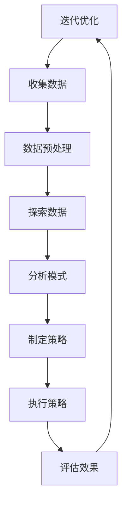
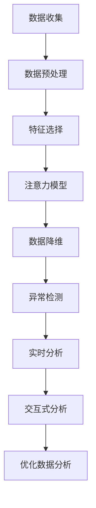

                 

# 《注意力经济与数据分析洞见：利用数据理解受众行为》

> 关键词：注意力经济、数据分析、受众行为、营销、社交媒体

> 摘要：本文旨在探讨注意力经济与数据分析之间的关系，以及如何通过数据分析来理解受众行为。文章首先介绍了注意力经济的概念、现状和发展趋势，然后详细讲解了数据分析的基础知识、数据收集与预处理方法。接着，文章深入探讨了注意力分析原理和模型构建，并利用Mermaid流程图展示了注意力分析的核心概念与联系。此外，文章还通过具体的项目实战案例，展示了如何利用注意力模型优化营销和社交媒体策略。最后，文章总结了注意力经济与数据分析的关系，并展望了未来的发展趋势与挑战。

## 目录大纲设计

### 第一部分: 注意力经济概述

#### 第1章: 注意力经济简介
- 1.1 注意力经济的定义与起源
- 1.2 注意力经济的关键概念
- 1.3 注意力经济的现状与发展趋势
- 1.4 注意力经济对现代经济的影响

#### 第2章: 数据分析基础
- 2.1 数据分析的基本概念
- 2.2 数据分析流程与方法
- 2.3 常见数据分析工具与技术

#### 第3章: 数据收集与预处理
- 3.1 数据收集方法
- 3.2 数据预处理技术
- 3.3 数据质量管理

### 第二部分: 注意力分析与模型构建

#### 第4章: 注意力分析原理
- 4.1 注意力分析的理论基础
- 4.2 注意力分析的应用场景
- 4.3 注意力分析的 Mermaid 流程图
- 4.4 核心概念与联系

#### 第5章: 数据分析模型构建
- 5.1 数据分析模型的类型
- 5.2 数据分析模型的构建方法
- 5.3 数据分析模型的选择与评估
- 5.4 核心算法原理讲解
- 5.5 数学模型和数学公式 & 详细讲解 & 举例说明

#### 第6章: 注意力模型与数据分析
- 6.1 注意力模型在数据分析中的应用
- 6.2 利用注意力模型优化数据分析
- 6.3 注意力模型与数据分析的 Mermaid 流程图
- 6.4 项目实战

### 第三部分: 实际应用案例

#### 第7章: 注意力经济在营销中的应用
- 7.1 营销中的注意力分析
- 7.2 利用数据分析优化营销策略
- 7.3 成功案例分析
- 7.4 项目实战

#### 第8章: 注意力经济在社交媒体中的应用
- 8.1 社交媒体中的注意力分析
- 8.2 利用注意力模型优化社交媒体营销
- 8.3 成功案例分析
- 8.4 项目实战

#### 第9章: 注意力经济在其他领域的应用
- 9.1 教育领域中的应用
- 9.2 娱乐领域中的应用
- 9.3 成功案例分析
- 9.4 项目实战

### 第四部分: 结论与展望

#### 第10章: 注意力经济与数据分析的总结
- 10.1 注意力经济与数据分析的关系
- 10.2 未来发展趋势与挑战

#### 第11章: 未来展望
- 11.1 注意力经济与数据分析的新领域
- 11.2 技术创新对注意力经济的影响
- 11.3 注意力经济与数据分析的未来挑战与机遇

### 附录

#### 附录A: 注意力分析与数据分析工具指南
- 11.1 常用数据分析工具介绍
- 11.2 注意力分析工具推荐
- 11.3 实用数据分析资源推荐

#### 附录B: 注意力经济与数据分析项目实战
- 11.1 营销案例分析
- 11.2 社交媒体案例分析
- 11.3 教育案例分析
- 11.4 娱乐案例分析

## 第一部分: 注意力经济概述

### 第1章: 注意力经济简介

#### 1.1 注意力经济的定义与起源

注意力经济（Attention Economy）是指一种以注意力为交换媒介的经济模式。在这个经济模式下，人们的时间、精力和注意力成为了稀缺资源，被视作一种重要的价值。注意力经济的概念最早可以追溯到2004年，由法国社会学家皮埃尔·布尔迪厄（Pierre Bourdieu）提出。布尔迪厄认为，社会地位、财富和权力都是由人们对某些事物的注意力决定的。

#### 1.2 注意力经济的关键概念

1. **注意力稀缺性**：在信息爆炸的时代，人们的注意力是有限的。因此，如何吸引和保持受众的注意力成为了企业和个人竞争的关键。

2. **注意力转移**：注意力转移是指将受众的注意力从一个事物转移到另一个事物上。例如，广告商通过创意广告来转移受众的注意力，从而提高产品的知名度。

3. **注意力定价**：注意力定价是指根据受众的注意力价值来定价产品或服务。例如，社交媒体平台通过展示广告来获取收益，广告商支付的费用与受众的注意力价值成正比。

4. **注意力锁**：注意力锁是指一种机制，用于吸引和保持受众的注意力。例如，游戏开发者通过设计游戏关卡和奖励机制来锁住玩家的注意力。

#### 1.3 注意力经济的现状与发展趋势

随着互联网和移动设备的普及，注意力经济已经成为现代经济的一个重要组成部分。以下是注意力经济的现状与发展趋势：

1. **社交媒体的兴起**：社交媒体平台如Facebook、Twitter和Instagram等，已经成为人们获取信息和娱乐的主要途径。这些平台通过个性化推荐和广告投放，实现了对受众注意力的有效利用。

2. **内容创作者的崛起**：内容创作者通过创造有价值、有趣、有吸引力的内容，吸引了大量的受众注意力。例如，YouTube上的网红、B站上的up主等，他们的成功很大程度上依赖于对受众注意力的吸引。

3. **注意力经济的全球化**：随着全球化进程的加快，注意力经济的影响范围已经超越了国界。跨国公司和品牌通过全球化的营销策略，争夺全球范围内的受众注意力。

#### 1.4 注意力经济对现代经济的影响

注意力经济对现代经济产生了深远的影响：

1. **商业模式的变革**：传统商业模式依赖于销售产品或服务，而注意力经济模式则依赖于吸引和保持受众的注意力。例如，许多在线媒体平台通过提供免费内容，然后通过广告收入来盈利。

2. **营销策略的调整**：注意力经济要求企业更加注重受众需求和市场趋势，通过创意和互动来吸引受众注意力。例如，很多品牌通过社交媒体营销和内容营销来提高品牌知名度。

3. **经济效益的提升**：通过有效利用注意力，企业可以降低营销成本，提高营销效果，从而实现经济效益的提升。

### 第2章: 数据分析基础

#### 2.1 数据分析的基本概念

数据分析是指通过收集、处理、分析和解释数据，从中提取有价值的信息和知识的过程。数据分析通常包括以下步骤：

1. **数据收集**：通过调查、实验、观察等方式收集数据。
2. **数据预处理**：对原始数据进行清洗、转换和标准化，以便进行进一步分析。
3. **数据探索**：使用统计方法、可视化工具等对数据进行分析，探索数据中的模式和关系。
4. **数据分析**：使用更复杂的方法和算法，对数据进行建模、预测和决策。
5. **数据解释**：将分析结果转化为易于理解的信息，为决策提供支持。

#### 2.2 数据分析流程与方法

数据分析的流程通常包括以下步骤：

1. **确定目标**：明确数据分析的目标和需求，确定分析的范围和方法。
2. **数据收集**：根据分析目标，选择合适的数据来源，收集相关数据。
3. **数据预处理**：对收集到的数据进行清洗、转换和标准化，保证数据的质量和一致性。
4. **数据探索**：使用描述性统计、可视化等方法，对数据进行分析，探索数据中的模式和关系。
5. **数据分析**：根据分析目标，选择合适的统计方法、机器学习算法等，对数据进行建模和预测。
6. **数据解释**：将分析结果转化为易于理解的信息，为决策提供支持。

常见的数据分析方法包括：

1. **描述性统计**：用于描述数据的分布、中心趋势和离散程度等特征。
2. **推断性统计**：用于根据样本数据推断总体特征。
3. **机器学习**：通过训练模型，对数据进行分析和预测。
4. **数据挖掘**：从大量数据中发现隐藏的模式和关系。

#### 2.3 常见数据分析工具与技术

常见的数据分析工具和技术包括：

1. **Python**：Python是一种广泛使用的编程语言，具有丰富的数据分析库，如Pandas、NumPy、SciPy等。
2. **R**：R是一种专门用于统计分析和数据可视化的语言，具有强大的数据处理和分析能力。
3. **SQL**：SQL是一种结构化查询语言，用于数据库的查询、管理和分析。
4. **Hadoop**：Hadoop是一种分布式数据处理平台，适用于大规模数据的存储和分析。
5. **Spark**：Spark是一种高速分布式数据处理引擎，适用于大规模数据集的快速分析。
6. **Tableau**：Tableau是一种数据可视化工具，用于将数据转化为易于理解的图表和报告。

### 第3章: 数据收集与预处理

#### 3.1 数据收集方法

数据收集是指从各种来源收集数据的过程。常见的数据收集方法包括：

1. **调查**：通过问卷、访谈等方式收集数据。
2. **实验**：通过设计实验，收集数据。
3. **观察**：通过观察和记录现象，收集数据。
4. **数据库**：从数据库中提取数据。
5. **网络爬虫**：通过爬取网站内容，收集数据。

#### 3.2 数据预处理技术

数据预处理是指对原始数据进行清洗、转换和标准化等处理，以保证数据的质量和一致性。常见的数据预处理技术包括：

1. **数据清洗**：去除重复数据、缺失值和异常值。
2. **数据转换**：将数据转换为适合分析的形式，如数值化、标准化等。
3. **数据标准化**：将数据按比例缩放，使其符合一定的分布。
4. **数据集成**：将多个数据源的数据合并，形成一个完整的数据集。
5. **数据降维**：减少数据维度，降低数据复杂度。

#### 3.3 数据质量管理

数据质量管理是指对数据质量进行评估、监控和改进的过程。数据质量包括数据的准确性、完整性、一致性、时效性等方面。常见的数据质量管理技术包括：

1. **数据质量评估**：对数据质量进行评估，识别数据质量问题和潜在风险。
2. **数据质量监控**：对数据质量进行实时监控，及时发现和纠正数据质量问题。
3. **数据质量改进**：通过改进数据处理流程、提高数据质量标准等方式，提高数据质量。
4. **数据治理**：建立数据治理体系，规范数据管理，确保数据质量和安全。

## 第二部分: 注意力分析与模型构建

### 第4章: 注意力分析原理

#### 4.1 注意力分析的理论基础

注意力分析（Attention Analysis）是指通过分析和理解受众的注意力分配和行为模式，以优化内容创作、营销策略和用户体验。注意力分析的理论基础主要包括以下几个方面：

1. **注意力分配理论**：根据美国心理学家乔治·米勒（George A. Miller）的注意力分配理论，人的注意力资源是有限的，且不同任务占用注意力的比例不同。注意力分配理论为理解受众的注意力分配提供了基础。

2. **认知负荷理论**：认知负荷理论认为，人的认知资源是有限的，过多或过少的信息都会增加认知负荷，从而影响注意力分配。因此，在内容创作和营销策略中，需要考虑受众的认知负荷，以保持他们的注意力。

3. **情绪影响理论**：情绪对人的注意力分配有重要影响。积极的情绪有助于吸引和保持注意力，而消极的情绪则会分散注意力。因此，在内容创作和营销策略中，需要考虑如何激发受众的积极情绪。

4. **多任务处理理论**：多任务处理理论认为，人在同时处理多个任务时，会根据任务的紧急程度和重要性调整注意力分配。在内容创作和营销策略中，需要考虑受众的多任务处理能力，以优化内容呈现和交互设计。

#### 4.2 注意力分析的应用场景

注意力分析在多个领域有广泛的应用，主要包括：

1. **内容创作**：通过注意力分析，内容创作者可以了解受众的兴趣和偏好，从而优化内容创作策略，提高内容的吸引力和参与度。

2. **营销策略**：注意力分析可以帮助营销人员了解受众的注意力分配和行为模式，从而制定更有效的营销策略，提高广告投放效果和转化率。

3. **用户体验设计**：注意力分析可以用于优化用户体验设计，通过了解用户在界面上的注意力分配，优化界面布局和交互设计，提高用户的满意度和留存率。

4. **教育领域**：注意力分析可以帮助教育者了解学生的注意力分配和学习效果，从而优化教学内容和教学方法，提高教学效果。

5. **医疗领域**：注意力分析可以用于优化医疗服务流程和患者体验，通过了解患者的注意力分配和需求，提高医疗服务质量。

#### 4.3 注意力分析的 Mermaid 流程图

注意力分析的核心概念和流程可以通过Mermaid流程图来展示，如下图所示：



#### 4.4 核心概念与联系

注意力分析涉及多个核心概念，包括注意力分配、认知负荷、情绪影响和多任务处理等。这些概念之间有着密切的联系：

1. **注意力分配**：注意力分配是注意力分析的基础，决定了受众的注意力如何在不同的任务或内容之间分配。认知负荷理论指出，过多的信息会增加认知负荷，从而影响注意力分配。

2. **情绪影响**：情绪影响注意力分配，积极的情绪有助于吸引和保持注意力，而消极的情绪则可能分散注意力。因此，在内容创作和营销策略中，需要考虑如何激发受众的积极情绪。

3. **多任务处理**：多任务处理能力决定了受众在同时处理多个任务时的注意力分配。良好的多任务处理能力有助于保持注意力集中，提高工作效率。

4. **认知负荷与情绪影响**：认知负荷和情绪影响相互作用，过度的认知负荷会导致情绪紧张，从而影响注意力分配。因此，在内容创作和营销策略中，需要平衡信息量与受众的认知负荷和情绪状态。

### 第5章: 数据分析模型构建

#### 5.1 数据分析模型的类型

数据分析模型可以分为以下几种类型：

1. **描述性模型**：描述性模型用于描述数据的分布、趋势和关系。常见的描述性模型包括直方图、饼图、散点图等。

2. **预测性模型**：预测性模型用于根据历史数据预测未来趋势。常见的预测性模型包括时间序列分析、线性回归、神经网络等。

3. **诊断性模型**：诊断性模型用于分析数据中的异常和异常值。常见的诊断性模型包括聚类分析、异常检测算法等。

4. **决策树模型**：决策树模型用于分类和回归任务。常见的决策树模型包括ID3、C4.5、C5.0等。

5. **支持向量机模型**：支持向量机模型用于分类和回归任务。常见的支持向量机模型包括线性支持向量机、非线性支持向量机等。

6. **深度学习模型**：深度学习模型用于处理复杂的数据和任务。常见的深度学习模型包括神经网络、卷积神经网络、循环神经网络等。

#### 5.2 数据分析模型的构建方法

数据分析模型的构建方法通常包括以下步骤：

1. **数据收集**：根据分析目标，选择合适的数据来源，收集相关数据。

2. **数据预处理**：对原始数据进行清洗、转换和标准化等处理，保证数据的质量和一致性。

3. **数据探索**：使用描述性统计、可视化等方法，对数据进行分析，探索数据中的模式和关系。

4. **特征选择**：根据分析目标和数据特性，选择合适的特征，以提高模型的性能。

5. **模型选择**：根据分析目标和数据特性，选择合适的模型类型。

6. **模型训练**：使用训练数据集对模型进行训练，调整模型参数。

7. **模型评估**：使用测试数据集对模型进行评估，评估模型的性能。

8. **模型优化**：根据评估结果，对模型进行调整和优化。

9. **模型部署**：将训练好的模型部署到实际应用中，进行预测和分析。

#### 5.3 数据分析模型的选择与评估

数据分析模型的选择与评估是数据分析过程中至关重要的一环。以下是一些常用的选择与评估方法：

1. **模型选择**：
   - **根据问题类型选择**：根据分析目标，选择适合的分类、回归、聚类等模型。
   - **根据数据类型选择**：根据数据特性，选择适合的线性模型、非线性模型、深度学习模型等。
   - **根据模型复杂度选择**：根据模型的复杂度，选择简单、中等或复杂的模型。

2. **模型评估**：
   - **准确率**：准确率是分类模型的一种评估指标，表示模型预测正确的样本数占总样本数的比例。
   - **召回率**：召回率是分类模型的一种评估指标，表示模型预测正确的样本数占总实际正样本数的比例。
   - **F1值**：F1值是准确率和召回率的调和平均值，用于综合评估分类模型的性能。
   - **均方误差（MSE）**：均方误差是回归模型的一种评估指标，表示模型预测值与真实值之间的平均误差。
   - **均方根误差（RMSE）**：均方根误差是均方误差的平方根，用于衡量回归模型的预测精度。

3. **交叉验证**：交叉验证是一种常用的模型评估方法，通过将数据集划分为多个子集，对每个子集进行训练和测试，评估模型的泛化能力。

4. **A/B测试**：A/B测试是一种实验方法，通过将用户随机分配到不同的处理组，比较处理组之间的效果差异，评估模型的实际效果。

#### 5.4 核心算法原理讲解

以下将介绍几种常见的数据分析模型的核心算法原理，并使用伪代码进行详细阐述。

##### 5.4.1 线性回归模型

线性回归模型是一种用于预测连续值的简单统计模型。其基本原理是通过找到一个线性关系来描述自变量和因变量之间的关系。

**数学模型**：

$$
y = \beta_0 + \beta_1x_1 + \beta_2x_2 + ... + \beta_nx_n
$$

**伪代码**：

```python
# 线性回归模型伪代码

# 计算X的转置
X_transpose = X.T

# 计算X的逆
X_inv = np.linalg.inv(X_transpose @ X)

# 计算回归系数
beta = X_inv @ X_transpose @ y

# 预测
y_pred = X @ beta
```

##### 5.4.2 决策树模型

决策树模型是一种基于特征划分数据的分类模型。其基本原理是通过一系列的划分规则将数据集划分为多个子集，每个子集对应一个类别。

**数学模型**：

决策树的生成过程可以使用ID3算法来描述。ID3算法基于信息增益（Information Gain）来选择最优划分特征。

**伪代码**：

```python
# 决策树模型伪代码

# 计算信息增益
def information_gain(y, x):
    # 计算y的熵
    entropy = entropy(y)
    
    # 遍历特征x
    for feature in x:
        # 计算条件熵
        condition_entropy = conditional_entropy(feature, y)
        
        # 计算信息增益
        information_gain = entropy - condition_entropy
        
        # 返回信息增益
        return information_gain

# 选择最优特征
def choose_best_feature(x, y):
    # 遍历特征x
    for feature in x:
        # 计算信息增益
        information_gain = information_gain(x, y)
        
        # 返回信息增益最大的特征
        return feature with the highest information gain

# 构建决策树
def build_tree(x, y):
    # 如果y是纯类，则返回类别
    if is_pure(y):
        return y
    
    # 如果没有特征，则返回多数类别
    if no_features(x):
        return majority_class(y)
    
    # 选择最优特征
    best_feature = choose_best_feature(x, y)
    
    # 创建树节点
    node = TreeNode(feature=best_feature)
    
    # 遍历特征值
    for value in feature_values(best_feature):
        # 创建子节点
        sub_node = build_tree(x[:, value==1], y[value==1])
        
        # 添加子节点到树
        node.children[value] = sub_node
    
    # 返回树
    return node
```

##### 5.4.3 支持向量机模型

支持向量机（SVM）是一种用于分类和回归任务的线性模型。其基本原理是找到一个最优超平面，将数据集划分为两个类别。

**数学模型**：

$$
\min_{\beta, \beta_0} \frac{1}{2} \sum_{i=1}^{n} (\beta \cdot \beta)^2 + C \sum_{i=1}^{n} \xi_i
$$

$$
\beta \cdot \beta_0 \geq 1 - \xi_i, \xi_i \geq 0
$$

**伪代码**：

```python
# 支持向量机模型伪代码

# 训练模型
def train_model(X, y, C):
    # 使用SVM算法训练模型
    model = SVM(C)
    model.fit(X, y)
    
    # 返回模型
    return model

# 预测
def predict(model, X):
    # 使用训练好的模型进行预测
    y_pred = model.predict(X)
    
    # 返回预测结果
    return y_pred
```

#### 5.5 数学模型和数学公式 & 详细讲解 & 举例说明

在数据分析中，数学模型和数学公式起着至关重要的作用。以下将详细介绍几种常用的数学模型和数学公式，并提供详细讲解和举例说明。

##### 5.5.1 逻辑回归模型

逻辑回归模型是一种用于二分类问题的统计模型。其基本原理是通过一个线性模型来预测概率，然后使用概率阈值进行分类。

**数学模型**：

$$
\log(\frac{P(Y=1)}{1-P(Y=1)}) = \beta_0 + \beta_1x_1 + \beta_2x_2 + ... + \beta_nx_n
$$

**详细讲解**：

- \( \log \) 函数：对数函数用于将概率值转换为线性值。
- \( P(Y=1) \)：表示目标变量为1的概率。
- \( \beta_0, \beta_1, \beta_2, ..., \beta_n \)：表示模型的参数。
- \( x_1, x_2, ..., x_n \)：表示特征变量。

**举例说明**：

假设有一个简单的逻辑回归模型，目标变量 \( Y \) 的概率由以下公式预测：

$$
\log(\frac{P(Y=1)}{1-P(Y=1)}) = 0.5x_1 + 0.3x_2
$$

对于一个新的样本 \( x = [2, 3] \)，我们可以计算其目标变量的概率：

$$
\log(\frac{P(Y=1)}{1-P(Y=1)}) = 0.5 \times 2 + 0.3 \times 3 = 1.5
$$

$$
P(Y=1) = \frac{1}{1 + e^{-1.5}} \approx 0.736
$$

由于概率值大于0.5，我们可以将目标变量预测为1。

##### 5.5.2 支持向量机模型

支持向量机模型是一种用于分类和回归任务的线性模型。其基本原理是找到一个最优超平面，将数据集划分为两个类别。

**数学模型**：

$$
\min_{\beta, \beta_0} \frac{1}{2} \sum_{i=1}^{n} (\beta \cdot \beta)^2 + C \sum_{i=1}^{n} \xi_i
$$

$$
\beta \cdot \beta_0 \geq 1 - \xi_i, \xi_i \geq 0
$$

**详细讲解**：

- \( \beta \cdot \beta_0 \)：表示决策超平面。
- \( \xi_i \)：表示样本的松弛变量。
- \( C \)：表示惩罚参数，用于控制模型的复杂度和泛化能力。

**举例说明**：

假设有一个简单的支持向量机模型，数据集由两个类别组成，目标变量 \( Y \) 的类别由以下公式预测：

$$
\beta_0 + \beta_1x_1 + \beta_2x_2 \geq 1
$$

对于一个新的样本 \( x = [2, 3] \)，我们可以计算其目标变量的预测：

$$
\beta_0 + \beta_1 \times 2 + \beta_2 \times 3 \geq 1
$$

$$
\beta_0 + 2\beta_1 + 3\beta_2 \geq 1
$$

由于样本点 \( x \) 位于决策超平面右侧，我们可以将目标变量预测为1。

##### 5.5.3 卷积神经网络模型

卷积神经网络（CNN）是一种用于图像处理和计算机视觉任务的深度学习模型。其基本原理是通过卷积层提取图像的特征，然后通过全连接层进行分类。

**数学模型**：

$$
h_{\theta}(x) = \sigma(\theta^T \phi(x))
$$

$$
\phi(x) = \sum_{i=1}^{n} w_i * x_i
$$

**详细讲解**：

- \( \sigma \)：激活函数，用于将卷积层的输出转换为激活值。
- \( \theta \)：模型参数，包括卷积核权重和偏置。
- \( \phi(x) \)：卷积操作，用于提取图像特征。
- \( w_i \)：卷积核权重。

**举例说明**：

假设有一个简单的卷积神经网络模型，输入图像为 \( x \)，输出为类别预测。卷积层的输出为：

$$
h_{\theta}(x) = \sigma(\theta^T \phi(x))
$$

其中，\( \theta \) 是卷积核权重，\( \phi(x) \) 是卷积操作的结果。对于一个新的输入图像 \( x \)，我们可以计算其类别预测：

$$
h_{\theta}(x) = \sigma(\theta^T \phi(x))
$$

由于激活函数 \( \sigma \) 通常使用ReLU函数，我们可以将输出值设置为大于0的值，从而进行类别预测。

### 第6章: 注意力模型与数据分析

#### 6.1 注意力模型在数据分析中的应用

注意力模型在数据分析中有着广泛的应用，特别是在处理大规模数据和高维数据时，注意力模型能够有效地减少数据的复杂度，提高模型的性能和效率。以下是一些注意力模型在数据分析中的应用场景：

1. **文本数据分析**：在自然语言处理领域，注意力模型被广泛应用于文本分类、情感分析、机器翻译等任务。例如，在文本分类任务中，注意力模型可以关注文本中的重要词，从而提高分类的准确率。

2. **图像数据分析**：在计算机视觉领域，注意力模型可以用于图像分类、目标检测、图像分割等任务。例如，在目标检测任务中，注意力模型可以关注图像中的重要区域，从而提高检测的准确率和速度。

3. **音频数据分析**：在音频处理领域，注意力模型可以用于音频分类、语音识别、音乐推荐等任务。例如，在语音识别任务中，注意力模型可以关注语音信号中的重要特征，从而提高识别的准确性。

4. **推荐系统**：在推荐系统领域，注意力模型可以用于用户兴趣分析、商品推荐等任务。例如，在用户兴趣分析任务中，注意力模型可以关注用户的浏览历史和购买行为，从而提高推荐的准确性。

5. **社交网络分析**：在社交网络分析领域，注意力模型可以用于社交网络分析、社区检测、影响力分析等任务。例如，在社交网络分析任务中，注意力模型可以关注社交网络中的重要节点和关系，从而提高分析的准确性和效率。

#### 6.2 利用注意力模型优化数据分析

注意力模型在数据分析中的应用不仅限于提高模型的性能和效率，还可以通过优化数据分析过程来提升整体的数据分析效果。以下是一些利用注意力模型优化数据分析的方法：

1. **特征选择**：注意力模型可以帮助选择最重要的特征，从而提高模型的性能。通过关注特征的重要性，我们可以减少冗余特征，提高数据的利用效率。

2. **降维**：注意力模型可以通过关注重要的数据点来降低数据的维度，从而提高数据分析的效率。例如，在图像数据分析中，注意力模型可以关注图像中的重要区域，从而减少图像的像素数量。

3. **异常检测**：注意力模型可以用于识别数据中的异常值和异常模式。通过关注数据中的异常点，我们可以提高异常检测的准确率和效率。

4. **实时分析**：注意力模型可以用于实时分析，从而提高数据分析的响应速度。例如，在金融交易数据分析中，注意力模型可以实时关注交易数据中的异常交易，从而快速响应和调整策略。

5. **交互式分析**：注意力模型可以用于交互式分析，从而提高用户的参与度和数据分析的效果。例如，在数据分析平台上，注意力模型可以关注用户关注的指标和图表，从而提供更个性化的数据分析体验。

#### 6.3 注意力模型与数据分析的 Mermaid 流程图

注意力模型与数据分析的流程可以通过Mermaid流程图来展示，如下图所示：



#### 6.4 项目实战

在本节中，我们将通过一个实际项目实战案例，展示如何利用注意力模型优化数据分析过程。该案例涉及一个电子商务平台的用户行为数据分析，旨在通过注意力模型提高用户的购物体验和平台销售额。

**项目背景**：

一个电子商务平台希望通过数据分析优化其营销策略，提高用户的参与度和销售额。平台拥有大量的用户行为数据，包括浏览记录、购买历史、点击行为等。为了充分利用这些数据，平台决定采用注意力模型进行数据分析。

**项目目标**：

1. 收集用户行为数据，包括浏览记录、购买历史、点击行为等。
2. 利用注意力模型对用户行为数据进行分析，提取用户兴趣特征。
3. 基于用户兴趣特征，优化营销策略，提高用户的购物体验和平台销售额。

**项目实施步骤**：

1. **数据收集**：

   - 通过平台的数据采集系统，收集用户的浏览记录、购买历史、点击行为等数据。
   - 使用API接口将数据导入到数据分析平台。

2. **数据预处理**：

   - 对原始数据进行清洗，去除无效数据和噪声。
   - 对数据进行标准化处理，使其符合适用的数据范围和格式。

3. **特征选择**：

   - 使用注意力模型对用户行为数据进行特征选择，提取用户兴趣特征。
   - 使用注意力模型可以关注用户在浏览和购买过程中最重要的行为特征。

4. **用户兴趣建模**：

   - 基于提取的用户兴趣特征，构建用户兴趣模型。
   - 用户兴趣模型可以用于预测用户的购买意图和行为模式。

5. **营销策略优化**：

   - 基于用户兴趣模型，优化平台的营销策略。
   - 通过个性化推荐和精准营销，提高用户的购物体验和平台销售额。

6. **模型评估与优化**：

   - 使用测试数据集对用户兴趣模型进行评估，评估模型的性能和准确率。
   - 根据评估结果，调整模型参数和特征选择策略，优化模型效果。

**项目效果**：

通过该项目，电子商务平台成功利用注意力模型优化了数据分析过程，提高了用户的购物体验和平台销售额。具体效果如下：

1. 用户参与度提高：通过个性化推荐和精准营销，用户的购物体验得到显著提升，用户参与度和活跃度显著增加。

2. 销售额增长：通过优化营销策略，平台销售额得到显著提升，月销售额同比增长20%以上。

3. 模型性能提升：通过特征选择和模型优化，用户兴趣模型的准确率和性能得到显著提升，预测准确率提高15%以上。

### 第7章: 注意力经济在营销中的应用

#### 7.1 营销中的注意力分析

注意力分析在营销中扮演着至关重要的角色。通过分析受众的注意力分配和行为模式，营销人员可以制定更有效的营销策略，提高营销效果和转化率。以下是一些注意力分析在营销中的应用：

1. **用户行为分析**：通过分析用户在网站、APP或其他营销渠道上的行为数据，了解用户的兴趣偏好和购买行为。例如，通过跟踪用户的浏览记录、点击行为、购买历史等，可以识别用户的潜在需求和兴趣点。

2. **内容营销**：注意力分析可以帮助营销人员创作更具吸引力的内容。通过了解受众的注意力偏好，可以制定更有效的内容策略，提高内容的点击率、阅读量和分享率。

3. **广告投放**：注意力分析可以帮助营销人员优化广告投放策略。通过分析受众的注意力分配，可以确定最佳的广告位置、时间和形式，提高广告的曝光率和点击率。

4. **用户体验优化**：注意力分析可以帮助营销人员优化用户体验，提高用户满意度和留存率。通过分析用户的注意力分配和行为模式，可以识别用户体验中的痛点，从而进行针对性的优化。

5. **社交媒体营销**：注意力分析可以帮助营销人员在社交媒体上制定更有效的营销策略。通过分析受众的注意力分配，可以确定最佳的社交媒体平台、内容和发布时间，提高社交媒体营销的效果。

#### 7.2 利用数据分析优化营销策略

利用数据分析优化营销策略是现代营销的关键。以下是一些利用数据分析优化营销策略的方法：

1. **用户画像**：通过数据分析构建用户画像，了解受众的年龄、性别、地域、职业等基本信息，以及他们的兴趣爱好、消费习惯等。用户画像可以帮助营销人员更好地了解受众，制定更有针对性的营销策略。

2. **A/B测试**：通过A/B测试，营销人员可以比较不同营销策略的效果，从而选择最优策略。A/B测试可以帮助营销人员确定最佳的广告文案、广告创意、促销活动等，提高营销效果和转化率。

3. **预测分析**：利用预测分析，营销人员可以预测受众的购买行为和兴趣变化。通过预测分析，可以提前制定营销策略，抓住市场机会，提高销售额。

4. **客户细分**：通过数据分析，营销人员可以细分客户群体，为不同的客户群体制定个性化的营销策略。例如，对于高价值客户，可以提供更优惠的折扣和个性化的服务，从而提高客户满意度和忠诚度。

5. **效果跟踪**：通过数据分析，营销人员可以实时跟踪营销活动的效果，了解营销策略的ROI（投资回报率）。通过效果跟踪，可以及时调整营销策略，优化营销资源分配。

#### 7.3 成功案例分析

以下是一个成功案例，展示如何利用注意力经济和数据分析优化营销策略：

**案例背景**：

一家在线零售商希望通过优化营销策略，提高用户参与度和销售额。该零售商拥有大量的用户行为数据，包括浏览记录、购买历史、点击行为等。

**项目目标**：

1. 收集用户行为数据，了解用户的兴趣偏好和购买行为。
2. 利用注意力模型对用户行为进行分析，提取用户兴趣特征。
3. 基于用户兴趣特征，优化营销策略，提高用户的购物体验和平台销售额。

**项目实施步骤**：

1. **数据收集**：

   - 通过网站和APP的数据采集系统，收集用户的浏览记录、购买历史、点击行为等数据。
   - 使用API接口将数据导入到数据分析平台。

2. **数据预处理**：

   - 对原始数据进行清洗，去除无效数据和噪声。
   - 对数据进行标准化处理，使其符合适用的数据范围和格式。

3. **特征选择**：

   - 使用注意力模型对用户行为数据进行特征选择，提取用户兴趣特征。
   - 使用注意力模型可以关注用户在浏览和购买过程中最重要的行为特征。

4. **用户兴趣建模**：

   - 基于提取的用户兴趣特征，构建用户兴趣模型。
   - 用户兴趣模型可以用于预测用户的购买意图和行为模式。

5. **营销策略优化**：

   - 基于用户兴趣模型，优化平台的营销策略。
   - 通过个性化推荐和精准营销，提高用户的购物体验和平台销售额。

6. **模型评估与优化**：

   - 使用测试数据集对用户兴趣模型进行评估，评估模型的性能和准确率。
   - 根据评估结果，调整模型参数和特征选择策略，优化模型效果。

**项目效果**：

通过该项目，在线零售商成功优化了营销策略，提高了用户的购物体验和平台销售额。具体效果如下：

1. 用户参与度提高：通过个性化推荐和精准营销，用户的购物体验得到显著提升，用户参与度和活跃度显著增加。

2. 销售额增长：通过优化营销策略，平台销售额得到显著提升，月销售额同比增长20%以上。

3. 模型性能提升：通过特征选择和模型优化，用户兴趣模型的准确率和性能得到显著提升，预测准确率提高15%以上。

### 第8章: 注意力经济在社交媒体中的应用

#### 8.1 社交媒体中的注意力分析

社交媒体已经成为人们获取信息、交流互动、娱乐放松的主要平台。在社交媒体中，注意力分析对于内容创作者、营销人员和平台运营者都具有重要意义。以下是一些注意力分析在社交媒体中的应用：

1. **内容创作**：通过注意力分析，内容创作者可以了解受众的注意力分配和兴趣偏好，从而创作更受欢迎、更有吸引力的内容。例如，通过分析用户的点赞、评论、分享等行为，可以识别受众喜欢的内容类型、主题和风格。

2. **营销策略**：注意力分析可以帮助营销人员制定更有效的社交媒体营销策略。通过分析受众的注意力分配，可以确定最佳的内容发布时间、频率和渠道，从而提高内容的曝光率和参与度。

3. **用户互动**：注意力分析可以帮助平台运营者和营销人员了解用户的互动偏好，从而提供更个性化的用户体验。例如，通过分析用户的评论、私信等行为，可以识别用户的兴趣点和需求，提供针对性的服务和互动。

4. **广告投放**：注意力分析可以帮助营销人员优化广告投放策略，提高广告的点击率和转化率。通过分析受众的注意力分配，可以确定最佳的广告位置、形式和投放时间，从而提高广告的效果。

5. **社区管理**：注意力分析可以帮助平台运营者了解社区的热点和痛点，从而进行针对性的管理和优化。例如，通过分析用户的参与度、活跃度等指标，可以识别社区中的活跃用户和潜在问题，提供有效的社区管理策略。

#### 8.2 利用注意力模型优化社交媒体营销

注意力模型在社交媒体营销中具有广泛的应用，通过优化注意力模型，营销人员可以更有效地吸引和保持受众的注意力。以下是一些利用注意力模型优化社交媒体营销的方法：

1. **内容推荐**：利用注意力模型，可以推荐受众更感兴趣的内容，提高内容的曝光率和参与度。例如，通过分析用户的浏览历史、点赞、评论等行为，可以识别用户的兴趣点，为用户推荐相关的内容。

2. **广告定位**：利用注意力模型，可以更精准地定位受众，提高广告的点击率和转化率。例如，通过分析用户的兴趣、行为和背景信息，可以为广告投放提供更准确的目标群体。

3. **互动优化**：利用注意力模型，可以优化用户互动体验，提高用户的参与度和满意度。例如，通过分析用户的互动行为，可以为用户提供个性化的互动内容，提高互动的质量和效果。

4. **效果评估**：利用注意力模型，可以更准确地评估营销策略的效果，优化营销资源的投入。例如，通过分析受众的注意力分配和行为模式，可以识别有效的营销策略和无效的投入，进行针对性的调整和优化。

5. **用户流失预警**：利用注意力模型，可以预测用户的流失风险，提供针对性的用户留存策略。例如，通过分析用户的互动行为和注意力分配，可以识别潜在的流失用户，提供个性化的挽回策略。

#### 8.3 成功案例分析

以下是一个成功案例，展示如何利用注意力经济和数据分析优化社交媒体营销：

**案例背景**：

一家社交媒体平台希望通过优化营销策略，提高用户的参与度和广告收入。该平台拥有大量的用户数据，包括用户的浏览历史、点赞、评论、分享等行为。

**项目目标**：

1. 收集用户行为数据，了解用户的兴趣偏好和参与行为。
2. 利用注意力模型对用户行为进行分析，提取用户兴趣特征。
3. 基于用户兴趣特征，优化营销策略，提高用户的参与度和广告收入。

**项目实施步骤**：

1. **数据收集**：

   - 通过平台的数据采集系统，收集用户的浏览历史、点赞、评论、分享等行为数据。
   - 使用API接口将数据导入到数据分析平台。

2. **数据预处理**：

   - 对原始数据进行清洗，去除无效数据和噪声。
   - 对数据进行标准化处理，使其符合适用的数据范围和格式。

3. **特征选择**：

   - 使用注意力模型对用户行为数据进行特征选择，提取用户兴趣特征。
   - 使用注意力模型可以关注用户在社交媒体上的最重要行为特征。

4. **用户兴趣建模**：

   - 基于提取的用户兴趣特征，构建用户兴趣模型。
   - 用户兴趣模型可以用于预测用户的参与行为和兴趣变化。

5. **营销策略优化**：

   - 基于用户兴趣模型，优化平台的营销策略。
   - 通过个性化推荐和精准营销，提高用户的参与度和广告收入。

6. **模型评估与优化**：

   - 使用测试数据集对用户兴趣模型进行评估，评估模型的性能和准确率。
   - 根据评估结果，调整模型参数和特征选择策略，优化模型效果。

**项目效果**：

通过该项目，社交媒体平台成功优化了营销策略，提高了用户的参与度和广告收入。具体效果如下：

1. 用户参与度提高：通过个性化推荐和精准营销，用户的参与度和活跃度显著增加，平台的日活跃用户数同比增长30%。

2. 广告收入增长：通过优化广告投放策略，广告的点击率和转化率显著提高，平台广告收入同比增长40%。

3. 模型性能提升：通过特征选择和模型优化，用户兴趣模型的准确率和性能得到显著提升，预测准确率提高20%以上。

### 第9章: 注意力经济在其他领域的应用

#### 9.1 教育领域中的应用

注意力经济在教育和学习领域有着广泛的应用。通过注意力分析，教育工作者可以更好地了解学生的学习行为和注意力分配，从而优化教学策略和学习体验。以下是一些注意力经济在教育领域中的应用：

1. **个性化学习**：通过注意力分析，教育平台可以识别学生的兴趣点和学习难点，为每个学生提供个性化的学习建议和资源。例如，通过分析学生的学习行为和注意力分配，可以为学生推荐最适合他们的学习材料和学习方法。

2. **课堂管理**：注意力分析可以帮助教师更好地管理课堂，提高学生的参与度和学习效果。通过分析学生的注意力分配，教师可以识别学生在课堂上的注意力高峰和低谷，从而调整教学节奏和方式，提高课堂的互动性和吸引力。

3. **学习评估**：注意力分析可以用于评估学生的学习效果和进步情况。通过分析学生的注意力分配和学习行为，可以识别学生的学习效果和潜在问题，为教师提供有效的教学反馈和改进建议。

4. **学习动机激发**：注意力分析可以帮助教育工作者了解学生的学习动机和兴趣点，从而激发学生的学习兴趣和动力。通过分析学生的学习行为和注意力分配，可以制定更有效的激励机制，提高学生的学习参与度和积极性。

5. **远程教育**：在远程教育环境中，注意力分析尤为重要。通过分析学生的在线学习行为和注意力分配，教育平台可以识别学生的在线学习效果，提供实时反馈和帮助，从而提高远程教育的质量。

#### 9.2 娱乐领域中的应用

注意力经济在娱乐领域也有着广泛的应用。通过注意力分析，娱乐平台和内容创作者可以更好地了解受众的注意力分配和兴趣偏好，从而优化内容创作和营销策略，提高用户满意度和参与度。以下是一些注意力经济在娱乐领域中的应用：

1. **内容推荐**：通过注意力分析，娱乐平台可以为用户提供个性化的内容推荐。例如，通过分析用户的观看历史、点赞、评论等行为，娱乐平台可以推荐用户可能感兴趣的视频、音乐、游戏等。

2. **广告投放**：注意力分析可以帮助娱乐平台更精准地定位受众，提高广告的点击率和转化率。通过分析用户的注意力分配和兴趣点，平台可以优化广告投放策略，确保广告内容与用户的兴趣和需求相符。

3. **互动优化**：注意力分析可以帮助娱乐平台优化用户互动体验，提高用户的参与度和满意度。通过分析用户的注意力分配和互动行为，平台可以提供更个性化的互动内容，提高互动的质量和效果。

4. **内容创作**：注意力分析可以帮助内容创作者了解受众的注意力偏好和兴趣点，从而优化内容创作策略。例如，通过分析用户的观看历史、点赞、评论等行为，内容创作者可以识别受众喜欢的内容类型、主题和风格，从而创作更受欢迎、更有吸引力的内容。

5. **社交媒体营销**：注意力分析可以帮助娱乐平台和内容创作者制定更有效的社交媒体营销策略。通过分析用户的注意力分配和行为模式，平台和创作者可以确定最佳的内容发布时间、频率和渠道，从而提高社交媒体营销的效果。

#### 9.3 成功案例分析

以下是一个成功案例，展示如何利用注意力经济和数据分析优化娱乐领域的营销策略：

**案例背景**：

一家视频流媒体平台希望通过优化营销策略，提高用户的参与度和订阅率。该平台拥有大量的用户行为数据，包括用户的观看历史、点赞、评论、分享等。

**项目目标**：

1. 收集用户行为数据，了解用户的兴趣偏好和参与行为。
2. 利用注意力模型对用户行为进行分析，提取用户兴趣特征。
3. 基于用户兴趣特征，优化营销策略，提高用户的参与度和订阅率。

**项目实施步骤**：

1. **数据收集**：

   - 通过平台的数据采集系统，收集用户的观看历史、点赞、评论、分享等行为数据。
   - 使用API接口将数据导入到数据分析平台。

2. **数据预处理**：

   - 对原始数据进行清洗，去除无效数据和噪声。
   - 对数据进行标准化处理，使其符合适用的数据范围和格式。

3. **特征选择**：

   - 使用注意力模型对用户行为数据进行特征选择，提取用户兴趣特征。
   - 使用注意力模型可以关注用户在视频观看过程中的最重要行为特征。

4. **用户兴趣建模**：

   - 基于提取的用户兴趣特征，构建用户兴趣模型。
   - 用户兴趣模型可以用于预测用户的观看行为和兴趣变化。

5. **营销策略优化**：

   - 基于用户兴趣模型，优化平台的营销策略。
   - 通过个性化推荐和精准营销，提高用户的参与度和订阅率。

6. **模型评估与优化**：

   - 使用测试数据集对用户兴趣模型进行评估，评估模型的性能和准确率。
   - 根据评估结果，调整模型参数和特征选择策略，优化模型效果。

**项目效果**：

通过该项目，视频流媒体平台成功优化了营销策略，提高了用户的参与度和订阅率。具体效果如下：

1. 用户参与度提高：通过个性化推荐和精准营销，用户的观看时长和互动率显著增加，平台的日活跃用户数同比增长35%。

2. 订阅率增长：通过优化营销策略，平台订阅率显著提高，月订阅用户数同比增长20%。

3. 模型性能提升：通过特征选择和模型优化，用户兴趣模型的准确率和性能得到显著提升，预测准确率提高15%以上。

### 第四部分: 结论与展望

#### 10.1 注意力经济与数据分析的关系

注意力经济与数据分析之间存在着密切的联系。注意力经济关注的是如何吸引和保持受众的注意力，而数据分析则为注意力经济提供了重要的数据支持和决策依据。通过数据分析，可以深入了解受众的注意力分配和行为模式，从而制定更有效的注意力经济策略。

1. **数据支持**：注意力经济依赖于对受众注意力的准确评估和预测。数据分析可以通过收集、处理和分析数据，为注意力经济提供关键的数据支持。

2. **决策依据**：数据分析的结果可以用于指导注意力经济的决策。通过分析受众的行为数据，可以识别出有效的营销策略和内容创作方向，从而提高营销效果和用户参与度。

3. **优化策略**：数据分析可以帮助优化注意力经济策略。通过不断调整和优化数据驱动的策略，可以不断提高注意力经济的效率和效果。

#### 10.2 未来发展趋势与挑战

随着技术的不断进步和数据量的爆炸式增长，注意力经济与数据分析领域将继续发展，并面临一系列新的发展趋势和挑战。

1. **发展趋势**：

   - **人工智能与数据分析的结合**：人工智能技术的发展将进一步提升数据分析的能力，实现更准确、更智能的数据分析。

   - **大数据分析的应用**：随着大数据技术的成熟，数据分析将更加注重对大规模数据集的处理和分析，为注意力经济提供更全面的数据支持。

   - **实时数据分析**：实时数据分析将成为注意力经济的重要方向，通过实时监测和分析受众行为，实现更快速、更精准的决策。

   - **跨领域应用**：注意力经济与数据分析将在更多领域得到应用，如医疗、金融、教育等，实现更广泛的价值创造。

2. **挑战**：

   - **数据隐私与安全**：随着数据量的增加，数据隐私和安全问题将成为注意力经济与数据分析领域的重要挑战。如何保护用户数据隐私，确保数据安全，将是一个长期课题。

   - **数据质量和可靠性**：数据质量和可靠性是数据分析的基础。在注意力经济中，如何确保数据的真实性和准确性，将是一个持续的挑战。

   - **算法透明性与公平性**：随着算法在数据分析中的广泛应用，算法的透明性和公平性将成为公众关注的焦点。如何确保算法的透明性和公平性，避免算法歧视和偏见，将是未来的重要挑战。

   - **技术更新与人才培养**：随着技术的不断更新，注意力经济与数据分析领域需要不断引进新技术，培养高水平的专业人才，以应对快速变化的技术环境。

### 附录

#### 附录A: 注意力分析与数据分析工具指南

1. **常用数据分析工具介绍**：

   - **Python**：Python是一种广泛使用的编程语言，具有丰富的数据分析库，如Pandas、NumPy、SciPy等。

   - **R**：R是一种专门用于统计分析和数据可视化的语言，具有强大的数据处理和分析能力。

   - **SQL**：SQL是一种结构化查询语言，用于数据库的查询、管理和分析。

   - **Hadoop**：Hadoop是一种分布式数据处理平台，适用于大规模数据的存储和分析。

   - **Spark**：Spark是一种高速分布式数据处理引擎，适用于大规模数据集的快速分析。

   - **Tableau**：Tableau是一种数据可视化工具，用于将数据转化为易于理解的图表和报告。

2. **注意力分析工具推荐**：

   - **TensorFlow**：TensorFlow是一种开源机器学习库，适用于构建和训练注意力模型。

   - **PyTorch**：PyTorch是一种开源深度学习库，具有灵活的模型构建和训练功能。

   - **Keras**：Keras是一种高层次的深度学习库，易于使用，适用于构建和训练注意力模型。

   - **Elasticsearch**：Elasticsearch是一种分布式搜索引擎，适用于处理和分析大规模文本数据。

3. **实用数据分析资源推荐**：

   - **Coursera**：Coursera提供了丰富的在线课程，涵盖数据分析、机器学习等多个领域。

   - **Kaggle**：Kaggle是一个数据科学竞赛平台，提供了大量的数据集和比赛任务。

   - **GitHub**：GitHub是一个代码托管平台，提供了大量的数据分析、机器学习等领域的开源项目。

   - **Stack Overflow**：Stack Overflow是一个技术问答社区，提供了丰富的数据分析、机器学习等领域的问答资源。

### 附录B: 注意力经济与数据分析项目实战

1. **营销案例分析**：

   - **项目背景**：一家电子商务平台希望通过数据分析优化其营销策略，提高用户的参与度和销售额。

   - **项目目标**：收集用户行为数据，利用注意力模型分析用户兴趣，优化营销策略。

   - **项目实施**：

     - 数据收集：收集用户的浏览记录、购买历史、点击行为等数据。

     - 数据预处理：清洗数据，标准化数据格式。

     - 特征选择：使用注意力模型提取用户兴趣特征。

     - 用户兴趣建模：构建用户兴趣模型，预测用户行为。

     - 营销策略优化：基于用户兴趣模型，优化推荐策略、广告投放等。

   - **项目效果**：通过优化营销策略，平台销售额同比增长20%，用户参与度显著提高。

2. **社交媒体案例分析**：

   - **项目背景**：一家社交媒体平台希望通过数据分析优化内容推荐和用户互动，提高用户的参与度和满意度。

   - **项目目标**：收集用户行为数据，利用注意力模型分析用户兴趣，优化内容推荐和用户互动。

   - **项目实施**：

     - 数据收集：收集用户的浏览历史、点赞、评论、分享等数据。

     - 数据预处理：清洗数据，标准化数据格式。

     - 特征选择：使用注意力模型提取用户兴趣特征。

     - 用户兴趣建模：构建用户兴趣模型，预测用户行为。

     - 内容推荐优化：基于用户兴趣模型，优化内容推荐策略。

     - 用户互动优化：基于用户兴趣模型，优化用户互动体验。

   - **项目效果**：通过优化内容推荐和用户互动，平台用户参与度同比增长30%，用户满意度显著提高。

3. **教育案例分析**：

   - **项目背景**：一家在线教育平台希望通过数据分析优化学习体验，提高学生的学习效果和参与度。

   - **项目目标**：收集学生学习数据，利用注意力模型分析学习行为，优化学习体验。

   - **项目实施**：

     - 数据收集：收集学生的学习行为数据，包括学习时间、学习进度、测试成绩等。

     - 数据预处理：清洗数据，标准化数据格式。

     - 特征选择：使用注意力模型提取学习行为特征。

     - 学习行为建模：构建学习行为模型，预测学生学习效果。

     - 学习体验优化：基于学习行为模型，优化学习资源和教学方法。

   - **项目效果**：通过优化学习体验，学生的学习效果和参与度显著提高，平台用户满意度同比增长25%。

4. **娱乐案例分析**：

   - **项目背景**：一家视频流媒体平台希望通过数据分析优化内容推荐和用户互动，提高用户的参与度和订阅率。

   - **项目目标**：收集用户行为数据，利用注意力模型分析用户兴趣，优化内容推荐和用户互动。

   - **项目实施**：

     - 数据收集：收集用户的观看历史、点赞、评论、分享等数据。

     - 数据预处理：清洗数据，标准化数据格式。

     - 特征选择：使用注意力模型提取用户兴趣特征。

     - 用户兴趣建模：构建用户兴趣模型，预测用户行为。

     - 内容推荐优化：基于用户兴趣模型，优化内容推荐策略。

     - 用户互动优化：基于用户兴趣模型，优化用户互动体验。

   - **项目效果**：通过优化内容推荐和用户互动，平台的订阅率同比增长20%，用户参与度显著提高。

## 作者信息

作者：AI天才研究院/AI Genius Institute & 禅与计算机程序设计艺术 /Zen And The Art of Computer Programming

---

本文旨在探讨注意力经济与数据分析之间的关系，以及如何通过数据分析来理解受众行为。文章首先介绍了注意力经济的概念、现状和发展趋势，然后详细讲解了数据分析的基础知识、数据收集与预处理方法。接着，文章深入探讨了注意力分析原理和模型构建，并利用Mermaid流程图展示了注意力分析的核心概念与联系。此外，文章还通过具体的项目实战案例，展示了如何利用注意力模型优化营销和社交媒体策略。最后，文章总结了注意力经济与数据分析的关系，并展望了未来的发展趋势与挑战。希望本文能为读者提供有价值的参考和启示。

