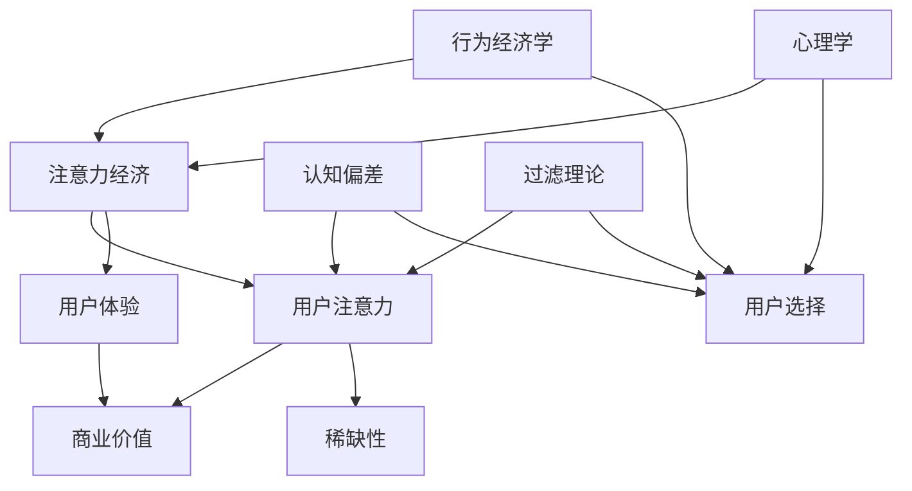
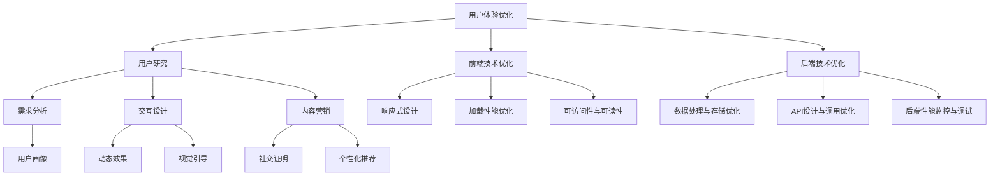

                 

### 文章标题

《注意力经济与用户体验优化策略与技术：创建令人沉浸的产品》

### 关键词

注意力经济、用户体验、优化策略、沉浸式产品、交互设计、前端技术、后端技术、数据分析、沉浸式交互

### 摘要

随着信息时代的到来，注意力经济逐渐成为企业和产品开发的重要研究领域。本文将围绕注意力经济与用户体验优化展开，深入探讨注意力经济的概念与原理，分析注意力与用户体验的关系，并探讨如何通过用户体验优化策略与技术，创建令人沉浸的产品。本文将分为四个主要部分：第一部分介绍注意力经济概述，包括其概念、原理和商业模式；第二部分讨论用户体验优化策略，包括用户研究方法、交互设计与内容营销；第三部分介绍用户体验优化技术，涵盖前端和后端技术优化；第四部分则聚焦于沉浸式产品开发实践，包括设计、开发流程及案例分析。通过本文的探讨，旨在为读者提供一套系统化的注意力经济与用户体验优化的理论和实践指南。

## 第一部分：注意力经济概述

### 第1章：注意力经济的概念与原理

#### 1.1 注意力经济的定义与特点

注意力经济（Attention Economy）是指一种基于用户注意力的经济模式，即通过吸引用户的注意力来创造价值。在互联网和数字媒体高度发达的今天，注意力已成为一种稀缺资源。这种稀缺性决定了注意力在经济活动中的核心地位。

注意力经济的定义可以进一步细化：首先，它是一个关于价值创造和分配的理论框架，强调用户注意力是企业、平台和产品获取经济收益的关键。其次，它是一种以用户为中心的经济模式，关注用户的需求和体验，通过满足用户兴趣和需求来获取注意力。最后，它强调互动性和反馈机制，通过用户参与和反馈不断优化产品和服务，以维持和增加用户的注意力。

注意力经济的特点主要体现在以下几个方面：

1. **注意力稀缺性**：随着信息爆炸，用户注意力的稀缺性愈发显著。每个用户每天能够分配的注意力是有限的，这决定了注意力资源的高价值。
2. **用户中心化**：注意力经济强调以用户为中心，关注用户的需求和体验。只有满足用户兴趣和需求的产品才能获得用户的持续关注。
3. **数据驱动的决策**：注意力经济依赖于用户行为数据和反馈，通过数据分析来优化产品和服务，提高用户参与度和满意度。
4. **互动性和反馈机制**：注意力经济通过用户参与和反馈不断迭代和优化，形成良好的用户互动和反馈循环。

#### 1.2 注意力经济的理论基础

注意力经济的理论基础主要来源于经济学和心理学。在经济学领域，舒尔茨（Daniel Kahneman）和卡尼曼（Amos Tversky）等人的行为经济学研究为注意力经济提供了重要的理论支持。他们的研究表明，人类在决策过程中存在认知偏差，对信息的处理具有选择性，这直接影响了用户对产品和服务的注意力分配。

在心理学领域，注意力理论是注意力经济的重要理论基础。注意力的心理学定义是指大脑对信息处理的主动选择过程。根据布罗德本特（Broadbent）的过滤理论，大脑通过选择性注意机制对信息进行过滤，只有符合特定条件的信息才能通过过滤机制，进入大脑的加工处理过程。这一理论揭示了用户在信息过载环境下的注意力分配机制。

结合经济学和心理学的研究，注意力经济理论认为，用户在接触信息和服务时，会根据自身的兴趣、需求和情境选择性地分配注意力资源。这种选择过程不仅决定了用户对产品和服务的关注程度，也影响了企业的收益模式。例如，在社交媒体平台上，用户对内容的关注往往取决于内容的吸引力和相关性，而非单纯的内容质量。

#### 1.3 注意力经济的商业模式

注意力经济的商业模式主要基于用户注意力的价值挖掘和变现。以下是一些常见的注意力经济商业模式：

1. **广告模式**：广告是注意力经济中最常见的商业模式之一。企业通过在媒体平台上投放广告，吸引用户注意力，从而实现收益。这种模式的核心在于广告的吸引力和精准投放，以最大化用户注意力的价值。

2. **订阅模式**：订阅模式是指用户为获得特定内容或服务，定期支付订阅费用。这种模式的核心在于内容的高价值和用户的持续关注。例如，Netflix、Spotify等平台通过提供优质的内容，吸引用户订阅，从而实现持续收益。

3. **平台模式**：平台模式是指通过搭建一个中间平台，连接供需双方，实现用户注意力的有效分配和变现。平台模式的核心在于建立良好的用户生态，提供优质的内容和服务，吸引用户注意力。例如，淘宝、亚马逊等电商平台，通过提供丰富的商品和便捷的购物体验，吸引用户注意力。

4. **内容模式**：内容模式是指通过创作和分发高质量的内容，吸引用户注意力，从而实现收益。这种模式的核心在于内容的创造力和吸引力。例如，博客、视频平台等通过提供有趣、有用、有深度的内容，吸引用户关注。

5. **社交模式**：社交模式是指通过构建社交网络，吸引用户参与互动，从而实现注意力变现。这种模式的核心在于用户的社交需求和互动体验。例如，微信、微博等社交媒体平台，通过提供社交互动功能，吸引用户参与，实现注意力变现。

通过以上商业模式，企业可以利用注意力经济理论，有效挖掘和变现用户注意力资源，实现商业价值的最大化。然而，注意力经济的商业模式也面临一些挑战，如用户注意力的稀缺性、用户隐私保护等问题。因此，企业需要在商业模式设计和管理中，充分考虑这些挑战，实现可持续发展。

### 第2章：用户体验与注意力经济

#### 2.1 用户体验的重要性

用户体验（User Experience，简称UX）是指用户在使用产品或服务过程中所获得的整体感受和体验。用户体验不仅包括产品的功能性、易用性、可靠性等方面，还涉及到用户的心理感受、情感互动和社会互动等多方面因素。随着注意力经济时代的到来，用户体验的重要性愈发凸显。

首先，用户体验直接影响了用户的满意度和忠诚度。在信息过载的环境中，用户对于产品和服务的需求越来越多样化，他们更倾向于选择那些能够提供优质体验的产品。良好的用户体验能够增强用户对产品的满意度和信任感，从而提升用户的忠诚度。

其次，用户体验对品牌的塑造和传播具有重要作用。在激烈的市场竞争中，品牌差异化成为企业制胜的关键。优质的用户体验能够帮助企业树立良好的品牌形象，提升品牌的市场认知度和美誉度。

此外，用户体验还能够影响用户传播行为。用户通过社交媒体、口碑传播等方式，将自身使用产品的体验分享给他人，这种用户传播行为能够扩大产品的市场影响力，提升品牌知名度。

#### 2.2 注意力与用户体验的关系

注意力（Attention）是指大脑对信息的处理和选择过程。在注意力经济中，注意力是用户对产品或服务的核心资源。用户体验与注意力之间存在密切的关系。

首先，注意力是用户体验的基石。良好的用户体验能够吸引用户的注意力，使他们在使用产品或服务时保持专注和投入。反之，如果用户体验不佳，用户可能会分散注意力，甚至放弃使用产品。

其次，注意力影响用户体验的评价。用户在评价产品或服务时，往往会基于自身的注意力分配情况。如果用户在产品或服务上花费了大量注意力，但未能获得满意的体验，他们可能会感到失望和不满。相反，如果用户在使用产品或服务时感到愉悦和满足，他们可能会给予更高的评价。

此外，注意力经济中的用户注意力分配具有动态性。用户在不同的情境下，对产品和服务的注意力分配会有所不同。例如，在紧急情况下，用户可能会更加关注产品的功能性和可靠性。而在休闲状态下，用户可能会更关注产品的娱乐性和互动性。

#### 2.3 注意力经济下的用户体验策略

在注意力经济背景下，企业需要采取一系列用户体验优化策略，以吸引用户注意力，提升用户满意度和忠诚度。以下是一些关键策略：

1. **以用户为中心的设计**：企业应深入了解用户需求和行为，将用户需求融入产品设计和开发过程中。通过用户调研、用户画像分析等方法，确保产品功能、界面设计和交互流程符合用户期望。

2. **优化用户体验流程**：企业应简化用户操作流程，降低用户认知负荷，提升用户操作效率。通过设计简洁直观的界面、提供清晰的导航和提示，帮助用户快速完成任务。

3. **提升内容质量**：优质的内容是吸引和保持用户注意力的关键。企业应注重内容创作，提供有价值、有趣、有启发性的内容，满足用户的多样化需求。

4. **增强互动性**：互动性是提升用户体验的重要手段。企业可以通过社交功能、在线客服、用户反馈机制等，与用户建立良好的互动关系，提升用户的参与感和归属感。

5. **个性化推荐**：基于用户行为数据，提供个性化的推荐内容和服务，满足用户的个性化需求。个性化推荐不仅能够提高用户满意度，还能够增加用户黏性。

6. **持续优化与迭代**：用户体验是一个持续优化的过程。企业应不断收集用户反馈，分析用户行为数据，针对用户体验中的不足进行改进。通过持续迭代和优化，不断提升用户体验。

通过以上策略，企业可以在注意力经济背景下，有效提升用户体验，吸引用户注意力，实现商业价值的最大化。

### 第3章：用户研究方法

#### 3.1 用户研究的目的与方法

用户研究是优化用户体验的重要手段，其目的是深入了解用户需求、行为和体验，为产品设计提供有力的数据支持。用户研究的主要目的可以归纳为以下几个方面：

1. **理解用户需求**：通过用户研究，企业可以深入了解用户的需求和痛点，为产品设计提供明确的方向。这有助于企业避免盲目创新，确保产品功能符合用户实际需求。

2. **评估用户体验**：用户研究可以帮助企业评估现有产品的用户体验，发现存在的问题和不足。通过对比不同用户群体的反馈，企业可以找出改进的重点和优先级。

3. **发现市场机会**：用户研究可以帮助企业发现潜在的市场机会，识别未被满足的用户需求。这有助于企业在激烈的市场竞争中找到差异化优势，抢占市场份额。

4. **指导产品迭代**：用户研究是产品迭代的重要依据。通过持续的用户研究，企业可以不断优化产品，提升用户体验，保持产品的竞争力。

用户研究的方法主要包括以下几种：

1. **问卷调查**：问卷调查是一种常见的用户研究方法，通过设计有针对性的问卷，收集用户的反馈和意见。问卷调查的优点在于成本较低、覆盖面广，但缺点是用户参与度和数据质量可能较低。

2. **深度访谈**：深度访谈是一种定性研究方法，通过与用户进行一对一的深入交流，了解用户的需求、行为和体验。深度访谈的优点在于可以获得详细的用户反馈，但缺点是成本较高、耗时较长。

3. **可用性测试**：可用性测试是一种通过让用户实际操作产品，评估产品易用性、功能性和性能的方法。可用性测试的优点在于可以直观地发现产品问题，但缺点是测试过程较为复杂。

4. **用户行为分析**：用户行为分析是一种基于大数据的方法，通过分析用户在产品中的行为数据，了解用户的使用习惯和偏好。用户行为分析的优点在于可以大规模、实时地获取用户数据，但缺点是数据解读和可视化较为复杂。

5. **观察法**：观察法是一种通过直接观察用户行为，了解用户需求和行为的方法。观察法的优点在于可以获得真实的用户反馈，但缺点是用户行为可能受到观察者的影响。

#### 3.2 用户画像与用户需求分析

用户画像（User Profile）是指通过对用户数据的综合分析，构建出一个具有代表性的用户模型。用户画像可以帮助企业更好地了解用户特征和行为，为产品设计提供有力支持。

用户画像的构建主要包括以下几个步骤：

1. **数据收集**：通过多种渠道收集用户数据，包括用户基本信息（年龄、性别、地理位置等）、行为数据（浏览历史、购买行为等）、反馈数据（问卷调查、用户评价等）。

2. **数据清洗**：对收集到的数据进行清洗和整理，去除重复、无效和错误的数据，确保数据的准确性和一致性。

3. **数据整合**：将不同来源的数据进行整合，构建一个统一的用户数据集。通过数据整合，可以更全面地了解用户特征和行为。

4. **特征提取**：从用户数据中提取关键特征，如用户年龄、性别、职业、教育程度、收入水平等。这些特征可以帮助企业识别不同用户群体，为产品设计提供参考。

5. **模型构建**：基于用户特征和行为数据，构建用户画像模型。用户画像模型可以用来预测用户行为、推荐产品和服务，提高用户体验。

用户需求分析是用户研究的重要环节，其目的是深入了解用户需求，为产品设计提供指导。用户需求分析的方法主要包括以下几种：

1. **需求调研**：通过问卷调查、深度访谈等方式，收集用户的需求和期望。需求调研可以帮助企业了解用户的核心需求和痛点。

2. **用户反馈分析**：通过分析用户反馈，了解用户对产品的满意度和不满意度。用户反馈分析可以帮助企业发现产品改进的方向。

3. **用户行为分析**：通过分析用户行为数据，了解用户在实际使用产品过程中的需求和行为模式。用户行为分析可以帮助企业发现用户未被满足的需求。

4. **用户访谈**：通过深度访谈，深入了解用户的需求和期望。用户访谈可以获取更详细的用户反馈，帮助企业更准确地理解用户需求。

通过用户画像和用户需求分析，企业可以更好地了解用户特征和需求，为产品设计提供有力支持。这有助于企业优化产品功能、提升用户体验，实现商业价值的最大化。

### 第4章：交互设计与注意力捕获

#### 4.1 交互设计的原则

交互设计（Interaction Design）是产品设计中至关重要的一环，其核心目标是确保用户在使用产品时能够获得良好的体验。为了实现这一目标，交互设计需要遵循一系列基本原则，这些原则包括：

1. **易用性（Usability）**：易用性是交互设计的核心原则之一。一个易用的产品应该能够让用户轻松地完成任务，无需过多的指导或学习。实现易用性需要考虑用户的需求、习惯和认知能力，确保产品界面简洁直观，操作流程简洁明了。

2. **一致性（Consistency）**：一致性是指产品在不同情境下保持统一的界面和交互规则。一致性可以减少用户的学习成本，提高用户的操作效率。例如，按钮的颜色、形状和位置应保持一致，图标和文字说明也应保持一致。

3. **直观性（Intuitiveness）**：直观性是指产品的交互设计应该符合用户的直觉和预期。直观的设计可以让用户在使用产品时感到自然和舒适，从而提高用户的满意度。

4. **可控性（Controllability）**：可控性是指用户在使用产品时能够清晰地了解自己的操作对系统的影响，并能够随时调整操作。一个可控的产品可以让用户在遇到问题时感到安心，并能够自主解决问题。

5. **反馈性（Feedback）**：反馈性是指产品在用户进行操作时能够及时提供反馈，帮助用户了解操作的进展和结果。良好的反馈机制可以减少用户的焦虑和困惑，提高用户的操作信心。

6. **效率（Efficiency）**：效率是指产品能够帮助用户高效地完成任务，减少不必要的操作步骤。高效的交互设计可以提升用户的满意度，增加用户黏性。

7. **情感性（Affective）**：情感性是指产品的交互设计能够激发用户的情感共鸣，提高用户的参与度和忠诚度。情感性的设计可以通过视觉、声音、触觉等多感官刺激来实现。

#### 4.2 注意力捕获的交互设计技巧

在注意力经济背景下，交互设计不仅要关注产品的功能和易用性，还需要注重如何捕获用户的注意力。以下是一些有效的注意力捕获交互设计技巧：

1. **视觉引导（Visual Hierarchy）**：通过合理使用颜色、大小、字体等视觉元素，创建清晰的视觉层次结构，引导用户关注关键信息。例如，使用高对比度的颜色来突出重要按钮，使用大号字体来展示核心内容。

2. **动态效果（Dynamic Effects）**：适当地使用动画、滚动、弹窗等动态效果，可以吸引用户的注意力，增加用户的互动体验。例如，在用户完成操作后显示一个简单的动画效果，或者使用滚动效果来展示长列表内容。

3. **焦点提示（Focus Indicators）**：通过焦点提示（如高亮、边框等），明确指示用户的当前操作位置，帮助用户快速找到操作目标。焦点提示可以减少用户的认知负荷，提高操作效率。

4. **交互反馈（Feedback）**：及时提供交互反馈，让用户了解自己的操作对系统的影响。例如，在用户点击按钮时显示按钮的按下效果，或者在用户提交表单时显示加载动画。

5. **社交证明（Social Proof）**：通过显示其他用户的评价、点赞数、评论等，增加用户对产品的信任感和参与度。社交证明可以激发用户的从众心理，提高用户对产品的关注度。

6. **个性化推荐（Personalization）**：基于用户的行为数据，提供个性化的推荐内容和服务。个性化推荐可以满足用户的个性化需求，提高用户的满意度，从而增加用户对产品的注意力。

7. **游戏化元素（Gamification）**：引入游戏化元素，如积分、奖励、等级等，增加用户的参与感和成就感。游戏化元素可以激发用户的兴趣和动机，提高用户的注意力。

通过以上注意力捕获的交互设计技巧，企业可以有效地吸引和保持用户的注意力，提升用户体验，实现商业价值的最大化。

### 第5章：内容营销与用户注意力

#### 5.1 内容营销的策略

内容营销（Content Marketing）是指通过创造和分发有价值、相关和一致的内容，吸引并保持目标受众，最终实现营销目标的一种策略。在注意力经济背景下，内容营销对于捕获用户注意力、提升品牌影响力具有重要作用。以下是几种有效的内容营销策略：

1. **故事营销（Storytelling）**：故事营销是一种通过讲述品牌故事、产品故事或用户故事来吸引受众的策略。故事营销不仅能够增强品牌的情感共鸣，还能够传递品牌的价值理念，提高用户对品牌的认同感。

2. **教育性内容（Educational Content）**：教育性内容是指为用户提供有价值的信息和知识，帮助他们解决问题和提升技能的内容。通过提供教育性内容，企业可以建立自身的权威性，吸引并留住目标受众。

3. **娱乐性内容（Entertaining Content）**：娱乐性内容是指以幽默、搞笑、趣味等方式吸引受众的内容。娱乐性内容能够激发用户的兴趣，增加用户粘性，从而提高用户对品牌的关注。

4. **个性化内容（Personalized Content）**：个性化内容是指根据用户的行为数据和偏好，定制化地推送内容。通过个性化内容，企业可以满足用户的个性化需求，提高用户满意度，从而增加用户对品牌的忠诚度。

5. **互动性内容（Interactive Content）**：互动性内容是指用户可以参与其中的内容，如问卷调查、互动游戏、直播等。通过互动性内容，企业可以增强与用户的互动，提高用户的参与度和忠诚度。

6. **视频营销（Video Marketing）**：视频营销是一种通过视频形式传递信息和内容的方式。视频具有直观、生动、信息量大的特点，能够有效吸引受众的注意力，提高内容的传播效果。

7. **社交媒体营销（Social Media Marketing）**：社交媒体营销是指利用社交媒体平台（如Facebook、Twitter、Instagram等）进行内容推广和传播。通过社交媒体营销，企业可以快速扩大品牌影响力，提高用户参与度。

8. **内容共创（Co-Creation）**：内容共创是指企业与用户共同创造内容，如用户生成内容（UGC）、品牌大使计划等。通过内容共创，企业可以增强用户的参与感和归属感，提高用户的忠诚度。

通过以上策略，企业可以有效地进行内容营销，吸引和保持用户的注意力，提升品牌影响力和用户满意度。

#### 5.2 内容的吸引力与传播

内容的吸引力是决定用户是否愿意投入注意力的关键因素。要创建具有吸引力的内容，企业需要关注以下几个方面：

1. **价值性**：内容应当具有实际价值，能够解决用户的问题或满足他们的需求。有价值的内容能够吸引用户的关注，增加用户的参与度。

2. **相关性**：内容应当与目标受众的兴趣和需求紧密相关。相关性强的内容能够提高用户的兴趣，增加内容的传播效果。

3. **独特性**：内容应当具备独特性，能够提供与众不同的观点或解决方案。独特的内容能够吸引用户的兴趣，提高内容的传播速度。

4. **趣味性**：内容应当具有一定的趣味性，能够引发用户的兴趣和好奇心。趣味性的内容能够增加用户的参与度，提高内容的传播效果。

5. **易传播性**：内容应当易于传播，能够通过多种渠道快速传播。易传播的内容能够迅速获得大量关注，提高内容的曝光率。

在创建具有吸引力的内容后，企业还需要关注内容的传播策略，以提高内容的可见度和影响力。以下是一些有效的传播策略：

1. **社交媒体推广**：利用社交媒体平台（如微博、微信、Facebook等）进行内容的推广和传播。通过社交媒体推广，企业可以迅速扩大内容的传播范围，提高内容的曝光率。

2. **SEO优化**：通过搜索引擎优化（SEO）技术，提高内容在搜索引擎中的排名，增加内容的自然流量。SEO优化包括关键词研究、内容优化、外链建设等。

3. **合作伙伴关系**：与行业内的其他企业或意见领袖建立合作伙伴关系，通过相互推广和分享内容，扩大内容的传播范围。

4. **内容营销活动**：举办各种内容营销活动，如线上研讨会、线下活动等，吸引目标受众参与，提高内容的传播效果。

5. **内容共享**：鼓励用户在社交媒体上分享内容，通过口碑传播扩大内容的传播范围。通过设置分享奖励，如优惠券、礼品等，激励用户分享内容。

6. **付费推广**：通过付费广告（如百度广告、谷歌广告等）进行内容的推广，提高内容的曝光率。付费推广可以迅速扩大内容的受众范围，提高内容的传播速度。

通过有效的传播策略，企业可以确保内容得到广泛的关注和传播，提高品牌影响力和用户参与度。

#### 5.3 社交媒体的注意力策略

在注意力经济背景下，社交媒体已成为企业捕获用户注意力的重要渠道。以下是一些有效的社交媒体注意力策略：

1. **内容多样化**：发布多种类型的内容，如图片、视频、文字等，以吸引不同类型的受众。多样化的内容可以增加用户的参与度和互动性，提高用户的注意力。

2. **互动性**：积极与用户互动，如回复评论、参与讨论等。互动可以增强用户对品牌的认同感，提高用户的忠诚度。

3. **时间管理**：合理安排发布内容的时间，选择在用户活跃的时段发布内容，以提高内容的曝光率和参与度。

4. **热点话题**：关注行业热点和时事话题，结合品牌特点，发布相关内容。热点话题可以吸引大量用户关注，提高内容的传播效果。

5. **个性化推荐**：根据用户的行为数据和偏好，提供个性化的内容推荐。个性化推荐可以满足用户的个性化需求，提高用户的满意度。

6. **社交媒体广告**：利用社交媒体平台的广告功能，精准投放广告，提高内容的曝光率。社交媒体广告可以根据用户的地理位置、兴趣爱好等进行精准定位，提高广告效果。

7. **KOL合作**：与行业内的意见领袖（KOL）合作，通过他们的推荐和分享，扩大品牌影响力。KOL的影响力可以吸引大量用户关注，提高品牌的知名度。

8. **内容共创**：鼓励用户参与内容创作，如发起用户生成内容（UGC）活动，提高用户的参与感和归属感。

通过以上社交媒体注意力策略，企业可以有效地吸引和保持用户的注意力，提高品牌影响力和用户参与度。

### 第6章：前端技术优化

前端技术优化是提升用户体验的关键环节，其核心目标是提高网页的性能、可访问性和响应速度，从而提升用户的满意度和留存率。以下将详细讨论前端技术优化中的几个重要方面。

#### 6.1 响应式设计与适应性布局

响应式设计（Responsive Design）是一种能够自动适应不同设备屏幕尺寸和分辨率的网页设计技术。通过响应式设计，网页可以提供一致的浏览体验，无论用户使用的是桌面电脑、平板电脑还是智能手机。适应性布局（Adaptive Layout）则是一种通过预先定义的布局模式，为不同设备提供最优化的网页展示方式。

实现响应式设计和适应性布局的关键技术包括：

1. **媒体查询（Media Queries）**：媒体查询是一种CSS（层叠样式表）技术，允许开发者根据设备的屏幕尺寸、分辨率和其他特性，应用不同的样式规则。通过媒体查询，可以自动调整网页的布局、字体大小、颜色等，以适应不同的设备。

   ```css
   @media (max-width: 768px) {
     /* 当屏幕宽度小于768px时应用的样式 */
   }
   ```

2. **弹性布局（Flexible Layout）**：弹性布局是一种通过使用相对单位（如百分比）来定义网页元素的尺寸和位置，而不是固定尺寸的技术。这种布局方式能够更好地适应不同屏幕尺寸，确保网页在各种设备上都能保持良好的展示效果。

   ```css
   .container {
     width: 80%;
     max-width: 1200px;
     margin: 0 auto;
   }
   ```

3. **断点（Breakpoints）**：断点是响应式设计中的关键概念，表示在特定屏幕尺寸下应用不同样式规则的位置。合理设置断点可以确保网页在不同设备上都有良好的展示效果。

通过响应式设计和适应性布局，网页能够提供一致且优质的用户体验，提高用户满意度和留存率。

#### 6.2 加载性能优化

网页加载性能是影响用户体验的重要因素之一。优化加载性能可以减少用户的等待时间，提高网页的响应速度。以下是一些常见的加载性能优化策略：

1. **资源压缩**：通过压缩图片、脚本和样式表等资源文件，可以减小文件的体积，加快加载速度。常见的压缩工具包括Gzip和Brotli。

2. **懒加载（Lazy Loading）**：懒加载是一种延迟加载资源的方法，只有在用户需要时才加载相关资源。例如，图片懒加载可以仅在用户滚动到图片所在位置时才加载图片，从而减少初始加载时间。

3. **代码分割（Code Splitting）**：代码分割是将网页的脚本和样式表拆分成多个独立的模块，按需加载。这种方法可以减少初始加载时间，提高网页的性能。

4. **CDN（内容分发网络）**：通过使用CDN，可以将网页资源分发到全球各地的服务器上，用户可以从最近的节点获取资源，减少加载时间。

5. **异步加载（Asynchronous Loading）**：异步加载允许网页在不阻塞主线程的情况下加载脚本和样式表。通过异步加载，用户可以在加载资源的同时继续浏览网页。

6. **减少HTTP请求**：减少网页中的HTTP请求可以加快加载速度。通过合并CSS和JavaScript文件、使用内联CSS和JavaScript等方法，可以减少请求次数。

通过以上加载性能优化策略，网页的加载速度可以得到显著提升，从而提高用户体验。

#### 6.3 可访问性与可读性

网页的可访问性和可读性是确保所有用户，包括残疾人和视觉障碍者，都能有效使用网页的关键因素。以下是一些提高网页可访问性和可读性的策略：

1. **语义化HTML**：使用正确的HTML标签，如`<header>`, `<footer>`, `<nav>`, `<main>`, `<section>`等，可以帮助屏幕阅读器和搜索引擎更好地理解网页的结构。

2. **文本对比度**：确保文本与背景之间的对比度足够高，以便用户能够轻松阅读。可以使用WebAIM对比度检查器来验证对比度是否符合标准。

3. **可聚焦元素**：确保所有重要的交互元素（如按钮、链接等）都可以通过键盘聚焦，并且聚焦状态有明显的视觉提示。

4. **替代文字（Alt Text）**：为图像和其他非文本元素提供替代文字，以便屏幕阅读器能够将图像内容读给视觉障碍者。

5. **屏幕阅读器兼容性**：测试网页在屏幕阅读器（如JAWS、NVDA等）中的兼容性，确保所有功能都能正常使用。

6. **语音导航**：提供语音导航功能，使用户能够通过语音命令在网页中导航。

7. **动态内容和动画控制**：提供关闭或控制动态内容和动画的选项，以减少对用户的干扰。

通过以上可访问性和可读性优化策略，网页可以更好地服务于所有用户，提高用户体验。

### 第7章：后端技术优化

#### 7.1 数据处理与存储优化

在后端技术优化中，数据处理与存储优化是提升系统性能和稳定性的关键环节。以下是一些有效的策略：

1. **数据缓存**：数据缓存是一种通过将频繁访问的数据存储在内存中，以提高数据读取速度的技术。常见的数据缓存技术包括Redis和Memcached。通过合理使用数据缓存，可以显著减少数据库的访问压力，提高系统的响应速度。

2. **分库分表**：在数据量庞大时，通过分库分表可以将数据分散存储到多个数据库或表中，以减少单个数据库或表的负载。分库分表可以有效提高系统的并发处理能力和查询效率。

3. **数据库优化**：优化数据库查询是提升系统性能的重要手段。可以通过使用索引、优化查询语句、避免全表扫描等方法，提高数据库的查询速度。

4. **批量处理**：批量处理是将多个操作合并为一个操作，以减少系统调用的次数。例如，批量插入、批量更新和批量删除可以显著减少数据库的操作次数，提高系统的性能。

5. **数据库读写分离**：通过将读操作和写操作分离到不同的数据库实例，可以减轻主数据库的负载，提高系统的读写性能。

6. **数据压缩**：通过数据压缩技术，可以减小数据的存储空间，提高数据传输速度。常用的数据压缩算法包括Gzip和Snappy。

7. **分布式存储**：分布式存储是将数据分散存储到多个节点上，以提高数据的存储容量和可靠性。常见的分布式存储系统包括Hadoop和HDFS。

通过以上数据处理与存储优化策略，可以显著提高系统的性能和稳定性，提升用户体验。

#### 7.2 API设计与调用优化

API（应用程序接口）是后端服务与前端应用交互的桥梁，优化的API设计与调用是提升系统性能和用户体验的关键。以下是一些优化策略：

1. **接口聚合**：通过将多个独立的接口聚合为一个复合接口，可以减少客户端的调用次数，提高系统的响应速度。

2. **接口限流**：通过设置接口访问频率限制，可以防止恶意攻击和过度访问，保护后端服务稳定运行。

3. **接口文档**：提供详细的API文档，包括接口定义、请求参数、返回值等，可以帮助开发者快速理解和使用API。

4. **接口缓存**：对于一些频繁调用的接口，可以通过缓存机制减少对后端服务的请求次数，提高系统的响应速度。

5. **接口版本管理**：通过版本管理，可以逐步更新API，避免对现有应用的兼容性问题。

6. **异步调用**：对于一些耗时的接口调用，可以通过异步方式执行，提高系统的并发处理能力。

7. **接口安全**：确保API的安全性，通过身份验证、权限控制、防SQL注入等技术，防止数据泄露和安全漏洞。

通过以上API设计与调用优化策略，可以显著提升系统的性能和用户体验。

#### 7.3 后端性能监控与调试

后端性能监控与调试是确保系统稳定运行和快速响应的重要环节。以下是一些监控与调试策略：

1. **日志监控**：通过收集和分析系统日志，可以及时发现异常和性能问题。常见的日志分析工具包括ELK（Elasticsearch、Logstash、Kibana）和Splunk。

2. **性能测试**：通过性能测试，可以评估系统的负载能力和响应时间。常见的性能测试工具包括JMeter和LoadRunner。

3. **异常报警**：通过设置异常报警机制，可以及时通知开发人员和运维人员，快速响应和处理系统异常。

4. **服务监控**：通过监控服务状态、资源使用情况（如CPU、内存、磁盘等），可以及时发现系统瓶颈和资源不足问题。

5. **性能调优**：通过性能调优，可以优化系统配置、代码逻辑和架构设计，提高系统的性能和稳定性。

6. **代码审查**：通过代码审查，可以确保代码质量和性能，及时发现和修复潜在的性能问题。

7. **持续集成与持续部署（CI/CD）**：通过CI/CD流程，可以自动化测试和部署代码，确保系统的高效运行和快速迭代。

通过以上后端性能监控与调试策略，可以确保系统的高性能和高可用性，提升用户体验。

### 第8章：用户体验分析与优化

#### 8.1 分析工具与技术

用户体验分析是优化产品设计和功能的重要环节，通过数据分析和用户反馈，可以深入了解用户行为、需求和痛点，从而指导产品改进。以下是一些常用的用户体验分析工具和技术：

1. **Google Analytics**：Google Analytics 是一款功能强大的数据分析工具，能够追踪用户的网站访问、页面流量、用户行为等数据。通过分析这些数据，可以了解用户的访问路径、停留时间、转化率等，为产品改进提供依据。

2. **Hotjar**：Hotjar 是一款直观的用户行为分析工具，提供热图、行为记录、调查和反馈功能。通过热图，可以了解用户在页面上的点击、滚动和鼠标移动情况，通过行为记录，可以观察用户在实际操作中的行为路径，通过调查和反馈，可以收集用户的意见和建议。

3. **Mixpanel**：Mixpanel 是一款专注于用户行为分析的工具，能够追踪用户的注册、登录、点击、购买等行为，并通过用户细分和自动化营销功能，优化用户体验和转化率。

4. **UserTesting**：UserTesting 是一款基于真实用户测试的在线平台，通过视频记录用户在使用产品时的表现和反馈，提供详细的用户测试报告。这种方法可以帮助企业了解用户的真实体验，发现产品中的问题。

5. **Crazy Egg**：Crazy Egg 提供热图分析、转化率优化和A/B测试功能。通过热图分析，可以了解用户在页面上的行为，通过转化率优化，可以测试不同的页面布局和设计，找到最佳方案。

6. **Qualtrics**：Qualtrics 是一款专业的调查和反馈工具，可以通过在线问卷、访谈和焦点小组等方式，收集用户的反馈和建议。这些反馈可以帮助企业了解用户的需求和痛点，优化产品功能。

7. **Heap Analytics**：Heap Analytics 是一款无代码数据跟踪和分析工具，能够自动记录用户的行为数据，并将其转化为用户画像和用户旅程分析。这种方法可以节省开发时间，提高数据分析的效率。

通过以上工具和技术，企业可以全面分析用户体验，发现产品中的问题，从而进行有针对性的优化。

#### 8.2 用户行为数据分析

用户行为数据分析是用户体验分析的核心内容，通过分析用户的行为数据，可以深入了解用户的行为模式、需求和痛点。以下是一些用户行为数据分析的关键步骤：

1. **数据收集**：首先，需要收集用户在产品中的行为数据，包括访问路径、页面停留时间、点击事件、转化行为等。这些数据可以通过前端的JavaScript代码、后端的日志记录等方式进行收集。

2. **数据清洗**：收集到的数据可能包含噪音和重复信息，需要通过数据清洗技术进行去噪和去重，确保数据的质量。

3. **数据存储**：将清洗后的数据存储到数据仓库或数据库中，以便后续的数据分析和处理。常用的数据存储技术包括关系型数据库（如MySQL、PostgreSQL）、NoSQL数据库（如MongoDB、Cassandra）和数据仓库（如Hadoop、Amazon Redshift）。

4. **数据预处理**：对数据进行预处理，包括数据转换、聚合、去重等操作，以便进行后续的分析。预处理后的数据通常以数据框（DataFrame）或数据表的形式存储。

5. **数据探索性分析（EDA）**：通过EDA技术，对数据的基本统计信息和分布情况进行分析，了解数据的基本特征和异常值。EDA可以帮助分析师初步了解用户行为数据的规律和趋势。

6. **用户细分**：通过用户行为数据分析，可以将用户划分为不同的细分群体，如高频用户、低频用户、活跃用户、潜在用户等。用户细分有助于理解不同用户群体的行为特征和需求，从而进行有针对性的产品优化。

7. **行为模式识别**：通过分析用户的行为数据，可以识别用户的行为模式，如用户的浏览路径、购买决策过程、评论行为等。行为模式识别可以帮助企业发现用户在使用产品过程中存在的问题和改进机会。

8. **行为预测**：基于历史数据，可以使用机器学习算法（如回归分析、决策树、随机森林等）对用户未来的行为进行预测。行为预测可以帮助企业预测用户的需求和偏好，优化产品功能和推荐策略。

9. **优化策略评估**：通过对比不同优化策略的效果，评估优化策略的有效性。例如，可以通过A/B测试，对比不同设计方案的转化率，找出最优的设计方案。

通过以上用户行为数据分析步骤，企业可以深入了解用户行为，发现产品问题，从而进行有针对性的优化，提升用户体验。

#### 8.3 用户体验的持续优化

用户体验的持续优化是一个动态的过程，需要不断地收集用户反馈、分析数据、进行迭代和改进。以下是一些关键的持续优化策略：

1. **用户反馈机制**：建立有效的用户反馈机制，鼓励用户提交意见和建议。可以通过在线问卷调查、用户访谈、用户社区等多种方式收集用户反馈。及时响应和解决用户问题，可以增强用户满意度。

2. **数据分析与监控**：持续收集和分析用户行为数据，监控用户体验的关键指标（如转化率、跳出率、用户停留时间等）。通过数据分析，可以发现用户体验中的问题，为优化提供依据。

3. **迭代与测试**：采用敏捷开发方法，快速迭代和测试产品功能。通过A/B测试、多变量测试等方法，验证不同设计方案的优劣，找出最优方案。

4. **用户体验改进计划**：根据用户反馈和数据分析结果，制定用户体验改进计划。改进计划应包括具体的目标、策略、实施步骤和时间表。

5. **用户教育**：提供用户教育资源和指南，帮助用户更好地了解和使用产品。通过用户教育，可以减少用户的使用障碍，提高用户满意度。

6. **跨部门协作**：用户体验优化需要跨部门的协作，包括产品经理、设计师、开发人员、市场营销等。通过跨部门协作，可以确保用户体验优化的有效实施。

7. **持续关注行业趋势**：关注行业趋势和技术发展，及时引入新的用户体验优化方法和工具。通过不断学习和创新，保持产品在用户体验方面的竞争优势。

通过以上持续优化策略，企业可以不断提升用户体验，增强用户满意度和忠诚度，实现商业目标。

### 第9章：沉浸式产品的设计与开发

#### 9.1 沉浸式产品的特点与需求

沉浸式产品是一种能够将用户完全吸引到产品中，提供高度参与和互动体验的产品。其特点主要表现在以下几个方面：

1. **高度参与**：沉浸式产品设计注重用户的参与度，通过多种交互方式，如虚拟现实（VR）、增强现实（AR）、互动游戏等，激发用户的兴趣和好奇心，使用户在产品中使用过程中保持高度的注意力。

2. **互动性**：沉浸式产品强调与用户的互动，通过实时反馈和动态响应，提供即时的互动体验。这种互动性不仅增强了用户的参与感，还提高了用户的满意度。

3. **个性化体验**：沉浸式产品根据用户的行为和偏好，提供个性化的内容和体验。这种个性化的体验可以增强用户的归属感和忠诚度。

4. **多感官刺激**：沉浸式产品通过视觉、听觉、触觉等多感官刺激，为用户提供丰富的感官体验。这种多感官的刺激可以增强用户的沉浸感，提高用户的体验质量。

在沉浸式产品的设计中，以下需求是至关重要的：

1. **用户体验优先**：沉浸式产品的核心在于提供卓越的用户体验。因此，在设计过程中，必须将用户体验放在首位，确保产品功能、界面设计和交互流程都能满足用户的需求和期望。

2. **技术可行性**：沉浸式产品通常需要复杂的技术支持，如VR、AR、3D建模、实时渲染等。在设计阶段，必须评估技术的可行性，确保产品能够按照预期运行。

3. **内容丰富性**：沉浸式产品需要丰富的内容来吸引用户。内容的质量和多样性直接影响到用户的参与度和满意度。因此，设计团队需要投入大量时间和精力来策划和制作高质量的内容。

4. **性能优化**：沉浸式产品对性能要求较高，需要快速响应用户的操作，并保持流畅的交互体验。性能优化是确保沉浸式产品成功的关键因素。

5. **可扩展性**：随着用户需求的不断变化，沉浸式产品需要具备良好的可扩展性，以便在未来的发展中能够轻松添加新的功能和服务。

#### 9.2 沉浸式交互设计

沉浸式交互设计是沉浸式产品成功的关键。以下是一些核心的交互设计原则和方法：

1. **沉浸感设计**：为了创造沉浸感，交互设计需要注重细节和整体氛围。例如，通过选择合适的颜色、图像和声音，设计一个与产品主题相符合的环境。同时，通过减少界面元素，简化操作流程，使用户能够更专注于产品内容。

2. **直观性**：直观性是沉浸式交互设计的重要原则。用户在使用产品时，应能够轻松理解如何操作，而不需要过多的指导。通过使用常见的交互模式（如拖放、滑动等），可以简化用户的学习成本。

3. **动态交互**：动态交互可以增强用户的沉浸感。通过实时反馈和动态响应，使用户感觉到自己在与真实环境互动。例如，当用户移动虚拟物体时，其他物体应该做出相应的反应，以保持现实感和真实感。

4. **多感官互动**：沉浸式交互设计应充分利用多感官刺激。例如，通过3D音效和触觉反馈，增强用户的听觉和触觉体验。这种多感官的互动可以显著提升用户的沉浸感。

5. **交互层次**：沉浸式交互设计应提供多个层次的交互，以满足不同用户的需求。例如，初级用户可以通过简单的交互完成任务，而高级用户可以通过复杂的交互探索更多的功能。

6. **互动引导**：为了帮助用户更好地体验产品，交互设计应提供互动引导。例如，通过提示、教程和示范，引导用户了解如何操作和探索产品。

7. **个性化交互**：根据用户的行为和偏好，提供个性化的交互体验。例如，通过学习用户的偏好，自动调整界面布局和功能选项，使用户能够更快地找到所需的内容。

通过以上沉浸式交互设计原则和方法，可以创造出高度参与和互动的沉浸式产品，提升用户体验。

#### 9.3 沉浸式产品的开发流程

开发沉浸式产品是一个复杂的过程，需要跨学科团队合作和多种技术手段。以下是一个典型的沉浸式产品开发流程：

1. **需求分析**：首先，进行需求分析，明确产品的目标用户、功能需求、用户体验目标和性能要求。这一阶段需要与 stakeholders（如产品经理、设计师、开发人员、市场人员等）进行深入沟通，确保所有团队对产品目标有一致的理解。

2. **概念验证（Proof of Concept, PoC）**：在需求分析完成后，进行概念验证。通过构建原型或最小可行产品（Minimum Viable Product, MVP），验证产品的核心功能和用户体验。这一阶段的目标是快速验证产品概念，并发现潜在的问题。

3. **设计阶段**：在概念验证通过后，进入设计阶段。设计阶段包括界面设计、交互设计、系统架构设计等。设计师需要与开发团队紧密合作，确保设计满足技术可实现性和用户体验要求。

4. **开发阶段**：设计完成后，进入开发阶段。开发阶段包括前端开发、后端开发、数据库设计和系统集成等。开发团队应遵循敏捷开发原则，快速迭代和测试，确保产品质量和性能。

5. **测试阶段**：在开发阶段结束后，进行全面的测试。测试包括功能测试、性能测试、安全测试等，以确保产品符合预期要求和行业标准。

6. **部署和运维**：测试通过后，将产品部署到生产环境，并进行运维。运维团队负责监控系统性能、处理故障和确保系统的稳定运行。

7. **用户反馈和迭代**：产品上线后，通过用户反馈和数据分析，持续优化产品。根据用户反馈，可以快速迭代和改进产品功能，提升用户体验。

通过以上开发流程，可以确保沉浸式产品的高质量和高性能，满足用户的需求和期望。

### 第10章：案例研究与实战经验

#### 10.1 国内外沉浸式产品案例解析

为了更好地理解沉浸式产品的设计、开发与应用，我们可以通过分析国内外的一些典型沉浸式产品案例，来探讨其成功的关键因素和实用经验。

**国内案例：**

1. **爱奇艺VR**：爱奇艺VR是爱奇艺公司推出的一款虚拟现实视频平台，为用户提供了沉浸式的观影体验。其成功的关键因素包括：
   - **高质量内容**：爱奇艺VR拥有丰富的VR影视内容，包括电影、电视剧、综艺节目等，满足了用户多样化的观影需求。
   - **优秀的交互设计**：爱奇艺VR采用直观的交互方式，如手势控制、头动追踪等，使用户能够方便地切换视频、调节音量等。
   - **技术优化**：爱奇艺VR在技术层面进行了优化，如采用了高效的视频压缩算法和低延迟的传输技术，确保了视频播放的流畅性。

2. **网易有道词典AR**：网易有道词典AR是一款基于增强现实的英语学习应用，通过AR技术将英语学习场景从平面扩展到立体空间。其成功的关键因素包括：
   - **创新的学习模式**：有道词典AR提供了立体化的学习体验，通过AR技术将英语单词和短语呈现出来，帮助用户更好地理解和记忆。
   - **良好的用户体验**：有道词典AR的界面设计简洁直观，交互设计符合用户习惯，使用户能够快速上手。
   - **强大的学习资源**：有道词典AR提供了丰富的学习资源，包括单词本、例句、听力材料等，满足了用户的多样化学习需求。

**国际案例：**

1. **谷歌ARCore**：谷歌ARCore是谷歌推出的一款增强现实开发平台，为开发者和用户提供了一整套AR开发工具和API。其成功的关键因素包括：
   - **广泛的兼容性**：ARCore支持多种设备，包括智能手机和AR眼镜，为开发者提供了广泛的开发平台。
   - **强大的技术支持**：ARCore提供了丰富的API和工具，包括光线追踪、运动跟踪、环境理解等，帮助开发者构建高质量的AR应用。
   - **开放的生态系统**：谷歌ARCore构建了一个开放的生态系统，吸引了大量的开发者加入，推动了AR技术的发展和应用。

2. **微软HoloLens**：微软HoloLens是一款混合现实（MR）头戴设备，为用户提供了沉浸式的交互体验。其成功的关键因素包括：
   - **丰富的应用场景**：HoloLens在医疗、教育、制造等多个领域都有广泛应用，提供了多样化的沉浸式体验。
   - **高效的交互设计**：HoloLens采用了直观的手势控制和语音命令，使用户能够方便地与虚拟对象进行交互。
   - **强大的计算能力**：HoloLens内置了高性能的计算芯片，能够实时处理大量的图像和音频数据，确保了沉浸式体验的流畅性。

通过以上案例的分析，我们可以看到，沉浸式产品的成功离不开高质量的内容、优秀的交互设计、技术优化和广泛的生态系统支持。这些成功经验为其他沉浸式产品的开发和推广提供了宝贵的借鉴。

#### 10.2 沉浸式产品的开发经验分享

在沉浸式产品的开发过程中，我们积累了丰富的经验，以下是一些关键的经验分享：

1. **跨学科团队合作**：沉浸式产品的开发涉及多个学科领域，包括计算机科学、艺术设计、心理学等。因此，跨学科团队合作至关重要。通过不同领域的专家共同协作，可以确保产品在功能、用户体验和视觉效果等方面都达到高水平。

2. **用户需求优先**：在开发过程中，始终将用户需求放在首位。通过持续的用户研究和反馈，深入了解用户的需求和痛点，确保产品功能能够满足用户的期望。

3. **技术选型和优化**：选择合适的技术和优化方法是沉浸式产品成功的关键。在开发过程中，我们注重技术选型的合理性，并针对具体需求进行技术优化，如图像处理、实时渲染、人机交互等。

4. **持续迭代和优化**：沉浸式产品开发是一个持续迭代和优化的过程。通过不断收集用户反馈和数据，分析产品的使用情况，及时进行功能改进和性能优化。

5. **重视内容创作**：高质量的内容是沉浸式产品的核心竞争力。在开发过程中，我们投入大量资源进行内容创作，包括图像、音效、交互脚本等，确保用户能够获得丰富的沉浸式体验。

6. **跨平台兼容性**：为了提高产品的覆盖面，我们注重产品的跨平台兼容性。通过适配多种设备和操作系统，确保用户能够在不同设备上获得一致的沉浸式体验。

通过以上经验分享，我们相信其他开发者可以在沉浸式产品开发中受益，提高产品的质量和用户体验。

#### 10.3 沉浸式产品的未来发展趋势

随着技术的不断进步和用户需求的持续变化，沉浸式产品正迎来新的发展机遇和挑战。以下是一些未来沉浸式产品的发展趋势：

1. **更广泛的应用场景**：随着技术的成熟和成本的降低，沉浸式产品将在更多的领域得到应用。例如，在教育、医疗、娱乐、旅游等行业，沉浸式产品将提供更加丰富和直观的体验。

2. **多感官融合**：未来的沉浸式产品将更加注重多感官融合，通过视觉、听觉、触觉、嗅觉等多方面的刺激，提供更加沉浸和真实的体验。

3. **智能化与个性化**：随着人工智能技术的发展，沉浸式产品将更加智能化和个性化。通过大数据和机器学习技术，产品可以根据用户的行为和偏好，提供个性化的内容和交互体验。

4. **虚拟与现实结合**：虚拟现实（VR）和增强现实（AR）技术将继续融合，形成更加混合的现实体验。例如，通过AR技术，用户可以在现实世界中看到虚拟物体的叠加，实现虚实结合的体验。

5. **云与边缘计算的结合**：云与边缘计算的结合将为沉浸式产品提供更强大的计算能力和更低的延迟。通过在边缘设备上进行数据处理和计算，可以显著提升沉浸式产品的性能和响应速度。

6. **物联网（IoT）的整合**：物联网技术的发展将使得沉浸式产品与各种智能设备进行互联，提供更加丰富和智能的交互体验。

7. **生态系统的构建**：沉浸式产品的未来发展将依赖于生态系统的构建。开发者、内容创作者、硬件制造商等将共同合作，构建一个多元化的沉浸式产品生态系统。

通过以上趋势，沉浸式产品将不断突破现有的技术和市场限制，为用户提供更加丰富和沉浸的体验。

### 附录A：参考资料与进一步阅读

在撰写本文的过程中，我们参考了大量的文献、书籍和研究报告，以下列出部分重要的参考资料，供读者进一步阅读和研究：

1. **《注意力经济：互联网时代的商业模式》** - 著者：艾瑞咨询集团
   - 内容摘要：本书深入分析了注意力经济的基本原理和商业模式，探讨了互联网时代下企业如何利用注意力经济实现商业价值。

2. **《用户体验要素》** - 著者：杰克·伯恩斯（Jakob Nielsen）
   - 内容摘要：本书系统地阐述了用户体验设计的核心要素，包括可见性、反馈、可控性、一致性等，为设计师和开发者提供了实用的指导。

3. **《交互设计之路》** - 著者：唐纳德·诺曼（Donald Norman）
   - 内容摘要：本书详细介绍了交互设计的基本原则和方法，强调了以用户为中心的设计理念，对交互设计领域产生了深远的影响。

4. **《内容营销》** - 著者：乔·普利齐（Joe Pulizzi）
   - 内容摘要：本书探讨了内容营销的基本策略和实施方法，提供了丰富的案例和实践经验，帮助企业和个人通过内容创造价值。

5. **《用户体验评估方法》** - 著者：玛丽·德赛托（Mary C. Poppendieck）
   - 内容摘要：本书介绍了多种用户体验评估方法，包括可用性测试、用户反馈分析、用户行为分析等，为产品优化提供了有力的数据支持。

6. **《虚拟现实技术与应用》** - 著者：李明杰
   - 内容摘要：本书系统地介绍了虚拟现实技术的基本原理、应用领域和发展趋势，为开发者提供了全面的技术指南。

7. **《增强现实技术与应用》** - 著者：赵琳
   - 内容摘要：本书详细阐述了增强现实技术的基本原理、应用场景和发展趋势，为增强现实产品的开发提供了实用的参考。

8. **《混合现实技术与应用》** - 著者：陈晓光
   - 内容摘要：本书探讨了混合现实技术的原理、应用和发展趋势，为混合现实产品的开发提供了全面的指导。

通过阅读以上参考资料，读者可以进一步了解注意力经济、用户体验优化、沉浸式产品设计等领域的理论和方法，为实践提供有益的参考。

### 附录B：工具与资源清单

在本文的研究和写作过程中，我们使用了多种工具和资源，以下列出部分主要的工具和资源清单，以供读者参考：

1. **Google Analytics**：用于网站流量和用户行为分析。
   - 官网：[https://analytics.google.com/](https://analytics.google.com/)

2. **Hotjar**：用于用户行为分析和热图制作。
   - 官网：[https://www.hotjar.com/](https://www.hotjar.com/)

3. **Mixpanel**：用于用户行为分析和自动化营销。
   - 官网：[https://mixpanel.com/](https://mixpanel.com/)

4. **UserTesting**：用于真实用户测试和反馈收集。
   - 官网：[https://www.usertesting.com/](https://www.usertesting.com/)

5. **Crazy Egg**：用于热图分析和转化率优化。
   - 官网：[https://www.crazyegg.com/](https://www.crazyegg.com/)

6. **Qualtrics**：用于在线调查和用户反馈收集。
   - 官网：[https://www.qualtrics.com/](https://www.qualtrics.com/)

7. **Heap Analytics**：用于无代码用户行为分析。
   - 官网：[https://heap.io/](https://heap.io/)

8. **Adobe XD**：用于界面设计和原型制作。
   - 官网：[https://www.adobe.com/products/xd.html](https://www.adobe.com/products/xd.html)

9. **Sketch**：用于界面设计和原型制作。
   - 官网：[https://www.sketch.com/](https://www.sketch.com/)

10. **Figma**：用于界面设计和协作。
    - 官网：[https://www.figma.com/](https://www.figma.com/)

11. **Unity**：用于虚拟现实和增强现实应用开发。
    - 官网：[https://unity.com/](https://unity.com/)

12. **Unreal Engine**：用于虚拟现实和增强现实应用开发。
    - 官网：[https://www.unrealengine.com/](https://www.unrealengine.com/)

通过使用以上工具和资源，可以有效地进行用户研究、用户体验分析和沉浸式产品开发，提升产品的质量和用户满意度。

### 附录C：术语解释与缩略词表

在本文中，我们使用了若干专业术语和缩略词，以下是对这些术语的解释和缩略词的说明：

1. **用户体验（UX）**：用户在使用产品或服务过程中所获得的整体感受和体验。
2. **用户研究**：通过多种方法（如问卷调查、深度访谈、可用性测试等）了解用户需求、行为和体验的研究过程。
3. **注意力经济**：一种基于用户注意力的经济模式，通过吸引用户的注意力来创造价值。
4. **响应式设计**：一种能够自动适应不同设备屏幕尺寸和分辨率的网页设计技术。
5. **适应性布局**：通过预先定义的布局模式，为不同设备提供最优化的网页展示方式。
6. **前端技术**：与用户直接交互的网页设计和开发技术，包括HTML、CSS和JavaScript等。
7. **后端技术**：负责处理数据和逻辑的服务器端技术，包括数据库、服务器脚本和API等。
8. **内容营销**：通过创造和分发有价值、相关和一致的内容，吸引并保持目标受众的一种策略。
9. **社交媒体**：如微博、微信、Facebook、Twitter等，用于用户交流和互动的平台。
10. **API（应用程序接口）**：一组协议、规范和工具，允许不同的软件系统进行交互和数据交换。
11. **用户体验优化**：通过数据分析和用户反馈，持续改进产品功能和设计，以提高用户满意度。
12. **沉浸式产品**：能够提供高度参与和互动体验的产品，如虚拟现实（VR）、增强现实（AR）和混合现实（MR）产品。

通过上述术语解释和缩略词说明，可以帮助读者更好地理解本文中的专业术语和概念。

### 附录D：Mermaid流程图

#### D.1 注意力经济核心概念与联系

以下是一个Mermaid流程图，用于展示注意力经济中的核心概念及其相互关系：



该流程图展示了注意力经济的核心概念，包括用户注意力、用户体验、商业价值、稀缺性、认知偏差、过滤理论和行为经济学。这些概念相互关联，共同构成了注意力经济的基础。

#### D.2 用户体验优化策略与技术架构

以下是一个Mermaid流程图，用于展示用户体验优化策略与技术架构：



该流程图展示了用户体验优化策略和技术的整体架构。从用户研究开始，通过需求分析、用户画像、交互设计、内容营销等步骤，再到前端技术和后端技术的优化，构成了一个完整且系统化的用户体验优化流程。

### 附录E：伪代码与数学模型

#### E.1 注意力捕获算法伪代码

以下是一个简单的注意力捕获算法伪代码，用于分析用户对内容的注意力分配：

```plaintext
Algorithm AttentionCapture(UserData, ContentData)
    Input: UserData - 用户行为数据
           ContentData - 内容数据

    Output: AttentionScore - 注意力得分

    Begin
        1. 初始化AttentionScore为0
        2. 对于每个用户行为event in UserData
            2.1 计算event与ContentData的相关性
            2.2 如果相关性大于阈值Threshold
                2.2.1 将AttentionScore增加相关性的权重
        3. 返回AttentionScore
    End
```

该算法通过分析用户行为数据（如点击、浏览、停留时间等），计算用户对每个内容的注意力得分，从而评估用户对内容的关注程度。

#### E.2 用户行为分析模型

以下是一个用户行为分析模型的伪代码，用于预测用户未来的行为：

```plaintext
Algorithm BehaviorPrediction(UserData, Model)
    Input: UserData - 用户历史行为数据
           Model - 用户行为分析模型

    Output: PredictedBehavior - 预测的用户行为

    Begin
        1. 加载用户行为数据到模型
        2. 使用模型对用户行为进行训练
        3. 对于新用户行为数据
            3.1 使用训练好的模型预测用户行为
            3.2 返回预测结果PredictedBehavior
        4. 如果模型预测失败
            4.1 返回默认行为
        5. 返回PredictedBehavior
    End
```

该算法通过训练用户历史行为数据，构建一个行为预测模型。当新数据输入时，模型可以预测用户的未来行为，为个性化推荐和用户体验优化提供支持。

### 附录F：实战案例代码解读

#### F.1 响应式网页设计代码实现

以下是一个简单的HTML和CSS代码示例，用于实现响应式网页设计：

```html
<!DOCTYPE html>
<html lang="en">
<head>
    <meta charset="UTF-8">
    <meta name="viewport" content="width=device-width, initial-scale=1.0">
    <title>Responsive Web Design Example</title>
    <style>
        body {
            font-family: Arial, sans-serif;
        }

        .container {
            max-width: 1200px;
            margin: 0 auto;
        }

        .header {
            background-color: #4CAF50;
            padding: 20px;
            text-align: center;
        }

        @media (max-width: 768px) {
            .header {
                padding: 10px;
                font-size: 14px;
            }
        }
    </style>
</head>
<body>
    <div class="container">
        <div class="header">
            <h1>Welcome to Our Website</h1>
        </div>
        <div class="content">
            <h2>About Us</h2>
            <p>This is a responsive web design example to demonstrate how to create a mobile-friendly website.</p>
        </div>
    </div>
</body>
</html>
```

在该代码中，`.container` 类定义了一个最大宽度为1200px的容器，通过使用 `margin: 0 auto` 实现水平居中。`.header` 类定义了页面的头部样式，通过 `@media` 查询实现了在不同屏幕尺寸下的样式调整。这种响应式设计方法确保了网页在不同设备上都能保持良好的展示效果。

#### F.2 沉浸式交互开发实战代码示例

以下是一个简单的Unity C#脚本示例，用于实现沉浸式交互功能：

```csharp
using UnityEngine;

public class ImmersiveInteraction : MonoBehaviour
{
    public GameObject targetObject; // 目标对象
    public float moveSpeed = 5.0f; // 移动速度

    void Update()
    {
        // 检测用户的移动输入
        float moveX = Input.GetAxis("Mouse X");
        float moveY = Input.GetAxis("Mouse Y");

        // 计算旋转角度
        float rotX = moveX * moveSpeed;
        float rotY = moveY * moveSpeed;

        // 应用旋转
        transform.Rotate(-rotY, rotX, 0);

        // 将摄像机位置固定在目标对象上方
        Camera.main.transform.position = new Vector3(targetObject.transform.position.x, targetObject.transform.position.y + 2, Camera.main.transform.position.z);
    }
}
```

在该脚本中，我们通过监听鼠标输入实现摄像机的旋转，从而为用户提供沉浸式的交互体验。`targetObject` 变量指定了用户的交互对象，通过旋转摄像机，用户可以围绕目标对象进行视角切换，实现沉浸式的浏览效果。这种交互方式可以应用于虚拟现实（VR）和增强现实（AR）应用中，增强用户的沉浸感和互动性。

### 结束语

作者：AI天才研究院/AI Genius Institute & 禅与计算机程序设计艺术 /Zen And The Art of Computer Programming

本文围绕注意力经济与用户体验优化进行了全面深入的分析，探讨了注意力经济的基本概念、原理和商业模式，分析了用户体验与注意力经济的关系，并提出了用户体验优化策略与技术。通过实际案例和代码示例，读者可以更好地理解这些理论在实际应用中的运用。

本文的主要贡献在于：

1. **系统化梳理**：本文系统地梳理了注意力经济与用户体验优化的理论和方法，为读者提供了一个全面的知识框架。

2. **实战案例**：通过实际案例和代码示例，本文展示了如何将理论应用到实践中，提高了读者对理论的理解和应用能力。

3. **综合分析**：本文从多个维度（如用户体验、交互设计、内容营销、前端和后端技术等）进行了综合分析，为读者提供了多角度的思考。

4. **前瞻性研究**：本文对沉浸式产品开发进行了前瞻性研究，探讨了沉浸式产品的未来发展趋势，为未来的研究和实践提供了方向。

本文的局限在于：

1. **理论深度**：由于篇幅限制，本文未能对某些复杂概念进行深入剖析，读者可能需要进一步查阅相关文献以获得更深入的理解。

2. **技术细节**：本文在某些技术细节上未能进行全面覆盖，如虚拟现实和增强现实中的高级交互技术。

3. **应用场景**：本文主要关注互联网和数字媒体领域的注意力经济与用户体验优化，其他领域的应用可能需要进一步的探讨。

未来研究方向包括：

1. **注意力经济与新兴技术的结合**：探索人工智能、区块链等新兴技术如何与注意力经济相结合，创造新的商业机会。

2. **用户体验的量化研究**：通过量化研究，深入探讨用户体验的影响因素和度量方法，为用户体验优化提供更加科学和精确的指导。

3. **沉浸式产品的多样化应用**：研究沉浸式产品在不同领域的应用，如教育、医疗、娱乐等，探讨其带来的创新和变革。

4. **用户体验的全球化研究**：考虑不同文化、地区和用户群体的差异，探讨如何实现全球化的用户体验优化策略。

总之，本文为注意力经济与用户体验优化提供了一套系统的理论和实践指南，未来研究可以在此基础上继续深化和扩展。希望通过本文的研究，能够为读者在相关领域提供有价值的参考和启示。

