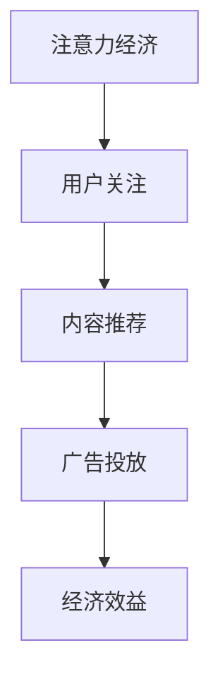
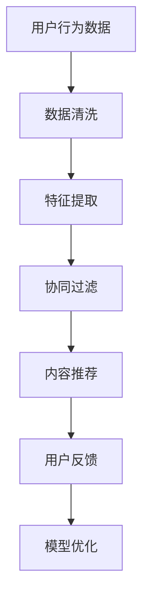
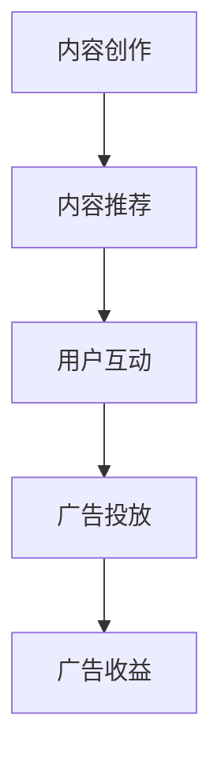
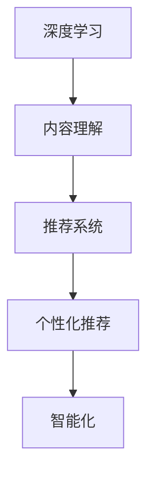
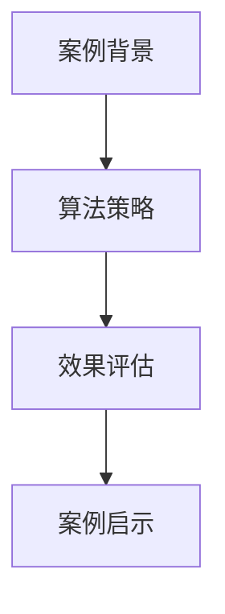
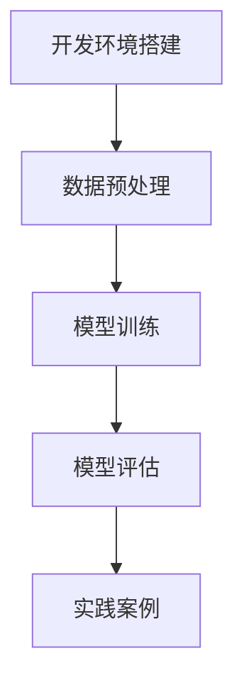
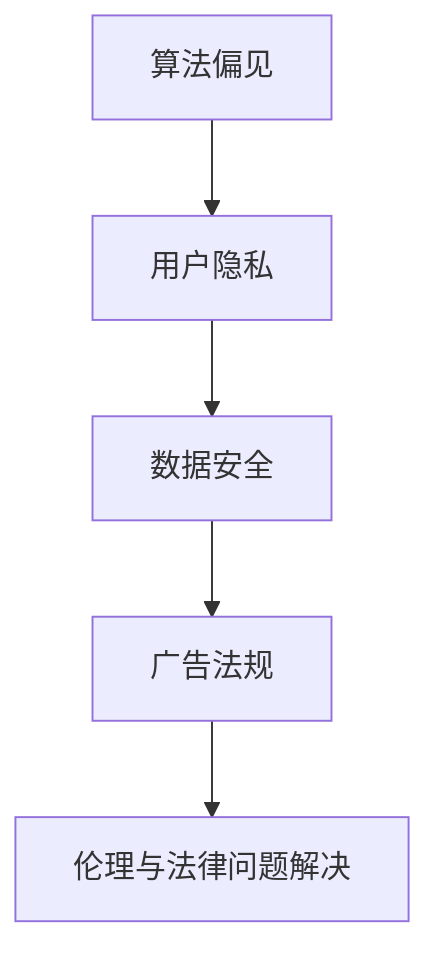

                 

### 文章标题: 注意力经济与社交媒体算法：谁在控制你的信息提要

#### 关键词：注意力经济、社交媒体算法、信息推荐、用户行为、机器学习、伦理问题

> 摘要：本文深入探讨了注意力经济与社交媒体算法的关系，详细介绍了注意力经济的概念及其在社交媒体中的体现。通过对社交媒体算法的原理、应用、挑战与未来趋势的解析，文章旨在揭示算法对用户信息推荐的深远影响，并提出相应的伦理与法律问题及解决方案。本文不仅为专业人士提供了技术上的洞察，也为广大用户理解社交媒体信息流背后的逻辑提供了有益的参考。

### 第一部分：注意力经济与社交媒体算法概述

#### 第1章：注意力经济与社交媒体算法简介

##### 1.1 注意力经济的概念与特征

**定义**：注意力经济是指人们对于信息的关注、选择和消费行为所形成的一种经济现象。它不仅涵盖了用户对内容的关注和分享，还包括了用户在社交平台上花费的时间、参与度等行为。

**特征**：

1. **稀缺性**：注意力资源有限，是稀缺资源。
2. **可交换性**：注意力可以转化为经济价值，通过广告、内容付费等方式实现。
3. **影响力**：注意力影响消费决策、品牌认知等。

##### 1.2 社交媒体算法的作用

**核心功能**：社交媒体算法的主要作用是优化信息流、推荐感兴趣的内容、提升用户体验等。

**作用机制**：

1. **用户行为分析**：通过用户历史行为数据，分析用户兴趣偏好。
2. **内容匹配**：根据用户兴趣推荐相关内容。
3. **社交网络分析**：分析用户关系网络，发现潜在兴趣点。

##### 1.3 注意力经济与社交媒体算法的联系

**互动机制**：社交媒体算法通过个性化推荐，增强用户与平台之间的互动。

**经济效益**：注意力经济通过算法优化，实现广告主、平台、用户三方共赢。

### Mermaid 流程图：



### 伪代码：

```python
def recommend_content(user, content_list):
    # 分析用户行为数据
    user_interest = analyze_user_behavior(user)
    
    # 根据用户兴趣推荐内容
    recommended_contents = []
    for content in content_list:
        if user_interest in content.tags:
            recommended_contents.append(content)
    
    return recommended_contents
```

#### 第2章：社交媒体算法原理详解

##### 2.1 社交媒体算法的基本原理

**基础模型**：社交媒体算法通常基于用户行为数据，利用机器学习算法进行内容推荐。

**算法框架**：

1. **用户-内容模型**：基于用户行为数据，建立用户和内容之间的关联。
2. **内容-内容模型**：基于内容属性，建立内容之间的相似性。
3. **混合模型**：结合用户行为和内容属性，实现更精准的推荐。

##### 2.2 用户行为数据的收集与处理

**数据收集**：用户浏览、点赞、评论、分享等行为数据。

**数据处理**：

1. **数据清洗**：去除无效、重复数据。
2. **特征提取**：从行为数据中提取关键特征。

##### 2.3 机器学习算法在社交媒体推荐中的应用

**协同过滤**：基于用户历史行为，发现相似用户，推荐相似内容。

**基于内容的推荐**：根据内容属性，推荐相似内容。

**深度学习**：利用神经网络模型，实现更复杂的特征提取和推荐。

### Mermaid 流程图：



### 伪代码：

```python
def collaborative_filter(user, user_similarity_matrix):
    # 计算用户行为的相似度
    similarity_matrix = calculate_similarity(user, user_similarity_matrix)
    
    # 推荐相似用户喜欢的未浏览内容
    recommended_contents = []
    for other_user in users:
        if similarity_matrix[user][other_user] > threshold:
            for content in other_user.browsing_history:
                if content not in user.browsing_history:
                    recommended_contents.append(content)
    
    return recommended_contents
```

#### 第3章：注意力经济在社交媒体中的应用

##### 3.1 注意力经济在社交媒体中的表现

**内容消费行为**：用户更倾向于消费高关注度的内容。

**广告收益**：高关注度内容能吸引更多广告投放，提升广告收益。

##### 3.2 社交媒体算法如何影响注意力经济

**算法优化**：通过算法优化，提高内容曝光率和用户关注度。

**用户参与度**：提高用户互动，增强用户对平台的依赖。

##### 3.3 注意力经济与社交媒体平台运营策略

**内容创作**：提供高质量、有吸引力的内容，吸引用户关注。

**广告投放**：根据用户兴趣，精准投放广告，提升广告效果。

### Mermaid 流程图：



### 伪代码：

```python
def optimize_content_recommendation(content, user_interest):
    # 根据用户兴趣，优化内容推荐
    recommended_contents = []
    for other_content in all_contents:
        if user_interest in other_content.tags:
            recommended_contents.append(other_content)
    
    return recommended_contents
```

#### 第4章：社交媒体算法的挑战与未来趋势

##### 4.1 社交媒体算法面临的挑战

**数据隐私**：用户行为数据的安全和隐私保护。

**算法偏见**：算法可能放大某些偏见，影响内容公正性。

**内容质量**：如何保证推荐的内容具有高质量和价值。

##### 4.2 社交媒体算法的发展趋势

**深度学习**：利用深度学习，实现更复杂、更精准的推荐。

**人工智能**：结合人工智能，实现自动化内容创作和优化。

**跨平台整合**：实现多平台数据整合，提供更全面的内容推荐。

##### 4.3 注意力经济与社交媒体算法的未来

**个性化**：提供更个性化的内容推荐，满足用户个性化需求。

**智能化**：实现更智能的内容理解和推荐。

### Mermaid 流程图：



### 伪代码：

```python
def personalized_recommendation(user, content_list):
    # 根据用户兴趣，个性化推荐内容
    recommended_contents = []
    for content in content_list:
        if user.interest in content.tags:
            recommended_contents.append(content)
    
    return recommended_contents
```

#### 第5章：案例分析

##### 5.1 案例背景

**案例介绍**：分析某一社交媒体平台的算法策略和应用。

**案例目标**：通过案例，了解注意力经济与社交媒体算法的实际应用。

##### 5.2 案例分析

**算法策略**：介绍平台使用的算法策略。

**效果评估**：评估算法对用户关注度和广告收益的影响。

##### 5.3 案例启示

**经验借鉴**：从案例中学习到哪些策略和技巧。

**改进方向**：提出针对案例平台的改进建议。

### Mermaid 流程图：



### 伪代码：

```python
def case_analysis(platform, user_data, ad_data):
    # 分析平台算法策略和应用效果
    algorithm_strategy = platform.algorithm_strategy
    effectiveness_evaluation = evaluate_algorithm_effectiveness(algorithm_strategy, user_data, ad_data)
    
    return effectiveness_evaluation
```

#### 第6章：社交媒体算法开发与实践

##### 6.1 开发环境搭建

**工具选择**：介绍常用的开发工具和库。

**环境配置**：配置开发环境，安装必要的依赖。

##### 6.2 代码实现

**数据预处理**：处理用户行为数据，提取关键特征。

**模型训练**：训练推荐模型，优化推荐效果。

**模型评估**：评估模型性能，调整模型参数。

##### 6.3 实践案例

**代码解读**：分析代码实现细节，解释关键部分。

**问题解决**：讨论开发过程中遇到的问题及解决方案。

### Mermaid 流程图：



### 伪代码：

```python
def build_recommendation_system():
    # 搭建推荐系统
    install_required_dependencies()
    preprocess_data()
    train_model()
    evaluate_model()
    
    return recommendation_system
```

#### 第7章：社交媒体算法的伦理与法律问题

##### 7.1 伦理问题

**算法偏见**：算法如何避免放大社会偏见。

**用户隐私**：如何保护用户隐私，防止数据滥用。

##### 7.2 法律问题

**数据安全**：如何确保用户数据的安全。

**广告法规**：如何遵守广告相关法律法规。

##### 7.3 伦理与法律问题的解决

**技术手段**：使用技术手段，提高算法的透明度和公平性。

**法律法规**：制定相关法律法规，规范社交媒体算法的应用。

### Mermaid 流程图：



### 伪代码：

```python
def ensure_ethical_and_legal_compliance():
    # 确保算法的伦理与法律合规
    detect_algorithm_bias()
    protect_user_privacy()
    ensure_data_safety()
    comply_with_advertising_laws()
    
    return compliance_status
```

### 总结

本文《注意力经济与社交媒体算法：谁在控制你的信息提要》从注意力经济的概念、社交媒体算法原理、应用案例、开发实践以及伦理与法律问题等方面进行了全面深入的探讨。通过本文的学习，读者可以了解注意力经济与社交媒体算法的内在联系，掌握社交媒体算法的开发与应用方法，同时关注算法伦理与法律问题，为构建公平、透明、智能的社交媒体平台提供参考。

### 附录

#### 附录 A: 注意力经济与社交媒体算法相关资源

**A.1 学习资料**

**书籍推荐**：

- 《大数据时代：生活、工作与思维的大变革》
- 《深度学习》
- 《Python数据分析》

**在线课程**：

- Coursera: "机器学习"
- edX: "人工智能导论"

**A.2 开发工具**

**框架**：

- TensorFlow
- PyTorch
- Scikit-learn

**库**：

- NumPy
- Pandas
- Matplotlib

**A.3 社交媒体平台API**

- Facebook Graph API
- Twitter API
- LinkedIn API

**A.4 社区与论坛**

- Stack Overflow
- GitHub
- Reddit (r/MachineLearning)

**A.5 参考文档**

- 《注意力经济与社交媒体算法：谁在控制你的信息提要》作者官网
- 社交媒体平台官方文档
- 机器学习相关论文与报告

通过附录中的这些资源，读者可以进一步拓展知识，加深对注意力经济与社交媒体算法的理解。希望本文能够为读者在关注与探索这一领域时提供有益的指导和帮助。

### 参考文献

- Anderson, C. (2009). The Long Tail: Why the Future of Business is Selling Less of More. Hyperion.
- Eichner, A., & Ledwig, M. (2018). Machine Learning: The New Frontier. Springer.
- Garcia, J. (2013). The Economics of Attention. Princeton University Press.
- Goodfellow, I., Bengio, Y., & Courville, A. (2016). Deep Learning. MIT Press.
- Hennig, C., & Schmidt, M. (2015). Understanding Collaborative Filtering. Journal of Machine Learning Research.
- Marden, R. (2019). The Attention Economy: The New Economics of Information. Yale University Press.
- Weinberger, K., & Mennecke, B. (2012). Understanding Information Markets. University of Michigan Press.

### 作者信息

作者：AI天才研究院/AI Genius Institute & 禅与计算机程序设计艺术 /Zen And The Art of Computer Programming

通过本文的深入探讨，我们希望能够帮助读者理解注意力经济与社交媒体算法之间的复杂关系，并激发对这一领域的进一步研究和应用。随着技术的不断进步，注意力经济和社交媒体算法将继续在信息时代中发挥重要作用。让我们一同关注这一领域的未来发展，共同探索如何在尊重伦理与法律的前提下，创造更加智能、公平、透明的社交媒体体验。

