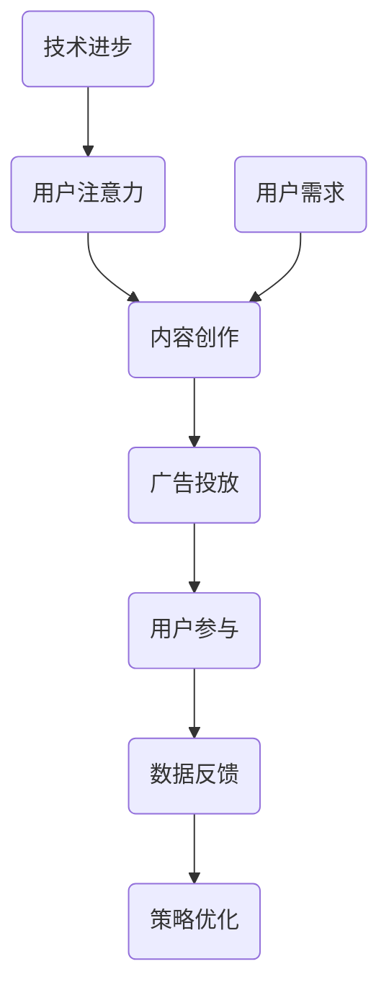

                 

# 《注意力经济与社交媒体营销策略：在不牺牲用户体验的情况下有效吸引受众》

## 关键词
注意力经济、社交媒体、营销策略、用户体验、广告变现、内容营销

## 摘要
随着互联网的普及和社交媒体的兴起，注意力经济成为了一个新的研究领域。本文旨在探讨注意力经济与社交媒体营销策略之间的关系，分析如何在保证用户体验的前提下，有效地吸引受众。文章首先介绍了注意力经济的基本概念和核心原理，接着讨论了社交媒体与注意力经济的关联，并阐述了社交媒体营销的基础策略。随后，文章深入分析了用户参与、数据分析和优化等核心策略，并通过实战案例进行了详细的讲解。最后，文章提出了如何在社交媒体营销中平衡用户体验和注意力经济的关系，以及未来发展趋势。本文旨在为营销人员提供实用的指导，帮助他们更有效地利用社交媒体平台，实现商业目标。

## 第一部分：注意力经济概述

### 第1章：注意力经济的基本概念

#### 1.1 注意力经济的起源与发展

注意力经济的概念最早由加拿大数字营销专家Sherry Turkle提出。她指出，在数字时代，人们的时间和注意力变得稀缺，而这一稀缺资源成为了新的经济形态的基础。随着互联网的普及，注意力经济逐渐成为一种新的商业逻辑，影响着广告、媒体、娱乐等多个行业。

**概念介绍**：
注意力经济（Attention Economy）指的是在数字时代，人们将注意力视为一种稀缺资源，企业通过吸引和维持用户的注意力来创造商业价值。

**发展历程**：
1. **注意力稀缺**：在互联网早期，用户获取信息的渠道有限，注意力相对充足。但随着信息爆炸，用户的注意力变得稀缺。
2. **注意力变现**：企业开始意识到用户注意力的价值，通过各种手段吸引用户的注意力，并将其转化为商业收益。
3. **算法推荐**：随着大数据和人工智能技术的发展，算法推荐成为吸引用户注意力的主要手段，进一步推动了注意力经济的演变。

#### 1.2 注意力经济的核心概念

**注意力稀缺性**：
在信息过载的时代，用户对注意力的需求远远大于供给。用户每天只有有限的时间和精力，如何有效分配这些资源成为了关键。

**注意力转移**：
用户的注意力不仅稀缺，而且容易转移。在社交媒体上，用户经常会被新的内容、广告或通知所吸引，导致注意力分散。

**价值**：
1. **商业价值**：企业通过吸引用户的注意力，可以实现广告收入、品牌推广和用户转化等多种商业目标。
2. **个人价值**：用户通过关注有价值的内容，可以获得知识、娱乐和社交等个人收益。

#### 1.3 注意力经济的价值

**商业价值**：
注意力经济为企业提供了新的盈利模式。例如，社交媒体平台通过广告投放、内容付费等方式，实现了巨额收益。

**个人价值**：
注意力经济也带来了个人收益。用户通过关注高质量内容，可以提升自己的知识水平、娱乐体验和社交能力。

**注意力管理的策略与技巧**：
1. **内容筛选**：用户需要学会筛选有价值的内容，避免时间浪费。
2. **时间管理**：合理安排时间，保证工作与娱乐的平衡。
3. **互动参与**：积极参与互动，提升用户体验和忠诚度。

### 第2章：社交媒体与注意力经济

#### 2.1 社交媒体的崛起

**发展背景**：
社交媒体的兴起与互联网技术的发展密切相关。从最初的博客、论坛，到现在的微信、微博、抖音等，社交媒体已经成为人们日常生活中不可或缺的一部分。

**用户行为**：
1. **信息消费**：用户在社交媒体上花费大量时间浏览、点赞、评论等。
2. **社交互动**：用户通过社交媒体与朋友、家人、同事等保持联系。

#### 2.2 社交媒体注意力变现

**广告变现模式**：
社交媒体平台通过广告投放实现盈利。例如，微信公众号的公众号广告、抖音的短视频广告等。

**内容变现策略**：
内容创作者通过创作有价值的内容，吸引粉丝和流量，进而实现收入。例如，通过平台分成、粉丝打赏、商品推广等方式。

#### 2.3 社交媒体注意力转移

**算法推荐**：
社交媒体平台利用算法推荐，吸引用户的注意力。例如，微信的“发现”、“看一看”，抖音的推荐算法等。

**用户互动**：
用户之间的互动，如评论、点赞、分享等，也会吸引注意力。这种互动有助于建立社区氛围，增强用户的黏性。

## 第二部分：社交媒体营销策略

### 第3章：社交媒体营销的基础

#### 3.1 社交媒体营销的定义与目标

**定义**：
社交媒体营销（Social Media Marketing，SMM）指的是利用社交媒体平台，如Facebook、Twitter、Instagram等，进行营销推广的活动。

**目标**：
社交媒体营销的目标包括增加品牌知名度、提升用户参与度、增加销售额等。

#### 3.2 社交媒体营销的受众分析

**用户画像**：
通过对用户年龄、性别、兴趣、行为等特征的分析，了解目标受众，以便制定更精准的营销策略。

**行为分析**：
分析用户在社交媒体上的行为习惯，如浏览时间、互动频率、内容偏好等，以便优化营销内容。

#### 3.3 社交媒体营销的内容策略

**内容类型**：
社交媒体营销的内容类型包括图文、视频、直播等，应根据目标受众的偏好选择适合的内容类型。

**内容优化**：
通过SEO（搜索引擎优化）、SEM（搜索引擎营销）等方法，提高内容的可见度和吸引力。

### 第4章：社交媒体营销的核心策略

#### 4.1 品牌定位与形象塑造

**品牌定位**：
明确品牌在社交媒体上的定位，如品牌价值、品牌个性等，以便树立独特的品牌形象。

**形象塑造**：
通过发布积极、有价值的内容，塑造品牌正面形象，提高用户对品牌的认知和好感。

#### 4.2 用户参与与互动

**用户参与**：
通过互动活动、用户评论等方式，激发用户的参与热情，提高用户黏性。

**互动策略**：
通过回应用户评论、举办互动活动、提供个性化服务等，增强用户与品牌之间的互动。

#### 4.3 数据分析与优化

**数据监测**：
利用社交媒体平台提供的数据分析工具，监测营销活动的效果，如点击率、转化率、用户参与度等。

**效果优化**：
根据数据分析结果，调整营销策略，优化内容、渠道和投放时间，提高营销效果。

### 第5章：社交媒体营销实战案例

#### 5.1 成功案例分析

**案例一：杜蕾斯**
杜蕾斯在社交媒体上以幽默、创意的内容著称，通过一系列话题营销，成功吸引了大量用户关注，提高了品牌知名度。

**案例二：可口可乐**
可口可乐通过社交媒体与用户互动，开展了一系列互动营销活动，如“瓶内文案”活动，鼓励用户分享自己的故事，增强了用户参与感和品牌忠诚度。

#### 5.2 营销活动的策划与执行

**策划**：
制定营销活动的目标、策略、内容、时间表等，确保活动具有吸引力和可行性。

**执行**：
执行营销活动的具体步骤，包括内容发布、互动引导、数据监测等。

#### 5.3 营销效果评估与反馈

**评估**：
通过数据分析，评估营销活动的效果，如用户参与度、品牌知名度、转化率等。

**反馈**：
根据评估结果，总结经验教训，调整营销策略，提高未来活动的效果。

### 第三部分：社交媒体营销与用户体验

#### 第6章：用户体验在社交媒体营销中的重要性

**6.1 用户价值的定义与评估**

**定义**：
用户价值（User Value）指的是用户在使用产品或服务过程中所获得的收益和满意度。

**评估**：
通过用户调查、行为分析等手段，评估用户价值的指标，如用户留存率、用户满意度、用户参与度等。

**6.2 用户满意度与忠诚度**

**满意度**：
提升用户满意度的方法包括提供高质量的产品或服务、积极回应用户反馈、优化用户体验等。

**忠诚度**：
培养用户忠诚度的策略包括提供会员服务、定期优惠活动、个性化推荐等。

**6.3 用户增长策略**

**策略一：内容驱动**
通过创作高质量、有价值的内容，吸引新用户，提高用户留存率。

**策略二：互动营销**
通过用户互动，提高用户参与度和忠诚度，促进用户增长。

### 第7章：用户体验与社交媒体营销的平衡

**7.1 用户体验优先的策略**

**内容优化**：
优化内容，使其更加符合用户需求，提高用户满意度。

**互动优化**：
优化用户互动体验，提高用户参与度。

**7.2 注意力经济与用户体验的平衡**

**平衡策略**：
在追求注意力经济的同时，注重用户体验，避免过度商业化。

**案例分析**：
分析实际案例，探讨如何在社交媒体营销中实现用户体验和注意力经济的平衡。

**7.3 未来发展趋势**

**技术进步**：
新技术（如人工智能、大数据等）对用户体验和社交媒体营销的影响。

**趋势分析**：
社交媒体营销与用户体验的未来发展趋势，如个性化推荐、社交电商等。

### 第四部分：综合案例分析

#### 第8章：社交媒体营销与注意力经济的整合应用

**8.1 案例背景与目标**

**背景**：
某企业希望通过社交媒体营销提升品牌知名度和用户参与度。

**目标**：
通过有效的社交媒体营销策略，实现品牌知名度提升、用户参与度提高和销售额增长。

**8.2 案例实施过程**

**策略制定**：
制定以用户价值为核心的品牌定位和内容策略，注重用户体验。

**内容发布**：
发布高质量、有趣的内容，吸引用户关注和互动。

**数据监测**：
通过数据分析，实时监测营销活动的效果，调整策略。

**8.3 案例总结与启示**

**总结**：
通过社交媒体营销与注意力经济的整合应用，成功提升了品牌知名度和用户参与度。

**启示**：
为其他企业提供可借鉴的社交媒体营销策略，实现商业目标。

### 第五部分：附录

#### 第9章：社交媒体营销工具与资源

**9.1 社交媒体营销工具概述**

**工具分类**：
介绍不同类型的社交媒体营销工具，如数据分析工具、内容管理工具、互动营销工具等。

**工具推荐**：
推荐一些常用的社交媒体营销工具，如Google Analytics、Hootsuite、Buffer等。

**9.2 营销资源获取**

**数据资源**：
介绍如何获取社交媒体营销所需的数据资源，如用户画像、市场趋势等。

**案例资源**：
介绍如何获取社交媒体营销的优秀案例资源，如行业报告、案例分析等。

**9.3 学习资源推荐**

**书籍推荐**：
推荐一些关于社交媒体营销的优秀书籍，如《社交媒体营销实战手册》、《社交媒体营销攻略》等。

**在线课程推荐**：
推荐一些关于社交媒体营销的在线课程，如Coursera、Udemy等平台上的相关课程。

### 注意力经济的 Mermaid 流程图

### 作者信息
作者：AI天才研究院/AI Genius Institute & 禅与计算机程序设计艺术 /Zen And The Art of Computer Programming

---

请注意，本文仅为示例，实际内容需根据具体研究或案例进行撰写。本文的结构和内容应确保逻辑清晰、信息丰富、论述有力，同时符合IT领域的专业写作标准。在撰写过程中，应确保所有数据和事实的准确性，并遵循学术诚信原则。代码示例和数学模型应以伪代码和LaTeX格式呈现，确保可读性和正确性。文章的字数要求在8000～12000字左右，具体字数可根据内容深度和复杂度进行调整。文章格式要求使用markdown格式输出，确保排版整齐、易于阅读。在撰写过程中，应遵循LET'S THINK STEP BY STEP的原则，逐步分析问题、阐述观点、提出解决方案。文章末尾应附上作者信息，以体现专业性和可信度。

