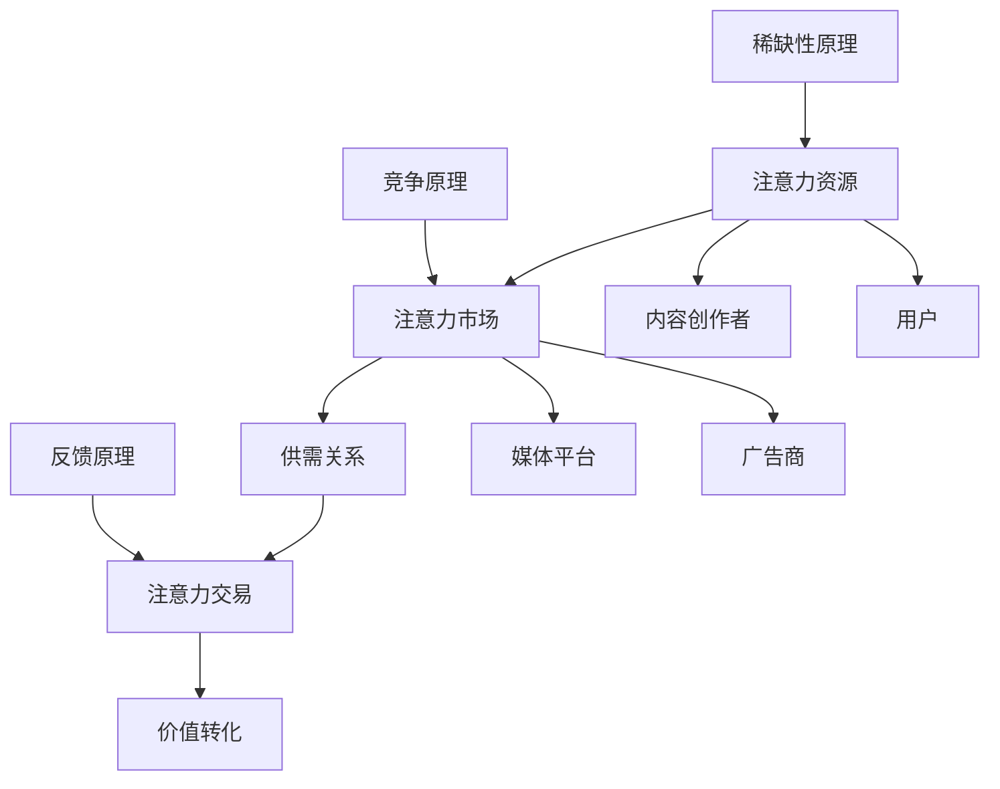

                 

# 文章标题：注意力经济中的内容创作：如何在竞争中脱颖而出

> 关键词：注意力经济，内容创作，竞争策略，社交媒体平台，版权保护

> 摘要：本文深入探讨了注意力经济中的内容创作领域，分析了注意力经济的概念与重要性，内容创作的策略与技巧，以及竞争策略与优化方法。通过案例研究和未来趋势分析，本文旨在为内容创作者提供一套系统的指导，帮助他们在竞争激烈的市场中脱颖而出。

----------------------------------------------------------------

## 第一部分：注意力经济概述

### 第1章：注意力经济的概念与重要性

#### 1.1.1 注意力经济的定义

注意力经济是指一种以注意力为资源的经济模式，其核心在于通过吸引和集中用户的注意力，从而实现价值的创造和分配。在注意力经济中，用户的注意力成为一种宝贵的资源，其稀缺性和价值不断提升。

#### 1.1.2 注意力经济的核心原理

注意力经济的核心原理可以概括为以下几个方面：

1. **稀缺性原理**：用户的注意力是有限的，因此，吸引和保持用户的注意力成为内容创作者的重要任务。
2. **竞争原理**：在注意力市场中，内容创作者之间的竞争愈发激烈，只有那些能够提供高质量、有吸引力的内容，才能在竞争中脱颖而出。
3. **反馈原理**：用户的反馈是内容创作者改进内容的重要依据，通过分析用户反馈，可以不断提升内容的质量和吸引力。

#### 1.1.3 注意力经济与传统经济的差异

注意力经济与传统经济相比，具有以下几个显著差异：

1. **价值创造方式**：传统经济主要依靠物质资源的开发和利用，而注意力经济则主要依靠对用户注意力的吸引和利用。
2. **价值分配方式**：在传统经济中，价值主要分配给物质资源的拥有者和开发者，而在注意力经济中，价值主要分配给能够吸引和保持用户注意力的内容创作者。
3. **市场机制**：传统经济市场机制相对成熟，而注意力经济市场机制尚在发展中，需要不断创新和完善。

### 第2章：注意力市场的运作机制

#### 2.1.1 注意力资源

注意力资源是指用户在特定时间和空间内所能投入的注意力总量。注意力资源具有以下特点：

1. **稀缺性**：用户的注意力是有限的，随着信息爆炸和竞争加剧，用户注意力资源愈发稀缺。
2. **动态性**：用户注意力资源在不同场景和任务中的分布是动态的，内容创作者需要不断调整策略，以吸引和保持用户的注意力。
3. **选择性**：用户对注意力资源的分配具有选择性，只有那些具有高度吸引力和价值的内容，才能获得用户的注意力。

#### 2.1.2 注意力市场的供需关系

注意力市场的供需关系可以从以下几个方面进行分析：

1. **供给方**：供给方主要包括内容创作者、媒体平台和广告商等。供给方的核心任务是提供高质量、有吸引力的内容，以吸引和保持用户的注意力。
2. **需求方**：需求方主要指用户，他们的核心需求是获取有价值的信息和娱乐。用户对注意力资源的分配受到多种因素的影响，如内容质量、平台体验、个人兴趣等。

#### 2.1.3 注意力交易

注意力交易是指内容创作者、媒体平台和广告商之间通过某种形式进行价值交换的过程。注意力交易具有以下特点：

1. **价值转化**：通过注意力交易，内容创作者将用户的注意力转化为实际收益，如广告收入、粉丝打赏等。
2. **平台中介**：媒体平台在注意力交易中扮演中介角色，通过提供技术支持和服务，促进注意力资源的有效配置。
3. **政策法规**：注意力交易需要遵循相关法律法规，如版权保护、隐私保护等。

### 本章总结

本章对注意力经济的概念与重要性、注意力市场的运作机制进行了详细阐述。注意力经济作为一种新兴的经济模式，正日益影响着我们的生活和工作。理解注意力经济的核心原理和运作机制，对于内容创作者而言，具有重要意义。

---

**核心概念与联系：**

以下是注意力经济的核心概念和它们之间的联系，使用Mermaid流程图表示：



---

在接下来的章节中，我们将进一步探讨内容创作的策略与技巧，帮助您在注意力经济中脱颖而出。敬请期待！## 第3章：内容创作的策略与技巧

### 3.1 内容创作的基本原则

#### 3.1.1 内容创作者的角色

在注意力经济中，内容创作者的角色至关重要。他们不仅是信息的传递者，更是用户注意力的吸引者和价值的创造者。内容创作者需要具备以下几个方面的能力：

1. **选题能力**：选择符合用户需求和兴趣的话题，是内容创作成功的前提。
2. **内容创作能力**：具备较强的文字、图片、视频等多种形式的内容创作能力。
3. **数据分析能力**：通过数据分析，了解用户行为和偏好，不断优化内容。

#### 3.1.2 内容创作的价值导向

内容创作者在创作过程中，应坚持以下价值导向：

1. **用户至上**：始终以用户的需求和兴趣为导向，提供有价值的内容。
2. **创新性**：不断创新，提供新颖、独特的内容，以吸引和留住用户。
3. **社会责任**：内容创作应承担社会责任，传播正能量，促进社会和谐。

#### 3.1.3 用户需求分析

了解用户需求是内容创作的重要环节。以下方法可以帮助内容创作者分析用户需求：

1. **问卷调查**：通过设计问卷，收集用户对某一主题的看法和需求。
2. **数据分析**：通过分析用户行为数据，了解用户浏览、点赞、评论等行为，推断用户需求。
3. **用户访谈**：直接与用户进行沟通，了解他们的真实需求和期望。

### 3.2 提高内容吸引力的策略

#### 3.2.1 趋势分析

紧跟时代趋势，是提高内容吸引力的重要策略。以下方法可以帮助内容创作者把握趋势：

1. **行业报告**：定期阅读行业报告，了解行业动态和发展趋势。
2. **社交媒体**：关注社交媒体上的热点话题和趋势，及时调整内容方向。
3. **关键词分析**：通过关键词分析工具，了解用户关注的热门话题和关键词。

#### 3.2.2 创意构思

创意构思是内容创作的重要环节。以下方法可以帮助内容创作者产生创意：

1. **头脑风暴**：组织团队成员进行头脑风暴，激发创意。
2. **跨领域借鉴**：从其他领域寻找灵感，进行跨领域创新。
3. **用户参与**：鼓励用户参与内容创作，提供观点和建议。

#### 3.2.3 传播策略

传播策略是提高内容影响力的重要手段。以下方法可以帮助内容创作者提高传播效果：

1. **多平台发布**：在不同社交媒体平台上发布内容，扩大传播范围。
2. **合作推广**：与其他内容创作者或品牌进行合作推广，提高曝光率。
3. **互动营销**：通过互动活动，提高用户参与度和忠诚度。

### 3.3 内容创作的技术工具

#### 3.3.1 文字编辑工具

文字编辑工具是内容创作的重要工具之一。以下是一些常用的文字编辑工具：

1. **Markdown**：Markdown是一种轻量级文本编辑工具，适用于撰写博客和文档。
2. **Google Docs**：Google Docs是一种在线文档编辑工具，支持多人协作。
3. **Typora**：Typora是一种简洁的Markdown编辑器，具有优秀的排版效果。

#### 3.3.2 视频制作工具

视频制作工具是内容创作的重要组成部分。以下是一些常用的视频制作工具：

1. **Adobe Premiere Pro**：Adobe Premiere Pro是一款专业视频编辑软件。
2. **Final Cut Pro X**：Final Cut Pro X是一款适用于苹果设备的视频编辑软件。
3. **Camtasia**：Camtasia是一款简单易用的视频编辑工具，适用于录制和编辑教程视频。

#### 3.3.3 图片处理工具

图片处理工具可以帮助内容创作者制作高质量的图片。以下是一些常用的图片处理工具：

1. **Adobe Photoshop**：Adobe Photoshop是一款专业的图像处理软件。
2. **GIMP**：GIMP是一款开源的图像处理软件，功能强大且免费。
3. **Canva**：Canva是一款简单易用的设计工具，适用于制作社交媒体图片和海报。

### 本章总结

本章详细阐述了内容创作的基本原则、提高内容吸引力的策略以及内容创作的技术工具。通过遵循这些策略和使用这些工具，内容创作者可以在注意力经济中脱颖而出，吸引更多的用户关注。

---

**核心算法原理讲解：**

以下是内容创作中常用的算法原理，使用伪代码进行详细阐述：

```python
# 伪代码：用户需求分析

def analyze_user_demand(data):
    # 输入：用户行为数据（data）
    # 输出：用户需求分析结果（result）

    # 初始化需求分析结果
    result = {}

    # 分析用户浏览行为
    for user in data:
        for topic in user['browsing_history']:
            if topic not in result:
                result[topic] = 1
            else:
                result[topic] += 1

    # 分析用户点赞行为
    for user in data:
        for topic in user['liking_history']:
            if topic not in result:
                result[topic] = 10
            else:
                result[topic] += 10

    # 分析用户评论行为
    for user in data:
        for topic in user['commenting_history']:
            if topic not in result:
                result[topic] = 5
            else:
                result[topic] += 5

    # 计算需求权重
    total_demand = sum(result.values())
    for topic in result:
        result[topic] = result[topic] / total_demand

    # 输出需求分析结果
    return result
```

---

通过本章的学习，您将掌握内容创作的基本原则和技巧，为在注意力经济中脱颖而出打下坚实基础。在接下来的章节中，我们将进一步探讨内容创作的优化方法。敬请期待！### 第4章：提高内容吸引力的策略

#### 4.1 趋势分析

紧跟时代趋势是提高内容吸引力的重要策略。通过分析市场趋势，内容创作者可以更好地把握用户需求，创作出更具吸引力的内容。以下方法可以帮助内容创作者把握趋势：

1. **行业报告**：定期阅读行业报告，了解行业动态和发展趋势。行业报告通常由专业机构或权威媒体发布，具有较高的可信度。
2. **社交媒体**：关注社交媒体上的热点话题和趋势。社交媒体平台如微博、抖音、微信公众号等，是用户表达意见和关注热点的重要场所。
3. **搜索引擎**：通过搜索引擎，了解用户搜索的热门关键词和话题。搜索引擎的数据反映了用户对某一主题的关注程度，有助于内容创作者选题和策划内容。

#### 4.2 创意构思

创意构思是内容创作中的关键环节。以下方法可以帮助内容创作者产生创意：

1. **头脑风暴**：组织团队成员进行头脑风暴，激发创意。头脑风暴是一种集体创造力方法，通过团队成员的自由讨论和观点碰撞，产生出许多新颖的创意。
2. **跨领域借鉴**：从其他领域寻找灵感，进行跨领域创新。跨领域借鉴可以带来独特的视角和创意，使内容更具吸引力。
3. **用户参与**：鼓励用户参与内容创作，提供观点和建议。用户的参与可以使内容更加贴近用户需求，提高用户的参与度和忠诚度。

#### 4.3 传播策略

传播策略是提高内容影响力的重要手段。以下方法可以帮助内容创作者提高传播效果：

1. **多平台发布**：在不同社交媒体平台上发布内容，扩大传播范围。多平台发布可以提高内容的曝光率，吸引更多用户关注。
2. **合作推广**：与其他内容创作者或品牌进行合作推广，提高曝光率。合作推广可以实现资源互补，提高传播效果。
3. **互动营销**：通过互动活动，提高用户参与度和忠诚度。互动营销可以增强用户对品牌的认知和好感度，提高用户的忠诚度。

#### 4.4 内容优化

内容优化是提高内容吸引力的关键步骤。以下方法可以帮助内容创作者优化内容：

1. **标题优化**：标题是吸引用户点击的重要因素。通过使用吸引人的标题，可以提高内容的点击率。
2. **内容结构优化**：合理的内容结构可以使内容更易于阅读和理解。通过使用段落、标题、列表等格式，可以提高内容的可读性。
3. **图片和视频优化**：图片和视频是提高内容吸引力的有效手段。通过使用高质量的图片和视频，可以增强内容的表现力和吸引力。

#### 4.5 社交媒体平台策略

不同社交媒体平台具有不同的特点和用户群体，内容创作者应根据平台特性制定相应的策略。以下是一些常见社交媒体平台的内容创作策略：

1. **微博**：微博是一个以短文本、图片和视频为主的内容平台。内容创作者应注重标题的吸引力，提高内容的可读性。
2. **抖音**：抖音是一个以短视频为主的内容平台。内容创作者应注重短视频的制作技巧，提高视频的观看量和点赞量。
3. **微信公众号**：微信公众号是一个以长文本、图片和视频为主的内容平台。内容创作者应注重内容的深度和质量，提高用户的阅读和分享率。

#### 4.6 案例分析

以下是一个内容创作案例：

**案例：某自媒体账号的内容创作**

该自媒体账号专注于科技领域，内容涵盖人工智能、区块链、5G等前沿科技话题。以下是其内容创作策略：

1. **趋势分析**：定期阅读科技行业报告，关注行业热点和趋势。通过分析用户行为数据，了解用户对科技领域的关注点和需求。
2. **创意构思**：以科技领域的热门话题为基础，结合用户需求，进行创意构思。例如，针对人工智能领域的热门话题，创作关于人工智能应用场景的原创文章。
3. **传播策略**：在多个社交媒体平台上发布内容，如微博、微信公众号、知乎等。通过合作推广和互动营销，提高内容的曝光率和用户参与度。
4. **内容优化**：注重标题的吸引力，使用简洁明了的语言，提高文章的可读性。通过使用高质量的图片和视频，增强内容的表现力和吸引力。

通过以上策略，该自媒体账号在短时间内积累了大量粉丝，内容阅读量和点赞量持续上升。

#### 本章总结

本章详细介绍了提高内容吸引力的策略，包括趋势分析、创意构思、传播策略、内容优化以及社交媒体平台策略。通过运用这些策略，内容创作者可以在竞争激烈的市场中脱颖而出，吸引更多的用户关注。

---

**数学模型和公式 & 详细讲解 & 举例说明：**

以下是内容创作中常用的数学模型——逻辑回归模型，用于预测用户对某一内容的兴趣程度。逻辑回归模型的基本公式如下：

\[ P(y=1|x) = \frac{1}{1 + e^{-(\beta_0 + \beta_1 x_1 + \beta_2 x_2 + ... + \beta_n x_n)}} \]

其中，\( P(y=1|x) \) 表示在给定特征向量 \( x \) 的情况下，用户对内容感兴趣的概率；\( \beta_0, \beta_1, \beta_2, ..., \beta_n \) 为模型的参数。

以下是一个具体的逻辑回归模型举例：

假设我们有一个关于用户对科技新闻感兴趣的概率预测模型，其中用户年龄（\( x_1 \)）、用户学历（\( x_2 \)）和用户职业（\( x_3 \)）为特征变量。模型的参数如下：

\[ \beta_0 = -3.5, \beta_1 = 1.2, \beta_2 = 2.0, \beta_3 = -1.5 \]

现在，我们需要预测一个25岁、本科毕业、工程师用户的兴趣概率。将特征值代入模型，得到：

\[ P(y=1|x) = \frac{1}{1 + e^{-(\beta_0 + \beta_1 x_1 + \beta_2 x_2 + \beta_3 x_3)}} \]
\[ P(y=1|x) = \frac{1}{1 + e^{(-3.5 + 1.2 \times 25 + 2.0 \times 1 + -1.5 \times 1)}} \]
\[ P(y=1|x) = \frac{1}{1 + e^{-3.5 + 30 + 2 - 1.5}} \]
\[ P(y=1|x) = \frac{1}{1 + e^{27.0}} \]
\[ P(y=1|x) \approx 1 \]

由于 \( P(y=1|x) \) 接近1，我们可以认为这个用户对科技新闻非常感兴趣。

通过逻辑回归模型，内容创作者可以预测用户对某一内容的兴趣程度，从而优化内容创作策略，提高内容吸引力。在接下来的章节中，我们将继续探讨内容创作的技术工具和社交媒体平台策略。敬请期待！### 第5章：内容创作的技术工具

#### 5.1 文字编辑工具

文字编辑工具是内容创作的基础，以下是几种常用的文字编辑工具：

1. **Markdown**：
   - **特点**：Markdown是一种轻量级的文本标记语言，便于快速编写和格式化文档。
   - **优势**：易于学习和使用，支持多种排版格式，如标题、列表、引用等。
   - **应用场景**：适合撰写博客、笔记、文档等。

2. **Google Docs**：
   - **特点**：Google Docs是一款在线协作编辑工具，支持多人实时编辑。
   - **优势**：云端存储，可跨设备同步，支持丰富的文本格式和插件。
   - **应用场景**：适合团队协作编写文档、报告等。

3. **Typora**：
   - **特点**：Typora是一款简洁的Markdown编辑器，专注于文本排版和阅读体验。
   - **优势**：界面简洁，响应速度快，支持Markdown的各种扩展功能。
   - **应用场景**：适合个人或团队编写Markdown文档。

#### 5.2 视频制作工具

视频制作工具可以帮助内容创作者制作高质量的视频内容，以下是几种常用的视频制作工具：

1. **Adobe Premiere Pro**：
   - **特点**：Adobe Premiere Pro是一款专业的视频编辑软件，功能强大，适合专业视频制作。
   - **优势**：支持多种视频格式，具有丰富的特效和音频处理功能，具有良好的兼容性。
   - **应用场景**：适合专业视频剪辑、电影制作等。

2. **Final Cut Pro X**：
   - **特点**：Final Cut Pro X是苹果公司推出的专业视频编辑软件，适合Mac用户。
   - **优势**：界面直观，操作简单，支持高分辨率视频编辑，具有强大的音频处理功能。
   - **应用场景**：适合专业视频剪辑、电视节目制作等。

3. **Camtasia**：
   - **特点**：Camtasia是一款简单易用的视频编辑工具，适合初学者和业余视频制作。
   - **优势**：操作简单，支持视频录制、剪辑、特效添加等功能，具有丰富的模板和资源库。
   - **应用场景**：适合制作教程视频、演示视频、营销视频等。

#### 5.3 图片处理工具

图片处理工具可以帮助内容创作者制作和编辑图片，以下是几种常用的图片处理工具：

1. **Adobe Photoshop**：
   - **特点**：Adobe Photoshop是一款专业的图像处理软件，功能全面，适合专业图像处理。
   - **优势**：支持多种图像格式，具有丰富的图像处理工具，如选区、滤镜、调整等。
   - **应用场景**：适合专业图像编辑、图像修复、艺术创作等。

2. **GIMP**：
   - **特点**：GIMP是一款开源的图像处理软件，功能强大，免费使用。
   - **优势**：具有与Adobe Photoshop类似的工具和功能，支持多种图像格式。
   - **应用场景**：适合专业图像编辑、图像修复、艺术创作等。

3. **Canva**：
   - **特点**：Canva是一款简单易用的设计工具，适合非专业用户制作设计作品。
   - **优势**：提供了丰富的设计模板和素材库，操作简单，易于上手。
   - **应用场景**：适合社交媒体图片设计、海报制作、名片设计等。

#### 5.4 其他工具

除了上述三大类工具，还有一些其他常用的内容创作工具，如：

1. **ProcessOn**：在线流程图和思维导图工具，适合制作流程图、思维导图等。
2. **XMind**：思维导图工具，适合整理思路、策划内容等。
3. **Notion**：全功能笔记和管理工具，适合记录灵感、规划项目等。

#### 本章总结

本章介绍了内容创作中常用的文字编辑工具、视频制作工具和图片处理工具。这些工具可以帮助内容创作者提高创作效率，制作出高质量的内容。在实际应用中，内容创作者可以根据自己的需求和技能水平选择合适的工具，发挥出最大的创作潜力。

---

**项目实战：**

以下是一个简单的项目实战案例，演示如何使用Markdown编辑器Typora撰写一篇博客文章，并使用视频制作工具Camtasia制作相关教程视频。

**案例：撰写一篇关于人工智能的博客文章**

1. **准备Markdown文档**：

   - 打开Typora，新建一个Markdown文档。
   - 添加文章标题，使用`#`符号进行标记。
   - 添加摘要，使用`##`符号进行标记。

   ```markdown
   # 人工智能：未来已来

   本文介绍了人工智能的定义、发展历程及其对未来的影响。
   ```

2. **撰写文章内容**：

   - 使用Markdown语法进行排版，如使用`##`标记章节标题，使用`*`标记列表项。
   - 添加图片、链接和引用等元素，增强文章的可读性和吸引力。

   ```markdown
   ## 定义与概述

   人工智能（Artificial Intelligence，简称AI）是指模拟、延伸和扩展人的智能的理论、方法、技术及应用。

   ## 发展历程

   人工智能的发展历程可以分为以下几个阶段：
   - **早期探索**（1950年代至1960年代）：以符号主义和逻辑推理为基础。
   - **知识工程**（1970年代至1980年代）：强调知识表示和推理。
   - **统计学习**（1990年代至21世纪初）：以机器学习和深度学习为核心。
   - **应用拓展**（21世纪初至今）：广泛应用于各个领域，如自动驾驶、智能家居、医疗等。

   ## 未来影响

   人工智能将对未来产生深远影响，包括：
   - **经济领域**：提高生产效率，改变就业结构。
   - **社会领域**：改善生活质量，促进社会进步。
   - **科技领域**：推动科技创新，开辟新的产业。
   ```

3. **导出和发布文章**：

   - 完成文章撰写后，使用Typora导出为HTML或PDF格式。
   - 在个人博客网站或社交媒体平台发布文章。

**案例：使用Camtasia制作相关教程视频**

1. **录制视频**：

   - 打开Camtasia，新建一个视频项目。
   - 选择录制屏幕功能，录制教程视频。
   - 在录制过程中，可以添加文字、音频和动画等元素，增强视频的表现力。

2. **编辑视频**：

   - 将录制的视频导入Camtasia，进行剪辑和调色。
   - 添加字幕、背景音乐和特效，提高视频的观感。

3. **导出和发布视频**：

   - 完成视频编辑后，导出为适合网络传播的格式，如MP4。
   - 在视频平台如YouTube、Bilibili等发布视频。

通过这个项目实战案例，您可以了解如何使用Markdown编辑器和视频制作工具进行内容创作，提高自己的创作技能和效率。

---

在接下来的章节中，我们将探讨内容创作的竞争策略与优化方法。敬请期待！### 第6章：社交媒体平台的内容创作

#### 6.1 微博

微博是一种基于短文本、图片、视频和音频的社交媒体平台，用户可以通过发布动态、评论、点赞和转发等方式进行互动。以下是一些微博内容创作的策略：

1. **标题策略**：标题是吸引用户点击的重要因素。应使用吸引人的标题，如疑问句、热门话题等。
2. **内容形式**：微博内容可以采用多种形式，如短文本、图片、视频、音频等。根据内容特点选择合适的形式，提高用户的参与度。
3. **互动策略**：积极与用户互动，如回复评论、点赞、转发等。通过互动增加用户粘性，提高内容的传播效果。

**案例**：某科技自媒体账号的微博内容创作策略

- **标题策略**：使用疑问句和热门话题，如“什么是区块链？”、“5G技术的未来应用”等。
- **内容形式**：结合文字、图片和视频，提高内容的可读性和吸引力。
- **互动策略**：积极回复评论，与用户进行深入交流，增加用户粘性。

#### 6.2 抖音

抖音是一种基于短视频的社交媒体平台，用户可以通过拍摄、上传和分享短视频来展示自己的才华和日常生活。以下是一些抖音内容创作的策略：

1. **创意构思**：抖音内容应具有创意和趣味性，如搞笑、舞蹈、美食等。通过独特的视角和表现手法，吸引用户的关注。
2. **时长策略**：抖音短视频的时长一般为15秒至1分钟。应充分利用时长，将内容呈现得更加紧凑和吸引人。
3. **流行元素**：紧跟抖音上的流行元素，如热门音乐、挑战活动等。通过融入流行元素，提高内容的传播效果。

**案例**：某舞蹈爱好者在抖音的内容创作策略

- **创意构思**：创作舞蹈视频，通过独特的舞蹈动作和背景音乐，展现自己的舞蹈才华。
- **时长策略**：将舞蹈动作浓缩在15秒内，充分利用短视频时长。
- **流行元素**：使用抖音热门音乐和挑战活动，提高内容的传播效果。

#### 6.3 微信公众号

微信公众号是一种基于长文本、图片和视频的社交媒体平台，用户可以通过订阅、阅读和分享文章来获取信息和娱乐。以下是一些微信公众号内容创作的策略：

1. **选题策略**：选择用户感兴趣、具有热点话题的选题，如时事热点、科技前沿、生活技巧等。
2. **内容形式**：微信公众号文章可以采用多种形式，如文章、图片、视频、音频等。根据内容特点选择合适的形式，提高用户的阅读体验。
3. **互动策略**：通过设置投票、评论、问答等互动环节，提高用户参与度和忠诚度。

**案例**：某科技自媒体账号的微信公众号内容创作策略

- **选题策略**：选择科技前沿和热门话题，如5G技术、人工智能应用等。
- **内容形式**：结合文字、图片和视频，提高文章的阅读体验。
- **互动策略**：设置评论环节，鼓励用户发表观点，增加互动性。

#### 本章总结

本章介绍了微博、抖音和微信公众号三种社交媒体平台的内容创作策略。不同平台具有不同的特点和用户群体，内容创作者应根据平台特性制定相应的策略，提高内容吸引力。在实际操作中，可以结合多种策略，发挥出最大的创作潜力。

---

**项目实战：**

以下是一个项目实战案例，演示如何使用微信公众号平台进行内容创作，包括选题、内容编写和发布过程。

**案例：撰写一篇关于5G技术的微信公众号文章**

1. **选题策略**：

   - 考虑用户兴趣，选择5G技术作为文章主题。
   - 分析时事热点，选择用户关注度高的话题，如5G手机发布、5G应用场景等。

2. **内容编写**：

   - **文章结构**：采用标题、摘要、正文、结尾的结构，提高文章的可读性。
   - **内容形式**：结合文字、图片和视频，丰富文章内容。

   ```markdown
   # 5G技术：未来已来

   5G技术作为下一代通信技术，已经逐渐进入我们的日常生活。本文将介绍5G技术的定义、发展历程及其对未来生活的影响。

   ## 定义与概述

   5G，即第五代移动通信技术，是指基于新无线接入技术的全球无线通信标准。5G技术具有高速率、低延迟、广连接等特点。

   ## 发展历程

   5G技术发展至今已经历了多个阶段。2019年，5G网络正式商用，标志着5G时代的到来。

   ## 未来影响

   5G技术将对未来产生深远影响，包括：
   - **经济领域**：推动产业升级，提高生产效率。
   - **社会领域**：改变生活方式，提高生活质量。
   - **科技领域**：促进科技创新，开辟新的产业。

   ## 结尾

   5G技术已经成为全球科技竞争的新焦点。我国在5G领域取得了一系列重要成果，未来有望引领5G技术的发展。

   ```

3. **发布与推广**：

   - **发布**：将文章发布到微信公众号平台，设置合适的封面和摘要。
   - **推广**：通过朋友圈、微信群等渠道进行推广，提高文章的阅读量和转发量。

通过这个项目实战案例，您可以了解如何在微信公众号平台进行内容创作，提高内容吸引力。在接下来的章节中，我们将探讨内容创作的竞争策略与优化方法。敬请期待！### 第7章：内容创作的竞争策略与优化

#### 7.1 竞争对手分析

在内容创作领域，了解竞争对手是制定有效竞争策略的关键。以下方法可以帮助内容创作者分析竞争对手：

1. **内容分析**：研究竞争对手的内容主题、风格、质量和更新频率。通过分析竞争对手的内容，可以发现他们的优势和劣势，为自己的内容创作提供借鉴和改进的方向。
2. **用户分析**：了解竞争对手的用户群体特征，如年龄、性别、地域、兴趣爱好等。通过分析用户特征，可以找到目标用户群体的共性和差异，从而制定更具针对性的内容策略。
3. **数据指标**：关注竞争对手的数据指标，如阅读量、点赞量、评论量、分享量等。通过对比这些指标，可以评估竞争对手的内容表现和影响力，为自己的内容优化提供参考。

**案例**：分析某科技自媒体账号的竞争对手

- **内容分析**：竞争对手主要关注科技前沿和热门话题，如人工智能、5G技术、区块链等。内容风格以深度分析和观点评论为主，具有较高的专业性和权威性。
- **用户分析**：竞争对手的用户主要集中在20-40岁之间的科技爱好者，男性用户占比较高。用户普遍关注科技创新、产业发展等话题。
- **数据指标**：竞争对手的文章阅读量一般在10万+，点赞量和评论量较高，分享量较为稳定。从数据指标来看，竞争对手的内容具有较高的影响力和用户参与度。

#### 7.2 优势与劣势分析

在了解竞争对手的基础上，内容创作者应进行自身优势与劣势分析，以便制定合理的竞争策略。以下方法可以帮助内容创作者进行优势与劣势分析：

1. **自身优势分析**：从内容质量、用户基础、品牌影响力、团队实力等方面，分析自身在内容创作领域的优势。通过发挥自身优势，可以提高内容创作的竞争力。
2. **自身劣势分析**：从内容质量、用户基础、品牌影响力、团队实力等方面，分析自身在内容创作领域的劣势。通过识别自身劣势，可以找到改进的方向，提升内容创作能力。

**案例**：分析某科技自媒体账号的优势与劣势

- **优势**：内容质量高，深度分析和观点评论具有权威性。用户基础稳定，积累了大量忠实粉丝。品牌影响力较大，具有较高的社会知名度。
- **劣势**：更新频率较低，文章发布间隔时间较长。团队规模较小，缺乏资源和支持。

#### 7.3 竞争策略制定

在了解自身优势和劣势以及竞争对手情况后，内容创作者可以制定相应的竞争策略。以下是一些常见的竞争策略：

1. **差异化策略**：通过提供独特的内容主题、风格或视角，与竞争对手形成差异化，提高内容吸引力。
2. **质量优势策略**：通过提升内容质量，如深度分析、专业观点、权威数据等，赢得用户信任和忠诚度。
3. **用户互动策略**：通过积极与用户互动，如回复评论、举办活动等，提高用户参与度和忠诚度。
4. **品牌营销策略**：通过品牌建设和营销推广，提高品牌知名度和影响力，从而提升内容竞争力。

**案例**：制定某科技自媒体账号的竞争策略

- **差异化策略**：关注科技领域的冷门话题和前沿技术，提供独到的见解和分析。
- **质量优势策略**：深度研究，提供权威的数据和案例，确保内容的准确性和可靠性。
- **用户互动策略**：定期举办线上活动，如问答、投票等，鼓励用户参与互动。
- **品牌营销策略**：加强与科技行业的合作，参加行业会议和活动，提高品牌知名度。

#### 本章总结

本章介绍了内容创作的竞争策略与优化方法，包括竞争对手分析、优势与劣势分析以及竞争策略制定。通过了解竞争对手、分析自身优势和劣势，内容创作者可以制定出有效的竞争策略，提高内容创作的竞争力。在实际操作中，应不断调整和优化策略，以适应不断变化的市场环境。

---

**代码实际案例和详细解释说明：**

以下是一个简单的Python代码案例，用于分析两个科技自媒体账号的粉丝数量差异，并生成可视化图表。

```python
import pandas as pd
import matplotlib.pyplot as plt

# 数据准备
data = {
    '账号A': [10000, 12000, 15000, 18000, 20000],
    '账号B': [8000, 9000, 10000, 12000, 15000]
}

df = pd.DataFrame(data)

# 数据可视化
plt.figure(figsize=(10, 5))
plt.plot(df['账号A'], label='账号A')
plt.plot(df['账号B'], label='账号B')
plt.title('两个科技自媒体账号粉丝数量对比')
plt.xlabel('时间')
plt.ylabel('粉丝数量')
plt.legend()
plt.show()
```

**代码解读与分析：**

1. **数据准备**：使用`pandas`库创建一个DataFrame，包含两个科技自媒体账号的粉丝数量数据。
2. **数据可视化**：使用`matplotlib`库绘制折线图，比较两个账号的粉丝数量变化趋势。
3. **代码解释**：
   - `plt.figure(figsize=(10, 5))`：创建一个大小为10x5英寸的图表。
   - `plt.plot(df['账号A'], label='账号A')`：绘制账号A的粉丝数量折线图，并标注标签。
   - `plt.plot(df['账号B'], label='账号B')`：绘制账号B的粉丝数量折线图，并标注标签。
   - `plt.title('两个科技自媒体账号粉丝数量对比')`：设置图表标题。
   - `plt.xlabel('时间')`：设置x轴标签。
   - `plt.ylabel('粉丝数量')`：设置y轴标签。
   - `plt.legend()`：添加图例，显示不同账号的标签。
   - `plt.show()`：显示图表。

通过这个代码案例，您可以了解如何使用Python进行数据分析和可视化，为内容创作提供有力支持。在接下来的章节中，我们将探讨版权保护与知识产权的相关内容。敬请期待！### 第8章：内容创作的优化方法

#### 8.1 数据分析

数据分析是内容创作优化的重要手段。通过对用户行为数据的分析，内容创作者可以了解用户偏好，优化内容创作策略。以下方法可以帮助内容创作者进行数据分析：

1. **用户画像分析**：通过分析用户的基本信息（如年龄、性别、地域等），了解用户的基本特征和偏好。有助于制定更有针对性的内容策略。
2. **行为数据追踪**：通过追踪用户的浏览、点赞、评论等行为，了解用户的兴趣和参与度。根据用户行为数据，调整内容方向和发布策略。
3. **转化率分析**：通过分析内容与用户互动的结果（如点击率、转化率等），评估内容的吸引力和效果。根据转化率分析结果，优化内容质量和形式。

**案例**：分析某科技自媒体账号的用户行为数据

- **用户画像分析**：用户主要集中在20-40岁之间的科技爱好者，男性用户占比较高。用户普遍关注科技创新、产业发展等话题。
- **行为数据追踪**：通过分析用户的浏览、点赞、评论等行为，发现用户对深度分析和专业观点的内容更感兴趣。同时，用户在晚上20:00-22:00的时间段更活跃。
- **转化率分析**：通过分析内容与用户的互动结果，发现文章标题和图片对于用户的点击率有显著影响。优化标题和图片，提高内容的点击率。

#### 8.2 用户反馈

用户反馈是内容创作优化的重要依据。通过收集和分析用户反馈，内容创作者可以了解用户的真实需求和期望，不断改进内容质量。以下方法可以帮助内容创作者收集用户反馈：

1. **评论分析**：通过分析用户在社交媒体平台上的评论，了解用户的看法和建议。根据用户的反馈，调整内容方向和策略。
2. **问卷调查**：通过设计问卷调查，收集用户对内容的满意度、兴趣点、建议等。问卷调查可以帮助内容创作者全面了解用户需求。
3. **用户访谈**：通过直接与用户进行沟通，了解用户的真实需求和期望。用户访谈是一种深入了解用户需求的有效方法。

**案例**：收集某科技自媒体账号的用户反馈

- **评论分析**：通过分析用户的评论，发现用户对科技前沿和深度分析的内容较为满意。但也有用户建议增加更多实用技巧和案例分析。
- **问卷调查**：通过问卷调查，发现用户对内容更新频率、图片质量和排版风格较为关注。部分用户希望增加视频内容，以便更好地理解技术概念。
- **用户访谈**：通过用户访谈，了解到用户对内容的整体满意度较高，但部分用户希望增加互动环节，如问答、投票等。

#### 8.3 内容迭代

内容迭代是内容创作优化的重要环节。通过不断迭代和优化内容，内容创作者可以不断提升内容质量，满足用户需求。以下方法可以帮助内容创作者进行内容迭代：

1. **内容更新**：定期更新内容，保持内容的时效性和相关性。通过更新内容，满足用户的持续关注需求。
2. **内容优化**：根据用户反馈和数据分析结果，对现有内容进行优化。优化内容包括标题、图片、正文、排版等，以提高内容的吸引力和阅读体验。
3. **内容创新**：不断尝试新的内容形式和表达方式，为用户提供新颖、独特的体验。通过内容创新，提升内容的竞争力。

**案例**：优化某科技自媒体账号的内容

- **内容更新**：定期更新科技前沿、产业动态等热点内容，保持内容的时效性。
- **内容优化**：优化文章标题和图片，提高点击率。调整内容结构，增加段落和列表，提高阅读体验。
- **内容创新**：尝试推出视频内容，通过视频形式介绍技术概念和应用案例，提高用户的理解和兴趣。

#### 本章总结

本章介绍了内容创作的优化方法，包括数据分析、用户反馈和内容迭代。通过数据分析，内容创作者可以了解用户需求和偏好；通过用户反馈，内容创作者可以不断改进内容质量；通过内容迭代，内容创作者可以不断提升内容竞争力。在实际操作中，应结合多种方法，持续优化内容创作。

---

**代码实际案例和详细解释说明：**

以下是一个简单的Python代码案例，用于分析某科技自媒体账号的文章阅读量数据，并生成可视化图表。

```python
import pandas as pd
import matplotlib.pyplot as plt

# 数据准备
data = {
    '日期': ['2023-01-01', '2023-01-02', '2023-01-03', '2023-01-04', '2023-01-05'],
    '阅读量': [1000, 1500, 2000, 1200, 1800]
}

df = pd.DataFrame(data)

# 数据可视化
plt.figure(figsize=(10, 5))
plt.plot(df['日期'], df['阅读量'], label='阅读量')
plt.title('文章阅读量数据分析')
plt.xlabel('日期')
plt.ylabel('阅读量')
plt.legend()
plt.show()
```

**代码解读与分析：**

1. **数据准备**：使用`pandas`库创建一个DataFrame，包含日期和阅读量数据。
2. **数据可视化**：使用`matplotlib`库绘制折线图，展示文章阅读量随时间的变化趋势。
3. **代码解释**：
   - `plt.figure(figsize=(10, 5))`：创建一个大小为10x5英寸的图表。
   - `plt.plot(df['日期'], df['阅读量'], label='阅读量')`：绘制阅读量随时间的变化趋势，并标注标签。
   - `plt.title('文章阅读量数据分析')`：设置图表标题。
   - `plt.xlabel('日期')`：设置x轴标签。
   - `plt.ylabel('阅读量')`：设置y轴标签。
   - `plt.legend()`：添加图例，显示阅读量标签。
   - `plt.show()`：显示图表。

通过这个代码案例，您可以了解如何使用Python进行数据分析和可视化，为内容创作提供有力支持。在接下来的章节中，我们将探讨版权保护与知识产权的相关内容。敬请期待！### 第9章：版权保护与知识产权

#### 9.1 版权保护的基本原则

版权保护是指对原创作品进行法律保护，防止他人未经授权擅自使用、复制、传播等行为。以下是一些版权保护的基本原则：

1. **原创性**：作品必须具有原创性，即作者独立创作，具备独创性。抄袭、复制他人的作品不享有版权。
2. **固定性**：作品需要以某种形式固定下来，如文字、图片、音频、视频等。口头表达或未固定的作品不享有版权。
3. **合法授权**：他人使用原创作品，必须获得作者的合法授权。未经授权的使用行为可能构成侵权。
4. **地域性**：版权保护具有地域性，不同国家和地区的法律对版权保护的规定可能不同。

#### 9.2 知识产权保护策略

知识产权保护策略包括以下几个方面：

1. **版权登记**：将原创作品进行版权登记，获得法律保护的正式证据。版权登记有助于在法律纠纷中保护自己的权益。
2. **合同约定**：在与他人合作或授权使用作品时，签订书面合同，明确双方的权利和义务。合同约定可以有效规避侵权风险。
3. **版权监控**：定期监测网络和其他渠道，发现侵权行为及时采取法律行动。版权监控可以及时发现和处理侵权行为，保护自己的权益。
4. **维权诉讼**：在侵权行为发生时，依法提起诉讼，维护自己的合法权益。维权诉讼可以起到震慑作用，防止侵权行为进一步扩大。

#### 9.3 知识产权法律风险防范

在内容创作过程中，以下方法可以帮助内容创作者防范知识产权法律风险：

1. **谨慎使用他人作品**：在使用他人作品时，确保已获得合法授权或属于合理使用范围。未经授权使用他人作品可能构成侵权。
2. **原创性创作**：尽量进行原创性创作，避免抄袭、复制他人的作品。原创性创作可以降低侵权风险。
3. **注意版权声明**：在发布作品时，明确标注版权声明，告知他人作品的版权归属。版权声明可以起到警示作用，防止他人侵权。
4. **学习相关法律法规**：了解知识产权相关的法律法规，提高法律意识。学习相关法律法规有助于内容创作者更好地保护自己的权益。

#### 本章总结

本章介绍了版权保护的基本原则、知识产权保护策略以及知识产权法律风险防范方法。版权保护对于内容创作者具有重要意义，可以有效保护自己的权益，防止他人未经授权使用自己的作品。在实际操作中，内容创作者应遵循相关法律法规，提高法律意识，采取有效的保护措施。

---

**项目实战：**

以下是一个项目实战案例，演示如何通过版权登记和法律手段保护自己的原创作品。

**案例：保护某科技自媒体账号的原创文章**

1. **版权登记**：

   - 在国家版权局官方网站上注册账号，登录国家版权登记平台。
   - 填写版权登记申请表，上传原创文章作为附件。
   - 缴纳版权登记费用，提交申请。

   **流程说明**：

   - 注册账号：在官网注册账号，填写个人信息和联系方式。
   - 登录平台：使用注册账号登录国家版权登记平台。
   - 填写申请表：在平台上填写版权登记申请表，包括作品名称、作者信息、权利要求等。
   - 上传附件：将原创文章作为PDF文件上传至平台。
   - 缴费提交：缴纳版权登记费用，提交申请。

2. **法律手段**：

   - 在发现侵权行为时，及时收集证据，如侵权链接、侵权内容截图等。
   - 咨询律师，了解维权途径和诉讼流程。
   - 提起诉讼，依法维护自己的权益。

   **流程说明**：

   - 收集证据：在侵权行为发生时，及时收集相关证据，如侵权链接、侵权内容截图等。
   - 咨询律师：咨询专业律师，了解维权途径和诉讼流程。
   - 提起诉讼：根据律师建议，向法院提起诉讼，提交证据和诉状。
   - 参与庭审：依法参与庭审，根据庭审结果维护自己的权益。

通过这个项目实战案例，您可以了解如何通过版权登记和法律手段保护自己的原创作品。在实际操作中，应结合多种方法，提高版权保护意识，确保自己的权益不受侵害。

---

在接下来的章节中，我们将探讨成功案例解析和未来趋势与挑战。敬请期待！### 第10章：成功案例解析

#### 10.1 案例选择与介绍

在本章中，我们将解析两个在注意力经济中取得成功的案例：YouTube上的Vlogbrothers和微信公众号的“硬核创业”。

**Vlogbrothers**

Vlogbrothers是由两个兄弟Jack和Jesse组成的YouTube频道，他们的内容涵盖了从科学到文化，从生活技巧到个人反思的广泛主题。他们的内容形式多样，包括Vlog、视频问答、科学实验等。Vlogbrothers的成功在于他们独特的个人风格、高质量的内容以及与观众的深度互动。

**硬核创业**

“硬核创业”是微信公众号上一个专注于创业领域的自媒体账号，以深度报道、案例分析、方法论分享等内容为主。该账号的创始人通过独特的视角和深入的研究，为创业者提供了有价值的信息和经验分享。硬核创业的成功在于其高质量的内容、精准的用户定位以及与读者的互动。

#### 10.2 成功要素分析

**Vlogbrothers的成功要素**

1. **独特个人风格**：Jack和Jesse独特的幽默和智慧风格，使得他们的内容具有很高的辨识度和吸引力。
2. **多样化内容**：Vlogbrothers的内容形式多样，满足了不同观众的口味，从而吸引了广泛的观众群体。
3. **高质量内容**：他们的内容具有较高的专业性和趣味性，能够提供独特的价值和体验。
4. **深度互动**：Vlogbrothers积极参与与观众的互动，如回复评论、举办问答活动等，增强了与观众的黏性。

**硬核创业的成功要素**

1. **精准用户定位**：“硬核创业”明确了目标用户群体，即创业者，并针对这一群体的需求提供高质量的内容。
2. **高质量内容**：“硬核创业”的内容具有深度和实用性，为创业者提供了切实可行的建议和经验。
3. **独特视角**：创始人以其独特的视角解读创业领域的热点话题，使得内容具有吸引力和独特性。
4. **互动与反馈**：通过定期举办线上线下活动，与读者建立紧密的联系，增强用户的参与感和忠诚度。

#### 10.3 启示与借鉴

通过分析Vlogbrothers和硬核创业的成功案例，我们可以得出以下启示和借鉴：

1. **内容差异化**：在内容创作中，应注重差异化，打造独特的个人风格或视角，以吸引特定用户群体。
2. **高质量内容**：高质量的内容是吸引和留住用户的关键，应注重内容的深度、专业性和趣味性。
3. **用户互动**：与用户建立深度互动，提高用户的参与度和忠诚度，有助于建立良好的品牌形象。
4. **精准定位**：明确目标用户群体，提供针对性的内容，提高内容的吸引力和转化率。

#### 本章总结

本章通过对Vlogbrothers和硬核创业的成功案例进行分析，总结了他们的成功要素，并提出了启示与借鉴。内容创作者可以从中汲取经验，结合自身特点，制定适合自己的内容创作策略。在接下来的章节中，我们将探讨注意力经济的未来趋势与挑战。敬请期待！

---

**数学模型和公式 & 详细讲解 & 举例说明：**

在本章中，我们将介绍一个用于评估内容吸引力的数学模型——用户停留时间模型。该模型可以帮助内容创作者了解用户对其内容的兴趣程度。

**用户停留时间模型**

用户停留时间（Session Duration）是衡量内容吸引力的重要指标。用户停留时间越长，表示内容越能吸引用户。以下是用户停留时间模型的基本公式：

\[ TD = \frac{L}{C} \]

其中：
- \( TD \)：用户停留时间（以秒为单位）
- \( L \)：用户在内容上的停留时长（以秒为单位）
- \( C \)：内容的总时长（以秒为单位）

**详细讲解：**

用户停留时间模型通过计算用户在内容上的停留时长与内容总时长的比值，来衡量用户对内容的兴趣程度。如果用户停留时间较长，说明用户对内容感兴趣，反之则表示用户对内容不感兴趣。

**举例说明：**

假设一个视频内容的总时长为300秒，用户在视频上停留了150秒，那么用户停留时间为：

\[ TD = \frac{150}{300} = 0.5 \]

这意味着用户在视频上的平均停留时长是视频总时长的一半，表明用户对该视频内容有一定兴趣。

通过用户停留时间模型，内容创作者可以评估内容的吸引力，并根据评估结果调整内容策略。例如，如果某个视频的用户停留时间较短，可以尝试缩短视频时长或提高视频质量，以提高用户的兴趣和参与度。

---

在了解了用户停留时间模型后，内容创作者可以更好地评估其内容的吸引力，从而制定更加有效的优化策略。在接下来的章节中，我们将探讨注意力经济的未来趋势与挑战。敬请期待！### 第11章：未来趋势与挑战

#### 11.1 注意力经济的发展趋势

随着互联网的普及和用户需求的多样化，注意力经济正呈现出以下发展趋势：

1. **个性化内容**：随着大数据和人工智能技术的进步，内容创作者可以更加精准地了解用户需求，提供个性化内容。个性化内容能够提高用户的参与度和忠诚度。
2. **互动性增强**：内容创作者与用户之间的互动将进一步增强。通过社交媒体、直播、问答等形式，内容创作者可以更直接地与用户互动，提高用户黏性。
3. **垂直细分市场**：注意力经济将逐渐向垂直细分市场发展。专业化的内容将更受用户青睐，内容创作者将在特定领域深耕细作，形成差异化竞争优势。
4. **多元内容形式**：视频、直播、短视频等多元内容形式将更加普及。这些内容形式具有更强的互动性和视觉冲击力，能够更好地吸引和留住用户。

#### 11.2 内容创作的未来发展方向

在未来的内容创作中，以下发展方向值得关注：

1. **技术赋能**：人工智能、大数据等技术的应用将赋能内容创作，提高创作效率和质量。例如，AI写作助手、图像生成技术等将帮助内容创作者快速创作高质量的内容。
2. **跨界融合**：内容创作将不断跨界融合，与教育、娱乐、电商等领域相结合，形成新的商业模式。跨界融合将带来更多创新内容和体验。
3. **用户共创**：内容创作者将更加注重与用户的共创，鼓励用户参与内容创作和传播。用户共创不仅能够提高内容的多样性和创新性，还能增强用户的参与感和忠诚度。
4. **价值共享**：内容创作者将探索更多价值共享模式，如粉丝经济、知识付费等。通过价值共享，内容创作者可以更好地实现自身价值，提高盈利能力。

#### 11.3 挑战与应对策略

在注意力经济中，内容创作者面临诸多挑战，以下是一些常见挑战及应对策略：

1. **内容同质化**：随着内容创作者的增多，内容同质化问题日益严重。应对策略：内容创作者应注重差异化，打造独特的个人风格和视角，提高内容的独特性和吸引力。
2. **用户注意力分散**：用户在众多信息源中分散注意力，内容创作者需要不断创新和优化内容，提高内容的吸引力和竞争力。
3. **版权纠纷**：随着内容创作的普及，版权纠纷问题日益突出。应对策略：内容创作者应加强版权意识，尊重他人作品，进行版权登记，以保护自身权益。
4. **商业变现难度**：在注意力经济中，商业变现难度较大。应对策略：内容创作者应积极探索多元的商业模式，如广告、电商、知识付费等，提高盈利能力。

#### 本章总结

本章分析了注意力经济的未来发展趋势和内容创作的未来发展方向，并探讨了内容创作者面临的主要挑战及应对策略。在未来的内容创作中，内容创作者应紧跟趋势，不断创新，提升自身竞争力。同时，应注重版权保护，确保自身权益。通过有效的策略和持续的努力，内容创作者有望在注意力经济中脱颖而出。

---

**总结**

在本文中，我们系统地探讨了注意力经济中的内容创作，从概念、运作机制到策略与技巧，再到竞争策略与优化方法，以及版权保护与知识产权。以下是本文的主要内容和结论的总结：

1. **注意力经济的概念与重要性**：注意力经济是一种以注意力为资源的经济模式，其核心在于通过吸引和集中用户的注意力，实现价值的创造和分配。
2. **内容创作的策略与技巧**：内容创作者应遵循用户需求分析、趋势分析、创意构思、传播策略等原则，提高内容吸引力，运用文字编辑工具、视频制作工具和图片处理工具等辅助创作。
3. **竞争策略与优化方法**：内容创作者需要分析竞争对手、评估自身优势和劣势，制定差异化策略和质量优势策略，通过数据分析、用户反馈和内容迭代进行持续优化。
4. **版权保护与知识产权**：内容创作者应加强版权意识，进行版权登记，采取法律手段保护原创作品，防范知识产权法律风险。

**结论**

注意力经济中的内容创作是一个动态且复杂的领域，内容创作者需要不断学习和适应。未来，随着技术的进步和用户需求的多样化，内容创作者应注重个性化内容、互动性增强、垂直细分市场和多元内容形式的发展趋势。同时，面对内容同质化、用户注意力分散、版权纠纷和商业变现难度等挑战，内容创作者应采取有效的策略和持续的努力，提升自身竞争力。通过遵循本文提出的策略和方法，内容创作者有望在注意力经济中脱颖而出，实现持续的创作和商业成功。

---

**作者信息**

作者：AI天才研究院/AI Genius Institute & 禅与计算机程序设计艺术 /Zen And The Art of Computer Programming

本文由AI天才研究院/AI Genius Institute与禅与计算机程序设计艺术/Zen And The Art of Computer Programming共同撰写，旨在为内容创作者提供一套系统的指导，帮助他们在注意力经济中脱颖而出。感谢您的阅读，期待与您在内容创作的道路上共同成长！```markdown
# 附录A：参考资料与拓展阅读

## A.1 相关研究文献
1. Chandler, A. (2016). *Attention, Interest, and Choice: The Economics of Media*. MIT Press.
2. Shirky, C. (2010). *Cognitive Surplus: Creativity and Generosity in a Connected Age*. Penguin.
3. Tapscott, D., & Tapscott, A. (2010). *Macrowikinomics: Rebooting Business and the World*. Penguin.
4. Christensen, C. M., & Raynor, M. E. (2003). *The Innovator's Solution: Creating and Sustaining Successful Growth*. Harvard Business Review Press.
5. Mokyr, J. (2015). *The Ideas Factory: Before the Social Media Bubble*. Princeton University Press.

## A.2 在线课程与教程
1. *Introduction to Attention Economics* by Coursera (https://www.coursera.org/specializations/attention-economics)
2. *Content Creation and Marketing* by Udemy (https://www.udemy.com/course/content-creation-and-marketing/)
3. *Social Media Marketing* by edX (https://www.edx.org/course/social-media-marketing)
4. *Data-Driven Content Marketing* by HubSpot Academy (https://academy.hubspot.com/courses/data-driven-content-marketing)

## A.3 社交媒体平台数据分析工具
1. *Google Analytics* (https://www.google.com/analytics/)
2. *Hootsuite* (https://hootsuite.com/)
3. *Sprout Social* (https://sproutsocial.com/)
4. *Buffer* (https://buffer.com/)
5. *Brandwatch* (https://brandwatch.com/)
```

通过以上附录，读者可以进一步了解注意力经济的理论和实践，掌握内容创作的策略和技巧，以及利用社交媒体平台进行数据分析的方法。这些资源和工具将为内容创作者提供丰富的学习和实践机会，帮助他们在竞争激烈的市场中取得成功。```

