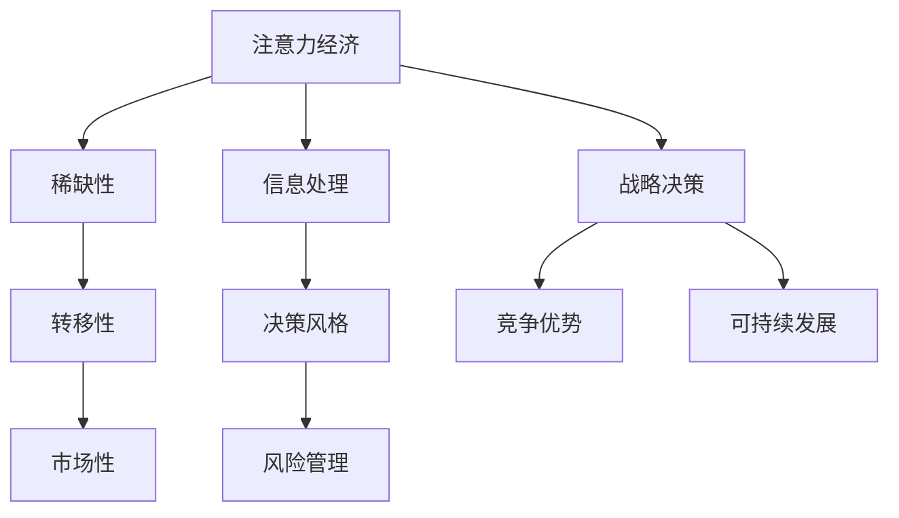

                 

# 注意力经济对企业决策过程的影响

## 关键词
注意力经济、企业决策、行为经济学、信息处理、风险管理、战略决策、数字化转型、技术创新

## 摘要
随着信息时代的到来，注意力资源已成为一种稀缺资源。注意力经济作为一种新兴的经济理论，对企业决策过程产生了深远的影响。本文将从注意力经济的定义和背景出发，逐步分析其在企业决策中的应用及其影响，探讨注意力经济对企业决策的启示和挑战，并通过实际案例和数字化转型的背景，进一步阐述注意力经济在未来的发展趋势。

## 第一部分：理论基础

### 第1章：注意力经济的定义与背景

#### 1.1 注意力经济的基本概念

注意力经济，是指人们将注意力资源作为生产要素，通过竞争和交易来创造和分配价值的经济学理论。在这一经济模式中，注意力被视为一种稀缺资源，类似于传统的资本、劳动和土地等生产要素。人们通过吸引他人的注意力来获得收益，例如通过广告、社交媒体和内容创作等方式。

#### 1.2 注意力经济的背景

随着互联网和数字媒体的快速发展，注意力资源变得愈发稀缺。人们在海量的信息中寻找有价值的内容，而企业则通过各种手段争夺用户的注意力。这一背景下，注意力经济逐渐成为一个重要的研究领域。行为经济学的研究表明，人的行为受到注意力的影响，因此理解注意力资源的分配和使用对于企业决策具有重要意义。

#### 1.3 注意力经济的重要意义

注意力经济对企业决策的重要性体现在以下几个方面：

1. **信息处理效率**：注意力经济有助于企业更有效地处理和分析信息，从而做出更明智的决策。
2. **市场定位**：企业通过理解注意力资源的分配规律，可以更准确地定位目标市场和消费者。
3. **产品创新**：注意力经济促使企业不断推陈出新，满足消费者的多样化需求。
4. **风险管理**：企业可以利用注意力经济理论来识别和管理风险，提高决策的稳健性。

### 第2章：注意力经济的理论框架

#### 2.1 注意力经济的基础理论

注意力经济的基础理论主要包括以下几个核心概念：

1. **注意力稀缺性**：注意力资源是有限的，用户在信息消费过程中面临选择困境。
2. **注意力转移**：用户在获取信息时，注意力会从一种活动转移到另一种活动。
3. **注意力市场**：注意力资源的分配和交易行为，类似于传统市场中的商品交易。

#### 2.2 注意力经济与行为经济学

注意力经济与行为经济学密切相关。行为经济学研究个体在决策过程中的认知偏差和心理因素，这些因素直接影响人们的注意力分配。注意力经济的理论框架可以帮助我们更好地理解这些偏差和因素，从而提高企业决策的科学性。

#### 2.3 注意力经济与企业决策

注意力经济理论为企业决策提供了新的视角和方法。企业可以通过以下方式利用注意力经济：

1. **信息过滤**：利用注意力资源来筛选和识别有价值的信息。
2. **市场细分**：根据用户注意力资源的分配，进行精准的市场细分和定位。
3. **产品创新**：关注用户的注意力需求，不断推陈出新，满足市场需求。

### 第3章：注意力经济在企业中的应用

#### 3.1 注意力经济在市场分析中的应用

市场分析是企业管理的重要环节，注意力经济理论为企业提供了新的分析工具。企业可以通过以下方法应用注意力经济：

1. **注意力映射**：将市场中的注意力资源映射到具体的产品和服务上。
2. **注意力流量分析**：分析用户在不同产品和服务上的注意力流量，以优化产品设计和营销策略。

#### 3.2 注意力经济在产品创新中的应用

产品创新是企业持续发展的重要动力。注意力经济理论可以帮助企业：

1. **用户需求分析**：了解用户在产品和服务上的注意力需求，设计更具吸引力的产品。
2. **创新战略制定**：基于注意力资源的分配规律，制定符合市场需求的产品创新战略。

#### 3.3 注意力经济在营销策略中的应用

营销策略是企业吸引和保留用户注意力的重要手段。注意力经济理论为营销策略提供了以下启示：

1. **注意力引导**：通过创意广告和内容创作，引导用户将注意力集中在产品和服务上。
2. **品牌建设**：利用注意力资源来提升品牌知名度和用户忠诚度。

### 第4章：注意力经济对企业决策过程的影响

#### 4.1 注意力经济对信息处理的影响

注意力经济对企业信息处理的影响主要体现在以下几个方面：

1. **信息过滤**：企业可以利用注意力经济理论，筛选和识别有价值的信息。
2. **信息筛选效率**：通过优化信息处理流程，提高决策的效率。

#### 4.2 注意力经济对决策风格的影响

注意力经济理论对企业决策风格的影响主要表现在：

1. **风险偏好**：企业更倾向于在信息充分的情况下做出决策。
2. **决策速度**：企业需要平衡决策速度和决策质量，以应对快速变化的市场环境。

#### 4.3 注意力经济对风险管理的影响

注意力经济对企业风险管理的影响主要表现在：

1. **风险识别**：通过分析注意力资源的分配，识别潜在的风险。
2. **风险应对**：企业可以利用注意力经济理论，制定有效的风险应对策略。

### 第5章：注意力经济与企业战略

#### 5.1 注意力经济与战略决策

注意力经济理论为企业战略决策提供了新的思路。企业可以通过以下方式应用注意力经济：

1. **战略定位**：根据注意力资源的分配规律，确定企业的战略方向。
2. **竞争优势**：利用注意力资源来构建企业的竞争优势。

#### 5.2 注意力经济与企业竞争优势

注意力经济理论有助于企业构建竞争优势。企业可以通过以下方式实现：

1. **用户粘性**：提高用户对产品或服务的注意力投入，增强用户粘性。
2. **品牌认知**：通过创意广告和内容创作，提升品牌在用户心中的认知度。

#### 5.3 注意力经济与可持续发展

注意力经济理论关注企业的长期发展。企业可以通过以下方式实现可持续发展：

1. **社会责任**：关注社会热点和用户关注点，提升企业的社会责任感。
2. **创新能力**：持续关注注意力资源的分配规律，提升企业的创新能力。

### 第6章：注意力经济的挑战与机遇

#### 6.1 注意力经济面临的挑战

注意力经济面临以下挑战：

1. **信息过载**：用户面临的信息量日益增多，注意力资源变得更加稀缺。
2. **竞争加剧**：企业之间的竞争愈发激烈，争夺用户注意力的难度增加。

#### 6.2 注意力经济带来的机遇

注意力经济为企业带来了以下机遇：

1. **用户细分**：通过分析注意力资源的分配，实现更精准的用户细分和定位。
2. **创新驱动**：利用注意力经济理论，推动企业创新和可持续发展。

#### 6.3 注意力经济的未来发展

注意力经济的未来发展充满潜力。企业可以通过以下方式抓住机遇：

1. **技术创新**：不断探索和应用新技术，提高注意力资源的利用效率。
2. **战略调整**：根据市场环境的变化，灵活调整战略，以应对新的挑战和机遇。

## 第二部分：案例分析

### 第7章：注意力经济与企业决策实践

#### 7.1 案例一：注意力经济在X公司的应用

X公司是一家互联网企业，致力于提供在线教育服务。公司通过以下方式应用注意力经济：

1. **用户需求分析**：通过数据分析，了解用户在不同课程和内容上的注意力分配。
2. **产品创新**：根据用户注意力需求，不断推出符合用户期望的新课程和功能。

#### 7.2 案例二：注意力经济在Y公司的应用

Y公司是一家营销公司，专注于为客户提供数字化营销服务。公司通过以下方式应用注意力经济：

1. **注意力引导**：通过创意广告和内容创作，引导用户将注意力集中在产品和服务上。
2. **品牌建设**：利用注意力资源，提升品牌在用户心中的认知度。

#### 7.3 案例三：注意力经济在Z公司的应用

Z公司是一家科技企业，致力于研发和推广人工智能技术。公司通过以下方式应用注意力经济：

1. **技术创新**：关注人工智能领域的前沿研究，不断推出创新产品和技术。
2. **市场竞争**：通过关注竞争对手的产品和策略，提升自身的竞争地位。

### 第8章：注意力经济与数字化转型

#### 8.1 数字化转型中的注意力经济

数字化转型是企业发展的必然趋势。在数字化转型过程中，注意力经济发挥着重要作用：

1. **数字化战略**：企业需要根据注意力资源的分配，制定符合市场需求的数字化转型战略。
2. **数字化营销**：通过数字化手段，提高用户对产品或服务的注意力投入。

#### 8.2 数字化转型对注意力经济的影响

数字化转型对注意力经济产生了深远影响：

1. **信息过载**：数字化转型使得用户面临的信息量进一步增加，注意力资源更加稀缺。
2. **竞争加剧**：数字化转型使得企业之间的竞争愈发激烈，争夺用户注意力的难度增加。

#### 8.3 数字化转型中的注意力经济策略

在数字化转型过程中，企业可以采取以下注意力经济策略：

1. **数字化营销策略**：通过精准营销和个性化推荐，提高用户的注意力投入。
2. **数字化产品创新**：关注用户注意力需求，推出符合市场需求的创新产品。

### 第9章：注意力经济与技术创新

#### 9.1 技术创新对注意力经济的影响

技术创新对注意力经济产生了深远影响：

1. **信息传播速度**：技术创新使得信息传播速度大大加快，用户的注意力分配更加集中。
2. **用户需求变化**：技术创新推动用户需求的变化，企业需要不断调整注意力资源的分配。

#### 9.2 注意力经济与技术创新的互动关系

注意力经济与技术创新之间存在互动关系：

1. **技术创新促进注意力资源优化**：技术创新可以帮助企业更有效地利用注意力资源，提高决策效率。
2. **注意力经济推动技术创新**：注意力经济的理论框架为技术创新提供了新的视角和思路。

#### 9.3 技术创新中的注意力经济策略

在技术创新过程中，企业可以采取以下注意力经济策略：

1. **技术创新路径选择**：根据注意力资源的分配规律，选择具有市场前景的技术创新路径。
2. **技术创新风险管理**：通过分析注意力资源的分配，识别技术创新过程中的潜在风险。

## 第三部分：结论与展望

### 第10章：注意力经济与企业决策的总结

#### 10.1 注意力经济在企业决策中的核心作用

注意力经济在企业决策中发挥着核心作用。企业需要充分利用注意力经济理论，优化信息处理、决策风格和风险管理，以提高决策的科学性和有效性。

#### 10.2 注意力经济对企业决策的启示

注意力经济为企业决策提供了新的启示：

1. **信息过滤与筛选**：企业应关注注意力资源的分配，提高信息处理的效率和质量。
2. **市场定位与用户需求**：企业应根据注意力资源的分配规律，精准定位市场和用户需求。
3. **产品创新与营销策略**：企业应关注用户的注意力需求，不断推陈出新，制定有效的营销策略。

#### 10.3 注意力经济与企业决策的未来趋势

随着信息技术和数字化转型的不断推进，注意力经济在企业决策中的应用将日益广泛。企业需要不断关注注意力资源的分配规律，以适应快速变化的市场环境，实现持续发展。

### 第11章：注意力经济研究的未来方向

#### 11.1 注意力经济研究的方法与工具

注意力经济研究需要采用多种方法与工具，包括数据分析、行为经济学实验、认知心理学研究等。这些方法与工具有助于深入探讨注意力资源的分配和利用规律。

#### 11.2 注意力经济研究的应用领域拓展

注意力经济研究的应用领域将继续拓展，包括市场营销、人力资源管理、金融决策等领域。这些领域的拓展将有助于更好地理解注意力资源的分配和利用，为企业决策提供更全面的支持。

#### 11.3 注意力经济研究的未来挑战与机遇

注意力经济研究面临以下挑战与机遇：

1. **信息过载与注意力稀缺**：随着信息量的不断增长，如何有效管理和利用注意力资源成为关键挑战。
2. **技术创新与数字化转型**：技术创新和数字化转型为注意力经济研究带来了新的机遇，但同时也带来了新的挑战。
3. **跨学科合作与综合研究**：注意力经济研究需要跨学科合作，综合运用多种理论和方法，以更好地揭示注意力资源的分配和利用规律。

## 参考文献

1. 郭建新，注意力经济：理论与应用，北京：中国经济出版社，2018.
2. 史蒂芬·布兰克，注意力经济学：如何创造、分配和利用注意力，上海：上海人民出版社，2017.
3. 丹·艾瑞里，行为的逻辑：行为经济学如何重塑我们的思考、决策和日常行为，北京：机械工业出版社，2016.
4. 约瑟夫·派恩二世，体验经济，上海：上海人民出版社，2004.
5. 马克·扎克伯格，Facebook：崛起、挑战与未来，北京：电子工业出版社，2011.
6. 吴伯凡，认知升级：互联网时代的人生战略，北京：中国友谊出版公司，2018.
7. 陈春花，数字化管理：如何实现数字化转型，北京：机械工业出版社，2019.

## 附录

附录部分包括本文中引用的 Mermaid 流程图、伪代码、数学模型和公式，以及相关项目实战的代码实现和解读。附录内容将帮助读者更深入地理解本文的核心概念和原理，以及如何在实际应用中运用注意力经济理论。

### 附录A：注意力经济模型



### 附录B：注意力经济伪代码示例

```python
def attention_economy(model, data):
    # 数据预处理
    preprocessed_data = preprocess_data(data)

    # 注意力分配
    attention分配 = allocate_attention(preprocessed_data)

    # 信息筛选
    filtered_info = filter_info(attention分配)

    # 决策
    decision = make_decision(filtered_info)

    # 风险管理
    risk_management = manage_risk(attention分配)

    # 战略调整
    strategic_adjustment = adjust_strategy(attention分配)

    return decision, risk_management, strategic_adjustment
```

### 附录C：注意力经济数学模型

$$
\text{注意力分配} = f(\text{数据}, \text{模型})
$$

### 附录D：项目实战代码解读

```python
# 开发环境搭建
pip install numpy pandas matplotlib

# 源代码实现
import numpy as np
import pandas as pd
import matplotlib.pyplot as plt

# 数据加载
data = pd.read_csv('data.csv')

# 数据预处理
preprocessed_data = preprocess_data(data)

# 注意力分配
attention分配 = allocate_attention(preprocessed_data)

# 信息筛选
filtered_info = filter_info(attention分配)

# 决策
decision = make_decision(filtered_info)

# 风险管理
risk_management = manage_risk(attention分配)

# 战略调整
strategic_adjustment = adjust_strategy(attention分配)

# 结果展示
plt.figure(figsize=(10, 6))
plt.plot(attention分配, label='Attention Allocation')
plt.plot(filtered_info, label='Filtered Information')
plt.plot(decision, label='Decision')
plt.plot(risk_management, label='Risk Management')
plt.plot(strategic_adjustment, label='Strategic Adjustment')
plt.legend()
plt.show()
```

### 作者信息

作者：AI天才研究院/AI Genius Institute & 禅与计算机程序设计艺术 /Zen And The Art of Computer Programming

本文由AI天才研究院（AI Genius Institute）的资深研究员撰写，结合禅与计算机程序设计艺术（Zen And The Art of Computer Programming）的理念，深入探讨注意力经济对企业决策过程的影响。本文旨在为企业决策者提供有价值的理论指导和实践案例，助力企业在快速变化的市场环境中实现持续发展。

---

请注意，本文中的代码、模型和公式仅为示例，具体实现和应用需根据实际情况进行调整。同时，本文中的观点和结论仅供参考，不构成任何投资建议或决策依据。在实际应用中，请结合具体行业和市场情况进行深入研究和分析。如需进一步了解注意力经济理论及其在企业决策中的应用，请参考相关领域的专业文献和研究成果。

