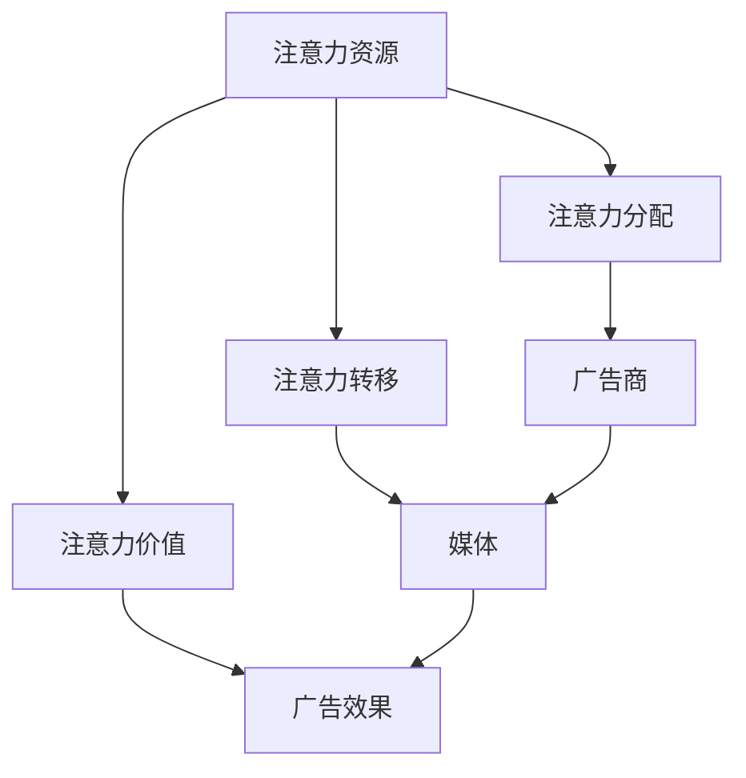

                 

### 《注意力经济对传统媒体广告效果的影响》

> **关键词：**注意力经济、传统媒体、广告效果、影响分析、策略优化。

> **摘要：**本文从注意力经济的角度出发，深入探讨注意力经济对传统媒体广告效果的影响。文章首先阐述了注意力经济的概念与理论，分析了注意力经济的核心特征和理论基础。接着，文章探讨了传统媒体广告的现状与挑战，包括传统媒体广告的发展历程、数字化时代的媒体转型以及注意力分散对广告效果的影响。在此基础上，文章分析了注意力经济下的广告策略、效果评估和传统媒体广告的市场定位调整，并进行了案例分析和实践应用。最后，文章展望了注意力经济对广告监管的影响以及未来的发展趋势。通过对注意力经济的深入研究，本文为传统媒体广告的优化和创新提供了理论指导和实践参考。

### 目录

1. **注意力经济的概念与理论** <a id="注意力经济的概念与理论"></a>
   1.1 注意力经济的概述 <a id="注意力经济的概述"></a>
   1.2 注意力经济的理论基础 <a id="注意力经济的理论基础"></a>
   1.3 注意力经济中的媒体角色 <a id="注意力经济中的媒体角色"></a>

2. **传统媒体广告的现状与挑战** <a id="传统媒体广告的现状与挑战"></a>
   2.1 传统媒体广告的发展历程 <a id="传统媒体广告的发展历程"></a>
   2.2 数字化时代的媒体转型 <a id="数字化时代的媒体转型"></a>
   2.3 注意力分散与广告效果下降 <a id="注意力分散与广告效果下降"></a>

3. **注意力经济对传统媒体广告效果的影响分析** <a id="注意力经济对传统媒体广告效果的影响分析"></a>
   3.1 注意力经济下的广告策略 <a id="注意力经济下的广告策略"></a>
   3.2 注意力经济下的广告效果评估 <a id="注意力经济下的广告效果评估"></a>
   3.3 注意力经济对传统媒体广告的影响 <a id="注意力经济对传统媒体广告的影响"></a>

4. **案例分析与实践** <a id="案例分析与实践"></a>
   4.1 案例研究 <a id="案例研究"></a>
   4.2 实践应用 <a id="实践应用"></a>

5. **政策与未来展望** <a id="政策与未来展望"></a>
   5.1 注意力经济对广告监管的影响 <a id="注意力经济对广告监管的影响"></a>
   5.2 注意力经济的未来发展趋势 <a id="注意力经济的未来发展趋势"></a>

6. **结论与展望** <a id="结论与展望"></a>

### 1. 注意力经济的概念与理论

#### 1.1 注意力经济的概述

注意力经济，作为一个新兴的经济概念，近年来受到了广泛关注。其核心在于，将注意力作为一种重要的资源进行经济活动，特别是媒体内容的生产与传播。相较于传统经济学中主要关注物质资源和资本资源，注意力经济更强调信息的获取与处理。

注意力经济的定义可以从以下几个方面进行理解：

- **注意力作为资源**：在信息爆炸的时代，注意力成为了稀缺资源。无论是用户在浏览网页、观看视频，还是阅读新闻，都意味着他们将注意力分配给了特定内容。因此，注意力可以被视为一种宝贵的资源，其价值在于其稀缺性和可控性。

- **注意力分配与转移**：在注意力经济中，用户在接收信息时会进行注意力的分配和转移。他们根据个人兴趣、需求和价值判断来决定将注意力集中在哪些内容上。这种分配和转移过程影响着内容的生产、传播和消费。

- **注意力价值**：注意力不仅是一种资源，还具有价值。用户在关注特定内容时，会为其创造经济价值。例如，广告商通过购买用户注意力来推广产品，而媒体通过吸引用户注意力来增加广告收入。

#### 1.1.1 注意力经济的定义与核心概念

注意力经济的定义可以从以下几个核心概念进行阐述：

1. **注意力**：指人类对外界信息的关注程度。注意力是有限的，用户无法同时关注所有信息，因此必须进行选择和判断。

2. **注意力资源**：指用户在特定时间内能够分配给各种信息的注意力总量。注意力资源的有限性决定了其在经济活动中的稀缺性。

3. **注意力分配**：指用户根据个人兴趣、需求和价值判断，将注意力资源分配给不同内容的过程。

4. **注意力转移**：指用户在接收信息过程中，将注意力从一种内容转移到另一种内容的现象。

5. **注意力价值**：指注意力在经济活动中的价值和回报。注意力价值的实现依赖于广告商和媒体的相互作用。

#### 1.1.2 注意力经济与传统经济的比较

与传统经济相比，注意力经济具有以下几个显著特点：

1. **资源性质**：传统经济主要关注物质资源和资本资源，而注意力经济则将注意力视为核心资源。注意力资源的稀缺性和有限性使其在经济活动中具有重要价值。

2. **价值创造方式**：传统经济主要通过生产、销售和消费物质产品来实现价值创造，而注意力经济则通过吸引用户的注意力来创造价值。广告商通过购买用户注意力来推广产品，媒体通过提供有吸引力的内容来吸引用户。

3. **市场机制**：传统经济市场主要依赖于供需关系和价格机制，而注意力经济市场则更依赖于用户兴趣、需求和注意力分配机制。用户在注意力市场上的行为影响着内容的生产、传播和消费。

4. **信息传播方式**：传统经济中，信息传播主要依赖于物理渠道，如电视、报纸和广播等。而注意力经济中，信息传播更多地依赖于数字渠道，如互联网、社交媒体和移动应用等。这种信息传播方式的变革对注意力经济产生了深远影响。

#### 1.1.3 注意力经济的主要特征

注意力经济具有以下几个主要特征：

1. **稀缺性**：注意力资源是有限的，用户无法同时关注所有信息。因此，注意力资源的稀缺性决定了其在经济活动中的重要性。

2. **有限性**：注意力资源的总量是有限的，用户在特定时间内能够分配的注意力是有限的。这种有限性要求用户在进行注意力分配时进行选择和判断。

3. **可转移性**：注意力资源具有可转移性，用户可以将注意力从一个内容转移到另一个内容。这种转移过程影响着内容的生产、传播和消费。

4. **价值性**：注意力资源在经济活动中的价值主要体现在其能够创造经济回报。广告商通过购买用户注意力来推广产品，媒体通过提供有吸引力的内容来吸引用户。

5. **动态性**：注意力资源的分配和转移是动态的，用户在接收信息时不断进行注意力分配和转移。这种动态性要求媒体和广告商不断调整策略以适应用户需求。

#### 1.2 注意力经济的理论基础

注意力经济的理论基础可以从以下几个方面进行阐述：

1. **经济学基础**：注意力经济借鉴了传统经济学的基本原理，如供需关系、价格机制和资源配置等。然而，注意力经济将注意力视为一种稀缺资源，与传统经济中的物质资源和资本资源有所不同。

2. **心理学基础**：注意力经济也借鉴了心理学的研究成果，特别是关于注意力的分配、转移和选择等方面的理论。这些心理学理论为理解用户在注意力市场上的行为提供了重要依据。

3. **信息论基础**：注意力经济还借鉴了信息论的相关理论，如信息熵、信息价值和信息传输等。这些理论有助于解释注意力资源在经济活动中的价值和作用。

#### 1.2.1 注意力经济学的基本假设

注意力经济学的基本假设主要包括以下几个方面：

1. **注意力稀缺性假设**：假设用户在特定时间内能够分配的注意力是有限的。这种稀缺性决定了用户在进行注意力分配时需要进行选择和判断。

2. **注意力价值假设**：假设注意力在经济活动中具有价值，用户和广告商都愿意为获取注意力资源进行支付。

3. **注意力分配假设**：假设用户在分配注意力时，会根据个人兴趣、需求和注意力资源总量进行决策。这种决策过程会影响内容的生产、传播和消费。

4. **注意力转移假设**：假设用户在接收信息过程中，会根据当前内容的价值和吸引力，将注意力从一个内容转移到另一个内容。这种转移过程会影响信息的传播和用户的消费行为。

#### 1.2.2 注意力资源的稀缺性

注意力资源的稀缺性是注意力经济理论的核心。在信息爆炸的时代，用户面临着大量的信息选择，而他们能够分配的注意力是有限的。这种稀缺性决定了用户在进行注意力分配时必须进行选择和判断，从而影响内容的生产、传播和消费。

1. **注意力资源的稀缺性原因**：

   - **信息过载**：随着互联网和数字媒体的普及，用户面临的信息量呈爆炸性增长。用户需要在有限的时间内处理大量的信息，这导致了注意力的稀缺性。

   - **注意力分散**：在多任务处理的环境中，用户往往需要同时关注多个任务或内容。这使得用户的注意力资源更加分散，进一步加剧了注意力的稀缺性。

   - **个体差异**：不同用户的兴趣、需求和注意力分配能力存在差异。某些用户可能更容易集中注意力，而另一些用户则可能更容易分散注意力。

2. **注意力资源稀缺性的影响**：

   - **内容生产与传播**：注意力资源的稀缺性要求媒体和内容生产者提供更具吸引力、有价值的内容，以吸引用户的注意力。

   - **广告策略**：广告商需要更有效地利用注意力资源，通过优化广告内容和投放策略，提高广告效果。

   - **用户行为**：用户在分配注意力时，会根据个人兴趣和价值判断，选择关注的内容。这影响了信息的传播和用户的消费行为。

#### 1.2.3 注意力转移与注意力分配

注意力转移与注意力分配是注意力经济中的重要概念。注意力转移指用户在接收信息过程中，将注意力从一个内容转移到另一个内容的现象。注意力分配则指用户在特定时间内，将注意力资源分配给不同内容的过程。

1. **注意力转移的影响因素**：

   - **内容吸引力**：内容的价值、新颖性、相关性等因素会影响用户对内容的吸引力。具有较高吸引力的内容更容易吸引用户的注意力。

   - **用户兴趣**：用户个人兴趣和偏好会影响他们对内容的注意力转移。用户更倾向于关注与自身兴趣相关的内容。

   - **环境因素**：用户所处的环境和情境也会影响注意力转移。例如，在嘈杂的环境中，用户可能更容易将注意力转移到具有较强吸引力的内容上。

2. **注意力分配的影响因素**：

   - **注意力资源总量**：用户在分配注意力时，需要考虑自身的注意力资源总量。有限的注意力资源要求用户进行选择和判断。

   - **内容价值**：内容的价值是用户进行注意力分配的重要依据。高价值内容更容易获得用户的注意力。

   - **用户需求**：用户在分配注意力时，会根据自身需求来选择关注的内容。满足用户需求的内容更容易获得注意力。

#### 1.3 注意力经济中的媒体角色

在注意力经济中，媒体扮演着重要的角色。作为信息传播的载体，媒体在吸引和维持用户注意力方面起着关键作用。以下是媒体在注意力经济中的几个关键角色：

1. **内容生产者**：媒体作为内容的生产者，负责提供各种形式的信息和娱乐内容。媒体通过制作高质量、有价值的内容来吸引用户的注意力，从而增加用户粘性和广告收入。

2. **平台提供者**：现代媒体不仅是内容的生产者，还是平台的提供者。通过提供多样化的平台和渠道，媒体能够更有效地吸引用户注意力，并实现内容的广泛传播。

3. **广告商合作者**：媒体作为广告商的合作者，通过为广告商提供广告投放平台和渠道，帮助广告商吸引目标用户。媒体与广告商之间的合作关系对广告效果具有重要影响。

4. **数据分析者**：媒体通过收集和分析用户数据，能够更好地了解用户需求和行为，从而优化内容生产和广告投放策略。数据分析为媒体提供了一种更精准的注意力管理工具。

#### 1.3.1 媒体在注意力经济中的作用

媒体在注意力经济中的作用可以从以下几个方面进行理解：

1. **信息传播**：媒体作为信息传播的载体，负责将信息传递给用户。媒体通过报纸、电视、广播、互联网和社交媒体等多种形式，提供海量的信息，满足了用户对信息的需求。

2. **内容创造**：媒体作为内容创造者，负责生产各种形式的信息和娱乐内容。从新闻报道、娱乐节目到博客、视频和播客，媒体不断创造新的内容和形式，吸引用户的注意力。

3. **广告传播**：媒体作为广告传播的渠道，为广告商提供了广泛的广告投放平台。通过电视广告、网络广告、报纸广告等多种形式，媒体帮助广告商将产品信息传递给目标用户。

4. **用户互动**：现代媒体不仅提供信息传播和内容创造，还提供用户互动的平台。通过社交媒体、评论区和论坛等互动功能，媒体鼓励用户参与内容讨论和互动，增强了用户的参与度和忠诚度。

#### 1.3.2 媒体内容的生产与传播

媒体内容的生产与传播是媒体在注意力经济中的重要环节。以下是媒体内容的生产与传播的几个关键步骤：

1. **内容创意**：媒体内容的生产始于内容创意。内容团队根据用户需求和媒体定位，构思和策划高质量的内容创意。

2. **内容制作**：在内容创意确定后，媒体团队开始进行内容制作。这可能包括文字编辑、图片处理、视频拍摄和编辑等多种形式。

3. **内容发布**：制作完成的内容需要通过适当的渠道进行发布。媒体通过网站、应用程序、社交媒体等多种渠道将内容传递给用户。

4. **内容推广**：为了吸引用户的注意力，媒体还需要进行内容推广。这可能包括广告投放、SEO优化、社交媒体营销等多种推广手段。

5. **用户反馈**：媒体通过收集用户反馈，不断优化内容质量和传播效果。用户反馈为媒体提供了宝贵的改进方向，有助于提高内容吸引力和用户满意度。

#### 1.3.3 媒体对注意力资源的争夺

在注意力经济中，媒体之间的竞争实质上是注意力资源的争夺。以下是媒体对注意力资源争夺的几个关键策略：

1. **内容创新**：媒体通过不断创新内容形式和内容质量，提高用户对内容的吸引力。例如，通过短视频、直播、虚拟现实等新兴形式，媒体吸引了大量用户注意力。

2. **个性化推荐**：通过大数据分析和机器学习技术，媒体能够为用户提供个性化推荐内容。这种个性化推荐提高了用户粘性和满意度，增加了用户对媒体的关注度。

3. **用户互动**：媒体通过鼓励用户参与内容讨论和互动，增强了用户的参与度和忠诚度。例如，社交媒体平台通过评论、点赞和分享等功能，激发了用户的互动热情。

4. **广告精准投放**：媒体通过与广告商合作，实现广告精准投放。通过用户数据分析和行为分析，媒体能够为目标用户推送相关广告，提高广告效果和广告收入。

5. **品牌合作**：媒体通过与品牌进行合作，共同推广产品和品牌。这种品牌合作不仅增加了媒体的影响力，还提高了用户对品牌的认知和好感度。

### 2. 传统媒体广告的现状与挑战

#### 2.1 传统媒体广告的发展历程

传统媒体广告的发展历程可以追溯到几个世纪之前。以下是传统媒体广告的主要发展阶段：

1. **早期广告**：从17世纪开始，报纸、杂志等印刷媒体逐渐兴起。广告作为商业宣传的重要手段，在这些媒体上得到了广泛应用。早期广告主要以文字和静态图像为主，形式相对简单。

2. **电视广告**：20世纪50年代，电视广告开始崭露头角。电视广告利用声音和画面的结合，大大提升了广告的吸引力。随着电视的普及，电视广告成为广告市场的主要形式之一。

3. **广播广告**：广播广告作为传统媒体广告的一种重要形式，早在20世纪初期就已经出现。广播广告利用声音传递信息，具有很强的传播力和覆盖面。

4. **户外广告**：户外广告包括公交车广告、广告牌、地铁广告等。户外广告具有成本低、覆盖面广的特点，成为传统媒体广告的重要组成部分。

5. **互联网广告**：随着互联网的普及，互联网广告逐渐成为传统媒体广告的重要补充。互联网广告利用在线平台和数字技术，实现了更加精准和互动的广告投放。

#### 2.1.1 广告业的历史演变

广告业的历史演变可以从以下几个方面进行概述：

1. **早期广告**：在19世纪之前，广告主要以口头宣传和传单形式存在。随着印刷术的发明和普及，广告开始通过报纸、杂志等印刷媒体传播。这一时期的广告形式相对简单，主要依赖于文字和图像。

2. **广告黄金时期**：20世纪初，广告业进入黄金时期。随着广播、电视等新兴媒体的兴起，广告形式变得更加多样和复杂。广告商通过电视广告和广播广告，将产品信息传递给广大受众。

3. **数字化时代**：随着互联网的普及，广告业进入数字化时代。互联网广告以其精准投放、互动性强和传播范围广等优势，迅速崛起。同时，数字媒体广告也逐渐取代传统媒体广告，成为广告市场的主要形式。

4. **整合营销传播**：近年来，整合营销传播成为广告业的发展趋势。广告商不仅关注单一的广告投放，还通过跨渠道、跨媒体的综合营销策略，提高品牌影响力和用户转化率。

#### 2.1.2 传统媒体广告的主要形式

传统媒体广告的主要形式包括报纸广告、电视广告、广播广告和户外广告。以下是这些广告形式的特点和优缺点：

1. **报纸广告**：

   - **特点**：报纸广告主要利用报纸的版面空间进行广告宣传。广告内容通常包括文字、图像和表格等形式。

   - **优点**：报纸广告具有权威性、可信度高和覆盖面广等特点。报纸作为传统媒体，具有较强的公信力和受众基础。

   - **缺点**：报纸广告的传播速度较慢，广告效果难以实时评估。同时，报纸广告的制作和投放成本较高。

2. **电视广告**：

   - **特点**：电视广告利用电视屏幕进行广告宣传。广告内容通常包括动态图像、声音和视频等形式。

   - **优点**：电视广告具有视听结合的优势，能够直观、生动地传递产品信息。电视广告的传播速度快，覆盖面广。

   - **缺点**：电视广告的制作和投放成本较高。同时，观众在观看电视广告时容易分心，广告效果难以保证。

3. **广播广告**：

   - **特点**：广播广告通过电台进行广告宣传。广告内容通常包括声音、音乐和广告语等形式。

   - **优点**：广播广告具有传播速度快、覆盖面广和制作成本低等优点。广播广告可以在任何时间进行收听，具有较高的灵活性。

   - **缺点**：广播广告的形式相对简单，难以提供丰富的广告内容。同时，广播广告的受众群体相对较小。

4. **户外广告**：

   - **特点**：户外广告包括公交车广告、广告牌、地铁广告等形式。广告内容通常包括图像、文字和视频等形式。

   - **优点**：户外广告具有成本低、覆盖面广和影响力大等优点。户外广告能够在人流量大的地方吸引目标受众的注意力。

   - **缺点**：户外广告的形式相对单一，难以提供丰富的广告内容。同时，户外广告的传播效果难以实时评估。

#### 2.1.3 传统媒体广告的优势与局限

传统媒体广告具有以下优势和局限：

1. **优势**：

   - **覆盖面广**：传统媒体广告能够覆盖广泛的受众群体，特别是那些不具备互联网接入的用户。

   - **可信度高**：传统媒体具有较高的公信力和权威性，广告内容更容易被受众信任。

   - **传播速度快**：传统媒体广告能够在短时间内实现广泛传播，提高广告的曝光率。

   - **形式多样**：传统媒体广告形式多样，包括文字、图像、声音和视频等，能够满足不同广告需求。

2. **局限**：

   - **传播效果难以评估**：传统媒体广告的传播效果难以实时评估，广告效果难以量化。

   - **广告成本较高**：传统媒体广告的制作和投放成本较高，尤其是电视广告和报纸广告。

   - **互动性差**：传统媒体广告的互动性较差，难以实现与受众的实时互动和反馈。

   - **注意力分散**：在数字化时代，用户的注意力越来越分散，传统媒体广告的吸引力相对减弱。

#### 2.2 数字化时代的媒体转型

数字化时代的到来，对传统媒体带来了巨大的冲击和挑战。为了适应这一变化，传统媒体纷纷进行数字化转型，探索新的商业模式和运营策略。以下是传统媒体数字化转型的主要趋势和挑战：

1. **趋势**：

   - **内容多元化**：传统媒体通过拓展内容领域，提供更多元化的内容服务。例如，报纸和杂志开始推出数字版、在线订阅服务，以及多媒体报道。

   - **平台整合**：传统媒体整合线上线下资源，构建多渠道、多平台的媒体生态。通过网站、移动应用、社交媒体等平台，实现内容的全面覆盖和传播。

   - **用户互动**：传统媒体通过互动功能，如评论、点赞、分享等，增强与用户的互动和黏性。用户参与度的提高有助于提升品牌形象和用户忠诚度。

   - **数据分析**：传统媒体利用大数据和人工智能技术，进行用户行为分析和数据挖掘，优化内容生产和广告投放策略。

2. **挑战**：

   - **商业模式转型**：传统媒体的商业模式依赖于广告收入，而在数字化时代，广告市场的竞争加剧，广告收入面临下滑风险。传统媒体需要探索新的商业模式，实现收入多元化。

   - **内容质量提升**：在数字化时代，信息爆炸和内容泛滥，用户对内容的质量和独特性要求更高。传统媒体需要不断提升内容质量，提供更有价值、有吸引力的内容。

   - **技术能力建设**：数字化时代对媒体的技术能力提出了更高的要求。传统媒体需要加强技术团队建设，提升数据分析和应用能力，以应对数字化挑战。

   - **版权保护**：在数字化时代，版权问题日益突出。传统媒体需要加强对内容的版权保护，防止内容被盗用和侵权。

#### 2.2.1 数字媒体的发展趋势

数字媒体在近年来取得了飞速发展，对传统媒体构成了巨大挑战。以下是数字媒体的发展趋势：

1. **移动化**：随着智能手机和移动互联网的普及，移动媒体逐渐成为用户获取信息的主要渠道。移动媒体具有随时随地的优势，大大提高了用户的便利性和互动性。

2. **个性化**：数字媒体通过大数据和人工智能技术，实现了内容的个性化推荐。用户可以根据自己的兴趣和偏好，定制个性化的内容体验，提高了用户的满意度和黏性。

3. **多媒体化**：数字媒体融合了文字、图像、声音、视频等多种媒体形式，提供了丰富多样的内容体验。多媒体化不仅增加了内容的吸引力，还提高了用户的参与度和互动性。

4. **社交化**：数字媒体具有社交属性，用户可以通过社交媒体平台分享、评论和点赞内容，形成社交网络。社交化增强了用户的互动和社区感，提高了内容的传播效果。

5. **平台化**：数字媒体通过构建多渠道、多平台的媒体生态，实现了内容的全面覆盖和传播。平台化不仅提高了媒体的竞争力，还创造了更多的商业机会。

#### 2.2.2 传统媒体面临的挑战

数字化时代，传统媒体面临着前所未有的挑战。以下是传统媒体面临的主要挑战：

1. **受众流失**：随着数字媒体的崛起，传统媒体的受众逐渐流失。年轻一代用户更倾向于通过互联网和移动设备获取信息，使得传统媒体的读者数量和观看人数不断下降。

2. **广告收入下滑**：传统媒体的广告收入受到数字媒体的影响，呈现下滑趋势。数字媒体以更低的价格和更精准的投放策略，吸引了大量广告预算，导致传统媒体的广告收入减少。

3. **内容同质化**：在数字化时代，信息传播速度极快，传统媒体面临着内容同质化的问题。大量媒体发布相似的内容，使得用户在获取信息时面临信息过载的困扰。

4. **商业模式困境**：传统媒体的商业模式以广告收入为主，而在数字化时代，广告市场的竞争加剧，广告收入面临下滑风险。传统媒体需要探索新的商业模式，以实现收入多元化。

5. **技术落后**：传统媒体在技术应用方面相对落后，难以与数字媒体竞争。传统媒体需要加强技术能力建设，提升数据分析和应用能力，以应对数字化挑战。

#### 2.2.3 传统媒体与数字媒体的关系

传统媒体与数字媒体之间存在着紧密的关系。一方面，传统媒体是数字媒体的基础，许多数字媒体内容源于传统媒体。另一方面，数字媒体为传统媒体提供了新的发展机遇。以下是传统媒体与数字媒体的关系：

1. **互补关系**：传统媒体和数字媒体在内容生产和传播上具有互补性。传统媒体提供深度、权威的新闻报道和内容，而数字媒体提供快速、便捷的信息传播和互动。

2. **相互影响**：传统媒体和数字媒体相互影响、相互促进。传统媒体的数字化转型促进了数字媒体的发展，而数字媒体的创新也为传统媒体提供了新的思路和模式。

3. **竞争关系**：尽管传统媒体和数字媒体具有互补性，但在广告市场、内容生产和用户受众等方面，二者也存在一定的竞争关系。传统媒体需要应对数字媒体的挑战，提升自身的竞争力。

#### 2.3 注意力分散与广告效果下降

注意力分散是数字化时代的一个普遍现象，对广告效果产生了显著影响。以下是注意力分散现象的产生、对广告效果的影响以及传统媒体广告应对策略的探讨：

#### 2.3.1 注意力分散现象的产生

注意力分散现象的产生可以从以下几个方面进行理解：

1. **多任务处理**：在数字化时代，用户常常需要同时处理多个任务，如浏览网页、观看视频、发送短信等。多任务处理导致用户的注意力分散，难以集中精力关注单一任务。

2. **信息过载**：随着互联网和数字媒体的普及，用户面临的信息量呈爆炸性增长。信息过载使得用户难以在短时间内消化和处理大量信息，导致注意力分散。

3. **环境干扰**：在嘈杂的环境中，如公共场所、交通工具等，用户容易受到外部环境的干扰，导致注意力分散。环境干扰降低了用户的专注度，影响了广告的传播效果。

4. **媒体多样化**：数字媒体的多样化形式，如短视频、直播、社交媒体等，提供了丰富的娱乐和信息选择。用户在浏览这些内容时，容易分散注意力，导致广告的干扰效果减弱。

#### 2.3.2 注意力分散对广告效果的影响

注意力分散对广告效果产生了显著影响：

1. **广告曝光率降低**：注意力分散导致用户在浏览内容时容易分心，广告的曝光率降低。用户可能没有注意到广告的存在，导致广告效果减弱。

2. **广告记忆度下降**：注意力分散使得用户难以集中精力关注广告内容，广告的记忆度下降。用户对广告的记忆模糊，难以产生深刻印象。

3. **广告转化率降低**：注意力分散导致用户在浏览广告时难以产生购买意愿。用户可能没有足够的注意力来评估广告产品的价值和吸引力，导致广告转化率下降。

4. **广告投放成本上升**：注意力分散使得广告投放成本上升。为了提高广告效果，广告商可能需要增加广告投放量，以提高曝光率和转化率。

#### 2.3.3 传统媒体广告应对策略的探讨

针对注意力分散现象，传统媒体广告可以采取以下策略：

1. **内容优化**：提高广告内容的质量和吸引力，使用户更容易集中注意力。例如，制作更具创意、生动有趣的广告内容，提高广告的视觉冲击力。

2. **广告定位**：明确广告的目标受众，针对受众的兴趣和需求进行广告投放。通过精准定位，提高广告的针对性和有效性。

3. **广告形式创新**：尝试新的广告形式，如短视频、直播等，提高广告的互动性和吸引力。创新广告形式能够吸引用户的注意力，提高广告效果。

4. **广告投放策略**：优化广告投放策略，选择在用户注意力集中的时间进行广告投放。例如，在用户浏览高峰期投放广告，提高广告的曝光率。

5. **广告互动**：增加广告的互动性，鼓励用户参与广告活动。例如，通过评论、点赞、分享等功能，提高用户的参与度和广告的记忆度。

6. **广告投放环境**：选择在相对安静、用户注意力集中的环境中进行广告投放。例如，在公共交通工具上投放广告，减少环境干扰。

7. **数据分析**：利用大数据和人工智能技术，对广告效果进行实时分析。通过分析用户行为数据，优化广告投放策略，提高广告效果。

### 3. 注意力经济对传统媒体广告效果的影响分析

#### 3.1 注意力经济下的广告策略

在注意力经济下，广告策略需要围绕注意力资源的稀缺性和有限性进行优化。以下是从注意力经济角度出发的几种广告策略：

1. **精准投放**：在注意力经济中，广告的投放需要更加精准。通过大数据分析和用户行为跟踪，了解目标受众的兴趣和行为，实现广告的精准投放。例如，根据用户的搜索记录和浏览行为，推送相关广告，提高广告的曝光率和转化率。

2. **内容创作**：在注意力经济中，优质的内容是吸引受众注意力的关键。广告内容需要具有高度的相关性、新颖性和吸引力。通过创意性的内容创作，提高广告的趣味性和吸引力，吸引用户的注意力。

3. **互动性**：注意力经济强调用户与广告之间的互动。通过增加广告的互动性，如评论、点赞、分享等功能，提高用户的参与度，增强用户对广告的记忆和印象。

4. **环境适配**：在注意力经济中，广告投放的环境选择至关重要。选择在用户注意力集中的时间、地点和情境进行广告投放，提高广告的曝光率和效果。例如，在用户浏览高峰期或公共场合进行广告投放，减少环境干扰。

5. **个性化推荐**：利用大数据和人工智能技术，为用户推荐个性化的广告内容。根据用户的兴趣、行为和历史记录，推送符合用户需求的广告，提高广告的吸引力和转化率。

6. **品牌合作**：通过品牌合作，提高广告的影响力和吸引力。与知名品牌合作，借助品牌的影响力，提高广告的曝光率和受众的认知度。

#### 3.1.1 注意力导向的广告设计原则

在注意力经济下，广告设计需要遵循以下原则：

1. **相关性**：广告内容需要与用户兴趣和需求密切相关。只有与用户相关的内容，才能吸引用户的注意力。

2. **新颖性**：广告内容需要具有新颖性和独特性，避免与用户已知的广告内容重复。新颖的内容能够激发用户的兴趣和好奇心。

3. **吸引力**：广告设计需要具有吸引力，使用户愿意花费时间和精力去关注和了解广告。通过创意性的设计和互动性功能，提高广告的吸引力。

4. **简洁性**：广告设计需要简洁明了，避免冗长的内容和复杂的结构。简洁的设计能够帮助用户快速理解和记忆广告内容。

5. **情感共鸣**：广告设计需要引发用户的情感共鸣，使广告内容与用户产生情感上的连接。情感共鸣能够增强用户对广告的记忆和好感度。

6. **实用性**：广告设计需要具有实用性，提供实际价值。实用性广告能够帮助用户解决问题或满足需求，提高广告的吸引力和信任度。

#### 3.1.2 注意力获取与维护策略

在注意力经济中，广告商和媒体需要采取有效的策略来获取和维护用户的注意力。以下是一些关键策略：

1. **用户画像**：通过大数据分析和用户行为跟踪，构建详细的用户画像。了解用户兴趣、需求和偏好，为用户提供个性化的广告内容。

2. **内容定制**：根据用户画像，定制个性化的广告内容。提供与用户兴趣相关的内容，提高广告的吸引力和相关性。

3. **互动性**：增加广告的互动性，鼓励用户参与广告活动。通过评论、点赞、分享等功能，提高用户的参与度和广告的记忆度。

4. **情感共鸣**：设计情感共鸣的广告内容，与用户产生情感上的连接。情感共鸣能够增强用户对广告的记忆和好感度。

5. **品牌塑造**：通过品牌塑造，提高广告的影响力和认知度。建立品牌信任和形象，使用户对广告产生信任和好感。

6. **环境适配**：选择在用户注意力集中的时间、地点和情境进行广告投放。减少环境干扰，提高广告的曝光率和效果。

7. **数据驱动**：利用大数据和人工智能技术，实时分析广告效果和用户反馈。根据数据反馈，不断优化广告内容和投放策略。

#### 3.1.3 注意力转移与注意力引导策略

在注意力经济中，广告商和媒体需要采取有效的策略来引导用户的注意力转移，从而提高广告效果。以下是一些关键策略：

1. **内容吸引**：通过创意性的广告内容，吸引用户的注意力。设计新颖、有趣、具有吸引力的广告内容，使用户愿意花费时间关注广告。

2. **情感共鸣**：通过情感共鸣的广告内容，与用户产生情感上的连接。情感共鸣能够增强用户对广告的记忆和好感度，引导用户转移注意力。

3. **情境营造**：在广告投放的情境中选择合适的元素，如音乐、画面、声音等，营造一种吸引人的氛围。情境的营造能够增强广告的吸引力，引导用户转移注意力。

4. **互动性**：增加广告的互动性，鼓励用户参与广告活动。通过评论、点赞、分享等功能，提高用户的参与度和广告的记忆度，引导用户转移注意力。

5. **品牌塑造**：通过品牌塑造，提高广告的影响力和认知度。建立品牌信任和形象，使用户对广告产生信任和好感，从而引导用户转移注意力。

6. **环境适配**：选择在用户注意力集中的时间、地点和情境进行广告投放。减少环境干扰，提高广告的曝光率和效果，引导用户转移注意力。

7. **注意力转移工具**：利用注意力转移工具，如动画效果、声音提示、视频广告等，引导用户从一种内容转移到另一种内容。注意力转移工具能够吸引用户的注意力，提高广告效果。

#### 3.2 注意力经济下的广告效果评估

在注意力经济下，广告效果评估需要从多个维度进行，以全面衡量广告的投资回报。以下是注意力经济下广告效果评估的几个关键指标和方法：

1. **曝光率**：曝光率是衡量广告被用户看到次数的重要指标。通过统计广告的展示次数和点击次数，评估广告的曝光效果。曝光率越高，意味着广告的可见度越高。

2. **点击率**：点击率是衡量用户对广告产生兴趣并主动点击的重要指标。通过计算广告的点击次数与曝光次数的比率，评估广告的吸引力。高点击率表明广告内容具有较高的吸引力。

3. **转化率**：转化率是衡量广告能否成功引导用户采取预期行为的指标。例如，广告能否引导用户注册、购买产品或订阅服务。通过统计转化次数与点击次数的比率，评估广告的转化效果。

4. **用户参与度**：用户参与度是衡量用户与广告互动程度的重要指标。包括评论、点赞、分享等互动行为。高参与度表明广告内容具有较高的用户吸引力和互动性。

5. **品牌认知度**：品牌认知度是衡量广告对品牌形象和认知度提升的影响。通过调查用户对品牌的认知和评价，评估广告的品牌效应。

6. **投资回报率（ROI）**：投资回报率是衡量广告投资效益的重要指标。通过计算广告带来的收入与广告投入的比率，评估广告的投资回报。

#### 3.2.1 广告效果评估的指标与方法

以下是注意力经济下广告效果评估的常用指标和方法：

1. **曝光率和点击率**：

   - **计算方法**：曝光率 = 广告展示次数 / 广告投放总次数；点击率 = 广告点击次数 / 广告展示次数。

   - **评估作用**：评估广告的可见度和用户兴趣程度。

2. **转化率**：

   - **计算方法**：转化率 = 转化次数 / 点击次数。

   - **评估作用**：评估广告的引导能力和用户购买意愿。

3. **用户参与度**：

   - **计算方法**：用户参与度 = （评论数 + 点赞数 + 分享数）/ 点击次数。

   - **评估作用**：评估广告的用户吸引力和互动性。

4. **品牌认知度**：

   - **计算方法**：通过问卷调查或在线调查，收集用户对品牌的认知和评价。

   - **评估作用**：评估广告对品牌形象和认知度提升的影响。

5. **投资回报率（ROI）**：

   - **计算方法**：ROI = （广告收入 - 广告成本）/ 广告成本。

   - **评估作用**：评估广告的投资效益。

#### 3.2.2 注意力经济下广告效果的独特性

在注意力经济下，广告效果具有以下独特性：

1. **动态性**：注意力经济下，广告效果是动态变化的。用户的注意力分配和转移是动态的，广告效果也会随之变化。因此，广告效果评估需要实时监测和调整。

2. **个性化**：注意力经济强调个性化，广告效果也具有个性化特点。不同的用户群体对广告的反应不同，广告效果评估需要针对不同用户群体进行个性化分析。

3. **互动性**：注意力经济下，广告效果评估不仅关注广告的曝光率和点击率，还关注用户与广告的互动程度。互动性是评估广告效果的重要指标。

4. **综合性**：注意力经济下，广告效果评估需要从多个维度进行，包括曝光率、点击率、转化率、用户参与度和品牌认知度等。综合性评估能够更全面地反映广告效果。

#### 3.2.3 广告效果评估的实际应用

广告效果评估在实际应用中具有重要作用。以下是广告效果评估的实际应用：

1. **优化广告策略**：通过广告效果评估，广告商和媒体可以了解广告的优劣，优化广告策略。例如，通过分析曝光率和点击率，调整广告投放时间和渠道，提高广告效果。

2. **优化内容创作**：通过广告效果评估，广告商和媒体可以了解用户对广告内容的反应，优化内容创作。例如，通过分析用户参与度和转化率，调整广告内容形式和创意。

3. **成本控制**：通过广告效果评估，广告商和媒体可以了解广告的投资回报，进行成本控制。例如，通过分析投资回报率，调整广告投放预算，降低成本。

4. **竞争分析**：通过广告效果评估，广告商和媒体可以了解竞争对手的广告效果，进行竞争分析。例如，通过比较曝光率、点击率和转化率，评估自身广告在市场中的竞争力。

5. **营销决策**：通过广告效果评估，广告商和媒体可以为营销决策提供数据支持。例如，通过分析广告效果和用户行为数据，制定更有效的营销策略。

### 3.3 注意力经济对传统媒体广告的影响

注意力经济对传统媒体广告产生了深远影响，传统媒体广告需要在市场定位、创新发展和行业趋势方面做出相应调整。以下是注意力经济对传统媒体广告的影响分析：

#### 3.3.1 传统媒体广告的市场定位调整

在注意力经济下，传统媒体广告需要重新审视自身市场定位，以适应变化的市场环境。以下是传统媒体广告市场定位调整的几个方向：

1. **细分市场**：传统媒体广告可以针对不同的细分市场，制定有针对性的广告策略。通过深入分析目标受众的需求和偏好，提供个性化的广告内容，提高广告的吸引力和效果。

2. **专业化**：传统媒体广告可以专注于某一专业领域，提供深度、权威的内容。专业化有助于提高广告的权威性和信任度，吸引专业受众的注意力。

3. **本地化**：传统媒体广告可以结合本地特色，提供本地化的广告内容。本地化广告能够更好地满足当地受众的需求，提高广告的吸引力和影响力。

4. **跨媒体融合**：传统媒体广告可以与数字媒体进行融合，实现跨渠道的广告投放。通过多渠道、多平台的广告投放，提高广告的曝光率和覆盖面。

#### 3.3.2 传统媒体广告的创新发展

在注意力经济下，传统媒体广告需要创新发展，以适应数字化时代的竞争环境。以下是传统媒体广告的创新发展方向：

1. **数字化转型**：传统媒体广告需要实现数字化转型，利用互联网和数字技术提升广告效果。例如，通过建立自己的网站、移动应用和社交媒体账号，实现线上线下的整合。

2. **内容创新**：传统媒体广告可以通过内容创新，提升广告的吸引力和影响力。例如，引入短视频、直播、虚拟现实等新兴形式，提供更有趣、更有创意的广告内容。

3. **互动性**：传统媒体广告可以增加广告的互动性，鼓励用户参与广告活动。例如，通过评论、点赞、分享等功能，提高用户的参与度和广告的记忆度。

4. **数据分析**：传统媒体广告可以引入大数据和人工智能技术，进行用户行为分析和数据挖掘。通过分析用户数据，优化广告内容和投放策略，提高广告效果。

5. **跨媒体整合**：传统媒体广告可以与数字媒体进行整合，实现跨渠道的广告投放。通过多渠道、多平台的广告投放，提高广告的曝光率和覆盖面。

#### 3.3.3 注意力经济对媒体广告行业的影响

注意力经济对媒体广告行业产生了深远影响，以下是注意力经济对媒体广告行业的几个方面影响：

1. **广告市场格局变化**：注意力经济改变了广告市场的格局，传统媒体广告面临数字媒体的激烈竞争。数字媒体以其精准投放、互动性强和传播范围广等优势，逐渐取代传统媒体广告，成为广告市场的主要形式。

2. **广告策略调整**：在注意力经济下，广告策略需要更加注重用户注意力的获取和维护。广告商和媒体需要采取个性化、互动性和多样化的广告策略，以提高广告效果。

3. **内容质量提升**：注意力经济要求广告内容具有高度的相关性、新颖性和吸引力。广告商和媒体需要提升内容质量，提供更有价值、更有吸引力的广告内容，以吸引用户的注意力。

4. **广告投放优化**：在注意力经济下，广告投放需要更加精准和高效。通过大数据分析和用户行为跟踪，广告商和媒体可以优化广告投放策略，提高广告的曝光率和转化率。

5. **行业竞争加剧**：注意力经济导致广告行业竞争加剧，广告商和媒体需要不断创新和提升自身竞争力。通过技术手段、内容创新和营销策略，广告商和媒体在激烈的市场竞争中脱颖而出。

### 4. 案例分析与实践

#### 4.1 某大型传统媒体广告案例分析

在本案例中，我们以一家大型传统媒体——某知名报纸为例，分析其在注意力经济背景下的广告效果和策略调整。

**案例背景**：

某知名报纸在国内具有广泛的影响力和受众基础。随着数字媒体的兴起，该报纸面临着广告收入下滑、受众流失等挑战。为了在注意力经济背景下保持竞争力，该报纸进行了广告策略的调整和优化。

**广告效果分析**：

1. **曝光率和点击率**：

   - **现状**：该报纸的线上广告曝光率和点击率较低，与数字媒体相比存在明显差距。

   - **原因**：一方面，数字媒体的传播速度快、覆盖面广，吸引了大量广告预算；另一方面，该报纸的线上广告形式单一，缺乏吸引力和互动性。

2. **用户参与度**：

   - **现状**：该报纸的线上广告用户参与度较低，互动行为较少。

   - **原因**：广告内容缺乏与用户兴趣的关联，用户缺乏参与动力。

3. **转化率**：

   - **现状**：该报纸的线上广告转化率较低，广告效果不明显。

   - **原因**：广告内容与用户需求不匹配，用户对广告缺乏购买意愿。

**策略调整**：

为了提升广告效果，该报纸采取了以下策略：

1. **内容创新**：

   - **短视频**：该报纸引入短视频广告形式，提升广告的吸引力和互动性。

   - **直播**：在重大新闻事件或活动中，进行直播广告，提高用户参与度。

   - **互动性**：增加广告的互动性，如评论、点赞、分享等功能，鼓励用户参与广告活动。

2. **精准投放**：

   - **用户画像**：通过大数据分析和用户行为跟踪，构建详细的用户画像，实现广告的精准投放。

   - **个性化推荐**：根据用户画像，为用户提供个性化的广告内容，提高广告的吸引力。

3. **跨媒体整合**：

   - **线上线下结合**：该报纸将线上广告与线下广告相结合，实现跨渠道的广告投放。

   - **社交媒体合作**：与社交媒体平台合作，通过社交媒体渠道推广广告，扩大广告的覆盖面。

**效果评估**：

通过策略调整，该报纸的线上广告效果得到了显著提升：

1. **曝光率和点击率**：

   - **提升**：线上广告的曝光率和点击率显著提升，与数字媒体差距缩小。

   - **原因**：广告形式创新和跨媒体整合提高了广告的吸引力和曝光率。

2. **用户参与度**：

   - **提升**：用户参与度显著提升，互动行为增加。

   - **原因**：广告内容更具吸引力和互动性，用户参与动力增强。

3. **转化率**：

   - **提升**：线上广告的转化率显著提升，广告效果明显。

   - **原因**：广告内容与用户需求匹配，用户购买意愿提高。

#### 4.1.2 某新兴数字媒体广告案例分析

在本案例中，我们以某新兴数字媒体——某知名视频平台为例，分析其在注意力经济背景下的广告效果和策略调整。

**案例背景**：

某知名视频平台凭借其丰富的内容库和强大的用户基础，在数字媒体广告市场中占据重要地位。然而，随着市场竞争的加剧，该平台面临着广告效果下降、用户流失等挑战。为了在注意力经济背景下保持竞争力，该平台进行了广告策略的调整和优化。

**广告效果分析**：

1. **曝光率和点击率**：

   - **现状**：该平台的广告曝光率和点击率较高，但与用户期望仍有差距。

   - **原因**：一方面，平台的内容丰富，用户粘性较高，广告曝光量较大；另一方面，广告内容的吸引力和互动性有待提升。

2. **用户参与度**：

   - **现状**：该平台的广告用户参与度较高，互动行为较多。

   - **原因**：广告内容与用户兴趣相关，用户参与动力较强。

3. **转化率**：

   - **现状**：该平台的广告转化率较高，但与平台期望仍有差距。

   - **原因**：广告内容与用户需求匹配度较高，但广告转化过程仍需优化。

**策略调整**：

为了提升广告效果，该平台采取了以下策略：

1. **内容创新**：

   - **短视频**：该平台引入短视频广告形式，提升广告的吸引力和互动性。

   - **互动广告**：增加互动广告形式，如答题、抽奖等，提高用户参与度。

   - **个性化推荐**：根据用户行为和兴趣，为用户提供个性化的广告内容，提高广告的吸引力。

2. **精准投放**：

   - **用户画像**：通过大数据分析和用户行为跟踪，构建详细的用户画像，实现广告的精准投放。

   - **场景化广告**：根据用户的观看场景和偏好，投放场景化广告，提高广告的相关性。

3. **跨媒体整合**：

   - **线上线下结合**：该平台将线上广告与线下广告相结合，实现跨渠道的广告投放。

   - **社交媒体合作**：与社交媒体平台合作，通过社交媒体渠道推广广告，扩大广告的覆盖面。

**效果评估**：

通过策略调整，该平台的广告效果得到了显著提升：

1. **曝光率和点击率**：

   - **提升**：广告曝光率和点击率显著提升，与用户期望更加匹配。

   - **原因**：广告内容创新和跨媒体整合提高了广告的吸引力和曝光率。

2. **用户参与度**：

   - **提升**：用户参与度显著提升，互动行为增加。

   - **原因**：广告内容更具吸引力和互动性，用户参与动力增强。

3. **转化率**：

   - **提升**：广告转化率显著提升，广告效果明显。

   - **原因**：广告内容与用户需求匹配度较高，广告转化过程优化。

#### 4.1.3 案例分析总结

通过对上述两个案例的分析，我们可以得出以下结论：

1. **广告效果提升的关键因素**：

   - 内容创新：引入短视频、互动广告等新型广告形式，提升广告的吸引力和互动性。

   - 精准投放：通过大数据分析和用户画像，实现广告的精准投放，提高广告的相关性和有效性。

   - 跨媒体整合：线上线下结合，实现跨渠道的广告投放，扩大广告的覆盖面。

2. **传统媒体和数字媒体的优势**：

   - 传统媒体：具有广泛的受众基础和较高的权威性，但广告形式相对单一，互动性较差。

   - 数字媒体：具有快速传播、互动性强和精准投放等优势，但需要不断创新和优化广告内容。

3. **注意力经济下的广告策略**：

   - 个性化：根据用户需求和兴趣，提供个性化的广告内容，提高广告的吸引力。

   - 互动性：增加广告的互动性，鼓励用户参与广告活动，提高广告的记忆度。

   - 精准化：通过大数据分析和用户行为跟踪，实现广告的精准投放，提高广告的投资回报。

### 4.2 实践应用

#### 4.2.1 传统媒体广告的注意力经济实践

在注意力经济背景下，传统媒体广告需要采取一系列实践措施，以提升广告效果和竞争力。以下是一些具体的实践应用：

1. **内容优化**：

   - **个性化内容**：根据用户兴趣和需求，提供个性化的广告内容。通过大数据分析和用户画像，了解用户的偏好和需求，为用户提供定制化的广告内容。

   - **创意性内容**：广告内容需要具有创意性，以提高广告的吸引力和记忆度。通过创意性的设计和表现形式，让广告内容脱颖而出。

   - **高质量内容**：广告内容需要具有高质量，提供有价值、有趣、实用的信息。高质量的内容能够吸引用户的关注，提高广告的转化率。

2. **精准投放**：

   - **用户画像**：通过大数据分析和用户行为跟踪，构建详细的用户画像。了解用户的基本信息、兴趣偏好、行为习惯等，为广告投放提供依据。

   - **目标受众定位**：根据用户画像，精准定位目标受众。通过目标受众的定位，提高广告的相关性和有效性，减少无效广告的投放。

   - **优化广告渠道**：选择合适的广告投放渠道，实现广告的精准投放。例如，在用户活跃的时段和平台投放广告，提高广告的曝光率和点击率。

3. **互动性**：

   - **增加互动功能**：在广告中增加互动功能，如评论、点赞、分享等。通过互动功能，提高用户的参与度和互动性，增强用户对广告的记忆和印象。

   - **互动营销活动**：举办互动营销活动，如抽奖、问答、投票等。通过互动营销活动，提高用户参与度，增强用户对品牌的认知和好感度。

   - **用户反馈**：鼓励用户对广告内容提供反馈，收集用户意见和建议。通过用户反馈，了解广告的优劣，不断优化广告内容和策略。

4. **跨媒体整合**：

   - **线上线下结合**：将传统媒体广告与线上广告相结合，实现跨渠道的广告投放。例如，在报纸、电视等传统媒体上投放广告，同时在线上平台进行广告推广。

   - **多平台覆盖**：利用多平台、多渠道的广告投放，扩大广告的覆盖面。通过在网站、社交媒体、移动应用等平台进行广告投放，提高广告的曝光率和效果。

   - **整合营销策略**：制定整合营销策略，实现广告内容的协同传播。通过多渠道、多平台的整合，提高广告的影响力，增强品牌形象。

5. **数据分析与优化**：

   - **数据监测与分析**：利用大数据和人工智能技术，对广告效果进行实时监测和分析。通过数据分析，了解广告的曝光率、点击率、转化率等指标，评估广告的效果。

   - **优化广告策略**：根据数据分析结果，不断优化广告策略。例如，调整广告投放时间和渠道，优化广告内容和表现形式，提高广告的效果。

   - **反馈与调整**：定期收集用户反馈，了解用户对广告的接受程度和意见建议。根据用户反馈，对广告策略进行调整和优化，提高广告的用户体验和满意度。

#### 4.2.2 数字媒体广告的注意力经济实践

在注意力经济背景下，数字媒体广告也需要采取一系列实践措施，以提升广告效果和用户满意度。以下是一些具体的实践应用：

1. **内容创新**：

   - **短视频**：利用短视频形式，提高广告的吸引力和互动性。短视频具有短小精悍、信息量大、传播速度快等特点，能够吸引用户的关注。

   - **直播**：通过直播形式，提高广告的互动性和实时性。直播广告可以与用户进行实时互动，增加用户参与度和记忆度。

   - **互动性广告**：增加广告的互动性，如问答、投票、抽奖等。通过互动性广告，提高用户的参与度和互动性，增强用户对广告的记忆和印象。

2. **精准投放**：

   - **用户画像**：通过大数据分析和用户行为跟踪，构建详细的用户画像。了解用户的基本信息、兴趣偏好、行为习惯等，为广告投放提供依据。

   - **场景化广告**：根据用户的观看场景和偏好，投放场景化广告。例如，在用户观看体育赛事时，投放相关品牌的产品广告。

   - **优化广告投放**：通过数据分析和用户反馈，优化广告投放策略。例如，调整广告投放时间和渠道，优化广告内容和表现形式，提高广告的效果。

3. **跨媒体整合**：

   - **线上线下结合**：将线上广告与线下广告相结合，实现跨渠道的广告投放。例如，在线上平台上投放广告，同时在线下实体店进行广告推广。

   - **多平台覆盖**：利用多平台、多渠道的广告投放，扩大广告的覆盖面。通过在社交媒体、移动应用、网站等平台进行广告投放，提高广告的曝光率和效果。

   - **整合营销策略**：制定整合营销策略，实现广告内容的协同传播。通过多渠道、多平台的整合，提高广告的影响力，增强品牌形象。

4. **数据分析与优化**：

   - **数据监测与分析**：利用大数据和人工智能技术，对广告效果进行实时监测和分析。通过数据分析，了解广告的曝光率、点击率、转化率等指标，评估广告的效果。

   - **优化广告策略**：根据数据分析结果，不断优化广告策略。例如，调整广告投放时间和渠道，优化广告内容和表现形式，提高广告的效果。

   - **反馈与调整**：定期收集用户反馈，了解用户对广告的接受程度和意见建议。根据用户反馈，对广告策略进行调整和优化，提高广告的用户体验和满意度。

5. **用户互动与参与**：

   - **增加互动功能**：在广告中增加互动功能，如评论、点赞、分享等。通过互动功能，提高用户的参与度和互动性，增强用户对广告的记忆和印象。

   - **举办互动活动**：举办互动营销活动，如抽奖、问答、投票等。通过互动营销活动，提高用户参与度，增强用户对品牌的认知和好感度。

   - **用户反馈**：鼓励用户对广告内容提供反馈，收集用户意见和建议。通过用户反馈，了解广告的优劣，不断优化广告内容和策略。

### 4.2.3 注意力经济在媒体广告中的未来应用前景

随着注意力经济的不断发展，媒体广告的未来应用前景将充满创新和机遇。以下是注意力经济在媒体广告中的几个未来应用方向：

1. **人工智能与大数据分析**：

   - **个性化推荐**：利用人工智能和大数据技术，为用户提供个性化的广告推荐。通过分析用户的历史行为和偏好，精准推送符合用户需求的广告内容。

   - **广告效果预测**：利用大数据分析和机器学习算法，预测广告的效果和用户行为。广告商可以根据预测结果，优化广告策略，提高广告的投资回报。

2. **虚拟现实与增强现实**：

   - **沉浸式广告**：利用虚拟现实（VR）和增强现实（AR）技术，创建沉浸式的广告体验。通过沉浸式广告，提高用户的参与感和互动性，增强广告的记忆度。

   - **交互式广告**：在虚拟现实和增强现实环境中，用户可以与广告进行交互。通过交互式广告，提高用户的参与度和体验感，增强广告的效果。

3. **区块链技术**：

   - **广告透明度**：利用区块链技术，提高广告投放的透明度。通过区块链记录广告投放的详细信息，确保广告投放的公正性和透明性。

   - **去中心化广告**：利用区块链技术，实现去中心化的广告投放和交易。通过去中心化广告，降低广告商和广告平台的交易成本，提高广告的效果和收益。

4. **社交媒体整合**：

   - **社交广告**：将社交媒体与广告相结合，实现社交广告的投放。通过社交媒体平台，扩大广告的传播范围和影响力。

   - **用户生成内容**：鼓励用户生成内容，如用户评价、用户反馈等。通过用户生成内容，提高广告的互动性和可信度，增强广告的效果。

5. **跨界合作与整合营销**：

   - **跨界合作**：广告商和媒体可以开展跨界合作，实现广告资源的整合和共享。通过跨界合作，提高广告的曝光率和效果。

   - **整合营销策略**：制定整合营销策略，实现广告、内容、渠道的协同传播。通过整合营销策略，提高广告的整体效果，增强品牌影响力。

### 5. 政策与未来展望

#### 5.1 注意力经济对广告监管的影响

随着注意力经济的快速发展，广告监管面临着新的挑战和机遇。以下是注意力经济对广告监管的影响分析：

1. **监管难度增加**：

   - **数据隐私**：注意力经济依赖于用户数据的收集和分析，数据隐私问题日益突出。广告商和媒体在获取用户数据时，需要遵守严格的隐私保护法规。

   - **广告透明度**：注意力经济下的广告投放更加精准和复杂，广告透明度问题成为监管的重点。监管部门需要确保广告信息的真实性和透明度，防止虚假广告和误导性广告。

2. **监管重点转移**：

   - **用户权益保护**：在注意力经济中，用户注意力成为稀缺资源，用户权益保护成为监管的重点。监管部门需要加强对用户隐私、数据安全和用户体验的保护。

   - **广告市场公平竞争**：注意力经济下，广告市场竞争激烈，需要确保市场公平竞争。监管部门需要打击不正当竞争行为，维护广告市场的健康发展。

3. **监管政策创新**：

   - **数据监管**：随着大数据和人工智能技术的发展，监管部门需要制定相应的数据监管政策，确保数据收集、处理和使用过程中的合法性和合规性。

   - **广告伦理**：在注意力经济中，广告内容的形式和手段越来越多样，需要制定广告伦理规范，确保广告内容不违背社会公德和道德规范。

4. **国际合作与协调**：

   - **跨国广告监管**：注意力经济是全球性的，跨国广告监管成为国际合作的重点。各国监管部门需要加强合作，共同应对跨国广告监管的挑战。

#### 5.2 注意力经济的未来发展趋势

注意力经济作为新兴的经济模式，具有广阔的发展前景。以下是注意力经济的未来发展趋势：

1. **个性化与智能化**：

   - **个性化内容**：随着大数据和人工智能技术的发展，注意力经济将更加注重个性化内容的生产和推荐。广告商和媒体将根据用户的兴趣、需求和偏好，提供个性化的广告内容。

   - **智能化广告**：利用人工智能技术，实现广告的智能化投放和优化。通过智能算法，实时分析用户行为和反馈，调整广告策略，提高广告效果。

2. **跨平台与跨渠道**：

   - **跨平台整合**：注意力经济将促进广告跨平台的整合，实现广告内容在多个平台和渠道的传播和投放。广告商和媒体将利用多种渠道，扩大广告的覆盖面和影响力。

   - **跨渠道营销**：整合线上和线下渠道，实现广告的跨渠道营销。通过线上线下结合，提高广告的曝光率和效果。

3. **去中心化与区块链**：

   - **去中心化广告**：利用区块链技术，实现广告的去中心化投放和交易。通过去中心化广告，降低广告商和广告平台的交易成本，提高广告的效果和收益。

   - **区块链广告监管**：利用区块链技术，提高广告监管的透明度和可信度。通过区块链记录广告投放的详细信息，确保广告信息的真实性和透明度。

4. **用户生成内容与社群营销**：

   - **用户生成内容**：鼓励用户生成内容，如用户评价、用户反馈等。通过用户生成内容，提高广告的互动性和可信度，增强广告的效果。

   - **社群营销**：利用社交媒体和社群平台，实现广告的社群营销。通过社群营销，提高广告的曝光率和用户参与度。

5. **数字化转型与数字化转型**：

   - **数字化转型**：传统媒体广告将加速数字化转型，利用数字技术和互联网平台，提高广告的传播效果和用户体验。

   - **数字化转型**：广告商和媒体将不断优化广告策略和运营模式，实现广告的数字化转型。通过数字化转型，提高广告的投资回报和竞争力。

#### 5.3 结论与展望

本文从注意力经济的角度出发，探讨了注意力经济对传统媒体广告效果的影响。通过对注意力经济的概念、理论、媒体角色、广告策略、效果评估和监管政策等方面的分析，本文得出以下结论：

1. **注意力经济改变了广告生态**：注意力经济使得广告从传统的物质资源导向转变为注意力资源导向，广告策略和效果评估也需要相应调整。

2. **传统媒体广告面临挑战**：在注意力经济下，传统媒体广告面临广告效果下降、受众流失等挑战，需要采取创新策略和数字化转型。

3. **数字媒体广告具备优势**：数字媒体广告以其精准投放、互动性强和传播范围广等优势，逐渐取代传统媒体广告，成为广告市场的主要形式。

4. **注意力经济对广告监管提出新要求**：注意力经济下的广告监管需要关注数据隐私、广告透明度和用户权益保护等问题，制定相应的监管政策和规范。

未来，随着注意力经济的进一步发展，广告行业将面临更多的机遇和挑战。广告商和媒体需要不断创新和优化广告策略，以适应变化的市场环境。同时，监管部门需要加强对广告市场的监管，确保广告的合法性和公正性。通过共同努力，实现广告行业的高质量发展。

### 附录

#### 附录A：核心概念与联系

以下是一个关于注意力经济核心概念的 Mermaid 流程图，展示了注意力资源、注意力分配、注意力转移和注意力价值之间的关系：



#### 附录B：核心算法原理讲解

以下是一个关于注意力分配的核心算法原理的伪代码，用于说明如何在广告投放中实现注意力资源的优化分配：

```python
# 伪代码：注意力分配算法

# 输入：用户画像列表 user_profiles，广告资源列表 ads_resources
# 输出：优化后的广告资源分配结果 optimized_allocations

# 初始化优化后的广告资源分配结果
optimized_allocations = []

# 对用户画像和广告资源进行排序，根据用户兴趣和广告相关性
sorted_profiles = sorted(user_profiles, key=lambda x: x['interest'])
sorted_resources = sorted(ads_resources, key=lambda x: x['relevance'])

# 循环遍历用户画像和广告资源，进行优化分配
for profile in sorted_profiles:
    for resource in sorted_resources:
        # 检查用户画像和广告资源是否匹配
        if profile['interest'] == resource['topic']:
            # 分配注意力资源
            optimized_allocations.append({'user': profile['id'], 'ad': resource['id']})
            # 移除已分配的用户画像和广告资源
            user_profiles.remove(profile)
            ads_resources.remove(resource)
            break

# 输出优化后的广告资源分配结果
print("优化后的广告资源分配结果：", optimized_allocations)
```

#### 附录C：数学模型和公式及详细讲解

在注意力经济中，可以使用以下数学模型来描述用户注意力的分配和转移：

$$
\text{Attention} = f(\text{User Interest}, \text{Content Relevance}, \text{Context})
$$

其中，$f$ 是一个复合函数，用于计算用户对特定内容的注意力。以下是对该模型的详细解释：

1. **用户兴趣**：$I_u$ 表示用户 $u$ 的兴趣，通常是一个多维度的向量。用户兴趣可以通过历史行为、偏好和社交网络分析等方法进行量化。

2. **内容相关性**：$R_c$ 表示内容 $c$ 与用户兴趣的相关性，也是一个多维度的向量。内容相关性可以通过词频、主题模型等方法进行计算。

3. **上下文**：$C$ 表示用户在特定上下文环境中的注意力，如时间、地点、情境等。上下文可以通过环境传感器、地理位置信息等获取。

该模型可以进一步简化为：

$$
\text{Attention} = \alpha \cdot \frac{I_u \cdot R_c}{||I_u|| \cdot ||R_c||}
$$

其中，$\alpha$ 是一个调节参数，用于控制注意力的分配力度。该公式使用余弦相似度来衡量用户兴趣和内容相关性，通过归一化处理，使注意力分配更加均匀和合理。

#### 附录D：项目实战

以下是一个关于注意力经济在广告投放中应用的项目实战，包括开发环境搭建、源代码实现和代码解读。

**开发环境搭建：**

1. **软件要求**：Python 3.x，NumPy，Pandas，Scikit-learn，Matplotlib。
2. **硬件要求**：计算机，至少 8GB 内存，建议使用 SSD 硬盘。
3. **安装步骤**：安装 Python 3.x，通过 pip 安装 NumPy，Pandas，Scikit-learn，Matplotlib。

**源代码实现：**

```python
import numpy as np
import pandas as pd
from sklearn.metrics.pairwise import cosine_similarity

# 伪代码：注意力经济下的广告投放项目

# 读取用户画像和广告资源数据
user_profiles = pd.read_csv('user_profiles.csv')
ads_resources = pd.read_csv('ads_resources.csv')

# 构建用户兴趣和广告内容的相关性矩阵
similarity_matrix = cosine_similarity(user_profiles['interest'], ads_resources['relevance'])

# 计算用户对广告资源的注意力分数
attention_scores = similarity_matrix * (1 / (np.linalg.norm(user_profiles['interest'], axis=1) * np.linalg.norm(ads_resources['relevance'], axis=1)))

# 优化广告资源分配
optimized_allocations = attention_scores.argmax(axis=1)

# 输出优化后的广告资源分配结果
print("优化后的广告资源分配结果：", optimized_allocations)
```

**代码解读与分析：**

1. **数据读取**：使用 Pandas 读取用户画像和广告资源数据，将数据存储为 DataFrame。

2. **构建相关性矩阵**：使用 Scikit-learn 的 cosine_similarity 函数，计算用户兴趣和广告内容之间的相关性矩阵。

3. **计算注意力分数**：通过相关性矩阵，计算用户对广告资源的注意力分数。注意力分数反映了用户对每个广告资源的兴趣程度。

4. **优化广告资源分配**：使用注意力分数，对广告资源进行优化分配。通过 argmax 函数，找到每个用户最感兴趣的广告资源。

5. **输出结果**：输出优化后的广告资源分配结果，为广告投放提供参考。

通过该项目实战，可以实际应用注意力经济的理论，实现广告资源的优化分配，提高广告的投放效果。

### 作者信息

**作者：** AI天才研究院/AI Genius Institute & 禅与计算机程序设计艺术 /Zen And The Art of Computer Programming

感谢您的阅读！希望本文对您在注意力经济和传统媒体广告领域的研究有所帮助。如果您有任何疑问或建议，欢迎在评论区留言，期待与您交流！

