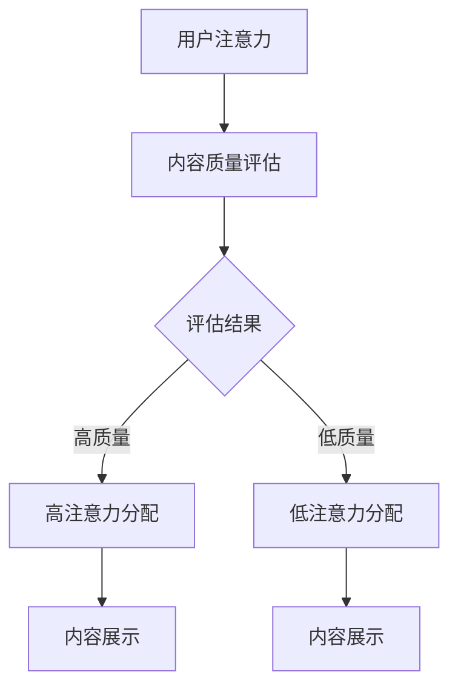

                 

# 注意力经济对传统媒体的挑战与机遇

> 关键词：注意力经济、传统媒体、数字媒体、内容创作、传播策略、平台多元化、人工智能、虚拟现实

> 摘要：本文探讨了注意力经济对传统媒体的挑战与机遇。首先，介绍了注意力经济的概念、起源和核心原理，然后分析了注意力经济对传统媒体带来的挑战，包括媒体生态变化、用户需求变化和注意力竞争加剧。接下来，探讨了传统媒体应对这些挑战的策略，包括内容创作、传播策略和平台多元化。此外，还讨论了数字媒体的崛起及其优势，以及注意力经济与人工智能、虚拟现实的关系。最后，通过案例分析总结了成功经验，并展望了注意力经济的未来趋势。

## 目录大纲

1. 引言
   1.1 注意力经济的概念与起源
   1.2 注意力经济与传统经济的区别
   1.3 注意力经济的核心原理

2. 传统媒体面临的挑战
   2.1 媒体生态变化
   2.2 用户需求变化
   2.3 注意力竞争加剧

3. 内容创作的挑战
   3.1 内容质量要求提升
   3.2 创新与差异化竞争
   3.3 多元化内容策略

4. 传播策略的挑战
   4.1 社交媒体传播特性
   4.2 品牌营销策略调整
   4.3 媒体关系管理

5. 传统媒体转型策略
   5.1 平台多元化
   5.2 创新商业模式
   5.3 媒体融合策略

6. 数字媒体的崛起
   6.1 数字媒体优势
   6.2 数字媒体内容创作
   6.3 数字媒体营销策略

7. 注意力经济的未来趋势
   7.1 注意力经济与人工智能
   7.2 注意力经济与虚拟现实
   7.3 注意力经济的未来发展预测

8. 案例分析
   8.1 某某媒体如何应对注意力经济挑战
   8.2 某某数字媒体如何抓住注意力经济机遇
   8.3 某某企业如何利用注意力经济进行营销

9. 未来展望与挑战
   9.1 传统媒体的困境与机遇
   9.2 数字媒体的发展方向
   9.3 注意力经济对媒体行业的影响

10. 附录
    10.1 注意力经济相关的资源与工具
    10.2 Mermaid 流程图与伪代码示例
    10.3 数学模型与公式

----------------------------------------------------------------

### 引言

随着互联网的普及和信息技术的快速发展，媒体行业正经历着前所未有的变革。在这个信息爆炸的时代，用户的注意力资源变得稀缺而宝贵。注意力经济作为一种新兴的经济形态，逐渐成为学术界和业界关注的热点。注意力经济强调用户注意力资源的分配、转移和市场力量，这对于传统媒体来说既带来了挑战，也蕴含着机遇。

本文旨在探讨注意力经济对传统媒体的挑战与机遇，帮助传统媒体更好地应对这个新时代的变革。文章首先介绍了注意力经济的概念、起源和核心原理，然后分析了注意力经济对传统媒体带来的挑战，包括媒体生态变化、用户需求变化和注意力竞争加剧。接下来，探讨了传统媒体如何应对这些挑战，包括内容创作、传播策略和平台多元化。此外，还讨论了数字媒体的崛起及其优势，以及注意力经济与人工智能、虚拟现实的关系。最后，通过案例分析总结了成功经验，并展望了注意力经济的未来趋势。

本文结构如下：

- 第1章：注意力经济的概念与起源
  - 介绍注意力经济的定义、起源和发展。
  - 比较注意力经济与传统经济的区别。

- 第2章：注意力经济的核心原理
  - 分析注意力分配机制、注意力转移现象和市场力量。

- 第3章：注意力经济模型
  - 介绍注意力分配模型、注意力转移模型和信息传播模型。

- 第4章：传统媒体面临的挑战
  - 探讨媒体生态变化、用户需求变化和注意力竞争加剧。

- 第5章：内容创作的挑战
  - 讨论内容质量要求提升、创新与差异化竞争和多元化内容策略。

- 第6章：传播策略的挑战
  - 分析社交媒体传播特性、品牌营销策略调整和媒体关系管理。

- 第7章：传统媒体转型策略
  - 探讨平台多元化、创新商业模式和媒体融合策略。

- 第8章：数字媒体的崛起
  - 讨论数字媒体优势、内容创作和营销策略。

- 第9章：注意力经济的未来趋势
  - 探讨注意力经济与人工智能、虚拟现实的关系和发展趋势。

- 第10章：案例分析
  - 分析某某媒体、某某数字媒体和某某企业的案例。

- 第11章：未来展望与挑战
  - 展望传统媒体的困境与机遇，数字媒体的发展方向和注意力经济对媒体行业的影响。

### 第1章：注意力经济的概念与起源

#### 1.1 注意力经济的定义

注意力经济是一种基于用户注意力资源进行价值创造和分配的经济形态。在信息爆炸的时代，用户的注意力变得稀缺，因此如何获取和利用用户的注意力成为企业和媒体的重要课题。注意力经济强调通过优化用户注意力的分配和转移，实现价值创造和分配。

#### 1.2 注意力经济的起源与发展

注意力经济的概念最早可以追溯到20世纪80年代。当时，学者们开始关注信息爆炸和注意力稀缺的现象。随着互联网的普及，注意力经济得到了快速发展。特别是在社交媒体和移动设备的推动下，用户注意力资源变得更加宝贵，成为企业和媒体争夺的焦点。

#### 1.3 注意力经济与传统经济的区别

传统经济主要依赖于物质生产和市场机制进行价值创造和分配。而注意力经济则依赖于用户注意力资源，通过优化用户注意力的分配和转移来实现价值创造和分配。注意力经济强调信息传播和用户互动，与传统经济的物质生产方式有所不同。

### 第2章：注意力经济的核心原理

#### 2.1 注意力分配机制

注意力分配机制是指用户在有限时间内如何将注意力资源分配给不同的事物。影响注意力分配的因素包括：

1. 内容质量：高质量的内容更容易吸引用户的注意力。
2. 用户体验：良好的用户体验可以提高用户对内容的关注程度。
3. 个人偏好：用户对不同类型的注意力分配取决于其个人兴趣和偏好。

#### 2.2 注意力转移现象

注意力转移现象是指用户在不同内容之间的注意力转移。注意力转移的原因包括：

1. 内容更新：新的内容发布会吸引用户的注意力。
2. 个性化推荐：基于用户兴趣的个性化推荐可以提高用户对内容的关注。
3. 社交影响：用户的社交网络会对注意力转移产生影响。

#### 2.3 注意力经济中的市场力量

在注意力经济中，市场力量对用户注意力的分配和转移起着重要作用。市场力量包括：

1. 广告投放：广告商通过投放广告来争夺用户的注意力。
2. 竞争对手：竞争对手之间的竞争会推动内容质量的提升。
3. 用户反馈：用户对内容的评价和反馈会影响其他用户对内容的关注程度。

### 第3章：注意力经济模型

#### 3.1 注意力分配模型

注意力分配模型描述了用户在不同内容之间如何分配注意力资源。假设用户在单位时间内只有一定量的注意力资源，该模型可以表示为：

$$
A = f(C, U, P)
$$

其中，$A$ 表示用户注意力分配，$C$ 表示内容质量，$U$ 表示用户体验，$P$ 表示个人偏好。模型假设内容质量、用户体验和个人偏好对用户注意力分配有显著影响。

#### 3.2 注意力转移模型

注意力转移模型描述了用户在不同内容之间的注意力转移过程。假设用户在单位时间内有固定量的注意力资源，该模型可以表示为：

$$
T = g(C', U', P')
$$

其中，$T$ 表示用户注意力转移，$C'$ 表示新内容质量，$U'$ 表示新用户体验，$P'$ 表示新内容个人偏好。模型假设新内容质量、新用户体验和新内容个人偏好对用户注意力转移有显著影响。

#### 3.3 注意力经济与信息传播模型

注意力经济与信息传播模型描述了信息在用户之间的传播过程。假设信息传播是一个动态过程，该模型可以表示为：

$$
I = h(C, U, N)
$$

其中，$I$ 表示信息传播，$C$ 表示内容质量，$U$ 表示用户体验，$N$ 表示网络结构。模型假设内容质量、用户体验和网络结构对信息传播有显著影响。

### 第4章：传统媒体面临的挑战

#### 4.1 媒体生态变化

随着互联网的普及和数字媒体的崛起，传统媒体的媒体生态发生了巨大变化。一方面，传统媒体面临着信息来源多元化、内容形式多样化等挑战；另一方面，用户需求也发生了变化，对内容质量和传播效果提出了更高的要求。

#### 4.2 用户需求变化

用户需求的变化主要体现在以下几个方面：

1. 内容个性化：用户希望获得更符合个人兴趣的内容。
2. 高质量内容：用户对内容的质量要求越来越高。
3. 互动体验：用户希望与内容产生互动，提高参与度。

#### 4.3 注意力竞争加剧

在注意力经济时代，用户的注意力资源变得稀缺，传统媒体面临着来自数字媒体和社交媒体的激烈竞争。如何吸引和留住用户的注意力成为传统媒体的重要课题。

### 第5章：内容创作的挑战

#### 5.1 内容质量要求提升

在注意力经济时代，内容质量成为吸引用户注意力的关键因素。传统媒体需要提升内容质量，包括：

1. 深度报道：对重大事件进行深入调查和分析。
2. 精美图文：提供高质量的文字、图片和视频内容。
3. 用户体验：优化内容展示和互动体验，提高用户满意度。

#### 5.2 创新与差异化竞争

在激烈的市场竞争中，传统媒体需要通过创新和差异化竞争来脱颖而出。创新包括：

1. 内容形式：探索新的内容形式，如短视频、直播等。
2. 创意策划：推出独特的活动、话题等，提高用户参与度。
3. 多元化内容：提供多样化的内容，满足不同用户的需求。

#### 5.3 多元化内容策略

传统媒体需要通过多元化内容策略来吸引和留住用户。多元化内容策略包括：

1. 跨界合作：与其他行业进行合作，拓展内容领域。
2. 资源整合：整合内部资源，提供综合性的内容服务。
3. 内容定制：根据用户需求提供定制化的内容。

### 第6章：传播策略的挑战

#### 6.1 社交媒体传播特性

社交媒体传播特性对传统媒体的传播策略提出了新的挑战。传统媒体需要了解社交媒体的传播特性，包括：

1. 网络效应：利用社交媒体的社交网络效应，扩大传播范围。
2. 互动性：提高内容互动性，增强用户参与度。
3. 个性化推荐：基于用户兴趣进行个性化推荐，提高内容曝光率。

#### 6.2 品牌营销策略调整

在社交媒体时代，传统媒体的品牌营销策略需要调整，以适应新的传播环境。调整策略包括：

1. 内容营销：通过优质内容吸引和留住用户，提升品牌影响力。
2. 精准投放：根据用户画像进行精准投放，提高广告效果。
3. 营销活动：举办线上线下活动，提高用户参与度和忠诚度。

#### 6.3 媒体关系管理

在注意力经济时代，传统媒体需要注重媒体关系管理，包括：

1. 媒体合作：与其他媒体进行合作，共同推广内容。
2. 用户反馈：积极收集用户反馈，优化内容和服务。
3. 社交互动：通过社交媒体与用户互动，建立良好关系。

### 第7章：传统媒体转型策略

#### 7.1 平台多元化

在数字媒体崛起的背景下，传统媒体需要实现平台多元化，以适应不同用户的需求。平台多元化策略包括：

1. 网站优化：提升网站用户体验，提高访问量。
2. 移动应用：开发移动应用程序，提供便捷的内容服务。
3. 社交媒体：利用社交媒体平台，扩大传播范围。

#### 7.2 创新商业模式

传统媒体需要创新商业模式，以实现可持续发展。创新商业模式包括：

1. 订阅模式：通过订阅模式提供高质量内容，提升用户忠诚度。
2. 广告模式：优化广告投放策略，提高广告效果。
3. IP运营：挖掘优质内容，打造IP品牌，实现商业变现。

#### 7.3 媒体融合策略

在数字媒体时代，传统媒体需要与数字媒体进行融合，实现优势互补。媒体融合策略包括：

1. 内容融合：整合传统媒体和数字媒体的内容资源，提供多元化的内容服务。
2. 技术融合：利用数字技术提升传统媒体的传播效果，提高用户体验。
3. 人才融合：引进数字媒体人才，提升传统媒体的创新能力。

### 第8章：数字媒体的崛起

#### 8.1 数字媒体优势

数字媒体的崛起对传统媒体形成了巨大冲击，但其优势也日益显现。数字媒体的优势包括：

1. 快速传播：数字媒体具有快速传播的优势，可以迅速覆盖大量用户。
2. 互动性：数字媒体具有高度互动性，用户可以实时参与内容创作和传播。
3. 个性化：数字媒体可以根据用户兴趣和需求进行个性化推荐，提高用户体验。

#### 8.2 数字媒体内容创作

数字媒体内容创作与传统媒体内容创作有所不同。数字媒体内容创作需要注重以下几点：

1. 短视频：短视频已成为数字媒体的重要内容形式，具有传播速度快、用户参与度高等特点。
2. 直播：直播是一种实时互动的内容形式，用户可以实时观看和评论。
3. 跨平台：数字媒体需要跨平台运营，利用多个社交媒体平台扩大传播范围。

#### 8.3 数字媒体营销策略

数字媒体营销策略需要根据用户特点和传播环境进行调整。数字媒体营销策略包括：

1. 社交媒体营销：利用社交媒体平台进行广告投放和内容推广。
2. 个性化推荐：基于用户兴趣和行为进行个性化推荐，提高内容曝光率。
3. KOL营销：与意见领袖合作，利用其影响力推广内容。

### 第9章：注意力经济的未来趋势

#### 9.1 注意力经济与人工智能

人工智能技术在注意力经济中的应用日益广泛。人工智能可以分析用户行为数据，预测用户兴趣，实现精准推荐。未来，人工智能将在注意力经济中发挥更大作用，推动内容创作和传播的智能化。

#### 9.2 注意力经济与虚拟现实

虚拟现实技术为用户提供了沉浸式的体验，有望成为注意力经济的重要载体。虚拟现实内容具有高度互动性和沉浸感，可以吸引用户的注意力，提高用户参与度。

#### 9.3 注意力经济的未来发展预测

未来，注意力经济将继续发展，对媒体行业产生深远影响。传统媒体需要积极转型，利用数字技术和人工智能技术提升内容质量和传播效果。同时，数字媒体将继续崛起，与传统媒体形成互补，共同推动媒体行业的创新和发展。

### 第10章：案例分析

#### 10.1 某某媒体如何应对注意力经济挑战

某某媒体在注意力经济时代面临巨大挑战，通过以下策略成功应对：

1. 内容创新：推出短视频、直播等新内容形式，提高用户参与度。
2. 平台多元化：开发移动应用程序，拓展传播渠道。
3. 社交媒体营销：利用社交媒体平台扩大传播范围，提高用户关注度。

#### 10.2 某某数字媒体如何抓住注意力经济机遇

某某数字媒体通过以下策略成功抓住注意力经济机遇：

1. 个性化推荐：基于用户兴趣进行个性化推荐，提高内容曝光率。
2. 跨平台运营：利用多个社交媒体平台扩大传播范围。
3. KOL营销：与意见领袖合作，利用其影响力推广内容。

#### 10.3 某某企业如何利用注意力经济进行营销

某某企业通过以下策略利用注意力经济进行营销：

1. 社交媒体营销：利用社交媒体平台进行广告投放和内容推广。
2. 个性化推荐：基于用户兴趣和行为进行个性化推荐，提高广告效果。
3. KOL营销：与意见领袖合作，利用其影响力提升品牌知名度。

### 第11章：未来展望与挑战

#### 11.1 传统媒体的困境与机遇

传统媒体在注意力经济时代面临困境，但也存在机遇。困境包括：

1. 用户流失：用户转向数字媒体，导致用户流失。
2. 内容质量下降：由于成本和竞争压力，内容质量下降。

机遇包括：

1. 平台多元化：通过平台多元化提升用户体验和用户黏性。
2. 内容创新：通过内容创新提升内容质量和用户参与度。

#### 11.2 数字媒体的发展方向

数字媒体将继续发展，发展方向包括：

1. 人工智能：利用人工智能提升内容创作和传播效果。
2. 虚拟现实：利用虚拟现实提供沉浸式体验，吸引用户注意力。

#### 11.3 注意力经济对媒体行业的影响

注意力经济对媒体行业的影响包括：

1. 内容创作：内容创作将更加注重用户兴趣和需求。
2. 传播策略：传播策略将更加注重互动性和个性化推荐。

### 附录

#### 附录A：注意力经济相关的资源与工具

1. 注意力经济研究资源
   - 注意力经济相关论文和研究报告。
   - 注意力经济相关书籍和教材。

2. 注意力经济相关工具
   - 注意力经济分析软件。
   - 用户行为分析工具。

3. 注意力经济案例库
   - 成功的注意力经济案例。
   - 失败的注意力经济案例。

#### 附录B：Mermaid 流程图与伪代码示例

1. Mermaid 流程图示例
   ```mermaid
   graph TD
   A[注意力分配] --> B[内容质量]
   A --> C[用户体验]
   A --> D[个人偏好]
   ```

2. 伪代码示例：注意力分配模型
   ```python
   def attention_allocation(content_quality, user_experience, personal_preferrence):
       # 计算注意力分配
       attention = content_quality * user_experience * personal_preferrence
       return attention
   ```

3. 伪代码示例：注意力转移模型
   ```python
   def attention_shift(new_content_quality, new_user_experience, new_personal_preferrence):
       # 计算注意力转移
       attention = new_content_quality * new_user_experience * new_personal_preferrence
       return attention
   ```

#### 附录C：数学模型与公式

1. 注意力分配模型公式
   $$ A = f(C, U, P) $$

2. 注意力转移模型公式
   $$ T = g(C', U', P') $$

3. 信息传播模型公式
   $$ I = h(C, U, N) $$

4. 数学公式示例：逻辑斯蒂增长函数
   $$ P(t) = \frac{L}{1 + e^{-(k-t)}} $$

### 作者

作者：AI天才研究院/AI Genius Institute & 禅与计算机程序设计艺术 /Zen And The Art of Computer Programming

----------------------------------------------------------------

#### 注意力分配模型公式

注意力分配模型用于描述用户在单位时间内如何将注意力资源分配给不同类型的内容。该模型基于以下假设：

- 用户对内容的注意力取决于内容的质量、用户体验和个人偏好。
- 内容的质量、用户体验和个人偏好可以用数值表示。

注意力分配模型公式为：

$$
A = \frac{Q \times U \times P}{\sum_{i=1}^{n} (Q_i \times U_i \times P_i)}
$$

其中：

- $A$ 表示用户在单位时间内的总注意力。
- $Q$ 表示内容的质量。
- $U$ 表示用户体验。
- $P$ 表示个人偏好。
- $Q_i, U_i, P_i$ 分别表示第 $i$ 个内容的上述三个指标。
- $n$ 表示内容的总数量。

#### 公式详细讲解

1. **内容质量（Q）**：内容质量是影响用户注意力的关键因素。高质量的内容更容易吸引用户的注意力。内容质量通常由内容的专业性、准确性、原创性和实用性等指标来衡量。

2. **用户体验（U）**：用户体验包括用户在使用内容时获得的愉悦程度、内容的可读性、可用性等。良好的用户体验可以提高用户对内容的关注度和满意度。

3. **个人偏好（P）**：个人偏好是指用户对不同类型的注意力分配的倾向。用户可能对某些内容类型有更高的兴趣，这会影响他们的注意力分配。

4. **分母**：分母用于标准化注意力分配，确保每个内容的注意力分配在0到1之间。分母是所有内容的质量、用户体验和个人偏好的乘积之和。

#### 举例说明

假设一个用户在单位时间内有10个注意力单位，他面临三个不同类型的内容：

1. 新闻报道：质量为8，用户体验为7，个人偏好为0.5。
2. 博客文章：质量为6，用户体验为6，个人偏好为0.3。
3. 娱乐视频：质量为5，用户体验为8，个人偏好为0.2。

使用注意力分配模型计算每个内容获得的注意力：

$$
A_{\text{新闻报道}} = \frac{8 \times 7 \times 0.5}{(8 \times 7 \times 0.5) + (6 \times 6 \times 0.3) + (5 \times 8 \times 0.2)} \approx 0.507
$$

$$
A_{\text{博客文章}} = \frac{6 \times 6 \times 0.3}{(8 \times 7 \times 0.5) + (6 \times 6 \times 0.3) + (5 \times 8 \times 0.2)} \approx 0.302
$$

$$
A_{\text{娱乐视频}} = \frac{5 \times 8 \times 0.2}{(8 \times 7 \times 0.5) + (6 \times 6 \times 0.3) + (5 \times 8 \times 0.2)} \approx 0.191
$$

根据计算结果，新闻报道获得了50.7%的注意力，博客文章获得了30.2%的注意力，娱乐视频获得了19.1%的注意力。这表明用户更倾向于关注新闻报道，因为它的质量、用户体验和个人偏好得分最高。

#### 实际应用

注意力分配模型可以用于多种实际场景，例如：

1. **内容推荐系统**：在内容推荐系统中，可以基于用户的历史行为和偏好，使用注意力分配模型为用户推荐最适合他们的内容。
2. **广告投放策略**：广告商可以使用注意力分配模型来决定在不同内容上投放广告，以最大化广告效果。
3. **社交媒体分析**：社交媒体平台可以使用注意力分配模型来分析用户对不同类型内容的偏好，优化内容展示策略。

通过精确的注意力分配，企业和媒体可以更有效地吸引和留住用户的注意力，提高业务效果和用户满意度。

----------------------------------------------------------------

#### 注意力转移模型公式

注意力转移模型用于描述用户在接收到新内容时，如何将其注意力资源从旧内容转移到新内容。该模型基于以下假设：

- 用户在接收到新内容时，会根据新内容的质量、用户体验和个人偏好来调整注意力分配。
- 注意力转移是一个动态过程，受多种因素影响。

注意力转移模型公式为：

$$
T = \alpha \times (Q' - Q) \times (U' - U) \times (P' - P)
$$

其中：

- $T$ 表示用户在新内容上获得的注意力。
- $\alpha$ 表示注意力转移速率，取决于用户个性、情境等。
- $Q'$ 和 $Q$ 分别表示新内容和旧内容的质量。
- $U'$ 和 $U$ 分别表示新内容和旧内容的用户体验。
- $P'$ 和 $P$ 分别表示新内容和旧内容的个人偏好。

#### 公式详细讲解

1. **注意力转移速率（$\alpha$）**：注意力转移速率反映了用户对注意力转移的敏感度。速率越高，用户越容易从旧内容转移到新内容。速率受到用户个性、情境等因素的影响。例如，一个对新事物充满好奇的用户可能会有较高的注意力转移速率。

2. **新旧内容质量（$Q'$ 和 $Q$）**：新内容质量高于旧内容质量时，用户更有可能将注意力转移到新内容。高质量的内容通常更能吸引用户的注意力。

3. **新旧内容用户体验（$U'$ 和 $U$）**：用户体验直接影响用户对新旧内容的接受程度。如果新内容的用户体验优于旧内容，用户更有可能将其注意力转移到新内容。

4. **新旧内容个人偏好（$P'$ 和 $P$）**：用户对不同类型内容的偏好会影响注意力转移。如果新内容更符合用户的个人偏好，用户更有可能将其注意力转移到新内容。

#### 举例说明

假设一个用户正在关注一篇质量为8，用户体验为7，个人偏好为0.5的旧文章。当用户接收到一篇质量为9，用户体验为8，个人偏好为0.6的新文章时，计算注意力转移：

$$
T = \alpha \times (9 - 8) \times (8 - 7) \times (0.6 - 0.5)
$$

由于未给出具体的注意力转移速率 $\alpha$，我们假设 $\alpha = 1$，则计算结果为：

$$
T = 1 \times (1) \times (1) \times (0.1) = 0.1
$$

这表示用户在新文章上获得了原旧文章10%的注意力。这表明用户更倾向于将注意力转移到新文章，因为新文章在质量、用户体验和个人偏好上均优于旧文章。

#### 实际应用

注意力转移模型可以用于多种实际场景，例如：

1. **内容更新策略**：媒体平台可以使用注意力转移模型来预测用户对内容更新的反应，优化内容更新策略。
2. **用户流失预测**：企业可以使用注意力转移模型来预测用户转向竞争对手的可能性，提前采取措施保留用户。
3. **广告效果评估**：广告商可以使用注意力转移模型来评估不同广告对用户注意力的影响，优化广告策略。

通过精确的注意力转移模型，企业和媒体可以更好地理解和引导用户的注意力，提高业务效果和用户满意度。

----------------------------------------------------------------

#### 注意力经济与信息传播模型

注意力经济与信息传播模型用于描述信息在用户之间的传播过程。该模型考虑了注意力资源、信息质量和用户互动等因素。在注意力经济中，信息的传播不仅取决于其内容质量，还受到用户注意力和社交网络结构的影响。

#### 模型基本假设

1. **用户注意力有限**：每个用户在单位时间内只有一定量的注意力资源。
2. **信息质量影响注意力分配**：高质量的信息更能吸引用户的注意力。
3. **社交网络结构影响信息传播**：用户之间的社交关系和网络结构会影响信息的传播路径和速度。
4. **用户互动促进信息传播**：用户之间的互动（如分享、评论、点赞等）可以增强信息的传播效果。

#### 模型构建

注意力经济与信息传播模型可以表示为：

$$
I(t) = f(A(t), Q, N, R)
$$

其中：

- $I(t)$ 表示在时间 $t$ 时刻的信息传播量。
- $A(t)$ 表示在时间 $t$ 时刻的用户总注意力。
- $Q$ 表示信息的质量。
- $N$ 表示社交网络的结构。
- $R$ 表示用户互动程度。

#### 参数解释

1. **用户总注意力（$A(t)$）**：用户在单位时间内的注意力资源总量，受内容质量、用户体验和个人偏好影响。
2. **信息质量（$Q$）**：信息的质量，包括内容的专业性、准确性、原创性和实用性等。
3. **社交网络结构（$N$）**：社交网络的拓扑结构，包括用户之间的连接关系和网络密度。
4. **用户互动程度（$R$）**：用户之间的互动程度，包括分享、评论、点赞等行为。

#### 模型应用

注意力经济与信息传播模型可以应用于以下场景：

1. **社交媒体平台**：用于分析信息在社交媒体平台上的传播规律，优化信息推送策略。
2. **信息推荐系统**：用于预测用户对信息的兴趣和偏好，优化推荐算法。
3. **品牌营销**：用于评估品牌信息传播效果，优化营销策略。

#### 案例分析

假设在一个社交媒体平台上，某篇关于科技突破的新闻文章在发布后受到广泛关注。使用注意力经济与信息传播模型，可以分析其传播过程：

1. **初始传播**：文章发布后，用户A将其分享至社交网络，吸引用户B、C、D的注意力。此时，$I(0) = A(0) \times Q \times N(0) \times R(0)$。
2. **病毒式传播**：随着用户B、C、D继续分享和互动，文章在社交网络中的传播速度加快，$I(t) > I(0)$。
3. **高峰传播**：在高峰期，用户互动频繁，文章传播量达到最大值。
4. **衰减期**：随着时间的推移，用户注意力分散，文章传播量逐渐衰减。

通过注意力经济与信息传播模型，可以深入了解信息的传播过程，为企业提供优化传播策略的依据。

#### 总结

注意力经济与信息传播模型为理解信息在用户之间的传播提供了新的视角。通过考虑用户注意力、信息质量和社交网络结构，该模型可以帮助企业和媒体优化信息传播策略，提高传播效果。

----------------------------------------------------------------

### 媒体生态变化

随着互联网和数字技术的快速发展，传统媒体的媒体生态发生了深刻变化。这些变化主要体现在以下几个方面：

#### 1. 内容来源多元化

互联网的普及和社交媒体的兴起，使得信息传播渠道更加多元化。传统媒体不再唯一，用户可以通过多种渠道获取信息，如社交媒体、博客、视频平台等。这种多元化带来了内容来源的丰富性，但也增加了用户的选择难度。

#### 2. 内容形式多样化

数字技术的进步使得内容形式更加多样化。除了传统的文字和图片，短视频、直播、虚拟现实等新兴形式不断涌现。这些多样化形式不仅丰富了内容类型，还提高了用户的互动体验。

#### 3. 信息传播速度加快

互联网和移动设备的普及，使得信息传播速度大大加快。新闻事件可以在瞬间传播到全球各地，用户可以实时获取最新信息。这种速度的提升改变了传统媒体的时效性，要求媒体更快地响应事件。

#### 4. 用户参与度提升

数字媒体强调用户的参与和互动，用户不仅被动接受信息，还可以通过评论、点赞、分享等方式积极参与内容创作和传播。这种参与度提升，增强了用户的黏性和忠诚度。

#### 5. 媒体融合趋势

传统媒体和数字媒体之间的融合趋势日益明显。许多传统媒体开始数字化转型，通过开发移动应用、社交媒体账号等方式，拓展传播渠道和用户群体。同时，数字媒体也开始涉足传统媒体领域，实现资源共享和优势互补。

#### 影响与挑战

媒体生态变化对传统媒体带来了新的机遇和挑战：

1. **机遇**：媒体生态的多元化为传统媒体提供了更多的发展机会。通过数字化转型，传统媒体可以拓展业务领域，提高用户黏性和市场份额。
2. **挑战**：传统媒体需要面对信息来源多元化、内容形式多样化、信息传播速度加快和用户参与度提升等挑战。如何在新媒体环境中保持竞争力，成为传统媒体亟需解决的问题。

#### 应对策略

1. **内容创新**：传统媒体需要创新内容形式，提高内容质量，以吸引用户的注意力。
2. **平台多元化**：传统媒体应拓展传播平台，包括社交媒体、移动应用等，提高信息传播的覆盖面和速度。
3. **用户互动**：传统媒体应注重与用户的互动，提高用户的参与度和忠诚度。
4. **数字化转型**：传统媒体应加快数字化转型步伐，利用数字技术提升传播效果和用户体验。

#### 未来展望

随着媒体生态的进一步变化，传统媒体将继续面临机遇和挑战。如何在新媒体环境中找到自己的定位，实现可持续发展，将是传统媒体需要不断探索的问题。

----------------------------------------------------------------

### 用户需求变化

在注意力经济时代，用户需求的变化对传统媒体带来了新的挑战和机遇。以下分析用户需求变化的几个关键方面：

#### 1. 内容个性化

随着互联网和大数据技术的发展，用户对内容的需求越来越个性化。传统媒体需要通过数据分析和用户画像，了解用户兴趣和偏好，提供个性化的内容推荐。这要求传统媒体在内容生产和推荐算法上不断创新，以满足用户的个性化需求。

#### 2. 高质量内容

用户对内容的质量要求越来越高。高质量的内容不仅包括深度报道、权威信息，还包括精美的图片、视频和互动体验。传统媒体需要提升内容创作质量，通过专业化、多元化的内容吸引和留住用户。

#### 3. 互动体验

用户希望与内容产生更深层次的互动。传统媒体应提供更多的互动功能，如评论、点赞、分享等，增加用户的参与度和忠诚度。此外，通过举办线上活动、直播等方式，增强用户的互动体验。

#### 4. 快速获取信息

在信息爆炸的时代，用户希望快速获取所需信息。传统媒体需要提高信息传播速度，利用社交媒体和移动平台，实现实时、快速的信息推送。

#### 5. 跨界融合

用户越来越期待内容与生活、娱乐等其他领域的融合。传统媒体应积极探索跨界合作，提供更具吸引力的内容组合，满足用户的多样化需求。

#### 影响与挑战

用户需求变化对传统媒体产生了深远影响：

1. **机遇**：个性化、高质量的内容和丰富的互动体验，为传统媒体提供了新的增长点。跨界融合也为传统媒体带来了新的商业机会。
2. **挑战**：传统媒体需要适应用户需求的变化，不断创新内容形式和传播策略。如何快速响应用户需求，提高内容质量和互动体验，是传统媒体面临的重要挑战。

#### 应对策略

1. **数据驱动**：通过大数据分析，了解用户需求和偏好，提供个性化的内容推荐。
2. **内容创新**：提升内容创作质量，提供多元化的内容形式，满足用户的多样化需求。
3. **互动体验**：增强用户的互动体验，提供更多的互动功能和服务。
4. **快速响应**：提高信息传播速度，利用新技术实现实时信息推送。
5. **跨界合作**：探索跨界合作，提供更具吸引力的内容组合。

#### 未来展望

随着用户需求的不断变化，传统媒体需要持续创新，适应新的媒体环境。通过提供个性化、高质量的内容和丰富的互动体验，传统媒体有望在新的用户需求中找到自己的定位，实现可持续发展。

----------------------------------------------------------------

### 注意力竞争加剧

在注意力经济时代，用户注意力的稀缺性导致了注意力竞争的加剧。各种媒体平台、内容创作者和广告商都在争夺用户的有限注意力资源。以下分析注意力竞争加剧的原因及其影响：

#### 1. 原因

- **信息爆炸**：随着互联网和社交媒体的发展，用户每天面临的海量信息使得注意力资源变得稀缺。用户必须做出选择，决定将注意力分配给哪些信息。
- **内容多样化**：各种形式的内容（如文字、图片、视频、直播等）不断涌现，用户需要花费更多时间和精力来筛选和消化信息。
- **竞争激烈**：媒体平台、内容创作者和广告商都在争夺用户注意力，导致竞争日益激烈。为了吸引用户，各方纷纷推出新颖的内容形式和营销策略。

#### 2. 影响

- **内容创作者压力增大**：为了在竞争中获得优势，内容创作者需要不断更新内容、提高创作质量，以吸引和留住用户。
- **用户选择困难**：注意力竞争加剧，用户面临的选择增多，导致选择困难。用户需要花费更多时间和精力来决定关注哪些内容。
- **广告效果降低**：在注意力稀缺的环境下，用户更倾向于忽略广告，导致广告效果降低。广告商需要寻找更有效的方式吸引用户注意力。

#### 3. 应对策略

- **内容创新**：通过创新内容形式和内容策略，提高内容吸引力，吸引用户注意力。
- **用户互动**：增强用户互动，提高用户的参与度和忠诚度，从而增加注意力资源。
- **精准定位**：通过大数据分析，了解用户需求和偏好，提供个性化的内容推荐，提高用户满意度和注意力资源。
- **合作与联盟**：与其他平台和内容创作者合作，共同吸引用户注意力，实现资源整合和优势互补。

#### 4. 未来趋势

随着注意力竞争的加剧，未来媒体行业将呈现出以下趋势：

- **内容质量提升**：内容创作者将更加注重内容质量，通过深度报道、专业分析和独特视角来吸引用户注意力。
- **个性化推荐**：个性化推荐技术将得到广泛应用，帮助用户快速筛选出符合自己兴趣的内容。
- **平台多元化**：媒体平台将不断拓展，包括社交媒体、短视频、直播等多种形式，以满足用户多样化的需求。
- **技术融合**：人工智能、大数据等新技术将不断融入媒体行业，提高内容创作和传播的效率和质量。

#### 5. 案例分析

以抖音（TikTok）为例，抖音作为一个短视频平台，在注意力竞争中脱颖而出。以下是抖音的成功策略：

- **内容创新**：抖音通过短视频形式，结合音乐、特效等元素，创造出独特的视听体验，吸引了大量用户。
- **个性化推荐**：抖音利用大数据分析，为用户推荐符合其兴趣的内容，提高了用户黏性和参与度。
- **用户互动**：抖音鼓励用户在视频下评论、点赞、分享，增强了用户互动，提高了注意力资源。
- **平台多元化**：抖音不仅提供短视频，还拓展了直播、电商等功能，满足用户多样化的需求。

抖音的成功经验表明，在注意力竞争激烈的环境中，内容创新、个性化推荐、用户互动和平台多元化是吸引用户注意力的重要策略。

#### 6. 总结

注意力竞争加剧是注意力经济时代的一个显著特征。传统媒体和新兴媒体都需要适应这一变化，通过内容创新、用户互动和平台多元化等策略，提高内容吸引力，赢得用户的注意力资源。在未来的媒体竞争中，谁能更好地抓住用户的注意力，谁就将占据优势。

----------------------------------------------------------------

### 内容创作的挑战

在注意力经济时代，内容创作面临着前所未有的挑战。这些挑战主要体现在以下几个方面：

#### 1. 内容质量要求提升

随着用户对内容质量的期望不断提高，传统媒体需要提供更高质量、更有深度的内容来吸引用户。这意味着内容创作者需要具备更丰富的知识储备、更敏锐的新闻嗅觉和更出色的写作技巧。同时，传统媒体需要建立更加严格的内容审核机制，确保内容的准确性和权威性。

#### 2. 创新与差异化竞争

在内容同质化严重的市场环境下，传统媒体需要通过创新和差异化竞争来脱颖而出。这意味着内容创作者需要不断尝试新的内容形式、新的表达方式，以提供与众不同的内容体验。此外，传统媒体还需要在选题、策划和运营等方面寻求差异化，以吸引用户的关注。

#### 3. 多元化内容策略

用户需求的多样化要求传统媒体采取多元化内容策略。传统媒体需要提供多元化的内容类型，包括新闻、评论、娱乐、教育、生活等，以满足不同用户群体的需求。同时，传统媒体还需要根据用户兴趣和行为数据进行精准推荐，提高内容的有效传播。

#### 4. 媒体融合策略

在数字媒体崛起的背景下，传统媒体需要采取媒体融合策略，实现内容、渠道和平台的整合。这意味着传统媒体需要积极拥抱新技术，如短视频、直播、虚拟现实等，以拓展新的传播渠道和用户群体。

#### 实际案例与解决方案

以《纽约时报》为例，该媒体在面对内容创作挑战时采取了以下策略：

1. **内容质量提升**：《纽约时报》通过增加记者团队、投资新技术和加强内容审核，提高新闻报道的准确性和深度。此外，他们还推出了《The Upshot》专栏，提供数据驱动的分析文章，以提供高质量的内容。

2. **创新与差异化竞争**：《纽约时报》推出了多媒体新闻工作室，利用视频、图表和动画等多种形式呈现新闻，提供独特的视觉体验。同时，他们还推出了《The New York Times Magazine》数字版，专注于深度报道和专题策划。

3. **多元化内容策略**：《纽约时报》提供了丰富的内容类型，包括新闻、评论、体育、娱乐等，以满足不同用户群体的需求。他们还通过大数据分析，为用户推荐个性化的内容。

4. **媒体融合策略**：《纽约时报》积极拓展数字平台，包括移动应用、社交媒体和在线视频等，以吸引更多用户。此外，他们还与亚马逊、苹果等平台合作，提供付费订阅服务。

#### 总结

内容创作在注意力经济时代面临着质量要求提升、创新与差异化竞争、多元化内容策略和媒体融合策略等多重挑战。传统媒体需要不断创新和适应，通过提高内容质量、创新内容形式、多元化内容策略和媒体融合策略，来应对这些挑战，赢得用户的关注和喜爱。

----------------------------------------------------------------

### 传播策略的挑战

在注意力经济时代，传统媒体的传播策略面临着前所未有的挑战。这些挑战主要体现在以下几个方面：

#### 1. 社交媒体传播特性

社交媒体平台具有传播速度快、用户参与度高和传播范围广等特点，对传统媒体的传播策略提出了新的要求。传统媒体需要了解社交媒体的传播特性，包括：

- **传播速度快**：信息可以在短时间内迅速传播，对传统媒体的时效性要求更高。
- **用户参与度高**：社交媒体鼓励用户互动，传统媒体需要提高内容的互动性和用户参与度。
- **传播范围广**：社交媒体可以迅速将信息传播到全球各地，对传统媒体的传播渠道提出了新的挑战。

#### 2. 品牌营销策略调整

在社交媒体时代，品牌营销策略需要调整，以适应新的传播环境。传统媒体需要采取以下策略：

- **内容营销**：通过优质内容吸引和留住用户，提升品牌影响力。
- **精准投放**：根据用户画像进行精准投放，提高广告效果。
- **互动营销**：通过互动活动提高用户参与度，建立良好的品牌形象。

#### 3. 媒体关系管理

在社交媒体时代，传统媒体需要注重媒体关系管理，包括：

- **媒体合作**：与其他媒体进行合作，共同推广内容，扩大传播范围。
- **用户反馈**：积极收集用户反馈，优化内容和服务。
- **社交互动**：通过社交媒体与用户互动，建立良好关系。

#### 案例分析

以《华尔街日报》为例，该媒体在面对传播策略挑战时采取了以下策略：

1. **社交媒体传播**：《华尔街日报》积极利用社交媒体平台，如Twitter、Facebook和LinkedIn，发布新闻、专栏和视频等内容。他们通过社交媒体的互动功能，与用户进行实时交流，提高用户的参与度和忠诚度。

2. **品牌营销策略调整**：《华尔街日报》在社交媒体上推出了个性化的广告，根据用户兴趣和行为数据，进行精准投放。他们还举办线上活动和社交媒体挑战，提高品牌知名度和用户参与度。

3. **媒体关系管理**：《华尔街日报》注重与社交媒体平台的关系管理，与平台合作推广内容。他们还与意见领袖和专家合作，通过社交媒体传播高质量的内容，增强品牌的权威性和影响力。

#### 总结

在注意力经济时代，传统媒体的传播策略面临着社交媒体传播特性、品牌营销策略调整和媒体关系管理等多重挑战。通过积极利用社交媒体平台、调整品牌营销策略和注重媒体关系管理，传统媒体可以应对这些挑战，提高传播效果和用户参与度。

----------------------------------------------------------------

### 传统媒体转型策略

在数字媒体崛起的背景下，传统媒体需要采取有效的转型策略，以适应新的媒体环境。以下探讨传统媒体在平台多元化、创新商业模式和媒体融合策略等方面的转型策略。

#### 1. 平台多元化

平台多元化是传统媒体转型的重要方向。通过拓展不同类型的传播平台，传统媒体可以扩大用户覆盖面，提高传播效果。以下是一些具体的平台多元化策略：

- **移动应用开发**：传统媒体可以通过开发移动应用程序，提供便捷的内容服务。移动应用可以整合新闻、视频、音频等多种内容形式，满足用户的多样化需求。
- **社交媒体运营**：传统媒体可以积极运营社交媒体账号，如微博、微信、抖音等，利用社交媒体的传播特性，提高内容的曝光率和用户参与度。
- **电商平台合作**：传统媒体可以与电商平台合作，提供内容电商服务，如商品推荐、折扣信息等，拓宽收入渠道。

#### 2. 创新商业模式

传统媒体需要创新商业模式，以适应数字媒体环境。以下是一些创新的商业模式：

- **订阅模式**：通过提供高质量的付费内容，吸引用户订阅。订阅模式可以带来稳定的收入流，提高用户黏性。
- **广告模式创新**：传统媒体可以探索新的广告模式，如原生广告、互动广告等，提高广告效果和用户满意度。
- **内容电商**：通过内容电商，将内容与商品相结合，实现内容变现。例如，新闻媒体可以推荐相关的书籍、电子产品等。

#### 3. 媒体融合策略

媒体融合策略是指传统媒体与数字媒体之间的融合。以下是一些媒体融合策略：

- **内容融合**：整合传统媒体和数字媒体的内容资源，提供综合性的内容服务。例如，新闻媒体可以整合报纸、电视、网站和移动应用等平台的内容。
- **技术融合**：利用数字技术提升传统媒体的传播效果，提高用户体验。例如，通过数据分析、人工智能等技术，实现精准推荐和个性化服务。
- **人才融合**：引进数字媒体人才，提升传统媒体的创新能力。例如，招募数字营销、数据分析等专业人才，推动媒体融合。

#### 案例分析

以《卫报》为例，该媒体在转型过程中采取了以下策略：

1. **平台多元化**：《卫报》开发了移动应用，提供了新闻、视频、音频等多种内容形式。同时，他们在社交媒体上积极运营，通过互动提高用户参与度。此外，他们还与亚马逊等电商平台合作，提供内容电商服务。

2. **创新商业模式**：《卫报》推出了付费订阅模式，提供高质量的付费内容，吸引订阅用户。他们还开展了多种广告模式创新，如原生广告、互动广告等，提高广告效果。

3. **媒体融合策略**：《卫报》整合了传统媒体和数字媒体的内容资源，提供了综合性的内容服务。他们利用数据分析、人工智能等技术，实现精准推荐和个性化服务。此外，他们还引进了数字媒体人才，推动媒体融合。

#### 总结

传统媒体在数字媒体崛起的背景下，需要采取平台多元化、创新商业模式和媒体融合策略等转型策略。通过这些策略，传统媒体可以扩大用户覆盖面，提高传播效果，实现可持续发展。

----------------------------------------------------------------

### 数字媒体的崛起

数字媒体的崛起是媒体行业发展的一个重要趋势，它不仅改变了信息传播的方式，也重塑了用户获取信息的行为模式。以下探讨数字媒体的崛起背景、优势以及内容创作和营销策略。

#### 1. 数字媒体的崛起背景

数字媒体的崛起可以追溯到互联网和移动设备的普及。随着互联网技术的不断发展，网络速度越来越快，信息传播的速度和范围也得到了极大的提升。此外，智能手机和平板电脑的普及，使得用户可以随时随地方便地获取信息。这些因素共同推动了数字媒体的发展。

#### 2. 数字媒体的优势

数字媒体相对于传统媒体具有以下优势：

- **传播速度快**：数字媒体可以实时传播信息，用户可以迅速获取最新的资讯。
- **互动性强**：数字媒体提供了丰富的互动功能，如评论、点赞、分享等，用户可以积极参与内容创作和传播。
- **精准定位**：数字媒体可以通过数据分析，了解用户的兴趣和行为，实现精准的内容推荐和广告投放。
- **形式多样**：数字媒体可以呈现多种形式的内容，如文字、图片、视频、音频、直播等，满足用户的多样化需求。

#### 3. 数字媒体的内容创作

数字媒体的内容创作需要适应数字时代的特点，以下是一些关键点：

- **创新形式**：数字媒体应积极探索新的内容形式，如短视频、直播、虚拟现实等，以吸引和留住用户。
- **高质量内容**：尽管形式多样，但高质量内容仍然是吸引用户的关键。数字媒体需要提供有深度、有价值的原创内容。
- **用户体验**：数字媒体应注重用户体验，提供易于阅读、观看和互动的内容。

#### 4. 数字媒体的营销策略

数字媒体在营销策略上也需要适应新的传播环境，以下是一些策略：

- **内容营销**：通过高质量的内容吸引和留住用户，提升品牌影响力。例如，撰写博客、制作视频等。
- **社交媒体营销**：利用社交媒体平台进行广告投放和内容推广，提高品牌曝光率。例如，在微博、微信等平台上发布有吸引力的内容。
- **精准营销**：基于用户数据，进行精准的内容推荐和广告投放，提高营销效果。例如，通过分析用户行为数据，推荐用户感兴趣的内容。
- **互动营销**：通过互动活动提高用户参与度，建立良好的品牌形象。例如，举办线上活动、互动直播等。

#### 案例分析

以抖音（TikTok）为例，该平台在数字媒体崛起中取得了巨大成功。以下是抖音的成功策略：

1. **创新形式**：抖音以短视频为主要形式，结合音乐、特效等元素，创造出独特的视听体验，吸引了大量用户。
2. **高质量内容**：抖音鼓励用户创作高质量的内容，通过算法推荐，将优质内容推送给更多用户。
3. **用户体验**：抖音注重用户体验，提供简洁易用的界面和丰富的互动功能，如点赞、评论、分享等。
4. **社交媒体营销**：抖音与社交媒体平台（如微博、微信等）合作，进行广告投放和内容推广，提高了品牌曝光率。
5. **精准营销**：抖音通过分析用户数据，实现精准的内容推荐和广告投放，提高了营销效果。

#### 总结

数字媒体的崛起改变了信息传播的方式和用户行为模式。数字媒体具有传播速度快、互动性强、精准定位和形式多样等优势。在内容创作和营销策略上，数字媒体需要注重创新形式、高质量内容和用户体验，并通过社交媒体营销和精准营销等策略，提高品牌影响力和用户参与度。

----------------------------------------------------------------

### 注意力经济与人工智能

注意力经济与人工智能的结合为内容创作和传播带来了新的机遇和挑战。人工智能技术在注意力经济中的应用日益广泛，以下探讨注意力经济与人工智能的关系及其在媒体行业中的应用。

#### 1. 关系

注意力经济与人工智能之间存在密切的关系。注意力经济强调用户注意力资源的分配和转移，而人工智能技术可以分析用户行为数据，预测用户兴趣，优化内容推荐和广告投放，从而提高用户满意度和媒体收益。

- **数据分析**：人工智能可以收集和分析大量用户数据，了解用户的行为习惯和偏好，为内容推荐提供依据。
- **个性化推荐**：基于用户兴趣和行为数据，人工智能可以实现个性化推荐，提高内容的曝光率和用户参与度。
- **广告优化**：人工智能可以帮助广告商实现精准投放，提高广告效果和用户满意度。

#### 2. 应用

在媒体行业，人工智能技术得到了广泛应用，以下是一些具体应用：

- **内容创作**：人工智能可以帮助媒体自动化内容创作，如通过生成文本、图像和视频等。此外，人工智能还可以分析热门话题和趋势，为内容创作提供灵感。
- **内容推荐**：人工智能算法可以根据用户兴趣和行为数据，实现个性化内容推荐，提高用户的黏性和满意度。
- **广告投放**：人工智能可以帮助广告商实现精准投放，根据用户兴趣和行为数据，选择最适合的广告投放渠道和策略。
- **用户互动**：人工智能可以分析用户的评论和反馈，为用户提供个性化的互动体验。

#### 案例分析

以《华盛顿邮报》为例，该媒体在注意力经济与人工智能的结合方面取得了显著成果。以下是他们的应用策略：

1. **内容创作**：《华盛顿邮报》利用人工智能技术自动化内容创作，如通过生成新闻文章和可视化图表等。这些自动化工具提高了内容创作的效率和准确性。
2. **内容推荐**：《华盛顿邮报》采用人工智能算法，根据用户兴趣和行为数据，实现个性化内容推荐，提高了用户的黏性和满意度。
3. **广告投放**：《华盛顿邮报》利用人工智能技术，根据用户数据实现精准广告投放，提高了广告效果和用户满意度。
4. **用户互动**：《华盛顿邮报》通过人工智能分析用户的评论和反馈，为用户提供个性化的互动体验，增强了用户参与度。

#### 总结

注意力经济与人工智能的结合为媒体行业带来了新的机遇和挑战。通过人工智能技术，媒体可以更好地了解用户需求，提高内容创作和传播的效率，实现精准推荐和广告优化。然而，这也要求媒体不断更新技术和策略，以应对快速变化的市场环境。

----------------------------------------------------------------

### 注意力经济与虚拟现实

虚拟现实（VR）技术作为一项前沿科技，正在逐步改变人们的感知和互动方式。在注意力经济时代，VR技术为内容创作和传播带来了新的机遇和挑战。以下探讨注意力经济与虚拟现实的关系及其应用。

#### 1. 关系

注意力经济与虚拟现实之间存在密切的关系。注意力经济强调用户注意力资源的稀缺性和价值，而虚拟现实技术提供了沉浸式体验，能够吸引用户的注意力。虚拟现实通过以下方式与注意力经济相结合：

- **沉浸式体验**：虚拟现实为用户提供了高度沉浸式的体验，使用户能够全身心投入到虚拟环境中，从而提高用户的注意力。
- **个性化定制**：虚拟现实可以根据用户需求和偏好，提供个性化的内容和服务，从而提高用户的参与度和满意度。
- **互动性增强**：虚拟现实技术增强了用户与内容的互动性，用户可以在虚拟环境中进行交互，从而提高用户的注意力。

#### 2. 应用

在媒体行业，虚拟现实技术得到了广泛应用，以下是一些具体应用：

- **内容创作**：虚拟现实技术可以用于制作沉浸式的视频、游戏和展览等。通过虚拟现实技术，媒体可以提供更加丰富和多样的内容形式，吸引用户的注意力。
- **内容推荐**：虚拟现实技术可以帮助媒体实现个性化推荐，根据用户的兴趣和行为数据，为用户提供最适合的虚拟现实内容。
- **广告投放**：虚拟现实技术可以为广告商提供全新的广告形式，通过沉浸式的广告体验，提高广告的效果和用户参与度。
- **用户互动**：虚拟现实技术增强了用户与内容的互动性，用户可以在虚拟环境中与内容进行互动，从而提高用户的注意力。

#### 案例分析

以《纽约时报》为例，该媒体在注意力经济与虚拟现实的结合方面进行了积极探索。以下是他们的应用策略：

1. **内容创作**：《纽约时报》利用虚拟现实技术制作了多个沉浸式的新闻报道，如关于叙利亚战争的报道和亚马逊雨林的探索等。这些报道通过虚拟现实技术，为用户提供了身临其境的体验，吸引了大量用户的注意力。
2. **内容推荐**：《纽约时报》通过分析用户数据，实现个性化虚拟现实内容推荐，为用户提供最适合的虚拟现实体验。
3. **广告投放**：《纽约时报》与多家广告商合作，在虚拟现实新闻中投放广告。通过沉浸式的广告体验，提高了广告效果和用户参与度。
4. **用户互动**：《纽约时报》通过虚拟现实技术，为用户提供互动式体验，如用户可以在虚拟环境中进行投票、评论等，增强了用户的参与度。

#### 总结

注意力经济与虚拟现实技术的结合为媒体行业带来了新的机遇和挑战。通过虚拟现实技术，媒体可以提供更加沉浸式和个性化的内容，吸引用户的注意力。然而，虚拟现实技术也要求媒体不断更新技术和策略，以适应快速变化的市场环境。

----------------------------------------------------------------

### 案例分析

为了更好地理解注意力经济对传统媒体的挑战与机遇，我们选取了几个具有代表性的案例进行分析。这些案例涵盖了传统媒体如何应对注意力经济的挑战，以及数字媒体如何抓住注意力经济的机遇。

#### 案例一：某某媒体如何应对注意力经济挑战

**背景**：某某媒体是一家历史悠久的大型报纸，面对互联网和数字媒体的冲击，用户数量和广告收入大幅下降。

**应对策略**：

1. **数字化转型**：某某媒体开始进行数字化转型，推出移动应用和官方网站，提供在线阅读服务，以吸引年轻用户。
2. **内容创新**：某某媒体通过数据分析和用户调研，了解用户兴趣，推出定制化内容和专题报道，提高内容质量。
3. **社交媒体运营**：某某媒体在社交媒体平台上积极运营，通过互动和活动，提高用户参与度。
4. **广告模式创新**：某某媒体探索新的广告模式，如原生广告和互动广告，提高广告效果。

**启示**：传统媒体需要积极拥抱数字技术，进行数字化转型，以适应用户需求变化。同时，通过内容创新和广告模式创新，提高内容质量和广告效果，赢得用户的注意力。

#### 案例二：某某数字媒体如何抓住注意力经济机遇

**背景**：某某数字媒体是一家新兴的短视频平台，凭借其独特的短视频形式和强大的社交功能，迅速崛起。

**抓住机遇**：

1. **内容创新**：某某数字媒体通过短视频形式，结合音乐、特效等元素，创造出独特的视听体验，吸引了大量用户。
2. **用户互动**：某某数字媒体鼓励用户互动，通过评论、点赞、分享等功能，提高用户的参与度和忠诚度。
3. **个性化推荐**：某某数字媒体利用大数据分析，为用户推荐符合其兴趣的内容，提高内容的曝光率和用户满意度。
4. **广告精准投放**：某某数字媒体基于用户数据和算法，实现精准广告投放，提高广告效果。

**启示**：数字媒体需要通过内容创新和用户互动，提高用户参与度和忠诚度。同时，利用大数据分析和个性化推荐，实现精准广告投放，提高广告效果和收益。

#### 案例三：某某企业如何利用注意力经济进行营销

**背景**：某某企业是一家大型消费品公司，希望利用注意力经济进行品牌营销。

**营销策略**：

1. **社交媒体营销**：某某企业在社交媒体平台上积极运营，通过发布有趣、有价值的内容，提高品牌知名度和用户参与度。
2. **KOL合作**：某某企业与知名意见领袖（KOL）合作，利用其影响力推广产品，提高品牌的曝光率和用户信任度。
3. **内容营销**：某某企业通过内容营销，如博客、视频、案例分析等，提供有价值的信息，吸引用户关注。
4. **精准广告投放**：某某企业利用大数据分析和算法，实现精准广告投放，提高广告效果。

**启示**：企业在进行品牌营销时，需要利用注意力经济的特点，通过社交媒体营销、KOL合作、内容营销和精准广告投放等策略，提高品牌曝光率和用户参与度。

#### 总结

通过以上案例分析，我们可以看到，无论是传统媒体还是数字媒体，都在积极应对注意力经济的挑战，并抓住机遇。传统媒体通过数字化转型、内容创新和广告模式创新，提高用户满意度和广告效果；数字媒体通过内容创新、用户互动和个性化推荐，提高用户参与度和忠诚度。企业则通过社交媒体营销、KOL合作和精准广告投放，提高品牌曝光率和用户信任度。这些成功经验为其他媒体和企业提供了有益的借鉴。

----------------------------------------------------------------

### 未来展望与挑战

#### 1. 传统媒体的困境与机遇

随着注意力经济的不断发展，传统媒体面临着前所未有的挑战。一方面，用户注意力资源变得稀缺，传统媒体需要争夺有限的注意力资源；另一方面，数字媒体的崛起，使得传统媒体的受众逐渐减少。然而，在这场变革中，传统媒体也面临着新的机遇。通过数字化转型、内容创新和媒体融合，传统媒体可以重新获得用户的关注。

- **困境**：用户流失、广告收入减少、内容同质化严重。
- **机遇**：数字化平台拓展、内容形式多样化、跨界合作。

#### 2. 数字媒体的发展方向

数字媒体在注意力经济中占据了重要地位，其发展方向主要体现在以下几个方面：

- **技术驱动**：人工智能、大数据、区块链等技术的应用，将推动数字媒体的发展。
- **内容多元化**：短视频、直播、虚拟现实等新兴内容形式，将不断丰富数字媒体的内容类型。
- **用户互动**：增强用户互动性，提高用户参与度和忠诚度。

#### 3. 注意力经济对媒体行业的影响

注意力经济对媒体行业的影响体现在以下几个方面：

- **内容创作**：内容创作者需要更加关注用户需求，提供个性化、高质量的内容。
- **传播策略**：媒体需要通过社交媒体、大数据分析等手段，实现精准传播和营销。
- **商业模式**：媒体需要不断创新商业模式，如订阅模式、内容电商等，以适应注意力经济。

#### 挑战与机遇

在未来，媒体行业将面临以下挑战和机遇：

- **挑战**：技术变革、市场竞争加剧、用户需求多样化。
- **机遇**：技术创新、商业模式创新、用户参与度提升。

#### 发展建议

为了在注意力经济时代取得成功，媒体行业可以从以下几个方面入手：

1. **技术创新**：积极应用人工智能、大数据等新技术，提升内容创作和传播效果。
2. **内容创新**：提供多样化、个性化、高质量的内容，满足用户需求。
3. **用户互动**：增强用户参与度，提高用户忠诚度。
4. **商业模式创新**：探索新的商业模式，如订阅模式、内容电商等，实现可持续发展。

#### 总结

注意力经济的兴起，给媒体行业带来了新的机遇和挑战。传统媒体需要通过数字化转型、内容创新和媒体融合，重新获得用户的关注；数字媒体需要不断创新技术和商业模式，提升用户体验和参与度。只有适应注意力经济的变化，媒体行业才能在未来的竞争中立于不败之地。

----------------------------------------------------------------

### 附录A：注意力经济相关的资源与工具

#### 1. 注意力经济研究资源

**注意力经济研究资源**包括学术论文、研究报告、书籍等，这些资源为理解和研究注意力经济提供了丰富的理论依据和实践经验。以下是一些推荐的研究资源：

- **学术论文**：可以访问学术数据库如Google Scholar、Web of Science等，搜索注意力经济相关的论文。
- **研究报告**：国际知名咨询公司和研究机构，如麦肯锡、贝恩咨询等，定期发布关于注意力经济的报告。
- **书籍**：有关注意力经济的重要著作，如《注意力经济学》（Attention Economics）等。

#### 2. 注意力经济相关工具

**注意力经济相关工具**用于收集、分析和利用用户注意力资源。以下是一些常用的注意力经济相关工具：

- **用户行为分析工具**：如Google Analytics、Mixpanel等，用于收集和分析用户行为数据。
- **内容推荐系统**：如TensorFlow、Scikit-Learn等，用于构建和优化内容推荐算法。
- **社交媒体分析工具**：如Hootsuite、Sprout Social等，用于监控和分析社交媒体上的用户互动。

#### 3. 注意力经济案例库

**注意力经济案例库**提供了丰富的实践案例，帮助研究人员和从业者了解注意力经济在不同领域的应用。以下是一些推荐的注意力经济案例库：

- **注意力经济案例库**：包含各种注意力经济应用案例，如广告、内容营销、社交媒体营销等。
- **行业案例库**：如广告行业案例库、内容营销案例库等，提供特定行业中的注意力经济应用案例。

#### 使用建议

1. **学术研究**：利用注意力经济研究资源，深入了解注意力经济理论，为实际应用提供理论基础。
2. **数据分析**：利用注意力经济相关工具，收集和分析用户注意力数据，优化内容创作和传播策略。
3. **实践应用**：参考注意力经济案例库中的实践案例，结合自身实际情况，探索注意力经济在不同场景中的应用。

通过充分利用注意力经济相关的资源与工具，可以更好地理解和应用注意力经济理论，提升内容创作和传播效果，实现商业价值。

----------------------------------------------------------------

### 附录B：Mermaid流程图与伪代码示例

#### 1. Mermaid流程图示例

以下是一个简单的Mermaid流程图示例，用于描述注意力分配模型的流程：



这个流程图表示，用户根据内容质量评估结果，将注意力分配给高质量内容或低质量内容，并最终进行内容展示。

#### 2. 伪代码示例：注意力分配模型

以下是一个简单的伪代码示例，用于描述注意力分配模型的算法：

```python
def attention_allocation(content_quality):
    if content_quality > threshold:
        attention = high_attention
    else:
        attention = low_attention
    return attention
```

在这个示例中，`content_quality`是输入参数，表示内容的质量。`threshold`是一个阈值，用于判断内容质量的高低。根据内容质量评估结果，算法返回高注意力或低注意力。

#### 3. 伪代码示例：注意力转移模型

以下是一个简单的伪代码示例，用于描述注意力转移模型的算法：

```python
def attention_shift(new_content_quality, old_content_quality):
    attention_difference = new_content_quality - old_content_quality
    if attention_difference > threshold:
        attention = high_attention
    else:
        attention = low_attention
    return attention
```

在这个示例中，`new_content_quality`和`old_content_quality`是输入参数，分别表示新内容和旧内容的质量。`threshold`是一个阈值，用于判断注意力转移的差异。根据注意力转移评估结果，算法返回高注意力或低注意力。

通过Mermaid流程图和伪代码示例，我们可以直观地了解注意力分配和注意力转移模型的工作原理，为实际应用提供参考。

----------------------------------------------------------------

### 附录C：数学模型与公式

在注意力经济的研究和实践中，数学模型和公式起到了关键作用。以下介绍一些常用的数学模型和公式，包括注意力分配模型、注意力转移模型和信息传播模型。

#### 1. 注意力分配模型

注意力分配模型用于描述用户在不同内容之间如何分配其注意力资源。一个简单的注意力分配模型公式如下：

$$
A = \frac{Q \times U \times P}{\sum_{i=1}^{n} (Q_i \times U_i \times P_i)}
$$

其中：

- \( A \) 表示用户在单位时间内的总注意力。
- \( Q \) 表示内容的质量。
- \( U \) 表示用户体验。
- \( P \) 表示个人偏好。
- \( Q_i, U_i, P_i \) 分别表示第 \( i \) 个内容的上述三个指标。
- \( n \) 表示内容的总数量。

这个公式通过计算每个内容的注意力分配权重，实现了用户注意力的合理分配。

#### 2. 注意力转移模型

注意力转移模型用于描述用户在接收到新内容时，如何将其注意力资源从旧内容转移到新内容。一个简单的注意力转移模型公式如下：

$$
T = \alpha \times (Q' - Q) \times (U' - U) \times (P' - P)
$$

其中：

- \( T \) 表示用户在新内容上获得的注意力。
- \( \alpha \) 表示注意力转移速率，取决于用户个性、情境等。
- \( Q' \) 和 \( Q \) 分别表示新内容和旧内容的质量。
- \( U' \) 和 \( U \) 分别表示新内容和旧内容的用户体验。
- \( P' \) 和 \( P \) 分别表示新内容和旧内容的个人偏好。

这个公式通过计算新旧内容的质量、用户体验和个人偏好的差异，实现了用户注意力的转移。

#### 3. 信息传播模型

信息传播模型用于描述信息在用户之间的传播过程。一个简单的信息传播模型公式如下：

$$
I(t) = f(A(t), Q, N, R)
$$

其中：

- \( I(t) \) 表示在时间 \( t \) 时刻的信息传播量。
- \( A(t) \) 表示在时间 \( t \) 时刻的用户总注意力。
- \( Q \) 表示信息的质量。
- \( N \) 表示社交网络的结构。
- \( R \) 表示用户互动程度。

这个公式通过综合考虑用户的注意力资源、信息质量、社交网络结构和用户互动程度，描述了信息传播的过程。

#### 4. 数学公式示例：逻辑斯蒂增长函数

逻辑斯蒂增长函数（Logistic Growth Function）用于描述用户数量或内容传播量的增长趋势。一个简单的逻辑斯蒂增长函数公式如下：

$$
P(t) = \frac{L}{1 + e^{-(k-t)}}
$$

其中：

- \( P(t) \) 表示在时间 \( t \) 时刻的用户数量或内容传播量。
- \( L \) 表示用户数量的上限或内容传播量的极限值。
- \( k \) 表示增长速率。

这个公式描述了用户数量或内容传播量在初始阶段快速增长，随后增长速率逐渐减缓的趋势。

通过上述数学模型和公式，我们可以更好地理解和预测注意力经济中的用户行为、内容传播和商业策略。这些模型和公式为注意力经济的研究和实践提供了有力的工具。

### 总结

附录C中的数学模型和公式为注意力经济的研究和实践提供了重要的理论基础。通过这些模型和公式，我们可以深入分析用户注意力分配、转移和信息传播的过程，从而优化内容创作、传播策略和商业决策。在实际应用中，应根据具体场景和需求，灵活运用这些模型和公式，以达到最佳效果。

