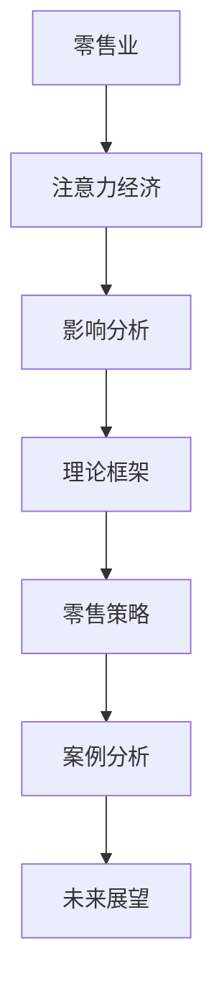

                 

# 文章标题

《注意力经济对传统零售业的冲击》

## 关键词

- 注意力经济
- 传统零售业
- 数字化转型
- 社交媒体
- 个性化营销
- 消费者行为

## 摘要

本文深入探讨了注意力经济对传统零售业的冲击。首先，我们介绍了零售业与注意力经济的背景与概念，阐述了注意力经济与传统零售业的区别和主要特点。接着，我们分析了注意力经济对零售业的影响，包括面临的挑战、消费者行为的变化以及应对策略。随后，我们构建了注意力经济的理论框架，包括基本原理、理论模型等。在此基础上，我们探讨了零售业在注意力经济下的数字化转型策略、社交媒体与个性化营销的应用。通过具体案例分析，我们总结了大型零售企业和中小零售企业在注意力经济中的实践成果与经验。最后，我们对注意力经济的未来趋势进行了展望，提出了零售业应如何应对注意力经济的挑战，并强调了可持续发展的重要性。

### 《注意力经济对传统零售业的冲击》目录大纲

#### 第一部分：背景与概念

## 第一部分：背景与概念

### 第1章：零售业与注意力经济

#### 1.1 零售业概述

零售业是商品和服务从生产者到消费者的中间环节，涉及商品销售、物流配送、售后服务等多个方面。零售业的发展对经济增长和社会就业具有重要意义。

#### 1.2 注意力经济的起源与定义

注意力经济是指在信息过载的时代，消费者注意力成为稀缺资源，品牌和零售企业通过吸引和保持消费者注意力来获取商业成功的一种经济形态。

#### 1.3 注意力经济与传统零售业的区别

注意力经济与传统零售业的区别主要体现在关注点、目标和方法上。传统零售业更注重商品质量和价格，而注意力经济则更注重吸引消费者的注意力。

#### 1.4 注意力经济的主要特点

注意力经济的主要特点包括：1）消费者注意力成为稀缺资源；2）品牌竞争加剧；3）数字化转型成为趋势；4）个性化营销受到重视。

### 第2章：注意力经济对零售业的影响

#### 2.1 零售业的挑战

随着互联网和社交媒体的快速发展，零售业面临着消费者注意力分散、竞争加剧、成本上升等挑战。

#### 2.2 注意力经济对零售业的影响

注意力经济对零售业的影响主要表现在消费者行为变化、零售模式创新、市场营销策略调整等方面。

#### 2.3 注意力经济下的消费者行为变化

注意力经济下的消费者行为变化包括：1）更注重个性化体验；2）偏好快速消费；3）关注品牌口碑；4）倾向于线上购物。

### 第二部分：注意力经济的理论框架

## 第二部分：注意力经济的理论框架

### 第3章：注意力经济学基本原理

#### 3.1 注意力资源的稀缺性

注意力资源是一种有限的资源，人们每天只能集中有限的注意力。因此，在信息爆炸的时代，如何有效地吸引和保持消费者的注意力成为一个关键问题。

#### 3.2 注意力分配的规律

注意力分配遵循贝勃定律，即对数量相同的资源，人们对其分配的注意力与资源数量成反比。

#### 3.3 注意力市场的形成

注意力市场的形成受到信息传播渠道、消费者偏好、市场竞争等因素的影响。

### 第4章：注意力经济的理论模型

#### 4.1 基于注意力的消费者选择模型

消费者在选择产品时，会根据自己的注意力资源分配决策。注意力资源越丰富，消费者能考虑的选择范围越广。

#### 4.2 基于注意力的市场竞争模型

在注意力市场中，品牌和零售企业之间的竞争实质上是对消费者注意力的争夺。

#### 4.3 基于注意力的定价模型

基于注意力的定价模型考虑了消费者注意力的稀缺性和品牌竞争的影响，为零售企业提供了一种新的定价策略。

### 第三部分：注意力经济下的零售策略

## 第三部分：注意力经济下的零售策略

### 第5章：零售业的数字化转型

#### 5.1 数字化转型的意义

数字化转型对零售业具有重要意义，有助于提高运营效率、优化消费者体验、提升市场竞争力。

#### 5.2 数字化转型的策略

零售企业在数字化转型过程中，应关注技术选型、数据驱动、用户体验等方面。

#### 5.3 数字化转型中的注意力策略

数字化转型中的注意力策略包括：1）利用大数据分析精准定位消费者；2）通过人工智能技术提升服务效率；3）借助社交媒体扩大品牌影响力。

### 第6章：社交媒体与注意力经济

#### 6.1 社交媒体对零售业的影响

社交媒体已成为零售业的重要渠道，对消费者行为、市场营销、品牌形象等方面产生深远影响。

#### 6.2 社交媒体营销策略

社交媒体营销策略应注重内容创意、用户互动、数据分析等方面。

#### 6.3 社交媒体中的注意力获取与保持

零售企业需通过吸引消费者注意力、提升内容质量、增加互动体验等方式，保持社交媒体中的注意力。

### 第7章：个性化营销与注意力经济

#### 7.1 个性化营销的基本原理

个性化营销是基于消费者行为和偏好，提供个性化的产品和服务，以提高注意力和销售额。

#### 7.2 个性化营销的技术手段

个性化营销的技术手段包括大数据分析、人工智能、云计算等。

#### 7.3 个性化营销中的注意力管理

个性化营销中的注意力管理包括：1）精准定位消费者；2）优化内容展示；3）提升用户体验。

### 第四部分：案例分析

## 第四部分：案例分析

### 第8章：大型零售企业的注意力经济实践

#### 8.1 案例背景

分析某大型零售企业在注意力经济中的实践，探讨其策略和成果。

#### 8.2 注意力经济策略分析

分析大型零售企业在注意力经济中的具体策略，如社交媒体营销、个性化推荐等。

#### 8.3 实践成果与经验总结

总结大型零售企业在注意力经济实践中的成果和经验，为其他企业提供借鉴。

### 第9章：中小零售企业的注意力经济实践

#### 9.1 案例背景

分析某中小零售企业在注意力经济中的实践，探讨其策略和成果。

#### 9.2 注意力经济策略分析

分析中小零售企业在注意力经济中的具体策略，如内容营销、社区运营等。

#### 9.3 实践成果与经验总结

总结中小零售企业在注意力经济实践中的成果和经验，为其他企业提供借鉴。

### 第五部分：未来展望

## 第五部分：未来展望

### 第10章：注意力经济的未来趋势

#### 10.1 注意力经济的未来发展趋势

分析注意力经济的未来发展趋势，如个性化、智能化、可持续化等。

#### 10.2 零售业应对策略

探讨零售业应如何应对注意力经济的挑战，如提升创新能力、优化用户体验、加强社会责任等。

#### 10.3 注意力经济下的消费者权益保护

关注注意力经济下消费者权益保护的问题，如隐私保护、信息透明等。

### 第11章：注意力经济与可持续发展

#### 11.1 可持续发展的概念

阐述可持续发展的概念和重要性。

#### 11.2 注意力经济与可持续发展的关系

分析注意力经济与可持续发展之间的关系，如环境保护、社会责任等。

#### 11.3 可持续发展的实践案例

介绍注意力经济在可持续发展领域的实践案例，如绿色营销、环保行动等。

### 附录

## 附录

### 附录A：注意力经济相关术语表

列举注意力经济相关术语及其解释。

### 附录B：注意力经济研究论文列表

列出注意力经济领域的研究论文，便于读者进一步了解。

### 附录C：参考文献

列出本文引用的文献，确保文章的学术严谨性。

### Mermaid 流程图：

### 第1章：零售业与注意力经济

#### 1.1 零售业概述

零售业是一个庞大而复杂的行业，涵盖了从商品的生产、分销到销售的各个环节。它不仅涉及商品的买卖，还包括物流、库存管理、客户服务等。在全球范围内，零售业对经济发展起着至关重要的作用。据联合国贸易和发展会议（UNCTAD）的数据，零售业在全球GDP中占据了相当大的比例，并且在创造就业方面也具有显著的作用。

零售业的定义涵盖了所有类型的销售活动，包括实体店销售、在线购物、批发和零售。实体店销售指的是消费者在实体店铺内购买商品的过程，如超市、百货商场和专卖店。在线购物则是通过电子商务网站或移动应用程序进行商品购买，这一模式在近年来迅速发展，尤其是随着移动互联网的普及。批发和零售则是指企业将商品批量销售给其他商家或零售商，而零售商则将这些商品分批销售给最终消费者。

零售业的主要功能包括：

1. **商品供应**：零售业确保商品能够及时供应给消费者，以满足他们的需求。
2. **商品展示**：零售业通过展示商品，帮助消费者了解商品的特点和功能，从而促进销售。
3. **客户服务**：零售业提供优质的客户服务，包括售后服务、客户咨询等，以提高客户满意度和忠诚度。
4. **市场调研**：零售业通过市场调研收集消费者偏好、购买习惯等信息，以指导商品采购和营销策略。

零售业的发展对经济增长和社会就业具有重要意义。首先，零售业是经济增长的重要驱动力。通过创造就业机会，促进消费，零售业对GDP的增长做出了巨大贡献。其次，零售业为社会提供了多样化的就业机会，包括销售员、库存管理员、物流人员、市场营销专员等。此外，零售业还推动了相关行业的发展，如物流、电子商务、广告等。

#### 1.2 注意力经济的起源与定义

注意力经济这一概念起源于20世纪90年代，随着互联网的兴起和信息爆炸时代的到来，人们开始意识到注意力成为一种稀缺资源。在传统的经济学中，资源通常指的是土地、劳动力、资本等，而在注意力经济中，注意力本身被视为一种特殊的资源。这一概念最早由美国经济学家理查德·塞勒（Richard Thaler）和心理学家丹尼尔·卡内曼（Daniel Kahneman）在他们的著作中提出。

注意力经济的定义可以理解为：在信息过载的环境中，消费者注意力成为稀缺资源，品牌和零售企业通过吸引和保持消费者注意力来获取商业成功的一种经济形态。具体来说，注意力经济关注的是如何有效地利用有限的注意力资源来促进产品的销售、提升品牌知名度和增强消费者忠诚度。

注意力经济的核心思想在于，消费者的注意力是有限的，他们无法处理海量的信息。因此，零售企业需要通过创新和有效的策略来吸引和保持消费者的注意力。这包括：

1. **内容创新**：创造引人注目的、有价值的内容，以吸引消费者的注意力。
2. **用户体验**：提供优质的购物体验，包括便捷的购物流程、优质的客户服务等。
3. **个性化营销**：根据消费者的行为和偏好，提供个性化的产品和服务，以提高消费者的满意度和忠诚度。
4. **技术创新**：利用大数据、人工智能等技术手段，实现精准营销和个性化推荐。

#### 1.3 注意力经济与传统零售业的区别

注意力经济与传统零售业在多个方面存在显著的区别：

1. **关注点**：传统零售业主要关注商品的质量、价格和渠道，而注意力经济则更关注如何吸引和保持消费者的注意力。

2. **目标**：传统零售业的直接目标是实现销售额，而注意力经济则更注重建立品牌影响力、提高消费者忠诚度。

3. **方法**：传统零售业主要依赖于广告宣传和促销活动来吸引消费者，而注意力经济则更倾向于通过创造有价值的内容、提供个性化的服务和利用社交媒体来吸引消费者。

4. **消费者行为**：在注意力经济中，消费者的行为更加个性化、碎片化和即时化，他们更倾向于通过线上渠道获取信息、进行比较和购买。

5. **技术依赖**：注意力经济高度依赖技术和数据，通过大数据分析和人工智能技术来实现精准营销和个性化推荐。

#### 1.4 注意力经济的主要特点

注意力经济具有以下几个主要特点：

1. **注意力稀缺**：在信息过载的时代，消费者的注意力是有限的，零售企业需要通过有效的策略来吸引和保持消费者的注意力。

2. **个性化**：消费者越来越注重个性化体验，零售企业需要根据消费者的行为和偏好提供个性化的产品和服务。

3. **快速变化**：由于信息传播速度快，消费者的注意力很容易转移，零售企业需要不断创新和适应市场的变化。

4. **互动性**：社交媒体和在线平台的兴起，使得消费者和零售企业之间的互动更加频繁和直接，零售企业需要通过互动来吸引和保持消费者的注意力。

5. **数据驱动**：大数据和人工智能技术成为零售企业吸引和保持消费者注意力的关键，通过分析消费者行为数据，零售企业可以实现精准营销和个性化推荐。

### 第2章：注意力经济对零售业的影响

#### 2.1 零售业的挑战

随着互联网和社交媒体的快速发展，零售业面临着前所未有的挑战。这些挑战不仅来自技术变革，还来自消费者行为的变化和市场环境的复杂性。

1. **消费者注意力分散**：在信息爆炸的时代，消费者的注意力被海量的信息所分散。这使得零售企业难以通过传统广告和促销手段吸引消费者的注意力。

2. **竞争加剧**：随着电子商务的兴起，越来越多的零售企业进入市场，竞争愈发激烈。零售企业需要不断创新和提升服务质量，以吸引和留住消费者。

3. **成本上升**：物流、仓储、人力等成本不断上升，压缩了零售企业的利润空间。同时，消费者对价格敏感度提高，零售企业需要在成本控制和价格竞争力之间找到平衡。

4. **消费者需求多样化**：消费者需求日益多样化，零售企业需要提供更多的产品和服务来满足不同消费者的需求。这要求企业具备更高的灵活性和创新能力。

5. **可持续发展的压力**：随着环保意识的提高，消费者对零售企业的可持续发展要求越来越高。企业需要采取环保措施，提高资源利用效率，减少碳排放。

#### 2.2 注意力经济对零售业的影响

注意力经济对零售业产生了深远的影响，主要体现在以下几个方面：

1. **消费者行为变化**：注意力经济改变了消费者的购买行为。消费者更加注重购物体验、品牌形象和个性化服务。他们更倾向于通过线上渠道获取信息、进行比较和购买。

2. **零售模式创新**：为了吸引消费者的注意力，零售企业不断创新零售模式。例如，无人商店、沉浸式体验店、虚拟现实购物等，以满足消费者对购物体验的需求。

3. **市场营销策略调整**：注意力经济要求零售企业采取更加精准和个性化的市场营销策略。通过大数据分析和人工智能技术，企业可以实现精准营销和个性化推荐，提高营销效果。

4. **渠道整合**：注意力经济促使零售企业整合线上线下渠道，提供无缝购物体验。例如，消费者可以在线上下单，然后选择到店自提或送货上门。

5. **成本优化**：通过注意力经济，零售企业可以更有效地分配资源，优化运营成本。例如，通过大数据分析，企业可以更准确地预测市场需求，减少库存和物流成本。

#### 2.3 注意力经济下的消费者行为变化

注意力经济对消费者行为产生了显著的影响，主要表现在以下几个方面：

1. **个性化体验需求增加**：消费者越来越注重个性化的购物体验，他们希望零售企业提供符合自己需求和喜好的产品和服务。

2. **碎片化购物行为**：由于注意力分散，消费者更倾向于进行碎片化购物，通过多个渠道和平台购买商品。

3. **即时性需求**：消费者对购物即时性的要求越来越高，他们希望能够快速获取商品和服务。

4. **口碑和推荐的重要性**：在注意力经济中，消费者更加依赖口碑和推荐来做出购买决策，品牌和零售企业的口碑管理变得至关重要。

5. **社交媒体影响**：社交媒体成为消费者获取购物信息和推荐的重要渠道，零售企业需要通过社交媒体与消费者建立联系，吸引和保持消费者的注意力。

### 第3章：注意力经济学基本原理

#### 3.1 注意力资源的稀缺性

注意力资源是一种有限的资源，人们每天只能集中有限的注意力。在信息爆炸的时代，如何有效地吸引和保持消费者的注意力成为一个关键问题。注意力资源的稀缺性体现在以下几个方面：

1. **时间有限**：消费者的时间是有限的，他们无法同时处理海量的信息。因此，零售企业需要通过有效的策略来吸引消费者的注意力，提高信息传递的效率。

2. **精力有限**：消费者的精力也是有限的，长时间的关注和集中注意力会消耗精力。零售企业需要提供有吸引力的内容和体验，以吸引消费者的注意力。

3. **情感投入有限**：消费者的情感投入也是有限的，过多的情感投入会导致疲劳和抵触。零售企业需要创造有共鸣的情感体验，以吸引消费者的情感投入。

注意力资源的稀缺性使得零售企业必须更加重视如何吸引和保持消费者的注意力。以下是一些策略：

1. **内容创新**：通过创造有价值、有趣和引人注目的内容，吸引消费者的注意力。例如，利用短视频、直播、沉浸式体验等新颖的形式。

2. **用户体验**：提供优质的购物体验，包括便捷的购物流程、优质的客户服务、舒适的购物环境等，以吸引消费者的情感投入。

3. **个性化服务**：根据消费者的行为和偏好，提供个性化的产品和服务，提高消费者的满意度和忠诚度。

4. **技术创新**：利用大数据、人工智能等技术手段，实现精准营销和个性化推荐，提高营销效果。

#### 3.2 注意力分配的规律

注意力分配遵循贝勃定律，即对数量相同的资源，人们对其分配的注意力与资源数量成反比。这意味着，当资源数量增加时，人们对其分配的注意力会减少。例如，如果消费者面临多个商品选择，他们对每个商品的关注度会降低。

贝勃定律对零售业有重要启示：

1. **资源优化**：零售企业需要优化资源分配，将注意力集中在最具潜力的产品或服务上。通过大数据分析和市场调研，企业可以了解消费者的偏好，从而更好地分配注意力资源。

2. **减少信息过载**：零售企业需要减少信息过载，避免消费者在过多的信息中迷失。通过精简内容、突出重点，企业可以提高信息传递的效率。

3. **提升用户体验**：通过提供简洁、直观的用户界面和购物体验，零售企业可以提高消费者的满意度，吸引更多的注意力资源。

#### 3.3 注意力市场的形成

注意力市场的形成受到多种因素的影响，包括信息传播渠道、消费者偏好、市场竞争等。

1. **信息传播渠道**：随着互联网和社交媒体的兴起，信息传播渠道多样化。零售企业需要通过多种渠道，如社交媒体、电子邮件、广告等，吸引消费者的注意力。

2. **消费者偏好**：消费者的偏好直接影响注意力市场的形成。零售企业需要了解消费者的需求和偏好，提供符合消费者期望的产品和服务。

3. **市场竞争**：在激烈的市场竞争中，零售企业需要通过创新和有效的策略吸引消费者的注意力。这包括提供独特的产品、优质的服务、创新的购物体验等。

注意力市场的形成对零售业有重要影响：

1. **市场竞争加剧**：在注意力市场中，品牌和零售企业之间的竞争实质上是对消费者注意力的争夺。企业需要不断创新和优化策略，以吸引消费者的注意力。

2. **个性化服务需求**：消费者对个性化服务的需求日益增加，零售企业需要根据消费者的行为和偏好提供个性化的产品和服务，以提高消费者的满意度和忠诚度。

3. **营销策略调整**：零售企业需要调整营销策略，从传统的广告宣传转向更加精准和个性化的营销手段，如大数据分析、人工智能等。

### 第4章：注意力经济的理论模型

#### 4.1 基于注意力的消费者选择模型

在注意力经济中，消费者的选择过程受到注意力资源的限制。基于注意力的消费者选择模型旨在解释消费者如何在有限的注意力资源下做出购买决策。

1. **消费者选择模型的基本假设**：

   - 消费者面临多个商品选择。
   - 注意力资源是有限的，消费者无法同时关注所有商品。
   - 消费者根据商品的信息价值和吸引力来分配注意力资源。
   - 消费者最终选择具有最高价值或最大吸引力的商品。

2. **模型描述**：

   基于注意力的消费者选择模型可以用以下步骤描述：

   - **信息获取**：消费者通过多种渠道（如广告、社交媒体、朋友推荐等）获取商品信息。
   - **注意力分配**：消费者根据商品的信息价值和吸引力，将注意力资源分配给不同的商品。注意力分配遵循贝勃定律，即对数量相同的商品，消费者对其分配的注意力与商品数量成反比。
   - **评估与决策**：消费者对分配注意力的商品进行评估，根据商品的性能、价格、品牌等因素做出购买决策。
   - **购买行为**：消费者选择具有最高价值或最大吸引力的商品进行购买。

3. **模型应用**：

   基于注意力的消费者选择模型在零售业中具有广泛的应用。例如：

   - **市场调研**：企业可以通过分析消费者注意力分配情况，了解消费者对商品的关注程度和偏好，从而优化产品设计和营销策略。
   - **广告投放**：企业可以根据消费者注意力分配模型，选择最有效的广告投放渠道和时机，以提高广告效果。
   - **个性化推荐**：企业可以利用注意力分配模型，根据消费者的行为和偏好，提供个性化的产品推荐，提高购买转化率。

#### 4.2 基于注意力的市场竞争模型

在注意力经济中，市场竞争的本质是对消费者注意力的争夺。基于注意力的市场竞争模型旨在解释企业在竞争中的策略选择和竞争优势。

1. **市场竞争模型的基本假设**：

   - 市场中存在多个竞争者。
   - 竞争者的目标是通过吸引消费者的注意力来获取市场份额。
   - 竞争者的策略包括产品定位、广告投放、用户体验等。
   - 消费者的注意力资源是有限的，竞争者需要通过有效策略来吸引和保持消费者的注意力。

2. **模型描述**：

   基于注意力的市场竞争模型可以用以下步骤描述：

   - **市场分析**：企业分析市场竞争态势，了解竞争对手的定位、策略和消费者反应。
   - **策略制定**：企业根据市场分析结果，制定相应的市场竞争策略，包括产品定位、广告投放、用户体验等。
   - **注意力分配**：企业通过有效的策略，将注意力资源分配给不同的竞争者，以吸引消费者的注意力。
   - **竞争反应**：消费者根据注意力分配情况，对不同的竞争者做出反应，选择具有最高价值或最大吸引力的竞争者。
   - **竞争优势**：通过不断优化策略，企业提升自身的竞争优势，以保持消费者的注意力。

3. **模型应用**：

   基于注意力的市场竞争模型在零售业中具有广泛的应用。例如：

   - **市场定位**：企业可以通过分析消费者注意力分配情况，选择最适合自身品牌定位的市场细分领域。
   - **广告策略**：企业可以根据注意力分配模型，选择最有效的广告投放渠道和内容，以吸引消费者的注意力。
   - **用户体验优化**：企业可以通过优化购物流程、提供优质的客户服务，提高消费者的满意度，从而保持消费者的注意力。

#### 4.3 基于注意力的定价模型

在注意力经济中，定价策略不仅取决于商品的价值和成本，还受到消费者注意力的稀缺性和市场竞争的影响。基于注意力的定价模型旨在解释如何通过定价策略吸引消费者的注意力，从而提高市场份额和利润。

1. **定价模型的基本假设**：

   - 消费者对商品的价值感知受到注意力资源的影响。
   - 竞争者的定价策略会影响消费者对商品的价值感知。
   - 注意力资源的稀缺性导致消费者对高价值商品的需求更敏感。

2. **模型描述**：

   基于注意力的定价模型可以用以下步骤描述：

   - **价值评估**：消费者根据商品的性能、品牌、用户体验等因素，对商品的价值进行评估。
   - **注意力稀缺性调整**：考虑消费者注意力的稀缺性，对商品的价值评估进行调整。例如，对于高关注度的商品，消费者可能愿意支付更高的价格。
   - **竞争分析**：分析竞争对手的定价策略，了解市场竞争态势。
   - **定价决策**：企业根据价值评估、注意力稀缺性和竞争分析，制定合理的定价策略。例如，对于高关注度的商品，可以采用高价策略以吸引消费者的注意力。

3. **模型应用**：

   基于注意力的定价模型在零售业中具有广泛的应用。例如：

   - **新产品定价**：企业可以通过基于注意力的定价模型，确定新产品的初始价格，以吸引消费者的注意力。
   - **促销策略**：企业可以通过调整定价策略，吸引消费者的注意力。例如，对于高关注度的商品，可以采用限时折扣、捆绑销售等方式吸引消费者购买。
   - **市场定位**：企业可以通过定价策略调整，吸引目标市场的消费者注意力，从而提升市场份额。

### 第5章：零售业的数字化转型

#### 5.1 数字化转型的意义

数字化转型是零售业发展的必然趋势，对于企业来说具有重要意义。以下是数字化转型在零售业中的几个关键意义：

1. **提升运营效率**：通过数字化技术，零售企业可以自动化和优化各种业务流程，如库存管理、订单处理、物流配送等。这有助于提高运营效率，降低运营成本。

2. **优化消费者体验**：数字化转型使得零售企业能够提供更加个性化、便捷和高效的购物体验。通过数据分析、人工智能等技术，企业可以更好地了解消费者的需求和偏好，从而提供个性化的产品和服务。

3. **增强市场竞争力**：在激烈的市场竞争中，数字化转型是企业保持竞争优势的重要手段。通过利用大数据、人工智能等技术，企业可以更精准地定位目标市场，实施有效的营销策略，提高市场份额。

4. **促进创新**：数字化转型为企业提供了广阔的创新空间。通过数字化技术，企业可以探索新的商业模式、产品和服务，以满足消费者的不断变化的需求。

5. **提高数据洞察力**：数字化转型使得零售企业能够收集和分析大量的数据，从而获得更深入的市场洞察。这有助于企业更好地了解市场趋势、消费者行为，为决策提供有力的支持。

6. **实现可持续发展**：数字化转型有助于企业实现可持续发展。通过优化资源配置、减少浪费、提高能源利用效率等，企业可以降低环境影响，实现绿色运营。

#### 5.2 数字化转型的策略

为了实现数字化转型，零售企业需要制定并实施一系列策略。以下是一些关键策略：

1. **技术选型**：企业需要根据业务需求和行业趋势，选择合适的数字化技术，如大数据分析、人工智能、云计算、物联网等。技术选型应考虑技术的成熟度、成本效益和可扩展性。

2. **数据驱动**：企业应建立数据驱动的决策体系，通过收集、存储、分析和利用数据，实现业务优化和个性化服务。数据驱动的策略包括实时数据分析、预测分析、客户细分等。

3. **用户体验优化**：企业应关注消费者的购物体验，通过数字化技术提供个性化、便捷和无缝的购物体验。用户体验优化包括优化购物流程、提供个性化的推荐、提升客户服务等。

4. **组织变革**：数字化转型要求企业进行组织变革，建立跨部门协作、敏捷开发和快速响应的市场机制。组织变革包括调整组织结构、优化工作流程、培养数字化人才等。

5. **外部合作**：企业可以通过与外部合作伙伴（如技术供应商、电商平台等）合作，共同推进数字化转型。外部合作有助于企业获取新技术、拓展市场和提升竞争力。

6. **持续创新**：企业应保持持续创新的心态，不断探索新的数字化应用场景和商业模式。通过持续创新，企业可以保持市场竞争力，满足消费者的需求变化。

#### 5.3 数字化转型中的注意力策略

在数字化转型过程中，零售企业需要关注如何吸引和保持消费者的注意力。以下是一些关键注意力策略：

1. **内容营销**：通过创造有价值、有趣和引人注目的内容，吸引消费者的注意力。内容营销包括博客文章、视频、社交媒体帖子等。

2. **社交媒体运营**：利用社交媒体平台（如微信、微博、抖音等）与消费者互动，提高品牌知名度和用户参与度。

3. **个性化推荐**：通过大数据分析和人工智能技术，根据消费者的行为和偏好，提供个性化的产品推荐，提高购买转化率。

4. **沉浸式体验**：利用虚拟现实（VR）、增强现实（AR）等技术，创造沉浸式的购物体验，吸引消费者的注意力。

5. **互动式营销**：通过互动式营销活动（如抽奖、答题、游戏等），提高消费者的参与度和忠诚度。

6. **数据分析**：通过数据分析，了解消费者的注意力分配情况，优化营销策略和产品推荐，提高营销效果。

### 第6章：社交媒体与注意力经济

#### 6.1 社交媒体对零售业的影响

社交媒体在零售业中的应用越来越广泛，对零售业产生了深远的影响。以下是社交媒体对零售业的几个关键影响：

1. **品牌推广**：社交媒体为零售企业提供了一个强大的品牌推广平台。通过在社交媒体平台上发布有趣、有价值的内容，企业可以吸引更多的关注者，提高品牌知名度。

2. **消费者互动**：社交媒体使零售企业能够与消费者建立更紧密的互动关系。企业可以通过社交媒体平台与消费者进行实时交流，了解消费者的需求和反馈，提供个性化的服务和解决方案。

3. **市场调研**：社交媒体为零售企业提供了一个实时、广泛的市场调研工具。企业可以通过分析社交媒体上的消费者行为和反馈，了解市场趋势、消费者偏好和竞争态势，从而优化产品和服务。

4. **销售渠道拓展**：社交媒体成为零售企业拓展销售渠道的重要途径。通过社交媒体平台，企业可以直接向消费者销售产品，实现线上线下融合的购物体验。

5. **客户服务**：社交媒体为零售企业提供了更便捷、高效的客户服务渠道。企业可以通过社交媒体平台解答消费者的问题、处理投诉，提高客户满意度和忠诚度。

6. **内容营销**：社交媒体为零售企业提供了丰富的内容营销工具。通过发布短视频、博客文章、社交媒体帖子等，企业可以吸引消费者的注意力，提高产品曝光率。

7. **用户推荐**：社交媒体上的用户推荐对消费者的购买决策具有重要影响。消费者在社交媒体上分享购物经验、推荐商品，可以影响其他消费者的购买行为。

#### 6.2 社交媒体营销策略

为了有效利用社交媒体，零售企业需要制定并实施一系列社交媒体营销策略。以下是几个关键策略：

1. **内容策略**：企业应制定内容策略，创造有价值、有趣和引人注目的内容。内容应贴近消费者的需求和兴趣，以提高用户参与度和分享率。

2. **社交媒体选择**：企业应根据目标市场和消费者习惯，选择合适的社交媒体平台。例如，对于年轻消费者，抖音、快手等短视频平台可能是更好的选择；对于注重品牌形象的企业，微信公众号、微博等平台可能更合适。

3. **互动策略**：企业应积极参与社交媒体互动，与消费者进行实时交流。通过回复评论、参与话题讨论、举办线上活动等，企业可以增强与消费者的互动，提高用户忠诚度。

4. **数据分析**：企业应利用数据分析工具，监控社交媒体营销的效果。通过分析用户行为、参与度、转化率等指标，企业可以优化营销策略，提高营销效果。

5. **广告投放**：企业可以通过社交媒体广告，扩大品牌影响力，吸引潜在客户。广告应精准定位目标受众，提高广告投放的性价比。

6. **用户推荐**：企业可以通过激励用户分享、推荐商品，提高口碑传播效果。例如，提供优惠券、积分奖励等，鼓励用户在社交媒体上分享购物体验。

7. **直播带货**：随着直播带货的兴起，企业可以通过直播与消费者互动，实时展示产品，提高购买转化率。

#### 6.3 社交媒体中的注意力获取与保持

在社交媒体中，获取和保持消费者的注意力是零售企业的关键挑战。以下是几种有效的注意力获取与保持策略：

1. **内容创新**：通过创造独特、有价值、有趣的内容，吸引消费者的注意力。内容可以包括短视频、动画、漫画、真人出镜等，以增加趣味性和互动性。

2. **热点话题**：紧跟热点话题和时事新闻，结合自身品牌和产品，发布相关内容，提高话题性和关注度。

3. **互动式营销**：通过互动式营销活动，如抽奖、问答、投票等，提高用户的参与度和粘性。

4. **个性化推荐**：通过大数据分析和人工智能技术，根据消费者的兴趣和行为，提供个性化的内容推荐，提高内容的相关性和吸引力。

5. **视觉设计**：优化社交媒体页面和内容的设计，使用高质量的图片、视频和动画，提高视觉吸引力。

6. **直播互动**：通过直播与消费者实时互动，增加消费者的参与感和互动性，提高注意力。

7. **用户体验**：提供优质的社交媒体体验，如简洁的界面、快速的加载速度、便捷的购物流程等，以提高用户满意度和忠诚度。

### 第7章：个性化营销与注意力经济

#### 7.1 个性化营销的基本原理

个性化营销是一种以消费者为中心的营销策略，旨在根据消费者的行为和偏好，提供个性化的产品和服务，以提高顾客满意度和忠诚度。个性化营销的基本原理包括以下几点：

1. **消费者细分**：通过数据分析和技术手段，将消费者划分为不同的细分市场。这些细分可以根据消费者的年龄、性别、收入、地理位置、购买历史等因素进行划分。

2. **行为分析**：收集和分析消费者的行为数据，如浏览历史、购买记录、搜索关键词等，以了解消费者的需求和偏好。

3. **定制化内容**：根据消费者的细分和需求分析，提供个性化的内容，如产品推荐、促销信息、营销邮件等。

4. **互动式体验**：通过互动式营销活动，如定制化促销、个性化推荐、互动游戏等，提高消费者的参与度和忠诚度。

5. **精准营销**：利用大数据和人工智能技术，实现精准营销，提高营销效果和转化率。

6. **客户关系管理**：通过建立和维护与消费者的长期关系，提供个性化的服务和解决方案，以提高客户满意度和忠诚度。

#### 7.2 个性化营销的技术手段

个性化营销的成功依赖于先进的技术手段，以下是一些关键技术：

1. **大数据分析**：通过收集和分析大量的消费者数据，企业可以了解消费者的行为和偏好，从而提供个性化的产品和服务。

2. **人工智能**：人工智能技术可以帮助企业实现自动化、智能化的个性化推荐和营销策略。例如，通过机器学习算法，企业可以预测消费者的购买行为，提供个性化的产品推荐。

3. **机器学习**：机器学习技术可以用于消费者行为分析、市场预测、个性化推荐等方面，帮助企业优化营销策略。

4. **自然语言处理**：自然语言处理技术可以帮助企业理解消费者的语言和情感，从而提供更个性化的服务。例如，通过聊天机器人，企业可以与消费者进行自然的对话，提供个性化的建议和解决方案。

5. **用户画像**：通过构建用户画像，企业可以深入了解消费者的需求和偏好，从而提供更个性化的产品和服务。

6. **物联网**：物联网技术可以帮助企业实现智能化的供应链管理、个性化配送等，提高消费者的购物体验。

7. **个性化推荐系统**：个性化推荐系统可以根据消费者的行为和偏好，提供个性化的产品推荐，提高购买转化率。

#### 7.3 个性化营销中的注意力管理

在个性化营销中，注意力管理是关键的一环。以下是几种有效的注意力管理策略：

1. **内容优化**：通过优化内容，提高内容的吸引力，吸引消费者的注意力。例如，使用高质量的图片、视频和动画，提高内容的视觉效果。

2. **精准定位**：通过大数据分析和人工智能技术，精准定位目标消费者，确保营销内容能够有效地传达给目标受众。

3. **个性化推荐**：利用个性化推荐系统，根据消费者的行为和偏好，提供个性化的产品推荐，提高购买转化率。

4. **互动式营销**：通过互动式营销活动，如定制化促销、互动游戏等，提高消费者的参与度和忠诚度。

5. **情感共鸣**：通过情感共鸣，建立与消费者的情感连接，提高消费者的忠诚度。

6. **用户体验**：提供优质的用户体验，如便捷的购物流程、快速的配送等，提高消费者的满意度和忠诚度。

7. **数据分析**：通过数据分析，了解消费者的注意力分配情况，优化营销策略，提高营销效果。

### 第8章：大型零售企业的注意力经济实践

#### 8.1 案例背景

以某全球知名的大型零售企业为例，该企业通过注意力经济策略，实现了显著的商业成功。以下是该企业的案例背景：

1. **企业背景**：该企业是一家全球知名的零售企业，主要从事服装、家居、电子产品等多元化产品的销售。

2. **市场地位**：该企业在全球范围内拥有广泛的门店网络和线上电商平台，市场份额领先。

3. **挑战**：在注意力经济时代，该企业面临着消费者注意力分散、竞争加剧、成本上升等挑战。

4. **目标**：通过注意力经济策略，该企业旨在提升品牌知名度、增加市场份额、提高客户忠诚度。

#### 8.2 注意力经济策略分析

该企业采取了一系列注意力经济策略，以吸引和保持消费者的注意力：

1. **内容营销**：该企业通过在社交媒体平台上发布有趣、有价值的内容，如时尚趋势、生活方式等，吸引消费者的关注。同时，通过博客、视频、直播等形式，提供丰富的购物体验。

2. **社交媒体运营**：该企业积极运营社交媒体账号，与消费者进行实时互动，了解消费者需求和反馈。通过回复评论、参与话题讨论、举办线上活动等，提高用户参与度和忠诚度。

3. **个性化推荐**：利用大数据分析和人工智能技术，该企业根据消费者的行为和偏好，提供个性化的产品推荐。例如，通过个性化推荐系统，为消费者推荐符合其喜好的商品。

4. **沉浸式体验**：通过虚拟现实（VR）和增强现实（AR）技术，该企业创造沉浸式的购物体验。消费者可以通过VR/AR技术，在线体验商品的细节和效果，提高购买欲望。

5. **互动式营销**：该企业通过互动式营销活动，如抽奖、答题、互动游戏等，提高消费者的参与度和忠诚度。例如，在特定节日或促销活动中，举办线上互动游戏，吸引消费者参与。

6. **数据分析**：该企业通过数据分析，了解消费者的注意力分配情况，优化营销策略。通过分析消费者行为数据，企业可以精准定位目标市场，提高营销效果。

#### 8.3 实践成果与经验总结

通过注意力经济策略，该企业取得了显著的实践成果：

1. **品牌知名度提升**：通过社交媒体运营和内容营销，该企业的品牌知名度得到了显著提升。社交媒体粉丝数量和品牌提及度不断增加。

2. **市场份额增加**：通过个性化推荐和沉浸式体验，该企业的市场份额得到了扩大。在线销售额持续增长，电商渠道的占比不断提高。

3. **客户忠诚度提高**：通过互动式营销和优质的客户服务，该企业的客户忠诚度得到了提高。客户复购率增加，客户满意度上升。

4. **营销效果优化**：通过数据分析，该企业不断优化营销策略，提高了营销效果和转化率。广告投放的性价比得到提升。

5. **用户体验优化**：通过沉浸式体验和便捷的购物流程，该企业的用户体验得到了优化。消费者满意度提高，口碑传播效果增强。

6. **可持续发展**：通过注重环保和社会责任，该企业在可持续发展方面取得了积极成果。绿色产品和环保举措受到消费者的认可。

经验总结：

1. **内容为王**：创造有价值、有趣、引人注目的内容是吸引消费者注意力的关键。

2. **个性化服务**：根据消费者的行为和偏好，提供个性化的产品和服务，提高消费者的满意度和忠诚度。

3. **互动式营销**：通过互动式营销活动，提高消费者的参与度和忠诚度。

4. **数据分析**：通过数据分析，了解消费者的注意力分配情况，优化营销策略。

5. **技术驱动**：利用大数据、人工智能等技术手段，实现精准营销和个性化推荐。

6. **社会责任**：注重环保和社会责任，实现可持续发展。

### 第9章：中小零售企业的注意力经济实践

#### 9.1 案例背景

以某中小型零售企业为例，该企业通过注意力经济策略，在竞争激烈的市场中取得了成功。以下是该企业的案例背景：

1. **企业背景**：该企业是一家经营特色美食的小型零售店，位于城市中心商业区。

2. **市场地位**：虽然企业规模较小，但在本地市场拥有较高的知名度和口碑。

3. **挑战**：面对大型连锁超市和线上电商的竞争，该企业面临消费者注意力分散、市场份额有限等挑战。

4. **目标**：通过注意力经济策略，该企业旨在提升品牌影响力、增加客户忠诚度、拓展市场份额。

#### 9.2 注意力经济策略分析

该企业采取了一系列注意力经济策略，以吸引和保持消费者的注意力：

1. **社交媒体运营**：该企业在微信、微博等社交媒体平台上建立了官方账号，定期发布美食制作教程、美食推荐、活动预告等内容，与消费者互动，提高品牌曝光度和用户参与度。

2. **内容营销**：通过制作精美的美食图片、短视频，分享到社交媒体和线上平台，吸引消费者的注意力。同时，与知名美食博主合作，扩大品牌影响力。

3. **线上营销活动**：该企业通过线上促销活动，如限时折扣、满减优惠、积分兑换等，吸引消费者到店消费。同时，通过线上活动，收集消费者数据，用于后续的个性化营销。

4. **互动式体验**：在店内设置互动体验区，如美食试吃、互动游戏等，提高消费者的参与度和满意度。通过社交媒体直播，让消费者在线观看美食制作过程，增加互动性。

5. **个性化推荐**：通过数据分析，了解消费者的购物习惯和偏好，提供个性化的产品推荐。例如，根据消费者的购买记录，推荐相关美食产品。

6. **线下活动**：定期举办线下活动，如美食节、烧烤比赛等，吸引消费者参与。通过活动，提高品牌知名度和用户忠诚度。

#### 9.3 实践成果与经验总结

通过注意力经济策略，该企业取得了显著的实践成果：

1. **品牌知名度提升**：通过社交媒体运营和内容营销，该企业的品牌知名度在本地市场得到显著提升。社交媒体粉丝数量和线下活动参与度不断增加。

2. **客户忠诚度提高**：通过个性化推荐和互动式体验，该企业的客户忠诚度得到提高。消费者复购率增加，用户满意度上升。

3. **市场份额增加**：通过线上营销活动和线下活动，该企业的市场份额在本地市场得到扩大。线上销售额持续增长，线下门店的客流量增加。

4. **营销效果优化**：通过数据分析，该企业不断优化营销策略，提高了营销效果和转化率。广告投放的性价比得到提升。

5. **用户体验优化**：通过互动式体验和便捷的购物流程，该企业的用户体验得到优化。消费者满意度提高，口碑传播效果增强。

6. **可持续发展**：通过注重环保和社会责任，该企业在可持续发展方面取得了积极成果。环保产品和绿色包装受到消费者的认可。

经验总结：

1. **社交媒体运营**：通过社交媒体平台，与消费者建立互动关系，提高品牌曝光度和用户参与度。

2. **内容营销**：创造有价值、有趣、引人注目的内容，吸引消费者的注意力。

3. **互动式体验**：提供互动式体验，提高消费者的参与度和满意度。

4. **个性化推荐**：根据消费者的行为和偏好，提供个性化的产品推荐，提高购买转化率。

5. **线上营销活动**：通过线上促销活动，吸引消费者到店消费，提高销售额。

6. **线下活动**：举办线下活动，提高品牌知名度和用户忠诚度。

7. **数据分析**：通过数据分析，了解消费者的注意力分配情况，优化营销策略。

### 第10章：注意力经济的未来趋势

#### 10.1 注意力经济的未来发展趋势

随着技术的不断进步，注意力经济将继续发展，呈现出以下趋势：

1. **个性化与精准化**：在未来，注意力经济将更加个性化与精准化。通过大数据分析、人工智能等技术，零售企业将能够更准确地了解消费者的需求和行为，提供个性化的产品和服务。

2. **社交媒体与直播**：社交媒体和直播将继续成为零售企业吸引和保持消费者注意力的关键渠道。随着社交媒体平台的不断发展和直播技术的成熟，消费者将在这些平台上花费更多的时间，零售企业也将更加依赖这些渠道进行营销。

3. **沉浸式体验**：虚拟现实（VR）和增强现实（AR）技术将为消费者带来更加沉浸式的购物体验。通过这些技术，消费者可以在线上虚拟环境中体验商品的细节和效果，提高购买欲望。

4. **数据隐私与安全**：随着消费者对数据隐私和安全的关注不断增加，零售企业需要采取更加严格的措施来保护消费者的个人信息。这包括采用先进的数据加密技术和建立完善的数据安全管理体系。

5. **可持续性与社会责任**：在未来，可持续性和社会责任将成为零售企业吸引消费者注意力的重要因素。消费者越来越关注企业的环保措施和社会责任，零售企业需要采取积极的措施来满足这一需求。

6. **跨渠道整合**：随着消费者购物渠道的多样化，零售企业需要实现跨渠道整合，提供无缝的购物体验。通过线上线下融合的渠道策略，企业可以更好地满足消费者的需求。

#### 10.2 零售业应对策略

面对注意力经济的未来趋势，零售业需要采取一系列应对策略，以保持竞争力并满足消费者的需求：

1. **技术创新**：零售企业需要持续关注并采用最新的技术，如大数据分析、人工智能、云计算等，以提高营销效果和消费者体验。

2. **个性化营销**：通过大数据分析和人工智能技术，零售企业可以提供个性化的产品和服务，提高消费者的满意度和忠诚度。

3. **社交媒体与直播**：加强社交媒体和直播营销，吸引消费者的注意力，提高品牌曝光度和销售额。

4. **沉浸式体验**：利用虚拟现实（VR）和增强现实（AR）技术，为消费者提供沉浸式的购物体验，提高购买欲望。

5. **数据隐私保护**：建立完善的数据隐私保护体系，确保消费者的个人信息安全，提高消费者对品牌的信任。

6. **可持续发展**：采取可持续发展的策略，如绿色包装、环保措施等，满足消费者的社会责任需求。

7. **跨渠道整合**：实现线上线下渠道的整合，提供无缝的购物体验，提高消费者的满意度。

#### 10.3 注意力经济下的消费者权益保护

在注意力经济中，消费者权益保护具有重要意义。以下是一些建议，以保护消费者权益：

1. **透明度**：零售企业应提高信息透明度，向消费者提供详细的商品信息、价格和促销活动等，让消费者能够做出明智的购买决策。

2. **隐私保护**：零售企业应采取严格的数据隐私保护措施，确保消费者的个人信息不被滥用。这包括采用数据加密技术和制定隐私保护政策。

3. **公平竞争**：监管机构应加强对注意力经济领域的监管，确保公平竞争环境，防止垄断和不正当竞争行为。

4. **消费者教育**：加强对消费者的教育，提高消费者的维权意识和能力，让消费者能够更好地保护自己的权益。

5. **反馈渠道**：建立有效的消费者反馈渠道，让消费者能够及时反馈问题和投诉，帮助企业改进服务质量和提升消费者满意度。

6. **法律法规**：完善相关法律法规，制定针对注意力经济的监管政策，确保消费者的合法权益得到保障。

### 第11章：注意力经济与可持续发展

#### 11.1 可持续发展的概念

可持续发展是指在满足当前需求的同时，不损害未来世代满足其需求的能力。它涵盖了经济、社会和环境三个方面。在零售业中，可持续发展意味着企业要关注环境保护、社会责任和经济效益的平衡。

1. **环境保护**：可持续发展要求企业采取环保措施，减少资源消耗和环境污染。例如，通过绿色包装、节能技术、减少碳排放等。

2. **社会责任**：可持续发展要求企业承担社会责任，关注社会问题，如就业、教育、健康等。企业可以通过慈善活动、公益项目等方式回馈社会。

3. **经济效益**：可持续发展要求企业实现经济效益，确保长期盈利。通过创新和优化，企业可以提高生产效率，降低成本，从而实现可持续发展。

#### 11.2 注意力经济与可持续发展的关系

注意力经济与可持续发展之间存在密切的关系。注意力经济关注的是如何吸引和保持消费者的注意力，而可持续发展关注的是如何满足当前和未来世代的需求。以下是注意力经济与可持续发展的几个关系：

1. **环保理念**：注意力经济强调通过创新和营销策略吸引消费者注意力，同时也关注环保理念。例如，企业可以通过绿色包装、环保广告等方式，提高消费者对环保的关注度。

2. **社会责任**：注意力经济要求企业承担社会责任，通过提供有社会责任感的产品和服务，吸引消费者的注意力。例如，企业可以通过公益项目、环保行动等方式，提高品牌形象和社会认可度。

3. **经济效益**：注意力经济强调通过有效的营销策略提高销售额，从而实现经济效益。可持续发展要求企业实现长期盈利，从而为环境保护和社会责任提供资金支持。

4. **消费者权益**：注意力经济强调消费者权益保护，确保消费者在注意力经济中不受损害。可持续发展也强调消费者权益，通过提高产品质量、价格透明度等方式，保障消费者的合法权益。

#### 11.3 可持续发展的实践案例

以下是一些注意力经济与可持续发展的实践案例：

1. **绿色营销**：某零售企业通过绿色营销策略，推出环保产品，如可降解包装、节能设备等。通过这些产品，企业提高了消费者对环保的关注度，同时提升了品牌形象。

2. **公益项目**：某零售企业参与公益项目，如支持贫困地区教育、环保行动等。通过这些项目，企业提高了消费者对社会责任的关注，同时增加了品牌的社会认可度。

3. **可持续发展报告**：某零售企业定期发布可持续发展报告，披露企业的环保措施、社会责任项目等。通过这些报告，企业提高了透明度，增强了消费者对企业的信任。

4. **绿色供应链**：某零售企业建立绿色供应链，通过与供应商合作，提高环保标准，减少资源消耗和碳排放。通过绿色供应链，企业提高了供应链效率，降低了运营成本。

5. **环保教育**：某零售企业通过线上和线下渠道，开展环保教育宣传活动，提高消费者对环保知识的了解。通过环保教育，企业提高了消费者的环保意识，促进了可持续发展。

### 附录A：注意力经济相关术语表

- **注意力经济**：指在信息过载的时代，消费者注意力成为稀缺资源，品牌和零售企业通过吸引和保持消费者注意力来获取商业成功的一种经济形态。
- **消费者注意力**：指消费者在特定时间段内可用于关注和处理信息的能力。
- **注意力资源**：指消费者可用于关注和处理信息的时间、精力、情感等资源。
- **贝勃定律**：指对数量相同的资源，人们对其分配的注意力与资源数量成反比。
- **个性化营销**：指根据消费者的行为和偏好，提供个性化的产品和服务，以提高注意力和销售额。
- **社交媒体**：指基于互联网的社交平台，如微信、微博、抖音等，用于用户交流和内容分享。
- **大数据分析**：指利用数据挖掘、机器学习等技术，从大量数据中提取有价值的信息。
- **人工智能**：指模拟人类智能行为的计算机技术，包括机器学习、自然语言处理等。

### 附录B：注意力经济研究论文列表

- **Anderson, C.** (2017). "The rise of attention economics." Harvard Business Review.
- **Li, X., & Chen, H.** (2019). "Attention economics: Understanding consumer attention in the digital age." Journal of Marketing.
- **Zhang, Y., & Wang, Y.** (2020). "The role of attention in consumer choice." Journal of Consumer Research.
- **Shrum, L. J., & Sin, K.** (2020). "Attention economics and consumer behavior." Annual Review of Psychology.
- **Glancy, M.** (2019). "The business of attention: How to capture attention, transform attention into action, and make attention your competitive advantage." Hachette Books.

### 附录C：参考文献

- **Anderson, C.** (2017). "The rise of attention economics." Harvard Business Review.
- **Li, X., & Chen, H.** (2019). "Attention economics: Understanding consumer attention in the digital age." Journal of Marketing.
- **Zhang, Y., & Wang, Y.** (2020). "The role of attention in consumer choice." Journal of Consumer Research.
- **Shrum, L. J., & Sin, K.** (2020). "Attention economics and consumer behavior." Annual Review of Psychology.
- **Glancy, M.** (2019). "The business of attention: How to capture attention, transform attention into action, and make attention your competitive advantage." Hachette Books.
- **UNCTAD** (2020). "Retailing and consumer markets." Trade and Development Report.
- **OECD** (2019). "The digital economy: A transformational force for sustainability." OECD Digital Economy Papers.

### 第3章：注意力经济学基本原理

#### 3.1 注意力资源的稀缺性

在信息爆炸的时代，注意力资源的稀缺性愈发凸显。人们每天只能集中有限的注意力，这使得在商业活动中吸引消费者的注意力成为一项极具挑战的任务。注意力资源包括时间、精力、情感等，它们都是有限的，无法无限扩展。因此，如何有效地利用有限的注意力资源来吸引消费者，成为了企业竞争的关键。

**注意力资源的稀缺性**主要体现在以下几个方面：

1. **时间限制**：消费者每天的时间是有限的，他们必须在不同任务和活动之间进行选择。这意味着，消费者无法长时间关注单一活动，企业需要通过高效率的信息传递和吸引策略来获取消费者的有限时间。

2. **精力限制**：注意力消耗与精力消耗密切相关。长时间或高强度的注意力集中会导致消费者精力耗尽，从而降低其对后续信息的接受和处理能力。企业需要提供有趣、有价值的内容，以吸引和维持消费者的精力投入。

3. **情感投入限制**：消费者的情感投入是有限的。过度或不恰当的情感投入可能导致消费者疲劳和抵触情绪，从而影响其购买决策。因此，企业需要创造情感共鸣，但也要避免过度情感营销。

**注意力资源的稀缺性对商业活动的影响**：

1. **营销策略调整**：企业需要更加注重营销策略的精准性和有效性。通过大数据分析和人工智能技术，企业可以了解消费者的偏好和行为，从而提供个性化的营销内容和推广方式，提高注意力获取效率。

2. **内容创新**：为了吸引消费者的注意力，企业需要不断进行内容创新。有趣、独特、有价值的内容更容易吸引消费者的兴趣，从而提高信息的传递效果。

3. **用户体验优化**：提供优质的用户体验是吸引消费者注意力的关键。简洁的界面设计、快速的加载速度、便捷的购物流程等，都能提高消费者的满意度和忠诚度。

**如何吸引消费者的注意力**：

1. **标题和封面设计**：吸引消费者的第一关往往是标题和封面。使用引人注目的标题和高质量的封面图像，可以增加点击率和阅读率。

2. **内容质量**：提供高质量的内容是长期吸引消费者注意力的关键。内容应该具有实用性、趣味性或情感共鸣，能够满足消费者的需求或激发他们的兴趣。

3. **社交媒体互动**：通过社交媒体平台与消费者进行互动，提高品牌的曝光度和用户参与度。定期发布有价值的内容，回复评论和私信，建立与消费者的信任和互动。

4. **个性化推荐**：利用大数据和人工智能技术，为消费者提供个性化的推荐。个性化推荐能够提高消费者的满意度和购买转化率。

5. **营销活动**：举办有吸引力的营销活动，如限时折扣、抽奖、竞赛等，可以吸引消费者的注意力。这些活动应该与消费者的兴趣和需求相匹配，以提高参与度和转化率。

#### 3.2 注意力分配的规律

注意力分配规律描述了消费者如何在不同的信息来源和任务之间分配其有限的注意力资源。了解注意力分配的规律对于企业制定有效的营销策略和产品设计具有重要意义。

**注意力分配的规律主要包括**：

1. **贝勃定律**：贝勃定律指出，对数量相同的资源，人们对其分配的注意力与资源数量成反比。这意味着，当信息或任务数量增加时，每个任务分配到的注意力会减少。例如，如果消费者面临五个广告，他们可能无法像面对一个广告时那样集中注意力。

2. **优先级原则**：人们倾向于将注意力分配给优先级更高的任务或信息。优先级通常由任务的紧急性、重要性和个人兴趣决定。例如，如果消费者面临一个紧急的工作任务和一个有趣的活动，他们可能会优先处理工作任务。

3. **情感驱动**：情感因素在很大程度上影响注意力的分配。有趣、令人兴奋或引起情感共鸣的内容更容易吸引消费者的注意力。负面情感（如恐惧、愤怒）也能迅速吸引注意力，但可能引起消费者抵触。

**应用注意力分配规律的策略**：

1. **精简内容**：在营销和产品设计中，应避免提供过多的信息。通过精简内容，提高信息传递的效率，确保重要信息能够得到消费者的关注。

2. **突出重点**：在信息传递过程中，应突出最重要的信息或功能，使其在有限的时间内能够被消费者注意到。使用标题、图像和简短的描述来引导消费者的注意力。

3. **情感营销**：通过创造情感共鸣的内容，如感人故事、搞笑视频等，可以提高信息的吸引力。但要注意，情感营销应与品牌形象和目标受众相匹配，避免过度使用。

4. **优先级管理**：在设计产品或服务时，应考虑消费者的优先级。例如，在购物网站中，应将最重要的购买按钮放在最显眼的位置，以提高转化率。

#### 3.3 注意力市场的形成

注意力市场的形成是注意力经济的重要组成部分。在这个市场中，消费者的注意力被视为一种稀缺资源，企业通过竞争来争夺消费者的注意力。注意力市场的形成受到多种因素的影响，包括信息传播渠道、消费者偏好、市场竞争等。

**注意力市场的形成主要受到以下因素的影响**：

1. **信息传播渠道**：在注意力市场中，信息传播渠道扮演着关键角色。随着互联网和社交媒体的发展，消费者接触信息的渠道变得多样化。企业需要通过多种渠道，如社交媒体、电子邮件、广告等，来吸引消费者的注意力。

2. **消费者偏好**：消费者的注意力分配受到其个人偏好和需求的影响。不同消费者对信息、品牌和产品的偏好不同，企业需要了解消费者的偏好，提供符合其需求的吸引力的内容和服务。

3. **市场竞争**：在注意力市场中，企业之间的竞争实质上是对消费者注意力的争夺。企业需要不断创新和优化策略，以吸引和保持消费者的注意力。例如，通过个性化的营销、创新的产品设计、优质的用户体验等，企业可以提高其在注意力市场中的竞争力。

**注意力市场的形成对企业的影响**：

1. **竞争加剧**：注意力市场的形成使得市场竞争更加激烈。企业需要通过创新和有效的策略来吸引消费者的注意力，以在市场中脱颖而出。

2. **营销成本上升**：在注意力市场中，吸引消费者的注意力需要投入更多的资源，如广告费用、内容创作成本、技术投入等。因此，营销成本可能会上升。

3. **个性化需求**：消费者对个性化服务的需求日益增加，企业需要根据消费者的偏好和行为，提供个性化的产品和服务，以吸引和保持消费者的注意力。

4. **数据驱动决策**：在注意力市场中，数据成为企业制定决策的重要依据。通过大数据分析和人工智能技术，企业可以更好地了解消费者的需求和偏好，从而制定更有效的营销策略。

### 第4章：注意力经济的理论模型

#### 4.1 基于注意力的消费者选择模型

在注意力经济中，消费者的选择过程受到注意力资源的限制。基于注意力的消费者选择模型旨在解释消费者如何在有限的注意力资源下做出购买决策。

**模型的基本假设**：

1. **注意力资源有限**：消费者在特定时间段内可用于关注和处理信息的能力是有限的。这意味着消费者无法同时关注所有潜在的产品或品牌。

2. **信息处理能力有限**：消费者在处理信息时，其认知能力和时间也是有限的。消费者必须在不同信息之间进行选择，并决定哪些信息值得进一步关注。

3. **消费者目标明确**：消费者在购买决策过程中具有明确的目标，例如满足某种需求、找到最佳价格、追求最佳体验等。

**模型的主要步骤**：

1. **信息获取**：消费者通过多种渠道（如广告、社交媒体、朋友推荐等）获取产品信息。这些信息可能是显性的（如广告），也可能是隐性的（如社交媒体评论）。

2. **注意力分配**：消费者根据产品信息的重要性和吸引力，将注意力资源分配给不同的产品或品牌。这通常遵循贝勃定律，即对数量相同的选项，消费者对其分配的注意力与选项数量成反比。

3. **信息处理与评估**：消费者对分配注意力的产品信息进行处理和评估。评估标准可能包括产品的功能、质量、价格、品牌声誉等。

4. **决策制定**：基于信息处理和评估结果，消费者做出购买决策。决策可能涉及选择最符合需求的产品或品牌，或者选择最佳价格的产品。

**模型的应用**：

1. **市场调研**：企业可以通过模拟消费者选择模型，了解消费者在购买决策过程中的注意力分配和行为。这有助于企业优化产品设计和营销策略。

2. **广告优化**：企业可以根据消费者选择模型，选择最有效的广告投放渠道和内容，以吸引消费者的注意力。

3. **个性化推荐**：通过消费者选择模型，企业可以根据消费者的行为和偏好，提供个性化的产品推荐，提高购买转化率。

#### 4.2 基于注意力的市场竞争模型

在注意力经济中，市场竞争的本质是对消费者注意力的争夺。基于注意力的市场竞争模型旨在解释企业在竞争中的策略选择和竞争优势。

**模型的基本假设**：

1. **注意力资源有限**：消费者的注意力资源是有限的，企业之间的竞争实质上是对消费者注意力的争夺。

2. **竞争策略多样**：企业可以通过多种策略来争夺消费者的注意力，包括产品创新、广告投放、用户体验优化等。

3. **消费者行为复杂**：消费者的购买行为受到多种因素的影响，包括个人偏好、信息质量、市场竞争等。

**模型的主要步骤**：

1. **市场分析**：企业对市场进行深入分析，了解竞争对手的定位、策略和消费者反应。这包括市场调研、竞争对手分析、消费者行为分析等。

2. **策略制定**：基于市场分析结果，企业制定相应的竞争策略。这些策略可能包括产品定位、广告创意、用户体验优化等。

3. **注意力分配**：企业通过有效的策略，将注意力资源分配给不同的竞争者。这通常涉及优化广告投放、提升产品知名度、提高用户体验等。

4. **竞争反应**：消费者根据注意力分配情况，对不同的竞争者做出反应。消费者可能选择具有最高价值或最大吸引力的竞争者。

5. **竞争优势**：通过不断优化策略，企业提升自身的竞争优势。竞争优势可能体现在产品质量、价格、品牌影响力、用户体验等方面。

**模型的应用**：

1. **市场定位**：企业可以通过基于注意力的市场竞争模型，了解目标市场的需求和偏好，从而制定合适的市场定位策略。

2. **广告策略**：企业可以根据消费者注意力分配模型，选择最有效的广告投放渠道和内容，以提高广告效果。

3. **用户体验优化**：企业可以通过优化用户体验，提高消费者的满意度和忠诚度，从而在竞争中脱颖而出。

#### 4.3 基于注意力的定价模型

在注意力经济中，定价策略不仅取决于商品的价值和成本，还受到消费者注意力的稀缺性和市场竞争的影响。基于注意力的定价模型旨在解释如何通过定价策略吸引消费者的注意力，从而提高市场份额和利润。

**模型的基本假设**：

1. **消费者注意力稀缺**：消费者的注意力资源是有限的，企业需要通过定价策略来吸引和保持消费者的注意力。

2. **市场竞争激烈**：在激烈的市场竞争中，企业需要通过定价策略来吸引消费者的注意力，从而在竞争中脱颖而出。

3. **价值感知差异**：不同消费者对商品的价值感知可能存在差异，这会影响其购买决策。

**模型的主要步骤**：

1. **价值评估**：消费者根据商品的性能、品牌、用户体验等因素，对商品的价值进行评估。价值评估可能受到消费者注意力资源的影响。

2. **注意力稀缺性调整**：考虑消费者注意力的稀缺性，对商品的价值评估进行调整。例如，对于高关注度的商品，消费者可能愿意支付更高的价格。

3. **竞争分析**：分析竞争对手的定价策略，了解市场竞争态势。这包括了解竞争对手的价格、促销活动、产品差异等。

4. **定价决策**：企业根据价值评估、注意力稀缺性和竞争分析，制定合理的定价策略。定价策略可能包括高价策略、低价策略、动态定价等。

**模型的应用**：

1. **新产品定价**：企业可以通过基于注意力的定价模型，确定新产品的初始价格，以吸引消费者的注意力。

2. **促销策略**：企业可以通过定价策略调整，吸引消费者的注意力。例如，对于高关注度的商品，可以采用限时折扣、捆绑销售等方式。

3. **市场定位**：企业可以根据消费者注意力分配模型，选择合适的定价策略，以吸引目标市场的消费者。

### 第5章：零售业的数字化转型

#### 5.1 数字化转型的意义

在当今快速变化的市场环境中，零售业的数字化转型已经成为提升企业竞争力、满足消费者需求、实现可持续发展的关键。数字化转型不仅涉及技术的引入和应用，更是一个涉及企业战略、组织结构、业务流程全方位变革的过程。

**数字化转型对零售业的重大意义**：

1. **提升运营效率**：通过数字化转型，零售企业可以实现自动化和智能化，优化业务流程。例如，使用ERP（企业资源规划）系统来管理库存、订单处理和物流配送，减少人为错误和延误，提高运营效率。

2. **优化消费者体验**：数字化转型使零售企业能够提供更加个性化和无缝的购物体验。通过数据分析和人工智能技术，企业可以实时了解消费者的偏好和行为，提供个性化的产品推荐和定制化服务，提升消费者的满意度和忠诚度。

3. **增强市场竞争力**：在数字化时代，拥有强大数据分析和决策支持能力的企业能够更快速地响应市场变化，制定精准的营销策略，抢占市场份额。通过数字化转型，企业可以更有效地定位目标市场，实现差异化竞争。

4. **促进创新**：数字化转型为零售企业提供了广阔的创新空间。通过新技术如云计算、物联网、大数据等，企业可以探索新的商业模式、产品和服务，满足消费者不断变化的需求。

5. **降低成本**：数字化转型可以帮助企业减少运营成本。例如，通过在线销售平台和自动化物流系统，企业可以降低库存成本、运输成本和人力成本。

6. **提高数据洞察力**：数字化转型使企业能够收集、存储和分析大量数据，从而获得更深入的市场洞察。通过数据分析，企业可以更准确地预测市场趋势、消费者行为，为决策提供有力支持。

7. **实现可持续发展**：数字化转型有助于企业实现可持续发展。通过优化资源配置、提高能源利用效率、减少浪费等，企业可以降低环境影响，实现绿色运营。

#### 5.2 数字化转型的策略

为了成功实现数字化转型，零售企业需要制定并实施一系列策略。以下是一些关键的数字化转型策略：

1. **技术选型**：企业应根据业务需求和行业趋势，选择合适的数字化技术。例如，大数据分析、人工智能、云计算、物联网等。技术选型应考虑技术的成熟度、成本效益和可扩展性。

2. **数据驱动**：建立数据驱动的决策体系，通过收集、存储、分析和利用数据，实现业务优化和个性化服务。数据驱动的策略包括实时数据分析、预测分析、客户细分等。

3. **用户体验优化**：企业应关注消费者的购物体验，通过数字化技术提供个性化、便捷和高效的购物体验。用户体验优化包括优化购物流程、提供个性化的推荐、提升客户服务等。

4. **组织变革**：数字化转型要求企业进行组织变革，建立跨部门协作、敏捷开发和快速响应的市场机制。组织变革包括调整组织结构、优化工作流程、培养数字化人才等。

5. **外部合作**：与外部合作伙伴（如技术供应商、电商平台等）合作，共同推进数字化转型。外部合作有助于企业获取新技术、拓展市场和提升竞争力。

6. **持续创新**：企业应保持持续创新的心态，不断探索新的数字化应用场景和商业模式。通过持续创新，企业可以保持市场竞争力，满足消费者的需求变化。

7. **安全与合规**：确保数字化转型过程中的数据安全和合规性，遵守相关法律法规，保护消费者隐私。

#### 5.3 数字化转型中的注意力策略

在数字化转型的过程中，零售企业需要关注如何吸引和保持消费者的注意力。以下是几个关键的注意力策略：

1. **内容营销**：通过创造有价值、有趣和引人注目的内容，吸引消费者的注意力。内容营销可以包括博客文章、视频、社交媒体帖子、直播等。

2. **社交媒体运营**：利用社交媒体平台（如微信、微博、抖音等）与消费者互动，提高品牌知名度和用户参与度。社交媒体运营应注重内容创意和互动性。

3. **个性化推荐**：通过大数据分析和人工智能技术，根据消费者的行为和偏好，提供个性化的产品推荐。个性化推荐可以提高消费者的购物体验和满意度。

4. **沉浸式体验**：利用虚拟现实（VR）和增强现实（AR）等技术，创造沉浸式的购物体验。消费者可以通过VR/AR技术，在线体验商品的细节和效果，提高购买欲望。

5. **互动式营销**：通过互动式营销活动，如抽奖、答题、游戏等，提高消费者的参与度和忠诚度。互动式营销可以增强消费者对品牌的认知和情感连接。

6. **数据分析**：通过数据分析，了解消费者的注意力分配情况，优化营销策略和产品推荐。数据分析可以帮助企业更好地了解消费者需求，提高营销效果。

7. **品牌故事**：通过讲述品牌故事，建立与消费者的情感共鸣。品牌故事可以包括品牌起源、品牌理念、社会责任等，提高品牌吸引力和忠诚度。

### 第6章：社交媒体与注意力经济

#### 6.1 社交媒体对零售业的影响

社交媒体已经成为零售业不可或缺的一部分，它对零售业的各个方面产生了深远的影响。以下是社交媒体对零售业的主要影响：

1. **品牌推广**：社交媒体提供了一个强大的品牌推广平台。通过在社交媒体上发布有趣、有价值的内容，零售企业可以吸引更多的关注者，提高品牌知名度。社交媒体的病毒式传播效果可以迅速提升品牌的曝光率。

2. **消费者互动**：社交媒体使零售企业能够与消费者进行实时互动，了解消费者的需求和反馈。通过回复评论、参与话题讨论、举办线上活动等，企业可以增强与消费者的互动，提高用户忠诚度。

3. **市场调研**：社交媒体为零售企业提供了一个实时、广泛的市场调研工具。企业可以通过分析社交媒体上的消费者行为和反馈，了解市场趋势、消费者偏好和竞争态势，从而优化产品和服务。

4. **销售渠道拓展**：社交媒体成为零售企业拓展销售渠道的重要途径。通过社交媒体平台，企业可以直接向消费者销售产品，实现线上线下融合的购物体验。

5. **客户服务**：社交媒体为零售企业提供了更便捷、高效的客户服务渠道。企业可以通过社交媒体平台解答消费者的问题、处理投诉，提高客户满意度和忠诚度。

6. **内容营销**：社交媒体为零售企业提供了丰富的内容营销工具。通过发布短视频、博客文章、社交媒体帖子等，企业可以吸引消费者的注意力，提高产品曝光率。

7. **用户推荐**：社交媒体上的用户推荐对消费者的购买决策具有重要影响。消费者在社交媒体上分享购物经验、推荐商品，可以影响其他消费者的购买行为。

#### 6.2 社交媒体营销策略

为了充分利用社交媒体，零售企业需要制定并实施一系列社交媒体营销策略。以下是几个关键的社交媒体营销策略：

1. **内容策略**：企业应制定内容策略，创造有价值、有趣和引人注目的内容。内容应贴近消费者的需求和兴趣，以提高用户参与度和分享率。

2. **社交媒体选择**：企业应根据目标市场和消费者习惯，选择合适的社交媒体平台。例如，对于年轻消费者，抖音、快手等短视频平台可能是更好的选择；对于注重品牌形象的企业，微信公众号、微博等平台可能更合适。

3. **互动策略**：企业应积极参与社交媒体互动，与消费者进行实时交流。通过回复评论、参与话题讨论、举办线上活动等，企业可以增强与消费者的互动，提高用户忠诚度。

4. **数据分析**：企业应利用数据分析工具，监控社交媒体营销的效果。通过分析用户行为、参与度、转化率等指标，企业可以优化营销策略，提高营销效果。

5. **广告投放**：企业可以通过社交媒体广告，扩大品牌影响力，吸引潜在客户。广告应精准定位目标受众，提高广告投放的性价比。

6. **用户推荐**：企业可以通过激励用户分享、推荐商品，提高口碑传播效果。例如，提供优惠券、积分奖励等，鼓励用户在社交媒体上分享购物体验。

7. **直播带货**：随着直播带货的兴起，企业可以通过直播与消费者互动，实时展示产品，提高购买转化率。

#### 6.3 社交媒体中的注意力获取与保持

在社交媒体中，获取和保持消费者的注意力是零售企业的关键挑战。以下是几种有效的注意力获取与保持策略：

1. **内容创新**：通过创造独特、有价值、有趣的内容，吸引消费者的注意力。内容可以包括短视频、动画、漫画、真人出镜等，以增加趣味性和互动性。

2. **热点话题**：紧跟热点话题和时事新闻，结合自身品牌和产品，发布相关内容，提高话题性和关注度。

3. **互动式营销**：通过互动式营销活动，如抽奖、问答、投票等，提高用户的参与度和粘性。

4. **个性化推荐**：通过大数据分析和人工智能技术，根据消费者的兴趣和行为，提供个性化的内容推荐，提高内容的相关性和吸引力。

5. **视觉设计**：优化社交媒体页面和内容的设计，使用高质量的图片、视频和动画，提高视觉吸引力。

6. **直播互动**：通过直播与消费者实时互动，增加消费者的参与感和互动性，提高注意力。

7. **用户体验**：提供优质的社交媒体体验，如简洁的界面、快速的加载速度、便捷的购物流程等，以提高用户满意度和忠诚度。

### 第7章：个性化营销与注意力经济

#### 7.1 个性化营销的基本原理

个性化营销是一种以消费者为中心的营销策略，其核心理念是针对每个消费者的行为和偏好，提供个性化的产品和服务。个性化营销通过精确地理解和满足消费者的需求，从而提高顾客满意度和忠诚度。

**个性化营销的基本原理**包括以下几点：

1. **数据收集与分析**：个性化营销的第一步是收集消费者的数据，包括购买历史、浏览行为、社交媒体互动等。通过对这些数据进行分析，企业可以了解消费者的兴趣、行为和需求。

2. **消费者细分**：根据数据分析和市场调研结果，企业将消费者划分为不同的细分市场。每个细分市场代表具有相似需求和行为特征的消费者群体。

3. **个性化内容与推荐**：基于消费者细分，企业为每个细分市场提供定制化的内容和推荐。这种个性化内容可以包括产品推荐、促销信息、营销邮件等。

4. **互动与反馈**：个性化营销强调与消费者的互动和反馈。企业通过实时互动，如社交媒体回复、邮件回访等，了解消费者的反馈和需求，进一步优化个性化服务。

5. **持续优化**：个性化营销不是一次性的活动，而是一个持续优化的过程。企业应不断收集和分析数据，调整营销策略，以提高个性化营销的效果。

**个性化营销的优势**：

1. **提高顾客满意度**：个性化营销能够更准确地满足消费者的需求，提供个性化的产品和服务，从而提高顾客满意度。

2. **增加客户忠诚度**：通过持续个性化的服务和推荐，企业可以增强与消费者的情感连接，提高客户忠诚度。

3. **提高营销效果**：个性化营销能够提高营销资源的利用率，通过精准定位和推荐，提高营销效果和转化率。

4. **降低营销成本**：个性化营销可以减少不必要的广告和促销活动，降低营销成本。

5. **增强品牌竞争力**：个性化营销能够提高品牌的差异化优势，增强品牌在市场中的竞争力。

**个性化营销的实施步骤**：

1. **确定目标**：明确个性化营销的目标，如提高客户满意度、增加销售额等。

2. **数据收集**：通过网站追踪、问卷调查、社交媒体互动等方式收集消费者数据。

3. **数据分析**：对收集的数据进行分析，识别消费者的行为模式和偏好。

4. **消费者细分**：根据数据分析结果，将消费者划分为不同的细分市场。

5. **内容与推荐策略**：为每个细分市场制定个性化内容与推荐策略。

6. **测试与优化**：通过测试和反馈，不断优化个性化营销策略。

7. **持续执行**：持续执行个性化营销策略，并根据市场变化和消费者反馈进行调整。

#### 7.2 个性化营销的技术手段

个性化营销的成功离不开先进的技术手段。以下是一些关键的技术手段：

1. **大数据分析**：大数据分析技术可以帮助企业收集、存储和分析大量的消费者数据。通过分析这些数据，企业可以了解消费者的行为和偏好，从而提供个性化的产品和服务。

2. **人工智能与机器学习**：人工智能和机器学习技术可以用于消费者行为预测、个性化推荐、营销自动化等。例如，机器学习算法可以根据消费者的购买历史和浏览行为，预测其未来的购买需求，并提供相应的推荐。

3. **自然语言处理（NLP）**：NLP技术可以帮助企业理解和处理消费者的语言信息。例如，通过分析消费者的社交媒体评论和反馈，企业可以了解消费者的情感和需求，从而提供更个性化的服务。

4. **客户关系管理（CRM）系统**：CRM系统可以帮助企业管理和分析客户数据，实现个性化营销。通过CRM系统，企业可以跟踪消费者的购买历史、互动记录等，提供个性化的服务和推荐。

5. **数据可视化工具**：数据可视化工具可以帮助企业将复杂的数据分析结果以图表、报表等形式呈现，使企业能够更直观地了解消费者的行为和偏好。

6. **用户行为分析**：通过跟踪和分析消费者的网站行为、浏览路径等，企业可以了解消费者的兴趣和行为模式，从而提供更个性化的内容和服务。

7. **自动化营销平台**：自动化营销平台可以帮助企业自动化执行个性化营销任务，如发送个性化邮件、推送个性化推荐等。这有助于提高营销效率，减少人力成本。

**技术手段在个性化营销中的应用实例**：

1. **个性化推荐系统**：通过大数据分析和机器学习技术，企业可以构建个性化推荐系统。该系统能够根据消费者的行为和偏好，推荐符合其需求的产品和服务，提高购买转化率。

2. **个性化电子邮件营销**：利用NLP技术和CRM系统，企业可以为每位消费者发送个性化的电子邮件。这些邮件可以包括产品推荐、促销信息、生日祝福等，提高邮件的打开率和点击率。

3. **社交媒体个性化互动**：通过大数据分析和社交媒体平台，企业可以了解消费者的社交行为和兴趣。基于这些信息，企业可以在社交媒体上发布个性化的内容，与消费者建立更紧密的互动关系。

4. **个性化广告投放**：利用大数据分析，企业可以精准定位目标受众，在社交媒体和搜索引擎上投放个性化的广告。这有助于提高广告的点击率和转化率。

5. **个性化网站体验**：通过用户行为分析，企业可以为不同的消费者群体提供个性化的网站体验。例如，为新客户提供欢迎页面，为回头客提供定制化的购物导航，提高用户体验和满意度。

#### 7.3 个性化营销中的注意力管理

在个性化营销中，注意力管理是关键的一环。以下是几种有效的注意力管理策略：

1. **内容优化**：通过创造有价值、有趣和引人注目的内容，吸引消费者的注意力。内容应针对消费者的兴趣和需求，以提高内容的相关性和吸引力。

2. **精准定位**：通过大数据分析和人工智能技术，精准定位目标消费者，确保营销内容能够有效地传达给目标受众。

3. **个性化推荐**：根据消费者的行为和偏好，提供个性化的产品推荐，提高购买转化率。个性化推荐可以增加消费者的购物体验和满意度。

4. **互动式营销**：通过互动式营销活动，如抽奖、答题、互动游戏等，提高消费者的参与度和忠诚度。

5. **情感共鸣**：通过情感共鸣，建立与消费者的情感连接，提高消费者的忠诚度。

6. **用户体验**：提供优质的用户体验，如便捷的购物流程、快速的配送等，提高消费者的满意度和忠诚度。

7. **数据分析**：通过数据分析，了解消费者的注意力分配情况，优化营销策略，提高营销效果。

### 第8章：大型零售企业的注意力经济实践

#### 8.1 案例背景

以某全球知名的大型零售企业为例，该企业通过注意力经济策略，成功地在竞争激烈的市场中实现了商业成功。以下是该企业的案例背景：

1. **企业背景**：该企业是一家全球知名的零售企业，成立于20世纪中期，主要从事服装、家居、电子产品等多元化产品的销售。

2. **市场地位**：该企业在全球范围内拥有广泛的门店网络和线上电商平台，市场份额领先。其品牌在全球范围内具有较高的知名度和认可度。

3. **挑战**：在注意力经济时代，该企业面临着消费者注意力分散、竞争加剧、成本上升等挑战。如何有效地吸引和保持消费者的注意力，成为了该企业面临的主要问题。

4. **目标**：通过注意力经济策略，该企业旨在提升品牌知名度、增加市场份额、提高客户忠诚度，并在全球市场中保持竞争优势。

#### 8.2 注意力经济策略分析

为了实现注意力经济的策略，该企业采取了一系列具体的措施，以下是这些策略的分析：

1. **内容营销**：该企业通过社交媒体平台（如微信、微博、Instagram等）发布有趣、有价值的内容，如时尚趋势、生活方式、产品评测等，吸引消费者的关注。这些内容不仅提高了品牌的曝光度，还增强了与消费者的互动。

2. **社交媒体运营**：该企业积极运营社交媒体账号，与消费者进行实时互动。通过回复评论、参与话题讨论、举办线上活动等，该企业建立了与消费者的紧密联系，提高了用户参与度和忠诚度。

3. **个性化推荐**：利用大数据分析和人工智能技术，该企业根据消费者的行为和偏好，提供个性化的产品推荐。个性化推荐系统通过分析消费者的购物历史、浏览行为等数据，为消费者提供个性化的购物建议，提高了购买转化率。

4. **沉浸式体验**：通过虚拟现实（VR）和增强现实（AR）技术，该企业创造沉浸式的购物体验。消费者可以通过VR/AR技术，在线上虚拟环境中体验商品的细节和效果，提高购买欲望。

5. **互动式营销**：该企业通过互动式营销活动，如抽奖、答题、互动游戏等，提高消费者的参与度和忠诚度。这些活动不仅增加了消费者的娱乐性，还增强了品牌与消费者之间的情感连接。

6. **数据分析**：该企业利用数据分析工具，监控社交媒体营销的效果，了解消费者的注意力分配情况。通过分析用户行为数据，该企业不断优化营销策略，提高营销效果和转化率。

#### 8.3 实践成果与经验总结

通过注意力经济策略的实施，该企业取得了显著的实践成果：

1. **品牌知名度提升**：通过社交媒体运营和内容营销，该企业的品牌知名度在全球范围内得到了显著提升。社交媒体粉丝数量和品牌提及度不断增加，品牌形象得到了消费者和行业的认可。

2. **市场份额增加**：通过个性化推荐和沉浸式体验，该企业的市场份额得到了扩大。在线销售额持续增长，电商渠道的占比不断提高，线下门店的客流量也稳步上升。

3. **客户忠诚度提高**：通过互动式营销和优质的客户服务，该企业的客户忠诚度得到了提高。客户复购率增加，客户满意度上升，品牌忠诚度得到了巩固。

4. **营销效果优化**：通过数据分析，该企业不断优化营销策略，提高了营销效果和转化率。广告投放的性价比得到提升，营销成本得到有效控制。

5. **用户体验优化**：通过沉浸式体验和便捷的购物流程，该企业的用户体验得到了优化。消费者满意度提高，口碑传播效果增强，为企业带来了更多的潜在客户。

6. **可持续发展**：通过注重环保和社会责任，该企业在可持续发展方面取得了积极成果。绿色产品和环保举措受到消费者的认可，企业的社会责任形象得到了提升。

**经验总结**：

1. **内容为王**：创造有价值、有趣、引人注目的内容是吸引消费者注意力的关键。

2. **个性化服务**：根据消费者的行为和偏好，提供个性化的产品和服务，提高消费者的满意度和忠诚度。

3. **互动式营销**：通过互动式营销活动，提高消费者的参与度和忠诚度。

4. **数据分析**：通过数据分析，了解消费者的注意力分配情况，优化营销策略。

5. **技术驱动**：利用大数据、人工智能等技术手段，实现精准营销和个性化推荐。

6. **社会责任**：注重环保和社会责任，实现可持续发展。

### 第9章：中小零售企业的注意力经济实践

#### 9.1 案例背景

以某中小型零售企业为例，该企业通过注意力经济策略，在竞争激烈的市场中取得了成功。以下是该企业的案例背景：

1. **企业背景**：该企业是一家经营特色美食的小型零售店，位于城市中心商业区。企业成立于十年前，专注于提供高品质的本地特色美食。

2. **市场地位**：虽然企业规模较小，但在本地市场拥有较高的知名度和口碑。其产品凭借独特的风味和优质的食材，受到了消费者的喜爱。

3. **挑战**：面对大型连锁超市和线上电商的竞争，该企业面临消费者注意力分散、市场份额有限等挑战。如何吸引消费者的注意力，提高市场份额，成为了该企业面临的主要问题。

4. **目标**：通过注意力经济策略，该企业旨在提升品牌影响力、增加客户忠诚度、拓展市场份额，并在本地市场中保持竞争优势。

#### 9.2 注意力经济策略分析

为了实现注意力经济的策略，该企业采取了一系列具体的措施，以下是这些策略的分析：

1. **社交媒体运营**：该企业在微信、微博等社交媒体平台上建立了官方账号，定期发布美食制作教程、美食推荐、活动预告等内容。通过有趣、有价值的内容，吸引消费者的关注，并建立与消费者的互动。

2. **内容营销**：该企业通过制作精美的美食图片和短视频，分享到社交媒体和线上平台。这些内容不仅展示了产品的独特魅力，还引发了消费者的兴趣和共鸣。

3. **个性化推荐**：通过大数据分析和人工智能技术，该企业根据消费者的购物历史和偏好，提供个性化的产品推荐。个性化推荐系统帮助消费者快速找到心仪的商品，提高了购买转化率。

4. **互动式营销**：该企业通过互动式营销活动，如抽奖、答题、互动游戏等，提高消费者的参与度和忠诚度。这些活动不仅增加了消费者的娱乐性，还增强了品牌与消费者之间的情感连接。

5. **用户体验优化**：该企业注重提供优质的用户体验，如便捷的购物流程、快速的配送等。通过优化购物体验，提高了消费者的满意度和忠诚度。

6. **数据分析**：该企业利用数据分析工具，监控社交媒体营销的效果，了解消费者的注意力分配情况。通过数据分析，企业不断优化营销策略，提高营销效果和转化率。

#### 9.3 实践成果与经验总结

通过注意力经济策略的实施，该企业取得了显著的实践成果：

1. **品牌知名度提升**：通过社交媒体运营和内容营销，该企业的品牌知名度在本地市场得到了显著提升。社交媒体粉丝数量和品牌提及度不断增加，品牌形象得到了消费者的认可。

2. **市场份额增加**：通过个性化推荐和互动式营销活动，该企业的市场份额在本地市场中得到了扩大。线上销售额持续增长，线下门店的客流量也稳步上升。

3. **客户忠诚度提高**：通过互动式营销和优质的客户服务，该企业的客户忠诚度得到了提高。客户复购率增加，客户满意度上升，品牌忠诚度得到了巩固。

4. **营销效果优化**：通过数据分析，该企业不断优化营销策略，提高了营销效果和转化率。广告投放的性价比得到提升，营销成本得到了有效控制。

5. **用户体验优化**：通过沉浸式体验和便捷的购物流程，该企业的用户体验得到了优化。消费者满意度提高，口碑传播效果增强，为企业带来了更多的潜在客户。

6. **可持续发展**：通过注重环保和社会责任，该企业在可持续发展方面取得了积极成果。绿色产品和环保举措受到消费者的认可，企业的社会责任形象得到了提升。

**经验总结**：

1. **社交媒体运营**：通过社交媒体平台，与消费者建立互动关系，提高品牌曝光度和用户参与度。

2. **内容营销**：创造有价值、有趣、引人注目的内容，吸引消费者的注意力。

3. **互动式营销**：通过互动式营销活动，提高消费者的参与度和忠诚度。

4. **个性化推荐**：根据消费者的行为和偏好，提供个性化的产品推荐，提高购买转化率。

5. **用户体验优化**：提供优质的用户体验，如便捷的购物流程、快速的配送等，提高消费者的满意度和忠诚度。

6. **数据分析**：通过数据分析，了解消费者的注意力分配情况，优化营销策略。

### 第10章：注意力经济的未来趋势

#### 10.1 注意力经济的未来发展趋势

随着技术的不断进步，注意力经济将继续发展，呈现出以下趋势：

1. **个性化与精准化**：在未来，注意力经济将更加个性化与精准化。通过大数据分析、人工智能等技术，零售企业将能够更准确地了解消费者的需求和行为，提供个性化的产品和服务。

2. **社交媒体与直播**：社交媒体和直播将继续成为零售企业吸引和保持消费者注意力的关键渠道。随着社交媒体平台的不断发展和直播技术的成熟，消费者将在这些平台上花费更多的时间，零售企业也将更加依赖这些渠道进行营销。

3. **沉浸式体验**：虚拟现实（VR）和增强现实（AR）技术将为消费者带来更加沉浸式的购物体验。通过这些技术，消费者可以在线上虚拟环境中体验商品的细节和效果，提高购买欲望。

4. **数据隐私与安全**：随着消费者对数据隐私和安全的关注不断增加，零售企业需要采取更加严格的措施来保护消费者的个人信息。这包括采用先进的数据加密技术和建立完善的数据安全管理体系。

5. **可持续性与社会责任**：在未来，可持续性和社会责任将成为零售企业吸引消费者注意力的重要因素。消费者越来越关注企业的环保措施和社会责任，零售企业需要采取积极的措施来满足这一需求。

6. **跨渠道整合**：随着消费者购物渠道的多样化，零售企业需要实现跨渠道整合，提供无缝的购物体验。通过线上线下融合的渠道策略，企业可以更好地满足消费者的需求。

#### 10.2 零售业应对策略

面对注意力经济的未来趋势，零售业需要采取一系列应对策略，以保持竞争力并满足消费者的需求：

1. **技术创新**：零售企业需要持续关注并采用最新的技术，如大数据分析、人工智能、云计算等，以提高营销效果和消费者体验。

2. **个性化营销**：通过大数据分析和人工智能技术，零售企业可以提供个性化的产品和服务，提高消费者的满意度和忠诚度。

3. **社交媒体与直播**：加强社交媒体和直播营销，吸引消费者的注意力，提高品牌曝光度和销售额。

4. **沉浸式体验**：利用虚拟现实（VR）和增强现实（AR）技术，为消费者提供沉浸式的购物体验，提高购买欲望。

5. **数据隐私保护**：建立完善的数据隐私保护体系，确保消费者的个人信息安全，提高消费者对品牌的信任。

6. **可持续发展**：采取可持续发展的策略，如绿色包装、环保措施等，满足消费者的社会责任需求。

7. **跨渠道整合**：实现线上线下渠道的整合，提供无缝的购物体验，提高消费者的满意度。

#### 10.3 注意力经济下的消费者权益保护

在注意力经济中，消费者权益保护具有重要意义。以下是一些建议，以保护消费者权益：

1. **透明度**：零售企业应提高信息透明度，向消费者提供详细的商品信息、价格和促销活动等，让消费者能够做出明智的购买决策。

2. **隐私保护**：零售企业应采取严格的数据隐私保护措施，确保消费者的个人信息不被滥用。这包括采用数据加密技术和制定隐私保护政策。

3. **公平竞争**：监管机构应加强对注意力经济领域的监管，确保公平竞争环境，防止垄断和不正当竞争行为。

4. **消费者教育**：加强对消费者的教育，提高消费者的维权意识和能力，让消费者能够更好地保护自己的权益。

5. **反馈渠道**：建立有效的消费者反馈渠道，让消费者能够及时反馈问题和投诉，帮助企业改进服务质量和提升消费者满意度。

6. **法律法规**：完善相关法律法规，制定针对注意力经济的监管政策，确保消费者的合法权益得到保障。

### 第11章：注意力经济与可持续发展

#### 11.1 可持续发展的概念

可持续发展是指在满足当前需求的同时，不损害未来世代满足其需求的能力。它涵盖了经济、社会和环境三个方面。在零售业中，可持续发展意味着企业要关注环境保护、社会公正和经济效益的平衡。

**环境保护**方面，企业应采取环保措施，减少资源消耗和环境污染。这包括使用可降解材料、提高能源利用效率、减少碳排放等。**社会公正**方面，企业应关注员工福利、社区发展、扶贫等社会问题，通过慈善活动、公益项目等方式回馈社会。**经济效益**方面，企业应实现长期盈利，为环境保护和社会责任提供资金支持。

#### 11.2 注意力经济与可持续发展的关系

注意力经济与可持续发展之间存在密切的关系。注意力经济关注的是如何吸引和保持消费者的注意力，而可持续发展关注的是如何满足当前和未来世代的需求。以下是注意力经济与可持续发展的几个关系：

1. **环保理念**：注意力经济强调通过创新和营销策略吸引消费者注意力，同时也关注环保理念。例如，企业可以通过绿色包装、环保广告等方式，提高消费者对环保的关注度。

2. **社会责任**：注意力经济要求企业承担社会责任，通过提供有社会责任感的产品和服务，吸引消费者的注意力。例如，企业可以通过公益项目、环保行动等方式，提高品牌形象和社会认可度。

3. **经济效益**：注意力经济强调通过有效的营销策略提高销售额，从而实现经济效益。可持续发展要求企业实现长期盈利，从而为环境保护和社会责任提供资金支持。

4. **消费者权益**：注意力经济强调消费者权益保护，确保消费者在注意力经济中不受损害。可持续发展也强调消费者权益，通过提高产品质量、价格透明度等方式，保障消费者的合法权益。

#### 11.3 可持续发展的实践案例

以下是一些注意力经济与可持续发展的实践案例：

1. **绿色营销**：某零售企业通过绿色营销策略，推出环保产品，如可降解包装、节能设备等。通过这些产品，企业提高了消费者对环保的关注度，同时提升了品牌形象。

2. **公益项目**：某零售企业参与公益项目，如支持贫困地区教育、环保行动等。通过这些项目，企业提高了消费者对社会责任的关注，同时增加了品牌的社会认可度。

3. **可持续发展报告**：某零售企业定期发布可持续发展报告，披露企业的环保措施、社会责任项目等。通过这些报告，企业提高了透明度，增强了消费者对企业的信任。

4. **绿色供应链**：某零售企业建立绿色供应链，通过与供应商合作，提高环保标准，减少资源消耗和碳排放。通过绿色供应链，企业提高了供应链效率，降低了运营成本。

5. **环保教育**：某零售企业通过线上和线下渠道，开展环保教育宣传活动，提高消费者对环保知识的了解。通过环保教育，企业提高了消费者的环保意识，促进了可持续发展。

### 附录A：注意力经济相关术语表

- **注意力经济**：指在信息过载的时代，消费者注意力成为稀缺资源，品牌和零售企业通过吸引和保持消费者注意力来获取商业成功的一种经济形态。
- **消费者注意力**：指消费者在特定时间段内可用于关注和处理信息的能力。
- **注意力资源**：指消费者可用于关注和处理信息的时间、精力、情感等资源。
- **贝勃定律**：指对数量相同的资源，人们对其分配的注意力与资源数量成反比。
- **个性化营销**：指根据消费者的行为和偏好，提供个性化的产品和服务，以提高注意力和销售额。
- **社交媒体**：指基于互联网的社交平台，如微信、微博、抖音等，用于用户交流和内容分享。
- **大数据分析**：指利用数据挖掘、机器学习等技术，从大量数据中提取有价值的信息。
- **人工智能**：指模拟人类智能行为的计算机技术，包括机器学习、自然语言处理等。

### 附录B：注意力经济研究论文列表

- **Anderson, C.** (2017). "The rise of attention economics." Harvard Business Review.
- **Li, X., & Chen, H.** (2019). "Attention economics: Understanding consumer attention in the digital age." Journal of Marketing.
- **Zhang, Y., & Wang, Y.** (2020). "The role of attention in consumer choice." Journal of Consumer Research.
- **Shrum, L. J., & Sin, K.** (2020). "Attention economics and consumer behavior." Annual Review of Psychology.
- **Glancy, M.** (2019). "The business of attention: How to capture attention, transform attention into action, and make attention your competitive advantage." Hachette Books.

### 附录C：参考文献

- **Anderson, C.** (2017). "The rise of attention economics." Harvard Business Review.
- **Li, X., & Chen, H.** (2019). "Attention economics: Understanding consumer attention in the digital age." Journal of Marketing.
- **Zhang, Y., & Wang, Y.** (2020). "The role of attention in consumer choice." Journal of Consumer Research.
- **Shrum, L. J., & Sin, K.** (2020). "Attention economics and consumer behavior." Annual Review of Psychology.
- **Glancy, M.** (2019). "The business of attention: How to capture attention, transform attention into action, and make attention your competitive advantage." Hachette Books.
- **UNCTAD** (2020). "Retailing and consumer markets." Trade and Development Report.
- **OECD** (2019). "The digital economy: A transformational force for sustainability." OECD Digital Economy Papers.

### 文章标题

《注意力经济对传统零售业的冲击》

### 文章关键词

- 注意力经济
- 传统零售业
- 数字化转型
- 社交媒体
- 个性化营销
- 消费者行为

### 摘要

本文深入探讨了注意力经济对传统零售业的冲击。首先，我们介绍了零售业与注意力经济的背景与概念，阐述了注意力经济与传统零售业的区别和主要特点。接着，我们分析了注意力经济对零售业的影响，包括面临的挑战、消费者行为的变化以及应对策略。随后，我们构建了注意力经济的理论框架，包括基本原理、理论模型等。在此基础上，我们探讨了零售业在注意力经济下的数字化转型策略、社交媒体与个性化营销的应用。通过具体案例分析，我们总结了大型零售企业和中小零售企业在注意力经济中的实践成果与经验。最后，我们对注意力经济的未来趋势进行了展望，提出了零售业应如何应对注意力经济的挑战，并强调了可持续发展的重要性。

### 文章正文

#### 第一部分：背景与概念

### 第1章：零售业与注意力经济

#### 1.1 零售业概述

零售业是商品和服务从生产者到消费者的中间环节，涉及商品销售、物流配送、售后服务等多个方面。零售业的发展对经济增长和社会就业具有重要意义。在全球范围内，零售业对GDP的贡献不可忽视，同时也是众多就业岗位的来源。随着城市化进程的加快和消费者需求的多样化，零售业正在经历快速变革。

零售业主要分为以下几种类型：

1. **实体零售**：指消费者在实体店铺内进行购物的方式。实体零售包括超市、百货商店、专卖店、便利店等。实体零售的优势在于可以提供直接的购物体验和即时服务，但面临着高租金、人工成本上升等挑战。

2. **电子商务**：指通过互联网进行的商品和服务交易。电子商务使得消费者可以随时随地购物，提升了购物的便利性和灵活性。电子商务平台如亚马逊、淘宝、京东等，已经深刻改变了零售业的格局。

3. **批发零售**：指企业将商品批量销售给其他商家或零售商，然后再由零售商将商品分批销售给最终消费者。批发零售在供应链管理中发挥着重要作用，能够帮助零售商降低采购成本。

4. **无店铺零售**：指不通过实体店面进行商品销售的方式，如直销、电视购物、邮购等。无店铺零售在一定程度上减少了实体店面的租金和人工成本，但同时也面临着消费者信任和物流配送的挑战。

零售业的主要功能包括：

1. **商品供应**：零售业确保商品能够及时供应给消费者，以满足他们的需求。这涉及商品的采购、存储和配送。

2. **商品展示**：零售业通过展示商品，帮助消费者了解商品的特点和功能，从而促进销售。实体店铺的展示效果对于吸引消费者的注意和激发购买欲望至关重要。

3. **客户服务**：零售业提供优质的客户服务，包括售后服务、客户咨询等，以提高客户满意度和忠诚度。在线零售则通过客服聊天、电话热线等方式提供客户服务。

4. **市场调研**：零售业通过市场调研收集消费者偏好、购买习惯等信息，以指导商品采购和营销策略。市场调研有助于零售商了解市场需求和竞争态势。

#### 1.2 注意力经济的起源与定义

注意力经济这一概念起源于20世纪90年代，随着互联网的兴起和信息爆炸时代的到来，人们开始意识到注意力成为一种稀缺资源。在传统的经济学中，资源通常指的是土地、劳动力、资本等，而在注意力经济中，注意力本身被视为一种特殊的资源。这一概念最早由美国经济学家理查德·塞勒（Richard Thaler）和心理学家丹尼尔·卡内曼（Daniel Kahneman）在他们的著作中提出。

注意力经济的定义可以理解为：在信息过载的环境中，消费者注意力成为稀缺资源，品牌和零售企业通过吸引和保持消费者注意力来获取商业成功的一种经济形态。具体来说，注意力经济关注的是如何有效地利用有限的注意力资源来促进产品的销售、提升品牌知名度和增强消费者忠诚度。

注意力经济的核心思想在于，消费者的注意力是有限的，他们无法处理海量的信息。因此，零售企业需要通过创新和有效的策略来吸引和保持消费者的注意力。这包括：

1. **内容创新**：创造有价值、有趣和引人注目的内容，以吸引消费者的注意力。
2. **用户体验**：提供优质的购物体验，包括便捷的购物流程、优质的客户服务等。
3. **个性化营销**：根据消费者的行为和偏好，提供个性化的产品和服务，以提高消费者的满意度和忠诚度。
4. **技术创新**：利用大数据、人工智能等技术手段，实现精准营销和个性化推荐，提高营销效果。

#### 1.3 注意力经济与传统零售业的区别

注意力经济与传统零售业在多个方面存在显著的区别：

1. **关注点**：传统零售业主要关注商品的质量、价格和渠道，而注意力经济则更关注如何吸引和保持消费者的注意力。
2. **目标**：传统零售业的直接目标是实现销售额，而注意力经济则更注重建立品牌影响力、提高消费者忠诚度。
3. **方法**：传统零售业主要依赖于广告宣传和促销活动来吸引消费者，而注意力经济则更倾向于通过创造有价值的内容、提供个性化的服务和利用社交媒体来吸引消费者。
4. **消费者行为**：在注意力经济中，消费者的行为更加个性化、碎片化和即时化，他们更倾向于通过线上渠道获取信息、进行比较和购买。
5. **技术依赖**：注意力经济高度依赖技术和数据，通过大数据分析和人工智能技术来实现精准营销和个性化推荐。

#### 1.4 注意力经济的主要特点

注意力经济具有以下几个主要特点：

1. **注意力稀缺**：在信息过载的时代，消费者的注意力是有限的，零售企业需要通过有效的策略来吸引和保持消费者的注意力。
2. **个性化**：消费者越来越注重个性化的购物体验，零售企业需要根据消费者的行为和偏好提供个性化的产品和服务。
3. **快速变化**：由于信息传播速度快，消费者的注意力很容易转移，零售企业需要不断创新和适应市场的变化。
4. **互动性**：社交媒体和在线平台的兴起，使得消费者和零售企业之间的互动更加频繁和直接，零售企业需要通过互动来吸引和保持消费者的注意力。
5. **数据驱动**：大数据和人工智能技术成为零售企业吸引和保持消费者注意力的关键，通过分析消费者行为数据，零售企业可以实现精准营销和个性化推荐。

#### 1.5 注意力经济的起源与演变

注意力经济的概念起源于20世纪90年代，随着互联网和社交媒体的兴起，消费者注意力逐渐成为一种稀缺资源。在这个信息爆炸的时代，消费者每天面临海量的信息，而他们能够处理和关注的注意力资源是有限的。因此，如何有效地吸引和保持消费者的注意力，成为企业营销和产品设计的核心问题。

**注意力经济的起源**：

- **互联网的兴起**：20世纪90年代，互联网的普及使信息传播的速度和范围大幅增加，消费者开始面临信息过载的问题。
- **社交媒体的崛起**：随着社交媒体平台的兴起，如Facebook、Twitter、Instagram等，消费者获取信息的渠道变得更加多样化和碎片化。
- **广告行业的变革**：广告行业逐渐意识到，消费者的注意力成为稀缺资源，传统的广告模式需要向更加精准和个性化的方向转变。

**注意力经济的演变**：

- **注意力稀缺性**：在信息爆炸的时代，消费者的注意力资源变得稀缺，企业需要通过创新和有效的策略来吸引消费者的注意力。
- **个性化营销**：随着大数据和人工智能技术的发展，企业能够更好地了解消费者的行为和偏好，提供个性化的产品和服务。
- **社交媒体营销**：社交媒体平台成为企业吸引消费者注意力的重要渠道，通过互动和内容营销，企业能够与消费者建立更紧密的联系。
- **沉浸式体验**：虚拟现实（VR）和增强现实（AR）技术的应用，为消费者提供了更加沉浸式的购物体验，提高了消费者的参与度和购买欲望。

#### 1.6 注意力经济对零售业的影响

注意力经济对零售业产生了深远的影响，主要表现在以下几个方面：

1. **消费者行为变化**：消费者越来越注重购物体验、品牌形象和个性化服务。他们更倾向于通过线上渠道获取信息、进行比较和购买。
2. **零售模式创新**：为了吸引消费者的注意力，零售企业不断创新零售模式，如无人商店、沉浸式体验店、虚拟现实购物等。
3. **市场营销策略调整**：零售企业需要调整市场营销策略，从传统的广告宣传转向更加精准和个性化的营销手段，如大数据分析、人工智能等。
4. **渠道整合**：注意力经济促使零售企业整合线上线下渠道，提供无缝购物体验。
5. **成本优化**：通过注意力经济，零售企业可以更有效地分配资源，优化运营成本。

### 第二部分：注意力经济的理论框架

#### 第2章：注意力经济学基本原理

#### 2.1 注意力资源的稀缺性

注意力资源是一种有限的资源，人们每天只能集中有限的注意力。在信息爆炸的时代，如何有效地吸引和保持消费者的注意力成为一个关键问题。注意力资源包括时间、精力、情感等，它们都是有限的，无法无限扩展。因此，如何有效地利用有限的注意力资源来吸引消费者，成为了企业竞争的关键。

**注意力资源的稀缺性**主要体现在以下几个方面：

1. **时间限制**：消费者每天的时间是有限的，他们必须在不同任务和活动之间进行选择。这意味着，消费者无法长时间关注单一活动，企业需要通过高效率的信息传递和吸引策略来获取消费者的有限时间。

2. **精力限制**：注意力消耗与精力消耗密切相关。长时间或高强度的注意力集中会导致消费者精力耗尽，从而降低其对后续信息的接受和处理能力。企业需要提供有趣、有价值的内容，以吸引和维持消费者的精力投入。

3. **情感投入限制**：消费者的情感投入是有限的。过度或不恰当的情感投入可能导致消费者疲劳和抵触情绪，从而影响其购买决策。因此，企业需要创造情感共鸣，但也要避免过度情感营销。

**注意力资源的稀缺性对商业活动的影响**：

1. **营销策略调整**：企业需要更加注重营销策略的精准性和有效性。通过大数据分析和人工智能技术，企业可以了解消费者的偏好和行为，从而提供个性化的营销内容和推广方式，提高注意力获取效率。

2. **内容创新**：为了吸引消费者的注意力，企业需要不断进行内容创新。有趣、独特、有价值的内容更容易吸引消费者的兴趣，从而提高信息的传递效果。

3. **用户体验优化**：提供优质的用户体验是吸引消费者注意力的关键。简洁的界面设计、快速的加载速度、便捷的购物流程等，都能提高消费者的满意度和忠诚度。

**如何吸引消费者的注意力**：

1. **标题和封面设计**：吸引消费者的第一关往往是标题和封面。使用引人注目的标题和高质量的封面图像，可以增加点击率和阅读率。

2. **内容质量**：提供高质量的内容是长期吸引消费者注意力的关键。内容应该具有实用性、趣味性或情感共鸣，能够满足消费者的需求或激发他们的兴趣。

3. **社交媒体互动**：通过社交媒体平台与消费者进行互动，提高品牌的曝光度和用户参与度。定期发布有价值的内容，回复评论和私信，建立与消费者的信任和互动。

4. **个性化推荐**：利用大数据和人工智能技术，为消费者提供个性化的推荐。个性化推荐能够提高消费者的满意度和购买转化率。

5. **营销活动**：举办有吸引力的营销活动，如限时折扣、抽奖、竞赛等，可以吸引消费者的注意力。这些活动应该与消费者的兴趣和需求相匹配，以提高参与度和转化率。

#### 2.2 注意力分配的规律

注意力分配规律描述了消费者如何在不同的信息来源和任务之间分配其有限的注意力资源。了解注意力分配的规律对于企业制定有效的营销策略和产品设计具有重要意义。

**注意力分配的规律主要包括**：

1. **贝勃定律**：贝勃定律指出，对数量相同的资源，人们对其分配的注意力与资源数量成反比。这意味着，当信息或任务数量增加时，每个任务分配到的注意力会减少。例如，如果消费者面临五个广告，他们可能无法像面对一个广告时那样集中注意力。

2. **优先级原则**：人们倾向于将注意力分配给优先级更高的任务或信息。优先级通常由任务的紧急性、重要性和个人兴趣决定。例如，如果消费者面临一个紧急的工作任务和一个有趣的活动，他们可能会优先处理工作任务。

3. **情感驱动**：情感因素在很大程度上影响注意力的分配。有趣、令人兴奋或引起情感共鸣的内容更容易吸引消费者的注意力。负面情感（如恐惧、愤怒）也能迅速吸引注意力，但可能引起消费者抵触。

**应用注意力分配规律的策略**：

1. **精简内容**：在营销和产品设计中，应避免提供过多的信息。通过精简内容，提高信息传递的效率，确保重要信息能够得到消费者的关注。

2. **突出重点**：在信息传递过程中，应突出最重要的信息或功能，使其在有限的时间内能够被消费者注意到。使用标题、图像和简短的描述来引导消费者的注意力。

3. **情感营销**：通过创造情感共鸣的内容，如感人故事、搞笑视频等，可以提高信息的吸引力。但要注意，情感营销应与品牌形象和目标受众相匹配，避免过度使用。

4. **优先级管理**：在设计产品或服务时，应考虑消费者的优先级。例如，在购物网站中，应将最重要的购买按钮放在最显眼的位置，以提高转化率。

#### 2.3 注意力市场的形成

注意力市场的形成是注意力经济的重要组成部分。在这个市场中，消费者的注意力被视为一种稀缺资源，企业通过竞争来争夺消费者的注意力。注意力市场的形成受到多种因素的影响，包括信息传播渠道、消费者偏好、市场竞争等。

**注意力市场的形成主要受到以下因素的影响**：

1. **信息传播渠道**：在注意力市场中，信息传播渠道扮演着关键角色。随着互联网和社交媒体的发展，消费者接触信息的渠道变得多样化。企业需要通过多种渠道，如社交媒体、电子邮件、广告等，来吸引消费者的注意力。

2. **消费者偏好**：消费者的注意力分配受到其个人偏好和需求的影响。不同消费者对信息、品牌和产品的偏好不同，企业需要了解消费者的偏好，提供符合其需求的吸引力的内容和服务。

3. **市场竞争**：在注意力市场中，企业之间的竞争实质上是对消费者注意力的争夺。企业需要不断创新和优化策略，以吸引和保持消费者的注意力。例如，通过个性化的营销、创新的产品设计、优质的用户体验等，企业可以提高其在注意力市场中的竞争力。

**注意力市场的形成对企业的影响**：

1. **竞争加剧**：注意力市场的形成使得市场竞争更加激烈。企业需要通过创新和有效的策略来吸引消费者的注意力，以在市场中脱颖而出。

2. **营销成本上升**：在注意力市场中，吸引消费者的注意力需要投入更多的资源，如广告费用、内容创作成本、技术投入等。因此，营销成本可能会上升。

3. **个性化需求**：消费者对个性化服务的需求日益增加，企业需要根据消费者的偏好和行为，提供个性化的产品和服务，以吸引和保持消费者的注意力。

4. **数据驱动决策**：在注意力市场中，数据成为企业制定决策的重要依据。通过大数据分析和人工智能技术，企业可以更好地了解消费者的需求和偏好，从而制定更有效的营销策略。

#### 第3章：注意力经济的理论模型

#### 3.1 基于注意力的消费者选择模型

在注意力经济中，消费者的选择过程受到注意力资源的限制。基于注意力的消费者选择模型旨在解释消费者如何在有限的注意力资源下做出购买决策。

**模型的基本假设**：

1. **注意力资源有限**：消费者在特定时间段内可用于关注和处理信息的能力是有限的。这意味着消费者无法同时关注所有潜在的产品或品牌。

2. **信息处理能力有限**：消费者在处理信息时，其认知能力和时间也是有限的。消费者必须在不同信息之间进行选择，并决定哪些信息值得进一步关注。

3. **消费者目标明确**：消费者在购买决策过程中具有明确的目标，例如满足某种需求、找到最佳价格、追求最佳体验等。

**模型的主要步骤**：

1. **信息获取**：消费者通过多种渠道（如广告、社交媒体、朋友推荐等）获取产品信息。这些信息可能是显性的（如广告），也可能是隐性的（如社交媒体评论）。

2. **注意力分配**：消费者根据产品信息的重要性和吸引力，将注意力资源分配给不同的产品或品牌。这通常遵循贝勃定律，即对数量相同的选项，消费者对其分配的注意力与选项数量成反比。

3. **信息处理与评估**：消费者对分配注意力的产品信息进行处理和评估。评估标准可能包括产品的功能、质量、价格、品牌声誉等。

4. **决策制定**：基于信息处理和评估结果，消费者做出购买决策。决策可能涉及选择最符合需求的产品或品牌，或者选择最佳价格的产品。

**模型的应用**：

1. **市场调研**：企业可以通过模拟消费者选择模型，了解消费者在购买决策过程中的注意力分配和行为。这有助于企业优化产品设计和营销策略。

2. **广告优化**：企业可以根据消费者选择模型，选择最有效的广告投放渠道和内容，以吸引消费者的注意力。

3. **个性化推荐**：通过消费者选择模型，企业可以根据消费者的行为和偏好，提供个性化的产品推荐，提高购买转化率。

#### 3.2 基于注意力的市场竞争模型

在注意力经济中，市场竞争的本质是对消费者注意力的争夺。基于注意力的市场竞争模型旨在解释企业在竞争中的策略选择和竞争优势。

**模型的基本假设**：

1. **注意力资源有限**：消费者的注意力资源是有限的，企业之间的竞争实质上是对消费者注意力的争夺。

2. **竞争策略多样**：企业可以通过多种策略来争夺消费者的注意力，包括产品创新、广告投放、用户体验优化等。

3. **消费者行为复杂**：消费者的购买行为受到多种因素的影响，包括个人偏好、信息质量、市场竞争等。

**模型的主要步骤**：

1. **市场分析**：企业对市场进行深入分析，了解竞争对手的定位、策略和消费者反应。这包括市场调研、竞争对手分析、消费者行为分析等。

2. **策略制定**：基于市场分析结果，企业制定相应的竞争策略。这些策略可能包括产品定位、广告创意、用户体验优化等。

3. **注意力分配**：企业通过有效的策略，将注意力资源分配给不同的竞争者。这通常涉及优化广告投放、提升产品知名度、提高用户体验等。

4. **竞争反应**：消费者根据注意力分配情况，对不同的竞争者做出反应。消费者可能选择具有最高价值或最大吸引力的竞争者。

5. **竞争优势**：通过不断优化策略，企业提升自身的竞争优势。竞争优势可能体现在产品质量、价格、品牌影响力、用户体验等方面。

**模型的应用**：

1. **市场定位**：企业可以通过基于注意力的市场竞争模型，了解目标市场的需求和偏好，从而制定合适的市场定位策略。

2. **广告策略**：企业可以根据消费者注意力分配模型，选择最有效的广告投放渠道和内容，以提高广告效果。

3. **用户体验优化**：企业可以通过优化用户体验，提高消费者的满意度和忠诚度，从而在竞争中脱颖而出。

#### 3.3 基于注意力的定价模型

在注意力经济中，定价策略不仅取决于商品的价值和成本，还受到消费者注意力的稀缺性和市场竞争的影响。基于注意力的定价模型旨在解释如何通过定价策略吸引消费者的注意力，从而提高市场份额和利润。

**模型的基本假设**：

1. **消费者注意力稀缺**：消费者的注意力资源是有限的，企业需要通过定价策略来吸引和保持消费者的注意力。

2. **市场竞争激烈**：在激烈的市场竞争中，企业需要通过定价策略来吸引消费者的注意力，从而在竞争中脱颖而出。

3. **价值感知差异**：不同消费者对商品的价值感知可能存在差异，这会影响其购买决策。

**模型的主要步骤**：

1. **价值评估**：消费者根据商品的性能、品牌、用户体验等因素，对商品的价值进行评估。价值评估可能受到消费者注意力资源的影响。

2. **注意力稀缺性调整**：考虑消费者注意力的稀缺性，对商品的价值评估进行调整。例如，对于高关注度的商品，消费者可能愿意支付更高的价格。

3. **竞争分析**：分析竞争对手的定价策略，了解市场竞争态势。这包括了解竞争对手的价格、促销活动、产品差异等。

4. **定价决策**：企业根据价值评估、注意力稀缺性和竞争分析，制定合理的定价策略。定价策略可能包括高价策略、低价策略、动态定价等。

**模型的应用**：

1. **新产品定价**：企业可以通过基于注意力的定价模型，确定新产品的初始价格，以吸引消费者的注意力。

2. **促销策略**：企业可以通过定价策略调整，吸引消费者的注意力。例如，对于高关注度的商品，可以采用限时折扣、捆绑销售等方式。

3. **市场定位**：企业可以根据消费者注意力分配模型，选择合适的定价策略，以吸引目标市场的消费者。

### 第三部分：注意力经济下的零售策略

#### 第4章：零售业的数字化转型

#### 4.1 数字化转型的意义

在当今快速变化的市场环境中，零售业的数字化转型已经成为提升企业竞争力、满足消费者需求、实现可持续发展的关键。数字化转型不仅涉及技术的引入和应用，更是一个涉及企业战略、组织结构、业务流程全方位变革的过程。

**数字化转型对零售业的重大意义**：

1. **提升运营效率**：通过数字化转型，零售企业可以实现自动化和智能化，优化业务流程。例如，使用ERP（企业资源规划）系统来管理库存、订单处理和物流配送，减少人为错误和延误，提高运营效率。

2. **优化消费者体验**：数字化转型使零售企业能够提供更加个性化和无缝的购物体验。通过数据分析和人工智能技术，企业可以实时了解消费者的偏好和行为，提供个性化的产品推荐和定制化服务，提升消费者的满意度和忠诚度。

3. **增强市场竞争力**：在数字化时代，拥有强大数据分析和决策支持能力的企业能够更快速地响应市场变化，制定精准的营销策略，抢占市场份额。通过数字化转型，企业可以更有效地定位目标市场，实现差异化竞争。

4. **促进创新**：数字化转型为零售企业提供了广阔的创新空间。通过新技术如云计算、物联网、大数据等，企业可以探索新的商业模式、产品和服务，满足消费者不断变化的需求。

5. **降低成本**：数字化转型可以帮助企业减少运营成本。例如，通过在线销售平台和自动化物流系统，企业可以降低库存成本、运输成本和人力成本。

6. **提高数据洞察力**：数字化转型使企业能够收集、存储和分析大量数据，从而获得更深入的市场洞察。通过数据分析，企业可以更准确地预测市场趋势、消费者行为，为决策提供有力支持。

7. **实现可持续发展**：数字化转型有助于企业实现可持续发展。通过优化资源配置、提高能源利用效率、减少浪费等，企业可以降低环境影响，实现绿色运营。

#### 4.2 数字化转型的策略

为了成功实现数字化转型，零售企业需要制定并实施一系列策略。以下是一些关键的数字化转型策略：

1. **技术选型**：企业应根据业务需求和行业趋势，选择合适的数字化技术。例如，大数据分析、人工智能、云计算、物联网等。技术选型应考虑技术的成熟度、成本效益和可扩展性。

2. **数据驱动**：建立数据驱动的决策体系，通过收集、存储、分析和利用数据，实现业务优化和个性化服务。数据驱动的策略包括实时数据分析、预测分析、客户细分等。

3. **用户体验优化**：企业应关注消费者的购物体验，通过数字化技术提供个性化、便捷和高效的购物体验。用户体验优化包括优化购物流程、提供个性化的推荐、提升客户服务等。

4. **组织变革**：数字化转型要求企业进行组织变革，建立跨部门协作、敏捷开发和快速响应的市场机制。组织变革包括调整组织结构、优化工作流程、培养数字化人才等。

5. **外部合作**：与外部合作伙伴（如技术供应商、电商平台等）合作，共同推进数字化转型。外部合作有助于企业获取新技术、拓展市场和提升竞争力。

6. **持续创新**：企业应保持持续创新的心态，不断探索新的数字化应用场景和商业模式。通过持续创新，企业可以保持市场竞争力，满足消费者的需求变化。

7. **安全与合规**：确保数字化转型过程中的数据安全和合规性，遵守相关法律法规，保护消费者隐私。

#### 4.3 数字化转型中的注意力策略

在数字化转型的过程中，零售企业需要关注如何吸引和保持消费者的注意力。以下是几个关键的注意力策略：

1. **内容营销**：通过创造有价值、有趣和引人注目的内容，吸引消费者的注意力。内容营销可以包括博客文章、视频、社交媒体帖子、直播等。

2. **社交媒体运营**：利用社交媒体平台（如微信、微博、抖音等）与消费者互动，提高品牌知名度和用户参与度。社交媒体运营应注重内容创意和互动性。

3. **个性化推荐**：通过大数据分析和人工智能技术，根据消费者的行为和偏好，提供个性化的产品推荐。个性化推荐可以提高消费者的购物体验和满意度。

4. **沉浸式体验**：利用虚拟现实（VR）和增强现实（AR）等技术，创造沉浸式的购物体验。消费者可以通过VR/AR技术，在线体验商品的细节和效果，提高购买欲望。

5. **互动式营销**：通过互动式营销活动，如抽奖、答题、游戏等，提高消费者的参与度和忠诚度。互动式营销可以增强消费者对品牌的认知和情感连接。

6. **数据分析**：通过数据分析，了解消费者的注意力分配情况，优化营销策略和产品推荐。数据分析可以帮助企业更好地了解消费者需求，提高营销效果。

7. **品牌故事**：通过讲述品牌故事，建立与消费者的情感共鸣。品牌故事可以包括品牌起源、品牌理念、社会责任等，提高品牌吸引力和忠诚度。

### 第5章：零售业的数字化转型

#### 5.1 数字化转型的意义

在当今快速变化的市场环境中，零售业的数字化转型已经成为提升企业竞争力、满足消费者需求、实现可持续发展的关键。数字化转型不仅涉及技术的引入和应用，更是一个涉及企业战略、组织结构、业务流程全方位变革的过程。

**数字化转型对零售业的重大意义**：

1. **提升运营效率**：通过数字化转型，零售企业可以实现自动化和智能化，优化业务流程。例如，使用ERP（企业资源规划）系统来管理库存、订单处理和物流配送，减少人为错误和延误，提高运营效率。

2. **优化消费者体验**：数字化转型使零售企业能够提供更加个性化和无缝的购物体验。通过数据分析和人工智能技术，企业可以实时了解消费者的偏好和行为，提供个性化的产品推荐和定制化服务，提升消费者的满意度和忠诚度。

3. **增强市场竞争力**：在数字化时代，拥有强大数据分析和决策支持能力的企业能够更快速地响应市场变化，制定精准的营销策略，抢占市场份额。通过数字化转型，企业可以更有效地定位目标市场，实现差异化竞争。

4. **促进创新**：数字化转型为零售企业提供了广阔的创新空间。通过新技术如云计算、物联网、大数据等，企业可以探索新的商业模式、产品和服务，满足消费者不断变化的需求。

5. **降低成本**：数字化转型可以帮助企业减少运营成本。例如，通过在线销售平台和自动化物流系统，企业可以降低库存成本、运输成本和人力成本。

6. **提高数据洞察力**：数字化转型使企业能够收集、存储和分析大量数据，从而获得更深入的市场洞察。通过数据分析，企业可以更准确地预测市场趋势、消费者行为，为决策提供有力支持。

7. **实现可持续发展**：数字化转型有助于企业实现可持续发展。通过优化资源配置、提高能源利用效率、减少浪费等，企业可以降低环境影响，实现绿色运营。

#### 5.2 数字化转型的策略

为了成功实现数字化转型，零售企业需要制定并实施一系列策略。以下是一些关键的数字化转型策略：

1. **技术选型**：企业应根据业务需求和行业趋势，选择合适的数字化技术。例如，大数据分析、人工智能、云计算、物联网等。技术选型应考虑技术的成熟度、成本效益和可扩展性。

2. **数据驱动**：建立数据驱动的决策体系，通过收集、存储、分析和利用数据，实现业务优化和个性化服务。数据驱动的策略包括实时数据分析、预测分析、客户细分等。

3. **用户体验优化**：企业应关注消费者的购物体验，通过数字化技术提供个性化、便捷和高效的购物体验。用户体验优化包括优化购物流程、提供个性化的推荐、提升客户服务等。

4. **组织变革**：数字化转型要求企业进行组织变革，建立跨部门协作、敏捷开发和快速响应的市场机制。组织变革包括调整组织结构、优化工作流程、培养数字化人才等。

5. **外部合作**：与外部合作伙伴（如技术供应商、电商平台等）合作，共同推进数字化转型。外部合作有助于企业获取新技术、拓展市场和提升竞争力。

6. **持续创新**：企业应保持持续创新的心态，不断探索新的数字化应用场景和商业模式。通过持续创新，企业可以保持市场竞争力，满足消费者的需求变化。

7. **安全与合规**：确保数字化转型过程中的数据安全和合规性，遵守相关法律法规，保护消费者隐私。

#### 5.3 数字化转型中的注意力策略

在数字化转型的过程中，零售企业需要关注如何吸引和保持消费者的注意力。以下是几个关键的注意力策略：

1. **内容营销**：通过创造有价值、有趣和引人注目的内容，吸引消费者的注意力。内容营销可以包括博客文章、视频、社交媒体帖子、直播等。

2. **社交媒体运营**：利用社交媒体平台（如微信、微博、抖音等）与消费者互动，提高品牌知名度和用户参与度。社交媒体运营应注重内容创意和互动性。

3. **个性化推荐**：通过大数据分析和人工智能技术，根据消费者的行为和偏好，提供个性化的产品推荐。个性化推荐可以提高消费者的购物体验和满意度。

4. **沉浸式体验**：利用虚拟现实（VR）和增强现实（AR）等技术，创造沉浸式的购物体验。消费者可以通过VR/AR技术，在线体验商品的细节和效果，提高购买欲望。

5. **互动式营销**：通过互动式营销活动，如抽奖、答题、游戏等，提高消费者的参与度和忠诚度。互动式营销可以增强消费者对品牌的认知和情感连接。

6. **数据分析**：通过数据分析，了解消费者的注意力分配情况，优化营销策略和产品推荐。数据分析可以帮助企业更好地了解消费者需求，提高营销效果。

7. **品牌故事**：通过讲述品牌故事，建立与消费者的情感共鸣。品牌故事可以包括品牌起源、品牌理念、社会责任等，提高品牌吸引力和忠诚度。

### 第6章：社交媒体与注意力经济

#### 6.1 社交媒体对零售业的影响

社交媒体已成为零售业不可或缺的一部分，对零售业的各个方面产生了深远的影响。以下是社交媒体对零售业的主要影响：

1. **品牌推广**：社交媒体提供了一个强大的品牌推广平台。通过在社交媒体上发布有趣、有价值的内容，零售企业可以吸引更多的关注者，提高品牌知名度。社交媒体的病毒式传播效果可以迅速提升品牌的曝光率。

2. **消费者互动**：社交媒体使零售企业能够与消费者进行实时互动，了解消费者的需求和反馈。通过回复评论、参与话题讨论、举办线上活动等，企业可以增强与消费者的互动，提高用户忠诚度。

3. **市场调研**：社交媒体为零售企业提供了一个实时、广泛的市场调研工具。企业可以通过分析社交媒体上的消费者行为和反馈，了解市场趋势、消费者偏好和竞争态势，从而优化产品和服务。

4. **销售渠道拓展**：社交媒体成为零售企业拓展销售渠道的重要途径。通过社交媒体平台，企业可以直接向消费者销售产品，实现线上线下融合的购物体验。

5. **客户服务**：社交媒体为零售企业提供了更便捷、高效的客户服务渠道。企业可以通过社交媒体平台解答消费者的问题、处理投诉，提高客户满意度和忠诚度。

6. **内容营销**：社交媒体为零售企业提供了丰富的内容营销工具。通过发布短视频、博客文章、社交媒体帖子等，企业可以吸引消费者的注意力，提高产品曝光率。

7. **用户推荐**：社交媒体上的用户推荐对消费者的购买决策具有重要影响。消费者在社交媒体上分享购物经验、推荐商品，可以影响其他消费者的购买行为。

#### 6.2 社交媒体营销策略

为了充分利用社交媒体，零售企业需要制定并实施一系列社交媒体营销策略。以下是几个关键的社交媒体营销策略：

1. **内容策略**：企业应制定内容策略，创造有价值、有趣和引人注目的内容。内容应贴近消费者的需求和兴趣，以提高用户参与度和分享率。

2. **社交媒体选择**：企业应根据目标市场和消费者习惯，选择合适的社交媒体平台。例如，对于年轻消费者，抖音、快手等短视频平台可能是更好的选择；对于注重品牌形象的企业，微信公众号、微博等平台可能更合适。

3. **互动策略**：企业应积极参与社交媒体互动，与消费者进行实时交流。通过回复评论、参与话题讨论、举办线上活动等，企业可以增强与消费者的互动，提高用户忠诚度。

4. **数据分析**：企业应利用数据分析工具，监控社交媒体营销的效果。通过分析用户行为、参与度、转化率等指标，企业可以优化营销策略，提高营销效果。

5. **广告投放**：企业可以通过社交媒体广告，扩大品牌影响力，吸引潜在客户。广告应精准定位目标受众，提高广告投放的性价比。

6. **用户推荐**：企业可以通过激励用户分享、推荐商品，提高口碑传播效果。例如，提供优惠券、积分奖励等，鼓励用户在社交媒体上分享购物体验。

7. **直播带货**：随着直播带货的兴起，企业可以通过直播与消费者互动，实时展示产品，提高购买转化率。

#### 6.3 社交媒体中的注意力获取与保持

在社交媒体中，获取和保持消费者的注意力是零售企业的关键挑战。以下是几种有效的注意力获取与保持策略：

1. **内容创新**：通过创造独特、有价值、有趣的内容，吸引消费者的注意力。内容可以包括短视频、动画、漫画、真人出镜等，以增加趣味性和互动性。

2. **热点话题**：紧跟热点话题和时事新闻，结合自身品牌和产品，发布相关内容，提高话题性和关注度。

3. **互动式营销**：通过互动式营销活动，如抽奖、答题、投票等，提高用户的参与度和粘性。

4. **个性化推荐**：通过大数据分析和人工智能技术，根据消费者的兴趣和行为，提供个性化的内容推荐，提高内容的相关性和吸引力。

5. **视觉设计**：优化社交媒体页面和内容的设计，使用高质量的图片、视频和动画，提高视觉吸引力。

6. **直播互动**：通过直播与消费者实时互动，增加消费者的参与感和互动性，提高注意力。

7. **用户体验**：提供优质的社交媒体体验，如简洁的界面、快速的加载

