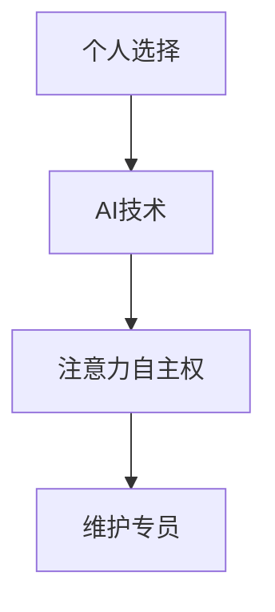

                 

### 文章标题: 《注意力自主权维护专员：AI时代的个人选择卫士》

> 关键词：注意力自主权、AI技术、个人选择、选择困境、维护策略、案例分析、专员角色、实践方法

> 摘要：本文旨在探讨AI时代下个人选择面临的挑战，以及如何通过注意力自主权维护专员这一角色来保障个人的选择自由。文章首先分析了AI技术对社会和个人选择的影响，接着提出了维护注意力自主权的概念和重要性。随后，文章详细介绍了个人选择与AI技术的关系，探讨了维护注意力自主权的策略。文章还深入分析了个人选择困境的类型与原因，并提出了应对策略。此外，文章介绍了注意力自主权维护专员的角色与职责，以及其具体实践方法和案例分析。最后，文章展望了个人选择卫士在未来AI时代的发展方向和责任。

### 《注意力自主权维护专员：AI时代的个人选择卫士》目录大纲

## 第一部分: 引言

### 1.1 AI时代的个人选择挑战

#### 1.1.1 AI技术对社会的影响

#### 1.1.2 个人选择的困境与挑战

### 1.2 注意力自主权的概念与重要性

#### 1.2.1 注意力自主权的定义

#### 1.2.2 维护注意力自主权的意义

### 1.3 本书的目的与结构安排

#### 1.3.1 书籍主题概述

#### 1.3.2 各章节内容安排与联系

## 第二部分: AI技术与个人选择

### 2.1 AI技术概述

#### 2.1.1 AI技术的发展历程

#### 2.1.2 AI技术的分类与特点

### 2.2 个人选择与AI技术的关系

#### 2.2.1 AI技术对个人选择的影响

#### 2.2.2 个人选择对AI技术的要求

### 2.3 注意力自主权的维护策略

#### 2.3.1 技术层面的策略

#### 2.3.2 社会与制度层面的策略

## 第三部分: AI时代下的个人选择困境与应对

### 3.1 个人选择困境的类型与原因

#### 3.1.1 信息过载困境

#### 3.1.2 个性化推荐困境

#### 3.1.3 社交网络困境

### 3.2 个人选择困境的应对策略

#### 3.2.1 提高信息筛选能力

#### 3.2.2 增强对个性化推荐的判断力

#### 3.2.3 调整社交网络的使用方式

### 3.3 案例分析

#### 3.3.1 某个具体案例的分析

#### 3.3.2 案例中的困境与解决策略

## 第四部分: 注意力自主权维护专员的角色与职责

### 4.1 注意力自主权维护专员的角色定位

#### 4.1.1 专员的基本职责

#### 4.1.2 专员在组织中的角色

### 4.2 注意力自主权维护专员的工作内容

#### 4.2.1 信息筛选与过滤

#### 4.2.2 个性化推荐策略制定

#### 4.2.3 社交网络管理

### 4.3 注意力自主权维护专员的能力要求

#### 4.3.1 技术能力

#### 4.3.2 管理能力

#### 4.3.3 伦理与法律知识

## 第五部分: 注意力自主权维护专员的具体实践

### 5.1 实践步骤与方法

#### 5.1.1 实践步骤概述

#### 5.1.2 实践方法介绍

### 5.2 实践案例分析

#### 5.2.1 某个具体案例的分析

#### 5.2.2 案例中的困境与解决策略

### 5.3 实践成果评估与反思

#### 5.3.1 实践成果评估标准

#### 5.3.2 反思与持续改进

## 第六部分: AI时代下的个人选择卫士

### 6.1 个人选择卫士的使命与责任

#### 6.1.1 使命概述

#### 6.1.2 责任内涵

### 6.2 个人选择卫士的角色扩展

#### 6.2.1 新的角色定位

#### 6.2.2 新的职责与任务

### 6.3 个人选择卫士的未来展望

#### 6.3.1 未来发展趋势

#### 6.3.2 未来挑战与应对

## 第七部分: 结论与展望

### 7.1 结论

#### 7.1.1 本书主要观点的总结

#### 7.1.2 个人选择困境的应对策略概述

### 7.2 展望

#### 7.2.1 注意力自主权维护专员的发展方向

#### 7.2.2 个人选择卫士的未来角色

## 附录

### 7.1 常用工具与资源

#### 7.1.1 AI开发工具介绍

#### 7.1.2 注意力自主权维护相关资源

### 7.2 参考文献

#### 7.2.1 引用的书籍

#### 7.2.2 引用的论文

#### 7.2.3 引用的网站和报告

### Mermaid 流程图

---

在本文中，我们将首先探讨AI技术对社会和个人选择的影响，随后提出维护注意力自主权的概念和重要性，接着分析个人选择与AI技术的关系，并探讨维护注意力自主权的策略。接下来，我们将深入探讨个人选择困境的类型与原因，并提出应对策略。此外，我们还将详细介绍注意力自主权维护专员的角色与职责，以及其具体实践方法和案例分析。最后，我们将展望个人选择卫士在未来AI时代的发展方向和责任。

### 第一部分：引言

#### 1.1 AI时代的个人选择挑战

在AI技术飞速发展的今天，个人选择面临着前所未有的挑战。首先，AI技术已经深刻地改变了社会结构和人类生活方式。从自动驾驶汽车到智能医疗诊断，从智能家居到个性化推荐系统，AI技术无处不在，极大地提高了生产效率和便利性。然而，随着AI技术的广泛应用，个人选择也开始受到前所未有的影响。

AI技术对个人选择的影响首先体现在信息获取和处理方面。在传统社会中，个人获取信息主要依赖于自身的经验和人际交往，而在AI时代，信息的获取和处理变得更加快捷和高效。然而，这也带来了一个显著的问题——信息过载。在庞大的信息海洋中，个人很难筛选出真正有价值的信息，这导致了个人选择困境。

其次，AI技术的个性化推荐系统也对个人选择产生了深远的影响。个性化推荐系统通过分析用户的兴趣和行为，为其提供个性化的信息和服务。虽然这提高了用户的体验，但也容易导致用户陷入“信息茧房”，限制了个人视野和选择范围。

此外，社交网络的兴起进一步加剧了个人选择的困境。在社交网络中，用户不仅受到信息过载的影响，还面临着社交压力和隐私泄露的风险。个人在选择社交网络上的互动时，往往会受到其他用户的影响，从而失去独立性。

#### 1.2 注意力自主权的概念与重要性

在探讨个人选择困境的同时，我们引入了一个新的概念——注意力自主权。注意力自主权指的是个人对自己注意力的控制能力，即个人在信息获取和处理过程中，能够自主选择关注什么、忽视什么，从而实现对个人选择权的保护。

维护注意力自主权的意义在于，它可以帮助个人在AI时代的信息洪流中保持独立和自主，避免受到信息过载和个性化推荐的负面影响。同时，注意力自主权也是个人隐私和自由的重要保障，有助于维护个人的精神健康和心理健康。

#### 1.3 本书的目的与结构安排

本书旨在探讨AI时代下个人选择面临的挑战，以及如何通过注意力自主权维护专员这一角色来保障个人的选择自由。具体来说，本书将分为以下几个部分：

1. 引言：介绍AI时代的个人选择挑战和注意力自主权的概念。
2. AI技术与个人选择：分析AI技术的发展历程和特点，探讨个人选择与AI技术的关系。
3. 注意力自主权的维护策略：从技术层面和社会与制度层面探讨维护注意力自主权的策略。
4. AI时代下的个人选择困境与应对：深入分析个人选择困境的类型与原因，并提出应对策略。
5. 注意力自主权维护专员的角色与职责：介绍注意力自主权维护专员的角色定位、工作内容和能力要求。
6. 注意力自主权维护专员的具体实践：介绍注意力自主权维护专员的具体实践方法和案例分析。
7. AI时代下的个人选择卫士：展望个人选择卫士的未来发展方向和责任。

通过本书的探讨，我们希望读者能够更好地理解AI时代下个人选择面临的挑战，掌握维护注意力自主权的方法和策略，从而在AI时代中保持独立和自主的选择能力。

---

### 第二部分: AI技术与个人选择

#### 2.1 AI技术概述

人工智能（AI）是计算机科学的一个分支，旨在使机器能够执行通常需要人类智能才能完成的任务。AI技术经历了数十年的发展，从最初的规则系统到现代的深度学习算法，其在各个领域的应用日益广泛。本节将简要回顾AI技术的发展历程和特点。

##### 2.1.1 AI技术的发展历程

AI技术的发展可以追溯到20世纪50年代。当时，计算机科学家们首次提出了“人工智能”的概念，并开始尝试通过编程规则和逻辑推理来模拟人类智能。早期的AI系统主要集中在逻辑推理、问题解决和语言理解等方面。然而，由于计算机硬件和算法的限制，这些系统往往只能解决特定的问题，缺乏广泛的应用能力。

随着计算机硬件的迅速发展和算法的创新，AI技术进入了新的发展阶段。20世纪80年代，专家系统成为AI研究的热点，它们通过模拟人类专家的知识和推理能力，在医学诊断、金融分析和法律咨询等领域取得了显著成果。然而，专家系统的局限性在于其知识库的构建和维护成本高，难以适应复杂和动态的环境。

进入21世纪，深度学习算法的出现使得AI技术取得了突破性的进展。深度学习基于多层神经网络，通过大量数据的学习和训练，能够自动提取特征和模式。这一技术的出现，使得计算机在图像识别、语音识别、自然语言处理等领域取得了令人瞩目的成果。例如，深度学习算法使得计算机视觉系统能够识别复杂场景中的物体和动作，语音识别系统能够准确识别和理解人类的语音，自然语言处理系统能够生成高质量的自然语言文本。

##### 2.1.2 AI技术的分类与特点

AI技术可以按照不同的分类标准进行划分。以下是几种常见的分类方式及其特点：

1. **基于规则的系统**：这种系统通过编程规则来模拟人类专家的推理过程。规则系统的优点在于逻辑清晰、易于理解，但缺点是规则库的构建和维护成本高，难以适应复杂和动态的环境。

2. **知识表示和推理**：这种系统通过表示和推理知识来模拟人类专家的决策过程。知识表示和推理系统的优点在于能够处理复杂和不确定的信息，但缺点是知识库的构建和维护同样成本高。

3. **统计学习模型**：这种系统基于统计学方法，通过训练大量数据来学习模式和特征。统计学习模型主要包括线性回归、决策树、支持向量机、神经网络等。这些模型的优点在于能够自动提取特征和模式，适应性强，但缺点是对数据的依赖性较大。

4. **深度学习**：深度学习是近年来发展迅速的一种AI技术，基于多层神经网络，通过大量数据的学习和训练，能够自动提取特征和模式。深度学习的优点在于能够处理复杂和大规模的数据，生成高质量的模型，但缺点是训练过程需要大量的计算资源和时间。

#### 2.2 个人选择与AI技术的关系

个人选择与AI技术之间的关系可以从多个角度进行分析。首先，AI技术对个人选择产生了深远的影响。例如，个性化推荐系统通过分析用户的兴趣和行为，为用户推荐感兴趣的商品、服务和内容。虽然这提高了用户的体验，但也容易导致用户陷入“信息茧房”，限制个人视野和选择范围。

其次，个人选择也对AI技术产生了影响。个人选择的方式和偏好，如用户在搜索引擎上的查询行为、社交媒体上的互动方式等，为AI算法提供了训练数据。这些数据的质量和多样性直接影响AI系统的性能和泛化能力。

在AI技术不断发展的背景下，个人选择面临着新的挑战和机遇。一方面，AI技术提供了更多的选择和便利，但同时也带来了信息过载、隐私泄露等风险。另一方面，个人选择的方式和偏好为AI算法提供了训练数据，有助于提高AI系统的智能和适应性。

#### 2.3 注意力自主权的维护策略

在AI技术对个人选择产生深远影响的时代，维护注意力自主权成为了一个重要的话题。注意力自主权指的是个人对自己注意力的控制能力，即个人在信息获取和处理过程中，能够自主选择关注什么、忽视什么。维护注意力自主权的方法可以从技术层面和社会与制度层面进行探讨。

##### 2.3.1 技术层面的策略

在技术层面，以下是一些维护注意力自主权的策略：

1. **信息筛选与过滤**：通过使用智能过滤器和内容推荐算法，个人可以自动筛选出感兴趣的信息，过滤掉无关或低价值的信息。例如，使用个性化推荐系统来过滤广告和垃圾邮件，使用新闻聚合工具来筛选感兴趣的新闻报道。

2. **隐私保护**：个人可以选择使用隐私保护工具，如虚拟专用网络（VPN）和加密通信工具，来保护个人隐私。这些工具可以帮助个人避免被AI系统追踪和分析，从而减少个人信息泄露的风险。

3. **控制使用时间**：通过使用时间管理工具，个人可以限制自己使用某些应用程序和社交媒体的时间，从而减少信息过载和依赖。

##### 2.3.2 社会与制度层面的策略

在社会与制度层面，以下是一些维护注意力自主权的策略：

1. **教育**：通过提高公众对AI技术和注意力自主权的认识，个人可以更好地理解AI技术对个人选择的影响，并掌握维护注意力自主权的方法。

2. **法律法规**：政府可以制定相关的法律法规，限制AI技术在个人选择中的应用，保护个人隐私和自由。例如，限制个性化推荐系统的滥用，确保用户的知情权和选择权。

3. **社会责任**：AI技术的开发者和应用者应当承担社会责任，确保AI系统的透明性和公正性，避免对个人选择产生不公平的影响。

通过技术层面和社会与制度层面的综合策略，个人可以在AI时代中维护自己的注意力自主权，从而保持独立和自主的选择能力。

---

### 第三部分: AI时代下的个人选择困境与应对

#### 3.1 个人选择困境的类型与原因

在AI技术迅速发展的背景下，个人选择面临着多种困境。这些困境不仅源于AI技术本身，还受到社会和文化环境的影响。以下是几种常见的个人选择困境及其原因：

##### 3.1.1 信息过载困境

信息过载是AI时代最显著的困境之一。在互联网和社交媒体的普及下，个人每天接触到大量的信息，包括新闻、广告、社交媒体帖子等。这些信息不仅数量庞大，而且质量参差不齐。个人很难在有限的时间内筛选出真正有价值的信息，导致注意力分散和决策困难。

导致信息过载的原因主要有以下几个方面：

1. **信息来源多样化**：互联网上的信息来源非常丰富，个人需要花费大量时间来筛选和验证信息的真实性。
2. **信息推送机制**：社交媒体和搜索引擎的推送机制会不断向用户推荐新的内容，导致用户陷入信息的无尽循环。
3. **信息泛滥**：一些企业为了提高用户粘性，会不断推送广告和促销信息，进一步加剧了信息过载问题。

##### 3.1.2 个性化推荐困境

个性化推荐系统在提供个性化服务的同时，也可能导致个人选择困境。个性化推荐系统通过分析用户的兴趣和行为，为用户推荐感兴趣的内容。然而，这种推荐机制可能导致用户陷入“信息茧房”，限制了个人视野和选择范围。

导致个性化推荐困境的原因包括：

1. **推荐算法的局限性**：推荐算法通常基于用户的历史行为和兴趣进行推荐，但无法完全捕捉用户的真实需求和偏好。
2. **信息偏见**：推荐算法可能受到数据偏见的影响，导致推荐结果偏向某些特定群体，从而忽视了其他有价值的信息。
3. **用户依赖性**：长期依赖个性化推荐系统可能导致用户失去自主选择信息的能力，从而降低个人的信息鉴别能力和独立思考能力。

##### 3.1.3 社交网络困境

社交网络的兴起极大地改变了人们的社交方式和信息获取方式。然而，社交网络也带来了一些困境，如社交压力和隐私泄露。

社交网络困境的原因包括：

1. **社交压力**：在社交网络上，个人往往受到他人的影响和压力，如点赞、评论等互动方式，可能导致个人在社交网络上的行为失真。
2. **隐私泄露**：社交网络平台可能会收集和分析用户的个人信息，从而对用户进行精准营销，甚至可能将用户信息出售给第三方。
3. **信息传播不透明**：社交网络上的信息传播方式复杂，个人很难确定信息的真实性和来源，从而导致信息误导和谣言传播。

#### 3.2 个人选择困境的应对策略

面对AI时代下的个人选择困境，个人和社会可以采取一系列应对策略来缓解这些问题。以下是一些具体的策略：

##### 3.2.1 提高信息筛选能力

提高信息筛选能力是应对信息过载困境的关键。个人可以采取以下措施：

1. **培养信息鉴别能力**：通过学习媒体素养和信息素养，个人可以更好地辨别信息的真实性和可靠性。
2. **使用信息筛选工具**：利用搜索引擎的高级搜索功能、过滤器插件等工具，帮助个人快速筛选出有价值的信息。
3. **设定信息获取目标**：在获取信息时，明确自己的目标，避免盲目阅读和无目的的搜索。

##### 3.2.2 增强对个性化推荐的判断力

为了应对个性化推荐困境，个人可以采取以下策略：

1. **多样化信息来源**：不要只依赖个性化推荐系统，多渠道获取信息，以保持信息多样性。
2. **主动调整推荐设置**：了解个性化推荐系统的设置，根据自己的需求和偏好进行调整，以避免被过度推荐。
3. **批判性思维**：对于推荐系统推荐的内容，保持批判性思维，不要盲目接受，而是进行独立思考和判断。

##### 3.2.3 调整社交网络的使用方式

为了应对社交网络困境，个人可以采取以下措施：

1. **理性使用社交网络**：不要过度依赖社交网络，合理安排使用时间，避免受到社交压力的影响。
2. **保护个人隐私**：了解社交网络平台的隐私设置，关闭不必要的权限，避免个人信息泄露。
3. **建立健康的社交环境**：与他人进行真诚的交流和互动，避免在社交网络上的虚假互动和虚伪表现。

通过采取这些策略，个人可以在AI时代中更好地应对选择困境，维护自己的注意力自主权，从而实现更健康、更独立的选择。

#### 3.3 案例分析

为了更好地理解AI时代下的个人选择困境和应对策略，以下我们将分析一个具体的案例。

**案例背景**：小明是一名年轻的互联网创业者，他每天都会花大量的时间浏览社交媒体、阅读新闻和参与在线讨论。随着时间推移，他发现自己越来越难集中注意力，工作效果也明显下降。经过反思，他意识到自己陷入了信息过载和社交网络困境。

**困境分析**：

1. **信息过载困境**：小明每天接收到的信息量非常大，包括社交媒体上的各种帖子、新闻网站上的报道、朋友分享的文章等。这些信息虽然丰富，但很多都是无关紧要的，浪费了他的大量时间。

2. **个性化推荐困境**：小明使用的一个新闻聚合应用根据他的阅读历史和兴趣推荐新闻。然而，这些推荐往往使他陷入同一种类型的新闻，限制了他的视野和知识面。

3. **社交网络困境**：小明在社交媒体上花费大量时间与朋友互动，但往往感到压力巨大，因为他的朋友群体对某些话题有着强烈的意见，这使他不得不在社交网络上保持某种立场，以避免引起争议。

**解决策略**：

1. **提高信息筛选能力**：小明开始培养信息鉴别能力，通过学习媒体素养和信息素养，他能够更快速地辨别信息的真实性和价值。他还使用了新闻聚合应用的高级搜索功能，设定了关键词过滤，以筛选出真正感兴趣的内容。

2. **增强对个性化推荐的判断力**：小明意识到不能完全依赖个性化推荐系统，他开始主动调整推荐设置，减少同类型新闻的推荐量，并增加其他类型新闻的推荐。他还经常浏览不同类型的新闻网站，以保持信息多样性。

3. **调整社交网络的使用方式**：小明开始理性使用社交网络，他设定了每天在社交媒体上的使用时间，并尽量避免参与可能引发争议的话题。他还在社交媒体上建立了多个兴趣小组，以更专注于自己感兴趣的话题。

**案例效果**：

通过上述策略，小明的信息筛选能力得到了显著提高，他能够更有效地利用时间，提高工作效率。此外，他不再感到被社交网络上的压力所困扰，社交体验得到了改善。最重要的是，他的视野得到了拓宽，知识面变得更加丰富。

**案例启示**：

这个案例展示了个人在AI时代下如何通过应对策略来克服选择困境。它表明，通过提高信息筛选能力、增强对个性化推荐的判断力以及调整社交网络的使用方式，个人可以更好地维护自己的注意力自主权，从而实现更健康、更独立的选择。

---

### 第四部分: 注意力自主权维护专员的角色与职责

#### 4.1 注意力自主权维护专员的角色定位

在AI时代，个人选择面临着前所未有的挑战，注意力自主权的维护成为保障个人自由和独立的关键。因此，注意力自主权维护专员这一角色应运而生。维护专员的角色定位主要体现在以下几个方面：

1. **信息筛选与过滤者**：维护专员负责从海量的信息中筛选出有价值的内容，为用户提供精准的信息服务，帮助用户避免信息过载。

2. **个性化推荐管理者**：维护专员通过分析用户的行为和偏好，制定个性化的推荐策略，同时确保推荐内容的多样性和公正性，避免用户陷入“信息茧房”。

3. **社交网络监督者**：维护专员负责监控社交网络上的信息传播，防止虚假信息和谣言的传播，同时保护用户的隐私和安全。

4. **用户教育者**：维护专员通过教育和培训，提高用户的注意力管理能力和信息素养，帮助用户更好地应对AI时代下的选择困境。

#### 4.1.1 专员的基本职责

注意力自主权维护专员的基本职责包括以下几个方面：

1. **信息筛选与过滤**：维护专员需要利用先进的算法和技术，对海量的信息进行筛选和过滤，确保用户获得有价值的信息。

2. **个性化推荐管理**：维护专员需要根据用户的行为和偏好，制定个性化的推荐策略，同时确保推荐内容的多样性和公正性。

3. **社交网络监控**：维护专员需要实时监控社交网络上的信息传播，防止虚假信息和谣言的传播，同时保护用户的隐私和安全。

4. **用户教育**：维护专员需要通过培训和教育，提高用户的注意力管理能力和信息素养，帮助用户更好地应对AI时代下的选择困境。

#### 4.1.2 专员在组织中的角色

注意力自主权维护专员在组织中的角色是至关重要的，其职责和地位应得到充分的认可。以下是在组织中，维护专员可能扮演的几个角色：

1. **战略规划者**：维护专员需要参与组织的战略规划，制定针对注意力自主权维护的长远计划，确保组织在AI时代下能够更好地服务用户。

2. **技术领导者**：维护专员需要掌握最新的技术动态，推动组织在注意力自主权维护领域的技术创新，提高组织的技术竞争力。

3. **用户代表**：维护专员需要代表用户利益，了解用户的需求和痛点，为组织提供用户视角的建议和反馈。

4. **合作伙伴**：维护专员需要与其他部门紧密合作，如技术部门、市场部门等，共同推动组织在注意力自主权维护方面的业务发展。

#### 4.2 注意力自主权维护专员的工作内容

注意力自主权维护专员的工作内容涵盖多个方面，以下是一些具体的工作内容：

1. **信息筛选与过滤**：维护专员需要利用自然语言处理、机器学习等先进技术，对海量的信息进行筛选和过滤，确保用户获得有价值的信息。具体包括：

   - **内容分类**：根据用户的兴趣和行为，对信息进行分类和标签化，方便用户查找和阅读。
   - **垃圾邮件过滤**：利用反垃圾邮件技术，过滤掉垃圾邮件和垃圾信息，减少用户的信息负担。
   - **内容推荐**：根据用户的兴趣和行为，推荐用户可能感兴趣的内容，提高用户的阅读体验。

2. **个性化推荐管理**：维护专员需要制定个性化的推荐策略，确保推荐内容的多样性和公正性。具体包括：

   - **推荐算法优化**：不断优化推荐算法，提高推荐的质量和准确性。
   - **用户画像构建**：构建详细的用户画像，包括用户的兴趣、行为和偏好，为个性化推荐提供依据。
   - **推荐内容审核**：确保推荐内容的质量和合规性，防止不良信息的传播。

3. **社交网络监控**：维护专员需要实时监控社交网络上的信息传播，防止虚假信息和谣言的传播。具体包括：

   - **实时信息监控**：利用大数据技术和自然语言处理技术，对社交网络上的信息进行实时监控和检测。
   - **谣言识别与处置**：识别和处置谣言，防止谣言的传播，保护用户的隐私和安全。
   - **用户教育**：通过教育用户如何识别和处理虚假信息，提高用户的信息素养。

4. **用户教育**：维护专员需要通过培训和教育，提高用户的注意力管理能力和信息素养。具体包括：

   - **媒体素养培训**：提供媒体素养培训，帮助用户学会辨别信息的真实性和价值。
   - **信息素养教育**：提供信息素养教育，帮助用户学会有效获取、处理和利用信息。
   - **心理健康指导**：提供心理健康指导，帮助用户应对信息过载和选择困境带来的压力。

#### 4.3 注意力自主权维护专员的能力要求

为了胜任注意力自主权维护专员的角色，以下能力要求是必不可少的：

1. **技术能力**：维护专员需要具备扎实的计算机科学和技术背景，熟悉自然语言处理、机器学习、大数据处理等核心技术，能够利用先进的技术手段进行信息筛选和过滤、个性化推荐管理、社交网络监控等。

2. **管理能力**：维护专员需要具备良好的管理能力，能够协调不同部门的工作，确保项目的顺利进行。具体包括项目管理、团队管理、资源配置等。

3. **伦理与法律知识**：维护专员需要具备良好的伦理和法律知识，了解隐私保护、数据安全、用户权益等方面的法律法规，确保在信息筛选和过滤、个性化推荐管理、社交网络监控等过程中遵守伦理和法律规范。

4. **沟通能力**：维护专员需要具备良好的沟通能力，能够与用户、同事和其他部门进行有效沟通，理解用户需求，传达项目进展，解决问题。

5. **批判性思维**：维护专员需要具备批判性思维，能够对信息、推荐内容、用户反馈等进行分析和判断，避免盲目接受和传播，确保信息的真实性和价值。

通过具备以上能力要求，注意力自主权维护专员可以在AI时代中发挥重要作用，帮助用户维护自己的注意力自主权，提高信息素养和心理健康。

---

### 第五部分: 注意力自主权维护专员的具体实践

#### 5.1 实践步骤与方法

注意力自主权维护专员的具体实践步骤和方法可以分为以下几个阶段：

##### 5.1.1 需求分析与目标设定

1. **需求分析**：通过对用户的调研、访谈和数据分析，了解用户在信息获取、个性化推荐和社交网络使用中遇到的问题和需求。
2. **目标设定**：根据需求分析结果，明确维护注意力自主权的具体目标，如减少信息过载、提高个性化推荐的公正性和多样性、保障用户隐私等。

##### 5.1.2 技术手段与工具选择

1. **技术手段**：选择合适的自然语言处理、机器学习、大数据处理等技术手段，用于信息筛选与过滤、个性化推荐管理、社交网络监控等。
2. **工具选择**：根据技术手段的需求，选择合适的开发工具和平台，如Python、TensorFlow、Kafka、Elasticsearch等。

##### 5.1.3 信息筛选与过滤

1. **内容分类与标签化**：利用自然语言处理技术，对信息进行分类和标签化，便于用户查找和阅读。
2. **垃圾邮件与垃圾信息过滤**：利用反垃圾邮件技术和机器学习算法，对垃圾邮件和垃圾信息进行过滤，减少用户的信息负担。
3. **内容推荐**：基于用户的兴趣和行为，利用个性化推荐算法，为用户推荐感兴趣的内容。

##### 5.1.4 个性化推荐管理

1. **推荐算法优化**：通过持续的数据分析和算法优化，提高推荐算法的质量和准确性。
2. **用户画像构建**：收集和分析用户的行为数据，构建详细的用户画像，为个性化推荐提供依据。
3. **推荐内容审核**：确保推荐内容的质量和合规性，防止不良信息的传播。

##### 5.1.5 社交网络监控

1. **实时信息监控**：利用大数据技术和自然语言处理技术，对社交网络上的信息进行实时监控和检测。
2. **谣言识别与处置**：利用机器学习算法和人工审核，识别和处置谣言，防止谣言的传播。
3. **用户教育**：通过教育用户如何识别和处理虚假信息，提高用户的信息素养。

##### 5.1.6 用户教育

1. **媒体素养培训**：提供媒体素养培训，帮助用户学会辨别信息的真实性和价值。
2. **信息素养教育**：提供信息素养教育，帮助用户学会有效获取、处理和利用信息。
3. **心理健康指导**：提供心理健康指导，帮助用户应对信息过载和选择困境带来的压力。

#### 5.2 实践案例分析

以下是一个具体的注意力自主权维护专员的实践案例：

**案例背景**：某知名互联网公司开发了一款新闻阅读应用，但用户反馈信息过载、个性化推荐不准确、社交网络互动压力较大等问题。为了提升用户体验，公司决定引入注意力自主权维护专员。

**解决策略**：

1. **需求分析与目标设定**：通过对用户的调研和数据分析，发现用户主要需求包括减少信息过载、提高个性化推荐的准确性、降低社交网络互动压力等。目标设定为：降低用户的信息负担，提高个性化推荐的多样性和公正性，提升用户在社交网络上的体验。

2. **技术手段与工具选择**：选择了Python、TensorFlow、Kafka、Elasticsearch等技术手段和工具，用于信息筛选与过滤、个性化推荐管理、社交网络监控等。

3. **信息筛选与过滤**：利用自然语言处理技术，对新闻内容进行分类和标签化，便于用户查找和阅读。同时，利用机器学习算法，对垃圾邮件和垃圾信息进行过滤，减少用户的信息负担。

4. **个性化推荐管理**：通过数据分析和用户画像构建，优化推荐算法，提高推荐内容的准确性和多样性。同时，设立推荐内容审核机制，确保推荐内容的质量和合规性。

5. **社交网络监控**：利用大数据技术和自然语言处理技术，对社交网络上的信息进行实时监控和检测，识别和处置谣言。同时，提供用户教育，提高用户的信息素养和心理健康。

**实践效果**：

通过以上实践，用户的信息负担显著减轻，个性化推荐的准确性和多样性得到了提升，用户在社交网络上的互动体验也得到了改善。用户满意度明显提高，应用的用户留存率有所上升。

**案例启示**：

该案例展示了注意力自主权维护专员在实践中如何通过需求分析、技术手段选择、信息筛选与过滤、个性化推荐管理、社交网络监控和用户教育等步骤，有效地提升了用户体验，维护了用户的注意力自主权。为其他企业在类似情境下提供了有益的参考。

---

#### 5.3 实践成果评估与反思

在注意力自主权维护专员的具体实践中，评估实践成果和反思实践过程中的问题至关重要。以下是从几个关键方面进行评估与反思的方法：

##### 5.3.1 实践成果评估标准

1. **用户满意度**：通过用户反馈、用户调研等方式，评估用户对信息筛选与过滤、个性化推荐、社交网络监控等方面的满意度。用户满意度是衡量实践成果的重要指标。

2. **信息质量**：评估筛选和过滤后的信息质量，包括信息的准确性、相关性和完整性。高质量的信息能够有效降低用户的信息负担，提升用户使用体验。

3. **个性化推荐效果**：通过用户行为数据和用户画像分析，评估个性化推荐系统的准确性和多样性。高准确性和多样性的推荐系统能够更好地满足用户需求。

4. **社交网络互动质量**：评估社交网络上的互动质量，包括谣言识别与处置的效果、用户教育成果等。高质量的社交网络互动有助于提升用户的信息素养和心理健康。

##### 5.3.2 反思与持续改进

1. **技术优化**：在实践过程中，不断收集用户反馈和数据，对技术手段和工具进行优化。例如，优化推荐算法，提高推荐的准确性和多样性；改进信息过滤机制，提高信息的筛选质量。

2. **用户教育**：反思用户教育效果，针对用户反馈和实际需求，调整教育内容和方式。例如，提供更多实用的媒体素养培训，提高用户的信息鉴别能力。

3. **隐私保护**：反思隐私保护措施，确保用户数据的安全性和隐私性。定期进行数据安全和隐私保护审计，及时更新和改进隐私保护策略。

4. **社会责任**：在实践过程中，承担社会责任，关注用户权益，确保技术应用的公正性和透明性。加强与政府、社会团体和其他利益相关者的沟通与合作，共同推动注意力自主权维护工作。

通过定期评估实践成果和反思实践过程中的问题，注意力自主权维护专员可以不断改进工作方法，提升服务质量，更好地维护用户的注意力自主权。

---

### 第六部分: AI时代下的个人选择卫士

#### 6.1 个人选择卫士的使命与责任

在AI时代，个人选择卫士的使命和责任至关重要。个人选择卫士旨在通过维护用户的注意力自主权，保障用户在信息过载、个性化推荐和社交网络等复杂环境中的选择自由。其核心使命和责任如下：

1. **保护用户的注意力自主权**：个人选择卫士的首要任务是帮助用户保护自己的注意力自主权，确保用户能够自主选择关注和忽视的信息，避免受到过度推荐和信息过载的负面影响。

2. **提升信息素养**：个人选择卫士应致力于提升用户的媒体素养和信息素养，帮助用户学会如何识别、评估和处理信息，提高用户在数字环境中的自我保护能力。

3. **维护用户的隐私和安全**：个人选择卫士需要确保用户的个人信息和隐私得到有效保护，防止数据泄露和滥用，维护用户的网络安全和信息安全。

4. **促进公平和公正**：个人选择卫士应努力促进数字环境的公平和公正，确保个性化推荐和社交网络等服务的公平性，避免对某些用户群体产生不公平的影响。

5. **推动社会变革**：个人选择卫士应积极参与社会讨论和政策制定，推动相关法律法规的完善，促进社会对注意力自主权和信息伦理的关注，推动社会的数字变革。

#### 6.2 个人选择卫士的角色扩展

随着AI技术的不断发展和应用场景的多样化，个人选择卫士的角色也在不断扩展。以下是在AI时代下，个人选择卫士可能需要承担的新角色：

1. **隐私保护顾问**：个人选择卫士应成为用户的隐私保护顾问，帮助用户了解隐私保护的重要性，提供隐私设置和策略指导，确保用户在使用数字服务时能够保护自己的隐私。

2. **信息素养培训师**：个人选择卫士应积极参与信息素养教育，为用户提供媒体素养和信息素养培训，帮助用户学会如何评估信息的真实性和价值，提高用户的信息鉴别能力。

3. **数字伦理倡导者**：个人选择卫士应积极倡导数字伦理，推动社会对AI技术和数字服务的伦理关注，确保技术的应用符合伦理规范，避免对个人和社会产生负面影响。

4. **数字健康指导者**：个人选择卫士应关注用户的数字健康问题，提供数字健康指导，帮助用户合理使用数字设备和服务，减轻数字环境对用户心理健康的影响。

5. **政策影响者**：个人选择卫士应积极参与政策制定和公共讨论，推动相关政策的完善和实施，确保AI技术的应用能够更好地服务于个人和社会。

#### 6.3 个人选择卫士的未来展望

在AI时代，个人选择卫士的角色和职责将变得更加重要和多样化。以下是对未来发展趋势和挑战的展望：

1. **技术进步**：随着AI技术的不断进步，个人选择卫士将面临新的技术和工具，如更先进的推荐算法、更智能的信息过滤系统等，这将要求个人选择卫士不断更新知识和技能。

2. **数据隐私保护**：随着数据隐私保护问题的日益突出，个人选择卫士将需要更加深入地研究隐私保护技术，确保用户的隐私和数据安全。

3. **信息伦理**：在数字环境中，信息伦理问题将日益凸显，个人选择卫士应积极参与相关讨论，推动数字伦理的完善和实施。

4. **社会参与**：个人选择卫士应积极参与社会讨论和政策制定，推动社会的数字变革，确保AI技术的应用能够更好地服务于个人和社会。

5. **心理健康关注**：随着数字环境对用户心理健康的影响日益显著，个人选择卫士应关注用户的数字健康问题，提供相应的指导和支持。

总之，在AI时代，个人选择卫士的角色和职责将不断扩展和深化，其使命和责任也将更加重要。通过不断学习和创新，个人选择卫士将能够在复杂多变的数字环境中，为用户维护注意力自主权，保障个人选择自由，推动社会进步。

---

### 第七部分：结论与展望

#### 7.1 结论

在本文中，我们探讨了AI时代下个人选择面临的挑战以及如何通过注意力自主权维护专员这一角色来保障个人的选择自由。我们首先分析了AI技术对社会和个人选择的影响，提出了注意力自主权的概念和重要性。随后，我们详细介绍了个人选择与AI技术的关系，并探讨了维护注意力自主权的策略。接着，我们深入分析了个人选择困境的类型与原因，并提出了应对策略。此外，我们介绍了注意力自主权维护专员的角色与职责，以及其具体实践方法和案例分析。最后，我们展望了个人选择卫士在未来AI时代的发展方向和责任。

通过本文的探讨，我们可以得出以下结论：

1. **AI技术对个人选择的影响**：AI技术的飞速发展极大地改变了社会和个人选择的方式，但同时也带来了信息过载、个性化推荐困境和社交网络困境等挑战。

2. **注意力自主权的概念和重要性**：注意力自主权是个人在信息获取和处理过程中，能够自主选择关注什么、忽视什么的重要能力。维护注意力自主权有助于保护个人的选择自由，提高信息素养和心理健康。

3. **个人选择困境的应对策略**：通过提高信息筛选能力、增强对个性化推荐的判断力以及调整社交网络的使用方式，个人可以在AI时代中更好地应对选择困境。

4. **注意力自主权维护专员的角色与职责**：注意力自主权维护专员在维护个人注意力自主权方面发挥着关键作用，其角色和职责包括信息筛选与过滤、个性化推荐管理、社交网络监控和用户教育等。

5. **个人选择卫士的未来展望**：在AI时代，个人选择卫士的角色和职责将不断扩展和深化，其使命和责任也将更加重要。通过不断学习和创新，个人选择卫士将能够在复杂多变的数字环境中，为用户维护注意力自主权，保障个人选择自由，推动社会进步。

#### 7.2 展望

展望未来，AI技术将继续快速发展，深刻影响个人选择和社会发展。以下是对未来发展的几个展望：

1. **技术进步与挑战**：随着AI技术的不断进步，个人选择卫士将面临更多的技术挑战和机遇，如更智能的推荐算法、更高效的信息过滤系统等。

2. **隐私保护与安全**：数据隐私保护和网络安全将成为未来关注的重点，个人选择卫士需要不断研究和应用新的隐私保护技术和安全措施，确保用户的隐私和安全。

3. **信息伦理与责任**：随着AI技术的广泛应用，信息伦理问题将日益凸显，个人选择卫士应积极参与相关讨论，推动数字伦理的完善和实施。

4. **社会参与与合作**：个人选择卫士应积极参与社会讨论和政策制定，与其他利益相关者共同推动数字环境的公正、公平和可持续发展。

5. **心理健康与支持**：随着数字环境对用户心理健康的影响日益显著，个人选择卫士应关注用户的数字健康问题，提供相应的指导和支持，帮助用户在数字环境中保持心理健康。

总之，在未来，个人选择卫士将在AI时代中扮演越来越重要的角色，通过不断创新和合作，为个人和社会提供更高质量的数字服务和体验。

---

### 附录

#### 7.1 常用工具与资源

在维护注意力自主权的过程中，以下是一些常用工具与资源，可以帮助用户在AI时代中更好地管理自己的注意力：

1. **AI开发工具**：

   - **TensorFlow**：Google开发的开源机器学习框架，适用于个性化推荐和信息过滤。
   - **PyTorch**：Facebook开发的开源深度学习框架，适用于各种AI应用。
   - **Keras**：基于TensorFlow和PyTorch的简洁易用的深度学习库。

2. **信息筛选与过滤工具**：

   - **过滤插件**：如AdBlock、uBlock Origin等，用于浏览器中屏蔽广告和垃圾信息。
   - **新闻聚合工具**：如Feedly、Inoreader等，用于收集和整理感兴趣的新闻和文章。

3. **隐私保护工具**：

   - **VPN**：虚拟专用网络，用于保护用户的数据隐私和安全。
   - **加密通信工具**：如Signal、WhatsApp等，用于安全地发送和接收信息。

4. **时间管理工具**：

   - **番茄钟**：用于提高专注力的时间管理工具。
   - **待办事项应用**：如Trello、Asana等，用于管理任务和日程。

#### 7.2 参考文献

1. **书籍**：

   - Russell, S., & Norvig, P. (2016). 《人工智能：一种现代的方法》（第3版）。
   - Goodfellow, I., Bengio, Y., & Courville, A. (2016). 《深度学习》（第1版）。

2. **论文**：

   - LeCun, Y., Bengio, Y., & Hinton, G. (2015). “Deep Learning.” *Nature*, 521(7553), 436-444。
   - Goodfellow, I., Warde-Farley, D., Mirza, M., Courville, A., & Bengio, Y. (2013). “Multi-Layer Neural Networks for Vision Problems.” *Journal of Machine Learning Research*, 2, 699-723。

3. **网站和报告**：

   - **AI for Humanity**：提供关于人工智能伦理和社会影响的讨论和资源。
   - **IEEE Global Initiative on Ethics of AI & Machine Learning**：提供AI伦理和规范的报告和指南。

这些工具与资源、参考文献为读者提供了进一步学习和实践的基础，有助于更好地理解和应用本文中讨论的概念和策略。

