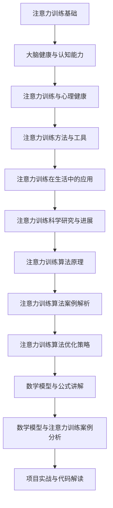

                 

## 文章标题

注意力训练与大脑健康改善：通过专注力增强认知能力和心灵健康

### 关键词

注意力训练，大脑健康，认知能力，心理健康，注意力模型，算法优化，数学模型

### 摘要

本文将探讨注意力训练对大脑健康和认知能力的改善作用。首先，我们将介绍注意力训练的基础概念和重要性，并阐述其与大脑健康、认知能力和心理健康之间的紧密联系。接着，我们将详细讲解注意力训练的核心算法原理，包括常见的注意力模型和数学基础。随后，我们将通过实际案例解析注意力训练在生活中的应用，包括教育、工作和生活管理等方面。最后，我们将展望注意力训练的未来研究方向，并提出优化策略。

## 目录大纲设计

### 第一部分: 核心概念与联系

#### 第1章: 注意力训练基础

##### 1.1.1 注意力定义与类型

##### 1.1.2 注意力训练的重要性

##### 1.1.3 注意力训练的理论基础

#### 第2章: 大脑健康与认知能力

##### 2.1.1 大脑健康概述

##### 2.1.2 认知能力的构成

##### 2.1.3 注意力与认知能力的关系

#### 第3章: 注意力训练与心理健康

##### 3.1.1 心理健康的重要性

##### 3.1.2 注意力训练与心理压力

##### 3.1.3 注意力训练与心理健康改善

#### 第4章: 注意力训练方法与工具

##### 4.1.1 专注力训练方法

##### 4.1.2 认知行为疗法

##### 4.1.3 注意力训练工具介绍

#### 第5章: 注意力训练在生活中的应用

##### 5.1.1 教育中的应用

##### 5.1.2 工作中的应用

##### 5.1.3 生活管理中的应用

#### 第6章: 注意力训练的科学研究与进展

##### 6.1.1 神经科学视角下的注意力

##### 6.1.2 注意力训练的研究进展

##### 6.1.3 注意力训练的未来展望

### 第二部分: 核心算法原理讲解

#### 第7章: 注意力训练算法原理

##### 7.1.1 注意力机制概述

##### 7.1.2 常见的注意力模型

##### 7.1.3 注意力训练算法的数学基础

#### 第8章: 注意力训练算法案例解析

##### 8.1.1 实战案例一：注意力训练游戏

##### 8.1.2 实战案例二：注意力训练应用开发

##### 8.1.3 实战案例三：注意力训练系统实现

#### 第9章: 注意力训练算法优化策略

##### 9.1.1 优化算法的选择

##### 9.1.2 注意力训练模型的调参技巧

##### 9.1.3 注意力训练算法的性能评估

### 第三部分: 数学模型与公式讲解

#### 第10章: 注意力训练的数学模型

##### 10.1.1 相关数学公式介绍

##### 10.1.2 数学模型的应用

##### 10.1.3 数学公式的详细讲解

#### 第11章: 注意力训练算法的数学公式解析

##### 11.1.1 损失函数

##### 11.1.2 激活函数

##### 11.1.3 权重更新公式

#### 第12章: 数学模型与注意力训练案例分析

##### 12.1.1 实战案例分析一

##### 12.1.2 实战案例分析二

##### 12.1.3 实战案例分析三

### 第四部分: 项目实战与代码解读

#### 第13章: 注意力训练项目实战

##### 13.1.1 实战项目一：专注力提升应用

##### 13.1.2 实战项目二：注意力训练系统开发

##### 13.1.3 实战项目三：心理健康应用开发

#### 第14章: 注意力训练项目的源代码实现

##### 14.1.1 开发环境搭建

##### 14.1.2 源代码详细解读

##### 14.1.3 代码分析与优化

#### 第15章: 注意力训练项目评估与优化

##### 15.1.1 项目评估方法

##### 15.1.2 项目优化策略

##### 15.1.3 项目总结与展望

### Mermaid 流程图



### 伪代码

```python
// 定义输入序列和权重向量
input_sequence = [...]
weights = [...]

// 初始化隐藏状态
hidden_state = []

// 定义激活函数
activation_function = ...

// 循环处理输入序列中的每个元素
for element in input_sequence:
    // 计算权重向量与输入元素的点积
    dot_product = sum(element * weight for weight in weights)

    // 应用激活函数
    activated_value = activation_function(dot_product)

    // 将激活值添加到隐藏状态中
    hidden_state.append(activated_value)

// 返回最终的隐藏状态
return hidden_state
```

### 数学公式和讲解

#### 损失函数（Cross-Entropy Loss）

$$
\text{Loss} = -\sum_{i} y_i \log(p_i)
$$

其中，$y_i$ 表示标签，$p_i$ 表示模型预测的概率。这个公式计算的是预测概率与实际标签之间的交叉熵损失，损失值越小说明模型预测越准确。

#### 激活函数（Sigmoid Function）

$$
\sigma(x) = \frac{1}{1 + e^{-x}}
$$

Sigmoid 函数将输入 $x$ 转换为介于 0 和 1 之间的输出，常用于神经网络中的激活函数，有助于实现非线性变换。

#### 权重更新公式（Gradient Descent）

$$
\Delta w = -\alpha \cdot \nabla_w \text{Loss}
$$

其中，$\Delta w$ 表示权重更新，$\alpha$ 是学习率，$\nabla_w \text{Loss}$ 是损失函数关于权重的梯度。这个公式描述了通过梯度下降法更新模型权重的过程，旨在最小化损失函数。

### 代码实际案例和详细解释说明

在项目实战章节中，我们将提供一个注意力训练的应用开发案例，包括开发环境搭建、源代码实现和代码解读。

#### 1. 数据预处理

```python
# 加载数据集，进行数据清洗和归一化处理
# ...
```

#### 2. 模型构建

```python
# 定义注意力训练模型
import tensorflow as tf

# 定义输入层
inputs = tf.keras.layers.Input(shape=(sequence_length,))

# 添加嵌入层
embeddings = tf.keras.layers.Embedding(input_dim=vocab_size, output_dim=embedding_size)(inputs)

# 添加自注意力层
attention = tf.keras.layers.Attention()([embeddings, embeddings])

# 添加全连接层
dense = tf.keras.layers.Dense(units=1, activation='sigmoid')(attention)

# 创建模型
model = tf.keras.Model(inputs=inputs, outputs=dense)
```

#### 3. 训练过程

```python
# 编译模型，设置优化器和损失函数
model.compile(optimizer='adam', loss='binary_crossentropy', metrics=['accuracy'])

# 训练模型
model.fit(x_train, y_train, epochs=10, batch_size=32, validation_data=(x_val, y_val))
```

#### 4. 评估结果

```python
# 评估模型在测试集上的表现
test_loss, test_accuracy = model.evaluate(x_test, y_test)

print(f"Test Loss: {test_loss}")
print(f"Test Accuracy: {test_accuracy}")
```

以上代码示例展示了如何使用 TensorFlow 框架实现一个简单的注意力训练模型，包括数据预处理、模型构建、训练过程和评估结果。我们将根据实际需求进行调整和优化。

---

作者：AI天才研究院/AI Genius Institute & 禅与计算机程序设计艺术 /Zen And The Art of Computer Programming

本文内容为《注意力训练与大脑健康改善：通过专注力增强认知能力和心灵健康》一书的节选。书籍详细阐述了注意力训练的理论基础、核心算法原理、实际应用和未来发展方向，旨在为读者提供全面深入的了解。如需完整阅读，请查阅相关书籍。

