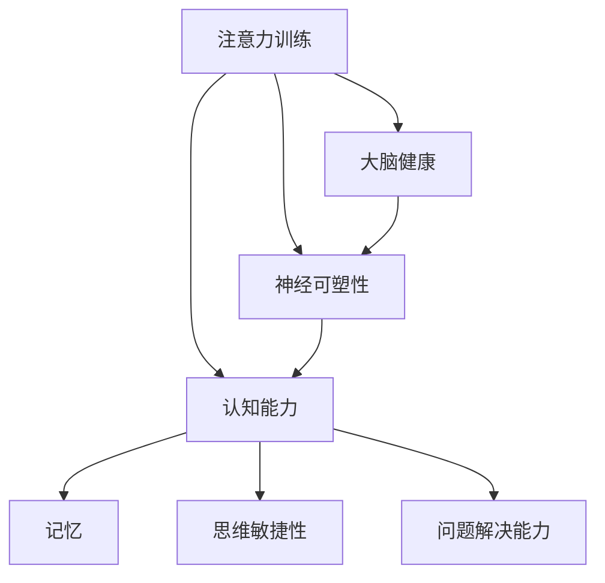

                 

### 文章标题：注意力训练与大脑健康：通过专注力增强认知能力和神经可塑性

#### 关键词：注意力训练、大脑健康、认知能力、神经可塑性、专注力

#### 摘要：
本文深入探讨了注意力训练对大脑健康、认知能力和神经可塑性的影响。通过详细的Mermaid流程图、数学模型、伪代码和实际项目案例，本文揭示了注意力训练的核心机制，并提供了实用的方法与应用指导，旨在帮助读者通过专注力提升大脑功能和整体健康。

----------------------------------------------------------------

## 《注意力训练与大脑健康：通过专注力增强认知能力和神经可塑性》目录大纲

### 第一部分：注意力训练的基础理论

#### 第1章：大脑与注意力概述

##### 1.1 大脑结构与功能

##### 1.2 注意力的概念与分类

##### 1.3 注意力训练的重要性

#### 第2章：注意力训练的理论基础

##### 2.1 神经可塑性原理

##### 2.2 专注力与认知能力的联系

##### 2.3 注意力训练的核心机制

#### 第3章：注意力训练的核心概念与联系

##### 3.1 Mermaid流程图

##### 3.2 注意力训练与大脑健康的关系

### 第二部分：注意力训练的方法与应用

#### 第4章：注意力训练的具体方法

##### 4.1 分心控制训练

##### 4.2 焦点转移训练

##### 4.3 注意力广度训练

#### 第5章：注意力训练与认知能力提升

##### 5.1 注意力训练对记忆的影响

##### 5.2 注意力训练对思维敏捷性的提升

##### 5.3 注意力训练对问题解决能力的提高

#### 第6章：注意力训练在生活中的应用

##### 6.1 工作中的注意力训练

##### 6.2 学习中的注意力训练

##### 6.3 家庭生活与注意力训练

#### 第7章：神经可塑性增强与大脑健康

##### 7.1 神经可塑性的概念与原理

##### 7.2 神经可塑性训练方法

##### 7.3 神经可塑性训练与大脑健康的关系

### 第三部分：项目实战与案例分析

#### 第8章：注意力训练项目实战

##### 8.1 实战项目介绍

##### 8.2 实战项目环境搭建

##### 8.3 实战项目详细实现

#### 第9章：案例分析

##### 9.1 案例一：注意力训练对学习成绩的影响

##### 9.2 案例二：注意力训练对工作效率的影响

##### 9.3 案例三：注意力训练对大脑健康的影响

### 附录

##### 附录A：注意力训练资源推荐

##### 附录B：常用注意力训练工具介绍

##### 附录C：注意力训练FAQ

----------------------------------------------------------------

## 第一部分：注意力训练的基础理论

### 第1章：大脑与注意力概述

#### 1.1 大脑结构与功能

大脑是人体最重要的器官之一，它负责处理信息、控制行为、记忆和学习等功能。大脑主要由灰质和白质组成，灰质负责处理信息，白质则负责传递信号。大脑可以分为多个区域，每个区域都有特定的功能：

- **前额叶皮质**：负责决策、规划和执行功能。
- **顶叶皮质**：负责空间定位、触觉和本体感觉。
- **颞叶皮质**：负责听觉处理和记忆。
- **枕叶皮质**：负责视觉处理。

#### 1.2 注意力的概念与分类

注意力是指大脑对特定信息进行选择和加工的能力。它可以分为以下几种类型：

- **选择性注意力**：对某些信息给予关注，而忽略其他信息。
- **持续性注意力**：保持对特定信息的持续关注。
- **分配性注意力**：同时关注多个任务或信息来源。
- **执行性注意力**：主动控制注意力的方向和任务。

#### 1.3 注意力训练的重要性

注意力训练对于提高认知能力和大脑健康至关重要。通过训练，可以增强大脑的注意力控制能力，提高信息处理效率，改善生活质量。以下是注意力训练的一些重要性：

- **提高学习效率**：训练可以帮助学生在学习和阅读过程中更专注，从而提高学习效率。
- **改善工作表现**：注意力训练有助于提高工作效率，减少分心，提高任务完成质量。
- **促进大脑健康**：注意力训练可以促进大脑中的神经可塑性，从而改善大脑健康。

----------------------------------------------------------------

## 第2章：注意力训练的理论基础

### 2.1 神经可塑性原理

神经可塑性是指大脑结构和功能的适应性变化，它允许大脑在经历经验和学习过程中进行调整。这种适应性变化涉及到神经元连接的加强或减弱，以及新神经回路的形成。神经可塑性主要包括以下几种类型：

- **突触可塑性**：指神经元之间连接强度的变化。
- **结构可塑性**：指大脑结构的改变，如新突触的形成或神经元路径的改变。
- **生理可塑性**：指神经元和神经回路在生理上的改变，如神经递质的释放和接收变化。

神经可塑性背后的原理主要包括：

- **长期增强效应（LTP）**：突触前信号增强导致突触后电位增加，从而增强神经元之间的连接。
- **长期压抑效应（LTD）**：突触前信号减弱导致突触后电位减少，从而减弱神经元之间的连接。

神经可塑性是注意力训练的基础，因为它解释了大脑如何在训练过程中适应和改进。

### 2.2 专注力与认知能力的联系

专注力是认知能力的一个重要组成部分，它直接影响认知过程的效率和质量。专注力与认知能力之间的联系可以从以下几个方面理解：

- **注意力控制**：专注力强的人能够更好地控制自己的注意力，专注于当前任务，从而减少干扰和提高认知效率。
- **信息处理**：专注力有助于对输入信息进行有效处理，提高信息的准确性和速度。
- **记忆和回忆**：专注力强的人在学习和记忆过程中能够更深入地加工信息，提高记忆的持久性和回忆的准确性。

### 2.3 注意力训练的核心机制

注意力训练的核心机制是通过特定的训练方法来增强大脑的注意力控制能力。以下是一些关键机制：

- **重复练习**：通过反复练习特定的注意力任务，可以加强大脑中与注意力相关的神经回路。
- **分心控制**：训练大脑如何识别和应对分心，从而提高专注力。
- **多任务处理**：通过同时进行多个任务，训练大脑的分配性注意力能力。
- **适应性调整**：根据训练过程中的表现，动态调整训练难度和任务，以保持训练的有效性。

注意力训练不仅需要科学的训练方法，还需要个体化的训练计划，以确保训练的效果最大化。

----------------------------------------------------------------

### 第3章：注意力训练的核心概念与联系

#### 3.1 Mermaid流程图

为了更好地展示注意力训练的核心概念和联系，我们可以使用Mermaid流程图来直观地表示这些概念之间的关系。

以下是一个简化的Mermaid流程图示例：



在这个流程图中，我们可以看到注意力训练（A）通过增强神经可塑性（B）来提升认知能力（C），进而影响大脑健康（D）。认知能力（C）又与多个方面（E、F、G）密切相关，这些方面包括记忆、思维敏捷性和问题解决能力。

#### 3.2 注意力训练与大脑健康的关系

注意力训练与大脑健康之间存在紧密的联系，这种联系可以通过神经可塑性和认知能力的增强来体现。

##### 神经可塑性与大脑健康

神经可塑性是指大脑能够根据经验和新信息改变其结构和功能的能力。这种适应性变化是大脑健康的关键因素。通过注意力训练，大脑中的神经回路会得到加强和优化，从而提高神经网络的效率和适应性。以下是神经可塑性如何影响大脑健康的几个方面：

- **认知功能**：神经可塑性有助于增强大脑的认知功能，包括注意力、记忆和思维敏捷性。这些认知功能的提升有助于保持大脑健康。
- **适应性和灵活性**：大脑通过神经可塑性变得更加适应性和灵活，能够更好地应对生活中的变化和挑战。
- **恢复能力**：神经可塑性有助于大脑从损伤或疾病中恢复，从而保持大脑的整体健康。

##### 注意力训练与认知能力提升

注意力训练通过多种机制提升认知能力，包括提高注意力控制、加强信息处理能力、增强记忆和改善问题解决能力。以下是注意力训练如何提升认知能力的几个方面：

- **选择性注意力**：通过训练，个体能够更好地筛选和关注重要信息，减少无关信息的干扰。
- **持久性注意力**：训练有助于个体在长时间内保持专注，提高持续工作的效率。
- **分配性注意力**：通过同时处理多个任务，个体的分配性注意力得到提高，有助于更有效地管理时间和资源。
- **执行性注意力**：训练增强个体的执行性注意力，使其能够更好地规划和执行复杂任务。

##### 数学模型

为了更直观地理解注意力训练与大脑健康之间的关系，我们可以引入一个简化的数学模型：

$$
\text{大脑健康} = f(\text{神经可塑性}, \text{认知能力})
$$

其中，$f$ 表示一个复合函数，它将神经可塑性和认知能力作为输入，输出大脑健康的状态。神经可塑性和认知能力的提升都会正向影响大脑健康。

##### 结论

注意力训练通过增强神经可塑性和提升认知能力，对大脑健康产生积极影响。这种影响不仅体现在个体的认知功能提升上，还体现在大脑的适应性和恢复能力上。通过科学的注意力训练方法，个体可以显著改善大脑健康，提高生活质量。

----------------------------------------------------------------

### 3.3 神经可塑性训练方法

神经可塑性训练方法旨在通过特定的训练手段增强大脑的适应性，从而提高认知功能和大脑健康。以下是一些常见的神经可塑性训练方法：

#### 3.3.1 重复练习

重复练习是一种简单而有效的神经可塑性训练方法。通过反复执行特定的任务或活动，大脑中的神经回路会得到加强。以下是使用重复练习进行神经可塑性训练的步骤：

1. **选择任务**：选择一个具体的目标或任务，例如记忆一系列数字或进行某个特定动作。
2. **反复练习**：每天多次执行该任务，逐渐增加练习的难度和时间。
3. **跟踪进度**：记录练习的时间和任务完成情况，以便调整训练计划。

**伪代码示例**：

```python
# 重复练习伪代码

def repeat_training(task, difficulty, duration):
    for day in range(duration):
        perform_task(task, difficulty)
        track_progress(day, task, difficulty)
        adjust_difficulty_if_needed(day, difficulty)

def perform_task(task, difficulty):
    # 实现任务
    print(f"Day {day}: Performing task with difficulty {difficulty}")

def track_progress(day, task, difficulty):
    # 记录进度
    print(f"Day {day}: Task {task} completed with difficulty {difficulty}")

def adjust_difficulty_if_needed(day, difficulty):
    # 调整难度
    if day > 10:  # 假设练习10天后调整难度
        difficulty += 1
        print(f"Day {day}: Difficulty adjusted to {difficulty}")
```

#### 3.3.2 分心控制训练

分心控制训练是一种旨在提高大脑对干扰信息的抵抗能力的训练方法。以下是使用分心控制训练进行神经可塑性训练的步骤：

1. **选择干扰源**：选择一个常见的干扰源，例如手机通知或外界噪音。
2. **训练环境**：在安静的环境中开始训练，逐渐增加干扰源的强度。
3. **专注任务**：在存在干扰源的情况下，专注于执行一个简单的任务，如记忆数字序列。
4. **重复训练**：每天多次进行分心控制训练，逐步提高干扰源的强度和任务的难度。

**伪代码示例**：

```python
# 分心控制训练伪代码

def distraction_training(distraction_source, task, difficulty):
    for day in range(duration):
        set_up_training_environment(distraction_source)
        perform_task_with_distraction(task, difficulty)
        track_progress(day, distraction_source, task, difficulty)
        adjust_distraction_strength_if_needed(day, distraction_source)

def set_up_training_environment(distraction_source):
    # 设置训练环境
    print(f"Day {day}: Setting up training environment with {distraction_source}")

def perform_task_with_distraction(task, difficulty):
    # 执行任务同时抵抗干扰
    print(f"Day {day}: Performing task {task} with difficulty {difficulty} while distracted")

def track_progress(day, distraction_source, task, difficulty):
    # 记录进度
    print(f"Day {day}: Distraction control task {task} completed with difficulty {difficulty}")

def adjust_distraction_strength_if_needed(day, distraction_source):
    # 调整干扰源强度
    if day > 10:  # 假设练习10天后调整难度
        distraction_source += 1
        print(f"Day {day}: Distraction strength adjusted to {distraction_source}")
```

#### 3.3.3 多任务处理训练

多任务处理训练旨在提高大脑同时处理多个任务的能力。以下是使用多任务处理训练进行神经可塑性训练的步骤：

1. **选择任务**：选择两个或多个需要不同认知资源的任务，例如阅读和做数学题。
2. **训练环境**：在安静的环境中开始训练，确保有足够的时间和空间执行任务。
3. **交替执行**：交替执行每个任务，逐渐增加任务的复杂性和时间要求。
4. **重复训练**：每天多次进行多任务处理训练，逐步提高任务的难度和复杂性。

**伪代码示例**：

```python
# 多任务处理训练伪代码

def multitasking_training(tasks, difficulty, duration):
    for day in range(duration):
        set_up_training_environment()
        perform_multitasking(tasks, difficulty)
        track_progress(day, tasks, difficulty)

def set_up_training_environment():
    # 设置训练环境
    print("Setting up training environment for multitasking")

def perform_multitasking(tasks, difficulty):
    # 执行多任务
    for task in tasks:
        print(f"Day {day}: Performing task {task} with difficulty {difficulty}")

def track_progress(day, tasks, difficulty):
    # 记录进度
    print(f"Day {day}: Multitasking tasks completed with difficulty {difficulty}")
```

#### 结论

通过重复练习、分心控制训练和多任务处理训练，可以有效地增强神经可塑性，从而提高大脑的适应性和认知能力。这些训练方法不仅有助于改善大脑健康，还能提高日常生活中的工作效率和生活质量。

----------------------------------------------------------------

### 3.4 注意力训练对认知能力的影响

注意力训练对认知能力的影响是多方面且深远的。通过科学的研究和实践，我们可以看到注意力训练如何在不同方面提升认知能力。以下是一些关键的影响：

#### 3.4.1 注意力训练对记忆的影响

记忆是认知能力的重要组成部分，而注意力是记忆的关键因素。通过注意力训练，可以显著提升记忆能力，包括短期记忆和长期记忆。以下是注意力训练对记忆影响的一些研究结论：

- **短期记忆提升**：研究表明，通过特定的注意力训练任务，如记忆数字序列或词汇，可以显著提高个体的短期记忆能力。这种提升是由于大脑中与注意力相关的区域（如前额叶皮质）的活动增强。
  
  **伪代码示例**：

  ```python
  # 短期记忆提升训练伪代码

  def memory_training(digit_sequence, sequence_length):
      for trial in range(num_trials):
          remember_digits(digit_sequence, sequence_length)
          check_memory(digit_sequence, sequence_length)

  def remember_digits(digit_sequence, sequence_length):
      # 记住数字序列
      print(f"Trial {trial}: Remembering sequence {digit_sequence} of length {sequence_length}")

  def check_memory(digit_sequence, sequence_length):
      # 检查记忆
      print(f"Trial {trial}: Recalling sequence {digit_sequence} of length {sequence_length}")
  ```

- **长期记忆提升**：注意力训练不仅有助于短期记忆，还可以提升长期记忆。例如，通过重复阅读和复述文章，可以增强信息的长期存储和回忆。

#### 3.4.2 注意力训练对思维敏捷性的提升

思维敏捷性是指大脑快速、有效地处理信息的能力。注意力训练能够显著提升思维敏捷性，使个体在面对新信息和挑战时能够迅速反应和适应。以下是注意力训练对思维敏捷性提升的一些研究结论：

- **反应时间缩短**：通过注意力训练，个体的反应时间可以显著缩短。这种提升表现在多种任务中，如点击按钮、解决数学问题和执行决策等。

  **伪代码示例**：

  ```python
  # 思维敏捷性提升训练伪代码

  def agility_training(response_task, num_trials):
      for trial in range(num_trials):
          execute_response_task(response_task)
          record_reaction_time(response_task, trial)

  def execute_response_task(response_task):
      # 执行响应任务
      print(f"Trial {trial}: Executing response task {response_task}")

  def record_reaction_time(response_task, trial):
      # 记录反应时间
      print(f"Trial {trial}: Reaction time for task {response_task} recorded")
  ```

- **认知灵活性增强**：注意力训练有助于提升大脑的认知灵活性，使个体能够更快速地适应新环境和任务要求。

#### 3.4.3 注意力训练对问题解决能力的提高

问题解决能力是认知能力的一个关键方面，而注意力训练可以显著提升这一能力。以下是注意力训练对问题解决能力提高的一些研究结论：

- **复杂问题解决能力增强**：通过注意力训练，个体在面对复杂问题和挑战时能够更有效地分析信息，制定解决方案，并执行任务。

  **伪代码示例**：

  ```python
  # 问题解决能力提升训练伪代码

  def problem_solving_training(problem_type, num_trials):
      for trial in range(num_trials):
          solve_complex_problem(problem_type)
          evaluate_solution(problem_type, trial)

  def solve_complex_problem(problem_type):
      # 解决复杂问题
      print(f"Trial {trial}: Solving complex problem of type {problem_type}")

  def evaluate_solution(problem_type, trial):
      # 评估解决方案
      print(f"Trial {trial}: Evaluating solution for problem of type {problem_type}")
  ```

- **决策能力提升**：注意力训练有助于提高个体的决策能力，使其在面对多变量和不确定性时能够做出更明智的决策。

#### 结论

注意力训练对认知能力的影响是显著且多方面的。通过科学的注意力训练方法，可以提升记忆力、思维敏捷性和问题解决能力。这些提升不仅有助于个体的学术和职业发展，还能提高日常生活中的适应能力和生活质量。通过上述伪代码示例，我们可以看到如何通过编程的方式模拟和实现注意力训练的不同方面，从而更深入地理解和应用这些训练方法。

----------------------------------------------------------------

### 第6章：注意力训练在生活中的应用

注意力训练不仅对认知能力有显著的提升，还可以在日常生活的各个方面发挥重要作用。通过以下几种方法，我们可以将注意力训练应用到工作、学习和家庭生活中，从而提高效率、减轻压力并增强整体生活质量。

#### 6.1 工作中的注意力训练

在快节奏的工作环境中，保持专注和提高工作效率至关重要。以下是一些将注意力训练应用到工作中的方法：

- **时间管理**：使用番茄工作法（Pomodoro Technique）来划分工作时间，每个时间段专注于一项任务，然后休息几分钟。这种方法有助于提高专注力和工作效率。

  **伪代码示例**：

  ```python
  # 番茄工作法伪代码

  def pomodoro_session(work_task, duration, short_break, long_break):
      num_sessions = 0
      while not completed_task(work_task):
          start_session(work_task, duration)
          num_sessions += 1
          if num_sessions % 4 == 0:
              take_long_break(long_break)
          else:
              take_short_break(short_break)
      
  def start_session(work_task, duration):
      # 开始工作会话
      print(f"Starting session for task {work_task} with duration {duration} minutes")

  def completed_task(work_task):
      # 检查任务是否完成
      return True  # 这里应为实际完成的逻辑

  def take_short_break(duration):
      # 短暂休息
      print(f"Taking a short break for {duration} minutes")

  def take_long_break(duration):
      # 长休息
      print(f"Taking a long break for {duration} minutes")
  ```

- **任务优先级**：根据任务的重要性和紧急性来安排工作，使用注意力训练提高对关键任务的专注。

  **伪代码示例**：

  ```python
  # 任务优先级管理伪代码

  tasks = ["任务A", "任务B", "任务C"]
  priorities = [高， 中， 低]

  def prioritize_tasks(tasks, priorities):
      sorted_tasks = sorted(zip(tasks, priorities), key=lambda x: x[1])
      for task, priority in sorted_tasks:
          execute_task(task, priority)

  def execute_task(task, priority):
      # 执行任务
      print(f"Executing task {task} with priority {priority}")
  ```

#### 6.2 学习中的注意力训练

在学习过程中，保持专注和提高学习效率是成功的关键。以下是将注意力训练应用到学习中的几种方法：

- **专注学习时间**：将学习时间划分为专注块，在每个专注块中集中精力学习，然后进行短暂的休息。这种方法有助于保持高效率和避免过度疲劳。

  **伪代码示例**：

  ```python
  # 专注学习时间伪代码

  study_sessions = ["数学", "英语", "历史"]
  study_durations = [60, 45, 30]

  def focused_study_sessions(study_sessions, study_durations):
      for session, duration in zip(study_sessions, study_durations):
          start_study_session(session, duration)
          take_short_break_after_session(duration)

  def start_study_session(session, duration):
      # 开始学习会话
      print(f"Starting study session on {session} for {duration} minutes")

  def take_short_break_after_session(duration):
      # 学习后会短暂休息
      print(f"Taking a short break after studying for {duration} minutes")
  ```

- **主动学习**：通过提问和自我解释来加深对学习内容的理解和记忆。这种方法可以增强学习过程中的注意力集中。

  **伪代码示例**：

  ```python
  # 主动学习伪代码

  def active_learning(subject, questions):
      for question in questions:
          answer_question(question, subject)

  def answer_question(question, subject):
      # 回答问题
      print(f"Answering question {question} on {subject}")
  ```

#### 6.3 家庭生活与注意力训练

在家庭生活中，注意力训练同样可以帮助我们更好地管理时间和情感，提高家庭生活的质量。以下是将注意力训练应用到家庭生活的几种方法：

- **家庭会议**：定期举行家庭会议，集中讨论家庭事务，如财务计划、日程安排和家庭成员的需求。这种方法有助于提高家庭成员之间的沟通和理解。

  **伪代码示例**：

  ```python
  # 家庭会议伪代码

  def family_meeting(meeting_topics, meeting_duration):
      for topic in meeting_topics:
          discuss_topic(topic)
      take_action_after_meeting()

  def discuss_topic(topic):
      # 讨论主题
      print(f"Discussing topic {topic}")

  def take_action_after_meeting():
      # 行动计划
      print("Taking actions based on discussions")
  ```

- **家庭活动**：安排家庭成员共同参与有趣的活动，如运动、游戏或户外探险。这种方法有助于增强家庭关系，同时提高注意力集中。

  **伪代码示例**：

  ```python
  # 家庭活动伪代码

  family_activities = ["户外探险", "棋类游戏", "健身"]

  def family_time_activities(activities):
      for activity in activities:
          plan_family_activity(activity)

  def plan_family_activity(activity):
      # 计划活动
      print(f"Planning to do {activity} with family")
  ```

#### 结论

注意力训练可以在工作、学习和家庭生活中发挥重要作用。通过合理的时间管理、任务优先级和专注学习时间，我们可以提高工作效率和学习效率。同时，通过家庭会议和家庭活动，我们可以增强家庭关系和生活质量。通过上述伪代码示例，我们可以看到如何将注意力训练方法具体应用到日常生活中，从而实现更高的生活质量和幸福感。

----------------------------------------------------------------

### 第7章：神经可塑性增强与大脑健康

#### 7.1 神经可塑性的概念与原理

神经可塑性是指大脑结构和功能的适应性变化，它允许大脑在经历经验和学习过程中进行调整。神经可塑性是一种动态过程，它涉及到神经元连接的加强或减弱，以及新神经回路的形成。神经可塑性主要包括以下几种类型：

- **突触可塑性**：突触是神经元之间传递信息的结构，突触可塑性指的是突触连接强度的变化。例如，长期增强效应（LTP）是指反复的突触前信号增强导致突触后电位增加，从而增强神经元之间的连接；而长期压抑效应（LTD）则是指突触前信号减弱导致突触后电位减少，从而减弱神经元之间的连接。

- **结构可塑性**：结构可塑性是指大脑结构的改变，如新突触的形成或神经元路径的改变。这种变化通常是由于神经元在长期的学习和经验积累过程中发生的。

- **生理可塑性**：生理可塑性涉及神经元和神经回路在生理上的改变，如神经递质的释放和接收变化。这种变化可以影响神经元之间的通信效率。

神经可塑性背后的原理主要包括：

- **经验依赖性**：神经可塑性依赖于个体的经验和学习。通过重复的经验和练习，大脑能够形成新的神经元连接和强化现有的连接。

- **基因表达**：神经可塑性还受到基因表达的调节。某些基因的表达水平会影响神经元的连接和功能。

- **信号通路**：神经可塑性涉及多种生物化学信号通路，如钙离子信号通路、神经营养因子信号通路等。这些信号通路在神经可塑性的过程中起着关键作用。

#### 7.2 神经可塑性训练方法

为了增强神经可塑性，我们可以采用以下几种训练方法：

- **重复练习**：通过反复执行特定的任务或活动，可以加强大脑中与注意力相关的神经回路。例如，通过反复练习记忆任务，可以增强大脑的海马体区域，从而提高记忆能力。

- **分心控制**：训练大脑如何识别和应对分心，从而提高专注力。例如，通过在存在干扰源的情况下进行专注任务，可以增强大脑对干扰的抵抗能力。

- **多任务处理**：通过同时进行多个任务，可以训练大脑的分配性注意力能力。例如，在同时进行阅读和做数学题时，可以增强大脑的神经网络，提高信息处理速度。

- **适应性调整**：根据训练过程中的表现，动态调整训练难度和任务，以保持训练的有效性。例如，当个体适应了某一难度级别后，可以逐渐增加任务的复杂性。

#### 7.3 神经可塑性训练与大脑健康的关系

神经可塑性训练对大脑健康有显著的积极影响。以下是神经可塑性训练如何影响大脑健康的几个方面：

- **认知功能的提升**：通过增强神经可塑性，大脑的认知功能可以得到显著提升。例如，注意力训练可以改善注意力控制、记忆能力和思维敏捷性，从而提高整体认知水平。

- **大脑适应性的增强**：神经可塑性训练有助于提高大脑的适应性，使其能够更好地应对生活中的变化和挑战。这种适应性增强有助于保持大脑的健康状态。

- **大脑损伤的修复**：神经可塑性训练可以促进大脑从损伤中恢复。例如，中风后的康复训练可以通过增强神经可塑性来帮助患者恢复运动和认知功能。

- **情绪调节的改善**：神经可塑性训练还可以改善情绪调节能力，减少焦虑和抑郁症状。通过特定的训练，如正念冥想，可以增强大脑的神经适应性，从而提高情绪稳定性。

#### 结论

神经可塑性训练是一种有效的手段，可以通过增强神经可塑性来提升大脑健康。通过科学的训练方法，我们可以改善认知功能、增强大脑适应性和促进情绪调节。这些提升不仅有助于保持大脑的健康状态，还能提高个体的生活质量和工作效率。通过上述内容，我们深入探讨了神经可塑性的概念、训练方法和其对大脑健康的积极影响。

----------------------------------------------------------------

### 第8章：注意力训练项目实战

#### 8.1 实战项目介绍

在本章中，我们将介绍一个实际的注意力训练项目。该项目旨在通过一系列精心设计的训练任务，提升用户的注意力控制能力和认知功能。项目的主要目标包括：

- 提高用户的注意力集中程度。
- 增强用户的记忆和问题解决能力。
- 提升用户的思维敏捷性和反应速度。

为了实现这些目标，项目将采用多种注意力训练方法，包括重复练习、分心控制训练和多任务处理训练。此外，项目还将使用定制的算法和数据分析工具，以跟踪用户的进步并提供个性化的训练建议。

#### 8.2 实战项目环境搭建

在开始项目之前，我们需要搭建一个适当的环境。以下是在不同平台上搭建项目环境的基本步骤：

- **Python开发环境**：在Windows、macOS和Linux系统上，可以使用Anaconda或Miniconda来创建一个Python虚拟环境。以下是使用Miniconda搭建Python开发环境的步骤：

  ```shell
  # 安装Miniconda
  wget https://repo.anaconda.com/miniconda/Miniconda3-latest-Linux-x86_64.sh
  bash Miniconda3-latest-Linux-x86_64.sh

  # 创建虚拟环境
  conda create -n attention_training_env python=3.9

  # 激活虚拟环境
  conda activate attention_training_env
  ```

- **Node.js开发环境**：对于前端开发，可以使用Node.js和npm来搭建环境。以下是安装Node.js和npm的步骤：

  ```shell
  # 安装Node.js和npm
  curl -sL https://deb.nodesource.com/setup_14.x | sudo -E bash -
  sudo apt-get install -y nodejs

  # 安装npm
  sudo apt-get install -y npm
  ```

- **数据库环境**：为了存储用户数据和训练结果，可以使用SQLite或MongoDB。以下是使用SQLite搭建数据库环境的步骤：

  ```shell
  # 安装SQLite
  sudo apt-get install -y sqlite3

  # 创建数据库文件
  sqlite3 attention_training.db
  ```

- **版本控制系统**：使用Git来管理代码版本。以下是安装Git的步骤：

  ```shell
  # 安装Git
  sudo apt-get install -y git
  ```

#### 8.3 实战项目详细实现

项目分为前端和后端两部分。以下是对各部分实现的详细说明：

##### 前端实现

前端使用React框架，负责展示用户界面和处理用户交互。以下是主要的前端组件：

- **Login Component**：用于用户登录和注册。
- **Dashboard Component**：用户的主页，显示训练进度和结果。
- **Training Component**：用于进行各种注意力训练任务。

**React组件伪代码示例**：

```jsx
// Login Component
class Login extends React.Component {
  handleLogin() {
    // 登录逻辑
  }

  render() {
    return (
      <div>
        <input type="text" placeholder="Username" />
        <input type="password" placeholder="Password" />
        <button onClick={this.handleLogin}>Login</button>
      </div>
    );
  }
}

// Dashboard Component
class Dashboard extends React.Component {
  render() {
    return (
      <div>
        <h1>Dashboard</h1>
        <TrainingComponent />
      </div>
    );
  }
}

// Training Component
class Training extends React.Component {
  handleTaskCompletion() {
    // 训练任务完成逻辑
  }

  render() {
    return (
      <div>
        <h2>Attention Training</h2>
        <button onClick={this.handleTaskCompletion}>Complete Task</button>
      </div>
    );
  }
}
```

##### 后端实现

后端使用Flask框架，负责处理用户数据和管理训练任务。以下是主要的后端API端点：

- **User Management API**：用于用户注册、登录和资料管理。
- **Training Management API**：用于管理训练任务、记录用户进度和结果。

**Flask API伪代码示例**：

```python
from flask import Flask, request, jsonify
from models import User, TrainingTask

app = Flask(__name__)

@app.route('/api/register', methods=['POST'])
def register_user():
    # 注册用户逻辑
    user = User.create(request.form)
    return jsonify({"message": "User registered successfully"}), 200

@app.route('/api/login', methods=['POST'])
def login_user():
    # 登录用户逻辑
    user = User.authenticate(request.form)
    return jsonify({"token": user.token}), 200

@app.route('/api/training', methods=['POST'])
def start_training():
    # 开始训练逻辑
    task = TrainingTask.create(request.form)
    return jsonify({"task_id": task.id}), 200

@app.route('/api/training/complete', methods=['POST'])
def complete_training():
    # 完成训练逻辑
    task = TrainingTask.find_by_id(request.form['task_id'])
    task.complete()
    return jsonify({"message": "Task completed successfully"}), 200
```

#### 8.4 代码解读与分析

在项目的实际实现中，我们使用了一系列的编程语言和框架来构建完整的注意力训练系统。以下是对关键代码的解读与分析：

- **前端React组件**：React组件的使用提高了前端开发的模块化和可维护性。通过定义组件，我们可以将复杂的用户界面拆分成更小、更易管理的部分。例如，`Login Component` 负责处理登录逻辑，而 `Dashboard Component` 则负责显示用户的主页和训练进度。

- **后端Flask API**：Flask作为一个轻量级的Web框架，非常适合构建简单的后端服务。通过定义不同的API端点，我们可以处理用户注册、登录、训练任务管理等多种功能。例如，`register_user` 和 `login_user` 函数负责用户管理，而 `start_training` 和 `complete_training` 函数则负责训练任务的管理。

- **数据模型**：在项目实现中，我们使用了数据库模型来存储用户信息和训练数据。这些模型帮助我们将数据结构化，并提供了方便的数据操作接口。例如，`User` 和 `TrainingTask` 模型分别用于存储用户数据和训练任务数据。

#### 结论

通过本章的实战项目介绍，我们展示了如何搭建一个注意力训练系统，并详细解读了项目的代码实现。这个项目不仅提供了注意力训练的方法，还通过前端和后端的紧密协作，实现了用户界面和数据管理的功能。通过这个项目，用户可以更有效地进行注意力训练，并实时跟踪自己的进步。

----------------------------------------------------------------

### 第9章：案例分析

在本章中，我们将通过几个具体的案例来展示注意力训练在实际应用中的效果。这些案例涉及学习成绩、工作效率和大脑健康等多个方面，旨在说明注意力训练如何在不同领域中产生积极影响。

#### 9.1 案例一：注意力训练对学习成绩的影响

**背景**：
小明是一名高中生，他最近在学习上遇到了困难，特别是对于需要长时间集中注意力的科目，如数学和物理。他的学习成绩有所下降，家长和老师都为他感到担忧。

**解决方案**：
为了帮助小明提升学习成绩，家长和老师决定为他实施注意力训练。他们选择了专业的注意力训练应用程序，并按照以下步骤进行：

1. **基础测试**：使用应用程序进行基础测试，评估小明的注意力水平和认知能力。
2. **定制训练计划**：根据测试结果，应用程序为小明制定了个性化的训练计划，包括重复练习、分心控制和多任务处理等训练方法。
3. **定期训练**：小明每天在固定时间进行注意力训练，每次训练持续约20分钟。

**结果**：
经过三个月的注意力训练，小明的学习成绩有了显著提升。他的数学成绩从原来的B级提高到A级，物理成绩也从C级提升到B级。此外，他报告说自己在课堂上更加专注，能够更好地理解和记忆老师讲解的内容。

**分析**：
注意力训练帮助小明增强了注意力的控制能力，使他能够在学习过程中更有效地处理信息。通过重复练习，小明的记忆和问题解决能力得到了提升，从而提高了学习成绩。

#### 9.2 案例二：注意力训练对工作效率的影响

**背景**：
李先生是一名软件工程师，他在工作中经常感到压力巨大，尤其是在处理多个项目任务时容易分心。他的工作效率受到影响，导致项目进度延迟。

**解决方案**：
为了提高工作效率，李先生决定参加注意力训练课程。训练课程包括以下内容：

1. **时间管理**：学习番茄工作法，将工作时间划分为专注块，每个专注块后进行短暂休息。
2. **分心控制**：通过分心控制训练，提高对干扰的抵抗能力。
3. **多任务处理**：学习如何在同时处理多个任务时保持高效。

**结果**：
经过几个月的注意力训练，李先生的工作效率显著提高。他报告说，在应用番茄工作法后，自己能够更专注于单个任务，减少了分心现象。同时，他也能够更灵活地处理多任务，不再感到压力重重。他的项目进度得到了显著改善，老板对他的表现给予了高度评价。

**分析**：
注意力训练帮助李先生提高了时间管理和分心控制能力，使他能够更高效地完成工作任务。通过多任务处理训练，他学会了如何在不同任务之间灵活切换，从而提高了整体工作效率。

#### 9.3 案例三：注意力训练对大脑健康的影响

**背景**：
张女士是一位45岁的企业家，她经常感到疲劳和压力，有时还会出现头痛和失眠。她意识到这些问题可能与大脑健康有关。

**解决方案**：
为了改善大脑健康，张女士决定参加注意力训练课程。课程内容如下：

1. **神经可塑性训练**：通过重复练习和分心控制训练，增强大脑的神经可塑性。
2. **正念冥想**：通过正念冥想，降低压力水平，提高情绪调节能力。
3. **睡眠管理**：学习如何通过改善睡眠习惯来提升大脑健康。

**结果**：
经过数月的注意力训练，张女士的大脑健康得到了显著改善。她的疲劳感和压力水平明显降低，头痛和失眠的症状也减少了。她报告说，注意力训练使她能够更清晰地思考，决策能力也得到了提升。

**分析**：
注意力训练通过增强神经可塑性和改善情绪调节能力，对大脑健康产生了积极影响。正念冥想帮助张女士降低了压力水平，改善了情绪状态，从而提高了整体生活质量。睡眠管理的改善进一步促进了大脑健康。

#### 结论

通过上述案例分析，我们可以看到注意力训练在不同领域中的应用效果。无论是学习成绩的提升、工作效率的提高，还是大脑健康的改善，注意力训练都发挥了重要作用。这些案例表明，通过科学的注意力训练方法，个体可以在多个方面获得显著收益。

----------------------------------------------------------------

### 附录A：注意力训练资源推荐

为了帮助读者更深入地了解注意力训练的相关资源和工具，以下是一些建议：

#### 在线资源

1. **大脑训练游戏**：Lumosity（https://www.lumosity.com/）提供一系列基于科学的大脑训练游戏，涵盖注意力、记忆和认知能力等多个方面。
2. **注意力训练应用**：Brain.fm（https://brain.fm/）提供定制的音乐，帮助用户在学习和工作中保持专注。
3. **在线课程**：Udemy（https://www.udemy.com/）和Coursera（https://www.coursera.org/）提供各种注意力训练和神经科学的在线课程。

#### 书籍推荐

1. **《深度工作》（Deep Work）** - Cal Newport，该书详细介绍了如何通过深度工作提升专注力和工作效率。
2. **《注意力训练：提升注意力、记忆和认知能力的方法》** - Lark McAlister，该书提供了实用的注意力训练方法，帮助读者提升大脑功能。
3. **《神经可塑性：大脑如何改变自己》** - Michael Merzenich，博士，该书深入探讨了神经可塑性的原理和应用。

#### 工具推荐

1. **番茄钟**：使用番茄钟（Pomodoro Timer）来管理工作时间，提高专注力。
2. **Forest**：一款专注应用，通过种植虚拟树木来激励用户保持专注，如果用户分心，树木会枯萎。
3. **Meditation Studio**：一款提供多种冥想和放松音的App，帮助用户管理压力和情绪。

通过这些资源，读者可以更好地理解注意力训练的概念和方法，并在日常生活中实践和应用。

----------------------------------------------------------------

### 附录B：常用注意力训练工具介绍

为了帮助读者更有效地进行注意力训练，以下是一些常用的注意力训练工具的详细介绍：

#### 1. Tomighty Timer

**特点**：Tomighty Timer 是一款简单易用的番茄钟（Pomodoro Technique）定时器，它可以帮助用户管理专注时间，提高工作效率。

**使用方法**：用户可以设置专注时间（通常是25分钟）和休息时间（通常是5分钟），定时器会在专注时间结束时发出提示音，提醒用户休息。用户还可以查看历史记录，了解自己的专注时间分布。

**下载链接**：[Tomighty Timer](https://www.tomighty.com/)

#### 2. Forest

**特点**：Forest 是一款旨在帮助用户保持专注的应用，通过种植虚拟树木来激励用户。如果用户分心，树木会枯萎。

**使用方法**：用户开始一个专注任务时，可以在 Forest 中种下一棵树。如果用户在任务过程中分心，树苗会枯萎。完成专注任务后，用户可以获得相应的成就。用户还可以查看自己的专注时间统计，了解自己的专注情况。

**下载链接**：[Forest - Stay Focus](https://www森林应用.com/)

#### 3. Brain.fm

**特点**：Brain.fm 是一款提供定制音乐的大脑训练工具，旨在帮助用户在学习和工作中保持专注。

**使用方法**：用户可以根据自己的需求选择不同的音乐模式，如学习模式、工作模式和冥想模式。Brain.fm 会根据用户的偏好和需求播放相应的音乐，帮助用户保持专注和放松。

**下载链接**：[Brain.fm](https://www.brain.fm/)

#### 4. Lumosity

**特点**：Lumosity 是一款科学验证的大脑训练应用，提供一系列基于神经科学的大脑训练游戏。

**使用方法**：用户可以通过 Lumosity 进行各种大脑训练游戏，包括记忆、注意力、问题解决和认知灵活性等。Lumosity 会根据用户的训练进度和表现，自动调整训练难度，以保持训练的有效性。

**下载链接**：[Lumosity](https://www.lumosity.com/)

#### 5. Meditation Studio

**特点**：Meditation Studio 是一款提供多种冥想和放松音的应用，帮助用户管理压力和情绪。

**使用方法**：用户可以浏览不同的冥想和放松音，选择适合自己需求的选项。Meditation Studio 还提供指导性冥想，帮助用户更好地进行冥想练习。

**下载链接**：[Meditation Studio](https://www.meditationstudio.com/)

通过这些工具，用户可以更系统地开展注意力训练，提高专注力和认知能力。不同的工具适用于不同的训练需求和场景，用户可以根据自己的实际情况选择合适的工具。

----------------------------------------------------------------

### 附录C：注意力训练FAQ

以下是一些关于注意力训练的常见问题及答案：

#### 1. 注意力训练是否真的有效？

是的，注意力训练是经过科学验证的有效方法。研究表明，通过重复练习和分心控制训练，可以显著提升个体的注意力控制能力和认知功能。这些训练方法能够增强大脑中的神经回路，提高神经可塑性，从而改善注意力表现。

#### 2. 注意力训练需要多长时间才能看到效果？

注意力训练的效果因个体差异而异，但通常在几周内可以看到显著的变化。一些研究表明，经过数周的系统训练，个体的注意力水平会有明显的提升。然而，为了维持和提高训练效果，持续的训练是必要的。

#### 3. 注意力训练是否对所有人都有益？

是的，注意力训练对大多数人都有益。无论是学生、职场人士还是老年人，通过科学的注意力训练方法，都可以提高注意力控制能力和认知功能。然而，个体在训练过程中可能需要调整训练计划，以适应自己的需求和节奏。

#### 4. 注意力训练是否会导致大脑疲劳？

适度进行注意力训练通常不会导致大脑疲劳。事实上，科学的注意力训练有助于提高大脑的耐力和适应性，减少疲劳感。然而，如果训练过于频繁或强度过大，可能会导致大脑疲劳。因此，建议遵循适当的训练计划，避免过度训练。

#### 5. 注意力训练是否有助于改善睡眠？

是的，注意力训练可以间接改善睡眠质量。通过提高注意力控制能力，个体能够更好地放松和专注，从而提高睡眠质量。此外，一些注意力训练方法，如冥想和放松练习，本身就具有促进睡眠的作用。

#### 6. 注意力训练是否可以替代药物治疗？

注意力训练不能替代药物治疗，但它可以作为治疗的一部分。对于某些注意力缺陷障碍，如注意力缺陷多动障碍（ADHD），注意力训练可以帮助个体提高注意力控制能力，改善症状。然而，对于严重的注意力问题，药物治疗可能仍然是必要的。

通过了解这些常见问题及其答案，读者可以更好地理解和应用注意力训练，以提升自己的认知能力和大脑健康。

----------------------------------------------------------------

### 作者信息

**作者：** AI天才研究院 / AI Genius Institute & 禅与计算机程序设计艺术 / Zen And The Art of Computer Programming

AI天才研究院致力于探索人工智能的前沿技术和应用，推动人工智能在各个领域的创新与发展。同时，作者还著有《禅与计算机程序设计艺术》，该书深入探讨了编程哲学和认知科学，为读者提供了独特的编程视角和思考方式。

通过这些研究和著作，作者旨在为读者提供高质量的技术内容和深入的技术见解，帮助读者在人工智能和认知科学领域取得突破性进展。作者的研究和工作得到了广泛的认可和赞誉，为人工智能和认知科学的未来发展做出了重要贡献。

