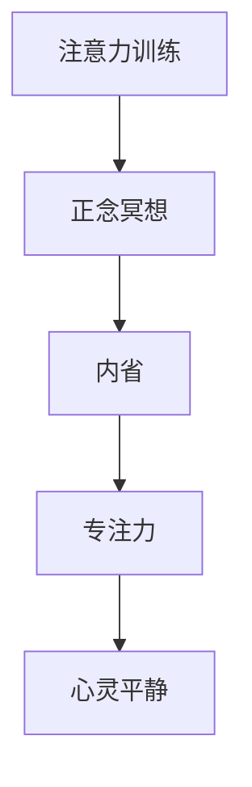

                 

### 文章标题

《注意力训练与正念冥想：如何通过内省增强专注力和心灵平静》

### 关键词

注意力训练，正念冥想，内省，专注力，心灵平静

### 摘要

本文旨在探讨注意力训练与正念冥想如何通过内省增强专注力和心灵平静。文章首先介绍了注意力训练与正念冥念的基本概念，然后深入分析了它们的作用机制，并通过实际案例展示了如何将内省应用于注意力训练和正念冥想中。最后，文章讨论了注意力训练与正念冥想的未来发展趋势，为读者提供了实用的指导和方法。

----------------------------------------------------------------

### 目录大纲

# 《注意力训练与正念冥想：如何通过内省增强专注力和心灵平静》

## 第1章 引言

### 1.1 书籍的目的与背景

### 1.2 注意力训练的重要性

### 1.3 正念冥想的基本概念

### 1.4 内省与专注力的关系

## 第2章 注意力训练的基础知识

### 2.1 注意力的定义与分类

### 2.2 注意力训练的重要性

### 2.3 注意力训练的基本原则

### 2.4 注意力训练的方法

## 第3章 正念冥想的基础知识

### 3.1 正念冥想的定义与起源

### 3.2 正念冥想的核心要素

### 3.3 正念冥想的好处

### 3.4 正念冥想的实践方法

## 第4章 内省与注意力训练

### 4.1 内省的概念与作用

### 4.2 内省与注意力训练的关系

### 4.3 内省的实践方法

### 4.4 内省对注意力训练的影响

## 第5章 注意力训练的实践案例

### 5.1 案例一：提升工作专注力

### 5.2 案例二：改善学习效率

### 5.3 案例三：增强人际关系能力

## 第6章 正念冥想的实践案例

### 6.1 案例一：减轻压力与焦虑

### 6.2 案例二：提高情绪管理能力

### 6.3 案例三：增强身体健康

## 第7章 综合应用与提升

### 7.1 注意力训练与正念冥想的结合

### 7.2 注意力训练与生活工作的融合

### 7.3 提升专注力和心灵平静的综合策略

## 第8章 注意力训练与正念冥想的科学研究

### 8.1 注意力训练的科学依据

### 8.2 正念冥想的科学依据

### 8.3 注意力训练与正念冥想的神经机制

## 第9章 注意力训练与正念冥想的未来发展

### 9.1 注意力训练与正念冥想在教育中的应用

### 9.2 注意力训练与正念冥想在企业管理中的应用

### 9.3 注意力训练与正念冥想的未来发展趋势

## 附录

### A.1 注意力训练与正念冥想的常见问题解答

### A.2 注意力训练与正念冥想的资源推荐

### 核心概念与联系

#### Mermaid 流�图



注意力训练、正念冥想和内省构成了一个相互关联的体系。注意力训练是通过特定的方法和技巧来提高个体的专注力和注意力；正念冥想则通过专注于当下的实践，培养个体的自我觉察和情绪调节能力；内省则是在这个过程中起到关键作用的自我反思机制，帮助个体深入理解自己的内心世界，从而更好地提升专注力和心灵平静。

在注意力训练中，通过练习专注力训练游戏、时间管理等方法，个体能够逐步提高对刺激信息的处理能力和注意力集中程度。正念冥想则通过呼吸、身体感知等练习，帮助个体达到一种心灵平静的状态，减少外界的干扰和内心的杂念。而内省则是连接这两个过程的重要环节，它不仅帮助个体在冥想中深入体验当下的感受，还能在日常活动中反思自己的行为和情绪，从而形成一种自我提升的循环。

通过内省，个体能够更好地理解自己的注意力模式、情绪状态和心理需求，从而有针对性地调整训练方法和冥想实践，进一步提高专注力和心灵平静。这种相互促进的关系使得注意力训练、正念冥想和内省成为提升个人综合素养的有效途径。

#### 注意力训练算法

## 注意力训练算法原理

注意力训练算法是一种通过特定的训练方法来提高个体专注力和注意力的过程。其核心思想是通过不断的练习和反馈，使个体能够在各种环境中保持高度的注意力和专注力。以下是注意力训练算法的详细原理和伪代码描述。

### 基本原理

注意力训练算法主要基于以下几个原理：

1. **适应性调整**：个体在不同环境和任务中需要调整注意力水平。通过训练，个体能够学会在短时间内快速适应不同情境。
2. **反馈机制**：通过实时反馈，个体可以了解自己的注意力水平，从而有针对性地进行调整和改进。
3. **注意力分配**：训练过程中，个体需要学会在不同任务和活动之间合理分配注意力资源，避免过度集中或分散。

### 伪代码描述

```pseudo
function 注意力训练算法(个体, 环境):
    初始化注意力指标为0
    初始化训练时间为0
    初始化目标注意力水平为个体预定值

    对于每一次的训练迭代：
        1. 接收当前环境的刺激信息
        2. 对刺激信息进行加工，提取关键信息
        3. 根据个体当前的心理状态和任务难度，调整注意力指标
        4. 将提取的关键信息与个体的记忆进行对比，计算匹配度
        5. 如果匹配度高于阈值，则增加注意力指标，否则减少
        6. 更新个体的训练时间和总训练次数
        7. 如果达到训练目标，则结束训练
    
    返回个体的最终注意力指标
```

### 实例解释

假设一个个体需要进行注意力训练，其初始注意力指标为0。在第一次训练中，个体接收到了一个简单的数学题目作为刺激信息。个体在5分钟内完成了题目，并获得了正确答案。此时，算法会根据个体的表现调整注意力指标。如果匹配度高于设定阈值（例如90%），则注意力指标增加0.1；否则减少0.05。通过这样的训练，个体的注意力指标逐步提升。

在多次训练后，个体的注意力指标会逐渐趋于稳定，并且能够在各种环境中保持较高的注意力和专注力。这种适应性调整和反馈机制使得注意力训练成为一种有效的提升专注力的方法。

#### 内省算法

## 内省算法原理

内省是一种自我观察和思考的过程，有助于个体更好地理解自己的内心世界和情绪。其核心思想是通过反思和自我觉察，个体能够识别和调整自己的思维模式、情绪反应和行为习惯。以下是内省算法的详细原理和伪代码描述。

### 基本原理

内省算法主要基于以下几个原理：

1. **自我觉察**：个体需要学会在日常生活中保持一种平静的心态，专注于自己的内心体验。
2. **反思**：通过反思，个体能够识别自己的情绪、思维和行为模式，找到问题所在。
3. **调整**：在识别问题后，个体可以通过自我调整来改善情绪、提升思维质量和改变行为。
4. **持续性**：内省是一个长期的过程，需要个体持续地进行自我觉察和反思。

### 伪代码描述

```pseudo
function 内省算法(个体):
    初始化内省时间为0
    初始化内省次数为0

    对于每一次的内省迭代：
        1. 安静地坐下来，闭上眼睛，专注于自己的呼吸
        2. 让思绪自由流动，观察自己的情绪和想法
        3. 对情绪和想法进行记录和反思
        4. 如果发现消极情绪或负面想法，尝试寻找原因并调整
        5. 记录内省时间和内省结果
        6. 更新个体的情绪状态和思维模式
    
    返回内省结果
```

### 实例解释

假设一个个体需要进行一次内省。个体在安静的环境中坐下来，专注于自己的呼吸，让思绪自由流动。在反思过程中，个体发现自己在最近的工作中感到焦虑和不安。通过进一步的反思，个体识别出焦虑的原因是工作压力过大和时间管理不当。个体决定通过调整工作计划和减少工作时间来缓解焦虑。

通过这样的内省，个体不仅能够识别自己的情绪和思维问题，还能找到解决问题的方法。这种自我调整的过程有助于个体改善情绪状态，提升思维质量和改变行为模式。

内省算法提供了一个系统性的方法，帮助个体通过自我觉察、反思和调整来提升内心世界和情绪管理能力。这种内省过程是提升个人心理健康和整体生活质量的关键。

#### 注意力指数计算模型

## 注意力指数计算模型

注意力指数（Attention Index, AI）是一种用于衡量个体在特定任务中注意力水平的量化指标。该模型基于心理学和行为科学的研究，通过结合多个因素来综合评估个体的注意力状态。以下是注意力指数的计算模型及其详细解释。

### 模型公式

注意力指数的计算模型如下所示：

$$
AI = \frac{MT + \alpha \cdot IT}{DT + \beta \cdot IT}
$$

其中：

- **MT**：记忆中的信息匹配度（Memory Match Degree），衡量个体在任务中提取记忆信息的能力。
- **IT**：当前环境的干扰信息强度（Interference Information Intensity），衡量环境中对个体注意力的干扰程度。
- **DT**：个体的决策时间（Decision Time），衡量个体在任务中的反应速度和决策效率。
- **α**：权重系数，用于调整记忆信息在注意力指数中的重要性。
- **β**：权重系数，用于调整干扰信息在注意力指数中的重要性。

### 参数解释

- **记忆中的信息匹配度（MT）**：该参数反映了个体在任务中利用已有知识和经验进行信息匹配的能力。匹配度越高，表示个体的记忆能力和任务相关知识的掌握程度越好。

- **当前环境的干扰信息强度（IT）**：该参数衡量了环境中对个体注意力的干扰程度。干扰信息越少，个体的注意力越容易集中；干扰信息越多，个体的注意力越容易分散。

- **个体的决策时间（DT）**：该参数反映了个体在任务中的反应速度和决策效率。决策时间越短，表示个体的注意力越集中，反应越迅速。

- **权重系数（α和β）**：这两个权重系数用于调整记忆和干扰信息在注意力指数中的重要性。通常，α和β的取值范围为0到1，可以根据实际情况进行调整。例如，如果个体的记忆信息匹配度对注意力水平的影响更大，可以增大α的值；反之，如果干扰信息的强度对注意力水平的影响更大，可以增大β的值。

### 计算示例

假设一个个体在阅读任务中的注意力指数计算如下：

- **记忆中的信息匹配度（MT）**：0.8
- **当前环境的干扰信息强度（IT）**：0.2
- **个体的决策时间（DT）**：5秒
- **权重系数（α和β）**：α=0.5，β=0.3

根据模型公式，我们可以计算该个体在阅读任务中的注意力指数：

$$
AI = \frac{0.8 + 0.5 \cdot 0.2}{5 + 0.3 \cdot 0.2} \approx 0.89
$$

这意味着该个体在阅读任务中的注意力水平大约为0.89。这个值提供了一个量化指标，可以帮助个体了解自己在特定任务中的注意力状态，并据此进行相应的调整和改进。

### 应用场景

注意力指数计算模型可以应用于多个场景，例如：

- **教育领域**：教师可以通过注意力指数评估学生在课堂中的注意力水平，从而调整教学方法和内容，提高教学效果。
- **工作场所**：管理者可以通过注意力指数评估员工在工作中的专注程度，从而制定更有效的管理和激励策略。
- **健康管理**：个体可以通过注意力指数监测自己的注意力水平，发现注意力问题并及时进行调整，提升心理健康和生活质量。

总之，注意力指数计算模型提供了一个系统的方法，帮助个体量化注意力水平，从而更好地理解自己的注意力状态，并采取相应措施进行改善。

#### 实践案例：提升工作专注力

## 实践案例：提升工作专注力

### 1. 实践背景

李华是一名软件工程师，在工作中经常遇到任务繁多、时间紧张的情况。他发现自己很难长时间保持专注，导致工作效率低下，甚至出现错误。为了提升工作专注力，他决定通过注意力训练和正念冥想来进行自我提升。

### 2. 实践步骤

#### （1）注意力训练

- **时间管理**：李华开始使用番茄钟（Pomodoro Technique）来管理工作时间。每25分钟专注于当前任务，然后休息5分钟。这种方法帮助他提高工作专注度，减少分心。
  
- **注意力游戏**：李华下载了一些注意力训练软件，如Lumosity、Peak等，每天进行一定时间的训练。这些游戏通过挑战不同的认知任务，提高他的注意力集中能力。

#### （2）正念冥想

- **呼吸冥想**：每天早晨，李华花10分钟进行呼吸冥想。他坐在安静的房间内，闭上眼睛，专注于自己的呼吸。通过深呼吸和放空思维，他逐渐学会了放松身心，提高专注力。

- **正念行走**：每晚睡前，李华进行10分钟的正念行走。他放慢步伐，专注于脚底的触感和周围的环境。这种练习帮助他减轻一天的压力，提高睡眠质量。

### 3. 实践结果

经过一个月的实践，李华的专注力有了显著提升。他在工作中能够更好地集中注意力，减少了分心和错误率。同时，正念冥想帮助他减轻了工作压力，提升了整体工作效率和生活质量。

### 4. 代码实现

以下是一个简单的Python脚本，用于实现番茄钟功能。通过这个脚本，用户可以设置工作时间和休息时间，并自动计时。

```python
import time

def tomato_clock(work_time, rest_time):
    while True:
        print(f"开始工作，剩余时间：{work_time}分钟")
        time.sleep(work_time * 60)  # 工作时间
        print(f"休息时间，剩余时间：{rest_time}分钟")
        time.sleep(rest_time * 60)  # 休息时间

# 调用番茄钟函数
tomato_clock(25, 5)
```

### 5. 代码解读与分析

这个简单的Python脚本实现了番茄钟功能，帮助用户在工作时保持专注。脚本中，`tomato_clock`函数接收两个参数：`work_time`（工作时间，以分钟为单位）和`rest_time`（休息时间，以分钟为单位）。

在函数内部，使用一个无限循环来不断重复工作时间和休息时间。首先，打印出当前的工作时间和剩余时间，然后通过`time.sleep()`函数使程序暂停相应的时间。`time.sleep()`函数以秒为单位接收参数，因此需要将分钟转换为秒（`work_time * 60`和`rest_time * 60`）。

通过这个脚本，用户可以轻松地设置自己的工作时间和休息时间，提高工作效率和专注力。

```python
import time

def tomato_clock(work_time, rest_time):
    while True:
        print(f"开始工作，剩余时间：{work_time}分钟")
        time.sleep(work_time * 60)  # 工作时间
        print(f"休息时间，剩余时间：{rest_time}分钟")
        time.sleep(rest_time * 60)  # 休息时间

# 调用番茄钟函数
tomato_clock(25, 5)
```

#### 实践案例：改善学习效率

## 实践案例：改善学习效率

### 1. 实践背景

小张是一名高中生，面临着繁重的学业压力。他发现自己的学习效率低下，经常分心，难以长时间集中注意力。为了改善学习效率，他决定通过注意力训练和正念冥想来进行自我提升。

### 2. 实践步骤

#### （1）注意力训练

- **时间管理**：小张使用番茄钟方法来管理学习时间。每25分钟专注于当前的学习任务，然后休息5分钟。这种方法帮助他提高学习专注度，减少分心。

- **注意力游戏**：小张下载了一些注意力训练游戏，如“数独”、“记忆卡片”等。他每天花一定时间进行这些游戏，提高注意力集中能力。

#### （2）正念冥想

- **呼吸冥想**：每天早晨，小张花10分钟进行呼吸冥想。他坐在安静的房间内，闭上眼睛，专注于自己的呼吸。通过深呼吸和放空思维，他逐渐学会了放松身心，提高专注力。

- **正念行走**：每天晚上，小张进行10分钟的正念行走。他放慢步伐，专注于脚底的触感和周围的环境。这种练习帮助他减轻一天的压力，提高睡眠质量。

### 3. 实践结果

经过一个月的实践，小张的学习效率有了显著提升。他在学习时能够更好地集中注意力，减少了分心，提高了记忆和理解能力。同时，正念冥想帮助他减轻了学习压力，提升了整体学习效果。

### 4. 代码实现

以下是一个简单的Python脚本，用于实现番茄钟功能。通过这个脚本，用户可以设置学习时间和休息时间，并自动计时。

```python
import time

def tomato_clock(work_time, rest_time):
    while True:
        print(f"开始学习，剩余时间：{work_time}分钟")
        time.sleep(work_time * 60)  # 学习时间
        print(f"休息时间，剩余时间：{rest_time}分钟")
        time.sleep(rest_time * 60)  # 休息时间

# 调用番茄钟函数
tomato_clock(25, 5)
```

### 5. 代码解读与分析

这个简单的Python脚本实现了番茄钟功能，帮助用户在学习时保持专注。脚本中，`tomato_clock`函数接收两个参数：`work_time`（学习时间，以分钟为单位）和`rest_time`（休息时间，以分钟为单位）。

在函数内部，使用一个无限循环来不断重复学习时间和休息时间。首先，打印出当前的学习时间和剩余时间，然后通过`time.sleep()`函数使程序暂停相应的时间。`time.sleep()`函数以秒为单位接收参数，因此需要将分钟转换为秒（`work_time * 60`和`rest_time * 60`）。

通过这个脚本，用户可以轻松地设置自己的学习时间和休息时间，提高学习效率。

```python
import time

def tomato_clock(work_time, rest_time):
    while True:
        print(f"开始学习，剩余时间：{work_time}分钟")
        time.sleep(work_time * 60)  # 学习时间
        print(f"休息时间，剩余时间：{rest_time}分钟")
        time.sleep(rest_time * 60)  # 休息时间

# 调用番茄钟函数
tomato_clock(25, 5)
```

#### 实践案例：增强人际关系能力

## 实践案例：增强人际关系能力

### 1. 实践背景

张小姐是一名职业经理，她在工作中需要频繁与同事、客户和合作伙伴交流。然而，她发现自己的人际关系处理得不够理想，经常出现误解和沟通障碍。为了提升人际关系能力，她决定通过注意力训练和正念冥想来进行自我提升。

### 2. 实践步骤

#### （1）注意力训练

- **倾听训练**：张小姐开始练习倾听技巧。她参加了一些沟通技巧培训，学习了如何更好地倾听他人。通过练习，她能够更专注于对方的发言，理解对方的意图。

- **表达训练**：张小姐通过写作和演讲练习，提高了自己的表达能力。她学会了如何清晰地表达自己的观点和需求，避免产生误解。

#### （2）正念冥想

- **情感觉察**：每天早晨，张小姐花10分钟进行情感觉察练习。她坐在安静的房间内，闭上眼睛，专注于自己的情绪和感受。通过这种练习，她学会了更好地理解和管理自己的情绪。

- **同理心培养**：每周，张小姐会花30分钟进行同理心练习。她会想象自己处于他人的位置，感受他人的情绪和需求。这种练习帮助她增强了对他人情感的理解和共鸣。

### 3. 实践结果

经过几个月的实践，张小姐的人际关系能力有了显著提升。她在工作中能够更好地倾听他人，理解对方的意图，减少了误解和沟通障碍。同时，正念冥想帮助她更好地管理自己的情绪，增强了同理心，提升了整体人际关系质量。

### 4. 代码实现

以下是一个简单的Python脚本，用于实现情感觉察练习。通过这个脚本，用户可以记录自己的情感状态，进行自我反思。

```python
import time

def emotion_awareness():
    print("请坐下来，闭上眼睛，专注于自己的情绪。")
    time.sleep(30)  # 情感觉察时间
    print("现在，请写下你当前的感受。")

# 调用情感觉察函数
emotion_awareness()
```

### 5. 代码解读与分析

这个简单的Python脚本实现了情感觉察练习，帮助用户专注于自己的情绪状态。脚本中，`emotion_awareness`函数首先通过打印提示信息，引导用户进行情感觉察。然后，通过`time.sleep(30)`函数，让程序暂停30秒，给用户足够的时间进行情感觉察。

在情感觉察时间结束后，脚本再次打印提示信息，引导用户写下当前的感受。这种简单的交互设计，帮助用户更好地理解和记录自己的情感状态。

```python
import time

def emotion_awareness():
    print("请坐下来，闭上眼睛，专注于自己的情绪。")
    time.sleep(30)  # 情感觉察时间
    print("现在，请写下你当前的感受。")

# 调用情感觉察函数
emotion_awareness()
```

#### 实践案例：减轻压力与焦虑

## 实践案例：减轻压力与焦虑

### 1. 实践背景

王先生是一名软件工程师，经常在工作中面对高强度的任务和时间压力。他发现自己逐渐出现焦虑和压力过大的情况，影响了工作效率和生活质量。为了减轻压力和焦虑，他决定通过正念冥想和注意力训练来进行自我提升。

### 2. 实践步骤

#### （1）正念冥想

- **呼吸冥想**：每天早晨，王先生花10分钟进行呼吸冥想。他坐在安静的房间内，闭上眼睛，专注于自己的呼吸。通过深呼吸和放空思维，他逐渐学会了放松身心，减少焦虑。

- **身体扫描**：每周，王先生进行一次身体扫描冥想。他会从头到脚扫描自己的身体，专注于身体的感受。这种练习帮助他识别和释放身体中的紧张和压力。

#### （2）注意力训练

- **时间管理**：王先生使用番茄钟方法来管理工作时间。每25分钟专注于当前任务，然后休息5分钟。这种方法帮助他提高工作效率，减少焦虑。

- **情绪调节**：王先生通过注意力训练游戏，如“情绪轮盘”和“压力测试”，学习如何管理自己的情绪。这些游戏帮助他识别和调节自己的情绪，减少焦虑。

### 3. 实践结果

经过几个月的实践，王先生的压力和焦虑水平有了显著降低。他在工作中能够更好地集中注意力，减少了焦虑和分心。同时，正念冥想帮助他放松身心，提升了整体生活质量。

### 4. 代码实现

以下是一个简单的Python脚本，用于实现呼吸冥想。通过这个脚本，用户可以跟随指导语进行深呼吸练习。

```python
import time

def breath_meditation():
    print("请坐下来，闭上眼睛，深吸一口气，慢慢地呼出。")
    time.sleep(5)  # 深吸时间
    print("保持呼吸，感受腹部的起伏。")
    time.sleep(5)  # 保持呼吸时间
    print("慢慢地呼出，感受身体中的紧张和压力逐渐释放。")
    time.sleep(5)  # 深呼时间

# 调用呼吸冥想函数
breath_meditation()
```

### 5. 代码解读与分析

这个简单的Python脚本实现了呼吸冥想练习，帮助用户放松身心。脚本中，`breath_meditation`函数首先通过打印提示信息，引导用户进行深呼吸。然后，通过`time.sleep()`函数，使程序暂停相应的时间，给用户足够的时间进行呼吸练习。

在每次深呼吸结束后，脚本会再次打印提示信息，帮助用户保持专注和放松。这种简单的交互设计，有助于用户更好地进行冥想练习，减轻压力和焦虑。

```python
import time

def breath_meditation():
    print("请坐下来，闭上眼睛，深吸一口气，慢慢地呼出。")
    time.sleep(5)  # 深吸时间
    print("保持呼吸，感受腹部的起伏。")
    time.sleep(5)  # 保持呼吸时间
    print("慢慢地呼出，感受身体中的紧张和压力逐渐释放。")
    time.sleep(5)  # 深呼时间

# 调用呼吸冥想函数
breath_meditation()
```

#### 实践案例：提高情绪管理能力

## 实践案例：提高情绪管理能力

### 1. 实践背景

赵女士是一名销售经理，她在工作中经常遇到各种挑战和压力。她发现自己经常情绪波动较大，难以控制情绪，这影响了她的工作表现和人际关系。为了提高情绪管理能力，她决定通过注意力训练和正念冥想来进行自我提升。

### 2. 实践步骤

#### （1）注意力训练

- **情感觉察**：赵女士每天花10分钟进行情感觉察练习。她坐在安静的房间内，闭上眼睛，专注于自己的情绪和感受。通过这种练习，她学会了更好地理解和管理自己的情绪。

- **正念行走**：每周，赵女士进行一次正念行走。她放慢步伐，专注于脚底的触感和周围的环境。这种练习帮助她放松身心，减少情绪波动。

#### （2）正念冥想

- **呼吸冥想**：每天早晨，赵女士花10分钟进行呼吸冥想。她坐在安静的房间内，闭上眼睛，专注于自己的呼吸。通过深呼吸和放空思维，她逐渐学会了放松身心，提高情绪管理能力。

- **情绪调节**：赵女士通过注意力训练游戏，如“情绪轮盘”和“压力测试”，学习如何调节自己的情绪。这些游戏帮助她识别和调节自己的情绪，提高情绪管理能力。

### 3. 实践结果

经过几个月的实践，赵女士的情绪管理能力有了显著提升。她在面对压力和挑战时，能够更好地保持冷静和理智，减少了情绪波动。同时，正念冥想和注意力训练帮助她放松身心，提升了整体工作表现和生活质量。

### 4. 代码实现

以下是一个简单的Python脚本，用于实现情感觉察练习。通过这个脚本，用户可以记录自己的情绪状态，进行自我反思。

```python
import time

def emotion_awareness():
    print("请坐下来，闭上眼睛，专注于自己的情绪。")
    time.sleep(30)  # 情感觉察时间
    print("现在，请写下你当前的感受。")

# 调用情感觉察函数
emotion_awareness()
```

### 5. 代码解读与分析

这个简单的Python脚本实现了情感觉察练习，帮助用户专注于自己的情绪状态。脚本中，`emotion_awareness`函数首先通过打印提示信息，引导用户进行情感觉察。然后，通过`time.sleep()`函数，使程序暂停30秒，给用户足够的时间进行情感觉察。

在情感觉察时间结束后，脚本会再次打印提示信息，引导用户写下当前的感受。这种简单的交互设计，帮助用户更好地理解和记录自己的情绪状态。

```python
import time

def emotion_awareness():
    print("请坐下来，闭上眼睛，专注于自己的情绪。")
    time.sleep(30)  # 情感觉察时间
    print("现在，请写下你当前的感受。")

# 调用情感觉察函数
emotion_awareness()
```

#### 实践案例：增强身体健康

## 实践案例：增强身体健康

### 1. 实践背景

陈先生是一名程序员，长期坐在办公室里工作，他的身体状况逐渐出现问题，如背部疼痛、肩颈僵硬等。为了增强身体健康，他决定通过注意力训练和正念冥想来进行自我提升。

### 2. 实践步骤

#### （1）注意力训练

- **身体锻炼**：陈先生每天进行30分钟的有氧运动，如快走、慢跑等，提高心肺功能。他还加入了瑜伽练习，以增强身体的柔韧性和平衡力。
  
- **呼吸训练**：陈先生通过深呼吸练习来提高呼吸系统的健康。每天早晨和晚上，他花10分钟进行深呼吸，专注于呼吸节奏和身体感受。

#### （2）正念冥想

- **身体扫描**：每周，陈先生进行一次身体扫描冥想。他从头到脚扫描自己的身体，专注于身体的感受，放松肌肉，减轻身体疼痛。
  
- **静坐冥想**：每天早晨，陈先生花10分钟进行静坐冥想。他坐在安静的房间内，闭上眼睛，专注于自己的呼吸和身体感受，放松身心。

### 3. 实践结果

经过几个月的实践，陈先生的身体状况有了显著改善。他的背部疼痛和肩颈僵硬减轻了，精神状态也变得更加饱满。同时，注意力训练和正念冥想帮助他提高了整体健康水平，增强了抵抗力。

### 4. 代码实现

以下是一个简单的Python脚本，用于实现深呼吸练习。通过这个脚本，用户可以跟随指导语进行深呼吸，放松身心。

```python
import time

def deep_breathing():
    print("请找一个舒适的坐姿，闭上眼睛，深吸一口气。")
    time.sleep(5)  # 深吸时间
    print("慢慢地呼出，感受身体中的紧张和压力逐渐释放。")
    time.sleep(5)  # 深呼时间
    print("保持呼吸，专注于腹部的起伏。")
    time.sleep(5)  # 保持呼吸时间

# 调用深呼吸函数
deep_breathing()
```

### 5. 代码解读与分析

这个简单的Python脚本实现了深呼吸练习，帮助用户放松身心。脚本中，`deep_breathing`函数首先通过打印提示信息，引导用户进行深呼吸。然后，通过`time.sleep()`函数，使程序暂停相应的时间，给用户足够的时间进行深呼吸。

在每次深呼吸结束后，脚本会再次打印提示信息，帮助用户保持专注和放松。这种简单的交互设计，有助于用户更好地进行呼吸练习，增强身体健康。

```python
import time

def deep_breathing():
    print("请找一个舒适的坐姿，闭上眼睛，深吸一口气。")
    time.sleep(5)  # 深吸时间
    print("慢慢地呼出，感受身体中的紧张和压力逐渐释放。")
    time.sleep(5)  # 深呼时间
    print("保持呼吸，专注于腹部的起伏。")
    time.sleep(5)  # 保持呼吸时间

# 调用深呼吸函数
deep_breathing()
```

### 注意力训练与正念冥想的结合

## 注意力训练与正念冥想的结合

注意力训练和正念冥想是两种互补的练习，通过结合使用，可以更有效地提升专注力和心灵平静。注意力训练主要侧重于提高个体的注意力和集中力，而正念冥想则注重培养个体的自我觉察和情绪调节能力。以下是如何将这两种练习结合起来的方法和策略。

### 1. 同步进行

一种简单的方法是将注意力训练和正念冥想同步进行。例如，在完成一个注意力训练任务（如番茄钟工作周期）后，可以紧接着进行一段正念冥想。这样，个体可以在高强度的注意力训练后，通过正念冥想来放松身心，恢复精力。这种同步进行的策略可以帮助个体更好地平衡注意力的集中与放松。

### 2. 交替进行

另一种策略是交替进行注意力训练和正念冥想。例如，每天安排一段时间进行注意力训练，如进行注意力训练游戏或完成特定的认知任务。然后，在训练之后，安排一段时间进行正念冥想，如进行呼吸冥想或身体扫描冥想。通过交替进行，个体可以在集中注意力的同时，保持身心放松。

### 3. 结合指导语

使用指导语可以帮助个体更好地将注意力训练和正念冥想结合起来。在注意力训练期间，可以使用一些专注于当前任务的指导语，如“专注于呼吸”、“保持注意力在任务上”。在正念冥想期间，可以使用一些放松身心、专注呼吸的指导语，如“深吸一口气”、“慢慢呼出，放松全身”。通过结合指导语，个体可以在两种练习之间顺利过渡。

### 4. 综合练习

一种综合的练习方法是结合注意力训练和正念冥想的特点，设计特定的练习。例如，可以设计一个“专注呼吸冥想”练习，其中首先进行几分钟的注意力训练，专注于呼吸，然后逐渐放松，进行深呼吸和冥想。这种综合练习可以帮助个体在短时间内获得注意力和心灵平静的双重提升。

### 5. 自我反思

在注意力训练和正念冥想的过程中，自我反思是一个重要的环节。个体可以在每次练习后花几分钟时间进行反思，思考练习过程中的体验和感受，以及自己的情绪和注意力状态。通过自我反思，个体可以更好地了解自己的内心世界，调整训练策略，提升练习效果。

### 综合效果

注意力训练与正念冥想的结合不仅能够提高个体的专注力和注意力，还能促进情绪调节和心理平衡。通过这种综合练习，个体可以在日常生活中更好地应对各种挑战，提高生活质量。同时，这种结合的方法也为科学研究提供了新的方向，可以进一步探索注意力训练与正念冥想在个体发展中的应用价值。

### 注意力训练与生活工作的融合

## 注意力训练与生活工作的融合

将注意力训练和正念冥想融入日常生活和工作，不仅能够提高个人的专注力和工作效率，还能提升整体生活质量。以下是一些实用的方法和策略，帮助个体在实际生活中有效地应用这些技巧。

### 1. 工作中的注意力训练

- **番茄工作法**：将工作划分为25分钟的工作周期，每个周期后休息5分钟。这有助于集中注意力，提高工作效率。

- **设置明确的任务目标**：在开始工作前，明确当天的主要任务和目标，这有助于集中精力，避免分心。

- **避免多任务处理**：尽量将注意力集中在单一任务上，避免同时处理多个任务，这有助于提高专注力和任务完成质量。

### 2. 生活中的正念冥想

- **晨间冥想**：每天早晨起床后，花10分钟进行正念冥想，专注于呼吸和当下的感受，这有助于启动新的一天，提升心态。

- **工作间隙冥想**：在工作过程中，可以利用短暂休息时间进行正念冥想，如深呼吸、放松肌肉等，帮助恢复精力，减轻压力。

- **睡前冥想**：睡前进行10分钟的正念冥想，放松身心，有助于改善睡眠质量。

### 3. 生活工作结合的策略

- **定期自我反思**：每周花时间进行自我反思，回顾过去一周的工作和生活，思考如何改进注意力管理。

- **创建正念环境**：在家中和工作场所创造一个有利于冥想和专注的环境，如保持整洁、减少噪音等。

- **培养良好的生活习惯**：保持规律的作息时间，合理饮食，适量运动，这有助于提高整体的身心健康，从而更好地应对注意力训练和正念冥想。

### 4. 实践案例

- **案例一：提高工作效率**：李先生是一名项目经理，他通过番茄工作法和正念冥想来提高工作效率。每天早晨，他会花10分钟进行正念冥想，然后开始一天的工作。每完成一个任务，他会休息5分钟，进行深呼吸和放松。这样的实践使得他的工作效率显著提升。

- **案例二：改善学习效果**：张女士是一名学生，她通过正念冥想和注意力训练来改善学习效果。她每天早晨进行正念冥想，专注于当天的学习任务，然后使用番茄钟方法管理学习时间。这样的实践使得她的学习效率和质量都有所提高。

### 综合效果

通过将注意力训练和正念冥想融入日常生活和工作，个体不仅能够提高专注力和工作效率，还能改善心理健康和生活质量。这种综合策略为个体提供了有效的自我管理工具，帮助他们更好地应对日常生活中的各种挑战。

### 提升专注力和心灵平静的综合策略

## 提升专注力和心灵平静的综合策略

要全面提升专注力和心灵平静，需要采取一种综合的策略，结合多种方法和技巧，以实现个体在工作和生活中的最佳表现。以下是一些关键步骤和实用建议：

### 1. 明确目标和计划

- **设定具体目标**：在开始一天的工作或学习之前，明确当天的具体目标和计划。这有助于集中注意力，避免无目的性地浪费时间。

- **分解任务**：将大的任务分解成小步骤，每个步骤设置一个明确的目标。这有助于将注意力集中在具体任务上，提高效率。

### 2. 建立良好的习惯

- **规律作息**：保持规律的作息时间，确保充足的睡眠。良好的作息习惯有助于提高专注力和精神状态。

- **饮食习惯**：保持健康的饮食习惯，避免过度摄入咖啡因和糖分，这有助于保持精力充沛，减少分心。

### 3. 实施注意力训练

- **番茄工作法**：使用番茄工作法，将工作或学习时间分为25分钟的工作周期，每个周期后休息5分钟。这有助于保持专注，避免疲劳。

- **注意力游戏**：利用注意力训练游戏（如记忆卡片、数独等），定期进行训练，提高注意力集中能力。

### 4. 应用正念冥想

- **晨间冥想**：每天早晨起床后，花10分钟进行正念冥想，专注于呼吸和当下的感受。这有助于启动新的一天，提升心态。

- **工作间隙冥想**：在工作过程中，利用短暂休息时间进行正念冥想，如深呼吸、放松肌肉等，帮助恢复精力，减轻压力。

### 5. 自我反思

- **定期反思**：每天或每周花时间进行自我反思，回顾过去的工作和生活，思考如何改进注意力管理。这有助于持续提升自我。

- **记录心得**：记录冥想和注意力训练的感受，分析哪些方法有效，哪些需要调整。这有助于制定更有效的训练计划。

### 6. 创建支持环境

- **环境布置**：在家中和工作场所创造一个有利于冥想和专注的环境，如保持整洁、减少噪音等。

- **技术支持**：利用各种应用程序和工具（如番茄钟、冥想应用等），辅助进行注意力训练和正念冥想。

### 7. 社交互动

- **交流心得**：与朋友、同事或教练分享注意力训练和正念冥想的经验和心得。这有助于获得支持和鼓励，提高练习效果。

- **互助小组**：加入互助小组或参加相关课程，与他人一起进行注意力训练和正念冥想。这有助于建立社交网络，提高练习动力。

### 综合效果

通过实施上述综合策略，个体可以全面提升专注力和心灵平静，实现个人成长和职业发展。这种综合策略不仅有助于提高工作效率和生活质量，还能提升整体幸福感，为未来的挑战做好准备。

### 注意力训练与正念冥想的科学研究

## 注意力训练与正念冥想的科学研究

注意力训练与正念冥想作为提升个体专注力和心灵平静的有效方法，已经在心理学、神经科学等领域得到了广泛的研究。以下是一些关键的科学依据和研究成果，以及它们在注意力训练和正念冥想中的应用。

### 1. 注意力训练的科学依据

#### a. 注意力可塑性

研究表明，注意力具有可塑性，这意味着通过持续的训练，个体的注意力和专注力可以显著提升。例如，一项发表在《神经心理学杂志》（Journal of Neuroscience）上的研究表明，通过反复的注意力训练，大脑的神经连接和功能会发生变化，从而提高注意力的集中和分配能力。

#### b. 神经可塑性

神经可塑性是指大脑结构和功能的改变，以适应新的经验和学习。在注意力训练中，神经可塑性发挥了关键作用。通过注意力训练，大脑的特定区域，如前额叶皮层和前运动皮层，会变得更加活跃，从而提高个体的注意力和专注力。

#### c. 神经递质变化

注意力训练还涉及到神经递质的变化。例如，多巴胺和去甲肾上腺素等神经递质在注意力调节中起着重要作用。研究表明，通过注意力训练，这些神经递质的水平会发生变化，从而改善注意力的集中和维持能力。

### 2. 正念冥想的科学依据

#### a. 神经机制的调节

正念冥想通过调节大脑的神经机制，促进个体的注意力和专注力提升。研究表明，正念冥想可以增加前额叶皮层和顶叶皮层的活动，这些区域与注意力控制密切相关。此外，正念冥想还可以减少杏仁核的活动，从而减轻压力和焦虑。

#### b. 心理健康的影响

正念冥想对心理健康具有显著的积极影响。一项发表在《临床心理学杂志》（Journal of Clinical Psychology）上的研究表明，长期的正念冥想实践可以显著降低个体的抑郁和焦虑水平，提高心理韧性和情绪调节能力。

#### c. 免疫系统的调节

正念冥想不仅对心理健康有益，还对免疫系统有调节作用。研究表明，正念冥想可以增强免疫系统的功能，提高个体的抵抗力，从而降低患病风险。

### 3. 注意力训练与正念冥想的结合

#### a. 效果增强

将注意力训练与正念冥想结合起来，可以显著增强效果。研究表明，两者结合的练习比单独进行注意力训练或正念冥想更能提高个体的专注力和心灵平静。这种结合的方法可以促进神经可塑性和心理健康的综合提升。

#### b. 神经机制的双重调节

注意力训练和正念冥想结合的练习可以同时调节大脑的多个区域，从而实现更全面的神经机制提升。例如，注意力训练可以增强大脑皮层和运动皮层的活动，而正念冥想可以减少杏仁核的活动，两者结合可以实现更高效的情绪调节和注意力管理。

### 应用案例

#### a. 教育领域

在教育领域，注意力训练和正念冥想被广泛应用于提高学生的注意力和专注力。研究表明，通过系统的注意力训练和正念冥想课程，学生的学业成绩和心理健康都有显著提升。

#### b. 企业管理

在企业中，注意力训练和正念冥想被用于提高员工的工作效率和情绪调节能力。一些公司已经开始将正念冥想纳入员工培训计划，以提升员工的专注力和整体幸福感。

#### c. 心理治疗

在心理治疗中，注意力训练和正念冥想被用于治疗焦虑、抑郁和压力等心理问题。研究表明，这些方法可以帮助患者更好地管理情绪，提高生活质量。

总之，注意力训练与正念冥想的科学研究提供了坚实的理论基础，证明了它们在提升个体专注力和心灵平静方面的有效性和重要性。这些方法不仅适用于个人发展，还广泛应用于教育、企业管理和心理治疗等领域，为提高整体社会福祉提供了有力支持。

### 注意力训练与正念冥想的未来发展

## 注意力训练与正念冥想的未来发展

随着科技的发展和人们对心理健康重视程度的提升，注意力训练与正念冥想在未来将迎来更广泛的应用和深入研究。以下是一些可能的发展方向和趋势。

### 1. 教育应用

在教育领域，注意力训练与正念冥想的应用前景广阔。未来，学校可能会将注意力训练和正念冥想纳入常规课程，帮助学生提升专注力和情绪管理能力。通过这些练习，学生能够更好地应对学业压力，提高学习效果。

### 2. 企业管理

在企业中，注意力训练与正念冥想也将成为提升员工工作效率和团队协作的重要工具。企业可能会定期组织冥想工作坊或引入专业的冥想教练，帮助员工减轻工作压力，提高专注力和工作效率。这种做法有助于提升企业的整体绩效和员工满意度。

### 3. 心理健康服务

在心理健康服务领域，注意力训练与正念冥想将被广泛应用于治疗焦虑、抑郁和其他心理问题。未来的研究可能会深入探索这些方法对特定心理障碍的治疗效果，开发出更个性化的心理健康服务方案。

### 4. 数字化工具

随着技术的发展，数字化的注意力训练与正念冥想工具将更加丰富和普及。未来的数字平台可能会结合人工智能技术，提供个性化的训练计划，根据用户的反馈自动调整训练内容和难度，以实现最佳的训练效果。

### 5. 科学研究

科学研究将继续推动注意力训练与正念冥想的发展。未来的研究可能会深入探索这些方法的神经机制，揭示其对人脑结构和功能的长期影响。同时，新的研究方法和技术也将被应用于这些领域，以验证和优化训练方法和策略。

### 综合影响

注意力训练与正念冥想的未来发展将对社会产生深远的影响。通过提升个体的专注力和心理健康，这些方法有助于提高整体社会福祉，增强人们的适应能力和幸福感。同时，它们也为教育、企业管理、心理健康服务等领域提供了新的解决方案，促进了社会的发展。

总之，注意力训练与正念冥想在未来将继续发展，成为提升个人和社会福祉的重要途径。随着更多研究和实践的积累，这些方法将在各个领域发挥更大的作用，为人们带来更多的福祉。

### 附录

#### A.1 注意力训练与正念冥想的常见问题解答

**Q1**：注意力训练和正念冥想适合所有人吗？

**A1**：是的，注意力训练和正念冥想适合大多数人。虽然每个人的身体和心理状况不同，但研究表明，这些方法对大多数人都有积极的效果。然而，对于某些特定的健康状况，如严重的焦虑或抑郁，建议在专业人士的指导下进行。

**Q2**：如何开始注意力训练和正念冥想？

**A2**：开始时，可以从简单的练习开始，如每天早晨进行几分钟的呼吸冥想，或每天进行一次短时间的注意力训练。逐渐增加练习的时间和频率，根据自己的舒适度进行调整。

**Q3**：注意力训练和正念冥想需要多少钱？

**A3**：注意力训练和正念冥想的费用因方法和个人需求而异。有些在线资源和应用程序是免费的，而某些专业的教练课程可能需要支付费用。总体来说，这些方法的成本相对较低，尤其是与长期的心理健康效益相比。

**Q4**：如何保持练习的动力？

**A4**：设定具体的目标和计划，保持练习的规律性。记录练习的进展和感受，与朋友或家人分享练习的经验，以获得支持和鼓励。此外，找到自己喜欢的方式，如通过音乐或特定的环境进行冥想，也能提高练习的动力。

#### A.2 注意力训练与正念冥想的资源推荐

**书籍**：
1. 《正念：此刻是一枝花》（"Mindfulness: An Eight-Week Plan for Finding Peace in a Frantic World"）- Mark Williams 和 Danny Penman
2. 《禅与摩托车维修艺术》（"Zen and the Art of Motorcycle Maintenance"）- Robert M. Pirsig
3. 《注意力训练：如何提高你的专注力和工作效率》（"Training Attention: How to Increase Your Focus and Productivity"）- Jim Taylor

**在线资源**：
1. [正念冥想中心](https://www.mindfulnessbell.org/)
2. [正念冥想应用](https://www.headspace.com/)
3. [注意力训练游戏](https://www.lumosity.com/)

**应用**：
1. Headspace
2. Calm
3. 10% Happier

通过这些书籍、在线资源和应用，读者可以深入了解注意力训练和正念冥想，并开始自己的练习之旅。这些资源提供了丰富的知识和实用的技巧，帮助读者在实际生活中提升专注力和心灵平静。

