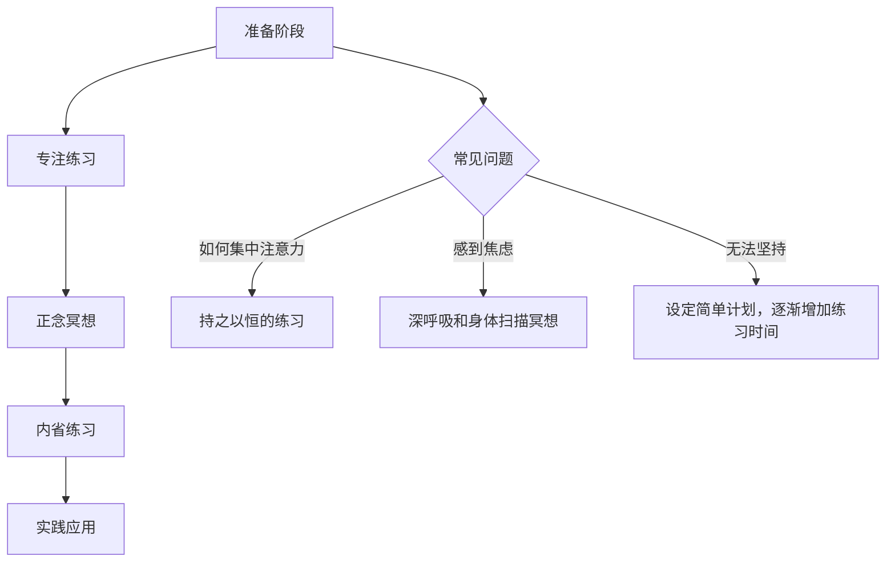

                 

# 注意力训练与正念冥想：通过内省和专注增强心灵平和与清晰度

## 关键词：注意力训练、正念冥想、内省、专注、心灵平和、清晰度

### 摘要

本文旨在探讨注意力训练与正念冥想在提升心灵平和与清晰度方面的作用。通过分析注意力训练与正念冥想的基本理论，本文揭示了二者在心理学与认知科学中的核心原理。文章进一步阐述了注意力训练与正念冥想的实践技巧，包括准备工作、常见冥想技巧和进阶冥想技巧。此外，本文还探讨了内省与专注的概念及其在个人成长中的应用，并分析了心灵平和与清晰度之间的关系。最后，本文介绍了注意力训练与正念冥想在实际应用场景中的价值，并提供了实践指南与案例分析。

### 目录大纲

1. **理论基础**  
   1.1 注意力训练与正念冥想的定义  
   1.2 注意力训练与正念冥想的关系  
   1.3 注意力训练的核心原理  
   1.4 正念冥想的实践技巧  
   1.5 内省与专注的概念与应用

2. **注意力训练的核心原理**  
   2.1 注意力集中机制  
   2.2 注意力训练的方法  
   2.3 注意力训练的误区与挑战

3. **正念冥想的实践技巧**  
   3.1 正念冥想的准备工作  
   3.2 常见的冥想技巧  
   3.3 进阶冥想技巧

4. **内省与专注**  
   4.1 内省的概念与应用  
   4.2 专注的力量  
   4.3 内省与专注的融合

5. **心灵平和与清晰度**  
   5.1 心灵平和的概念  
   5.2 提升清晰度的技巧  
   5.3 心灵平和与清晰度的关系

6. **注意力训练与正念冥想的应用场景**  
   6.1 教育领域的应用  
   6.2 工作压力管理  
   6.3 心理健康促进

7. **实践指南与案例分析**  
   7.1 注意力训练与正念冥想的实践步骤  
   7.2 成功案例分享  
   7.3 实践中的常见问题与解答

8. **总结与展望**  
   8.1 本书内容的回顾  
   8.2 注意力训练与正念冥想的发展趋势

9. **附录**  
   9.1 注意力训练与正念冥想相关资源  
   9.2 附录B：Mermaid流程图

---

### 第一部分：理论基础

#### 1.1 注意力训练与正念冥想的定义

注意力训练（Attention Training）是指通过特定的练习和训练方法，提高个体对特定刺激的注意力和专注能力。正念冥想（Mindfulness Meditation）则是一种通过专注呼吸、身体扫描和意识观察等技巧，培养对当前经验的清晰觉知和接纳心态的实践。

#### 1.2 注意力训练与正念冥想的关系

注意力训练与正念冥想之间存在着密切的联系。一方面，注意力训练提供了正念冥想实践的基础，通过提高个体的注意力集中能力，使冥想过程更加深入和有效。另一方面，正念冥想则有助于增强注意力训练的效果，通过培养个体对内心和外界的觉知，进一步提高注意力的质量。

#### 1.3 注意力训练的核心原理

注意力训练的核心原理包括注意力集中机制、注意力分配模型和注意力训练方法。注意力集中机制是指大脑对特定刺激的集中关注，其核心在于过滤掉无关的干扰信息。注意力分配模型则是指个体在不同任务之间分配注意力的策略，其关键在于平衡任务的优先级和难度。注意力训练方法包括简单重复法、注意力聚焦练习和注意力转移练习，这些方法旨在提高个体的注意力和专注能力。

#### 1.4 正念冥想的实践技巧

正念冥想的实践技巧包括准备工作、常见的冥想技巧和进阶冥想技巧。准备工作主要包括选择合适的冥想环境和调整心理状态，常见的冥想技巧包括呼吸冥想、身体扫描冥想和正念饮食冥想，进阶冥想技巧则包括冥想引导技巧和应对冥想中的障碍。

#### 1.5 内省的概念与应用

内省（Introspection）是指个体对自身思维、情感和行为过程的反思和观察。内省在个人成长中的应用非常广泛，通过内省，个体可以更好地理解自己的内心世界，发现自己的优点和不足，从而实现自我提升。

---

### 第二部分：注意力训练的核心原理

#### 2.1 注意力集中机制

注意力集中机制是指大脑对特定刺激的集中关注过程。其核心在于过滤掉无关的干扰信息，使个体能够专注于当前任务。注意力集中机制包括注意力滤波模型和注意力分配模型。

#### 2.1.1 注意力滤波模型

注意力滤波模型是指大脑通过神经元的激活模式来过滤干扰信息。神经元的不同激活模式决定了哪些信息会被过滤，哪些信息会被关注。通过训练，个体可以增强这些激活模式的稳定性，从而提高注意力的集中程度。

#### 2.1.2 注意力分配模型

注意力分配模型是指个体在不同任务之间分配注意力的策略。这种策略通常基于任务的优先级和难度，通过合理的注意力分配，个体可以在面对多个任务时保持高效的工作状态。

#### 2.2 注意力训练的方法

注意力训练的方法包括简单重复法、注意力聚焦练习和注意力转移练习。

#### 2.2.1 简单重复法

简单重复法是指通过反复练习同一任务，提高个体的注意力集中能力。这种方法的核心在于重复，通过不断地重复，个体可以在大脑中形成稳定的注意力模式，从而提高注意力的集中程度。

#### 2.2.2 注意力聚焦练习

注意力聚焦练习是指通过专注于某个特定的刺激，提高个体的注意力集中能力。这种练习通常采用视觉、听觉或触觉刺激，个体需要在这些刺激的引导下，保持专注并对抗干扰。

#### 2.2.3 注意力转移练习

注意力转移练习是指通过在不同的任务之间切换注意力，提高个体的注意力分配能力。这种练习通常涉及多个任务的交替进行，个体需要在这些任务之间快速切换，并保持高效的注意力集中。

#### 2.3 注意力训练的误区与挑战

注意力训练存在一些常见的误区和挑战。

#### 2.3.1 注意力训练的常见误区

- 误区1：过度依赖技术工具。一些注意力训练工具虽然可以提高注意力的集中程度，但过度依赖这些工具可能会导致个体在现实生活中的注意力能力下降。
- 误区2：追求快速效果。注意力训练需要长期的坚持和练习，短期内很难看到明显的效果。追求快速效果可能会导致个体放弃训练。

#### 2.3.2 注意力训练的挑战与对策

- 挑战1：干扰信息的处理。在现实生活中，个体经常会面临各种干扰信息，如何有效处理这些干扰信息是注意力训练的一个挑战。
- 对策：通过冥想和正念练习，个体可以增强对干扰信息的觉知和应对能力，从而提高注意力训练的效果。

---

### 第三部分：正念冥想的实践技巧

#### 3.1 正念冥想的准备工作

正念冥想的准备工作主要包括选择合适的冥想环境和调整心理状态。

#### 3.1.1 实践前的准备

- 选择安静的环境：一个安静、舒适的环境有助于个体集中注意力，减少外界干扰。
- 准备舒适的姿势：选择一个舒适的姿势，可以是坐姿、半躺姿或躺姿，关键是保持身体放松。
- 调整呼吸：深呼吸可以帮助个体放松身心，提高冥想的效果。

#### 3.1.2 选择合适的冥想环境

- 自然环境：自然环境如森林、海滩等可以提供放松的环境，有助于个体进行冥想。
- 室内环境：室内环境可以通过控制光线、声音和温度来创造一个适合冥想的空间。

#### 3.2 常见的冥想技巧

常见的冥想技巧包括呼吸冥想、身体扫描冥想和正念饮食冥想。

#### 3.2.1 呼吸冥想

呼吸冥想是一种简单的冥想技巧，通过专注于呼吸，个体可以放松身心，提高注意力的集中程度。

**呼吸冥想步骤：**
1. 选择一个舒适的姿势，保持身体放松。
2. 关闭眼睛，专注于呼吸。
3. 观察呼吸的进出，感受呼吸的节奏和深度。
4. 当注意力分散时，轻轻地将注意力拉回到呼吸上。

#### 3.2.2 身体扫描冥想

身体扫描冥想是一种通过扫描身体各个部位来放松身心的冥想技巧。

**身体扫描冥想步骤：**
1. 选择一个舒适的姿势，保持身体放松。
2. 关闭眼睛，专注于身体的感觉。
3. 从脚开始，逐渐向上扫描身体各个部位，观察和感受身体的感觉。
4. 当注意力分散时，轻轻地将注意力拉回到身体扫描上。

#### 3.2.3 正念饮食冥想

正念饮食冥想是一种通过专注于饮食过程来提高觉知和享受食物的冥想技巧。

**正念饮食冥想步骤：**
1. 准备食物，选择一个舒适的姿势，保持身体放松。
2. 关闭眼睛，专注于食物的触感、气味和味道。
3. 慢慢地咀嚼食物，感受食物在口中的变化。
4. 当注意力分散时，轻轻地将注意力拉回到饮食过程上。

#### 3.3 进阶冥想技巧

进阶冥想技巧包括冥想引导技巧和应对冥想中的障碍。

**冥想引导技巧：**
- 使用指导语：使用指导语可以帮助个体专注于冥想过程，例如：“现在，我们将开始冥想，深呼吸，感受身体放松，专注于呼吸的进出。”
- 使用音乐或声音：一些冥想音乐或声音可以帮助个体放松身心，提高冥想的效果。

**应对冥想中的障碍：**
- 干扰信息的处理：通过冥想练习，个体可以增强对干扰信息的觉知和应对能力。
- 情绪的调节：冥想可以帮助个体调节情绪，例如通过深呼吸和身体扫描来缓解焦虑和压力。

---

### 第四部分：内省与专注

#### 4.1 内省的概念与应用

内省是指个体对自身思维、情感和行为过程的反思和观察。内省可以帮助个体更好地理解自己的内心世界，发现自己的优点和不足，从而实现自我提升。

**内省的应用：**
- 自我认识：通过内省，个体可以深入了解自己的需求、欲望和价值观，从而做出更明智的决策。
- 自我提升：内省可以帮助个体发现自己的不足，并制定改进计划，例如通过学习新技能或改变不良习惯。
- 心理健康：内省有助于个体调节情绪，缓解压力和焦虑，提高心理健康水平。

#### 4.2 专注的力量

专注是指个体将注意力集中在某个特定任务或对象上，不受外界干扰。专注是个人成长和成功的关键因素。

**专注的重要性：**
- 提高工作效率：专注可以帮助个体更高效地完成任务，减少错误和浪费时间。
- 提升学习能力：专注有助于个体更好地理解和记忆新知识，提高学习能力。
- 促进创新思维：专注可以帮助个体在思考过程中保持连贯性和深度，促进创新思维的发展。

#### 4.3 内省与专注的融合

内省与专注的融合可以帮助个体在自我提升过程中更好地理解自己和提高专注力。

**融合的方法：**
- 内省前的专注：在进行内省前，个体可以通过专注练习，例如冥想或专注呼吸，来提高专注力。
- 内省过程中的专注：在反思自己的思维、情感和行为时，个体需要保持专注，深入思考和分析。
- 内省后的专注：通过内省，个体可以更清楚地了解自己的需求和目标，从而在实际行动中保持专注。

---

### 第五部分：心灵平和与清晰度

#### 5.1 心灵平和的概念

心灵平和（Mindfulness）是指个体在当前时刻保持觉知和接受的状态，不受外界干扰和内心杂念的影响。心灵平和是一种心理状态，它有助于个体更好地应对压力，提高生活质量。

**心灵平和的重要性：**
- 应对压力：心灵平和可以帮助个体在面对压力和挑战时保持冷静和从容，减少焦虑和压力。
- 提高生活质量：通过保持心灵平和，个体可以更好地享受生活，提高幸福感和满意度。
- 促进心理健康：心灵平和有助于个体调节情绪，缓解压力和焦虑，提高心理健康水平。

#### 5.2 提升清晰度的技巧

清晰度（Clarity）是指个体在思维和决策过程中保持清晰和明确的状态。提升清晰度可以帮助个体更好地理解问题，做出明智的决策。

**提升清晰度的技巧：**
- 简化问题：将复杂的问题简化为简单的几个关键点，有助于个体更好地理解问题。
- 专注练习：通过专注练习，例如冥想或专注呼吸，可以提高个体的注意力集中能力，从而提高思维的清晰度。
- 做笔记：通过做笔记，个体可以记录自己的想法和观察，从而帮助自己更好地理解和整理思维。

#### 5.3 心灵平和与清晰度的关系

心灵平和与清晰度之间存在密切的关系。心灵平和可以帮助个体保持清晰的思维，减少内心的杂念和干扰，从而提高清晰度。

**关系分析：**
- 心灵平和促进清晰度：通过保持心灵平和，个体可以更好地专注于当前任务，减少杂念和干扰，从而提高思维的清晰度。
- 清晰度增强心灵平和：通过提高清晰度，个体可以更好地理解问题和做出决策，从而减少内心的焦虑和压力，提高心灵平和。

---

### 第六部分：注意力训练与正念冥想的应用场景

#### 6.1 教育领域的应用

注意力训练与正念冥想在教育教学过程中具有广泛的应用价值。

**应用价值：**
- 提高学习专注力：通过注意力训练，学生可以提高对学习内容的专注力，减少分心和干扰，从而提高学习效果。
- 促进情绪调节：正念冥想可以帮助学生调节情绪，减少焦虑和压力，提高学习效率和心理健康。
- 培养批判性思维：通过内省和专注练习，学生可以培养批判性思维，提高分析问题和解决问题的能力。

**实际案例：**
- 在一些学校，教师已经开始在课堂中引入注意力训练和正念冥想，以帮助学生提高专注力和情绪调节能力。
- 一项研究显示，通过正念冥想训练，学生的考试成绩显著提高，同时焦虑和压力水平显著降低。

#### 6.2 工作压力管理

注意力训练与正念冥想在职场压力管理中具有重要作用。

**应用价值：**
- 缓解工作压力：通过注意力训练和正念冥想，员工可以更好地管理工作压力，减少焦虑和疲劳，提高工作效率。
- 提高情绪调节能力：正念冥想可以帮助员工更好地调节情绪，保持积极乐观的心态，提高工作满意度。
- 促进团队合作：通过内省和专注练习，员工可以更好地理解自己和他人，提高沟通和协作能力。

**实际案例：**
- 一家大型科技公司引入了注意力训练和正念冥想课程，帮助员工缓解工作压力，提高工作效率。
- 一项调查发现，参与正念冥想训练的员工，其工作满意度显著提高，离职率显著降低。

#### 6.3 心理健康促进

注意力训练与正念冥想在心理健康促进方面具有显著作用。

**应用价值：**
- 缓解焦虑和抑郁：注意力训练和正念冥想可以帮助个体缓解焦虑和抑郁症状，提高心理健康水平。
- 增强自我调节能力：通过内省和专注练习，个体可以更好地调节情绪和行为，提高自我效能感。
- 促进心理健康发展：注意力训练和正念冥想有助于个体培养健康的心理素质，提高应对挑战和压力的能力。

**实际案例：**
- 在一些心理健康机构，已经开始使用注意力训练和正念冥想作为辅助治疗手段，帮助患者缓解症状，提高生活质量。
- 一项研究显示，通过注意力训练和正念冥想，患者的焦虑和抑郁症状显著减轻，生活质量显著提高。

---

### 第七部分：实践指南与案例分析

#### 7.1 注意力训练与正念冥想的实践步骤

**实践步骤：**
1. **准备阶段：** 选择一个安静的环境，调整好姿势，确保身体舒适。
2. **专注练习：** 通过冥想或专注呼吸练习，提高专注力。
3. **正念冥想：** 采用呼吸冥想、身体扫描冥想或正念饮食冥想等技巧，培养觉知和接纳心态。
4. **内省练习：** 通过反思自己的思维、情感和行为，深入理解自己的内心世界。
5. **实践应用：** 在日常生活中，将注意力训练与正念冥想技巧应用到具体场景中，例如学习、工作、人际交往等。

**实践过程中的注意点：**
- **持之以恒：** 注意力训练与正念冥想需要长期的坚持和练习，不可急于求成。
- **放松心态：** 在练习过程中，保持轻松的心态，不要过分追求效果，而是享受练习本身。
- **适应调整：** 根据个人情况，适时调整练习的方法和强度，确保练习的可行性和有效性。

#### 7.2 成功案例分享

**个人成长案例：**
- **案例一：** 一名上班族通过每天进行注意力训练和正念冥想，显著提高了工作效率和情绪调节能力，减少了工作压力，提升了生活质量。
- **案例二：** 一名学生通过正念冥想训练，提高了学习专注力和情绪调节能力，考试成绩显著提高，同时减少了焦虑和压力。

**企业应用案例：**
- **案例一：** 一家科技公司通过引入注意力训练和正念冥想课程，提高了员工的工作效率和心理健康水平，降低了离职率和员工流失率。
- **案例二：** 一家心理健康机构通过注意力训练和正念冥想作为辅助治疗手段，帮助患者显著缓解了焦虑和抑郁症状，提高了生活质量。

#### 7.3 实践中的常见问题与解答

**常见问题：**
1. **为什么我很难集中注意力？**
   - **解答：** 集中注意力需要长期的训练和练习。在初期，你可能很难保持专注，这很正常。关键是要持之以恒，每天进行专注练习，逐渐提高专注力。

2. **我感到焦虑，无法放松，怎么办？**
   - **解答：** 焦虑和放松是正常的心态波动。在练习过程中，如果你感到焦虑，可以尝试深呼吸和身体扫描冥想，通过放松身心来缓解焦虑。

3. **我无法坚持练习，怎么办？**
   - **解答：** 坚持练习是关键。你可以设定一个简单的练习计划，例如每天10分钟，逐渐增加练习时间。同时，找到适合自己的练习方式和环境，保持兴趣和动力。

---

### 第八部分：总结与展望

#### 8.1 本书内容的回顾

本文详细探讨了注意力训练与正念冥想在提升心灵平和与清晰度方面的作用。文章首先介绍了注意力训练与正念冥想的基本理论，包括注意力集中机制、注意力分配模型和冥想技巧。接着，本文阐述了内省与专注的概念及其在个人成长中的应用，并分析了心灵平和与清晰度之间的关系。此外，本文还介绍了注意力训练与正念冥想在教育、工作压力管理和心理健康促进等领域的应用价值，并提供了实践指南与案例分析。

#### 8.2 注意力训练与正念冥想的发展趋势

随着现代社会的快速发展，人们对心理健康和生活质量的关注日益增加。注意力训练与正念冥想作为一种有效提升心理素质和专注力的方法，其应用范围和影响力将不断扩大。

**发展趋势：**
- **科技融合：** 未来，注意力训练与正念冥想将更多地与科技融合，例如通过虚拟现实（VR）和增强现实（AR）技术提供沉浸式的冥想体验。
- **个性化应用：** 随着人工智能技术的发展，注意力训练与正念冥想将更加个性化，根据个体差异提供定制化的训练方案。
- **跨学科研究：** 注意力训练与正念冥想将在心理学、认知科学、神经科学等多个学科领域进行深入研究和应用。

---

### 附录

#### 附录A：注意力训练与正念冥想相关资源

- **主要参考书籍：**
  1. 《正念冥想：一个简单的指南》（Mindfulness Meditation: A Simple Guide）作者：约翰·卡迈伦·贝尔（John Carmel Bell）
  2. 《注意力训练：科学、实践与未来》（Attention Training: Science, Practice, and Future）作者：迈克尔·M·米尔斯（Michael M. Mills）
  
- **在线学习资源：**
  1. [正念冥想官网](https://www.mindfulnessmeditation.com/)
  2. [注意力训练在线课程](https://www.attentiontrainingcourses.com/)

- **实践指南与工具：**
  1. [冥想时钟](https://www.meditationoasis.com/)
  2. [专注力训练应用程序](https://www.focusathome.com/)

#### 附录B：Mermaid流程图

---

**作者：AI天才研究院/AI Genius Institute & 禅与计算机程序设计艺术 /Zen And The Art of Computer Programming**

