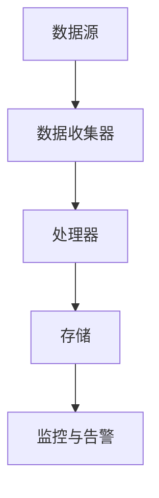

                 

# 文章标题：流处理 原理与代码实例讲解

> 关键词：流处理、实时数据处理、滚动窗口算法、Watermark算法、检查点算法、大数据、机器学习、未来发展趋势

> 摘要：本文将深入探讨流处理的基础理论、核心算法原理以及数学模型，通过代码实例详细讲解流处理项目实战，进一步拓展其在大数据和机器学习中的应用，最后对流处理未来的发展趋势进行展望。

## 第一部分：流处理基础理论

### 第1章：流处理简介

#### 1.1 流处理概念

流处理（Stream Processing）是一种实时数据处理技术，它与传统批处理（Batch Processing）有着本质的不同。批处理是处理大量数据的集合，通常在数据完全加载到系统中后进行计算；而流处理则是对数据流进行实时处理，即在数据生成时立即进行处理。

流处理与批处理的对比如下：

- **处理时间**：批处理在数据全部加载后进行计算，而流处理则是对数据流中的每个数据元素进行实时处理。
- **处理模式**：批处理采用批量方式处理数据，而流处理采用持续的数据流模式。
- **数据处理方式**：批处理对历史数据进行计算，而流处理对实时数据进行计算。

流处理的优势包括：

- **实时性**：可以实时获取和处理数据，对于需要快速响应的场景非常有用。
- **高效性**：通过并行处理和资源复用，可以大大提高数据处理效率。
- **弹性**：可以根据数据流的特点动态调整处理资源。

#### 1.2 流处理架构

流处理框架通常包括以下几个核心组件：

- **数据源**：数据流进入系统的入口，可以是各种传感器、应用程序或数据库等。
- **数据收集器**：收集来自数据源的数据，并进行预处理，如清洗、转换和格式化。
- **处理器**：对数据进行处理，包括计算、过滤、聚合等功能。
- **存储**：用于存储处理结果，可以是内存数据库、关系数据库或分布式文件系统。
- **监控与告警**：监控系统运行状态，当出现异常时发送告警。

### 第2章：核心概念与联系

#### 2.1 Mermaid 流程图

流处理的工作流程可以通过Mermaid流程图进行展示。以下是一个简单的Mermaid流程图示例：



#### 2.2 流计算模型

流计算模型主要涉及实时数据处理和数据的流模型。实时数据处理是指系统能够对产生的事件进行实时处理和分析。数据的流模型则描述了数据在系统中的流动方式，通常包括数据流的生成、传输、处理和消费等环节。

### 第3章：核心算法原理讲解

#### 3.1 滚动窗口算法

滚动窗口算法是一种常用的流处理算法，用于处理时间相关的数据。它的核心思想是维护一个滑动窗口，窗口内的数据按照一定的时间间隔进行更新。

以下是滚动窗口算法的伪代码实现：

```python
def rolling_window(data_stream, window_size, time_interval):
    current_window = []
    for data in data_stream:
        current_time = get_current_time()
        if current_time - data.time > time_interval:
            remove_oldest_data(current_window)
        current_window.append(data)
        process(current_window)

def remove_oldest_data(window):
    # 移除窗口中最旧的数据
    window.pop(0)

def process(window):
    # 对窗口内的数据进行处理
    pass
```

#### 3.2 常见流处理算法

- **Watermark算法**：Watermark算法用于处理数据流中的延迟数据。Watermark是一种标记，用于指示数据流的某个时间点。算法的核心思想是在处理数据时，将Watermark与数据一起处理，以确保延迟数据的正确处理。

- **检查点算法**：检查点算法用于确保数据处理的正确性和一致性。它通过在处理过程中定期保存状态信息，当系统出现故障时，可以回滚到最近的检查点，重新开始处理。

### 第4章：数学模型和数学公式

#### 4.1 数学公式讲解

- **时间序列分析**：时间序列分析是流处理中的重要组成部分，用于分析时间序列数据的趋势、周期性和季节性。

  $$ y_t = \alpha x_t + (1 - \alpha)y_{t-1} $$

  其中，\( y_t \)是当前时间点的预测值，\( x_t \)是当前时间点的输入值，\( \alpha \)是平滑系数。

- **流处理性能优化**：性能优化通常涉及如何减少数据传输延迟和计算资源消耗。

  $$ Throughput = \frac{Data_Rate}{Processing_Time} $$

  其中，Throughput是系统的吞吐量，Data_Rate是数据传输速率，Processing_Time是数据处理时间。

#### 4.2 举例说明

- **时间序列预测实例**：假设我们有一个时间序列数据，需要预测下一时间点的值。我们可以使用上述时间序列分析的公式进行预测。

- **数据流处理性能测试实例**：我们可以通过模拟不同的数据流负载，测试系统的处理性能，包括吞吐量和响应时间等指标。

## 第二部分：流处理项目实战

### 第5章：项目实战准备

#### 5.1 开发环境搭建

搭建流处理开发环境需要安装流处理框架和相关依赖。以下是一个简单的安装流程：

1. 安装流处理框架（例如Apache Flink）。
2. 配置Java开发环境。
3. 安装依赖的库和工具。

#### 5.2 数据源接入

数据源可以是文件、数据库或其他应用程序。以下是一个简单的数据源接入流程：

1. 配置数据源。
2. 读取数据源数据。
3. 对数据进行预处理。

### 第6章：项目实战一

#### 6.1 实战概述

本项目旨在实现一个简单的流处理任务，对实时数据流进行实时分析。

#### 6.2 代码实现

以下是该项目的主要代码实现：

```java
// 数据源配置
DataStream<String> dataStream = env.addSource(new FlinkKafkaConsumer<>(kafkaTopic, new SimpleStringSchema(), properties));

// 数据处理
DataStream<String> processedStream = dataStream.flatMap(new FlatMapFunction<String, String>() {
    @Override
    public void flatMap(String value, Collector<String> out) {
        // 数据处理逻辑
        out.collect(value.toUpperCase());
    }
});

// 数据存储
processedStream.addSink(new FlinkKafkaProducer<>(kafkaTopicOut, new SimpleStringSchema(), properties));

// 启动任务
env.execute("Stream Processing Example");
```

#### 6.3 代码解读与分析

- **数据源配置**：通过FlinkKafkaConsumer读取Kafka数据。
- **数据处理**：通过flatMap函数对数据进行转换。
- **数据存储**：通过FlinkKafkaProducer将处理后的数据写入Kafka。

性能优化方面，可以通过调整并行度、优化数据处理逻辑等方式提高性能。

### 第7章：项目实战二

#### 7.1 实战概述

本项目旨在实现一个复杂的流处理任务，对实时数据流进行实时分析，包括数据聚合、窗口计算和异常检测等。

#### 7.2 代码实现

以下是该项目的主要代码实现：

```java
// 数据源配置
DataStream<Trade> tradeStream = env.addSource(new FlinkKafkaConsumer<>(kafkaTopic, new TradeSchema(), properties));

// 数据处理
DataStream<Trade> processedStream = tradeStream
    .keyBy("userId")
    .timeWindow(Time.minutes(1))
    .aggregate(new TradeAggregate());

// 数据存储
processedStream.addSink(new FlinkKafkaProducer<>(kafkaTopicOut, new TradeSchema(), properties));

// 启动任务
env.execute("Stream Processing Advanced Example");
```

#### 7.3 代码解读与分析

- **数据源配置**：通过FlinkKafkaConsumer读取Kafka数据。
- **数据处理**：通过keyBy、timeWindow和aggregate函数实现数据聚合和窗口计算。
- **数据存储**：通过FlinkKafkaProducer将处理后的数据写入Kafka。

性能优化方面，可以通过调整并行度、优化数据处理逻辑、使用索引等方式提高性能。

## 第三部分：流处理应用拓展

### 第8章：流处理与大数据

#### 8.1 大数据处理概述

大数据处理通常涉及海量数据的存储、计算和分析。流处理在大数据处理中扮演着重要角色，其实时性和高效性使得它成为大数据分析的重要工具。

#### 8.2 流处理与大数据集成

流处理与大数据平台的集成通常涉及以下步骤：

1. 配置大数据平台（如Hadoop、Spark等）。
2. 集成流处理框架（如Apache Flink、Apache Storm等）。
3. 部署流处理任务。

### 第9章：流处理与机器学习

#### 9.1 机器学习与流处理结合

流处理与机器学习的结合可以实现实时机器学习，即在数据流中实时更新和训练模型。这通常涉及以下步骤：

1. 数据采集和预处理。
2. 模型训练和更新。
3. 实时预测和决策。

#### 9.2 流处理与机器学习项目实战

本项目旨在实现一个实时股票预测系统，利用流处理和机器学习技术。

```python
# 数据采集
kafka_topic = "stock_data"
stock_data_stream = KafkaStream(kafka_topic, bootstrap_servers, key_serializer=lambda x: x.encode(), value_serializer=lambda x: x.encode())

# 数据预处理
preprocessed_stream = stock_data_stream.map(lambda x: preprocess(x))

# 模型训练
model = train_model(preprocessed_stream)

# 实时预测
predictions = predict(model, preprocessed_stream)

# 数据存储
store_predictions(predictions)
```

### 第10章：流处理未来发展趋势

#### 10.1 未来技术展望

流处理未来的发展趋势包括：

- **实时性提升**：提高数据处理的实时性，降低延迟。
- **高效性优化**：通过优化算法和架构，提高数据处理效率。
- **智能化**：结合人工智能和机器学习，实现智能化数据处理。

#### 10.2 总结与展望

流处理在数据科学与工程领域具有重要地位，其实时性和高效性使其成为许多应用场景的核心技术。未来，随着技术的不断发展，流处理将在更多领域发挥重要作用，成为数据驱动决策的重要工具。

## 附录：流处理框架与工具对比

流处理框架和工具的对比主要包括以下几个方面：

- **支持语言**：不同框架支持的语言可能不同，如Apache Flink支持Java和Scala，Apache Storm支持Java和Scala等。
- **性能**：不同框架的性能指标，如吞吐量、延迟等。
- **生态系统**：框架的生态系统，包括库、工具和社区的活跃程度。
- **易用性**：框架的易用性和文档的完整程度。

### 作者

作者：AI天才研究院/AI Genius Institute & 禅与计算机程序设计艺术 /Zen And The Art of Computer Programming。

