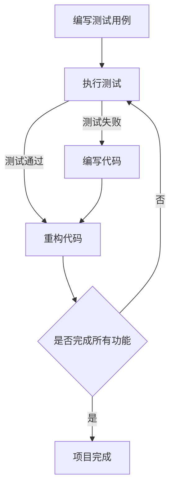

                 

# 《测试驱动开发的流程与实践技巧》

## 关键词

测试驱动开发（TDD）、敏捷开发、单元测试、代码重构、持续集成、自动化测试、敏捷测试、软件质量

## 摘要

测试驱动开发（TDD）是一种敏捷软件开发的方法，强调先编写测试用例，然后根据测试用例编写代码，最后重构代码以符合测试要求。本文将详细探讨TDD的基础、核心要素、应用流程与实践技巧，并结合实际项目分析TDD的实战应用，介绍TDD相关的工具与资源，并对TDD的未来发展趋势进行展望。

## 第一部分：测试驱动开发（TDD）基础

### 第1章：TDD概述

#### 1.1 TDD的概念与历史背景

测试驱动开发（Test-Driven Development，简称TDD）是一种以测试为核心的软件开发方法，最早由Kent Beck在1999年提出。TDD的核心思想是“先写测试，再写代码”，通过编写测试用例来明确功能需求，然后根据测试用例编写代码，并不断重构代码以提高其质量。

TDD的发展历史可以追溯到20世纪80年代末的极限编程（Extreme Programming，简称XP）运动。极限编程提倡敏捷开发，强调代码质量和团队协作。TDD作为XP的核心实践之一，逐渐被软件开发社区广泛接受和应用。

#### 1.2 TDD与传统测试的区别

TDD与传统测试的区别主要体现在以下几个方面：

1. **顺序不同**：TDD要求先编写测试用例，然后编写代码，而传统测试是在代码完成后进行。
2. **目的不同**：TDD的目的是通过编写测试用例来引导开发，确保代码质量；传统测试的目的是验证代码的正确性。
3. **自动化程度不同**：TDD强调自动化测试，通过持续集成和自动化测试工具来提高测试效率；传统测试可能更多依赖手工测试。

#### 1.3 TDD的核心原则

TDD的核心原则包括：

1. **编写测试用例**：在编写代码之前，先编写测试用例，明确功能需求。
2. **快速反馈循环**：通过自动化测试工具快速执行测试用例，获得反馈，指导开发。
3. **代码重构**：在测试通过后，对代码进行重构，提高代码质量。

### 第2章：TDD的核心要素

#### 2.1 红色-绿色-重构循环

红色-绿色-重构循环是TDD的核心实践之一，其流程如下：

1. **红色阶段**：编写测试用例，使测试失败，代码处于红色状态。
2. **绿色阶段**：编写代码，使测试通过，代码处于绿色状态。
3. **重构阶段**：对代码进行重构，提高代码质量，同时确保测试仍然通过。

这一循环过程不断重复，直到实现所有功能需求。

#### 2.2 快速反馈循环

快速反馈循环是TDD的另一个核心要素，其目的是通过快速执行测试用例，获得反馈，指导开发。快速反馈循环包括以下几个方面：

1. **编写测试用例**：编写清晰、可执行的测试用例。
2. **自动化测试**：使用自动化测试工具执行测试用例，提高测试效率。
3. **反馈分析**：分析测试结果，找出代码中的问题和不足。

#### 2.3 精细化测试策略

精细化测试策略是指在TDD过程中，对测试用例进行细化和优化，以确保测试的全面性和有效性。精细化测试策略包括以下几个方面：

1. **边界测试**：对输入和输出边界进行测试，确保代码在边界情况下的正确性。
2. **异常测试**：对异常情况下的代码执行进行测试，确保代码的健壮性。
3. **集成测试**：对模块之间的交互进行测试，确保系统整体功能的正确性。

### 第3章：TDD在软件开发中的应用

#### 3.1 TDD在团队协作中的优势

TDD在团队协作中具有以下优势：

1. **提高代码质量**：通过编写测试用例，确保代码的正确性和健壮性。
2. **明确功能需求**：测试用例可以帮助团队明确功能需求，减少误解和歧义。
3. **促进代码重构**：通过重构代码，提高代码的可读性和可维护性。

#### 3.2 TDD在不同类型项目中的应用

TDD适用于各种类型的软件开发项目，包括：

1. **Web应用开发**：通过TDD，可以确保Web应用的稳定性和可靠性。
2. **移动应用开发**：TDD可以帮助移动应用开发团队提高开发效率，降低故障率。
3. **大型企业级应用**：TDD可以确保大型企业级应用的功能完整性和性能。

#### 3.3 TDD的最佳实践

TDD的最佳实践包括：

1. **持续编写测试用例**：在开发过程中，持续编写测试用例，确保功能实现与测试用例的一致性。
2. **自动化测试**：使用自动化测试工具执行测试用例，提高测试效率。
3. **代码重构**：在测试通过后，对代码进行重构，提高代码质量。

## 第二部分：TDD流程与实践技巧

### 第4章：TDD流程详解

#### 4.1 TDD开发流程

TDD的开发流程包括以下步骤：

1. **编写测试用例**：明确功能需求，编写测试用例。
2. **执行测试**：使用自动化测试工具执行测试用例。
3. **编写代码**：根据测试用例编写代码。
4. **重构代码**：对代码进行重构，提高代码质量。
5. **重复流程**：重复上述步骤，实现所有功能需求。

#### 4.2 TDD中的测试设计

TDD中的测试设计包括以下几个方面：

1. **单元测试**：对最小功能单元进行测试，确保其正确性。
2. **集成测试**：对模块之间的交互进行测试，确保系统整体功能的正确性。
3. **性能测试**：对系统性能进行测试，确保其满足性能要求。

#### 4.3 TDD中的代码重构

代码重构是TDD的核心实践之一，其目的是提高代码质量。代码重构包括以下几个方面：

1. **提取方法**：将重复代码提取为方法，提高代码复用性。
2. **简化逻辑**：简化复杂逻辑，提高代码可读性。
3. **优化性能**：优化代码性能，提高系统运行效率。

### 第5章：TDD实践技巧

#### 5.1 测试用例设计技巧

测试用例设计技巧包括以下几个方面：

1. **覆盖全面**：确保测试用例覆盖所有功能点和边界情况。
2. **简洁明了**：测试用例应简洁明了，易于理解和执行。
3. **可维护性**：测试用例应易于维护和更新。

#### 5.2 断言与异常处理

断言与异常处理是TDD中的重要实践：

1. **断言**：在测试中，使用断言验证代码的预期结果。
2. **异常处理**：在代码中，合理处理异常，提高系统的健壮性。

#### 5.3 面向接口的测试

面向接口的测试可以确保代码的模块化和可维护性：

1. **定义接口**：为模块定义清晰的接口。
2. **测试接口**：仅测试接口的功能，而不依赖于具体实现。

### 第6章：TDD与敏捷开发的结合

#### 6.1 TDD在敏捷开发中的角色

TDD在敏捷开发中扮演着重要角色：

1. **确保代码质量**：通过TDD，可以确保代码的正确性和健壮性。
2. **提高开发效率**：TDD可以减少代码缺陷和回归问题，提高开发效率。

#### 6.2 TDD与用户故事

TDD与用户故事相结合，可以确保功能实现与用户需求的一致性：

1. **编写用户故事**：明确用户需求。
2. **编写测试用例**：根据用户故事编写测试用例。
3. **实现功能**：根据测试用例实现功能。

#### 6.3 TDD与持续集成

TDD与持续集成相结合，可以实现自动化测试和持续交付：

1. **集成自动化测试**：将测试用例集成到持续集成流程中。
2. **自动化部署**：通过持续集成，实现自动化部署和发布。

### 第7章：TDD项目实战

#### 7.1 实战项目概述

本文以一个简单的Web应用项目为例，介绍TDD在项目中的应用：

1. **项目背景**：开发一个简单的在线计算器应用。
2. **功能需求**：实现基本的加减乘除运算功能。

#### 7.2 测试用例编写实战

在TDD项目中，首先编写测试用例：

1. **编写单元测试**：编写计算器功能的单元测试。
2. **编写集成测试**：编写计算器模块之间的集成测试。
3. **编写性能测试**：编写计算器性能测试用例。

#### 7.3 代码重构实战

在测试通过后，对代码进行重构：

1. **提取方法**：将重复代码提取为方法。
2. **简化逻辑**：简化复杂逻辑。
3. **优化性能**：优化代码性能。

#### 7.4 持续集成与自动化测试

在TDD项目中，结合持续集成和自动化测试：

1. **配置持续集成**：配置Jenkins等持续集成工具。
2. **执行自动化测试**：在每次代码提交后，自动执行测试用例。
3. **发布应用**：通过持续集成，实现自动化部署和发布。

## 第三部分：TDD工具与资源

### 第8章：TDD工具介绍

#### 8.1 单元测试框架

常见的单元测试框架包括JUnit、TestNG、NUnit等：

1. **JUnit**：Java的单元测试框架，适用于各种Java项目。
2. **TestNG**：测试框架，比JUnit功能更强大，适用于各种编程语言。
3. **NUnit**：.NET的单元测试框架，适用于C#等.NET语言。

#### 8.2 测试覆盖率工具

测试覆盖率工具可以评估测试用例的覆盖程度，常见的测试覆盖率工具包括JaCoCo、Surefire等：

1. **JaCoCo**：Java的测试覆盖率工具，适用于各种Java项目。
2. **Surefire**：Maven的测试覆盖率插件，适用于Java项目。

#### 8.3 测试管理工具

测试管理工具可以管理测试用例、测试计划和测试报告，常见的测试管理工具包括Jira、TestLink等：

1. **Jira**：项目管理工具，支持测试管理功能。
2. **TestLink**：专业的测试管理工具，适用于各种项目。

### 第9章：TDD资源推荐

#### 9.1 TDD教程与书籍推荐

推荐以下TDD教程和书籍：

1. **《测试驱动开发：实用指南》（Test-Driven Development: By Example）**：Kent Beck的经典著作，详细介绍了TDD的方法和实践。
2. **《敏捷开发：原则、实践与模式》（Agile Software Development: Principles, Patterns, and Practices）**：Robert C. Martin的著作，涵盖了敏捷开发的方法和TDD实践。

#### 9.2 TDD社区与活动

参与TDD社区和活动，可以了解最新的TDD技术和最佳实践：

1. **TDDWiki**：TDD相关的知识库，涵盖TDD的各种实践和技巧。
2. **敏捷测试大会（Agile Testing Days）**：全球最大的敏捷测试会议，汇集了TDD领域的专家和从业者。

#### 9.3 TDD开源项目推荐

以下是一些优秀的TDD开源项目：

1. **JUnit**：Java的单元测试框架，支持各种测试模式。
2. **Selenium**：Web应用的自动化测试工具，支持多种编程语言。
3. **Cucumber**：行为驱动开发（BDD）工具，支持多种编程语言。

### 第10章：TDD的未来发展

#### 10.1 TDD与AI的结合

随着人工智能技术的发展，TDD与AI的结合有望带来新的突破：

1. **测试用例自动生成**：利用AI技术自动生成测试用例，提高测试覆盖率。
2. **缺陷预测与修复**：利用AI技术预测代码缺陷，并自动修复。

#### 10.2 TDD在未来的发展趋势

TDD在未来的发展趋势包括：

1. **智能化**：结合AI技术，实现更智能的测试和开发。
2. **集成化**：与其他敏捷开发方法（如Scrum、Kanban）更紧密地集成。
3. **标准化**：制定更完善的TDD标准和规范。

#### 10.3 TDD面临的挑战与机遇

TDD面临的挑战与机遇包括：

1. **技术挑战**：如何更好地结合AI技术，提高测试效率和准确性。
2. **团队协作**：如何让团队更好地理解和应用TDD，提高开发效率。
3. **实践推广**：如何在更广泛的软件开发项目中推广TDD，提高软件质量。

## 附录

### 附录A：TDD流程Mermaid流程图



### 附录B：TDD中的伪代码示例

```python
# 伪代码：计算两个数的和

# 输入：a（第一个数），b（第二个数）
# 输出：sum（两个数的和）

def add(a, b):
    sum = a + b
    return sum

# 测试用例：
# 输入：a=3, b=4
# 预期输出：7

assert add(3, 4) == 7
```

### 附录C：常见TDD术语解释

- **测试驱动开发（TDD）**：一种以测试为核心的软件开发方法。
- **测试用例**：描述功能需求的文档，包括输入、预期输出和测试步骤。
- **单元测试**：对最小功能单元进行测试，确保其正确性。
- **集成测试**：对模块之间的交互进行测试，确保系统整体功能的正确性。
- **代码重构**：对代码进行优化，提高代码质量。

### 附录D：TDD常用工具使用指南

- **JUnit**：Java的单元测试框架，使用Maven插件集成。
- **TestNG**：测试框架，使用Maven插件集成。
- **Selenium**：Web应用的自动化测试工具，使用Selenium WebDriver集成。
- **JaCoCo**：Java的测试覆盖率工具，使用Maven插件集成。
- **Jenkins**：持续集成工具，使用Maven插件集成。

### 附录E：测试用例编写模板

- **标题**：描述测试用例的目的和范围。
- **前置条件**：描述测试用例执行的先决条件。
- **测试步骤**：描述执行测试的具体步骤。
- **预期结果**：描述预期输出的结果。
- **实际结果**：描述实际输出的结果。
- **结论**：描述测试结果是否通过。


---

作者：AI天才研究院/AI Genius Institute & 禅与计算机程序设计艺术 /Zen And The Art of Computer Programming

文章标题：《测试驱动开发的流程与实践技巧》

关键词：测试驱动开发（TDD）、敏捷开发、单元测试、代码重构、持续集成、自动化测试、敏捷测试、软件质量

摘要：本文详细探讨了测试驱动开发（TDD）的基础、核心要素、应用流程与实践技巧，并结合实际项目分析了TDD的实战应用，介绍了TDD相关的工具与资源，并对TDD的未来发展趋势进行了展望。通过本文，读者可以深入了解TDD的核心思想、实践方法以及在实际开发中的应用，提高软件开发的效率和质量。

