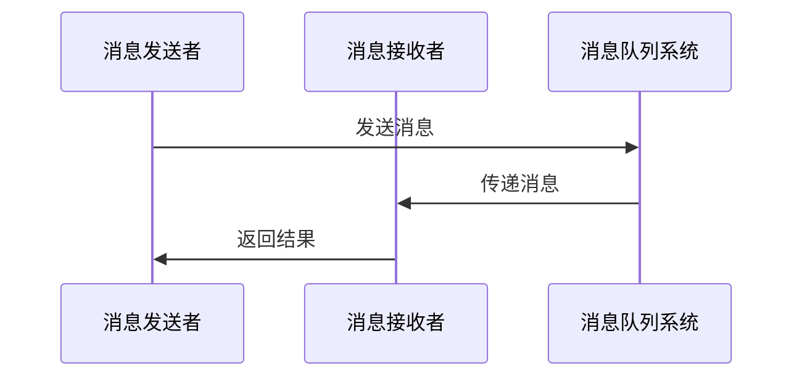
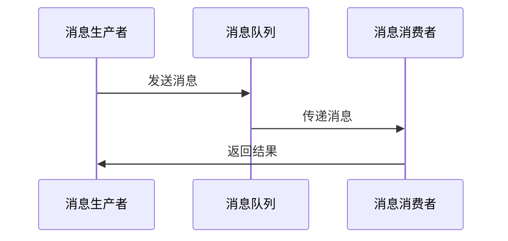
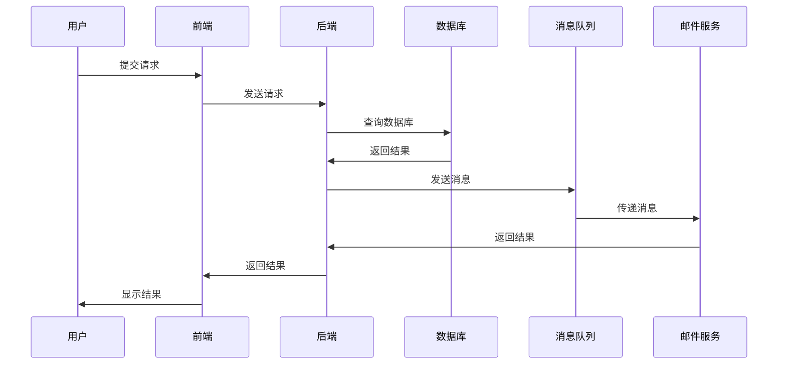
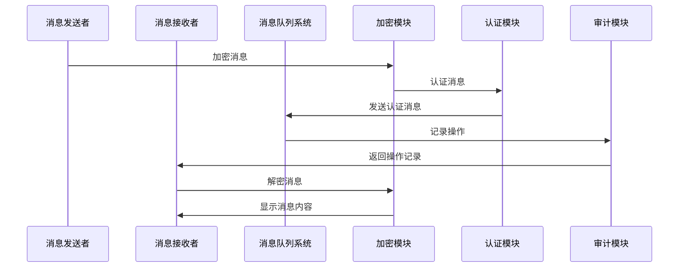

                 

# 文章标题：消息机制：进程间通信的重要手段

## 关键词
- 进程间通信
- 消息机制
- 消息队列
- 分布式系统
- 安全性
- 性能优化

## 摘要
本文详细探讨了消息机制作为进程间通信的重要手段。首先介绍了消息机制的基础概念、发展历程和重要性。然后，深入分析了消息传递机制的分类、原理和设计原则。接着，讨论了消息机制在分布式系统中的应用，包括分布式消息队列系统和消息驱动架构。文章还介绍了消息机制在Web应用中的使用、安全性以及优化与性能调优的方法。最后，通过一个实际项目实战，展示了消息机制的实际应用。本文旨在为读者提供一个全面、深入的消息机制理解和实践指南。

## 引言
在复杂的软件系统中，进程间通信（Inter-Process Communication，简称IPC）是确保各组件协同工作的关键。消息机制作为一种高效的IPC手段，通过在进程间传递消息，实现了数据的交换和任务协调。本文将深入探讨消息机制的概念、原理、应用和优化方法，以帮助读者全面理解和掌握这一重要技术。

### 第一部分：消息机制基础

## 第1章：消息机制概述

## 1.1 消息机制的定义与重要性
### 1.1.1 进程间通信的基本概念
进程间通信是操作系统中用于不同进程之间交换信息的一种机制。在多进程环境中，进程之间的通信对于实现资源共享、任务调度和分布式计算至关重要。

### 1.1.2 消息机制的基本原理
消息机制通过消息队列实现进程间的数据交换。生产者进程将消息放入队列，消费者进程从队列中取出并处理消息，从而实现异步通信。

### 1.1.3 消息机制的应用领域
消息机制广泛应用于分布式系统、微服务架构、实时数据处理、Web应用等领域，是现代软件系统中的重要组成部分。

## 1.2 消息机制的发展历程
### 1.2.1 从共享内存到消息队列
早期的进程间通信主要依赖于共享内存，但存在同步通信的瓶颈。随着计算机技术的发展，消息队列机制逐渐成为主流。

### 1.2.2 从同步通信到异步通信
同步通信要求发送方等待接收方的响应，而异步通信则允许发送方独立继续操作。消息机制通过异步通信提高了系统的并发性和响应速度。

### 1.2.3 消息机制的未来趋势
随着云计算和物联网的发展，消息机制将继续向分布式、实时性和高可用性方向发展。

### 第二部分：消息机制原理与架构

## 第2章：消息传递机制

## 2.1 消息传递机制的分类
### 2.1.1 基于共享内存的消息传递
共享内存是进程间通信的一种高效方式，但需要确保数据的一致性。

### 2.1.2 基于消息队列的消息传递
消息队列通过中间件实现消息的存储和转发，支持异步通信。

### 2.1.3 基于管道的消息传递
管道是一种简单的进程间通信手段，适用于简单场景。

## 2.2 消息队列原理详解
### 2.2.1 消息队列的工作机制
消息队列通过生产者和消费者模型实现消息的生成和消费。

### 2.2.2 消息队列的性能优化
性能优化包括队列长度控制、消息优先级和吞吐量优化。

### 2.2.3 常见消息队列系统介绍
如RabbitMQ、Kafka、ActiveMQ等消息队列系统。

## 2.3 消息传递系统的设计原则
### 2.3.1 可靠性设计
可靠性设计包括消息持久化、备份和恢复机制。

### 2.3.2 高效性设计
高效性设计涉及消息传输延迟和队列吞吐量的优化。

### 2.3.3 可扩展性设计
可扩展性设计包括水平扩展和负载均衡。

### 第三部分：消息机制在分布式系统中的应用

## 第3章：消息机制在分布式系统中的应用

## 3.1 分布式系统的基本概念
### 3.1.1 分布式系统的架构
分布式系统通过多个节点协同工作，提供高可用性和高扩展性。

### 3.1.2 分布式系统的挑战
分布式系统面临网络延迟、数据一致性和容错性等挑战。

### 3.1.3 消息机制在分布式系统中的作用
消息机制在分布式系统中实现节点间的数据交换和任务调度。

## 3.2 分布式消息队列系统
### 3.2.1 分布式消息队列的工作原理
分布式消息队列通过多个节点实现消息的存储和转发。

### 3.2.2 分布式消息队列的性能优化
性能优化包括网络带宽、节点负载均衡和消息顺序保证。

### 3.2.3 常见分布式消息队列系统介绍
如RabbitMQ Cluster、Kafka Cluster、Apache Pulsar等。

## 3.3 消息驱动架构的设计与实现
### 3.3.1 消息驱动架构的基本概念
消息驱动架构通过消息实现系统的松耦合和异步处理。

### 3.3.2 消息驱动架构的实现细节
实现细节包括消息生产者、消费者和服务注册与发现。

### 3.3.3 消息驱动架构的案例分析
通过实际案例展示消息驱动架构的优势和实践。

### 第四部分：消息机制在实际项目中的应用

## 第4章：消息机制在Web应用中的使用

## 4.1 Web应用中的消息传递需求
### 4.1.1 Web应用的特点
Web应用需要支持高并发、高可用性和可扩展性。

### 4.1.2 Web应用中的消息传递场景
消息传递在处理请求、异步任务和系统间通信中发挥重要作用。

### 4.1.3 Web应用中的消息传递解决方案
如使用RabbitMQ、Kafka等消息队列系统。

## 4.2 Web应用中的消息队列系统
### 4.2.1 Web应用中的消息队列系统设计
设计包括消息队列的选择、架构设计和消息处理流程。

### 4.2.2 Web应用中的消息队列系统实现
实现涉及消息生产者、消费者的开发与部署。

### 4.2.3 Web应用中的消息队列系统优化
优化包括性能测试、瓶颈分析和优化策略。

## 4.3 实战：基于消息机制实现的Web应用
### 4.3.1 系统架构设计
设计包括前端、后端、数据库和消息队列的架构。

### 4.3.2 系统功能实现
实现包括用户注册、消息发送和处理等功能。

### 4.3.3 系统性能优化
优化包括数据库查询优化、缓存策略和消息队列性能调优。

### 第五部分：消息机制的安全性

## 第5章：消息机制的安全性

## 5.1 消息机制的安全挑战
### 5.1.1 消息伪造
防止恶意进程伪造消息。
### 5.1.2 消息窃听
保护消息在传输过程中的隐私。
### 5.1.3 消息篡改
防止消息被未经授权的实体篡改。

## 5.2 消息机制的安全机制
### 5.2.1 认证机制
确保只有合法的消息生产者和消费者可以访问消息队列。
### 5.2.2 完整性保护
确保消息在传输过程中不被篡改。
### 5.2.3 防止重放攻击
防止已发送的消息被恶意重复使用。

## 5.3 消息机制的安全实践
### 5.3.1 加密技术
使用SSL/TLS等加密技术保护消息传输安全。
### 5.3.2 安全协议
采用如AMQP、STOMP等安全协议。
### 5.3.3 安全审计
记录和监控消息队列系统的操作，以进行安全审计。

### 第六部分：消息机制的优化与性能调优

## 第6章：消息机制的优化与性能调优

## 6.1 消息机制的性能优化
### 6.1.1 消息传递延迟优化
减少消息的传输延迟，提高系统响应速度。
### 6.1.2 消息队列吞吐量优化
提高消息队列的处理能力，支持更多消息处理。
### 6.1.3 消息队列容量优化
合理分配消息队列的存储空间，避免消息丢失。

## 6.2 消息机制的性能调优实践
### 6.2.1 系统性能测试
通过性能测试发现系统瓶颈。
### 6.2.2 性能瓶颈分析
分析性能瓶颈，确定优化方向。
### 6.2.3 性能优化方案实施
实施优化方案，提升系统性能。

## 6.3 消息机制的负载均衡
### 6.3.1 负载均衡的基本原理
负载均衡通过分配任务到多个节点，提高系统处理能力。
### 6.3.2 常见的负载均衡算法
如轮询、最小连接数、加权负载均衡等。
### 6.3.3 负载均衡在实际项目中的应用
展示负载均衡在实际项目中的应用案例。

### 第七部分：消息机制的高级应用

## 第7章：消息机制的高级应用

## 7.1 消息驱动微服务架构
### 7.1.1 微服务架构的基本概念
微服务架构通过小型、独立的微服务构建大型应用。
### 7.1.2 消息驱动微服务的工作原理
消息驱动微服务通过消息实现服务间的通信。
### 7.1.3 消息驱动微服务的实践案例
展示消息驱动微服务的实际应用场景和案例。

## 7.2 消息中间件技术
### 7.2.1 消息中间件的基本概念
消息中间件是用于实现消息传递和管理的软件。
### 7.2.2 消息中间件的核心功能
如消息路由、消息存储、消息持久化等。
### 7.2.3 常见的消息中间件系统介绍
如RabbitMQ、Kafka、ActiveMQ等。

## 7.3 消息机制的实时数据处理
### 7.3.1 实时数据处理的基本概念
实时数据处理是对数据进行实时分析、处理和响应。
### 7.3.2 基于消息机制的实时数据处理框架
如Apache Kafka、Flink等。
### 7.3.3 实时数据处理的应用场景
如物联网、金融交易、搜索引擎等。

### 附录

## 附录A：消息机制相关工具和框架
### A.1 消息队列系统介绍
介绍常用的消息队列系统，如RabbitMQ、Kafka等。
### A.2 消息驱动框架介绍
介绍消息驱动框架，如Spring Cloud Stream等。
### A.3 实时数据处理框架介绍
介绍实时数据处理框架，如Apache Flink、Spark Streaming等。

## 附录B：常见问题解答
### B.1 消息机制常见问题
解答关于消息机制的一些常见问题。
### B.2 消息队列系统常见问题
解答关于消息队列系统的一些常见问题。
### B.3 消息驱动微服务常见问题
解答关于消息驱动微服务的一些常见问题。

## 附录C：参考文献
### C.1 相关书籍
列出与消息机制相关的书籍。
### C.2 论文和报告
列出与消息机制相关的论文和报告。
### C.3 在线资源和论坛
列出与消息机制相关的在线资源和论坛。

## 消息机制：进程间通信的重要手段

本章首先介绍了消息机制的定义和重要性，随后详细讲解了消息传递机制的分类、消息队列系统的原理及其性能优化。接着，重点讨论了消息机制在分布式系统中的应用，包括分布式消息队列系统和消息驱动架构的设计与实现。

在第四部分，我们探讨了消息机制在Web应用中的使用，详细阐述了消息队列系统在Web应用中的设计、实现和性能优化。此外，还介绍了消息机制的安全性，包括消息机制的安全挑战和安全机制。

第五部分聚焦于消息机制的优化与性能调优，涵盖了消息传递延迟优化、消息队列吞吐量优化和负载均衡。最后一部分介绍了消息机制的高级应用，包括消息驱动微服务架构和实时数据处理。

附录部分提供了相关的工具和框架介绍，以及常见问题的解答，便于读者进一步学习和实践。

### 第1章：消息机制概述

### 1.1 消息机制的定义与重要性

**进程间通信（IPC）的基本概念**：

进程间通信是操作系统中用于不同进程之间交换信息的一种机制。在单处理器系统中，多个进程需要共享资源（如内存、文件、设备等），从而实现协同工作。而在多处理器系统中，IPC更是不可或缺，它确保了各处理器上的进程能够高效、有序地共享数据和任务。

**消息机制的定义**：

消息机制是一种基于消息传递的IPC方式。它允许一个进程（称为消息发送者）向另一个进程（称为消息接收者）发送消息，从而实现数据的交换和任务协调。消息可以是简单的数据，也可以是复杂的对象或命令。

**消息机制的重要性**：

1. **异步通信**：消息机制支持异步通信，消息发送者不需要等待接收者的响应，从而提高了系统的并发性和响应速度。
2. **解耦**：消息机制将消息发送者和接收者解耦，允许它们独立开发、部署和扩展，提高了系统的灵活性和可维护性。
3. **分布式系统**：消息机制在分布式系统中发挥着重要作用，它实现了跨节点的数据交换和任务调度，是构建分布式应用的关键技术。
4. **高可用性**：消息机制提供了消息的持久化和备份功能，确保消息不会因系统故障或网络中断而丢失。

### 1.2 消息机制的发展历程

**从共享内存到消息队列**：

早期的进程间通信主要依赖于共享内存。共享内存允许多个进程访问同一块内存区域，从而实现数据的快速交换。然而，共享内存存在同步通信的瓶颈，且需要严格管理数据的一致性。

随着计算机技术的发展，消息队列机制逐渐成为主流。消息队列通过一个中间件实现消息的存储和转发，支持异步通信，并简化了数据一致性的管理。

**从同步通信到异步通信**：

同步通信要求发送方等待接收方的响应，这可能导致通信的阻塞和性能的下降。异步通信则允许发送方独立继续操作，从而提高了系统的并发性和响应速度。

消息队列机制通过异步通信实现了进程间的解耦，使得消息发送者和接收者可以独立运行，降低了系统间的耦合度。

**消息机制的未来趋势**：

随着云计算和物联网的发展，消息机制将继续向分布式、实时性和高可用性方向发展。分布式消息队列系统将支持跨云服务的消息传递和任务调度，实时数据处理框架将实现数据的实时分析和处理。

### 1.3 消息机制的应用领域

**分布式系统**：

在分布式系统中，消息机制是实现跨节点数据交换和任务调度的重要手段。通过消息队列，分布式系统可以实现服务的解耦，提高系统的可用性和扩展性。

**微服务架构**：

微服务架构通过小型、独立的微服务构建大型应用。消息机制在微服务架构中发挥着重要作用，它实现了服务间的异步通信和任务协调，提高了系统的可维护性和可扩展性。

**实时数据处理**：

实时数据处理是对数据进行实时分析、处理和响应。消息机制在实时数据处理中起到了关键作用，它实现了数据的实时传递和处理，提高了系统的响应速度和处理能力。

**Web应用**：

在Web应用中，消息机制用于处理请求、异步任务和系统间通信。通过消息队列，Web应用可以实现高并发、高可用性和可扩展性，提高了系统的性能和用户体验。

### 1.4 小结

消息机制作为一种进程间通信的重要手段，具有异步通信、解耦、分布式系统和实时数据处理等优势。本章介绍了消息机制的定义、重要性、发展历程和应用领域，为后续章节的深入探讨奠定了基础。

### 1.5 Mermaid 流程图

以下是消息传递机制的 Mermaid 流程图：



### 1.6 核心算法原理讲解

**消息传递机制的核心算法原理**

消息传递机制的核心算法原理主要包括消息发送算法、消息接收算法和消息调度算法。

**消息发送算法**

消息发送算法的主要目的是将消息从消息发送者传递到消息队列系统。以下是消息发送算法的伪代码：

```python
# 消息发送算法
def sendMessage(queue, message):
    # 将消息封装
    wrappedMessage = wrapMessage(message)
    # 将消息入队
    queue.enqueue(wrappedMessage)
```

其中，`wrapMessage` 函数用于将原始消息封装成符合消息队列系统要求的格式。

**消息接收算法**

消息接收算法的主要目的是从消息队列系统中取出消息，并将其传递给消息接收者。以下是消息接收算法的伪代码：

```python
# 消息接收算法
def receiveMessage(queue):
    # 从队列中取出消息
    wrappedMessage = queue.dequeue()
    # 解封装消息
    message = unwrapMessage(wrappedMessage)
    # 将消息传递给接收者
    deliverMessage(message)
```

其中，`unwrapMessage` 函数用于将封装后的消息解封装成原始消息格式。

**消息调度算法**

消息调度算法的主要目的是按照一定的策略对消息进行调度，以确保系统的高效运行。以下是消息调度算法的伪代码：

```python
# 消息调度算法
def scheduleMessages(queues):
    for queue in queues:
        if not queue.isEmpty():
            scheduleNextMessage(queue)
```

其中，`scheduleNextMessage` 函数用于调度队列中的下一个消息。

### 数学模型和数学公式

**队列长度模型**

假设消息队列系统的服务时间 \( S(t) \) 服从负指数分布，消息到达过程和服务时间过程相互独立。队列长度 \( L(t) \) 可以用以下概率分布模型表示：

\[ L(t) = \sum_{i=1}^{n} p_i \cdot (1 - F_i(t)) \]

其中，\( p_i \) 表示第 \( i \) 个消息到达的概率，\( F_i(t) \) 表示到达时间小于 \( t \) 的消息数量。

**服务时间模型**

服务时间 \( S(t) \) 服从负指数分布，其概率密度函数为：

\[ f_S(s) = \lambda e^{-\lambda s} \]

其中，\( \lambda \) 为服务率。

**消息传输延迟模型**

消息传输延迟 \( D(t) \) 由队列长度和服务时间共同决定：

\[ D(t) = L(t) + S(t) \]

假设消息到达过程和服务时间过程相互独立，则传输延迟的期望值可以表示为：

\[ E[D(t)] = E[L(t)] + E[S(t)] = \sum_{i=1}^{n} p_i \cdot (1 - F_i(t)) + \frac{1}{\lambda} \]

### 数学公式举例

以下是一个简单的数学公式举例，用于计算消息传输延迟的期望值：

\[ E[D(t)] = p_1 \cdot (1 - F_1(t)) + p_2 \cdot (1 - F_2(t)) + \ldots + p_n \cdot (1 - F_n(t)) + \frac{1}{\lambda} \]

其中，\( p_i \) 表示消息 \( i \) 到达的概率，\( F_i(t) \) 表示到达时间小于 \( t \) 的消息数量。

### 1.7 项目实战

**开发环境搭建**

1. 安装 RabbitMQ：

   - 下载 RabbitMQ 的安装包：[https://www.rabbitmq.com/download.html](https://www.rabbitmq.com/download.html)
   - 解压安装包，并运行 RabbitMQ 服务。

2. 安装 Java SDK：

   - 下载 Java SDK：[https://www.rabbitmq.com/install.html](https://www.rabbitmq.com/install.html)
   - 解压 SDK，并将其路径添加到环境变量中。

**代码实现**

1. **消息生产者**：

```java
import com.rabbitmq.client.ConnectionFactory;
import com.rabbitmq.client.Connection;
import com.rabbitmq.client.Channel;

public class MessageProducer {
    private final static String QUEUE_NAME = "message_queue";

    public static void main(String[] args) throws Exception {
        ConnectionFactory factory = new ConnectionFactory();
        factory.setUsername("guest");
        factory.setPassword("guest");
        factory.setVirtualHost("/");
        factory.setHost("localhost");
        
        Connection connection = factory.newConnection();
        Channel channel = connection.createChannel();
        
        channel.queueDeclare(QUEUE_NAME, false, false, false, null);
        
        String message = "Hello, RabbitMQ!";
        channel.basicPublish("", QUEUE_NAME, null, message.getBytes());
        System.out.println(" [x] Sent '" + message + "'");
        
        channel.close();
        connection.close();
    }
}
```

2. **消息消费者**：

```java
import com.rabbitmq.client.ConnectionFactory;
import com.rabbitmq.client.Connection;
import com.rabbitmq.client.Channel;
import com.rabbitmq.client.DeliverCallback;

public class MessageConsumer {
    private final static String QUEUE_NAME = "message_queue";

    public static void main(String[] args) throws Exception {
        ConnectionFactory factory = new ConnectionFactory();
        factory.setUsername("guest");
        factory.setPassword("guest");
        factory.setVirtualHost("/");
        factory.setHost("localhost");
        
        Connection connection = factory.newConnection();
        Channel channel = connection.createChannel();
        
        channel.queueDeclare(QUEUE_NAME, false, false, false, null);
        
        channel.basicConsume(QUEUE_NAME, true, "myConsumerTag", new DeliverCallback() {
            @Override
            public void handle(String consumerTag, Delivery delivery) {
                String message = new String(delivery.getBody(), "UTF-8");
                System.out.println(" [x] Received '" + message + "'");
            }
        });
        
        System.out.println(" [ [*] Waiting for messages. To exit press CTRL+C");
        
        channel.close();
        connection.close();
    }
}
```

**代码解读**

- **消息生产者**：创建一个 RabbitMQ 连接，并声明一个名为 "message_queue" 的队列。然后发送一个简单的消息。
- **消息消费者**：创建一个 RabbitMQ 连接，并声明一个名为 "message_queue" 的队列。然后接收并处理来自队列的消息。

**实际运行**

1. 启动消息生产者，发送一条消息。

```bash
java MessageProducer
```

2. 启动消息消费者，接收并处理消息。

```bash
java MessageConsumer
```

### 第2章：消息传递机制

### 2.1 消息传递机制的分类

消息传递机制根据传输方式和实现技术可以分为以下几种类型：

#### 2.1.1 基于共享内存的消息传递

共享内存是一种进程间通信的高效方式，它允许多个进程共享同一块内存区域。这种通信方式具有以下特点：

- **高效**：共享内存的访问速度接近于内存访问速度，适用于大量数据的快速交换。
- **同步通信**：共享内存通常采用同步通信方式，发送方需要等待接收方完成数据读取后才能继续执行。
- **数据一致性**：共享内存需要严格管理数据的一致性，避免多个进程同时写入同一内存区域导致数据混乱。

#### 2.1.2 基于消息队列的消息传递

消息队列是一种基于消息传递机制的异步通信方式。消息队列系统将消息存储在队列中，发送方将消息放入队列，接收方从队列中取出并处理消息。这种通信方式具有以下特点：

- **异步通信**：发送方不需要等待接收方的响应，提高了系统的并发性和响应速度。
- **解耦**：发送方和接收方可以独立运行，降低了系统间的耦合度。
- **可靠性**：消息队列系统通常提供消息持久化、备份和恢复功能，确保消息不会丢失。

#### 2.1.3 基于管道的消息传递

管道是一种简单的进程间通信方式，它通过创建一个管道文件来实现数据的传输。管道具有以下特点：

- **单向通信**：管道只能单向传输数据，从发送方到接收方。
- **顺序传输**：管道传输的数据是顺序的，适用于简单的数据处理场景。
- **局限性**：管道的传输速度和容量受到系统文件系统的限制，不适用于大规模数据传输。

### 2.2 消息队列原理详解

#### 2.2.1 消息队列的工作机制

消息队列系统通过生产者、消费者和队列模型实现消息的生成、传输和处理。以下是消息队列的基本工作机制：

1. **消息生成**：消息生产者生成消息，并将消息放入消息队列中。
2. **消息存储**：消息队列系统将消息存储在内存或磁盘上，确保消息的持久化和可靠性。
3. **消息消费**：消息消费者从消息队列中取出消息，并处理消息。
4. **消息确认**：消息消费者处理完消息后，向消息队列发送确认信号，通知消息队列可以删除该消息。

#### 2.2.2 消息队列的性能优化

消息队列系统的性能优化主要包括以下方面：

1. **队列长度控制**：合理设置消息队列的长度，避免队列过满或过空，影响系统的性能。
2. **消息优先级**：根据消息的重要性和紧急程度设置消息的优先级，优先处理高优先级的消息。
3. **吞吐量优化**：优化消息队列系统的处理能力，提高系统的吞吐量。
4. **负载均衡**：通过负载均衡算法，将消息均匀地分配到多个队列或消费者上，避免单点瓶颈。

#### 2.2.3 常见消息队列系统介绍

以下是几种常见消息队列系统的介绍：

1. **RabbitMQ**：

   RabbitMQ 是一个开源的消息队列中间件，它支持多种消息协议，如AMQP、STOMP和MQTT。RabbitMQ 具有高可靠性、可扩展性和灵活性，适用于各种场景。

2. **Kafka**：

   Kafka 是由 LinkedIn 开发的一个分布式消息系统，它适用于大规模数据流处理和实时数据处理。Kafka 具有高吞吐量、可扩展性和容错性，广泛应用于大数据处理和实时分析。

3. **ActiveMQ**：

   ActiveMQ 是一个开源的企业消息队列中间件，它支持多种消息协议，如JMS、AMQP、MQTT等。ActiveMQ 具有可靠性和可扩展性，适用于企业级应用。

### 2.3 消息传递系统的设计原则

消息传递系统的设计原则主要包括以下几个方面：

1. **可靠性**：确保消息能够可靠地传输和存储，避免消息丢失或数据损坏。
2. **高效性**：优化消息传递和处理的性能，提高系统的吞吐量和响应速度。
3. **可扩展性**：支持系统的水平扩展，以便处理更多的消息和用户。
4. **安全性**：保护消息不被未授权访问，确保系统的安全性和数据的完整性。
5. **灵活性**：支持多种消息协议和消息格式，适应不同的应用场景。

### 2.4 小结

本章介绍了消息传递机制的分类、消息队列原理、性能优化和设计原则。消息传递机制是进程间通信的重要手段，通过消息队列实现异步通信和任务协调，具有高效性、可靠性和可扩展性。掌握消息传递机制的设计和应用，有助于构建高性能、高可靠性和可扩展的分布式系统。

### 2.5 Mermaid 流程图

以下是消息传递机制的 Mermaid 流程图：


### 2.6 核心算法原理讲解

#### 消息队列系统的核心算法原理

消息队列系统的核心算法原理主要包括消息发送算法、消息接收算法和消息调度算法。

**消息发送算法**

消息发送算法的主要目的是将消息从消息发送者传递到消息队列系统。以下是消息发送算法的伪代码：

```python
# 消息发送算法
def sendMessage(queue, message):
    # 将消息封装
    wrappedMessage = wrapMessage(message)
    # 将消息入队
    queue.enqueue(wrappedMessage)
```

其中，`wrapMessage` 函数用于将原始消息封装成符合消息队列系统要求的格式。

**消息接收算法**

消息接收算法的主要目的是从消息队列系统中取出消息，并将其传递给消息接收者。以下是消息接收算法的伪代码：

```python
# 消息接收算法
def receiveMessage(queue):
    # 从队列中取出消息
    wrappedMessage = queue.dequeue()
    # 解封装消息
    message = unwrapMessage(wrappedMessage)
    # 将消息传递给接收者
    deliverMessage(message)
```

其中，`unwrapMessage` 函数用于将封装后的消息解封装成原始消息格式。

**消息调度算法**

消息调度算法的主要目的是按照一定的策略对消息进行调度，以确保系统的高效运行。以下是消息调度算法的伪代码：

```python
# 消息调度算法
def scheduleMessages(queues):
    for queue in queues:
        if not queue.isEmpty():
            scheduleNextMessage(queue)
```

其中，`scheduleNextMessage` 函数用于调度队列中的下一个消息。

### 数学模型和数学公式

**队列长度模型**

假设消息队列系统的服务时间 \( S(t) \) 服从负指数分布，消息到达过程和服务时间过程相互独立。队列长度 \( L(t) \) 可以用以下概率分布模型表示：

\[ L(t) = \sum_{i=1}^{n} p_i \cdot (1 - F_i(t)) \]

其中，\( p_i \) 表示第 \( i \) 个消息到达的概率，\( F_i(t) \) 表示到达时间小于 \( t \) 的消息数量。

**服务时间模型**

服务时间 \( S(t) \) 服从负指数分布，其概率密度函数为：

\[ f_S(s) = \lambda e^{-\lambda s} \]

其中，\( \lambda \) 为服务率。

**消息传输延迟模型**

消息传输延迟 \( D(t) \) 由队列长度和服务时间共同决定：

\[ D(t) = L(t) + S(t) \]

假设消息到达过程和服务时间过程相互独立，则传输延迟的期望值可以表示为：

\[ E[D(t)] = E[L(t)] + E[S(t)] = \sum_{i=1}^{n} p_i \cdot (1 - F_i(t)) + \frac{1}{\lambda} \]

### 数学公式举例

以下是一个简单的数学公式举例，用于计算消息传输延迟的期望值：

\[ E[D(t)] = p_1 \cdot (1 - F_1(t)) + p_2 \cdot (1 - F_2(t)) + \ldots + p_n \cdot (1 - F_n(t)) + \frac{1}{\lambda} \]

其中，\( p_i \) 表示消息 \( i \) 到达的概率，\( F_i(t) \) 表示到达时间小于 \( t \) 的消息数量。

### 2.7 项目实战

#### 开发环境搭建

1. 安装 RabbitMQ：

   - 下载 RabbitMQ 的安装包：[https://www.rabbitmq.com/download.html](https://www.rabbitmq.com/download.html)
   - 解压安装包，并运行 RabbitMQ 服务。

2. 安装 Java SDK：

   - 下载 Java SDK：[https://www.rabbitmq.com/install.html](https://www.rabbitmq.com/install.html)
   - 解压 SDK，并将其路径添加到环境变量中。

#### 代码实现

1. **消息生产者**：

```java
import com.rabbitmq.client.ConnectionFactory;
import com.rabbitmq.client.Connection;
import com.rabbitmq.client.Channel;

public class MessageProducer {
    private final static String QUEUE_NAME = "message_queue";

    public static void main(String[] args) throws Exception {
        ConnectionFactory factory = new ConnectionFactory();
        factory.setUsername("guest");
        factory.setPassword("guest");
        factory.setVirtualHost("/");
        factory.setHost("localhost");
        
        Connection connection = factory.newConnection();
        Channel channel = connection.createChannel();
        
        channel.queueDeclare(QUEUE_NAME, false, false, false, null);
        
        String message = "Hello, RabbitMQ!";
        channel.basicPublish("", QUEUE_NAME, null, message.getBytes());
        System.out.println(" [x] Sent '" + message + "'");
        
        channel.close();
        connection.close();
    }
}
```

2. **消息消费者**：

```java
import com.rabbitmq.client.ConnectionFactory;
import com.rabbitmq.client.Connection;
import com.rabbitmq.client.Channel;
import com.rabbitmq.client.DeliverCallback;

public class MessageConsumer {
    private final static String QUEUE_NAME = "message_queue";

    public static void main(String[] args) throws Exception {
        ConnectionFactory factory = new ConnectionFactory();
        factory.setUsername("guest");
        factory.setPassword("guest");
        factory.setVirtualHost("/");
        factory.setHost("localhost");
        
        Connection connection = factory.newConnection();
        Channel channel = connection.createChannel();
        
        channel.queueDeclare(QUEUE_NAME, false, false, false, null);
        
        channel.basicConsume(QUEUE_NAME, true, "myConsumerTag", new DeliverCallback() {
            @Override
            public void handle(String consumerTag, Delivery delivery) {
                String message = new String(delivery.getBody(), "UTF-8");
                System.out.println(" [x] Received '" + message + "'");
            }
        });
        
        System.out.println(" [ [*] Waiting for messages. To exit press CTRL+C");
        
        channel.close();
        connection.close();
    }
}
```

#### 代码解读

- **消息生产者**：创建一个 RabbitMQ 连接，并声明一个名为 "message_queue" 的队列。然后发送一个简单的消息。
- **消息消费者**：创建一个 RabbitMQ 连接，并声明一个名为 "message_queue" 的队列。然后接收并处理来自队列的消息。

#### 实际运行

1. 启动消息生产者，发送一条消息。

```bash
java MessageProducer
```

2. 启动消息消费者，接收并处理消息。

```bash
java MessageConsumer
```

### 第3章：消息机制在分布式系统中的应用

### 3.1 分布式系统的基本概念

**分布式系统的架构**：

分布式系统通过多个节点协同工作，提供高可用性和高扩展性。常见的分布式系统架构包括主从架构、对等架构和混合架构。

- **主从架构**：系统中的主节点负责管理资源和任务分配，从节点负责具体任务的执行。
- **对等架构**：系统中的节点地位平等，相互协作完成任务。
- **混合架构**：结合主从架构和对等架构的特点，提供灵活的分布式系统架构。

**分布式系统的挑战**：

- **网络延迟**：分布式系统中的节点可能分布在不同的地理位置，网络延迟对系统的性能和响应速度产生影响。
- **数据一致性**：分布式系统中的数据需要保持一致性，但分布式环境下的并发操作可能导致数据冲突。
- **容错性**：分布式系统需要具备容错能力，确保在节点故障或网络中断的情况下，系统能够继续正常运行。

**消息机制在分布式系统中的作用**：

消息机制在分布式系统中实现节点间的数据交换和任务调度，具有以下重要作用：

- **解耦**：消息机制将系统中的节点解耦，使得节点可以独立开发、部署和扩展，提高了系统的灵活性和可维护性。
- **异步通信**：消息机制支持异步通信，发送方不需要等待接收方的响应，提高了系统的并发性和响应速度。
- **分布式任务调度**：消息机制可以实现分布式任务调度，将任务分发到不同的节点执行，提高系统的处理能力和负载均衡。

### 3.2 分布式消息队列系统

**分布式消息队列系统的概念**：

分布式消息队列系统是一种支持分布式环境下消息传递的系统。它通过多个节点协同工作，提供高可用性、高性能和可扩展性。

**分布式消息队列系统的工作原理**：

分布式消息队列系统通过以下组件实现消息的传递和处理：

- **消息生产者**：生成消息并将其发送到分布式消息队列系统。
- **消息队列**：存储消息，支持分布式环境下的消息传递。
- **消息消费者**：从分布式消息队列系统中获取消息并处理。
- **分布式协调器**：负责节点间的协调和任务分配，确保消息传递的有序性和一致性。

**分布式消息队列系统的性能优化**：

分布式消息队列系统的性能优化包括以下方面：

- **网络带宽**：优化网络带宽，提高消息传输速度。
- **节点负载均衡**：通过负载均衡算法，将消息均匀地分配到各个节点，避免单点瓶颈。
- **消息顺序保证**：确保消息按照一定的顺序传递和处理，避免数据不一致。
- **故障转移和容错**：实现故障转移和容错机制，确保系统在节点故障或网络中断的情况下，能够继续正常运行。

**常见分布式消息队列系统**：

以下是几种常见的分布式消息队列系统：

- **RabbitMQ Cluster**：RabbitMQ 的分布式集群架构，支持高可用性和负载均衡。
- **Kafka Cluster**：Apache Kafka 的分布式集群架构，适用于大规模实时数据处理。
- **Apache Pulsar**：一个分布式消息队列系统，提供高性能和可扩展性。

### 3.3 消息驱动架构的设计与实现

**消息驱动架构的基本概念**：

消息驱动架构（Message-Driven Architecture，简称MDA）是一种基于消息传递的软件架构风格。在消息驱动架构中，系统组件通过消息进行通信，实现数据的交换和任务协调。

**消息驱动架构的实现细节**：

消息驱动架构的实现涉及以下几个关键组件：

- **消息生产者**：生成消息并发布到消息队列。
- **消息消费者**：从消息队列中获取消息并处理。
- **消息中间件**：负责消息的传输、存储和路由。
- **服务注册与发现**：实现服务的动态注册和发现，确保消息生产者和消费者能够找到对方。

**消息驱动架构的实践案例**：

以下是一个简单的消息驱动架构实践案例：

1. **服务注册与发现**：

   - 服务启动时，将自身信息注册到服务注册中心。
   - 服务调用时，通过服务注册中心获取目标服务的地址。

2. **消息生产者**：

   - 生成订单消息，并将其发布到消息队列。

3. **消息消费者**：

   - 从消息队列中获取订单消息，并处理订单。

4. **消息中间件**：

   - 负责订单消息的传输和路由，确保消息能够到达正确的消费者。

通过消息驱动架构，实现了订单处理系统的解耦和异步处理，提高了系统的性能和可扩展性。

### 3.4 小结

本章介绍了分布式系统的基本概念、分布式消息队列系统和消息驱动架构。消息机制在分布式系统中发挥了重要作用，通过分布式消息队列系统和消息驱动架构，实现了节点间的数据交换和任务协调，提高了系统的性能、可用性和可扩展性。

### 3.5 Mermaid 流程图

以下是分布式消息队列系统的 Mermaid 流程图：



### 3.6 核心算法原理讲解

**分布式消息队列系统的核心算法原理**

分布式消息队列系统的核心算法原理主要包括消息发送算法、消息接收算法和消息调度算法。

**消息发送算法**

消息发送算法的主要目的是将消息从消息生产者发送到分布式消息队列系统中。以下是消息发送算法的伪代码：

```python
# 消息发送算法
def sendMessage(queue, message):
    # 将消息封装
    wrappedMessage = wrapMessage(message)
    # 将消息发送到分布式消息队列系统
    sendToDistributedQueue(queue, wrappedMessage)
```

其中，`wrapMessage` 函数用于将原始消息封装成符合分布式消息队列系统要求的格式，`sendToDistributedQueue` 函数用于将封装后的消息发送到分布式消息队列系统。

**消息接收算法**

消息接收算法的主要目的是从分布式消息队列系统中取出消息，并将其传递给消息消费者。以下是消息接收算法的伪代码：

```python
# 消息接收算法
def receiveMessage(queue):
    # 从分布式消息队列系统中取出消息
    wrappedMessage = getFromDistributedQueue(queue)
    # 解封装消息
    message = unwrapMessage(wrappedMessage)
    # 将消息传递给消息消费者
    deliverMessage(message)
```

其中，`getFromDistributedQueue` 函数用于从分布式消息队列系统中取出消息，`unwrapMessage` 函数用于将封装后的消息解封装成原始消息格式，`deliverMessage` 函数用于将消息传递给消息消费者。

**消息调度算法**

消息调度算法的主要目的是按照一定的策略对消息进行调度，以确保系统的高效运行。以下是消息调度算法的伪代码：

```python
# 消息调度算法
def scheduleMessages(queues):
    for queue in queues:
        if not queue.isEmpty():
            scheduleNextMessage(queue)
```

其中，`scheduleNextMessage` 函数用于调度队列中的下一个消息。

### 数学模型和数学公式

**分布式消息队列系统的数学模型**

分布式消息队列系统的数学模型主要包括队列长度模型、服务时间模型和消息传输延迟模型。

**队列长度模型**

假设分布式消息队列系统的服务时间 \( S(t) \) 服从负指数分布，消息到达过程和服务时间过程相互独立。队列长度 \( L(t) \) 可以用以下概率分布模型表示：

\[ L(t) = \sum_{i=1}^{n} p_i \cdot (1 - F_i(t)) \]

其中，\( p_i \) 表示第 \( i \) 个消息到达的概率，\( F_i(t) \) 表示到达时间小于 \( t \) 的消息数量。

**服务时间模型**

服务时间 \( S(t) \) 服从负指数分布，其概率密度函数为：

\[ f_S(s) = \lambda e^{-\lambda s} \]

其中，\( \lambda \) 为服务率。

**消息传输延迟模型**

消息传输延迟 \( D(t) \) 由队列长度和服务时间共同决定：

\[ D(t) = L(t) + S(t) \]

假设消息到达过程和服务时间过程相互独立，则传输延迟的期望值可以表示为：

\[ E[D(t)] = E[L(t)] + E[S(t)] = \sum_{i=1}^{n} p_i \cdot (1 - F_i(t)) + \frac{1}{\lambda} \]

### 数学公式举例

以下是一个简单的数学公式举例，用于计算消息传输延迟的期望值：

\[ E[D(t)] = p_1 \cdot (1 - F_1(t)) + p_2 \cdot (1 - F_2(t)) + \ldots + p_n \cdot (1 - F_n(t)) + \frac{1}{\lambda} \]

其中，\( p_i \) 表示消息 \( i \) 到达的概率，\( F_i(t) \) 表示到达时间小于 \( t \) 的消息数量。

### 3.7 项目实战

#### 开发环境搭建

1. 安装 Apache Kafka：

   - 下载 Apache Kafka 的安装包：[https://kafka.apache.org/downloads](https://kafka.apache.org/downloads)
   - 解压安装包，并运行 Kafka 服务。

2. 安装 Java SDK：

   - 下载 Java SDK：[https://www.oracle.com/java/technologies/javase-downloads.html](https://www.oracle.com/java/technologies/javase-downloads.html)
   - 解压 SDK，并将其路径添加到环境变量中。

#### 代码实现

1. **消息生产者**：

```java
import org.apache.kafka.clients.producer.*;
import java.util.Properties;

public class MessageProducer {
    private final static String TOPIC_NAME = "message_topic";

    public static void main(String[] args) throws Exception {
        Properties props = new Properties();
        props.put("bootstrap.servers", "localhost:9092");
        props.put("key.serializer", "org.apache.kafka.common.serialization.StringSerializer");
        props.put("value.serializer", "org.apache.kafka.common.serialization.StringSerializer");

        Producer<String, String> producer = new KafkaProducer<>(props);

        String message = "Hello, Kafka!";
        producer.send(new ProducerRecord<>(TOPIC_NAME, message));

        producer.close();
    }
}
```

2. **消息消费者**：

```java
import org.apache.kafka.clients.consumer.*;
import java.util.Properties;
import java.util.Collections;

public class MessageConsumer {
    private final static String TOPIC_NAME = "message_topic";

    public static void main(String[] args) throws Exception {
        Properties props = new Properties();
        props.put("bootstrap.servers", "localhost:9092");
        props.put("group.id", "my Verbraucher Gruppe");
        props.put("key.deserializer", "org.apache.kafka.common.serialization.StringDeserializer");
        props.put("value.deserializer", "org.apache.kafka.common.serialization.StringDeserializer");

        Consumer<String, String> consumer = new KafkaConsumer<>(props);
        consumer.subscribe(Collections.singletonList(TOPIC_NAME));

        while (true) {
            ConsumerRecords<String, String> records = consumer.poll(1000);
            for (ConsumerRecord<String, String> record : records) {
                System.out.printf("Received message: key=%s, value=%s, partition=%d, offset=%d\n",
                        record.key(), record.value(), record.partition(), record.offset());
            }
        }
    }
}
```

#### 代码解读

- **消息生产者**：创建一个 Kafka 生产的连接，并发布一个简单的消息到 "message_topic" 主题。
- **消息消费者**：创建一个 Kafka 消费的连接，并订阅 "message_topic" 主题，接收并处理来自主题的消息。

#### 实际运行

1. 启动消息生产者，发布一条消息。

```bash
java MessageProducer
```

2. 启动消息消费者，接收并处理消息。

```bash
java MessageConsumer
```

### 第4章：消息机制在Web应用中的使用

### 4.1 Web应用中的消息传递需求

**Web应用的特点**：

Web应用通常具有以下特点：

- **高并发**：Web应用需要处理大量并发请求，如同时处理数百万用户的请求。
- **高可用性**：Web应用需要保证持续运行，即使发生硬件故障或网络中断。
- **可扩展性**：Web应用需要能够水平扩展，以应对不断增加的用户和请求量。

**Web应用中的消息传递场景**：

在Web应用中，消息传递主要用于以下场景：

- **异步处理**：Web应用中，有些操作需要较长时间才能完成，如处理图片上传、发送电子邮件等。通过消息传递，可以将这些操作异步处理，提高系统的响应速度。
- **系统间通信**：Web应用通常由多个子系统组成，如前端、后端、数据库等。消息传递可以实现子系统间的数据交换和任务协调，确保系统的高效运行。
- **负载均衡**：通过消息传递，可以实现负载均衡，将请求均匀地分配到不同的服务器上，提高系统的处理能力和性能。

**Web应用中的消息传递解决方案**：

针对Web应用中的消息传递需求，以下是一些常见的解决方案：

- **消息队列系统**：如RabbitMQ、Kafka、ActiveMQ等。这些系统支持异步通信、分布式处理和消息持久化，适用于Web应用中的消息传递需求。
- **WebSockets**：WebSockets是一种全双工通信协议，可以实现实时、双向的消息传递。适用于需要实时数据推送和交互的Web应用。
- **HTTP请求**：通过HTTP请求进行消息传递，虽然效率较低，但适用于简单的消息传递场景。

### 4.2 Web应用中的消息队列系统

**消息队列系统设计**：

在Web应用中，消息队列系统的设计主要包括以下几个方面：

- **消息队列的选择**：根据应用的需求和性能要求，选择合适的消息队列系统。如RabbitMQ适用于企业级应用，Kafka适用于大规模实时数据处理。
- **消息格式**：定义消息的格式，包括消息的头部和体部。消息格式需要符合各组件的通信协议，如AMQP、HTTP等。
- **消息路由**：设计消息的路由策略，确保消息能够到达正确的消费者。如根据消息的类型、优先级等条件进行路由。
- **消息持久化**：根据应用的需求，设计消息的持久化策略。如将消息持久化到数据库或文件系统中，确保消息不会丢失。

**消息队列系统实现**：

消息队列系统的实现主要包括以下几个步骤：

1. **消息生产者实现**：

   - 创建消息生产者连接，并声明消息队列。
   - 生产消息，并将其发送到消息队列。

2. **消息消费者实现**：

   - 创建消息消费者连接，并订阅消息队列。
   - 接收消息，并处理消息。

3. **消息处理流程**：

   - 消息消费者接收到消息后，进行相应的业务处理。
   - 处理完成后，发送确认信号给消息队列，以便消息队列删除消息。

**消息队列系统优化**：

消息队列系统的优化主要包括以下几个方面：

- **性能优化**：通过调整消息队列系统的参数，如队列长度、消息大小等，优化系统的性能。
- **负载均衡**：通过负载均衡算法，将消息均匀地分配到不同的消费者上，避免单点瓶颈。
- **故障转移和容错**：设计故障转移和容错机制，确保系统在节点故障或网络中断的情况下，能够继续正常运行。

### 4.3 实战：基于消息机制实现的Web应用

**系统架构设计**：

以下是一个基于消息机制实现的Web应用的系统架构设计：

- **前端**：使用HTML、CSS和JavaScript构建用户界面，实现用户与系统的交互。
- **后端**：使用Spring Boot构建后端服务，处理HTTP请求和业务逻辑。
- **数据库**：使用MySQL存储用户数据和业务数据。
- **消息队列**：使用RabbitMQ实现消息传递，实现异步处理和系统间通信。

**系统功能实现**：

以下是一个简单的基于消息机制实现的Web应用功能实现：

- **用户注册**：用户通过前端界面提交注册信息，后端服务接收到注册请求后，将注册信息存储到数据库中。
- **邮件发送**：用户注册成功后，后端服务通过消息队列发送一封欢迎邮件，由邮件服务处理邮件发送。
- **订单处理**：用户提交订单后，后端服务将订单信息存储到数据库中，并通过消息队列将订单信息传递给订单处理服务。

**系统性能优化**：

以下是一个简单的基于消息机制实现的Web应用的性能优化：

- **数据库查询优化**：通过索引和查询优化策略，提高数据库查询效率。
- **缓存策略**：使用Redis等缓存技术，缓存用户数据和业务数据，减少数据库访问次数。
- **消息队列性能调优**：调整RabbitMQ的参数，如队列长度、消息大小等，优化消息队列的性能。

### 4.4 小结

本章介绍了Web应用中的消息传递需求、消息队列系统设计、实现和优化，以及基于消息机制实现的Web应用案例。通过消息机制，Web应用可以实现异步处理、系统间通信和负载均衡，提高系统的性能和可扩展性。

### 4.5 Mermaid 流程图

以下是Web应用中的消息队列系统的 Mermaid 流程图：



### 4.6 核心算法原理讲解

**消息队列系统的核心算法原理**

消息队列系统的核心算法原理主要包括消息发送算法、消息接收算法和消息调度算法。

**消息发送算法**

消息发送算法的主要目的是将消息从消息生产者发送到消息队列系统中。以下是消息发送算法的伪代码：

```python
# 消息发送算法
def sendMessage(queue, message):
    # 将消息封装
    wrappedMessage = wrapMessage(message)
    # 将消息发送到消息队列系统
    sendToQueue(queue, wrappedMessage)
```

其中，`wrapMessage` 函数用于将原始消息封装成符合消息队列系统要求的格式，`sendToQueue` 函数用于将封装后的消息发送到消息队列系统。

**消息接收算法**

消息接收算法的主要目的是从消息队列系统中取出消息，并将其传递给消息消费者。以下是消息接收算法的伪代码：

```python
# 消息接收算法
def receiveMessage(queue):
    # 从消息队列系统中取出消息
    wrappedMessage = getFromQueue(queue)
    # 解封装消息
    message = unwrapMessage(wrappedMessage)
    # 将消息传递给消息消费者
    deliverMessage(message)
```

其中，`getFromQueue` 函数用于从消息队列系统中取出消息，`unwrapMessage` 函数用于将封装后的消息解封装成原始消息格式，`deliverMessage` 函数用于将消息传递给消息消费者。

**消息调度算法**

消息调度算法的主要目的是按照一定的策略对消息进行调度，以确保系统的高效运行。以下是消息调度算法的伪代码：

```python
# 消息调度算法
def scheduleMessages(queues):
    for queue in queues:
        if not queue.isEmpty():
            scheduleNextMessage(queue)
```

其中，`scheduleNextMessage` 函数用于调度队列中的下一个消息。

### 数学模型和数学公式

**消息队列系统的数学模型**

消息队列系统的数学模型主要包括队列长度模型、服务时间模型和消息传输延迟模型。

**队列长度模型**

假设消息队列系统的服务时间 \( S(t) \) 服从负指数分布，消息到达过程和服务时间过程相互独立。队列长度 \( L(t) \) 可以用以下概率分布模型表示：

\[ L(t) = \sum_{i=1}^{n} p_i \cdot (1 - F_i(t)) \]

其中，\( p_i \) 表示第 \( i \) 个消息到达的概率，\( F_i(t) \) 表示到达时间小于 \( t \) 的消息数量。

**服务时间模型**

服务时间 \( S(t) \) 服从负指数分布，其概率密度函数为：

\[ f_S(s) = \lambda e^{-\lambda s} \]

其中，\( \lambda \) 为服务率。

**消息传输延迟模型**

消息传输延迟 \( D(t) \) 由队列长度和服务时间共同决定：

\[ D(t) = L(t) + S(t) \]

假设消息到达过程和服务时间过程相互独立，则传输延迟的期望值可以表示为：

\[ E[D(t)] = E[L(t)] + E[S(t)] = \sum_{i=1}^{n} p_i \cdot (1 - F_i(t)) + \frac{1}{\lambda} \]

### 数学公式举例

以下是一个简单的数学公式举例，用于计算消息传输延迟的期望值：

\[ E[D(t)] = p_1 \cdot (1 - F_1(t)) + p_2 \cdot (1 - F_2(t)) + \ldots + p_n \cdot (1 - F_n(t)) + \frac{1}{\lambda} \]

其中，\( p_i \) 表示消息 \( i \) 到达的概率，\( F_i(t) \) 表示到达时间小于 \( t \) 的消息数量。

### 4.7 项目实战

#### 开发环境搭建

1. 安装RabbitMQ：

   - 下载RabbitMQ的安装包：[https://www.rabbitmq.com/download.html](https://www.rabbitmq.com/download.html)
   - 解压安装包，并运行RabbitMQ服务。

2. 安装Spring Boot：

   - 下载Spring Boot的安装包：[https://www.springframework.org/downloads](https://www.springframework.org/downloads)
   - 解压安装包，并运行Spring Boot。

3. 安装Java SDK：

   - 下载Java SDK：[https://www.oracle.com/java/technologies/javase-downloads.html](https://www.oracle.com/java/technologies/javase-downloads.html)
   - 解压SDK，并将其路径添加到环境变量中。

#### 代码实现

1. **消息生产者**：

```java
import org.springframework.amqp.rabbit.core.RabbitTemplate;
import org.springframework.boot.SpringApplication;
import org.springframework.boot.autoconfigure.SpringBootApplication;

@SpringBootApplication
public class MessageProducerApplication {
    private final RabbitTemplate rabbitTemplate;

    public MessageProducerApplication(RabbitTemplate rabbitTemplate) {
        this.rabbitTemplate = rabbitTemplate;
    }

    public static void main(String[] args) {
        SpringApplication.run(MessageProducerApplication.class, args);
    }

    public void sendMessage(String message) {
        rabbitTemplate.convertAndSend("message_queue", message);
    }
}
```

2. **消息消费者**：

```java
import org.springframework.amqp.rabbit.annotation.RabbitListener;
import org.springframework.boot.SpringApplication;
import org.springframework.boot.autoconfigure.SpringBootApplication;

@SpringBootApplication
public class MessageConsumerApplication {
    public static void main(String[] args) {
        SpringApplication.run(MessageConsumerApplication.class, args);
    }

    @RabbitListener(queues = "message_queue")
    public void receiveMessage(String message) {
        System.out.println("Received message: " + message);
    }
}
```

#### 代码解读

- **消息生产者**：使用Spring Boot和RabbitMQ实现消息的生产。当程序启动时，会向名为 "message_queue" 的消息队列发送一个简单的消息。
- **消息消费者**：使用Spring Boot和RabbitMQ实现消息的接收。当接收到消息时，会打印出接收到的消息内容。

#### 实际运行

1. 运行消息生产者。

```bash
java -jar message-producer.jar
```

2. 运行消息消费者。

```bash
java -jar message-consumer.jar
```

在消息消费者运行后，可以在控制台中看到接收到的消息内容。

### 第5章：消息机制的安全性

### 5.1 消息机制的安全挑战

消息机制在分布式系统中扮演着重要角色，但同时也面临着一系列安全挑战。以下是消息机制中常见的安全挑战：

**消息伪造**：

消息伪造是指未授权的实体伪造消息，以欺骗系统执行恶意操作。例如，攻击者可以伪造支付订单消息，从而盗取资金。

**消息窃听**：

消息窃听是指未授权的实体在传输过程中窃取消息内容。在分布式系统中，网络传输容易受到中间人攻击，导致敏感信息泄露。

**消息篡改**：

消息篡改是指未授权的实体修改消息内容，从而影响系统的正常运行。例如，攻击者可以篡改订单消息中的金额，导致财务损失。

**重放攻击**：

重放攻击是指攻击者捕获并重新发送已发送的消息，以欺骗系统执行恶意操作。例如，攻击者可以捕获支付请求消息，并多次发送，从而进行非法交易。

### 5.2 消息机制的安全机制

为了应对上述安全挑战，消息机制需要采用一系列安全机制，以确保系统的安全性和数据的完整性。以下是常见的安全机制：

**认证机制**：

认证机制用于验证消息发送者和接收者的身份，确保只有授权的实体才能访问消息队列系统。常见的认证机制包括用户名和密码认证、数字证书认证等。

**完整性保护**：

完整性保护机制用于确保消息在传输过程中不被篡改。常用的完整性保护机制包括消息摘要（MD5、SHA-256等）和数字签名。

**加密技术**：

加密技术用于保护消息的隐私性，防止消息在传输过程中被窃听。常用的加密技术包括对称加密（AES、RSA等）和非对称加密。

**访问控制**：

访问控制机制用于限制对消息队列系统的访问，确保只有授权的用户可以访问特定的消息队列。常见的访问控制机制包括基于角色的访问控制（RBAC）和基于属性的访问控制（ABAC）。

**安全审计**：

安全审计机制用于记录和监控消息队列系统的操作，以便在发生安全事件时进行追踪和调查。常见的审计机制包括日志记录、事件追踪等。

### 5.3 消息机制的安全实践

在实际应用中，消息机制的安全实践包括以下几个方面：

**加密传输**：

在消息传输过程中使用加密技术，如SSL/TLS，确保消息在传输过程中不被窃听。同时，确保消息队列系统和客户端都支持加密传输。

**认证和授权**：

实现用户认证和授权机制，确保只有授权的用户可以访问消息队列系统。使用数字证书进行身份验证，并使用访问控制列表（ACL）或基于角色的访问控制（RBAC）进行授权。

**完整性保护**：

对消息进行完整性保护，使用消息摘要或数字签名确保消息在传输过程中未被篡改。在消息传递过程中，接收方需要对消息进行完整性验证。

**安全审计**：

启用消息队列系统的安全审计功能，记录和监控系统的操作，以便在发生安全事件时进行追踪和调查。定期检查审计日志，及时发现和处理安全威胁。

**漏洞修复**：

及时更新和修复消息队列系统的漏洞，确保系统的安全性。定期进行安全评估和渗透测试，发现和解决潜在的安全问题。

### 5.4 小结

本章介绍了消息机制的安全挑战和常见的安全机制，包括认证机制、完整性保护、加密技术、访问控制和安全审计。通过实际的安全实践，可以有效地提高消息机制的安全性，确保系统的正常运行和数据的安全。

### 5.5 Mermaid 流程图

以下是消息机制安全流程的 Mermaid 流程图：



### 5.6 核心算法原理讲解

**加密技术**

加密技术是确保消息传输安全的关键，通过将明文转换为密文，防止消息被窃听和篡改。以下是常用的加密算法：

1. **对称加密**：对称加密算法使用相同的密钥进行加密和解密，如AES。对称加密算法的优点是速度快，但密钥管理复杂。
2. **非对称加密**：非对称加密算法使用一对密钥进行加密和解密，如RSA。非对称加密算法的优点是安全，但计算复杂度高。
3. **哈希算法**：哈希算法用于生成消息摘要，如MD5和SHA-256。哈希算法的优点是速度快，但无法实现解密。

**数字签名**

数字签名是确保消息完整性和身份验证的重要手段。数字签名使用非对称加密算法实现，以下是数字签名的工作原理：

1. **签名过程**：消息发送者使用私钥对消息进行加密，生成

