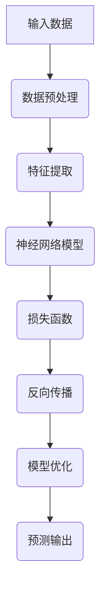

                 

### 文章标题：深度学习原理与代码实例讲解

> 关键词：深度学习、神经网络、算法、应用场景、代码实例

> 摘要：本文深入讲解了深度学习的原理和核心算法，通过一系列代码实例，展示了如何使用深度学习解决实际问题。文章涵盖深度学习的基础理论、主要挑战、应用领域，以及未来发展趋势。同时，通过具体的项目实战，详细解析了如何实现和优化深度学习模型。

---

### 第1章：深度学习基础理论

深度学习作为一种强大的机器学习技术，在过去的几十年中经历了显著的发展。本章将介绍深度学习的基本概念、发展历程、神经网络与深度学习的关系，以及深度学习的挑战和应用领域。

#### 1.1 深度学习的概念与发展历程

深度学习是一种基于多层神经网络的结构，通过多层的非线性变换来提取数据特征，进而实现复杂的模式识别和预测任务。深度学习起源于20世纪80年代末，但受到计算能力和数据限制的影响，发展缓慢。随着计算能力的提升和大数据技术的发展，深度学习在21世纪初迎来了爆发式增长。

深度学习的关键里程碑包括：

1. **1986年**：Rumelhart、Hinton和Williams提出了反向传播算法，为深度学习奠定了基础。
2. **1998年**：Hinton提出了“深度信念网络”，这是早期的深度学习模型之一。
3. **2006年**：Hinton发表了关于深度信念网络在语音识别和图像识别上的应用，引发了深度学习的再次兴起。
4. **2012年**：AlexNet在ImageNet竞赛中取得了突破性的成果，使得深度学习在图像识别领域取得了显著的进展。

#### 1.2 神经网络与深度学习的关系

神经网络是深度学习的基础，是一种由大量相互连接的简单计算单元组成的计算模型。每个神经元接收多个输入，并通过加权求和后加上偏置，再经过激活函数产生输出。神经网络的核心在于其层次结构，通过增加网络的深度（即层数），可以更好地提取数据的多层次特征。

深度学习与神经网络的关系可以概括为：

- **神经网络是深度学习的基石**：深度学习是基于神经网络的扩展，通过增加网络的深度和复杂性，来实现更高效的模型。
- **深度学习利用神经网络的多层结构**：深度学习通过多层神经网络来提取数据中的层次特征，从而实现更复杂的任务。

#### 1.3 深度学习的主要挑战

尽管深度学习在许多领域取得了显著成果，但它也面临着一系列挑战：

- **过拟合问题**：过拟合是指模型在训练数据上表现很好，但在未见过的数据上表现较差。这通常是由于模型过于复杂，从训练数据中学习到了噪声。
- **计算资源需求**：深度学习模型通常需要大量的计算资源，尤其是在训练阶段。这限制了其在资源受限环境中的应用。
- **数据需求**：深度学习模型需要大量的数据来进行训练，缺乏数据会导致模型性能不佳。

#### 1.4 深度学习的应用领域

深度学习在多个领域展现了其强大的能力，以下是其中的一些主要应用领域：

- **计算机视觉**：深度学习在图像分类、目标检测、人脸识别等领域取得了显著成果。
- **自然语言处理**：深度学习在语言模型、机器翻译、文本生成等领域表现出色。
- **语音识别**：深度学习在语音信号处理和语音识别任务中广泛应用。
- **推荐系统**：深度学习可以帮助构建更准确和个性化的推荐系统。

#### 1.5 深度学习的未来发展趋势

随着技术的不断进步，深度学习在未来还有许多发展方向：

- **模型压缩与优化**：为了降低计算成本，深度学习模型正朝着模型压缩和优化的方向发展。
- **迁移学习与少样本学习**：迁移学习和少样本学习可以帮助模型在数据匮乏的场景下更好地学习。
- **生成对抗网络（GAN）**：GAN作为一种新型深度学习框架，在图像生成、图像修复等领域表现出强大的潜力。

### Mermaid 流程图



### 深度学习核心算法原理讲解

在深度学习中，核心算法的原理和实现至关重要。下面将详细讲解深度学习中的神经网络训练过程、损失函数、激活函数，以及优化算法。

#### 1.6 神经网络训练过程

深度学习的训练过程主要包括以下步骤：

1. **前向传播**：输入数据通过网络的正向传递，逐层计算每个神经元的输出。
    ```plaintext
    输出 = activation(∑(权重*输入) + 偏置)
    ```
2. **计算损失**：通过计算预测值与真实值之间的差异，得到损失值。
3. **反向传播**：计算输出误差，反向传递误差，更新网络权重和偏置。
    ```plaintext
    Δw = 学习率 * ∂E/∂w
    w_new = w_old - Δw
    ```

#### 1.7 损失函数

损失函数是评估模型预测值与真实值之间差异的指标。以下是几种常用的损失函数：

- **均方误差（MSE）**：
    ```latex
    MSE = \frac{1}{n}\sum_{i=1}^{n}(y_i - \hat{y}_i)^2
    ```
- **交叉熵（Cross-Entropy）**：
    ```latex
    H(Y, \hat{Y}) = -\sum_{i=1}^{n}y_i \log(\hat{y}_i)
    ```

#### 1.8 激活函数

激活函数是神经网络中的一个关键

