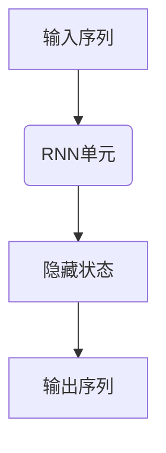
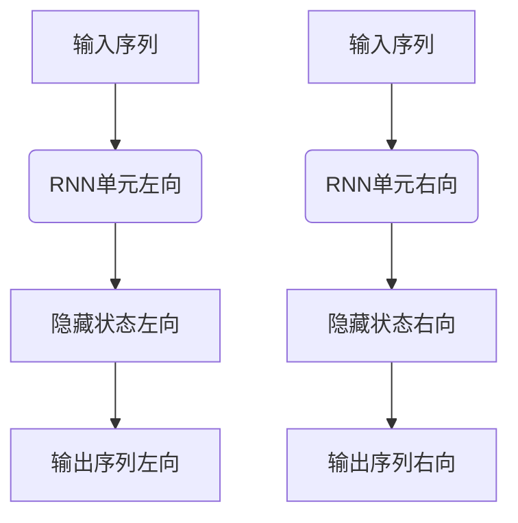
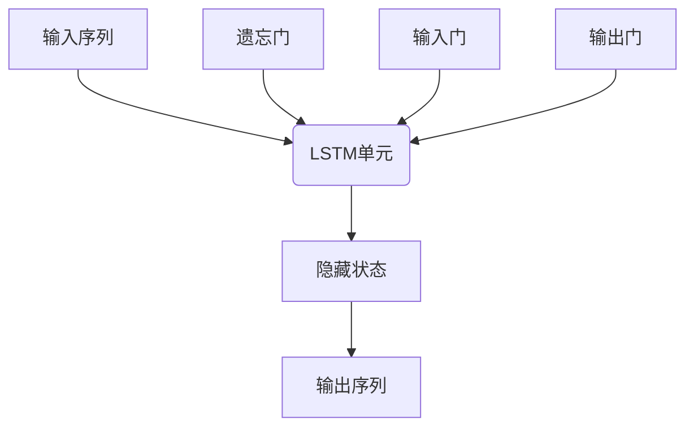
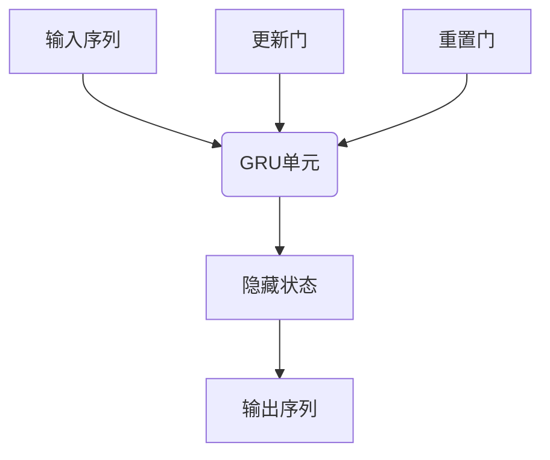
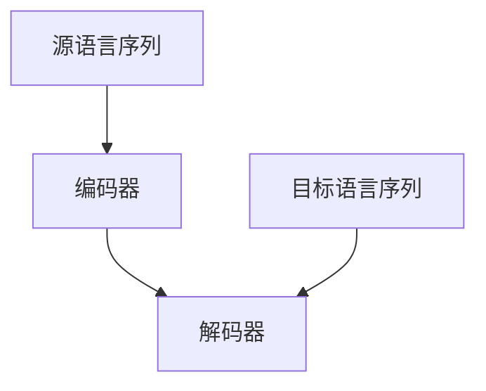
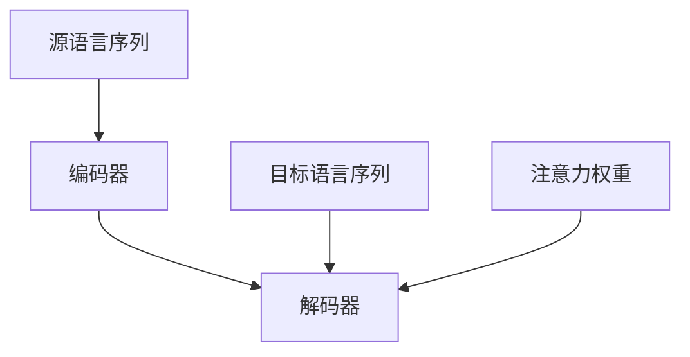
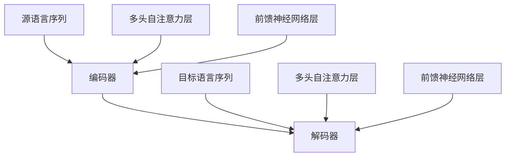

                 

# 深度学习(Deep Learning) - 原理与代码实例讲解

## 关键词
- 深度学习
- 神经网络
- 卷积神经网络
- 循环神经网络
- 训练过程
- 模型评估
- 数据预处理

## 摘要
本文旨在深入探讨深度学习的原理及其在实际应用中的实现。我们将从基础概念出发，逐步讲解深度学习的核心算法和架构，并通过具体实例展示如何使用深度学习解决实际问题。文章将涵盖从神经网络的基础结构到复杂模型如卷积神经网络和循环神经网络，再到深度学习训练过程、正则化方法，以及在图像处理、自然语言处理和推荐系统中的应用。最后，我们将探讨深度学习的未来发展及其挑战。

## 目录大纲

## 第一部分：深度学习基础

## 第1章：深度学习的概述
### 1.1 深度学习的定义
### 1.2 深度学习的起源与发展
### 1.3 深度学习与机器学习的联系与区别

## 第2章：深度学习的基本架构
### 2.1 神经网络的基本结构
#### 2.1.1 前馈神经网络
#### 2.1.2 卷积神经网络
#### 2.1.3 循环神经网络
### 2.2 神经网络的工作原理
#### 2.2.1 前向传播与反向传播
#### 2.2.2 损失函数与优化器

## 第3章：深度学习的核心算法
### 3.1 深度学习训练过程详解
#### 3.1.1 数据预处理
#### 3.1.2 模型选择与超参数调整
#### 3.1.3 模型评估与优化
### 3.2 深度学习中的正则化方法
#### 3.2.1 Dropout
#### 3.2.2 权重衰减
#### 3.2.3 数据增强

## 第4章：深度学习在图像处理中的应用
### 4.1 卷积神经网络在图像分类中的应用
#### 4.1.1 LeNet-5模型
#### 4.1.2 AlexNet模型
#### 4.1.3 VGG模型
### 4.2 深度学习在目标检测中的应用
#### 4.2.1 R-CNN模型
#### 4.2.2 Fast R-CNN模型
#### 4.2.3 Faster R-CNN模型

## 第5章：深度学习在自然语言处理中的应用
### 5.1 循环神经网络在文本分类中的应用
#### 5.1.1 基础循环神经网络
#### 5.1.2 双向循环神经网络
#### 5.1.3 LSTM与GRU模型
### 5.2 深度学习在机器翻译中的应用
#### 5.2.1 序列到序列模型
#### 5.2.2 注意力机制
#### 5.2.3 Transformer模型

## 第6章：深度学习在推荐系统中的应用
### 6.1 深度学习在协同过滤算法中的应用
#### 6.1.1 基于矩阵分解的协同过滤
#### 6.1.2 基于深度学习的协同过滤
### 6.2 深度学习在序列预测中的应用
#### 6.2.1 基于RNN的序列预测
#### 6.2.2 基于Transformer的序列预测

## 第7章：深度学习项目实战
### 7.1 数据预处理实战
#### 7.1.1 数据清洗与归一化
#### 7.1.2 数据增强技术
### 7.2 模型训练实战
#### 7.2.1 模型选择与超参数调整
#### 7.2.2 模型训练与验证
### 7.3 模型评估与优化实战
#### 7.3.1 模型评估指标
#### 7.3.2 模型调优技术

## 第8章：深度学习的未来发展趋势
### 8.1 深度学习在工业界的应用前景
#### 8.1.1 自动驾驶技术
#### 8.1.2 医疗影像分析
#### 8.1.3 金融风控
### 8.2 深度学习的未来发展挑战
#### 8.2.1 计算资源需求
#### 8.2.2 数据隐私保护
#### 8.2.3 模型解释性

## 附录
### A.1 深度学习常用框架与工具
#### A.1.1 TensorFlow
#### A.1.2 PyTorch
#### A.1.3 Keras
### A.2 深度学习学习资源推荐
#### A.2.1 在线教程与课程
#### A.2.2 优秀博客与论文
#### A.2.3 实践项目与挑战赛

---

## 第一部分：深度学习基础

### 第1章：深度学习的概述

深度学习（Deep Learning，简称DL）是机器学习（Machine Learning，简称ML）的一个子领域，主要关注于利用多层神经网络对数据进行学习和表示。其核心思想是通过多层神经网络将输入数据转化为有意义的抽象表示，从而实现复杂任务的自动完成。

#### 1.1 深度学习的定义

深度学习是一种基于人工神经网络的学习方法，其特点包括：

- **多层网络结构**：深度学习模型包含多个隐藏层，使得模型能够学习到更高级别的特征表示。
- **自动特征提取**：深度学习通过训练自动学习输入数据的特征表示，无需人工设计特征。
- **端到端学习**：深度学习模型可以接受原始数据作为输入，直接进行预测或分类，无需经过复杂的预处理和特征工程步骤。

#### 1.2 深度学习的起源与发展

深度学习的起源可以追溯到1986年，当Rumelhart、Hinton和Williams提出了反向传播算法（Backpropagation），这是一种用于训练多层神经网络的算法。然而，由于计算资源的限制和算法的复杂性，深度学习在早期并没有得到广泛的应用。

随着计算能力的提升和大数据的出现，深度学习在2012年取得了重要的突破。当时，Alex Krizhevsky等人使用深度卷积神经网络在ImageNet图像分类挑战中取得了显著的性能提升，这一成果标志着深度学习时代的到来。

#### 1.3 深度学习与机器学习的联系与区别

深度学习是机器学习的一个分支，其主要区别在于：

- **方法与模型**：机器学习通常使用较浅的网络结构，而深度学习使用多层神经网络。
- **特征提取**：在机器学习中，特征工程是一个关键步骤，而深度学习通过自动特征提取减少了这一步骤。
- **任务范围**：机器学习可以应用于多种任务，如分类、回归和聚类等，而深度学习更适合于处理具有复杂数据特征的任务，如图像和文本。

### 第2章：深度学习的基本架构

深度学习的基本架构包括神经网络、激活函数、损失函数和优化器等组成部分。这些组成部分协同工作，使得深度学习模型能够有效地学习数据特征并完成预测任务。

#### 2.1 神经网络的基本结构

神经网络（Neural Network，简称NN）是深度学习的基础。一个简单的神经网络包含以下基本结构：

- **输入层**：接收外部输入数据。
- **隐藏层**：对输入数据进行处理和特征提取。
- **输出层**：产生预测结果。

#### 2.1.1 前馈神经网络

前馈神经网络（Feedforward Neural Network，简称FNN）是最简单的神经网络结构。它通过一系列的前向传播和反向传播过程进行训练和预测。前向传播将输入数据通过隐藏层传递到输出层，而反向传播则根据损失函数计算梯度并更新网络权重。

#### 2.1.2 卷积神经网络

卷积神经网络（Convolutional Neural Network，简称CNN）是一种专门用于处理图像数据的神经网络。它通过卷积操作提取图像中的局部特征，并通过池化操作减少数据维度。

#### 2.1.3 循环神经网络

循环神经网络（Recurrent Neural Network，简称RNN）是一种用于处理序列数据的神经网络。它通过在时间步之间传递隐藏状态，使得模型能够学习到序列中的长期依赖关系。

#### 2.2 神经网络的工作原理

神经网络的工作原理可以通过以下步骤进行描述：

1. **前向传播**：输入数据通过网络的每个层，每一层都会对输入进行加权求和并应用激活函数。
2. **激活函数**：激活函数用于引入非线性，使得神经网络能够学习复杂数据特征。
3. **损失函数**：损失函数用于衡量预测结果与真实结果之间的差距。
4. **反向传播**：使用梯度下降算法更新网络权重，以最小化损失函数。
5. **迭代训练**：重复前向传播和反向传播过程，直到模型达到预定的训练目标。

#### 2.2.1 前向传播与反向传播

前向传播和反向传播是神经网络训练过程中的两个关键步骤：

- **前向传播**：输入数据通过网络的每个层，每一层都会对输入进行加权求和并应用激活函数。输出层产生预测结果，并与真实结果进行比较。
- **反向传播**：根据预测结果与真实结果之间的差异，计算损失函数的梯度。梯度用于更新网络权重，以最小化损失函数。

#### 2.2.2 损失函数与优化器

损失函数用于衡量预测结果与真实结果之间的差距。常见的损失函数包括均方误差（MSE）、交叉熵（Cross-Entropy）等。

优化器用于更新网络权重，以最小化损失函数。常见的优化器包括梯度下降（Gradient Descent）、Adam优化器等。

### 第3章：深度学习的核心算法

深度学习的核心算法包括深度学习训练过程、正则化方法和评估与优化技术。这些算法共同作用，使得深度学习模型能够有效地学习数据特征并提高预测性能。

#### 3.1 深度学习训练过程详解

深度学习训练过程可以分为以下几个步骤：

1. **数据预处理**：对训练数据进行清洗、归一化和增强等处理，以提高模型的泛化能力。
2. **模型选择**：选择合适的神经网络模型，如卷积神经网络（CNN）或循环神经网络（RNN）。
3. **超参数调整**：调整学习率、批次大小等超参数，以优化模型性能。
4. **训练过程**：使用训练数据进行迭代训练，通过前向传播和反向传播更新网络权重。
5. **验证与测试**：使用验证集和测试集评估模型性能，并调整模型参数。

#### 3.1.1 数据预处理

数据预处理是深度学习训练过程的重要步骤，它包括以下任务：

- **数据清洗**：去除异常值、缺失值和重复数据。
- **归一化**：将数据缩放到相同的范围，以加速收敛和提高模型性能。
- **数据增强**：通过旋转、缩放、剪裁等方法增加数据的多样性，以提高模型的泛化能力。

#### 3.1.2 模型选择与超参数调整

模型选择和超参数调整是深度学习训练过程中的关键步骤，它们直接影响模型的性能和泛化能力。常见的神经网络模型包括卷积神经网络（CNN）、循环神经网络（RNN）和长短时记忆网络（LSTM）等。常见的超参数包括学习率、批次大小、迭代次数等。

#### 3.1.3 模型评估与优化

模型评估与优化是确保深度学习模型性能的重要步骤。常见的评估指标包括准确率、召回率、F1分数等。模型优化方法包括超参数调整、正则化方法、优化器选择等。

#### 3.2 深度学习中的正则化方法

正则化方法是防止深度学习模型过拟合的重要手段。常见的正则化方法包括：

- **Dropout**：随机丢弃一部分神经元，以减少模型对特定神经元依赖。
- **权重衰减**：通过减少权重的大小来降低模型对权重参数的敏感度。
- **数据增强**：通过增加数据的多样性来提高模型的泛化能力。

### 第4章：深度学习在图像处理中的应用

深度学习在图像处理领域取得了显著的成果，包括图像分类、目标检测和图像生成等任务。本节将介绍深度学习在图像处理中的应用及其典型模型。

#### 4.1 卷积神经网络在图像分类中的应用

卷积神经网络（CNN）是深度学习在图像分类中的主要工具。它通过卷积层、池化层和全连接层等结构对图像进行特征提取和分类。以下是一些典型的CNN模型：

- **LeNet-5模型**：一种早期的CNN模型，用于手写数字识别。
- **AlexNet模型**：一种深度为5层的CNN模型，在ImageNet竞赛中取得了显著的性能提升。
- **VGG模型**：一种基于卷积层堆叠的CNN模型，通过使用较小的卷积核尺寸和深度卷积层，提高了图像分类的准确性。

#### 4.1.1 LeNet-5模型

LeNet-5是一种早期的CNN模型，由LeCun等人于1998年提出。它包含两个卷积层、两个池化层和一个全连接层。以下是LeNet-5模型的详细架构：

1. **输入层**：输入一个32x32的灰度图像。
2. **卷积层1**：使用5x5的卷积核，得到16个特征图。
3. **ReLU激活函数**：对卷积层1的输出进行ReLU激活。
4. **池化层1**：使用2x2的最大池化。
5. **卷积层2**：使用5x5的卷积核，得到32个特征图。
6. **ReLU激活函数**：对卷积层2的输出进行ReLU激活。
7. **池化层2**：使用2x2的最大池化。
8. **全连接层**：将池化层2的输出扁平化为1x1024的向量，并经过一个softmax激活函数进行分类。

#### 4.1.2 AlexNet模型

AlexNet是由Hinton等人于2012年提出的深度卷积神经网络，它在ImageNet竞赛中取得了显著的性能提升。以下是AlexNet模型的详细架构：

1. **输入层**：输入一个227x227的RGB图像。
2. **卷积层1**：使用11x11的卷积核，步长为4，得到96个特征图。
3. **ReLU激活函数**：对卷积层1的输出进行ReLU激活。
4. **池化层1**：使用3x3的最大池化，步长为2。
5. **卷积层2**：使用5x5的卷积核，得到256个特征图。
6. **ReLU激活函数**：对卷积层2的输出进行ReLU激活。
7. **池化层2**：使用3x3的最大池化，步长为2。
8. **卷积层3**：使用3x3的卷积核，得到384个特征图。
9. **ReLU激活函数**：对卷积层3的输出进行ReLU激活。
10. **卷积层4**：使用3x3的卷积核，得到384个特征图。
11. **ReLU激活函数**：对卷积层4的输出进行ReLU激活。
12. **池化层3**：使用3x3的最大池化，步长为2。
13. **卷积层5**：使用3x3的卷积核，得到256个特征图。
14. **ReLU激活函数**：对卷积层5的输出进行ReLU激活。
15. **全连接层**：将卷积层5的输出扁平化为1x2560的向量，经过一个4096维的全连接层，最后经过一个1000维的全连接层进行分类。

#### 4.1.3 VGG模型

VGG模型是由Simonyan和Zisserman于2014年提出的深度卷积神经网络，它通过使用较小的卷积核尺寸和深度卷积层，提高了图像分类的准确性。以下是VGG模型的详细架构：

1. **输入层**：输入一个224x224的RGB图像。
2. **卷积层1**：使用3x3的卷积核，步长为1，得到64个特征图。
3. **ReLU激活函数**：对卷积层1的输出进行ReLU激活。
4. **池化层1**：使用2x2的最大池化。
5. **卷积层2**：使用3x3的卷积核，步长为1，得到64个特征图。
6. **ReLU激活函数**：对卷积层2的输出进行ReLU激活。
7. **池化层2**：使用2x2的最大池化。
8. **卷积层3**：使用3x3的卷积核，步长为1，得到128个特征图。
9. **ReLU激活函数**：对卷积层3的输出进行ReLU激活。
10. **池化层3**：使用2x2的最大池化。
11. **卷积层4**：使用3x3的卷积核，步长为1，得到128个特征图。
12. **ReLU激活函数**：对卷积层4的输出进行ReLU激活。
13. **池化层4**：使用2x2的最大池化。
14. **卷积层5**：使用3x3的卷积核，步长为1，得到256个特征图。
15. **ReLU激活函数**：对卷积层5的输出进行ReLU激活。
16. **池化层5**：使用2x2的最大池化。
17. **卷积层6**：使用3x3的卷积核，步长为1，得到256个特征图。
18. **ReLU激活函数**：对卷积层6的输出进行ReLU激活。
19. **池化层6**：使用2x2的最大池化。
20. **卷积层7**：使用3x3的卷积核，步长为1，得到512个特征图。
21. **ReLU激活函数**：对卷积层7的输出进行ReLU激活。
22. **池化层7**：使用2x2的最大池化。
23. **卷积层8**：使用3x3的卷积核，步长为1，得到512个特征图。
24. **ReLU激活函数**：对卷积层8的输出进行ReLU激活。
25. **池化层8**：使用2x2的最大池化。
26. **卷积层9**：使用3x3的卷积核，步长为1，得到512个特征图。
27. **ReLU激活函数**：对卷积层9的输出进行ReLU激活。
28. **池化层9**：使用2x2的最大池化。
29. **全连接层**：将卷积层9的输出扁平化为1x25088的向量，经过一个4096维的全连接层，最后经过一个4096维的全连接层，最后经过一个1000维的全连接层进行分类。

#### 4.2 深度学习在目标检测中的应用

目标检测（Object Detection）是深度学习在计算机视觉领域的重要应用之一。它旨在同时定位和识别图像中的多个目标。以下是一些常见的目标检测模型：

- **R-CNN模型**：基于区域建议的网络，通过滑动窗口生成候选区域，并对每个区域进行分类和边界框回归。
- **Fast R-CNN模型**：改进了R-CNN模型，通过共享卷积特征图减少了计算量。
- **Faster R-CNN模型**：引入了区域建议网络（Region Proposal Network，RPN），进一步提高了检测速度和性能。

#### 4.2.1 R-CNN模型

R-CNN（Region-based Convolutional Neural Network）模型由Ross Girshick等人于2015年提出。它主要包括以下几个步骤：

1. **候选区域生成**：使用选择性搜索（Selective Search）算法生成候选区域。
2. **特征提取**：对每个候选区域使用卷积神经网络提取特征向量。
3. **分类与边界框回归**：使用SVM或线性分类器对特征向量进行分类，并使用回归器对边界框进行回归。

以下是R-CNN模型的详细架构：

1. **输入图像**：输入一个图像。
2. **候选区域生成**：使用选择性搜索算法生成候选区域。
3. **特征提取**：对每个候选区域使用卷积神经网络提取特征向量。
4. **分类与边界框回归**：使用SVM或线性分类器对特征向量进行分类，并使用回归器对边界框进行回归。

#### 4.2.2 Fast R-CNN模型

Fast R-CNN（Fast Region-based Convolutional Neural Network）模型是R-CNN的改进版本，由Ross Girshick等人于2015年提出。它通过共享卷积特征图减少了计算量，提高了检测速度。以下是Fast R-CNN模型的详细架构：

1. **输入图像**：输入一个图像。
2. **候选区域生成**：使用选择性搜索算法生成候选区域。
3. **特征提取**：使用卷积神经网络提取共享特征图。
4. **分类与边界框回归**：对每个候选区域提取特征向量，并使用SVM或线性分类器进行分类，同时使用回归器对边界框进行回归。

#### 4.2.3 Faster R-CNN模型

Faster R-CNN（Faster Region-based Convolutional Neural Network）模型是Fast R-CNN的进一步改进版本，由Shaoqing Ren等人于2015年提出。它引入了区域建议网络（Region Proposal Network，RPN），大大提高了检测速度。以下是Faster R-CNN模型的详细架构：

1. **输入图像**：输入一个图像。
2. **候选区域生成**：使用区域建议网络（RPN）生成候选区域。
3. **特征提取**：使用卷积神经网络提取共享特征图。
4. **分类与边界框回归**：对每个候选区域提取特征向量，并使用SVM或线性分类器进行分类，同时使用回归器对边界框进行回归。

### 第5章：深度学习在自然语言处理中的应用

深度学习在自然语言处理（Natural Language Processing，简称NLP）领域取得了显著成果，包括文本分类、机器翻译和情感分析等任务。本节将介绍深度学习在NLP中的应用及其典型模型。

#### 5.1 循环神经网络在文本分类中的应用

循环神经网络（Recurrent Neural Network，简称RNN）是深度学习在序列数据上的重要应用之一。RNN通过在时间步之间传递隐藏状态，使得模型能够学习到序列中的长期依赖关系。以下是一些基于RNN的文本分类模型：

- **基本循环神经网络**：使用简单的RNN进行文本分类。
- **双向循环神经网络**：同时考虑文本的左向和右向信息。
- **长短时记忆网络（LSTM）**：通过记忆单元来学习长期依赖关系。
- **门控循环单元（GRU）**：LSTM的变体，简化了计算和内存需求。

#### 5.1.1 基本循环神经网络

基本循环神经网络（Basic RNN）是最简单的RNN模型。它包含一个循环单元，每个时间步的输出依赖于前一个时间步的输出。以下是一个基本RNN的示意图：



基本RNN通过以下步骤进行训练：

1. **初始化隐藏状态**：在每个时间步，初始化隐藏状态。
2. **计算输入和隐藏状态的加权和**：使用权重矩阵对输入和隐藏状态进行加权求和。
3. **应用激活函数**：对加权和应用激活函数，如ReLU或Sigmoid。
4. **更新隐藏状态**：将输出作为新的隐藏状态。
5. **重复上述步骤**：对于每个时间步重复上述步骤，直到处理完整个序列。

以下是基本RNN的伪代码：

```python
def forward_pass(input_sequence, weights):
    hidden_states = []
    for t in range(len(input_sequence)):
        input_t = input_sequence[t]
        if t == 0:
            hidden_t = initialize_hidden_state()
        else:
            hidden_t = weights * hidden_t + input_t
        hidden_t = activation_function(hidden_t)
        hidden_states.append(hidden_t)
    return hidden_states

def backward_pass(hidden_states, weights, loss_function):
    gradients = []
    for t in range(len(hidden_states)):
        input_t = input_sequence[t]
        if t == 0:
            hidden_t = initialize_hidden_state()
        else:
            hidden_t = weights * hidden_t + input_t
        hidden_t = activation_function_derivative(hidden_t)
        gradient_t = loss_function_derivative(hidden_t, target)
        gradients.append(gradient_t)
    return gradients
```

#### 5.1.2 双向循环神经网络

双向循环神经网络（Bidirectional RNN）通过同时考虑文本的左向和右向信息，提高了文本分类的准确性。双向RNN包含两个RNN单元，一个负责处理左向序列，另一个负责处理右向序列。以下是一个双向RNN的示意图：



双向RNN通过以下步骤进行训练：

1. **初始化两个隐藏状态**：在每个时间步，初始化两个隐藏状态。
2. **计算左向和右向的输入和隐藏状态的加权和**：使用权重矩阵对输入和隐藏状态进行加权求和。
3. **应用激活函数**：对加权和应用激活函数。
4. **更新两个隐藏状态**：将输出作为新的隐藏状态。
5. **拼接两个隐藏状态**：将左向和右向的隐藏状态拼接为一个完整的隐藏状态。
6. **重复上述步骤**：对于每个时间步重复上述步骤，直到处理完整个序列。

以下是双向RNN的伪代码：

```python
def forward_pass_left(input_sequence, weights):
    hidden_states_left = []
    for t in range(len(input_sequence)):
        input_t = input_sequence[t]
        if t == 0:
            hidden_t_left = initialize_hidden_state()
        else:
            hidden_t_left = weights * hidden_t_left + input_t
        hidden_t_left = activation_function(hidden_t_left)
        hidden_states_left.append(hidden_t_left)
    return hidden_states_left

def forward_pass_right(input_sequence, weights):
    hidden_states_right = []
    for t in range(len(input_sequence)):
        input_t = input_sequence[t]
        if t == 0:
            hidden_t_right = initialize_hidden_state()
        else:
            hidden_t_right = weights * hidden_t_right + input_t
        hidden_t_right = activation_function(hidden_t_right)
        hidden_states_right.append(hidden_t_right)
    return hidden_states_right

def forward_pass_bidirectional(input_sequence, weights):
    hidden_states_left = forward_pass_left(input_sequence, weights)
    hidden_states_right = forward_pass_right(input_sequence, weights)
    hidden_states_bidirectional = [h_left + h_right for h_left, h_right in zip(hidden_states_left, hidden_states_right)]
    return hidden_states_bidirectional
```

#### 5.1.3 长短时记忆网络（LSTM）

长短时记忆网络（Long Short-Term Memory，简称LSTM）是RNN的一种变体，通过引入记忆单元来学习长期依赖关系。LSTM通过遗忘门、输入门和输出门来控制信息的传递和记忆。以下是一个LSTM的示意图：



LSTM通过以下步骤进行训练：

1. **初始化隐藏状态和细胞状态**：在每个时间步，初始化隐藏状态和细胞状态。
2. **计算遗忘门的输出**：根据当前隐藏状态和遗忘门权重计算遗忘门的输出。
3. **计算输入门的输出**：根据当前输入和输入门权重计算输入门的输出。
4. **计算细胞状态的更新**：根据遗忘门的输出、输入门的输出和细胞状态计算新的细胞状态。
5. **计算隐藏状态的更新**：根据细胞状态和输出门权重计算新的隐藏状态。
6. **重复上述步骤**：对于每个时间步重复上述步骤，直到处理完整个序列。

以下是LSTM的伪代码：

```python
def forward_pass_lstm(input_sequence, weights):
    hidden_states = []
    cell_states = []
    for t in range(len(input_sequence)):
        input_t = input_sequence[t]
        if t == 0:
            hidden_t = initialize_hidden_state()
            cell_t = initialize_cell_state()
        else:
            hidden_t = weights * hidden_t + input_t
        forget_gate_output = sigmoid(weights_forget * [hidden_t, input_t])
        input_gate_output = sigmoid(weights_input * [hidden_t, input_t])
        cell_state_t = cell_state_t * forget_gate_output + sigmoid(input_gate_output) * tanh(weights_input * [hidden_t, input_t])
        hidden_state_t = sigmoid(weights_output * [cell_state_t, hidden_t])
        hidden_states.append(hidden_state_t)
        cell_states.append(cell_state_t)
    return hidden_states, cell_states
```

#### 5.1.4 门控循环单元（GRU）

门控循环单元（Gated Recurrent Unit，简称GRU）是LSTM的一种变体，通过简化计算和内存需求来提高训练速度。GRU通过更新门和重置门来控制信息的传递和记忆。以下是一个GRU的示意图：



GRU通过以下步骤进行训练：

1. **初始化隐藏状态**：在每个时间步，初始化隐藏状态。
2. **计算更新门的输出**：根据当前隐藏状态和更新门权重计算更新门的输出。
3. **计算重置门的输出**：根据当前输入和重置门权重计算重置门的输出。
4. **计算新的隐藏状态**：根据重置门的输出和更新门的输出计算新的隐藏状态。
5. **重复上述步骤**：对于每个时间步重复上述步骤，直到处理完整个序列。

以下是GRU的伪代码：

```python
def forward_pass_gru(input_sequence, weights):
    hidden_states = []
    for t in range(len(input_sequence)):
        input_t = input_sequence[t]
        if t == 0:
            hidden_t = initialize_hidden_state()
        else:
            update_gate_output = sigmoid(weights_update * [hidden_t, input_t])
            reset_gate_output = sigmoid(weights_reset * [hidden_t, input_t])
            hidden_t = (1 - update_gate_output) * hidden_t + update_gate_output * tanh(weights_input * [reset_gate_output * hidden_t, input_t])
        hidden_states.append(hidden_t)
    return hidden_states
```

#### 5.2 深度学习在机器翻译中的应用

机器翻译（Machine Translation）是深度学习在自然语言处理领域的重要应用之一。深度学习通过学习源语言和目标语言之间的映射关系，实现高质量、自动化的翻译。以下是一些基于深度学习的机器翻译模型：

- **序列到序列模型**：通过编码器-解码器结构实现源语言到目标语言的映射。
- **注意力机制**：通过注意力机制提高机器翻译的准确性。
- **Transformer模型**：基于自注意力机制的深度学习模型，在机器翻译任务中取得了显著的性能提升。

#### 5.2.1 序列到序列模型

序列到序列模型（Sequence-to-Sequence Model）是深度学习在机器翻译中的主要模型。它通过编码器（Encoder）和解码器（Decoder）两个神经网络结构实现源语言到目标语言的映射。以下是一个序列到序列模型的示意图：



序列到序列模型通过以下步骤进行训练：

1. **编码器**：使用编码器对源语言序列进行编码，生成上下文向量。
2. **解码器**：使用解码器对目标语言序列进行解码，生成预测的目标语言序列。
3. **损失函数**：使用损失函数（如交叉熵损失函数）计算预测目标语言序列和真实目标语言序列之间的差异。
4. **反向传播**：使用反向传播算法更新编码器和解码器的权重。

以下是序列到序列模型的伪代码：

```python
def forward_pass_sequence_to_sequence(source_sequence, target_sequence, encoder, decoder):
    context_vector = encoder(source_sequence)
    target_sequence_pred = decoder(context_vector)
    loss = loss_function(target_sequence_pred, target_sequence)
    return loss

def backward_pass_sequence_to_sequence(source_sequence, target_sequence, encoder, decoder):
    gradients = backward_pass(target_sequence_pred, target_sequence, loss_function)
    gradients_decoder = gradients[decoder]
    gradients_encoder = gradients[encoder]
    update_weights(encoder, gradients_encoder)
    update_weights(decoder, gradients_decoder)
```

#### 5.2.2 注意力机制

注意力机制（Attention Mechanism）是深度学习在机器翻译中的重要技术，用于提高模型对源语言序列和目标语言序列之间关系的理解能力。注意力机制通过计算源语言序列和目标语言序列之间的相似度，为解码器在每个时间步提供不同的上下文信息。以下是一个注意力机制的示意图：



注意力机制通过以下步骤进行训练：

1. **计算注意力权重**：使用点积、加性或乘性注意力机制计算源语言序列和目标语言序列之间的相似度。
2. **生成上下文向量**：将注意力权重与编码器的输出进行加权求和，生成上下文向量。
3. **解码**：使用解码器生成预测的目标语言序列。
4. **损失函数**：使用损失函数计算预测目标语言序列和真实目标语言序列之间的差异。
5. **反向传播**：使用反向传播算法更新编码器和解码器的权重。

以下是注意力机制的伪代码：

```python
def forward_pass_with_attention(source_sequence, target_sequence, encoder, decoder, attention_mechanism):
    context_vector = encoder(source_sequence)
    attention_weights = attention_mechanism(context_vector, target_sequence)
    weighted_context_vector = attention_weights * context_vector
    target_sequence_pred = decoder(weighted_context_vector)
    loss = loss_function(target_sequence_pred, target_sequence)
    return loss

def backward_pass_with_attention(source_sequence, target_sequence, encoder, decoder, attention_mechanism):
    gradients = backward_pass(target_sequence_pred, target_sequence, loss_function)
    gradients_decoder = gradients[decoder]
    gradients_encoder = gradients[encoder]
    gradients_attention = gradients[attention_mechanism]
    update_weights(encoder, gradients_encoder)
    update_weights(decoder, gradients_decoder)
    update_weights(attention_mechanism, gradients_attention)
```

#### 5.2.3 Transformer模型

Transformer模型是由Vaswani等人于2017年提出的一种基于自注意力机制的深度学习模型，它在机器翻译任务中取得了显著的性能提升。Transformer模型通过多头自注意力机制和前馈神经网络结构，提高了模型的表达能力。以下是一个Transformer模型的示意图：



Transformer模型通过以下步骤进行训练：

1. **编码器**：使用编码器对源语言序列进行编码，生成编码器的输出。
2. **解码器**：使用解码器对目标语言序列进行解码，生成预测的目标语言序列。
3. **多头自注意力**：在每个时间步，计算源语言序列和目标语言序列之间的自注意力权重，并生成上下文向量。
4. **前馈神经网络**：对自注意力层的输出进行前馈神经网络处理，进一步提高模型的表达能力。
5. **损失函数**：使用损失函数（如交叉熵损失函数）计算预测目标语言序列和真实目标语言序列之间的差异。
6. **反向传播**：使用反向传播算法更新编码器和解码器的权重。

以下是Transformer模型的伪代码：

```python
def forward_pass_transformer(source_sequence, target_sequence, encoder, decoder):
    encoder_output = encoder(source_sequence)
    decoder_output = decoder(target_sequence)
    attention_output = attention_mechanism(encoder_output, target_sequence)
    feedforward_output = feedforward_network(attention_output)
    loss = loss_function(decoder_output, target_sequence)
    return loss

def backward_pass_transformer(source_sequence, target_sequence, encoder, decoder):
    gradients = backward_pass(target_sequence, decoder_output, loss_function)
    gradients_encoder = gradients[encoder]
    gradients_decoder = gradients[decoder]
    update_weights(encoder, gradients_encoder)
    update_weights(decoder, gradients_decoder)
```

### 第6章：深度学习在推荐系统中的应用

深度学习在推荐系统中的应用日益广泛，通过学习用户的历史行为和物品的特征，实现个性化推荐。以下将介绍深度学习在推荐系统中的应用及其典型模型。

#### 6.1 深度学习在协同过滤算法中的应用

协同过滤（Collaborative Filtering）是推荐系统中最常用的方法之一，通过收集用户的历史行为数据，预测用户对未知物品的偏好。深度学习在协同过滤算法中的应用主要包括以下两个方面：

- **基于矩阵分解的协同过滤**：通过矩阵分解将用户和物品的偏好矩阵分解为低维表示，从而提高推荐效果。
- **基于深度学习的协同过滤**：结合深度学习模型，如循环神经网络（RNN）或图神经网络（GNN），对用户和物品的特征进行自动学习。

#### 6.1.1 基于矩阵分解的协同过滤

基于矩阵分解的协同过滤方法通过将用户和物品的偏好矩阵分解为低维表示，从而提高推荐效果。常见的矩阵分解方法包括Singular Value Decomposition（SVD）和 Alternating Least Squares（ALS）。

以下是基于矩阵分解的协同过滤的伪代码：

```python
def matrix_factorization(R, U, V, learning_rate, num_iterations):
    for _ in range(num_iterations):
        # 更新用户表示矩阵U
        for i in range(num_users):
            for j in range(num_items):
                if R[i][j] > 0:
                    eij = R[i][j] - dot(U[i], V[j])
                    U[i] = U[i] + learning_rate * (eij * V[j])

        # 更新物品表示矩阵V
        for j in range(num_items):
            for i in range(num_users):
                if R[i][j] > 0:
                    eij = R[i][j] - dot(U[i], V[j])
                    V[j] = V[j] + learning_rate * (eij * U[i])

    return U, V
```

#### 6.1.2 基于深度学习的协同过滤

基于深度学习的协同过滤方法结合深度学习模型，如循环神经网络（RNN）或图神经网络（GNN），对用户和物品的特征进行自动学习。以下是基于深度学习的协同过滤的伪代码：

```python
def forward_pass_collaborative_filtering(user_embedding, item_embedding, hidden_state):
    user_item_vector = dot(user_embedding, item_embedding)
    hidden_state = RNN(hidden_state, user_item_vector)
    prediction = dot(hidden_state, item_embedding)
    return prediction

def backward_pass_collaborative_filtering(prediction, target, hidden_state, user_embedding, item_embedding):
    error = prediction - target
    hidden_state_error = error * item_embedding
    user_embedding_error = dot(hidden_state.T, hidden_state_error)
    item_embedding_error = dot(hidden_state_error.T, user_embedding)
    update_weights(user_embedding, user_embedding_error)
    update_weights(item_embedding, item_embedding_error)
    update_weights(hidden_state, hidden_state_error)
```

#### 6.2 深度学习在序列预测中的应用

深度学习在序列预测中的应用广泛，通过学习时间序列数据的特征和模式，预测未来的趋势。以下将介绍基于循环神经网络（RNN）和Transformer的序列预测模型。

##### 6.2.1 基于RNN的序列预测

循环神经网络（RNN）是一种适用于序列数据的深度学习模型，通过在时间步之间传递隐藏状态，学习到序列中的长期依赖关系。以下是基于RNN的序列预测的伪代码：

```python
def forward_pass_rnn(input_sequence, hidden_state, weights):
    hidden_states = []
    for t in range(len(input_sequence)):
        input_t = input_sequence[t]
        hidden_t = RNN(hidden_state, input_t, weights)
        hidden_states.append(hidden_t)
    return hidden_states

def backward_pass_rnn(target_sequence, hidden_states, weights):
    gradients = []
    for t in range(len(hidden_states)):
        target_t = target_sequence[t]
        hidden_t = hidden_states[t]
        hidden_state_error = (target_t - hidden_t) * weights
        gradients.append(hidden_state_error)
    return gradients
```

##### 6.2.2 基于Transformer的序列预测

Transformer模型是一种基于自注意力机制的深度学习模型，在序列预测任务中取得了显著的性能提升。以下是基于Transformer的序列预测的伪代码：

```python
def forward_pass_transformer(input_sequence, hidden_state, weights):
    attention_output = attention_mechanism(input_sequence, hidden_state, weights)
    feedforward_output = feedforward_network(attention_output, weights)
    hidden_state = hidden_state + feedforward_output
    return hidden_state

def backward_pass_transformer(target_sequence, hidden_state, weights):
    attention_gradients = backward_pass(attention_output, target_sequence, loss_function)
    feedforward_gradients = backward_pass(feedforward_output, target_sequence, loss_function)
    hidden_state_gradients = attention_gradients + feedforward_gradients
    return hidden_state_gradients
```

### 第7章：深度学习项目实战

在实际应用中，深度学习项目通常包括数据预处理、模型训练、模型评估和模型优化等步骤。以下将通过具体实例展示如何进行深度学习项目的实战。

#### 7.1 数据预处理实战

数据预处理是深度学习项目的重要环节，它包括数据清洗、归一化和数据增强等步骤。以下是一个简单的数据预处理实例：

```python
import pandas as pd
from sklearn.preprocessing import StandardScaler
from torchvision import transforms

# 读取数据
data = pd.read_csv('data.csv')

# 数据清洗
data = data.dropna()

# 数据归一化
scaler = StandardScaler()
data[['feature1', 'feature2']] = scaler.fit_transform(data[['feature1', 'feature2']])

# 数据增强
transform = transforms.Compose([
    transforms.RandomHorizontalFlip(),
    transforms.RandomRotation(10),
])
data['image'] = transform(data['image'])
```

#### 7.2 模型训练实战

模型训练是深度学习项目中的关键步骤，它通过迭代优化模型参数，提高模型的性能。以下是一个简单的模型训练实例：

```python
import torch
from torch import nn
from torch.optim import Adam

# 定义模型
model = nn.Sequential(
    nn.Linear(input_dim, hidden_dim),
    nn.ReLU(),
    nn.Linear(hidden_dim, output_dim),
    nn.Sigmoid()
)

# 定义损失函数和优化器
loss_function = nn.BCELoss()
optimizer = Adam(model.parameters(), lr=learning_rate)

# 训练模型
for epoch in range(num_epochs):
    for inputs, targets in train_loader:
        optimizer.zero_grad()
        outputs = model(inputs)
        loss = loss_function(outputs, targets)
        loss.backward()
        optimizer.step()
    print(f'Epoch {epoch+1}/{num_epochs}, Loss: {loss.item()}')
```

#### 7.3 模型评估与优化实战

模型评估与优化是确保深度学习模型性能的重要步骤。以下是一个简单的模型评估与优化实例：

```python
from sklearn.metrics import accuracy_score

# 评估模型
with torch.no_grad():
    model.eval()
    predictions = []
    for inputs, targets in test_loader:
        outputs = model(inputs)
        predictions.append(outputs.argmax(dim=1))
    predictions = torch.cat(predictions).numpy()
    targets = torch.cat(targets).numpy()
    accuracy = accuracy_score(targets, predictions)
    print(f'Test Accuracy: {accuracy * 100:.2f}%')

# 模型调优
from sklearn.model_selection import GridSearchCV

param_grid = {
    'learning_rate': [0.001, 0.01, 0.1],
    'hidden_dim': [50, 100, 200],
}

grid_search = GridSearchCV(estimator=model, param_grid=param_grid, cv=3)
grid_search.fit(train_loader)
best_params = grid_search.best_params_
print(f'Best Parameters: {best_params}')
```

### 第8章：深度学习的未来发展趋势

深度学习作为人工智能的重要分支，正迅速发展并在各个领域取得显著成果。然而，深度学习仍面临许多挑战，需要不断改进和发展。以下将讨论深度学习的未来发展趋势和面临的挑战。

#### 8.1 深度学习在工业界的应用前景

深度学习在工业界有着广泛的应用前景，以下是一些关键领域：

- **自动驾驶技术**：深度学习在自动驾驶中用于环境感知、路径规划和决策控制，推动了无人驾驶技术的发展。
- **医疗影像分析**：深度学习在医疗影像分析中用于疾病诊断、病灶检测和辅助诊断，提高了医疗诊断的准确性。
- **金融风控**：深度学习在金融领域用于风险识别、欺诈检测和信用评分，提高了金融风险管理的效率。

#### 8.2 深度学习的未来发展挑战

尽管深度学习取得了显著成果，但仍面临许多挑战，以下是一些主要挑战：

- **计算资源需求**：深度学习模型通常需要大量的计算资源，这对硬件和软件提出了更高的要求。
- **数据隐私保护**：深度学习依赖于大量数据，如何在保护用户隐私的同时利用数据进行模型训练是一个重要问题。
- **模型解释性**：深度学习模型的黑箱性质使得其决策过程难以解释，这对应用领域的可解释性和可靠性提出了挑战。

#### 8.3 深度学习的未来发展趋势

为了克服现有挑战，深度学习在未来的发展趋势包括：

- **算法优化**：通过改进算法和优化技术，提高深度学习模型的计算效率和准确性。
- **可解释性研究**：开发可解释性方法，使得深度学习模型的可解释性和透明性得到提高。
- **联邦学习**：通过联邦学习技术，在保护用户隐私的同时进行模型训练和优化。

### 附录

#### A.1 深度学习常用框架与工具

以下是一些常用的深度学习框架与工具：

- **TensorFlow**：由Google开发的开源深度学习框架，支持多种编程语言。
- **PyTorch**：由Facebook开发的开源深度学习框架，提供灵活的动态计算图和高效的GPU支持。
- **Keras**：基于TensorFlow和PyTorch的开源深度学习库，提供简化的API和易于使用的接口。

#### A.2 深度学习学习资源推荐

以下是一些深度学习的优秀学习资源：

- **在线教程与课程**：包括Coursera、Udacity和edX等在线教育平台上的深度学习课程。
- **优秀博客与论文**：包括Medium、arXiv和Reddit等平台上的深度学习博客和论文。
- **实践项目与挑战赛**：包括Kaggle、Google AI和Facebook AI等平台上的深度学习实践项目和挑战赛。

