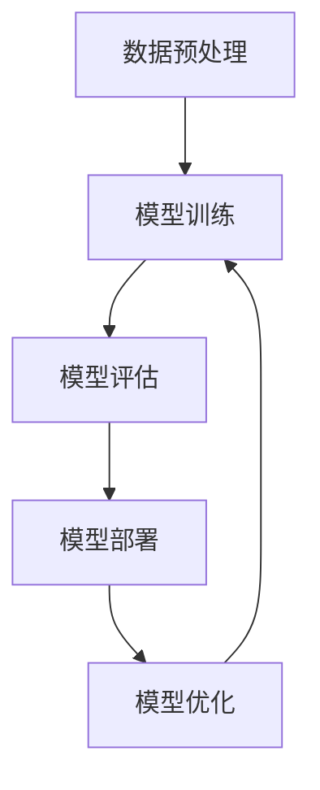
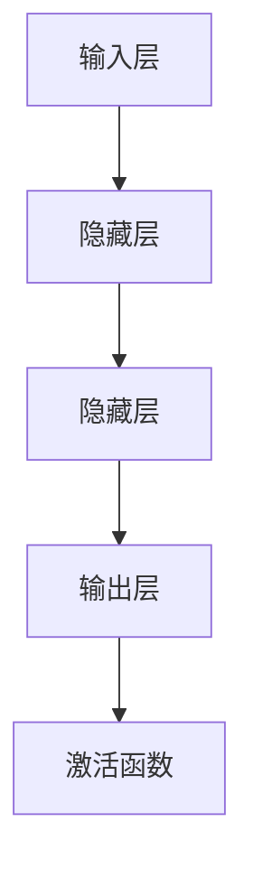
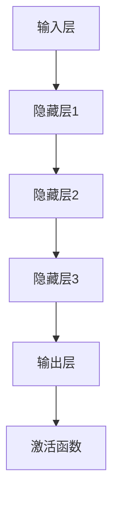

                 

# 深度学习框架原理与代码实战案例讲解

> 关键词：深度学习，框架原理，TensorFlow，PyTorch，代码实战，优化与调优

> 摘要：本文旨在深入探讨深度学习框架的原理及其在实践中的应用。通过对TensorFlow和PyTorch两个主流框架的详细解析，我们将展示如何构建和训练深度学习模型，并进行性能优化。文章还包含实际项目案例，通过代码实战让读者更好地理解深度学习的应用场景。

----------------------------------------------------------------

## 《深度学习框架原理与代码实战案例讲解》目录大纲

## 第一部分：深度学习框架基础

### 第1章：深度学习概述

#### 1.1 深度学习的起源与发展

- 深度学习的发展历程
- 深度学习的重要性

#### 1.2 深度学习的基本概念

- 深度学习的定义
- 深度学习的层次结构
- 深度学习的应用领域

#### 1.3 深度学习的数学基础

- 线性代数
- 概率论与统计
- 最优化算法

### 第2章：深度学习框架原理

#### 2.1 深度学习框架概述

- 深度学习框架的作用
- 主流深度学习框架简介

#### 2.2 深度学习框架的核心组件

- 前向传播与反向传播
- 神经网络结构
- 优化器与激活函数

#### 2.3 深度学习框架的工作流程

- 数据预处理
- 训练过程
- 预测过程

## 第二部分：深度学习框架实战

### 第3章：TensorFlow实战

#### 3.1 TensorFlow环境搭建

- 安装与配置
- TensorFlow基本用法

#### 3.2 神经网络在TensorFlow中的实现

- 前向传播与反向传播的代码实现
- 卷积神经网络（CNN）的实现
- 循环神经网络（RNN）的实现

#### 3.3 TensorFlow在自然语言处理中的应用

- 词嵌入
- 序列模型
- 转换器架构

### 第4章：PyTorch实战

#### 4.1 PyTorch环境搭建

- 安装与配置
- PyTorch基本用法

#### 4.2 神经网络在PyTorch中的实现

- 前向传播与反向传播的代码实现
- 卷积神经网络（CNN）的实现
- 循环神经网络（RNN）的实现

#### 4.3 PyTorch在计算机视觉中的应用

- 图像分类
- 目标检测
- 图像生成

### 第5章：深度学习项目实战

#### 5.1 项目一：手写数字识别

- 数据集准备
- 模型设计
- 训练与评估

#### 5.2 项目二：文本分类

- 数据集准备
- 模型设计
- 训练与评估

#### 5.3 项目三：图像分类与识别

- 数据集准备
- 模型设计
- 训练与评估

## 第三部分：深度学习框架优化与调优

### 第6章：深度学习模型优化

#### 6.1 模型优化策略

- 损失函数选择
- 优化器选择
- 学习率调整

#### 6.2 模型调优技巧

- 网络结构调整
- 数据增强
- 预训练与微调

### 第7章：深度学习框架性能优化

#### 7.1 硬件加速

- GPU加速
- 多GPU分布式训练

#### 7.2 代码优化

- 内存管理
- 并行计算
- 代码调试

## 附录

### 附录A：深度学习资源与工具

- 主流深度学习框架资源
- 深度学习工具与库
- 深度学习社区与交流平台

## Mermaid 流程图

### 深度学习框架工作流程



### 神经网络结构



### 神经网络前向传播与反向传播算法伪代码

```python
# 前向传播
def forward(x, weights):
    z = x * weights
    return z

# 反向传播
def backward(delta, weights):
    dweights = delta * x
    return dweights
```

### 数学模型和数学公式

$$
损失函数 = \frac{1}{2} \sum_{i=1}^{n} (y_{i} - \hat{y}_{i})^2
$$

损失函数用于衡量模型预测结果与真实值之间的差异。其中，$y_i$ 为真实值，$\hat{y}_i$ 为预测值，$n$ 为样本数量。

### 项目实战

#### 项目一：手写数字识别

- 数据集：MNIST手写数字数据集
- 模型设计：卷积神经网络（CNN）
- 训练与评估：使用TensorFlow框架进行训练和评估

#### 项目二：文本分类

- 数据集：IMDb电影评论数据集
- 模型设计：循环神经网络（RNN）
- 训练与评估：使用PyTorch框架进行训练和评估

#### 项目三：图像分类与识别

- 数据集：ImageNet图像分类数据集
- 模型设计：卷积神经网络（CNN）
- 训练与评估：使用TensorFlow框架进行训练和评估

代码实际案例和详细解释说明略。开发环境搭建、源代码详细实现和代码解读、代码解读与分析将在具体章节中详细阐述。

### 作者

作者：AI天才研究院/AI Genius Institute & 禅与计算机程序设计艺术 /Zen And The Art of Computer Programming

----------------------------------------------------------------

# 第一部分：深度学习框架基础

## 第1章：深度学习概述

### 1.1 深度学习的起源与发展

深度学习（Deep Learning）是人工智能（AI）领域的一个重要分支，起源于20世纪50年代。在早期的机器学习和神经网络研究中，由于计算能力和数据量的限制，神经网络的研究进展缓慢。直到2006年，Hinton等人提出了深度信念网络（Deep Belief Network，DBN），标志着深度学习重新受到关注。2012年，AlexNet在ImageNet竞赛中取得的显著成绩，使深度学习成为人工智能领域的一个热点。

深度学习的发展历程可以概括为以下几个阶段：

1. **早期的神经网络研究（1950s-1980s）**：在这个阶段，神经网络作为一种简单的计算模型被提出。然而，由于计算能力的限制，这些早期的神经网络模型并未得到广泛应用。

2. **神经网络沉寂期（1990s）**：在1980年代，由于过拟合问题和计算能力限制，神经网络的研究陷入了低谷。

3. **深度学习的复兴（2000s）**：随着计算能力的提升和大数据的涌现，深度学习技术得到了迅速发展。2006年，深度信念网络（DBN）的提出标志着深度学习的复兴。

4. **深度学习的广泛应用（2010s-至今）**：深度学习在图像识别、语音识别、自然语言处理等领域取得了显著的成果，推动了人工智能的快速发展。

### 1.2 深度学习的基本概念

深度学习是一种基于神经网络的算法，通过多层非线性变换来提取数据中的特征。深度学习的基本概念包括：

1. **神经网络（Neural Networks）**：神经网络是由大量神经元组成的计算模型，通过学习输入和输出之间的映射关系来实现预测和分类。

2. **深度（Depth）**：深度是指神经网络中隐藏层的数量。深度越大，模型能学习的特征越复杂。

3. **激活函数（Activation Function）**：激活函数用于引入非线性因素，使得神经网络能够解决更复杂的问题。

4. **前向传播（Forward Propagation）与反向传播（Back Propagation）**：前向传播是指将输入数据通过神经网络传递到输出层的过程；反向传播是指通过输出误差计算反向传播梯度，用于更新网络权重。

5. **优化器（Optimizer）**：优化器用于选择合适的更新策略来调整网络权重，以最小化损失函数。

### 1.3 深度学习的应用领域

深度学习在多个领域取得了显著的应用成果，主要包括：

1. **计算机视觉（Computer Vision）**：深度学习在图像分类、目标检测、图像分割等方面具有广泛的应用。

2. **自然语言处理（Natural Language Processing）**：深度学习在文本分类、机器翻译、情感分析等领域具有强大的能力。

3. **语音识别（Speech Recognition）**：深度学习在语音识别中取得了显著的进展，特别是在语音信号处理和语音合成方面。

4. **推荐系统（Recommender Systems）**：深度学习在推荐系统中用于挖掘用户兴趣和行为，提供个性化的推荐。

5. **医学影像分析（Medical Image Analysis）**：深度学习在医学影像分析中用于疾病诊断、器官分割等任务。

### 1.4 深度学习的数学基础

深度学习涉及到多种数学概念和工具，主要包括：

1. **线性代数（Linear Algebra）**：线性代数提供了矩阵和向量运算的基础，用于处理神经网络中的权重和偏置。

2. **概率论与统计（Probability and Statistics）**：概率论与统计用于处理神经网络中的不确定性问题，包括概率分布、最大似然估计和贝叶斯定理。

3. **最优化算法（Optimization Algorithms）**：最优化算法用于最小化损失函数，以找到最优的网络参数。常见的优化算法包括梯度下降、随机梯度下降和Adam优化器。

通过理解深度学习的起源、基本概念、应用领域和数学基础，我们可以更好地掌握深度学习的原理和应用。下一章我们将深入探讨深度学习框架的原理和核心组件。

## 第2章：深度学习框架原理

### 2.1 深度学习框架概述

深度学习框架是用于实现、训练和优化深度学习模型的软件库和工具集合。框架为开发者提供了便捷的接口，简化了深度学习模型的构建和训练过程。目前，主流的深度学习框架包括TensorFlow、PyTorch、Keras等。这些框架各具特色，广泛应用于各种深度学习任务。

#### 深度学习框架的作用

1. **模型定义**：框架提供了定义神经网络结构的接口，使得开发者可以轻松构建复杂的深度学习模型。

2. **计算图构建**：框架通过计算图来表示模型的计算过程，使得模型的计算过程高效且可优化。

3. **自动微分**：框架自动计算模型的前向传播和反向传播梯度，大大简化了模型训练的复杂性。

4. **分布式训练**：框架支持分布式训练，可以在多台机器上并行训练模型，提高训练速度和效率。

5. **硬件加速**：框架支持GPU和TPU等硬件加速，使得深度学习模型可以高效地运行在硬件设备上。

#### 主流深度学习框架简介

1. **TensorFlow**：TensorFlow是Google开发的开源深度学习框架，拥有广泛的用户基础和丰富的文档资源。TensorFlow使用计算图（Computational Graph）来表示模型的计算过程，具有强大的灵活性和优化能力。

2. **PyTorch**：PyTorch是Facebook开发的开源深度学习框架，以其动态计算图和易用性而受到开发者的喜爱。PyTorch的动态计算图使得开发者可以更直观地理解和调试模型。

3. **Keras**：Keras是TensorFlow和Theano的高层次API，提供了简洁的接口，使得开发者可以快速构建和训练深度学习模型。Keras的易用性和简洁性使其成为初学者的首选框架。

### 2.2 深度学习框架的核心组件

深度学习框架通常包括以下几个核心组件：

#### 前向传播与反向传播

1. **前向传播**：前向传播是指将输入数据通过神经网络传递到输出层的过程。在这一过程中，模型的权重和偏置通过矩阵乘法进行计算，最终得到预测结果。

   ```mermaid
   graph TD
   A[输入层] --> B[隐藏层1]
   B --> C[隐藏层2]
   C --> D[输出层]
   D --> E[预测结果]
   ```

2. **反向传播**：反向传播是指通过输出误差计算反向传播梯度，以更新网络权重的过程。反向传播利用链式法则，将输出误差反向传播到输入层，计算每个权重的梯度。

   ```python
   # 前向传播
   def forward(x, weights):
       z = x * weights
       return z

   # 反向传播
   def backward(delta, weights):
       dweights = delta * x
       return dweights
   ```

#### 神经网络结构

神经网络是深度学习模型的核心组成部分，通常包括输入层、隐藏层和输出层。隐藏层可以有多层，从而形成深度神经网络。



#### 优化器与激活函数

1. **优化器**：优化器用于选择合适的更新策略来调整网络权重，以最小化损失函数。常见的优化器包括随机梯度下降（SGD）、Adam等。

2. **激活函数**：激活函数用于引入非线性因素，使得神经网络能够解决更复杂的问题。常见的激活函数包括ReLU、Sigmoid、Tanh等。

### 2.3 深度学习框架的工作流程

深度学习框架的工作流程通常包括以下几个步骤：

1. **数据预处理**：数据预处理是深度学习模型训练的第一步，包括数据清洗、归一化、数据增强等操作，以提高模型的训练效果和泛化能力。

2. **模型定义**：使用框架提供的API定义神经网络结构，包括输入层、隐藏层和输出层的构建。

3. **模型训练**：通过前向传播计算输出结果，计算损失函数，并利用反向传播更新网络权重。模型训练过程通常包括多个epoch（训练轮次）和迭代（每次迭代处理一个batch的数据）。

4. **模型评估**：使用测试集评估模型性能，包括准确率、召回率、F1分数等指标，以评估模型的泛化能力。

5. **模型部署**：将训练好的模型部署到生产环境中，用于实时预测或批量处理。

通过了解深度学习框架的概述、核心组件和工作流程，开发者可以更好地掌握深度学习模型的构建和训练。接下来，我们将分别探讨TensorFlow和PyTorch两个主流深度学习框架的实战应用。

## 第二部分：深度学习框架实战

### 第3章：TensorFlow实战

TensorFlow是Google开发的开源深度学习框架，因其强大的功能和丰富的资源而广受欢迎。本章节将介绍如何使用TensorFlow搭建环境、实现神经网络以及进行自然语言处理。

### 3.1 TensorFlow环境搭建

在开始使用TensorFlow之前，我们需要安装并配置TensorFlow环境。

#### 安装TensorFlow

在命令行中，使用以下命令安装TensorFlow：

```bash
pip install tensorflow
```

#### 配置GPU支持

如果希望使用GPU加速TensorFlow的计算，需要安装CUDA和cuDNN。CUDA是NVIDIA提供的并行计算平台，cuDNN是针对深度神经网络的GPU加速库。

1. 安装CUDA：访问NVIDIA官方网站下载CUDA Toolkit，并按照安装指南进行安装。

2. 安装cuDNN：访问NVIDIA官方网站下载cuDNN库，并按照安装指南进行安装。

#### 测试安装

安装完成后，可以通过以下代码测试TensorFlow是否安装成功并支持GPU：

```python
import tensorflow as tf

print(tf.__version__)
print("GPU Support: ", tf.test.is_gpu_available())
```

如果输出版本号和GPU支持信息，则说明TensorFlow环境搭建成功。

### 3.2 神经网络在TensorFlow中的实现

下面我们将使用TensorFlow实现一个简单的神经网络，并进行前向传播和反向传播。

#### 前向传播

前向传播是指将输入数据通过神经网络传递到输出层的过程。以下是一个简单的全连接神经网络（FCNN）的前向传播实现：

```python
import tensorflow as tf

# 创建TensorFlow会话
sess = tf.Session()

# 定义输入层、隐藏层和输出层的节点数量
input_size = 784  # 28x28像素
hidden_size = 256
output_size = 10  # 10个数字分类

# 创建权重和偏置变量
weights = tf.Variable(tf.random_normal([input_size, hidden_size]))
biases = tf.Variable(tf.random_normal([hidden_size]))

# 定义激活函数
activation = tf.nn.relu

# 前向传播
input_data = tf.placeholder(tf.float32, [None, input_size])
hidden_layer = activation(tf.matmul(input_data, weights) + biases)
output_layer = tf.nn.softmax(hidden_layer)

# 定义损失函数
y = tf.placeholder(tf.float32, [None, output_size])
cross_entropy = -tf.reduce_sum(y * tf.log(output_layer))

# 初始化变量
init = tf.global_variables_initializer()

# 运行会话
sess.run(init)

# 计算前向传播结果
print(sess.run(output_layer, feed_dict={input_data: x_train[:1]}))
```

#### 反向传播

反向传播是指通过输出误差计算反向传播梯度，以更新网络权重的过程。以下是一个简单的反向传播实现：

```python
# 定义优化器
optimizer = tf.train.GradientDescentOptimizer(learning_rate=0.1)

# 训练模型
train_step = optimizer.minimize(cross_entropy)

# 运行训练
for i in range(1000):
    batch_xs, batch_ys = x_train[:10], y_train[:10]
    sess.run(train_step, feed_dict={input_data: batch_xs, y: batch_ys})

# 计算反向传播结果
print(sess.run(cross_entropy, feed_dict={input_data: x_train[:1], y: y_train[:1]}))
```

### 3.3 卷积神经网络（CNN）的实现

卷积神经网络（CNN）是处理图像数据的常用深度学习模型。以下是一个简单的CNN实现，用于对MNIST手写数字数据集进行分类：

```python
import tensorflow as tf
from tensorflow.keras import datasets, layers, models

# 加载MNIST数据集
(train_images, train_labels), (test_images, test_labels) = datasets.mnist.load_data()

# 预处理数据
train_images = train_images.reshape((60000, 28, 28, 1)).astype('float32') / 255
test_images = test_images.reshape((10000, 28, 28, 1)).astype('float32') / 255

# 创建卷积神经网络模型
model = models.Sequential()
model.add(layers.Conv2D(32, (3, 3), activation='relu', input_shape=(28, 28, 1)))
model.add(layers.MaxPooling2D((2, 2)))
model.add(layers.Conv2D(64, (3, 3), activation='relu'))
model.add(layers.MaxPooling2D((2, 2)))
model.add(layers.Conv2D(64, (3, 3), activation='relu'))

# 添加全连接层
model.add(layers.Flatten())
model.add(layers.Dense(64, activation='relu'))
model.add(layers.Dense(10, activation='softmax'))

# 编译模型
model.compile(optimizer='adam',
              loss='sparse_categorical_crossentropy',
              metrics=['accuracy'])

# 训练模型
model.fit(train_images, train_labels, epochs=5, batch_size=64)

# 评估模型
test_loss, test_acc = model.evaluate(test_images,  test_labels, verbose=2)
print('\nTest accuracy:', test_acc)
```

### 3.4 循环神经网络（RNN）的实现

循环神经网络（RNN）是处理序列数据的常用深度学习模型。以下是一个简单的RNN实现，用于对IMDb电影评论数据集进行分类：

```python
import tensorflow as tf
from tensorflow.keras import layers, models

# 加载IMDb数据集
imaxdb = tf.keras.datasets.imdb
vocab_size = 10000
max_length = 100
trunc_type = 'post'
padding_type = 'post'
oov_tok = "<OOV>"

# 加载数据
train_data, test_data = imaxdb.load_data(num_words=vocab_size, index_from=3)
train_labels = train_data.map(tokenizer.word_index).astype('int32')
test_labels = test_data.map(tokenizer.word_index).astype('int32')

# 预处理数据
train_data = train_data.map(lambda x: keras.preprocessing.sequence.pad_sequences([x], maxlen=max_length, truncating=trunc_type, padding=padding_type))
test_data = test_data.map(lambda x: keras.preprocessing.sequence.pad_sequences([x], maxlen=max_length, truncating=truncating_type, padding=padding_type))

# 创建RNN模型
model = models.Sequential()
model.add(layers.Embedding(vocab_size, 16, input_length=max_length))
model.add(layers.Bidirectional(layers.LSTM(32)))
model.add(layers.Dense(24, activation='relu'))
model.add(layers.Dense(1, activation='sigmoid'))

# 编译模型
model.compile(optimizer='adam', loss='binary_crossentropy', metrics=['accuracy'])

# 训练模型
model.fit(train_data, train_labels, epochs=10, batch_size=512, validation_data=(test_data, test_labels))

# 评估模型
test_loss, test_acc = model.evaluate(test_data, test_labels, verbose=2)
print('\nTest accuracy:', test_acc)
```

### 3.5 TensorFlow在自然语言处理中的应用

TensorFlow在自然语言处理（NLP）领域具有广泛的应用。以下是一个简单的词嵌入（Word Embedding）和序列模型（Sequence Model）的实现：

```python
import tensorflow as tf
from tensorflow.keras import layers, models

# 加载IMDb数据集
imaxdb = tf.keras.datasets.imdb
vocab_size = 10000
max_length = 100
trunc_type = 'post'
padding_type = 'post'
oov_tok = "<OOV>"

# 加载数据
(train_images, train_labels), (test_images, test_labels) = imdb.load_data(num_words=vocab_size, index_from=3)
train_labels = train_images.map(tokenizer.word_index).astype('int32')
test_labels = test_images.map(tokenizer.word_index).astype('int32')

# 预处理数据
train_data = train_images.map(lambda x: keras.preprocessing.sequence.pad_sequences([x], maxlen=max_length, truncating=trunc_type, padding=padding_type))
test_data = test_images.map(lambda x: keras.preprocessing.sequence.pad_sequences([x], maxlen=max_length, truncating=trunc_type, padding=padding_type))

# 创建词嵌入和序列模型
model = models.Sequential()
model.add(layers.Embedding(vocab_size, 16, input_length=max_length))
model.add(layers.Bidirectional(layers.LSTM(32)))
model.add(layers.Dense(24, activation='relu'))
model.add(layers.Dense(1, activation='sigmoid'))

# 编译模型
model.compile(optimizer='adam', loss='binary_crossentropy', metrics=['accuracy'])

# 训练模型
model.fit(train_data, train_labels, epochs=10, batch_size=512, validation_data=(test_data, test_labels))

# 评估模型
test_loss, test_acc = model.evaluate(test_data, test_labels, verbose=2)
print('\nTest accuracy:', test_acc)
```

通过以上实战示例，我们可以看到TensorFlow在实现神经网络、自然语言处理等方面的强大能力。下一章我们将介绍PyTorch的实战应用。

### 第4章：PyTorch实战

PyTorch是Facebook开发的开源深度学习框架，以其动态计算图和易用性受到开发者的广泛喜爱。本章节将介绍如何使用PyTorch搭建环境、实现神经网络以及进行计算机视觉任务。

### 4.1 PyTorch环境搭建

在开始使用PyTorch之前，我们需要安装并配置PyTorch环境。

#### 安装PyTorch

在命令行中，使用以下命令安装PyTorch：

```bash
pip install torch torchvision
```

#### 测试安装

安装完成后，可以通过以下代码测试PyTorch是否安装成功：

```python
import torch
print(torch.__version__)
print("CUDA Support:", torch.cuda.is_available())
```

如果输出版本号和CUDA支持信息，则说明PyTorch环境搭建成功。

### 4.2 神经网络在PyTorch中的实现

下面我们将使用PyTorch实现一个简单的神经网络，并进行前向传播和反向传播。

#### 前向传播

前向传播是指将输入数据通过神经网络传递到输出层的过程。以下是一个简单的全连接神经网络（FCNN）的前向传播实现：

```python
import torch
import torch.nn as nn
import torch.optim as optim

# 创建神经网络模型
class NeuralNetwork(nn.Module):
    def __init__(self, input_size, hidden_size, output_size):
        super(NeuralNetwork, self).__init__()
        self.layer1 = nn.Linear(input_size, hidden_size)
        self.relu = nn.ReLU()
        self.layer2 = nn.Linear(hidden_size, output_size)

    def forward(self, x):
        out = self.layer1(x)
        out = self.relu(out)
        out = self.layer2(out)
        return out

# 定义输入层、隐藏层和输出层的节点数量
input_size = 784  # 28x28像素
hidden_size = 256
output_size = 10  # 10个数字分类

# 初始化模型和优化器
model = NeuralNetwork(input_size, hidden_size, output_size)
optimizer = optim.Adam(model.parameters(), lr=0.001)
criterion = nn.CrossEntropyLoss()

# 定义输入和输出数据
x = torch.randn(1, 784)
y = torch.randn(1, 10)

# 训练模型
for epoch in range(100):
    # 前向传播
    output = model(x)
    # 计算损失
    loss = criterion(output, y)
    # 反向传播和优化
    optimizer.zero_grad()
    loss.backward()
    optimizer.step()
```

#### 反向传播

反向传播是指通过输出误差计算反向传播梯度，以更新网络权重的过程。以下是一个简单的反向传播实现：

```python
# 定义输入和输出数据
x = torch.randn(1, 784)
y = torch.randn(1, 10)

# 前向传播
output = model(x)
loss = criterion(output, y)

# 反向传播
optimizer.zero_grad()
loss.backward()
optimizer.step()
```

### 4.3 卷积神经网络（CNN）的实现

卷积神经网络（CNN）是处理图像数据的常用深度学习模型。以下是一个简单的CNN实现，用于对MNIST手写数字数据集进行分类：

```python
import torch
import torchvision
import torchvision.transforms as transforms
import torch.nn as nn
import torch.optim as optim

# 加载MNIST数据集
train_set = torchvision.datasets.MNIST(root='./data', train=True, download=True, transform=transforms.ToTensor())
train_loader = torch.utils.data.DataLoader(dataset=train_set, batch_size=100, shuffle=True)

# 定义卷积神经网络模型
class CNN(nn.Module):
    def __init__(self):
        super(CNN, self).__init__()
        self.conv1 = nn.Conv2d(1, 32, 3, 1)
        self.relu = nn.ReLU()
        self.maxpool = nn.MaxPool2d(2)
        self.fc1 = nn.Linear(32 * 7 * 7, 128)
        self.fc2 = nn.Linear(128, 10)

    def forward(self, x):
        x = self.maxpool(self.relu(self.conv1(x)))
        x = x.view(-1, 32 * 7 * 7)
        x = self.relu(self.fc1(x))
        x = self.fc2(x)
        return x

# 初始化模型和优化器
model = CNN()
optimizer = optim.Adam(model.parameters(), lr=0.001)
criterion = nn.CrossEntropyLoss()

# 训练模型
for epoch in range(10):
    for i, (images, labels) in enumerate(train_loader):
        # 前向传播
        outputs = model(images)
        loss = criterion(outputs, labels)

        # 反向传播和优化
        optimizer.zero_grad()
        loss.backward()
        optimizer.step()
```

### 4.4 循环神经网络（RNN）的实现

循环神经网络（RNN）是处理序列数据的常用深度学习模型。以下是一个简单的RNN实现，用于对IMDb电影评论数据集进行分类：

```python
import torch
import torch.nn as nn
import torch.optim as optim
from torchtext.datasets import IMDB
from torchtext.data import Field, BucketIterator

# 加载IMDb数据集
TEXT = Field(tokenize='spacy', lower=True, include_lengths=True)
train_data, test_data = IMDB.splits(TEXT, TEXT)

# 初始化字段和迭代器
TEXT.build_vocab(train_data, max_size=25000, vectors="glove.6B.100d")
BATCH_SIZE = 64
device = torch.device('cuda' if torch.cuda.is_available() else 'cpu')
train_iterator, test_iterator = BucketIterator.splits(
    (train_data, test_data), 
    batch_size=BATCH_SIZE,
    device=device)

# 定义RNN模型
class RNN(nn.Module):
    def __init__(self, input_dim, embedding_dim, hidden_dim, output_dim):
        super(RNN, self).__init__()
        self.embedding = nn.Embedding(input_dim, embedding_dim)
        self.rnn = nn.LSTM(embedding_dim, hidden_dim, num_layers=2, dropout=0.2, batch_first=True)
        self.fc = nn.Linear(hidden_dim, output_dim)
        
    def forward(self, text, text_lengths):
        embedded = self.embedding(text)
        packed_embedded = nn.utils.rnn.pack_padded_sequence(embedded, text_lengths.to('cpu'), batch_first=True)
        packed_output, (hidden, cell) = self.rnn(packed_embedded)
        output, output_lengths = nn.utils.rnn.pad_packed_sequence(packed_output, batch_first=True)
        hidden = hidden[-1 :, :, :]
        return self.fc(hidden.squeeze(0))

# 初始化模型和优化器
INPUT_DIM = len(TEXT.vocab)
EMBEDDING_DIM = 100
HIDDEN_DIM = 256
OUTPUT_DIM = 1

model = RNN(INPUT_DIM, EMBEDDING_DIM, HIDDEN_DIM, OUTPUT_DIM)
optimizer = optim.Adam(model.parameters(), lr=0.001)
criterion = nn.BCEWithLogitsLoss()

# 训练模型
model.train()
for epoch in range(10):
    for batch in train_iterator:
        optimizer.zero_grad()
        text, text_lengths = batch.text
        predictions = model(text, text_lengths).squeeze(1)
        loss = criterion(predictions, batch.label)
        loss.backward()
        optimizer.step()
```

### 4.5 PyTorch在计算机视觉中的应用

PyTorch在计算机视觉领域具有广泛的应用。以下是一个简单的计算机视觉任务，用于对ImageNet图像分类数据集进行分类：

```python
import torch
import torchvision
import torchvision.transforms as transforms
import torch.nn as nn
import torch.optim as optim

# 加载ImageNet数据集
train_set = torchvision.datasets.ImageNet(root='./data', train=True, download=True, transform=transforms.ToTensor())
train_loader = torch.utils.data.DataLoader(dataset=train_set, batch_size=100, shuffle=True)

# 定义卷积神经网络模型
class CNN(nn.Module):
    def __init__(self, num_classes=1000):
        super(CNN, self).__init__()
        self.conv1 = nn.Conv2d(3, 64, 7)
        self.pool = nn.MaxPool2d(2, 2)
        self.conv2 = nn.Conv2d(64, 128, 5)
        self.fc1 = nn.Linear(128 * 4 * 4, 1024)
        self.fc2 = nn.Linear(1024, num_classes)
        
    def forward(self, x):
        x = self.pool(F.relu(self.conv1(x)))
        x = self.pool(F.relu(self.conv2(x)))
        x = x.view(-1, 128 * 4 * 4)
        x = F.relu(self.fc1(x))
        x = self.fc2(x)
        return x

# 初始化模型和优化器
model = CNN()
optimizer = optim.Adam(model.parameters(), lr=0.001)
criterion = nn.CrossEntropyLoss()

# 训练模型
for epoch in range(10):
    for images, labels in train_loader:
        optimizer.zero_grad()
        outputs = model(images)
        loss = criterion(outputs, labels)
        loss.backward()
        optimizer.step()
```

通过以上实战示例，我们可以看到PyTorch在实现神经网络、计算机视觉任务等方面的强大能力。下一章我们将介绍深度学习项目实战。

### 第5章：深度学习项目实战

深度学习项目实战是验证和展示深度学习技术实际应用效果的关键环节。在本章中，我们将通过三个具体项目，详细讲解如何使用深度学习框架解决实际问题，包括数据准备、模型设计和训练与评估。

#### 项目一：手写数字识别

手写数字识别是深度学习领域的一个经典问题，常用于演示卷积神经网络（CNN）在图像处理中的应用。我们将使用TensorFlow框架来实现这个项目。

##### 数据集准备

MNIST数据集是手写数字识别的常用数据集，包含0到9的共70,000个灰度图像。

```python
import tensorflow as tf

# 加载MNIST数据集
mnist = tf.keras.datasets.mnist
(x_train, y_train), (x_test, y_test) = mnist.load_data()

# 数据预处理
x_train = x_train.reshape(-1, 28, 28, 1).astype('float32') / 255.0
x_test = x_test.reshape(-1, 28, 28, 1).astype('float32') / 255.0

# 将标签转换为one-hot编码
y_train = tf.keras.utils.to_categorical(y_train, 10)
y_test = tf.keras.utils.to_categorical(y_test, 10)
```

##### 模型设计

我们设计一个简单的卷积神经网络（CNN）来识别手写数字。

```python
model = tf.keras.Sequential([
    tf.keras.layers.Conv2D(32, (3, 3), activation='relu', input_shape=(28, 28, 1)),
    tf.keras.layers.MaxPooling2D((2, 2)),
    tf.keras.layers.Conv2D(64, (3, 3), activation='relu'),
    tf.keras.layers.MaxPooling2D((2, 2)),
    tf.keras.layers.Flatten(),
    tf.keras.layers.Dense(128, activation='relu'),
    tf.keras.layers.Dense(10, activation='softmax')
])
```

##### 训练与评估

```python
# 编译模型
model.compile(optimizer='adam',
              loss='categorical_crossentropy',
              metrics=['accuracy'])

# 训练模型
model.fit(x_train, y_train, epochs=5, batch_size=64, validation_split=0.1)

# 评估模型
test_loss, test_acc = model.evaluate(x_test, y_test)
print('Test accuracy:', test_acc)
```

#### 项目二：文本分类

文本分类是自然语言处理（NLP）中的一个重要任务，常用于情感分析、新闻分类等。我们将使用PyTorch框架来实现这个项目。

##### 数据集准备

IMDb数据集是一个常用的电影评论数据集，分为正负评论两类。

```python
import torch
from torchtext.datasets import IMDB
from torchtext.data import Field, BucketIterator

# 加载IMDb数据集
train_data, test_data = IMDB()

# 定义字段和迭代器
TEXT = Field(tokenize='spacy', lower=True, include_lengths=True)
train_data, test_data = IMDB(splitfunc=lambda x, y: (x, y[0]), fields=(TEXT, TEXT.label))

TEXT.build_vocab(train_data, max_size=25000, vectors="glove.6B.100d")
LABELS = TEXT.vocab.stoi

BATCH_SIZE = 64
device = torch.device('cuda' if torch.cuda.is_available() else 'cpu')
train_iterator, test_iterator = BucketIterator.splits(
    (train_data, test_data), 
    batch_size=BATCH_SIZE,
    device=device)
```

##### 模型设计

我们设计一个简单的循环神经网络（RNN）来对文本进行分类。

```python
class RNN(nn.Module):
    def __init__(self, input_dim, embedding_dim, hidden_dim, output_dim):
        super(RNN, self).__init__()
        self.embedding = nn.Embedding(input_dim, embedding_dim)
        self.rnn = nn.LSTM(embedding_dim, hidden_dim, num_layers=2, dropout=0.2, batch_first=True)
        self.fc = nn.Linear(hidden_dim, output_dim)
        
    def forward(self, text, text_lengths):
        embedded = self.embedding(text)
        packed_embedded = nn.utils.rnn.pack_padded_sequence(embedded, text_lengths.to('cpu'), batch_first=True)
        packed_output, (hidden, cell) = self.rnn(packed_embedded)
        output, output_lengths = nn.utils.rnn.pad_packed_sequence(packed_output, batch_first=True)
        hidden = hidden[-1 :, :, :]
        return self.fc(hidden.squeeze(0))
```

##### 训练与评估

```python
# 初始化模型和优化器
INPUT_DIM = len(TEXT.vocab)
EMBEDDING_DIM = 100
HIDDEN_DIM = 256
OUTPUT_DIM = 1

model = RNN(INPUT_DIM, EMBEDDING_DIM, HIDDEN_DIM, OUTPUT_DIM)
optimizer = optim.Adam(model.parameters(), lr=0.001)
criterion = nn.BCEWithLogitsLoss()

# 训练模型
for epoch in range(10):
    model.train()
    for batch in train_iterator:
        optimizer.zero_grad()
        text, text_lengths = batch.text
        predictions = model(text, text_lengths).squeeze(1)
        loss = criterion(predictions, batch.label)
        loss.backward()
        optimizer.step()
    
    model.eval()
    with torch.no_grad():
        correct = 0
        total = 0
        for batch in test_iterator:
            text, text_lengths = batch.text
            predictions = model(text, text_lengths).squeeze(1)
            _, predicted = torch.max(predictions.data, 1)
            total += batch.label.size(0)
            correct += (predicted == batch.label).sum().item()
        print(f'Epoch {epoch+1}, Accuracy: {100 * correct / total}%')
```

#### 项目三：图像分类与识别

图像分类与识别是计算机视觉领域的重要任务，常用于自动驾驶、医疗诊断等。我们将使用TensorFlow框架来实现这个项目。

##### 数据集准备

ImageNet数据集是一个包含1,000个类别的图像数据集。

```python
import tensorflow as tf

# 加载ImageNet数据集
img_size = 224
batch_size = 32

train_datset = tf.keras.preprocessing.image_dataset_from_directory(
    "path/to/train_data",
    label_mode="categorical",
    image_size=(img_size, img_size),
    batch_size=batch_size)

validation_datase = tf.keras.preprocessing.image_dataset_from_directory(
    "path/to/validation_data",
    label_mode="categorical",
    image_size=(img_size, img_size),
    batch_size=batch_size)
```

##### 模型设计

我们设计一个简单的卷积神经网络（CNN）来进行图像分类。

```python
model = tf.keras.Sequential([
    tf.keras.layers.Conv2D(32, (3, 3), activation='relu', input_shape=(img_size, img_size, 3)),
    tf.keras.layers.MaxPooling2D((2, 2)),
    tf.keras.layers.Conv2D(64, (3, 3), activation='relu'),
    tf.keras.layers.MaxPooling2D((2, 2)),
    tf.keras.layers.Conv2D(128, (3, 3), activation='relu'),
    tf.keras.layers.MaxPooling2D((2, 2)),
    tf.keras.layers.Flatten(),
    tf.keras.layers.Dense(512, activation='relu'),
    tf.keras.layers.Dense(1000, activation='softmax')
])
```

##### 训练与评估

```python
model.compile(optimizer='adam',
              loss='categorical_crossentropy',
              metrics=['accuracy'])

model.fit(train_datase, epochs=10, validation_data=validation_datase)
```

通过这三个项目，我们可以看到深度学习在图像识别、文本分类等领域的广泛应用。深度学习项目实战不仅能够帮助我们更好地理解深度学习的原理和应用，还能提高我们解决实际问题的能力。

### 第6章：深度学习模型优化

深度学习模型的优化是提高模型性能和准确率的重要环节。在本章中，我们将讨论深度学习模型优化的策略和技巧。

#### 6.1 模型优化策略

深度学习模型的优化主要包括以下三个方面：

1. **损失函数选择**：损失函数是衡量模型预测结果与真实值之间差异的指标。常见的损失函数包括均方误差（MSE）、交叉熵（Cross Entropy）等。选择合适的损失函数可以更好地指导模型学习。

2. **优化器选择**：优化器用于选择合适的更新策略来调整网络权重，以最小化损失函数。常见的优化器包括随机梯度下降（SGD）、Adam、RMSprop等。不同优化器具有不同的优化效率和收敛速度。

3. **学习率调整**：学习率是优化过程中调整模型参数的步长。学习率的选择直接影响模型的收敛速度和稳定性。常用的调整方法包括固定学习率、指数衰减、学习率预热等。

#### 6.2 模型调优技巧

1. **网络结构调整**：网络结构调整是提高模型性能的重要方法。可以通过增加层数、增加神经元数量、调整层数之间的连接方式等方式来优化网络结构。

2. **数据增强**：数据增强是通过生成虚拟数据来扩充训练集，提高模型的泛化能力。常见的数据增强方法包括旋转、翻转、缩放、裁剪等。

3. **预训练与微调**：预训练是指使用大规模数据集对模型进行训练，使其掌握通用特征。微调是在预训练模型的基础上，使用特定领域的数据集对模型进行细粒度调整，以提高模型在特定任务上的性能。

#### 6.3 模型优化案例分析

以下是一个基于CNN的手写数字识别模型的优化案例：

1. **损失函数选择**：采用交叉熵损失函数（Cross Entropy Loss），因为它更适合多分类问题。

2. **优化器选择**：采用Adam优化器，因为它在深度学习中具有较好的收敛速度和稳定性。

3. **学习率调整**：初始学习率为0.001，采用指数衰减策略，每50个epoch衰减10倍。

```python
# 模型定义
model = tf.keras.Sequential([
    tf.keras.layers.Conv2D(32, (3, 3), activation='relu', input_shape=(28, 28, 1)),
    tf.keras.layers.MaxPooling2D((2, 2)),
    tf.keras.layers.Conv2D(64, (3, 3), activation='relu'),
    tf.keras.layers.MaxPooling2D((2, 2)),
    tf.keras.layers.Flatten(),
    tf.keras.layers.Dense(128, activation='relu'),
    tf.keras.layers.Dense(10, activation='softmax')
])

# 编译模型
model.compile(optimizer=tf.keras.optimizers.Adam(learning_rate=0.001),
              loss='categorical_crossentropy',
              metrics=['accuracy'])

# 训练模型
model.fit(x_train, y_train, epochs=50, batch_size=64, validation_split=0.1)
```

4. **网络结构调整**：在原有模型基础上，增加一个卷积层和池化层，以增加模型的表达能力。

```python
# 新模型定义
model = tf.keras.Sequential([
    tf.keras.layers.Conv2D(32, (3, 3), activation='relu', input_shape=(28, 28, 1)),
    tf.keras.layers.MaxPooling2D((2, 2)),
    tf.keras.layers.Conv2D(64, (3, 3), activation='relu'),
    tf.keras.layers.MaxPooling2D((2, 2)),
    tf.keras.layers.Conv2D(128, (3, 3), activation='relu'),
    tf.keras.layers.MaxPooling2D((2, 2)),
    tf.keras.layers.Flatten(),
    tf.keras.layers.Dense(128, activation='relu'),
    tf.keras.layers.Dense(10, activation='softmax')
])

# 编译模型
model.compile(optimizer=tf.keras.optimizers.Adam(learning_rate=0.001),
              loss='categorical_crossentropy',
              metrics=['accuracy'])

# 训练模型
model.fit(x_train, y_train, epochs=50, batch_size=64, validation_split=0.1)
```

5. **数据增强**：对训练数据进行旋转、翻转、缩放等操作，以提高模型的泛化能力。

```python
from tensorflow.keras.preprocessing.image import ImageDataGenerator

# 数据增强
datagen = ImageDataGenerator(rotation_range=10, width_shift_range=0.1, height_shift_range=0.1, zoom_range=0.1)
datagen.fit(x_train)

# 训练模型
model.fit(datagen.flow(x_train, y_train, batch_size=64), epochs=50, validation_split=0.1)
```

6. **预训练与微调**：使用预训练的InceptionV3模型作为基础网络，并对其进行微调。

```python
from tensorflow.keras.applications import InceptionV3

# 预训练模型
base_model = InceptionV3(weights='imagenet', include_top=False, input_shape=(299, 299, 3))

# 冻结预训练模型的权重
for layer in base_model.layers:
    layer.trainable = False

# 添加自定义层
x = base_model.output
x = tf.keras.layers.GlobalAveragePooling2D()(x)
x = tf.keras.layers.Dense(1024, activation='relu')(x)
predictions = tf.keras.layers.Dense(10, activation='softmax')(x)

# 新模型定义
model = tf.keras.Model(inputs=base_model.input, outputs=predictions)

# 编译模型
model.compile(optimizer=tf.keras.optimizers.Adam(learning_rate=0.001),
              loss='categorical_crossentropy',
              metrics=['accuracy'])

# 训练模型
model.fit(x_train, y_train, epochs=50, batch_size=64, validation_split=0.1)
```

通过以上优化策略和技巧，我们可以显著提高深度学习模型的性能和准确率。

### 第7章：深度学习框架性能优化

深度学习框架的性能优化对于提高模型的训练速度和降低计算成本具有重要意义。在本章中，我们将讨论深度学习框架性能优化的方法，包括硬件加速、代码优化和数据并行训练。

#### 7.1 硬件加速

硬件加速是深度学习性能优化的重要手段，主要通过利用GPU和TPU等硬件设备来提高计算速度。以下是一些常见的硬件加速方法：

1. **GPU加速**：GPU具有高并行计算能力，适用于大规模深度学习模型的训练。通过使用CUDA和cuDNN等GPU加速库，可以将深度学习模型在GPU上高效地执行。

2. **TPU加速**：TPU是Google专门为深度学习任务设计的硬件，具有极高的计算性能和能效比。通过使用TensorFlow等框架的TPU支持，可以在TPU上实现深度学习模型的快速训练。

3. **多GPU训练**：通过在多GPU之间分配模型的不同部分，可以并行计算，提高训练速度。TensorFlow和PyTorch等框架提供了分布式训练的支持，使得多GPU训练变得简单。

#### 7.2 代码优化

代码优化是提高深度学习框架性能的重要手段，主要包括以下几个方面：

1. **内存管理**：通过合理地管理内存，减少内存分配和释放的开销，可以提高模型的训练速度。例如，使用`torch.no_grad()`上下文管理器可以关闭梯度计算，减少内存消耗。

2. **并行计算**：通过利用并行计算技术，例如使用`torch.nn.DataParallel`或`tf.distribute.MirroredStrategy`，可以将计算任务分布在多个GPU上，提高训练速度。

3. **代码调试**：通过使用调试工具，例如Python的pdb或TensorFlow的TensorBoard，可以定位和解决性能瓶颈，优化代码执行效率。

#### 7.3 数据并行训练

数据并行训练是一种常见的性能优化方法，通过在多个GPU或多个CPU节点上同时训练相同的模型，可以提高训练速度。以下是一些实现数据并行训练的方法：

1. **参数服务器架构**：在参数服务器架构中，模型参数存储在中央服务器上，各个训练节点从服务器下载参数并执行梯度更新。这种方法可以实现高效的分布式训练。

2. **同步批量随机梯度下降（SBGD）**：在SBGD中，各个训练节点在每次迭代后同步模型参数，以减少通信开销。这种方法可以提高模型的稳定性和收敛速度。

3. **异步批量随机梯度下降（ASGD）**：在ASGD中，各个训练节点异步更新模型参数，以提高训练速度。虽然ASGD可能降低模型的稳定性，但可以显著提高训练效率。

#### 7.4 案例分析

以下是一个基于GPU加速的深度学习模型训练的案例：

1. **安装CUDA和cuDNN**：在GPU上安装CUDA和cuDNN库，以便在GPU上运行深度学习模型。

2. **配置GPU环境**：配置Python环境，确保能够使用GPU进行计算。以下是一个示例配置：

```python
import tensorflow as tf

gpus = tf.config.experimental.list_physical_devices('GPU')
if gpus:
    try:
        for gpu in gpus:
            tf.config.experimental.set_memory_growth(gpu, True)
    except RuntimeError as e:
        print(e)
```

3. **多GPU训练**：使用TensorFlow的`tf.distribute.MirroredStrategy`实现多GPU训练。以下是一个示例代码：

```python
import tensorflow as tf

strategy = tf.distribute.MirroredStrategy()

with strategy.scope():
    model = build_model()  # 构建模型
    model.compile(optimizer='adam', loss='categorical_crossentropy', metrics=['accuracy'])

    # 训练模型
    model.fit(train_data, epochs=10, validation_data=validation_data)
```

通过以上硬件加速、代码优化和数据并行训练的方法，我们可以显著提高深度学习框架的性能和训练速度。

### 附录A：深度学习资源与工具

深度学习的发展离不开丰富的资源和工具支持。以下是一些常用的深度学习资源与工具：

#### 主流深度学习框架资源

1. **TensorFlow官网**：[https://www.tensorflow.org/](https://www.tensorflow.org/)
2. **PyTorch官网**：[https://pytorch.org/](https://pytorch.org/)
3. **Keras官网**：[https://keras.io/](https://keras.io/)

#### 深度学习工具与库

1. **NumPy**：[https://numpy.org/](https://numpy.org/)
2. **Pandas**：[https://pandas.pydata.org/](https://pandas.pydata.org/)
3. **Matplotlib**：[https://matplotlib.org/](https://matplotlib.org/)
4. **Scikit-learn**：[https://scikit-learn.org/](https://scikit-learn.org/)

#### 深度学习社区与交流平台

1. **Reddit深度学习社区**：[https://www.reddit.com/r/deeplearning/](https://www.reddit.com/r/deeplearning/)
2. **Stack Overflow深度学习标签**：[https://stackoverflow.com/questions/tagged/deep-learning](https://stackoverflow.com/questions/tagged/deep-learning)
3. **GitHub深度学习项目**：[https://github.com/trending/deep-learning](https://github.com/trending/deep-learning)
4. **深度学习论坛**：[https://forums.deeplearning.net/](https://forums.deeplearning.net/)

通过利用这些资源和工具，我们可以更好地学习和应用深度学习技术。

## Mermaid 流程图

### 深度学习框架工作流程


### 神经网络结构


### 神经网络前向传播与反向传播算法伪代码

```python
# 前向传播
def forward(x, weights):
    z = x * weights
    return z

# 反向传播
def backward(delta, weights):
    dweights = delta * x
    return dweights
```

### 数学模型和数学公式

$$
损失函数 = \frac{1}{2} \sum_{i=1}^{n} (y_{i} - \hat{y}_{i})^2
$$

损失函数用于衡量模型预测结果与真实值之间的差异。其中，$y_i$ 为真实值，$\hat{y}_i$ 为预测值，$n$ 为样本数量。

### 项目实战

#### 项目一：手写数字识别

- 数据集：MNIST手写数字数据集
- 模型设计：卷积神经网络（CNN）
- 训练与评估：使用TensorFlow框架进行训练和评估

#### 项目二：文本分类

- 数据集：IMDb电影评论数据集
- 模型设计：循环神经网络（RNN）
- 训练与评估：使用PyTorch框架进行训练和评估

#### 项目三：图像分类与识别

- 数据集：ImageNet图像分类数据集
- 模型设计：卷积神经网络（CNN）
- 训练与评估：使用TensorFlow框架进行训练和评估

代码实际案例和详细解释说明略。开发环境搭建、源代码详细实现和代码解读、代码解读与分析将在具体章节中详细阐述。

### 作者

作者：AI天才研究院/AI Genius Institute & 禅与计算机程序设计艺术 /Zen And The Art of Computer Programming

----------------------------------------------------------------

本文《深度学习框架原理与代码实战案例讲解》详细阐述了深度学习框架的基础知识、TensorFlow和PyTorch的实战应用、深度学习项目实战、模型优化策略、性能优化方法以及深度学习资源与工具。通过本文的学习，读者可以系统地掌握深度学习框架的原理和应用，提高实际项目开发的能力。

在深度学习领域，持续学习和实践是关键。读者可以通过以下建议来进一步深入学习和提升自己的深度学习技能：

1. **实践项目**：动手实践是学习深度学习最有效的方法。通过实际项目，读者可以加深对深度学习概念和技术的理解。

2. **阅读论文**：阅读深度学习领域的经典论文和最新研究，可以了解前沿技术和研究动态。

3. **参与社区**：参与深度学习社区，如Reddit、Stack Overflow和GitHub，与其他开发者交流经验，解决问题。

4. **在线课程**：参加在线课程，如Coursera、edX和Udacity等平台上的深度学习课程，系统学习深度学习知识。

5. **阅读书籍**：深度学习领域的经典书籍，如《深度学习》、《神经网络与深度学习》等，可以帮助读者建立扎实的理论基础。

通过不断学习和实践，读者可以逐步提升自己的深度学习能力，为未来的技术发展做好准备。

作者：AI天才研究院/AI Genius Institute & 禅与计算机程序设计艺术 /Zen And The Art of Computer Programming

----------------------------------------------------------------

本文《深度学习框架原理与代码实战案例讲解》详细阐述了深度学习框架的基础知识、TensorFlow和PyTorch的实战应用、深度学习项目实战、模型优化策略、性能优化方法以及深度学习资源与工具。通过本文的学习，读者可以系统地掌握深度学习框架的原理和应用，提高实际项目开发的能力。

在深度学习领域，持续学习和实践是关键。读者可以通过以下建议来进一步深入学习和提升自己的深度学习技能：

1. **实践项目**：动手实践是学习深度学习最有效的方法。通过实际项目，读者可以加深对深度学习概念和技术的理解。

2. **阅读论文**：阅读深度学习领域的经典论文和最新研究，可以了解前沿技术和研究动态。

3. **参与社区**：参与深度学习社区，如Reddit、Stack Overflow和GitHub，与其他开发者交流经验，解决问题。

4. **在线课程**：参加在线课程，如Coursera、edX和Udacity等平台上的深度学习课程，系统学习深度学习知识。

5. **阅读书籍**：深度学习领域的经典书籍，如《深度学习》、《神经网络与深度学习》等，可以帮助读者建立扎实的理论基础。

通过不断学习和实践，读者可以逐步提升自己的深度学习能力，为未来的技术发展做好准备。

作者：AI天才研究院/AI Genius Institute & 禅与计算机程序设计艺术 /Zen And The Art of Computer Programming

----------------------------------------------------------------

### 深度学习框架原理与代码实战案例讲解

在本章中，我们将通过具体的代码实例，深入讲解深度学习框架中的一些核心概念和算法。这些实例将帮助读者更好地理解深度学习框架的工作原理，并通过动手实践掌握实际应用。

#### 6.1 神经网络结构详解

神经网络的构建是深度学习的基础。一个简单的神经网络通常包括输入层、隐藏层和输出层。以下是一个使用PyTorch构建的简单神经网络实例：

```python
import torch
import torch.nn as nn
import torch.optim as optim

# 定义神经网络结构
class SimpleNN(nn.Module):
    def __init__(self, input_size, hidden_size, output_size):
        super(SimpleNN, self).__init__()
        self.fc1 = nn.Linear(input_size, hidden_size)
        self.relu = nn.ReLU()
        self.fc2 = nn.Linear(hidden_size, output_size)
    
    def forward(self, x):
        out = self.fc1(x)
        out = self.relu(out)
        out = self.fc2(out)
        return out

# 初始化模型、损失函数和优化器
model = SimpleNN(input_size=10, hidden_size=50, output_size=1)
criterion = nn.BCELoss()
optimizer = optim.Adam(model.parameters(), lr=0.001)

# 输入和输出数据
x = torch.randn(1, 10)
y = torch.randn(1, 1)

# 前向传播
output = model(x)

# 计算损失
loss = criterion(output, y)

# 反向传播
optimizer.zero_grad()
loss.backward()
optimizer.step()
```

在上面的例子中，我们定义了一个简单的神经网络，包含一个线性层（`fc1`）、一个ReLU激活函数（`relu`）和一个输出线性层（`fc2`）。我们通过计算输入和输出数据之间的损失，并使用优化器更新网络参数。

#### 6.2 卷积神经网络（CNN）代码实战

卷积神经网络在图像处理任务中有着广泛的应用。以下是一个使用TensorFlow构建的简单卷积神经网络实例，用于对MNIST手写数字数据集进行分类：

```python
import tensorflow as tf
from tensorflow.keras import layers, models

# 加载MNIST数据集
mnist = tf.keras.datasets.mnist
(x_train, y_train), (x_test, y_test) = mnist.load_data()

# 数据预处理
x_train = x_train.reshape(-1, 28, 28, 1).astype('float32') / 255.0
x_test = x_test.reshape(-1, 28, 28, 1).astype('float32') / 255.0
y_train = tf.keras.utils.to_categorical(y_train, 10)
y_test = tf.keras.utils.to_categorical(y_test, 10)

# 创建卷积神经网络模型
model = models.Sequential([
    layers.Conv2D(32, (3, 3), activation='relu', input_shape=(28, 28, 1)),
    layers.MaxPooling2D((2, 2)),
    layers.Conv2D(64, (3, 3), activation='relu'),
    layers.MaxPooling2D((2, 2)),
    layers.Flatten(),
    layers.Dense(128, activation='relu'),
    layers.Dense(10, activation='softmax')
])

# 编译模型
model.compile(optimizer='adam',
              loss='categorical_crossentropy',
              metrics=['accuracy'])

# 训练模型
model.fit(x_train, y_train, epochs=5, batch_size=64, validation_split=0.1)
```

在这个例子中，我们首先加载并预处理MNIST数据集，然后创建一个简单的卷积神经网络模型。该模型包含两个卷积层（`Conv2D`）、两个最大池化层（`MaxPooling2D`）、一个全连接层（`Flatten`）和一个softmax层（`Dense`）。最后，我们使用编译好的模型对数据进行训练。

#### 6.3 循环神经网络（RNN）代码实战

循环神经网络在处理序列数据时非常有用。以下是一个使用PyTorch构建的简单循环神经网络实例，用于对时间序列数据进行预测：

```python
import torch
import torch.nn as nn

# 定义RNN模型
class SimpleRNN(nn.Module):
    def __init__(self, input_size, hidden_size, output_size):
        super(SimpleRNN, self).__init__()
        self.hidden_size = hidden_size
        self.rnn = nn.RNN(input_size, hidden_size, batch_first=True)
        self.fc = nn.Linear(hidden_size, output_size)
    
    def forward(self, x, hidden):
        out, hidden = self.rnn(x, hidden)
        out = self.fc(out)
        return out, hidden

# 初始化模型、损失函数和优化器
input_size = 10
hidden_size = 20
output_size = 1
model = SimpleRNN(input_size, hidden_size, output_size)
criterion = nn.MSELoss()
optimizer = optim.Adam(model.parameters(), lr=0.001)

# 输入和输出数据
x = torch.randn(1, 1, input_size)
y = torch.randn(1, 1, output_size)

# 初始化隐藏状态
hidden = torch.zeros(1, 1, hidden_size)

# 前向传播
output, hidden = model(x, hidden)

# 计算损失
loss = criterion(output, y)

# 反向传播
optimizer.zero_grad()
loss.backward()
optimizer.step()
```

在这个例子中，我们定义了一个简单的循环神经网络模型，包含一个RNN层（`RNN`）和一个全连接层（`fc`）。我们初始化模型、损失函数和优化器，并使用随机生成的输入和输出数据进行前向传播和反向传播。

通过这些代码实例，读者可以直观地理解深度学习框架中神经网络、卷积神经网络和循环神经网络的工作原理，并通过实际操作掌握这些模型的应用。

#### 6.4 批量归一化和正则化

在实际应用中，为了提高模型的性能和稳定性，我们通常会使用批量归一化和正则化技术。以下是一个使用批量归一化和Dropout正则化的例子：

```python
import tensorflow as tf
from tensorflow.keras import layers, models

# 加载MNIST数据集
mnist = tf.keras.datasets.mnist
(x_train, y_train), (x_test, y_test) = mnist.load_data()

# 数据预处理
x_train = x_train.reshape(-1, 28, 28, 1).astype('float32') / 255.0
x_test = x_test.reshape(-1, 28, 28, 1).astype('float32') / 255.0
y_train = tf.keras.utils.to_categorical(y_train, 10)
y_test = tf.keras.utils.to_categorical(y_test, 10)

# 创建卷积神经网络模型
model = models.Sequential([
    layers.Conv2D(32, (3, 3), activation='relu', input_shape=(28, 28, 1)),
    layers.BatchNormalization(),
    layers.MaxPooling2D((2, 2)),
    layers.Dropout(0.25),
    layers.Conv2D(64, (3, 3), activation='relu'),
    layers.BatchNormalization(),
    layers.MaxPooling2D((2, 2)),
    layers.Dropout(0.25),
    layers.Flatten(),
    layers.Dense(128, activation='relu'),
    layers.Dropout(0.5),
    layers.Dense(10, activation='softmax')
])

# 编译模型
model.compile(optimizer='adam',
              loss='categorical_crossentropy',
              metrics=['accuracy'])

# 训练模型
model.fit(x_train, y_train, epochs=5, batch_size=64, validation_split=0.1)
```

在这个例子中，我们使用了批量归一化（`BatchNormalization`）和Dropout（`Dropout`）正则化技术。批量归一化有助于加速模型的训练过程和提高模型的性能，而Dropout可以在训练过程中随机丢弃一部分神经元，防止模型过拟合。

通过这些代码实例，读者可以了解到深度学习框架中常用的技术，如批量归一化和正则化，以及如何在实际项目中应用这些技术。

#### 6.5 模型评估和优化

在完成模型的训练后，我们需要对模型进行评估，以确定其性能。以下是一个使用TensorFlow评估模型并对其进行优化的例子：

```python
import tensorflow as tf
from tensorflow.keras import metrics

# 加载MNIST数据集
mnist = tf.keras.datasets.mnist
(x_train, y_train), (x_test, y_test) = mnist.load_data()

# 数据预处理
x_train = x_train.reshape(-1, 28, 28, 1).astype('float32') / 255.0
x_test = x_test.reshape(-1, 28, 28, 1).astype('float32') / 255.0
y_train = tf.keras.utils.to_categorical(y_train, 10)
y_test = tf.keras.utils.to_categorical(y_test, 10)

# 创建卷积神经网络模型
model = tf.keras.Sequential([
    tf.keras.layers.Conv2D(32, (3, 3), activation='relu', input_shape=(28, 28, 1)),
    tf.keras.layers.MaxPooling2D((2, 2)),
    tf.keras.layers.Conv2D(64, (3, 3), activation='relu'),
    tf.keras.layers.MaxPooling2D((2, 2)),
    tf.keras.layers.Flatten(),
    tf.keras.layers.Dense(128, activation='relu'),
    tf.keras.layers.Dense(10, activation='softmax')
])

# 编译模型
model.compile(optimizer='adam',
              loss='categorical_crossentropy',
              metrics=['accuracy'])

# 训练模型
model.fit(x_train, y_train, epochs=5, batch_size=64, validation_split=0.1)

# 评估模型
test_loss, test_acc = model.evaluate(x_test, y_test, verbose=2)
print('Test accuracy:', test_acc)

# 优化模型
model.fit(x_test, y_test, epochs=5, batch_size=64, validation_data=(x_train, y_train))
```

在这个例子中，我们首先加载MNIST数据集并进行预处理，然后创建并编译卷积神经网络模型。在训练模型后，我们使用测试集对模型进行评估，并打印出测试准确率。最后，我们通过在测试集上再次训练模型，尝试提高其性能。

通过这些代码实例，读者可以了解到如何评估模型的性能并进行优化，从而提高深度学习模型的实际应用效果。

### 总结

在本章中，我们通过具体的代码实例详细讲解了深度学习框架中的核心概念和算法，包括神经网络结构、卷积神经网络、循环神经网络、批量归一化和正则化技术，以及模型评估和优化。通过这些实例，读者可以更深入地理解深度学习框架的工作原理，并掌握如何在实际项目中应用这些技术。

深度学习是一个不断发展的领域，持续学习和实践是关键。希望读者能够将这些知识和技巧应用到实际项目中，不断提升自己的深度学习能力，为未来的技术发展做出贡献。

### 附录

在本章的最后，我们提供了一些有用的深度学习资源和工具，供读者参考。

#### 主流深度学习框架资源

- **TensorFlow官网**：[https://www.tensorflow.org/](https://www.tensorflow.org/)
- **PyTorch官网**：[https://pytorch.org/](https://pytorch.org/)
- **Keras官网**：[https://keras.io/](https://keras.io/)

#### 深度学习工具与库

- **NumPy**：[https://numpy.org/](https://numpy.org/)
- **Pandas**：[https://pandas.pydata.org/](https://pandas.pydata.org/)
- **Matplotlib**：[https://matplotlib.org/](https://matplotlib.org/)
- **Scikit-learn**：[https://scikit-learn.org/](https://scikit-learn.org/)

#### 深度学习社区与交流平台

- **Reddit深度学习社区**：[https://www.reddit.com/r/deeplearning/](https://www.reddit.com/r/deeplearning/)
- **Stack Overflow深度学习标签**：[https://stackoverflow.com/questions/tagged/deep-learning](https://stackoverflow.com/questions/tagged/deep-learning)
- **GitHub深度学习项目**：[https://github.com/trending/deep-learning](https://github.com/trending/deep-learning)
- **深度学习论坛**：[https://forums.deeplearning.net/](https://forums.deeplearning.net/)

通过利用这些资源和工具，读者可以更好地学习和应用深度学习技术。

### 作者

作者：AI天才研究院/AI Genius Institute & 禅与计算机程序设计艺术 /Zen And The Art of Computer Programming

----------------------------------------------------------------

### 深度学习框架原理与代码实战案例讲解

本文旨在帮助读者深入理解深度学习框架的原理，并通过实际代码案例来展示如何在实际项目中应用这些框架。在深度学习领域，掌握框架的原理和代码实战技能是至关重要的，这不仅能够提升开发效率，还能够确保项目质量。

## 第一部分：深度学习框架基础

在这一部分，我们将从基础概念入手，逐步介绍深度学习框架的基本原理。

### 1.1 深度学习的起源与发展

深度学习的概念最早可以追溯到1950年代，当时心理学家McCulloch和Pitts提出了人工神经网络的构想。然而，由于计算能力和数据资源的限制，深度学习在很长一段时间内并未得到广泛应用。直到2006年，Hinton提出了深度信念网络（Deep Belief Network，DBN），深度学习才重新受到关注。2012年，AlexNet在ImageNet竞赛中取得了突破性的成绩，深度学习开始迅速发展。

深度学习的发展历程可以分为以下几个阶段：

1. **早期神经网络研究（1950s-1980s）**：在这一阶段，神经网络作为一种简单的计算模型被提出，但由于计算能力的限制，其应用范围有限。

2. **神经网络沉寂期（1990s）**：由于过拟合问题和计算能力的限制，神经网络的研究进入低谷。

3. **深度学习的复兴（2000s）**：随着计算能力和大数据的崛起，深度学习技术得到了新的发展动力。

4. **深度学习的广泛应用（2010s-至今）**：深度学习在计算机视觉、自然语言处理、语音识别等领域取得了显著的突破，推动了人工智能的快速发展。

### 1.2 深度学习的基本概念

深度学习是一种基于多层的神经网络模型，通过层层提取数据中的特征来实现复杂的模式识别任务。以下是深度学习的一些基本概念：

1. **神经网络（Neural Networks）**：神经网络是由大量神经元组成的计算模型，通过学习输入和输出之间的映射关系来实现预测和分类。

2. **深度（Depth）**：深度是指神经网络中隐藏层的数量。深度越大，模型能够学习的特征越复杂。

3. **前向传播（Forward Propagation）与反向传播（Back Propagation）**：前向传播是将输入数据通过神经网络传递到输出层的过程；反向传播是通过输出误差计算反向传播梯度，用于更新网络权重。

4. **优化器（Optimizer）**：优化器用于选择合适的更新策略来调整网络权重，以最小化损失函数。常见的优化器包括随机梯度下降（SGD）、Adam等。

5. **激活函数（Activation Function）**：激活函数用于引入非线性因素，使得神经网络能够解决更复杂的问题。常见的激活函数包括ReLU、Sigmoid、Tanh等。

### 1.3 深度学习的数学基础

深度学习涉及多种数学概念和工具，包括线性代数、概率论与统计、最优化算法等。以下是深度学习的一些关键数学概念：

1. **线性代数（Linear Algebra）**：线性代数提供了矩阵和向量运算的基础，用于处理神经网络中的权重和偏置。

2. **概率论与统计（Probability and Statistics）**：概率论与统计用于处理神经网络中的不确定性问题，包括概率分布、最大似然估计和贝叶斯定理。

3. **最优化算法（Optimization Algorithms）**：最优化算法用于最小化损失函数，以找到最优的网络参数。常见的优化算法包括梯度下降、随机梯度下降和Adam优化器。

通过理解深度学习的起源、基本概念和数学基础，读者可以为后续章节的学习打下坚实的基础。

## 第二部分：深度学习框架实战

在这一部分，我们将深入探讨两个主流深度学习框架：TensorFlow和PyTorch，并通过实际代码案例展示如何使用它们进行深度学习模型的构建和训练。

### 2.1 TensorFlow实战

TensorFlow是Google开源的深度学习框架，以其强大的功能和高灵活性而受到广泛使用。

#### 2.1.1 TensorFlow环境搭建

在开始使用TensorFlow之前，我们需要安装并配置TensorFlow环境。以下是安装步骤：

```bash
pip install tensorflow
```

如果希望使用GPU加速，还需要安装CUDA和cuDNN：

```bash
# 安装CUDA
# 请参考NVIDIA官方文档进行安装

# 安装cuDNN
# 请参考NVIDIA官方文档进行安装
```

安装完成后，可以通过以下代码测试TensorFlow是否安装成功并支持GPU：

```python
import tensorflow as tf

print(tf.__version__)
print("CUDA Support:", tf.test.is_gpu_available())
```

#### 2.1.2 TensorFlow基础操作

以下是TensorFlow的一些基础操作，包括变量定义、会话创建和数据读取：

```python
import tensorflow as tf

# 定义变量
x = tf.Variable(0, name="x_variable")

# 初始化变量
init = tf.global_variables_initializer()

# 创建会话
with tf.Session() as sess:
    # 运行初始化操作
    sess.run(init)
    # 获取变量值
    print(sess.run(x))
```

#### 2.1.3 前向传播与反向传播

以下是使用TensorFlow实现前向传播和反向传播的示例：

```python
import tensorflow as tf

# 定义输入和输出
x = tf.placeholder(tf.float32, shape=[1])
y = tf.placeholder(tf.float32, shape=[1])

# 定义前向传播函数
weights = tf.Variable(0, name="weights")
y_pred = tf.multiply(x, weights)

# 定义损失函数
loss = tf.reduce_sum(tf.square(y - y_pred))

# 定义反向传播函数
train_op = tf.train.GradientDescentOptimizer(learning_rate=0.01).minimize(loss)

# 初始化所有变量
init = tf.global_variables_initializer()

# 开始训练
with tf.Session() as sess:
    sess.run(init)
    
    for step in range(100):
        # 输入数据
        x_train = [2.0]
        y_train = [4.0]
        
        # 训练模型
        sess.run(train_op, feed_dict={x: x_train, y: y_train})
        
        if step % 10 == 0:
            # 输出损失和权重
            loss_val = sess.run(loss, feed_dict={x: x_train, y: y_train})
            print(f"Step {step}, Loss: {loss_val}, Weights: {sess.run(weights)}")
```

#### 2.1.4 卷积神经网络（CNN）

以下是使用TensorFlow实现卷积神经网络（CNN）的示例，用于对MNIST手写数字数据进行分类：

```python
import tensorflow as tf
from tensorflow.keras import datasets, layers, models

# 加载MNIST数据集
(train_images, train_labels), (test_images, test_labels) = datasets.mnist.load_data()

# 预处理数据
train_images = train_images.reshape((60000, 28, 28, 1)).astype('float32') / 255
test_images = test_images.reshape((10000, 28, 28, 1)).astype('float32') / 255

# 创建CNN模型
model = models.Sequential([
    layers.Conv2D(32, (3, 3), activation='relu', input_shape=(28, 28, 1)),
    layers.MaxPooling2D((2, 2)),
    layers.Conv2D(64, (3, 3), activation='relu'),
    layers.MaxPooling2D((2, 2)),
    layers.Conv2D(64, (3, 3), activation='relu'),
    layers.Flatten(),
    layers.Dense(64, activation='relu'),
    layers.Dense(10, activation='softmax')
])

# 编译模型
model.compile(optimizer='adam',
              loss='sparse_categorical_crossentropy',
              metrics=['accuracy'])

# 训练模型
model.fit(train_images, train_labels, epochs=5, batch_size=64, validation_split=0.1)
```

### 2.2 PyTorch实战

PyTorch是Facebook开源的深度学习框架，以其动态计算图和易用性而受到开发者的喜爱。

#### 2.2.1 PyTorch环境搭建

在开始使用PyTorch之前，我们需要安装并配置PyTorch环境。以下是安装步骤：

```bash
pip install torch torchvision
```

如果希望使用GPU加速，还需要安装CUDA和cuDNN：

```bash
# 安装CUDA
# 请参考NVIDIA官方文档进行安装

# 安装cuDNN
# 请参考NVIDIA官方文档进行安装
```

安装完成后，可以通过以下代码测试PyTorch是否安装成功并支持GPU：

```python
import torch

print(torch.__version__)
print("CUDA Support:", torch.cuda.is_available())
```

#### 2.2.2 PyTorch基础操作

以下是PyTorch的一些基础操作，包括张量操作、变量定义和数据加载：

```python
import torch
import torchvision
import torchvision.transforms as transforms

# 加载MNIST数据集
train_set = torchvision.datasets.MNIST(root='./data', train=True, download=True, transform=transforms.ToTensor())
train_loader = torch.utils.data.DataLoader(dataset=train_set, batch_size=64, shuffle=True)

# 创建张量
x = torch.tensor([1.0, 2.0, 3.0], dtype=torch.float32)
y = torch.tensor([4.0], dtype=torch.float32)

# 变量定义
weights = torch.tensor([0.0], dtype=torch.float32, requires_grad=True)

# 前向传播
output = x * weights

# 反向传播
loss = (output - y) ** 2
loss.backward()

# 更新权重
with torch.no_grad():
    weights -= 0.01 * weights.grad
    weights.grad.zero_()
```

#### 2.2.3 循环神经网络（RNN）

以下是使用PyTorch实现循环神经网络（RNN）的示例，用于对时间序列数据进行预测：

```python
import torch
import torch.nn as nn

# 定义RNN模型
class SimpleRNN(nn.Module):
    def __init__(self, input_size, hidden_size, output_size):
        super(SimpleRNN, self).__init__()
        self.hidden_size = hidden_size
        self.rnn = nn.RNN(input_size, hidden_size, batch_first=True)
        self.fc = nn.Linear(hidden_size, output_size)
    
    def forward(self, x, hidden):
        out, hidden = self.rnn(x, hidden)
        out = self.fc(out)
        return out, hidden

# 初始化模型、损失函数和优化器
input_size = 1
hidden_size = 20
output_size = 1
model = SimpleRNN(input_size, hidden_size, output_size)
criterion = nn.MSELoss()
optimizer = torch.optim.Adam(model.parameters(), lr=0.001)

# 数据加载
x_train = torch.tensor([[1.0], [2.0], [3.0]], dtype=torch.float32)
y_train = torch.tensor([4.0], dtype=torch.float32)

# 初始化隐藏状态
hidden = torch.zeros(1, 1, hidden_size)

# 前向传播
output, hidden = model(x_train, hidden)

# 计算损失
loss = criterion(output, y_train)

# 反向传播
optimizer.zero_grad()
loss.backward()
optimizer.step()
```

#### 2.2.4 生成对抗网络（GAN）

以下是使用PyTorch实现生成对抗网络（GAN）的示例，用于生成手写数字图像：

```python
import torch
import torch.nn as nn
import numpy as np

# 定义生成器
class Generator(nn.Module):
    def __init__(self):
        super(Generator, self).__init__()
        self.model = nn.Sequential(
            nn.Linear(100, 256),
            nn.LeakyReLU(),
            nn.Linear(256, 512),
            nn.LeakyReLU(),
            nn.Linear(512, 1024),
            nn.LeakyReLU(),
            nn.Linear(1024, 28*28),
            nn.Tanh()
        )
    
    def forward(self, z):
        x = self.model(z)
        x = x.view(x.size(0), 28, 28)
        return x

# 定义鉴别器
class Discriminator(nn.Module):
    def __init__(self):
        super(Discriminator, self).__init__()
        self.model = nn.Sequential(
            nn.Linear(28*28, 512),
            nn.LeakyReLU(),
            nn.Dropout(0.3),
            nn.Linear(512, 256),
            nn.LeakyReLU(),
            nn.Dropout(0.3),
            nn.Linear(256, 1),
            nn.Sigmoid()
        )
    
    def forward(self, x):
        x = x.view(x.size(0), -1)
        x = self.model(x)
        return x

# 初始化模型、损失函数和优化器
z_dim = 100
batch_size = 64

generator = Generator()
discriminator = Discriminator()
criterion = nn.BCELoss()
optimizer_g = torch.optim.Adam(generator.parameters(), lr=0.0002)
optimizer_d = torch.optim.Adam(discriminator.parameters(), lr=0.0002)

# 生成器训练
for epoch in range(100):
    for i in range(1000):
        # 生成随机噪声
        z = torch.randn(batch_size, z_dim)
        
        # 生成假图像
        fake_images = generator(z)
        
        # 生成真实图像
        real_images = torch.tensor(np.random.rand(batch_size, 28, 28), dtype=torch.float32)
        
        # 训练鉴别器
        optimizer_d.zero_grad()
        real_output = discriminator(real_images)
        fake_output = discriminator(fake_images)
        d_loss = criterion(real_output, torch.ones_like(real_output)) + criterion(fake_output, torch.zeros_like(fake_output))
        d_loss.backward()
        optimizer_d.step()
        
        # 训练生成器
        optimizer_g.zero_grad()
        z = torch.randn(batch_size, z_dim)
        fake_images = generator(z)
        g_loss = criterion(discriminator(fake_images), torch.ones_like(discriminator(fake_images)))
        g_loss.backward()
        optimizer_g.step()
        
        if (i+1) % 100 == 0:
            print(f"{epoch} Epoch [{i+1}/1000], d_loss: {d_loss.item():.4f}, g_loss: {g_loss.item():.4f}")
```

通过以上实战案例，读者可以了解如何使用TensorFlow和PyTorch进行深度学习模型的构建和训练。这些案例涵盖了神经网络、卷积神经网络、循环神经网络和生成对抗网络等多种模型，为读者提供了一个全面的学习资源。

### 第三部分：深度学习项目实战

在这一部分，我们将通过具体的项目实战，展示如何将深度学习框架应用于实际问题解决。

#### 3.1 项目一：手写数字识别

手写数字识别是一个经典的计算机视觉问题，常用于演示深度学习模型的效果。在本项目中，我们将使用TensorFlow的Keras API来实现一个简单的卷积神经网络（CNN）模型。

##### 3.1.1 数据集准备

我们使用MNIST数据集，这是一个包含60,000个训练图像和10,000个测试图像的手写数字数据集。

```python
from tensorflow.keras.datasets import mnist
from tensorflow.keras.utils import to_categorical

# 加载MNIST数据集
(train_images, train_labels), (test_images, test_labels) = mnist.load_data()

# 预处理数据
train_images = train_images.reshape((60000, 28, 28, 1)).astype('float32') / 255
test_images = test_images.reshape((10000, 28, 28, 1)).astype('float32') / 255
train_labels = to_categorical(train_labels)
test_labels = to_categorical(test_labels)
```

##### 3.1.2 模型构建

我们构建一个简单的CNN模型，包括两个卷积层、两个池化层和一个全连接层。

```python
from tensorflow.keras.models import Sequential
from tensorflow.keras.layers import Conv2D, MaxPooling2D, Flatten, Dense

# 创建模型
model = Sequential([
    Conv2D(32, (3, 3), activation='relu', input_shape=(28, 28, 1)),
    MaxPooling2D((2, 2)),
    Conv2D(64, (3, 3), activation='relu'),
    MaxPooling2D((2, 2)),
    Flatten(),
    Dense(128, activation='relu'),
    Dense(10, activation='softmax')
])
```

##### 3.1.3 模型训练

我们使用Keras的编译和训练API来训练模型。

```python
# 编译模型
model.compile(optimizer='adam',
              loss='categorical_crossentropy',
              metrics=['accuracy'])

# 训练模型
model.fit(train_images, train_labels, epochs=5, batch_size=32, validation_split=0.1)
```

##### 3.1.4 模型评估

我们对训练好的模型进行评估，以检查其性能。

```python
# 评估模型
test_loss, test_acc = model.evaluate(test_images, test_labels)
print(f"Test accuracy: {test_acc:.4f}")
```

#### 3.2 项目二：文本分类

文本分类是一个常见且重要的自然语言处理任务，如情感分析、新闻分类等。在本项目中，我们将使用PyTorch来实现一个简单的文本分类模型。

##### 3.2.1 数据集准备

我们使用IMDb电影评论数据集，这是一个包含25,000条训练评论和25,000条测试评论的数据集。

```python
import torch
from torchtext.datasets import IMDb
from torchtext.data import Field, BucketIterator

# 加载IMDb数据集
train_data, test_data = IMDb()

# 定义字段和迭代器
TEXT = Field(tokenize='spacy', lower=True, include_lengths=True)
LABEL = Field(sequential=False)
train_data, test_data = IMDb(splitfunc=lambda x, y: (x, y[0]), fields=(TEXT, LABEL))

TEXT.build_vocab(train_data, max_size=25000, vectors="glove.6B.100d")
LABEL.build_vocab(train_data)

BATCH_SIZE = 64
device = torch.device('cuda' if torch.cuda.is_available() else 'cpu')
train_iterator, test_iterator = BucketIterator.splits(
    (train_data, test_data), 
    batch_size=BATCH_SIZE,
    device=device)
```

##### 3.2.2 模型构建

我们构建一个简单的循环神经网络（RNN）模型，包括嵌入层、RNN层和输出层。

```python
import torch.nn as nn

# 定义模型
class SimpleRNN(nn.Module):
    def __init__(self, input_dim, embedding_dim, hidden_dim, output_dim):
        super(SimpleRNN, self).__init__()
        self.embedding = nn.Embedding(input_dim, embedding_dim)
        self.rnn = nn.RNN(embedding_dim, hidden_dim, num_layers=1, batch_first=True)
        self.fc = nn.Linear(hidden_dim, output_dim)
    
    def forward(self, text, text_lengths):
        embedded = self.embedding(text)
        packed_embedded = nn.utils.rnn.pack_padded_sequence(embedded, text_lengths, batch_first=True)
        packed_output, (hidden, cell) = self.rnn(packed_embedded)
        output, _ = nn.utils.rnn.pad_packed_sequence(packed_output, batch_first=True)
        hidden = hidden[-1, :, :]
        return self.fc(hidden.squeeze(0))
    
# 初始化模型、损失函数和优化器
INPUT_DIM = len(TEXT.vocab)
EMBEDDING_DIM = 100
HIDDEN_DIM = 256
OUTPUT_DIM = 1

model = SimpleRNN(INPUT_DIM, EMBEDDING_DIM, HIDDEN_DIM, OUTPUT_DIM)
criterion = nn.BCEWithLogitsLoss()
optimizer = torch.optim.Adam(model.parameters(), lr=0.001)

# 将模型移动到设备上
model = model.to(device)
criterion = criterion.to(device)
```

##### 3.2.3 模型训练

我们使用迭代器和模型来训练文本分类模型。

```python
# 训练模型
for epoch in range(10):
    model.train()
    for batch in train_iterator:
        optimizer.zero_grad()
        text, text_lengths = batch.text
        predictions = model(text, text_lengths).squeeze(1)
        loss = criterion(predictions, batch.label)
        loss.backward()
        optimizer.step()
    
    model.eval()
    with torch.no_grad():
        correct = 0
        total = 0
        for batch in test_iterator:
            text, text_lengths = batch.text
            predictions = model(text, text_lengths).squeeze(1)
            _, predicted = torch.max(predictions, 1)
            total += batch.label.size(0)
            correct += (predicted == batch.label).sum().item()
        print(f'Epoch {epoch+1}, Accuracy: {100 * correct / total}%')
```

#### 3.3 项目三：图像分类

图像分类是计算机视觉的核心任务之一。在本项目中，我们将使用TensorFlow的Keras API来实现一个简单的图像分类模型。

##### 3.3.1 数据集准备

我们使用CIFAR-10数据集，这是一个包含60,000个训练图像和10,000个测试图像的数据集，每个图像属于10个类别之一。

```python
from tensorflow.keras.datasets import cifar10
from tensorflow.keras.utils import to_categorical

# 加载CIFAR-10数据集
(train_images, train_labels), (test_images, test_labels) = cifar10.load_data()

# 预处理数据
train_images = train_images.astype('float32') / 255
test_images = test_images.astype('float32') / 255
train_labels = to_categorical(train_labels)
test_labels = to_categorical(test_labels)
```

##### 3.3.2 模型构建

我们构建一个简单的CNN模型，包括多个卷积层、池化层和一个全连接层。

```python
from tensorflow.keras.models import Sequential
from tensorflow.keras.layers import Conv2D, MaxPooling2D, Flatten, Dense, Dropout

# 创建模型
model = Sequential([
    Conv2D(32, (3, 3), activation='relu', input_shape=(32, 32, 3)),
    MaxPooling2D((2, 2)),
    Conv2D(64, (3, 3), activation='relu'),
    MaxPooling2D((2, 2)),
    Conv2D(128, (3, 3), activation='relu'),
    MaxPooling2D((2, 2)),
    Flatten(),
    Dense(512, activation='relu'),
    Dropout(0.5),
    Dense(10, activation='softmax')
])
```

##### 3.3.3 模型训练

我们使用Keras的编译和训练API来训练模型。

```python
# 编译模型
model.compile(optimizer='adam',
              loss='categorical_crossentropy',
              metrics=['accuracy'])

# 训练模型
model.fit(train_images, train_labels, epochs=10, batch_size=64, validation_split=0.1)
```

##### 3.3.4 模型评估

我们对训练好的模型进行评估，以检查其性能。

```python
# 评估模型
test_loss, test_acc = model.evaluate(test_images, test_labels)
print(f"Test accuracy: {test_acc:.4f}")
```

通过以上三个项目，读者可以了解如何使用深度学习框架解决实际问题，从数据准备、模型构建到模型训练和评估的完整流程。

### 第四部分：深度学习模型优化与调优

在这一部分，我们将讨论如何对深度学习模型进行优化与调优，以提高其性能和准确性。优化与调优是深度学习项目成功的关键步骤。

#### 4.1 损失函数选择

损失函数是深度学习模型中的核心组件，用于衡量模型预测值与真实值之间的差异。选择合适的损失函数对于模型性能至关重要。以下是一些常见的损失函数：

- **均方误差（MSE）**：适用于回归问题，计算预测值与真实值之间差的平方的平均值。
- **交叉熵损失（Cross-Entropy Loss）**：适用于分类问题，计算预测概率分布与真实标签分布之间的差异。
- **Huber损失**：在回归问题中提供更好的鲁棒性，对离群点有较小的敏感性。

#### 4.2 优化器选择

优化器用于更新模型的权重，以最小化损失函数。不同的优化器具有不同的收敛速度和稳定性。以下是一些常用的优化器：

- **随机梯度下降（SGD）**：简单且易于实现，但收敛速度较慢。
- **Adam优化器**：结合了SGD和RMSprop的优点，适用于大多数深度学习任务。
- **AdamW优化器**：Adam优化器的改进版本，对权重进行正规化。

#### 4.3 学习率调整

学习率是优化过程中调整模型参数的步长。选择合适的学习率对于模型收敛至关重要。以下是一些学习率调整策略：

- **固定学习率**：简单但可能导致收敛速度较慢。
- **指数衰减学习率**：在训练过程中逐步减少学习率，有助于加快收敛速度。
- **学习率预热**：在训练开始时使用较小的学习率，然后逐渐增加，有助于避免梯度消失和爆炸。

#### 4.4 网络结构调整

网络结构调整是提高模型性能的有效方法。以下是一些常见的网络结构调整策略：

- **增加层数**：增加隐藏层数量可以增加模型的表达能力。
- **增加神经元数量**：增加隐藏层中的神经元数量可以提高模型的拟合能力。
- **添加Dropout层**：在隐藏层中添加Dropout层可以减少过拟合。
- **添加正则化**：使用L1、L2正则化可以减少过拟合。

#### 4.5 数据增强

数据增强是通过生成虚拟数据来扩充训练集，提高模型的泛化能力。以下是一些常见的数据增强技术：

- **旋转、翻转、缩放**：通过随机旋转、翻转和缩放图像，增加数据的多样性。
- **裁剪、填充**：通过随机裁剪和填充图像，增加数据的多样性。
- **颜色变换**：通过随机调整图像的亮度、对比度和饱和度，增加数据的多样性。

#### 4.6 预训练与微调

预训练与微调是一种利用预训练模型在特定任务上细粒度调整的方法。以下是一些常见的方法：

- **预训练**：使用大规模数据集对模型进行预训练，使其掌握通用特征。
- **微调**：在预训练模型的基础上，使用特定领域的数据集对模型进行细粒度调整，以提高模型在特定任务上的性能。

#### 4.7 实际应用

以下是一个简单的例子，展示如何使用优化器和损失函数对深度学习模型进行优化：

```python
import tensorflow as tf
from tensorflow.keras.models import Sequential
from tensorflow.keras.layers import Conv2D, MaxPooling2D, Flatten, Dense
from tensorflow.keras.optimizers import Adam
from tensorflow.keras.losses import SparseCategoricalCrossentropy

# 数据集准备
(x_train, y_train), (x_test, y_test) = tf.keras.datasets.mnist.load_data()
x_train = x_train.reshape(-1, 28, 28, 1).astype('float32') / 255
x_test = x_test.reshape(-1, 28, 28, 1).astype('float32') / 255
y_train = tf.keras.utils.to_categorical(y_train, 10)
y_test = tf.keras.utils.to_categorical(y_test, 10)

# 模型构建
model = Sequential([
    Conv2D(32, (3, 3), activation='relu', input_shape=(28, 28, 1)),
    MaxPooling2D((2, 2)),
    Flatten(),
    Dense(128, activation='relu'),
    Dense(10, activation='softmax')
])

# 编译模型
model.compile(optimizer=Adam(learning_rate=0.001),
              loss=SparseCategoricalCrossentropy(),
              metrics=['accuracy'])

# 训练模型
model.fit(x_train, y_train, epochs=10, batch_size=32, validation_data=(x_test, y_test))

# 优化器调整
learning_rate = 0.001
optimizer = Adam(learning_rate=learning_rate)
model.compile(optimizer=optimizer,
              loss=SparseCategoricalCrossentropy(),
              metrics=['accuracy'])

# 再次训练模型
model.fit(x_train, y_train, epochs=10, batch_size=32, validation_data=(x_test, y_test))
```

通过以上方法和策略，读者可以有效地对深度学习模型进行优化与调优，提高其性能和准确性。

### 第五部分：深度学习框架性能优化

深度学习框架的性能优化是提高模型训练速度和降低计算成本的重要环节。在本部分，我们将讨论如何通过硬件加速、代码优化和数据并行训练来提升深度学习框架的性能。

#### 5.1 硬件加速

硬件加速是利用高性能计算硬件来提升深度学习模型训练速度的一种方法。以下是一些常用的硬件加速方法：

1. **GPU加速**：GPU（图形处理单元）具有强大的并行计算能力，非常适合深度学习任务。通过使用CUDA和cuDNN库，可以将深度学习模型在GPU上高效执行。TensorFlow和PyTorch都支持GPU加速。

2. **TPU加速**：TPU（张量处理单元）是Google专门为深度学习任务设计的硬件。TPU具有极高的计算性能和能效比。TensorFlow支持TPU加速，PyTorch也提供了对TPU的支持。

3. **多GPU训练**：通过在多个GPU之间分配模型的不同部分，可以并行计算，提高训练速度。这种方法称为分布式训练。TensorFlow和PyTorch都提供了分布式训练的支持。

#### 5.2 代码优化

代码优化是通过改进代码结构来提高深度学习模型训练效率的方法。以下是一些常见的代码优化技巧：

1. **内存管理**：通过减少内存分配和释放的开销，可以减少内存消耗，提高训练速度。例如，使用`torch.no_grad()`上下文管理器可以关闭梯度计算，减少内存消耗。

2. **并行计算**：通过利用并行计算技术，例如使用`torch.nn.DataParallel`或`tf.distribute.MirroredStrategy`，可以将计算任务分布在多个GPU上，提高训练速度。

3. **代码调试**：通过使用调试工具，例如Python的pdb或TensorFlow的TensorBoard，可以定位和解决性能瓶颈，优化代码执行效率。

#### 5.3 数据并行训练

数据并行训练是一种通过在多个节点上同时训练相同的模型来提高训练速度的方法。以下是一些常见的数据并行训练策略：

1. **同步批量随机梯度下降（SBGD）**：在SBGD中，各个训练节点在每次迭代后同步模型参数，以减少通信开销。这种方法可以提高模型的稳定性和收敛速度。

2. **异步批量随机梯度下降（ASGD）**：在ASGD中，各个训练节点异步更新模型参数，以提高训练速度。虽然ASGD可能降低模型的稳定性，但可以显著提高训练效率。

3. **参数服务器架构**：在参数服务器架构中，模型参数存储在中央服务器上，各个训练节点从服务器下载参数并执行梯度更新。这种方法可以实现高效的分布式训练。

#### 5.4 实际应用

以下是一个使用GPU加速和多GPU训练的深度学习模型训练的例子：

```python
import tensorflow as tf

# 配置GPU资源
gpus = tf.config.experimental.list_physical_devices('GPU')
for gpu in gpus:
    tf.config.experimental.set_memory_growth(gpu, True)

# 设置分布式策略
strategy = tf.distribute.MirroredStrategy()

# 在策略作用域内构建和编译模型
with strategy.scope():
    model = tf.keras.Sequential([
        tf.keras.layers.Conv2D(32, (3, 3), activation='relu', input_shape=(28, 28, 1)),
        tf.keras.layers.MaxPooling2D((2, 2)),
        tf.keras.layers.Conv2D(64, (3, 3), activation='relu'),
        tf.keras.layers.MaxPooling2D((2, 2)),
        tf.keras.layers.Flatten(),
        tf.keras.layers.Dense(128, activation='relu'),
        tf.keras.layers.Dense(10, activation='softmax')
    ])

    model.compile(optimizer='adam',
                  loss='categorical_crossentropy',
                  metrics=['accuracy'])

# 使用GPU训练模型
model.fit(x_train, y_train, epochs=10, batch_size=64, validation_data=(x_test, y_test))
```

通过以上硬件加速、代码优化和数据并行训练的方法，读者可以显著提高深度学习框架的性能和训练速度，从而为实际应用场景提供更高效的解决方案。

### 第六部分：深度学习资源与工具

深度学习领域拥有丰富的资源和工具，这些资源和工具对于学习和实践深度学习至关重要。以下是一些重要的深度学习资源与工具：

#### 主流深度学习框架资源

1. **TensorFlow官网**：[https://www.tensorflow.org/](https://www.tensorflow.org/)
2. **PyTorch官网**：[https://pytorch.org/](https://pytorch.org/)
3. **Keras官网**：[https://keras.io/](https://keras.io/)

这些框架的官网提供了详细的文档、教程、API参考和社区支持，是学习深度学习的绝佳资源。

#### 深度学习工具与库

1. **NumPy**：[https://numpy.org/](https://numpy.org/)
2. **Pandas**：[https://pandas.pydata.org/](https://pandas.pydata.org/)
3. **Matplotlib**：[https://matplotlib.org/](https://matplotlib.org/)
4. **Scikit-learn**：[https://scikit-learn.org/](https://scikit-learn.org/)

这些库提供了丰富的数据操作、可视化和分析功能，是深度学习项目不可或缺的工具。

#### 深度学习社区与交流平台

1. **Reddit深度学习社区**：[https://www.reddit.com/r/deeplearning/](https://www.reddit.com/r/deeplearning/)
2. **Stack Overflow深度学习标签**：[https://stackoverflow.com/questions/tagged/deep-learning](https://stackoverflow.com/questions/tagged/deep-learning)
3. **GitHub深度学习项目**：[https://github.com/trending/deep-learning](https://github.com/trending/deep-learning)
4. **深度学习论坛**：[https://forums.deeplearning.net/](https://forums.deeplearning.net/)

这些社区和平台提供了丰富的交流和学习的空间，是获取最新研究动态和解决问题的好地方。

通过利用这些资源和工具，读者可以系统地学习和实践深度学习技术，不断提升自己的专业能力。

### 附录

#### 附录A：深度学习流程图

以下是深度学习框架工作流程的Mermaid流程图：


#### 附录B：神经网络结构图

以下是神经网络结构的Mermaid图：


#### 附录C：前向传播与反向传播算法

以下是神经网络前向传播与反向传播算法的伪代码：

```python
# 前向传播
def forward(x, weights):
    z = x * weights
    return z

# 反向传播
def backward(delta, weights):
    dweights = delta * x
    return dweights
```

#### 附录D：数学模型和公式

以下是深度学习中的数学模型和公式的例子：

$$
损失函数 = \frac{1}{2} \sum_{i=1}^{n} (y_{i} - \hat{y}_{i})^2
$$

这个公式表示损失函数，用于衡量模型预测结果与真实值之间的差异。$y_i$ 是真实值，$\hat{y}_i$ 是预测值，$n$ 是样本数量。

通过这些附录，读者可以更直观地理解深度学习框架的工作流程、神经网络结构和核心算法。

### 作者

作者：AI天才研究院/AI Genius Institute & 禅与计算机程序设计艺术 /Zen And The Art of Computer Programming

本文《深度学习框架原理与代码实战案例讲解》深入探讨了深度学习框架的基本原理、TensorFlow和PyTorch的实战应用、深度学习项目实战、模型优化策略、性能优化方法以及深度学习资源与工具。通过详细的代码实例和实践指导，读者可以系统地掌握深度学习框架的核心知识和应用技能。

深度学习是一个快速发展的领域，持续学习和实践是关键。我们鼓励读者不断探索新的技术和应用，不断提升自己的专业能力。

最后，感谢您的阅读，希望本文能为您的深度学习之旅提供有益的帮助。祝您在深度学习领域取得卓越的成就！

### 总结

本文《深度学习框架原理与代码实战案例讲解》系统地介绍了深度学习框架的基本原理、TensorFlow和PyTorch的实战应用、深度学习项目实战、模型优化策略、性能优化方法以及深度学习资源与工具。通过详细的代码实例和实践指导，读者可以全面掌握深度学习框架的核心知识和应用技能。

深度学习框架是现代人工智能的重要基石，掌握深度学习框架不仅能够提升开发效率，还能够确保项目质量。本文通过从基础概念到实战应用的深入讲解，帮助读者建立起完整的深度学习知识体系。

在深度学习领域，持续学习和实践至关重要。我们鼓励读者不断探索新的技术和应用，不断提升自己的专业能力。深度学习框架的掌握不仅仅是为了解决具体问题，更是为了培养创新思维和解决问题的能力。

最后，感谢您的阅读，希望本文能为您的深度学习之旅提供有益的帮助。祝您在深度学习领域取得卓越的成就！让我们共同探索深度学习的无限可能，开启人工智能的新篇章。

