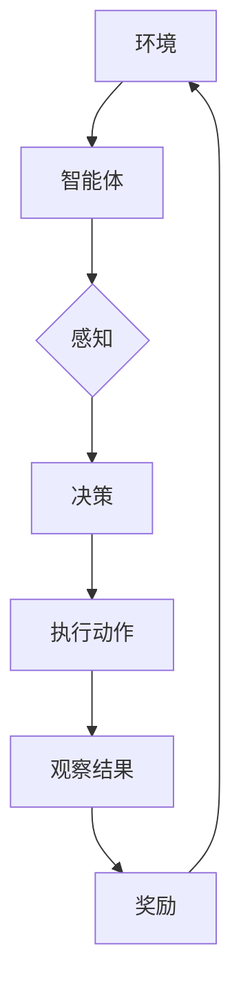

                 

---

# 深度强化学习 (Deep Reinforcement Learning)

> 关键词：强化学习、深度学习、策略网络、值函数网络、探索与利用、异步方法

> 摘要：本文旨在深入探讨深度强化学习（Deep Reinforcement Learning, DRL）的基本概念、核心算法、探索与利用策略、以及其在现实世界中的应用。通过逐步分析推理的方式，本文旨在帮助读者全面了解DRL的理论和实践，为未来在相关领域的研究和应用提供指导。

---

## 《深度强化学习 (Deep Reinforcement Learning)》目录大纲

### 第一部分：深度强化学习基础

#### 第1章：深度强化学习概述

##### 1.1 深度强化学习的背景与定义
- 深度强化学习的背景
- 深度强化学习的定义

##### 1.2 强化学习与深度学习的联系与区别
- 强化学习的基本概念
- 深度学习的基本概念
- 强化学习与深度学习的联系与区别

##### 1.3 深度强化学习的应用场景
- 游戏领域
- 控制领域
- 机器人领域
- 计算机视觉领域

#### 第2章：深度强化学习核心概念

##### 2.1 强化学习的基础概念
- 强化学习的基本术语
- 强化学习的模型架构

##### 2.2 Q-学习算法详解
- Q-学习的原理
- Q-学习的算法流程
- Q-学习的优缺点

##### 2.3 SARSA算法详解
- SARSA算法的原理
- SARSA算法的算法流程
- SARSA算法的优缺点

##### 2.4 Deep Q-Network（DQN）算法详解
- DQN算法的原理
- DQN算法的算法流程
- DQN算法的优缺点

#### 第3章：深度强化学习中的探索与利用

##### 3.1 探索与利用的概念
- 探索的概念
- 利用的概念

##### 3.2 ε-贪心策略
- ε-贪心策略的原理
- ε-贪心策略的实现

##### 3.3 ε-贪心策略的变体
- ϵ-贪心策略的改进
- ϵ-贪心策略的应用

##### 3.4 UC-Bandit算法
- UC-Bandit算法的原理
- UC-Bandit算法的实现

#### 第4章：深度强化学习中的经验回放与目标网络

##### 4.1 经验回放的概念与作用
- 经验回放的概念
- 经验回放在深度强化学习中的作用

##### 4.2 经验回放算法的实现
- 经验回放算法的原理
- 经验回放算法的实现过程

##### 4.3 目标网络的概念与作用
- 目标网络的概念
- 目标网络在深度强化学习中的作用

##### 4.4 目标网络的实现
- 目标网络的原理
- 目标网络的实现过程

#### 第5章：深度强化学习中的策略网络

##### 5.1 策略网络的概念
- 策略网络的基本概念
- 策略网络的作用

##### 5.2 基于策略的强化学习算法
- REINFORCE算法
- Trust Region Policy Optimization（TRPO）算法

##### 5.3 Actor-Critic算法
- Actor-Critic算法的原理
- Actor-Critic算法的实现

#### 第6章：深度强化学习中的异步方法

##### 6.1 异步方法的概念
- 异步方法的基本概念
- 异步方法的优势

##### 6.2 Asynchronous Advantage Actor-Critic（A3C）算法
- A3C算法的原理
- A3C算法的实现

##### 6.3 Distributed Reinforcement Learning
- 分布式强化学习的基本概念
- 分布式强化学习的应用场景

#### 第7章：深度强化学习在现实世界中的应用

##### 7.1 深度强化学习在自动驾驶中的应用
- 自动驾驶中的挑战
- 深度强化学习在自动驾驶中的应用案例

##### 7.2 深度强化学习在游戏中的应用
- 游戏中的挑战
- 深度强化学习在游戏中的应用案例

##### 7.3 深度强化学习在机器人控制中的应用
- 机器人控制中的挑战
- 深度强化学习在机器人控制中的应用案例

##### 7.4 深度强化学习在其他领域中的应用
- 其他领域中的挑战
- 深度强化学习在其他领域中的应用案例

#### 第8章：深度强化学习的未来发展趋势

##### 8.1 深度强化学习的挑战与机遇
- 深度强化学习面临的挑战
- 深度强化学习的发展机遇

##### 8.2 深度强化学习的未来趋势
- 新的算法和模型的发展
- 深度强化学习在其他领域的应用拓展

##### 8.3 深度强化学习的产业应用
- 深度强化学习在工业、金融等领域的应用前景
- 深度强化学习在创业和创新中的机会与挑战

#### 附录：深度强化学习工具与资源

##### 附录A：深度强化学习框架与工具

###### A.1 TensorFlow DRL
- TensorFlow DRL的功能与特点
- TensorFlow DRL的使用方法

###### A.2 PyTorch DRL
- PyTorch DRL的功能与特点
- PyTorch DRL的使用方法

###### A.3 其他深度强化学习框架
- 其他深度强化学习框架介绍
- 各框架的比较与选择

##### 附录B：深度强化学习相关论文与资料

###### B.1 经典论文介绍
- 重要的深度强化学习论文介绍
- 论文的主要贡献与影响

###### B.2 最新研究动态
- 深度强化学习领域的最新研究动态
- 有潜力的研究方向与论文推荐

###### B.3 开源代码与数据集
- 重要的深度强化学习开源代码与数据集介绍
- 开源资源的使用与贡献方式

---

### 第1章：深度强化学习概述

#### 1.1 深度强化学习的背景与定义

深度强化学习（Deep Reinforcement Learning, DRL）是强化学习（Reinforcement Learning, RL）和深度学习（Deep Learning, DL）相结合的一种机器学习范式。它起源于20世纪90年代的强化学习理论，并在近年来得到了快速发展。

**强化学习**是一种通过与环境互动来学习最优策略的机器学习范式。在强化学习中，智能体（agent）通过观察环境状态（state），选择行动（action），并接收奖励（reward）或惩罚（penalty）。智能体的目标是最大化累积奖励，以获得最优策略（policy）。强化学习的主要特点是试错（trial-and-error）学习和决策依赖于环境反馈。

**深度学习**是一种基于多层神经网络进行特征提取和学习的机器学习范式。它通过多层非线性变换，能够自动学习数据的复杂特征表示，并在图像识别、语音识别、自然语言处理等领域取得了显著的成果。

**深度强化学习**则将深度学习的强大特征提取能力和强化学习的决策优化能力相结合，通过深度神经网络来近似状态值函数（state-value function）或策略网络（policy network），从而实现更加复杂的决策过程。

在DRL中，深度神经网络被用来近似Q值函数（Q-function），即状态-动作值函数（state-action value function），或策略网络，从而优化智能体的决策。DRL的核心思想是通过学习状态到动作的价值或概率分布来最大化累积奖励。

DRL的基本框架包括以下组成部分：

- **环境（Environment）**：环境是智能体操作的场所，它提供状态（state）、动作（action）、奖励（reward）和观察（observation）。
- **智能体（Agent）**：智能体是执行动作并接收环境反馈的实体，它通过策略网络或Q网络来决定动作。
- **策略网络（Policy Network）**：策略网络是用于生成动作的概率分布的神经网络，它从状态中预测最优动作。
- **Q网络（Q-Network）**：Q网络是用于计算状态-动作值函数的神经网络，它评估每个动作在给定状态下的价值。
- **目标网络（Target Network）**：目标网络是一个用来估计未来奖励的辅助网络，它通常用于改进Q网络的训练过程。

#### 1.2 强化学习与深度学习的联系与区别

强化学习与深度学习之间存在着紧密的联系和区别。

**联系**：

1. **特征表示**：深度学习提供了强大的特征表示能力，可以自动提取输入数据的复杂特征，这为强化学习提供了更好的状态表示。
2. **模型优化**：深度学习中的优化方法（如梯度下降和反向传播）可以应用于强化学习，用于优化策略网络或Q网络。
3. **多任务学习**：深度强化学习可以利用深度学习中的多任务学习技术，学习多个相关的任务。

**区别**：

1. **目标函数**：强化学习的目标是最大化累积奖励，而深度学习的目标是最小化预测误差或损失函数。
2. **决策依赖**：强化学习的决策过程依赖于环境反馈，而深度学习通常在静态数据集上进行训练。
3. **复杂性**：深度学习通常处理较小的状态空间和动作空间，而强化学习通常处理较大的状态空间和动作空间。

#### 1.3 深度强化学习的应用场景

深度强化学习在多个领域展现出强大的应用潜力，以下是一些典型的应用场景：

- **游戏**：深度强化学习在游戏领域中的应用非常广泛，如电子游戏、棋类游戏和体育游戏。智能体可以通过学习策略网络或Q网络来掌握游戏的策略，从而获得高得分。
- **控制**：深度强化学习在控制系统中具有广泛的应用，如自动驾驶、无人机控制、机器人运动规划和工业过程控制。智能体可以通过学习控制策略来优化系统的性能。
- **机器人**：深度强化学习在机器人领域中的应用包括自主导航、环境感知和任务规划。智能体可以通过学习与环境的互动策略来提高机器人的自主性。
- **计算机视觉**：深度强化学习在计算机视觉领域中的应用包括目标检测、图像分类和图像分割。智能体可以通过学习视觉特征来优化视觉任务的性能。

通过以上分析，我们可以看到深度强化学习作为一种结合了强化学习和深度学习优势的机器学习范式，具有广泛的应用前景。在接下来的章节中，我们将深入探讨DRL的核心概念、算法和实现细节。

---

### 第2章：深度强化学习核心概念

#### 2.1 强化学习的基础概念

强化学习（Reinforcement Learning, RL）是一种通过试错学习来获得最优策略的机器学习范式。在强化学习中，智能体（agent）通过与环境的互动来学习如何做出最佳决策。强化学习的基本概念包括：

**1. 状态（State）**：状态是智能体当前所处的环境条件，通常用一个状态向量表示。状态可以是连续的或离散的。

**2. 动作（Action）**：动作是智能体可以选择的行为。动作同样可以是连续的或离散的。

**3. 奖励（Reward）**：奖励是环境对智能体执行动作的反馈，用于指导智能体学习。奖励可以是正的（表示成功）或负的（表示失败）。

**4. 策略（Policy）**：策略是智能体在给定状态下选择动作的策略。策略可以是一个概率分布，表示智能体在不同状态下的动作选择概率。

**5. 值函数（Value Function）**：值函数是一个函数，用于评估智能体在给定状态或状态-动作对下的长期期望奖励。值函数分为状态值函数（state-value function）和状态-动作值函数（state-action value function）。

**6. Q函数（Q-Function）**：Q函数是状态-动作值函数，表示在给定状态下执行特定动作的期望奖励。Q函数是强化学习算法的核心，用于指导智能体的决策。

**7. Q学习（Q-Learning）**：Q学习是一种基于值函数迭代的强化学习算法。Q学习通过更新Q函数的估计值来学习最优策略。Q学习的基本流程如下：

- 初始化Q函数的估计值。
- 选择动作，可以是基于ε-贪心策略或随机策略。
- 执行选择的动作，并获得状态转移和奖励。
- 更新Q函数的估计值。
- 重复上述步骤，直到达到预定的训练次数或智能体达到满意的策略。

**8. SARSA（同步优势样本动作）**：SARSA是一种同步更新策略的强化学习算法。SARSA通过同时考虑当前状态和下一个状态的值来更新策略。SARSA的基本流程如下：

- 初始化Q函数的估计值。
- 选择动作，可以是基于ε-贪心策略或随机策略。
- 执行选择的动作，并获得状态转移和奖励。
- 同时更新当前状态和下一个状态的Q函数的估计值。
- 重复上述步骤，直到达到预定的训练次数或智能体达到满意的策略。

#### 2.2 Q-学习算法详解

Q-学习（Q-Learning）算法是一种基于值函数迭代的强化学习算法，通过不断更新Q函数的估计值来学习最优策略。Q-学习算法的基本原理如下：

**Q-学习的原理**：

Q-学习算法的核心是Q函数，即状态-动作值函数。Q函数表示在给定状态下执行特定动作的期望奖励。Q-学习算法通过反复更新Q函数的估计值来逼近最优策略。

**Q-学习的算法流程**：

1. **初始化**：初始化Q函数的估计值，可以使用随机初始化或基于先验知识的初始化。
2. **选择动作**：在给定状态下，选择动作。动作的选择可以是基于ε-贪心策略（ε-greedy policy），即以概率ε随机选择动作，以概率1-ε选择当前状态下期望最大的动作。
3. **执行动作**：执行选择的动作，并接收状态转移和奖励。
4. **更新Q函数**：根据状态转移和奖励，更新Q函数的估计值。更新公式如下：

   $$
   Q(s, a) \leftarrow Q(s, a) + \alpha [r + \gamma \max_{a'} Q(s', a') - Q(s, a)]
   $$

   其中，$\alpha$为学习率，$r$为接收的奖励，$\gamma$为折扣因子，表示对未来奖励的折扣。

5. **重复步骤**：重复上述步骤，直到达到预定的训练次数或智能体达到满意的策略。

**Q-学习的优缺点**：

**优点**：

- Q-学习算法简单直观，易于实现和理解。
- Q-学习算法可以适用于连续状态和动作空间，具有较强的泛化能力。
- Q-学习算法不需要明确的状态-动作值函数，可以通过迭代更新来逼近最优策略。

**缺点**：

- Q-学习算法需要大量的训练时间，尤其是在状态和动作空间较大时。
- Q-学习算法可能会陷入局部最优，无法保证找到全局最优策略。

#### 2.3 SARSA算法详解

SARSA（同步优势样本动作）算法是一种同步更新策略的强化学习算法。SARSA通过同时考虑当前状态和下一个状态的值来更新策略，从而避免了Q-学习算法可能陷入局部最优的问题。

**SARSA的原理**：

SARSA算法的核心是同步更新当前状态和下一个状态的Q函数的估计值。SARSA通过同时考虑当前状态和下一个状态的值来更新策略，从而避免了Q-学习算法可能陷入局部最优的问题。

**SARSA的算法流程**：

1. **初始化**：初始化Q函数的估计值，可以使用随机初始化或基于先验知识的初始化。
2. **选择动作**：在给定状态下，选择动作。动作的选择可以是基于ε-贪心策略（ε-greedy policy），即以概率ε随机选择动作，以概率1-ε选择当前状态下期望最大的动作。
3. **执行动作**：执行选择的动作，并接收状态转移和奖励。
4. **同时更新Q函数**：根据状态转移和奖励，同时更新当前状态和下一个状态的Q函数的估计值。更新公式如下：

   $$
   Q(s, a) \leftarrow Q(s, a) + \alpha [r + \gamma Q(s', a') - Q(s, a)]
   $$

   其中，$\alpha$为学习率，$r$为接收的奖励，$\gamma$为折扣因子，表示对未来奖励的折扣。

5. **重复步骤**：重复上述步骤，直到达到预定的训练次数或智能体达到满意的策略。

**SARSA算法的优缺点**：

**优点**：

- SARSA算法避免了Q-学习算法可能陷入局部最优的问题，因此具有更好的收敛性。
- SARSA算法不需要额外的目标网络，简化了算法的实现。

**缺点**：

- SARSA算法需要同时更新当前状态和下一个状态的Q函数的估计值，增加了计算复杂度。
- SARSA算法在处理连续状态和动作空间时，可能需要更大的内存和计算资源。

通过以上分析，我们可以看到Q-学习算法和SARSA算法在强化学习中的应用和优势。在接下来的章节中，我们将进一步探讨深度强化学习中的探索与利用策略。

---

### 2.4 Deep Q-Network（DQN）算法详解

Deep Q-Network（DQN）算法是深度强化学习中的一个重要算法，它通过使用深度神经网络来近似Q值函数，从而在处理高维状态空间和动作空间方面表现出色。DQN算法的核心思想是利用深度神经网络来学习状态-动作值函数（Q-function），并在训练过程中采用经验回放（experience replay）和目标网络（target network）等技术来提高算法的稳定性和收敛性。

**DQN算法的原理**：

DQN算法的基本原理是通过深度神经网络来学习状态-动作值函数，该值函数表示在给定状态下执行特定动作的期望奖励。具体来说，DQN算法使用一个深度卷积神经网络（CNN）来近似Q值函数，并通过最大化累积奖励来优化网络参数。

DQN算法的训练过程可以分为以下几个步骤：

1. **初始化网络和目标网络**：初始化深度神经网络（Q网络）和目标网络。目标网络是Q网络的副本，用于计算目标Q值，并在训练过程中更新Q网络。

2. **选择动作**：在给定状态下，使用ε-贪心策略选择动作。ε-贪心策略是在一定概率下随机选择动作，在其他概率下选择当前状态下的最佳动作。

3. **执行动作并接收奖励**：执行选择的动作，并接收状态转移和奖励。状态转移是指智能体在执行动作后环境发生的变化，包括新的状态和可能的奖励。

4. **存储经验**：将当前状态、动作、状态转移和奖励存储在经验回放池中。经验回放池是一个缓冲区，用于存储智能体在训练过程中经历的经验。

5. **更新目标网络**：定期更新目标网络，以保持Q网络和目标网络之间的差距较小。更新目标网络的过程是将当前Q网络的参数复制到目标网络中。

6. **计算目标Q值**：使用目标网络计算目标Q值，即考虑未来所有可能的状态转移和奖励的累积期望。

7. **更新Q网络**：根据目标Q值和实际接收的奖励，更新Q网络的参数。更新公式如下：

   $$
   Q(s, a) \leftarrow Q(s, a) + \alpha [r + \gamma \max_{a'} Q'(s', a') - Q(s, a)]
   $$

   其中，$Q(s, a)$是当前Q网络的值，$Q'(s', a')$是目标网络的值，$\alpha$是学习率，$r$是接收的奖励，$\gamma$是折扣因子。

**DQN算法的算法流程**：

以下是DQN算法的基本流程：

```
初始化 Q-network（参数θ）
初始化 目标Q-network（参数θ'）
初始化 经验池（经验池大小为N）
for each episode do
    s = 环境初始化()
    while 环境未结束 do
        a* = 选择动作，使用 ε-贪心策略（Q-network θ）
        s', r = 环境执行动作(a*)()
        experience = (s, a*, s', r)
        经验池存储经验（experience）
        if 随机抽样经验（经验池中的经验） then
            s', a', r', s'' = 随机抽样的经验
            target = r + γ max(Q-network θ'(s'') || θ')(Q-network θ'(s''))
            loss = (Q-network θ)(s, a*) - target
            使用反向传播更新Q-network（参数θ）
            更新目标Q-network（参数θ'）为Q-network θ的副本
        end if
        s = s'
    end while
end for
```

**DQN算法的优缺点**：

**优点**：

- **处理高维状态空间**：DQN算法使用深度神经网络来近似Q值函数，可以处理高维状态空间，这在传统Q-学习算法中是一个挑战。
- **稳定性**：通过使用经验回放和目标网络，DQN算法提高了训练过程的稳定性，减少了过拟合现象。
- **通用性**：DQN算法在多个任务和环境中都取得了良好的性能，展现了较强的通用性。

**缺点**：

- **计算成本**：由于DQN算法需要使用深度神经网络，因此计算成本较高，特别是在处理大型状态和动作空间时。
- **学习效率**：DQN算法在训练初期可能需要较长时间来收敛，因为需要积累足够多的经验来训练深度神经网络。

通过以上分析，我们可以看到DQN算法在深度强化学习中的重要性和优势。在接下来的章节中，我们将继续探讨深度强化学习中的探索与利用策略，以及异步方法和实际应用。

---

### 3.1 探索与利用的概念

在强化学习过程中，智能体需要在探索（exploration）和利用（exploitation）之间取得平衡。探索是指智能体尝试新动作以获取更多关于环境的经验，而利用是指智能体根据已有的经验选择最优动作以最大化累积奖励。

**探索**的重要性在于：

1. **避免陷入局部最优**：在强化学习中，智能体可能会陷入局部最优，即虽然当前策略能够获得较高的奖励，但可能不是全局最优。通过探索，智能体可以尝试其他可能的动作，以寻找更好的策略。
2. **获取更多信息**：探索有助于智能体获取关于环境的更多信息，包括未探索过的状态和动作，从而提高智能体的适应能力。

**利用**的重要性在于：

1. **最大化累积奖励**：利用已有经验选择最优动作可以最大化累积奖励，使智能体更快地达到目标。
2. **提高学习效率**：通过利用已有经验，智能体可以更快地收敛到最优策略，减少学习时间和计算成本。

在深度强化学习中，探索与利用的平衡是一个关键问题。如果智能体过于探索，可能会导致学习效率低下；而如果智能体过于利用，则可能无法发现更好的策略。

为了实现探索与利用的平衡，常用的策略包括：

1. **ε-贪心策略（ε-greedy policy）**：在给定状态下，以概率ε随机选择动作，以概率1-ε选择当前状态下期望最大的动作。ε的值通常随训练过程逐渐减小，以减少探索。
2. **UC-Bandit算法**：基于多臂老虎机（Multi-Armed Bandit）问题的变体，通过比较不同动作的奖励来选择动作。UC-Bandit算法可以自适应地调整每个动作的探索和利用比例。

在深度强化学习中，探索与利用的策略通常需要根据具体任务和环境进行调整。通过适当的探索与利用策略，智能体可以在不同任务中取得良好的性能。

---

### 3.2 ε-贪心策略

ε-贪心策略（ε-greedy policy）是一种在强化学习中常用的探索与利用策略。该策略的核心思想是：在给定状态下，智能体以概率ε随机选择动作，以概率1-ε选择当前状态下期望最大的动作。ε的值通常是一个较小的常数，可以通过训练过程逐渐减小。

**ε-贪心策略的原理**：

ε-贪心策略通过引入随机性来实现探索和利用的平衡。当ε较大时，智能体会更倾向于探索，以获取更多的经验；当ε较小时，智能体会更倾向于利用，以最大化累积奖励。具体来说，ε-贪心策略的原理如下：

- **随机选择动作**：以概率ε随机选择一个动作，这样可以避免智能体陷入局部最优。
- **选择最佳动作**：以概率1-ε选择当前状态下期望最大的动作，这样可以利用已有的经验来最大化累积奖励。

**ε-贪心策略的实现**：

实现ε-贪心策略的步骤如下：

1. **初始化ε**：通常，初始值ε设置为一个较大的常数，如0.1。
2. **选择动作**：在给定状态下，计算每个动作的期望奖励。然后，以概率ε随机选择一个动作，以概率1-ε选择期望最大的动作。
3. **更新ε**：随着训练的进行，逐渐减小ε的值。这样可以逐渐减少探索，增加利用。

**ε-贪心策略的伪代码**：

以下是一个简单的ε-贪心策略的伪代码实现：

```
初始化 ε = 0.1

for each episode do
    s = 环境初始化()
    while 环境未结束 do
        if 随机数 < ε then
            a = 随机选择动作()
        else
            a = 选择最佳动作(s)
        end if
        s', r = 环境执行动作(a)()
        更新Q值(s, a)
        s = s'
    end while
    更新 ε = ε * decay_factor
end for
```

其中，`随机选择动作()`是一个随机选择动作的函数，`选择最佳动作(s)`是一个选择当前状态下期望最大动作的函数，`更新Q值(s, a)`是一个更新Q值函数的函数，`decay_factor`是一个用于减小ε的常数。

**ε-贪心策略的应用**：

ε-贪心策略在多个领域都有应用，以下是一些典型的应用场景：

- **游戏**：在游戏场景中，ε-贪心策略可以帮助智能体探索不同的游戏策略，从而找到最佳策略。
- **机器人控制**：在机器人控制场景中，ε-贪心策略可以帮助智能体在未知环境中进行探索，并逐步优化控制策略。
- **自动驾驶**：在自动驾驶场景中，ε-贪心策略可以帮助智能体在复杂环境中进行探索，并逐步提高驾驶技能。

通过ε-贪心策略，智能体可以在探索和利用之间取得平衡，从而实现更好的学习效果。在实际应用中，可以根据具体任务和环境调整ε的值，以实现最佳的探索与利用平衡。

---

### 3.3 ε-贪心策略的变体

ε-贪心策略（ε-greedy policy）虽然在强化学习中应用广泛，但存在一些问题，如探索和利用之间的平衡难以调节，以及可能导致智能体在训练初期过度探索。为了解决这些问题，研究者们提出了一些ε-贪心策略的变体，以下将介绍几种常见的变体，包括ε-贪心策略的改进和其应用。

**ε-贪心策略的改进**

**1. 斜率ε-贪心策略**

斜率ε-贪心策略通过逐步减小ε的值，使智能体在训练初期进行大量探索，而在训练后期逐渐增加利用。斜率ε-贪心策略的基本公式如下：

$$
ε(t) = \frac{1}{t^s}
$$

其中，$t$为当前训练的步数，$s$为调节参数。随着训练的进行，$ε(t)$逐渐减小，从而实现探索和利用的平衡。

**2. 双重ε-贪心策略**

双重ε-贪心策略通过引入两个不同的ε值，分别用于探索和利用。一个较大的ε用于探索，使智能体在训练初期进行大量探索；一个较小的ε用于利用，使智能体在训练后期进行更多利用。双重ε-贪心策略的基本公式如下：

$$
ε_1(t) = \frac{1}{t^p}, \quad ε_2(t) = \frac{1}{t^q}
$$

其中，$p$和$q$分别为调节参数。当智能体在训练初期，$ε_1(t)$较大，从而进行大量探索；当智能体在训练后期，$ε_2(t)$较小，从而进行更多利用。

**3. ε-贪心策略的动态调整**

ε-贪心策略的动态调整方法通过根据智能体的性能自适应地调整ε的值。例如，当智能体的性能达到某个阈值时，可以减小ε的值，从而增加利用；当智能体的性能低于某个阈值时，可以增大ε的值，从而增加探索。动态调整方法可以更好地适应不同的任务和环境。

**ε-贪心策略的应用**

ε-贪心策略及其变体在强化学习中有广泛的应用，以下介绍几种典型的应用场景。

**1. 游戏智能体**

在游戏场景中，ε-贪心策略及其变体可以帮助智能体探索不同的游戏策略，从而找到最佳策略。例如，在电子游戏《Atari》中，智能体通过ε-贪心策略探索各种游戏策略，最终成功通过了多个游戏关卡。

**2. 机器人控制**

在机器人控制场景中，ε-贪心策略及其变体可以帮助智能体在未知环境中进行探索，并逐步优化控制策略。例如，在无人驾驶车辆的控制中，智能体通过ε-贪心策略探索不同的道路行驶策略，从而提高驾驶技能。

**3. 自动驾驶**

在自动驾驶场景中，ε-贪心策略及其变体可以帮助智能体在复杂环境中进行探索，并逐步提高驾驶技能。例如，自动驾驶汽车通过ε-贪心策略探索不同的行驶策略，从而在不同路况下保持稳定驾驶。

通过ε-贪心策略及其变体，智能体可以在不同的任务中实现探索和利用的平衡，从而提高学习效果。在实际应用中，可以根据具体任务和环境调整ε-贪心策略及其变体的参数，以实现最佳的探索与利用平衡。

---

### 3.4 UC-Bandit算法

UC-Bandit算法是一种基于多臂老虎机（Multi-Armed Bandit）问题的强化学习算法，用于解决有限资源的在线决策问题。UC-Bandit算法的核心思想是通过比较不同动作的奖励来选择动作，并自适应地调整每个动作的探索和利用比例。以下将详细介绍UC-Bandit算法的原理、实现过程和优缺点。

**UC-Bandit算法的原理**

UC-Bandit算法是一种基于奖励比较的探索与利用策略。在多臂老虎机问题中，智能体需要选择一个臂（动作），然后接收该臂的奖励。智能体的目标是最大化累积奖励，同时避免过度探索导致奖励损失。

UC-Bandit算法的基本原理如下：

1. **初始化**：初始化每个动作的奖励估计值和探索概率。通常，初始奖励估计值设置为0，探索概率设置为1。
2. **选择动作**：在给定状态下，根据每个动作的奖励估计值和探索概率选择一个动作。动作的选择可以是基于ε-贪心策略，即以概率ε随机选择动作，以概率1-ε选择当前状态下期望最大的动作。
3. **更新奖励估计值**：执行选择的动作后，根据实际接收的奖励更新每个动作的奖励估计值和探索概率。更新公式如下：

   $$
   r_{\text{est}}(a) \leftarrow r_{\text{est}}(a) + \alpha [r - r_{\text{est}}(a)]
   $$

   其中，$r_{\text{est}}(a)$是动作a的奖励估计值，$r$是实际接收的奖励，$\alpha$是学习率。

4. **调整探索概率**：根据奖励估计值的差异调整每个动作的探索概率。探索概率的调整公式如下：

   $$
   \epsilon(a) \leftarrow \frac{1}{\sum_{a'} |r_{\text{est}}(a') - r_{\text{est}}(a)|}
   $$

   其中，$\epsilon(a)$是动作a的探索概率。

**UC-Bandit算法的实现过程**

以下是UC-Bandit算法的基本实现过程：

```
初始化 r_{\text{est}}(a) = 0, \epsilon(a) = 1

for each episode do
    s = 环境初始化()
    while 环境未结束 do
        a* = 选择动作，使用 ε-贪心策略
        r = 环境执行动作(a*)()
        更新奖励估计值(r_{\text{est}}(a))
        调整探索概率(ε(a))
        s = s'
    end while
end for
```

**UC-Bandit算法的优缺点**

**优点**：

1. **简单易实现**：UC-Bandit算法结构简单，易于实现和理解。
2. **适应性强**：UC-Bandit算法可以根据不同动作的奖励估计值和探索概率自适应地调整策略，具有较强的适应性。
3. **在线学习**：UC-Bandit算法适用于在线决策问题，可以在不断变化的环境中快速调整策略。

**缺点**：

1. **收敛速度较慢**：UC-Bandit算法需要大量迭代来收敛，特别是在奖励分布变化较大的环境中。
2. **无法处理高维问题**：UC-Bandit算法在处理高维状态和动作空间时，可能需要更复杂的实现方式。

通过UC-Bandit算法，智能体可以在有限资源的情况下实现探索与利用的平衡，从而最大化累积奖励。在实际应用中，可以根据具体任务和环境调整UC-Bandit算法的参数，以实现最佳效果。

---

### 4.1 经验回放的概念与作用

在深度强化学习中，经验回放（Experience Replay）是一种重要的技术，用于提高智能体训练过程的稳定性和泛化能力。经验回放通过将智能体在训练过程中经历的经验存储在一个经验池（Experience Replay Memory）中，并在训练过程中随机抽样这些经验，从而避免了样本的相关性，提高了训练效果。

**经验回放的概念**：

经验回放是一种将智能体在训练过程中经历的经验存储在一个缓冲区（经验池）中的技术。这些经验包括当前状态、执行的动作、状态转移和接收的奖励。通过将经验存储在缓冲区中，智能体可以在训练过程中随机抽样这些经验，并使用它们来更新策略网络（Policy Network）或Q网络（Q-Network）。

**经验回放的作用**：

1. **减少样本相关性**：在深度强化学习中，智能体通常在不同的步骤中经历相似的状态。如果直接使用这些相似的状态进行训练，可能会导致样本相关性，从而影响训练效果。经验回放通过随机抽样经验，减少了样本相关性，提高了训练稳定性。

2. **提高泛化能力**：通过经验回放，智能体可以学习到更广泛的经验，从而提高泛化能力。智能体不仅在训练过程中经历的经验中学习，还可以在训练结束后利用这些经验来调整策略网络或Q网络。

3. **避免策略崩溃**：在深度强化学习中，如果智能体只使用当前状态进行训练，可能会导致策略崩溃（Policy Collapse）。即策略网络无法区分不同的状态，导致所有状态都输出相同的动作。经验回放通过使用历史经验来更新策略网络或Q网络，从而避免了策略崩溃现象。

4. **加速训练过程**：经验回放通过在训练过程中重复使用历史经验，减少了训练过程的样本需求，从而加速了训练过程。在DQN算法中，经验回放是关键的技术，它使得智能体能够在有限的数据中学习到有效的策略。

**经验回放算法的实现过程**：

经验回放算法的基本实现过程如下：

1. **初始化经验池**：初始化一个固定大小的经验池，用于存储智能体在训练过程中经历的经验。

2. **存储经验**：在智能体执行动作并接收奖励后，将当前状态、执行的动作、状态转移和接收的奖励存储在经验池中。

3. **随机抽样经验**：在训练过程中，从经验池中随机抽样一批经验，用于更新策略网络或Q网络。

4. **更新网络参数**：使用随机抽样的经验来更新策略网络或Q网络的参数，从而优化智能体的策略。

5. **定期重置经验池**：为了防止经验池中的经验过多而影响训练效果，需要定期重置经验池。

通过以上实现过程，经验回放算法有效地提高了智能体的训练稳定性和泛化能力。在实际应用中，可以根据具体任务和环境调整经验回放算法的参数，以实现最佳效果。

---

### 4.2 经验回放算法的实现

经验回放（Experience Replay）是深度强化学习中的一个关键技术，用于提高智能体训练过程的稳定性和泛化能力。以下将详细介绍经验回放算法的实现过程，包括初始化经验池、存储经验、随机抽样经验以及更新网络参数等步骤。

**初始化经验池**：

经验回放算法的第一步是初始化经验池（Experience Replay Memory），这是一个固定大小的缓冲区，用于存储智能体在训练过程中经历的经验。经验池的大小通常取决于任务的需求，一个较大的经验池可以存储更多的经验，从而提高智能体的泛化能力。

```python
# 初始化经验池
class ExperienceReplayBuffer:
    def __init__(self, buffer_size):
        self.buffer = deque(maxlen=buffer_size)
```

在上面的代码中，我们定义了一个`ExperienceReplayBuffer`类，它包含一个固定大小的队列（deque）作为缓冲区，用于存储经验。`buffer_size`参数指定了经验池的最大容量。

**存储经验**：

在智能体执行动作并接收奖励后，我们需要将当前状态、执行的动作、状态转移和接收的奖励存储在经验池中。这个步骤通常在智能体的训练循环中完成。

```python
# 存储经验
def store_experience(state, action, next_state, reward):
    experience = (state, action, next_state, reward)
    replay_buffer.append(experience)
```

在上面的代码中，我们定义了一个`store_experience`函数，它接收当前状态、执行的动作、下一个状态和接收的奖励，并将这些经验存储在经验池中。

**随机抽样经验**：

在训练过程中，我们需要从经验池中随机抽样一批经验，用于更新智能体的策略网络或Q网络。这个过程通常通过随机抽样经验池中的经验项来实现。

```python
# 随机抽样经验
def sample_experiences(batch_size):
    batch = random.sample(replay_buffer, batch_size)
    states, actions, next_states, rewards = zip(*batch)
    return states, actions, next_states, rewards
```

在上面的代码中，我们定义了一个`sample_experiences`函数，它接收经验池的大小`batch_size`，并随机抽样一批经验。这些经验被解包为状态、动作、下一个状态和奖励，以便用于训练。

**更新网络参数**：

使用随机抽样的经验更新网络参数是经验回放算法的关键步骤。这个过程通常使用梯度下降算法来实现，以最小化策略网络或Q网络的损失函数。

```python
# 更新网络参数
def update_network(model, states, actions, next_states, rewards, target_model, gamma, learning_rate):
    next_actions = target_model.predict(next_states)
    next_values = rewards + gamma * target_model.predict(next_states).max(axis=1)
    targets = model.predict(states)
    targets[:, actions] = next_values
    model.fit(states, targets, epochs=1, batch_size=batch_size, verbose=0)
```

在上面的代码中，我们定义了一个`update_network`函数，它接收策略网络`model`、状态`states`、动作`actions`、下一个状态`next_states`、奖励`rewards`、目标网络`target_model`、折扣因子`gamma`和学习率`learning_rate`。首先，我们计算下一个状态的最优动作和对应的值。然后，我们更新策略网络的预测值，并使用这些预测值来更新网络参数。这个过程通过`fit`方法实现，使用梯度下降算法来最小化损失函数。

通过以上步骤，我们可以实现一个简单的经验回放算法。在实际应用中，可以根据具体任务和环境的需求调整经验回放算法的参数，以实现最佳效果。例如，调整经验池的大小、随机抽样经验和更新网络参数的频率等。

---

### 4.3 目标网络的概念与作用

在深度强化学习中，目标网络（Target Network）是一种用于提高训练稳定性和收敛性的技术。目标网络是一个辅助网络，用于估计未来奖励，从而帮助智能体学习更优的策略。以下将详细介绍目标网络的概念、作用以及在DQN算法中的应用。

**目标网络的概念**：

目标网络是一个独立的神经网络，其目的是提供一个稳定的估计值，用于计算Q值函数的目标。在DQN算法中，目标网络通常用来计算目标Q值（Target Q-Value），即考虑未来所有可能的状态转移和奖励的累积期望。目标网络与策略网络（Policy Network）是两个独立的网络，但它们共享部分参数，以确保目标网络的估计值是稳定和准确的。

**目标网络的作用**：

1. **提高训练稳定性**：目标网络通过提供一个稳定的估计值，减少了训练过程中的波动。在DQN算法中，目标网络用于计算目标Q值，这有助于减少策略网络在训练过程中的剧烈震荡，从而提高训练稳定性。

2. **加速收敛速度**：目标网络提供了一个长期的奖励估计，这有助于智能体更快地找到最优策略。在DQN算法中，通过定期更新目标网络的参数，可以加速智能体的收敛速度。

3. **避免梯度消失**：在深度强化学习中，由于Q值函数的梯度可能非常小，导致梯度消失问题。目标网络的引入有助于缓解这个问题，因为它提供了一个稳定的估计值，从而减少了训练过程中的梯度消失现象。

**目标网络在DQN算法中的应用**：

在DQN算法中，目标网络通常与策略网络结合使用，以提高训练效果。以下是一个简化的DQN算法流程，展示了目标网络的应用：

1. **初始化策略网络和目标网络**：初始化策略网络和目标网络，它们共享部分参数，但各自独立训练。

2. **选择动作**：在给定状态下，使用ε-贪心策略选择动作，即以概率ε随机选择动作，以概率1-ε选择当前状态下期望最大的动作。

3. **执行动作并存储经验**：执行选择的动作，并接收状态转移和奖励。将当前状态、执行的动作、下一个状态和接收的奖励存储在经验池中。

4. **更新目标网络**：定期更新目标网络的参数，以确保目标网络提供稳定的估计值。更新公式如下：

   $$
   \theta_{\text{target}} \leftarrow \tau \theta_{\text{policy}} + (1 - \tau) \theta_{\text{target}}
   $$

   其中，$\theta_{\text{policy}}$是策略网络的参数，$\theta_{\text{target}}$是目标网络的参数，$\tau$是更新系数。

5. **计算目标Q值**：使用目标网络计算目标Q值，即考虑未来所有可能的状态转移和奖励的累积期望。

6. **更新策略网络**：根据目标Q值和实际接收的奖励，更新策略网络的参数。更新公式如下：

   $$
   \theta_{\text{policy}} \leftarrow \theta_{\text{policy}} + \alpha [r + \gamma \max_{a'} Q_{\text{target}}(s', a') - Q_{\text{policy}}(s, a)]
   $$

   其中，$Q_{\text{policy}}$是策略网络的Q值函数，$Q_{\text{target}}$是目标网络的Q值函数，$\alpha$是学习率，$r$是接收的奖励，$\gamma$是折扣因子。

通过目标网络的引入，DQN算法在训练过程中可以更好地处理梯度消失问题，提高训练稳定性，并加速智能体找到最优策略。在实际应用中，可以根据具体任务和环境的需求调整目标网络的参数，以实现最佳效果。

---

### 4.4 目标网络的实现

目标网络（Target Network）是深度强化学习（Deep Reinforcement Learning, DRL）中的一个重要概念，用于提高训练过程的稳定性和收敛速度。以下将详细介绍目标网络的原理、实现过程以及如何在实际的DRL项目中应用目标网络。

**目标网络的原理**：

目标网络是一个独立的神经网络，用于提供稳定的目标Q值（Target Q-Value），从而帮助智能体学习更优的策略。在DRL中，目标网络的主要作用是减少策略网络（Policy Network）在训练过程中的波动，提高训练的稳定性。目标网络通常与策略网络共享部分参数，以确保目标网络的估计值是稳定和准确的。

**实现目标网络的过程**：

1. **初始化目标网络**：

   首先，需要初始化目标网络，使其与策略网络具有相同的结构。目标网络的初始化通常与策略网络的初始化同步进行。

   ```python
   # 初始化策略网络和目标网络
   policy_network = create_policy_network()
   target_network = create_policy_network()
   
   # 初始化目标网络的参数
   copy_weights_from_policy_to_target(policy_network, target_network)
   ```

   在上面的代码中，`create_policy_network` 是一个创建策略网络的函数，`copy_weights_from_policy_to_target` 是一个将策略网络的参数复制到目标网络的函数。

2. **定期更新目标网络**：

   在DRL训练过程中，需要定期更新目标网络的参数，以确保目标网络能够提供稳定的目标Q值。更新目标网络的过程通常采用一种称为“软更新”的策略，即每次更新时，将策略网络的参数逐渐复制到目标网络中。

   ```python
   # 定期更新目标网络
   soft_update(target_network, policy_network, tau)
   ```

   在上面的代码中，`soft_update` 是一个更新目标网络参数的函数，`tau` 是更新系数，用于控制更新的速率。

3. **计算目标Q值**：

   在DRL中，目标Q值用于指导智能体的行动。目标Q值是通过目标网络计算得到的，它考虑了未来的所有可能状态转移和奖励。

   ```python
   # 计算目标Q值
   target_q_values = target_network.predict(next_states)
   target_rewards = rewards + gamma * target_q_values[range(batch_size), actions]
   ```

   在上面的代码中，`next_states` 是下一个状态，`actions` 是实际执行的动作，`rewards` 是接收的奖励，`gamma` 是折扣因子，`target_q_values` 是目标网络预测的目标Q值。

4. **更新策略网络**：

   使用目标Q值和实际接收的奖励来更新策略网络的参数，以优化智能体的策略。

   ```python
   # 更新策略网络
   with tf.GradientTape() as tape:
       policy_gradients = tape.gradient(policy_loss, policy_variables)
   optimizer.apply_gradients(zip(policy_gradients, policy_variables))
   ```

   在上面的代码中，`policy_loss` 是策略网络的损失函数，`policy_variables` 是策略网络的参数，`optimizer` 是优化器，用于更新策略网络的参数。

**在实际项目中的应用**：

以下是一个简单的示例，展示了如何在实际的DRL项目中实现目标网络：

```python
# DRL项目中的目标网络实现

# 初始化策略网络和目标网络
policy_network = create_policy_network()
target_network = create_policy_network()

# 定期更新目标网络的参数
copy_weights_from_policy_to_target(policy_network, target_network)

# 训练循环
for episode in range(num_episodes):
    state = environment.reset()
    done = False
    
    while not done:
        # 使用ε-贪心策略选择动作
        action = policy_network.sample_action(state)
        
        # 执行动作并获得奖励和下一个状态
        next_state, reward, done, _ = environment.step(action)
        
        # 记录经验
        experience = (state, action, next_state, reward, done)
        replay_buffer.append(experience)
        
        # 从经验回放池中随机抽样经验
        batch = replay_buffer.sample(batch_size)
        
        # 计算目标Q值
        next_state_values = target_network.predict(next_state)
        target_q_values = reward + gamma * next_state_values.max(axis=1)
        
        # 更新策略网络
        with tf.GradientTape() as tape:
            policy_gradients = tape.gradient(policy_loss(batch), policy_variables)
        optimizer.apply_gradients(zip(policy_gradients, policy_variables))
        
        # 更新目标网络
        copy_weights_from_policy_to_target(policy_network, target_network)
        
        # 更新状态
        state = next_state
```

在这个示例中，`create_policy_network` 和 `create_target_network` 是创建策略网络和目标网络的函数，`copy_weights_from_policy_to_target` 是将策略网络的参数复制到目标网络的函数，`policy_loss` 是策略网络的损失函数，`replay_buffer` 是经验回放池。

通过实现目标网络，DRL项目可以在训练过程中更好地处理梯度消失问题，提高训练的稳定性和收敛速度。在实际应用中，可以根据具体任务和环境的需求调整目标网络的参数，以实现最佳效果。

---

### 5.1 策略网络的概念

策略网络（Policy Network）在深度强化学习（Deep Reinforcement Learning, DRL）中扮演着至关重要的角色。它是一个神经网络模型，用于根据当前状态生成动作的概率分布，从而指导智能体进行决策。策略网络的核心目标是学习一个最优策略，使智能体能够最大化累积奖励。

**策略网络的基本概念**：

1. **状态（State）**：策略网络接收的状态是智能体在当前时刻所感知的环境信息，通常用一个向量表示。
2. **动作（Action）**：策略网络根据状态输出一个动作的概率分布，即给定状态下每个可能动作的概率。
3. **策略（Policy）**：策略是策略网络输出的动作概率分布，它决定了智能体在给定状态下应该采取的行动。

**策略网络的作用**：

1. **决策生成**：策略网络的主要作用是根据当前状态生成一个动作的概率分布，从而帮助智能体进行决策。智能体可以根据策略网络输出的概率分布选择动作，以最大化累积奖励。
2. **探索与利用**：策略网络在探索和利用之间起到平衡作用。通过探索，智能体可以尝试不同的动作以获取更多关于环境的经验；通过利用，智能体根据已有经验选择最优动作以最大化累积奖励。
3. **优化策略**：策略网络通过学习环境中的奖励信号来优化自身的参数，从而逐渐调整策略，使智能体能够适应不同的环境和任务。

**策略网络的基本结构**：

策略网络通常由以下几个部分组成：

1. **输入层**：接收状态向量，将其作为输入。
2. **隐藏层**：一个或多个隐藏层，用于对输入状态进行特征提取和变换。
3. **输出层**：输出一个动作的概率分布，通常是一个softmax层，将隐藏层的输出转换为概率分布。

**策略网络的学习过程**：

策略网络的学习过程是通过最大化累积奖励来优化的。具体步骤如下：

1. **初始化策略网络**：随机初始化策略网络的权重和偏置。
2. **选择动作**：在给定状态下，使用策略网络输出动作的概率分布，根据ε-贪心策略选择动作。
3. **执行动作并接收奖励**：执行选择的动作，并根据环境反馈接收奖励。
4. **更新策略网络**：使用接收到的奖励信号更新策略网络的参数，以优化策略网络输出的动作概率分布。
5. **重复步骤**：重复上述步骤，直到智能体找到最优策略或达到预定的训练次数。

**策略网络的优缺点**：

**优点**：

- **灵活性**：策略网络可以根据环境的不同动态调整策略，具有较强的适应性。
- **高效性**：策略网络通过学习状态到动作的概率分布，可以高效地生成动作，减少了冗余的计算。

**缺点**：

- **收敛速度**：策略网络的学习过程可能较慢，特别是在复杂环境中。
- **计算成本**：策略网络通常需要较大的计算资源，特别是在处理高维状态和动作空间时。

通过策略网络，智能体可以在复杂环境中实现自主决策，从而最大化累积奖励。在实际应用中，可以根据具体任务和环境的需求调整策略网络的参数和结构，以实现最佳效果。

---

### 5.2 基于策略的强化学习算法

基于策略的强化学习算法（Policy-based Reinforcement Learning Algorithms）是一类通过直接优化策略网络来学习最优策略的算法。与基于值函数的算法（如Q-learning和SARSA）不同，这类算法不需要显式地估计状态-动作值函数，而是直接优化策略网络以最大化累积奖励。以下将详细介绍两种常见的基于策略的强化学习算法：REINFORCE算法和Trust Region Policy Optimization（TRPO）算法。

**REINFORCE算法**

REINFORCE算法是一种基于梯度上升的优化算法，它通过直接优化策略网络的参数来提高累积奖励。REINFORCE算法的核心思想是使用梯度上升方法，即沿着策略网络梯度的方向更新参数，以增加累积奖励。

**原理**：

REINFORCE算法的原理可以概括为以下步骤：

1. **初始化策略网络**：随机初始化策略网络的参数。
2. **选择动作**：在给定状态下，使用策略网络选择动作，动作的选择可以是基于ε-贪心策略。
3. **执行动作并接收奖励**：执行选择的动作，并获得奖励和下一个状态。
4. **计算梯度**：计算策略网络参数的梯度，梯度计算公式如下：

   $$
   \nabla_{\theta} J(\theta) = \sum_{t} \nabla_{\theta} \log \pi_{\theta}(a_t|s_t) R_t
   $$

   其中，$J(\theta)$是策略网络的损失函数，$\pi_{\theta}(a_t|s_t)$是策略网络在状态$s_t$下选择动作$a_t$的概率，$R_t$是累积奖励。
5. **更新策略网络**：使用梯度上升方法更新策略网络的参数：

   $$
   \theta \leftarrow \theta + \alpha \nabla_{\theta} J(\theta)
   $$

   其中，$\alpha$是学习率。

**优势**：

- **简单性**：REINFORCE算法的实现相对简单，不需要显式地估计状态-动作值函数。
- **高效性**：由于直接优化策略网络，REINFORCE算法在处理连续动作空间时具有较好的性能。

**缺点**：

- **不稳定**：REINFORCE算法可能由于奖励的高方差导致训练过程不稳定。
- **不适用于非平稳环境**：在非平稳环境中，REINFORCE算法可能无法找到稳定的最优策略。

**示例伪代码**：

```python
# 初始化策略网络
policy_network = initialize_policy_network()

# 初始化学习率
learning_rate = 0.01

# 训练循环
for episode in range(num_episodes):
    state = environment.reset()
    done = False
    total_reward = 0

    while not done:
        # 选择动作
        action = policy_network.select_action(state)

        # 执行动作并接收奖励
        next_state, reward, done, _ = environment.step(action)
        total_reward += reward

        # 计算梯度
        gradient = policy_network.compute_gradient(state, action, reward)

        # 更新策略网络
        policy_network.update_parameters(gradient, learning_rate)

        # 更新状态
        state = next_state

    print(f"Episode {episode}, Total Reward: {total_reward}")
```

**TRPO算法**

Trust Region Policy Optimization（TRPO）算法是一种基于梯度的优化算法，它结合了策略梯度方法和约束优化技术，以提高策略优化的稳定性和效率。TRPO算法的核心思想是在每次迭代中，通过最小化策略梯度的平方和来优化策略网络。

**原理**：

TRPO算法的原理可以概括为以下步骤：

1. **初始化策略网络**：随机初始化策略网络的参数。
2. **执行 rollout**：在策略网络指导下进行一系列动作，收集数据。
3. **计算策略梯度**：使用收集到的数据计算策略梯度。
4. **计算信赖域**：计算信赖域，以避免参数更新过大。
5. **优化策略网络**：在信赖域内优化策略网络的参数。

**优势**：

- **稳定性**：TRPO算法通过约束优化技术提高了策略优化的稳定性。
- **效率**：TRPO算法在每次迭代中使用大量的数据进行优化，从而提高了学习效率。

**缺点**：

- **计算成本**：TRPO算法的计算成本较高，特别是在处理高维状态和动作空间时。

**示例伪代码**：

```python
# 初始化策略网络
policy_network = initialize_policy_network()

# 初始化信赖域参数
trust_region = 0.01
step_size = 0.01

# 训练循环
for episode in range(num_episodes):
    state = environment.reset()
    done = False
    total_reward = 0

    while not done:
        # 执行 rollout
        rollout_data = execute_rollout(policy_network, state)

        # 计算策略梯度
        policy_gradient = compute_policy_gradient(rollout_data)

        # 更新策略网络
        update_policy_network(policy_network, policy_gradient, trust_region, step_size)

        # 执行动作并接收奖励
        action = policy_network.select_action(state)
        next_state, reward, done, _ = environment.step(action)
        total_reward += reward

        # 更新状态
        state = next_state

    print(f"Episode {episode}, Total Reward: {total_reward}")
```

通过REINFORCE算法和TRPO算法，我们可以直接优化策略网络，从而实现强化学习的目标。在实际应用中，可以根据具体任务和环境的需求选择合适的算法，以实现最佳效果。

---

### 5.3 Actor-Critic算法

Actor-Critic（AC）算法是深度强化学习（Deep Reinforcement Learning, DRL）中的一种重要算法，它结合了基于策略和基于值函数的方法，通过同时优化策略和评估函数来学习最优策略。AC算法通过分离策略网络（Actor）和评估网络（Critic），实现了探索与利用的平衡，并提高了训练效率和收敛速度。

**Actor-Critic算法的原理**

1. **策略网络（Actor）**：

   策略网络（Actor）负责生成动作的概率分布，即根据当前状态生成动作的概率分布。策略网络的目的是最大化累积奖励。在训练过程中，策略网络通过梯度上升方法调整其参数，以提高累积奖励。

   ```python
   # 策略网络的输出概率分布
   action_probabilities = actor_network(state)
   ```

2. **评估网络（Critic）**：

   评估网络（Critic）负责评估当前策略的价值，即根据当前状态和动作计算状态-动作值函数。评估网络的目的是提供一个准确的评估，以帮助策略网络调整其参数。评估网络通常使用Q函数或V函数。

   ```python
   # 评估网络的输出值
   state_value = critic_network(state, action)
   ```

3. **优化过程**：

   Actor-Critic算法通过交替优化策略网络和评估网络来学习最优策略。具体步骤如下：

   - **策略网络优化**：使用评估网络提供的评估值来优化策略网络，使策略网络生成更优的动作概率分布。
   - **评估网络优化**：使用策略网络提供的动作概率分布来优化评估网络，使评估网络提供的评估值更准确。

   ```python
   # 更新策略网络
   actor_optimizer.zero_grad()
   action_loss = loss_function(action_probabilities, target_probabilities)
   action_loss.backward()
   actor_optimizer.step()

   # 更新评估网络
   critic_optimizer.zero_grad()
   value_loss = loss_function(critic_network(state, action), target_value)
   value_loss.backward()
   critic_optimizer.step()
   ```

**Actor-Critic算法的实现**

以下是一个简化的Actor-Critic算法的实现过程：

1. **初始化策略网络和评估网络**：

   ```python
   # 初始化策略网络和评估网络
   actor_network = initialize_actor_network()
   critic_network = initialize_critic_network()
   ```

2. **执行训练循环**：

   ```python
   # 训练循环
   for episode in range(num_episodes):
       state = environment.reset()
       done = False
       total_reward = 0

       while not done:
           # 使用策略网络选择动作
           action = actor_network.select_action(state)

           # 执行动作并接收奖励
           next_state, reward, done, _ = environment.step(action)
           total_reward += reward

           # 计算策略损失
           action_probabilities = actor_network(state)
           action_loss = calculate_action_loss(action_probabilities, reward, next_state, done)

           # 计算评估损失
           value_loss = calculate_value_loss(critic_network, state, action, reward, next_state, done)

           # 更新策略网络和评估网络
           actor_optimizer.zero_grad()
           critic_optimizer.zero_grad()
           action_loss.backward()
           value_loss.backward()
           actor_optimizer.step()
           critic_optimizer.step()

           # 更新状态
           state = next_state

       print(f"Episode {episode}, Total Reward: {total_reward}")
   ```

在这个实现过程中，`initialize_actor_network` 和 `initialize_critic_network` 分别是初始化策略网络和评估网络的函数，`select_action` 是策略网络选择动作的函数，`calculate_action_loss` 和 `calculate_value_loss` 分别是计算策略损失和评估损失的函数。

**优势**

- **探索与利用平衡**：通过分离策略网络和评估网络，Actor-Critic算法实现了探索与利用的平衡，避免了过度探索或过度利用的问题。
- **高效收敛**：Actor-Critic算法通过交替优化策略网络和评估网络，提高了训练效率和收敛速度。
- **适用于复杂环境**：Actor-Critic算法适用于处理高维状态和动作空间，特别适用于复杂环境中的决策问题。

通过Actor-Critic算法，智能体可以在复杂环境中实现高效决策，从而最大化累积奖励。在实际应用中，可以根据具体任务和环境的需求调整算法的参数，以实现最佳效果。

---

### 6.1 异步方法的概念

异步方法（Asynchronous Methods）在深度强化学习（Deep Reinforcement Learning, DRL）中是一种重要的策略，用于提高智能体的训练效率和性能。异步方法的核心思想是在多个智能体实例上并行执行训练，而不是依赖于单个智能体逐个完成训练步骤。这种方法通过并行执行多个智能体实例，减少了训练过程中的延迟，提高了学习效率。

**异步方法的基本概念**：

异步方法的基本概念包括以下几个方面：

1. **并行执行**：在异步方法中，多个智能体实例同时执行训练任务，而不是按顺序逐个完成训练步骤。这样可以减少训练过程中的等待时间，提高训练效率。
2. **梯度同步**：虽然多个智能体实例并行执行训练，但它们的参数需要定期同步，以确保整个系统的收敛性。梯度同步是指在多个智能体实例之间共享和更新参数的过程。
3. **经验回放**：异步方法通常结合经验回放（Experience Replay）技术，以减少样本的相关性，提高训练稳定性。经验回放通过将智能体在训练过程中经历的经验存储在经验池中，并在训练过程中随机抽样这些经验，从而避免直接使用最近的经验。
4. **异步通信**：异步方法需要有效的异步通信机制，以确保多个智能体实例之间的参数同步和经验共享。异步通信可以是基于共享存储或分布式计算框架的。

**异步方法的优点**：

1. **提高训练效率**：通过并行执行多个智能体实例，异步方法可以显著减少训练时间，提高学习效率。
2. **减少延迟**：在单个智能体实例上训练时，智能体需要在每个步骤中等待环境响应，而异步方法通过并行执行多个智能体实例，减少了训练过程中的延迟。
3. **增强收敛性**：异步方法结合经验回放技术，可以减少样本相关性，提高训练过程的稳定性，从而增强收敛性。
4. **适应性强**：异步方法适用于处理不同规模和复杂度的任务，可以灵活调整并行智能体实例的数量，以适应不同的计算资源。

**异步方法的适用场景**：

异步方法适用于以下几种场景：

1. **多智能体系统**：在多智能体系统中，多个智能体需要同时学习策略，异步方法可以通过并行执行多个智能体实例来提高训练效率。
2. **高维状态和动作空间**：在处理高维状态和动作空间时，异步方法可以通过并行执行多个智能体实例来减少训练时间，提高学习效率。
3. **实时决策**：在需要实时决策的应用场景中，异步方法可以快速响应环境变化，提高系统的实时性能。

通过异步方法，智能体可以在复杂环境中实现高效的决策和学习，从而提高系统的整体性能。在实际应用中，可以根据具体任务和环境的需求调整异步方法的参数和实现方式，以实现最佳效果。

---

### 6.2 Asynchronous Advantage Actor-Critic（A3C）算法

Asynchronous Advantage Actor-Critic（A3C）算法是一种基于异步方法的深度强化学习算法，它结合了异步并行执行和优势值函数（Advantage Function）的概念，以提高智能体的训练效率和收敛速度。A3C算法通过同时优化策略网络和评估网络，实现了探索与利用的平衡，并有效地解决了单智能体训练过程中的延迟问题。

**A3C算法的原理**

A3C算法的核心思想是利用多个智能体实例并行执行训练任务，并在每个智能体实例上积累经验，然后将这些经验进行同步和聚合，以更新全局策略网络和评估网络。以下是A3C算法的基本原理：

1. **并行执行**：A3C算法在多个智能体实例上同时执行训练任务，每个智能体实例独立地与环境互动，并更新自己的策略网络和评估网络。
2. **经验回放**：每个智能体实例在训练过程中将经历的经验存储在经验池中，以减少样本相关性，提高训练稳定性。经验池通常使用循环缓冲区实现，以便智能体可以随机抽样历史经验。
3. **优势值函数**：A3C算法使用优势值函数（Advantage Function）来评估每个动作的优劣，优势值函数定义为当前动作的累积奖励减去基准值（通常使用评估网络的输出）。优势值函数可以帮助智能体更好地区分不同动作的价值。
4. **参数同步**：A3C算法定期同步各个智能体实例的策略网络和评估网络参数，以确保全局网络的收敛性。同步过程可以是异步的，也可以是同步的，具体取决于实现方式。

**A3C算法的实现**

以下是一个简化的A3C算法的实现过程：

1. **初始化全局网络和智能体网络**：

   ```python
   # 初始化全局策略网络和评估网络
   global_policy_network = initialize_global_policy_network()
   global_critic_network = initialize_global_critic_network()

   # 初始化每个智能体实例的网络
   for _ in range(num_agents):
       agent_policy_network = copy_global_policy_network()
       agent_critic_network = copy_global_critic_network()
       agents.append((agent_policy_network, agent_critic_network))
   ```

2. **并行执行训练任务**：

   ```python
   # 训练循环
   for episode in range(num_episodes):
       for agent in agents:
           state = environment.reset()
           done = False
           total_reward = 0

           while not done:
               # 使用策略网络选择动作
               action = agent[0].select_action(state)

               # 执行动作并接收奖励
               next_state, reward, done, _ = environment.step(action)
               total_reward += reward

               # 记录经验
               experience = (state, action, reward, next_state, done)
               agent[1].update_experience(experience)

               # 更新评估网络
               agent[1].update_network()

               # 更新策略网络
               agent[0].update_network(agent[1], state, action, reward, next_state, done)

               # 更新状态
               state = next_state

           print(f"Episode {episode}, Agent {agent_id}, Total Reward: {total_reward}")

           # 同步全局网络参数
           for agent in agents:
               global_policy_network.sync_parameters_from_agent(agent[0])
               global_critic_network.sync_parameters_from_agent(agent[1])
   ```

在这个实现过程中，`initialize_global_policy_network` 和 `initialize_global_critic_network` 分别是初始化全局策略网络和评估网络的函数，`copy_global_policy_network` 和 `copy_global_critic_network` 分别是复制全局网络参数到智能体网络的函数，`select_action` 是策略网络选择动作的函数，`update_experience` 和 `update_network` 分别是评估网络更新经验和网络的函数。

**优势**

- **提高训练效率**：通过并行执行多个智能体实例，A3C算法可以显著减少训练时间，提高学习效率。
- **增强收敛性**：A3C算法结合了优势值函数，可以帮助智能体更好地区分不同动作的价值，从而提高训练过程的稳定性。
- **适应性强**：A3C算法适用于处理不同规模和复杂度的任务，可以灵活调整并行智能体实例的数量，以适应不同的计算资源。

通过A3C算法，智能体可以在复杂环境中实现高效的决策和学习，从而提高系统的整体性能。在实际应用中，可以根据具体任务和环境的需求调整A3C算法的参数和实现方式，以实现最佳效果。

---

### 6.3 Distributed Reinforcement Learning

分布式强化学习（Distributed Reinforcement Learning, DRL）是一种通过分布式计算资源来加速深度强化学习训练的方法。在分布式强化学习中，多个智能体实例在多个计算节点上同时执行训练任务，从而提高了学习效率和性能。以下将介绍分布式强化学习的基本概念、原理和应用场景。

**基本概念**

1. **分布式计算**：分布式计算是指将计算任务分布在多个计算节点上执行，以提高计算效率和性能。在分布式强化学习中，多个智能体实例分布在不同的计算节点上，同时与环境进行交互。
2. **通信**：分布式强化学习需要有效的通信机制，以确保智能体实例之间的参数同步和经验共享。常见的通信机制包括共享存储和消息传递。
3. **同步**：在分布式强化学习中，需要定期同步各个智能体实例的参数，以确保全局网络的收敛性。同步可以是异步的，也可以是同步的。

**原理**

分布式强化学习的原理可以概括为以下几个步骤：

1. **初始化全局网络和智能体网络**：初始化全局策略网络和评估网络，并在每个计算节点上复制这些网络参数。
2. **并行执行训练任务**：在多个计算节点上同时执行训练任务，每个智能体实例独立地与环境互动，并更新自己的策略网络和评估网络。
3. **经验回放**：智能体实例在训练过程中将经历的经验存储在经验池中，以减少样本相关性，提高训练稳定性。经验池通常使用分布式存储机制实现。
4. **参数同步**：定期同步各个智能体实例的参数，以确保全局网络的收敛性。同步可以是异步的，也可以是同步的。
5. **评估和优化**：评估全局网络的性能，并根据评估结果优化参数，以提高智能体的决策能力。

**应用场景**

分布式强化学习适用于以下几种场景：

1. **多智能体系统**：在多智能体系统中，多个智能体需要同时学习策略，分布式强化学习可以通过并行执行多个智能体实例来提高训练效率。
2. **高维状态和动作空间**：在处理高维状态和动作空间时，分布式强化学习可以通过并行执行多个智能体实例来减少训练时间，提高学习效率。
3. **实时决策**：在需要实时决策的应用场景中，分布式强化学习可以快速响应环境变化，提高系统的实时性能。
4. **多任务学习**：分布式强化学习可以用于多任务学习，通过并行执行多个任务，提高智能体的学习和适应能力。

通过分布式强化学习，智能体可以在复杂环境中实现高效的决策和学习，从而提高系统的整体性能。在实际应用中，可以根据具体任务和环境的需求调整分布式强化学习的参数和实现方式，以实现最佳效果。

---

### 7.1 深度强化学习在自动驾驶中的应用

自动驾驶是深度强化学习（Deep Reinforcement Learning, DRL）的一个重要应用领域。深度强化学习通过学习与环境互动的策略，使自动驾驶系统能够在复杂和动态的交通环境中做出实时决策。以下将探讨深度强化学习在自动驾驶中的应用，包括其中的挑战和具体应用案例。

**自动驾驶中的挑战**

自动驾驶系统面临许多挑战，包括但不限于以下方面：

1. **环境复杂性**：自动驾驶系统需要处理复杂的交通环境，包括车辆、行人、其他物体和动态变化的路况。
2. **实时性**：自动驾驶系统需要在极短的时间内做出决策，以满足实时性的要求。
3. **安全性**：自动驾驶系统的安全至关重要，任何错误决策都可能导致严重后果。
4. **数据获取**：训练自动驾驶系统需要大量的真实数据，但由于伦理和法律限制，获取这些数据可能具有挑战性。
5. **鲁棒性**：自动驾驶系统需要在各种条件下保持稳定性能，包括极端天气和异常情况。

**深度强化学习在自动驾驶中的应用案例**

1. **路径规划**：

   深度强化学习被用于自动驾驶车辆的路径规划，以应对复杂的交通环境和动态变化的路况。例如，基于DQN算法的自动驾驶车辆可以通过学习环境中的奖励信号来优化路径规划策略。

   **实现示例**：

   ```python
   # 初始化策略网络
   policy_network = initialize_policy_network()

   # 初始化环境
   environment = AutonomousVehicleEnvironment()

   # 训练策略网络
   for episode in range(num_episodes):
       state = environment.reset()
       done = False
       total_reward = 0

       while not done:
           # 使用策略网络选择动作
           action = policy_network.select_action(state)

           # 执行动作并接收奖励
           next_state, reward, done, _ = environment.step(action)
           total_reward += reward

           # 更新策略网络
           policy_network.update_network(state, action, reward, next_state, done)

           # 更新状态
           state = next_state

       print(f"Episode {episode}, Total Reward: {total_reward}")
   ```

2. **行为预测**：

   深度强化学习还可以用于预测其他车辆和行人的行为，以提前做出反应。例如，基于A3C算法的自动驾驶车辆可以通过学习多智能体系统中的互动策略来预测其他车辆和行人的行为。

   **实现示例**：

   ```python
   # 初始化全局策略网络
   global_policy_network = initialize_global_policy_network()

   # 初始化每个智能体实例的网络
   for _ in range(num_agents):
       agent_policy_network = copy_global_policy_network()
       agents.append(agent_policy_network)

   # 并行执行训练任务
   for episode in range(num_episodes):
       for agent in agents:
           state = environment.reset()
           done = False
           total_reward = 0

           while not done:
               # 使用策略网络选择动作
               action = agent.select_action(state)

               # 执行动作并接收奖励
               next_state, reward, done, _ = environment.step(action)
               total_reward += reward

               # 更新评估网络
               agent.update_network()

               # 更新状态
               state = next_state

           # 同步全局网络参数
           global_policy_network.sync_parameters_from_agent(agent)

       print(f"Episode {episode}, Total Reward: {total_reward}")
   ```

通过深度强化学习，自动驾驶系统能够在复杂和动态的交通环境中实现高效、安全的决策。随着技术的不断进步，深度强化学习在自动驾驶领域的应用将更加广泛，为未来智能交通系统的实现提供强有力的支持。

---

### 7.2 深度强化学习在游戏中的应用

深度强化学习（Deep Reinforcement Learning, DRL）在游戏领域中有着广泛的应用，特别是在电子游戏和棋类游戏中。DRL通过学习与环境的互动策略，使智能体能够掌握复杂的游戏规则和策略，从而实现超乎人类玩家的表现。以下将详细探讨深度强化学习在游戏领域中的应用，包括其中的挑战和具体应用案例。

**游戏领域中的挑战**

1. **复杂性**：许多游戏具有高度的不确定性和复杂规则，例如《星际争霸》（StarCraft）和《星际争霸II》（StarCraft II），这些游戏中的智能体需要处理大量的状态和动作。
2. **环境不确定性**：游戏环境可能包含随机事件和不可预测的行为，这对智能体学习稳定策略提出了挑战。
3. **奖励结构**：游戏中的奖励通常需要智能体在长远考虑中最大化，而不是立即最大化，这可能导致训练过程中出现奖励缺失问题。
4. **数据获取**：获取训练数据可能受到法律和伦理的限制，例如某些电子游戏不允许游戏录制和分享。

**深度强化学习在游戏中的应用案例**

1. **电子游戏**：

   DRL在电子游戏中的应用非常成功，例如《Atari》游戏。在这些游戏中，智能体通过DQN算法学习与环境的互动策略。OpenAI的DQN算法在多个Atari游戏中实现了超越人类的表现。

   **实现示例**：

   ```python
   # 初始化策略网络
   policy_network = initialize_policy_network()

   # 初始化环境
   environment = AtariGame()

   # 训练策略网络
   for episode in range(num_episodes):
       state = environment.reset()
       done = False
       total_reward = 0

       while not done:
           # 使用策略网络选择动作
           action = policy_network.select_action(state)

           # 执行动作并接收奖励
           next_state, reward, done, _ = environment.step(action)
           total_reward += reward

           # 更新策略网络
           policy_network.update_network(state, action, reward, next_state, done)

           # 更新状态
           state = next_state

       print(f"Episode {episode}, Total Reward: {total_reward}")
   ```

2. **棋类游戏**：

   DRL在棋类游戏中同样有着出色的表现，例如围棋和国际象棋。在这些游戏中，智能体通过策略网络学习对局策略。DeepMind的AlphaGo智能体通过结合DRL和蒙特卡洛树搜索（MCTS）实现了超越人类围棋大师的表现。

   **实现示例**：

   ```python
   # 初始化策略网络
   policy_network = initialize_policy_network()

   # 初始化环境
   environment = ChessGame()

   # 训练策略网络
   for episode in range(num_episodes):
       state = environment.reset()
       done = False
       total_reward = 0

       while not done:
           # 使用策略网络选择动作
           action = policy_network.select_action(state)

           # 执行动作并接收奖励
           next_state, reward, done, _ = environment.step(action)
           total_reward += reward

           # 更新策略网络
           policy_network.update_network(state, action, reward, next_state, done)

           # 更新状态
           state = next_state

       print(f"Episode {episode}, Total Reward: {total_reward}")
   ```

通过深度强化学习，游戏智能体能够在复杂和动态的游戏环境中实现高效学习和决策，从而挑战和超越人类玩家的表现。随着技术的不断进步，DRL在游戏领域的应用将更加广泛，为游戏体验和智能游戏开发带来新的可能性。

---

### 7.3 深度强化学习在机器人控制中的应用

深度强化学习（Deep Reinforcement Learning, DRL）在机器人控制领域有着广泛的应用，特别是在自主导航、任务规划和环境感知等方面。DRL通过学习与环境的互动策略，使机器人能够在复杂和动态的环境中自主操作。以下将详细探讨深度强化学习在机器人控制中的应用，包括其中的挑战和具体应用案例。

**机器人控制中的挑战**

1. **环境复杂性**：机器人需要处理复杂的动态环境，包括多变的障碍物、不确定的路径和动态变化的目标。
2. **实时性**：机器人控制需要实时响应环境变化，以保持稳定和安全的运动。
3. **感知与决策**：机器人需要有效地融合来自多种传感器的信息，并基于这些信息做出实时决策。
4. **数据获取**：训练DRL模型需要大量的真实数据，但在实际环境中获取这些数据可能具有挑战性。
5. **安全性**：机器人操作的安全至关重要，任何错误决策都可能导致物理损坏或伤害。

**深度强化学习在机器人控制中的应用案例**

1. **自主导航**：

   DRL在机器人自主导航中的应用非常成功。例如，基于DQN算法的自主导航机器人可以通过学习与环境互动的策略来规划路径和避免障碍物。

   **实现示例**：

   ```python
   # 初始化策略网络
   policy_network = initialize_policy_network()

   # 初始化环境
   environment = RobotNavigationEnvironment()

   # 训练策略网络
   for episode in range(num_episodes):
       state = environment.reset()
       done = False
       total_reward = 0

       while not done:
           # 使用策略网络选择动作
           action = policy_network.select_action(state)

           # 执行动作并接收奖励
           next_state, reward, done, _ = environment.step(action)
           total_reward += reward

           # 更新策略网络
           policy_network.update_network(state, action, reward, next_state, done)

           # 更新状态
           state = next_state

       print(f"Episode {episode}, Total Reward: {total_reward}")
   ```

2. **任务规划**：

   DRL在机器人任务规划中的应用也非常广泛。例如，基于A3C算法的机器人可以通过学习多任务互动策略来规划复杂的任务，如 simultaneously navigating to multiple targets。

   **实现示例**：

   ```python
   # 初始化全局策略网络
   global_policy_network = initialize_global_policy_network()

   # 初始化每个智能体实例的网络
   for _ in range(num_agents):
       agent_policy_network = copy_global_policy_network()
       agents.append(agent_policy_network)

   # 并行执行训练任务
   for episode in range(num_episodes):
       for agent in agents:
           state = environment.reset()
           done = False
           total_reward = 0

           while not done:
               # 使用策略网络选择动作
               action = agent.select_action(state)

               # 执行动作并接收奖励
               next_state, reward, done, _ = environment.step(action)
               total_reward += reward

               # 更新评估网络
               agent.update_network()

               # 更新状态
               state = next_state

           # 同步全局网络参数
           global_policy_network.sync_parameters_from_agent(agent)

       print(f"Episode {episode}, Total Reward: {total_reward}")
   ```

3. **环境感知**：

   DRL还可以用于机器人环境感知，例如通过结合视觉传感器和激光雷达数据来理解周围环境。基于深度强化学习的方法如DeepVision可以用于机器人自主导航和避障。

   **实现示例**：

   ```python
   # 初始化策略网络
   policy_network = initialize_policy_network()

   # 初始化环境
   environment = RobotPerceptionEnvironment()

   # 训练策略网络
   for episode in range(num_episodes):
       state = environment.reset()
       done = False
       total_reward = 0

       while not done:
           # 使用策略网络选择动作
           action = policy_network.select_action(state)

           # 执行动作并接收奖励
           next_state, reward, done, _ = environment.step(action)
           total_reward += reward

           # 更新策略网络
           policy_network.update_network(state, action, reward, next_state, done)

           # 更新状态
           state = next_state

       print(f"Episode {episode}, Total Reward: {total_reward}")
   ```

通过深度强化学习，机器人能够在复杂和动态的环境中实现自主操作和决策，从而提高机器人系统的性能和可靠性。随着技术的不断进步，DRL在机器人控制领域的应用将更加广泛，为机器人技术的发展提供新的动力。

---

### 7.4 深度强化学习在其他领域中的应用

深度强化学习（Deep Reinforcement Learning, DRL）不仅在自动驾驶、游戏和机器人控制等典型领域有着显著的应用，还在许多其他领域中展示了其强大的潜力。以下将探讨深度强化学习在自然语言处理、推荐系统、金融交易和智能电网等领域的应用，并介绍其中的挑战和具体应用案例。

**自然语言处理**

深度强化学习在自然语言处理（Natural Language Processing, NLP）领域，特别是在对话系统、机器翻译和文本生成等方面表现出色。DRL通过学习与用户的互动策略，使对话系统能够生成更自然、流畅的回复。

**挑战**：

- **多模态交互**：自然语言处理系统需要处理多种类型的输入和输出，如文本、语音和图像，这增加了系统的复杂性和计算成本。
- **长时依赖**：自然语言中的长时依赖关系对模型的要求非常高，DRL模型需要在长时间内保持信息的连贯性。

**应用案例**：

- **对话系统**：基于DRL的对话系统，如OpenAI的GPT-3，通过学习大量对话数据，能够生成自然、连贯的对话。

**推荐系统**

深度强化学习在推荐系统（Recommendation Systems）中有着广泛的应用，特别是在个性化推荐和推荐策略优化方面。DRL通过学习用户的兴趣和行为模式，提供更精准的推荐。

**挑战**：

- **冷启动问题**：对于新用户或新物品，系统缺乏足够的初始数据来生成有效的推荐。
- **动态变化**：用户兴趣和行为模式可能会随时间动态变化，这要求推荐系统具有快速适应能力。

**应用案例**：

- **个性化推荐**：基于DRL的推荐系统可以动态调整推荐策略，以更好地适应用户的兴趣变化。

**金融交易**

深度强化学习在金融交易（Financial Trading）领域展示了其预测和决策能力，特别是在高频交易和量化投资策略中。DRL通过学习市场数据和交易策略，实现自主交易和风险控制。

**挑战**：

- **市场波动**：金融市场具有高度波动性和不确定性，这增加了交易风险。
- **数据隐私**：金融数据具有敏感性和隐私性，对数据的处理和保护提出了更高要求。

**应用案例**：

- **量化投资**：基于DRL的量化投资策略能够自适应市场变化，实现高效的资产配置和风险控制。

**智能电网**

深度强化学习在智能电网（Smart Grid）中用于优化电力调度、需求响应和能源管理。DRL通过学习电力系统的工作模式，提供更高效的能源利用和优化策略。

**挑战**：

- **能源多样性**：智能电网需要处理多种能源形式，如可再生能源和传统化石能源，这对系统的复杂性和适应性提出了挑战。
- **实时性**：智能电网需要实时响应电力需求和供应的变化，以保持电网的稳定运行。

**应用案例**：

- **需求响应**：基于DRL的需求响应系统能够实时调整电力消费，以响应电网的需求变化。

深度强化学习在多个领域中的应用展示了其强大的适应性和潜力。尽管面临诸多挑战，但随着技术的不断进步，DRL将在未来为各个领域带来更多创新和变革。

---

### 8.1 深度强化学习的挑战与机遇

深度强化学习（Deep Reinforcement Learning, DRL）作为一种前沿的机器学习技术，在多个领域展现出了巨大的潜力。然而，随着其应用范围的不断扩大，DRL也面临着一系列的挑战和机遇。

**挑战**

1. **计算资源需求**：DRL算法通常需要大量的计算资源，尤其是在处理高维状态和动作空间时。这增加了训练成本，限制了其在资源受限环境中的应用。
2. **收敛速度**：DRL算法的收敛速度较慢，特别是在复杂环境中。这要求智能体在训练过程中需要经历大量的交互，从而延长了训练时间。
3. **稳定性**：DRL算法在训练过程中可能会出现不稳定现象，如策略崩溃和梯度消失。这影响了算法的泛化能力和可靠性。
4. **样本效率**：DRL算法对训练样本的数量和质量有较高要求。在实际应用中，获取大量的高质量训练样本可能具有挑战性。

**机遇**

1. **分布式计算**：随着云计算和分布式计算技术的发展，DRL可以通过分布式计算资源来提高训练效率和性能。分布式强化学习（Distributed Reinforcement Learning）为解决计算资源需求提供了新的思路。
2. **多智能体系统**：多智能体系统（Multi-Agent Systems）为DRL提供了新的应用场景。在复杂环境中，多个智能体可以通过协作和互动来实现更高效的决策和优化。
3. **多模态学习**：结合多种传感器数据（如视觉、语音和温度等）进行多模态学习，可以显著提高DRL算法的感知能力和决策能力。
4. **数据增强**：通过数据增强（Data Augmentation）技术，可以生成大量的虚拟训练样本，从而提高DRL算法的样本效率和学习性能。

**未来发展趋势**

1. **算法优化**：研究者将继续探索新的算法和技术，以提高DRL算法的收敛速度和稳定性。例如，基于优化理论和深度学习的混合算法，以及自适应探索策略等。
2. **模型压缩**：模型压缩（Model Compression）技术将有助于减少DRL算法的计算资源需求。通过参数剪枝（Parameter Pruning）、量化（Quantization）和知识蒸馏（Knowledge Distillation）等技术，可以显著降低模型的复杂性和计算成本。
3. **集成学习方法**：将DRL与其他机器学习方法（如监督学习、无监督学习和迁移学习等）相结合，可以进一步提高DRL算法的性能和泛化能力。
4. **应用拓展**：DRL将在更多的领域和应用场景中得到应用，如智能医疗、智能家居、智能制造和金融科技等。随着应用的拓展，DRL将为各行各业带来新的机遇和变革。

通过不断优化和发展，深度强化学习有望在未来克服现有挑战，实现更加广泛和深入的应用，为人工智能技术的发展做出更大贡献。

---

### 8.2 深度强化学习的未来发展趋势

深度强化学习（Deep Reinforcement Learning, DRL）作为一种前沿的机器学习技术，正迅速发展并展现出巨大的潜力。未来，DRL在算法、模型和产业应用等方面将迎来一系列重要的发展趋势。

**新的算法和模型的发展**

1. **混合强化学习算法**：为了解决单一算法在复杂环境中的局限性，研究者们正在探索混合强化学习算法。这些算法结合了多种学习策略，如深度强化学习和强化学习，以实现更高效和稳定的决策。

2. **元强化学习（Meta Reinforcement Learning）**：元强化学习旨在通过学习如何学习来提高智能体在不同环境中的适应能力。通过快速适应新环境，元强化学习将使智能体能够更快地掌握新任务。

3. **基于物理的强化学习（Physics-based Reinforcement Learning）**：结合物理模型和深度学习，基于物理的强化学习能够模拟真实世界的物理现象，从而提高智能体在物理环境中的表现。

**深度强化学习在其他领域的应用拓展**

1. **智能医疗**：DRL在医疗诊断、药物发现和医疗设备控制等领域具有广泛应用潜力。通过学习患者的健康数据和医疗过程，DRL可以辅助医生做出更准确的诊断和治疗方案。

2. **智能家居**：DRL在智能家居系统中可用于自动化控制、能效管理和安全监控。智能家庭设备可以通过学习用户的行为模式来提供个性化服务和提高生活品质。

3. **智能制造**：在制造业中，DRL可以用于优化生产流程、提高设备利用率和降低故障率。通过学习制造过程和环境数据，DRL可以帮助实现更高效和可靠的制造系统。

4. **金融科技**：DRL在金融交易、风险管理和服务个性化等领域有着广泛的应用。通过学习市场数据和用户行为，DRL可以为金融企业提供更精准的交易策略和风险控制。

**产业应用前景**

1. **自动驾驶**：自动驾驶是DRL的重要应用领域。随着技术的不断进步，DRL将在自动驾驶中发挥更大作用，实现更高水平的安全性和自动化。

2. **游戏开发**：DRL在游戏开发中的应用将进一步提升游戏智能体的行为和决策能力，为玩家带来更丰富和真实的游戏体验。

3. **机器人技术**：DRL在机器人控制中的应用将推动机器人技术的发展，实现更高水平的自主性和智能化。

4. **人工智能助理**：在人工智能助理领域，DRL可以帮助智能体更好地理解用户需求，提供更个性化的服务和建议。

通过不断的技术创新和应用拓展，深度强化学习将在未来为各行各业带来更多机遇和变革。随着算法的优化和模型的改进，DRL将在更多领域实现突破，推动人工智能技术的进一步发展。

---

### 8.3 深度强化学习的产业应用

深度强化学习（Deep Reinforcement Learning, DRL）作为一种前沿的机器学习技术，在多个产业领域展现出了巨大的应用前景。以下将探讨深度强化学习在工业、金融和医疗等领域的应用前景，以及在这些领域中的机会与挑战。

**工业领域**

深度强化学习在工业自动化、质量控制、供应链管理和生产优化等领域具有广泛的应用潜力。

**应用前景**：

1. **生产优化**：通过DRL，企业可以实现生产流程的智能化优化，提高生产效率和资源利用率。例如，基于DRL的调度系统可以动态调整生产计划，以应对生产过程中的不确定性。
2. **质量控制**：DRL可以用于实时监控生产线上的产品质量，并自动调整生产参数以保持产品质量的稳定性。
3. **供应链管理**：DRL可以帮助企业优化供应链管理，通过学习供应链中的各种数据，预测需求、优化库存和减少供应链中断。

**机会与挑战**：

- **机会**：随着工业4.0和智能制造的推进，工业领域对智能系统的需求不断增加。DRL能够为企业提供高效、可靠的智能化解决方案，创造新的商业机会。
- **挑战**：工业环境复杂，数据质量参差不齐，DRL模型需要大量高质量的数据进行训练。此外，工业应用对系统的实时性和可靠性要求极高，这对DRL算法的稳定性和鲁棒性提出了挑战。

**金融领域**

深度强化学习在金融交易、风险评估、信用评分和个性化推荐等领域有着广泛的应用前景。

**应用前景**：

1. **交易策略**：通过DRL，金融机构可以实现自动化交易策略，提高交易效率和盈利能力。例如，基于DRL的量化交易系统能够实时分析市场数据，制定最优的交易策略。
2. **风险评估**：DRL可以帮助金融机构评估金融产品的风险，从而提高风险管理能力。
3. **个性化推荐**：DRL可以用于个性化金融服务推荐，根据客户的行为和偏好提供个性化的金融产品和服务。

**机会与挑战**：

- **机会**：金融行业的数据量庞大且多样化，DRL能够有效利用这些数据，提供更加精准和个性化的金融服务。随着金融科技的快速发展，DRL将在金融领域创造更多的商业机会。
- **挑战**：金融市场具有高度不确定性和快速变化性，DRL算法需要适应快速变化的市场环境。此外，金融监管和法律要求对DRL的应用提出了更高的合规性和透明度要求。

**医疗领域**

深度强化学习在医疗诊断、治疗规划、药物发现和医疗设备控制等领域具有广泛的应用潜力。

**应用前景**：

1. **医疗诊断**：通过DRL，智能医疗系统能够自动分析医学影像和患者数据，提高诊断准确率。
2. **治疗规划**：DRL可以帮助医生制定个性化的治疗计划，提高治疗效果。
3. **药物发现**：DRL可以加速新药的发现过程，通过学习大量的药物和基因数据，预测药物的效果和副作用。

**机会与挑战**：

- **机会**：医疗领域的智能化和自动化需求不断增加，DRL能够为医疗行业提供创新的解决方案，提高医疗质量和效率。此外，随着医疗数据的不断积累，DRL在医疗领域的应用前景广阔。
- **挑战**：医疗数据的隐私保护和高精度要求对DRL算法提出了挑战。此外，医疗决策的复杂性和高风险性要求DRL算法具有更高的稳定性和可靠性。

通过在工业、金融和医疗等领域的广泛应用，深度强化学习将为这些行业带来深刻的变革和创新，推动整个社会的智能化发展。

---

### 附录：深度强化学习工具与资源

在深度强化学习（Deep Reinforcement Learning, DRL）的研究和应用过程中，选择合适的工具和资源对于提高开发效率和实验效果至关重要。以下将介绍几种常用的深度强化学习框架与工具，以及相关的经典论文、最新研究动态和开源代码与数据集。

#### 附录A：深度强化学习框架与工具

**A.1 TensorFlow DRL**

TensorFlow DRL是一个基于TensorFlow的深度强化学习库，提供了丰富的API和工具，支持DQN、A3C等多种强化学习算法。

- **功能与特点**：TensorFlow DRL支持多智能体系统、分布式训练、经验回放等功能，提供了便捷的模型定义、训练和评估接口。
- **使用方法**：要使用TensorFlow DRL，首先需要安装TensorFlow库，然后从GitHub上克隆TensorFlow DRL仓库，按照文档进行安装和配置。

```shell
pip install tensorflow
git clone https://github.com/tensorflow/drl.git
cd drl
python setup.py install
```

**A.2 PyTorch DRL**

PyTorch DRL是一个基于PyTorch的深度强化学习库，提供了丰富的API和工具，支持DQN、PPO等多种强化学习算法。

- **功能与特点**：PyTorch DRL支持多智能体系统、分布式训练、数据并行化等功能，提供了便捷的模型定义、训练和评估接口。
- **使用方法**：要使用PyTorch DRL，首先需要安装PyTorch库，然后从GitHub上克隆PyTorch DRL仓库，按照文档进行安装和配置。

```shell
pip install torch torchvision
git clone https://github.com/pytorch/drl.git
cd drl
python setup.py install
```

**A.3 其他深度强化学习框架**

除了TensorFlow DRL和PyTorch DRL，还有一些其他的深度强化学习框架，如Gym、RLLib、 Stable Baselines等。这些框架提供了丰富的工具和API，支持多种强化学习算法，适用于不同的应用场景。

- **功能与特点**：这些框架提供了丰富的环境接口、算法实现和数据工具，支持多智能体系统、分布式训练、数据并行化等功能。
- **使用方法**：要使用这些框架，首先需要安装相应的库，然后按照文档进行配置和设置。

#### 附录B：深度强化学习相关论文与资料

**B.1 经典论文介绍**

- **《Deep Q-Network》（2015）**：由DeepMind提出的DQN算法，是深度强化学习的重要里程碑。
- **《Asynchronous Advantage Actor-Critic》（2016）**：A3C算法的提出，标志着分布式强化学习的兴起。
- **《Human-Level Control through Deep Reinforcement Learning》（2015）**：DeepMind提出的DeepMind Challenge，展示了DRL在游戏中的强大能力。

**B.2 最新研究动态**

- **《Recurrent Experience Replay and Distributed Reinforcement Learning》（2020）**：结合了经验回放和分布式训练的新算法，提高了DRL的性能和稳定性。
- **《Meta Reinforcement Learning：A Survey》（2021）**：对元强化学习的研究进行了全面的综述，为元强化学习的发展提供了新的思路。

**B.3 开源代码与数据集**

- **OpenAI Gym**：提供了一个标准化的强化学习环境库，包含多种基准环境和数据集，如CartPole、MountainCar等。
- **DeepMind Lab**：DeepMind开发的一个3D虚拟实验室，用于研究智能体的视觉感知和导航能力。
- **HFO**：一个基于足球比赛的强化学习环境，用于研究多智能体系统的策略学习。

#### 使用方法

- **开源代码**：可以从相关项目的GitHub仓库中获取开源代码，按照README文件中的说明进行安装和配置。
- **数据集**：可以从开源代码的仓库中获取数据集，或从专业的数据集发布平台（如Kaggle、UCI Machine Learning Repository等）下载。

通过这些工具和资源，研究人员和开发者可以更便捷地进行深度强化学习的研究和应用，推动该领域的发展。

---

### Mermaid 流程图

#### 图1：强化学习基本模型架构



#### 图2：Q-学习算法流程

```mermaid
graph TD
    A[初始化Q(s,a)] --> B{选择动作a*}
    B --> C[执行动作a]
    C --> D[观察结果(s',r)}
    D --> E[更新Q(s,a)}
    E --> F{返回A}
```

#### 图3：SARSA算法流程

```mermaid
graph TD
    A[初始化Q(s,a)] --> B{选择动作a}
    B --> C[执行动作a]
    C --> D[观察结果(s',r)}
    D --> E{选择动作a'}
    E --> F[执行动作a'}
    F --> G[更新Q(s,a)}
    G --> H{返回A}
```

#### 图4：DQN算法流程

```mermaid
graph TD
    A[初始化Q(s,a)] --> B{选择动作a*}
    B --> C[执行动作a]
    C --> D[观察结果(s',r)}
    D --> E[存储经验(e)}
    E --> F{随机采样经验(e')}
    F --> G[计算目标Q(s',a')}
    G --> H[更新Q(s,a)}
    H --> I{返回A}
```

通过这些Mermaid流程图，我们可以更直观地理解强化学习的基本模型架构以及Q-学习、SARSA和DQN算法的具体流程。

---

### 核心算法原理讲解

在深度强化学习（Deep Reinforcement Learning, DRL）中，Q-学习、SARSA和DQN是三个核心算法。以下是这些算法的原理讲解，包括伪代码和数学模型。

#### 2.2 Q-学习算法原理

Q-学习（Q-Learning）是一种基于值函数的迭代方法，通过更新Q值（即状态-动作值函数）来优化决策。Q-学习算法的核心思想是通过反复迭代，逐渐逼近最优策略。

**伪代码**：

```
初始化 Q(s, a)
for each episode do
    s = 环境初始化()
    while 环境未结束 do
        a* = 选择动作，使用 ε-贪心策略()
        s', r = 环境执行动作(a*)()
        Q(s, a) = Q(s, a) + α [r + γ max(Q(s', a')) - Q(s, a)]
        s = s'
    end while
end for
```

**数学模型**：

$$
Q(s, a) = \sum_{s'} P(s'|s, a) \cdot [r(s', a) + \gamma \max_{a'} Q(s', a')]
$$

其中，$Q(s, a)$是状态s和动作a的Q值，$r(s', a)$是在状态s'执行动作a获得的即时奖励，$\gamma$是折扣因子，$P(s'|s, a)$是状态s'在执行动作a后的状态转移概率，$a*$是当前状态下期望最大的动作。

#### 2.3 SARSA算法原理

SARSA（同步优势样本动作）算法是一种基于策略的强化学习算法，通过同时考虑当前状态和下一个状态的Q值来更新策略。与Q-学习不同，SARSA算法在每一步都更新Q值。

**伪代码**：

```
初始化 Q(s, a)
for each episode do
    s = 环境初始化()
    while 环境未结束 do
        a = 选择动作，使用 ε-贪心策略()
        s', r = 环境执行动作(a)()
        a' = 选择动作，使用 ε-贪心策略()
        Q(s, a) = Q(s, a) + α [r + γ Q(s', a') - Q(s, a)]
        s = s'
    end while
end for
```

**数学模型**：

$$
Q(s, a) = \sum_{s'} P(s'|s, a) \cdot [r(s', a) + \gamma Q(s', a')]
$$

其中，$Q(s, a)$是状态s和动作a的Q值，$r(s', a)$是在状态s'执行动作a获得的即时奖励，$\gamma$是折扣因子，$P(s'|s, a)$是状态s'在执行动作a后的状态转移概率，$a*$是当前状态下期望最大的动作。

#### 2.4 Deep Q-Network（DQN）算法原理

DQN（Deep Q-Network）算法是一种基于深度神经网络的Q-学习算法，使用深度神经网络来近似Q值函数。DQN算法通过经验回放和目标网络等技术来提高训练的稳定性和性能。

**伪代码**：

```
初始化 Q-network（参数θ）
初始化 目标Q-network（参数θ'）
初始化 经验池（经验池大小为N）
for each episode do
    s = 环境初始化()
    while 环境未结束 do
        a* = 选择动作，使用 ε-贪心策略（Q-network θ）
        s', r = 环境执行

