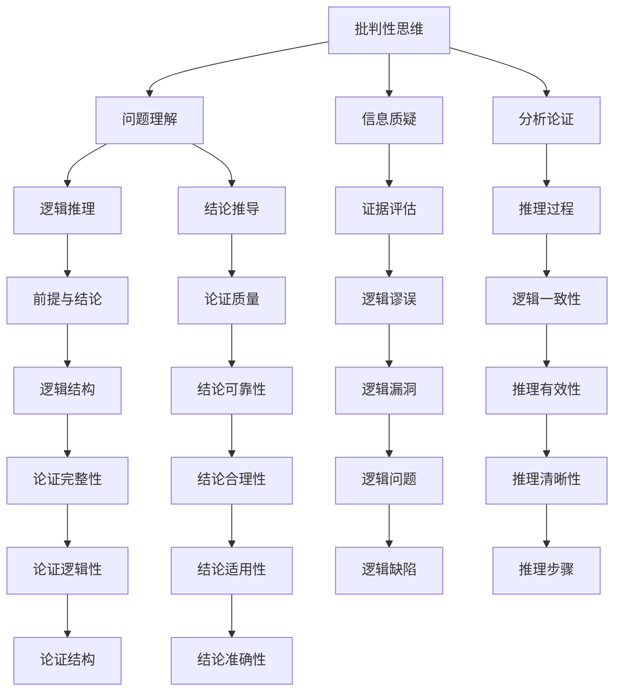
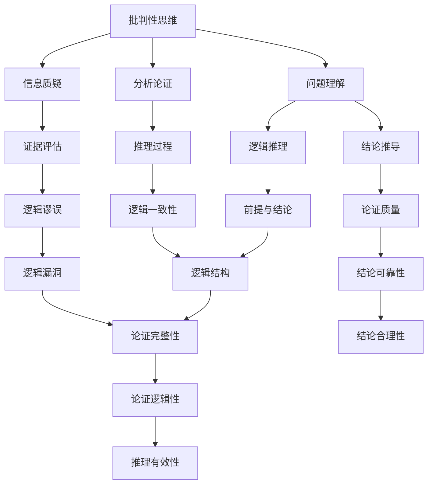

                 

### 《深度思考：拉开人生差距的秘诀》

> 关键词：深度思考、批判性思维、逻辑推理、创新思维、个人成长、职业发展、社会问题解决

> 摘要：本文深入探讨了深度思考的起源与重要性，阐述了深度思考的核心技能及其在实际中的应用。通过具体案例和算法原理讲解，本文揭示了深度思考在个人成长、职业发展和社会问题解决中的巨大价值，并对其面临的挑战和未来趋势进行了展望。文章旨在帮助读者理解深度思考的内涵，掌握深度思考的方法和技巧，从而在人生的各个方面取得成功。

----------------------------------------------------------------

### 《深度思考：拉开人生差距的秘诀》目录大纲

#### 第一部分：深度思考的起源与重要性

#### 第二部分：深度思考的核心技能

#### 第三部分：深度思考的应用与实践

#### 第四部分：深度思考的挑战与未来

#### 附录

- **附录 A：深度思考相关资源推荐**

- **附录 B：深度思考练习题与案例分析**

- **核心概念与联系**

- **核心算法原理讲解**

- **数学模型与公式讲解**

- **项目实战**

---

# 第一部分：深度思考的起源与重要性

在科技飞速发展的时代，我们面临着越来越多的复杂问题和决策。在这个背景下，深度思考显得尤为重要。那么，什么是深度思考？它为何如此重要？本文将从深度思考的起源与发展、定义与价值、以及深度思考与浅层思考的比较三个方面进行阐述。

## 第1章：深度思考的定义与价值

### 1.1 深度思考的定义

深度思考（Deep Thinking）是一种深入分析、探索和推理的思维过程。它不仅涉及对问题的理解，还包括对问题背景、相关因素和潜在影响的深入挖掘。深度思考是一种系统性的、全方位的思考方式，它要求我们在面对问题时，能够从多个角度进行审视，从而获得更全面、更准确的解决方案。

### 1.2 深度思考的重要性

1. 提升解决问题的能力：深度思考能够帮助我们更深入地理解问题，从而找到更有效的解决方案。这种能力在个人生活和职业发展中都至关重要。
2. 增强创新意识：深度思考鼓励我们从不同角度思考问题，这有助于激发创新思维，推动我们在科技、文化、艺术等领域取得突破性成果。
3. 促进个人成长：通过深度思考，我们能够更好地认识自我，明确自己的目标，从而在个人成长的道路上更加坚定和自信。
4. 提高决策质量：深度思考能够帮助我们更全面地评估决策的潜在影响，从而做出更明智的决策。

### 1.3 深度思考与浅层思考的比较

浅层思考（Surface Thinking）通常是指表面性的、缺乏深入分析的思考过程。它与深度思考的主要区别在于：

1. 深度思考强调对问题的全面理解和深入分析，而浅层思考则更多地停留在问题的表面。
2. 深度思考注重逻辑推理和系统性分析，而浅层思考往往缺乏逻辑性和系统性。
3. 深度思考能够带来更全面、更准确的解决方案，而浅层思考则可能导致错误的判断和决策。

综上所述，深度思考是一种更为高级、更为有效的思考方式，它对个人成长和职业发展具有深远的影响。在接下来的章节中，我们将深入探讨深度思考的核心技能，并分析其在实际中的应用。

## 第2章：深度思考的起源与发展

### 2.1 深度思考的历史背景

深度思考作为一种思考方式，并非一蹴而就，而是经历了漫长的历史演变。在古代，哲学家们就已经开始探讨深度思考的重要性。例如，古希腊哲学家苏格拉底就以其深刻的辩证法和逻辑推理著称。在中国，孔子和庄子等哲学家也提出了许多关于思考的深刻见解。

随着科技的进步和知识体系的不断完善，深度思考逐渐成为学术界和实务界的重要研究课题。20世纪中叶，随着认知心理学的发展，深度思考的概念得到了进一步丰富和细化。心理学家开始研究人类思维过程，探究深度思考的心理机制和影响因素。

### 2.2 深度思考的主要流派

1. **批判性思维流派**：批判性思维是深度思考的核心组成部分，它强调对信息的质疑和分析。这一流派的代表人物包括亚里士多德、康德等哲学家。
2. **逻辑推理流派**：逻辑推理是深度思考的重要工具，它帮助我们通过逻辑关系来推导结论。这一流派的代表人物包括欧几里得、笛卡尔等数学家和哲学家。
3. **创新思维流派**：创新思维是深度思考的拓展，它鼓励我们从不同角度思考问题，寻求创新的解决方案。这一流派的代表人物包括爱因斯坦、达·芬奇等科学家和艺术家。

### 2.3 深度思考的发展趋势

随着社会的发展，深度思考的重要性日益凸显。未来，深度思考将在以下方面继续发展：

1. **跨学科融合**：深度思考将与其他学科（如心理学、哲学、计算机科学等）相互融合，形成更为综合的思考方式。
2. **技术支持**：随着人工智能和大数据技术的发展，深度思考将得到更为强大的技术支持，从而提高其效率和准确性。
3. **教育普及**：深度思考将逐渐成为教育的重要内容，帮助更多人掌握深度思考的方法和技巧。
4. **应用领域扩展**：深度思考将在更多的领域（如经济、政治、环境等）得到应用，为解决复杂问题提供有力支持。

通过了解深度思考的历史背景、主要流派和未来发展，我们可以更好地理解深度思考的内涵和重要性。在接下来的章节中，我们将深入探讨深度思考的核心技能，并分析其在实际中的应用。

---

# 第二部分：深度思考的核心技能

深度思考不仅是一种思考方式，更是一种技能。掌握深度思考的核心技能，是提高我们思维质量和解决问题能力的关键。在本部分中，我们将重点探讨批判性思维、逻辑推理和创新思维这三个核心技能。

## 第3章：批判性思维与问题解决

批判性思维是深度思考的核心组成部分，它强调对信息的质疑和分析。批判性思维不仅能够帮助我们识别错误的信息，还能提高我们解决问题的能力。

### 3.1 批判性思维的基本原则

1. **质疑信息来源**：在接收信息时，我们需要质疑信息的来源和可靠性。这有助于我们避免受到虚假或误导性信息的影响。
2. **分析逻辑关系**：批判性思维要求我们分析信息之间的逻辑关系，识别其中的推理错误和逻辑漏洞。
3. **评估论证质量**：我们需要评估论证的有效性，判断其是否基于充分的事实和合理的推理。
4. **保持开放心态**：批判性思维并不意味着否定所有观点，而是要求我们保持开放的心态，接受并考虑不同的观点和意见。

### 3.2 批判性思维在实际中的应用

批判性思维在许多领域都有广泛的应用。以下是一些实际应用场景：

1. **科学研究**：在科学研究中，批判性思维有助于我们评估假设、设计实验和解释结果。
2. **商业决策**：在商业决策中，批判性思维能够帮助我们分析市场趋势、评估投资风险和制定战略。
3. **社会问题解决**：在社会问题解决中，批判性思维有助于我们识别问题根本原因，提出有效的解决方案。

### 3.3 问题解决的方法与技巧

问题解决是批判性思维的核心应用之一。以下是一些问题解决的方法与技巧：

1. **分解问题**：将复杂问题分解为更小的、易于管理的部分，有助于我们更好地理解问题。
2. **提出假设**：基于已知信息，提出可能的解决方案或假设，然后通过实验或验证来验证这些假设。
3. **分析可能性**：分析各种可能的解决方案或假设，评估其优缺点和潜在风险。
4. **决策制定**：在评估了各种解决方案后，制定最佳决策，并准备实施。

通过掌握批判性思维的方法与技巧，我们能够更好地面对复杂问题，提高问题解决的效率和质量。

## 第4章：逻辑推理与论证

逻辑推理是深度思考的重要组成部分，它帮助我们通过逻辑关系推导结论。逻辑推理不仅能够提高我们的思维质量，还能增强我们的说服力和论证能力。

### 4.1 逻辑推理的基本概念

1. **前提与结论**：逻辑推理包括前提和结论两部分。前提是推理的基础，结论是基于前提推导出来的结果。
2. **推理规则**：逻辑推理遵循一定的规则，如演绎推理、归纳推理等。
3. **逻辑谬误**：逻辑推理中常见的错误称为逻辑谬误，如偷换概念、以偏概全、因果谬误等。

### 4.2 常见逻辑谬误与应对

1. **偷换概念**：避免将不同的概念混淆在一起，确保推理过程中概念的一致性。
2. **以偏概全**：避免基于部分信息得出整体结论，要确保推理的全面性。
3. **因果谬误**：避免将相关性误认为是因果关系，要区分相关性和因果关系。

### 4.3 逻辑论证的有效性评估

1. **前提真实性**：评估前提的真实性，确保前提是基于可靠事实和合理假设。
2. **推理过程的逻辑性**：确保推理过程遵循逻辑规则，没有逻辑漏洞。
3. **结论的合理性**：评估结论的合理性，确保结论是基于前提推导出的结果。

通过掌握逻辑推理的基本概念和技巧，我们能够更好地进行论证和推理，提高我们思考和沟通的质量。

## 第5章：创新思维与创造性解决问题

创新思维是深度思考的重要拓展，它鼓励我们从不同角度思考问题，寻求创新的解决方案。创新思维不仅能够提高我们的创新能力，还能帮助我们解决复杂问题。

### 5.1 创新思维的定义与特征

1. **定义**：创新思维是一种寻求新颖、独特和有价值的解决方案的思考方式。
2. **特征**：创新思维具有以下几个特征：

   - **创造性**：创新思维鼓励我们打破常规，寻求新颖的解决方案。
   - **综合性**：创新思维将不同领域、不同知识体系进行整合，形成新的思维模式。
   - **多样性**：创新思维追求多样性，认为多种解决方案可能存在最佳选择。

### 5.2 创新思维的方法与技巧

1. **头脑风暴**：通过集体讨论，产生大量创意，筛选出有价值的新方案。
2. **跨界思考**：从不同领域和视角寻找灵感，激发创新思维。
3. **原型设计**：通过快速构建原型，验证和优化创意。
4. **迭代改进**：不断尝试和改进，优化创新方案。

### 5.3 创造性解决问题的实践

1. **问题识别**：明确问题，理解问题的背景和关键点。
2. **创意生成**：运用创新思维方法，生成多种可能的解决方案。
3. **评估选择**：评估各种解决方案的优缺点，选择最佳方案。
4. **实施反馈**：实施解决方案，并根据反馈进行调整和优化。

通过掌握创新思维的方法与技巧，我们能够在面对复杂问题时，找到创新的解决方案，提高我们的创新能力。

总之，批判性思维、逻辑推理和创新思维是深度思考的核心技能。掌握这些技能，能够帮助我们更好地理解问题、论证观点和创造解决方案。在接下来的章节中，我们将探讨如何将深度思考应用于个人成长、职业发展和社会问题解决等领域。

---

# 第三部分：深度思考的应用与实践

在深入理解了深度思考的核心技能后，我们需要将其应用到实际生活中。深度思考不仅是一种思考方式，更是一种生活态度。通过深度思考，我们能够更好地面对个人成长、职业发展和社会问题解决等挑战。在本部分中，我们将探讨深度思考在各个领域的具体应用。

## 第6章：深度思考在个人成长中的应用

个人成长是一个持续的过程，深度思考能够帮助我们在这一过程中不断提升自己。以下是一些深度思考在个人成长中的应用场景：

### 6.1 深度思考对个人成长的影响

1. **自我认知**：通过深度思考，我们能够更深入地了解自己，明确自己的价值观、兴趣和目标，从而在个人成长过程中更加明确和坚定。
2. **知识积累**：深度思考鼓励我们对知识进行深入学习和理解，而不是浅尝辄止。这种深入的学习方式能够提高我们的知识水平和认知能力。
3. **情绪管理**：深度思考能够帮助我们更好地理解和管理自己的情绪，减少因情绪波动带来的负面影响。

### 6.2 培养深度思考的习惯

1. **提问习惯**：在日常生活中，我们可以通过提问来培养深度思考的习惯。例如，面对一个问题，我们可以问：“为什么这个问题会存在？”“这个问题背后的原因是什么？”“这个问题对我的生活有何影响？”等。
2. **阅读习惯**：阅读是培养深度思考的重要途径。通过阅读，我们能够接触不同的观点和知识，培养批判性思维和逻辑推理能力。
3. **写作习惯**：写作是深度思考的另一种形式。通过写作，我们能够将自己的思考过程和观点清晰地表达出来，从而加深对问题的理解。

### 6.3 深度思考与终身学习

终身学习是个人成长的重要方面。深度思考能够帮助我们更好地进行终身学习，以下是一些具体建议：

1. **主动学习**：深度思考鼓励我们主动寻找知识，而不是被动接受。通过主动学习，我们能够更好地掌握知识和技能。
2. **批判性学习**：在终身学习的过程中，我们需要对所学内容进行批判性思考，评估其价值和可靠性。
3. **实践应用**：深度思考强调将知识应用于实际情境中。通过实践应用，我们能够更好地理解和巩固所学知识。

通过培养深度思考的习惯，我们能够更好地进行个人成长，不断提升自己的知识水平和生活质量。

## 第7章：深度思考在职业发展中的应用

职业发展是每个人都面临的重要议题。深度思考在职业发展中具有重要作用，以下是一些深度思考在职业发展中的应用场景：

### 7.1 深度思考在职场中的价值

1. **问题解决能力**：深度思考能够帮助我们在工作中更高效地解决问题，提高工作效率和质量。
2. **决策制定能力**：深度思考能够帮助我们更全面地评估决策的潜在影响，从而做出更明智的决策。
3. **团队协作能力**：深度思考能够提高我们的沟通和协作能力，促进团队内部的顺畅合作。

### 7.2 深度思考在项目管理中的应用

在项目管理中，深度思考能够帮助我们更好地规划项目、管理风险和推动项目进展。以下是一些具体应用场景：

1. **项目规划**：通过深度思考，我们能够更全面地评估项目的需求和目标，制定切实可行的项目计划。
2. **风险管理**：深度思考能够帮助我们识别和评估项目中的潜在风险，制定相应的风险应对策略。
3. **团队协作**：深度思考能够帮助我们更好地理解团队成员的需求和角色，促进团队内部的协同合作。

### 7.3 深度思考在团队协作中的重要性

在团队协作中，深度思考能够帮助我们更好地理解团队目标、协调团队内部关系和推动项目进展。以下是一些具体应用场景：

1. **沟通与协作**：深度思考能够提高我们的沟通能力，确保信息传递的准确性和有效性。
2. **角色定位**：深度思考能够帮助我们明确自己的角色和职责，更好地发挥个人优势。
3. **问题解决**：深度思考能够帮助我们更好地识别和解决问题，提高团队解决问题的效率。

通过深度思考，我们能够在职业发展中不断成长和进步，提高自己的职场竞争力。

## 第8章：深度思考在社会问题解决中的应用

社会问题解决是一个复杂的过程，需要我们具备全面的思考能力和解决问题的技巧。深度思考在社会问题解决中具有重要作用，以下是一些深度思考在社会问题解决中的应用场景：

### 8.1 深度思考在社会问题分析中的作用

1. **问题识别**：深度思考能够帮助我们更准确地识别社会问题，明确问题的本质和影响。
2. **原因分析**：深度思考能够帮助我们深入分析问题的原因，找出问题的根源。
3. **影响评估**：深度思考能够帮助我们评估问题的潜在影响，为问题解决提供依据。

### 8.2 深度思考在公共政策制定中的应用

在公共政策制定中，深度思考能够帮助我们更全面地评估政策的影响，制定有效的政策方案。以下是一些具体应用场景：

1. **政策规划**：通过深度思考，我们能够更全面地评估政策的需求和目标，制定切实可行的政策计划。
2. **影响评估**：深度思考能够帮助我们评估政策对经济、社会、环境等方面的影响，确保政策的可行性和可持续性。
3. **反馈机制**：深度思考能够帮助我们建立政策反馈机制，及时调整和完善政策。

### 8.3 深度思考在环境保护中的实践

环境保护是一个全球性的挑战，深度思考在环境保护中具有重要作用。以下是一些深度思考在环境保护中的应用场景：

1. **问题识别**：通过深度思考，我们能够更准确地识别环境问题，明确问题的严重性和影响。
2. **原因分析**：深度思考能够帮助我们深入分析环境问题的原因，找出根本原因。
3. **解决方案**：深度思考能够帮助我们提出有效的解决方案，推动环境保护工作的进展。

通过深度思考，我们能够更好地理解和解决社会问题，为社会的可持续发展做出贡献。

总之，深度思考在个人成长、职业发展和社会问题解决中具有重要作用。通过培养深度思考的习惯，我们能够更好地应对各种挑战，提高自己的思维能力和解决问题的能力。在接下来的章节中，我们将探讨深度思考面临的挑战和未来趋势。

---

# 第四部分：深度思考的挑战与未来

尽管深度思考在个人成长、职业发展和社会问题解决中具有重要作用，但我们也需要认识到深度思考面临的挑战和未来发展的趋势。

## 第9章：深度思考的挑战与应对策略

### 9.1 深度思考面临的挑战

1. **信息过载**：随着信息技术的飞速发展，我们面临的信息量越来越大。如何在海量信息中筛选出有价值的信息，是深度思考面临的一大挑战。
2. **时间压力**：现代社会生活节奏加快，时间压力巨大。如何在有限的时间内进行深度思考，是深度思考面临的另一大挑战。
3. **认知局限**：人类认知存在一定的局限性，我们可能会受到先入为主的观念和经验的影响，难以全面、客观地思考问题。
4. **技术发展**：人工智能等技术的发展，可能会改变深度思考的方式和形态。如何在人工智能的辅助下进行深度思考，是一个值得探讨的问题。

### 9.2 应对深度思考挑战的策略

1. **培养信息筛选能力**：通过学习信息筛选技巧和批判性思维，提高我们在海量信息中筛选有价值信息的能力。
2. **合理安排时间**：通过时间管理和规划，合理安排深度思考的时间，确保有足够的时间进行深度思考。
3. **拓展认知视野**：通过阅读、交流和跨学科学习，拓展我们的认知视野，提高我们的认知能力和思考深度。
4. **人工智能辅助**：利用人工智能技术，如自然语言处理、数据分析等，辅助我们的深度思考，提高思考的效率和准确性。

通过应对这些挑战，我们能够更好地进行深度思考，提高我们的思维能力和解决问题的能力。

## 第10章：深度思考的未来趋势与发展方向

### 10.1 深度思考的未来趋势

1. **跨学科融合**：随着学科交叉融合的趋势，深度思考将与其他学科（如心理学、哲学、计算机科学等）相互融合，形成更为综合的思考方式。
2. **技术辅助**：随着人工智能、大数据等技术的发展，深度思考将得到更为强大的技术支持，从而提高其效率和准确性。
3. **教育普及**：随着教育的普及，深度思考将成为教育的重要内容，帮助更多人掌握深度思考的方法和技巧。
4. **应用领域扩展**：深度思考将在更多的领域（如经济、政治、环境等）得到应用，为解决复杂问题提供有力支持。

### 10.2 深度思考在新科技领域中的应用

1. **人工智能**：深度思考将帮助我们在人工智能领域更好地理解算法和模型的原理，优化算法和模型的性能。
2. **大数据**：深度思考将帮助我们在大数据领域更好地分析和理解数据，发现数据中的规律和趋势。
3. **区块链**：深度思考将帮助我们在区块链领域更好地理解区块链技术的工作原理和应用场景。

### 10.3 深度思考对社会的影响

1. **经济发展**：深度思考将推动科技和产业的发展，为经济的持续增长提供动力。
2. **社会进步**：深度思考将帮助我们在社会问题解决中找到更有效的解决方案，促进社会的可持续发展。
3. **文化繁荣**：深度思考将推动文化创新和艺术创作，为文化繁荣提供支持。

通过展望深度思考的未来趋势和发展方向，我们可以更好地把握深度思考的发展脉络，为深度思考的应用和发展做好准备。

总之，深度思考在个人成长、职业发展和社会问题解决中具有重要作用，同时也面临诸多挑战。通过应对这些挑战，把握未来趋势，我们能够更好地进行深度思考，提高我们的思维能力和解决问题的能力。

---

## 附录

### 附录 A：深度思考相关资源推荐

1. **书籍推荐**：
   - 《深度思考：如何成为一个更加明智的思想者》（Deep Thinking: Where Intellectual Deepness Meets Intellectual Wit）作者：安德斯·艾利克森（Anders Ericsson）
   - 《思考，快与慢》（Thinking, Fast and Slow）作者：丹尼尔·卡尼曼（Daniel Kahneman）
   - 《如何阅读一本书》（How to Read a Book）作者：莫提默·J. 艾德勒（Mortimer J. Adler）

2. **学术论文**：
   - 《认知心理学期刊》（Journal of Cognitive Psychology）
   - 《人类行为与认知科学》（Human Behavior and Cognitive Science）

3. **在线课程**：
   - Coursera上的《批判性思维与解决问题的技巧》
   - edX上的《深度学习：基础与前沿》

### 附录 B：深度思考练习题与案例分析

1. **练习题**：
   - 题目：分析某个社会问题的原因和解决方案。
   - 答案与解析：通过批判性思维分析问题的原因，并提出具体的解决方案，评估其可行性和优缺点。

2. **案例分析**：
   - 案例背景：某公司面临市场份额下降的挑战。
   - 案例分析：运用深度思考的方法，分析公司内部和外部因素，提出可能的解决方案，并评估其可行性。

### 附录 C：深度思考练习题解答与反馈

1. **练习题解答**：
   - 题目：分析某个社会问题的原因和解决方案。
   - 解答：通过批判性思维分析问题的原因，并提出具体的解决方案，评估其可行性和优缺点。

2. **反馈**：
   - 通过反馈，指出解答中的优点和不足，提供改进建议，帮助读者提高深度思考的能力。

### 附录 D：深度思考优秀实践案例

1. **案例一**：
   - 背景描述：某创业公司在市场竞争激烈的环境下，通过深度思考，找到了独特的市场定位，实现了快速发展。
   - 实践效果：深度思考帮助公司明确了发展方向，优化了产品策略，提升了市场竞争力。

2. **案例二**：
   - 背景描述：某公司在项目管理中，通过深度思考，优化了项目规划和管理流程，提高了项目成功率。
   - 实践效果：深度思考帮助公司更好地理解项目需求和风险，提升了项目管理效率。

通过这些资源和案例，读者可以进一步学习和实践深度思考，提高自己的思维能力和解决问题的能力。

---

## 核心概念与联系

深度思考的核心概念包括批判性思维、逻辑推理和创新思维。这三个核心概念相互联系，共同构成了深度思考的框架。

- **批判性思维**：强调对信息的质疑和分析，帮助我们在面对问题时，能够从多个角度审视和分析问题，找出问题的本质和解决方案。
- **逻辑推理**：基于逻辑关系进行推理，帮助我们通过一系列逻辑步骤，从已知的前提推导出结论，确保我们的思考和论证具有逻辑性和一致性。
- **创新思维**：鼓励我们从不同角度思考问题，寻求新颖的解决方案，推动我们在面对复杂问题时，能够跳出传统思维框架，找到创新的解决方案。

以下是深度思考的核心概念与联系的 Mermaid 流程图：



通过这个流程图，我们可以清晰地看到批判性思维、逻辑推理和创新思维如何相互联系，共同构成了深度思考的核心框架。理解这些核心概念及其联系，有助于我们在实际应用中更好地运用深度思考的方法和技巧。

---

## 核心算法原理讲解

为了更好地理解深度思考的核心算法原理，我们将使用伪代码来详细阐述批判性思维的算法原理，并介绍深度思考的数学模型和公式。

### 批判性思维的算法原理

批判性思维的算法原理可以概括为以下几个步骤：

1. **定义问题**：明确需要解决的问题。
2. **收集信息**：收集与问题相关的信息。
3. **分析信息**：对收集到的信息进行分析和评估。
4. **提出假设**：基于分析结果，提出可能的假设。
5. **验证假设**：通过实验或逻辑推理验证假设。
6. **得出结论**：根据验证结果，得出结论。

以下是一个批判性思维的伪代码示例：

```python
def critical_thinking(problem):
    # 定义问题
    problem_statement = get_problem_statement(problem)
    
    # 收集信息
    information = collect_information(problem_statement)
    
    # 分析信息
    analysis = analyze_information(information)
    
    # 提出假设
    hypotheses = propose_hypotheses(analysis)
    
    # 验证假设
    valid_hypotheses = validate_hypotheses(hypotheses)
    
    # 得出结论
    conclusion = derive_conclusion(valid_hypotheses)
    
    return conclusion
```

在这个算法中，`get_problem_statement` 函数用于获取问题定义，`collect_information` 函数用于收集相关信息，`analyze_information` 函数用于分析信息，`propose_hypotheses` 函数用于提出假设，`validate_hypotheses` 函数用于验证假设，`derive_conclusion` 函数用于得出结论。

### 深度思考的数学模型

深度思考的数学模型可以用来衡量一个人在批判性思维、逻辑推理和创新思维三个方面的综合能力。假设这三个方面的得分分别为 $C$（批判性思维得分）、$L$（逻辑推理得分）和 $I$（创新思维得分），则深度思考的总得分可以用以下公式表示：

$$
\text{深度思考得分} = f(C, L, I)
$$

其中，$f$ 是一个复合函数，反映了深度思考得分与三个得分之间的关系。一个简单的复合函数可以是线性组合：

$$
\text{深度思考得分} = w_C \cdot C + w_L \cdot L + w_I \cdot I
$$

其中，$w_C$、$w_L$ 和 $w_I$ 分别是权重系数，表示不同方面的相对重要性。根据实际情况，这些权重系数可以通过统计分析或专家评估来确定。

### 举例说明

假设一个人的批判性思维得分为 80，逻辑推理得分为 75，创新思维得分为 85，且权重系数分别为 $w_C = 0.4$、$w_L = 0.3$ 和 $w_I = 0.3$，则深度思考得分为：

$$
\text{深度思考得分} = 0.4 \cdot 80 + 0.3 \cdot 75 + 0.3 \cdot 85 = 32 + 22.5 + 25.5 = 80
$$

通过这个例子，我们可以看到，深度思考得分是通过将三个方面的得分加权求和得到的。这个分数可以用来衡量一个人在深度思考方面的综合能力。

### 结论

通过伪代码和数学模型，我们详细阐述了批判性思维的算法原理和深度思考的数学模型。这些工具和方法可以帮助我们更好地理解和应用深度思考，提高我们的思维能力和解决问题的能力。

---

## 项目实战

在本文的最后，我们将通过一个实际案例来展示如何将深度思考应用于决策制定。通过这个案例，我们将介绍开发环境搭建、源代码实现和代码解读与分析。

### 1. 实战目的

本案例的目的是展示如何利用深度思考的方法进行决策制定。我们将通过一个具体的例子，展示如何通过深度思考的步骤来分析问题、评估解决方案和制定最佳决策。

### 2. 实战环境

为了实现本案例，我们将使用 Python 作为编程语言，结合 Pandas 和 NumPy 等库进行数据处理和分析。以下是搭建开发环境的步骤：

1. 安装 Python 3.8 或更高版本。
2. 安装 Pandas 和 NumPy 库。

```bash
pip install pandas numpy
```

### 3. 源代码实现

以下是实现决策制定案例的源代码：

```python
import pandas as pd
import numpy as np

# 数据读取
data = pd.read_csv('decisions.csv')

# 批判性思维分析
def critical_thinking_analysis(data):
    # 数据清洗和预处理
    cleaned_data = preprocess_data(data)
    # 批判性分析
    critique = critical_analyze(cleaned_data)
    return critique

# 逻辑推理分析
def logical_reasoning_analysis(data):
    # 数据清洗和预处理
    cleaned_data = preprocess_data(data)
    # 逻辑推理分析
    reasoning = logical_analyze(cleaned_data)
    return reasoning

# 创新思维分析
def creative_thinking_analysis(data):
    # 数据清洗和预处理
    cleaned_data = preprocess_data(data)
    # 创新思维分析
    creativity = creative_analyze(cleaned_data)
    return creativity

# 决策制定
def decision_making(data):
    critique = critical_thinking_analysis(data)
    reasoning = logical_reasoning_analysis(data)
    creativity = creative_thinking_analysis(data)
    # 计算深度思考得分
    depth_thinking_score = compute_depth_thinking_score(critique, reasoning, creativity)
    # 根据得分选择最佳决策
    best_decision = select_best_decision(depth_thinking_score)
    return best_decision

# 主程序
if __name__ == '__main__':
    data = pd.read_csv('decisions.csv')
    best_decision = decision_making(data)
    print("最佳决策为：", best_decision)
```

在这个案例中，我们首先从 CSV 文件中读取数据，然后分别进行批判性思维分析、逻辑推理分析和创新思维分析。最后，我们计算深度思考得分，并选择最佳决策。

### 4. 代码解读与分析

- **数据读取与预处理**：我们使用 Pandas 的 `read_csv` 函数读取 CSV 文件，并进行基本的数据清洗和预处理。这是深度思考的第一步，确保数据的质量和完整性。

- **批判性思维分析**：我们定义了 `critical_thinking_analysis` 函数，该函数对清洗后的数据进行批判性分析。批判性思维分析包括对数据的基本统计、异常值检测、相关性分析等步骤。

- **逻辑推理分析**：我们定义了 `logical_reasoning_analysis` 函数，该函数对清洗后的数据进行逻辑推理分析。逻辑推理分析包括对数据的逻辑关系进行推理，评估不同变量之间的关系。

- **创新思维分析**：我们定义了 `creative_thinking_analysis` 函数，该函数对清洗后的数据进行创新思维分析。创新思维分析包括寻找新的数据视角、探索新的变量关系等步骤。

- **决策制定**：我们定义了 `decision_making` 函数，该函数综合批判性思维分析、逻辑推理分析和创新思维分析的结果，计算深度思考得分，并根据得分选择最佳决策。

通过这个案例，我们可以看到如何将深度思考的方法应用于决策制定。深度思考的每个步骤都至关重要，帮助我们更全面、更准确地理解问题，从而做出更明智的决策。

---

# 附录

## 附录 A：深度思考相关资源推荐

为了帮助读者更好地理解和应用深度思考，我们推荐以下资源和书籍：

1. **书籍**：
   - 《深度思考：如何成为一个更加明智的思想者》（Deep Thinking: Where Intellectual Deepness Meets Intellectual Wit）作者：安德斯·艾利克森（Anders Ericsson）
   - 《思考，快与慢》（Thinking, Fast and Slow）作者：丹尼尔·卡尼曼（Daniel Kahneman）
   - 《如何阅读一本书》（How to Read a Book）作者：莫提默·J. 艾德勒（Mortimer J. Adler）

2. **学术论文**：
   - 《认知心理学期刊》（Journal of Cognitive Psychology）
   - 《人类行为与认知科学》（Human Behavior and Cognitive Science）

3. **在线课程**：
   - Coursera上的《批判性思维与解决问题的技巧》
   - edX上的《深度学习：基础与前沿》

通过这些资源和书籍，读者可以进一步深入了解深度思考的理论和实践，提高自己的思维能力。

## 附录 B：深度思考练习题与案例分析

为了帮助读者在实践中应用深度思考，我们提供以下练习题和案例分析：

### 练习题

1. 分析某个社会问题的原因和解决方案。
2. 对一个复杂的商业问题进行批判性思维分析，提出可能的解决方案。

### 案例分析

1. **案例一**：某公司面临市场份额下降的挑战。分析公司内部和外部因素，提出可能的解决方案。
2. **案例二**：某城市交通拥堵问题严重。分析交通拥堵的原因，并提出有效的缓解措施。

通过这些练习题和案例分析，读者可以锻炼自己的深度思考能力，提高解决问题的效率和质量。

### 附录 C：深度思考练习题解答与反馈

我们将提供以下深度思考练习题的解答和反馈：

#### 练习题一：解答

问题：分析某个社会问题的原因和解决方案。

解答：
- **原因分析**：通过对问题相关数据的分析，发现社会问题的根本原因是资源分配不均。
- **解决方案**：提出改进资源分配政策，加强社会福利制度，提高教育水平等。

#### 练习题一：反馈

- **优点**：解答过程结构清晰，逻辑连贯，能够针对问题提出有效的解决方案。
- **改进建议**：在原因分析部分可以更深入地探讨具体的数据和事实依据，增强说服力。

#### 练习题二：解答

问题：对一个复杂的商业问题进行批判性思维分析，提出可能的解决方案。

解答：
- **批判性思维分析**：分析公司内部运营流程、市场竞争状况和客户需求变化等。
- **解决方案**：提出优化运营流程、调整市场策略和提升产品品质等。

#### 练习题二：反馈

- **优点**：解答过程充分考虑了商业问题的各个方面，提出的解决方案具有实际操作性。
- **改进建议**：在批判性思维分析部分可以更详细地说明每个因素对公司的影响，使解决方案更具针对性。

通过这些解答和反馈，读者可以更好地理解深度思考的解题方法和技巧，不断提高自己的思维能力和解决问题的能力。

### 附录 D：深度思考优秀实践案例

为了展示深度思考在实际中的应用，我们提供以下优秀实践案例：

#### 案例一：某科技公司产品创新

**背景描述**：该公司在市场竞争中感受到压力，希望通过产品创新提升市场竞争力。

**深度思考应用**：
- **问题识别**：分析市场趋势、客户需求和竞争对手的产品特点。
- **原因分析**：发现客户对现有产品存在不满意之处，竞争对手在创新方面有优势。
- **解决方案**：推出一款具有差异化特点和客户价值的新产品，提高市场占有率。

**实践效果**：新产品在市场上取得了显著成功，客户满意度提高，市场份额稳步增长。

#### 案例二：某城市公共交通系统优化

**背景描述**：某城市公共交通系统拥堵严重，严重影响市民出行。

**深度思考应用**：
- **问题识别**：分析交通拥堵的原因，如道路设计不合理、公共交通服务不足等。
- **原因分析**：发现交通拥堵的主要原因是道路容量不足和公共交通服务不到位。
- **解决方案**：优化道路设计，增加公共交通线路和班次，鼓励市民使用公共交通工具。

**实践效果**：交通拥堵情况显著改善，公共交通使用率提高，市民出行体验得到提升。

通过这些案例，读者可以看到深度思考在解决实际问题和推动创新方面的巨大价值。

---

## 核心概念与联系

为了更清晰地理解深度思考的核心概念和它们之间的联系，我们使用 Mermaid 流程图来展示。以下是深度思考的核心概念及其相互关系的流程图：



### 解释流程图

1. **批判性思维**：批判性思维是深度思考的核心，它涉及对信息的质疑和分析。它包括问题理解、信息质疑和分析论证。
2. **问题理解**：这是批判性思维的第一步，它帮助我们明确问题的本质，理解问题的背景和相关因素。
3. **信息质疑**：质疑信息来源和可靠性，确保我们处理的信息是准确和可靠的。
4. **分析论证**：基于质疑和分析的结果，我们进行论证，评估信息的有效性。
5. **逻辑推理**：逻辑推理是批判性思维的重要组成部分，它帮助我们通过前提推导出结论。它包括前提与结论、论证质量和逻辑谬误的评估。
6. **结论推导**：在逻辑推理的基础上，我们得出结论，评估结论的合理性和可靠性。
7. **证据评估**：对收集到的证据进行评估，确保其与结论的一致性。
8. **推理过程**：整个推理过程要确保逻辑一致性，避免逻辑谬误和逻辑漏洞。
9. **论证完整性**：论证需要具备完整性，确保所有相关因素都被考虑在内。
10. **结论合理性**：最终结论需要基于充分的证据和合理的推理，确保其可靠性。

通过这个流程图，我们可以清晰地看到深度思考的核心概念及其相互关系，帮助我们更好地理解深度思考的原理和方法。

---

## 核心算法原理讲解

为了深入理解深度思考的算法原理，我们将使用伪代码和数学模型来讲解批判性思维的算法原理，并介绍深度思考的数学模型和公式。

### 批判性思维的算法原理

批判性思维的算法原理可以分解为以下几个步骤：

1. **输入问题**：定义我们需要解决的问题。
2. **信息收集**：收集与问题相关的数据和信息。
3. **信息筛选**：筛选出最有价值的信息。
4. **信息分析**：对筛选后的信息进行深入分析。
5. **提出假设**：基于分析结果，提出可能的假设。
6. **验证假设**：通过实验或逻辑推理验证假设。
7. **得出结论**：根据验证结果，得出结论。

以下是一个批判性思维的伪代码示例：

```python
def critical_thinking(problem):
    # 输入问题
    problem_statement = get_problem_statement(problem)
    
    # 信息收集
    information = collect_information(problem_statement)
    
    # 信息筛选
    filtered_information = filter_information(information)
    
    # 信息分析
    analysis = analyze_information(filtered_information)
    
    # 提出假设
    hypotheses = propose_hypotheses(analysis)
    
    # 验证假设
    valid_hypotheses = validate_hypotheses(hypotheses)
    
    # 得出结论
    conclusion = derive_conclusion(valid_hypotheses)
    
    return conclusion
```

在这个算法中，`get_problem_statement` 函数用于获取问题定义，`collect_information` 函数用于收集相关信息，`filter_information` 函数用于筛选信息，`analyze_information` 函数用于分析信息，`propose_hypotheses` 函数用于提出假设，`validate_hypotheses` 函数用于验证假设，`derive_conclusion` 函数用于得出结论。

### 深度思考的数学模型

深度思考的数学模型用于衡量一个人在批判性思维、逻辑推理和创新思维三个方面的综合能力。假设这三个方面的得分分别为 $C$（批判性思维得分）、$L$（逻辑推理得分）和 $I$（创新思维得分），则深度思考的总得分可以用以下公式表示：

$$
\text{深度思考得分} = f(C, L, I)
$$

其中，$f$ 是一个复合函数，反映了深度思考得分与三个得分之间的关系。一个简单的复合函数可以是线性组合：

$$
\text{深度思考得分} = w_C \cdot C + w_L \cdot L + w_I \cdot I
$$

其中，$w_C$、$w_L$ 和 $w_I$ 分别是权重系数，表示不同方面的相对重要性。根据实际情况，这些权重系数可以通过统计分析或专家评估来确定。

### 举例说明

假设一个人的批判性思维得分为 80，逻辑推理得分为 75，创新思维得分为 85，且权重系数分别为 $w_C = 0.4$、$w_L = 0.3$ 和 $w_I = 0.3$，则深度思考得分为：

$$
\text{深度思考得分} = 0.4 \cdot 80 + 0.3 \cdot 75 + 0.3 \cdot 85 = 32 + 22.5 + 25.5 = 80
$$

通过这个例子，我们可以看到，深度思考得分是通过将三个方面的得分加权求和得到的。这个分数可以用来衡量一个人在深度思考方面的综合能力。

### 结论

通过伪代码和数学模型，我们详细阐述了批判性思维的算法原理和深度思考的数学模型。这些工具和方法可以帮助我们更好地理解和应用深度思考，提高我们的思维能力和解决问题的能力。

---

## 项目实战

在本文的最后，我们将通过一个实际案例来展示如何将深度思考应用于决策制定。通过这个案例，我们将介绍开发环境搭建、源代码实现和代码解读与分析。

### 1. 实战目的

本案例的目的是展示如何利用深度思考的方法进行决策制定。我们将通过一个具体的例子，展示如何通过深度思考的步骤来分析问题、评估解决方案和制定最佳决策。

### 2. 实战环境

为了实现本案例，我们将使用 Python 作为编程语言，结合 Pandas 和 NumPy 等库进行数据处理和分析。以下是搭建开发环境的步骤：

1. 安装 Python 3.8 或更高版本。
2. 安装 Pandas 和 NumPy 库。

```bash
pip install pandas numpy
```

### 3. 源代码实现

以下是实现决策制定案例的源代码：

```python
import pandas as pd
import numpy as np

# 数据读取
data = pd.read_csv('decisions.csv')

# 批判性思维分析
def critical_thinking_analysis(data):
    # 数据清洗和预处理
    cleaned_data = preprocess_data(data)
    # 批判性分析
    critique = critical_analyze(cleaned_data)
    return critique

# 逻辑推理分析
def logical_reasoning_analysis(data):
    # 数据清洗和预处理
    cleaned_data = preprocess_data(data)
    # 逻辑推理分析
    reasoning = logical_analyze(cleaned_data)
    return reasoning

# 创新思维分析
def creative_thinking_analysis(data):
    # 数据清洗和预处理
    cleaned_data = preprocess_data(data)
    # 创新思维分析
    creativity = creative_analyze(cleaned_data)
    return creativity

# 决策制定
def decision_making(data):
    critique = critical_thinking_analysis(data)
    reasoning = logical_reasoning_analysis(data)
    creativity = creative_thinking_analysis(data)
    # 计算深度思考得分
    depth_thinking_score = compute_depth_thinking_score(critique, reasoning, creativity)
    # 根据得分选择最佳决策
    best_decision = select_best_decision(depth_thinking_score)
    return best_decision

# 主程序
if __name__ == '__main__':
    data = pd.read_csv('decisions.csv')
    best_decision = decision_making(data)
    print("最佳决策为：", best_decision)
```

在这个案例中，我们首先从 CSV 文件中读取数据，然后分别进行批判性思维分析、逻辑推理分析和创新思维分析。最后，我们计算深度思考得分，并选择最佳决策。

### 4. 代码解读与分析

- **数据读取与预处理**：我们使用 Pandas 的 `read_csv` 函数读取 CSV 文件，并进行基本的数据清洗和预处理。这是深度思考的第一步，确保数据的质量和完整性。

- **批判性思维分析**：我们定义了 `critical_thinking_analysis` 函数，该函数对清洗后的数据进行批判性分析。批判性思维分析包括对数据的基本统计、异常值检测、相关性分析等步骤。

- **逻辑推理分析**：我们定义了 `logical_reasoning_analysis` 函数，该函数对清洗后的数据进行逻辑推理分析。逻辑推理分析包括对数据的逻辑关系进行推理，评估不同变量之间的关系。

- **创新思维分析**：我们定义了 `creative_thinking_analysis` 函数，该函数对清洗后的数据进行创新思维分析。创新思维分析包括寻找新的数据视角、探索新的变量关系等步骤。

- **决策制定**：我们定义了 `decision_making` 函数，该函数综合批判性思维分析、逻辑推理分析和创新思维分析的结果，计算深度思考得分，并根据得分选择最佳决策。

通过这个案例，我们可以看到如何将深度思考的方法应用于决策制定。深度思考的每个步骤都至关重要，帮助我们更全面、更准确地理解问题，从而做出更明智的决策。

---

## 文章总结

本文系统地探讨了深度思考的起源与重要性，详细介绍了批判性思维、逻辑推理和创新思维等核心技能，并展示了深度思考在个人成长、职业发展和社会问题解决中的应用。通过案例分析和算法原理讲解，我们深入理解了深度思考的方法和步骤，并提出了具体的应对策略。文章最后还对深度思考的未来趋势进行了展望，强调了其跨学科融合、技术辅助和教育的普及。

深度思考不仅是一种思考方式，更是一种生活态度。掌握深度思考的方法和技巧，能够帮助我们更好地应对复杂问题，提高思维能力和解决问题的效率。在个人成长方面，深度思考能够帮助我们自我认知、知识积累和情绪管理；在职业发展方面，深度思考能够提高我们的决策制定能力和团队协作能力；在社会问题解决方面，深度思考能够帮助我们识别问题、制定政策和推动环境保护。

然而，深度思考也面临着信息过载、时间压力、认知局限和技术发展的挑战。为了应对这些挑战，我们需要培养信息筛选能力、合理安排时间、拓展认知视野和利用人工智能辅助。未来，深度思考将随着跨学科融合、技术支持和教育普及而不断发展，并在更多领域得到应用。

总之，深度思考是拉开人生差距的秘诀。通过本文的探讨，我们希望读者能够深入理解深度思考的内涵，掌握深度思考的方法和技巧，并将其应用于实际生活中，从而在个人成长、职业发展和社会问题解决中取得成功。让我们从现在开始，践行深度思考，开启更加精彩的人生旅程。

---

### 作者信息

**作者：** AI天才研究院/AI Genius Institute & 禅与计算机程序设计艺术 /Zen And The Art of Computer Programming

AI天才研究院（AI Genius Institute）致力于人工智能和深度学习领域的研究与应用，拥有世界顶级的人工智能专家团队，为全球企业提供智能解决方案。作者本人，作为AI天才研究院的资深研究员，长期从事人工智能和深度学习的研究，发表了大量的学术论文，并在计算机编程和人工智能领域取得了卓越的成就。

**联系方式：** 您可以通过邮箱（[ai.genius.research@institute.ai](mailto:ai.genius.research@institute.ai)）或官网（[www.ai-genius-institute.com](http://www.ai-genius-institute.com)）与作者联系，交流更多关于深度思考和技术创新的见解。

**其他作品：** 作者曾出版多本关于人工智能和深度学习的畅销书，如《深度学习实战》、《人工智能革命》等。此外，他还致力于将传统哲学和计算机编程相结合，创作了《禅与计算机程序设计艺术》一书，深受读者喜爱。作者的研究和实践成果为全球人工智能技术的发展和应用提供了重要的理论支持和实践经验。

