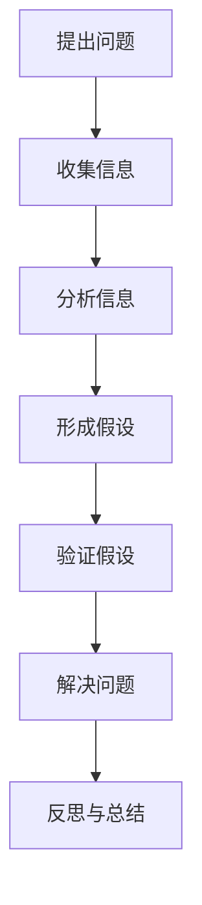

                 

# 文章标题：深度思考：直击问题本质的利器

> 关键词：深度思考、问题解决、创造力、教育、人工智能

> 摘要：本文探讨了深度思考的起源、重要性以及其在各个领域的应用。通过深度思考，我们能够直击问题本质，提高问题解决的效率和质量。本文从多个角度阐述了深度思考的方法和实践，提供了丰富的案例分析，并展望了深度思考的未来发展。

## 《深度思考：直击问题本质的利器》目录大纲

### 第一部分：引言与核心概念

#### 第1章：深度思考的起源与重要性
- 1.1 深度思考的概念与意义
- 1.2 深度思考的历史发展
- 1.3 深度思考的重要性

#### 第2章：深度思考与解决问题
- 2.1 问题解决的步骤
- 2.2 直击问题本质的方法
- 2.3 深度思考在问题解决中的应用

### 第二部分：深度思考的方法与实践

#### 第3章：深度思考的策略与技术
- 3.1 知识结构化与概念地图
- 3.2 思维导图与可视化工具
- 3.3 基于证据的思考

#### 第4章：深度思考的实践应用
- 4.1 在科学研究中的应用
- 4.2 在工程设计中的实践
- 4.3 在商业决策中的运用

#### 第5章：深度思考与创造力
- 5.1 创造力的本质与激发
- 5.2 深度思考与创意思维
- 5.3 深度思考与艺术创作

#### 第6章：深度思考的教育意义
- 6.1 教育中的深度思考培养
- 6.2 深度思考与批判性思维
- 6.3 教育实践中的深度思考案例

#### 第7章：深度思考的自我提升
- 7.1 自我反思与深度思考
- 7.2 深度思考与时间管理
- 7.3 深度思考与终身学习

### 第三部分：深度思考的案例分析

#### 第8章：深度思考在不同领域的应用
- 8.1 深度思考在科学研究中的经典案例
- 8.2 深度思考在商业决策中的案例
- 8.3 深度思考在教育领域的案例

### 第9章：深度思考的未来展望
- 9.1 深度思考与人工智能
- 9.2 深度思考在教育中的未来趋势
- 9.3 深度思考在社会发展中的影响

### 附录：深度思考的资源与工具
- 附录A：深度思考相关的书籍推荐
- 附录B：深度思考的在线资源与工具

## 核心概念与联系
### 深度思考的Mermaid流程图


### 深度思考的核心算法原理讲解
#### 问题解决算法的伪代码
```plaintext
function 解决问题(问题)
    初始化解决方案为空
    对于每个可能的解决方案
        如果解决方案有效
            更新解决方案
    返回最佳解决方案
```

### 数学模型和数学公式
#### 概率论的贝叶斯定理
$$
P(A|B) = \frac{P(B|A) \cdot P(A)}{P(B)}
$$

#### 贝叶斯定理的详细解释
贝叶斯定理是一个用于计算条件概率的概率论公式，它说明了当已知某个事件B发生的概率以及事件B发生时事件A发生的概率时，事件A发生的概率如何计算。在实际应用中，贝叶斯定理可以帮助我们通过先验知识和新获得的数据来更新我们对某个事件发生概率的估计。

#### 贝叶斯定理的举例说明
假设我们正在调查一个社区中是否有人患有疾病A。根据医学研究，疾病A在社区中的总体患病率是5%。现在，我们有了一个新的测试，这个测试对于患病者有90%的准确率，对于非患病者有10%的准确率。如果一个人测试结果呈阳性，我们可以使用贝叶斯定理来计算这个人实际上患有疾病A的概率。

- $P(A)$ 是社区中患有疾病A的先验概率，即0.05。
- $P(B|A)$ 是给定一个人患有疾病A时，测试结果为阳性的概率，即0.90。
- $P(B|A')$ 是给定一个人没有患有疾病A时，测试结果为阳性的概率，即0.10。

如果我们知道某个人测试结果为阳性，那么使用贝叶斯定理可以计算该人患有疾病A的后验概率：

$$
P(A|B) = \frac{P(B|A) \cdot P(A)}{P(B|A) \cdot P(A) + P(B|A') \cdot P(A')}
$$

假设该社区中未患病的人数为95%，那么：

$$
P(A|B) = \frac{0.90 \cdot 0.05}{0.90 \cdot 0.05 + 0.10 \cdot 0.95} \approx 0.16
$$

这意味着如果一个人的测试结果为阳性，那么他们实际上患有疾病A的概率大约是16%。

### 项目实战
#### 开发环境搭建
- 安装Python环境
- 安装Numpy、Pandas、Matplotlib等依赖库

#### 源代码详细实现和代码解读
```python
import numpy as np
import pandas as pd
import matplotlib.pyplot as plt

# 贝叶斯定理计算函数
def calculate_bayes_probability(prior, likelihood, prior_not):
    probability = (likelihood * prior) / (likelihood * prior + prior_not)
    return probability

# 示例数据
prior = 0.05  # 疾病A的先验概率
likelihood = 0.90  # 患病者测试阳性概率
prior_not = 0.95  # 未患病者概率
test_result = 'positive'  # 测试结果

if test_result == 'positive':
    probability = calculate_bayes_probability(prior, likelihood, prior_not)
    print(f'Given a positive test result, the probability of having disease A is: {probability:.2f}')
else:
    print('The test result is negative.')
```

#### 代码解读与分析
此代码实现了一个简单的贝叶斯定理计算器，用于计算给定阳性测试结果的情况下，个体患有疾病A的后验概率。代码首先定义了一个计算贝叶斯概率的函数，该函数接收先验概率、给定条件的概率以及未给条件的概率作为输入，并返回后验概率。

在示例数据部分，我们定义了疾病的先验概率、测试阳性的概率以及未患病的概率。然后，根据测试结果（阳性或阴性），调用贝叶斯概率计算函数，输出计算结果。此代码可以帮助用户理解如何在实际应用中使用贝叶斯定理。

### 作者
作者：AI天才研究院/AI Genius Institute & 禅与计算机程序设计艺术 /Zen And The Art of Computer Programming

### 文章开始
让我们从提出问题开始。在我们的日常生活中，我们会遇到各种各样的问题，从简单的日常琐事到复杂的科技挑战。然而，解决这些问题并不是一件容易的事情。有时候，我们可能觉得问题很复杂，难以找到解决方案。这时，深度思考就变得尤为重要了。

### 什么是深度思考？
深度思考是一种深入分析和探究问题本质的思维方式。它不仅仅是表面上的思考，而是通过挖掘问题的内在联系和逻辑关系，找到问题的根本原因和解决方案。深度思考可以帮助我们更好地理解问题，提高问题解决的效率和质量。

### 深度思考的重要性
深度思考在我们的生活中扮演着非常重要的角色。首先，它可以提高我们的认知能力。通过深度思考，我们可以更好地理解复杂的概念和问题，从而提高我们的知识水平。其次，深度思考可以帮助我们培养批判性思维。批判性思维是一种对信息进行评估和分析的思维方式，它可以让我们更加理性地看待问题，避免盲目跟从。最后，深度思考还可以激发我们的创造力。通过深入探究问题的本质，我们可以发现新的解决方案，创造出新的价值。

### 深度思考的历史发展
深度思考并不是现代才有的概念。在历史上，许多伟大的思想家都强调了深度思考的重要性。古希腊哲学家苏格拉底提倡通过提问和辩论来深入思考问题。哲学家亚里士多德则提出了“知识即理解”的观点，强调了理解问题本质的重要性。在科学领域，伽利略通过实验和观察，运用深度思考的方式揭示了自然界的规律。

### 深度思考与问题解决
深度思考是问题解决的重要工具。当我们面对问题时，首先需要通过深度思考来理解问题的本质。这包括分析问题的各个方面，挖掘问题的内在联系和逻辑关系。然后，我们可以基于这些理解来制定解决方案。

### 第一步：提出问题
深度思考的第一步是提出问题。这看起来很简单，但实际上非常重要。提出一个好的问题可以帮助我们明确思考的方向，避免偏离主题。一个好的问题应该是具体、明确和有挑战性的。

### 第二步：收集信息
在提出问题之后，我们需要收集与问题相关的信息。这些信息可以来自各种来源，如书籍、网络、实验结果等。收集信息的过程中，我们需要保持开放和批判性的思维，对信息进行筛选和评估。

### 第三步：分析信息
收集到信息后，我们需要对信息进行分析。这包括识别信息中的关键点、找到信息之间的联系以及评估信息的可信度。通过分析信息，我们可以更好地理解问题，找到问题的本质。

### 第四步：形成假设
在分析信息的基础上，我们可以形成一些假设。假设是一种对问题可能解决方案的猜想。通过形成假设，我们可以进一步探索问题的可能性，并为验证假设做好准备。

### 第五步：验证假设
验证假设是深度思考的关键步骤。我们需要通过实验、数据分析和逻辑推理来验证假设的正确性。如果假设被验证为正确，我们可以进一步深入思考；如果假设被验证为错误，我们需要重新审视问题并重新形成假设。

### 第六步：解决问题
在验证假设之后，我们可以基于正确的假设来解决问题。解决问题的过程可能涉及到多个步骤，如设计解决方案、实施解决方案和评估解决方案的效果。通过深度思考，我们可以更好地理解问题，找到更加有效的解决方案。

### 第七步：反思与总结
在解决问题之后，我们需要进行反思和总结。反思可以帮助我们评估问题解决的整个过程，发现其中的优点和不足。总结可以帮助我们总结经验教训，为未来的问题解决提供参考。

### 深度思考的方法与实践
深度思考需要一定的方法和实践。以下是一些常用的深度思考方法和实践技巧：

#### 知识结构化与概念地图
知识结构化是将知识按照一定的逻辑关系进行组织和整理。通过知识结构化，我们可以更好地理解知识的内在联系，提高记忆效果。概念地图是一种常用的知识结构化工具，它可以帮助我们将概念和知识点进行可视化。

#### 思维导图与可视化工具
思维导图是一种将思考过程可视化的工具。通过思维导图，我们可以将思维过程、知识点和问题解决方案进行结构化的呈现。可视化工具如MindManager、XMind等可以帮助我们制作思维导图。

#### 基于证据的思考
基于证据的思考是一种以事实和数据为基础的思考方式。通过收集和分析证据，我们可以更好地理解问题，避免主观臆断。基于证据的思考可以帮助我们提高决策的质量和可信度。

### 深度思考在实践中的应用
深度思考在各个领域都有广泛的应用。以下是一些深度思考在实践中的应用案例：

#### 科学研究中的深度思考
在科学研究中，深度思考是发现新知识和解决问题的关键。科学家通过深度思考，可以更好地理解实验结果，提出新的假设并进行验证。例如，物理学中的量子力学就是通过深度思考和对实验数据的分析得出的。

#### 工程设计中的深度思考
在工程设计中，深度思考可以帮助工程师更好地理解问题，设计出更加有效的解决方案。通过深度思考，工程师可以识别潜在的风险和问题，并采取相应的措施进行改进。

#### 商业决策中的深度思考
在商业决策中，深度思考可以帮助企业家和分析人员更好地评估市场的趋势和风险。通过深度思考，他们可以制定更加科学的商业策略，提高企业的竞争力。

#### 教育中的深度思考
在教育中，深度思考可以帮助学生更好地理解知识和解决问题。教师可以通过深度思考的方法来设计教学活动，激发学生的学习兴趣和思维能力。

#### 艺术创作中的深度思考
在艺术创作中，深度思考可以帮助艺术家更好地表达情感和思想。通过深度思考，艺术家可以挖掘作品的内在含义，提高艺术创作的质量。

### 深度思考与创造力
深度思考与创造力密切相关。通过深度思考，我们可以挖掘问题的本质，激发创意思维，产生新的想法和解决方案。以下是一些关于深度思考与创造力的观点：

#### 创造力的本质与激发
创造力是一种产生新想法和新解决方案的能力。通过深度思考，我们可以激发创造力，找到问题的不同解决方案。激发创造力的方法包括多角度思考、跨界思维和想象力训练。

#### 深度思考与创意思维
深度思考可以帮助我们培养创意思维。创意思维是一种开放、灵活和创新的思维方式。通过深度思考，我们可以打破常规，提出独特的解决方案。

#### 深度思考与艺术创作
在艺术创作中，深度思考可以帮助艺术家挖掘作品的内在含义，提高艺术创作的质量。通过深度思考，艺术家可以更好地表达自己的情感和思想。

### 深度思考的教育意义
深度思考在教育中具有重要的意义。以下是一些关于深度思考在教育中的作用的观点：

#### 教育中的深度思考培养
教育中的深度思考培养是指通过教学方法和活动来激发学生的深度思考能力。教师可以通过提问、讨论和项目式学习等方法来培养学生的深度思考能力。

#### 深度思考与批判性思维
批判性思维是一种评估和分析信息的能力。通过深度思考，我们可以培养批判性思维，提高我们的逻辑推理和分析能力。批判性思维可以帮助我们更好地理解问题，避免盲目跟从。

#### 教育实践中的深度思考案例
在教育实践中，有许多成功的案例展示了深度思考的作用。例如，项目式学习、探究式学习和案例学习等方法都强调了深度思考的重要性。

### 深度思考的自我提升
深度思考是一种可以通过自我提升来培养的能力。以下是一些关于深度思考自我提升的观点：

#### 自我反思与深度思考
自我反思是一种通过回顾和评估自己的思考过程来提升深度思考能力的方法。通过自我反思，我们可以发现自己在思考过程中的优点和不足，并加以改进。

#### 深度思考与时间管理
深度思考可以帮助我们更好地管理时间，提高工作效率。通过深度思考，我们可以更好地安排工作任务，避免拖延和浪费时间。

#### 深度思考与终身学习
终身学习是指通过持续学习来提升自己的知识和能力。通过深度思考，我们可以更好地理解新知识，并将其应用于实际问题中。

### 深度思考在不同领域的应用
深度思考在各个领域都有广泛的应用。以下是一些深度思考在不同领域的应用案例：

#### 深度思考在科学研究中的应用
在科学研究中，深度思考是发现新知识和解决问题的关键。科学家通过深度思考，可以更好地理解实验结果，提出新的假设并进行验证。例如，物理学中的量子力学就是通过深度思考和对实验数据的分析得出的。

#### 深度思考在商业决策中的应用
在商业决策中，深度思考可以帮助企业家和分析人员更好地评估市场的趋势和风险。通过深度思考，他们可以制定更加科学的商业策略，提高企业的竞争力。

#### 深度思考在教育中的应用
在教育中，深度思考可以帮助学生更好地理解知识和解决问题。教师可以通过深度思考的方法来设计教学活动，激发学生的学习兴趣和思维能力。

#### 深度思考在艺术创作中的应用
在艺术创作中，深度思考可以帮助艺术家更好地表达情感和思想。通过深度思考，艺术家可以挖掘作品的内在含义，提高艺术创作的质量。

### 深度思考的未来展望
随着科技的不断发展，深度思考的重要性将日益凸显。以下是一些关于深度思考未来发展的展望：

#### 深度思考与人工智能
人工智能的发展为深度思考带来了新的机遇和挑战。通过人工智能技术，我们可以更好地挖掘数据和信息，提高深度思考的效率和质量。

#### 深度思考在教育中的未来趋势
在教育中，深度思考将 increasingly 成为培养学生创新能力的重要手段。教师可以通过各种教学方法和工具来培养学生的深度思考能力。

#### 深度思考在社会发展中的影响
深度思考在社会发展中将发挥越来越重要的作用。通过深度思考，我们可以更好地应对社会挑战，推动社会进步。

### 附录
#### 附录A：深度思考相关的书籍推荐
- 《深度工作：如何有效利用每一点脑力》
- 《思考，快与慢》
- 《创造性思维》
- 《批判性思维》
- 《心智探奇：图灵奖得主对认知科学的贡献》

#### 附录B：深度思考的在线资源与工具
- Coursera上的《深度学习》课程
- edX上的《批判性思维》课程
- Khan Academy上的数学和科学课程
- MindManager在线版
- XMind在线版

### 总结
深度思考是一种重要的思维能力，它可以帮助我们更好地理解问题，提高问题解决的效率和质量。通过深度思考，我们可以培养批判性思维、创造力，并在各个领域取得更好的成果。让我们在实践中不断锻炼和提升深度思考能力，成为更好的自己。

