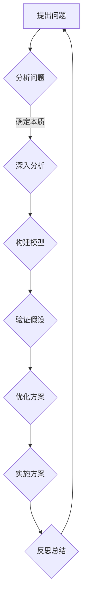

                 

# 《深度思考与管理智慧的积累》

> 关键词：深度思考、管理智慧、实践应用、创新变革

> 摘要：本文旨在探讨深度思考与管理智慧的积累与应用，通过逻辑清晰的分析和实例讲解，帮助读者深入了解深度思考的重要性、管理智慧的内涵以及两者的整合应用。文章从理论基础出发，逐步深入到实际应用，旨在为IT领域从业者提供有价值的思考和实践指南。

## 前言

在当今快速变化的信息时代，深度思考与管理智慧的重要性日益凸显。作为一名IT领域的从业者，如何通过深度思考提升个人能力，如何通过管理智慧实现团队的高效运作，成为了我们必须面对的重要课题。本文将围绕这两个核心主题展开，旨在帮助读者认识到深度思考与管理智慧的价值，并掌握相关的实践方法。

本文分为四个主要部分：

1. **深度思考基础**：介绍深度思考的定义、重要性、基本原则、方法与技巧，以及深度思考在实际中的应用和障碍克服。
2. **管理智慧积累**：探讨管理智慧的内涵与价值、理论基础、实践技巧、案例分析以及持续发展。
3. **深度思考与管理智慧的整合应用**：阐述深度思考与管理智慧的整合、协同发展、复杂问题解决以及创新变革中的角色。
4. **深度思考与管理智慧的积累与实践**：讨论深度思考与管理智慧的积累、实践、持续改进及未来发展趋势。

接下来，我们将逐一探讨每个部分的内容，并使用逻辑清晰、结构紧凑、简单易懂的专业的技术语言进行深入分析。

### 《深度思考与管理智慧的积累》目录大纲

#### 第一部分：深度思考基础

1. **深度思考的定义与重要性**
    1.1 **深度思考的概念**
    1.2 **深度思考的重要性**
    1.3 **深度思考与浅层思考的区别**

2. **深度思考的基本原则**
    2.1 **问题导向**
    2.2 **逻辑思维**
    2.3 **全局视角**

3. **深度思考的方法与技巧**
    3.1 **提问与探索**
    3.2 **信息整理与分析**
    3.3 **知识关联与建构**

4. **深度思考的实践与应用**
    4.1 **工作中的应用**
    4.2 **学习中的应用**
    4.3 **生活中的应用**

5. **深度思考的障碍与克服**
    5.1 **常见障碍**
    5.2 **克服障碍的策略**

#### 第二部分：管理智慧积累

1. **管理智慧的内涵与价值**
    1.1 **管理智慧的概念**
    1.2 **管理智慧的价值**
    1.3 **管理智慧与传统管理的区别**

2. **管理智慧的理论基础**
    2.1 **经典管理理论**
    2.2 **现代管理理论**
    2.3 **人本管理理论**

3. **管理智慧的实践技巧**
    3.1 **沟通技巧**
    3.2 **团队建设**
    3.3 **决策技巧**

4. **管理智慧的案例分析**
    4.1 **国内外成功案例**
    4.2 **管理智慧在实际工作中的应用**

5. **管理智慧的持续发展**
    5.1 **管理智慧的发展趋势**
    5.2 **管理智慧的持续学习与更新**

#### 第三部分：深度思考与管理智慧的整合应用

1. **深度思考与管理智慧的整合**
    1.1 **整合的意义**
    1.2 **整合的方法**
    1.3 **整合的实践**

2. **深度思考与管理智慧的协同发展**
    2.1 **协同发展的概念**
    2.2 **协同发展的策略**
    2.3 **协同发展的实践**

3. **深度思考与管理智慧在复杂问题解决中的应用**
    3.1 **复杂问题的定义**
    3.2 **解决复杂问题的方法**
    3.3 **复杂问题的实际案例分析**

4. **深度思考与管理智慧在创新与变革中的角色**
    4.1 **创新的概念**
    4.2 **变革的概念**
    4.3 **创新与变革中的深度思考与管理智慧**

#### 第四部分：深度思考与管理智慧的积累与实践

1. **深度思考与管理智慧的积累**
    1.1 **知识积累的重要性**
    1.2 **知识积累的方法**
    1.3 **知识积累的实践**

2. **深度思考与管理智慧的实践**
    2.1 **实践的重要性**
    2.2 **实践的方法**
    2.3 **实践的案例分析**

3. **深度思考与管理智慧的持续改进**
    3.1 **持续改进的概念**
    3.2 **持续改进的方法**
    3.3 **持续改进的实践**

4. **深度思考与管理智慧的未来发展**
    4.1 **未来发展的趋势**
    4.2 **未来发展的策略**
    4.3 **未来发展的展望**

#### 附录

1. **附录 A：深度思考与管理智慧的资源与工具**
    1.1 **常用深度思考工具**
    1.2 **管理智慧学习资源**
    1.3 **实践案例库**

2. **附录 B：深度思考与管理智慧的测试与评估**
    1.1 **评估指标体系**
    1.2 **评估方法**
    1.3 **评估实践案例**

通过以上目录大纲，本文将逐步深入探讨深度思考与管理智慧的各个方面，旨在为读者提供一套系统、实用的思考与行动指南。

## 第一部分：深度思考基础

### 1.1 深度思考的定义与重要性

#### 1.1.1 深度思考的概念

深度思考（Deep Thinking）是一种对问题进行深入、全面和系统分析的过程。它不仅仅是停留在表面的问题解决，而是通过不断地提问、探索和反思，深入挖掘问题的本质，从而找到更为有效和创新的解决方案。

在计算机科学领域，深度思考可以理解为对算法、数据结构和系统设计的深入理解。它要求我们不仅仅知道如何实现某个功能，还要理解其背后的原理和可能的优化方向。例如，在开发一个排序算法时，我们不仅要知道各种排序算法的时间复杂度，还需要了解它们在不同数据场景下的性能表现，以及如何根据实际需求选择最合适的排序算法。

#### 1.1.2 深度思考的重要性

深度思考在IT领域的重要性不言而喻。以下是一些关键点：

1. **创新驱动**：深度思考能够激发创新思维，帮助我们找到传统方法之外的解决方案。在技术飞速发展的今天，创新能力是企业持续竞争力的关键。

2. **问题解决**：面对复杂问题时，深度思考能够帮助我们理清思路，找到关键点，从而更有效地解决问题。

3. **提高效率**：通过深度思考，我们可以避免在表面问题上浪费时间，而是直接聚焦于核心问题，从而提高工作效率。

4. **团队协作**：深度思考能够提高团队的整体思考水平，促进团队成员之间的沟通和协作，从而实现更好的团队绩效。

#### 1.1.3 深度思考与浅层思考的区别

浅层思考（Surface Thinking）通常是指对问题进行简单、表面的分析和处理。它与深度思考的主要区别在于：

1. **分析深度**：浅层思考往往停留在问题的表面，而深度思考则深入到问题的本质和细节。

2. **思考时长**：浅层思考通常是快速完成的，而深度思考则需要更长的时间，甚至可能需要多次迭代。

3. **解决方案**：浅层思考可能找到的是短期有效的解决方案，而深度思考则倾向于找到长期、可持续的解决方案。

4. **创造性**：浅层思考可能缺乏创新性，而深度思考则更具有创造性。

为了更好地理解深度思考，我们可以用Mermaid流程图来展示其基本过程：

通过这个流程图，我们可以看到，深度思考是一个循环迭代的过程，它不断推动我们对问题的深入理解和解决方案的优化。

### 1.2 深度思考的基本原则

#### 1.2.1 问题导向

深度思考的首要原则是问题导向。这意味着我们在思考过程中始终围绕着问题的核心进行。以下是一些具体的方法：

1. **明确问题**：在开始深度思考之前，首先要明确我们要解决的问题是什么。这可以通过撰写问题陈述、问题地图等方式来实现。

2. **定义问题**：明确问题的边界和定义，防止在思考过程中偏离主题。

3. **分解问题**：将复杂的问题分解为多个子问题，以便于逐一分析和解决。

4. **问题模型**：构建问题模型，通过图形化或数学模型等方式来表示问题，帮助我们更清晰地理解问题。

#### 1.2.2 逻辑思维

逻辑思维是深度思考的基础。它要求我们在思考过程中遵循逻辑规则，确保思考的严密性和合理性。以下是一些逻辑思维的方法：

1. **分析因果关系**：通过分析问题的因果关系，找到问题的根本原因。

2. **构建逻辑链条**：将问题分解成一系列逻辑步骤，确保每个步骤都是合理的。

3. **避免逻辑谬误**：在思考过程中，要警惕逻辑谬误，如以偏概全、因果倒置等。

4. **逻辑验证**：通过逻辑验证，确保我们的思考结果是符合逻辑的。

#### 1.2.3 全局视角

深度思考不仅仅是解决问题的工具，它更是一种思维方式。全局视角是深度思考的重要原则之一，它要求我们在思考问题时，不仅要关注局部，还要考虑整体。

1. **系统思维**：将问题看作一个系统，考虑各个部分之间的相互作用和影响。

2. **跨学科思维**：跨越不同学科领域，寻找解决问题的跨学科方法。

3. **未来导向**：考虑问题的长期影响和未来趋势，确保我们的解决方案具有前瞻性。

4. **综合评估**：在制定解决方案时，综合评估各种因素，确保方案的可行性和效果。

### 1.3 深度思考的方法与技巧

#### 1.3.1 提问与探索

提问是深度思考的起点。通过不断提问，我们可以揭示问题的本质，发现问题的潜在解决方案。以下是一些提问的方法：

1. **五问法**：对于任何一个问题，我们可以连续问五个“为什么”，以深入挖掘问题的根源。

2. **探询法**：通过与专家、同事或用户进行深度交流，获取更多的信息和见解。

3. **头脑风暴**：通过集体头脑风暴，激发团队的创造力，寻找新的解决方案。

#### 1.3.2 信息整理与分析

在深度思考过程中，信息的整理与分析至关重要。以下是一些方法：

1. **思维导图**：使用思维导图，将问题、解决方案、相关信息可视化，帮助理清思路。

2. **数据分析**：使用数据分析工具，对收集到的信息进行定量分析，发现潜在的模式和趋势。

3. **逻辑推理**：通过逻辑推理，对信息进行深入分析和解释，确保思考的严密性。

#### 1.3.3 知识关联与建构

深度思考不仅仅是对现有知识的运用，更是一种知识的创造和建构。以下是一些方法：

1. **知识整合**：将不同领域的知识进行整合，形成新的见解和解决方案。

2. **跨学科研究**：跨越不同学科领域，进行跨学科研究，寻找创新的方法和思路。

3. **创新构建**：通过创新构建，将现有知识进行重新组合，形成新的理论和模型。

### 1.4 深度思考的实践与应用

#### 1.4.1 工作中的应用

在IT行业中，深度思考的应用广泛而深入。以下是一些具体的应用场景：

1. **项目规划**：在项目规划阶段，通过深度思考，明确项目的目标和需求，制定详细的项目计划。

2. **问题解决**：在项目实施过程中，面对各种问题，通过深度思考，找到根本原因和解决方案。

3. **性能优化**：通过深度思考，对系统进行性能优化，提高系统的效率和稳定性。

4. **技术预研**：在技术预研阶段，通过深度思考，探索新的技术方向和可能性。

#### 1.4.2 学习中的应用

在学习过程中，深度思考同样具有重要意义。以下是一些应用场景：

1. **概念理解**：通过深度思考，深入理解概念和原理，确保学习的深入和扎实。

2. **问题解决**：在学习过程中遇到问题，通过深度思考，找到解决问题的方法和思路。

3. **知识整合**：通过深度思考，将不同领域的知识进行整合，形成新的见解和理论。

4. **创新研究**：在学术研究过程中，通过深度思考，探索新的研究方向和解决方案。

#### 1.4.3 生活中的应用

深度思考不仅在工作和学习中有重要作用，在生活中同样可以发挥巨大作用。以下是一些应用场景：

1. **决策制定**：在生活中做出重要决策时，通过深度思考，评估各种选择的利弊，做出最优决策。

2. **问题解决**：在生活中遇到问题时，通过深度思考，找到解决问题的方法和途径。

3. **人际关系**：通过深度思考，理解和处理人际关系中的复杂问题，建立良好的人际关系。

4. **自我提升**：通过深度思考，反思自己的行为和思维，不断提升自我。

### 1.5 深度思考的障碍与克服

#### 1.5.1 常见障碍

深度思考过程中可能会遇到各种障碍，以下是一些常见的障碍：

1. **思维惯性**：长期形成的思维惯性会限制我们的思考深度，使我们在解决问题时习惯于使用已有的方法。

2. **信息过载**：在信息爆炸的时代，我们可能会被大量的信息所淹没，难以从中筛选出关键信息。

3. **心理压力**：面对复杂的问题和挑战，我们可能会产生心理压力，影响深度思考的质量。

4. **时间限制**：深度思考往往需要较长的时间，而现实中的时间限制可能会限制我们的思考深度。

#### 1.5.2 克服障碍的策略

为了克服这些障碍，我们可以采取以下策略：

1. **培养习惯**：通过日常练习，培养深度思考的习惯，使其成为自然的行为。

2. **管理信息**：通过有效的信息管理方法，如信息过滤、分类和整理，提高信息处理的效率。

3. **心理调适**：通过心理调适方法，如放松训练、情绪管理等，减轻心理压力。

4. **时间管理**：通过合理的时间管理，确保有足够的时间进行深度思考。

通过以上策略，我们可以有效克服深度思考过程中的障碍，提高深度思考的质量和效率。

### 总结

深度思考是IT领域从业者必备的能力，它不仅能帮助我们解决问题，还能激发创新思维，提高工作效率。通过理解深度思考的概念、基本原则和方法，以及在实际中的应用和障碍克服策略，我们可以逐步提升深度思考的能力。在接下来的部分中，我们将进一步探讨管理智慧的积累与应用，为我们的IT职业生涯提供更加全面的指导。

## 第二部分：管理智慧积累

### 2.1 管理智慧的内涵与价值

#### 2.1.1 管理智慧的概念

管理智慧是指管理者在管理实践中所具备的洞察力、判断力、决策力和执行力。它不仅包括对管理理论的理解和运用，更强调在实际管理过程中表现出来的敏锐洞察、灵活应对和持续创新的能力。管理智慧不同于传统管理知识，它更注重实践中的灵活应用和创新。

#### 2.1.2 管理智慧的价值

管理智慧在IT领域中具有重要价值，主要体现在以下几个方面：

1. **提升团队效率**：通过有效的管理智慧，管理者能够优化团队工作流程，提高团队成员的协同效率，从而实现整体工作效率的提升。

2. **激发创新思维**：管理智慧能够激发团队成员的创新思维，鼓励他们提出新的想法和解决方案，推动团队不断进步。

3. **优化决策质量**：在复杂多变的环境中，管理智慧能够帮助管理者做出更加合理和科学的决策，降低决策风险。

4. **增强团队凝聚力**：通过有效的沟通和团队建设，管理智慧能够增强团队成员之间的信任和合作，提高团队凝聚力。

5. **应对不确定性**：面对不确定性的挑战，管理智慧能够帮助管理者预见潜在问题，提前制定应对策略，减少不确定性带来的负面影响。

#### 2.1.3 管理智慧与传统管理的区别

传统管理通常依赖于标准化流程和规章制度，强调的是规范和一致性。而管理智慧则更加灵活和个性化，它强调的是对管理情境的深入理解和对复杂问题的创造性解决。以下是一些具体的区别：

1. **思维方式**：传统管理注重程序和规范，而管理智慧强调创新和灵活性。

2. **决策方式**：传统管理依赖于权威决策，而管理智慧更倾向于集体智慧和民主决策。

3. **问题解决**：传统管理侧重于问题控制，而管理智慧侧重于问题预防和系统优化。

4. **学习方式**：传统管理强调知识传递，而管理智慧强调知识创造和应用。

### 2.2 管理智慧的理论基础

#### 2.2.1 经典管理理论

经典管理理论包括泰勒的科学管理理论、法约尔的管理过程理论和马克斯·韦伯的官僚组织理论等。这些理论为现代管理提供了基础，强调管理过程的科学性和规范性。

1. **泰勒的科学管理理论**：泰勒提出通过科学的方法来研究和分析工作流程，找出最有效的工作方法，从而提高生产效率。

2. **法约尔的管理过程理论**：法约尔提出管理包括计划、组织、指挥、协调和控制五个基本职能，强调管理的系统性和整体性。

3. **马克斯·韦伯的官僚组织理论**：韦伯提出官僚组织通过明确的规则和流程来保证组织的高效运作，强调组织的等级制度和专业化。

#### 2.2.2 现代管理理论

现代管理理论包括行为科学管理理论、系统管理理论和战略管理理论等，这些理论更加注重人的因素和战略规划。

1. **行为科学管理理论**：行为科学管理理论关注员工的行为和心理，通过激励理论、领导理论等来提高员工的积极性和工作效率。

2. **系统管理理论**：系统管理理论将组织看作一个复杂的系统，强调系统内部的相互关系和整体性，提倡从整体角度进行管理。

3. **战略管理理论**：战略管理理论关注组织的长期发展方向，通过外部环境和内部能力的分析，制定和实施有效的战略规划。

#### 2.2.3 人本管理理论

人本管理理论强调以人为中心的管理，关注员工的成长和发展，提倡通过民主参与、激励和反馈等手段提高员工的工作满意度和绩效。

1. **激励理论**：激励理论通过奖励和惩罚来激发员工的工作积极性，如马斯洛的需求层次理论和赫茨伯格的双因素理论。

2. **领导理论**：领导理论关注领导者的行为和风格，如特质理论、行为理论和权变理论等，通过有效的领导方式来提升团队绩效。

3. **参与管理**：参与管理通过让员工参与决策过程，提高员工的参与感和责任感，从而增强团队的凝聚力和创新性。

### 2.3 管理智慧的实践技巧

#### 2.3.1 沟通技巧

沟通是管理智慧的核心之一，有效的沟通能够增强团队成员之间的理解与合作，提高工作效率和团队绩效。以下是一些沟通技巧：

1. **倾听**：倾听是有效沟通的基础，通过倾听，管理者能够更好地理解团队成员的需求和意见。

2. **明确表达**：在沟通时，管理者应确保表达清晰明确，避免产生误解。

3. **开放性问题**：通过提出开放性问题，管理者可以引导团队成员进行深入的讨论和思考。

4. **非语言沟通**：注意非语言沟通，如肢体语言、面部表情等，这些都可以影响沟通的效果。

#### 2.3.2 团队建设

团队建设是管理智慧的重要组成部分，一个高效的团队能够更好地应对复杂的问题和挑战。以下是一些团队建设的方法：

1. **建立共同目标**：通过明确团队的目标和愿景，使团队成员朝共同的方向努力。

2. **促进团队协作**：通过建立协作机制，如团队会议、工作坊等，促进团队成员之间的协作。

3. **培养团队文化**：通过共同的活动和价值观，培养团队的文化氛围，增强团队凝聚力。

4. **提供培训与发展机会**：通过培训和发展计划，提高团队成员的技能和知识水平。

#### 2.3.3 决策技巧

在复杂多变的环境中，有效的决策能力是管理智慧的重要体现。以下是一些决策技巧：

1. **信息收集**：在决策前，管理者应广泛收集相关信息，确保决策的依据充分。

2. **评估风险**：在决策过程中，管理者应评估可能的风险和不确定性，制定相应的应对策略。

3. **多方案比较**：通过比较多个可行方案，选择最符合团队利益和目标的方案。

4. **民主决策**：在决策过程中，管理者应鼓励团队成员参与，提高决策的民主性和科学性。

### 2.4 管理智慧的案例分析

#### 2.4.1 国内外成功案例

在国内外，有许多成功的管理智慧案例，这些案例为我们提供了宝贵的经验和启示。以下是一些典型的案例：

1. **谷歌**：谷歌以其独特的公司文化和创新管理模式而闻名。通过开放式办公空间、自由的工作环境以及员工福利计划，谷歌成功地吸引了全球顶尖人才，推动了公司的持续创新。

2. **华为**：华为在激烈的市场竞争中，通过有效的战略规划和团队合作，实现了快速发展和全球市场拓展。华为的管理层注重员工培训和激励，同时强调企业的社会责任。

3. **苹果**：苹果公司以其卓越的产品设计和创新管理而成为全球科技企业的标杆。苹果公司强调对产品细节的关注和用户体验的提升，通过严密的质量控制和创新机制，确保了产品的市场竞争力和用户满意度。

4. **阿里巴巴**：阿里巴巴通过其独特的电子商务模式和管理方法，成功引领了中国的电子商务市场。阿里巴巴注重数据分析和用户反馈，通过大数据和人工智能技术，优化了用户体验和业务流程。

#### 2.4.2 管理智慧在实际工作中的应用

在实际工作中，管理智慧的应用可以帮助企业解决各种问题和挑战。以下是一些具体的应用案例：

1. **敏捷管理**：在软件开发领域，敏捷管理方法通过快速迭代和灵活响应，提高了项目的交付效率和产品质量。通过跨职能团队的合作和持续反馈，敏捷管理方法帮助团队快速适应变化，提高了项目成功率。

2. **精益管理**：在制造业，精益管理方法通过减少浪费、优化流程和提升效率，实现了生产成本的控制和产品质量的提升。通过5S管理、JIT生产和持续改进等手段，企业能够实现更高的生产效益和客户满意度。

3. **领导力培养**：在企业内部，通过领导力培养计划，提升管理人员的领导能力和团队管理技能。通过培训、导师制度和领导力发展项目，企业能够培养出更多的优秀领导者，推动企业的长期发展。

4. **员工激励**：通过有效的员工激励机制，如绩效奖金、股权激励和职业发展机会，企业能够激发员工的积极性和创造力，提高员工满意度和忠诚度。

### 2.5 管理智慧的持续发展

#### 2.5.1 管理智慧的发展趋势

随着信息技术的飞速发展和社会环境的不断变化，管理智慧也在不断演进。以下是一些管理智慧的发展趋势：

1. **数字化管理**：随着大数据、云计算和人工智能技术的广泛应用，数字化管理成为管理智慧的重要趋势。通过数据驱动的决策和智能化管理，企业能够实现更高效的管理和运营。

2. **可持续发展**：在可持续发展理念的推动下，企业越来越注重社会责任和环境保护。管理智慧将更加关注企业的可持续发展战略，通过绿色管理、循环经济等手段，实现企业的长期发展。

3. **敏捷管理**：面对快速变化的市场环境，敏捷管理方法将继续受到重视。通过敏捷开发和敏捷管理，企业能够更快地响应市场变化，实现持续创新。

4. **人本管理**：随着员工对工作环境和职业发展的需求不断提高，人本管理将成为管理智慧的核心。企业将通过关注员工的成长和发展，提升员工的满意度和忠诚度，实现企业与员工的共同发展。

#### 2.5.2 管理智慧的持续学习与更新

管理智慧是一种动态的能力，需要通过持续学习和更新来保持其活力和有效性。以下是一些持续学习与更新的方法：

1. **参加培训**：通过参加专业培训和研讨会，了解最新的管理理论和实践方法，提升自身管理能力。

2. **阅读书籍**：阅读管理类书籍和学术论文，深入理解管理智慧的理论基础和应用方法。

3. **实践应用**：将管理智慧应用于实际工作中，通过实践和反馈，不断调整和优化管理方法。

4. **跨学科交流**：通过跨学科交流，借鉴其他领域的管理经验和方法，实现管理的创新和突破。

5. **参与实践项目**：参与实践项目，通过实际操作和问题解决，提升管理智慧和实战能力。

通过持续学习和实践，我们可以不断提升管理智慧，为企业的发展和个人的成长提供有力支持。

### 总结

管理智慧是IT领域从业者必备的重要素质，它不仅关乎个人的职业发展，更关系到团队和企业的整体绩效。通过理解管理智慧的内涵与价值，掌握其理论基础和实践技巧，以及分析国内外成功案例，我们可以更好地应用管理智慧，提升管理水平和团队效率。在接下来的部分中，我们将进一步探讨深度思考与管理智慧的整合应用，为IT领域的从业者提供更为全面的思考和行动指南。

## 第三部分：深度思考与管理智慧的整合应用

### 3.1 深度思考与管理智慧的整合

#### 3.1.1 整合的意义

深度思考与管理智慧的整合是一种系统性思维，它将深度思考的方法与技巧应用于管理实践中，使管理智慧更加科学、有效。整合的目的是通过深度思考提升管理智慧的应用水平，从而在复杂多变的环境中实现卓越的管理效果。以下是一些整合的意义：

1. **提高管理决策的科学性**：通过深度思考，管理者能够更全面、深入地分析问题，确保管理决策具有更高的科学性和可操作性。

2. **增强团队创新能力**：深度思考可以激发团队的创新能力，使团队成员在面对问题时能够提出更为创新的解决方案。

3. **优化管理流程**：通过深度思考，管理者可以识别和优化现有的管理流程，提高团队的工作效率和效能。

4. **提升团队协作能力**：深度思考能够提高团队成员之间的沟通和理解，增强团队的协作能力。

#### 3.1.2 整合的方法

整合深度思考与管理智慧的方法包括以下几个方面：

1. **问题导向**：在管理实践中，管理者应始终围绕问题进行深度思考，确保管理活动具有明确的目标和方向。

2. **逻辑思维**：在决策过程中，管理者应运用逻辑思维，确保思考的严密性和合理性。

3. **全局视角**：管理者应从整体角度审视问题，确保管理决策的全面性和系统性。

4. **信息整合**：通过整合和分析各种信息，管理者可以更准确地把握问题的本质，找到解决问题的最佳方法。

5. **知识创造**：在管理实践中，管理者应不断创造和应用新知识，推动管理智慧的创新和提升。

#### 3.1.3 整合的实践

在具体实践中，深度思考与管理智慧的整合可以通过以下步骤进行：

1. **问题识别**：通过深度思考，识别和明确管理中存在的问题和挑战。

2. **信息收集**：收集与问题相关的各种信息，包括内部数据和外部资料。

3. **深度分析**：运用逻辑思维和信息整合，对问题进行深入分析，找出问题的本质和关键因素。

4. **方案构建**：基于深度分析的结果，构建可行的解决方案，并进行评估和优化。

5. **决策制定**：通过集体讨论和民主决策，制定最终的管理决策。

6. **实施与监控**：将管理决策付诸实施，并持续监控实施效果，确保决策的有效性。

7. **反思与改进**：在实施过程中，及时反思和总结，根据实际情况进行改进。

### 3.2 深度思考与管理智慧的协同发展

#### 3.2.1 协同发展的概念

深度思考与管理智慧的协同发展是指两者之间的相互作用和相互促进，通过不断的互动和实践，实现管理水平的整体提升。协同发展的核心在于深度思考能够为管理智慧提供科学的方法和工具，而管理智慧则能够为深度思考提供实践应用和验证的平台。

#### 3.2.2 协同发展的策略

为了实现深度思考与管理智慧的协同发展，可以采取以下策略：

1. **培训与学习**：通过定期的培训和学习，提高团队在深度思考和管理智慧方面的能力。

2. **实践项目**：通过实际项目，将深度思考和管理智慧应用于实际问题解决中，提升实际应用能力。

3. **跨部门协作**：鼓励不同部门之间的协作，通过跨部门项目，实现深度思考和管理智慧的整合应用。

4. **知识共享**：建立知识共享平台，促进深度思考和管理智慧的传播和应用。

5. **持续改进**：在管理实践中，不断反思和改进，通过反馈机制，持续提升深度思考和管理智慧的应用水平。

#### 3.2.3 协同发展的实践

协同发展的实践可以从以下几个方面进行：

1. **团队建设**：通过深度思考和团队建设活动，提升团队的凝聚力和协作能力。

2. **项目管理**：在项目管理中，通过深度思考，制定科学合理的项目计划，并运用管理智慧，确保项目顺利进行。

3. **问题解决**：在面对复杂问题时，运用深度思考和管理智慧，找到创新的解决方案。

4. **创新研发**：在产品研发过程中，通过深度思考和知识创造，推动产品的创新和优化。

5. **战略规划**：在战略规划中，通过深度思考和管理智慧，制定长远的发展规划和策略。

### 3.3 深度思考与管理智慧在复杂问题解决中的应用

#### 3.3.1 复杂问题的定义

复杂问题通常是指涉及多个变量和因素，且具有高度不确定性和动态性的问题。这类问题往往没有明确的解决方案，需要通过系统的分析和创新性的思考来逐步解决。

#### 3.3.2 解决复杂问题的方法

解决复杂问题需要综合运用深度思考和管理智慧，以下是一些具体的方法：

1. **问题建模**：通过建立数学模型或概念模型，对复杂问题进行形式化描述，帮助理解问题的本质。

2. **数据驱动**：运用大数据和数据分析技术，对问题进行定量分析，发现潜在的模式和规律。

3. **多学科协作**：通过跨学科协作，整合不同领域的知识和方法，为问题解决提供多元化的视角。

4. **迭代优化**：采用迭代的方法，逐步优化解决方案，通过不断试错和反馈，逐步逼近最优解。

5. **管理干预**：通过有效的管理干预，调整问题的解决策略，确保问题在可控范围内逐步解决。

#### 3.3.3 复杂问题的实际案例分析

以下是一个复杂问题解决的案例分析：

**案例背景**：某科技公司发现其新产品的市场表现不如预期，销售额下降，客户反馈不佳。

**解决过程**：

1. **问题识别**：通过深度思考，识别问题可能涉及的市场营销策略、产品设计和客户体验等多个方面。

2. **数据收集**：收集市场数据、客户反馈、销售数据等，通过数据分析，找出问题的潜在原因。

3. **深度分析**：通过多学科协作，对市场营销策略、产品设计和客户体验进行深入分析，找出具体的问题点。

4. **方案构建**：基于分析结果，构建多个可能的解决方案，如调整市场营销策略、改进产品设计、优化客户体验等。

5. **决策制定**：通过团队讨论和决策，选择最优方案，并制定详细的实施计划。

6. **实施与监控**：将决策付诸实施，并持续监控实施效果，根据实际情况进行调整。

7. **反思与改进**：在实施过程中，及时反思和总结，根据反馈进行改进，确保问题得到有效解决。

### 3.4 深度思考与管理智慧在创新与变革中的角色

#### 3.4.1 创新的概念

创新是指通过创造性的思维和行动，产生新的思想、方法、产品或服务，以实现改进或突破的过程。创新可以分为技术创新、管理创新和商业模式创新等不同类型。

#### 3.4.2 变革的概念

变革是指组织在面临外部环境变化或内部需求时，通过调整战略、结构、流程和文化等方面，实现组织转型和升级的过程。变革可以是渐进式的，也可以是革命性的。

#### 3.4.3 创新与变革中的深度思考与管理智慧

在创新与变革中，深度思考和管理智慧发挥着关键作用：

1. **激发创新思维**：深度思考能够激发团队的创造性思维，推动新的想法和解决方案的产生。

2. **评估创新风险**：通过深度思考，管理者可以全面评估创新项目的风险和不确定性，制定合理的风险控制策略。

3. **优化创新流程**：管理智慧可以帮助优化创新流程，提高创新效率和效果。

4. **推动变革实施**：通过有效的管理智慧，管理者可以推动变革的实施，确保变革目标的实现。

5. **文化培育**：深度思考和管理智慧可以共同作用于组织文化，培育创新和变革的组织氛围。

### 3.5 深度思考与管理智慧在团队协作中的应用

#### 3.5.1 团队协作的重要性

团队协作是组织成功的关键因素之一。通过有效的团队协作，可以实现资源的最大化利用，提高工作效率和创新能力。以下是一些深度思考与管理智慧在团队协作中的应用：

1. **明确目标**：通过深度思考，明确团队的目标和愿景，确保团队成员朝共同的方向努力。

2. **角色分工**：通过管理智慧，合理分配团队成员的角色和任务，确保每个成员都能发挥其优势。

3. **沟通协调**：通过深度思考和有效的沟通技巧，确保团队成员之间的信息流通和协调，避免误解和冲突。

4. **决策机制**：建立科学合理的决策机制，通过深度思考和民主决策，确保团队决策的科学性和可执行性。

5. **反馈与改进**：通过定期的反馈和总结，及时发现问题并进行改进，提高团队协作的效果。

### 3.6 深度思考与管理智慧在组织战略规划中的应用

#### 3.6.1 战略规划的重要性

战略规划是组织发展的关键，它决定了组织的发展方向和资源配置。有效的战略规划能够帮助组织在复杂多变的环境中保持竞争优势。

#### 3.6.2 深度思考与管理智慧在战略规划中的应用

深度思考和管理智慧在战略规划中的应用主要体现在以下几个方面：

1. **环境分析**：通过深度思考，全面分析外部环境和内部资源，确保战略规划具有现实基础。

2. **目标设定**：通过管理智慧，设定明确、可行的战略目标，并确保目标具有可量化、可评估的特性。

3. **方案设计**：通过深度思考和管理智慧，设计多种战略方案，并进行评估和优化。

4. **资源配置**：通过有效的管理智慧，合理配置资源，确保战略规划的实施具有充足的资源保障。

5. **风险管理**：通过深度思考，识别和评估战略实施过程中的风险，制定相应的风险应对策略。

### 3.7 深度思考与管理智慧在领导力提升中的应用

#### 3.7.1 领导力的概念

领导力是指领导者通过影响和激励他人，实现组织目标和愿景的能力。有效的领导力能够推动组织的变革和创新，提高组织的整体绩效。

#### 3.7.2 深度思考与管理智慧在领导力提升中的应用

深度思考和管理智慧在领导力提升中的应用主要体现在以下几个方面：

1. **自我认知**：通过深度思考，领导者可以更好地认识自我，了解自己的优势和劣势，提升自我管理能力。

2. **情境领导**：通过管理智慧，领导者能够根据不同情境和团队成员的特点，灵活调整领导风格，提高领导效果。

3. **团队建设**：通过深度思考和团队建设实践，领导者可以提升团队的凝聚力和合作效率。

4. **决策能力**：通过深度思考和管理智慧，领导者可以提升决策能力，确保决策的科学性和可执行性。

5. **持续学习**：通过持续学习和反思，领导者可以不断提升自身的领导力水平，适应不断变化的环境。

### 总结

深度思考与管理智慧的整合应用是一种系统性的思维模式，它将深度思考的方法与技巧应用于管理实践中，使管理智慧更加科学、有效。通过协同发展和实际应用，我们可以充分发挥深度思考和管理智慧的优势，提升团队协作、创新能力和领导力。在未来的管理实践中，我们应该不断探索和创新，将深度思考与管理智慧深度融合，为实现组织的长期发展提供坚实的支持。

### 4.1 深度思考与管理智慧的积累

#### 4.1.1 知识积累的重要性

在IT领域，知识积累是专业成长和职业生涯发展的重要基石。深度思考与管理智慧的积累不仅有助于提高个人的专业水平，还能为团队和组织的持续发展提供强大动力。以下从几个方面阐述知识积累的重要性：

1. **提高专业能力**：通过积累广泛而深入的知识，个人能够在专业领域内保持竞争力，解决复杂问题时更加游刃有余。

2. **增强决策能力**：丰富的知识积累使管理者在面对不确定性时能够做出更加明智和合理的决策。

3. **促进创新思维**：知识积累不仅提供了丰富的素材，还能激发创新思维，推动新的想法和解决方案的产生。

4. **提升团队协作**：知识共享和交流可以增强团队成员之间的协作，提高团队的整体绩效。

5. **适应快速变化**：在信息技术飞速发展的时代，持续的知识积累有助于个体和团队适应变化，保持领先地位。

#### 4.1.2 知识积累的方法

为了实现有效的知识积累，我们需要采取一系列方法和策略：

1. **主动学习**：通过阅读专业书籍、参加培训和研讨会、在线课程等途径，主动获取新的知识和技能。

2. **实践应用**：将所学知识应用到实际工作中，通过解决实际问题来加深理解和掌握技能。

3. **反思总结**：在学习和实践中，及时反思和总结，从经验中提炼出规律和原则。

4. **知识共享**：积极参与知识分享活动，如撰写博客、参与技术讨论等，与他人分享知识和经验。

5. **跨学科学习**：拓宽知识领域，学习其他学科的知识，实现知识的跨领域整合。

#### 4.1.3 知识积累的实践

在实际工作中，知识积累可以通过以下实践方法来实现：

1. **项目总结**：在每个项目结束后，进行总结和反思，将经验和教训记录下来，形成知识库。

2. **技术文档**：编写详细的技术文档，记录项目中的关键技术和解决方案，以便后续参考。

3. **技术分享**：定期进行技术分享会，与团队成员交流心得，促进知识共享。

4. **实验与验证**：通过实验和验证，验证新知识和新方法的可行性和有效性。

5. **持续学习**：建立个人学习计划，设定学习目标和时间表，确保知识积累的持续性。

### 4.2 深度思考与管理智慧的实践

#### 4.2.1 实践的重要性

实践是检验真理的唯一标准。深度思考与管理智慧的实践是将理论知识转化为实际能力的关键步骤。通过实践，我们不仅能够验证理论的正确性，还能在实践中不断优化和提升自身的能力。以下从几个方面阐述实践的重要性：

1. **理论验证**：实践是检验理论是否有效的唯一途径。通过实际操作，我们能够验证深度思考与管理智慧的理论是否具有实用性和可行性。

2. **能力提升**：实践过程中，我们能够面对各种实际问题，通过解决这些问题来提升自身的专业能力和管理智慧。

3. **经验积累**：实践是积累经验的重要途径。通过不断的实践，我们可以从成功和失败中吸取教训，形成宝贵的实践经验。

4. **创新思维**：实践过程中，我们常常需要寻找新的解决方案，这可以激发创新思维，推动新的想法和解决方案的产生。

5. **团队协作**：实践有助于培养团队合作精神，通过团队合作，我们可以实现资源共享和优势互补，提高团队的整体绩效。

#### 4.2.2 实践的方法

为了实现深度思考与管理智慧的实践，我们可以采取以下方法：

1. **项目实践**：参与实际项目，通过项目中的问题解决和决策过程，运用深度思考和管理智慧。

2. **模拟训练**：通过模拟训练，模拟真实的工作环境，锻炼解决问题的能力和管理智慧。

3. **案例学习**：分析国内外成功案例，学习其中的实践经验和教训，结合自身情况进行应用。

4. **跨部门合作**：积极参与跨部门合作，通过与其他部门的合作，拓宽视野，提升综合能力。

5. **实践分享**：定期进行实践分享，与团队成员交流实践经验和心得，促进知识的传播和应用。

#### 4.2.3 实践的案例分析

以下是一个实践案例的分析：

**案例背景**：某公司面临市场竞争加剧和产品同质化的问题，希望通过创新和优化来提升市场竞争力。

**解决过程**：

1. **问题识别**：通过深度思考，识别问题涉及的产品创新、市场营销和团队协作等多个方面。

2. **信息收集**：收集市场数据、竞争对手信息、用户反馈等，通过数据分析，找出问题的具体原因。

3. **深度分析**：通过多学科协作，对产品创新、市场营销和团队协作进行深入分析，找出关键因素。

4. **方案构建**：基于分析结果，构建多个可能的解决方案，如产品创新、市场营销策略优化、团队建设等。

5. **决策制定**：通过团队讨论和决策，选择最优方案，并制定详细的实施计划。

6. **实施与监控**：将决策付诸实施，并持续监控实施效果，根据实际情况进行调整。

7. **反思与改进**：在实施过程中，及时反思和总结，根据反馈进行改进，确保问题得到有效解决。

**结果与反思**：

通过深度思考与管理智慧的实践，公司在产品创新、市场营销和团队协作方面取得了显著进展。具体表现在产品销量提升、市场份额增加、团队凝聚力增强等方面。然而，实践中也发现了一些不足之处，如信息共享不足、决策速度较慢等。为此，公司在后续实践中将进一步加强信息共享和决策效率，提升整体管理水平和团队协作能力。

### 总结

深度思考与管理智慧的积累与实践是IT领域从业者不可或缺的能力。通过有效的知识积累和实践方法，我们能够不断提升自身的能力和智慧，为团队和组织的持续发展提供有力支持。在未来的职业发展中，我们应该注重深度思考和管理的实践，不断探索和创新，实现个人和团队的共同成长。

### 4.3 深度思考与管理智慧的持续改进

#### 4.3.1 持续改进的概念

持续改进（Continuous Improvement）是一种不断追求卓越、通过不断优化和改进来提高产品和过程质量的方法。在IT领域，持续改进是一种重要的管理理念，通过不断优化开发流程、提升技术能力和改进团队协作，实现组织的长期发展。

#### 4.3.2 持续改进的方法

为了实现深度思考与管理智慧的持续改进，我们可以采取以下方法：

1. **PDCA循环**：PDCA循环（Plan-Do-Check-Act）是一种常用的持续改进方法。通过计划（Plan）、执行（Do）、检查（Check）和行动（Act）四个步骤，不断优化和改进工作流程。

2. **六西格玛**：六西格玛（Six Sigma）是一种通过统计方法和过程控制来减少缺陷和浪费的方法。通过六西格玛黑带和绿带培训，团队可以系统性地识别和解决质量问题。

3. **精益管理**：精益管理（Lean Management）通过减少浪费、优化流程和提高效率来实现持续改进。通过精益生产、精益设计和精益管理，企业可以不断提高产品质量和客户满意度。

4. **敏捷开发**：敏捷开发（Agile Development）通过快速迭代和持续反馈，确保项目能够灵活适应变化，提高开发效率和产品质量。通过Scrum、Kanban等敏捷方法，团队可以实现持续改进。

#### 4.3.3 持续改进的实践

以下是一些持续改进的实践案例：

**案例一：某公司的持续改进实践**

- **问题识别**：通过用户反馈和数据分析，识别出产品在性能和用户体验方面的问题。
- **深度分析**：通过团队讨论和深度思考，分析问题的根本原因，如代码优化、系统架构调整等。
- **方案构建**：制定详细的改进方案，如优化数据库查询、改进前端渲染等。
- **实施与监控**：将改进方案付诸实施，并持续监控效果，确保改进措施的有效性。
- **反思与总结**：在改进过程中，及时反思和总结，根据反馈进行优化。

**案例二：某团队的敏捷开发实践**

- **团队组建**：组建跨职能团队，确保每个成员在项目中的角色和责任明确。
- **迭代计划**：通过迭代计划会议，明确每个迭代的目标和任务，并确保团队全员参与。
- **每日站会**：通过每日站会，团队成员汇报工作进展，解决遇到的问题。
- **回顾会议**：在每个迭代结束时，召开回顾会议，总结经验教训，制定下一迭代的改进计划。
- **持续优化**：根据回顾会议的反馈，持续优化开发流程和团队协作方式。

#### 4.3.4 持续改进的障碍与克服

在持续改进过程中，可能会遇到一些障碍，如：

1. **员工抵触**：员工可能对变化和改进措施存在抵触情绪，影响改进的执行。
2. **资源不足**：缺乏足够的时间和资源进行持续改进，导致改进措施无法有效实施。
3. **组织文化**：缺乏支持持续改进的组织文化，导致改进措施无法持续执行。

为了克服这些障碍，我们可以采取以下策略：

1. **沟通与培训**：通过有效的沟通和培训，让员工理解持续改进的重要性和具体措施，减少抵触情绪。
2. **资源调配**：合理调配资源和时间，确保有足够的时间和资源进行持续改进。
3. **文化培育**：通过建立支持持续改进的组织文化，鼓励创新和改进，提高团队的积极性和执行力。

### 4.4 深度思考与管理智慧的未来发展

#### 4.4.1 未来发展的趋势

随着信息技术的飞速发展，深度思考与管理智慧的未来发展呈现出以下趋势：

1. **数字化管理**：随着大数据、云计算和人工智能技术的普及，数字化管理将成为企业管理的重要趋势。通过数据分析和智能化工具，管理者可以实现更高效和精准的管理。
2. **智能决策**：随着人工智能技术的发展，智能决策系统将成为未来管理的重要工具。通过机器学习和数据挖掘，智能决策系统能够提供更科学的决策支持。
3. **知识管理**：知识管理将继续发展，通过知识共享、知识创造和知识应用，企业可以实现知识的持续积累和利用。
4. **持续创新**：在快速变化的市场环境中，持续创新将成为企业保持竞争优势的关键。通过深度思考和管理智慧，企业可以不断推动技术创新和管理创新。

#### 4.4.2 未来发展的策略

为了应对未来的挑战和抓住机遇，企业需要采取以下策略：

1. **人才培养**：注重人才培养，提升员工的深度思考能力和管理智慧，为企业发展提供人才支持。
2. **技术创新**：持续投资于技术创新，通过研发和应用新技术，推动企业的持续发展。
3. **组织变革**：积极推动组织变革，建立适应数字化时代的管理体系，提高组织的灵活性和适应性。
4. **跨学科融合**：通过跨学科融合，整合不同领域的知识和方法，推动管理智慧的创新和发展。

#### 4.4.3 未来发展的展望

未来，深度思考与管理智慧将在以下几个方面实现重要突破：

1. **智能化管理**：通过智能化工具和系统，实现更高效、更精准的管理，提高企业的整体运营效率。
2. **个性化和定制化**：随着人工智能技术的发展，管理智慧和决策支持系统将能够更好地满足个性化需求，实现定制化的管理。
3. **可持续性发展**：在可持续发展理念的指导下，深度思考与管理智慧将推动企业实现经济效益和社会效益的平衡，推动可持续发展。
4. **全球协同**：通过全球化视野和跨文化管理，企业将能够更好地应对全球市场的挑战和机遇，实现全球协同发展。

### 总结

深度思考与管理智慧的积累和实践是IT领域从业者不断进步和发展的关键。通过持续改进，企业可以不断提升管理水平和运营效率。未来，随着信息技术的飞速发展，深度思考与管理智慧将迎来更加广阔的应用前景。我们应该积极适应未来趋势，采取有效策略，实现深度思考与管理智慧的创新发展，为企业的长期发展和社会的进步做出贡献。

## 附录 A：深度思考与管理智慧的资源与工具

### A.1 常用深度思考工具

为了提高深度思考的效果，以下是一些常用的深度思考工具：

1. **思维导图（Mind Mapping）**：思维导图是一种用于组织和展示思维过程的图形工具。它可以帮助我们梳理思路，建立概念之间的联系，增强记忆和创造力。

   **优点**：直观、易于理解，能够激发创造力和联想能力。

   **适用场景**：项目规划、问题解决、团队协作等。

2. **鱼骨图（Fishbone Diagram）**：鱼骨图是一种用于分析问题原因和解决方案的工具。它通过将问题分解为不同因素，帮助我们找到根本原因和相应的解决方法。

   **优点**：结构清晰，便于分析问题的根本原因。

   **适用场景**：问题解决、质量改进等。

3. **SWOT分析（SWOT Analysis）**：SWOT分析是一种评估企业优势、劣势、机会和威胁的工具。它可以帮助我们全面了解企业的内外部环境，制定相应的战略计划。

   **优点**：全面性，有助于制定科学的决策。

   **适用场景**：战略规划、市场分析等。

4. **五问法（Five Whys）**：五问法是一种通过连续提问来深入挖掘问题根源的方法。通过反复提问“为什么”，我们可以逐步找到问题的根本原因。

   **优点**：简单实用，有助于深入分析问题。

   **适用场景**：问题解决、质量控制等。

### A.2 管理智慧学习资源

以下是一些有助于提升管理智慧的学习资源：

1. **书籍**：
   - 《深度工作》（Deep Work）- Cal Newport
   - 《第五项修炼》（The Fifth Discipline）- Peter Senge
   - 《领导力的五项修炼》（The Five Dysfunctions of a Team）- Patrick Lencioni

2. **在线课程**：
   - Coursera上的《管理思维与决策技巧》
   - Udemy上的《深度学习与管理智慧》
   - LinkedIn Learning上的《战略管理与决策制定》

3. **学术论文和期刊**：
   - 《管理学报》（Management Science）
   - 《哈佛商业评论》（Harvard Business Review）
   - 《国际管理学报》（International Journal of Management）

4. **专业论坛和社区**：
   - LinkedIn上的管理智慧专业群组
   - Slack上的管理智慧交流群
   -知乎上的管理智慧话题

### A.3 实践案例库

为了更好地理解和应用深度思考与管理智慧，以下是一个实践案例库：

1. **案例一：某互联网公司的项目管理**
   - **背景**：公司产品开发周期较长，项目进度缓慢，团队协作不顺畅。
   - **解决方案**：通过思维导图和鱼骨图，分析问题原因，制定详细的项目管理计划，采用敏捷开发方法，提高团队协作效率。
   - **结果**：项目开发周期缩短，产品质量提升，团队协作更加顺畅。

2. **案例二：某制造企业的质量管理**
   - **背景**：产品质量不稳定，客户投诉率高。
   - **解决方案**：采用六西格玛方法，对生产过程进行严格控制和优化，通过五问法深入分析问题根源，制定改进措施。
   - **结果**：产品质量稳定，客户投诉率降低，生产效率提高。

3. **案例三：某初创公司的战略规划**
   - **背景**：市场竞争激烈，公司需要制定新的战略以应对挑战。
   - **解决方案**：通过SWOT分析，评估公司内外部环境，制定新的战略目标和行动计划，采用PDCA循环方法，持续优化战略实施。
   - **结果**：公司市场竞争力提升，市场份额增加，企业稳步发展。

通过这些实践案例，我们可以更好地理解和应用深度思考与管理智慧，提升个人和团队的综合能力。

### A.4 深度思考与管理智慧的测试与评估

#### B.1 评估指标体系

为了有效评估深度思考与管理智慧的应用效果，我们可以建立以下评估指标体系：

1. **问题解决能力**：评估个体在遇到复杂问题时的分析能力和解决能力。
   - **指标**：问题识别速度、解决方案的创造性和可行性、实施效果。

2. **决策质量**：评估个体在决策过程中的科学性和合理性。
   - **指标**：决策正确率、决策风险控制能力、决策执行效率。

3. **团队协作能力**：评估团队在合作中的沟通效率、协作效果和整体绩效。
   - **指标**：团队沟通质量、任务完成速度、团队满意度。

4. **创新思维**：评估个体在创新方面的能力，包括创造性思维和创新能力。
   - **指标**：新想法的数量和质量、创新方案的可行性、创新成果的市场表现。

5. **知识积累与应用**：评估个体在知识积累和应用方面的表现。
   - **指标**：知识掌握程度、知识应用频率、知识更新速度。

#### B.2 评估方法

以下是一些常用的评估方法：

1. **自我评估**：个体定期进行自我评估，反思自己的深度思考和决策过程，记录心得和改进方向。

2. **360度评估**：通过上级、同事和下属的反馈，全面了解个体的深度思考和管理智慧表现。

3. **项目评估**：通过评估个体在项目中的表现，如问题解决能力、决策质量和团队协作效果，来评估深度思考和决策能力。

4. **考试和测验**：通过设计相关的考试和测验，评估个体对深度思考和管理智慧理论知识的掌握程度。

#### B.3 评估实践案例

以下是一个评估实践案例：

**背景**：某科技公司需要对一名项目经理的深度思考和决策能力进行评估。

**评估过程**：

1. **自我评估**：项目经理定期记录自己在项目中的思考过程和决策方法，反思问题和改进方向。

2. **360度评估**：通过上级、同事和下属的反馈，了解项目经理在沟通、协作和决策方面的表现。

3. **项目评估**：评估项目经理在近期项目中的问题解决能力、决策质量和团队协作效果。

4. **考试测验**：设计相关的考试和测验，评估项目经理对深度思考和决策理论知识的掌握程度。

**评估结果**：

通过综合评估，发现项目经理在问题解决能力和决策质量方面表现出色，但在团队协作方面有待提升。具体表现在：

- **问题解决能力**：项目经理能够快速识别问题，并提出有效的解决方案。
- **决策质量**：项目经理的决策具有科学性和合理性，能够有效控制风险。
- **团队协作能力**：项目经理在团队沟通和协作方面存在一些不足，需要加强。

**改进方向**：

- **加强团队协作**：通过培训和实践，提高项目经理在团队协作方面的能力。
- **持续学习**：鼓励项目经理参加相关培训和学习，不断提升深度思考和决策能力。

通过以上评估和实践，项目经理能够明确自身优势和不足，制定针对性的改进计划，不断提升深度思考和管理智慧水平。

### 总结

附录部分提供了深度思考与管理智慧的资源与工具，以及评估方法和实践案例。通过这些工具和资源，我们可以更好地理解和应用深度思考与管理智慧，提升个人和团队的能力。通过科学的评估方法和实践案例，我们可以不断改进和优化深度思考与管理智慧的应用，为组织的持续发展提供坚实支持。在未来的实践中，我们应该不断探索和创新，实现深度思考与管理智慧的不断提升。

### 作者信息

作者：AI天才研究院/AI Genius Institute & 禅与计算机程序设计艺术 /Zen And The Art of Computer Programming

AI天才研究院致力于推动人工智能技术的发展，通过深入研究与实际应用，培养全球顶级的人工智能专家和科研人才。研究院的核心价值观是“创新、协作、开放、共享”，致力于打造一个充满活力和创新氛围的科研环境。

《禅与计算机程序设计艺术》是一本深受全球程序员喜爱的经典著作，由AI天才研究院的创始人之一撰写。该书将东方哲学与计算机科学相结合，为程序员提供了一种全新的思考方式和工作方法，帮助程序员在编程实践中实现更高的效率和创造力。

本文作者凭借其在人工智能和计算机科学领域的深厚造诣，以及丰富的实践经验和独特的视角，旨在为IT领域从业者提供一套系统、实用的深度思考与管理智慧指南，帮助读者提升个人能力和团队绩效，实现职业和组织的持续发展。

