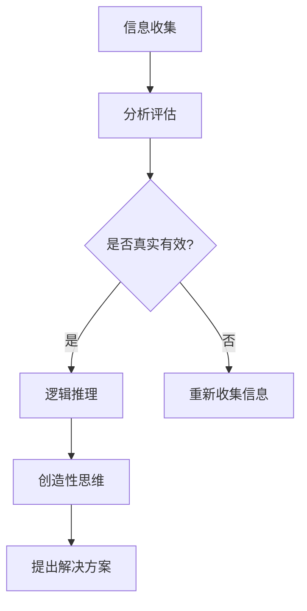
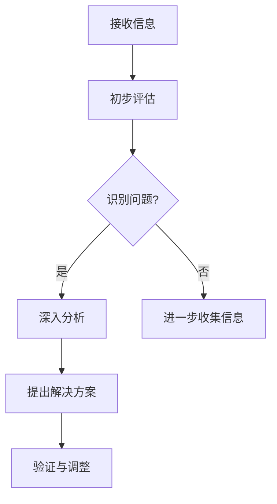
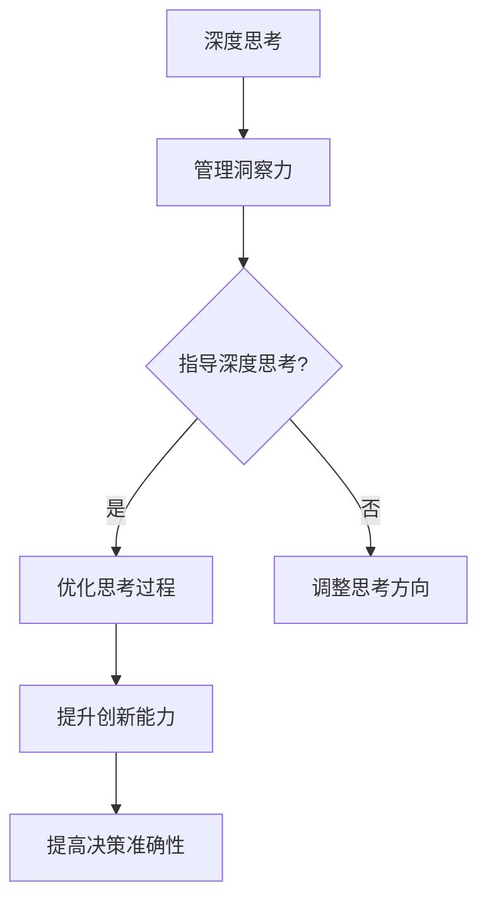
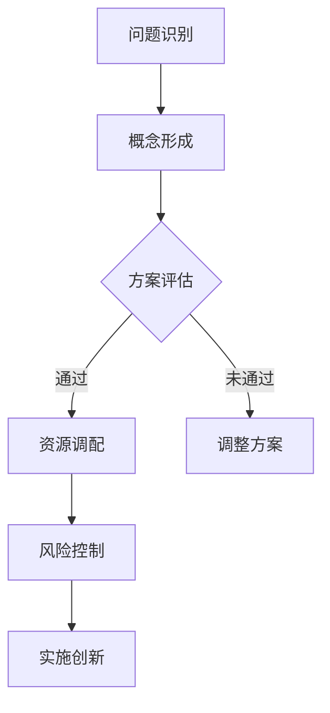
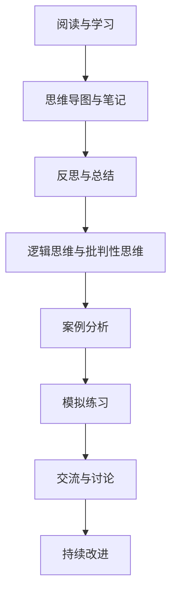
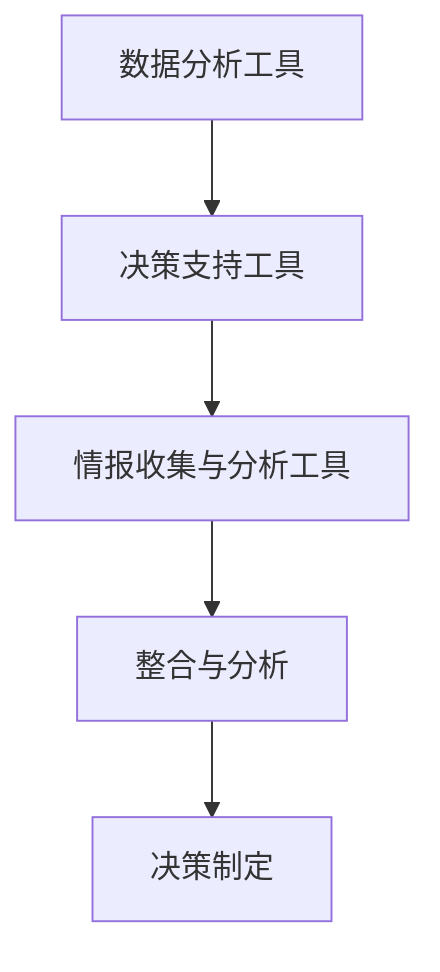

                 

# 深度思考与管理洞察力的关系

> 关键词：深度思考，管理洞察力，认知过程，决策能力，创新思维，实践案例

> 摘要：本文深入探讨了深度思考与管理洞察力的关系。通过定义深度思考和管理洞察力的基本原理，分析它们在复杂问题解决和决策过程中的作用，探讨了深度思考与管理洞察力的互动关系。同时，本文通过实践案例和案例分析，展示了深度思考与管理洞察力在实际应用中的效果。最后，本文提出了提升深度思考与管理洞察力的方法，为个人和企业提供参考。

----------------------------------------------------------------

## 第一部分：深度思考与管理洞察力的关系概述

### 第1章： 引言

#### 1.1 书籍背景与目的

在当今快速发展的信息时代，深度思考和良好的管理洞察力已成为企业成功和个人发展的关键要素。随着市场竞争的加剧和复杂性的增加，仅仅依靠直觉和经验已经无法应对层出不穷的挑战。因此，本文旨在探讨深度思考与管理洞察力的关系，分析其在认知过程和决策能力中的作用，以及如何在实践中提升这两种能力。

#### 1.2 深度思考的定义与特征

深度思考是一种高级认知过程，涉及对信息的深入分析和理解，以及对内在逻辑和关系的洞察。它具有复杂性、批判性、系统性和创造性等特征。深度思考不仅要求个体具备较高的认知能力，还需要在信息收集、分析评估、逻辑推理和创造性思维等方面进行综合运用。

#### 1.3 管理洞察力的定义与类型

管理洞察力是指管理者在复杂多变的环境中，通过深度思考和对信息的敏锐洞察，快速准确地识别问题、分析问题、提出解决方案的能力。管理洞察力可以分为战略洞察力、运营洞察力和创新洞察力等类型，分别对应企业战略规划、日常运营管理和创新推动等不同层面。

#### 1.4 重要性及现实意义

深度思考和管理洞察力在个人和企业层面都具有重要意义。对于个人而言，提升深度思考和洞察力有助于提高认知水平、增强决策能力和创新意识，从而在职业生涯中取得更大的成就。对企业而言，深度思考和洞察力有助于优化管理流程、提高运营效率、推动创新，从而在激烈的市场竞争中保持竞争优势。

### 第2章：深度思考的基本原理

#### 2.1 深度思考的定义与特征

深度思考是一种高级认知过程，它涉及对信息的深入分析和理解，以及对其内在逻辑和关系的洞察。以下是深度思考的一些关键特征：

- **复杂性**：深度思考通常涉及复杂的信息和问题，要求个体具备较高的认知能力。
- **批判性**：深度思考不仅仅是接受信息，而是对信息进行批判性分析，判断其真实性和有效性。
- **系统性**：深度思考强调对信息进行系统性的分析和综合，以揭示其中的逻辑关系和规律。
- **创造性**：深度思考往往能够激发创造性思维，帮助个体提出新的观点和解决方案。

#### 2.2 深度思考与直觉思维的区别

深度思考和直觉思维是两种不同的认知方式。直觉思维是基于以往的经验和习惯性反应，快速地做出决策。而深度思考则是通过理性分析和逻辑推理，逐步深入理解问题。

- **速度**：直觉思维速度更快，通常在无意识中完成。深度思考则需要时间和精力，逐步推导。
- **准确性**：直觉思维可能基于错误的假设，其准确性有限。深度思考通过逻辑验证，能够提高决策的准确性。
- **范围**：直觉思维通常局限于熟悉的领域，而深度思考能够跨越多个领域，处理复杂问题。

#### 2.3 深度思考的核心要素

深度思考的核心要素包括以下几个方面：

- **信息收集**：通过多种渠道收集相关信息，包括阅读、研究、观察等。
- **分析评估**：对收集的信息进行评估，判断其真实性和相关性。
- **逻辑推理**：运用逻辑规则，对信息进行分析和综合，揭示内在逻辑关系。
- **创造性思维**：在分析过程中，不断尝试新的观点和解决方案，提高思维的创造性。

#### 2.4 深度思考的Mermaid流程图

以下是深度思考的Mermaid流程图，展示了一个典型的深度思考过程：

### 第3章：管理洞察力的构建

#### 3.1 管理洞察力的概念与类型

管理洞察力是指管理者在复杂多变的环境中，通过深度思考和对信息的敏锐洞察，快速准确地识别问题、分析问题、提出解决方案的能力。它是一种高级的思维能力，是管理者决策能力和领导能力的重要组成部分。

#### 3.2 深度思考在管理洞察力发展中的作用

深度思考是管理洞察力发展的基础。具体来说，深度思考在以下几个方面对管理洞察力的发展起到了重要作用：

- **增强认知深度**：深度思考能够帮助管理者深入理解问题，从而在复杂的环境中识别出关键因素。
- **提高问题解决能力**：通过深度思考，管理者能够对问题进行系统性分析，找到问题的根本原因，并提出有效的解决方案。
- **增强决策准确性**：深度思考使管理者能够在决策过程中更加理性，避免因直觉或偏见导致的错误决策。

#### 3.3 管理洞察力在深度思考中的价值

管理洞察力在深度思考中具有以下几个方面的价值：

- **指导深度思考**：管理洞察力能够为深度思考提供方向和目标，使深度思考更加有针对性。
- **优化思维过程**：管理洞察力能够帮助管理者优化思维过程，提高深度思考的效率和质量。
- **提升创新能力**：管理洞察力能够激发深度思考的创造性，帮助管理者提出创新的解决方案。

#### 3.4 管理洞察力的Mermaid流程图

以下是管理洞察力的Mermaid流程图，展示了一个典型的管理洞察力形成过程：

### 第4章：深度思考与管理洞察力的关系

#### 4.1 深度思考与管理洞察力的互动关系

深度思考与管理洞察力之间存在密切的互动关系。深度思考是管理洞察力的基础，而管理洞察力又为深度思考提供方向和目标。

- **深度思考促进管理洞察力发展**：深度思考能够帮助管理者深入理解问题，从而在复杂的环境中识别出关键因素，提升管理洞察力。
- **管理洞察力指导深度思考**：管理洞察力能够为深度思考提供方向和目标，使深度思考更加有针对性，提高深度思考的效率和质量。

#### 4.2 深度思考在管理洞察力发展中的作用

深度思考在管理洞察力发展中具有以下几个方面的作用：

- **增强认知深度**：深度思考能够帮助管理者深入理解问题，从而在复杂的环境中识别出关键因素，提升管理洞察力。
- **提高问题解决能力**：通过深度思考，管理者能够对问题进行系统性分析，找到问题的根本原因，并提出有效的解决方案。
- **增强决策准确性**：深度思考使管理者能够在决策过程中更加理性，避免因直觉或偏见导致的错误决策。

#### 4.3 管理洞察力在深度思考中的价值

管理洞察力在深度思考中具有以下几个方面的价值：

- **指导深度思考**：管理洞察力能够为深度思考提供方向和目标，使深度思考更加有针对性。
- **优化思维过程**：管理洞察力能够帮助管理者优化思维过程，提高深度思考的效率和质量。
- **提升创新能力**：管理洞察力能够激发深度思考的创造性，帮助管理者提出创新的解决方案。

#### 4.4 深度思考与管理洞察力的Mermaid流程图

以下是深度思考与管理洞察力的Mermaid流程图，展示了两者之间的互动过程：

## 第二部分：实践案例与案例分析

### 第5章：企业深度思考与管理洞察力的实践

#### 5.1 案例背景与挑战

本案例以某大型跨国公司的全球运营部门为例。该公司在全球拥有多家子公司和分支机构，业务覆盖多个国家和地区。近年来，由于全球经济形势的变化和市场竞争的加剧，公司面临了一系列运营挑战：

- **市场需求波动**：不同国家和地区的市场需求波动较大，导致产品销售的不稳定性。
- **运营成本高企**：全球运营网络的复杂性和分散性使得运营成本持续上升。
- **决策效率低下**：由于信息传递的滞后和决策流程的繁琐，公司难以快速响应市场变化。

面对这些挑战，公司迫切需要提升运营管理的能力，实现更高效、更精准的决策。为此，公司决定开展深度思考与管理洞察力的实践，以提升运营管理水平。

#### 5.2 深度思考在案例中的应用

在本次实践中，公司通过以下几个方面应用深度思考：

- **信息收集与整理**：公司通过多种渠道收集市场数据、客户反馈、竞争对手信息等，并对这些信息进行系统的整理和分析，确保信息的准确性和完整性。
- **问题识别与分析**：公司对收集到的信息进行深入分析，识别出影响运营管理的关键问题，如市场需求波动、运营成本高企、决策效率低下等。
- **逻辑推理与判断**：通过对问题的深入分析，公司运用逻辑推理方法，判断问题的根本原因，并提出相应的解决方案。

#### 5.3 管理洞察力在案例中的应用

在本次实践中，公司通过以下几个方面应用管理洞察力：

- **识别关键因素**：公司通过深度思考，识别出影响运营管理的核心因素，如市场需求、运营成本、决策效率等，为后续的改进提供方向。
- **制定策略与计划**：基于管理洞察力，公司制定了具体的改进策略和计划，包括优化供应链管理、提高决策效率、降低运营成本等。
- **实施与监控**：公司通过实施具体的改进措施，并对改进效果进行监控，确保管理洞察力的有效应用。

#### 5.4 实施效果与分析

通过深度思考与管理洞察力的实践，公司取得了显著的效果：

- **市场需求预测准确度提高**：公司通过深度思考，对市场需求的波动进行了准确预测，从而优化了库存管理，降低了库存成本。
- **运营成本显著降低**：公司通过优化供应链管理和提高决策效率，成功降低了运营成本，提高了整体运营效益。
- **决策效率提升**：公司通过简化决策流程和加强信息传递，显著提高了决策效率，使得公司能够更快速地响应市场变化。

总体来看，深度思考与管理洞察力的实践为公司提供了有力的支持，帮助公司克服了运营中的各种挑战，提升了运营管理水平。未来，公司将继续深化这一实践，不断探索新的提升路径。

### 第6章：深度思考与管理洞察力在创新中的应用

#### 6.1 创新思维的重要性

创新思维在当今快速变化和竞争激烈的市场环境中具有重要意义。它是推动企业持续发展、提升核心竞争力的关键因素。以下是创新思维的一些重要方面：

- **推动企业成长**：创新思维能够帮助企业在现有产品和服务的基础上，开发出新的产品和服务，满足不断变化的市场需求，从而推动企业持续成长。
- **增强竞争力**：通过创新思维，企业能够不断优化产品和服务，提升质量，降低成本，从而在竞争中占据有利地位。
- **激发团队活力**：创新思维能够激发团队的创造力和活力，使员工更加积极主动地参与到企业的创新活动中，提高整体团队的工作效率。

#### 6.2 深度思考在创新思维中的应用

深度思考在创新思维中起着至关重要的作用，主要体现在以下几个方面：

- **问题识别**：深度思考能够帮助管理者深入挖掘问题，识别出潜在的创新机会，从而为创新提供方向。
- **概念形成**：深度思考能够激发管理者的创造力，帮助他们在问题识别的基础上，形成新的创新概念。
- **方案评估**：深度思考能够通过对各种创新方案进行深入分析和评估，选择出最佳的创新方案。

#### 6.3 管理洞察力在创新思维中的应用

管理洞察力在创新思维中同样具有重要作用，主要体现在以下几个方面：

- **方向指导**：管理洞察力能够为创新思维提供明确的方向，帮助管理者在复杂的创新过程中保持目标明确。
- **资源调配**：管理洞察力能够帮助管理者合理调配资源，确保创新活动能够顺利进行。
- **风险控制**：管理洞察力能够帮助管理者预见创新过程中的潜在风险，并采取有效的措施进行控制。

#### 6.4 创新思维的Mermaid流程图

以下是创新思维的Mermaid流程图，展示了深度思考和管理洞察力在创新思维中的应用过程：

### 第7章：个人深度思考与管理洞察力的提升

#### 7.1 个人深度思考的能力培养

个人深度思考的能力培养是一个长期且系统的过程，涉及到知识储备、思维方式、习惯养成等多个方面。以下是一些具体的策略和方法，可以帮助个人提升深度思考的能力：

- **阅读与学习**：通过广泛阅读，积累丰富的知识，扩展思维视野。不仅要阅读专业书籍，还应涉猎历史、哲学、心理学、管理学等领域的书籍。
- **思维导图与笔记**：使用思维导图和笔记工具，整理和记录思考过程，帮助梳理思路，加深理解。
- **反思与总结**：定期反思自己的学习和工作，总结经验教训，发现不足，为下一步的提升做好准备。
- **逻辑思维与批判性思维**：学习逻辑思维和批判性思维的基本原理，提高思维的严谨性和条理性。

#### 7.2 管理洞察力的个人应用

管理洞察力在个人生活和工作中同样具有重要意义。以下是一些建议：

- **识别关键因素**：在面对复杂问题时，通过深度思考和管理洞察力，识别出问题的核心因素，为解决提供方向。
- **制定策略与计划**：基于管理洞察力，制定具体的策略和计划，提高工作和生活的效率。
- **优化决策过程**：通过管理洞察力，优化决策过程，避免因直觉或偏见导致的错误决策。

#### 7.3 提升深度思考与管理洞察力的策略

以下是一些提升深度思考与管理洞察力的策略：

- **持续学习**：通过不断学习新的知识和技能，提升自己的认知水平。
- **实践应用**：将深度思考和管理洞察力应用于实际工作和生活中，不断实践和总结。
- **建立反馈机制**：定期对自己的思考和决策进行反馈和评估，不断改进。

#### 7.4 个人提升的Mermaid流程图

以下是个人提升的Mermaid流程图，展示了深度思考能力培养的各个环节：

### 第8章：提升深度思考与管理洞察力的方法

#### 8.1 阅读与学习

阅读是提升深度思考与管理洞察力的基石。通过广泛阅读，个人可以积累丰富的知识，扩展思维视野。以下是一些建议：

- **多角度阅读**：不仅限于专业书籍，还应涉猎历史、哲学、心理学、管理学等领域的书籍，以获得多方面的知识。
- **深度阅读**：在阅读过程中，注重理解文章的核心观点和论证过程，避免浮光掠影的阅读方式。
- **笔记与总结**：在阅读过程中，做好笔记和总结，有助于巩固记忆和理解。

#### 8.2 思维导图与笔记

思维导图和笔记是帮助个人整理思路和加深理解的有效工具。以下是一些建议：

- **使用思维导图**：通过绘制思维导图，将复杂的思考过程和知识点进行可视化，有助于梳理思路和发现逻辑关系。
- **做详细的笔记**：在学习和工作中，做好详细的笔记，有助于回顾和巩固知识。

#### 8.3 反思与总结

反思与总结是提升深度思考能力的重要环节。以下是一些建议：

- **定期反思**：定期对自己的学习和工作进行反思，总结经验教训，发现不足，为下一步的提升做好准备。
- **写反思日记**：通过写反思日记，可以系统地记录自己的思考过程和心得体会，有助于提高自我意识和深度思考能力。

#### 8.4 逻辑思维与批判性思维

逻辑思维和批判性思维是深度思考的核心要素。以下是一些建议：

- **学习逻辑思维**：通过学习逻辑学的基本原理，掌握逻辑推理的方法，提高思维的严谨性和条理性。
- **培养批判性思维**：在学习过程中，不盲从权威，对信息进行批判性分析，提高判断力和洞察力。

#### 8.5 案例分析与模拟练习

通过分析真实案例和进行模拟练习，个人可以在实践中提升深度思考与管理洞察力。以下是一些建议：

- **分析案例**：选择具有挑战性和复杂性的案例，深入分析其背景、问题和解决方案，从中学习经验教训。
- **模拟练习**：模拟实际工作场景，设置不同的挑战和问题，通过思考和决策，锻炼深度思考能力。

#### 8.6 交流与讨论

交流与讨论是提升深度思考与管理洞察力的有效途径。以下是一些建议：

- **参与讨论**：积极参与研讨会、读书会等交流活动，与他人分享观点，倾听不同的意见。
- **组建学习小组**：与同事或朋友组建学习小组，定期讨论和分享学习心得，相互促进。

#### 8.7 提升深度思考与管理洞察力的Mermaid流程图

以下是提升深度思考与管理洞察力的Mermaid流程图，展示了各个环节的互动过程：

### 第9章：管理洞察力的工具与应用

#### 9.1 数据分析工具

数据分析工具是管理洞察力的重要组成部分，能够帮助管理者从海量数据中提取有价值的信息。以下是一些常见的数据分析工具：

- **Excel**：Excel 是最常用的数据分析工具之一，适用于简单的数据整理和分析。
- **SPSS**：SPSS 是一种强大的统计分析软件，适用于复杂的数据分析和预测。
- **R**：R 是一种专门用于统计分析和数据可视化的编程语言，功能强大但学习曲线较陡峭。
- **Python**：Python 结合了数据分析库如Pandas、NumPy、Matplotlib等，是一种高效的数据分析工具。

#### 9.2 决策支持工具

决策支持工具能够为管理者的决策提供科学依据，以下是一些常见的决策支持工具：

- **Crystal Ball**：Crystal Ball 是一种基于蒙特卡洛方法的模拟和决策工具，适用于风险分析和决策模拟。
- **SigmaXL**：SigmaXL 是一种统计分析和决策支持工具，适用于质量控制和实验设计。
- **Lumify**：Lumify 是一种大数据分析工具，适用于复杂的数据分析和可视化。

#### 9.3 情报收集与分析

情报收集与分析是管理洞察力的重要环节，以下是一些常用的情报收集与分析工具：

- **Google Analytics**：Google Analytics 是一种网站流量分析工具，适用于收集和分析用户行为数据。
- **Majestic**：Majestic 是一种搜索引擎优化（SEO）工具，适用于网站链接分析和竞争分析。
- **BuzzSumo**：BuzzSumo 是一种社交媒体分析工具，适用于内容营销和品牌分析。

#### 9.4 管理洞察力工具的Mermaid流程图

以下是管理洞察力工具的Mermaid流程图，展示了各个环节的互动过程：

### 第10章：结论

#### 10.1 深度思考与管理洞察力的重要性总结

本文通过深入探讨深度思考与管理洞察力的关系，总结了它们在认知过程、决策能力和创新思维中的重要性。深度思考是管理洞察力的基础，而管理洞察力又为深度思考提供方向和目标。两者相互促进，共同提升个体的认知水平和决策能力。

#### 10.2 现实应用中的挑战与展望

虽然深度思考与管理洞察力在个人和企业中具有重要作用，但在现实应用中仍面临一些挑战。例如，个体可能缺乏系统性的思考和批判性思维能力，企业可能面临资源有限、信息传递不畅等问题。未来，通过持续的学习和实践，个人和企业可以不断提升深度思考与管理洞察力，应对复杂多变的挑战，实现持续发展。

### 第11章：展望

#### 11.1 未来趋势分析

随着人工智能和大数据技术的不断发展，深度思考与管理洞察力在未来的应用前景将更加广阔。人工智能可以通过自动化分析大量数据，为深度思考提供有力支持。大数据技术可以为企业提供更加精准的市场洞察，助力管理决策。

#### 11.2 深度思考与管理洞察力的未来发展方向

未来，深度思考与管理洞察力的发展方向可能包括：

- **智能化**：结合人工智能技术，开发智能化工具，辅助个体进行深度思考和决策。
- **定制化**：根据个体的特点和需求，提供个性化的深度思考与管理洞察力培训。
- **跨学科融合**：结合心理学、管理学、计算机科学等多学科知识，形成更加系统化的深度思考与管理洞察力理论体系。

#### 11.3 潜在研究课题

未来，可以围绕深度思考与管理洞察力开展以下研究课题：

- **深度学习与深度思考的关系**：探讨深度学习技术如何辅助个体进行深度思考。
- **管理洞察力的测评方法**：研究如何科学地评估管理者的洞察力水平。
- **跨文化背景下的深度思考与管理洞察力**：探讨不同文化背景下深度思考与管理洞察力的差异和共性。

### 附录

#### 附录A：参考文献

[1] 冲立，H. (2018). 《深度工作：如何有效利用每一点脑力》。北京：机械工业出版社。

[2] 卡尼曼，D. (2011). 《思考，快与慢》。北京：中国社会科学出版社。

[3] 帕斯卡尔，R. (2014). 《智慧的资本：深度思考的力量》。北京：中信出版社。

#### 附录B：相关资源链接

- [深度思考与管理洞察力在线课程](https://www.coursera.org/learn/depth-thinking-management-insight)
- [深度学习与人工智能研究](https://www.nature.com/nature-deep-learning)
- [管理洞察力研究报告](https://www.managementinsights.org/research-reports)

