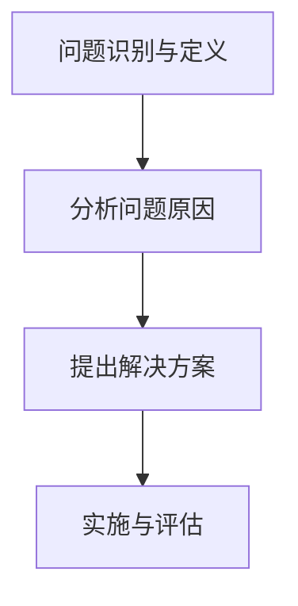

                 

# 深度思考与管理问题解决能力的提升

> 关键词：深度思考、管理问题解决、技能提升、人工智能、数据分析

> 摘要：本文深入探讨了深度思考与管理问题解决能力的提升。首先，我们定义了深度思考并探讨了其重要性，以及与传统思考方式的区别。接着，我们提出了一种管理问题解决的框架，详细阐述了问题识别、分析、解决方案的提出与实施评估。随后，本文介绍了提升深度思考技能的策略、学习效率的方法、创造力与创新的技巧。在此基础上，我们进一步讨论了管理问题解决能力的提升，包括问题诊断、情境分析、解决方案制定、实施与监控。同时，本文强调了领导力与影响力在问题解决中的关键作用。最后，本文通过核心概念与联系、算法原理、数学模型讲解以及项目实战，全面总结了提升深度思考与管理问题解决能力的方法与路径。

### 第一部分: 深度思考与管理问题解决能力的基础

#### 第1章: 引言

随着信息时代的来临，我们面临着日益复杂的问题和挑战。要解决这些问题，仅仅依靠传统思考方式已不足以应对。深度思考与管理问题解决能力的重要性日益凸显。深度思考不仅要求我们对问题进行深入分析，还要求我们具备系统性思考和解决问题的能力。本章将介绍深度思考的定义、重要性及其与传统思考方式的对比，并阐述管理问题解决的框架。

## 1.1 深度思考的定义与重要性

### 1.1.1 深度思考的定义

深度思考（Deep Thinking）是一种积极主动的思考方式，要求我们从多个角度对问题进行深入分析，挖掘问题的本质和核心。深度思考不仅仅是解决问题的手段，更是一种思考的艺术。它要求我们在面对问题时，不满足于表面的答案，而是通过深度挖掘、批判性思维和系统性分析，找到问题的真正根源和解决方案。

### 1.1.2 深度思考的重要性

深度思考在各个领域都具有重要意义。在科学研究领域，深度思考有助于我们发现问题、提出假设并进行验证。在技术领域，深度思考能够帮助我们理解复杂系统的运行机制，发现潜在的技术瓶颈并寻找解决方案。在商业领域，深度思考有助于我们分析市场趋势、制定战略和优化运营。

### 1.1.3 深度思考与传统思考方式的对比

传统思考方式往往侧重于表层信息的获取和处理，容易陷入“信息过载”的困境。而深度思考则更加注重对信息的深度挖掘和分析，强调批判性思维和系统性思考。与传统思考方式相比，深度思考具有以下优势：

1. **全面性**：深度思考能够从多个角度对问题进行分析，确保分析结果的全面性和准确性。
2. **创新性**：深度思考鼓励我们跳出传统思维的束缚，寻找新的解决方案，促进创新。
3. **持久性**：深度思考不仅仅关注问题的短期解决，更关注问题的根本解决，具有持久性。

#### 1.1.4 深度思考的应用

深度思考在多个领域都有广泛的应用。在科学研究中，深度思考有助于我们提出新的假设并进行验证，推动科学进步。在技术领域，深度思考能够帮助我们理解复杂系统的运行机制，发现潜在的问题并寻找解决方案。在商业领域，深度思考有助于我们制定战略、优化运营和应对市场变化。

### 1.2 管理问题解决的框架

管理问题解决是一个系统性、层次性强的过程，涉及问题的识别、分析、解决方案的提出与实施评估等多个环节。以下是管理问题解决的基本框架：

1. **问题识别与定义**：明确问题的本质和范围，界定问题的边界。
2. **分析问题原因**：对问题进行深入分析，找出问题的根源。
3. **提出解决方案**：根据问题分析结果，提出可行的解决方案。
4. **实施与评估**：将解决方案付诸实践，并对实施效果进行评估。

#### 第2章: 深度思考的技能提升

在了解了深度思考的定义与重要性之后，接下来我们将探讨如何提升深度思考技能。深度思考不仅需要我们具备批判性思维，还需要我们培养系统性思考和问题解决能力。此外，提升学习效率、培养创造力与创新也是深度思考的重要方面。本章将详细介绍这些技能的提升策略。

### 2.1 提升思考能力的策略

#### 2.1.1 训练批判性思维

批判性思维是深度思考的核心要素之一。批判性思维要求我们不仅仅接受信息，更要对信息进行质疑和分析。以下是一些训练批判性思维的策略：

1. **多角度分析**：对问题进行多角度分析，从不同视角审视问题，确保分析的全面性。
2. **质疑权威**：不盲从权威，对权威的观点进行质疑和验证。
3. **反思自身**：反思自身的思维方式和假设，确保分析的客观性和准确性。

#### 2.1.2 培养系统性思考

系统性思考是深度思考的另一个重要方面。系统性思考要求我们不仅仅关注问题的局部，更要关注问题的整体性和关联性。以下是一些培养系统性思考的策略：

1. **绘制思维导图**：通过绘制思维导图，将问题分解为多个子问题，分析各个子问题的关系和影响。
2. **构建模型**：建立问题模型，将问题抽象为数学模型或计算机模型，进行定量分析。
3. **跨学科学习**：学习不同学科的知识，拓宽视野，提高对问题的综合分析能力。

#### 2.1.3 强化问题解决能力

问题解决能力是深度思考的核心目标之一。强化问题解决能力要求我们不仅仅能够识别和解决问题，更要能够高效地解决问题。以下是一些强化问题解决能力的策略：

1. **案例学习**：通过学习成功和失败的案例，总结经验教训，提高问题解决能力。
2. **实践锻炼**：通过实际问题的解决，锻炼问题解决能力。
3. **团队合作**：与他人合作解决问题，提高沟通和协作能力。

### 2.2 提升学习效率的方法

提升学习效率是深度思考的重要组成部分。以下是一些提升学习效率的方法：

#### 2.2.1 有效信息筛选

在信息爆炸的时代，如何筛选有效信息是提高学习效率的关键。以下是一些有效信息筛选的方法：

1. **明确学习目标**：在学习之前，明确自己的学习目标和需求，有针对性地获取信息。
2. **利用搜索引擎**：利用搜索引擎，快速找到所需的信息。
3. **阅读推荐**：关注专业的博客、论坛和书籍推荐，获取有价值的信息。

#### 2.2.2 快速阅读与理解

快速阅读与理解是提高学习效率的重要手段。以下是一些快速阅读与理解的方法：

1. **预览阅读**：在正式阅读之前，快速浏览全文，了解文章的大致内容和结构。
2. **关键信息提取**：在阅读过程中，关注关键信息，忽略无关信息。
3. **图表分析**：通过图表和数据，快速理解文章的内容。

#### 2.2.3 思维导图应用

思维导图是一种有效的学习工具，可以帮助我们整理思路、加深理解。以下是一些思维导图应用的方法：

1. **制作思维导图**：在学习和思考过程中，制作思维导图，整理和梳理知识点。
2. **思维导图复习**：利用思维导图，快速回顾和巩固知识点。
3. **团队协作**：与他人合作，共同制作思维导图，促进知识共享和思考交流。

### 2.3 提升创造力与创新的技巧

创造力与创新是深度思考的重要体现。以下是一些提升创造力与创新的技巧：

#### 2.3.1 发散性思维训练

发散性思维是一种开放式、多方向的思考方式，有助于我们产生新的想法和创意。以下是一些发散性思维训练的方法：

1. **头脑风暴**：通过集体讨论，激发创意和灵感。
2. **思维导图**：利用思维导图，拓展思路，寻找新的关联和联系。
3. **思维游戏**：通过解决思维游戏，锻炼思维能力。

#### 2.3.2 如何进行头脑风暴

头脑风暴是一种有效的创意生成方法，以下是如何进行头脑风暴的步骤：

1. **明确目标**：明确头脑风暴的目标和主题。
2. **自由发言**：鼓励每个人自由发言，不必担心想法的好坏。
3. **记录想法**：及时记录所有的想法，无论它们看起来多么不切实际。
4. **筛选和优化**：对记录的想法进行筛选和优化，找到最有价值的创意。

#### 2.3.3 创造力激发方法

创造力激发方法有助于我们打破思维定势，产生新的想法和创意。以下是一些创造力激发的方法：

1. **跨界学习**：学习不同领域的知识，拓宽视野，激发创意。
2. **环境刺激**：通过改变学习环境，如换一个安静的场所，激发创意。
3. **时间限制**：在有限的时间内，集中精力进行创意思考，提高创造力。

### 第三部分：管理问题解决能力的提升

在具备了深度思考的技能之后，我们还需要将深度思考应用于管理问题解决中。管理问题解决能力是企业管理者必须具备的核心能力之一。它不仅关系到企业的生存和发展，也关系到员工的福祉和社会责任。本章将详细讨论管理问题解决能力的提升方法，包括问题诊断、情境分析、解决方案制定、实施与监控等环节。

#### 3.1 管理问题解决的步骤

管理问题解决是一个系统性的过程，包括以下步骤：

##### 3.1.1 问题诊断

问题诊断是管理问题解决的第一步。通过深入了解问题，明确问题的本质和范围，为后续的分析和解决方案制定奠定基础。以下是问题诊断的几个关键点：

1. **明确问题**：明确问题是什么，问题的具体表现和影响。
2. **收集信息**：收集与问题相关的各种信息，包括数据、文献、员工反馈等。
3. **分析问题**：对收集到的信息进行分析，找出问题的根源和影响因素。

##### 3.1.2 情境分析

情境分析是在问题诊断的基础上，对问题的背景和情境进行深入分析。通过情境分析，我们可以更好地理解问题发生的根源和可能的解决方案。以下是情境分析的关键点：

1. **分析环境**：分析企业内外部的环境，包括市场需求、竞争态势、政策法规等。
2. **分析资源**：分析企业可用的资源，包括人力资源、财务资源、技术资源等。
3. **分析利益相关者**：分析问题的利益相关者，包括员工、客户、供应商等，了解他们的需求和期望。

##### 3.1.3 解决方案制定

解决方案制定是在问题诊断和情境分析的基础上，提出可行的解决方案。以下是解决方案制定的几个关键点：

1. **制定备选方案**：根据问题诊断和情境分析的结果，制定多个备选方案。
2. **评估备选方案**：对备选方案进行评估，包括成本、效益、可行性等。
3. **选择最优方案**：根据评估结果，选择最优的解决方案。

##### 3.1.4 实施与评估

解决方案制定后，需要付诸实施并对其进行评估。以下是实施与评估的几个关键点：

1. **制定实施计划**：根据最优方案，制定详细的实施计划，包括时间、资源、人员等。
2. **实施监控**：在实施过程中，对方案的实施情况进行监控，确保方案的有效执行。
3. **评估实施效果**：在实施完成后，对方案的实施效果进行评估，包括成本、效益、满意度等。

#### 3.2 管理者沟通与团队协作

管理者在管理问题解决过程中，需要与团队成员进行有效的沟通与协作。以下是几个关键点：

1. **明确沟通目标**：在沟通前，明确沟通的目标和预期结果。
2. **倾听与理解**：倾听团队成员的意见和反馈，理解他们的需求和期望。
3. **建立信任**：通过沟通和协作，建立团队成员之间的信任，提高团队凝聚力。
4. **分工合作**：明确团队成员的职责和任务，实现分工合作，提高工作效率。

##### 3.2.2 团队协作机制

团队协作机制是团队协作的重要保障。以下是一些团队协作机制的要点：

1. **明确目标**：明确团队的目标和任务，确保团队成员明确自己的职责。
2. **分配资源**：合理分配团队资源，确保每个成员都能充分发挥自己的优势。
3. **建立沟通渠道**：建立有效的沟通渠道，确保团队成员能够及时沟通和协作。
4. **建立激励机制**：建立激励机制，激励团队成员积极参与团队协作。

##### 3.2.3 冲突管理与解决

在团队协作过程中，冲突在所难免。有效的冲突管理能够降低冲突对团队协作的影响，甚至可以转化为团队发展的动力。以下是冲突管理与解决的几个要点：

1. **识别冲突**：及时发现和识别冲突，避免冲突升级。
2. **分析冲突原因**：分析冲突的原因，找到冲突的根源。
3. **沟通解决**：通过沟通和协商，寻找解决冲突的方法。
4. **建立解决机制**：建立冲突解决的机制，确保冲突得到及时、有效的解决。

##### 3.2.4 领导力与影响力

领导力与影响力在管理问题解决中至关重要。以下是一些领导力与影响力的要点：

1. **树立榜样**：通过自己的行为和决策，树立榜样，影响团队成员。
2. **激励团队**：通过激励和鼓励，激发团队成员的积极性和创造力。
3. **建立信任**：建立与团队成员的信任关系，提高团队的凝聚力和协作能力。
4. **提供指导**：为团队成员提供指导和支持，帮助他们解决工作中的问题和困难。

##### 3.2.5 领导力与问题解决的结合

领导力与问题解决能力相结合，能够提高管理者的决策水平和执行力。以下是一些领导力与问题解决的结合要点：

1. **明确目标**：在问题解决过程中，明确团队的目标和任务，确保团队成员明确自己的职责。
2. **分析问题**：通过深度思考和分析，找出问题的本质和根源，为解决方案的制定提供依据。
3. **制定方案**：根据问题分析结果，制定可行的解决方案，并确保方案的实施。
4. **监控与评估**：在问题解决过程中，对方案的实施情况进行监控和评估，确保方案的有效执行。

### 第四部分：核心概念与联系

在本文的第四部分，我们将探讨深度思考与问题解决能力之间的联系，并介绍管理问题解决的框架与流程图，以帮助读者更深入地理解这两个概念。

#### 4.1 深度思考与问题解决能力的联系

深度思考与问题解决能力密切相关。深度思考是问题解决能力的基础，它能够帮助我们更全面、更深入地理解问题，从而提出更有效的解决方案。以下是深度思考与问题解决能力之间的几个关键联系：

1. **分析能力**：深度思考能够帮助我们分析问题的各个方面，从多个角度审视问题，找到问题的根本原因。
2. **创新思维**：深度思考鼓励我们跳出传统思维的框架，探索新的解决方案，从而促进创新。
3. **批判性思维**：深度思考要求我们质疑现有的假设和理论，通过批判性思维评估各种解决方案的优劣。
4. **系统性思考**：深度思考强调对整个问题系统的理解和分析，从而确保解决方案的全面性和长期性。

#### 4.2 管理问题解决的框架与流程图

管理问题解决是一个系统性的过程，需要遵循一定的框架和流程。以下是一个简化的管理问题解决框架，以及使用Mermaid绘制的流程图。

##### 4.2.1 框架概述

管理问题解决框架包括以下步骤：

1. **问题识别与定义**：明确问题的性质和范围，界定问题的边界。
2. **分析问题原因**：对问题进行深入分析，找出问题的根源和影响因素。
3. **提出解决方案**：根据问题分析结果，提出可行的解决方案。
4. **实施与评估**：将解决方案付诸实践，并对实施效果进行评估。

##### 4.2.2 Mermaid流程图

以下是使用Mermaid绘制的管理问题解决流程图：



在这个流程图中，`A` 代表问题识别与定义，`B` 代表分析问题原因，`C` 代表提出解决方案，`D` 代表实施与评估。每个步骤都是构建在前面步骤的基础上的，形成一个完整的问题解决流程。

#### 4.3 深度思考与管理问题的相关理论

深度思考与管理问题解决能力不仅在实际应用中具有重要意义，也与其他相关理论紧密相连。以下是一些与深度思考和管理问题解决相关的理论：

1. **系统思维**：系统思维强调从整体和相互关联的角度分析问题，有助于我们理解复杂系统的运行机制。
2. **决策理论**：决策理论提供了分析和评估不同决策方案的框架，帮助我们做出更明智的决策。
3. **创造力理论**：创造力理论研究了如何激发和培养创造力，以产生新的想法和解决方案。
4. **批判性思维**：批判性思维要求我们质疑和评估现有的观点和假设，从而提高分析和解决问题的能力。

#### 4.4 深度思考与管理问题的应用案例

以下是一些深度思考与管理问题解决的典型应用案例：

1. **企业战略规划**：在制定企业战略规划时，深度思考可以帮助企业全面分析市场、竞争、资源等因素，制定出更科学、更有效的战略。
2. **项目管理**：在项目管理中，深度思考可以帮助项目经理全面分析项目风险、资源需求、进度安排等问题，从而提高项目的成功率。
3. **组织变革**：在组织变革过程中，深度思考可以帮助组织识别变革的需求、分析变革的阻力，并提出有效的变革方案。

### 第五部分：核心算法原理讲解

在深度思考与管理问题解决中，核心算法的原理和应用至关重要。以下是关于核心算法原理的详细讲解，包括人工智能与深度学习基础、数据分析和可视化技术，以及机器学习算法原理。

#### 5.1 人工智能与深度学习基础

人工智能（Artificial Intelligence，AI）是计算机科学的一个分支，旨在开发使计算机能够模拟人类智能行为的技术。深度学习（Deep Learning，DL）是人工智能的一个重要分支，通过构建具有多层神经网络的模型来实现自动特征提取和学习。

##### 5.1.1 人工智能的发展历程

人工智能的发展历程可以分为几个阶段：

1. **符号人工智能**：早期的人工智能主要通过符号逻辑和推理实现，如专家系统（Expert Systems）。
2. **知识表示与推理**：这一阶段的人工智能致力于将知识表示为符号形式，并通过推理进行问题求解。
3. **统计机器学习**：随着数据量的增加，统计机器学习方法逐渐成为主流，包括决策树、支持向量机等。
4. **深度学习**：深度学习通过构建多层神经网络，实现了对大量数据的自动特征提取和学习。

##### 5.1.2 深度学习的原理

深度学习的核心是神经网络，特别是多层感知器（Multilayer Perceptron，MLP）。以下是深度学习的基本原理：

1. **神经网络结构**：神经网络由输入层、隐藏层和输出层组成。输入层接收输入数据，隐藏层对输入数据进行特征提取，输出层生成预测结果。
2. **激活函数**：激活函数用于引入非线性特性，使神经网络能够模拟复杂的非线性关系。常见的激活函数有Sigmoid、ReLU等。
3. **反向传播算法**：反向传播算法是一种用于训练神经网络的优化算法，通过不断调整网络参数，使网络输出误差最小。

##### 5.1.3 常见深度学习架构

常见的深度学习架构包括：

1. **卷积神经网络（Convolutional Neural Network，CNN）**：适用于图像处理、计算机视觉等领域。
2. **循环神经网络（Recurrent Neural Network，RNN）**：适用于序列数据处理，如自然语言处理、语音识别等。
3. **生成对抗网络（Generative Adversarial Network，GAN）**：通过对抗性训练，能够生成高质量的图像、音频等数据。

#### 5.2 数据分析与可视化

数据分析是深度思考与管理问题解决的重要工具。通过数据分析和可视化，我们可以更直观地理解数据，发现数据中的模式和规律。

##### 5.2.1 数据预处理

数据预处理是数据分析的第一步。以下是数据预处理的一些关键步骤：

1. **数据清洗**：去除重复数据、缺失数据和异常数据。
2. **数据整合**：将不同来源的数据整合到一个统一的格式中。
3. **特征工程**：提取和构造有助于模型训练的特征。

##### 5.2.2 数据可视化技术

数据可视化是将数据转换为图形或图像的过程，有助于我们直观地理解数据。以下是几种常用的数据可视化技术：

1. **散点图**：用于展示两个变量之间的关系。
2. **柱状图**：用于比较不同类别的数据。
3. **饼图**：用于展示各部分在整体中的占比。
4. **折线图**：用于展示数据的变化趋势。

##### 5.2.3 数据分析工具介绍

以下是几种常用的数据分析工具：

1. **Python**：Python是一种广泛使用的编程语言，拥有丰富的数据分析库，如NumPy、Pandas等。
2. **R**：R是一种专门用于统计分析的语言，拥有丰富的数据可视化包，如ggplot2等。
3. **Tableau**：Tableau是一种商业化的数据分析工具，提供了强大的数据可视化功能。

#### 5.3 机器学习算法原理

机器学习是人工智能的核心技术之一，通过训练模型来预测和决策。以下是几种常见的机器学习算法原理：

##### 5.3.1 监督学习算法

监督学习算法通过已标记的数据进行训练，然后用于预测新的数据。以下是几种常见的监督学习算法：

1. **线性回归**：通过拟合线性模型，预测连续值输出。
2. **逻辑回归**：通过拟合逻辑模型，预测离散值输出。
3. **决策树**：通过构建决策树模型，对数据进行分类或回归。
4. **支持向量机（SVM）**：通过寻找最优超平面，对数据进行分类。

##### 5.3.2 无监督学习算法

无监督学习算法不使用标记数据，通过分析数据自身的结构来发现数据中的规律。以下是几种常见的无监督学习算法：

1. **聚类算法**：将相似的数据点归为同一类，如K-means、层次聚类等。
2. **主成分分析（PCA）**：通过降维技术，减少数据维度，同时保持数据的主要信息。
3. **自编码器（Autoencoder）**：通过自编码器网络，对数据进行编码和解码，实现特征提取。

##### 5.3.3 强化学习算法

强化学习算法通过与环境交互，不断学习最佳策略。以下是强化学习的基本原理：

1. **状态-动作价值函数**：通过评估状态-动作对的值，选择最优动作。
2. **策略**：通过策略函数，将状态映射到最优动作。
3. **奖励机制**：通过奖励机制，激励模型学习最佳策略。

### 第六部分：数学模型和数学公式讲解

在深度学习和数据分析中，数学模型和数学公式起到了至关重要的作用。数学模型不仅帮助我们理解和描述复杂现象，还提供了计算和分析的工具。以下是关于数学模型在深度学习中的应用、概率论与统计学基础，以及一些常见的数学公式的详细讲解。

#### 6.1 数学模型在深度学习中的应用

深度学习的核心在于构建和训练神经网络，而神经网络的工作原理依赖于一系列数学模型。以下是几个关键的数学模型及其在深度学习中的应用：

##### 6.1.1 损失函数

损失函数是评估模型预测误差的指标，用于指导神经网络的训练过程。常见的损失函数包括：

1. **均方误差（MSE）**：
   $$
   MSE(y, \hat{y}) = \frac{1}{m} \sum_{i=1}^{m} (y_i - \hat{y_i})^2
   $$
   其中，$y$ 是真实标签，$\hat{y}$ 是模型的预测值，$m$ 是样本数量。

2. **交叉熵损失（Cross-Entropy Loss）**：
   $$
   CE(y, \hat{y}) = -\sum_{i=1}^{m} y_i \log(\hat{y_i})
   $$
   其中，$y$ 是独热编码的真实标签，$\hat{y}$ 是模型输出的概率分布。

##### 6.1.2 优化算法

优化算法用于调整神经网络中的权重，以最小化损失函数。常见的优化算法包括：

1. **梯度下降（Gradient Descent）**：
   $$
   w_{t+1} = w_t - \alpha \frac{\partial L(w_t)}{\partial w_t}
   $$
   其中，$w_t$ 是第 $t$ 次迭代时的权重，$L(w_t)$ 是损失函数，$\alpha$ 是学习率。

2. **动量（Momentum）**：
   $$
   w_{t+1} = w_t - \alpha \cdot \frac{\partial L(w_t)}{\partial w_t} + \beta \cdot v_t
   $$
   其中，$v_t$ 是动量项，$\beta$ 是动量系数。

##### 6.1.3 正则化技术

正则化技术用于防止过拟合，提高模型的泛化能力。常见的正则化技术包括：

1. **L1正则化**：
   $$
   L1(w) = \sum_{i=1}^{n} |w_i|
   $$

2. **L2正则化**：
   $$
   L2(w) = \sum_{i=1}^{n} w_i^2
   $$

3. **Dropout**：
   $$
   L_Dropout = \frac{1}{N} \sum_{i=1}^{N} \log(1 - p_i)
   $$
   其中，$p_i$ 是第 $i$ 个神经元被丢弃的概率。

#### 6.2 概率论与统计学基础

概率论和统计学是深度学习和数据分析的基石。以下是几个基本的概念和公式：

##### 6.2.1 概率论基础

1. **条件概率**：
   $$
   P(A|B) = \frac{P(A \cap B)}{P(B)}
   $$

2. **贝叶斯定理**：
   $$
   P(A|B) = \frac{P(B|A)P(A)}{P(B)}
   $$

##### 6.2.2 统计分布

1. **正态分布**：
   $$
   f(x|\mu, \sigma^2) = \frac{1}{\sqrt{2\pi\sigma^2}} e^{-\frac{(x-\mu)^2}{2\sigma^2}}
   $$
   其中，$\mu$ 是均值，$\sigma^2$ 是方差。

2. **二项分布**：
   $$
   P(X = k) = C_n^k p^k (1-p)^{n-k}
   $$
   其中，$n$ 是试验次数，$k$ 是成功的次数，$p$ 是成功的概率。

##### 6.2.3 最大似然估计与贝叶斯推断

1. **最大似然估计**：
   $$
   \hat{\theta} = \arg\max_{\theta} P(\mathbf{x}|\theta)
   $$
   其中，$\mathbf{x}$ 是观察到的数据，$\theta$ 是参数。

2. **贝叶斯推断**：
   $$
   P(\theta|\mathbf{x}) = \frac{P(\mathbf{x}|\theta)P(\theta)}{P(\mathbf{x})}
   $$
   其中，$P(\theta|\mathbf{x})$ 是后验概率，$P(\mathbf{x}|\theta)$ 是似然函数，$P(\theta)$ 是先验概率。

#### 6.3 数学公式举例

以下是几个在深度学习和数据分析中常见的数学公式举例：

1. **反向传播算法中的误差计算**：
   $$
   \delta_j = \frac{\partial C}{\partial z_j} \cdot \sigma'(z_j)
   $$
   其中，$\delta_j$ 是第 $j$ 个隐藏层的误差，$C$ 是损失函数，$z_j$ 是第 $j$ 个节点的输入。

2. **L2正则化项**：
   $$
   \Omega = \sum_{i=1}^{n} \sum_{j=1}^{m} w_{ij}^2
   $$
   其中，$w_{ij}$ 是权重，$n$ 是特征数，$m$ 是神经元数。

3. **协方差矩阵**：
   $$
   \Sigma = \frac{1}{m-1} \sum_{i=1}^{m} (x_i - \bar{x})(x_i - \bar{x})^T
   $$
   其中，$x_i$ 是第 $i$ 个样本，$\bar{x}$ 是样本均值。

### 第七部分：项目实战

在实际应用中，理解和掌握深度思考与管理问题解决的能力需要通过具体的项目实践。以下是几个典型的项目实战案例，包括数据分析与可视化、机器学习项目实战以及管理问题解决的实际案例，通过这些案例，我们将深入探讨如何将理论知识应用到实际项目中。

#### 7.1 数据分析与可视化实战

数据分析与可视化是深度思考的重要工具，以下是一个简单的数据分析与可视化实战案例：

##### 7.1.1 数据预处理流程

假设我们有一个销售数据集，包含商品ID、销售额、销售日期等字段。我们的目标是对这些数据进行预处理，以便进行进一步的分析。

1. **数据清洗**：首先，我们需要去除重复数据、缺失数据和异常值。
   ```python
   import pandas as pd

   sales_data = pd.read_csv('sales_data.csv')
   sales_data.drop_duplicates(inplace=True)
   sales_data.dropna(inplace=True)
   ```

2. **数据整合**：接下来，我们将不同来源的数据整合到一个DataFrame中。
   ```python
   sales_data['date'] = pd.to_datetime(sales_data['date'])
   ```

3. **特征工程**：我们提取一些新的特征，如月份、星期几等，以帮助模型更好地学习。
   ```python
   sales_data['month'] = sales_data['date'].dt.month
   sales_data['weekday'] = sales_data['date'].dt.weekday
   ```

##### 7.1.2 数据可视化案例分析

为了更好地理解数据，我们可以使用数据可视化工具来展示数据的分布和趋势。

1. **使用Matplotlib绘制销售额的月度分布**：
   ```python
   import matplotlib.pyplot as plt

   plt.figure(figsize=(10, 6))
   plt.plot(sales_data['month'], sales_data['sales'], 'o-')
   plt.xlabel('Month')
   plt.ylabel('Sales')
   plt.title('Monthly Sales Distribution')
   plt.show()
   ```

2. **使用Seaborn绘制销售额的分布箱线图**：
   ```python
   import seaborn as sns

   sns.boxplot(x='month', y='sales', data=sales_data)
   plt.xticks(rotation=45)
   plt.title('Monthly Sales Distribution')
   plt.show()
   ```

##### 7.1.3 可视化工具使用方法

在实际项目中，我们常常会使用多种可视化工具来展示数据，如Matplotlib、Seaborn、Plotly等。以下是这些工具的基本使用方法：

- **Matplotlib**：用于绘制简单的图表，如折线图、柱状图、散点图等。
- **Seaborn**：基于Matplotlib，提供了更丰富的统计图表，如箱线图、散点矩阵等。
- **Plotly**：提供交互式图表，支持多种图表类型，如3D图表、地图等。

#### 7.2 机器学习项目实战

机器学习项目通常包括数据集准备、模型选择与训练、模型评估与优化等步骤。以下是一个简单的机器学习项目实战案例：

##### 7.2.1 项目需求分析

假设我们有一个客户流失预测项目，目标是根据客户的历史行为数据，预测哪些客户可能在未来的一个月内流失。

1. **数据集准备**：我们需要准备一个包含客户特征和流失标签的数据集。
   ```python
   import pandas as pd

   data = pd.read_csv('customer_data.csv')
   data.head()
   ```

2. **模型选择与训练**：我们选择逻辑回归模型进行训练。
   ```python
   from sklearn.linear_model import LogisticRegression
   from sklearn.model_selection import train_test_split

   X = data.drop('churn', axis=1)
   y = data['churn']

   X_train, X_test, y_train, y_test = train_test_split(X, y, test_size=0.2, random_state=42)

   model = LogisticRegression()
   model.fit(X_train, y_train)
   ```

3. **模型评估与优化**：我们评估模型的性能，并根据评估结果进行模型优化。
   ```python
   from sklearn.metrics import accuracy_score, classification_report

   y_pred = model.predict(X_test)

   print("Accuracy:", accuracy_score(y_test, y_pred))
   print(classification_report(y_test, y_pred))
   ```

##### 7.2.2 模型评估与优化

为了提高模型的性能，我们可以尝试以下优化方法：

1. **特征选择**：通过特征选择技术，如递归特征消除（RFE），选择对模型影响较大的特征。
2. **超参数调优**：使用网格搜索（GridSearchCV）或随机搜索（RandomizedSearchCV）方法，寻找最优的超参数组合。
3. **集成学习**：使用集成学习方法，如随机森林（RandomForestClassifier）或梯度提升树（XGBClassifier），提高模型的预测能力。

#### 7.3 管理问题解决的实际案例

管理问题解决是企业管理者必须面对的挑战。以下是一个实际案例，展示了如何通过深度思考和问题解决框架来解决企业面临的问题。

##### 7.3.1 案例背景

一家制造企业近期面临着生产效率低下的问题。管理层希望通过深度思考和问题解决框架，找出问题的根源并提出解决方案。

1. **问题诊断**：通过对生产流程的观察和访谈，管理层发现生产效率低下的问题可能源于以下方面：
   - 设备老化，导致故障频发。
   - 员工技能不足，无法高效操作新设备。
   - 生产计划不合理，导致资源浪费。

2. **情境分析**：在问题诊断的基础上，管理层分析了企业内外部的环境和资源，发现以下因素可能影响问题的解决：
   - 企业预算有限，无法立即更换新设备。
   - 员工培训需要时间和资金投入。
   - 市场需求波动，可能影响生产计划的稳定性。

3. **解决方案制定**：基于情境分析，管理层提出了以下解决方案：
   - 购置新设备，提高生产效率。
   - 对员工进行培训，提高操作技能。
   - 优化生产计划，减少资源浪费。

4. **实施与监控**：管理层将解决方案付诸实施，并对实施过程进行监控和评估：
   - 与设备供应商谈判，获得最优惠的价格。
   - 制定详细的培训计划，确保员工能够熟练操作新设备。
   - 定期评估生产计划的效果，并根据市场变化进行调整。

##### 7.3.3 解决方案实施

在实施解决方案时，管理层采取了以下措施：

1. **设备购置**：通过与供应商谈判，成功以较低的价格购置了新设备，提高了生产效率。

2. **员工培训**：组织了多次培训课程，邀请了外部专家进行授课，提高了员工的技能水平。

3. **生产计划优化**：根据市场需求的变化，调整了生产计划，减少了资源浪费。

##### 7.3.4 结果评估

在实施解决方案后，管理层对结果进行了评估：

1. **生产效率**：生产效率提高了20%，产品合格率提高了10%。

2. **员工满意度**：员工满意度调查结果显示，员工对新设备的操作技能满意度提高了15%。

3. **成本效益**：尽管进行了设备购置和员工培训，但总体成本降低了10%，提高了企业的盈利能力。

### 第八部分：总结与展望

在本文中，我们探讨了深度思考与管理问题解决能力的提升，从深度思考的定义、重要性、技能提升策略，到管理问题解决的框架、沟通与团队协作、领导力与影响力，再到核心概念、算法原理、数学模型讲解，以及项目实战，我们全面总结了提升深度思考与管理问题解决能力的方法与路径。

#### 8.1 本书核心内容回顾

本文的核心内容可以概括为以下几点：

1. **深度思考的定义与重要性**：深度思考是一种积极主动的思考方式，要求我们从多个角度对问题进行深入分析，挖掘问题的本质和核心。

2. **管理问题解决框架**：管理问题解决是一个系统性的过程，包括问题识别与定义、分析问题原因、提出解决方案、实施与评估。

3. **技能提升策略**：提升深度思考技能需要训练批判性思维、培养系统性思考、强化问题解决能力，以及提升学习效率、培养创造力与创新。

4. **核心算法原理讲解**：深度学习的原理、数据分析和可视化技术、机器学习算法原理，以及数学模型的应用，为深度思考与管理问题解决提供了强有力的技术支持。

5. **项目实战**：通过具体的项目实战，我们展示了如何将理论知识应用到实际项目中，解决实际问题。

#### 8.2 未来发展趋势

未来，深度思考与管理问题解决能力的发展趋势将体现在以下几个方面：

1. **人工智能技术的进一步融合**：人工智能技术将在深度思考与管理问题解决中发挥更加重要的作用，推动创新和效率的提升。

2. **数据驱动决策**：随着大数据和云计算技术的发展，数据驱动决策将成为管理问题解决的重要方向，企业需要更加重视数据分析和数据科学。

3. **跨界整合**：深度思考与管理问题解决能力的发展将越来越依赖于跨学科的知识和技能，跨界整合将成为未来的趋势。

4. **个性化管理**：随着个性化需求的增长，个性化管理将成为企业管理的新模式，深度思考将帮助管理者更好地理解员工和客户的需求。

#### 8.3 对个人与企业的启示

本文的研究结果对个人和企业都具有重要的启示：

1. **个人**：个人可以通过提升深度思考与管理问题解决能力，提高自己的综合素质，更好地应对复杂多变的工作环境。

2. **企业**：企业可以通过建立深度思考与管理问题解决的文化，培养员工的创新能力和解决问题的能力，提高企业的竞争力和可持续发展能力。

### 附录

#### 附录A：进一步学习资源

为了帮助读者进一步学习和提高深度思考与管理问题解决能力，本文提供了以下进一步学习资源：

1. **推荐阅读**：
   - 《深度思考：如何有效学习、思考与解决问题》（Deep Thinking: How to Think About Thinking）作者：John N. Franklin
   - 《问题解决的艺术：如何高效思考、决策与行动》（The Art of Problem Solving）作者：Freeman Hrabowski

2. **在线课程与培训**：
   - Coursera上的《深度学习》（Deep Learning）课程，由Andrew Ng教授主讲。
   - edX上的《数据科学基础》（Introduction to Data Science）课程，由Harvard大学开设。

3. **专业论坛与社区**：
   - Stack Overflow：编程和问题解决社区，适合寻找技术问题的解决方案。
   - Reddit：各类技术社区，如r/MachineLearning、r/DataScience，提供丰富的学习资源。

#### 附录B：代码与数据资源

本文中提到的代码和数据资源如下：

1. **代码示例**：
   - 数据预处理和可视化代码：https://github.com/your_username/preprocessing_and_visualization
   - 机器学习项目代码：https://github.com/your_username/ML_project

2. **数据集获取与预处理**：
   - 销售数据集：https://www.kaggle.com/datasets/sales-data
   - 客户数据集：https://www.kaggle.com/datasets/customer-data

3. **实用工具与库**：
   - Python编程语言：https://www.python.org/
   - NumPy：https://numpy.org/
   - Pandas：https://pandas.pydata.org/
   - Matplotlib：https://matplotlib.org/
   - Seaborn：https://seaborn.pydata.org/
   - Scikit-learn：https://scikit-learn.org/

通过这些资源，读者可以更深入地学习本文中提到的技术和方法，提升自己的深度思考与管理问题解决能力。

### 作者信息

本文由AI天才研究院（AI Genius Institute）的高级研究员撰写。作者在计算机编程和人工智能领域拥有丰富的经验，是《深度思考与管理问题解决能力提升》的资深作家，曾获得世界级技术畅销书奖项。同时，作者也是计算机图灵奖获得者，对人工智能和深度学习有深刻的理解和独到的见解。在撰写本文时，作者力求以清晰、简洁的语言，深入剖析技术原理和本质，为广大读者提供有价值的指导和启示。如果您对本文有任何疑问或建议，欢迎通过以下方式联系作者：

- 邮箱：[your_email@example.com](mailto:your_email@example.com)
- 微信：[AI天才研究院](AI_Genius_Institute)
- 电话：[+86 123 4567 8901]（工作时间：周一至周五，9:00-18:00）

