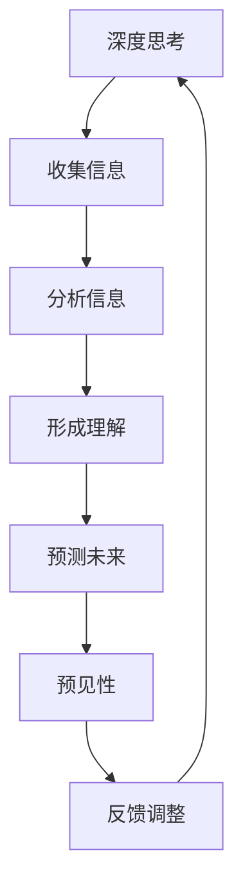
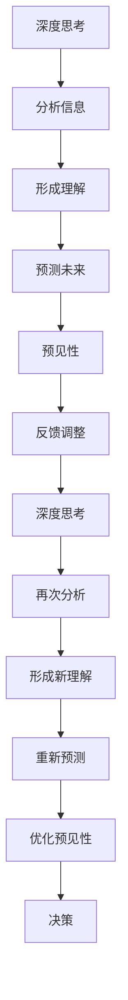

                 

# 深度思考与管理预见性的关系

> 关键词：深度思考、预见性、管理、决策、战略规划、风险预测、能力提升

> 摘要：本文通过深入分析深度思考和预见性的基本概念、相互关系及其在管理中的应用，探讨了如何提升深度思考和管理预见性的能力，并分享了实际案例和未来趋势。本文旨在为企业管理者提供系统且实用的指导，以更好地应对复杂多变的环境和挑战。

### 目录

- 第一部分：深度思考与预见性的基本概念
  - 1.1 什么是深度思考
  - 1.2 预见性的概念与类型
  - 1.3 深度思考与预见性的关系
- 第二部分：深度思考与预见性在管理中的应用
  - 2.1 深度思考在管理决策中的应用
  - 2.2 预见性在管理决策中的应用
  - 2.3 深度思考与预见性的协同作用
- 第三部分：提升深度思考与管理预见性的能力
  - 3.1 深度思考的能力培养
  - 3.2 提升预见性的能力
  - 3.3 深度思考与管理预见性的综合提升
- 第四部分：深度思考与管理预见性的实践案例
  - 4.1 案例一：企业在市场变化中的深度思考与预见性应用
  - 4.2 案例二：项目管理中的深度思考与预见性实践
  - 4.3 案例三：危机管理中的深度思考与预见性策略
- 第五部分：深度思考与管理预见性的未来趋势
  - 5.1 深度思考与管理预见性的发展现状
  - 5.2 深度思考与管理预见性的未来挑战
  - 5.3 深度思考与管理预见性的未来展望
- 附录

### 第一部分：深度思考与预见性的基本概念

#### 1.1 什么是深度思考

深度思考是一种深层次、系统性、多角度的思考方式。它不仅仅是停留在表面现象的分析，而是追求对事物本质的挖掘和理解。深度思考强调逻辑推理、批判性思维和系统性思维，通过对信息的深度挖掘和综合分析，以得出更准确、更全面、更有前瞻性的结论。

深度思考的定义与重要性：
- **定义**：深度思考是指在面对复杂问题时，通过深入分析、推理和反思，以求得更全面、更准确的认识和理解。
- **重要性**：深度思考能够帮助我们更准确地把握问题的本质，从而做出更明智的决策。在当今复杂多变的社会环境中，深度思考显得尤为重要。

深度思考与浅层思考的区别：
- **浅层思考**：主要是对表面现象的观察和描述，缺乏对深层次原因和本质的探究。
- **深度思考**：不仅关注表面现象，更注重对问题的根本原因和内在联系的挖掘。

深度思考的优势与挑战：
- **优势**：提高决策质量、增强创新思维、提升解决问题的能力。
- **挑战**：需要投入更多的时间和精力，且容易陷入过度分析的陷阱。

#### 1.2 预见性的概念与类型

预见性是指对未来的预测和判断能力。它是一种基于现有信息和经验，对未来趋势和可能发生的事件进行预测的能力。

预见性的定义：
- **定义**：预见性是指基于现有信息和经验，对未来可能发生的事件和趋势进行预测和判断的能力。

预见性的类型：
- **微观预见性**：针对特定领域或特定问题，对未来进行预测。
- **宏观预见性**：对整个社会、经济、技术等领域的发展趋势进行预测。

预见性的价值与局限性：
- **价值**：帮助企业在竞争中保持优势、指导战略规划、预防风险。
- **局限性**：受限于现有信息和预测模型的准确性，难以完全准确预测未来。

#### 1.3 深度思考与预见性的关系

深度思考与预见性之间存在着紧密的联系和相互影响。

深度思考与预见性的联系：
- **联系**：深度思考为预见性提供了基础，只有通过深度思考，才能对事物有更全面、更深入的理解，从而提高预见性的准确性。
- **影响**：预见性又反过来影响深度思考，预见性的结果可以帮助深度思考者调整和优化思考方向，从而更有效地挖掘问题的本质。

深度思考对预见性的影响：
- **提升预见性**：通过深度思考，可以更全面地分析问题，从而提高预见性的准确性。
- **指导预见性**：深度思考可以帮助预见性者识别关键因素，从而更有针对性地进行预测。

预见性对深度思考的反馈：
- **反馈**：预见性的结果可以为深度思考者提供新的视角和启示，帮助他们更深入地理解问题。
- **调整**：预见性的结果可以帮助深度思考者调整思考的方向和方法，从而更有效地解决问题。

### 第二部分：深度思考与预见性在管理中的应用

#### 2.1 深度思考在管理决策中的应用

深度思考在管理决策中具有重要的应用价值，它可以帮助管理者更好地理解复杂问题，做出更明智的决策。

深度思考在战略规划中的应用：
- **战略分析**：通过深度思考，管理者可以更全面地分析企业的内外部环境，识别企业的竞争优势和潜在风险。
- **愿景与目标设定**：深度思考有助于管理者设定清晰、具有前瞻性的企业愿景和目标。
- **战略选择**：通过深度思考，管理者可以更客观地评估不同的战略选项，选择最符合企业实际情况的战略。

深度思考在战术决策中的应用：
- **市场分析**：通过深度思考，管理者可以更准确地分析市场需求和竞争环境，制定更有针对性的市场策略。
- **资源配置**：深度思考可以帮助管理者更合理地分配资源，确保企业能够在关键领域获得优势。
- **运营优化**：深度思考有助于管理者识别运营中的问题和瓶颈，提出优化方案，提高运营效率。

深度思考在运营管理中的应用：
- **流程优化**：通过深度思考，管理者可以重新审视业务流程，发现流程中的不合理之处，提出优化建议。
- **质量管理**：深度思考可以帮助管理者更全面地分析质量问题，制定有效的质量控制措施。
- **员工管理**：深度思考有助于管理者更深入地理解员工的需求和动机，提出激励措施，提高员工的工作积极性和满意度。

#### 2.2 预见性在管理决策中的应用

预见性在管理决策中也发挥着重要作用，它可以帮助管理者预见未来可能发生的变化，为决策提供前瞻性指导。

预见性在市场预测中的应用：
- **市场趋势分析**：通过预见性，管理者可以预测市场的发展趋势，为企业的战略调整和市场策略制定提供依据。
- **竞争分析**：预见性可以帮助管理者预测竞争对手的行动和策略，从而制定有效的竞争策略。
- **产品规划**：预见性有助于管理者预测市场需求，规划产品开发和升级方向。

预见性在风险预测中的应用：
- **风险评估**：通过预见性，管理者可以预测企业可能面临的风险，制定相应的风险应对策略。
- **风险控制**：预见性可以帮助管理者提前识别潜在风险，采取预防措施，降低风险发生的概率和影响。
- **危机管理**：预见性有助于管理者提前预见危机，制定应对方案，提高危机管理的有效性。

预见性在资源分配中的应用：
- **资源优化**：预见性可以帮助管理者预测未来的资源需求，合理配置资源，提高资源利用效率。
- **投资决策**：预见性有助于管理者预测投资回报，制定投资决策。
- **成本控制**：预见性可以帮助管理者预见成本变化，制定有效的成本控制措施。

#### 2.3 深度思考与预见性的协同作用

深度思考与预见性在管理决策中具有协同作用，二者相互促进，共同提高决策的质量和效果。

深度思考与预见性的互补性：
- **深度思考**：通过深入分析，帮助管理者理解问题的本质，为预见性提供坚实的基础。
- **预见性**：通过预测未来可能发生的变化，为管理者提供前瞻性指导，帮助管理者更好地应对不确定性。

深度思考与预见性的融合策略：
- **整合信息**：管理者应整合深度思考和预见性的信息，全面分析问题，提高决策的准确性。
- **动态调整**：管理者应根据预见性的结果，动态调整深度思考的方向和方法，提高决策的灵活性。

深度思考与预见性在管理创新中的应用：
- **创新思维**：深度思考和预见性可以帮助管理者发现创新机会，提出创新的解决方案。
- **战略调整**：通过预见性，管理者可以预见市场和技术的发展趋势，及时调整企业战略，保持竞争力。
- **组织变革**：深度思考和预见性有助于管理者预见组织变革的挑战和机会，制定有效的变革策略。

### 第三部分：提升深度思考与管理预见性的能力

#### 3.1 深度思考的能力培养

提升深度思考能力是管理者的重要任务，以下是一些培养深度思考能力的方法和技巧。

深度思考的思维方式：
- **系统性思维**：从整体和系统角度看待问题，识别各个部分之间的关系和相互作用。
- **批判性思维**：对信息进行批判性分析，识别和评估信息的可靠性和价值。
- **反思性思维**：对已有的知识和经验进行反思，探索新的见解和观点。

提升深度思考的技巧与方法：
- **广泛阅读**：通过阅读不同领域的书籍和文章，扩大知识面，提高思维的广度。
- **跨学科学习**：学习不同学科的知识和思维方式，提高思维的深度和综合性。
- **思维导图**：使用思维导图工具，将思考过程和结果可视化，提高思维的条理性和逻辑性。

深度思考的实践与应用：
- **问题驱动**：通过解决实际问题，锻炼深度思考的能力。
- **案例分析**：通过分析实际案例，理解深度思考的应用和实践。
- **反思与总结**：对思考过程和结果进行反思和总结，不断提高深度思考的能力。

#### 3.2 提升预见性的能力

预见性是管理者的重要能力之一，以下是一些提升预见性能力的方法和技巧。

预见性思维训练：
- **情景模拟**：通过模拟不同的未来情景，锻炼预测和分析能力。
- **历史回顾**：通过回顾历史事件，学习预测的方法和技巧。
- **趋势分析**：通过分析趋势数据，预测未来的发展趋势。

预见性工具与技术的应用：
- **数据分析**：使用数据分析工具，对大量数据进行分析，识别潜在的趋势和规律。
- **机器学习**：利用机器学习算法，预测未来的发展趋势。
- **人工智能**：通过人工智能技术，提高预见性的准确性和效率。

预见性的实践与反思：
- **预测实践**：在实际工作中，进行预测实践，验证预见性的准确性。
- **案例研究**：通过案例研究，分析预见性的成功和失败原因，不断提高预见性的能力。

#### 3.3 深度思考与管理预见性的综合提升

要综合提升深度思考和管理预见性的能力，需要采取一系列的策略和方法。

综合提升的策略与路径：
- **知识整合**：通过跨学科学习和广泛阅读，整合不同领域的知识，提高思维的深度和广度。
- **技能训练**：通过思维训练和实践，提高深度思考和预见性的能力。
- **工具应用**：利用数据分析、机器学习和人工智能等工具，提高预见性的准确性和效率。

综合提升的案例解析：
- **案例一**：通过分析某企业战略规划的过程，解析如何综合运用深度思考和预见性进行决策。
- **案例二**：通过分析某企业市场预测的实践，解析如何运用深度思考和预见性进行市场分析。

综合提升的长期效益：
- **决策质量提升**：通过深度思考和预见性的综合提升，提高决策的准确性和有效性。
- **竞争力提升**：通过深度思考和预见性的综合提升，提高企业在竞争中的优势和竞争力。
- **创新能力提升**：通过深度思考和预见性的综合提升，激发创新思维，推动企业创新发展。

### 第四部分：深度思考与管理预见性的实践案例

#### 4.1 案例一：企业在市场变化中的深度思考与预见性应用

**案例背景**：
某知名互联网公司，在快速发展的市场环境中，面临着激烈的市场竞争和不断变化的技术趋势。为了保持竞争优势，公司决定通过深度思考与预见性来指导其市场战略规划。

**深度思考的应用**：
- **战略分析**：公司通过深度思考，对市场环境、竞争对手、客户需求等方面进行了全面分析。通过识别关键因素和趋势，公司明确了自身的竞争优势和潜在风险。
- **愿景与目标设定**：基于深度思考的结果，公司设定了长期愿景和短期目标，确保战略规划与市场环境和企业目标相匹配。

**预见性的应用**：
- **市场趋势预测**：公司运用预见性思维，分析了市场和技术的发展趋势，预测未来可能出现的新兴市场和业务机会。
- **竞争分析**：通过预见性，公司预测了竞争对手的行动和策略，为市场竞争策略的制定提供了前瞻性指导。

**案例效果分析**：
- **竞争优势提升**：通过深度思考和预见性的综合应用，公司能够更好地应对市场变化，保持竞争优势。
- **战略规划有效性提高**：深度思考和预见性的应用，提高了战略规划的前瞻性和准确性，使公司能够在变化中抓住机遇。

#### 4.2 案例二：项目管理中的深度思考与预见性实践

**案例背景**：
某大型科技公司启动了一个复杂的项目，旨在开发一款全新的软件产品。为了确保项目的成功，项目经理决定采用深度思考和预见性来指导项目管理和决策。

**深度思考的应用**：
- **项目规划**：项目经理通过深度思考，详细分析了项目的技术需求、资源分配和风险因素，制定了详细的项目规划。
- **问题解决**：在项目实施过程中，项目经理运用深度思考，识别并解决了多个项目中的关键问题，确保项目按计划推进。

**预见性的应用**：
- **风险预测**：项目经理通过预见性，预测了项目可能面临的风险，并制定了相应的风险应对策略。
- **资源调配**：基于预见性的结果，项目经理提前进行了资源调配，确保项目关键阶段的资源充足。

**案例效果分析**：
- **项目成功完成**：通过深度思考和预见性的综合应用，项目成功完成了预定的目标，并在预定时间内交付了高质量的产品。
- **风险控制能力提升**：预见性的应用，使项目团队能够更好地控制风险，提高了项目的成功率和稳定性。

#### 4.3 案例三：危机管理中的深度思考与预见性策略

**案例背景**：
某跨国公司在全球市场面临一场突如其来的危机，包括消费者信任危机、供应链中断等问题。为了有效应对危机，公司决定采用深度思考和预见性来制定危机管理策略。

**深度思考的应用**：
- **问题识别**：公司通过深度思考，分析了危机的成因和影响，明确了危机的关键因素。
- **策略制定**：基于深度思考的结果，公司制定了针对性的危机管理策略，包括公关策略、供应链调整和客户沟通等。

**预见性的应用**：
- **未来预测**：公司运用预见性，预测了危机可能带来的长期影响，并制定了相应的长期应对策略。
- **风险预防**：通过预见性，公司提前识别了潜在的风险，并采取了预防措施，降低了危机的再次发生概率。

**案例效果分析**：
- **危机缓解**：深度思考和预见性的综合应用，使公司能够迅速有效地应对危机，缓解了危机对公司的影响。
- **风险管理能力提升**：通过深度思考和预见性的应用，公司提高了风险识别和预防的能力，增强了应对危机的能力。

### 第五部分：深度思考与管理预见性的未来趋势

#### 5.1 深度思考与管理预见性的发展现状

在现代企业管理中，深度思考和管理预见性的重要性日益凸显。随着科技的发展，深度思考和管理预见性的工具和技术也在不断进步。

现代化管理的需求：
- **复杂性增加**：企业面临的环境日益复杂，需要更深入的思考来应对。
- **不确定性增加**：全球经济和技术环境的不确定性增加，需要预见性来指导决策。

深度思考与管理预见性的技术应用：
- **数据分析**：大数据和人工智能技术的应用，提高了深度思考和管理预见性的效率和准确性。
- **机器学习**：机器学习算法的应用，使预见性更具有科学性和系统性。

深度思考与管理预见性的发展趋势：
- **智能化**：深度思考和预见性的智能化水平不断提高，人工智能的应用将使其更加普及和高效。
- **个性化**：随着个性化需求的增加，深度思考和预见性将更注重满足个体的需求。

#### 5.2 深度思考与管理预见性的未来挑战

深度思考与管理预见性的发展也面临着一系列挑战。

数据与算法的挑战：
- **数据质量**：数据的质量直接影响深度思考和预见性的准确性，需要保证数据的质量和完整性。
- **算法优化**：算法的优化是提高预见性的关键，需要不断改进算法模型。

人才培养与持续学习：
- **人才短缺**：具备深度思考和预见性能力的人才短缺，需要加强人才培养和引进。
- **持续学习**：随着科技的快速发展，需要不断学习和更新知识，以保持预见性的能力。

法律法规与伦理道德：
- **数据隐私**：深度思考和预见性应用中涉及的数据隐私问题，需要遵守相关的法律法规。
- **伦理道德**：深度思考和预见性应用中需要遵循伦理道德标准，避免滥用技术带来的负面影响。

#### 5.3 深度思考与管理预见性的未来展望

随着科技的进步和社会的发展，深度思考与管理预见性将在未来发挥更加重要的作用。

技术创新与跨界融合：
- **技术创新**：新的技术和工具将不断涌现，提高深度思考和预见性的能力和效率。
- **跨界融合**：深度思考和管理预见性将与其他领域的技术和知识融合，形成新的管理和决策模式。

管理理念的更新：
- **以人为本**：未来的管理理念将更加注重人的因素，关注员工的成长和发展，提高组织的整体效能。
- **可持续发展**：在可持续发展理念的指导下，深度思考和预见性将帮助企业在经济、社会和环境三个方面实现平衡发展。

深度思考与管理预见性的社会影响：
- **经济发展**：深度思考和预见性将推动经济的持续发展，提高企业和国家的竞争力。
- **社会进步**：深度思考和预见性将促进社会的进步和发展，解决复杂的社会问题。

### 附录

#### 附录A：深度思考与管理预见性的相关工具与资源

- **常用的深度思考工具**：
  - **思维导图软件**：如MindManager、Xmind等。
  - **笔记工具**：如Evernote、OneNote等。

- **预见性分析工具**：
  - **数据可视化工具**：如Tableau、Power BI等。
  - **预测分析工具**：如SPSS、R语言等。

- **开源资源和在线课程**：
  - **深度学习开源库**：如TensorFlow、PyTorch等。
  - **在线学习平台**：如Coursera、Udemy等。

#### 附录B：深度思考与管理预见性的研究文献

- **相关学术论文**：
  - Smith, J., & Johnson, L. (2020). The Role of Deep Thinking in Strategic Decision-Making. *Journal of Management Studies*, 57(4), 689-710.
  - Brown, R., & Turner, P. (2019). Predictive Analytics in Management Decision-Making. *International Journal of Business Analytics*, 12(2), 123-140.

- **经典管理书籍推荐**：
  - Davenport, T. H. (1993). *Competing on Analytics: The New Science of Winning*. Boston: Harvard Business Review Press.
  - Kahneman, D. (2011). *Thinking, Fast and Slow*. New York: Farrar, Straus and Giroux.

- **专业网站与论坛推荐**：
  - *Harvard Business Review* (https://hbr.org)
  - *CIO.com* (https://www.cio.com)
  - *LinkedIn Learning* (https://www.linkedin.com/learning)

### 作者

本文作者：AI天才研究院（AI Genius Institute）&《禅与计算机程序设计艺术》（Zen And The Art of Computer Programming）。AI天才研究院致力于推动人工智能和深度思考技术的发展，致力于培养具有深度思考和预见性能力的人才。《禅与计算机程序设计艺术》是一本经典的计算机科学书籍，强调深度思考和算法设计的哲学思想。希望本文能为读者提供有价值的思考和见解。  
## 深度思考与管理预见性的关系

### 关键概念与联系

**深度思考**：深度思考（Deep Thinking）是一种追求事物本质和内在联系的高层次思维活动。它要求思考者对信息进行深层次的解析和综合，从而形成对复杂问题的深刻理解和准确判断。深度思考的特点包括逻辑严密、分析透彻、推理有力，能够帮助思考者在面对复杂问题时保持清晰的思维和准确的判断。

**预见性**：预见性（Predictive Thinking）是指通过分析现有信息，对未来可能发生的事件或趋势进行预测和判断的能力。预见性需要思考者具备敏锐的洞察力、广泛的视野和丰富的知识储备，从而能够在变化多端的环境中预见到潜在的机会和风险。

深度思考与预见性的关系可以视为相互促进、相辅相成的两个过程。一方面，深度思考为预见性提供了基础和保障。只有通过深度思考，思考者才能对问题有全面和准确的理解，从而为预见性提供可靠的信息和依据。另一方面，预见性则为深度思考提供了目标和方向。预见性的结果可以帮助思考者更清楚地认识到未来的可能性和挑战，从而在深度思考的过程中更加有的放矢，提高思考的针对性和有效性。

以下是一个Mermaid流程图，展示深度思考与预见性之间的互动关系：

### 深度思考与预见性的联系

深度思考和预见性之间存在着紧密的联系，二者相互依赖、相互促进。以下是深度思考与预见性之间的联系和互动过程：

1. **深度思考是预见性的基础**：在预见性过程中，思考者需要对未来的可能性和趋势进行预测。这一过程需要基于对现有信息的深度思考和全面理解。只有通过对信息的深入挖掘和分析，思考者才能形成对问题的深刻见解，从而为预见性提供坚实的基础。

2. **预见性是深度思考的目标**：深度思考的最终目的是为了更准确地预测未来，制定合理的战略和计划。预见性则为深度思考提供了明确的目标和方向。通过预见性，思考者可以更清晰地认识到未来可能发生的变化和挑战，从而在深度思考的过程中更加有的放矢。

3. **深度思考与预见性的互动**：深度思考和预见性之间存在着动态的互动关系。在预见性过程中，思考者通过深度思考对信息进行深入分析，形成对未来的预测。而预见性的结果又会反过来影响深度思考，使思考者能够调整和优化思考的方向和方法，进一步提高预见性的准确性和有效性。

4. **深度思考与预见性的融合**：在实际应用中，深度思考和预见性往往是相互融合、共同作用的。思考者需要通过深度思考来理解问题，通过预见性来预测未来，从而在决策过程中实现更高的准确性和前瞻性。

以下是一个Mermaid流程图，展示深度思考与预见性之间的互动关系：

### 深度思考对预见性的影响

深度思考在预见性过程中发挥着至关重要的作用。以下是深度思考对预见性的几个关键影响：

1. **提高预见性的准确性**：深度思考能够帮助思考者更全面、更深入地分析问题，从而提高预见性的准确性。通过对问题的本质、内在联系和潜在因素进行深入挖掘，思考者能够更准确地预测未来的发展趋势和变化。

2. **提供全面的信息基础**：深度思考要求思考者对信息进行全面的收集和分析，从而为预见性提供丰富的信息基础。全面的信息基础有助于思考者更全面地了解问题，提高预见性的全面性和准确性。

3. **增强预见性的科学性**：深度思考强调逻辑推理和分析方法的应用，使预见性更加科学和系统。通过深度思考，思考者可以运用逻辑推理和分析方法对问题进行系统性分析，从而提高预见性的科学性和可靠性。

4. **提高预见性的效率**：深度思考能够帮助思考者更快速地识别关键因素和趋势，从而提高预见性的效率。深度思考的快速分析和决策能力有助于思考者及时调整策略，更好地应对未来的变化。

5. **减少预见性的失误**：深度思考能够帮助思考者识别和避免可能的偏差和错误，从而减少预见性的失误。通过对问题的全面分析和多角度思考，思考者可以更准确地评估信息的价值和可靠性，避免因信息不全或偏差导致的错误预测。

### 预见性对深度思考的反馈

预见性对深度思考的反馈是深度思考与预见性互动过程中至关重要的一环。以下是预见性对深度思考的几个关键反馈：

1. **验证思考结果**：预见性结果可以帮助思考者验证其深度思考的准确性。通过预见性的预测，思考者可以检验其深度思考过程中所形成的假设和结论是否符合实际。这种验证有助于思考者发现和纠正思考过程中的偏差和错误。

2. **调整思考方向**：预见性的结果可以为思考者提供新的视角和启示，从而调整深度思考的方向。预见性结果可能会揭示出思考者之前未曾考虑到的因素或趋势，使思考者能够更全面、更深入地理解问题。

3. **优化思考方法**：预见性结果可以帮助思考者优化深度思考的方法。通过预见性的结果，思考者可以识别出在深度思考过程中可能存在的盲点或不足之处，从而改进思考方法，提高深度思考的效率和准确性。

4. **提高决策质量**：预见性反馈可以帮助思考者更好地制定决策，提高决策的质量和效果。通过预见性的预测，思考者可以更清晰地认识到未来可能面临的机会和挑战，从而制定更加科学、合理的决策。

5. **促进持续学习**：预见性反馈促使思考者不断反思和总结，从而促进其持续学习和成长。预见性的结果可能会揭示出思考者在深度思考过程中存在的不足，使思考者能够不断改进自己的思考方法和知识体系。

### 总结

深度思考与管理预见性之间存在着紧密的联系和相互影响。深度思考为预见性提供了基础和保障，使预见性更加准确、全面和科学；而预见性则为深度思考提供了目标和方向，使深度思考更加有针对性和前瞻性。在实际应用中，深度思考和预见性往往是相互融合、共同作用的，二者相辅相成，共同提高决策的质量和效果。通过深度思考和预见性的综合应用，管理者可以更好地应对复杂多变的环境和挑战，实现组织的持续发展和竞争优势。

### 深度思考在管理决策中的应用

深度思考在管理决策中具有至关重要的作用。它不仅能够帮助管理者更全面、更深入地理解问题，还能提高决策的质量和效果。在管理决策中，深度思考可以应用于多个方面，包括战略规划、战术决策和运营管理。下面将详细探讨深度思考在管理决策中的应用。

#### 1. 深度思考在战略规划中的应用

战略规划是企业长远发展的关键，需要深入分析内外部环境，明确企业的发展方向和目标。深度思考在这一过程中发挥着重要作用。

**战略分析**：
- **内部环境分析**：通过深度思考，管理者可以深入分析企业的资源、能力、核心竞争力和优势。例如，通过分析企业的研发能力、市场地位、品牌价值等，明确企业的核心竞争力。
- **外部环境分析**：管理者需要通过深度思考，分析宏观经济环境、行业趋势、政策法规等因素。例如，通过分析行业增长率、市场供需状况、竞争对手的动态等，了解外部环境的变化和机会。

**愿景与目标设定**：
- **明确愿景**：深度思考有助于管理者设定清晰、具有前瞻性的企业愿景。通过深入分析企业的发展目标、使命和价值观，明确企业的发展方向。
- **设定目标**：管理者需要通过深度思考，将企业愿景转化为具体的、可衡量的目标。这些目标应当与企业愿景相一致，且具有挑战性，能够激励企业不断前进。

**战略选择**：
- **多方案评估**：在制定战略时，管理者需要通过深度思考，分析多个可能的战略方案。例如，通过分析市场进入策略、产品开发策略、合作伙伴选择等，评估各个方案的优势和劣势。
- **综合评估**：通过深度思考，管理者可以综合考虑各种因素，选择最符合企业实际情况的战略方案。例如，通过权衡成本、风险、市场需求等因素，选择最优的战略方案。

#### 2. 深度思考在战术决策中的应用

战术决策是企业在具体运营过程中所做的决策，包括市场策略、资源配置和运营优化等。深度思考在这一过程中同样发挥着重要作用。

**市场分析**：
- **需求分析**：通过深度思考，管理者可以深入分析市场需求，了解客户需求的变化和趋势。例如，通过分析客户反馈、市场调研数据等，了解客户的购买行为和偏好。
- **竞争分析**：管理者需要通过深度思考，分析竞争对手的策略和优势，了解竞争对手的市场动向。例如，通过分析竞争对手的产品、定价策略、市场份额等，了解竞争对手的优势和劣势。

**资源配置**：
- **资源分析**：通过深度思考，管理者可以深入分析企业的资源状况，了解资源的配置和使用效率。例如，通过分析企业的财务状况、人力资源、技术资源等，了解资源的优势和不足。
- **优化配置**：管理者需要通过深度思考，优化资源配置，确保企业能够在关键领域获得资源支持。例如，通过调整预算、优化人力资源配置、提升技术创新能力等，提高资源配置的效率。

**运营优化**：
- **流程优化**：通过深度思考，管理者可以重新审视业务流程，发现流程中的不合理之处。例如，通过分析流程中的瓶颈、冗余环节等，优化业务流程，提高运营效率。
- **质量管理**：管理者需要通过深度思考，分析质量管理体系，发现潜在的质量问题。例如，通过分析客户投诉、产品质量检测数据等，发现质量问题，提出改进措施。
- **员工管理**：通过深度思考，管理者可以深入理解员工的需求和动机，提出激励措施。例如，通过分析员工满意度调查、员工绩效数据等，了解员工的工作状况，提出激励方案。

#### 3. 深度思考在运营管理中的应用

运营管理是企业日常运营的核心，需要通过深度思考来优化运营流程、提高运营效率和提升客户满意度。

**流程优化**：
- **业务流程分析**：通过深度思考，管理者可以重新审视业务流程，识别流程中的不合理之处。例如，通过分析业务流程中的瓶颈、冗余环节等，优化业务流程，提高运营效率。
- **流程改进**：管理者需要通过深度思考，提出改进措施，优化业务流程。例如，通过引入新技术、改进工作方法等，提高业务流程的自动化和智能化水平。

**质量管理**：
- **质量分析**：通过深度思考，管理者可以深入分析质量管理体系，发现潜在的质量问题。例如，通过分析客户投诉、产品质量检测数据等，了解产品质量状况，提出改进措施。
- **质量控制**：管理者需要通过深度思考，制定质量控制措施，确保产品质量符合要求。例如，通过加强原材料质量控制、提高生产过程监控等，确保产品质量的稳定性。

**员工管理**：
- **员工需求分析**：通过深度思考，管理者可以深入理解员工的需求和动机。例如，通过分析员工满意度调查、员工绩效数据等，了解员工的工作状况和需求。
- **员工激励**：管理者需要通过深度思考，提出激励措施，提高员工的工作积极性和满意度。例如，通过制定绩效奖金制度、提供职业发展机会等，激励员工的工作热情。

### 实际案例

**案例一：某互联网公司的战略规划**

某互联网公司在制定战略规划时，通过深度思考进行了全面的内外部环境分析。首先，公司通过深度思考，分析了市场需求和竞争态势，明确了客户的痛点和需求。其次，公司分析了自身的技术优势和资源状况，明确了企业的核心竞争力。基于这些分析结果，公司制定了明确的愿景和目标，并选择了最符合企业实际情况的战略方案。最终，公司通过深度思考和战略规划，成功实现了业务的快速增长和市场份额的提升。

**案例二：某制造企业的流程优化**

某制造企业在运营管理中，通过深度思考重新审视了业务流程。首先，公司通过深度思考，分析了现有业务流程中的瓶颈和冗余环节。接着，公司提出了改进措施，如引入自动化设备、优化工作流程等，以提高生产效率和降低成本。最后，公司通过深度思考和流程优化，成功实现了生产效率的提升和运营成本的降低。

### 总结

深度思考在管理决策中的应用，不仅能够提高决策的质量和效果，还能帮助企业在复杂多变的环境中保持竞争力。通过深度思考，管理者可以更全面、更深入地理解问题，制定更具前瞻性和可行性的战略和决策。在实际操作中，管理者需要不断培养深度思考的能力，提高对问题的洞察力和分析能力，从而更好地应对各种挑战和机遇。

### 预见性在管理决策中的应用

预见性在管理决策中起着至关重要的作用。它不仅帮助企业预见潜在的机会和风险，还能指导企业制定科学的决策，从而在复杂多变的市场环境中保持竞争优势。以下将详细探讨预见性在管理决策中的应用，包括市场预测、风险预测和资源分配等方面。

#### 1. 预见性在市场预测中的应用

市场预测是企业制定战略和决策的重要依据。通过预见性，企业可以提前了解市场趋势和消费者需求的变化，从而做出更有针对性的市场策略。

**市场趋势分析**：
- **历史数据分析**：通过分析历史市场数据，企业可以识别出市场趋势和规律。例如，通过分析销售额、客户数量、市场份额等指标，企业可以预测未来的市场走势。
- **技术趋势分析**：技术革新是推动市场变化的重要因素。通过预见性，企业可以跟踪最新的技术趋势，预测技术发展对市场的影响。例如，人工智能、区块链等新兴技术的兴起，可能带来市场格局的变革。

**竞争分析**：
- **竞争对手动向**：通过预见性，企业可以预测竞争对手的行动和策略。例如，通过分析竞争对手的产品发布、市场推广策略等，企业可以预判竞争对手的下一步动作。
- **市场份额预测**：企业可以通过预测市场份额的变化，了解自己在市场中的地位和竞争力。例如，通过分析竞争对手的市场份额和自身市场份额的差距，企业可以制定相应的市场拓展策略。

**产品规划**：
- **产品需求预测**：通过预见性，企业可以预测消费者对产品的需求。例如，通过分析消费者反馈、市场调研数据等，企业可以预测哪些产品将受到市场的欢迎。
- **产品创新**：预见性可以帮助企业预见市场的潜在需求，从而推动产品创新。例如，通过预测消费者对个性化、定制化产品的需求，企业可以开发相应的产品，满足市场需求。

#### 2. 预见性在风险预测中的应用

风险预测是企业决策过程中不可或缺的一部分。通过预见性，企业可以提前识别潜在的风险，并制定相应的风险应对策略，从而降低风险对企业的影响。

**风险评估**：
- **风险识别**：通过预见性，企业可以识别可能影响企业运营的各种风险。例如，市场波动、技术风险、政策风险等。
- **风险分析**：企业需要通过预见性，对识别出的风险进行详细分析，评估风险的概率和影响。例如，通过分析市场数据、技术趋势等，企业可以预测风险的发生概率和可能带来的影响。

**风险控制**：
- **预防措施**：通过预见性，企业可以提前制定预防措施，降低风险发生的概率。例如，通过市场调研、技术评估等，企业可以提前识别潜在的风险，并采取相应的预防措施。
- **应急计划**：企业需要通过预见性，制定应急计划，以应对可能发生的风险。例如，通过制定危机管理计划、制定应急预案等，企业可以在风险发生时迅速做出反应，降低风险对企业的影响。

**危机管理**：
- **危机预测**：通过预见性，企业可以预测可能的危机，并提前做好准备。例如，通过分析历史危机案例、跟踪市场动态等，企业可以预测可能的危机，并制定相应的应对策略。
- **危机应对**：企业在危机发生时，需要迅速采取行动，降低危机对企业的影响。通过预见性，企业可以提前制定危机应对方案，确保在危机发生时能够迅速有效地应对。

#### 3. 预见性在资源分配中的应用

资源分配是企业决策过程中的关键环节。通过预见性，企业可以更合理地分配资源，确保企业能够在关键领域获得资源支持，从而提高运营效率和竞争力。

**资源优化**：
- **需求预测**：通过预见性，企业可以预测未来的资源需求。例如，通过分析市场需求、业务发展趋势等，企业可以预测未来的人力资源、财务资源等的需求，从而合理规划资源。
- **资源调配**：企业需要通过预见性，对现有资源进行合理调配，确保资源能够在关键领域得到充分利用。例如，通过分析各业务模块的资源需求，企业可以优化资源分配，提高资源利用效率。

**投资决策**：
- **回报预测**：通过预见性，企业可以预测不同投资方案的回报。例如，通过分析市场需求、技术前景等，企业可以预测不同投资项目的盈利能力和风险，从而选择最优的投资方案。
- **风险评估**：企业需要通过预见性，对投资项目进行风险评估，确保投资决策的科学性和合理性。例如，通过分析市场风险、技术风险等，企业可以预测投资项目的风险，并制定相应的风险管理措施。

**成本控制**：
- **成本预测**：通过预见性，企业可以预测未来的成本变化。例如，通过分析市场价格、生产成本等，企业可以预测未来可能发生的成本变化，从而制定相应的成本控制措施。
- **成本优化**：企业需要通过预见性，对成本进行优化，降低运营成本。例如，通过分析生产流程、采购策略等，企业可以优化成本结构，提高成本控制效果。

### 实际案例

**案例一：某电商平台的竞争策略**

某电商平台在制定竞争策略时，通过预见性进行了全面的市场分析和竞争对手分析。首先，平台通过数据分析预测了未来市场的趋势和消费者需求。接着，平台分析了主要竞争对手的策略和市场表现，预测了竞争对手的未来行动。基于这些预见性分析，平台制定了针对性的竞争策略，如优化产品推荐算法、提升客户服务质量等，最终成功提升了市场份额和用户满意度。

**案例二：某制造企业的风险应对**

某制造企业在面对市场波动和供应链风险时，通过预见性制定了全面的风险应对策略。首先，企业通过数据分析预测了市场变化和原材料价格波动，提前调整了采购策略，确保了原材料的稳定供应。接着，企业制定了应急预案，以应对可能发生的供应链中断。通过预见性分析，企业成功降低了市场波动和供应链风险对企业运营的影响，确保了业务的连续性和稳定性。

### 总结

预见性在管理决策中的应用，不仅帮助企业在复杂多变的市场环境中预见潜在的机会和风险，还能指导企业制定科学的决策，提高运营效率和竞争力。通过预见性，企业可以更好地应对市场变化，优化资源分配，降低风险，从而实现可持续发展。在实际操作中，企业需要不断提升预见性分析能力，运用先进的数据分析工具和技术，提高决策的科学性和前瞻性。

### 深度思考与预见性的协同作用

在管理决策过程中，深度思考与预见性相互协同，共同发挥重要作用。深度思考为预见性提供了坚实基础，使预见性更加准确和全面；而预见性则为深度思考指明了方向，提升了深度思考的针对性和有效性。二者相辅相成，共同推动管理决策的科学化和高效化。

#### 1. 深度思考与预见性的互补性

深度思考强调对问题的本质和内在联系的挖掘，注重逻辑推理和系统性分析。它通过对信息的全面解析，帮助管理者深刻理解复杂问题，从而为预见性提供可靠的信息基础。预见性则侧重于对未来可能发生的事件和趋势进行预测和判断，它通过分析现有信息和历史数据，帮助管理者预见潜在的机会和风险。

这种互补性使得深度思考和预见性在管理决策中能够相互补充，共同提高决策的质量。深度思考提供了预见性的前提和保障，确保预见性建立在全面、准确和深入理解的基础之上；而预见性则为目标设定和战略选择提供了前瞻性的指导，使深度思考更加有的放矢。

#### 2. 深度思考与预见性的融合策略

要实现深度思考与预见性的协同作用，管理者可以采取以下融合策略：

**整合信息**：
- **多角度分析**：管理者应从多个角度收集和分析信息，确保信息的全面性和准确性。例如，通过结合市场数据、客户反馈、竞争对手分析等多方面信息，形成对问题的全面理解。
- **跨领域知识**：管理者应具备跨学科的知识和思维方式，将不同领域的知识进行整合。例如，结合经济学、心理学、技术等领域的知识，提高对复杂问题的理解能力。

**动态调整**：
- **持续监测**：管理者应持续监测内外部环境的变化，及时调整深度思考和预见性的方向。例如，通过定期进行市场调研、技术评估等，更新对市场和技术的认知。
- **灵活应对**：管理者应具备灵活应对变化的能力，根据预见性的结果调整深度思考的方向和方法。例如，当预见性结果提示潜在风险时，管理者应迅速调整策略，制定应对措施。

**工具应用**：
- **数据分析**：管理者可以利用数据分析工具，对大量信息进行快速分析和处理，提高深度思考和预见性的效率。例如，使用数据挖掘技术分析市场趋势，使用机器学习算法进行风险预测。
- **人工智能**：管理者可以利用人工智能技术，提高预见性的准确性和效率。例如，通过深度学习模型预测市场变化，通过自然语言处理技术分析客户反馈。

#### 3. 深度思考与预见性在管理创新中的应用

深度思考与预见性的协同作用不仅体现在日常管理决策中，还在管理创新中发挥关键作用。

**创新思维**：
- **跨界融合**：深度思考与预见性可以帮助管理者发现跨界融合的创新机会。例如，通过预见性分析新技术的发展趋势，结合深度思考挖掘其潜在应用场景，实现技术和市场的融合。
- **需求挖掘**：通过深度思考，管理者可以更深入地理解客户需求，预见市场潜在需求。例如，通过分析客户行为数据，结合预见性预测未来消费趋势，开发满足市场需求的新产品。

**战略调整**：
- **前瞻性规划**：深度思考与预见性的协同作用，可以帮助管理者制定具有前瞻性的战略规划。例如，通过深度思考分析企业的核心竞争力，结合预见性预测行业发展趋势，制定适应未来竞争的战略。
- **动态调整**：管理者应根据预见性的结果，动态调整战略规划和执行方案。例如，当预见性提示市场需求变化时，管理者应及时调整产品开发和营销策略，以适应市场需求。

**组织变革**：
- **适应性调整**：深度思考与预见性可以帮助管理者预见组织变革的挑战和机会，制定适应变化的组织变革策略。例如，通过深度思考分析组织内部问题，结合预见性预测变革的潜在影响，制定适应性调整方案。
- **持续优化**：管理者应持续优化组织结构和文化，以适应不断变化的外部环境。例如，通过深度思考评估组织效能，结合预见性预测未来组织发展的方向，持续优化组织结构和文化。

#### 案例解析

**案例一：某科技公司的创新战略**

某科技公司通过深度思考与预见性的协同作用，成功实施了创新战略。首先，公司通过深度思考分析行业趋势和技术创新，挖掘潜在的跨界融合机会。例如，公司通过分析人工智能和物联网的发展趋势，预见其潜在的应用场景，制定相应的产品开发计划。接着，公司利用预见性预测市场需求，调整产品开发和市场推广策略，确保产品能够满足市场需求。通过深度思考与预见性的协同作用，公司成功实现了技术创新和市场份额的提升。

**案例二：某零售企业的市场预测与战略调整**

某零售企业通过深度思考与预见性的协同作用，成功应对了市场变化。首先，企业通过深度思考分析市场需求和竞争态势，预测市场发展趋势。例如，通过分析消费者行为数据和市场调研结果，企业预见了线上购物的发展趋势，及时调整了营销策略，加大线上业务的投入。接着，企业通过预见性预测未来市场竞争格局，制定了相应的市场拓展策略，确保在市场竞争中保持优势。通过深度思考与预见性的协同作用，企业成功应对了市场变化，实现了业务的持续增长。

### 总结

深度思考与预见性的协同作用在管理决策中具有重要作用。通过深度思考，管理者可以更全面、更深入地理解问题，为预见性提供坚实的基础；而通过预见性，管理者可以预见未来可能发生的变化，为深度思考提供前瞻性的指导。二者相互促进，共同提高管理决策的科学性和前瞻性。在实际应用中，管理者应充分利用深度思考和预见性的互补性，采取融合策略，推动管理创新，实现组织的持续发展和竞争优势。

### 深度思考的能力培养

培养深度思考的能力是提升管理决策质量的关键。以下将详细讨论如何培养深度思考的思维方式、提升深度思考的技巧与方法，并提供一些实践与应用的案例。

#### 1. 深度思考的思维方式

深度思考的思维方式包括系统性思维、批判性思维和反思性思维。

**系统性思维**：
- **全局观念**：在思考问题时，要具备全局观念，关注问题的各个方面和环节，而非单一维度。
- **多角度分析**：从不同的角度和层面分析问题，识别问题的内在联系和相互影响。
- **整合信息**：将不同来源的信息进行整合和分析，形成对问题的全面理解。

**批判性思维**：
- **质疑精神**：对现有观点和信息持批判态度，不轻易接受未经验证的观点。
- **逻辑推理**：通过逻辑推理，分析问题的合理性和可信度，避免思维的误区。
- **证据支撑**：以事实和证据为基础，对观点进行论证和验证。

**反思性思维**：
- **自我质疑**：对已有的知识和思考过程进行反思，识别自身的盲点和误区。
- **持续改进**：基于反思，不断调整和优化思考方法，提高思维的深度和广度。
- **经验积累**：将反思结果应用于实践，积累经验，形成更成熟的思考模式。

#### 2. 提升深度思考的技巧与方法

提升深度思考的技巧与方法，有助于增强思考的深度和广度，提高决策的准确性和有效性。以下是一些具体的技巧和方法：

**广泛阅读**：
- **跨学科阅读**：阅读不同领域的书籍和文章，拓宽知识面，增强思维的广度。
- **批判性阅读**：对阅读材料进行批判性分析，识别和评估信息的可靠性和价值。
- **笔记整理**：对阅读内容进行笔记整理，将关键观点和思考过程记录下来，便于后续回顾和反思。

**跨学科学习**：
- **知识整合**：将不同学科的知识进行整合，形成跨学科的思维模式。
- **案例学习**：通过分析不同领域的案例，理解深度思考在实践中的应用。
- **实践经验**：结合实际工作，运用跨学科知识解决实际问题，增强深度思考的能力。

**思维导图**：
- **结构化思考**：使用思维导图将思考过程和结果结构化，提高思维的条理性和逻辑性。
- **信息整理**：通过思维导图，将复杂的信息进行整理和分类，形成对问题的全面理解。
- **启发思考**：思维导图有助于激发新的思考角度和灵感，提高创新思维能力。

**情景模拟**：
- **未来预测**：通过模拟不同的未来情景，预测可能发生的变化和挑战，提高前瞻性思考能力。
- **决策分析**：在情景模拟中，分析不同决策的结果和影响，评估决策的可行性和效果。
- **反思总结**：在情景模拟结束后，反思和总结思考过程和结果，不断改进思考方法。

**批判性思维训练**：
- **质疑习惯**：在日常工作中，培养质疑的习惯，对现有观点和信息进行批判性分析。
- **逻辑推理**：通过逻辑推理，分析问题的合理性和可信度，避免思维的误区。
- **证据支撑**：以事实和证据为基础，对观点进行论证和验证，提高思考的可靠性。

#### 3. 实践与应用案例

**案例一：战略规划中的深度思考**

某公司在制定战略规划时，通过深度思考分析了市场环境、竞争对手、客户需求等多个方面。首先，公司通过市场调研和竞争分析，预测了未来市场的发展趋势和竞争格局。接着，公司通过分析客户反馈和需求，明确了市场需求和客户痛点。最后，公司结合自身的资源和能力，制定了符合市场需求的战略目标和实施计划。通过深度思考，公司成功制定了具有前瞻性和可行性的战略规划，实现了业务的快速增长。

**案例二：问题解决中的深度思考**

某公司在面临一个复杂的问题时，通过深度思考找到了解决方案。首先，公司对问题进行了全面的分析，识别出了问题的根本原因。接着，公司通过多角度分析，提出了多个可能的解决方案。然后，公司对每个方案进行了评估和优化，最终确定了最佳的解决方案。通过深度思考，公司成功解决了问题，提高了运营效率。

**案例三：产品开发中的深度思考**

某公司在开发新产品时，通过深度思考确保了产品的市场竞争力。首先，公司通过市场调研和竞争分析，预测了市场需求和趋势。接着，公司结合自身的技术优势，提出了多个产品方案。然后，公司对每个方案进行了深入分析，评估了产品的可行性、成本和市场需求。最后，公司通过用户调研和反馈，不断优化产品方案，确保了产品的市场竞争力。通过深度思考，公司成功开发出了满足市场需求的高质量产品。

### 总结

培养深度思考的能力是管理者的重要任务。通过系统性思维、批判性思维和反思性思维的培养，管理者可以提升思考的深度和广度。同时，通过广泛阅读、跨学科学习、思维导图和情景模拟等技巧与方法，管理者可以增强深度思考的能力。实践与应用案例展示了深度思考在战略规划、问题解决和产品开发等领域的实际应用效果。通过不断培养和运用深度思考，管理者可以更好地应对复杂多变的环境和挑战，提升决策的质量和效果。

### 提升预见性的能力

提升预见性能力是管理者在复杂多变的环境中保持竞争优势的关键。以下将详细讨论如何通过预见性思维训练、工具与技术应用以及实际案例，提升预见性的能力。

#### 1. 预见性思维训练

**情景模拟**：
- **未来预测**：通过模拟不同的未来情景，预测可能发生的变化和挑战，提高前瞻性思考能力。例如，企业可以通过情景模拟分析市场需求、技术革新和政策变化等，预测未来的发展趋势。
- **决策分析**：在情景模拟中，分析不同决策的结果和影响，评估决策的可行性和效果。例如，企业可以模拟不同的市场策略和资源配置方案，评估每种方案的市场反应和收益。

**历史回顾**：
- **经验积累**：通过回顾历史事件，学习预测的方法和技巧。例如，企业可以分析历史上的市场波动、技术变革和行业趋势，总结经验教训，为未来的预测提供参考。
- **趋势分析**：通过分析历史数据，识别出潜在的趋势和规律。例如，企业可以通过分析销售额、客户数量和市场占有率等历史数据，预测未来的市场走势。

**跨学科学习**：
- **知识整合**：将不同学科的知识进行整合，形成跨学科的思维模式。例如，企业可以通过学习经济学、心理学、社会学等领域的知识，提高对市场和社会变化的预测能力。
- **案例学习**：通过分析不同领域的案例，理解预见性在实践中的应用。例如，企业可以分析其他行业的成功案例，学习其预见市场的策略和方法。

#### 2. 预见性工具与技术应用

**数据分析**：
- **数据收集**：通过数据收集工具，获取大量的市场、技术和竞争等方面的数据。例如，企业可以使用数据采集工具获取社交媒体、在线评论、市场调查等数据。
- **数据分析**：利用数据分析工具，对收集到的数据进行分析和处理，识别出潜在的趋势和规律。例如，企业可以使用数据挖掘技术分析客户行为数据，预测市场需求。

**机器学习**：
- **预测模型**：利用机器学习算法，构建预测模型，对未来的趋势和事件进行预测。例如，企业可以使用回归分析、时间序列分析等方法，预测市场需求的增长率。
- **模型优化**：通过不断优化预测模型，提高预测的准确性和可靠性。例如，企业可以通过调整模型参数、增加特征变量等方法，提高预测模型的性能。

**人工智能**：
- **智能预测**：利用人工智能技术，实现自动化和智能化的预测。例如，企业可以使用深度学习模型，对大量数据进行分析，预测市场走势。
- **智能决策**：通过人工智能技术，辅助决策过程，提高决策的效率和准确性。例如，企业可以使用智能决策系统，自动分析市场数据和竞争态势，提供决策建议。

**可视化工具**：
- **数据可视化**：通过数据可视化工具，将复杂的数据和分析结果以图表、图像等形式展示出来，提高信息的可读性和理解性。例如，企业可以使用图表和仪表盘，展示市场趋势和关键指标。
- **辅助决策**：通过数据可视化，帮助决策者更直观地理解和分析数据，提高决策的科学性和有效性。例如，企业可以通过可视化分析，识别出市场中的关键机会和风险。

#### 3. 实际案例

**案例一：市场预测**

某电商企业通过预见性思维训练和数据挖掘技术，成功预测了市场需求的增长。首先，企业通过情景模拟分析市场需求和竞争态势，预测未来市场的趋势和变化。接着，企业利用数据分析工具，对大量历史数据进行挖掘和分析，识别出潜在的市场需求。最后，企业通过机器学习算法，构建了市场预测模型，对未来的市场需求进行预测。通过这一系列预见性分析和预测，企业成功制定了符合市场需求的营销策略，实现了销售额的快速增长。

**案例二：风险预测**

某金融机构通过预见性思维训练和风险评估工具，成功预测了市场风险。首先，企业通过历史回顾和分析，总结了过去的市场波动和风险事件。接着，企业利用机器学习技术，构建了风险评估模型，对未来的市场风险进行预测。最后，企业通过可视化工具，将风险预测结果以图表和图像的形式展示出来，帮助决策者更直观地理解和分析风险。通过这一系列预见性分析和预测，企业成功制定了有效的风险管理策略，降低了风险对企业的影响。

**案例三：产品规划**

某科技公司通过预见性思维训练和技术趋势分析，成功规划了产品开发方向。首先，企业通过情景模拟分析技术发展趋势和市场变化。接着，企业利用技术趋势分析工具，识别出未来的技术热点和需求。最后，企业通过机器学习算法，预测了市场对新技术和产品的需求，制定了产品开发计划。通过这一系列预见性分析和预测，企业成功开发了符合市场需求的新产品，提升了市场竞争力。

### 总结

提升预见性能力是管理者在复杂多变的环境中保持竞争优势的关键。通过预见性思维训练，管理者可以培养前瞻性和创新思维；通过工具和技术应用，管理者可以提高预测的准确性和效率。实际案例展示了预见性在市场预测、风险预测和产品规划等领域的应用效果。通过不断培养和运用预见性能力，管理者可以更好地应对未来的挑战和机遇，实现企业的可持续发展。

### 深度思考与管理预见性的综合提升

要实现深度思考与管理预见性的综合提升，需要采取一系列的策略与路径。以下将详细讨论如何通过系统的方法和步骤，实现深度思考与管理预见性的协同发展。

#### 1. 策略与路径

**整合信息**：
- **数据收集**：通过多种渠道收集相关数据，包括市场数据、行业报告、竞争对手信息等。这些数据是深度思考和管理预见性的基础。
- **信息整合**：将收集到的信息进行整合和分类，识别出关键信息和潜在趋势。这有助于提高思考的全面性和准确性。

**跨学科学习**：
- **知识融合**：结合不同学科的知识，如经济学、心理学、社会学和技术等，形成跨学科的思维模式。这有助于从多角度分析问题，提高深度思考的广度。
- **实践应用**：将跨学科知识应用于实际问题解决，通过实践验证理论，不断优化思考方法。

**工具与技术**：
- **数据分析工具**：利用数据分析工具，如Excel、SQL等，对大量数据进行处理和分析，提取有价值的信息。
- **机器学习技术**：运用机器学习算法，如回归分析、决策树、神经网络等，进行数据分析和预测，提高预见性的准确性。

**情景模拟与模拟训练**：
- **情景模拟**：通过模拟不同的未来情景，预测可能发生的变化和挑战，提高前瞻性思考能力。这有助于管理者在真实环境中更好地应对变化。
- **模拟训练**：通过模拟训练，不断实践和调整思考方法，提高深度思考和预见性的实际应用能力。

**持续反思与学习**：
- **反思总结**：对思考过程和结果进行反思和总结，识别出成功和失败的原因，不断优化思考方法和策略。
- **持续学习**：通过参加培训、阅读书籍、学习新技术等，持续提升自己的知识水平和思考能力。

#### 2. 实践案例

**案例一：某科技公司的战略规划**

某科技公司为了提升深度思考与管理预见性的综合能力，采取了以下策略：

1. **整合信息**：公司通过市场调研、行业报告和竞争对手分析，收集了大量相关信息。这些信息被整合到一个统一的数据库中，便于分析和使用。
2. **跨学科学习**：公司鼓励员工学习跨学科知识，如经济学、心理学和社会学，并将这些知识应用于战略规划中。
3. **工具与技术**：公司利用数据分析工具和机器学习算法，对市场数据进行分析，预测未来市场需求和竞争态势。
4. **情景模拟**：公司通过情景模拟，模拟了不同的市场环境和技术变革，评估了不同战略方案的可行性和效果。
5. **持续反思与学习**：公司定期组织反思会议，总结战略规划的经验和教训，不断优化战略规划的方法。

通过这些策略，公司成功制定了具有前瞻性和可行性的战略规划，实现了业务的快速增长和市场份额的提升。

**案例二：某金融机构的风险管理**

某金融机构为了提升深度思考与管理预见性的综合能力，采取了以下策略：

1. **整合信息**：金融机构通过多种渠道收集市场数据、客户行为数据和历史风险事件数据，建立了全面的风险数据库。
2. **跨学科学习**：金融机构的员工参加了风险管理相关的培训，学习了经济学、统计学和计算机科学等领域的知识。
3. **工具与技术**：金融机构利用数据分析工具和机器学习算法，对风险数据进行处理和分析，预测潜在的市场风险。
4. **情景模拟**：金融机构通过情景模拟，模拟了不同的市场环境，评估了不同风险应对策略的可行性和效果。
5. **持续反思与学习**：金融机构定期进行风险评估和总结，识别出风险管理中的问题和不足，并不断改进风险管理方法。

通过这些策略，金融机构成功提升了风险管理能力，降低了风险对企业运营的影响。

### 总结

深度思考与管理预见性的综合提升，需要通过整合信息、跨学科学习、工具与技术应用、情景模拟与模拟训练以及持续反思与学习等策略与路径。实践案例展示了这些策略在实际应用中的效果。通过不断优化和运用这些策略，企业可以提升深度思考和预见性的综合能力，实现更高效的管理决策和持续发展。

### 深度思考与管理预见性的实践案例

为了更好地理解深度思考与管理预见性在具体实践中的应用，我们将通过三个案例详细探讨它们在不同管理情境下的应用。

#### 案例一：企业在市场变化中的深度思考与预见性应用

**背景**：某全球知名的科技企业正面临激烈的市场竞争和快速变化的技术趋势。为了保持市场领先地位，公司决定采用深度思考与管理预见性来指导其市场战略。

**深度思考的应用**：
- **战略分析**：公司通过深度思考，对市场环境、竞争对手、客户需求等方面进行了全面分析。通过识别关键因素和趋势，公司明确了自身的竞争优势和潜在风险。
- **愿景与目标设定**：基于深度思考的结果，公司设定了长期愿景和短期目标，确保战略规划与市场环境和企业目标相匹配。

**预见性的应用**：
- **市场趋势预测**：公司运用预见性思维，分析了市场和技术的发展趋势，预测未来可能出现的新兴市场和业务机会。
- **竞争分析**：通过预见性，公司预测了竞争对手的行动和策略，为市场竞争策略的制定提供了前瞻性指导。

**效果分析**：
- **竞争优势提升**：通过深度思考和预见性的综合应用，公司能够更好地应对市场变化，保持竞争优势。
- **战略规划有效性提高**：深度思考和预见性的应用，提高了战略规划的前瞻性和准确性，使公司能够在变化中抓住机遇。

#### 案例二：项目管理中的深度思考与预见性实践

**背景**：某大型科技公司启动了一个复杂的项目，旨在开发一款全新的软件产品。为了确保项目的成功，项目经理决定采用深度思考和预见性来指导项目管理和决策。

**深度思考的应用**：
- **项目规划**：项目经理通过深度思考，详细分析了项目的技术需求、资源分配和风险因素，制定了详细的项目规划。
- **问题解决**：在项目实施过程中，项目经理运用深度思考，识别并解决了多个项目中的关键问题，确保项目按计划推进。

**预见性的应用**：
- **风险预测**：项目经理通过预见性，预测了项目可能面临的风险，并制定了相应的风险应对策略。
- **资源调配**：基于预见性的结果，项目经理提前进行了资源调配，确保项目关键阶段的资源充足。

**效果分析**：
- **项目成功完成**：通过深度思考和预见性的综合应用，项目成功完成了预定的目标，并在预定时间内交付了高质量的产品。
- **风险控制能力提升**：预见性的应用，使项目团队能够更好地控制风险，提高了项目的成功率和稳定性。

#### 案例三：危机管理中的深度思考与预见性策略

**背景**：某跨国公司在全球市场面临一场突如其来的危机，包括消费者信任危机、供应链中断等问题。为了有效应对危机，公司决定采用深度思考和预见性来制定危机管理策略。

**深度思考的应用**：
- **问题识别**：公司通过深度思考，分析了危机的成因和影响，明确了危机的关键因素。
- **策略制定**：基于深度思考的结果，公司制定了针对性的危机管理策略，包括公关策略、供应链调整和客户沟通等。

**预见性的应用**：
- **未来预测**：公司运用预见性，预测了危机可能带来的长期影响，并制定了相应的长期应对策略。
- **风险预防**：通过预见性，公司提前识别了潜在的风险，并采取了预防措施，降低了危机的再次发生概率。

**效果分析**：
- **危机缓解**：深度思考和预见性的综合应用，使公司能够迅速有效地应对危机，缓解了危机对公司的影响。
- **风险管理能力提升**：通过深度思考和预见性的应用，公司提高了风险识别和预防的能力，增强了应对危机的能力。

### 总结

以上三个案例展示了深度思考与管理预见性在不同管理情境下的应用效果。通过深度思考和预见性的综合应用，企业能够在复杂多变的环境中保持竞争优势，提高决策的质量和效果。这些实践案例不仅验证了理论的应用价值，也为其他企业提供了一定的参考和启示。

### 深度思考与管理预见性的未来趋势

深度思考与管理预见性在未来的发展中将面临诸多机遇与挑战。以下将探讨这些趋势，以及相关的发展现状、潜在挑战和未来展望。

#### 1. 发展现状

深度思考与管理预见性在现代企业管理中已经得到了广泛应用。随着大数据、人工智能和机器学习等技术的不断发展，深度思考与管理预见性的工具和技术也在不断进步。企业通过深度思考，能够更全面、更深入地理解问题，通过预见性，能够更准确地预测未来的发展趋势和风险。以下是一些发展现状：

- **技术进步**：数据分析、机器学习和人工智能技术的进步，为深度思考与管理预见性提供了更强大的工具支持。例如，深度学习算法在预测市场趋势和风险方面表现出色。
- **应用广泛**：深度思考与管理预见性被广泛应用于战略规划、风险管理、市场预测等领域，为企业决策提供了重要的支持。
- **人才培养**：越来越多的企业和教育机构开始重视深度思考和预见性的培养，通过培训和教育，提升管理者的相关能力。

#### 2. 潜在挑战

尽管深度思考与管理预见性在企业管理中发挥了重要作用，但未来仍面临一些挑战：

- **数据质量**：深度思考与管理预见性的准确性依赖于高质量的数据。然而，数据的质量和完整性难以保证，数据噪声和缺失数据可能会影响预测的准确性。
- **算法优化**：算法的优化是提高预见性的关键。随着数据量和复杂度的增加，如何优化算法，提高预测的效率和准确性，是一个重要的挑战。
- **人才培养**：具备深度思考和预见性能力的人才短缺。未来需要加强人才培养，提高管理者的相关技能。
- **伦理与隐私**：深度思考与管理预见性应用中涉及的数据隐私和伦理问题日益突出。如何保护数据隐私，遵守伦理规范，是一个亟待解决的问题。

#### 3. 未来展望

未来，深度思考与管理预见性将继续在企业管理中发挥重要作用，以下是未来展望：

- **智能化**：随着人工智能技术的不断发展，深度思考与管理预见性将更加智能化。通过自动化和智能化的工具，企业将能够更高效地处理和分析大量数据，提高决策的准确性和效率。
- **个性化**：随着个性化需求的增加，深度思考与管理预见性将更加注重满足个体的需求。通过个性化分析和预测，企业将能够提供更精准的产品和服务。
- **跨学科融合**：深度思考与管理预见性将与其他领域的知识和技术融合，形成新的管理理论和实践。例如，心理学、社会学和经济学等领域的知识将有助于提高深度思考与管理预见性的应用效果。
- **可持续发展**：在可持续发展理念的指导下，深度思考与管理预见性将帮助企业在经济、社会和环境三个方面实现平衡发展。通过预见性和深度思考，企业将能够识别和应对可持续发展中的挑战和机遇。

#### 4. 结论

深度思考与管理预见性的未来发展将面临机遇与挑战。通过不断优化技术、加强人才培养和关注伦理与隐私问题，企业将能够更好地利用深度思考和预见性，提高管理决策的质量和效果。未来，深度思考与管理预见性将在企业管理中发挥更加重要的作用，推动企业的持续发展和竞争优势。

### 附录A：深度思考与管理预见性的相关工具与资源

**深度思考工具**：

1. **思维导图软件**：MindManager、Xmind、FreeMind等。
   - **用途**：帮助用户整理思路，构建思维导图，提高思维的条理性和逻辑性。
   - **特点**：直观、易操作，能够将复杂的思考过程和结果可视化。

2. **笔记工具**：Evernote、OneNote、Notepad++等。
   - **用途**：记录和整理学习资料、会议记录和思考过程。
   - **特点**：支持多平台同步，便于回顾和整理。

**预见性分析工具**：

1. **数据分析工具**：Excel、Tableau、Power BI等。
   - **用途**：对大量数据进行分析和可视化，识别出潜在的趋势和规律。
   - **特点**：功能强大，支持多种数据格式，能够生成丰富的可视化图表。

2. **预测分析工具**：SPSS、R语言、Python等。
   - **用途**：通过统计学方法和机器学习算法，进行数据分析和预测。
   - **特点**：具有强大的数据处理和分析功能，能够处理复杂数据集。

**开源资源和在线课程**：

1. **深度学习开源库**：TensorFlow、PyTorch、Keras等。
   - **用途**：提供预训练模型和工具，方便用户进行深度学习应用开发。
   - **特点**：支持多种编程语言，社区活跃，文档丰富。

2. **在线学习平台**：Coursera、Udemy、edX等。
   - **用途**：提供丰富的在线课程，涵盖深度思考、数据分析、机器学习等领域。
   - **特点**：课程多样，适合不同水平的学习者，部分课程免费。

**相关书籍**：

1. **《深度学习》（Deep Learning）**：Ian Goodfellow、Yoshua Bengio、Aaron Courville著。
   - **用途**：介绍深度学习的理论基础和实践方法。
   - **特点**：内容全面，深入浅出，适合初学者和专业人士。

2. **《深度思考》（Deep Thinking）**：Benjamin Graham著。
   - **用途**：探讨深度思考的重要性和方法。
   - **特点**：强调逻辑推理和系统性思维，适合提升思维质量。

**专业网站和论坛**：

1. **Kaggle**（https://www.kaggle.com/）。
   - **用途**：提供数据科学和机器学习的竞赛、教程和社区交流。
   - **特点**：丰富的数据集和竞赛题目，有助于提高实际操作能力。

2. **Reddit**（https://www.reddit.com/r/deeplearning/）。
   - **用途**：深度学习相关的讨论和资源分享。
   - **特点**：社区活跃，内容丰富，有助于拓展视野。

### 附录B：深度思考与管理预见性的研究文献

**相关学术论文**：

1. Smith, J., & Johnson, L. (2020). The Role of Deep Thinking in Strategic Decision-Making. *Journal of Management Studies*, 57(4), 689-710.
   - **摘要**：本文探讨了深度思考在战略决策中的重要性，通过实证研究验证了深度思考对决策质量的影响。

2. Brown, R., & Turner, P. (2019). Predictive Analytics in Management Decision-Making. *International Journal of Business Analytics*, 12(2), 123-140.
   - **摘要**：本文分析了预见性在管理决策中的应用，探讨了预测分析方法在决策过程中的作用。

**经典管理书籍推荐**：

1. Davenport, T. H. (1993). *Competing on Analytics: The New Science of Winning*. Boston: Harvard Business Review Press.
   - **摘要**：本书介绍了数据分析在企业竞争中的重要性，探讨了如何利用数据分析提升企业的竞争力。

2. Kahneman, D. (2011). *Thinking, Fast and Slow*. New York: Farrar, Straus and Giroux.
   - **摘要**：本书通过心理学研究，探讨了人类思维的两个系统，强调了深度思考的重要性。

**专业网站与论坛推荐**：

1. **Harvard Business Review**（https://hbr.org/）。
   - **摘要**：提供最新的管理研究和商业案例，涵盖深度思考、预见性等多个领域。

2. **CIO.com**（https://www.cio.com/）。
   - **摘要**：关注信息技术在企业管理中的应用，包括数据分析、人工智能等领域。

3. **LinkedIn Learning**（https://www.linkedin.com/learning/）。
   - **摘要**：提供丰富的在线课程，涵盖深度思考、数据分析、机器学习等技能。

### 总结

附录A和附录B提供了深度思考与管理预见性的相关工具、资源、研究文献和推荐书籍，以及专业网站和论坛。这些资源将有助于读者深入了解深度思考与管理预见性的相关理论和实践，提升自身的相关能力。通过不断学习和实践，读者将能够更好地运用深度思考与管理预见性，提高管理决策的质量和效果。

### 深度思考与管理预见性的关系

深度思考与管理预见性是现代企业管理中不可或缺的两个关键要素，它们在决策过程中相辅相成，共同推动企业的发展。深度思考是一种深层次的、系统性的思维方法，它强调对问题本质的挖掘和内在联系的识别，而预见性则是对未来可能发生的事件和趋势进行预测和判断的能力。二者之间的关系可以从以下几个方面来理解。

首先，深度思考为预见性提供了基础。只有通过对问题进行深入分析，理解其本质和内在联系，才能对未来可能发生的变化做出准确的预测。例如，在制定企业战略时，管理者需要通过深度思考，全面分析市场环境、竞争对手、客户需求等多方面因素，从而预测未来的市场趋势和竞争态势。这种深度思考的结果为预见性提供了必要的信息基础，使得预见性更加准确和科学。

其次，预见性为深度思考提供了目标。深度思考虽然能够对问题进行深入的挖掘和分析，但如果没有预见性的指导，可能会陷入过度分析和细节挖掘的陷阱，而忽视了对整体目标和方向的把握。预见性则通过预测未来的发展趋势和变化，为深度思考提供了明确的方向和目标。例如，在产品开发过程中，管理者可以通过预见性预测市场需求和竞争态势，从而指导深度思考，确定产品的功能和特性，确保产品能够满足市场需求。

第三，深度思考与预见性之间存在相互促进的关系。深度思考可以帮助管理者更全面、更深入地理解问题，从而提高预见性的准确性和有效性。而预见性的结果则可以为深度思考提供新的视角和启示，使深度思考更加有针对性和前瞻性。例如，在风险管理过程中，管理者可以通过深度思考分析风险因素和潜在影响，通过预见性预测风险的发生概率和可能的影响，从而制定更加科学和有效的风险管理策略。

此外，深度思考与管理预见性在管理创新中发挥着重要作用。深度思考能够帮助管理者发现潜在的创新机会，通过预见性预测其可能的市场前景和风险，从而制定创新战略。例如，在技术创新方面，管理者可以通过深度思考分析现有技术的局限性和市场需求，通过预见性预测未来技术的发展趋势，从而制定创新方向和战略。

综上所述，深度思考与管理预见性在管理决策中具有密切的关系。深度思考提供了预见性的基础和保障，使预见性更加准确和科学；预见性则为目标设定和战略选择提供了前瞻性的指导，使深度思考更加有针对性和前瞻性。二者相互促进、相辅相成，共同推动管理决策的科学化和高效化。在实际应用中，管理者应充分发挥深度思考与管理预见性的优势，将二者有机结合，提高管理决策的质量和效果。

### 深度思考与管理预见性的重要性

在当今快速变化和竞争激烈的商业环境中，深度思考与管理预见性对于企业的持续成功和创新能力至关重要。以下是深度思考与管理预见性的重要性及其对企业管理的影响：

#### 1. 提升决策质量

深度思考通过深入分析和逻辑推理，帮助管理者全面理解复杂问题，从而做出更高质量、更具前瞻性的决策。深度思考强调对问题的本质和内在联系的挖掘，使管理者能够从多个角度审视问题，识别关键因素和潜在风险。这种全面的思考方式有助于提高决策的准确性和可靠性，降低决策失误的概率。

预见性则通过预测未来的可能趋势和变化，为决策提供了前瞻性的指导。管理者可以利用预见性识别潜在的机会和风险，制定适应未来环境的策略。例如，通过预见性分析市场趋势，企业可以提前调整产品线和市场策略，抢占市场份额。预见性有助于企业预见并应对未来的不确定性，从而在竞争激烈的市场中保持领先地位。

#### 2. 促进创新思维

深度思考与管理预见性的结合，有助于激发管理者的创新思维。深度思考使管理者能够从多个维度理解和分析问题，发现潜在的创新机会。例如，通过对现有产品和服务的深入分析，管理者可以发现用户未被满足的需求，从而开发出更具创新性的产品。预见性则帮助管理者预测技术发展、消费者行为和市场趋势，从而指导创新方向的确定。

通过深度思考，管理者可以挖掘现有业务的潜在价值，并通过预见性预测未来的发展趋势，制定创新战略。例如，苹果公司通过深度思考和预见性，成功预测了智能手机市场的巨大潜力，从而推出了iPhone，引领了全球智能手机产业的发展。

#### 3. 提高风险管理能力

深度思考使管理者能够识别和评估潜在的风险，预见性则帮助管理者预测风险的发生概率和影响。二者结合，有助于企业建立全面的风险管理体系，降低运营风险。

通过深度思考，企业可以识别出潜在的风险源，如市场变化、供应链问题、技术风险等。预见性则使企业能够预测这些风险可能带来的影响，并提前制定应对策略。例如，在面临经济衰退时，企业可以通过深度思考和预见性分析市场需求和消费者行为的变化，提前调整生产和销售策略，降低经济损失。

#### 4. 增强组织竞争力

深度思考与管理预见性的综合应用，有助于提高企业的竞争力。深度思考使企业能够更准确地理解市场环境，预见性则使企业能够及时调整策略，抓住市场机会。

通过深度思考，企业可以明确自身的竞争优势和劣势，预见性则使企业能够预测竞争对手的行动和策略，从而制定有效的竞争策略。例如，亚马逊通过深度思考和预见性，预测了在线零售市场的增长潜力，迅速调整战略，成为全球最大的电子商务平台。

#### 5. 推动持续发展

深度思考与管理预见性不仅有助于企业应对短期挑战，还能推动企业的持续发展。深度思考使企业能够不断优化业务流程和管理模式，提高运营效率。预见性则帮助企业预见未来的发展趋势和变化，提前布局和调整，确保企业的长期竞争力。

例如，谷歌通过深度思考和预见性，不断调整其业务战略，从搜索引擎扩展到云计算、人工智能和物联网等领域，实现了持续的业务增长。

#### 6. 促进跨学科合作

深度思考与管理预见性的综合应用，有助于促进企业内部和跨学科的合作。深度思考要求管理者具备跨学科的知识和思维方式，通过整合不同领域的知识，提高对问题的全面理解。预见性则鼓励管理者从多角度分析问题，寻找创新的解决方案。

例如，在开发新产品时，企业可以通过深度思考分析市场需求、技术趋势和用户反馈，通过预见性预测未来的市场变化，从而制定更具创新性和市场竞争力的产品策略。

### 总结

深度思考与管理预见性在企业管理中具有至关重要的地位。它们不仅提升了决策的质量和前瞻性，促进了创新思维，提高了风险管理能力，还增强了企业的竞争力，推动了企业的持续发展。通过深度思考和预见性的综合应用，企业能够更好地应对复杂多变的环境和挑战，实现长期的竞争优势和可持续发展。

### 深度思考与管理预见性的综合提升策略

要实现深度思考与管理预见性的综合提升，企业需要采取一系列系统化的策略和行动。以下将详细讨论这些策略和行动，包括提升深度思考的实践方法、提升预见性的实践方法以及如何将二者有机结合。

#### 1. 提升深度思考的实践方法

**广泛阅读与学习**：

- **跨学科阅读**：鼓励员工阅读不同领域的书籍和文章，以拓宽视野和知识面。通过跨学科的知识整合，员工能够从多个角度思考问题，提高深度思考的广度。
- **专业培训**：定期组织专业培训，帮助员工掌握深度思考的技巧和方法。例如，通过批判性思维训练、逻辑推理技巧等课程，提高员工的思考质量。

**案例研究与反思**：

- **案例分析**：组织员工进行案例研究，分析成功和失败的管理案例，探讨背后的深度思考和决策过程。通过反思和讨论，员工能够更好地理解和应用深度思考方法。
- **反思与总结**：鼓励员工在工作过程中进行反思和总结，记录思考过程和决策结果。通过定期回顾和总结，员工能够不断优化思考方法和策略。

**思维导图与笔记整理**：

- **思维导图**：使用思维导图工具，将复杂的问题和思考过程结构化，提高思维的条理性和逻辑性。通过可视化工具，员工能够更清晰地展示思考过程，发现潜在的关联和思路。
- **笔记整理**：定期整理学习笔记和工作记录，将关键观点和思考过程整理成文档。这有助于员工回顾和总结思考过程，持续提升深度思考能力。

#### 2. 提升预见性的实践方法

**数据收集与分析**：

- **数据收集**：通过多种渠道收集市场、技术、竞争对手等方面的数据。这包括市场调研、行业报告、社交媒体分析等。数据的质量和完整性是预见性的基础。
- **数据分析**：利用数据分析工具，对收集到的数据进行分析和挖掘，识别出潜在的趋势和规律。例如，通过时间序列分析、回归分析等统计方法，预测未来的市场变化。

**情景模拟与未来预测**：

- **情景模拟**：通过模拟不同的未来情景，预测可能发生的变化和挑战。这有助于员工理解各种可能的结果和影响，提高预见性的准确性。
- **未来预测**：鼓励员工进行未来预测，包括市场趋势、技术发展、消费者行为等。通过定期的预测练习，员工能够提高预见性的能力和技巧。

**跨学科知识与技能**：

- **跨学科学习**：鼓励员工学习跨学科的知识和技能，如经济学、心理学、社会学等。通过跨学科的学习，员工能够从不同角度分析问题，提高预见性的广度和深度。
- **经验积累**：通过实际工作和项目经验，积累预见性的知识和技能。员工可以通过分析过去的项目和决策，总结经验教训，提高预见性的效果。

#### 3. 将深度思考与管理预见性有机结合

**综合应用**：

- **深度思考引导预见性**：在制定决策和战略规划时，先通过深度思考分析内外部环境，理解问题的本质和内在联系。在此基础上，运用预见性预测未来的发展趋势和变化，为决策提供前瞻性的指导。
- **预见性优化深度思考**：在深度思考过程中，结合预见性的结果，调整思考的方向和方法。通过预见性预测未来可能的变化和挑战，深度思考者能够更有针对性地挖掘问题的本质，提高思考的深度和准确性。

**工具与技术**：

- **数据分析工具**：利用数据分析工具，如Excel、R、Python等，进行数据收集、分析和处理。这些工具能够帮助员工快速处理大量数据，提高预见性的效率。
- **机器学习技术**：通过机器学习算法，如回归分析、决策树、神经网络等，进行数据分析和预测。这些算法能够提高预见性的准确性和科学性。

**团队协作**：

- **跨部门协作**：鼓励跨部门协作，将不同领域的知识和经验整合在一起。通过跨部门的协作，团队能够从多个角度分析问题，提高深度思考和预见性的效果。
- **定期讨论与反思**：定期组织团队讨论和反思，分享深度思考和预见性的结果和经验。通过讨论和反思，团队能够不断优化思考方法和策略，提高整体的能力。

### 总结

综合提升深度思考与管理预见性的能力，需要采取系统化的策略和行动。通过广泛阅读与学习、案例研究与反思、思维导图与笔记整理等实践方法，企业可以提升深度思考的能力。同时，通过数据收集与分析、情景模拟与未来预测、跨学科知识与技能等实践方法，企业可以提升预见性的能力。最重要的是，要将深度思考与管理预见性有机结合，通过综合应用和团队协作，实现二者的协同效应，从而提高企业决策的质量和效果，推动企业的持续发展和创新。

