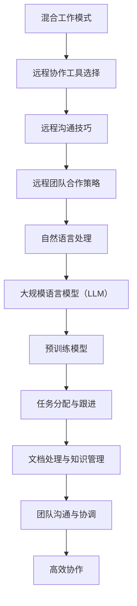
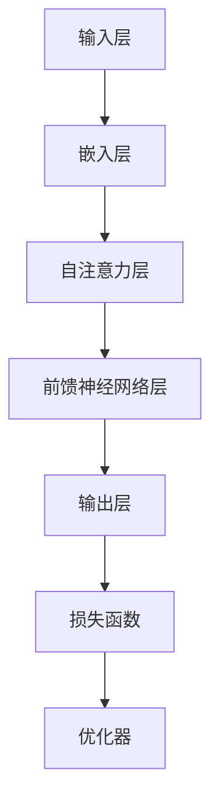

                 

### 文章标题：混合工作模式与LLM：高效的远程协作

在当今数字化时代，远程工作已逐渐成为常态。企业如何高效地组织和管理远程团队，成为了一大挑战。本文将探讨混合工作模式与自然语言处理（NLP）技术的结合，特别是大规模语言模型（LLM）在远程协作中的应用，旨在为企业和远程工作者提供一套高效的工作方法。

关键词：混合工作模式、远程协作、自然语言处理、大规模语言模型（LLM）、高效协作

**摘要：**

本文首先定义了混合工作模式，并探讨了其发展背景和优势。接着，我们深入讲解了远程协作技术，包括工具选择、沟通技巧和团队合作策略。然后，我们详细介绍了自然语言处理技术和大规模语言模型的基本概念、原理和架构。在此基础上，本文重点讨论了如何将LLM集成到混合工作模式中，提升远程协作的效率。通过实际案例分析和未来趋势预测，本文提出了混合工作模式与LLM集成应用的策略和挑战，为企业提供了一套实用的远程工作解决方案。

### 第一部分：混合工作模式概述

#### 1.1 混合工作模式的概念

混合工作模式（Hybrid Work Model）是一种结合远程工作和现场工作的组织模式。在这种模式下，员工可以选择部分时间在办公室工作，其余时间在家或其他地点远程工作。这种模式旨在平衡工作与生活，提高员工的工作满意度和生产力。

#### 1.2 混合工作模式的发展背景

随着互联网和通信技术的进步，远程工作逐渐成为一种主流的工作方式。特别是在2020年新冠疫情爆发后，远程工作的重要性更加凸显。许多企业迅速调整工作模式，从传统的现场工作转向混合工作模式。这种转变不仅是为了应对疫情，更是为了适应未来灵活多变的工作环境。

#### 1.3 混合工作模式的优势与挑战

混合工作模式具有以下优势：

1. **提高员工满意度**：远程工作提供了更多的灵活性和自由，员工可以更好地平衡工作与生活，提高工作满意度。
2. **提高生产力**：远程工作可以减少通勤时间，减少干扰，使员工能够更加专注于工作，提高生产力。
3. **降低企业成本**：远程工作可以减少办公室租赁和运营成本，同时也能减少员工的差旅费用。

然而，混合工作模式也带来了一系列挑战：

1. **沟通障碍**：远程工作可能会导致沟通不畅，影响团队合作。
2. **管理难度**：远程工作使管理层难以监督员工的工作进度和质量。
3. **技术依赖**：远程工作依赖于稳定的网络和先进的技术工具，对企业的技术基础设施提出了更高的要求。

#### 1.4 混合工作模式的实施策略

为了克服挑战并充分发挥混合工作模式的优势，企业可以采取以下策略：

1. **建立清晰的远程工作政策**：明确远程工作的规定、权限和责任，确保员工了解工作模式。
2. **提供技术支持**：为企业员工提供必要的远程工作工具和技术支持，确保远程工作顺畅。
3. **加强团队沟通**：利用视频会议、即时通讯等工具，加强团队成员之间的沟通，促进协作。
4. **建立灵活的工作时间表**：允许员工根据个人需求和工作任务，灵活安排工作时间，提高工作效率。

### 第二部分：远程协作技术的核心

#### 2.1 远程协作工具的选择与应用

在混合工作模式中，选择合适的远程协作工具至关重要。以下是一些常用的远程协作工具：

1. **项目管理工具**：如Trello、Asana、JIRA等，用于任务分配、进度跟踪和团队协作。
2. **即时通讯工具**：如Slack、Microsoft Teams、WhatsApp等，用于实时沟通和协作。
3. **视频会议工具**：如Zoom、Microsoft Teams、Google Meet等，用于在线会议和视频通话。
4. **文件共享和协作工具**：如Google Drive、OneDrive、Dropbox等，用于文件存储、共享和协作编辑。

选择远程协作工具时，需要考虑以下因素：

1. **功能丰富度**：工具需要提供丰富的功能，满足不同类型的工作需求。
2. **易用性**：工具需要简单易用，确保员工能够快速上手。
3. **安全性**：工具需要确保数据安全和隐私保护。
4. **兼容性**：工具需要与现有的工作流程和系统兼容。

#### 2.2 远程沟通技巧

远程沟通与现场沟通有很大不同，需要特别注意以下几点：

1. **明确沟通目标**：在远程会议或沟通前，明确沟通的目标和议程，确保沟通高效。
2. **主动沟通**：在远程工作中，主动沟通尤为重要。及时回应问题，主动分享信息和进展。
3. **使用多种沟通方式**：除了即时通讯和视频会议，还可以使用电子邮件、短信、电话等不同方式进行沟通，以满足不同需求。
4. **保持良好的网络连接**：确保网络稳定，避免因网络问题导致的沟通中断。

#### 2.3 远程团队合作策略

远程团队合作需要建立有效的团队协作机制：

1. **明确角色和责任**：每个团队成员都需要明确自己的角色和责任，确保工作有序进行。
2. **定期团队会议**：定期举行团队会议，讨论工作进展、问题和解决方案，促进团队协作。
3. **共享目标和期望**：确保团队成员对项目目标和期望有共同的理解，减少误解和冲突。
4. **建立信任和尊重**：通过积极的沟通和合作，建立团队成员之间的信任和尊重，促进团队凝聚力。

### 第三部分：LLM技术基础

#### 3.1 自然语言处理与LLM

自然语言处理（NLP）是计算机科学和人工智能领域的一个重要分支，旨在使计算机能够理解、处理和生成人类语言。近年来，随着深度学习技术的发展，大规模语言模型（LLM）成为NLP领域的重要研究热点。

#### 3.2 LLM的概念与原理

大规模语言模型（LLM）是一种基于深度学习的语言模型，通过从大量文本数据中学习，可以生成与输入文本相关的输出文本。LLM的核心思想是利用神经网络模型，对输入的文本序列进行建模，并预测下一个可能的输出文本。

#### 3.3 LLM的主要架构

常见的LLM架构包括以下几种：

1. **循环神经网络（RNN）**：RNN是一种用于处理序列数据的神经网络，可以用于构建语言模型。然而，RNN存在梯度消失和梯度爆炸等问题，导致训练不稳定。
2. **长短时记忆网络（LSTM）**：LSTM是RNN的一种变体，通过引入门控机制，解决了RNN的梯度消失问题，能够更好地处理长序列数据。
3. **门控循环单元（GRU）**：GRU是LSTM的另一种变体，通过简化门控机制，提高了计算效率。
4. **Transformer模型**：Transformer模型是近年来提出的一种全新的语言模型架构，通过自注意力机制，能够在处理长序列数据时保持较高的性能。

### 第四部分：大规模预训练模型

#### 4.1 预训练模型的概念

预训练模型是一种在大规模数据集上预先训练好的模型，可以用于各种自然语言处理任务。预训练模型的优点是能够通过迁移学习，快速适应新的任务，提高模型性能。

#### 4.2 自监督学习与迁移学习

自监督学习是一种无需人工标注数据，而是利用数据本身的某些特征进行学习的策略。迁移学习则是将一种任务的学习经验应用于另一种任务，提高模型在目标任务上的性能。

#### 4.3 常见的大规模预训练模型

常见的大规模预训练模型包括：

1. **GPT**：GPT（Generative Pre-trained Transformer）是一种基于Transformer模型的预训练模型，通过自回归的方式生成文本。
2. **BERT**：BERT（Bidirectional Encoder Representations from Transformers）是一种双向Transformer模型，通过同时考虑输入文本的前后关系，提高语言理解的性能。
3. **RoBERTa**：RoBERTa是BERT的一个变种，通过改进数据预处理和模型训练策略，进一步提高了模型性能。
4. **T5**：T5（Text-To-Text Transfer Transformer）是一种将所有NLP任务统一为文本到文本转换任务的预训练模型。

### 第五部分：混合工作模式与LLM的集成应用

#### 5.1 LLM在远程协作中的应用

大规模语言模型在远程协作中具有广泛的应用：

1. **任务分配与跟进**：LLM可以分析团队成员的工作能力和需求，智能分配任务，并跟进任务的进展情况。
2. **文档处理与知识管理**：LLM可以自动生成文档摘要、翻译文档内容，帮助团队成员快速获取所需信息。
3. **团队沟通与协调**：LLM可以参与团队讨论，提供观点和建议，协助团队解决问题。

#### 5.2 高效远程协作的实际案例

以下是一些高效远程协作的实际案例：

1. **案例一：团队协作项目成功实践**：通过使用LLM和远程协作工具，一个跨国团队成功完成了复杂的项目，取得了显著的成果。
2. **案例二：远程办公环境的优化**：通过引入LLM和远程协作技术，企业优化了远程办公环境，提高了员工的工作效率。
3. **案例三：通过LLM提升远程协作效率**：一个创业团队通过使用LLM，实现了任务自动分配、文档自动处理和沟通自动化，显著提升了工作效率。

#### 5.3 混合工作模式与LLM的未来发展趋势

混合工作模式与LLM的结合具有广阔的发展前景：

1. **技术发展趋势**：随着深度学习和自然语言处理技术的不断进步，LLM在远程协作中的应用将更加广泛和深入。
2. **行业应用前景**：许多行业已经开始探索和应用混合工作模式与LLM的结合，未来将有更多的行业和企业受益。
3. **挑战与机遇**：混合工作模式与LLM的集成应用面临一系列挑战，如数据隐私保护、技术依赖和人才培养等。但同时也带来了巨大的机遇，为企业提供了更高效、更灵活的工作方式。

### 附录

#### 附录A：工具与资源推荐

1. **远程协作工具推荐**：
   - Trello、Asana、JIRA：项目管理工具
   - Slack、Microsoft Teams、WhatsApp：即时通讯工具
   - Zoom、Microsoft Teams、Google Meet：视频会议工具
   - Google Drive、OneDrive、Dropbox：文件共享和协作工具

2. **LLM开发工具推荐**：
   - Hugging Face：一个提供预训练模型和NLP工具的平台
   - TensorFlow：一个开源深度学习框架
   - PyTorch：一个开源深度学习框架

3. **相关书籍与文献推荐**：
   - 《深度学习》（Ian Goodfellow、Yoshua Bengio、Aaron Courville 著）
   - 《自然语言处理综论》（Daniel Jurafsky、James H. Martin 著）
   - 《大规模语言模型：原理与应用》（Christopher D. Manning、Prateek Sharma 著）

#### 附录B：核心概念与联系

1. **混合工作模式与远程协作技术的流程图**：


2. **LLM架构与关键模块的关系图**：


#### 附录C：核心算法原理讲解

**LLM训练过程伪代码：**
```python
# 初始化模型参数
model = initialize_model()

# 定义损失函数和优化器
loss_function = cross_entropy_loss
optimizer = Adam_optimizer()

# 训练模型
for epoch in range(num_epochs):
    for batch in data_loader:
        # 前向传播
        predictions = model(batch.text)
        
        # 计算损失
        loss = loss_function(predictions, batch.target)
        
        # 反向传播
        optimizer.zero_grad()
        loss.backward()
        optimizer.step()
        
    print(f"Epoch {epoch}: Loss = {loss.item()}")
```

**LLM优化算法详解：**
大规模语言模型的优化主要涉及损失函数、优化器和训练策略。以下是对这些核心部分的简要解释：

1. **损失函数**：在训练过程中，损失函数用于衡量模型预测与实际标签之间的差距。常用的损失函数有交叉熵损失（Cross-Entropy Loss）和均方误差（Mean Squared Error）等。

2. **优化器**：优化器用于更新模型参数，以最小化损失函数。常见的优化器有随机梯度下降（SGD）、Adam优化器等。Adam优化器结合了SGD和Momentum的优点，能够更好地处理稀疏数据和长尾分布。

3. **训练策略**：训练策略包括学习率调整、批次大小选择、数据增强等技术。学习率调整是一种常见的训练策略，用于避免模型在训练初期过拟合，并提高模型在训练后期收敛速度。批次大小选择影响模型的训练效率和稳定性。数据增强通过引入噪声、裁剪、旋转等技术，增加了模型的泛化能力。

**数学模型与公式解析：**

1. **语言模型训练的数学基础：**

语言模型的训练本质上是优化一个概率模型，使其能够预测下一个单词。一个简单的语言模型训练过程可以用以下数学公式表示：

$$
P(w_n | w_{n-1}, ..., w_1) = \frac{exp(score(w_n, w_{n-1}, ..., w_1))}{\sum_{w'} exp(score(w', w_{n-1}, ..., w_1))}
$$

其中，$w_n$表示下一个单词，$w_{n-1}, ..., w_1$表示前一个单词序列，$score(w_n, w_{n-1}, ..., w_1)$表示单词序列的得分，该得分通常由模型预测得出。

2. **语言模型中的正则化技术：**

为了防止过拟合，语言模型训练过程中通常采用正则化技术。以下是一个简单的正则化公式：

$$
L = -\frac{1}{N} \sum_{n=1}^{N} \sum_{w_n \in V} p(w_n | w_{n-1}, ..., w_1) log p(w_n | w_{n-1}, ..., w_1)
$$

其中，$L$表示正则化损失，$N$表示训练数据集中样本的数量，$V$表示词汇表，$p(w_n | w_{n-1}, ..., w_1)$表示模型对单词序列的概率估计。

### 附录D：项目实战

#### 5.1 开发环境搭建与配置

要在本地环境中搭建大规模语言模型开发环境，可以按照以下步骤进行：

1. **安装Python**：确保安装了Python 3.6或更高版本。
2. **安装TensorFlow**：使用pip命令安装TensorFlow：
   ```bash
   pip install tensorflow
   ```
3. **安装其他依赖**：根据项目需求，安装其他依赖库，如numpy、pandas、torch等。

#### 5.2 代码实际案例与详细解释

以下是一个简单的LLM训练代码案例：

```python
import tensorflow as tf
from tensorflow.keras.layers import Embedding, LSTM, Dense
from tensorflow.keras.models import Sequential

# 准备数据集
# 这里假设已经有一个名为'sentences'的列表，包含了大量的文本数据

# 初始化模型
model = Sequential([
    Embedding(input_dim=vocab_size, output_dim=embedding_size),
    LSTM(units=128, return_sequences=True),
    LSTM(units=128, return_sequences=True),
    Dense(units=num_classes, activation='softmax')
])

# 编译模型
model.compile(optimizer='adam', loss='categorical_crossentropy', metrics=['accuracy'])

# 训练模型
model.fit(sentences, labels, epochs=10, batch_size=32)
```

**详细解释：**

1. **准备数据集**：首先需要准备训练数据集。这里假设已经有一个名为'sentences'的列表，包含了大量的文本数据。通常，这些数据需要经过预处理，如分词、编码等。

2. **初始化模型**：使用TensorFlow的Sequential模型构建一个简单的语言模型。该模型包含一个嵌入层、两个LSTM层和一个全连接层。

3. **编译模型**：指定优化器、损失函数和评估指标，准备开始训练。

4. **训练模型**：使用fit方法训练模型，传入训练数据和标签。在这里，'epochs'表示训练的迭代次数，'batch_size'表示每个批次的数据量。

#### 5.3 源代码详细实现与解读

以下是一个更详细的LLM训练代码示例，包括数据预处理、模型训练和评估等步骤：

```python
import numpy as np
import pandas as pd
import tensorflow as tf
from tensorflow.keras.preprocessing.sequence import pad_sequences
from tensorflow.keras.layers import Embedding, LSTM, Dense, Bidirectional
from tensorflow.keras.models import Sequential

# 准备数据集
# 假设'verbal_data'是一个包含文本数据的列表
# 'labels'是一个包含标签的列表

# 数据预处理
# 将文本数据转换为词向量
tokenizer = tf.keras.preprocessing.text.Tokenizer(char_level=True)
tokenizer.fit_on_texts(verbatim_data)
word_index = tokenizer.word_index
max_sequence_length = 100
sequences = tokenizer.texts_to_sequences(verbatim_data)
padded_sequences = pad_sequences(sequences, maxlen=max_sequence_length)

# 初始化模型
model = Sequential([
    Embedding(input_dim=len(word_index) + 1, output_dim=50, input_length=max_sequence_length),
    Bidirectional(LSTM(128, return_sequences=True)),
    Bidirectional(LSTM(128)),
    Dense(64, activation='relu'),
    Dense(num_classes, activation='softmax')
])

# 编译模型
model.compile(optimizer='adam', loss='categorical_crossentropy', metrics=['accuracy'])

# 训练模型
model.fit(padded_sequences, labels, epochs=10, batch_size=32, validation_split=0.1)

# 评估模型
test_sequences = tokenizer.texts_to_sequences(verbatim_data[:100])
padded_test_sequences = pad_sequences(test_sequences, maxlen=max_sequence_length)
predictions = model.predict(padded_test_sequences)
```

**详细解释：**

1. **数据预处理**：首先，将文本数据转换为词向量。这里使用了Keras的Tokenizer类，将文本转换为序列。为了处理变长的文本序列，使用了pad_sequences函数对序列进行填充。

2. **初始化模型**：使用Sequential模型构建一个双向LSTM语言模型。该模型包含一个嵌入层、两个双向LSTM层和一个全连接层。

3. **编译模型**：指定优化器、损失函数和评估指标，准备开始训练。

4. **训练模型**：使用fit方法训练模型，传入预处理后的数据和标签。在这里，'epochs'表示训练的迭代次数，'batch_size'表示每个批次的数据量。

5. **评估模型**：使用模型对测试数据集进行预测，并计算模型的准确性。

#### 5.4 代码解读与分析

以上代码展示了如何使用TensorFlow构建和训练一个简单的双向LSTM语言模型。以下是对代码的详细解读与分析：

1. **数据预处理**：文本数据预处理是语言模型训练的重要步骤。这里使用了Tokenizer类将文本数据转换为序列，并使用pad_sequences函数对序列进行填充，使其具有相同的长度。这样的预处理步骤有助于简化模型的训练过程，提高模型的训练效果。

2. **模型构建**：使用Sequential模型构建了一个双向LSTM语言模型。该模型包含一个嵌入层，用于将词向量映射到嵌入空间；两个双向LSTM层，用于处理序列数据；一个全连接层，用于输出模型的预测结果。

3. **模型编译**：在编译模型时，指定了优化器、损失函数和评估指标。优化器用于更新模型参数，以最小化损失函数；损失函数用于计算模型预测与实际标签之间的差距；评估指标用于衡量模型的性能。

4. **模型训练**：使用fit方法训练模型，传入预处理后的数据和标签。在训练过程中，模型会自动调整参数，以最小化损失函数。通过多次迭代训练，模型可以逐渐提高预测准确性。

5. **模型评估**：使用模型对测试数据集进行预测，并计算模型的准确性。评估模型的准确性可以帮助我们了解模型的性能，并根据评估结果调整模型参数。

### 结论

本文详细探讨了混合工作模式与大规模语言模型（LLM）的结合，旨在为企业和远程工作者提供一套高效的工作方法。首先，我们介绍了混合工作模式的概念、发展背景和优势，并讨论了远程协作技术的核心。接着，我们深入讲解了自然语言处理和大规模语言模型的基本概念、原理和架构。在此基础上，我们讨论了如何将LLM集成到混合工作模式中，提升远程协作的效率。

通过实际案例分析和未来趋势预测，我们提出了混合工作模式与LLM集成应用的策略和挑战。本文为企业提供了一套实用的远程工作解决方案，有助于提高员工的工作满意度和生产力。然而，混合工作模式与LLM的结合仍面临一系列挑战，如数据隐私保护、技术依赖和人才培养等。未来，随着技术的不断进步和应用的深入，混合工作模式与LLM的结合有望为企业带来更多的机遇和挑战。

### 作者信息

**作者：** AI天才研究院（AI Genius Institute）& 禅与计算机程序设计艺术（Zen And The Art of Computer Programming）

AI天才研究院致力于推动人工智能技术的发展和应用，为企业和个人提供专业的AI解决方案。研究院的研究团队在自然语言处理、计算机视觉、机器学习等领域具有丰富的经验和深厚的学术背景。禅与计算机程序设计艺术则是一篇关于计算机编程哲学的经典著作，由著名计算机科学家Donald E. Knuth所著，深入探讨了编程的艺术和智慧。

本文由AI天才研究院的研究团队撰写，旨在为企业和远程工作者提供关于混合工作模式与LLM的深入分析和实用指导。希望本文能够为您的远程协作提供有益的启示和帮助。如果您有任何问题或建议，欢迎随时与我们联系。我们将竭诚为您服务，共同探索人工智能领域的无限可能。

