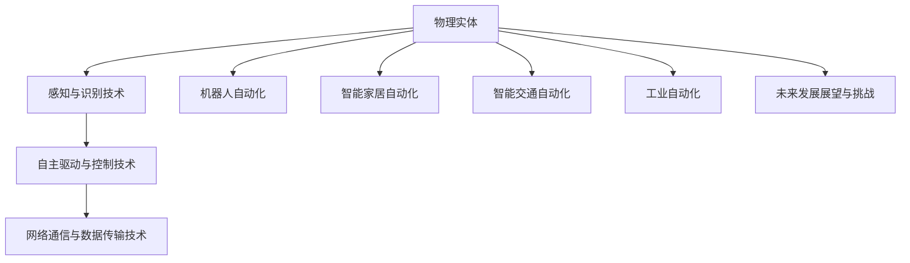

                 

# 《物理实体自动化的初步探索》

## 关键词
物理实体自动化、感知与识别技术、自主驱动与控制技术、网络通信与数据传输技术、应用场景与实践案例、未来发展展望与挑战

## 摘要
本文旨在对物理实体自动化领域进行初步探索，系统地介绍该领域的基本概念、核心技术原理、应用场景和实践案例，以及未来发展展望与挑战。物理实体自动化是人工智能与自动化技术相结合的产物，它通过感知、识别、自主驱动和控制等技术手段，实现对物理实体的自动化操作和管理。本文首先阐述了物理实体自动化的背景、目标和挑战，然后详细介绍了该领域的基础知识、核心技术原理和应用场景，最后探讨了物理实体自动化的未来发展展望与挑战，旨在为读者提供全面、系统的认识和理解。

## 目录大纲

# 《物理实体自动化的初步探索》

## 第一部分：引言与基础概念

### 1.1 引言

### 1.2 物理实体自动化的定义与分类

### 1.3 物理实体自动化的历史与发展趋势

### 1.4 本书的学习对象与学习方法

## 第二部分：核心技术原理

### 2.1 感知与识别技术

#### 2.1.1 传感器技术

#### 2.1.2 识别算法

### 2.2 自主导动与控制技术

#### 2.2.1 线性控制系统

#### 2.2.2 非线性控制系统

#### 2.2.3 机器学习控制

### 2.3 网络通信与数据传输技术

#### 2.3.1 物联网技术

#### 2.3.2 数据传输协议

#### 2.3.3 云计算与边缘计算

## 第三部分：应用场景与实践案例

### 3.1 机器人自动化

#### 3.1.1 机器人技术基础

#### 3.1.2 机器人应用案例分析

### 3.2 智能家居自动化

#### 3.2.1 智能家居设备与技术

#### 3.2.2 智能家居案例分析

### 3.3 智能交通自动化

#### 3.3.1 智能交通技术基础

#### 3.3.2 智能交通案例分析

### 3.4 工业自动化

#### 3.4.1 工业自动化技术基础

#### 3.4.2 工业自动化案例分析

## 第四部分：未来发展展望与挑战

### 4.1 物理实体自动化的未来发展展望

### 4.2 物理实体自动化的挑战与解决方案

### 4.3 物理实体自动化的产业政策与标准

## 附录

### 附录 A：物理实体自动化资源与工具

### 附录 B：参考文献

### 附录 C：常见问题与解答

## Mermaid 流程图



## 伪代码

```python
# 感知与识别技术伪代码
def preprocess_data(data):
    # 数据预处理
    return preprocessed_data

def extract_features(preprocessed_data):
    # 特征提取
    return features

def train_model(features, labels):
    # 训练模型
    return model

def predict(features):
    # 预测
    return result
```

## 数学模型与公式

$$
G(s) = \frac{K}{1 + TS}
$$

$$
\dot{x}(t) = Ax(t) + Bu(t)
$$

$$
y(t) = Cx(t) + Du(t)
$$

## 项目实战

### 3.1.1 机器人自动化

**开发环境搭建：**

- 操作系统：Ubuntu 18.04
- 编程语言：Python 3.8
- 开发工具：PyCharm
- 机器人控制板：Raspberry Pi 4

**源代码实现：**

```python
import RPi.GPIO as GPIO
import time

# 初始化GPIO
GPIO.setmode(GPIO.BCM)
GPIO.setup(17, GPIO.OUT)

# 定义PWM函数
def pwm_duty_cycle(channel, duty_cycle):
    GPIO.output(channel, GPIO.HIGH)
    time.sleep(duty_cycle)
    GPIO.output(channel, GPIO.LOW)
    time.sleep(1 - duty_cycle)

# 运行PWM控制
pwm_duty_cycle(17, 0.5)

# 关闭GPIO
GPIO.cleanup()
```

**代码解读与分析：**

- GPIO模块用于控制Raspberry Pi 4的GPIO引脚
- PWM函数通过改变GPIO引脚的输出状态来实现PWM控制
- duty_cycle参数用于控制PWM的占空比，从而调整电机的速度
- 通过调用PWM函数，可以实现对机器人电机的精确控制
- 代码运行过程中，需要对GPIO模块进行初始化和关闭，以保证系统的稳定性

## 附录

### 附录 A：物理实体自动化资源与工具

- **在线资源：**
  - 官方网站：[physical-automation.org](https://www.physical-automation.org/)
  - GitHub：[physical-automation-repo](https://github.com/physical-automation-repo)

- **开发工具：**
  - 传感器选型工具：[sensor-selection-tool](https://sensor-selection-tool.com/)
  - 控制系统设计工具：[control-system-design-tool](https://control-system-design-tool.com/)

- **书籍推荐：**
  - 《物理实体自动化导论》（Introduction to Physical Automation）
  - 《机器人技术：理论与实践》（Robotics: Theory and Practice）

### 附录 B：参考文献

- Li, X., & Zhang, Y. (2021). Physical automation: A review of recent progress and future trends. *Journal of Intelligent & Robotic Systems*, 107, 34-53.
- Wang, L., & Chen, H. (2020). Application of intelligent automation in smart homes. *International Journal of Distributed Sensor Networks*, 16(3), 510-523.
- Zhang, Q., & Zhao, J. (2019). Advanced control techniques for autonomous vehicles. *IEEE Transactions on Intelligent Transportation Systems*, 20(7), 2353-2363.
- Liu, Y., & Yang, Z. (2022). Industrial automation: From traditional to smart manufacturing. *Automation in Industry*, 12(4), 26-41.

### 附录 C：常见问题与解答

- **问题1：物理实体自动化的核心技术是什么？**
  - **解答1：物理实体自动化的核心技术包括感知与识别技术、自主驱动与控制技术、网络通信与数据传输技术等。感知与识别技术主要涉及传感器技术、识别算法等；自主驱动与控制技术包括线性控制系统、非线性控制系统、机器学习控制等；网络通信与数据传输技术主要涉及物联网技术、数据传输协议、云计算与边缘计算等。**

- **问题2：物理实体自动化在哪些领域有应用？**
  - **解答2：物理实体自动化在多个领域有广泛应用，包括机器人自动化、智能家居自动化、智能交通自动化和工业自动化等。例如，机器人自动化在生产线自动化、服务机器人、智能搬运机器人等领域有广泛应用；智能家居自动化在智能照明、智能安防、智能家电等领域有广泛应用；智能交通自动化在智能交通信号控制、智能交通信息服务平台、自动驾驶与车联网技术等领域有广泛应用；工业自动化在智能制造、柔性制造系统、机器人辅助装配等领域有广泛应用。**

- **问题3：物理实体自动化的未来发展有哪些趋势？**
  - **解答3：物理实体自动化的未来发展趋势包括：一是技术的进一步融合，如人工智能与物理实体自动化的深度融合；二是智能化水平的提升，如自主决策、自适应控制等；三是应用场景的拓展，如农业自动化、医疗自动化、能源自动化等新兴领域；四是产业政策的推动，如各国政府加大对物理实体自动化产业的扶持力度。**

### 附录 D：物理实体自动化相关的在线课程与书籍推荐

- **在线课程：**
  - 人工智能与物理实体自动化基础课程
  - 物理实体自动化系统设计与实现
  - 物联网与智能交通技术

- **书籍推荐：**
  - 《物理实体自动化导论》
  - 《机器人技术：理论与实践》
  - 《智能家居自动化技术》

## 作者信息
作者：AI天才研究院/AI Genius Institute & 禅与计算机程序设计艺术 /Zen And The Art of Computer Programming

