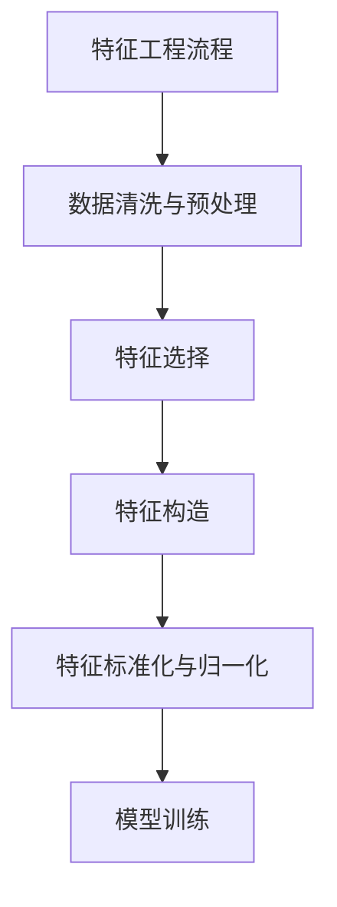

                 

### 文章标题：特征工程（Feature Engineering）

### 关键词：特征工程、机器学习、数据预处理、特征选择、特征构造、文本数据、图像数据

### 摘要：
本文深入探讨了特征工程在机器学习中的重要性及其在多个领域的应用。首先，介绍了特征工程的核心概念和流程，包括数据预处理、特征选择和构造、以及特征标准化。随后，详细阐述了各种特征选择方法，如基于过滤、基于包裹和基于嵌入的特征选择，并使用伪代码和数学公式解释了核心算法原理。此外，本文通过具体案例展示了特征工程在文本数据和图像数据中的实战应用，并提供了详细的代码实现和解读。最后，总结了特征工程的最佳实践和未来发展趋势，为读者提供了全面的指导。

---

## 《特征工程（Feature Engineering）》目录大纲

### 第一部分：特征工程基础

## 第1章：特征工程概述

### 1.1 特征工程的重要性

- 特征工程在机器学习中的角色
- 特征工程的目标

### 1.2 特征工程流程

- 数据清洗与预处理
- 特征选择
- 特征构造
- 特征标准化与归一化

### 1.3 特征工程工具与技术

- 数据库查询语言（如SQL）
- Python数据科学库（如Pandas、NumPy）
- 特征选择算法（如PCA、基于模型的特征选择）

## 第2章：数据预处理

### 2.1 数据清洗

- 缺失值的处理
- 异常值的检测与处理

### 2.2 数据转换

- 日期时间的转换
- 类别数据的编码

### 2.3 数据归一化与标准化

- 归一化方法（如最小-最大缩放、z-score标准化）
- 标准化方法（如均值归一化、方差缩放）

### 第二部分：特征选择与构造

## 第3章：特征选择方法

### 3.1 基于过滤的特征选择

- 信息增益
- 互信息
- Gini不纯度

### 3.2 基于包裹的特征选择

- 递归特征消除（RFE）
- 基于模型的特征选择

### 3.3 基于嵌入的特征选择

- 主成分分析（PCA）
- 特征重要性排序

## 第4章：特征构造技术

### 4.1 高级特征构造方法

- 特征交叉
- 特征组合
- 集成学习方法

### 4.2 序列特征构造

- 时间序列特征提取
- 序列模式挖掘

### 4.3 空间特征构造

- 空间特征提取
- 地理编码

### 第三部分：特征工程应用

## 第5章：文本数据特征工程

### 5.1 词袋模型与TF-IDF

- 词袋模型
- TF-IDF计算

### 5.2 词嵌入技术

- 词嵌入概念
- 词嵌入模型（如Word2Vec、GloVe）

### 5.3 文本分类特征工程

- 文本表示学习
- 文本特征提取

## 第6章：图像数据特征工程

### 6.1 图像特征提取

- 视觉基础概念
- 图像特征提取方法（如HOG、SIFT、ORB）

### 6.2 基于深度学习的图像特征工程

- 卷积神经网络（CNN）
- 图像嵌入

### 6.3 多媒体数据特征工程

- 视频特征提取
- 音频特征提取

## 第7章：特征工程实战案例

### 7.1 实战项目介绍

- 数据集介绍
- 问题定义

### 7.2 特征工程实施

- 数据预处理
- 特征选择与构造
- 特征标准化

### 7.3 模型训练与评估

- 模型选择
- 模型评估
- 模型优化

## 第8章：特征工程最佳实践

### 8.1 特征工程原则与策略

- 特征工程基本原则
- 特征工程策略

### 8.2 特征工程工具与平台

- 开源特征工程工具（如Scikit-learn、TensorFlow）
- 企业级特征工程平台

### 8.3 特征工程挑战与展望

- 特征工程面临的挑战
- 未来特征工程的发展趋势

## 附录

### 附录A：特征工程相关资源

- 特征工程论文与书籍推荐
- 特征工程在线教程与课程

### 附录B：Mermaid流程图示例

- Mermaid流程图代码与输出结果展示

---

本文将按照上述目录大纲的结构，逐步分析并探讨特征工程的核心概念、方法和技术，并通过实际案例展示其应用过程和效果。接下来，我们将深入探讨特征工程的基础知识，包括其重要性、基本流程和常用工具技术。

---

### 第1章：特征工程概述

#### 1.1 特征工程的重要性

特征工程是机器学习过程中至关重要的一环。它不仅决定了数据的质量，还对模型的性能有着直接影响。特征工程的目标是通过转换原始数据，提取出对模型训练有帮助的特征，从而提高模型的可解释性和准确性。以下是特征工程在机器学习中的几个关键角色：

1. **提高模型性能**：通过特征工程，可以减少数据的噪声，突出数据的特征，使模型能够更准确地学习数据中的模式和规律。
2. **可解释性增强**：特征工程有助于理解数据中的关键因素，使得模型更加可解释，有助于识别潜在的业务问题。
3. **减少过拟合**：通过特征选择和构造，可以降低模型对训练数据的依赖，减少过拟合现象。
4. **数据预处理**：特征工程包括数据清洗、转换、归一化等步骤，这些步骤是确保数据质量的重要环节。

#### 1.2 特征工程流程

特征工程的基本流程可以分为以下几个步骤：

1. **数据清洗与预处理**：处理数据中的缺失值、异常值，并进行数据转换和归一化。
2. **特征选择**：从原始特征中挑选出对模型有显著贡献的特征。
3. **特征构造**：通过特征交叉、组合等方法，生成新的特征。
4. **特征标准化与归一化**：调整特征之间的尺度，使模型训练更加稳定。

#### 1.3 特征工程工具与技术

在进行特征工程时，常用的工具和技术包括：

1. **数据库查询语言（如SQL）**：用于从数据库中提取和操作数据。
2. **Python数据科学库（如Pandas、NumPy）**：用于数据处理、清洗和转换。
3. **特征选择算法（如PCA、基于模型的特征选择）**：用于从原始特征中挑选出重要的特征。

下面是特征工程流程的Mermaid流程图：



输出结果：

```
流程图示例：
---

graph TD
    A[特征工程流程] --> B[数据清洗与预处理]
    B --> C[特征选择]
    C --> D[特征构造]
    D --> E[特征标准化与归一化]
    E --> F[模型训练]
```

通过上述步骤和流程，我们可以系统地开展特征工程工作，为后续的模型训练打下坚实的基础。

---

在接下来的章节中，我们将深入讨论数据预处理、特征选择和构造的具体方法，并使用伪代码和数学公式详细阐述核心算法原理。敬请期待！

