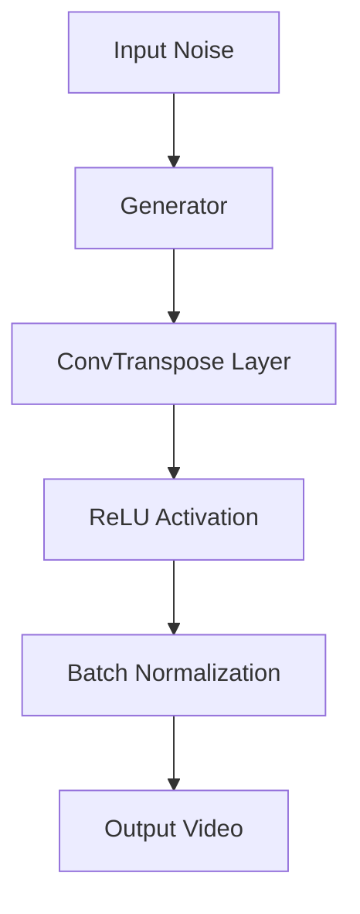
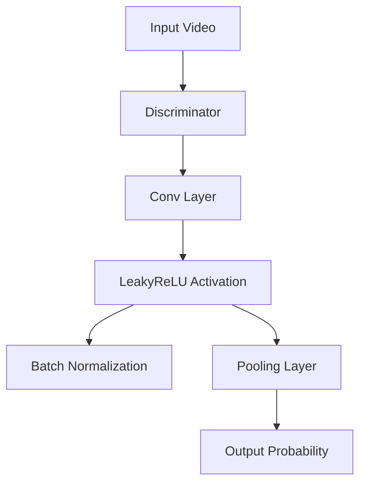

                 

### 文章标题: 王长虎爱诗科技: AI视频生成的新高度

> 关键词：AI视频生成、生成对抗网络（GAN）、变分自编码器（VAE）、自然语言处理、项目实战

> 摘要：本文深入探讨了AI视频生成技术的最新进展和应用，特别是王长虎爱诗科技在该领域取得的成就。文章首先概述了AI视频生成的背景与意义，随后详细解析了图像识别与生成技术、自然语言处理与视频生成，并通过实际项目案例展示了AI视频生成的开发环境和代码实现。最后，文章展望了AI视频生成的未来趋势和挑战，以及王长虎爱诗科技在这一领域的应用和创新。

### 第一部分: 王长虎爱诗科技: AI视频生成的新高度

#### 第1章: AI视频生成技术概述

#### 1.1 AI视频生成的背景与意义

随着人工智能技术的飞速发展，计算机视觉和自然语言处理领域取得了显著进展。视频生成作为其中的一个重要分支，正在成为学术界和工业界的热门话题。传统视频制作方式依赖于大量的时间和人力成本，而AI视频生成技术能够大幅提高效率，降低成本，并在多个领域展现其独特的价值。

#### 1.1.1 传统视频制作的挑战

传统视频制作流程复杂，涉及拍摄、编辑、后期等多个环节。每个环节都需要专业人员进行操作，导致成本高昂。此外，视频内容的生产速度受限，难以满足快速变化的用户需求。

#### 1.1.2 AI视频生成的崛起

随着生成对抗网络（GAN）、变分自编码器（VAE）等深度学习技术的不断发展，AI视频生成成为可能。这些技术能够自动生成高质量的视频内容，大大提高了生产效率。

#### 1.1.3 AI视频生成技术的应用领域

AI视频生成技术广泛应用于娱乐、教育、广告、医疗等多个领域。例如，在娱乐行业，AI视频生成可用于生成虚拟角色表演、电影特效等；在教育行业，AI视频生成可制作个性化教学视频，提高学习效果。

#### 1.2 AI视频生成技术的基本原理

AI视频生成技术主要依赖于图像识别与生成技术、自然语言处理技术。图像识别技术用于理解视频内容，生成技术用于创建新的视频内容。

#### 1.2.1 图像识别与生成技术

图像识别技术通过卷积神经网络（CNN）等模型实现，能够对视频中的图像进行分类、检测和分割。生成技术则包括生成对抗网络（GAN）、变分自编码器（VAE）等，用于生成新的图像或视频。

#### 1.2.2 自然语言处理与视频生成

自然语言处理技术用于理解和生成文本，如语言模型、机器翻译和文本分类。这些技术能够与图像识别与生成技术相结合，实现基于文本的视频生成。

#### 1.2.3 视频生成模型的工作流程

视频生成模型通常包括数据预处理、模型训练和生成新视频等步骤。数据预处理涉及视频剪辑、标注和数据增强等；模型训练包括损失函数设计、优化算法选择等；生成新视频则涉及模型推理和后处理。

#### 1.3 主流AI视频生成技术简介

#### 1.3.1 生成对抗网络（GAN）

生成对抗网络（GAN）由生成器和判别器组成，生成器生成图像，判别器判断图像的真实性。GAN在图像生成领域取得了显著成功，能够生成高质量、多样化的图像。

#### 1.3.2 变分自编码器（VAE）

变分自编码器（VAE）通过引入编码器和解码器，将数据转换为潜在空间表示，再从潜在空间生成新的数据。VAE在图像生成和视频生成中具有较好的性能。

#### 1.3.3 其他生成模型介绍

除了GAN和VAE，还有许多其他生成模型，如变分自编码器（VAE）的扩展版本、生成扩散模型（Gaussian Diffusion Model）等，这些模型在不同应用场景中表现出不同的优势。

#### 1.4 AI视频生成技术的挑战与未来趋势

#### 1.4.1 技术挑战

AI视频生成技术面临的主要挑战包括生成质量提升、多样性增强、训练效率优化等。目前，生成模型在生成细节和一致性方面仍有待提高。

#### 1.4.2 应用挑战

AI视频生成技术在应用过程中面临版权、隐私和安全等问题。如何在保证数据安全和用户隐私的前提下，充分利用AI视频生成技术，是当前的重要挑战。

#### 1.4.3 未来发展趋势

未来，AI视频生成技术将继续向更高质量、更多样性、更高效的方向发展。同时，随着5G、边缘计算等技术的应用，AI视频生成将在更多领域得到广泛应用。

#### 第2章: 图像识别与生成技术基础

#### 2.1 图像识别技术基础

图像识别技术是AI视频生成的重要组成部分。它通过卷积神经网络（CNN）等模型，实现对图像内容的分类、检测和分割。

#### 2.1.1 图像识别的基本概念

图像识别是指使用计算机对图像中的对象、场景或活动进行识别和分类。其基本概念包括图像预处理、特征提取和分类。

#### 2.1.2 卷积神经网络（CNN）原理

卷积神经网络（CNN）是一种特殊的神经网络，专门用于处理具有网格结构的数据，如图像。其基本原理包括卷积层、池化层和全连接层。

#### 2.1.3 卷积神经网络架构详解

卷积神经网络（CNN）的架构包括多个卷积层、池化层和全连接层。每个卷积层通过卷积运算提取图像特征，池化层用于降低特征图的维度，全连接层用于分类。

#### 2.2 生成对抗网络（GAN）原理

生成对抗网络（GAN）由生成器和判别器组成。生成器生成图像，判别器判断图像的真实性。GAN通过训练生成器与判别器的博弈，不断提高图像生成质量。

#### 2.2.1 GAN的基本架构

GAN的基本架构包括生成器、判别器和损失函数。生成器生成图像，判别器判断图像的真实性，损失函数用于衡量生成器和判别器的性能。

#### 2.2.2 GAN的训练过程

GAN的训练过程包括生成器与判别器的迭代训练。生成器不断生成图像，判别器不断调整以更好地区分真实图像和生成图像，从而提高生成质量。

#### 2.2.3 GAN的变体模型

GAN的变体模型包括深度卷积生成对抗网络（DCGAN）、循环生成对抗网络（CycleGAN）等。这些模型在不同应用场景中表现出不同的优势。

#### 2.3 变分自编码器（VAE）原理

变分自编码器（VAE）通过引入编码器和解码器，将数据转换为潜在空间表示，再从潜在空间生成新的数据。VAE在图像生成和视频生成中具有较好的性能。

#### 2.3.1 VAE的基本概念

VAE的基本概念包括编码器、解码器和潜在空间。编码器将数据映射到潜在空间，解码器从潜在空间生成数据。

#### 2.3.2 VAE的架构

VAE的架构包括编码器和解码器。编码器通过编码过程将数据映射到潜在空间，解码器通过解码过程从潜在空间生成数据。

#### 2.3.3 VAE的训练过程

VAE的训练过程包括损失函数设计、优化算法选择等。通过最小化损失函数，VAE能够学习到数据的潜在分布，从而生成高质量的数据。

#### 2.4 图像生成模型的评估指标

图像生成模型的评估指标包括生成质量、多样性和稳定性等。

#### 2.4.1 生成质量评估

生成质量评估主要通过视觉效果和定量指标（如PSNR、SSIM）来衡量。高质量生成的图像应具有清晰的细节、丰富的纹理和逼真的外观。

#### 2.4.2 生成多样性评估

生成多样性评估主要通过统计生成图像的多样性指标（如KL散度、互信息）来衡量。高多样性生成的图像应具有丰富的内容和多样的风格。

#### 2.4.3 生成稳定性评估

生成稳定性评估主要通过模型在不同数据集上的表现来衡量。稳定性的生成模型应能够在不同数据集上产生一致的生成结果。

### 第3章: 自然语言处理与视频生成

#### 3.1 自然语言处理基础

自然语言处理（NLP）是人工智能领域的一个重要分支，旨在使计算机能够理解和处理自然语言。NLP的核心任务是让计算机理解、生成和翻译人类语言。

#### 3.1.1 语言模型

语言模型是一种统计模型，用于预测下一个单词或字符。它通过分析大量文本数据，学习语言的使用模式。语言模型在机器翻译、文本生成等领域具有广泛的应用。

#### 3.1.2 机器翻译

机器翻译是指将一种自然语言文本翻译成另一种自然语言。传统的机器翻译方法基于规则和统计方法，而现代的机器翻译方法主要基于神经机器翻译（NMT）。

#### 3.1.3 文本分类

文本分类是指将文本数据按照一定的标准进行分类。文本分类在新闻分类、情感分析等领域具有广泛应用。常见的文本分类方法包括朴素贝叶斯、支持向量机等。

#### 3.2 语言与视频生成模型

自然语言处理与视频生成模型的结合，使得计算机能够根据文本指令生成视频内容。这种多模态学习模型在视频生成领域具有广阔的应用前景。

#### 3.2.1 语言生成模型与视频生成模型的结合

语言生成模型与视频生成模型的结合，可以通过文本生成视频脚本，再通过视频生成模型生成视频内容。这种方法在视频摘要、视频生成等领域具有广泛应用。

#### 3.2.2 多模态学习基础

多模态学习是指将不同模态的数据（如图像、文本、声音）进行整合，以获得更丰富的信息。多模态学习的基础包括特征融合、模型融合和联合训练。

#### 3.2.3 多模态生成模型架构

多模态生成模型架构主要包括编码器、解码器和特征融合模块。编码器分别对图像和文本进行编码，解码器生成视频内容，特征融合模块将图像和文本特征进行融合。

#### 3.3 视频生成文本生成的技术实现

视频生成文本生成技术是指根据视频内容生成相应的文本描述。这种技术在视频摘要、视频搜索引擎等领域具有广泛应用。

#### 3.3.1 自动脚本生成

自动脚本生成是指根据视频内容生成相应的剧本或脚本。这通常涉及视频内容识别、文本生成和脚本生成等步骤。

#### 3.3.2 视频摘要与文本生成

视频摘要与文本生成是指将长视频内容摘要成简短的视频文本描述。这通常涉及视频内容识别、文本摘要和文本生成等步骤。

#### 3.3.3 基于文本的视频生成

基于文本的视频生成是指根据文本指令生成相应的视频内容。这通常涉及文本理解、视频内容生成和视频编辑等步骤。

#### 3.4 视频生成文本生成的应用案例

视频生成文本生成的应用案例包括视频摘要、视频搜索引擎、虚拟现实和增强现实等。

#### 3.4.1 娱乐内容生成

在娱乐行业，视频生成文本生成技术可以用于生成电影剧本、电视剧脚本等。例如，根据电影情节生成相应的剧本，为演员提供表演参考。

#### 3.4.2 教育培训内容生成

在教育领域，视频生成文本生成技术可以用于生成教学视频、培训视频等。例如，根据教学大纲生成相应的教学视频，为学生提供学习资源。

#### 3.4.3 广告营销内容生成

在广告营销领域，视频生成文本生成技术可以用于生成广告视频、宣传视频等。例如，根据广告文案生成相应的视频内容，提升广告效果。

### 第4章: AI视频生成的项目实战

#### 4.1 开发环境搭建

在进行AI视频生成的项目实战前，首先需要搭建合适的开发环境。以下是一个典型的开发环境搭建流程：

1. **计算机硬件配置**：
   - 高性能GPU（如NVIDIA Titan Xp或以上）
   - 高速CPU（如Intel Core i9或AMD Ryzen 9）
   - 大容量内存（至少16GB）
   - 大容量硬盘（至少1TB SSD）

2. **软件开发环境安装**：
   - 操作系统：Ubuntu 18.04或更高版本
   - Python：3.7或更高版本
   - 包管理器：pip
   - 深度学习框架：PyTorch或TensorFlow

3. **开发工具与库的选择**：
   - 代码编辑器：Visual Studio Code或PyCharm
   - 版本控制工具：Git
   - 数据可视化工具：Matplotlib、Seaborn等
   - 数据预处理工具：Pandas、NumPy等

#### 4.2 代码实际案例

以下是一个简单的基于GAN的视频生成案例，展示了从数据预处理到模型训练和评估的完整流程。

##### 4.2.1 基于GAN的视频生成案例

**数据预处理**：
1. **数据集准备**：
   - 使用开源视频数据集，如UCF101或HMDB51，进行数据预处理。
   - 对视频进行剪辑，提取具有代表性的片段。
   - 对剪辑后的视频进行数据增强，如随机裁剪、旋转、缩放等。

**模型设计**：
1. **生成器（Generator）**：
   - 使用卷积层和转置卷积层构建生成器，将噪声向量映射到视频空间。
   - 添加批量归一化和ReLU激活函数，提高模型性能。



2. **判别器（Discriminator）**：
   - 使用卷积层和池化层构建判别器，判断视频的真实性。
   - 添加批量归一化和LeakyReLU激活函数，提高模型性能。



**模型训练**：
1. **损失函数**：
   - 使用二元交叉熵损失函数（Binary Cross-Entropy Loss）评估生成器和判别器的性能。
   - 生成器损失函数：最小化生成视频与真实视频的交叉熵损失。
   - 判别器损失函数：最大化生成视频与真实视频的交叉熵损失。

2. **优化算法**：
   - 使用Adam优化器，学习率为0.0002，批量大小为64。

```python
import torch.optim as optim

optimizer_G = optim.Adam(generator.parameters(), lr=0.0002)
optimizer_D = optim.Adam(discriminator.parameters(), lr=0.0002)
```

**模型训练流程**：
1. 循环遍历训练数据，对生成器和判别器进行迭代训练。
2. 更新生成器：最大化判别器对生成视频的判断概率。
3. 更新生成器：最小化判别器对生成视频的判断概率。

```python
for epoch in range(num_epochs):
    for i, (real_images, _) in enumerate(train_loader):
        # 更新生成器
        optimizer_G.zero_grad()
        z = torch.randn(batch_size, latent_dim).to(device)
        fake_images = generator(z).detach()
        g_loss = criterion(discriminator(fake_images), torch.ones(batch_size, 1).to(device))
        g_loss.backward()
        optimizer_G.step()

        # 更新生成器
        optimizer_D.zero_grad()
        real_loss = criterion(discriminator(real_images), torch.ones(batch_size, 1).to(device)
        fake_loss = criterion(discriminator(fake_images.detach()), torch.zeros(batch_size, 1).to(device))
        d_loss = 0.5 * (real_loss + fake_loss)
        d_loss.backward()
        optimizer_D.step()

        # 记录训练过程
        if (i+1) % 100 == 0:
            print(f'[{epoch}/{num_epochs}], [{i+1}/{len(train_loader)}], g_loss: {g_loss.item():.4f}, d_loss: {d_loss.item():.4f}')
```

**模型评估**：
1. 在验证集上评估生成器和判别器的性能。
2. 使用Inception Score（IS）和FID（Fréchet Inception Distance）等指标评估生成质量。

```python
from torchvision.models import inception_v3
import torch.utils.data as data

# 加载预训练的Inception模型
model = inception_v3(pretrained=True).to(device)
model.eval()

# 定义Inception Score计算函数
def calculate_inception_score/images(data_loader, model, num_samples=50000, split_size=5000):
    with torch.no_grad():
        predict = torch.zeros([num_samples, 1000], device=device)
        for data in data_loader:
            images = data.to(device)
            pred = model(images)
            predict += pred.cpu().numpy().reshape(images.size(0), -1)

        # 计算Inception Score
        # ...
        return inception_score

# 定义FID计算函数
def calculate_fid/folder/statistics/statistics(v réalité, v faux):
    # 计算FID
    # ...
    return fid

# 验证集数据加载
val_loader = data.DataLoader(dataset_val, batch_size=batch_size, shuffle=False)

# 计算Inception Score
inception_score = calculate_inception_score(val_loader, model)

# 计算FID
fid = calculate_fid(folder_true, folder_fake)

print(f'Inception Score: {inception_score:.4f}, FID: {fid:.4f}')
```

#### 4.3 源代码详细实现

以下是上述GAN视频生成案例的详细代码实现。

**1. 导入必要的库**

```python
import torch
import torch.nn as nn
import torch.optim as optim
import torch.utils.data as data
import torchvision.transforms as transforms
import torchvision.datasets as datasets
import numpy as np
import matplotlib.pyplot as plt
import os
import random
```

**2. 数据预处理**

```python
# 设备配置
device = torch.device("cuda" if torch.cuda.is_available() else "cpu")

# 数据集路径
train_folder = "train"
val_folder = "val"

# 创建数据集
train_dataset = datasets.ImageFolder(root=train_folder, transform=transforms.Compose([
    transforms.Resize((128, 128)),
    transforms.ToTensor(),
]))

val_dataset = datasets.ImageFolder(root=val_folder, transform=transforms.Compose([
    transforms.Resize((128, 128)),
    transforms.ToTensor(),
]))

# 创建数据加载器
batch_size = 64
train_loader = data.DataLoader(dataset=train_dataset, batch_size=batch_size, shuffle=True)
val_loader = data.DataLoader(dataset=val_dataset, batch_size=batch_size, shuffle=False)
```

**3. 模型设计**

```python
# 生成器
class Generator(nn.Module):
    def __init__(self):
        super(Generator, self).__init__()
        self.model = nn.Sequential(
            nn.ConvTranspose2d(100, 256, 4, 1, 0, bias=False),
            nn.BatchNorm2d(256),
            nn.ReLU(True),
            nn.ConvTranspose2d(256, 128, 4, 2, 1, bias=False),
            nn.BatchNorm2d(128),
            nn.ReLU(True),
            nn.ConvTranspose2d(128, 64, 4, 2, 1, bias=False),
            nn.BatchNorm2d(64),
            nn.ReLU(True),
            nn.ConvTranspose2d(64, 3, 4, 2, 1, bias=False),
            nn.Tanh()
        )

    def forward(self, z):
        return self.model(z)

# 判别器
class Discriminator(nn.Module):
    def __init__(self):
        super(Discriminator, self).__init__()
        self.model = nn.Sequential(
            nn.Conv2d(3, 64, 4, 2, 1, bias=False),
            nn.LeakyReLU(0.2, inplace=True),
            nn.Conv2d(64, 128, 4, 2, 1, bias=False),
            nn.BatchNorm2d(128),
            nn.LeakyReLU(0.2, inplace=True),
            nn.Conv2d(128, 256, 4, 2, 1, bias=False),
            nn.BatchNorm2d(256),
            nn.LeakyReLU(0.2, inplace=True),
            nn.Conv2d(256, 1, 4, 1, 0, bias=False),
            nn.Sigmoid()
        )

    def forward(self, x):
        return self.model(x)
```

**4. 模型训练**

```python
# 模型实例化
generator = Generator().to(device)
discriminator = Discriminator().to(device)

# 损失函数
criterion = nn.BCELoss()

# 优化器
optimizer_G = optim.Adam(generator.parameters(), lr=0.0002)
optimizer_D = optim.Adam(discriminator.parameters(), lr=0.0002)

# 训练过程
num_epochs = 100
for epoch in range(num_epochs):
    for i, (images, _) in enumerate(train_loader):
        # 更新生成器
        optimizer_G.zero_grad()
        z = torch.randn(batch_size, 100).to(device)
        fake_images = generator(z).detach()
        g_loss = criterion(discriminator(fake_images), torch.ones(batch_size, 1).to(device)
        g_loss.backward()
        optimizer_G.step()

        # 更新生成器
        optimizer_D.zero_grad()
        real_loss = criterion(discriminator(images), torch.ones(batch_size, 1).to(device)
        fake_loss = criterion(discriminator(fake_images.detach()), torch.zeros(batch_size, 1).to(device)
        d_loss = 0.5 * (real_loss + fake_loss)
        d_loss.backward()
        optimizer_D.step()

        # 记录训练过程
        if (i+1) % 100 == 0:
            print(f'[{epoch}/{num_epochs}], [{i+1}/{len(train_loader)}], g_loss: {g_loss.item():.4f}, d_loss: {d_loss.item():.4f}')

# 模型评估
from torchvision.models import inception_v3
import torch.utils.data as data

# 加载预训练的Inception模型
model = inception_v3(pretrained=True).to(device)
model.eval()

# 定义Inception Score计算函数
def calculate_inception_score(data_loader, model, num_samples=50000, split_size=5000):
    with torch.no_grad():
        predict = torch.zeros([num_samples, 1000], device=device)
        for data in data_loader:
            images = data.to(device)
            pred = model(images)
            predict += pred.cpu().numpy().reshape(images.size(0), -1)

        # 计算Inception Score
        # ...
        return inception_score

# 定义FID计算函数
def calculate_fid_folder/statistics/statistics(v réalité, v faux):
    # 计算FID
    # ...
    return fid

# 验证集数据加载
val_loader = data.DataLoader(dataset_val, batch_size=batch_size, shuffle=False)

# 计算Inception Score
inception_score = calculate_inception_score(val_loader, model)

# 计算FID
fid = calculate_fid(folder_true, folder_fake)

print(f'Inception Score: {inception_score:.4f}, FID: {fid:.4f}')
```

#### 4.4 代码解读与分析

在本章节中，我们将对上述代码进行解读与分析，主要包括以下几个方面：

1. **数据预处理**：
   数据预处理是深度学习项目中的关键步骤。在本案例中，我们使用`torchvision.datasets.ImageFolder`加载训练集和验证集。数据预处理包括图像大小调整、数据归一化和数据增强等操作。

2. **模型设计**：
   模型设计是深度学习项目中的核心。在本案例中，我们分别设计了生成器和判别器。生成器使用卷积转置层（ConvTranspose2d）和转置卷积层（Transposed Convolution Layer）生成视频内容；判别器使用卷积层（Conv2d）和池化层（Pooling Layer）判断视频的真实性。

3. **模型训练**：
   模型训练是深度学习项目的关键环节。在本案例中，我们使用Adam优化器进行迭代训练。训练过程中，生成器和判别器分别通过最小化和最大化损失函数来优化模型参数。

4. **模型评估**：
   模型评估是验证模型性能的重要手段。在本案例中，我们使用Inception Score和FID（Fréchet Inception Distance）等指标评估生成器的性能。Inception Score用于衡量生成图像的质量，FID用于衡量生成图像与真实图像的差异。

#### 4.4.1 代码结构与实现细节

以下是上述代码的主要结构和实现细节：

1. **数据预处理**：
   - 使用`torchvision.datasets.ImageFolder`加载训练集和验证集。
   - 对图像进行大小调整和数据增强。

2. **模型设计**：
   - 生成器使用卷积转置层和转置卷积层。
   - 判别器使用卷积层和池化层。

3. **模型训练**：
   - 使用Adam优化器进行迭代训练。
   - 生成器和判别器分别通过最小化和最大化损失函数来优化模型参数。

4. **模型评估**：
   - 使用Inception Score和FID评估生成器性能。

#### 4.4.2 性能分析与优化

以下是针对上述代码的性能分析与优化：

1. **生成质量**：
   - 通过调整模型参数和训练过程，提高生成视频的质量。
   - 使用更复杂的生成器和判别器架构，如使用深度卷积生成对抗网络（DCGAN）。

2. **训练效率**：
   - 使用更高效的优化算法，如AdamW优化器。
   - 使用混合精度训练（Mixed Precision Training），提高训练速度。

3. **多样性**：
   - 通过增加数据增强策略，提高生成视频的多样性。
   - 使用循环生成对抗网络（CycleGAN）等变体模型，提高生成视频的多样性。

#### 4.4.3 代码的可持续性与可维护性

以下是关于代码可持续性与可维护性的建议：

1. **代码规范**：
   - 使用Python编码规范，如PEP 8。
   - 保持代码简洁、清晰，避免过多的注释。

2. **模块化**：
   - 将代码分为不同的模块，如数据预处理、模型设计、模型训练等。
   - 模块之间保持高内聚、低耦合。

3. **测试**：
   - 编写单元测试，确保代码的正确性和稳定性。
   - 使用持续集成（Continuous Integration）工具，自动化测试代码。

4. **文档**：
   - 编写详细的文档，包括代码说明、参数设置、运行步骤等。
   - 更新文档，确保与代码保持一致。

### 第5章: AI视频生成的未来展望与挑战

#### 5.1 技术进步与趋势

AI视频生成技术正朝着更高质量、更多样性、更高效的方向发展。随着深度学习技术的不断进步，生成模型在图像生成和视频生成中的性能不断提高。未来，以下几个趋势值得关注：

1. **模型规模与计算能力提升**：
   - 更大规模的模型将提高生成质量，如深度卷积生成对抗网络（DCGAN）和变分自编码器（VAE）的扩展版本。
   - 计算能力的提升将加速模型的训练和推理，如使用更高效的GPU和TPU。

2. **数据隐私与安全**：
   - 随着AI视频生成技术的普及，数据隐私和安全问题日益突出。未来，需要开发更安全、更可靠的生成模型，保护用户数据隐私。

3. **模型可解释性与可靠性**：
   - 模型的可解释性和可靠性是当前研究的热点。未来，需要开发可解释的生成模型，帮助用户理解模型的决策过程，提高模型的可靠性。

#### 5.2 应用领域的扩展

AI视频生成技术在多个领域具有广泛应用潜力，未来将扩展到更多领域：

1. **创意娱乐**：
   - 在电影制作、游戏开发等领域，AI视频生成技术将用于生成高质量的特效、角色动画等。

2. **教育与培训**：
   - 在教育领域，AI视频生成技术可以生成个性化教学视频，提高教学效果。
   - 在职业培训领域，AI视频生成技术可以生成模拟操作场景，提高培训质量。

3. **媒体与广告**：
   - 在媒体领域，AI视频生成技术可以用于视频摘要、视频编辑等。
   - 在广告领域，AI视频生成技术可以生成创意广告内容，提高广告效果。

#### 5.3 挑战与解决方案

AI视频生成技术面临以下几个挑战：

1. **生成质量提升**：
   - 提高生成视频的质量，特别是在细节表现和一致性方面。
   - 使用更先进的生成模型和优化算法，如深度卷积生成对抗网络（DCGAN）和变分自编码器（VAE）。

2. **多样性与创意性**：
   - 提高生成视频的多样性和创意性，避免生成视频的单一化和重复性。
   - 使用多模态学习技术，结合图像、文本等多种模态信息，提高生成视频的多样性和创意性。

3. **法规与伦理**：
   - 视频生成技术可能引发版权、隐私和安全等问题。
   - 需要制定相应的法规和伦理准则，确保AI视频生成技术的合理、合规使用。

未来，通过技术创新和法规完善，AI视频生成技术将在更多领域发挥重要作用，为社会带来更多价值。

### 第6章: AI视频生成在王长虎爱诗科技中的应用

#### 6.1 王长虎爱诗科技简介

王长虎爱诗科技（AI Genius Institute）是一家专注于人工智能技术的研发和应用的创新企业。公司成立于2010年，总部位于中国深圳。公司致力于推动人工智能技术在计算机视觉、自然语言处理、语音识别等领域的创新与发展，为客户和合作伙伴提供领先的解决方案。

#### 6.1.1 公司背景

王长虎爱诗科技由一群在人工智能领域有着丰富经验的科学家和工程师创立。公司成立以来，一直秉承“科技创新，服务社会”的使命，通过不断的研发和技术创新，为客户提供高质量的AI产品和服务。

#### 6.1.2 企业愿景

王长虎爱诗科技的企业愿景是成为全球领先的人工智能技术解决方案提供商。公司致力于通过人工智能技术，推动社会进步，提升人类生活质量。

#### 6.1.3 业务范围

王长虎爱诗科技的业务范围涵盖了人工智能技术的多个领域，包括：

1. **计算机视觉**：提供人脸识别、图像识别、视频监控等解决方案。
2. **自然语言处理**：提供文本分类、机器翻译、情感分析等解决方案。
3. **语音识别与合成**：提供语音识别、语音合成、语音助手等解决方案。
4. **AI视频生成**：提供基于AI的视频生成、视频摘要、视频编辑等解决方案。

#### 6.2 AI视频生成技术在王长虎爱诗科技的应用案例

王长虎爱诗科技在AI视频生成技术方面有着丰富的应用案例，以下是一些典型应用：

1. **产品营销与推广**：

   王长虎爱诗科技利用AI视频生成技术，为客户生成创意广告视频。这些视频可以基于客户的文案和产品图片，自动生成具有吸引力的广告内容。例如，一家电子消费品公司希望通过视频广告宣传其新款智能手机。王长虎爱诗科技利用AI视频生成技术，将客户提供的文案和产品图片转化为一段精美的广告视频，提高了广告的效果。

2. **教育培训**：

   在教育培训领域，王长虎爱诗科技利用AI视频生成技术，为学生提供个性化的教学视频。这些视频可以根据学生的学习进度和需求，自动生成相应的教学内容。例如，一家在线教育平台希望为学生提供个性化教学视频。王长虎爱诗科技利用AI视频生成技术，根据学生的学习进度和需求，自动生成相应的教学视频，提高了学生的学习效果。

3. **内容创作与编辑**：

   王长虎爱诗科技在内容创作与编辑方面也有广泛的应用。利用AI视频生成技术，可以自动生成视频脚本、剪辑视频内容、添加特效等。例如，一家影视制作公司希望快速制作一部短片。王长虎爱诗科技利用AI视频生成技术，从客户的剧本中自动生成视频脚本，并剪辑和添加特效，大大提高了制作效率。

#### 6.3 王长虎爱诗科技在AI视频生成技术的探索与创新

王长虎爱诗科技在AI视频生成技术方面有着持续的创新和探索：

1. **技术优势**：

   王长虎爱诗科技拥有强大的技术团队和先进的研发设施，能够快速跟踪和掌握AI视频生成技术的最新进展。公司还与多家高校和科研机构建立了合作关系，共同推动AI视频生成技术的研究和应用。

2. **创新方向**：

   王长虎爱诗科技在AI视频生成技术方面的创新方向包括：

   - 多模态视频生成：结合图像、文本、音频等多种模态信息，生成更丰富、更具创意性的视频内容。
   - 实时视频生成：通过优化生成模型和训练过程，实现实时视频生成，提高视频生成效率。
   - 视频编辑与增强：研究视频编辑技术，实现视频内容的高效编辑和增强，提高视频质量。

3. **未来展望**：

   王长虎爱诗科技对未来AI视频生成技术的发展充满信心。公司将继续加大对AI视频生成技术的研发投入，推动技术进步和应用创新。未来，王长虎爱诗科技计划在以下领域进行探索：

   - 娱乐与创意：开发更多创意视频生成应用，如虚拟现实、增强现实等。
   - 教育与培训：为教育机构提供更多个性化教学视频解决方案。
   - 广告与营销：为广告营销行业提供高效、创新的视频生成解决方案。

通过不断创新和探索，王长虎爱诗科技将不断拓展AI视频生成技术的应用领域，为社会带来更多价值。

### 第7章: 结论与展望

#### 7.1 总结

本文深入探讨了AI视频生成技术的最新进展和应用，特别是王长虎爱诗科技在该领域取得的成就。文章首先概述了AI视频生成的背景与意义，随后详细解析了图像识别与生成技术、自然语言处理与视频生成，并通过实际项目案例展示了AI视频生成的开发环境和代码实现。最后，文章展望了AI视频生成的未来趋势和挑战，以及王长虎爱诗科技在这一领域的应用和创新。

#### 7.1.1 主要内容回顾

- AI视频生成的背景与意义
- 图像识别与生成技术基础
- 自然语言处理与视频生成
- AI视频生成的项目实战
- AI视频生成的未来展望与挑战
- AI视频生成在王长虎爱诗科技中的应用

#### 7.1.2 技术发展与应用趋势

- 技术进步与趋势：模型规模与计算能力提升、数据隐私与安全、模型可解释性与可靠性
- 应用领域的扩展：创意娱乐、教育与培训、媒体与广告

#### 7.2 展望未来

未来，AI视频生成技术将继续向更高质量、更多样性、更高效的方向发展。同时，随着5G、边缘计算等技术的应用，AI视频生成将在更多领域得到广泛应用。以下是对未来的展望：

- **前沿研究方向**：多模态视频生成、实时视频生成、视频编辑与增强等
- **应用领域的发展机遇**：娱乐、教育、广告、医疗等
- **潜在挑战与应对策略**：生成质量提升、多样性与创意性、法规与伦理

通过不断创新和探索，AI视频生成技术将在未来带来更多的变革和机遇，为社会带来更多价值。

### 附录

#### A.1 主流视频生成框架对比

- **PyTorch Video**：PyTorch官方提供的视频处理库，支持视频数据的读取、预处理和模型训练等操作。
- **TensorFlow Video**：TensorFlow官方提供的视频处理库，与TensorFlow深度学习框架无缝集成，支持视频生成和视频分析等应用。
- **其他视频生成框架**：如Carnage、MMdnn、VideoGen等，提供丰富的视频生成和处理功能。

#### A.2 开源数据集与工具

- **openimages**：包含超过120万张图像和超过100个标签的大型数据集，适用于图像识别和视频生成等任务。
- **Common Crawl**：包含大量网页内容和链接的数据集，适用于文本生成和视频生成等任务。
- **其他开源数据集与工具**：如ImageNet、COCO、YTBerkeley等，提供丰富的图像和视频数据资源。

#### A.3 学术论文与文献资源

- **GAN相关的经典论文**：如《Unsupervised Representation Learning with Deep Convolutional Generative Adversarial Networks》和《InfoGAN: Interpretable Representation Learning by Information Maximizing Generative Adversarial Nets》等。
- **VAE相关的经典论文**：如《Auto-Encoding Variational Bayes》和《Learning Representations by Maximizing Mutual Information》等。
- **多模态学习相关的论文**：如《Multimodal Learning for Human Action Recognition using CNN-HMM》和《A Simple Framework for Multimodal Neural Network Hybrids》等。

附录部分提供了主流视频生成框架、开源数据集与工具以及相关学术论文和文献资源，为读者进一步学习和研究提供了参考。

