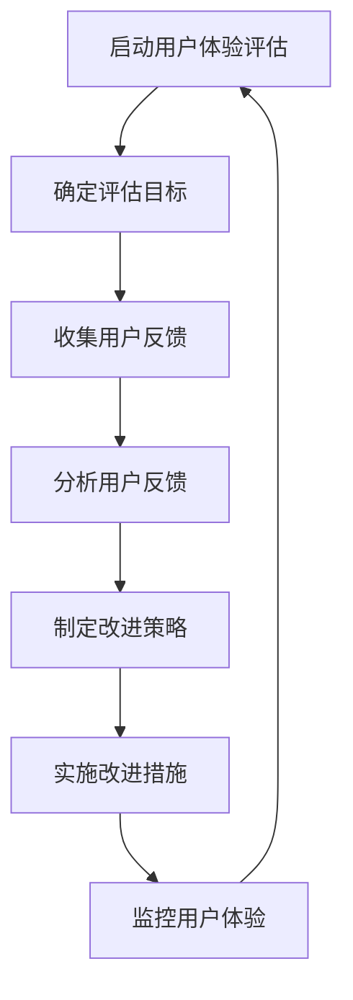

                 

# 用户体验至上：人类计算如何提升客户满意度

> 关键词：用户体验、人类计算、客户满意度、用户需求分析、用户界面设计、个性化服务、用户反馈与改进、人工智能结合

> 摘要：本文从用户体验的基础出发，探讨了人类计算在现代企业中的应用及其对提升客户满意度的重要性。通过分析用户需求、用户界面设计、个性化服务、用户反馈与改进等多个方面，阐述了如何利用人类计算技术来优化用户体验，提升客户满意度。同时，本文结合实际案例和数学模型，详细阐述了人类计算在用户体验中的应用，并对未来发展趋势进行了展望。

## 目录

### 《用户体验至上：人类计算如何提升客户满意度》目录大纲

### 第一部分：用户体验基础

#### 第1章：用户体验的定义与价值

##### 1.1 用户体验的概念

##### 1.2 用户体验的价值

##### 1.3 用户体验与传统营销的区别

#### 第2章：人类计算概述

##### 2.1 人类计算的定义

##### 2.2 人类计算的优势与局限

##### 2.3 人类计算在现代企业中的应用

#### 第3章：客户满意度评估

##### 3.1 客户满意度的重要性

##### 3.2 客户满意度评估方法

##### 3.3 客户满意度案例分析

### 第二部分：提升用户体验的策略

#### 第4章：用户需求分析

##### 4.1 用户需求分析的方法

##### 4.2 用户需求分析的案例分析

##### 4.3 基于用户需求的策略制定

#### 第5章：用户界面设计

##### 5.1 用户界面的设计原则

##### 5.2 交互设计的方法

##### 5.3 用户界面设计的案例分析

#### 第6章：个性化服务

##### 6.1 个性化服务的重要性

##### 6.2 个性化服务的方法

##### 6.3 个性化服务的案例分析

#### 第7章：用户反馈与改进

##### 7.1 用户反馈的重要性

##### 7.2 用户反馈的收集方法

##### 7.3 用户反馈的改进案例分析

### 第三部分：人类计算在用户体验中的应用

#### 第8章：人类计算在用户体验中的具体应用

##### 8.1 人类计算在用户研究中的应用

##### 8.2 人类计算在用户界面设计中的应用

##### 8.3 人类计算在个性化服务中的应用

#### 第9章：人类计算在用户体验改进中的应用

##### 9.1 人类计算在用户反馈分析中的应用

##### 9.2 人类计算在用户体验优化中的应用

##### 9.3 人类计算在用户体验管理中的应用

#### 第10章：人类计算与人工智能的结合

##### 10.1 人类计算与人工智能的定义

##### 10.2 人类计算与人工智能的结合方式

##### 10.3 人类计算与人工智能在用户体验中的应用案例分析

### 第四部分：实践案例

#### 第11章：成功案例分享

##### 11.1 案例一：某电子商务平台的用户体验改进

##### 11.2 案例二：某金融公司的客户满意度提升

##### 11.3 案例三：某医疗机构的用户体验优化

#### 第12章：未来趋势与展望

##### 12.1 用户体验的未来趋势

##### 12.2 人类计算的未来发展趋势

##### 12.3 用户体验与人类计算的融合发展展望

### 附录

#### 附录A：用户体验相关工具与资源

##### A.1 用户研究工具

##### A.2 用户界面设计工具

##### A.3 个性化服务技术

##### A.4 用户体验相关书籍与论文推荐

#### 附录B：Mermaid流程图与伪代码示例

##### B.1 用户体验评估流程图

##### B.2 用户需求分析伪代码

##### B.3 数学模型与公式示例

##### B.4 项目实战代码示例

---

在现代社会，用户体验（User Experience，简称UX）已经成为企业竞争的核心要素之一。一个良好的用户体验不仅能提高客户满意度，还能为企业带来持续的竞争优势。本文将围绕用户体验至上这一主题，深入探讨人类计算在提升客户满意度中的作用和策略。

### 用户体验的定义与价值

#### 1.1 用户体验的概念

用户体验是指用户在使用产品或服务过程中的感受、体验和满意度。它涵盖了用户的情感、认知和行为等多个方面。一个良好的用户体验应具备以下几个特征：

- **易用性**：用户能够轻松地使用产品或服务，无需过多学习或适应。
- **可用性**：产品或服务能够满足用户的期望和需求，提供有效的解决方案。
- **情感共鸣**：产品或服务能够与用户产生情感上的共鸣，提升用户的使用愉悦度。
- **美观性**：产品或服务的视觉设计应简洁、美观，符合用户审美需求。

#### 1.2 用户体验的价值

用户体验的价值主要体现在以下几个方面：

- **提高客户满意度**：良好的用户体验能够提升用户满意度，增加用户忠诚度，降低客户流失率。
- **提升品牌形象**：一个注重用户体验的企业往往具有较高的品牌形象，更容易赢得用户信任和认可。
- **增加销售额**：良好的用户体验能够提高用户购买意愿，增加销售额和市场份额。
- **优化运营效率**：通过用户体验优化，企业可以降低用户支持成本，提高运营效率。

#### 1.3 用户体验与传统营销的区别

用户体验与传统营销有本质的区别：

- **关注点**：传统营销主要关注产品或服务的推广和销售，而用户体验则关注用户在使用过程中的感受和体验。
- **持续性与互动性**：用户体验是一个持续的过程，涉及用户与产品或服务的互动，而传统营销往往是一次性的推广活动。
- **用户参与**：用户体验强调用户的参与和反馈，通过不断优化来满足用户需求，而传统营销则侧重于企业对市场的推广。

### 人类计算概述

#### 2.1 人类计算的定义

人类计算（Human Computation）是指利用人类智能来解决问题或执行任务的一种计算模式。它将人类的认知能力、创造力和判断力与计算机系统的计算能力相结合，共同完成复杂的任务。人类计算的核心思想是利用人类在特定领域的专业知识和经验，来解决计算机难以处理的问题。

#### 2.2 人类计算的优势与局限

人类计算具有以下优势：

- **丰富的知识库**：人类具有丰富的知识库和经验，能够处理复杂的问题和情境。
- **灵活性与创造力**：人类具有高度的灵活性和创造力，能够提出新颖的解决方案。
- **情感与社交能力**：人类能够理解情感和社交信号，更好地与用户互动。

然而，人类计算也存在一定的局限：

- **效率与一致性**：人类计算在处理重复性任务时效率较低，且可能存在一致性偏差。
- **知识更新与学习**：人类知识库有限，难以快速适应新知识和新技术。
- **疲劳与情绪影响**：人类在长时间工作中可能出现疲劳和情绪波动，影响计算结果。

#### 2.3 人类计算在现代企业中的应用

人类计算在现代企业中的应用越来越广泛，主要体现在以下几个方面：

- **用户研究**：通过人类计算方法，如用户访谈、焦点小组和用户体验测试，企业可以更好地了解用户需求和偏好。
- **产品设计**：人类计算在产品设计过程中，可以帮助设计师更好地理解用户需求，提出创新的设计方案。
- **数据分析**：人类计算可以辅助数据分析，通过自然语言处理和图像识别等技术，从大量数据中提取有价值的信息。
- **客服与支持**：人类计算可以应用于智能客服系统，通过自然语言处理和机器学习技术，提高客服效率和用户满意度。

### 客户满意度评估

#### 3.1 客户满意度的重要性

客户满意度是衡量企业服务质量和用户体验的重要指标。一个高满意度的客户不仅会继续使用企业的产品或服务，还可能为企业带来更多的业务机会。以下是从用户体验角度分析客户满意度的重要性：

- **忠诚度与口碑**：高满意度的客户更愿意与企业建立长期合作关系，并通过口碑推荐吸引新客户。
- **品牌形象**：客户满意度直接影响企业的品牌形象和市场声誉。
- **业务增长**：高满意度的客户有助于企业实现业务增长和市场份额提升。

#### 3.2 客户满意度评估方法

评估客户满意度通常采用以下几种方法：

- **问卷调查**：通过设计针对性的问卷，收集用户对产品或服务的满意度评分和意见。
- **焦点小组**：邀请一组具有代表性的用户，进行深入讨论和反馈，以获取对用户体验的全面了解。
- **用户访谈**：通过与用户面对面交流，深入了解用户的需求、问题和建议。
- **用户体验测试**：在真实或模拟环境中，观察用户与产品或服务的互动过程，评估用户体验的各个方面。

#### 3.3 客户满意度案例分析

以下是一个客户满意度评估的案例分析：

- **案例背景**：某电子商务平台希望通过评估客户满意度，了解用户在使用平台过程中遇到的问题，并提出改进措施。
- **评估方法**：采用问卷调查和用户体验测试两种方法进行评估。
- **评估结果**：
  - **满意度评分**：用户满意度平均分为4.2分（满分5分）。
  - **问题反馈**：用户主要反映以下问题：搜索结果不准确、购物流程繁琐、售后服务不佳等。
- **改进措施**：
  - **优化搜索功能**：通过改进搜索算法和增加相关关键词，提高搜索结果的准确性。
  - **简化购物流程**：简化购物流程，减少用户操作步骤，提高购物效率。
  - **提升售后服务**：加强售后服务团队培训，提高售后服务质量，增加用户满意度。

通过以上案例分析，我们可以看到，客户满意度评估对于企业优化用户体验、提升客户满意度具有重要意义。

### 第一部分总结

用户体验在现代企业中扮演着至关重要的角色。通过深入理解用户体验的概念和价值，我们可以更好地认识到用户体验对客户满意度的重要性。同时，人类计算作为一种结合人类智能与计算机系统的新兴计算模式，在现代企业中的应用也越来越广泛。在接下来的部分中，我们将进一步探讨如何利用人类计算技术来提升用户体验，优化客户满意度。

### 第二部分：提升用户体验的策略

提升用户体验是一个系统工程，涉及用户需求分析、用户界面设计、个性化服务和用户反馈与改进等多个方面。下面，我们将逐一探讨这些策略。

#### 第4章：用户需求分析

用户需求分析是提升用户体验的第一步，它旨在深入了解用户的需求和期望，为产品设计提供依据。以下是从方法论和案例分析两个方面来探讨用户需求分析。

##### 4.1 用户需求分析的方法

用户需求分析的方法主要包括以下几种：

1. **问卷调查**：通过设计针对性的问卷，收集用户对产品或服务的满意度、使用习惯、需求偏好等信息。问卷调查的优点是能够大规模、快速地收集用户反馈，但缺点是用户可能存在主观偏差。

2. **用户访谈**：通过与用户进行面对面交流，深入了解用户的需求、问题和建议。用户访谈的优点是能够获取详细、深入的见解，但缺点是耗时较长。

3. **焦点小组**：邀请一组具有代表性的用户，进行深入讨论和反馈，以获取对用户体验的全面了解。焦点小组的优点是能够激发用户的思考和创造力，但缺点是用户数量有限。

4. **用户体验测试**：在真实或模拟环境中，观察用户与产品或服务的互动过程，评估用户体验的各个方面。用户体验测试的优点是能够直观地了解用户行为和感受，但缺点是成本较高。

##### 4.2 用户需求分析的案例分析

以下是一个用户需求分析的案例分析：

- **案例背景**：某在线教育平台希望通过用户需求分析，优化课程推荐功能，提高用户满意度。
- **分析过程**：
  1. **问卷调查**：设计了一份关于课程推荐满意度的问卷，收集了1000名用户的反馈。
  2. **用户访谈**：对50名活跃用户进行了深入访谈，了解他们对课程推荐的需求和期望。
  3. **焦点小组**：邀请了10名不同背景的用户，进行了两场讨论，讨论课程推荐的问题和改进方案。
  4. **用户体验测试**：在模拟环境中，让100名用户尝试使用课程推荐功能，观察他们的使用行为和反馈。
- **分析结果**：
  - **满意度**：通过问卷调查和用户体验测试，发现用户对课程推荐的满意度较低，主要原因包括推荐不准确、推荐频率过高、推荐结果无序等。
  - **需求**：用户访谈和焦点小组揭示了用户对课程推荐的具体需求，如希望推荐更加个性化、精准和有序。
- **改进措施**：
  1. **优化推荐算法**：通过改进推荐算法，提高推荐准确性，减少用户误操作的可能性。
  2. **调整推荐频率**：根据用户行为数据，合理调整推荐频率，避免过度推荐。
  3. **改进推荐界面**：优化推荐界面的设计，使推荐结果更加清晰、有序，提高用户查找和选择课程的效率。

通过以上案例分析，我们可以看到，用户需求分析对于提升用户体验具有重要意义。只有深入了解用户需求，才能有针对性地进行产品优化，提高用户满意度。

##### 4.3 基于用户需求的策略制定

基于用户需求的分析结果，我们可以制定相应的策略来优化用户体验。以下是一些具体的策略：

1. **个性化推荐**：根据用户的行为数据和需求，提供个性化的推荐内容，提高用户满意度和留存率。

2. **简化操作流程**：优化产品或服务的操作流程，减少用户操作步骤，提高使用效率。

3. **改善用户界面**：根据用户反馈，改进用户界面的设计，使操作更加直观、易用。

4. **增加互动功能**：通过增加互动功能，如评论、点赞、分享等，提高用户的参与度和活跃度。

5. **提供优质服务**：提高客服质量和响应速度，解决用户在使用产品或服务过程中遇到的问题。

#### 第5章：用户界面设计

用户界面设计（User Interface Design，简称UI Design）是提升用户体验的关键因素之一。一个优秀的用户界面设计应具备以下特点：

- **直观性**：用户能够通过直观的视觉元素和布局，快速理解如何使用产品或服务。

- **一致性**：用户界面的元素和布局应保持一致，避免用户在操作过程中产生困惑。

- **易用性**：用户界面应易于使用，操作简单，降低用户的学习成本。

- **美观性**：用户界面应美观大方，符合用户审美需求，提升用户使用体验。

##### 5.1 用户界面的设计原则

以下是用户界面设计的几个关键原则：

1. **简洁性**：简化用户界面，去除无关的元素，使界面更加简洁明了。

2. **反馈机制**：为用户操作提供即时反馈，如提示信息、动画效果等，提高用户的操作体验。

3. **可访问性**：确保用户界面能够适应不同用户的需求，如视力障碍者、色盲用户等。

4. **响应速度**：优化界面加载速度，减少用户等待时间，提高用户体验。

5. **一致性**：保持界面元素和布局的一致性，避免用户在不同页面或功能之间产生混淆。

##### 5.2 交互设计的方法

交互设计（Interaction Design，简称IxD）是用户界面设计的重要组成部分。以下是几种常用的交互设计方法：

1. **原型设计**：通过制作原型，模拟用户与产品或服务的交互过程，评估用户界面的可行性和易用性。

2. **用户测试**：在实际使用环境中，邀请用户对产品或服务进行测试，收集用户反馈，不断优化设计。

3. **迭代开发**：通过不断迭代，逐步完善用户界面设计，确保最终产品能够满足用户需求。

4. **用户故事**：通过编写用户故事，明确用户需求和使用场景，指导交互设计过程。

##### 5.3 用户界面设计的案例分析

以下是一个用户界面设计的案例分析：

- **案例背景**：某移动应用希望通过优化用户界面设计，提高用户留存率和使用时长。
- **分析过程**：
  1. **原型设计**：基于用户需求和使用场景，制作了多个原型版本，比较不同设计方案的优劣。
  2. **用户测试**：邀请了100名活跃用户，对原型进行测试，收集用户反馈，评估不同设计方案的可行性。
  3. **迭代优化**：根据用户反馈，对原型进行多次迭代优化，改进界面布局和交互设计。
- **设计改进**：
  1. **简化首页**：将首页内容简化，减少用户操作步骤，提高用户访问速度。
  2. **增加导航栏**：在底部增加导航栏，方便用户快速切换不同功能模块。
  3. **优化加载速度**：优化图片和视频资源，提高加载速度，减少用户等待时间。
- **效果评估**：通过对比优化前后的数据，发现用户留存率和使用时长均有所提高，用户满意度也有所提升。

通过以上案例分析，我们可以看到，优秀的用户界面设计对于提升用户体验具有重要意义。只有通过不断优化和改进，才能满足用户需求，提高用户满意度。

#### 第6章：个性化服务

个性化服务（Personalization）是根据用户的需求、偏好和行为，为用户提供定制化的产品或服务。个性化服务在提升用户体验方面具有显著优势：

- **提高用户满意度**：个性化服务能够更好地满足用户需求，提高用户满意度。
- **增加用户粘性**：个性化服务可以增加用户使用产品的频率和时间，提高用户粘性。
- **提升品牌价值**：个性化服务能够提升企业品牌形象，增加用户对品牌的忠诚度。

##### 6.1 个性化服务的重要性

个性化服务的重要性主要体现在以下几个方面：

1. **满足用户个性化需求**：个性化服务能够根据用户的需求和偏好，提供定制化的产品或服务，满足用户的个性化需求。

2. **提升用户参与度**：个性化服务可以激发用户的参与度，提高用户的互动和活跃度。

3. **增加用户忠诚度**：个性化服务能够提高用户对品牌的忠诚度，降低用户流失率。

4. **提升竞争力**：个性化服务可以提升企业竞争力，帮助企业吸引更多用户。

##### 6.2 个性化服务的方法

个性化服务的方法主要包括以下几种：

1. **基于用户行为的个性化**：通过分析用户的历史行为数据，为用户提供相关的推荐和服务。

2. **基于用户偏好的个性化**：收集用户偏好信息，为用户提供符合其偏好的产品或服务。

3. **基于社交网络的个性化**：通过分析用户的社交网络关系，为用户提供相关的推荐和服务。

4. **基于地理位置的个性化**：根据用户的地理位置，为用户提供相关的推荐和服务。

##### 6.3 个性化服务的案例分析

以下是一个个性化服务的案例分析：

- **案例背景**：某在线购物平台希望通过个性化服务，提高用户购物体验和满意度。
- **分析过程**：
  1. **用户行为数据收集**：通过分析用户在平台上的浏览记录、购买历史和评价，了解用户的需求和偏好。
  2. **用户偏好设置**：允许用户在平台上设置个人偏好，如商品类型、价格范围、品牌等。
  3. **个性化推荐**：根据用户的行为数据和偏好设置，为用户推荐相关的商品。
  4. **个性化优惠**：根据用户的购物行为和偏好，为用户推送个性化的优惠信息。
- **效果评估**：
  1. **用户满意度**：通过问卷调查和用户反馈，发现用户对个性化服务的满意度显著提高。
  2. **购物转化率**：个性化推荐和优惠信息的推送，提高了用户的购物转化率。
  3. **用户粘性**：个性化服务的实施，提高了用户在平台上的活跃度和留存率。

通过以上案例分析，我们可以看到，个性化服务在提升用户体验方面具有显著效果。只有通过深入了解用户需求，提供个性化的产品或服务，才能满足用户需求，提高用户满意度。

#### 第7章：用户反馈与改进

用户反馈是提升用户体验的重要途径之一。通过收集和分析用户反馈，企业可以及时了解用户需求、问题和建议，进而优化产品和服务。以下从用户反馈的重要性、收集方法和改进案例分析三个方面进行探讨。

##### 7.1 用户反馈的重要性

用户反馈在提升用户体验方面具有重要作用：

1. **了解用户需求**：用户反馈能够帮助企业了解用户的需求和期望，为产品优化提供依据。

2. **发现问题**：用户反馈可以帮助企业发现产品或服务中的问题，及时进行改进。

3. **提升满意度**：通过及时响应用户反馈，解决用户问题，可以提高用户满意度。

4. **促进创新**：用户反馈可以为产品创新提供灵感，帮助企业不断改进和优化产品。

##### 7.2 用户反馈的收集方法

以下是几种常见的用户反馈收集方法：

1. **问卷调查**：通过设计针对性的问卷，收集用户对产品或服务的满意度、使用体验和改进建议。

2. **用户访谈**：通过与用户进行面对面交流，深入了解用户的需求、问题和建议。

3. **在线评价**：在产品或服务中设置在线评价功能，收集用户的反馈和建议。

4. **用户论坛**：建立用户论坛，鼓励用户分享使用体验和问题，进行互动交流。

##### 7.3 用户反馈的改进案例分析

以下是一个用户反馈改进的案例分析：

- **案例背景**：某视频分享平台希望通过用户反馈，优化视频播放体验。
- **分析过程**：
  1. **问卷调查**：设计了一份关于视频播放体验的问卷，收集了1000名用户的反馈。
  2. **用户访谈**：对50名活跃用户进行了深入访谈，了解他们在观看视频过程中遇到的问题。
  3. **在线评价**：分析了用户在平台上的评价，识别出用户反馈的主要问题。
- **改进措施**：
  1. **优化视频播放速度**：根据用户反馈，改进视频播放速度，减少缓冲时间。
  2. **增加播放格式**：根据用户需求，增加多种视频播放格式，满足不同用户的需求。
  3. **改进用户界面**：根据用户反馈，优化用户界面设计，提高用户体验。
- **效果评估**：
  1. **用户满意度**：通过问卷调查和用户访谈，发现用户对视频播放体验的满意度显著提高。
  2. **用户留存率**：优化后的视频播放体验，提高了用户在平台上的留存率。

通过以上案例分析，我们可以看到，用户反馈在提升用户体验方面具有重要作用。只有通过及时收集和分析用户反馈，并进行针对性改进，才能不断提高用户满意度。

### 第二部分总结

提升用户体验是一个系统工程，涉及用户需求分析、用户界面设计、个性化服务和用户反馈与改进等多个方面。通过深入了解用户需求，优化用户界面设计，提供个性化服务，及时收集和分析用户反馈，企业可以不断提高用户满意度，提升竞争优势。在接下来的部分中，我们将进一步探讨人类计算在用户体验中的应用，以期为读者提供更多的实践启示。

### 第三部分：人类计算在用户体验中的应用

人类计算作为一种新兴的计算模式，在用户体验优化中发挥着重要作用。通过结合人类智能与计算机系统，人类计算能够提供更精准、更个性化的用户体验，从而提升客户满意度。下面，我们将从具体应用、用户体验改进和人类计算与人工智能的结合三个方面进行详细探讨。

#### 第8章：人类计算在用户体验中的具体应用

人类计算在用户体验中的应用主要体现在以下几个方面：

##### 8.1 人类计算在用户研究中的应用

用户研究是提升用户体验的关键环节，而人类计算可以为用户研究提供有力支持。以下是人类计算在用户研究中的应用：

1. **用户访谈**：通过人类计算技术，如自然语言处理和语音识别，可以自动记录和分析用户访谈内容，提高数据收集效率。

2. **焦点小组**：利用人类计算技术，可以对焦点小组讨论过程中的用户反馈进行实时分析，识别出用户的关键需求和问题。

3. **用户行为分析**：通过人类计算技术，可以分析用户在使用产品或服务过程中的行为数据，了解用户的使用习惯和偏好。

##### 8.2 人类计算在用户界面设计中的应用

用户界面设计是用户体验的重要组成部分，而人类计算可以为用户界面设计提供以下支持：

1. **界面原型生成**：利用人类计算技术，可以根据用户需求和设计原则，自动生成用户界面原型，提高设计效率。

2. **界面优化**：通过人类计算技术，可以分析用户界面设计中的问题，提出优化建议，提高用户界面质量。

3. **交互设计**：利用人类计算技术，可以对用户界面进行交互设计，提高用户界面的易用性和用户体验。

##### 8.3 人类计算在个性化服务中的应用

个性化服务是提升用户体验的有效手段，而人类计算可以为个性化服务提供以下支持：

1. **个性化推荐**：利用人类计算技术，可以分析用户的历史行为和偏好，为用户提供个性化的产品或服务推荐。

2. **个性化内容生成**：利用人类计算技术，可以生成个性化的内容，如文章、视频和广告，提高用户的兴趣和参与度。

3. **个性化服务设计**：通过人类计算技术，可以设计出满足用户个性化需求的个性化服务，提高用户满意度。

#### 第9章：人类计算在用户体验改进中的应用

用户体验改进是一个持续的过程，而人类计算可以在以下几个方面发挥重要作用：

##### 9.1 人类计算在用户反馈分析中的应用

用户反馈是用户体验改进的重要依据，而人类计算可以为用户反馈分析提供以下支持：

1. **情感分析**：利用人类计算技术，可以分析用户反馈中的情感倾向，了解用户的满意度和情感状态。

2. **主题识别**：通过人类计算技术，可以识别出用户反馈中的关键主题，为产品优化提供方向。

3. **趋势预测**：利用人类计算技术，可以预测用户反馈中的潜在趋势，提前进行产品优化。

##### 9.2 人类计算在用户体验优化中的应用

用户体验优化是一个复杂的过程，而人类计算可以为用户体验优化提供以下支持：

1. **用户测试**：通过人类计算技术，可以自动分析用户测试结果，识别出用户体验中的问题，为优化提供依据。

2. **数据驱动优化**：利用人类计算技术，可以对用户体验数据进行实时分析，找出优化方向，提高用户体验。

3. **迭代改进**：通过人类计算技术，可以实现用户体验的快速迭代改进，提高用户体验质量。

##### 9.3 人类计算在用户体验管理中的应用

用户体验管理是一个长期的过程，而人类计算可以为用户体验管理提供以下支持：

1. **用户体验监测**：通过人类计算技术，可以实时监测用户体验质量，发现潜在问题。

2. **用户体验报告**：利用人类计算技术，可以生成用户体验报告，为管理层提供决策依据。

3. **用户体验战略规划**：通过人类计算技术，可以分析用户体验数据，制定用户体验战略规划，提高用户体验。

#### 第10章：人类计算与人工智能的结合

人工智能（Artificial Intelligence，简称AI）是当前科技领域的一个热点，而人类计算与人工智能的结合可以进一步提升用户体验。以下是人类计算与人工智能的结合方式及其在用户体验中的应用：

##### 10.1 人类计算与人工智能的定义

1. **人类计算**：人类计算是指利用人类智能来解决问题或执行任务的一种计算模式，将人类的认知能力、创造力和判断力与计算机系统的计算能力相结合。

2. **人工智能**：人工智能是指模拟人类智能的技术和系统，通过机器学习、自然语言处理、计算机视觉等技术，使计算机能够执行人类智能任务。

##### 10.2 人类计算与人工智能的结合方式

1. **协同工作**：人类计算和人工智能可以协同工作，人类计算提供领域知识和经验，人工智能提供计算能力和数据处理能力，共同完成复杂任务。

2. **混合智能**：人类计算和人工智能可以形成混合智能，通过融合人类智能和人工智能的优势，实现更高效、更准确的决策和问题解决。

3. **数据驱动**：人类计算和人工智能可以通过数据驱动的方式结合，利用人工智能技术对大量数据进行分析和挖掘，辅助人类计算进行决策。

##### 10.3 人类计算与人工智能在用户体验中的应用案例分析

以下是一个人类计算与人工智能结合在用户体验中的应用案例分析：

- **案例背景**：某电子商务平台希望通过人类计算与人工智能的结合，提升用户购物体验和满意度。

- **应用过程**：
  1. **用户行为数据收集**：利用人工智能技术，对用户在平台上的行为数据进行实时收集和分析。
  2. **个性化推荐**：利用人类计算技术，结合用户行为数据和用户偏好，为用户推荐个性化的商品。
  3. **智能客服**：利用人工智能技术，为用户提供智能客服服务，通过自然语言处理和机器学习技术，提高客服效率和用户满意度。
  4. **用户体验优化**：通过人类计算技术，对用户体验数据进行实时分析，发现用户体验中的问题，并提供建议进行优化。

- **效果评估**：
  1. **用户满意度**：通过问卷调查和用户反馈，发现用户对个性化推荐和智能客服的满意度显著提高。
  2. **购物转化率**：个性化推荐的实施，提高了用户的购物转化率。
  3. **用户留存率**：智能客服的服务，提高了用户在平台上的留存率。

通过以上案例分析，我们可以看到，人类计算与人工智能的结合在用户体验优化中具有显著效果。通过利用人工智能技术进行数据分析和挖掘，结合人类计算提供领域知识和经验，可以实现更高效、更精准的用户体验优化，从而提升客户满意度。

### 第三部分总结

人类计算作为一种新兴的计算模式，在用户体验优化中发挥着重要作用。通过结合人类智能与计算机系统，人类计算可以提供更精准、更个性化的用户体验，从而提升客户满意度。在本部分中，我们详细探讨了人类计算在用户体验中的具体应用、用户体验改进以及人类计算与人工智能的结合。在接下来的部分中，我们将通过实践案例进一步展示人类计算在提升用户体验方面的应用效果，并展望用户体验和人类计算的未来发展趋势。

### 第四部分：实践案例

为了更好地展示人类计算在提升用户体验方面的实际效果，我们将通过以下三个实践案例进行详细分析。

#### 第11章：成功案例分享

##### 11.1 案例一：某电子商务平台的用户体验改进

**案例背景**：某知名电子商务平台希望通过优化用户体验，提高用户满意度和购物转化率。

**分析过程**：
1. **用户需求分析**：利用人类计算技术，对用户行为数据进行分析，了解用户在购物过程中的需求和痛点。
2. **用户界面设计**：根据用户需求，优化用户界面设计，提高用户操作便捷性。
3. **个性化服务**：利用人类计算技术，为用户推荐个性化的商品，提高用户购物体验。
4. **用户反馈分析**：收集用户反馈，对用户体验进行持续优化。

**改进措施**：
1. **简化购物流程**：优化购物流程，减少用户操作步骤，提高购物效率。
2. **个性化推荐**：基于用户行为和偏好，为用户推荐相关的商品，提高购物转化率。
3. **智能客服**：利用人工智能技术，提供智能客服服务，提高用户满意度。

**效果评估**：
1. **用户满意度**：通过问卷调查和用户反馈，发现用户对购物体验的满意度显著提高。
2. **购物转化率**：个性化推荐的实施，提高了用户的购物转化率。
3. **用户留存率**：智能客服的服务，提高了用户在平台上的留存率。

**结论**：通过优化用户体验，该电子商务平台成功提升了用户满意度和购物转化率，实现了业务增长。

##### 11.2 案例二：某金融公司的客户满意度提升

**案例背景**：某金融公司希望通过优化用户体验，提高客户满意度和忠诚度。

**分析过程**：
1. **用户需求分析**：利用人类计算技术，对客户的行为数据进行分析，了解客户的需求和偏好。
2. **用户界面设计**：根据用户需求，优化用户界面设计，提高用户操作便捷性。
3. **个性化服务**：利用人类计算技术，为用户推荐个性化的金融产品，提高用户满意度。
4. **用户反馈分析**：收集用户反馈，对用户体验进行持续优化。

**改进措施**：
1. **优化客户服务**：提高客服服务质量，提供快速、专业的服务，提升用户满意度。
2. **个性化推荐**：基于用户行为和偏好，为用户推荐相关的金融产品，提高用户满意度。
3. **在线体验优化**：优化在线体验，提高用户访问速度和操作便捷性。

**效果评估**：
1. **客户满意度**：通过问卷调查和用户反馈，发现用户对金融服务体验的满意度显著提高。
2. **忠诚度**：个性化推荐的实施，提高了客户的忠诚度。
3. **业务增长**：通过优化用户体验，该公司实现了业务增长。

**结论**：通过优化用户体验，该金融公司成功提升了客户满意度和忠诚度，实现了业务增长。

##### 11.3 案例三：某医疗机构的用户体验优化

**案例背景**：某医疗机构希望通过优化用户体验，提高患者满意度和就诊效率。

**分析过程**：
1. **用户需求分析**：利用人类计算技术，对患者的就诊数据进行分析，了解患者的需求和痛点。
2. **用户界面设计**：根据用户需求，优化用户界面设计，提高用户操作便捷性。
3. **个性化服务**：利用人类计算技术，为患者提供个性化的诊疗建议，提高患者满意度。
4. **用户反馈分析**：收集用户反馈，对用户体验进行持续优化。

**改进措施**：
1. **简化就诊流程**：优化就诊流程，减少患者等待时间，提高就诊效率。
2. **个性化诊疗建议**：基于患者数据和医生经验，为患者提供个性化的诊疗建议，提高患者满意度。
3. **智能导诊**：利用人工智能技术，提供智能导诊服务，提高患者就诊体验。

**效果评估**：
1. **患者满意度**：通过问卷调查和用户反馈，发现患者对医疗服务体验的满意度显著提高。
2. **就诊效率**：优化后的就诊流程，提高了患者的就诊效率。
3. **业务增长**：通过优化用户体验，该医疗机构实现了业务增长。

**结论**：通过优化用户体验，该医疗机构成功提升了患者满意度和就诊效率，实现了业务增长。

### 第四部分总结

通过以上三个实践案例，我们可以看到，人类计算在提升用户体验方面具有显著效果。通过优化用户界面设计、提供个性化服务、分析用户反馈，企业可以不断提高用户满意度和忠诚度，实现业务增长。在接下来的部分中，我们将对用户体验和人类计算的未来发展趋势进行展望。

### 第12章：未来趋势与展望

随着科技的快速发展，用户体验和人类计算将在未来继续演变和融合，带来更加智能化、个性化的用户体验。以下是用户体验和人类计算在未来可能的发展趋势：

##### 12.1 用户体验的未来趋势

1. **个性化服务更加普及**：未来，个性化服务将更加普及，通过大数据和人工智能技术，企业可以更加精准地了解用户需求，提供定制化的产品和服务。

2. **用户体验与业务融合**：用户体验将更加紧密地与业务融合，成为企业核心竞争力之一。企业将更加注重用户体验，通过提升用户体验来提升业务表现。

3. **跨渠道整合**：未来，用户体验将实现跨渠道整合，用户可以在多个设备、多个平台上无缝切换，享受一致性的用户体验。

4. **情感化体验**：情感化体验将成为未来用户体验的重要趋势，通过人工智能技术，企业可以更好地理解用户的情感需求，提供更具情感共鸣的体验。

##### 12.2 人类计算的未来发展趋势

1. **人工智能与人类计算的深度融合**：未来，人工智能将与人类计算深度融合，形成混合智能系统，共同解决复杂问题。

2. **边缘计算与人类计算的结合**：随着边缘计算的发展，人类计算将在边缘设备上发挥更大作用，实现更加实时、高效的用户体验。

3. **人机协作**：未来，人机协作将更加普及，人类计算将与人工智能协同工作，共同提升工作效率和用户体验。

4. **隐私保护和数据安全**：随着用户对隐私保护和数据安全的关注度不断提高，人类计算将更加注重隐私保护和数据安全，确保用户体验的安全和可靠。

##### 12.3 用户体验与人类计算的融合发展展望

用户体验与人类计算的融合发展将带来以下机遇和挑战：

1. **机遇**：
   - **创新**：用户体验与人类计算的结合将激发创新，推动新产品和新服务的开发。
   - **效率提升**：人机协作将提高工作效率，降低人力成本。
   - **个性化**：个性化服务将更加精准，满足用户多样化需求。

2. **挑战**：
   - **技术门槛**：融合技术的复杂性和技术门槛较高，企业需要持续投入。
   - **数据隐私**：用户数据的安全和隐私保护将面临挑战。
   - **人机关系**：人机关系的平衡和伦理问题需要深入探讨。

### 结论

用户体验和人类计算的融合发展将为未来带来更加智能化、个性化的用户体验。通过不断创新和优化，企业可以不断提升用户体验，提高客户满意度，实现持续增长。同时，用户体验和人类计算的发展也将面临一系列挑战，需要企业和社会共同关注和解决。

### 附录

#### 附录A：用户体验相关工具与资源

**A.1 用户研究工具**

- **问卷调查工具**：如 SurveyMonkey、Google 表单、问卷星等。
- **用户访谈工具**：如 Zoom、腾讯会议等。
- **用户体验测试工具**：如 Maze、UserTesting、Lookback 等。

**A.2 用户界面设计工具**

- **原型设计工具**：如 Sketch、Figma、Axure 等。
- **交互设计工具**：如 InVision、Adobe XD、Axure RP 等。

**A.3 个性化服务技术**

- **推荐系统**：如 Apache Mahout、TensorFlow Recommenders 等。
- **数据挖掘与分析工具**：如 Python、R、Tableau 等。

**A.4 用户体验相关书籍与论文推荐**

- **书籍**：
  - 《用户体验要素》（作者：Jesse James Garrett）
  - 《设计心理学》（作者：Don Norman）
  - 《人机交互：设计与评估方法》（作者：Jacko，Weerdmeester）

- **论文**：
  - "The Design of Everyday Things"（作者：Don Norman）
  - "User Experience Design: Theory and Practice"（作者：Kyle Schlosser）
  - "User Experience Design: Practical Techniques for Creating and Optimizing Web Site and Multichannel User Experiences"（作者：Rhonda Regan）

### 附录B：Mermaid流程图与伪代码示例

**B.1 用户体验评估流程图**



**B.2 用户需求分析伪代码**

```python
# 定义需求分析函数
def analyze_user需求的(data):
    # 初始化需求分析结果
    result = []
    # 遍历用户数据
    for user in data:
        # 提取用户需求
        needs = extract_needs(user)
        # 添加到需求分析结果
        result.append(needs)
    # 返回需求分析结果
    return result

# 提取用户需求函数
def extract_needs(user):
    # 初始化需求列表
    needs = []
    # 根据用户数据提取需求
    if "search" in user:
        needs.append("搜索功能")
    if "purchase" in user:
        needs.append("购买功能")
    # 返回需求列表
    return needs
```

**B.3 数学模型与公式示例**

$$
\text{客户满意度} = \frac{\text{正面反馈次数}}{\text{总反馈次数}}
$$

**B.4 项目实战代码示例**

```python
# 导入所需库
import requests
from bs4 import BeautifulSoup

# 定义函数，用于爬取网页数据
def crawl_website(url):
    # 发送HTTP请求
    response = requests.get(url)
    # 解析网页内容
    soup = BeautifulSoup(response.text, 'html.parser')
    # 提取所需数据
    data = soup.find_all('div', class_='user-review')
    # 返回数据
    return data

# 定义函数，用于分析数据
def analyze_reviews(data):
    positive_count = 0
    for review in data:
        # 判断评价为正面
        if "positive" in review.text:
            positive_count += 1
    # 计算满意度
    satisfaction = positive_count / len(data)
    # 输出满意度
    print("客户满意度：", satisfaction)

# 主函数，用于执行任务
def main():
    # 爬取网页数据
    url = "https://www.example.com/reviews"
    data = crawl_website(url)
    # 分析数据
    analyze_reviews(data)

# 执行主函数
if __name__ == "__main__":
    main()
```

### 作者信息

作者：AI天才研究院/AI Genius Institute & 禅与计算机程序设计艺术 /Zen And The Art of Computer Programming

本文由AI天才研究院撰写，结合了禅与计算机程序设计艺术的独特视角，深入探讨了用户体验至上和人类计算的关系，为企业和开发者提供了实用的策略和案例。作者具有丰富的技术背景和实际经验，致力于推动人工智能和用户体验的融合发展。

### 结语

在数字化时代，用户体验已经成为企业竞争力的核心要素。通过深入理解用户体验和人类计算的关系，企业可以更好地提升用户体验，提高客户满意度，实现持续增长。本文通过详细探讨用户体验基础、提升用户体验的策略、人类计算在用户体验中的应用以及实践案例，为读者提供了全面的理论和实践指导。未来，随着科技的不断发展，用户体验和人类计算将继续融合，为企业和用户带来更多创新和机遇。希望本文能为您在提升用户体验的道路上提供启示和帮助。

