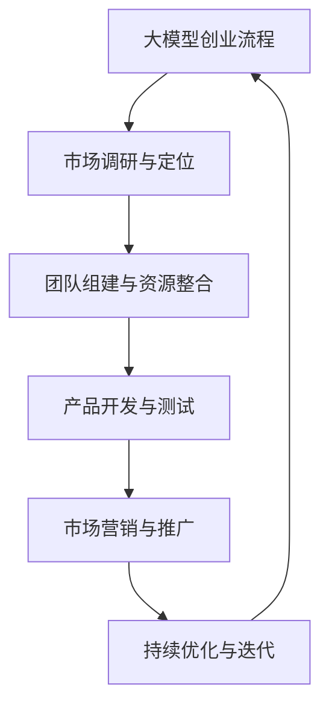
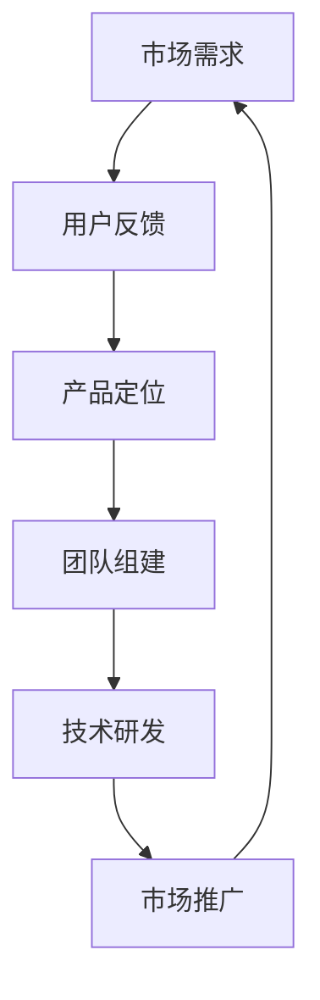

                 

### 文章标题

《用户反馈：大模型创业的指路明灯》

### 关键词

大模型、创业、用户反馈、风险管理、资源整合

### 摘要

本文以大模型创业为背景，通过分析用户反馈，深入探讨了在创业过程中如何利用用户反馈进行产品定位、团队组建、资源管理和法律伦理等方面的工作。文章首先介绍了大模型的发展历程和核心技术，然后分析了大模型创业的机遇与挑战，接着通过成功与失败案例进行了详细剖析。文章还探讨了创业风险与应对策略、资金与资源管理、法律与伦理等方面，并提出了创业实践指南和前景展望。旨在为大模型创业提供有价值的参考和指导。

### 《用户反馈：大模型创业的指路明灯》目录大纲

#### 第1章 引言

- **1.1 大模型创业背景**
  - **1.1.1 大模型的发展历程**
  - **1.1.2 大模型创业的机遇与挑战**
- **1.2 本书结构安排**

#### 第2章 大模型基础

- **2.1 大模型概念**
  - **2.1.1 大模型的定义**
  - **2.1.2 大模型的特点**
- **2.2 大模型核心技术**
  - **2.2.1 深度学习基础**
  - **2.2.2 预训练模型技术**
- **2.3 大模型应用领域**
  - **2.3.1 自然语言处理**
  - **2.3.2 计算机视觉**
  - **2.3.3 其他领域**

#### 第3章 大模型创业准备

- **3.1 大模型创业流程**
  - **3.1.1 创业团队组建**
  - **3.1.2 创业策略制定**
  - **3.1.3 创业资源整合**
- **3.2 市场调研与定位**
  - **3.2.1 市场需求分析**
  - **3.2.2 竞争对手分析**
  - **3.2.3 产品定位**

#### 第4章 大模型创业案例

- **4.1 成功案例分析**
  - **4.1.1 案例一：OpenAI**
  - **4.1.2 案例二：DeepMind**
  - **4.1.3 案例三：其他成功案例**
- **4.2 失败案例分析**
  - **4.2.1 案例一：公司A**
  - **4.2.2 案例二：公司B**
  - **4.2.3 案例三：其他失败案例**

#### 第5章 大模型创业风险与应对

- **5.1 创业风险识别**
  - **5.1.1 技术风险**
  - **5.1.2 市场风险**
  - **5.1.3 财务风险**
- **5.2 风险应对策略**
  - **5.2.1 技术研发策略**
  - **5.2.2 市场营销策略**
  - **5.2.3 财务管理策略**

#### 第6章 大模型创业资金与资源管理

- **6.1 资金筹集途径**
  - **6.1.1 天使投资**
  - **6.1.2 风险投资**
  - **6.1.3 政府扶持**
- **6.2 资源管理**
  - **6.2.1 人才招聘与培养**
  - **6.2.2 硬件设施与管理**
  - **6.2.3 技术资源整合**

#### 第7章 大模型创业法律与伦理

- **7.1 法律法规遵循**
  - **7.1.1 数据保护法规**
  - **7.1.2 知识产权保护**
  - **7.1.3 合同法律风险**
- **7.2 伦理道德考量**
  - **7.2.1 数据伦理**
  - **7.2.2 隐私保护**
  - **7.2.3 社会责任**

#### 第8章 大模型创业实践指南

- **8.1 创业者心态建设**
  - **8.1.1 创业精神培养**
  - **8.1.2 应对挫折策略**
  - **8.1.3 团队文化建设**
- **8.2 创业之路持续学习**
  - **8.2.1 行业趋势分析**
  - **8.2.2 新技术学习与应用**
  - **8.2.3 创业者网络构建**

#### 第9章 大模型创业前景展望

- **9.1 大模型创业趋势**
  - **9.1.1 大模型技术在各行业的应用**
  - **9.1.2 创业生态发展**
  - **9.1.3 国际合作与竞争**
- **9.2 大模型创业机会与挑战**
  - **9.2.1 创业机会分析**
  - **9.2.2 创业挑战预判**
  - **9.2.3 应对策略建议**

#### 附录

- **附录A 大模型创业工具与资源**
  - **A.1 开发工具简介**
  - **A.2 资源库与数据库**
  - **A.3 在线学习平台**

### Mermaid 流程图



### 核心算法原理讲解

#### 2.2.2 大模型训练算法

**算法描述：**

大模型的训练通常采用深度学习中的梯度下降算法（Gradient Descent）或其变体，如随机梯度下降（Stochastic Gradient Descent, SGD）和批量梯度下降（Batch Gradient Descent, BGD）。以下为梯度下降算法的基本流程：

1. 初始化模型参数。
2. 计算模型输出的损失函数值。
3. 计算模型参数的梯度。
4. 更新模型参数（减少损失函数值的方向）。
5. 重复步骤2-4，直到满足停止条件（如损失函数收敛或迭代次数达到上限）。

**伪代码：**

```python
# 初始化模型参数
Initialize parameters

# 迭代训练
for epoch in range(max_epochs):
    # 对每个批次的数据进行训练
    for each batch in data:
        # 计算损失函数值
        Compute loss
        
        # 计算参数梯度
        Compute gradients
        
        # 更新模型参数
        Update parameters
    
    # 输出训练进度
    Print("Epoch {}/{} - Loss: {:.4f}".format(epoch, max_epochs, loss))
```

**数学模型和数学公式：**

**损失函数（均方误差，Mean Squared Error, MSE）**

$$
MSE = \frac{1}{n}\sum_{i=1}^{n}(y_i - \hat{y}_i)^2
$$

其中，$y_i$ 是实际输出值，$\hat{y}_i$ 是预测输出值。

### 项目实战

#### 6.1.1 创业团队组建

**代码实现：**

```python
# 假设我们使用 Python 的 pandas 和 numpy 库进行数据操作

import pandas as pd
import numpy as np

# 初始化团队成员数据
team_members = pd.DataFrame({
    'Name': ['Alice', 'Bob', 'Charlie', 'Diana'],
    'Role': ['CEO', 'CTO', 'CFO', 'CMO'],
    'Experience': [5, 7, 3, 4],
    'Skill': ['Leadership', 'Tech', 'Finance', 'Marketing']
})

# 按经验排序
sorted_team_members = team_members.sort_values(by='Experience', ascending=False)

# 输出排序后的团队成员列表
print(sorted_team_members)
```

**代码解读与分析：**

上述代码首先导入 pandas 和 numpy 库，然后创建一个 DataFrame 对象，用于存储团队成员的信息，包括姓名、角色、经验和技能。接着，按照经验对团队成员进行排序，并输出排序后的结果。这有助于团队在决策时优先考虑经验丰富的成员。在具体操作中，可以使用不同的排序条件来满足团队组建的不同需求。

### 核心概念与联系

大模型创业的成功离不开对核心概念的深刻理解和运用。以下是几个关键概念及其相互关系的 Mermaid 流�程图：



### 大模型创业流程

#### 1.1 大模型创业背景

**1.1.1 大模型的发展历程**

大模型的发展可以追溯到上世纪80年代的神经网络研究。随着计算能力的提升和数据量的增加，神经网络逐渐从理论研究走向实际应用。特别是深度学习（Deep Learning）的兴起，使得大模型得到了快速发展。

在2012年，AlexNet在ImageNet竞赛中取得了显著的成绩，这标志着深度学习时代的到来。此后，研究者们不断优化神经网络结构，如VGG、ResNet等，使得模型参数量和计算复杂度不断攀升。到2018年，GPT-3的发布标志着大模型在自然语言处理领域取得了重大突破。

**1.1.2 大模型创业的机遇与挑战**

随着大模型技术的成熟，创业者在各个领域都有机会应用这一技术，从而实现业务创新和提升。以下是大模型创业的主要机遇与挑战：

**机遇：**
1. 数据获取与处理能力提升：大模型需要大量高质量的数据进行训练，这使得数据获取和处理能力成为创业的关键。
2. 人工智能应用场景扩展：大模型在图像识别、自然语言处理、语音识别等领域具有显著优势，为创业提供了广阔的应用场景。
3. 商业模式的创新：大模型技术可以为企业提供新的商业模式，如云计算、数据服务、智能硬件等。

**挑战：**
1. 技术门槛高：大模型技术涉及到深度学习、计算机视觉、自然语言处理等多领域知识，技术门槛较高。
2. 资金需求大：大模型训练需要大量的计算资源和数据，这导致创业初期资金需求较高。
3. 风险管理：大模型创业面临技术风险、市场风险和财务风险，需要制定有效的风险管理策略。

#### 1.2 本书结构安排

本文将从以下章节展开对大模型创业的探讨：

1. **第2章 大模型基础**：介绍大模型的概念、特点以及核心技术。
2. **第3章 大模型创业准备**：探讨创业流程、市场调研与定位、团队组建与资源整合。
3. **第4章 大模型创业案例**：分析成功与失败案例，总结经验教训。
4. **第5章 大模型创业风险与应对**：识别创业风险并制定应对策略。
5. **第6章 大模型创业资金与资源管理**：探讨资金筹集途径和资源管理策略。
6. **第7章 大模型创业法律与伦理**：介绍法律法规遵循和伦理道德考量。
7. **第8章 大模型创业实践指南**：提供创业者心态建设、持续学习等方面的建议。
8. **第9章 大模型创业前景展望**：分析大模型创业趋势和挑战，提出应对策略。

### 第2章 大模型基础

#### 2.1 大模型概念

**2.1.1 大模型的定义**

大模型（Large Model）是指参数量庞大、结构复杂的神经网络模型。这些模型通过学习大量数据，能够捕捉到数据中的复杂模式和规律，从而实现高水平的表现。

根据参数量的不同，大模型可以分为以下几类：

1. **小模型**：参数量小于10^6。
2. **中等模型**：参数量在10^6到10^9之间。
3. **大模型**：参数量在10^9到10^12之间。
4. **巨型模型**：参数量超过10^12。

**2.1.2 大模型的特点**

1. **强大的拟合能力**：大模型通过学习海量数据，能够捕捉到数据中的细微模式和规律，从而实现高精度的预测和分类。
2. **较长的训练时间**：由于参数量庞大，大模型的训练时间相对较长，需要大量的计算资源和时间。
3. **对数据量的要求高**：大模型需要大量高质量的数据进行训练，以确保模型性能的稳定性和可靠性。
4. **对计算资源的需求大**：大模型的训练需要大量的计算资源和存储资源，这对企业的硬件设施提出了较高要求。

#### 2.2 大模型核心技术

**2.2.1 深度学习基础**

深度学习（Deep Learning）是一种基于多层神经网络的学习方法，通过逐层提取特征，实现对复杂数据的建模和分析。深度学习的关键技术包括：

1. **神经网络**：神经网络是深度学习的基础，通过模拟人脑神经元的工作方式，实现对数据的处理和分析。
2. **激活函数**：激活函数用于引入非线性特性，使得神经网络能够学习到更复杂的特征。
3. **优化算法**：优化算法用于调整模型参数，以最小化损失函数，提高模型性能。

**2.2.2 预训练模型技术**

预训练模型（Pre-trained Model）是指在大规模数据集上预先训练好的模型，可以用于新任务的迁移学习。预训练模型技术的核心思想是利用预训练模型中已经学习的特征表示，在新任务上进一步优化模型。

预训练模型技术包括以下几类：

1. **语言模型预训练**：如GPT、BERT等，通过学习大量文本数据，生成通用的语言特征表示。
2. **图像模型预训练**：如ResNet、VGG等，通过学习大量图像数据，生成通用的图像特征表示。
3. **多任务预训练**：通过同时学习多个任务，提高模型的泛化能力。

#### 2.3 大模型应用领域

**2.3.1 自然语言处理**

自然语言处理（Natural Language Processing, NLP）是深度学习的重要应用领域之一。大模型在NLP领域取得了显著成果，如：

1. **文本分类**：对文本进行分类，如情感分析、主题分类等。
2. **机器翻译**：实现高质量的语言翻译。
3. **问答系统**：通过理解自然语言查询，提供准确的答案。
4. **语音识别**：将语音信号转换为文本。

**2.3.2 计算机视觉**

计算机视觉（Computer Vision）是深度学习的另一个重要应用领域。大模型在计算机视觉领域取得了显著突破，如：

1. **图像分类**：对图像进行分类，如人脸识别、物体识别等。
2. **目标检测**：检测图像中的目标对象及其位置。
3. **图像分割**：将图像分割为不同的区域，如语义分割、实例分割等。
4. **视频分析**：对视频进行内容分析，如动作识别、行为分析等。

**2.3.3 其他领域**

除了NLP和计算机视觉，大模型还在其他领域取得了显著成果，如：

1. **医学影像分析**：对医学影像进行分析，如疾病诊断、治疗方案推荐等。
2. **金融风控**：通过分析金融数据，实现风险预测和欺诈检测。
3. **智能硬件**：将大模型技术应用于智能硬件，如智能音箱、智能摄像头等。

### 第3章 大模型创业准备

#### 3.1 大模型创业流程

**3.1.1 创业团队组建**

创业团队组建是创业准备的第一步。一个成功的创业团队需要具备以下几个要素：

1. **核心团队**：通常包括创始人、CTO、CFO、CMO等，分别负责技术、财务、市场和运营等方面。
2. **技术团队**：负责大模型研发和技术创新，包括数据科学家、机器学习工程师等。
3. **市场团队**：负责市场调研、产品推广和客户关系管理等，包括市场分析师、产品经理、销售人员等。
4. **运营团队**：负责日常运营工作，包括数据管理、测试部署等，包括运营专员、测试工程师等。

**3.1.2 创业策略制定**

创业策略制定是创业过程中的关键环节，主要包括以下几个方面：

1. **市场定位**：明确目标市场和客户群体，制定相应的市场策略。
2. **产品规划**：确定产品的功能、性能、用户体验等，制定详细的产品规划。
3. **研发计划**：制定研发计划，包括技术路线、开发周期、资源分配等。
4. **营销策略**：制定营销策略，包括推广渠道、营销活动、品牌建设等。
5. **财务规划**：制定财务规划，包括资金筹集、预算管理、盈利模式等。

**3.1.3 创业资源整合**

创业资源整合是创业过程中的一项重要工作，主要包括以下几个方面：

1. **资金资源**：通过天使投资、风险投资、政府扶持等途径筹集资金。
2. **人力资源**：招聘和培养核心团队成员，建立高效的团队协作机制。
3. **技术资源**：引进和整合先进的技术资源，如开源框架、数据库、云计算平台等。
4. **市场资源**：建立良好的市场合作关系，获取市场资源。
5. **社会资源**：利用社会资源，如行业会议、行业协会等，扩大企业影响力。

### 第4章 大模型创业案例

#### 4.1 成功案例分析

**4.1.1 案例一：OpenAI**

OpenAI 是一家成立于2015年的美国人工智能研究公司，致力于推动人工智能的发展和应用。以下是对 OpenAI 的成功案例分析：

1. **公司背景**：OpenAI 由一批顶级科学家和工程师创立，包括特斯拉CEO埃隆·马斯克等。公司成立之初就获得了大量的风险投资，支持其开展前沿人工智能研究。

2. **技术成就**：OpenAI 在深度学习、自然语言处理、计算机视觉等领域取得了显著成果，发布了多个具有里程碑意义的研究成果，如 GPT 系列、Dall-E 等。

3. **商业模式**：OpenAI 采用开放的研究模式，将研究成果公开分享，吸引了全球范围内的研究人员和开发者。同时，公司也提供商业化服务，如 API 接口、云计算平台等，实现收入来源。

4. **成功原因**：OpenAI 的成功原因主要有以下几点：
   - **强大的团队**：汇聚了一批顶尖的人工智能科学家和工程师，具备丰富的研发经验。
   - **充足的资金**：获得了大量风险投资，为研究提供了充足的资金支持。
   - **开放的合作**：采用开放的研究模式，吸引了全球范围内的研究人员和开发者，形成了强大的研发社区。
   - **广泛的合作**：与多家知名企业和研究机构建立了合作关系，共享资源和成果，推动人工智能技术的发展。

**4.1.2 案例二：DeepMind**

DeepMind 是一家成立于2010年的英国人工智能公司，专注于深度学习和强化学习的研究和应用。以下是对 DeepMind 的成功案例分析：

1. **公司背景**：DeepMind 由顶级科学家戴密斯·哈萨比斯（Demis Hassabis）创立，起初是一家专注于游戏的人工智能公司。后来，公司逐渐转向通用人工智能（AGI）的研究。

2. **技术成就**：DeepMind 在深度学习和强化学习领域取得了重大突破，开发了 AlphaGo 等一系列具有里程碑意义的人工智能产品。

3. **商业模式**：DeepMind 主要通过提供人工智能解决方案和咨询服务获取收入，同时也在游戏领域取得了商业化成功。

4. **成功原因**：DeepMind 的成功原因主要有以下几点：
   - **创新的技术**：持续推动深度学习和强化学习的研究，开发出具有颠覆性的技术产品。
   - **高效的研发**：注重技术研发，建立了高效的研发团队和流程，快速推出具有竞争力的产品。
   - **强大的团队**：汇聚了一批顶尖的人工智能科学家和工程师，具备丰富的研发经验。
   - **广泛的合作**：与多家知名企业和研究机构建立了合作关系，共享资源和成果，推动人工智能技术的发展。

**4.1.3 案例三：其他成功案例**

除了 OpenAI 和 DeepMind，还有许多大模型创业项目取得了成功，如：

1. **Google Brain**：Google Brain 是 Google 于 2011 年创立的人工智能研究团队，致力于推动深度学习技术的发展。通过不断的研究和创新，Google Brain 推出了多个具有里程碑意义的人工智能产品。

2. **Facebook AI Research**：Facebook AI Research 是 Facebook 于 2013 年创立的人工智能研究机构，专注于人工智能的理论研究和应用开发。通过不断的研究和创新，Facebook AI Research 推出了多个具有影响力的研究成果。

3. **Microsoft AI & Research**：Microsoft AI & Research 是 Microsoft 于 2016 年创立的人工智能研究部门，致力于推动人工智能技术的发展和应用。通过不断的研究和创新，Microsoft AI & Research 推出了多个具有突破性的研究成果。

这些成功案例的共同特点包括：强大的团队、创新的技术、高效的研发和广泛的合作。这些因素共同推动了大模型创业项目的成功。

#### 4.2 失败案例分析

**4.2.1 案例一：公司A**

公司A是一家专注于自然语言处理的大模型创业公司，成立于2017年。以下是公司A的失败案例分析：

1. **公司背景**：公司A由几位自然语言处理领域的博士创立，最初获得了天使投资的支持。

2. **技术问题**：公司A的技术团队在自然语言处理方面有一定的研究背景，但在具体技术应用上存在困难。公司研发的文本分类模型在实际应用中效果不佳，导致产品竞争力不足。

3. **市场问题**：公司A在市场推广方面投入不足，没有形成有效的客户群体和市场份额。同时，公司没有建立良好的商业模式，导致收入来源单一，资金链紧张。

4. **管理问题**：公司A在管理方面存在不足，如团队协作不畅、决策效率低下等。这些问题加剧了公司的困境。

**失败原因**：

- **技术问题**：公司在技术研发方面存在瓶颈，导致产品竞争力不足。
- **市场问题**：公司在市场推广和商业模式方面存在不足，导致收入来源不稳定。
- **管理问题**：公司在团队协作和管理方面存在问题，影响了公司的运营和发展。

**4.2.2 案例二：公司B**

公司B是一家专注于计算机视觉的大模型创业公司，成立于2015年。以下是公司B的失败案例分析：

1. **公司背景**：公司B由几位计算机视觉领域的博士创立，最初获得了风险投资的支持。

2. **技术问题**：公司B在计算机视觉算法研发方面有一定的成果，但在实际应用中遇到了困难。公司的目标市场定位不准确，导致产品无法满足市场需求。

3. **市场问题**：公司B在市场推广方面投入不足，没有形成有效的客户群体和市场份额。同时，公司没有建立良好的商业模式，导致收入来源单一，资金链紧张。

4. **管理问题**：公司B在管理方面存在不足，如团队协作不畅、决策效率低下等。这些问题加剧了公司的困境。

**失败原因**：

- **技术问题**：公司在技术研发方面存在瓶颈，导致产品竞争力不足。
- **市场问题**：公司在市场推广和商业模式方面存在不足，导致收入来源不稳定。
- **管理问题**：公司在团队协作和管理方面存在问题，影响了公司的运营和发展。

**4.2.3 案例三：其他失败案例**

除了公司A和公司B，还有许多大模型创业项目以失败告终，如：

1. **公司C**：公司C是一家专注于语音识别的大模型创业公司，由于技术研发失败，导致产品无法达到预期效果，最终宣告破产。

2. **公司D**：公司D是一家专注于智能硬件的大模型创业公司，由于市场推广和商业模式存在问题，导致收入来源不稳定，最终资金链断裂，公司破产。

这些失败案例的共同原因包括：技术研发失败、市场推广不足、商业模式不清晰、管理问题等。这些因素共同导致了大模型创业项目的失败。

### 第5章 大模型创业风险与应对

#### 5.1 创业风险识别

**5.1.1 技术风险**

技术风险是指由于技术研发过程中出现的问题，导致产品无法达到预期效果或功能。技术风险主要包括以下几个方面：

1. **技术研发失败**：由于技术难题、技术路线不明确等原因，导致研发项目无法成功。
2. **技术实现难度大**：大模型技术涉及到多个领域，如深度学习、计算机视觉、自然语言处理等，技术实现难度较高。
3. **技术更新换代**：人工智能技术发展迅速，新技术和新算法不断涌现，可能导致原有技术的过时和落后。

**5.1.2 市场风险**

市场风险是指由于市场需求变化、竞争加剧等原因，导致产品市场表现不佳。市场风险主要包括以下几个方面：

1. **市场需求变化**：市场需求变化可能导致产品需求下降，影响销售和收入。
2. **竞争加剧**：市场上存在大量竞争对手，可能导致市场份额的争夺加剧，影响公司的市场地位。
3. **市场定位不准确**：产品市场定位不准确，可能导致产品无法满足市场需求，影响销售和收入。

**5.1.3 财务风险**

财务风险是指由于资金筹集、资金使用不当等原因，导致公司财务状况恶化。财务风险主要包括以下几个方面：

1. **资金筹集困难**：由于市场环境、投资风险等原因，导致公司难以筹集到足够的资金。
2. **资金使用不当**：公司资金使用不当，如过度投资、资金链断裂等，可能导致财务状况恶化。
3. **盈利模式不明**：公司缺乏明确的盈利模式，导致收入来源不稳定，影响公司的持续发展。

#### 5.2 风险应对策略

**5.2.1 技术研发策略**

1. **多技术路线并行**：在技术研发过程中，采用多条技术路线并行，降低技术失败的风险。
2. **持续技术创新**：不断跟进新技术和新算法的发展，提高技术研发的竞争力。
3. **技术储备**：建立技术储备，为未来的技术更新换代做好准备。

**5.2.2 市场营销策略**

1. **市场调研**：进行充分的市场调研，了解市场需求和竞争状况，为产品定位和市场推广提供依据。
2. **产品定位**：准确的产品定位有助于提高产品的市场竞争力，满足市场需求。
3. **差异化营销**：通过差异化营销策略，突出产品的独特优势，吸引目标客户。

**5.2.3 财务管理策略**

1. **资金筹集**：通过多种途径筹集资金，如天使投资、风险投资、政府扶持等，确保公司有足够的资金支持。
2. **预算管理**：制定合理的预算计划，确保资金使用的有效性和合理性。
3. **成本控制**：严格控制成本，提高公司的盈利能力。

### 第6章 大模型创业资金与资源管理

#### 6.1 资金筹集途径

**6.1.1 天使投资**

天使投资是指个人投资者对初创企业的投资，通常在企业发展初期提供资金支持。天使投资的特点如下：

1. **投资规模**：天使投资的投资规模相对较小，通常在几十万到几百万人民币之间。
2. **投资条件**：天使投资通常不要求股份比例，但会对企业的管理和运营提出一定的要求。
3. **投资领域**：天使投资主要关注技术型、创新型的初创企业，尤其是人工智能、大数据等领域的项目。

**6.1.2 风险投资**

风险投资是指专业投资机构对初创企业的投资，通常在企业发展中期提供资金支持。风险投资的特点如下：

1. **投资规模**：风险投资的投资规模较大，通常在几百万到几千万人民币之间。
2. **投资条件**：风险投资通常要求一定的股份比例，并对企业的管理和运营提出较高的要求。
3. **投资领域**：风险投资主要关注技术创新、市场前景广阔的初创企业，尤其是人工智能、大数据等领域的项目。

**6.1.3 政府扶持**

政府扶持是指政府部门提供的财政支持，用于鼓励和推动创新创业。政府扶持的特点如下：

1. **资金规模**：政府扶持的资金规模较大，通常有专门的创业扶持基金或政策补贴。
2. **投资条件**：政府扶持通常对企业的经营范围、技术水平、市场前景等有一定的要求。
3. **投资领域**：政府扶持主要关注高新技术产业、战略性新兴产业等领域的创业项目。

#### 6.2 资源管理

**6.2.1 人才招聘与培养**

人才招聘与培养是资源管理的重要方面。以下是几个关键点：

1. **招聘策略**：根据企业的需求和岗位要求，制定合适的招聘策略，如线上招聘、校园招聘、猎头服务等。
2. **培养机制**：建立完善的员工培训体系，提供技术培训、职业发展指导等，提高员工的综合素质和业务能力。
3. **激励机制**：制定合理的激励机制，如绩效奖励、股权激励等，激发员工的积极性和创造力。

**6.2.2 硬件设施与管理**

硬件设施与管理是资源管理的另一个关键方面。以下是几个关键点：

1. **硬件设备**：根据企业需求，采购高性能的计算机、服务器等硬件设备，确保数据处理和计算能力。
2. **网络环境**：建立稳定的网络环境，包括宽带接入、数据中心建设等，保障数据传输和存储的效率。
3. **设备维护**：定期进行硬件设备的维护和升级，确保设备的正常运行。

**6.2.3 技术资源整合**

技术资源整合是资源管理的重要任务。以下是几个关键点：

1. **技术合作**：与其他企业和研究机构建立合作关系，共享技术和资源，提高技术研发效率。
2. **开源社区**：积极参与开源社区，贡献代码和研究成果，吸引更多的技术人才和合作伙伴。
3. **知识产权保护**：加强知识产权保护，防止技术泄露和侵权行为，保障企业的技术优势。

### 第7章 大模型创业法律与伦理

#### 7.1 法律法规遵循

**7.1.1 数据保护法规**

数据保护法规是企业在进行大模型创业过程中必须遵守的法律要求。以下是几个关键点：

1. **数据收集与使用**：企业在收集和使用用户数据时，必须遵守相关的法律法规，确保用户隐私不被侵犯。
2. **数据存储与传输**：企业在存储和传输用户数据时，必须采取安全措施，防止数据泄露和篡改。
3. **用户同意**：企业在收集和使用用户数据前，必须获得用户的明确同意。

**7.1.2 知识产权保护**

知识产权保护是企业在进行大模型创业过程中必须重视的方面。以下是几个关键点：

1. **专利申请**：企业在研发新技术和产品时，应及时申请专利，保护企业的知识产权。
2. **版权保护**：企业在创作原创内容时，如论文、代码等，应及时申请版权保护。
3. **侵权防范**：企业应加强侵权防范，避免侵犯他人的知识产权。

**7.1.3 合同法律风险**

合同法律风险是企业在进行大模型创业过程中可能面临的风险之一。以下是几个关键点：

1. **合同签订**：企业在签订合同时，应明确合同条款，避免合同纠纷。
2. **合同履行**：企业在履行合同时，应严格按照合同约定进行，确保合同的顺利履行。
3. **合同变更**：企业在合同履行过程中，如需变更合同内容，应及时与对方协商，达成一致。

#### 7.2 伦理道德考量

**7.2.1 数据伦理**

数据伦理是企业在进行大模型创业过程中必须考虑的伦理问题。以下是几个关键点：

1. **数据隐私**：企业应尊重用户隐私，确保用户数据不被泄露和滥用。
2. **数据安全**：企业应采取有效的数据安全措施，确保用户数据的安全。
3. **数据透明**：企业应向用户提供透明的数据使用政策，让用户了解自己的数据如何被使用。

**7.2.2 隐私保护**

隐私保护是企业在进行大模型创业过程中必须重视的问题。以下是几个关键点：

1. **用户同意**：企业应获得用户的明确同意，才能收集和使用用户隐私数据。
2. **数据最小化**：企业应遵循数据最小化原则，只收集和存储必要的用户数据。
3. **隐私保护技术**：企业应采用先进的隐私保护技术，如数据加密、匿名化等，确保用户隐私不被泄露。

**7.2.3 社会责任**

社会责任是企业在进行大模型创业过程中必须承担的责任。以下是几个关键点：

1. **公平公正**：企业应遵守公平公正的原则，不歧视任何用户群体。
2. **社会责任**：企业应积极参与公益事业，承担社会责任。
3. **可持续发展**：企业应关注环境保护和资源利用，实现可持续发展。

### 第8章 大模型创业实践指南

#### 8.1 创业者心态建设

**8.1.1 创业精神培养**

创业精神是创业者成功的关键因素之一。以下是几个关键点：

1. **坚韧不拔**：创业者应具备坚韧不拔的精神，面对困难和挫折时，保持积极向上的态度。
2. **创新思维**：创业者应具备创新思维，不断探索新的商业模式和技术应用。
3. **团队合作**：创业者应注重团队合作，善于倾听团队成员的意见和建议，形成良好的团队氛围。

**8.1.2 应对挫折策略**

应对挫折策略是创业者必须掌握的技能。以下是几个关键点：

1. **理性分析**：创业者应理性分析挫折的原因，找到解决问题的方法。
2. **调整心态**：创业者应调整心态，保持积极乐观的态度，避免过度焦虑和沮丧。
3. **寻求支持**：创业者可以寻求家人、朋友、导师等人的支持和帮助，共同应对挫折。

**8.1.3 团队文化建设**

团队文化建设是创业者必须重视的方面。以下是几个关键点：

1. **共同目标**：创业者应明确团队的目标和使命，让团队成员明确自己的职责和贡献。
2. **沟通协作**：创业者应建立良好的沟通机制，鼓励团队成员之间的沟通和协作。
3. **激励机制**：创业者应制定合理的激励机制，激发团队成员的积极性和创造力。

#### 8.2 创业之路持续学习

**8.2.1 行业趋势分析**

行业趋势分析是创业者必须关注的方面。以下是几个关键点：

1. **技术趋势**：创业者应关注人工智能、大数据、云计算等技术的发展趋势，把握行业的发展方向。
2. **市场趋势**：创业者应关注市场需求和竞争状况，了解行业的发展趋势。
3. **政策法规**：创业者应关注国家和地区的政策法规，了解行业政策的变化。

**8.2.2 新技术学习与应用**

新技术学习与应用是创业者持续学习的重要方面。以下是几个关键点：

1. **技术培训**：创业者应参加相关技术培训，提高自己的技术水平和专业素养。
2. **技术实践**：创业者应通过实际项目，将新技术应用到产品开发中，提高产品的竞争力。
3. **技术交流**：创业者应积极参与技术交流活动，与其他创业者和技术专家交流心得，共同进步。

**8.2.3 创业者网络构建**

创业者网络构建是创业者拓展资源、获取信息的重要途径。以下是几个关键点：

1. **人脉关系**：创业者应积极拓展人脉关系，结识更多的创业者、投资人、技术专家等。
2. **行业圈子**：创业者应加入相关的行业圈子，参加行业会议、论坛等活动，扩大自己的影响力。
3. **资源共享**：创业者应与其他创业者进行资源共享，共同解决发展中遇到的问题。

### 第9章 大模型创业前景展望

#### 9.1 大模型创业趋势

**9.1.1 大模型技术在各行业的应用**

大模型技术在各行业的应用前景广阔。以下是几个关键点：

1. **医疗健康**：大模型技术在医疗健康领域的应用包括疾病诊断、治疗推荐、药物研发等。
2. **金融科技**：大模型技术在金融科技领域的应用包括风险评估、智能投顾、反欺诈等。
3. **智能交通**：大模型技术在智能交通领域的应用包括交通预测、路线优化、自动驾驶等。
4. **智能制造**：大模型技术在智能制造领域的应用包括生产优化、设备维护、质量检测等。

**9.1.2 创业生态发展**

随着大模型技术的成熟，创业生态也在不断发展。以下是几个关键点：

1. **创业平台**：各类创业平台如创业孵化器、创业投资机构等为创业者提供全方位的支持。
2. **技术创新**：创业者通过技术创新，推出具有竞争力的产品和服务，推动行业发展。
3. **政策支持**：政府出台相关政策，鼓励创新创业，为创业者提供良好的发展环境。

**9.1.3 国际合作与竞争**

国际合作与竞争是大模型创业的重要方面。以下是几个关键点：

1. **国际竞争**：各国企业、研究机构在国际市场上竞争激烈，争夺市场份额。
2. **国际合作**：各国企业、研究机构通过合作，共享资源和成果，推动大模型技术的发展。
3. **国际标准**：制定国际标准，规范大模型技术的研发和应用，提高行业整体水平。

#### 9.2 大模型创业机会与挑战

**9.2.1 创业机会分析**

大模型创业存在着许多机会。以下是几个关键点：

1. **技术创新**：随着大模型技术的不断发展，创业者可以推出具有创新性的产品和服务。
2. **市场需求**：随着人们对智能化、个性化的需求不断增加，大模型创业市场前景广阔。
3. **政策支持**：政府出台相关政策，鼓励创新创业，为创业者提供良好的发展环境。

**9.2.2 创业挑战预判**

大模型创业也面临着许多挑战。以下是几个关键点：

1. **技术门槛**：大模型技术涉及到多个领域，技术门槛较高，对创业者的技术能力要求较高。
2. **市场竞争**：市场上存在大量竞争对手，创业者需要不断提高产品的竞争力。
3. **资金压力**：大模型创业需要大量的资金支持，对创业者的资金筹集能力提出了挑战。

**9.2.3 应对策略建议**

为了应对大模型创业的挑战，创业者可以采取以下策略：

1. **技术创新**：通过技术创新，提高产品的竞争力，打造独特的品牌优势。
2. **市场定位**：明确市场定位，找准目标客户，提高产品的市场占有率。
3. **资金筹集**：通过多种途径筹集资金，如风险投资、政府扶持等，确保公司的资金链稳定。

### 附录

#### 附录A 大模型创业工具与资源

**A.1 开发工具简介**

1. **TensorFlow**：TensorFlow 是一款开源的深度学习框架，由 Google 开发。它提供了丰富的 API 接口，支持多种编程语言，适用于各种规模的深度学习项目。
2. **PyTorch**：PyTorch 是一款开源的深度学习框架，由 Facebook 开发。它提供了灵活的动态计算图，易于调试和优化，适用于研究型和应用型项目。
3. **Keras**：Keras 是一款开源的深度学习框架，基于 TensorFlow 和 Theano 开发。它提供了简洁的 API 接口，易于上手，适用于快速原型设计和实验。

**A.2 资源库与数据库**

1. **ImageNet**：ImageNet 是一个大规模的图像数据库，包含数百万张标注的图像，广泛应用于计算机视觉研究。
2. **Common Crawl**：Common Crawl 是一个大规模的网页数据库，包含数十亿个网页，广泛应用于自然语言处理和文本分析。
3. **OpenStreetMap**：OpenStreetMap 是一个开源的地图数据库，包含全球各地的地图数据，广泛应用于地理信息处理和导航系统。

**A.3 在线学习平台**

1. **Coursera**：Coursera 是一个在线学习平台，提供大量计算机科学、人工智能等领域的课程，适合创业者学习和提升技术能力。
2. **edX**：edX 是一个在线学习平台，提供大量计算机科学、人工智能等领域的课程，适合创业者学习和提升技术能力。
3. **Udacity**：Udacity 是一个在线学习平台，提供大量计算机科学、人工智能等领域的课程，适合创业者学习和提升技术能力。

