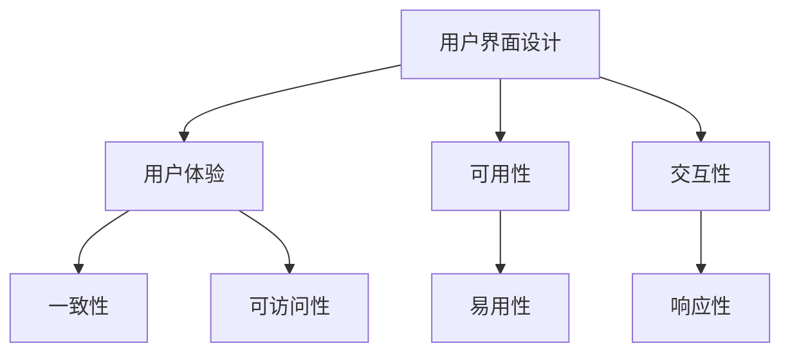

                 

### 文章标题：用户界面设计：打造友好易用的人机交互

> 关键词：用户界面设计、用户体验、可用性、易用性、交互性、响应式设计、前端开发、人工智能、虚拟现实、增强现实

> 摘要：本文深入探讨了用户界面设计的核心概念、目标、原则以及设计过程。通过用户研究和分析，介绍了如何构建用户画像和进行用户测试。接着，详细阐述了设计思维、设计流程、前端开发技术以及交互设计实战。最后，探讨了用户界面设计的未来趋势，并分享了实战经验和工具资源。

### 第一部分：用户界面设计概述

#### 第1章：用户界面设计的核心概念与目标

**1.1 用户界面设计的定义与历史发展**

- **用户界面的基本要素**：用户界面设计（User Interface Design，简称UI设计）涉及到视觉元素、交互元素和内容组织。其中，视觉元素包括色彩、字体、图标等；交互元素包括按钮、滚动条、菜单等；内容组织则是如何有效地展示和布局信息。

- **用户界面设计的演进历程**：从早期的命令行界面、图形用户界面（GUI）到如今触摸界面、智能语音交互，用户界面设计经历了从简单到复杂、从功能导向到用户体验导向的演变。

**1.2 用户界面设计的核心目标**

- **用户体验的重要性**：用户体验（User Experience，简称UX）是用户在使用产品过程中所感受到的所有方面。良好的用户体验能提升用户满意度、忠诚度和产品口碑。

- **易用性与可用性的平衡**：易用性（Usability）指的是用户能否容易地完成任务，而可用性（Usability）则是产品是否能够满足用户的需求。两者之间需要找到平衡点，既要确保用户能够轻松上手，又要保证产品功能的完整性。

**1.3 用户界面设计的原则**

- **一致性与标准遵循**：一致性包括视觉一致、交互一致和信息一致。遵循标准可以提升用户对产品的信任感。

- **可访问性与包容性设计**：可访问性确保产品可以被所有用户，包括残障人士，使用。包容性设计则是考虑到不同用户群体的需求。

- **交互性的重要性**：交互性是指用户与产品之间的互动。良好的交互设计可以提高用户参与度和产品满意度。

#### 第一部分总结

用户界面设计的核心概念包括视觉、交互和内容组织。设计的目标是提供良好的用户体验，实现易用性和可用性的平衡。遵循一致性和标准，关注可访问性和包容性，以及重视交互性的设计原则，是打造友好易用的人机交互的关键。

---

#### 第二部分：用户研究和分析

##### 第2章：用户研究与用户分析

**2.1 用户研究的方法与工具**

- **用户访谈与问卷调查**：用户访谈能够深入了解用户的需求、喜好和行为模式。问卷调查则能收集大量数据，进行统计分析。

- **观察与情境模拟**：观察用户在使用产品时的行为，可以帮助设计师发现用户在使用过程中遇到的问题。情境模拟则是通过模拟真实使用场景，评估设计的可行性。

- **竞品分析**：分析竞争对手的产品，可以借鉴其优点，避免重复错误。

**2.2 用户画像与用户需求分析**

- **用户画像的构建**：用户画像是对用户特征的综合描述，包括年龄、性别、职业、行为习惯等。构建用户画像有助于设计师更好地了解目标用户。

- **用户需求分析与优先级排序**：通过用户研究，设计师可以识别用户的核心需求，并将其进行优先级排序，确保设计满足用户最关心的需求。

**2.3 用户测试与评估**

- **用户测试的类型**：包括可用性测试、认知测试和体验测试等。每种测试都有其特定的目的和适用场景。

- **评估指标与反馈收集**：评估指标包括任务完成时间、错误率、满意度等。反馈收集可以通过用户访谈、问卷调查、用户测试记录等方式进行。

#### 第二部分总结

用户研究和分析是用户界面设计的重要环节。通过用户访谈、问卷调查、观察和情境模拟等方法，设计师可以深入了解用户需求，构建用户画像，并进行用户测试和评估，以确保设计满足用户需求，提升用户体验。

---

#### 第三部分：界面设计过程与方法

##### 第3章：设计思维与用户界面设计流程

**3.1 设计思维概述**

- **设计思维的核心原则**：设计思维强调以人为本、迭代创新、合作与同理心。它是一种解决问题的方法论，不仅适用于设计领域，也可以广泛应用于商业、教育、医疗等各个领域。

- **设计思维的应用**：设计思维可以通过五个阶段进行： empathize（同理心）、define（定义问题）、ideate（创意生成）、prototype（原型制作）和test（测试与迭代）。

**3.2 用户界面设计流程**

- **需求分析与规划**：明确设计目标和用户需求，制定设计策略和计划。

- **概念设计与原型制作**：通过创意思维和原型制作工具，构建界面的初步概念和原型。

- **原型测试与迭代**：通过用户测试，收集反馈，不断优化和改进原型。

**3.3 设计工具与技巧**

- **界面布局与布局模式**：了解不同的布局模式，如网格布局、对称布局、不对称布局等，选择合适的布局模式来提升界面的美观性和功能性。

- **视觉设计与配色原则**：合理的视觉设计能够提升用户对界面的感知和满意度。配色原则包括对比色、类似色、单色等。

- **交互设计与动画效果**：交互设计关注用户的操作体验，动画效果则能提升界面的生动性和互动性。

#### 第三部分总结

设计思维是一种创新解决问题的方法论，它贯穿于用户界面设计的整个流程。通过需求分析、概念设计、原型制作和测试迭代，结合界面布局、视觉设计和交互设计等技巧，设计师可以打造出既美观又易用的用户界面。

---

#### 第四部分：界面实现与优化

##### 第4章：前端开发技术基础

**4.1 前端开发概述**

- **前端开发的基本概念**：前端开发是指开发网页和应用程序的客户端部分，包括HTML、CSS和JavaScript。

- **前端开发的技术栈**：前端开发涉及多种技术，包括框架（如React、Vue、Angular）、库（如jQuery、Bootstrap）和工具（如Webpack、Gulp）。

**4.2 HTML与CSS基础**

- **HTML结构元素**：HTML（超文本标记语言）是网页内容的基础，包括标题、段落、列表、表格等。

- **CSS样式设计**：CSS（层叠样式表）用于定义网页的视觉样式，包括字体、颜色、布局等。

- **响应式设计**：响应式设计（Responsive Design）使网页能够适应不同设备尺寸和分辨率，提供最佳的浏览体验。

**4.3 JavaScript基础**

- **JavaScript语言基础**：JavaScript是一种客户端脚本语言，用于增加网页的交互性和动态性。

- **DOM操作与事件处理**：DOM（文档对象模型）是JavaScript操作网页内容的基础，事件处理则用于响应用户操作。

- **函数式编程与异步处理**：函数式编程是一种编程范式，强调使用函数来解决问题。异步处理则用于处理长时间运行的请求，避免阻塞主线程。

#### 第四部分总结

前端开发是用户界面实现的关键。通过掌握HTML、CSS和JavaScript的基础知识，设计师可以构建功能丰富、交互流畅的用户界面。响应式设计和异步处理等技术，进一步提升了用户界面的适应性和性能。

---

#### 第五部分：交互设计实战

##### 第5章：交互设计案例解析

**5.1 案例背景与目标**

- **案例介绍**：以某智能家居控制界面设计为例，目标是为用户提供一个直观、易用的界面，实现智能家居设备的远程监控和操控。

- **设计目标**：确保界面美观、操作简便，提供快速响应和稳定的功能。

**5.2 需求分析与用户研究**

- **用户需求分析**：通过问卷调查和用户访谈，了解用户对智能家居控制界面的期望和需求。

- **用户访谈与观察**：观察用户在使用现有智能家居控制界面时的行为和反应，发现潜在问题和改进点。

**5.3 原型设计与测试**

- **原型制作与迭代**：使用设计工具（如Axure、Sketch）制作界面原型，并进行迭代优化。

- **用户测试与反馈**：通过用户测试，收集用户对原型的反馈，进一步优化界面设计。

**5.4 实际应用与优化**

- **功能实现与代码编写**：根据原型设计，实现功能代码，包括HTML、CSS和JavaScript。

- **优化策略与用户体验改进**：通过性能优化、交互优化和视觉优化，提升用户体验。

#### 第五部分总结

通过实际的交互设计案例，展示了从需求分析到用户研究，再到原型设计和实际应用的完整流程。用户测试和反馈的环节确保了设计满足用户需求，最终实现了一个友好易用的智能家居控制界面。

---

#### 第六部分：用户界面设计的未来趋势

##### 第6章：用户界面设计的未来趋势

**6.1 人工智能与用户界面设计**

- **人工智能在UI设计中的应用**：人工智能可以自动优化界面布局、提供个性化推荐、实现自然语言交互等。

- **智能交互与自然语言处理**：智能交互使界面更加智能化和个性化，自然语言处理则让用户可以通过语音与产品进行自然交流。

**6.2 虚拟现实与增强现实**

- **VR与AR技术简介**：虚拟现实（VR）和增强现实（AR）技术提供了沉浸式和增强式的交互体验。

- **VR与AR在UI设计中的应用**：VR和AR界面设计需要考虑空间感、交互方式和内容呈现方式，为用户提供全新的交互体验。

**6.3 新型交互方式**

- **触控与手势交互**：触控和手势交互成为主流，通过多点触控和手势识别，实现更加直观和自然的交互。

- **声音与手势交互**：结合声音和手势，实现更加丰富和灵活的交互方式，如语音控制、手势识别等。

#### 第六部分总结

用户界面设计的未来趋势将受到人工智能、虚拟现实和增强现实等新兴技术的影响。智能交互、新型交互方式和沉浸式体验将进一步提升用户界面的友好性和易用性，为用户提供更加丰富的交互体验。

---

#### 第七部分：综合案例与实战经验

##### 第7章：综合案例与实战经验分享

**7.1 案例背景与挑战**

- **案例介绍**：以某电商网站的用户界面设计为例，目标是提升用户购物体验，提高转化率。

- **设计挑战**：在有限的时间内，需要兼顾美观性、易用性和功能性，同时满足不同设备尺寸和浏览器的兼容性。

**7.2 设计思路与方法**

- **设计目标与策略**：以用户为中心，通过用户研究和分析，明确用户需求和痛点，制定设计策略。

- **设计流程与迭代**：遵循设计思维，通过需求分析、概念设计、原型制作和用户测试，不断优化设计。

**7.3 实战经验与总结**

- **设计经验分享**：分享在设计过程中遇到的问题和解决方案，如如何平衡美观与功能性、如何优化用户体验等。

- **项目成果与反馈**：展示项目最终成果，并收集用户反馈，总结项目经验。

#### 第七部分总结

通过电商网站的用户界面设计案例，分享了设计思路与方法，以及实战经验和总结。案例展示了如何通过用户研究和分析，制定设计策略，并通过不断迭代优化，实现美观、易用和功能性的平衡。

---

#### 附录

**附录A：常用设计工具与资源**

- **常用设计工具对比**：介绍不同设计工具的特点和适用场景，如Axure、Sketch、Figma等。

- **UI设计资源网站推荐**：推荐一些UI设计相关的资源网站，如Dribbble、Behance、UI Garage等。

**附录B：用户界面设计相关书籍推荐**

- **《设计心理学》**：Don Norman
- **《用户体验要素》**：Jesse James Garrett
- **《交互设计精髓》**：Alan Cooper
- **《前端开发手册》**：徐少培

**附录C：用户界面设计参考资料**

- **《W3C HTML5规范》**
- **《CSS3标准手册》**
- **《JavaScript语言精粹》**：Douglas Crockford
- **《响应式网页设计》**：Eric Meyer

**附录D：用户界面设计核心概念与联系图**



**附录E：用户界面设计核心算法原理讲解**

### 1. 动态规划算法伪代码示例

```plaintext
// 动态规划算法伪代码
function dp(max_points, points, k):
    dp[0...max_points] = array of zeros
    for i from 1 to max_points:
        dp[i] = dp[i-1] + points[i]
        for j from 1 to k:
            dp[i] = max(dp[i], dp[i-j] + points[i-j])
    return dp[max_points]
```

### 2. 回归分析公式

$$
y = \beta_0 + \beta_1x + \epsilon
$$

**附录F：用户界面设计项目实战**

### 1. 实战项目背景与目标

#### 项目名称：智能家居控制界面

#### 项目目标：设计并实现一个智能控制的用户界面，以实现对智能家居设备的远程监控和操控。

### 2. 开发环境搭建

- **编程语言**：HTML, CSS, JavaScript
- **前端框架**：React
- **开发工具**：Visual Studio Code
- **版本控制**：Git

### 3. 代码实现与解读

#### 示例代码：用户登录界面

```html
<!DOCTYPE html>
<html>
<head>
    <title>用户登录</title>
    <link rel="stylesheet" type="text/css" href="styles.css">
</head>
<body>
    <div class="login-container">
        <h1>登录</h1>
        <form>
            <label for="username">用户名:</label>
            <input type="text" id="username" name="username" required>
            <br>
            <label for="password">密码:</label>
            <input type="password" id="password" name="password" required>
            <br>
            <button type="submit">登录</button>
        </form>
    </div>
</body>
</html>
```

#### 代码解读：

- **HTML元素**：用于构建用户界面结构。
- **CSS样式**：用于美化界面。
- **JavaScript**：可以用于添加交互性，如表单验证和用户登录。

### 4. 代码解读与分析

#### 用户登录表单验证

```javascript
document.querySelector('form').addEventListener('submit', function(event) {
    const username = document.getElementById('username').value;
    const password = document.getElementById('password').value;

    if (username === '' || password === '') {
        alert('用户名和密码不能为空！');
        event.preventDefault();
    }

    // 这里可以添加额外的验证逻辑，如检查用户名和密码格式、与后端验证等。
});
```

#### 分析与优化建议：

- **用户名和密码格式验证**：限制用户名只能包含字母和数字。
- **密码强度检测**：提示用户输入复杂的密码。
- **后端验证**：为了安全起见，应将用户输入的用户名和密码发送到服务器进行验证。
- **异步提交表单**：使用 AJAX 技术实现表单的异步提交，提高用户体验。

---

### 作者信息

**作者：** AI天才研究院/AI Genius Institute & 禅与计算机程序设计艺术 /Zen And The Art of Computer Programming

---

通过以上详细的目录大纲和内容框架，我们可以看到，《用户界面设计：打造友好易用的人机交互》这篇文章的结构清晰、逻辑严密，涵盖了用户界面设计的方方面面，从核心概念到实战经验，再到未来趋势，为读者提供了一次全面的技术之旅。文章通过具体的代码案例和算法讲解，使得理论更加生动具体，易于理解和实践。希望这篇文章能够为广大读者带来启发和帮助。

