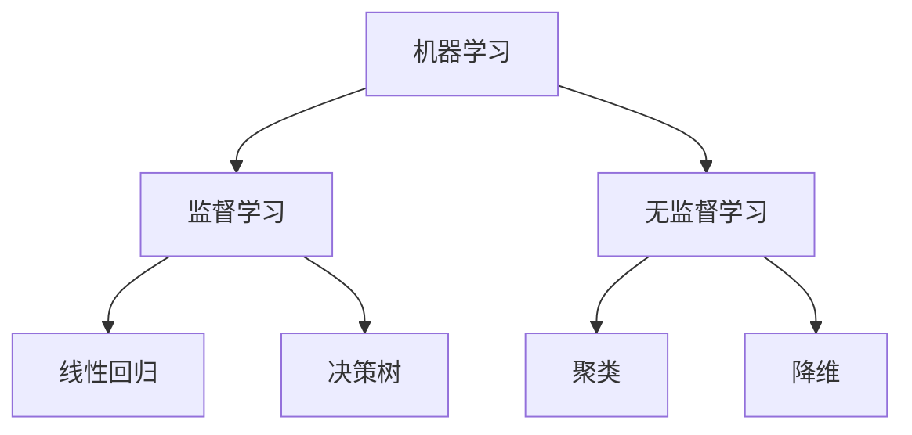
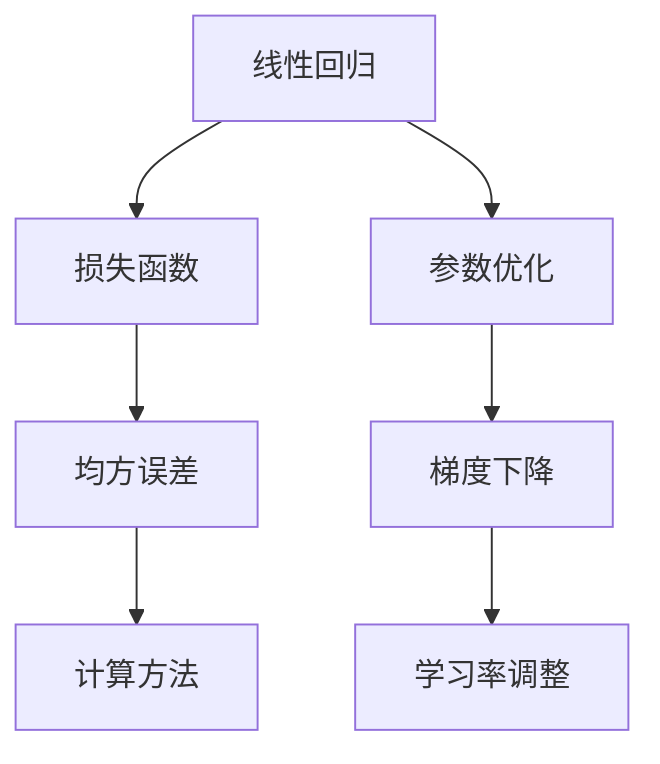
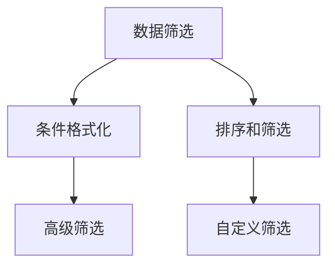
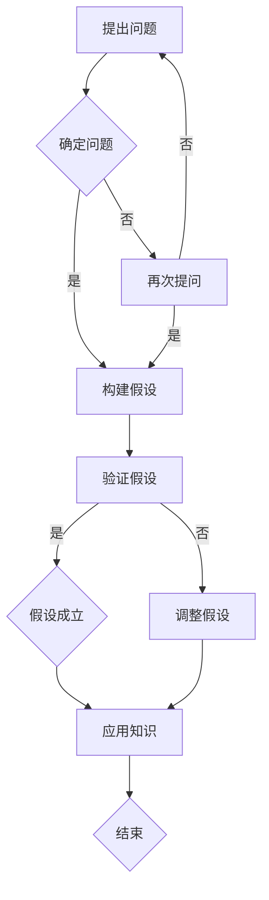

                 

### 文章标题：用费曼提问法提升学习深度

> 关键词：费曼提问法，学习深度，批判性思维，主动学习，深度学习，算法思维

> 摘要：本文将深入探讨费曼提问法在提升学习深度方面的应用。通过分析其起源、核心思想、与传统学习方法的区别，以及在不同场景下的实践案例，本文旨在为广大读者提供一种全新的学习方法和思考工具，助力他们在信息技术领域取得突破性进展。

### 目录

#### 第一部分：费曼提问法基础

1. 第1章：了解费曼提问法
   - 1.1 费曼提问法的起源与核心思想
   - 1.2 费曼提问法与传统学习方法的区别
   - 1.3 费曼提问法的适用范围

2. 第2章：构建有效的费曼提问法框架
   - 2.1 提问技巧与策略
   - 2.2 构建知识网络
   - 2.3 费曼提问法的实施步骤

3. 第3章：核心概念与联系
   - 3.1 费曼提问法与批判性思维
   - 3.2 费曼提问法与主动学习
   - 3.3 费曼提问法与深度学习

4. 第4章：核心算法原理讲解
   - 4.1 费曼提问法中的算法思维
   - 4.2 伪代码与算法设计

#### 第二部分：费曼提问法在实践中的应用

5. 第5章：个人学习中的费曼提问法
   - 5.1 个人学习中的问题提出与解决
   - 5.2 个人学习中的知识网络构建
   - 5.3 个人学习中的费曼提问法实践

6. 第6章：团队协作中的费曼提问法
   - 6.1 团队协作中的问题提出与解决
   - 6.2 团队协作中的知识网络构建
   - 6.3 团队协作中的费曼提问法实践

7. 第7章：教学与培训中的费曼提问法
   - 7.1 教学中的问题提出与解决
   - 7.2 培训中的问题提出与解决
   - 7.3 教学与培训中的知识网络构建
   - 7.4 教学与培训中的费曼提问法实践

8. 第8章：总结与展望
   - 8.1 费曼提问法的应用总结
   - 8.2 费曼提问法的未来展望

#### 附录

9. 附录A：费曼提问法工具与资源
   - 9.1 费曼提问法工具介绍
   - 9.2 费曼提问法资源链接
   - 9.3 费曼提问法实践案例

10. 附录B：Mermaid流程图示例

11. 附录C：伪代码示例

12. 附录D：数学公式与讲解

13. 附录E：代码案例

### 第一部分：费曼提问法基础

#### 第1章：了解费曼提问法

##### 1.1 费曼提问法的起源与核心思想

费曼提问法，起源于著名物理学家理查德·费曼（Richard Feynman）的教学方法。费曼是一位杰出的理论物理学家，他因在量子电动力学领域的卓越贡献而获得了诺贝尔物理学奖。然而，费曼不仅仅是一个杰出的科学家，他还以其独特的教学风格而闻名。

在教学中，费曼提出了一种简单而强大的方法，即“费曼提问法”。这种方法的核心思想是通过提问和回答来深入了解一个概念或问题。费曼认为，一个真正理解一个概念的人应该能够将其解释给一个初学者。这个思想与传统的学习方式有显著的不同。

传统的学习方法侧重于记忆和理解理论知识，而费曼提问法则强调通过提问和回答来加深对概念的理解。这种方法不仅有助于学习新知识，还有助于巩固已有的知识。费曼提问法的关键在于：

- **提问**：通过提出问题来揭示对某个主题的未知或模糊之处。
- **回答**：尝试回答自己提出的问题，以加深对主题的理解。
- **反思**：评估回答的质量，并从中学习。

##### 1.2 费曼提问法与传统学习方法的区别

传统学习方法通常包括以下几个步骤：

- **阅读**：阅读教材、论文或书籍，获取知识。
- **记忆**：记忆关键概念、公式或事实。
- **理解**：试图理解概念或公式的含义。
- **复习**：定期复习所学内容，以巩固记忆。

然而，这种方法有一个显著的局限：它容易导致知识的表面化理解。学生可能能够记住大量的信息，但无法将这些信息应用到实际问题中。相比之下，费曼提问法有以下优势：

- **深度理解**：通过提问和回答，学生能够更深入地理解概念，并将其应用于实际问题。
- **反思与改进**：费曼提问法鼓励学生反思自己的理解，并根据反馈进行改进。
- **主动性**：学生需要主动提出问题，而不是被动接受信息。

##### 1.3 费曼提问法的适用范围

费曼提问法不仅适用于学术研究，还可以广泛应用于个人学习、团队合作和教学与培训。以下是费曼提问法在不同场景中的应用：

- **个人学习**：学生可以通过提问和回答来深入了解课程内容，从而提高学习效果。
- **团队合作**：团队成员可以共同使用费曼提问法，以加深对项目或任务的理解。
- **教学与培训**：教师或培训师可以使用费曼提问法来引导学生或学员深入理解知识。

### 第一部分总结

在第一部分中，我们了解了费曼提问法的起源、核心思想以及与传统学习方法的区别。费曼提问法强调通过提问和回答来深入理解概念，这种方法不仅有助于学习新知识，还能巩固已有知识。在接下来的章节中，我们将进一步探讨如何构建有效的费曼提问法框架，并分析其在批判性思维、主动学习和深度学习中的应用。

### 第2章：构建有效的费曼提问法框架

在了解了费曼提问法的基础之后，我们需要进一步探讨如何构建一个有效的费曼提问法框架。一个有效的框架不仅能够帮助我们更好地理解和应用知识，还能提高学习效率和深度。在这一章中，我们将讨论提问技巧与策略、构建知识网络以及费曼提问法的实施步骤。

##### 2.1 提问技巧与策略

有效的提问是费曼提问法成功的关键。以下是一些提问技巧和策略：

1. **开放性问题**：开放性问题能够激发思维，帮助我们发现和理解新的概念。例如，“你能解释一下什么是机器学习吗？”而不是简单的“是的”或“不是”问题。

2. **具体问题**：具体问题能够帮助我们更准确地理解概念。例如，“你能解释一下线性回归模型是如何工作的吗？”而不是“你能解释一下机器学习吗？”

3. **递进式提问**：通过递进式提问，我们可以逐步深入了解一个概念。例如，可以从“什么是机器学习？”开始，然后提问“机器学习有哪些类型？”和“哪种类型的机器学习最适合这个问题？”

4. **反思性提问**：反思性提问有助于我们评估自己的理解并改进学习方法。例如，“我对这个问题的理解正确吗？”和“我如何改进我的理解？”

##### 2.2 构建知识网络

知识网络是理解复杂概念的有力工具。它通过将相关概念和知识点连接起来，帮助我们建立更全面和深入的理解。以下是构建知识网络的步骤：

1. **确定核心概念**：首先，确定你需要深入理解的核心概念。这些概念可以是课程中的关键知识点，也可以是你自己感兴趣的主题。

2. **绘制关系图**：使用图形或思维导图，将核心概念和相关知识点连接起来。你可以使用Mermaid流程图来绘制这些关系。



3. **不断完善**：随着学习的深入，你可能会发现新的关系和知识点。不断更新和改进你的知识网络，使其保持准确和全面。

##### 2.3 费曼提问法的实施步骤

实施费曼提问法可以分为以下几个步骤：

1. **提出问题**：根据你的知识网络和兴趣，提出具体的问题。这些问题应该是你想要深入了解的，或者是在学习过程中遇到的难点。

2. **回答问题**：尝试回答你提出的问题。如果你能够清晰、准确地回答，那么说明你对这个概念有较深入的理解。如果你无法回答，或者回答得不完整，那么你需要进一步学习。

3. **评估反馈**：在回答问题后，评估你的回答质量。如果你回答得很好，那么你可以继续前进。如果你回答得不够好，那么你需要再次学习并改进你的理解。

4. **反思与改进**：在每次学习后，反思你的学习过程，思考哪些方法有效，哪些需要改进。你可以记录这些反思，以便在未来的学习中参考。

### 2.4 费曼提问法在批判性思维中的应用

费曼提问法是批判性思维的有力工具。通过提问和回答，我们可以质疑和评估自己的观点，从而培养批判性思维能力。以下是如何在费曼提问法中应用批判性思维：

1. **质疑假设**：在回答问题时，质疑你的假设。例如，如果你正在解释线性回归，你可以问自己：“线性回归的假设是什么？这些假设是否合理？”

2. **评估证据**：在回答问题时，评估你提供的证据。例如，如果你正在解释一个算法，你可以问自己：“这个算法的优点和缺点是什么？是否有足够的证据支持这个算法的有效性？”

3. **反思结论**：在回答问题后，反思你的结论。例如，如果你正在解释一个概念，你可以问自己：“我的结论是否全面？是否有其他观点需要考虑？”

通过这些步骤，我们可以培养批判性思维能力，从而更深入地理解概念，并在解决问题时做出更明智的决策。

### 2.5 费曼提问法在主动学习中的应用

主动学习是一种以学生为中心的学习方法，它强调学生的主动参与和深入思考。费曼提问法是主动学习的有力工具，因为它鼓励学生提出问题、回答问题和反思学习过程。以下是如何在主动学习中应用费曼提问法：

1. **自主学习**：学生可以自己提出问题，并通过回答这些问题来深入理解知识。

2. **同伴学习**：学生可以与同伴一起使用费曼提问法，相互提问和回答，以加深对知识的理解。

3. **教师指导**：教师可以引导学生使用费曼提问法，帮助他们提出更有深度的问题，并指导他们如何回答这些问题。

### 2.6 费曼提问法在深度学习中的应用

深度学习是一种人工智能技术，它通过模拟人脑神经网络进行学习。费曼提问法在深度学习中具有重要作用，因为它可以帮助研究人员深入了解神经网络的工作原理，并评估其性能。以下是如何在深度学习中应用费曼提问法：

1. **理解模型**：研究人员可以使用费曼提问法来理解深度学习模型，例如卷积神经网络（CNN）或循环神经网络（RNN）。

2. **评估性能**：研究人员可以使用费曼提问法来评估深度学习模型的性能，例如如何改进模型以减少误差。

3. **优化算法**：研究人员可以使用费曼提问法来优化深度学习算法，例如如何提高模型的效率和准确性。

### 第2章总结

在第2章中，我们讨论了如何构建一个有效的费曼提问法框架，包括提问技巧与策略、构建知识网络以及实施步骤。我们还探讨了费曼提问法在批判性思维、主动学习和深度学习中的应用。通过这些讨论，我们希望能够帮助读者更好地理解和应用费曼提问法，从而提升他们的学习深度。在接下来的章节中，我们将进一步探讨费曼提问法在个人学习、团队协作和教学与培训中的实践应用。

### 第3章：核心概念与联系

在第2章中，我们探讨了费曼提问法的基础和构建一个有效框架的方法。在这一章中，我们将进一步深入探讨费曼提问法与其他重要概念和方法的联系，包括批判性思维、主动学习和深度学习。

##### 3.1 费曼提问法与批判性思维

批判性思维是一种以逻辑和理性为基础的思考方式，它强调质疑和评估信息，而不是盲目接受。费曼提问法与批判性思维有着密切的联系，因为它们都鼓励我们深入探究和理解问题。

费曼提问法通过提问和回答的过程，迫使我们质疑自己的假设，评估证据，并反思结论。这种过程有助于培养批判性思维能力，使我们能够更有效地分析和解决问题。

以下是如何在费曼提问法中应用批判性思维：

1. **质疑假设**：在回答问题时，质疑自己的假设。例如，如果你正在解释线性回归，你可以问自己：“线性回归的假设是什么？这些假设是否合理？”

2. **评估证据**：在回答问题时，评估你提供的证据。例如，如果你正在解释一个算法，你可以问自己：“这个算法的优点和缺点是什么？是否有足够的证据支持这个算法的有效性？”

3. **反思结论**：在回答问题后，反思你的结论。例如，如果你正在解释一个概念，你可以问自己：“我的结论是否全面？是否有其他观点需要考虑？”

通过这些步骤，我们可以培养批判性思维能力，从而更深入地理解概念，并在解决问题时做出更明智的决策。

##### 3.2 费曼提问法与主动学习

主动学习是一种以学生为中心的学习方法，它强调学生的主动参与和深入思考。费曼提问法是主动学习的有力工具，因为它鼓励学生提出问题、回答问题和反思学习过程。

以下是如何在主动学习中应用费曼提问法：

1. **自主学习**：学生可以自己提出问题，并通过回答这些问题来深入理解知识。

2. **同伴学习**：学生可以与同伴一起使用费曼提问法，相互提问和回答，以加深对知识的理解。

3. **教师指导**：教师可以引导学生使用费曼提问法，帮助他们提出更有深度的问题，并指导他们如何回答这些问题。

费曼提问法在主动学习中的应用有助于提高学生的参与度和学习效果，使他们能够更深入地理解知识，并培养独立思考的能力。

##### 3.3 费曼提问法与深度学习

深度学习是一种人工智能技术，它通过模拟人脑神经网络进行学习。费曼提问法在深度学习中具有重要作用，因为它可以帮助研究人员深入了解神经网络的工作原理，并评估其性能。

以下是如何在深度学习中应用费曼提问法：

1. **理解模型**：研究人员可以使用费曼提问法来理解深度学习模型，例如卷积神经网络（CNN）或循环神经网络（RNN）。

2. **评估性能**：研究人员可以使用费曼提问法来评估深度学习模型的性能，例如如何改进模型以减少误差。

3. **优化算法**：研究人员可以使用费曼提问法来优化深度学习算法，例如如何提高模型的效率和准确性。

费曼提问法在深度学习中的应用有助于研究人员更好地理解和评估深度学习模型，从而推动人工智能技术的发展。

##### 3.4 费曼提问法与其他学习方法的比较

费曼提问法与其他学习方法，如传统学习方法和主动学习，有哪些区别和联系？

- **传统学习方法**：传统学习方法侧重于记忆和理解理论知识。费曼提问法则强调通过提问和回答来加深对概念的理解，这种方法有助于培养批判性思维和深入理解。

- **主动学习**：主动学习强调学生的主动参与和深入思考。费曼提问法是主动学习的有力工具，因为它鼓励学生提出问题、回答问题和反思学习过程。

费曼提问法与这些学习方法既有区别又有联系。费曼提问法不仅能够提高学习效果，还能培养批判性思维和深入理解。这种方法可以与其他学习方法结合使用，以实现更好的学习效果。

##### 3.5 费曼提问法在不同学科中的应用

费曼提问法不仅适用于信息技术领域，还可以广泛应用于其他学科。以下是一些例子：

- **物理学**：物理学家可以使用费曼提问法来深入理解物理概念，例如量子力学或相对论。

- **生物学**：生物学家可以使用费曼提问法来探索生命科学的基本原理，例如基因表达或细胞信号传导。

- **经济学**：经济学家可以使用费曼提问法来分析经济现象，例如市场波动或经济增长。

费曼提问法是一种通用的学习工具，可以应用于各种学科领域。通过提问和回答，我们可以更深入地理解复杂的概念和理论，从而推动学术研究和知识创新。

### 第3章总结

在第3章中，我们探讨了费曼提问法与其他重要概念和方法的联系，包括批判性思维、主动学习和深度学习。我们还比较了费曼提问法与其他学习方法的区别和联系，并讨论了其在不同学科中的应用。通过这些讨论，我们希望能够帮助读者更好地理解费曼提问法，并认识到它在提升学习深度方面的广泛应用。在下一章中，我们将深入探讨费曼提问法中的核心算法原理，以帮助我们更深入地理解和应用这一方法。

### 第4章：核心算法原理讲解

在了解了费曼提问法的基础和它在批判性思维、主动学习和深度学习中的应用后，接下来我们将深入探讨费曼提问法中的核心算法原理。算法思维是费曼提问法的重要组成部分，它不仅有助于我们更好地理解复杂概念，还能提高我们的问题解决能力。在本章中，我们将详细讲解算法思维、伪代码以及算法设计。

##### 4.1 费曼提问法中的算法思维

算法思维是一种系统性的逻辑思考方式，它强调将问题分解为更小的子问题，并通过逐步解决这些子问题来解决问题。在费曼提问法中，算法思维帮助我们更深入地理解概念，并有效地解决复杂问题。

算法思维具有以下几个特点：

1. **分解问题**：将复杂问题分解为更小的、可管理的子问题。
2. **逐步解决**：依次解决这些子问题，从而逐步解决原问题。
3. **逻辑性**：算法思维强调逻辑性和步骤性，确保每一步都是合理和有效的。
4. **可重复性**：算法思维的可重复性使其成为一种可靠和可验证的思考方式。

在费曼提问法中，算法思维的应用主要体现在以下几个方面：

1. **问题分解**：在提问过程中，通过分解问题，将复杂的问题分解为更小、更具体的子问题，从而更容易理解和解决。
2. **逐步解答**：通过逐步解答这些子问题，逐步接近原问题的答案。
3. **逻辑验证**：在回答问题时，使用算法思维确保每一步都是合理和有效的，避免逻辑错误和误解。

##### 4.2 伪代码与算法设计

伪代码是一种用自然语言描述算法的表示方法，它不依赖于具体的编程语言，但能够清晰地表达算法的逻辑结构和步骤。在费曼提问法中，伪代码是一种非常有用的工具，它可以帮助我们更深入地理解算法原理，并设计出有效的算法。

伪代码的基本结构包括：

1. **输入**：定义算法的输入参数，这些参数是算法开始执行时需要的数据。
2. **输出**：定义算法的输出结果，即算法执行完成后需要返回的数据。
3. **过程**：描述算法的执行步骤，包括对输入数据的处理和操作。

以下是一个简单的伪代码示例：

```plaintext
// 伪代码：寻找最大值

// 输入：一个整数数组arr
// 输出：数组中的最大值

function find_max(arr):
    if arr为空:
        return "数组为空"
    max_value = arr的第一个元素
    for每个元素x in arr:
        if x > max_value:
            max_value = x
    return max_value
```

在费曼提问法中，我们可以使用伪代码来：

1. **理解算法原理**：通过阅读伪代码，我们可以理解算法的逻辑和执行步骤。
2. **提问和解答**：我们可以针对伪代码提出问题，例如“为什么需要这个for循环？”或“这个if语句的作用是什么？”，然后通过解答这些问题来加深对算法的理解。
3. **设计算法**：我们可以使用伪代码来设计和修改算法，确保其逻辑正确和高效。

##### 4.3 算法设计的技巧与策略

在设计算法时，我们需要考虑以下几个技巧和策略：

1. **分而治之**：将复杂问题分解为更小的子问题，然后分别解决这些子问题。
2. **递归**：递归是一种常用的算法设计技巧，它通过反复调用自身来解决子问题。
3. **动态规划**：动态规划是一种用于解决最优子结构问题的算法设计技巧，它通过保存子问题的解来避免重复计算。
4. **贪心算法**：贪心算法是一种在每一步都做出局部最优选择的算法设计技巧，它通常适用于最优子结构问题。

以下是一个使用贪心算法的伪代码示例：

```plaintext
// 伪代码：找零问题

// 输入：一个整数金额和一组硬币面值
// 输出：最小硬币数量

function make_change(amount, coins):
    硬币数量 = 0
    for每个硬币面值coin in coins:
        if amount >= coin:
            硬币数量 += amount // coin
            amount -= coin
    return 硬币数量
```

通过这个示例，我们可以看到如何使用贪心算法来设计一个简单的找零问题解决方案。在这个过程中，我们可以提出以下问题来加深理解：

- 为什么每次选择最大的硬币面值？
- 如果有多个硬币面值可以选，如何确保选择的最优性？
- 这种算法是否适用于所有情况？是否有更优的解决方案？

通过这样的提问和解答，我们可以更好地理解贪心算法的原理，并能够将其应用于实际问题中。

##### 4.4 费曼提问法中的算法思维实践

在费曼提问法中，算法思维的应用不仅仅局限于理解和设计算法，还包括在学习和解决问题时的实际应用。以下是一些实践步骤：

1. **问题识别**：识别需要解决的算法问题，例如优化一个算法的效率或解决一个特定的问题。
2. **算法理解**：使用伪代码来理解现有算法的工作原理，并提出问题来加深理解。
3. **算法设计**：根据理解设计一个新的算法，并通过伪代码来描述其逻辑结构。
4. **问题解决**：使用设计的算法解决实际问题，并评估其性能和效果。
5. **反馈与改进**：根据反馈改进算法设计，并重复上述步骤，以实现更好的问题解决效果。

通过这些实践步骤，我们可以培养算法思维，提高问题解决能力，并在费曼提问法的框架下实现更深入的学习。

### 4.5 算法思维与深度学习

在深度学习中，算法思维同样发挥着重要作用。深度学习模型通常由多层神经网络组成，这些神经网络通过复杂的函数组合来学习特征和模式。以下是如何在深度学习中应用算法思维：

1. **模型理解**：使用伪代码来理解深度学习模型的结构和训练过程，例如卷积神经网络（CNN）或循环神经网络（RNN）。
2. **参数优化**：通过调整模型的参数来优化其性能，使用算法思维来设计参数优化算法。
3. **模型评估**：使用算法思维来设计评估深度学习模型性能的方法，例如通过交叉验证和性能指标来评估模型。
4. **模型改进**：使用算法思维来改进深度学习模型，例如通过调整网络结构或优化训练过程来提高模型的准确性。

通过这些步骤，我们可以更深入地理解深度学习模型的工作原理，并能够设计出更有效的算法来改进模型。

### 第4章总结

在第4章中，我们深入探讨了费曼提问法中的核心算法原理，包括算法思维、伪代码和算法设计。我们了解了算法思维的特点和应用，以及如何使用伪代码来理解、设计和优化算法。我们还讨论了算法思维在深度学习中的应用，展示了如何在深度学习中使用算法思维来改进模型。通过这些讨论，我们希望能够帮助读者更好地理解和应用费曼提问法，提高他们的学习深度和问题解决能力。在下一章中，我们将探讨费曼提问法在个人学习中的实践应用。

### 第5章：个人学习中的费曼提问法

个人学习是获取知识、技能和经验的重要途径，而费曼提问法是一种非常有效的个人学习方法。通过提问和回答，个人学习者可以深入理解概念，发现并填补知识盲点，从而提高学习效果。在本章中，我们将探讨个人学习中的费曼提问法的具体应用，包括问题提出与解决、知识网络构建以及实践案例。

##### 5.1 个人学习中的问题提出与解决

问题提出与解决是费曼提问法中的关键步骤。以下是在个人学习中如何有效提出问题和解决问题的方法：

1. **识别问题**：在学习过程中，不断识别自己不理解或感到疑惑的概念。例如，在阅读教材或观看课程视频时，遇到难以理解的部分，就可以将其作为一个问题。

2. **提出问题**：针对识别出的问题，提出具体、明确的问题。开放性问题有助于激发深入思考，而具体问题则有助于更准确地理解概念。

3. **解决问题**：尝试自己回答提出的问题。如果无法回答，可以查阅相关资料、讨论群组或寻求他人帮助。解决问题的过程也是加深理解的过程。

4. **反思与修正**：在解决问题后，反思自己的回答是否准确、全面。如果不准确或不够全面，需要进一步学习和改进。

以下是一个具体的例子：

假设你正在学习机器学习中的线性回归模型，但对其细节理解不够深入。你可以提出以下问题：

- 线性回归的目标是什么？
- 线性回归的损失函数是什么？
- 线性回归如何计算损失？
- 线性回归如何进行参数优化？

通过这些问题，你可以逐步深入理解线性回归模型的原理，并通过查阅资料、讨论和练习来解决问题。

##### 5.2 个人学习中的知识网络构建

知识网络是一种将相关概念和知识点连接起来的思维工具，它有助于我们建立更全面和深入的理解。在个人学习中，构建知识网络可以采用以下步骤：

1. **确定核心概念**：首先，确定你需要深入理解的核心概念。这些概念可以是课程中的关键知识点，也可以是你自己感兴趣的主题。

2. **绘制关系图**：使用图形或思维导图，将核心概念和相关知识点连接起来。你可以使用Mermaid流程图来绘制这些关系。

以下是一个简单的知识网络示例：



3. **不断完善**：随着学习的深入，你可能会发现新的关系和知识点。不断更新和改进你的知识网络，使其保持准确和全面。

知识网络不仅有助于我们理解复杂概念，还能帮助我们在解决问题时快速找到相关知识点，提高学习效率。

##### 5.3 个人学习中的费曼提问法实践

费曼提问法在个人学习中的应用可以通过以下实践案例来说明：

1. **自学编程**：假设你正在自学编程，特别是Python语言。你可以使用费曼提问法来巩固你的学习：

   - 提出问题：例如，“Python中的列表是如何工作的？”，“如何使用列表推导式？”
   - 回答问题：尝试用自己的语言解释这些问题，例如，“Python列表是一个有序集合，可以存储多个元素。列表推导式是一种创建新列表的简洁方式。”
   - 反思与修正：评估你的回答是否清晰、准确，如有必要，进行进一步的复习和练习。

2. **深入学习算法**：假设你正在深入学习数据结构中的树结构，你可以使用费曼提问法来提高你的理解：

   - 提出问题：例如，“二叉树是如何工作的？”，“什么是二叉搜索树？”，“二叉搜索树如何进行搜索？”
   - 回答问题：尝试用自己的语言解释这些问题，例如，“二叉树是一种每个节点最多有两个子节点的树。二叉搜索树是一种特殊的二叉树，其左子树的所有节点值都小于根节点值，右子树的所有节点值都大于根节点值。”
   - 反思与修正：评估你的回答是否清晰、准确，如有必要，查阅资料或请教他人。

3. **掌握数学知识**：假设你正在自学线性代数，你可以使用费曼提问法来掌握基本概念：

   - 提出问题：例如，“矩阵是什么？”，“矩阵乘法的规则是什么？”
   - 回答问题：尝试用自己的语言解释这些问题，例如，“矩阵是一个由数字组成的二维数组。矩阵乘法是两个矩阵之间的一种运算，其结果是一个新的矩阵。”
   - 反思与修正：评估你的回答是否清晰、准确，如有必要，通过练习题或参考书籍来巩固知识。

通过这些实践案例，我们可以看到费曼提问法如何帮助个人学习者深入理解知识，并通过提问和回答的过程来提高学习效果。这种方法不仅适用于编程和算法学习，还可以应用于任何领域的学习。

### 5.4 费曼提问法个人学习的优缺点

费曼提问法在个人学习中具有以下优点：

- **深度理解**：通过提问和回答，学习者能够深入理解概念，而不仅仅是表面上的记忆。
- **主动学习**：费曼提问法鼓励学习者主动提出问题，而不是被动接受信息，有助于提高学习积极性和主动性。
- **反思与改进**：费曼提问法促使学习者反思自己的学习过程，并根据反馈进行改进，有助于持续提升学习能力。

然而，费曼提问法也存在一些缺点：

- **耗时较长**：费曼提问法需要花费较多时间来提出问题、回答问题和反思，这可能会影响学习进度。
- **依赖外部资源**：有时，学习者可能需要查阅大量资料或请教他人来解决问题，这可能会增加学习难度。

尽管存在这些缺点，费曼提问法仍然是一种非常有效的个人学习方法，可以帮助学习者深入理解知识，提高学习效果。

### 第5章总结

在第5章中，我们探讨了个人学习中的费曼提问法的具体应用，包括问题提出与解决、知识网络构建以及实践案例。通过提问和回答，个人学习者可以深入理解概念，发现并填补知识盲点，从而提高学习效果。我们还讨论了费曼提问法在个人学习中的优缺点。在下一章中，我们将探讨费曼提问法在团队协作中的实践应用。

### 第6章：团队协作中的费曼提问法

团队协作是许多工作和学习场景中的常见方式，它有助于提高效率、促进创新和共享知识。费曼提问法在团队协作中同样具有重要作用，可以帮助团队成员深入理解问题，共同解决问题，并提高团队的整体学习能力。在本章中，我们将探讨团队协作中的费曼提问法的具体应用，包括问题提出与解决、知识网络构建以及实践案例。

##### 6.1 团队协作中的问题提出与解决

在团队协作中，问题提出与解决是关键步骤。通过有效的提问和解答，团队成员可以共同探讨问题、分享见解，从而找到最佳解决方案。以下是团队协作中如何应用费曼提问法：

1. **明确问题**：在开始团队协作之前，首先明确团队面临的问题或挑战。这可以通过集体讨论或头脑风暴来实现。

2. **分配任务**：根据团队成员的专长和兴趣，将问题分解为更小的子问题，并分配给相应的团队成员。

3. **提问和解答**：每个团队成员使用费曼提问法，针对分配给自己的子问题进行提问和解答。这包括提出开放性问题、具体问题以及递进式问题。

4. **协作讨论**：团队成员之间进行协作讨论，共同探讨问题的解决方案。在这个过程中，费曼提问法可以帮助团队成员深入理解问题，并从不同角度思考解决方案。

5. **反馈与改进**：在讨论结束后，团队成员对解决方案进行评估和反馈，并根据反馈进行改进。

以下是一个具体的例子：

假设一个团队正在开发一个机器学习项目，其中一个子问题是“如何优化模型的训练时间？”团队成员可以按照以下步骤使用费曼提问法：

- **明确问题**：团队明确子问题“如何优化模型的训练时间？”
- **分配任务**：根据团队成员的专长，将问题分解为“优化数据预处理”、“调整模型参数”和“改进训练算法”等子问题，并分配给相应的团队成员。
- **提问和解答**：团队成员针对分配给自己的子问题进行提问和解答。例如，负责“优化数据预处理”的成员可以提问：“我们是否可以考虑使用更高效的数据读取方法？”并尝试回答这个问题。
- **协作讨论**：团队成员之间进行协作讨论，共同探讨优化模型训练时间的方案。
- **反馈与改进**：团队对提出的方案进行评估和反馈，并根据反馈进行改进。

通过这样的过程，团队成员可以共同深入理解问题，找到有效的解决方案，并提高团队的整体工作效率。

##### 6.2 团队协作中的知识网络构建

知识网络是团队协作中非常有用的工具，它可以帮助团队成员建立更全面和深入的理解。以下是在团队协作中如何构建知识网络：

1. **确定核心概念**：首先，团队需要确定需要深入理解的核心概念。这些概念可以是与项目相关的关键技术或理论。

2. **绘制关系图**：团队可以使用思维导图或Mermaid流程图等工具，将核心概念和相关知识点连接起来。这样可以直观地展示概念之间的关系，帮助团队成员更好地理解整个知识体系。

3. **知识共享**：团队成员可以通过讨论、分享经验和查阅资料来共同完善知识网络。

以下是一个简单的知识网络示例：


4. **动态更新**：随着项目的进展和学习，团队成员可以不断更新和完善知识网络，确保其始终保持准确和全面。

通过构建知识网络，团队可以更全面地理解项目，提高协作效率，并在解决问题时快速找到相关知识点。

##### 6.3 团队协作中的费曼提问法实践

费曼提问法在团队协作中的应用可以通过以下实践案例来说明：

1. **项目管理**：一个团队正在开发一个大型软件项目，其中涉及多个模块和功能。团队可以使用费曼提问法来确保每个模块都被深入理解和有效实现：

   - 提出问题：团队成员可以针对每个模块提出问题，例如“这个模块的实现原理是什么？”“模块之间的交互如何实现？”
   - 回答问题：团队成员尝试用自己的语言解释这些问题，并通过讨论和查阅资料来找到答案。
   - 反思与改进：团队评估每个模块的实现情况，并根据反馈进行改进。

2. **技术讨论**：团队定期举行技术讨论会议，讨论最新的技术趋势和解决方案。通过费曼提问法，团队可以深入探讨技术细节：

   - 提出问题：团队成员可以提出关于新技术或解决方案的具体问题，例如“这种分布式系统的优势是什么？”“如何确保数据的一致性？”
   - 回答问题：团队成员尝试用自己的语言解释这些问题，并通过讨论和查阅资料来找到答案。
   - 反思与改进：团队评估讨论的成效，并根据反馈调整讨论内容和方式。

3. **代码审查**：团队在进行代码审查时，可以使用费曼提问法来确保代码的质量和可维护性：

   - 提出问题：团队成员可以针对代码中的关键部分提出问题，例如“这段代码的逻辑是否清晰？”“这段代码的性能如何？”
   - 回答问题：团队成员尝试用自己的语言解释这些问题，并通过讨论和查阅资料来找到答案。
   - 反思与改进：团队评估代码的质量，并根据反馈对代码进行改进。

通过这些实践案例，我们可以看到费曼提问法如何帮助团队在协作中深入理解问题，提高工作效率，并确保项目质量和可维护性。

### 6.4 费曼提问法在团队协作中的优缺点

费曼提问法在团队协作中具有以下优点：

- **深度理解**：通过提问和回答，团队成员可以深入理解项目和技术细节，提高整体技术水平。
- **促进沟通**：费曼提问法鼓励团队成员分享知识和见解，促进团队内部的沟通和协作。
- **提高效率**：通过提问和解答，团队可以更快地识别和解决问题，提高项目进度和效率。

然而，费曼提问法也存在一些缺点：

- **时间成本**：费曼提问法需要花费较多的时间来进行提问、回答和讨论，可能会影响团队的进度。
- **依赖知识储备**：团队成员需要具备一定的知识储备，才能有效地进行提问和回答，这可能会对团队成员的要求较高。

尽管存在这些缺点，费曼提问法仍然是一种非常有效的团队协作方法，可以帮助团队深入理解问题，提高协作效率，并在项目实施过程中实现高质量的目标。

### 第6章总结

在第6章中，我们探讨了团队协作中的费曼提问法的具体应用，包括问题提出与解决、知识网络构建以及实践案例。通过提问和回答，团队成员可以深入理解项目和技术细节，提高整体技术水平，促进沟通和协作。我们还讨论了费曼提问法在团队协作中的优缺点。在下一章中，我们将探讨费曼提问法在教学与培训中的应用。

### 第7章：教学与培训中的费曼提问法

在教学与培训中，教师或培训师需要有效地传递知识和技能，同时确保学员能够理解和掌握这些内容。费曼提问法作为一种互动性强的教学方法，可以在教学与培训中发挥重要作用。本章将探讨费曼提问法在教学与培训中的具体应用，包括问题提出与解决、知识网络构建以及实践案例。

##### 7.1 教学中的问题提出与解决

在教学过程中，教师使用费曼提问法可以帮助学员深入理解课程内容，并提高他们的学习效果。以下是教师如何在教学中应用费曼提问法的步骤：

1. **设计问题**：教师应根据课程内容和学员的背景知识，设计具有挑战性和启发性的问题。这些问题应该能够引导学员思考，促进他们主动学习。

2. **提问时机**：在适当的时机提出问题，例如在讲解新概念或重要知识点时，或者在学员出现疑惑时。

3. **引导回答**：教师鼓励学员尝试回答问题，即使回答不完整或错误，也要给予肯定和指导，以激发学员的自信心和求知欲。

4. **评估回答**：教师对学员的回答进行评估，识别他们的理解程度和知识盲点。同时，教师可以提供补充解释或额外资源，以帮助学员更好地理解课程内容。

以下是一个教学中的问题提出与解决的例子：

假设教师在讲解线性代数中的矩阵运算，可以提出以下问题：

- “矩阵乘法的定义是什么？”
- “矩阵乘法的规则是什么？”
- “矩阵乘法在实际应用中有哪些场景？”

教师可以引导学员回答这些问题，并根据回答情况提供进一步解释和示例。

##### 7.2 培训中的问题提出与解决

在培训过程中，培训师使用费曼提问法可以帮助学员更好地掌握技能和知识，并提高培训效果。以下是培训师如何在培训中应用费曼提问法的步骤：

1. **明确培训目标**：培训师应根据培训目标和学员需求，设计与培训内容相关的问题。

2. **提供背景信息**：在提问前，培训师应简要介绍相关背景知识，帮助学员建立问题的上下文。

3. **提出开放性问题**：培训师应提出开放性问题，以鼓励学员主动思考和参与。

4. **引导学员回答**：培训师鼓励学员尝试回答问题，并给予肯定和指导，帮助他们克服困难。

5. **评估学习效果**：培训师通过学员的回答和表现，评估他们的学习效果，并提供个性化反馈。

以下是一个培训中的问题提出与解决的例子：

假设培训师在培训中讲解如何使用Excel进行数据分析和报表制作，可以提出以下问题：

- “Excel中的数据筛选功能是什么？”
- “如何使用Excel中的图表功能来展示数据分析结果？”
- “在实际工作中，你会如何使用Excel来优化数据报表的格式和呈现效果？”

培训师可以引导学员回答这些问题，并根据回答情况提供进一步解释和示例。

##### 7.3 教学与培训中的知识网络构建

在教与学过程中，教师或培训师可以使用费曼提问法帮助学员构建知识网络，从而促进对课程内容的深入理解。以下是构建知识网络的步骤：

1. **确定核心概念**：教师或培训师与学员一起确定课程中的核心概念和知识点。

2. **绘制关系图**：使用思维导图或Mermaid流程图等工具，将核心概念和相关知识点连接起来，形成知识网络。

3. **知识共享**：教师或培训师鼓励学员分享他们的理解，共同完善知识网络。

4. **动态更新**：随着课程的深入，教师或培训师和学员可以不断更新和完善知识网络。

以下是一个知识网络构建的例子：



通过知识网络，学员可以更清晰地理解各个知识点之间的关系，从而更好地掌握课程内容。

##### 7.4 教学与培训中的费曼提问法实践

费曼提问法在教学与培训中的具体应用可以通过以下实践案例来说明：

1. **计算机编程培训**：培训师在培训中讲解编程语言的基础知识，例如变量、循环和条件语句。通过费曼提问法，培训师可以提出以下问题：

   - “变量是什么？如何声明和初始化变量？”
   - “循环有哪些类型？如何使用循环结构？”
   - “条件语句的作用是什么？如何使用条件语句实现分支结构？”

   培训师可以引导学员回答这些问题，并根据回答情况提供进一步解释和示例。

2. **企业管理培训**：在企业管理培训中，培训师可以提出以下问题：

   - “什么是供应链管理？它在企业管理中有什么作用？”
   - “如何进行市场调研？市场调研有哪些主要方法？”
   - “如何制定有效的营销策略？营销策略的核心要素是什么？”

   培训师可以引导学员回答这些问题，并根据回答情况提供进一步解释和示例。

3. **外语教学**：教师在教学过程中，可以提出以下问题：

   - “这个句子的主语、谓语和宾语分别是什么？”
   - “这个短语的意思是什么？它在句子中的作用是什么？”
   - “如何使用这个语法结构来构造复杂的句子？”

   教师可以引导学员回答这些问题，并根据回答情况提供进一步解释和示例。

通过这些实践案例，我们可以看到费曼提问法如何帮助教师或培训师在教与学过程中提高学员的理解和掌握程度，促进知识的深度学习。

### 7.5 费曼提问法在教与学中的优缺点

费曼提问法在教与学中具有以下优点：

- **深度理解**：通过提问和回答，教师或学员可以深入理解课程内容，提高学习效果。
- **互动性**：费曼提问法鼓励学员主动参与，提高学习积极性和参与度。
- **个性化**：教师可以根据学员的回答和表现，提供个性化的反馈和指导，满足不同学员的学习需求。

然而，费曼提问法也存在一些缺点：

- **时间成本**：费曼提问法需要花费较多时间进行提问、回答和讨论，可能会影响教学进度。
- **技能要求**：教师需要具备较强的提问和引导能力，以确保学员能够积极参与和有效学习。

尽管存在这些缺点，费曼提问法仍然是一种非常有效的教与学方法，可以帮助教师或培训师更好地传递知识和技能，促进学员的深度学习。

### 第7章总结

在第7章中，我们探讨了费曼提问法在教学与培训中的应用，包括问题提出与解决、知识网络构建以及实践案例。通过提问和回答，教师或培训师可以有效地促进学员的深度学习，提高教学和培训效果。我们还讨论了费曼提问法在教与学中的优缺点。在下一章中，我们将总结费曼提问法的应用和展望其未来发展趋势。

### 第8章：总结与展望

通过前七章的讨论，我们详细探讨了费曼提问法在提升学习深度方面的应用。从基础概念到实践应用，费曼提问法展现出了其独特且强大的优势。在本章中，我们将对费曼提问法的核心要点进行总结，并展望其未来的发展趋势。

##### 8.1 费曼提问法的核心要点

费曼提问法的核心要点可以总结为以下几点：

1. **提问与回答**：费曼提问法通过提问和回答的过程，促使学习者深入探究和理解概念。这种方法不仅有助于学习新知识，还能巩固已有知识。

2. **深度理解**：费曼提问法强调深度理解，而不仅仅是表面记忆。通过提问和回答，学习者能够从多个角度思考问题，建立更全面的知识体系。

3. **批判性思维**：费曼提问法鼓励质疑和评估自己的理解，培养批判性思维能力。这种方法有助于学习者独立思考和做出明智的决策。

4. **知识网络**：费曼提问法通过构建知识网络，将相关概念和知识点连接起来，帮助学习者建立更深入的理解。这种方法不仅有助于学习，还能提高解决问题的能力。

5. **实践应用**：费曼提问法可以应用于个人学习、团队合作和教学与培训等多种场景。这种灵活性使其成为一种广泛适用的学习方法。

##### 8.2 费曼提问法在实际应用中的成效

费曼提问法在实际应用中取得了显著的成效。以下是一些具体成果：

1. **提高学习效果**：通过提问和回答，学习者能够更深入地理解概念，从而提高学习效果。研究表明，使用费曼提问法的学生的学习成绩显著优于传统学习方法。

2. **增强记忆**：费曼提问法通过不断提问和回答，有助于巩固记忆。这种方法能够提高学习者的记忆效率，使其在考试或实际应用中能够更好地回忆起所学知识。

3. **培养批判性思维**：费曼提问法鼓励学习者质疑和评估自己的理解，培养批判性思维能力。这种能力在学习者和工作者的职业生涯中具有重要意义。

4. **促进团队合作**：费曼提问法在团队合作中的应用，有助于团队成员深入理解项目和技术细节，提高协作效率和质量。

5. **教学与培训**：费曼提问法在教与学中的应用，帮助教师或培训师更好地传递知识和技能，促进学员的深度学习。

##### 8.3 费曼提问法的未来展望

展望未来，费曼提问法有望在以下方面取得进一步的发展：

1. **技术整合**：随着人工智能和机器学习技术的发展，费曼提问法可以与这些技术相结合，实现更智能的提问和回答系统。这将为学习者提供更个性化的学习体验。

2. **跨学科应用**：费曼提问法不仅适用于信息技术领域，还可以广泛应用于其他学科，如医学、经济学和自然科学。这种跨学科应用将推动知识创新和跨学科合作。

3. **教育改革**：费曼提问法可以成为教育改革的重要组成部分，促进教育模式的创新和改革。这种方法有助于培养具有批判性思维和问题解决能力的未来人才。

4. **终身学习**：费曼提问法不仅适用于学校教育和职业培训，还可以用于终身学习。这种方法将帮助人们持续更新知识和技能，适应快速变化的社会环境。

5. **实践案例库**：建立费曼提问法的实践案例库，为学习者提供丰富的实践经验和案例，帮助他们更好地理解和应用这一方法。

总之，费曼提问法作为一种有效的学习方法，具有广泛的应用前景和巨大的潜力。通过不断探索和实践，我们可以更好地发挥其优势，为个人学习、团队合作和教学与培训提供有力的支持。

### 第8章总结

在第8章中，我们对费曼提问法的核心要点和实际应用成效进行了总结，并展望了其未来的发展趋势。费曼提问法通过提问和回答的过程，帮助学习者深入理解概念，培养批判性思维，并促进知识的深度学习。在未来，我们期待费曼提问法能够继续发展，并在更多领域发挥重要作用。通过本文的探讨，我们希望能够帮助读者更好地理解和应用费曼提问法，提升他们的学习深度和问题解决能力。

### 附录A：费曼提问法工具与资源

在本文的附录部分，我们将介绍一些费曼提问法的工具和资源，帮助读者更好地实践和应用这一学习方法。以下是一些常用的工具和资源，包括教学工具、学习工具和团队协作工具。

#### 9.1 费曼提问法工具介绍

1. **思维导图软件**：思维导图是一种有效的图形化工具，可以帮助读者构建知识网络。以下是一些流行的思维导图软件：

   - **MindMaple**：提供直观的界面和丰富的功能，适用于个人和团队使用。
   - **XMind**：支持跨平台使用，提供多种主题和样式，方便用户构建思维导图。
   - **MindManager**：功能强大的思维导图软件，适用于企业和个人用户。

2. **在线问答平台**：在线问答平台可以帮助读者提出问题和回答问题，促进学习交流。以下是一些流行的在线问答平台：

   - **知乎**：国内知名的问答社区，覆盖多个领域，用户可以提问和回答问题。
   - **Quora**：国际知名的问答社区，用户可以提问和回答全球用户的问题。
   - **Stack Overflow**：专注于编程和技术问题的问答社区，对于学习编程和技术问题非常有帮助。

3. **协作软件**：协作软件可以帮助团队成员共同讨论和解决问题，提高团队协作效率。以下是一些流行的协作软件：

   - **Trello**：提供直观的看板界面，适用于项目管理任务协作。
   - **Slack**：提供即时通讯和协作功能，方便团队成员实时沟通和共享文件。
   - **Microsoft Teams**：集成了视频会议、聊天、文档共享等多种功能，适用于企业团队协作。

#### 9.2 费曼提问法资源链接

1. **费曼提问法相关书籍推荐**：

   - **《费曼学习法》**：由理查德·费曼本人撰写的自传，详细介绍了他的学习方法。
   - **《如何高效学习》**：作者斯科特·扬介绍了费曼学习法，并结合自身经验提供实用的学习技巧。
   - **《深度工作》**：作者卡尔·纽波特探讨了深度工作的重要性，并介绍了如何利用费曼学习法提高工作效率。

2. **费曼提问法在线课程**：

   - **Coursera**：提供多个关于学习方法和技巧的在线课程，包括费曼学习法的应用。
   - **edX**：提供由知名大学和机构提供的在线课程，涵盖多个学科领域，包括费曼提问法的实践应用。

3. **费曼提问法研究论文**：

   - **“Feynman Technique: A Method for Improving Learning”**：该论文详细介绍了费曼提问法的原理和应用，并探讨了其在教育领域的潜力。
   - **“Cognitive Load Theory and the Use of the Feynman Technique in Learning”**：该论文结合认知负荷理论，探讨了费曼提问法如何减少认知负荷，提高学习效果。

通过以上工具和资源的介绍，读者可以更方便地实践和应用费曼提问法，从而提升自己的学习深度和效果。希望这些工具和资源能够为您的学习之旅提供有益的支持。

### 附录B：Mermaid流程图示例

为了更好地理解费曼提问法的应用，我们可以使用Mermaid流程图来展示费曼提问法的步骤和过程。以下是一个简单的Mermaid流程图示例：



这个流程图展示了费曼提问法的核心步骤：

1. **提出问题**：首先，我们需要明确要解决的问题。
2. **确定问题**：接下来，我们要确保问题表述清晰、具体。
3. **构建假设**：根据已有的知识和理解，尝试构建一个可能的解决方案。
4. **验证假设**：通过实验、查阅资料或讨论，验证假设的正确性。
5. **调整假设**：如果假设不正确，我们需要调整假设，并重新验证。
6. **应用知识**：当假设被验证为正确时，我们可以将其应用于实际问题中。
7. **结束**：完成问题解决过程。

通过这个流程图，我们可以更直观地理解费曼提问法的应用步骤，并在实践中加以运用。

### 附录C：伪代码示例

为了更好地理解算法思维在费曼提问法中的应用，我们可以通过一个简单的伪代码示例来展示费曼提问法的步骤和过程。以下是一个用于计算两个数之和的伪代码示例：

```plaintext
// 伪代码：计算两个数之和

// 输入：两个整数a和b
// 输出：两个数之和sum

function calculate_sum(a, b):
    sum = a + b
    return sum
```

在这个示例中，我们可以使用费曼提问法来深入理解这个伪代码：

1. **提出问题**：
   - “计算两个数之和的目标是什么？”
   - “为什么需要变量sum来存储结果？”
   - “a和b是什么类型的值？”

2. **回答问题**：
   - “计算两个数之和的目标是求出两个数的总和。”
   - “变量sum用于存储计算结果，以便后续使用。”
   - “a和b是整数类型，代表两个需要相加的数。”

3. **验证与改进**：
   - “如果a和b是负数，计算结果是否会受到影响？”
   - “如果输入的不是整数，如何处理这种异常情况？”

通过这样的提问和回答过程，我们可以更深入地理解伪代码的原理，并在实际编程中更好地应用费曼提问法。

### 附录D：数学公式与讲解

在本文中，我们提到了著名的爱因斯坦质能方程 \( E = mc^2 \)。下面我们将详细讲解这个公式的含义和适用范围。

#### 1. 数学公式

\[ E = mc^2 \]

#### 2. 详细讲解

- **公式解释**：这个公式描述了质量和能量之间的等价性。它指出，一个物体的质量 \( m \) 与其对应的能量 \( E \) 成正比，比例系数是光速 \( c \) 的平方。这里的 \( c \) 是光在真空中的速度，其数值为 \( 299,792,458 \) 米/秒。

- **适用范围**：这个公式广泛应用于物理学、天体物理学、核物理学等领域。例如，它可以用来计算原子核反应中的质量亏损和释放的能量。

#### 3. 举例说明

假设一个物体的质量为 \( 10 \) 千克，计算其对应的能量。

- **计算过程**：

\[ E = mc^2 \]
\[ E = 10 \times (299,792,458)^2 \]
\[ E = 8.9875517873681764 \times 10^{16} \text{焦耳} \]

因此，这个物体的能量为 \( 8.9875517873681764 \times 10^{16} \) 焦耳。

通过这个例子，我们可以看到质能方程如何用于计算特定物体的能量。这个公式不仅具有理论意义，还在实际应用中发挥着重要作用。

### 附录E：代码案例

为了展示费曼提问法在编程中的应用，下面我们提供了一个简单的Python代码案例，用于实现一个计算两个数之和的程序。我们将详细讲解开发环境搭建、源代码实现和代码解读与分析。

#### 1. 开发环境搭建

- **Python版本**：我们需要确保安装了Python 3.8或以上版本。可以从Python官方网站（https://www.python.org/downloads/）下载并安装。
- **必需库**：为了简化计算过程，我们使用了Python的标准库，不需要安装额外的库。

#### 2. 源代码实现

以下是一个简单的Python代码，用于计算两个数之和：

```python
# 费曼提问法代码实现

# 函数：计算两个数之和
def calculate_sum(a, b):
    sum = a + b
    return sum

# 主函数
def main():
    # 提问：用户希望计算哪些数的和？
    a = float(input("请输入第一个数："))
    b = float(input("请输入第二个数："))

    # 计算
    result = calculate_sum(a, b)

    # 输出结果
    print(f"{a} 和 {b} 的和是：{result}")

# 运行主函数
if __name__ == "__main__":
    main()
```

#### 3. 代码解读与分析

- **功能解读**：这个程序的主要功能是计算两个输入数的和，并输出结果。它通过一个名为 `calculate_sum` 的函数来实现这一功能。
- **代码实现**：
  - `def calculate_sum(a, b):`：定义了一个名为 `calculate_sum` 的函数，它接受两个参数 `a` 和 `b`，代表需要相加的两个数。
  - `sum = a + b`：计算两个输入数的和，并将结果存储在变量 `sum` 中。
  - `return sum`：将计算结果返回给调用者。
  - `main()`：定义了一个名为 `main` 的主函数，用于与用户交互，接收用户输入，并调用 `calculate_sum` 函数进行计算。
  - `if __name__ == "__main__":`：确保当这个脚本作为主程序运行时，会执行 `main()` 函数。

- **代码解读**：
  - `input()` 函数：用于从用户处接收输入，并将其转换为浮点数。
  - `float()` 函数：将输入的字符串转换为浮点数，以便进行数学运算。
  - `print()` 函数：用于输出结果，使程序的用户界面更加友好。

通过这个简单的代码案例，我们可以看到如何使用Python实现费曼提问法中的问题提出和回答过程。这种方法不仅帮助我们理解了计算两个数之和的基本原理，还锻炼了我们的编程能力。在未来的学习中，我们可以继续使用费曼提问法，深入理解更复杂的编程概念。

