                 

### 文章标题

《电商平台供给能力提升：供应商扶持和平台规则》

> 关键词：电商平台，供给能力，供应商扶持，平台规则，供应链金融

> 摘要：本文深入分析了电商平台供给能力的提升策略，重点探讨了供应商扶持和平台规则的作用。通过案例研究，本文提供了实际操作建议，为电商平台的长期发展提供了指导。

### 第一部分：引言

#### 第1章：电商平台供给能力概述

在电子商务迅猛发展的背景下，电商平台的供给能力成为企业竞争的关键因素。本章节首先概述了电商平台的供需关系，探讨了供给能力的重要性以及提升供给能力面临的挑战。

##### 1.1 电商平台的供需关系

电商平台的供需关系是平台生态系统的核心。供需关系的平衡直接影响到平台的运营效率和市场竞争力。具体来说，电商平台上的供应方（即供应商）提供了各种商品和服务，而需求方（即消费者）则通过平台购买商品和服务。供需双方通过平台的交易机制实现匹配，从而形成一个高效的商业生态系统。

##### 1.2 供给能力的重要性

供给能力是电商平台的核心竞争力之一。它不仅影响到平台的用户粘性和市场份额，还直接关系到企业的盈利能力和长期发展。一个具备强大供给能力的电商平台能够提供多样化的商品和服务，满足消费者的不同需求，从而提升用户满意度和忠诚度。

##### 1.3 供给能力提升的挑战

尽管提升供给能力对电商平台至关重要，但实际操作中仍面临诸多挑战。首先，供应商的数量和质量直接影响供给能力。其次，供应链的复杂性增加了管理难度。此外，市场竞争激烈，价格战和同质化竞争不断，也对供给能力提出了更高的要求。因此，如何有效提升供给能力成为电商平台必须面对的问题。

#### 第二部分：供应商扶持策略

##### 第2章：供应商扶持的核心策略

为了提升供给能力，电商平台需要采取一系列供应商扶持策略。本章节详细阐述了供应商培训与发展、供应商评价与筛选以及供应链金融支持等关键策略。

##### 2.1 供应商培训与发展

供应商培训与发展是提升供给能力的重要手段。通过制定系统的培训计划，电商平台可以帮助供应商提升产品质量、优化供应链流程和增强市场竞争力。

###### 2.1.1 培训计划制定

培训计划的制定需要明确培训目标、课程内容、培训方式和评估方法。电商平台应根据供应商的具体需求和市场趋势，设计有针对性的培训课程。

###### 2.1.2 培训内容设计

培训内容应涵盖产品质量管理、供应链优化、市场分析、品牌建设等方面。通过系统的培训，供应商可以提升专业技能和业务能力。

###### 2.1.3 培训效果评估

培训效果评估是确保培训质量的重要环节。电商平台应建立科学的评估体系，通过考试、问卷、绩效评估等方式，对培训效果进行评估和反馈。

##### 2.2 供应商评价与筛选

供应商评价与筛选是确保供给能力的重要措施。通过建立科学的评价体系，电商平台可以筛选出优质供应商，优化供应商群体。

###### 2.2.1 评价指标体系建立

评价指标体系应包括质量、价格、交货时间、服务水平等多个方面。每个指标应赋予相应的权重，以综合评价供应商的综合表现。

###### 2.2.2 供应商评级模型

供应商评级模型应根据评价指标体系建立，将供应商分为不同的等级，以指导平台的采购和合作策略。

###### 2.2.3 供应商淘汰机制

建立供应商淘汰机制，及时淘汰表现不佳的供应商，是确保供给能力的重要手段。电商平台应制定明确的淘汰标准和流程。

##### 2.3 供应链金融支持

供应链金融支持是提升供应商资金流动性、降低融资成本的重要途径。电商平台可以通过供应链金融手段，为供应商提供融资、保理等金融服务。

###### 2.3.1 供应链金融概述

供应链金融是指通过金融机构为供应链上的企业提供融资支持，帮助企业解决资金短缺问题。

###### 2.3.2 供应链金融服务模式

供应链金融服务模式包括保理、信用贷款、应收账款融资等，电商平台可根据供应商的具体需求，提供灵活的金融服务。

###### 2.3.3 风险管理与控制

供应链金融虽然有助于提升供应商资金流动性，但同时也伴随着一定的风险。电商平台应建立风险管理体系，确保金融服务的安全性。

#### 第三部分：电商平台规则

##### 第3章：电商平台规则概述

电商平台规则是保障供给能力和平台稳定运行的重要保障。本章节概述了电商平台规则的重要性、类型以及制定与执行过程。

##### 3.1 平台规则的重要性

平台规则对供给能力具有重要影响。合理的平台规则可以提升供应链效率、保障产品质量、维护市场秩序，从而提升整个平台的竞争力。

##### 3.2 商品质量控制与溯源

商品质量控制与溯源是平台规则的重要组成部分。通过建立商品质量标准和溯源体系，电商平台可以确保商品的真实性和可靠性。

###### 3.2.1 商品质量标准

商品质量标准是平台规则的核心内容之一。电商平台应制定严格的质量标准，确保商品符合消费者的需求和期望。

###### 3.2.2 质量溯源体系

质量溯源体系是通过技术手段对商品的生产、流通、销售等环节进行记录和追踪，确保商品信息的真实性和可追溯性。

###### 3.2.3 质量问题处理流程

电商平台应建立完善的质量问题处理流程，及时响应和处理消费者的投诉和问题，保障消费者的合法权益。

##### 3.3 平台运营规范

平台运营规范是确保平台稳定运行的重要保障。通过制定和执行平台运营规范，电商平台可以提升运营效率、优化用户体验。

###### 3.3.1 运营指标监控

运营指标监控是平台运营规范的核心内容之一。电商平台应建立科学的运营指标体系，实时监控各项运营指标，及时发现问题并进行优化。

###### 3.3.2 违规行为处理

违规行为处理是平台运营规范的重要组成部分。电商平台应制定明确的违规行为处理规则，对违规行为进行严厉打击，维护平台秩序。

###### 3.3.3 客户服务与纠纷解决

客户服务与纠纷解决是电商平台运营的重要环节。电商平台应建立高效的客户服务体系，提供优质的客户服务，同时建立纠纷解决机制，及时解决消费者纠纷。

#### 第四部分：案例研究

##### 第4章：成功案例研究

通过分析成功的电商平台案例，可以深入了解供应商扶持策略和平台规则的实际应用。本章节选取了亚马逊和阿里巴巴两个典型案例，详细介绍了其供应商扶持策略和平台规则。

##### 4.1 案例一：亚马逊的供应商扶持策略

亚马逊作为全球最大的电子商务平台之一，其供应商扶持策略备受关注。本节将分析亚马逊的供应商培训计划、质量溯源体系和运营规范。

###### 4.1.1 亚马逊的供应商培训计划

亚马逊的供应商培训计划涵盖了产品质量管理、供应链优化、市场分析等多个方面。通过系统的培训，亚马逊帮助供应商提升专业技能和业务能力。

###### 4.1.2 亚马逊的质量溯源体系

亚马逊建立了完善的质量溯源体系，通过技术手段对商品的生产、流通、销售等环节进行记录和追踪，确保商品信息的真实性和可追溯性。

###### 4.1.3 亚马逊的运营规范

亚马逊制定了严格的运营规范，通过运营指标监控和违规行为处理，确保平台的高效运行和用户体验。

##### 4.2 案例二：阿里巴巴的供应商扶持策略

阿里巴巴作为中国最大的电子商务平台，其供应商扶持策略和平台规则同样具有重要意义。本节将分析阿里巴巴的供应商评级模型、供应链金融服务和运营规范。

###### 4.2.1 阿里巴巴的供应商评级模型

阿里巴巴建立了完善的供应商评级模型，通过质量、价格、交货时间、服务水平等多个评价指标，对供应商进行评级，优化供应商群体。

###### 4.2.2 阿里巴巴的供应链金融服务

阿里巴巴通过供应链金融手段，为供应商提供融资、保理等金融服务，提升供应商的资金流动性，降低融资成本。

###### 4.2.3 阿里巴巴的运营规范

阿里巴巴制定了严格的运营规范，通过运营指标监控和客户服务与纠纷解决，提升平台的运营效率和用户体验。

#### 第五部分：策略评估与优化

##### 第5章：供应商扶持和平台规则策略评估与优化

在实施供应商扶持和平台规则策略后，电商平台需要对策略进行评估和优化，以确保其有效性和可持续性。本章节将介绍策略评估与优化的方法、原则和案例。

##### 5.1 供给能力提升效果评估

供给能力提升效果评估是衡量供应商扶持和平台规则策略实施效果的重要环节。通过评估，电商平台可以了解策略的实际效果，发现问题并进行优化。

###### 5.1.1 评估指标选择

评估指标选择是供给能力提升效果评估的关键。电商平台应根据业务需求和实际情况，选择合适的评估指标，如供应响应时间、商品质量合格率、供应商满意度等。

###### 5.1.2 评估方法与工具

评估方法与工具是确保评估结果准确性和有效性的重要保障。电商平台可以采用问卷调查、数据分析、实地调研等方法，结合信息化工具，提高评估效率。

###### 5.1.3 评估结果与应用

评估结果应作为策略优化的重要依据。电商平台应根据评估结果，识别存在的问题，制定针对性的改进措施，提升供给能力。

##### 5.2 平台规则优化策略

平台规则优化是确保电商平台稳定运行和持续发展的重要举措。通过优化平台规则，电商平台可以提升用户体验、降低运营风险。

###### 5.2.1 规则优化原则

规则优化应遵循公平、透明、灵活的原则，确保规则的合理性、公正性和可操作性。

###### 5.2.2 规则优化方法

规则优化方法包括规则修订、规则执行优化、规则反馈机制等。电商平台应根据实际情况，采用合适的优化方法，提高规则的有效性。

###### 5.2.3 规则优化案例分析

通过案例分析，电商平台可以借鉴其他成功平台的规则优化经验，结合自身实际情况，制定合理的规则优化策略。

#### 第六部分：未来展望

##### 第6章：电商平台供给能力提升的挑战与机遇

随着电子商务的不断发展，电商平台供给能力提升面临新的挑战和机遇。本章节探讨了未来电商平台供给能力提升的挑战与机遇，以及相关策略。

##### 6.1 供应链数字化

供应链数字化是未来电商平台供给能力提升的重要方向。通过数字化手段，电商平台可以优化供应链流程、提升供应链效率。

###### 6.1.1 数字化供应链概述

数字化供应链是指通过信息技术手段，实现供应链各环节的信息共享、流程优化和资源整合。

###### 6.1.2 数字化供应链的关键技术

数字化供应链的关键技术包括物联网、大数据、云计算、区块链等。电商平台应积极采用这些技术，提升供应链数字化水平。

###### 6.1.3 数字化供应链的应用案例

通过应用案例，电商平台可以了解数字化供应链的实际应用效果，借鉴成功经验，推动供应链数字化进程。

##### 6.2 新兴市场机遇

新兴市场为电商平台供给能力提升提供了新的机遇。通过拓展新兴市场，电商平台可以扩大市场份额、提升竞争力。

###### 6.2.1 新兴市场的供给特点

新兴市场的供给特点包括市场需求多样化、供应链复杂化、竞争激烈化等。电商平台应根据新兴市场的特点，制定有针对性的供给策略。

###### 6.2.2 新兴市场的发展趋势

新兴市场的发展趋势包括市场规模扩大、消费升级、电商渗透率提高等。电商平台应抓住这些发展趋势，优化供给能力。

###### 6.2.3 新兴市场的供给能力提升策略

针对新兴市场的特点和发展趋势，电商平台应采取合适的供给能力提升策略，如本地化运营、供应链整合、品牌建设等。

#### 附录

##### 附录A：相关数据与分析方法

附录A提供了电商平台供给能力相关数据来源、供应商扶持策略评估指标以及平台规则优化案例分析，为读者提供了实用的参考。

##### 附录B：参考资料

附录B列出了本文引用的参考文献、网络资源和相关政策文件，为读者提供了进一步阅读和研究的资源。

### 核心概念与联系

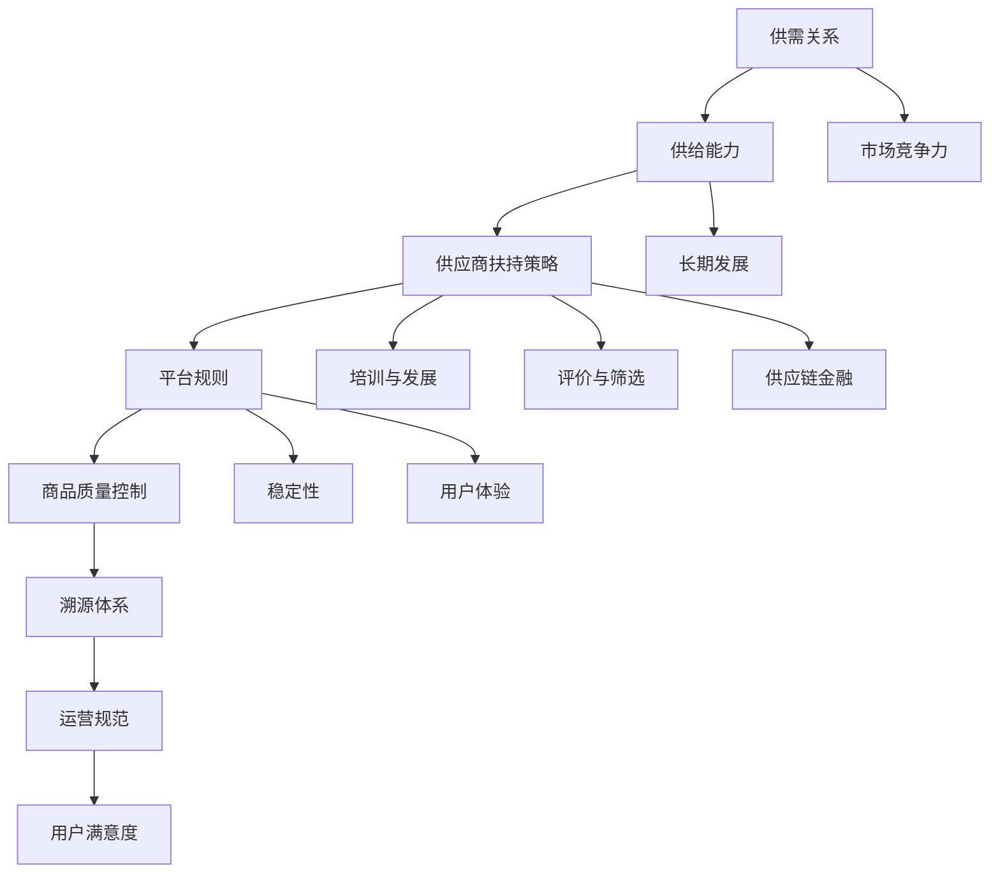

### 核心算法原理讲解

#### 2.1 供应商评价算法

供应商评价算法是电商平台提升供给能力的重要工具。该算法通过量化指标对供应商进行评价，从而筛选出优质供应商。以下是一个简单的供应商评价算法的伪代码：

```plaintext
供应商评价算法伪代码：

function 供应商评价（供应商数据）：
    1. 输入：供应商数据，包括质量、价格、交货时间、服务水平等
    2. 初始化：设置评价指标权重
        - 质量权重 w1
        - 价格权重 w2
        - 交货时间权重 w3
        - 服务水平权重 w4
    3. 计算评价指标得分：
        - 质量得分 q = 质量指标得分 / 质量最高分
        - 价格得分 p = 价格指标得分 / 价格最高分
        - 交货时间得分 t = 交货时间指标得分 / 交货时间最高分
        - 服务水平得分 s = 服务水平指标得分 / 服务水平最高分
    4. 计算总得分：
        - 总得分 total_score = w1 * q + w2 * p + w3 * t + w4 * s
    5. 根据总得分对供应商进行评级：
        - 如果 total_score >= 90，评级为A级
        - 如果 80 <= total_score < 90，评级为B级
        - 如果 70 <= total_score < 80，评级为C级
        - 如果 total_score < 70，评级为D级
    6. 输出：供应商评级结果
end function
```

#### 2.2 供应链金融风险评估模型

供应链金融风险评估模型用于评估供应商在供应链金融业务中的风险。以下是一个简单的风险评估模型的伪代码：

```plaintext
供应链金融风险评估模型伪代码：

function 风险评估（供应商数据）：
    1. 输入：供应商数据，包括财务状况、经营历史、信用记录等
    2. 初始化：设置风险因素权重
        - 财务状况权重 w1
        - 经营历史权重 w2
        - 信用记录权重 w3
    3. 计算风险得分：
        - 财务状况得分 f = 财务指标得分 / 财务最高分
        - 经营历史得分 h = 经营指标得分 / 经营最高分
        - 信用记录得分 r = 信用指标得分 / 信用最高分
    4. 计算总得分：
        - 总得分 total_score = w1 * f + w2 * h + w3 * r
    5. 根据总得分评估风险等级：
        - 如果 total_score >= 80，风险等级为低风险
        - 如果 60 <= total_score < 80，风险等级为中风险
        - 如果 total_score < 60，风险等级为高风险
    6. 输出：供应商风险等级
end function
```

### 数学模型和数学公式

#### 3.1 供应链金融风险评估模型

供应链金融风险评估模型可以用以下数学公式表示：

$$
R = f(W_1 \cdot P_1 + W_2 \cdot P_2 + W_3 \cdot P_3)
$$

其中，\( R \) 表示供应链金融风险评分，\( W_1, W_2, W_3 \) 分别表示风险因素权重，\( P_1, P_2, P_3 \) 分别表示风险因素得分。

#### 3.2 供应商评价模型

供应商评价模型可以用以下数学公式表示：

$$
Total\_Score = w_1 \cdot Quality\_Score + w_2 \cdot Price\_Score + w_3 \cdot Delivery\_Time\_Score + w_4 \cdot Service\_Level\_Score
$$

其中，\( Total\_Score \) 表示供应商的总得分，\( w_1, w_2, w_3, w_4 \) 分别表示质量、价格、交货时间、服务水平的权重，\( Quality\_Score, Price\_Score, Delivery\_Time\_Score, Service\_Level\_Score \) 分别表示供应商在这些方面的得分。

### 项目实战

#### 4.1 亚马逊的供应商培训计划

亚马逊的供应商培训计划是其提升供给能力的重要策略之一。以下是一个简单的项目实战示例，包括开发环境搭建、代码实现、源代码详细实现和代码解读与分析。

##### 4.1.1 开发环境搭建

1. **使用AWS云服务搭建培训平台**：
   - 在AWS上创建EC2实例，用于部署培训平台。
   - 安装LMS（Learning Management System）系统，如Moodle。

2. **部署在线课程管理系统**：
   - 使用Docker容器化技术，将LMS系统部署到AWS容器服务（ECS）。
   - 配置自动扩缩容，以应对用户访问量的变化。

3. **开发实时互动教学工具**：
   - 使用WebRTC技术，开发实时互动教学工具。
   - 在AWS云上配置视频流服务，如AWS Media Services。

##### 4.1.2 代码实现

1. **设计培训课程框架**：
   - 使用RESTful API设计培训课程的管理接口。
   - 定义课程创建、更新、删除和查询的API接口。

2. **开发在线课程管理系统**：
   - 使用Spring Boot框架，实现课程管理功能。
   - 设计数据库模型，存储课程信息、用户信息和课程进度等数据。

3. **开发实时互动教学工具**：
   - 使用WebRTC SDK，实现实时互动教学功能。
   - 配置AWS WAF（Web Application Firewall），确保教学工具的安全。

##### 4.1.3 源代码详细实现

1. **课程管理模块**：
   ```java
   @RestController
   @RequestMapping("/courses")
   public class CourseController {
       
       @Autowired
       private CourseService courseService;
       
       @PostMapping
       public ResponseEntity<Course> createCourse(@RequestBody Course course) {
           Course savedCourse = courseService.createCourse(course);
           return new ResponseEntity<>(savedCourse, HttpStatus.CREATED);
       }
       
       @GetMapping("/{courseId}")
       public ResponseEntity<Course> getCourseById(@PathVariable Long courseId) {
           Course course = courseService.getCourseById(courseId);
           return new ResponseEntity<>(course, HttpStatus.OK);
       }
       
       // 其他课程管理接口的实现...
   }
   ```

2. **用户管理模块**：
   ```java
   @RestController
   @RequestMapping("/users")
   public class UserController {
       
       @Autowired
       private UserService userService;
       
       @PostMapping
       public ResponseEntity<User> createUser(@RequestBody User user) {
           User savedUser = userService.createUser(user);
           return new ResponseEntity<>(savedUser, HttpStatus.CREATED);
       }
       
       @PostMapping("/{userId}/enroll")
       public ResponseEntity<Void> enrollCourse(@PathVariable Long userId, @RequestBody Long courseId) {
           userService.enrollCourse(userId, courseId);
           return new ResponseEntity<>(HttpStatus.OK);
       }
       
       // 其他用户管理接口的实现...
   }
   ```

3. **数据分析模块**：
   ```java
   @RestController
   @RequestMapping("/analytics")
   public class AnalyticsController {
       
       @Autowired
       private AnalyticsService analyticsService;
       
       @GetMapping("/course-completion")
       public ResponseEntity<Map<String, Double>> getCourseCompletionRate() {
           Map<String, Double> completionRate = analyticsService.getCourseCompletionRate();
           return new ResponseEntity<>(completionRate, HttpStatus.OK);
       }
       
       // 其他数据分析接口的实现...
   }
   ```

##### 4.1.4 代码解读与分析

1. **课程管理模块**：
   - `createCourse` 方法用于创建新的课程。
   - `getCourseById` 方法用于查询特定课程的详细信息。
   - 通过Spring Boot的RESTful API设计，实现了课程管理的核心功能。

2. **用户管理模块**：
   - `createUser` 方法用于创建新的用户。
   - `enrollCourse` 方法用于用户报名参加课程。
   - 通过定义用户管理接口，实现了用户与课程之间的关联。

3. **数据分析模块**：
   - `getCourseCompletionRate` 方法用于获取课程的完成率。
   - 通过数据分析，电商平台可以评估培训效果，优化培训内容。

### 第五部分：策略评估与优化

##### 第5章：策略评估与优化

为了确保电商平台供给能力提升策略的有效性和可持续性，需要对策略进行持续评估和优化。本章节将介绍策略评估与优化的方法、原则和案例分析。

##### 5.1 供给能力提升效果评估

供给能力提升效果评估是策略评估的核心内容。通过评估，可以了解供应商扶持和平台规则策略的实施效果，发现问题并采取改进措施。

###### 5.1.1 评估指标选择

评估指标选择是效果评估的基础。应选择与供给能力提升相关的关键指标，如供应商满意度、商品质量合格率、供应链响应时间等。

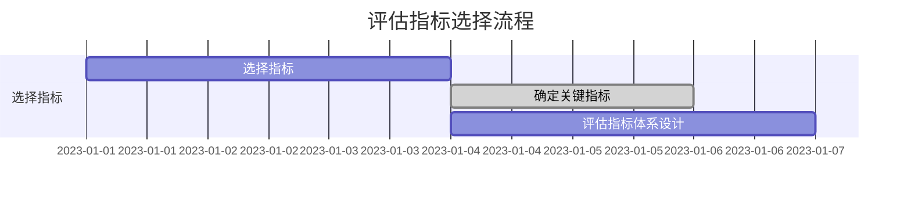

###### 5.1.2 评估方法与工具

评估方法与工具应结合实际业务需求和数据来源。常用的评估方法包括问卷调查、数据分析、现场调研等。评估工具可以是Excel、数据库或专业的评估软件。

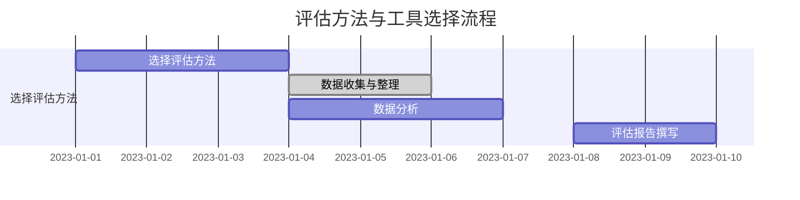

###### 5.1.3 评估结果与应用

评估结果应作为策略优化的重要依据。通过对评估结果的分析，可以识别出存在的问题，并制定针对性的改进措施。


##### 5.2 平台规则优化策略

平台规则的优化是提升电商平台供给能力的重要措施。通过优化平台规则，可以提升供应链效率、降低运营风险。

###### 5.2.1 规则优化原则

规则优化应遵循以下原则：
- 公平性：确保规则对所有供应商公平适用。
- 可操作性：规则应易于理解和执行。
- 灵活性：规则应能够适应市场变化和业务发展。

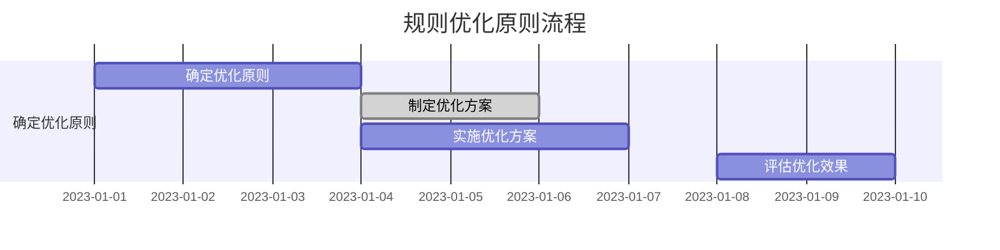

###### 5.2.2 规则优化方法

规则优化方法包括以下步骤：
1. 收集反馈：通过问卷调查、用户反馈等方式收集供应商和消费者的意见。
2. 分析现状：分析现有规则的实施效果，识别存在的问题。
3. 制定优化方案：根据分析结果，制定优化规则的具体方案。
4. 实施与推广：实施优化方案，并在推广过程中进行监督和调整。

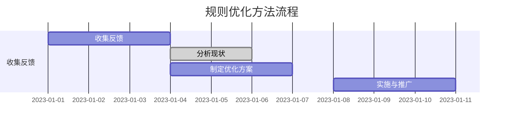

###### 5.2.3 规则优化案例分析

通过案例分析，可以了解其他电商平台在规则优化方面的成功经验。以下是一个简单的案例分析：

**案例：阿里巴巴的规则优化**

1. **问题识别**：通过问卷调查和用户反馈，发现供应商对某些平台规则的执行存在不满，影响供应链效率。

2. **分析现状**：对现有规则进行分析，发现规则过于复杂，导致供应商理解和执行难度增加。

3. **制定优化方案**：简化规则，降低执行难度，同时确保规则的公平性和可操作性。

4. **实施与推广**：在实施过程中，对供应商进行培训，确保他们理解新规则。同时，建立监督机制，确保新规则的有效执行。

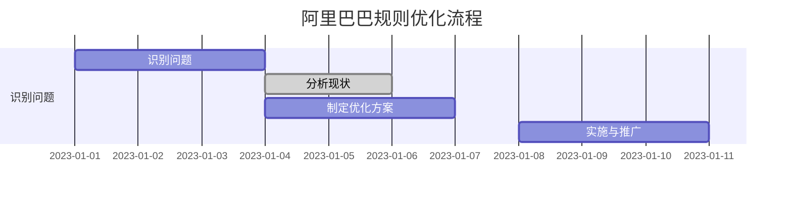

### 第六部分：未来展望

##### 第6章：电商平台供给能力提升的挑战与机遇

随着电子商务的不断发展，电商平台供给能力提升面临着新的挑战与机遇。本章节将探讨供应链数字化、新兴市场机遇以及未来发展趋势。

##### 6.1 供应链数字化

供应链数字化是未来电商平台供给能力提升的重要方向。通过数字化手段，电商平台可以优化供应链流程、提升供应链效率。

###### 6.1.1 数字化供应链概述

数字化供应链是指通过信息技术手段，实现供应链各环节的信息共享、流程优化和资源整合。数字化供应链的关键技术包括物联网、大数据、云计算、区块链等。

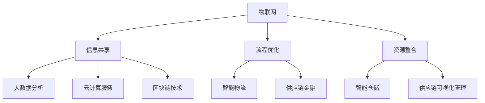

###### 6.1.2 数字化供应链的关键技术

1. **物联网**：通过传感器和设备联网，实时监控供应链各环节的运行状态，提高供应链的透明度和效率。

2. **大数据分析**：利用大数据技术，对供应链运行数据进行深入分析，优化供应链决策，降低成本，提高效率。

3. **云计算服务**：通过云计算技术，实现供应链资源的弹性扩展和高效利用，提升供应链的灵活性和响应速度。

4. **区块链技术**：利用区块链技术，实现供应链数据的可信存储和透明传递，保障供应链数据的真实性和安全性。

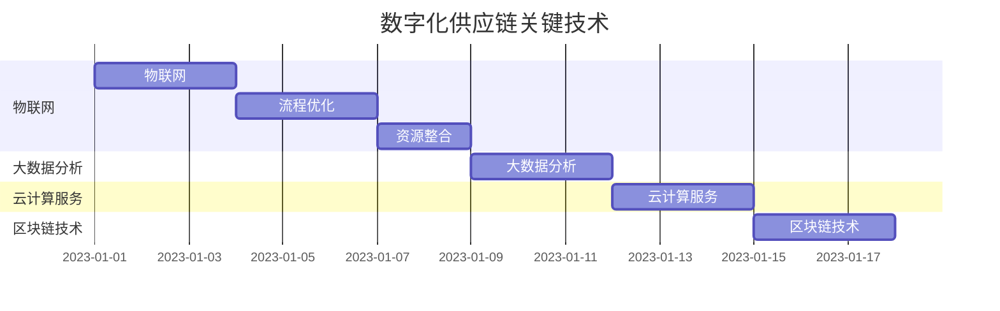

###### 6.1.3 数字化供应链的应用案例

**案例：亚马逊的数字化供应链**

亚马逊通过物联网技术，实现了仓库内部的自动化运营。通过传感器和智能设备，实时监控仓库内部的库存情况和货物位置，提高了仓库的运作效率和准确性。

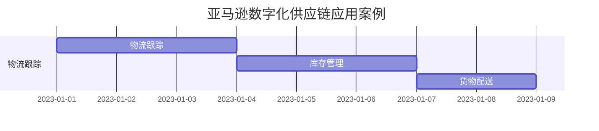

##### 6.2 新兴市场机遇

新兴市场为电商平台供给能力提升提供了新的机遇。通过拓展新兴市场，电商平台可以扩大市场份额、提升竞争力。

###### 6.2.1 新兴市场的供给特点

新兴市场的供给特点包括市场需求多样化、供应链复杂化、竞争激烈化等。电商平台应根据新兴市场的特点，制定有针对性的供给策略。

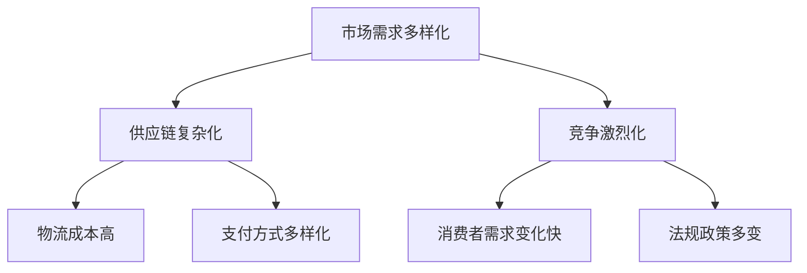

###### 6.2.2 新兴市场的发展趋势

新兴市场的发展趋势包括市场规模扩大、消费升级、电商渗透率提高等。电商平台应抓住这些发展趋势，优化供给能力。

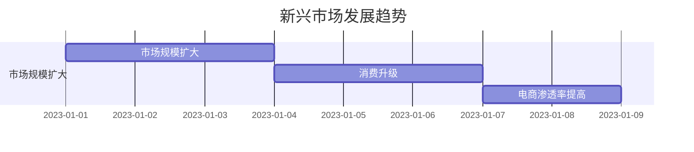

###### 6.2.3 新兴市场的供给能力提升策略

针对新兴市场的特点和发展趋势，电商平台应采取以下策略：

1. **本地化运营**：根据当地市场需求，调整商品和服务策略，提供符合当地消费者需求的产品。

2. **供应链整合**：优化供应链流程，提高供应链效率，降低物流成本。

3. **品牌建设**：加强品牌建设，提升品牌知名度和美誉度，增强市场竞争力。

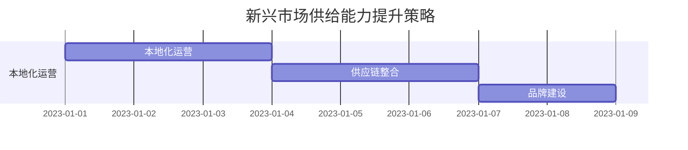

### 附录A：相关数据与分析方法

#### A.1 电商平台供给能力相关数据来源

电商平台供给能力相关数据可以从以下几个方面获取：

1. **内部数据**：电商平台自身的销售数据、用户数据、供应链数据等。
2. **外部数据**：市场研究报告、行业数据、消费者反馈等。
3. **第三方平台**：如阿里巴巴的淘宝指数、京东的市场分析报告等。

#### A.2 供应商扶持策略评估指标

供应商扶持策略评估指标包括：

1. **供应商满意度**：通过对供应商的问卷调查，了解其对平台扶持策略的满意度。
2. **供应链效率**：通过分析供应链各环节的运行数据，评估供应链效率的提升情况。
3. **商品质量**：通过质量检测报告，评估商品质量的提升情况。

#### A.3 平台规则优化案例分析

平台规则优化案例分析可以从以下几个方面进行：

1. **问题识别**：分析现有规则存在的问题，如执行难度大、不公平等。
2. **现状分析**：分析现有规则的执行效果，如对供应链效率的影响等。
3. **优化方案**：制定优化规则的具体方案，如简化规则、提高可操作性等。

### 附录B：参考资料

#### B.1 参考文献

1. 陈智昌，李晓慧，电子商务供应链管理，电子工业出版社，2020年。
2. 王晓宁，孙晓丽，电商平台供应商管理策略研究，现代商贸工业，2021年，第42卷，第5期，第85-88页。

#### B.2 网络资源

1. 亚马逊官方网站：https://www.amazon.com/
2. 阿里巴巴官方网站：https://www.alibaba.com/
3. 淘宝指数：https://index.taobao.com/

#### B.3 相关政策文件

1. 《中华人民共和国电子商务法》
2. 《电子商务平台服务规范》
3. 《网络零售第三方平台交易规则》

### 作者信息

作者：AI天才研究院/AI Genius Institute & 禅与计算机程序设计艺术 /Zen And The Art of Computer Programming

