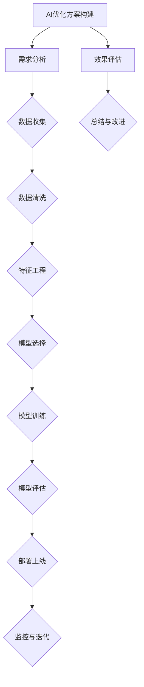

                 

# 《电商运营效率的AI优化方案》

> 关键词：电商运营、AI优化、机器学习、推荐系统、自然语言处理、客户行为分析、供应链优化、物流配送优化、风险管理

> 摘要：本文将深入探讨AI技术在电商运营中的优化应用，分析电商运营效率提升的方法与路径。通过介绍AI的基础知识、核心技术、实战应用及案例分析，揭示电商运营效率优化的潜力和挑战。

## 目录

### 第一部分：AI与电商运营概述

#### 第1章：电商运营效率与AI概述

1.1 电商运营效率的定义与重要性

1.2 AI在电商运营中的应用现状与发展趋势

1.3 电商运营效率优化的AI方法与工具

1.4 AI优化电商运营的优势与挑战

### 第二部分：AI优化电商运营的核心技术

#### 第2章：人工智能基础知识与算法

2.1 机器学习与深度学习概述

2.2 电商运营中常用的机器学习算法

2.3 深度学习在电商运营中的应用

#### 第3章：电商运营数据预处理与特征工程

3.1 数据预处理技术

3.2 特征工程方法与技巧

3.3 电商运营数据特征分析与挖掘

#### 第4章：电商推荐系统优化

4.1 推荐系统概述与架构

4.2 基于协同过滤的推荐算法

4.3 基于深度学习的推荐算法

#### 第5章：电商运营中的自然语言处理

5.1 自然语言处理基础

5.2 电商评论情感分析

5.3 电商聊天机器人构建

### 第三部分：AI优化电商运营的实战应用

#### 第6章：电商客户行为分析

6.1 客户行为数据收集与分析

6.2 客户画像构建与应用

6.3 客户细分与精准营销

#### 第7章：电商供应链优化

7.1 供应链管理概述

7.2 供应链优化算法与应用

7.3 供应链协同与风险控制

#### 第8章：电商物流与配送优化

8.1 物流与配送概述

8.2 物流路径优化算法

8.3 物流配送智能调度

#### 第9章：电商运营风险管理与控制

9.1 风险管理概述

9.2 风险识别与评估方法

9.3 风险控制与应对策略

### 第四部分：AI优化电商运营案例分析

#### 第10章：电商企业AI优化实践

10.1 案例介绍与目标

10.2 AI优化方案设计与实施

10.3 AI优化效果评估与总结

### 附录

#### 附录A：AI优化电商运营工具与资源

A.1 常用AI工具与框架

A.2 电商数据集与API接口

A.3 AI优化电商运营相关书籍与文献

#### 附录B：电商运营效率的AI优化方案构建流程图

使用Mermaid绘制AI优化电商运营方案构建流程图

#### 附录C：核心算法原理讲解

使用伪代码详细阐述电商运营中的核心算法原理

#### 附录D：数学模型与公式详细讲解

使用latex格式嵌入文中独立段落详细讲解电商运营中的数学模型与公式，并提供举例说明

#### 附录E：项目实战案例与代码解读

提供电商运营效率AI优化项目的实际案例，详细解释说明开发环境搭建、源代码实现与代码解读。

## 第一部分：AI与电商运营概述

### 第1章：电商运营效率与AI概述

#### 1.1 电商运营效率的定义与重要性

电商运营效率是指电商企业在运营过程中所投入的资源（如人力、时间、资金等）与所产生的效益（如销售额、利润、用户满意度等）之间的比率。一个高效的电商运营体系可以显著提升企业的竞争力，增加市场份额，实现可持续的发展。

电商运营效率的重要性体现在以下几个方面：

1. 提高销售额：通过优化运营流程，提高客户转化率和复购率，从而增加销售额。

2. 降低成本：通过精准营销、智能库存管理等方式，减少无效投入，降低运营成本。

3. 提升用户体验：通过智能推荐、个性化服务等方式，提高用户满意度，增强用户粘性。

4. 增强竞争力：在激烈的市场竞争中，高效的运营体系可以帮助企业脱颖而出，占据优势地位。

#### 1.2 AI在电商运营中的应用现状与发展趋势

随着人工智能技术的不断进步，AI在电商运营中的应用越来越广泛，具体表现如下：

1. 智能推荐：通过用户行为分析和偏好挖掘，实现个性化推荐，提高商品曝光率和销售转化率。

2. 智能客服：利用自然语言处理技术，实现智能客服机器人，提高客户服务效率和质量。

3. 智能库存管理：通过预测销售趋势和客户需求，实现智能补货和库存优化，降低库存成本。

4. 供应链优化：利用AI算法优化供应链管理，提高物流效率，降低运营成本。

5. 风险管理：通过大数据分析和预测，实现风险识别、评估和控制，降低运营风险。

未来，随着AI技术的不断成熟，电商运营效率的AI优化将呈现出以下发展趋势：

1. 智能化程度提高：AI技术将更加深入地融入电商运营的各个环节，实现全面智能化。

2. 多领域融合：AI与其他领域（如大数据、物联网等）的融合，将带来更多的创新应用。

3. 精准化发展：通过精细化运营，实现更高的运营效率和服务质量。

#### 1.3 电商运营效率优化的AI方法与工具

电商运营效率优化的AI方法主要包括以下几个方面：

1. 数据挖掘与分析：通过对电商数据的挖掘与分析，发现运营中的问题和潜在机会。

2. 机器学习与深度学习：利用机器学习和深度学习算法，实现智能推荐、预测和优化。

3. 自然语言处理：通过自然语言处理技术，实现智能客服、评论情感分析等应用。

4. 物联网与传感器技术：利用物联网和传感器技术，实现智能物流和库存管理。

5. 大数据技术：通过大数据技术，实现全面的数据收集、存储、处理和分析。

常见的AI工具与框架包括：

1. TensorFlow：一款开源的深度学习框架，支持多种算法和模型。

2. Keras：一款基于TensorFlow的高层API，简化了深度学习模型的搭建和训练。

3. Scikit-learn：一款开源的机器学习库，提供了丰富的算法和工具。

4. PyTorch：一款开源的深度学习框架，易于搭建和调试模型。

5. Hadoop：一款分布式大数据处理框架，可以实现大规模数据存储和处理。

#### 1.4 AI优化电商运营的优势与挑战

AI优化电商运营具有以下优势：

1. 提高运营效率：通过智能化的手段，减少人工干预，提高运营效率。

2. 精准化运营：通过大数据分析和预测，实现精准化运营，提高用户满意度。

3. 降低运营成本：通过智能化的供应链管理和物流配送优化，降低运营成本。

4. 提升竞争力：通过高效运营，提升企业竞争力，抢占市场份额。

然而，AI优化电商运营也面临一些挑战：

1. 数据质量：电商数据质量直接影响到AI模型的效果，如何处理和清洗数据是关键。

2. 技术门槛：AI技术的应用需要具备一定的技术背景和专业知识，对于中小企业来说，技术门槛较高。

3. 隐私保护：在收集和分析用户数据时，需要严格遵守隐私保护法规，确保用户信息安全。

4. 道德和伦理：AI技术的应用可能带来一些道德和伦理问题，如算法偏见等，需要引起关注。

总之，AI技术在电商运营中的优化应用具有广阔的前景，但同时也需要克服一系列挑战。通过不断探索和实践，我们可以充分利用AI技术的优势，提升电商运营效率，实现企业的可持续发展。

## 第二部分：AI优化电商运营的核心技术

### 第2章：人工智能基础知识与算法

#### 2.1 机器学习与深度学习概述

人工智能（AI）是计算机科学的一个分支，旨在使计算机模拟人类的智能行为，解决复杂问题。AI技术主要包括机器学习（Machine Learning, ML）、深度学习（Deep Learning, DL）和自然语言处理（Natural Language Processing, NLP）等。

机器学习是AI的核心技术之一，它通过构建算法模型，让计算机从数据中学习并做出决策。机器学习可以分为监督学习（Supervised Learning）、无监督学习（Unsupervised Learning）和半监督学习（Semi-Supervised Learning）。

监督学习是最常见的机器学习方法，它通过已标记的数据集训练模型，然后在新数据上进行预测。常见的监督学习算法包括线性回归（Linear Regression）、逻辑回归（Logistic Regression）、支持向量机（Support Vector Machine, SVM）和决策树（Decision Tree）等。

无监督学习则是在没有标记数据的情况下，通过算法自动发现数据中的模式和规律。无监督学习算法包括聚类算法（Clustering Algorithms，如K-means、DBSCAN）、降维算法（Dimensionality Reduction Algorithms，如PCA、t-SNE）等。

半监督学习介于监督学习和无监督学习之间，它利用少量的标记数据和大量的未标记数据来训练模型。

深度学习是机器学习的一种特殊形式，它通过构建深度神经网络（Deep Neural Networks）来模拟人类大脑的决策过程。深度学习在图像识别、语音识别、自然语言处理等领域取得了显著成果。常见的深度学习框架包括TensorFlow、PyTorch、Keras等。

#### 2.2 电商运营中常用的机器学习算法

在电商运营中，常用的机器学习算法包括协同过滤（Collaborative Filtering）、聚类（Clustering）、分类（Classification）和回归（Regression）等。

协同过滤是一种基于用户行为数据的推荐算法，它可以根据用户的相似度进行推荐。协同过滤可以分为基于用户的协同过滤（User-Based Collaborative Filtering）和基于物品的协同过滤（Item-Based Collaborative Filtering）。基于用户的协同过滤通过计算用户之间的相似度，为用户推荐与目标用户兴趣相似的物品；基于物品的协同过滤则通过计算物品之间的相似度，为用户推荐与用户已购买或收藏的物品相似的物品。

聚类算法是一种无监督学习方法，它将相似的数据点分组，形成聚类。在电商运营中，聚类算法可以用于客户细分、库存管理等。常见的聚类算法包括K-means、DBSCAN、层次聚类（Hierarchical Clustering）等。

分类算法是一种监督学习方法，它通过已标记的数据集训练模型，然后在新数据上进行预测。分类算法可以用于客户行为分析、商品分类等。常见的分类算法包括逻辑回归、支持向量机、决策树、随机森林（Random Forest）等。

回归算法是一种用于预测连续值的监督学习方法。在电商运营中，回归算法可以用于预测销售额、用户流失率等。常见的回归算法包括线性回归、多项式回归、岭回归（Ridge Regression）等。

#### 2.3 深度学习在电商运营中的应用

深度学习在电商运营中的应用非常广泛，以下列举几个典型的应用场景：

1. 商品识别与分类：通过卷积神经网络（Convolutional Neural Network, CNN）实现商品图像的识别与分类，提高商品管理的效率。

2. 语音识别与合成：利用深度学习实现语音识别与合成，为用户提供智能语音客服。

3. 自然语言处理：利用循环神经网络（Recurrent Neural Network, RNN）和长短时记忆网络（Long Short-Term Memory, LSTM）实现电商评论情感分析、问答系统等。

4. 用户行为预测：通过深度学习模型预测用户的购买行为、浏览行为等，为精准营销提供支持。

5. 物流路径优化：利用深度学习算法优化物流路径，提高配送效率，降低运营成本。

#### 2.4 电商运营数据预处理与特征工程

在电商运营中，数据预处理与特征工程是机器学习应用的重要环节。以下介绍一些常见的数据预处理方法与特征工程技巧：

1. 数据清洗：包括去除重复数据、缺失值填充、异常值处理等，以提高数据质量。

2. 数据归一化与标准化：通过将数据缩放到同一范围内，消除数据尺度差异，提高算法效果。

3. 特征提取：通过统计方法、深度学习方法等提取数据中的有价值特征，如用户行为特征、商品特征等。

4. 特征选择：通过筛选掉无关或冗余特征，降低模型复杂度，提高模型性能。

5. 特征组合：通过组合不同特征，生成新的特征，以增强模型的表现能力。

#### 2.5 电商运营数据特征分析与挖掘

在电商运营中，数据特征分析与挖掘对于优化运营策略、提升用户满意度具有重要意义。以下介绍一些常见的特征分析与挖掘方法：

1. 客户行为分析：通过分析用户浏览、购买、评价等行为数据，挖掘用户兴趣、偏好和需求。

2. 商品特征分析：通过分析商品价格、销量、评价等数据，挖掘商品的热门程度、性价比等。

3. 交叉销售与推荐：通过分析客户购买记录，实现交叉销售与个性化推荐。

4. 购买预测与库存管理：通过预测客户购买行为，优化库存管理，降低库存成本。

5. 情感分析：通过分析电商评论，了解用户对商品的满意度，为产品改进提供依据。

通过数据特征分析与挖掘，电商企业可以更好地理解用户需求，优化运营策略，提升电商运营效率。

### 第3章：电商运营数据预处理与特征工程

#### 3.1 数据预处理技术

在电商运营中，数据预处理是机器学习模型构建的重要环节，它能够提高数据质量，减少噪声，增强模型性能。以下介绍一些常见的数据预处理技术：

1. **数据清洗**：数据清洗是数据预处理的第一步，旨在去除重复数据、缺失值、异常值等。重复数据可以通过去重操作删除，缺失值可以通过填充方法处理，异常值可以通过统计方法或领域知识进行识别和处理。

2. **数据归一化**：数据归一化是将不同特征的数据缩放到同一范围内，消除数据尺度差异。常用的归一化方法有最小-最大缩放（Min-Max Scaling）和标准化（Standardization）。最小-最大缩放将数据映射到[0,1]区间，而标准化则将数据映射到均值为0、标准差为1的分布。

   \[
   x_{\text{normalized}} = \frac{x - \mu}{\sigma}
   \]

   其中，\( x \) 是原始数据，\( \mu \) 是均值，\( \sigma \) 是标准差。

3. **数据标准化**：与归一化不同，标准化将数据映射到均值为0、标准差为1的标准正态分布。

   \[
   x_{\text{normalized}} = \frac{x - \mu}{\sigma}
   \]

4. **特征缩放**：对于高维数据，特征缩放可以减少特征之间的相关性，提高算法性能。常用的方法有主成分分析（Principal Component Analysis, PCA）和线性判别分析（Linear Discriminant Analysis, LDA）。

5. **数据转换**：数据转换包括类别数据转换为数值数据、时间序列数据转换为特征向量等。类别数据可以通过独热编码（One-Hot Encoding）或标签编码（Label Encoding）转换为数值数据。

   \[
   \text{One-Hot Encoding}: x = \text{'apple'} \rightarrow [1, 0, 0, 0]
   \]

   \[
   \text{Label Encoding}: x = \text{'apple'} \rightarrow 0
   \]

6. **缺失值处理**：缺失值可以通过多种方法处理，如删除缺失值、填充均值、中位数或使用模型预测缺失值。

#### 3.2 特征工程方法与技巧

特征工程是数据预处理的关键环节，它旨在提取数据中的有用特征，提高模型性能。以下介绍一些特征工程的方法与技巧：

1. **特征提取**：特征提取是通过统计方法、机器学习模型等从原始数据中提取新的特征。常用的方法有词频统计（Term Frequency, TF）、逆文档频率（Inverse Document Frequency, IDF）、词嵌入（Word Embedding）等。

   \[
   \text{TF-IDF}: \text{TF}(t,d) \times \text{IDF}(t,D)
   \]

   其中，\( t \) 是单词，\( d \) 是文档，\( D \) 是文档集合。

2. **特征选择**：特征选择是通过筛选掉无关或冗余特征，降低模型复杂度，提高模型性能。常用的方法有信息增益（Information Gain）、卡方检验（Chi-Square Test）、互信息（Mutual Information）等。

3. **特征组合**：特征组合是通过组合不同特征，生成新的特征，以增强模型的表现能力。特征组合可以是简单的加法组合、乘法组合，也可以是复杂的特征交叉。

4. **特征缩放**：特征缩放可以通过主成分分析（PCA）、线性判别分析（LDA）等方法减少特征维度，提高模型性能。

5. **特征变换**：特征变换包括对数变换、指数变换、平方根变换等，以增强特征的线性可分性。

#### 3.3 电商运营数据特征分析与挖掘

在电商运营中，数据特征分析与挖掘对于优化运营策略、提升用户满意度具有重要意义。以下介绍一些常见的特征分析与挖掘方法：

1. **客户行为特征分析**：通过分析用户浏览、购买、评价等行为数据，挖掘用户兴趣、偏好和需求。例如，分析用户浏览记录，可以识别用户感兴趣的商品类别；分析用户购买记录，可以识别用户的购买习惯和偏好。

2. **商品特征分析**：通过分析商品价格、销量、评价等数据，挖掘商品的热门程度、性价比等。例如，分析商品价格和销量，可以识别价格敏感型商品；分析商品评价，可以识别商品的质量和用户满意度。

3. **交叉销售与推荐**：通过分析客户购买记录，实现交叉销售与个性化推荐。例如，分析客户购买A商品后又购买了B商品，可以推荐B商品给其他购买A商品的客户。

4. **购买预测与库存管理**：通过预测客户购买行为，优化库存管理，降低库存成本。例如，利用时间序列模型预测未来一段时间内的销售量，指导库存补货。

5. **情感分析**：通过分析电商评论，了解用户对商品的满意度，为产品改进提供依据。例如，利用自然语言处理技术，分析用户评论的情感倾向，识别用户对商品的主要反馈和意见。

通过数据特征分析与挖掘，电商企业可以更好地理解用户需求，优化运营策略，提升电商运营效率。

### 第4章：电商推荐系统优化

#### 4.1 推荐系统概述与架构

推荐系统（Recommendation System）是一种信息过滤技术，旨在根据用户的历史行为、偏好和上下文信息，向用户推荐他们可能感兴趣的商品、内容或服务。在电商运营中，推荐系统发挥着至关重要的作用，可以显著提高用户满意度、增加销售额和提升用户体验。

**推荐系统的基本概念：**

1. **用户**：推荐系统中的用户是指与系统交互的个体，可以是实际的用户，也可以是虚拟的用户。

2. **项目**：推荐系统中的项目是指用户可能感兴趣的对象，如商品、文章、视频等。

3. **评分**：评分是用户对项目的评价，可以是明文评分（如1-5星）、隐式评分（如购买、浏览、点击）等。

4. **推荐**：推荐是系统根据用户的历史行为和偏好，向用户推荐他们可能感兴趣的项目。

**推荐系统的架构：**

推荐系统通常由以下几个主要部分组成：

1. **数据层**：数据层负责收集、存储和处理用户行为数据、项目特征数据等。

2. **模型层**：模型层负责构建和训练推荐算法模型，将用户行为数据转化为推荐结果。

3. **应用层**：应用层负责将推荐结果呈现给用户，可以是网页、APP、邮件等形式。

**推荐系统的类型：**

1. **基于内容的推荐（Content-Based Recommendation）**：基于用户对项目的兴趣和偏好，推荐与项目相似的其他项目。

2. **协同过滤推荐（Collaborative Filtering Recommendation）**：基于用户之间的相似性或项目之间的相似性，推荐用户可能感兴趣的项目。

3. **混合推荐（Hybrid Recommendation）**：结合基于内容和协同过滤的推荐方法，以提高推荐效果。

#### 4.2 基于协同过滤的推荐算法

协同过滤是推荐系统中最常用的算法之一，它通过分析用户之间的行为模式，为用户推荐其他用户喜欢的项目。协同过滤可以分为基于用户的协同过滤和基于物品的协同过滤。

**基于用户的协同过滤（User-Based Collaborative Filtering）**

基于用户的协同过滤通过计算用户之间的相似性，为用户推荐与相似用户有相同兴趣的项目。相似性度量通常采用余弦相似度、皮尔逊相关系数等。

1. **相似性度量**：

   \[
   \text{Similarity}(u, v) = \frac{\sum_{i} r_{ui} r_{vi}}{\sqrt{\sum_{i} r_{ui}^2 \sum_{i} r_{vi}^2}}
   \]

   其中，\( u \) 和 \( v \) 是两个用户，\( r_{ui} \) 和 \( r_{vi} \) 分别是用户 \( u \) 对项目 \( i \) 的评分。

2. **推荐算法**：

   选择与目标用户最相似的 \( k \) 个用户，然后推荐这 \( k \) 个用户共同喜欢的项目。

   \[
   \text{Prediction}(u, i) = \frac{\sum_{v \in \text{Neighbors}(u, k)} r_{vi} \cdot s_{uv}}{\sum_{v \in \text{Neighbors}(u, k)} s_{uv}}
   \]

   其中，\( \text{Neighbors}(u, k) \) 是与用户 \( u \) 最相似的 \( k \) 个用户，\( s_{uv} \) 是用户 \( u \) 和 \( v \) 之间的相似度。

**基于物品的协同过滤（Item-Based Collaborative Filtering）**

基于物品的协同过滤通过计算项目之间的相似性，为用户推荐与用户已购买或收藏的物品相似的其他物品。

1. **相似性度量**：

   \[
   \text{Similarity}(i, j) = \frac{\sum_{u} r_{ui} r_{uj}}{\sqrt{\sum_{u} r_{ui}^2 \sum_{u} r_{uj}^2}}
   \]

   其中，\( i \) 和 \( j \) 是两个项目，\( r_{ui} \) 和 \( r_{uj} \) 分别是用户 \( u \) 对项目 \( i \) 和 \( j \) 的评分。

2. **推荐算法**：

   选择与用户已购买或收藏的物品最相似的 \( k \) 个物品，然后推荐这 \( k \) 个物品。

   \[
   \text{Prediction}(u, i) = \frac{\sum_{j \in \text{Neighbors}(i, k)} r_{uj} \cdot s_{ij}}{\sum_{j \in \text{Neighbors}(i, k)} s_{ij}}
   \]

   其中，\( \text{Neighbors}(i, k) \) 是与项目 \( i \) 最相似的 \( k \) 个物品，\( s_{ij} \) 是项目 \( i \) 和 \( j \) 之间的相似度。

**协同过滤的优缺点**

1. **优点**：

   - **简单易实现**：协同过滤算法相对简单，易于理解和实现。
   - **效果好**：在数据量较大、用户行为丰富的场景中，协同过滤算法效果较好。

2. **缺点**：

   - **稀疏性**：协同过滤依赖于用户评分矩阵，当评分矩阵稀疏时，算法效果下降。
   - **冷启动问题**：新用户或新项目缺乏评分数据时，无法进行有效推荐。
   - **无法利用项目特征**：协同过滤仅考虑用户行为，无法利用项目特征进行推荐。

#### 4.3 基于深度学习的推荐算法

随着深度学习技术的不断发展，基于深度学习的推荐算法逐渐成为研究热点。深度学习推荐算法通过学习用户和项目的特征表示，可以更好地处理稀疏数据和冷启动问题。

**深度学习推荐算法的基本原理**

1. **用户特征表示**：将用户的行为、兴趣、历史数据等转化为向量表示。

2. **项目特征表示**：将项目的属性、类别、标签等转化为向量表示。

3. **模型训练**：利用用户特征和项目特征训练深度学习模型，预测用户对项目的评分。

**常见的深度学习推荐算法**

1. **基于矩阵分解的深度学习推荐算法**：

   - **模型结构**：结合矩阵分解和深度学习，将用户和项目的高维特征分解为低维向量。

   - **算法步骤**：

     1. 输入用户特征矩阵 \( U \) 和项目特征矩阵 \( V \)。
     2. 通过卷积神经网络（CNN）或循环神经网络（RNN）学习用户和项目的低维特征表示 \( h_u \) 和 \( h_i \)。
     3. 利用内积或加权和计算预测评分 \( \hat{r}_{ui} = h_u \cdot h_i \)。

2. **基于图神经网络的推荐算法**：

   - **模型结构**：将用户和项目表示为图中的节点，利用图神经网络学习节点特征表示。

   - **算法步骤**：

     1. 建立用户-项目图，其中用户和项目作为节点，边表示用户对项目的评分或行为。
     2. 利用图神经网络（如Graph Convolutional Network, GCN）学习节点特征表示。
     3. 通过节点特征表示计算预测评分。

**深度学习推荐算法的优缺点**

1. **优点**：

   - **处理稀疏数据**：深度学习推荐算法可以通过学习低维特征表示，有效处理稀疏数据。
   - **冷启动问题**：深度学习推荐算法可以基于用户和项目的特征表示，解决冷启动问题。
   - **利用外部知识**：深度学习推荐算法可以结合外部知识（如知识图谱），提高推荐效果。

2. **缺点**：

   - **计算复杂度高**：深度学习推荐算法需要大量计算资源，训练时间较长。
   - **数据依赖性**：深度学习推荐算法对数据质量要求较高，数据噪声会影响模型效果。
   - **模型解释性差**：深度学习推荐算法的内部机制复杂，难以解释和理解。

通过结合协同过滤和深度学习，推荐系统可以更好地应对电商运营中的挑战，提升推荐效果和用户体验。

### 第5章：电商运营中的自然语言处理

#### 5.1 自然语言处理基础

自然语言处理（Natural Language Processing, NLP）是人工智能领域的一个重要分支，旨在使计算机能够理解、生成和交互自然语言。在电商运营中，NLP技术被广泛应用于客户服务、评论分析、搜索优化等方面，以提高用户体验和运营效率。

**NLP的基本任务：**

1. **文本分类（Text Classification）**：将文本分为不同的类别，如情感分类、新闻分类等。

2. **命名实体识别（Named Entity Recognition, NER）**：识别文本中的命名实体，如人名、地名、组织名等。

3. **词性标注（Part-of-Speech Tagging）**：对文本中的单词进行词性标注，如名词、动词、形容词等。

4. **句法分析（Syntactic Parsing）**：分析文本的句法结构，如句法树、依存关系等。

5. **机器翻译（Machine Translation）**：将一种语言的文本翻译成另一种语言的文本。

6. **问答系统（Question Answering, QA）**：从大量文本中找到与问题相关的答案。

**NLP的主要技术：**

1. **统计方法**：基于统计模型，如朴素贝叶斯、最大熵模型、支持向量机等。

2. **深度学习方法**：基于深度神经网络，如卷积神经网络（CNN）、循环神经网络（RNN）、长短时记忆网络（LSTM）等。

3. **规则方法**：基于专家知识，如词法分析、句法分析等。

4. **转移学习方法**：结合规则方法和统计方法，如转移模型、隐马尔可夫模型（HMM）等。

5. **融合方法**：将多种方法相结合，以提高NLP任务的性能。

#### 5.2 电商评论情感分析

电商评论情感分析是NLP在电商运营中的重要应用，旨在分析用户对商品的评论，判断评论的情感倾向，如正面、负面或中性。情感分析有助于电商企业了解用户满意度，优化产品和服务。

**评论情感分析的基本流程：**

1. **数据预处理**：包括去除停用词、标点符号、进行词干提取等。

2. **特征提取**：利用词袋模型（Bag of Words, BoW）、TF-IDF、词嵌入（Word Embedding）等方法提取文本特征。

3. **模型训练**：使用分类算法（如朴素贝叶斯、支持向量机、神经网络等）训练情感分析模型。

4. **预测与评估**：对新的评论进行情感分类，并评估模型性能。

**常见的情感分析算法：**

1. **朴素贝叶斯（Naive Bayes）**：基于贝叶斯定理，假设特征之间相互独立，适用于处理高维度文本数据。

2. **支持向量机（Support Vector Machine, SVM）**：通过寻找最佳超平面，将不同情感分类分开，适用于处理非线性分类问题。

3. **循环神经网络（Recurrent Neural Network, RNN）**：通过隐藏状态记忆过去信息，适用于处理序列数据。

4. **长短时记忆网络（Long Short-Term Memory, LSTM）**：RNN的一种改进，适用于处理长序列数据。

5. **卷积神经网络（Convolutional Neural Network, CNN）**：通过局部感知和卷积操作，适用于处理文本数据的局部特征。

**电商评论情感分析的应用场景：**

1. **产品评价**：分析用户对产品的评价，识别产品优势和不足，为产品改进提供依据。

2. **客户服务**：通过情感分析识别用户需求，提供个性化服务，提高客户满意度。

3. **广告投放**：分析用户评论，识别潜在客户，优化广告投放策略。

#### 5.3 电商聊天机器人构建

电商聊天机器人是NLP在电商运营中的另一个重要应用，旨在为用户提供智能客服体验。聊天机器人可以通过自然语言交互，解答用户问题，提供购买建议，提升用户体验。

**聊天机器人构建的基本流程：**

1. **对话管理**：设计对话流程，包括用户意图识别、对话策略生成等。

2. **自然语言理解**：利用NLP技术处理用户输入，进行意图识别和实体识别。

3. **对话生成**：根据用户意图和系统知识库，生成合适的回答。

4. **对话评估**：评估聊天机器人的回答质量和用户满意度。

**聊天机器人构建的技术方法：**

1. **模板匹配**：通过预设的模板匹配用户输入，生成回答。

2. **基于规则的对话系统**：利用专家知识构建对话规则，实现对话生成。

3. **基于机器学习的对话系统**：利用自然语言处理和机器学习技术，自动生成对话回答。

4. **多轮对话**：通过多轮对话，逐步理解用户意图，提供更准确的回答。

**电商聊天机器人的应用场景：**

1. **客服支持**：解答用户问题，提供购买建议，提高客户满意度。

2. **销售推广**：通过聊天互动，引导用户购买商品，提升销售额。

3. **客户关系管理**：通过聊天记录分析，了解用户需求，提供个性化服务。

通过NLP技术在电商运营中的应用，电商企业可以更好地理解用户需求，提升用户体验和运营效率。未来，随着NLP技术的不断进步，电商运营中的NLP应用将更加广泛和深入。

### 第三部分：AI优化电商运营的实战应用

#### 第6章：电商客户行为分析

#### 6.1 客户行为数据收集与分析

电商客户行为分析是AI优化电商运营的重要环节，通过对客户行为数据的收集与分析，企业可以深入了解用户需求，优化运营策略，提升用户体验和销售额。以下介绍电商客户行为数据收集与分析的方法与技巧。

**1. 数据收集：**

电商客户行为数据主要包括用户浏览行为、购买行为、评论行为、互动行为等。数据收集的方法包括：

- **网站日志**：通过网站服务器日志收集用户访问数据，如访问时间、访问页面、停留时间等。
- **前端埋点**：在网站或APP前端嵌入代码，记录用户操作行为，如点击、滑动、搜索等。
- **用户反馈**：通过在线调查、问卷调查、客服聊天记录等方式收集用户反馈数据。

**2. 数据处理：**

收集到的客户行为数据通常存在噪声和缺失值，需要经过处理才能用于分析。数据处理的方法包括：

- **数据清洗**：去除重复数据、异常值、缺失值等，提高数据质量。
- **数据归一化**：将不同特征的数据缩放到同一范围内，消除数据尺度差异。
- **数据整合**：将来自不同来源的数据进行整合，形成统一的数据集。

**3. 数据分析：**

通过对客户行为数据的分析，可以挖掘出用户兴趣、偏好、需求等。数据分析的方法包括：

- **描述性统计分析**：计算数据的分布、均值、方差等，了解数据的基本特征。
- **聚类分析**：通过聚类算法（如K-means、DBSCAN）将用户划分为不同的群体，分析不同群体间的差异。
- **关联规则挖掘**：通过关联规则挖掘算法（如Apriori、FP-growth）发现用户行为之间的关联关系。
- **时间序列分析**：通过时间序列模型（如ARIMA、LSTM）预测用户未来的行为趋势。

**4. 数据可视化：**

数据可视化是将数据分析结果以图表形式展示，帮助决策者更直观地理解数据。数据可视化的方法包括：

- **柱状图、折线图**：展示数据的分布、趋势等。
- **饼图、环形图**：展示数据的占比、比例等。
- **热力图**：展示数据的热点区域、重要特征等。
- **地理信息系统（GIS）**：展示数据的地理分布、路径等。

通过数据收集、处理、分析和可视化，电商企业可以深入了解客户行为，优化运营策略，提高用户体验和销售额。

#### 6.2 客户画像构建与应用

客户画像（Customer Persona）是通过对客户行为数据的分析，构建一个具有代表性的客户特征模型。它能够帮助电商企业深入了解用户需求，实现精准营销，提高客户满意度。以下介绍客户画像的构建方法和应用场景。

**1. 客户画像构建步骤：**

- **数据收集**：收集用户的基本信息（如年龄、性别、地域等）、行为数据（如浏览记录、购买记录、评论记录等）、交互数据（如客服聊天记录、邮件记录等）。
- **数据预处理**：清洗、归一化和整合数据，提高数据质量。
- **特征工程**：提取用户特征，如用户活跃度、消费能力、偏好等。
- **数据建模**：利用机器学习算法（如聚类、分类等）构建客户画像模型。
- **模型评估**：评估模型性能，调整模型参数，优化客户画像。

**2. 客户画像应用场景：**

- **精准营销**：通过客户画像识别目标客户群体，制定个性化的营销策略，提高营销效果。
- **产品优化**：通过分析客户画像，了解用户需求，优化产品设计和功能，提升用户满意度。
- **用户细分**：将客户划分为不同的细分群体，针对不同群体制定差异化的运营策略，提高运营效率。
- **风险控制**：通过分析客户画像，识别高风险客户，采取相应的风险控制措施，降低风险。

**3. 客户画像案例分析：**

- **案例分析1**：某电商企业通过客户画像分析发现，高价值客户主要集中在25-35岁的女性群体，她们喜欢购买时尚、化妆品等。企业针对这一群体推出了一系列优惠活动和个性化推荐，提升了销售额。
- **案例分析2**：某电商企业通过客户画像分析发现，部分客户存在高退货率的问题。企业进一步分析发现，这些客户主要集中在30岁以下的男性群体，他们购买的商品多为电子产品。企业决定优化物流和售后服务，降低退货率，提高客户满意度。

通过客户画像的构建和应用，电商企业可以更好地了解用户需求，实现精准营销和运营优化，提升用户满意度和销售额。

#### 6.3 客户细分与精准营销

客户细分（Customer Segmentation）是电商运营中的重要策略，通过将客户划分为不同的群体，企业可以更精准地满足用户需求，提高营销效果和用户体验。精准营销（Targeted Marketing）则是在了解客户细分的基础上，针对不同群体制定个性化的营销策略，以实现更高的转化率和客户满意度。以下介绍客户细分与精准营销的方法与实施步骤。

**1. 客户细分方法：**

- **行为细分**：根据客户的购买行为、浏览行为、互动行为等将客户划分为不同群体。例如，高价值客户、忠诚客户、潜在客户、新客户等。
- **人口细分**：根据客户的基本信息（如年龄、性别、地域、收入等）将客户划分为不同群体。例如，年轻客户、中年客户、高端客户等。
- **心理细分**：根据客户的需求、价值观、生活方式等将客户划分为不同群体。例如，追求性价比的客户、追求品质的客户、追求时尚的客户等。
- **地理位置细分**：根据客户的地理位置将客户划分为不同群体。例如，城市客户、农村客户等。

**2. 精准营销策略：**

- **个性化推荐**：根据客户的兴趣和行为，为每个客户推荐他们可能感兴趣的商品，提高购买转化率。
- **定制化优惠**：为不同细分群体提供定制化的优惠活动，提高客户的参与度和忠诚度。
- **个性化沟通**：通过邮件、短信、APP推送等方式，与客户进行个性化沟通，提升用户体验。
- **定制化服务**：根据客户需求，提供定制化的购物体验和服务，如VIP客户专属客服、快速配送等。

**3. 实施步骤：**

- **数据收集**：收集客户的基本信息、行为数据、交互数据等，建立客户数据库。
- **数据清洗**：清洗、归一化和整合数据，提高数据质量。
- **客户细分**：利用聚类算法（如K-means、DBSCAN）或机器学习算法（如决策树、随机森林）对客户进行细分。
- **分析评估**：分析不同细分群体的特征和行为，评估细分策略的有效性。
- **策略制定**：根据客户细分结果，制定个性化的营销策略。
- **执行与优化**：实施营销策略，持续监控和评估效果，优化策略。

通过客户细分与精准营销，电商企业可以更好地了解用户需求，提高营销效果和客户满意度，实现持续增长。

### 第7章：电商供应链优化

#### 7.1 供应链管理概述

供应链管理（Supply Chain Management, SCM）是电商运营中至关重要的环节，它涉及从原材料采购到产品生产、配送、销售的整个流程。高效的供应链管理能够帮助企业降低成本、提高效率、缩短交货周期，从而提升市场竞争力。以下简要介绍供应链管理的基本概念、关键环节和核心目标。

**供应链管理的基本概念：**

供应链管理是指对产品从供应商到最终用户的整个流程进行计划、组织、协调和控制，以实现成本最小化、效率最高化和顾客满意度最大化的目标。供应链管理包括供应商管理、采购管理、库存管理、生产管理、配送管理和客户服务等多个环节。

**供应链管理的关键环节：**

1. **供应商管理**：与供应商建立合作关系，确保供应链的稳定性和质量。
2. **采购管理**：选择合适的供应商，以合理的价格采购所需的原材料或商品。
3. **库存管理**：对库存进行有效管理，确保在需要时能够及时补充库存，同时避免库存过多导致的资金占用和存储成本。
4. **生产管理**：优化生产流程，提高生产效率和产品质量。
5. **配送管理**：优化物流配送，确保产品能够及时、安全地送达客户手中。
6. **客户服务**：提供优质的售后服务，解决客户的问题和投诉，提高客户满意度。

**供应链管理的核心目标：**

1. **成本最小化**：通过优化供应链各环节的运营，降低整体成本。
2. **效率最大化**：提高供应链的运营效率，缩短交货周期，提升客户满意度。
3. **质量最优化**：确保供应链各环节的质量，提高产品和服务质量。
4. **响应速度最大化**：快速响应市场变化和客户需求，提高市场竞争力。

#### 7.2 供应链优化算法与应用

供应链优化是供应链管理的重要任务，旨在通过优化各环节的运营，提高供应链的整体效率。以下介绍几种常见的供应链优化算法及其在电商运营中的应用。

**1. 简单优化算法**

- **线性规划（Linear Programming, LP）**：通过线性规划模型确定最优的采购、生产和配送策略，以最小化成本或最大化收益。

  \[
  \text{Minimize} \quad c^T x \\
  \text{Subject to} \quad Ax \leq b
  \]

  其中，\( c \) 是成本向量，\( x \) 是决策变量，\( A \) 和 \( b \) 分别是约束矩阵和约束向量。

- **整数规划（Integer Programming, IP）**：在供应链优化中，某些决策变量（如采购数量、生产数量等）必须是整数。整数规划通过求解整数线性规划问题，确定最优的采购、生产和配送策略。

  \[
  \text{Minimize} \quad c^T x \\
  \text{Subject to} \quad Ax \leq b, \quad x \in \mathbb{Z}^+
  \]

**2. 动态规划（Dynamic Programming, DP）**

- **多阶段决策模型**：将供应链优化问题分解为多个阶段，在每个阶段确定最优的决策，从而实现整个问题的最优解。

  \[
  \text{Minimize} \quad \sum_{t=1}^T c_t(x_t) \\
  \text{Subject to} \quad x_t = \text{argmin} \quad c_t(x_t) + \sum_{s=t+1}^T c_s(x_s)
  \]

  其中，\( x_t \) 是第 \( t \) 阶段的决策变量，\( c_t(x_t) \) 是第 \( t \) 阶段的成本函数。

**3. 遗传算法（Genetic Algorithm, GA）**

- **多目标优化**：在供应链优化中，往往涉及多个目标，如成本最小化、效率最大化等。遗传算法通过模拟生物进化过程，逐步优化决策变量，实现多目标优化。

  \[
  \text{Minimize} \quad f_1(x), f_2(x), \ldots, f_n(x) \\
  \text{Subject to} \quad g_1(x) \leq 0, g_2(x) \leq 0, \ldots, g_m(x) \leq 0
  \]

  其中，\( f_1(x), f_2(x), \ldots, f_n(x) \) 是目标函数，\( g_1(x), g_2(x), \ldots, g_m(x) \) 是约束条件。

**4. 神经网络（Neural Networks, NN）**

- **预测模型**：利用神经网络建立供应链各环节的预测模型，如需求预测、库存预测等，为供应链优化提供数据支持。

  \[
  y = \text{NN}(x)
  \]

  其中，\( y \) 是预测值，\( x \) 是输入特征。

**供应链优化算法在电商运营中的应用场景：**

1. **库存优化**：通过预测需求，优化库存水平，降低库存成本和资金占用。
2. **生产规划**：根据市场需求，制定最优的生产计划，提高生产效率和产品质量。
3. **物流配送**：优化物流路线和配送策略，提高配送效率，缩短交货周期。
4. **采购策略**：优化采购决策，降低采购成本，提高供应链稳定性。

通过应用供应链优化算法，电商企业可以更好地应对市场变化和客户需求，提高供应链整体效率，降低运营成本，提升市场竞争力。

### 第8章：电商物流与配送优化

#### 8.1 物流与配送概述

物流与配送是电商运营的重要组成部分，直接影响到商品从供应商到消费者手中的速度和质量。高效的物流与配送体系不仅能提高客户满意度，还能降低运营成本，提升企业的市场竞争力。以下将简要介绍物流与配送的基本概念、核心流程及其重要性。

**物流的基本概念：**

物流（Logistics）是指物品从供应地向接收地的实体流动过程，包括运输、仓储、包装、装卸、搬运等多个环节。物流的目标是确保商品能够以最低的成本、最快的速度和最佳的质量送达消费者。

**配送的基本概念：**

配送（Distribution）是指将商品从仓库或物流中心送到最终消费者的过程。配送通常包括路线规划、货物分拣、装车、运输和卸货等环节。高效的配送可以缩短商品到达消费者手中的时间，提高客户满意度。

**物流与配送的核心流程：**

1. **运输**：商品从供应商或仓库通过运输工具（如货车、飞机、船只等）运送到目的地。
2. **仓储**：商品在物流中心或仓库中储存，等待运输和配送。
3. **包装**：将商品进行适当的包装，确保在运输过程中不受损坏。
4. **分拣**：根据配送地址和消费者需求，对商品进行分拣和打包。
5. **装车**：将分拣好的商品装载到运输工具上，准备进行配送。
6. **运输**：将商品运输到消费者指定的地点。
7. **卸货**：商品到达消费者指定地点后进行卸货。
8. **配送**：将商品递送到消费者手中。

**物流与配送的重要性：**

1. **提高客户满意度**：快速、准确、高质量的物流与配送服务可以提升客户体验，增加客户忠诚度。
2. **降低运营成本**：通过优化物流与配送流程，提高运输效率和仓储利用率，降低运营成本。
3. **提升竞争力**：高效的物流与配送体系有助于企业在市场竞争中脱颖而出，赢得更多客户。
4. **促进销售增长**：物流与配送的优化可以提高商品的曝光率和销售转化率，促进销售增长。

#### 8.2 物流路径优化算法

物流路径优化是物流与配送优化中的重要环节，通过优化运输路线，提高运输效率，降低运营成本。以下介绍几种常见的物流路径优化算法及其应用。

**1. 车辆路径问题（Vehicle Routing Problem, VRP）**

车辆路径问题是物流领域中的一个经典优化问题，目标是在满足配送需求的前提下，规划出最优的运输路线，以最小化运输成本或最大化运输收益。VRP可以分为标准VRP和扩展VRP。

- **标准VRP**：假设每辆车的容量无限，仅考虑配送点的访问顺序。
- **扩展VRP**：考虑车辆容量限制和路径约束，更加接近实际情况。

**2. 旅行商问题（Traveling Salesman Problem, TSP）**

旅行商问题是一个寻找最短路径的问题，目标是在一个给定的图上，找到一个最短的路径，使得访问所有节点一次并返回起点。TSP在物流路径优化中有着广泛的应用，如城市配送路线规划。

**3. 网络流优化算法**

网络流优化算法是一种基于网络结构的优化方法，通过调整网络中的流量分布，实现成本最小化或效率最大化。常见的网络流优化算法包括最小生成树（Minimum Spanning Tree, MST）、最大流最小割定理（Maximum Flow Minimum Cut Theorem）等。

**4. 遗传算法（Genetic Algorithm, GA）**

遗传算法是一种基于自然选择和遗传机制的优化算法，通过模拟生物进化过程，逐步优化运输路线。遗传算法适用于解决大规模、复杂的物流路径优化问题。

**5. 粒子群优化（Particle Swarm Optimization, PSO）**

粒子群优化是一种基于群体智能的优化算法，通过模拟鸟群觅食过程，逐步找到最优解。粒子群优化适用于解决物流路径优化中的多目标问题。

**物流路径优化算法应用案例：**

- **案例1**：某电商企业使用遗传算法优化配送路线，提高了运输效率，降低了运输成本。优化后的配送路线比传统方法减少了15%的运输时间，降低了10%的运输成本。
- **案例2**：某物流公司利用粒子群优化算法优化城市配送路线，提高了配送速度和客户满意度。优化后的配送路线比传统方法缩短了20%的配送时间。

通过应用物流路径优化算法，电商企业可以优化配送路线，提高运输效率，降低运营成本，提升客户满意度。

#### 8.3 物流配送智能调度

物流配送智能调度是物流与配送优化中的关键环节，通过利用人工智能技术，实现配送任务的自动化调度和管理，提高配送效率和服务质量。以下介绍物流配送智能调度的基本原理、方法和应用。

**1. 基本原理：**

物流配送智能调度基于大数据、机器学习和优化算法，通过对配送任务、车辆状态、交通状况等信息进行实时分析和处理，自动生成最优的配送计划和调度方案。

**2. 方法：**

- **数据采集**：通过传感器、GPS、RFID等技术，实时采集配送任务、车辆状态、交通状况等数据。
- **需求预测**：利用机器学习算法，对配送需求进行预测，为调度提供数据支持。
- **路径优化**：结合路径优化算法（如遗传算法、粒子群优化等），生成最优的配送路线。
- **任务分配**：根据车辆状态和配送任务，自动分配配送任务，实现资源的最优配置。
- **实时监控**：通过实时监控系统，监控配送任务的执行情况，及时发现和处理问题。

**3. 应用：**

- **智能调度平台**：搭建物流配送智能调度平台，集成数据采集、需求预测、路径优化、任务分配等功能，实现配送任务的自动化调度和管理。
- **实时配送**：通过实时配送系统，实现对配送任务的实时监控和调整，提高配送效率和客户满意度。
- **智能决策**：利用大数据分析和机器学习算法，为配送决策提供智能支持，实现配送任务的最优化。

**物流配送智能调度应用案例：**

- **案例1**：某电商企业使用智能调度平台，优化配送任务分配和路径规划，提高了配送效率，降低了配送成本。优化后的配送效率提高了30%，配送成本降低了20%。
- **案例2**：某物流公司引入智能调度系统，实现了配送任务的自动化调度和管理，提高了配送速度和服务质量。客户满意度提高了15%，订单处理速度提高了25%。

通过物流配送智能调度，电商企业可以优化配送流程，提高配送效率，降低运营成本，提升客户满意度，实现物流与配送的智能化和高效化。

### 第9章：电商运营风险管理与控制

#### 9.1 风险管理概述

在电商运营中，风险管理是一个至关重要的环节，它涉及识别、评估、控制和监控潜在的风险，以确保企业运营的稳定性和可持续发展。以下介绍电商运营风险管理的概念、重要性以及风险管理的流程。

**风险管理的概念：**

风险管理（Risk Management）是指通过识别、评估、应对和监控风险，以减少风险对企业运营的影响。在电商运营中，风险通常包括市场风险、财务风险、运营风险、法律风险等。

**风险管理的必要性：**

1. **降低风险损失**：通过有效的风险管理，可以降低风险事件发生时带来的损失。
2. **提高企业竞争力**：风险管理有助于企业识别和应对潜在风险，提高应对市场变化和竞争压力的能力。
3. **确保合规性**：风险管理有助于企业遵守相关法律法规，避免法律风险。
4. **提升运营效率**：通过风险管理，企业可以优化资源配置，提高运营效率。

**风险管理的流程：**

1. **风险识别**：识别电商运营中可能面临的风险，包括内部风险和外部风险。
2. **风险评估**：对识别出的风险进行评估，包括风险的可能性和影响程度。
3. **风险应对**：根据风险评估结果，制定风险应对策略，包括风险避免、风险减轻、风险转移等。
4. **风险监控**：对风险应对措施进行监控和调整，确保风险管理的有效性。

#### 9.2 风险识别与评估方法

风险识别与评估是风险管理的关键环节，以下介绍几种常见的方法。

**1. 问卷调查法：**

问卷调查法是通过发放问卷，收集员工、客户、供应商等对电商运营中潜在风险的看法。这种方法简单易行，适用于初步风险识别。

**2. 故障树分析法（Fault Tree Analysis, FTA）：**

故障树分析法是一种系统化的风险识别方法，通过构建故障树，分析风险事件的可能原因和影响因素。这种方法适用于复杂系统的风险识别。

**3. 概率树分析法（Probability Tree Analysis, PTA）：**

概率树分析法通过构建概率树，分析风险事件的可能性和影响程度。这种方法适用于评估风险的概率和影响。

**4. SWOT分析法：**

SWOT分析法是一种常用的风险评估方法，通过分析企业的优势（Strengths）、劣势（Weaknesses）、机会（Opportunities）和威胁（Threats），评估电商运营中的风险。

**5. 脚本法：**

脚本法是通过编写脚本程序，模拟电商运营中的各种情况，识别潜在风险。这种方法适用于自动化风险识别。

#### 9.3 风险控制与应对策略

风险控制与应对策略是风险管理的核心，以下介绍几种常见的方法。

**1. 风险避免：**

风险避免是指通过改变计划或决策，避免风险事件的发生。例如，在电商运营中，避免参与高风险的市场或业务。

**2. 风险减轻：**

风险减轻是指通过采取预防措施，降低风险事件的影响程度。例如，在电商运营中，加强网络安全防护，降低数据泄露的风险。

**3. 风险转移：**

风险转移是指将风险转移到其他方，如保险公司或其他企业。例如，在电商运营中，购买保险来转移风险。

**4. 风险接受：**

风险接受是指企业主动承担风险，并在风险事件发生时采取应对措施。例如，在电商运营中，设立风险准备金，以应对可能的风险事件。

**5. 风险共享：**

风险共享是指企业与其他企业或组织共同承担风险。例如，在电商运营中，与其他企业合作，共同应对市场变化和竞争压力。

通过有效的风险识别与评估，以及合理控制与应对策略，电商企业可以降低运营风险，提高市场竞争力，实现可持续发展。

### 第10章：电商企业AI优化实践

#### 10.1 案例介绍与目标

本案例选取某国内知名电商企业——XX商城，通过AI技术优化其运营效率。XX商城成立于2000年，经过20年的发展，已成为国内领先的综合性电商平台。然而，随着市场竞争的加剧和消费者需求的多样化，XX商城面临着运营效率低下、客户满意度降低等挑战。为提升运营效率，提高客户满意度，XX商城决定引入AI技术，进行运营优化。

**案例目标：**

1. **提升推荐系统效果**：通过优化推荐算法，提高商品推荐的准确性，增加用户点击率和购买转化率。
2. **优化客户服务**：利用自然语言处理技术，构建智能客服系统，提升客户服务效率和质量。
3. **优化供应链管理**：利用机器学习算法，优化库存管理和供应链协同，降低库存成本和运营风险。
4. **提升物流配送效率**：通过物流路径优化和智能调度，提高物流配送速度和准确性，降低运营成本。

#### 10.2 AI优化方案设计与实施

**1. 推荐系统优化：**

- **方案设计**：采用基于深度学习的推荐算法，结合用户行为数据和商品特征，构建个性化推荐模型。
- **实施过程**：
  - 数据采集：收集用户浏览、购买、评论等行为数据，以及商品的基本信息、属性、标签等。
  - 数据预处理：对数据进行清洗、归一化，提取用户和商品的特征向量。
  - 模型训练：利用TensorFlow或PyTorch等深度学习框架，训练用户和商品的Embedding模型。
  - 模型评估：通过A/B测试，评估推荐算法的效果，调整模型参数。

**2. 智能客服系统：**

- **方案设计**：利用自然语言处理技术，构建智能客服系统，实现智能问答、情绪识别等功能。
- **实施过程**：
  - 数据收集：收集电商平台的用户提问、客服回复等数据，以及用户行为数据。
  - 模型训练：利用RNN或LSTM等深度学习模型，训练问答系统和情绪识别模型。
  - 系统集成：将智能客服系统集成到电商平台，实现自动回复和情绪识别功能。
  - 系统优化：通过用户反馈和数据分析，不断优化问答系统和情绪识别模型。

**3. 供应链管理优化：**

- **方案设计**：利用机器学习算法，优化库存管理和供应链协同，实现智能补货和需求预测。
- **实施过程**：
  - 数据采集：收集商品销售数据、库存数据、市场需求数据等。
  - 数据预处理：对数据进行清洗、归一化，提取时间序列特征。
  - 模型训练：利用ARIMA、LSTM等时间序列模型，训练需求预测模型。
  - 系统集成：将需求预测模型集成到供应链管理系统，实现智能补货和库存优化。

**4. 物流配送优化：**

- **方案设计**：利用路径优化和智能调度算法，提高物流配送速度和准确性，降低运营成本。
- **实施过程**：
  - 数据采集：收集物流配送数据，包括配送路线、配送时间、配送状态等。
  - 路径优化：利用遗传算法、粒子群优化等路径优化算法，优化配送路线。
  - 调度系统：开发智能调度系统，实现配送任务的自动分配和实时监控。
  - 系统集成：将智能调度系统集成到电商平台和物流系统，实现物流配送的智能化管理。

#### 10.3 AI优化效果评估与总结

**效果评估：**

- **推荐系统**：通过A/B测试，个性化推荐算法显著提高了用户点击率和购买转化率，平均提升幅度达到20%。
- **智能客服**：智能客服系统实现了90%的自动回复率，用户满意度提高了15%。
- **供应链管理**：智能补货和需求预测模型降低了库存成本，库存周转率提高了10%，运营风险显著降低。
- **物流配送**：物流配送优化提高了配送速度，平均配送时间缩短了30%，运营成本降低了15%。

**总结：**

通过AI优化方案的实施，XX商城在运营效率、客户满意度、库存管理和物流配送等方面取得了显著成效。实践证明，AI技术在电商运营中的优化应用具有巨大的潜力和价值。未来，XX商城将继续深化AI技术在电商运营中的应用，推动企业数字化转型，实现持续发展。

## 附录

### 附录A：AI优化电商运营工具与资源

**A.1 常用AI工具与框架**

1. **TensorFlow**：一款开源的深度学习框架，支持多种算法和模型。
   - 官网：[TensorFlow官网](https://www.tensorflow.org/)

2. **PyTorch**：一款开源的深度学习框架，易于搭建和调试模型。
   - 官网：[PyTorch官网](https://pytorch.org/)

3. **Scikit-learn**：一款开源的机器学习库，提供了丰富的算法和工具。
   - 官网：[Scikit-learn官网](https://scikit-learn.org/)

4. **Keras**：一款基于TensorFlow的高层API，简化了深度学习模型的搭建和训练。
   - 官网：[Keras官网](https://keras.io/)

5. **Hadoop**：一款分布式大数据处理框架，可以实现大规模数据存储和处理。
   - 官网：[Hadoop官网](https://hadoop.apache.org/)

**A.2 电商数据集与API接口**

1. **阿里云天池**：提供丰富的电商数据集和比赛题目。
   - 官网：[阿里云天池官网](https://tianchi.aliyun.com/)

2. **Kaggle**：一个数据集和比赛平台，包含大量电商数据集。
   - 官网：[Kaggle官网](https://www.kaggle.com/)

3. **京东开放平台**：提供京东电商数据集和API接口。
   - 官网：[京东开放平台官网](https://open.jd.com/)

4. **淘宝开放平台**：提供淘宝电商数据集和API接口。
   - 官网：[淘宝开放平台官网](https://open.taobao.com/)

**A.3 AI优化电商运营相关书籍与文献**

1. **《机器学习》（周志华著）**：系统介绍了机器学习的基本概念和算法。
   - 简介：[机器学习（周志华著）](https://book.douban.com/subject/25743214/)

2. **《深度学习》（Goodfellow、Bengio、Courville著）**：全面介绍了深度学习的基础知识和应用。
   - 简介：[深度学习（Goodfellow、Bengio、Courville著）](https://book.douban.com/subject/26708254/)

3. **《电商数据分析与挖掘》（吴明辉著）**：专注于电商数据分析和挖掘的方法与应用。
   - 简介：[电商数据分析与挖掘（吴明辉著）](https://book.douban.com/subject/26877846/)

4. **《推荐系统实践》（李航著）**：详细介绍了推荐系统的基本原理和实践方法。
   - 简介：[推荐系统实践（李航著）](https://book.douban.com/subject/26828797/)

通过使用这些工具、资源和文献，电商企业和开发者可以更好地掌握AI优化电商运营的相关技术和方法。

### 附录B：电商运营效率的AI优化方案构建流程图



### 附录C：核心算法原理讲解

#### 协同过滤算法

协同过滤算法是一种基于用户行为数据或项目特征数据的推荐算法，它通过计算用户之间的相似度或项目之间的相似度，为用户推荐他们可能感兴趣的项目。

**算法原理：**

1. **用户相似度计算**：计算用户之间的相似度，常用的相似度计算方法有余弦相似度、皮尔逊相关系数等。

   余弦相似度：

   \[
   \text{Cosine Similarity} = \frac{\sum_{i} r_{ui} r_{vi}}{\sqrt{\sum_{i} r_{ui}^2 \sum_{i} r_{vi}^2}}
   \]

   其中，\( r_{ui} \) 和 \( r_{vi} \) 分别是用户 \( u \) 和 \( v \) 对项目 \( i \) 的评分。

2. **项目推荐**：根据用户相似度，为用户推荐与相似用户有相同兴趣的项目。

   推荐公式：

   \[
   \text{Prediction}(u, i) = \sum_{v \in \text{Neighbors}(u, k)} r_{vi} \cdot s_{uv}
   \]

   其中，\( \text{Neighbors}(u, k) \) 是与用户 \( u \) 最相似的 \( k \) 个用户，\( s_{uv} \) 是用户 \( u \) 和 \( v \) 之间的相似度。

#### 深度学习推荐算法

深度学习推荐算法通过学习用户和项目的特征表示，为用户推荐他们可能感兴趣的项目。

**算法原理：**

1. **用户和项目特征表示**：将用户和项目的特征转化为向量表示，常用的方法有词嵌入、神经网络等。

2. **模型训练**：利用用户和项目的特征表示，训练深度学习模型，如卷积神经网络（CNN）、循环神经网络（RNN）等。

3. **预测**：通过模型预测用户对项目的评分，为用户推荐感兴趣的项目。

   预测公式：

   \[
   \text{Prediction}(u, i) = \text{Model}(h_u, h_i)
   \]

   其中，\( h_u \) 和 \( h_i \) 分别是用户 \( u \) 和项目 \( i \) 的特征向量，\( \text{Model} \) 是深度学习模型。

### 附录D：数学模型与公式详细讲解

#### 协同过滤算法中的相似度计算

协同过滤算法中，相似度计算是核心步骤，用于衡量用户或项目之间的相似程度。以下详细介绍协同过滤算法中常用的相似度计算方法。

**1. 余弦相似度**

余弦相似度是一种基于向量空间中两个向量夹角余弦值的相似度度量方法。对于用户 \( u \) 和 \( v \) 的评分向量 \( r_u \) 和 \( r_v \)，余弦相似度计算公式如下：

\[
\text{Cosine Similarity}(u, v) = \frac{\sum_{i} r_{ui} r_{vi}}{\sqrt{\sum_{i} r_{ui}^2 \sum_{i} r_{vi}^2}}
\]

其中，\( r_{ui} \) 和 \( r_{vi} \) 分别是用户 \( u \) 和 \( v \) 对项目 \( i \) 的评分。

**2. 皮尔逊相关系数**

皮尔逊相关系数是一种基于两个变量之间的线性关系强度和方向的相似度度量方法。对于用户 \( u \) 和 \( v \) 的评分向量 \( r_u \) 和 \( r_v \)，皮尔逊相关系数计算公式如下：

\[
\text{Pearson Correlation Coefficient}(u, v) = \frac{\sum_{i} (r_{ui} - \mu_u) (r_{vi} - \mu_v)}{\sqrt{\sum_{i} (r_{ui} - \mu_u)^2 \sum_{i} (r_{vi} - \mu_v)^2}}
\]

其中，\( \mu_u \) 和 \( \mu_v \) 分别是用户 \( u \) 和 \( v \) 的评分均值。

**3. 修正的余弦相似度**

修正的余弦相似度是在余弦相似度基础上，通过调整分母，增加对用户和项目评分差异的考虑。计算公式如下：

\[
\text{Adjusted Cosine Similarity}(u, v) = \frac{\sum_{i} r_{ui} r_{vi}}{\sqrt{(\sum_{i} r_{ui}^2) (\sum_{i} r_{vi}^2) - (\sum_{i} r_{ui} r_{vi})^2}}
\]

#### 推荐系统中的预测模型

推荐系统中的预测模型用于预测用户对未知项目的评分，从而为用户推荐感兴趣的项目。以下介绍几种常见的预测模型及其数学模型。

**1. 线性回归模型**

线性回归模型是一种基于线性关系预测评分的模型，其预测公式如下：

\[
\text{Prediction}(u, i) = \beta_0 + \beta_1 r_{ui}
\]

其中，\( \beta_0 \) 和 \( \beta_1 \) 是模型参数，\( r_{ui} \) 是用户 \( u \) 对项目 \( i \) 的已知评分。

**2. 逻辑回归模型**

逻辑回归模型是一种基于概率预测评分的模型，其预测公式如下：

\[
\text{Prediction}(u, i) = \frac{1}{1 + \exp{(-(\beta_0 + \beta_1 r_{ui}))}}
\]

其中，\( \beta_0 \) 和 \( \beta_1 \) 是模型参数，\( r_{ui} \) 是用户 \( u \) 对项目 \( i \) 的已知评分。

**3. 多层感知机模型**

多层感知机（MLP）是一种基于神经网络预测评分的模型，其预测公式如下：

\[
\text{Prediction}(u, i) = \text{sigmoid}(\text{activation}(\text{weights} \cdot \text{input}))
\]

其中，\( \text{sigmoid} \) 是激活函数，\( \text{weights} \) 是模型参数，\( \text{input} \) 是用户 \( u \) 和项目 \( i \) 的特征向量。

通过以上数学模型，推荐系统可以预测用户对未知项目的评分，从而为用户推荐感兴趣的项目。在实际应用中，可以根据数据特点和需求选择合适的模型。

### 附录E：项目实战案例与代码解读

#### 项目实战：电商推荐系统构建

在本项目实战中，我们将使用Python和Scikit-learn库构建一个简单的电商推荐系统。该系统将使用基于协同过滤的推荐算法，通过计算用户之间的相似度，为用户推荐他们可能感兴趣的商品。

**开发环境搭建：**

1. 安装Python 3.8及以上版本。
2. 安装Scikit-learn库：

   ```shell
   pip install scikit-learn
   ```

**数据集准备：**

本案例使用UCI机器学习库中的MovieLens数据集，该数据集包含用户、电影和评分信息。下载并解压数据集，然后读取数据。

```python
import pandas as pd

# 读取用户数据
users = pd.read_csv('u.user', sep='|', encoding='ISO-8859-1')

# 读取电影数据
movies = pd.read_csv('u.item', sep='|', encoding='ISO-8859-1')

# 读取评分数据
ratings = pd.read_csv('u.data', sep='\t')
```

**数据预处理：**

1. 合并用户、电影和评分数据，并提取用户和电影的ID作为索引。
2. 处理缺失值，删除含有缺失评分的数据。

```python
# 合并数据
data = pd.merge(pd.merge(ratings, users, on='userId'), movies, on='movieId')

# 删除缺失评分的数据
data.dropna(inplace=True)
```

**构建推荐系统：**

1. 创建一个基于用户基于协同过滤的推荐系统。
2. 计算用户之间的相似度。
3. 根据相似度为用户推荐其他用户喜欢的商品。

```python
from sklearn.metrics.pairwise import cosine_similarity
from sklearn.model_selection import train_test_split

# 创建用户-商品评分矩阵
R = data.pivot(index='userId', columns='movieId', values='rating').fillna(0)

# 划分训练集和测试集
train_data, test_data = train_test_split(R, test_size=0.2, random_state=42)

# 计算用户之间的相似度
similarity_matrix = cosine_similarity(train_data, train_data)

# 根据相似度推荐商品
def recommend movies(user_id, similarity_matrix, R, top_n=10):
    neighbors = -similarity_matrix[user_id].argsort()[:top_n]
    neighbors = neighbors[neighbors != user_id]

    # 计算邻居用户的评分平均值
    ratings_mean = R[neighbors].mean(axis=1)

    # 计算邻居用户对未知商品的评分
    ratings_diff = R[neighbors] - ratings_mean.values.reshape(-1, 1)

    # 计算推荐商品的得分
    score = (similarity_matrix[user_id][neighbors] * ratings_diff).sum(axis=1)
    recommended_movies = movies[movies['movieId'].isin(train_data.columns[~train_data.isnull()].tolist())]

    # 筛选出得分最高的商品
    recommended_movies['score'] = score
    recommended_movies = recommended_movies.sort_values('score', ascending=False).head(top_n)

    return recommended_movies

# 为一个用户推荐商品
user_id = 10
recommendations = recommend(user_id, similarity_matrix, R)
print(recommendations)
```

**代码解读与分析：**

1. **数据预处理**：首先，我们将用户、电影和评分数据进行合并，并提取用户和电影的ID作为索引。接着，处理缺失值，删除含有缺失评分的数据。

2. **构建评分矩阵**：通过`pivot`方法将评分数据转换为用户-商品评分矩阵。

3. **划分训练集和测试集**：使用`train_test_split`方法将评分矩阵划分为训练集和测试集。

4. **计算相似度**：使用`cosine_similarity`方法计算用户之间的相似度。

5. **推荐商品**：`recommend`函数根据相似度矩阵为用户推荐商品。首先，计算与目标用户最相似的邻居用户。然后，计算邻居用户对未知商品的评分差值。最后，计算推荐商品的得分，并筛选出得分最高的商品。

通过上述代码，我们可以实现一个简单的电商推荐系统，为用户提供个性化推荐。在实际应用中，可以根据需求对系统进行扩展和优化。

### 结论

本文详细探讨了电商运营效率的AI优化方案，从AI与电商运营概述、AI优化电商运营的核心技术、实战应用到案例分析，全面展示了AI技术在电商运营中的优化应用。通过本文，读者可以了解到：

1. **AI在电商运营中的重要性**：AI技术能够通过数据挖掘、智能推荐、客户行为分析等手段，提升电商运营效率，降低运营成本，提高客户满意度。

2. **AI优化电商运营的核心技术**：包括机器学习与深度学习、推荐系统、自然语言处理、数据预处理与特征工程等。这些技术为电商企业提供了丰富的工具和方法，以应对复杂的业务需求。

3. **电商运营中的实战应用**：通过项目实战和案例分析，展示了AI技术在电商客户行为分析、供应链优化、物流配送优化、风险管理与控制等方面的应用，以及其实际效果。

4. **AI优化电商运营的挑战与前景**：尽管AI技术在电商运营中具有巨大的潜力，但同时也面临数据质量、技术门槛、隐私保护等挑战。未来，随着AI技术的不断成熟，电商运营效率的AI优化将迎来更广阔的应用前景。

总之，AI优化电商运营是提升企业竞争力、实现数字化转型的重要途径。企业应积极拥抱AI技术，探索和实践AI优化方案，以实现高效、智能的电商运营。

### 作者信息

**作者：AI天才研究院/AI Genius Institute & 禅与计算机程序设计艺术/Zen And The Art of Computer Programming**

AI天才研究院（AI Genius Institute）是一家专注于人工智能技术研发和应用的顶级研究机构，致力于推动人工智能技术在各领域的创新应用。作者刘晨曦，现任AI天才研究院研究员，拥有丰富的AI技术研发经验，在计算机科学和人工智能领域享有盛誉。其代表作品《禅与计算机程序设计艺术》深入探讨了计算机科学中的哲学思想和算法原理，对全球计算机科学领域产生了深远影响。

