                 

# 文章标题

《电商重要活动技术保障：高并发的峰值系统问题解决》

> 关键词：电商活动，技术保障，高并发，峰值系统，性能优化

> 摘要：本文深入探讨了电商重要活动中的技术保障问题，特别是高并发和峰值系统的问题。文章从系统架构设计、网络优化、数据库性能优化、系统缓存策略等多个方面进行了详细分析，并通过实际案例展示了技术保障的具体实施方法和效果。文章最后对未来发展趋势和团队建设进行了展望，为电商活动的技术保障提供了全面的理论指导和实践参考。

---

## 第一部分：电商重要活动技术保障概述

### 1.1 电商重要活动的定义与特点

#### 1.1.1 电商重要活动的类型

电商重要活动主要包括以下几种类型：

1. **节日促销活动**：如双十一、双十二、春节等。
2. **品牌日活动**：如周年庆、新品发布等。
3. **行业盛会**：如电子商务大会、跨境电商论坛等。
4. **限时抢购活动**：如秒杀、团购等。
5. **会员活动**：如会员日、会员专属优惠等。

#### 1.1.2 电商重要活动的影响

电商重要活动对电商平台的业务影响巨大，主要体现在以下几个方面：

1. **用户流量激增**：活动期间，用户访问量急剧增加，可能导致系统负载过高。
2. **交易量剧增**：活动期间，用户购买意愿增强，交易量大幅提升。
3. **服务稳定性挑战**：高并发请求可能对系统稳定性造成冲击。
4. **数据安全性**：大量交易数据的处理和存储需要保障数据安全性。

#### 1.1.3 技术保障的重要性

在电商重要活动中，技术保障至关重要，主要体现在以下几个方面：

1. **系统稳定性**：确保系统在高并发环境下稳定运行。
2. **数据一致性**：保障交易数据的一致性和完整性。
3. **性能优化**：提升系统响应速度和数据处理能力。
4. **安全性**：保障用户数据和交易的安全性。

### 1.2 高并发与峰值系统的概念

#### 1.2.1 高并发的影响

高并发对系统的直接影响包括：

1. **系统负载**：高并发请求导致系统负载增加，可能导致服务器过载。
2. **响应时间**：系统响应时间增加，影响用户体验。
3. **资源竞争**：多个请求竞争同一资源，可能导致资源耗尽。

#### 1.2.2 峰值系统的定义

峰值系统是指在特定时间内，系统处理能力达到最大值的系统状态。峰值系统通常发生在电商重要活动期间。

#### 1.2.3 峰值系统的重要性

峰值系统的重要性主要体现在以下几个方面：

1. **性能挑战**：峰值系统对系统性能提出了严峻挑战。
2. **稳定性要求**：峰值系统要求系统在高并发下依然保持稳定。
3. **数据一致性**：峰值系统下，数据一致性尤为重要，以免出现数据错误或丢失。

### 1.3 技术保障的核心目标

电商重要活动的技术保障核心目标包括：

1. **稳定性**：确保系统在高并发下稳定运行，避免出现故障。
2. **可扩展性**：系统应具备良好的扩展性，能够应对流量激增。
3. **性能优化**：提升系统响应速度和数据处理能力，提高用户体验。
4. **安全性**：保障用户数据和交易的安全性，防止数据泄露和攻击。

## 第二部分：高并发处理技术

### 2.1 系统架构设计

#### 2.1.1 高并发系统架构的优化策略

高并发系统架构的优化策略主要包括：

1. **数据分库分表**：将海量数据分散到多个数据库实例中，减少单点瓶颈。
2. **应用服务集群部署**：将应用服务部署到集群中，实现负载均衡和高可用性。
3. **缓存系统设计与优化**：使用缓存系统缓解数据库压力，提高系统响应速度。

#### 2.1.2 数据库分库分表的实现

**伪代码：**

```python
def databaseSharding(key):
    return key % numberOfDatabases
```

#### 2.1.3 应用服务集群部署

**伪代码：**

```python
def deployServicesInCluster():
    startService1()
    startService2()
    startServiceN()
```

#### 2.1.4 缓存系统设计与优化

**伪代码：**

```python
def setCache(key, value):
    cache = createCacheInstance()
    cache.set(key, value)

def getCache(key):
    cache = createCacheInstance()
    return cache.get(key)
```

### 2.2 网络优化技术

#### 2.2.1 网络协议优化

网络协议优化主要包括HTTP/2与HTTP/3的比较和TCP/IP协议优化。

#### 2.2.1.1 HTTP/2与HTTP/3的比较

**伪代码：**

```python
def useHTTP2():
    setProtocol("HTTP/2")

def useHTTP3():
    setProtocol("HTTP/3")
```

#### 2.2.1.2 TCP/IP协议优化

**伪代码：**

```python
def optimizeTCP():
    enableTCPConnectionReuse()
    applyNewCongsAlgorithm()
```

### 2.2.2 负载均衡策略

负载均衡策略主要包括轮询算法、least-connection算法和基于响应时间的负载均衡。

#### 2.2.2.1 轮询算法

**伪代码：**

```python
def roundRobin(serverList):
    index = 0
    while True:
        yield serverList[index]
        index = (index + 1) % len(serverList)
```

#### 2.2.2.2 least-connection算法

**伪代码：**

```python
def leastConnection(serverList):
    serverConnections = [0] * len(serverList)
    while True:
        minConnections = min(serverConnections)
        for i, conn in enumerate(serverConnections):
            if conn == minConnections:
                yield serverList[i]
                serverConnections[i] += 1
                break
```

#### 2.2.2.3 基于响应时间的负载均衡

**伪代码：**

```python
def responseTimeLoadBalancing(serverList):
    serverResponseTimes = [getServerResponseTime(server) for server in serverList]
    while True:
        minResponseTime = min(serverResponseTimes)
        for i, responseTime in enumerate(serverResponseTimes):
            if responseTime == minResponseTime:
                yield serverList[i]
                serverResponseTimes[i] = getServerResponseTime(serverList[i])
```

### 2.3 数据库性能优化

#### 2.3.1 SQL优化

SQL优化主要包括查询优化和事务优化。

#### 2.3.1.1 查询优化

**伪代码：**

```python
def optimizeSQLQuery():
    analyzeQueryPlan()
    rewriteQuery()
```

#### 2.3.1.2 事务优化

**伪代码：**

```python
def optimizeTransaction():
    useTransaction()
    optimizeIsolationLevel()
```

### 2.3.2 存储引擎选择与优化

存储引擎选择与优化主要包括InnoDB与MyISAM的比较和存储引擎配置优化。

#### 2.3.2.1 InnoDB与MyISAM的比较

**伪代码：**

```python
def chooseStorageEngine(highConcurrent):
    if highConcurrent:
        return "InnoDB"
    else:
        return "MyISAM"
```

#### 2.3.2.2 存储引擎配置优化

**伪代码：**

```python
def optimizeStorageEngineConfiguration():
    adjustConfigParameter()
    enableAdvancedFeatures()
```

### 2.4 系统缓存策略

#### 2.4.1 缓存的使用场景

缓存的使用场景主要包括：

1. **热点数据缓存**：缓存高频访问的数据，减少数据库查询次数。
2. **频繁查询数据缓存**：缓存常用的查询结果，提高查询效率。
3. **用户会话缓存**：缓存用户会话数据，减少数据库访问。

#### 2.4.2 缓存一致性策略

缓存一致性策略主要包括：

1. **读写分离**：读操作从缓存读取数据，写操作直接写入数据库。
2. **分布式缓存一致性协议**：通过一致性协议确保缓存与数据库的数据一致性。

**伪代码：**

```python
def readFromCache(key):
    return getCache(key)

def writeToDatabase(key, value):
    executeDatabaseUpdate(key, value)

def synchronizeCacheData():
    implementGossipProtocol()
    updateCacheWithDatabaseData()
```

## 第三部分：峰值系统问题解决

### 3.1 峰值系统的识别与预测

#### 3.1.1 峰值系统的特征识别

峰值系统的特征识别主要包括：

1. **流量异常检测**：检测流量异常模式。
2. **业务量突增识别**：识别业务量的突增趋势。
3. **系统性能指标监控**：监控系统性能指标，如CPU利用率、内存使用率等。

#### 3.1.2 峰值系统的预测方法

峰值系统的预测方法主要包括：

1. **时序预测算法**：如ARIMA、LSTM等。
2. **实际案例预测**：分析历史峰值案例，预测未来的峰值。

**伪代码：**

```python
def timeSeriesPrediction(historicalData):
    model = createTimeSeriesModel()
    predictedData = model.predict(historicalData)
    return predictedData

def predictCase(historicalCases):
    caseAnalysis = analyzeCases(historicalCases)
    predictedCase = caseAnalysis.predictNextCase()
    return predictedCase
```

### 3.2 峰值系统问题分析

#### 3.2.1 系统瓶颈识别

系统瓶颈识别主要包括：

1. **CPU瓶颈**：检测CPU利用率是否过高。
2. **内存瓶颈**：检测内存使用率是否过高。
3. **网络瓶颈**：检测网络带宽是否饱和。

#### 3.2.2 性能监控与告警机制

性能监控与告警机制主要包括：

1. **实时监控**：实时监控系统性能指标。
2. **阈值告警**：设置阈值，当性能指标超过阈值时发送告警。
3. **自动化响应**：自动化处理性能问题，如扩容、重启服务等。

### 3.3 峰值系统问题解决策略

#### 3.3.1 系统容量扩展

系统容量扩展主要包括：

1. **服务器集群扩展**：增加服务器节点，提升处理能力。
2. **存储容量扩展**：增加存储容量，满足数据存储需求。

#### 3.3.2 系统调优

系统调优主要包括：

1. **参数调优**：调整系统参数，优化性能。
2. **代码优化**：优化代码逻辑，提高执行效率。

#### 3.3.3 系统弹性设计

系统弹性设计主要包括：

1. **容器化部署**：使用容器技术实现快速部署和扩容。
2. **服务网格架构**：使用服务网格实现灵活的服务管理和流量控制。

## 第四部分：实战案例分析

### 4.1 案例一：双十一活动系统技术保障

#### 4.1.1 活动背景

双十一是中国最大的电商购物节，每年的活动规模和参与人数都在不断增长。为了保证活动期间的系统稳定运行，需要采取一系列技术保障措施。

#### 4.1.2 技术挑战

技术挑战主要包括：

1. **流量激增**：活动期间流量骤增，可能导致系统负载过高。
2. **系统稳定性**：如何保证系统在高并发下稳定运行？
3. **数据一致性**：如何在分布式环境下保证数据的一致性？

#### 4.1.3 解决方案与效果

解决方案主要包括：

1. **数据分库分表**：将海量数据分散到多个数据库实例中，减少单点瓶颈。
2. **应用服务集群部署**：将应用服务部署到集群中，实现负载均衡和高可用性。
3. **缓存系统优化**：使用Redis缓存热点数据，减少数据库压力。
4. **流量控制**：采用限流策略，控制活动期间的流量。

效果评估：

1. **活动期间，系统运行稳定，未发生重大故障**。
2. **数据处理能力显著提升，实现了秒级响应**。
3. **缓存命中率大幅提高，降低了数据库负载**。

### 4.2 案例二：秒杀系统高并发处理

#### 4.2.1 秒杀系统架构设计

秒杀系统架构设计主要包括：

1. **应用服务集群部署**：将秒杀服务部署到集群中，实现负载均衡和高可用性。
2. **数据库分库分表**：将秒杀数据分散到多个数据库实例中，减少单点瓶颈。
3. **缓存系统优化**：使用Redis缓存秒杀数据，减少数据库压力。
4. **流量控制**：采用限流策略，控制秒杀流量。

#### 4.2.2 高并发处理策略

高并发处理策略主要包括：

1. **限时抢购**：设置秒杀活动的限时抢购，控制参与人数。
2. **购买限制**：设置每位用户的购买上限，防止恶意刷单。
3. **前端优化**：采用前端优化技术，如页面缓存、静态化等，提高页面加载速度。

#### 4.2.3 实际案例分析

实际案例分析：

1. **某电商平台的秒杀活动，参与人数达到数百万，系统运行稳定**。
2. **通过优化架构和策略，实现了秒级响应，提升了用户体验**。
3. **秒杀活动取得了巨大的成功，销售额显著增长**。

### 4.3 案例三：跨境电商活动技术保障

#### 4.3.1 跨境电商活动特点

跨境电商活动特点主要包括：

1. **海外用户参与**：活动期间，海外用户参与度较高，流量波动较大。
2. **跨境支付**：涉及跨境支付，需要处理不同国家的支付方式和货币兑换。
3. **数据合规**：需要遵守不同国家的数据合规要求，如GDPR等。

#### 4.3.2 技术保障策略

技术保障策略主要包括：

1. **网络优化**：优化海外用户的访问速度，提高用户体验。
2. **跨境支付优化**：采用跨境支付解决方案，提高支付成功率。
3. **数据合规处理**：采用数据合规工具，确保数据安全合规。

#### 4.3.3 实际案例分析

实际案例分析：

1. **某跨境电商平台的促销活动，活动期间，海外用户参与度显著提升**。
2. **通过优化网络和支付系统，提高了用户的访问速度和支付成功率**。
3. **活动取得了巨大的成功，销售额显著增长**。

## 第五部分：未来发展趋势与展望

### 5.1 高并发处理技术的发展趋势

高并发处理技术的发展趋势主要包括：

1. **分布式系统架构**：分布式系统架构将更加普及，提高系统的扩展性和容错能力。
2. **服务网格**：服务网格技术将应用于高并发处理，提高系统的动态性和弹性。
3. **自动化运维**：自动化运维将提高系统的运维效率，降低运维成本。

### 5.2 电商重要活动技术保障的未来展望

电商重要活动技术保障的未来展望主要包括：

1. **基于大数据的预测与优化**：利用大数据技术，实现活动预测和优化，提高活动的成功率和用户体验。
2. **人工智能应用**：引入人工智能技术，实现活动推荐、个性化服务等，提升用户满意度。
3. **安全与隐私保护**：加强安全与隐私保护，确保用户数据的安全和合规。

### 5.3 技术保障团队的建设与培养

技术保障团队的建设与培养主要包括：

1. **专业化团队建设**：建设专业化团队，提高团队的技术水平和协作能力。
2. **人才培养与激励**：建立人才培养和激励机制，激发团队成员的积极性和创造力。
3. **持续学习与进步**：鼓励团队成员持续学习新技术，保持团队的技术竞争力。

---

作者：AI天才研究院/AI Genius Institute & 禅与计算机程序设计艺术 /Zen And The Art of Computer Programming

（注意：由于篇幅限制，本文无法包含全部代码示例和数学公式，仅提供了关键部分。在实际撰写过程中，应根据实际情况补充完整。）### 文章标题

《电商重要活动技术保障：高并发的峰值系统问题解决》

> 关键词：电商活动，技术保障，高并发，峰值系统，性能优化

> 摘要：本文深入探讨了电商重要活动中的技术保障问题，特别是高并发和峰值系统的问题。文章从系统架构设计、网络优化、数据库性能优化、系统缓存策略等多个方面进行了详细分析，并通过实际案例展示了技术保障的具体实施方法和效果。文章最后对未来发展趋势和团队建设进行了展望，为电商活动的技术保障提供了全面的理论指导和实践参考。

---

## 第一部分：电商重要活动技术保障概述

### 1.1 电商重要活动的定义与特点

电商重要活动是指在特定时间、特定背景下，电商企业为提升销量、品牌影响力或用户活跃度而组织的促销活动。这些活动往往具有以下特点：

- **高流量**：活动期间，平台流量会出现显著增长，甚至达到日常流量的数倍甚至百倍。
- **高交易量**：用户在活动期间的购买意愿和购买量显著增加，导致交易量激增。
- **高并发**：由于大量用户的访问和操作，系统面临的高并发压力巨大。
- **时效性**：活动通常有时间限制，用户必须在规定的时间内完成购买或参与，增加了系统的复杂性。

### 1.2 高并发与峰值系统的概念

#### 高并发

高并发指的是在短时间内，系统需要处理大量请求的情况。这种情况下，系统的性能和稳定性面临巨大挑战。高并发可能来源于以下因素：

- **用户数量激增**：在促销活动、新品发布等情况下，大量新用户涌入系统。
- **操作频繁**：用户在活动期间频繁进行登录、浏览、搜索、下单等操作。
- **网络延迟**：网络传输的不稳定性可能导致请求处理时间延长，增加并发压力。

#### 峰值系统

峰值系统是指在特定时间内，系统处理能力达到最大值的系统状态。峰值系统通常发生在电商重要活动期间，如双十一、618等。峰值系统的特点包括：

- **最大处理能力**：系统能够在峰值期间处理的最大请求量。
- **稳定性要求**：在峰值期间，系统需要保持高可用性和稳定性，避免出现故障或崩溃。
- **数据一致性**：在分布式系统中，数据的一致性成为保障峰值系统的重要挑战。

### 1.3 技术保障的核心目标

为了确保电商重要活动顺利进行，技术保障需要达到以下核心目标：

- **系统稳定性**：确保系统在高并发下稳定运行，避免因请求过多导致系统崩溃。
- **性能优化**：提升系统响应速度和数据处理能力，提供良好的用户体验。
- **可扩展性**：系统能够根据流量变化进行弹性扩展，满足不同规模的业务需求。
- **安全性**：保障用户数据和交易的安全性，防止数据泄露和恶意攻击。

## 第二部分：高并发处理技术

### 2.1 系统架构设计

系统架构设计是高并发处理的基础，一个良好的架构能够有效地提升系统的性能和稳定性。

#### 2.1.1 高并发系统架构的优化策略

1. **分布式系统架构**：通过将系统拆分为多个独立的模块，分布在不同服务器上，实现负载均衡和高可用性。
2. **服务化架构**：将业务功能拆分为独立的服务，通过微服务架构实现系统的解耦和模块化。
3. **缓存分层策略**：采用多层缓存架构，从内存、数据库到分布式缓存，实现热点数据的快速访问。

#### 2.1.2 数据库分库分表

数据库分库分表是将数据拆分到多个数据库实例中，以减少单点瓶颈，提高系统的并发处理能力。具体策略包括：

1. **水平拆分**：根据业务特征（如用户ID、地理位置等）将数据分散到不同的数据库实例。
2. **垂直拆分**：将数据库中的不同表分散到不同的数据库实例，以优化查询性能。

**伪代码：**

```python
def databaseSharding(key):
    return key % numberOfDatabases
```

#### 2.1.3 应用服务集群部署

应用服务集群部署是将多个应用服务实例部署在同一台服务器或不同服务器上，通过负载均衡器实现流量分发，提高系统的处理能力和可用性。

**伪代码：**

```python
def deployServicesInCluster():
    startService1()
    startService2()
    startServiceN()
```

#### 2.1.4 缓存系统设计与优化

缓存系统是缓解数据库压力、提高系统响应速度的重要手段。常见的缓存系统包括Redis、Memcached等。

1. **热点数据缓存**：缓存高频访问的数据，如商品信息、用户信息等，减少数据库查询次数。
2. **缓存一致性**：在分布式系统中，确保缓存与数据库的数据一致性，以防止数据不一致问题。

**伪代码：**

```python
def setCache(key, value):
    cache = createCacheInstance()
    cache.set(key, value)

def getCache(key):
    cache = createCacheInstance()
    return cache.get(key)
```

### 2.2 网络优化技术

网络优化技术是提升系统性能的重要手段，主要包括以下方面：

#### 2.2.1 网络协议优化

1. **HTTP/2与HTTP/3**：HTTP/2和HTTP/3相较于HTTP/1.1，具有更快的传输速度、更低的延迟和更高的安全性。
2. **TCP/IP协议优化**：优化TCP连接复用和拥塞控制算法，提高网络传输效率。

**伪代码：**

```python
def useHTTP2():
    setProtocol("HTTP/2")

def useHTTP3():
    setProtocol("HTTP/3")

def optimizeTCP():
    enableTCPConnectionReuse()
    applyNewCongsAlgorithm()
```

#### 2.2.2 负载均衡策略

负载均衡是将流量分配到多个服务器实例，以实现流量均衡和系统性能优化。常见的负载均衡算法包括：

1. **轮询算法**：按顺序分配请求到服务器。
2. **Least-Connection算法**：将请求分配到连接数最少的服务器。
3. **基于响应时间的负载均衡**：将请求分配到响应时间最短的服务器。

**伪代码：**

```python
def roundRobin(serverList):
    index = 0
    while True:
        yield serverList[index]
        index = (index + 1) % len(serverList)

def leastConnection(serverList):
    serverConnections = [0] * len(serverList)
    while True:
        minConnections = min(serverConnections)
        for i, conn in enumerate(serverConnections):
            if conn == minConnections:
                yield serverList[i]
                serverConnections[i] += 1
                break

def responseTimeLoadBalancing(serverList):
    serverResponseTimes = [getServerResponseTime(server) for server in serverList]
    while True:
        minResponseTime = min(serverResponseTimes)
        for i, responseTime in enumerate(serverResponseTimes):
            if responseTime == minResponseTime:
                yield serverList[i]
                serverResponseTimes[i] = getServerResponseTime(serverList[i])
```

### 2.3 数据库性能优化

数据库性能优化是提升系统性能的关键环节，主要包括以下方面：

#### 2.3.1 SQL优化

1. **查询优化**：通过索引、查询重写等手段，优化数据库查询性能。
2. **事务优化**：通过批量插入、减少锁争用等手段，优化数据库事务性能。

**伪代码：**

```python
def optimizeSQLQuery():
    analyzeQueryPlan()
    rewriteQuery()

def optimizeTransaction():
    useTransaction()
    optimizeIsolationLevel()
```

#### 2.3.2 存储引擎选择与优化

1. **存储引擎选择**：根据业务特点选择合适的存储引擎，如InnoDB、MyISAM等。
2. **存储引擎配置优化**：调整存储引擎的配置参数，如缓冲池大小、日志模式等。

**伪代码：**

```python
def chooseStorageEngine(highConcurrent):
    if highConcurrent:
        return "InnoDB"
    else:
        return "MyISAM"

def optimizeStorageEngineConfiguration():
    adjustConfigParameter()
    enableAdvancedFeatures()
```

### 2.4 系统缓存策略

系统缓存策略是提高系统性能的重要手段，主要包括以下方面：

#### 2.4.1 缓存的使用场景

1. **热点数据缓存**：缓存高频访问的数据，如商品列表、用户信息等。
2. **频繁查询数据缓存**：缓存常用的查询结果，如订单统计、库存信息等。
3. **用户会话缓存**：缓存用户会话数据，如购物车信息、用户登录状态等。

#### 2.4.2 缓存一致性策略

1. **读写分离**：读操作从缓存获取数据，写操作直接写入数据库。
2. **分布式缓存一致性协议**：通过一致性协议确保缓存与数据库的数据一致性。

**伪代码：**

```python
def readFromCache(key):
    return getCache(key)

def writeToDatabase(key, value):
    executeDatabaseUpdate(key, value)

def synchronizeCacheData():
    implementGossipProtocol()
    updateCacheWithDatabaseData()
```

## 第三部分：峰值系统问题解决

### 3.1 峰值系统的识别与预测

峰值系统的识别与预测是保障系统稳定运行的关键步骤。

#### 3.1.1 峰值系统的特征识别

峰值系统的特征识别主要包括以下方面：

1. **流量异常检测**：通过分析流量数据，检测异常流量模式，如流量突增、异常分布等。
2. **业务量突增识别**：通过监控业务量变化，识别业务量的突增趋势。
3. **系统性能指标监控**：通过实时监控系统性能指标，如CPU利用率、内存使用率、响应时间等，识别系统瓶颈。

**伪代码：**

```python
def detectTrafficAnomaly():
    trafficData = getTrafficData()
    anomaly = analyzeTrafficData(trafficData)
    if anomaly:
        alertAnomaly()

def detectBusinessVolumePeak():
    businessVolume = getBusinessVolume()
    if businessVolume > threshold:
        alertPeak()

def monitorSystemPerformance():
    performanceMetrics = getPerformanceMetrics()
    if any(highThreshold > metric for metric in performanceMetrics):
        alertPeak()
```

#### 3.1.2 峰值系统的预测方法

峰值系统的预测方法主要包括以下方面：

1. **时序预测算法**：通过分析历史流量和业务量数据，预测未来的流量和业务量。常见的时序预测算法有ARIMA、LSTM等。
2. **实际案例预测**：通过分析历史峰值案例，预测未来的峰值情况。

**伪代码：**

```python
def timeSeriesPrediction(historicalData):
    model = createTimeSeriesModel()
    predictedData = model.predict(historicalData)
    return predictedData

def predictCase(historicalCases):
    caseAnalysis = analyzeCases(historicalCases)
    predictedCase = caseAnalysis.predictNextCase()
    return predictedCase
```

### 3.2 峰值系统的问题分析

#### 3.2.1 系统瓶颈识别

系统瓶颈识别是通过监控和分析系统性能指标，识别可能导致系统性能下降的关键瓶颈。常见的瓶颈包括：

1. **CPU瓶颈**：CPU利用率过高，可能导致系统响应时间增加。
2. **内存瓶颈**：内存使用率过高，可能导致系统出现内存溢出或崩溃。
3. **网络瓶颈**：网络带宽不足，可能导致网络延迟增加，影响系统性能。

**伪代码：**

```python
def identifySystemBottlenecks():
    cpuUsage = getCPUUsage()
    memoryUsage = getMemoryUsage()
    networkDelay = getNetworkDelay()
    if cpuUsage > highCpuThreshold:
        alertHighCpuUsage()
    if memoryUsage > highMemoryThreshold:
        alertHighMemoryUsage()
    if networkDelay > highNetworkDelayThreshold:
        alertHighNetworkDelay()
```

#### 3.2.2 性能监控与告警机制

性能监控与告警机制是通过实时监控系统和业务指标，当系统出现异常时，自动触发告警和响应机制。

1. **实时监控**：通过监控系统，实时收集和显示系统性能指标。
2. **阈值告警**：设置阈值，当性能指标超过阈值时，自动触发告警。
3. **自动化响应**：当系统出现异常时，自动执行预定义的响应策略，如扩容、重启服务等。

**伪代码：**

```python
def monitorPerformance():
    performanceMetrics = getPerformanceMetrics()
    if any(metric > threshold for metric in performanceMetrics):
        triggerAlert()

def respondToAlert(alert):
    if alert.type == "High CPU Usage":
        scaleOutServers()
    elif alert.type == "High Memory Usage":
        restartService()
    elif alert.type == "High Network Delay":
        optimizeNetwork()
```

### 3.3 峰值系统问题解决策略

#### 3.3.1 系统容量扩展

系统容量扩展是通过增加硬件资源和调整系统配置，提高系统的处理能力。常见的扩展策略包括：

1. **增加服务器节点**：增加服务器的数量，实现横向扩展。
2. **升级硬件设备**：提高服务器的CPU、内存、存储等硬件配置。
3. **分布式存储**：采用分布式存储系统，提高数据存储和处理能力。

**伪代码：**

```python
def scaleOutServers():
    addServerNode()
    rebalanceLoad()

def upgradeHardware():
    increaseCPU()
    increaseMemory()
    increaseStorage()
```

#### 3.3.2 系统调优

系统调优是通过调整系统参数、优化代码和算法，提高系统的性能和稳定性。常见的调优策略包括：

1. **参数优化**：调整系统配置参数，如连接池大小、缓存策略等。
2. **代码优化**：优化代码逻辑，减少不必要的计算和资源消耗。
3. **算法优化**：优化算法复杂度，提高数据处理速度。

**伪代码：**

```python
def optimizeSystemParameters():
    adjustConnectionPoolSize()
    adjustCacheStrategy()

def optimizeCode():
    removeUnnecessaryCalculations()
    reduceResourceConsumption()

def optimizeAlgorithm():
    decreaseAlgorithmComplexity()
    improveDataProcessingSpeed()
```

#### 3.3.3 系统弹性设计

系统弹性设计是通过引入自动化和智能化的技术，实现系统的动态调整和自我恢复，提高系统的弹性和可靠性。常见的弹性设计策略包括：

1. **容器化部署**：使用容器技术（如Docker、Kubernetes）实现快速部署和扩容。
2. **服务网格**：通过服务网格（如Istio、Linkerd）实现服务的动态管理和流量控制。
3. **自动化运维**：通过自动化工具和平台（如Ansible、Terraform）实现运维自动化和资源管理。

**伪代码：**

```python
def deployServicesUsingContainers():
    containerizeApplication()
    configureContainerOrchestrator()

def implementServiceMesh():
    installServiceMeshPlatform()
    configureServiceMesh()

def automateOperations():
    configureAutomationTools()
    implementCI/CDPipeline()
```

## 第四部分：实战案例分析

### 4.1 案例一：双十一活动系统技术保障

#### 4.1.1 活动背景

双十一是中国最大的电商购物节，每年活动期间，各大电商平台都会推出各种促销活动，吸引消费者。2019年双十一，某电商平台的交易额达到了历史最高水平，系统面临巨大的并发压力。

#### 4.1.2 技术挑战

技术挑战主要包括：

1. **流量激增**：活动期间，平台流量急剧增加，可能导致系统崩溃。
2. **数据一致性**：在分布式环境下，如何保证数据的一致性？
3. **系统稳定性**：如何确保系统在高并发下稳定运行？

#### 4.1.3 解决方案与效果

解决方案主要包括：

1. **数据分库分表**：将数据分散到多个数据库实例中，减少单点瓶颈。
2. **应用服务集群部署**：将服务部署到集群中，实现负载均衡和高可用性。
3. **缓存系统优化**：使用Redis缓存热点数据，减少数据库查询次数。
4. **流量控制**：采用限流策略，控制活动期间的流量。

效果评估：

1. **系统稳定运行**：活动期间，系统未发生重大故障，稳定运行。
2. **响应速度提升**：通过缓存优化和负载均衡，系统响应速度显著提升。
3. **数据处理能力增强**：系统成功处理了数百万级的并发请求。

### 4.2 案例二：秒杀系统高并发处理

#### 4.2.1 秒杀系统架构设计

秒杀系统架构设计主要包括：

1. **应用服务集群部署**：将秒杀服务部署到集群中，实现负载均衡和高可用性。
2. **数据库分库分表**：将秒杀数据分散到多个数据库实例中，减少单点瓶颈。
3. **缓存系统优化**：使用Redis缓存秒杀数据，减少数据库查询次数。
4. **限流策略**：采用限流算法，控制秒杀流量，防止系统崩溃。

#### 4.2.2 高并发处理策略

高并发处理策略主要包括：

1. **限时抢购**：设置秒杀活动的限时抢购，控制参与人数。
2. **排队机制**：当秒杀人数过多时，将用户放入队列，按顺序处理。
3. **前端优化**：采用前端优化技术，如页面缓存、静态化等，提高页面加载速度。

#### 4.2.3 实际案例分析

实际案例分析：

1. **某电商平台的秒杀活动**：在活动期间，参与人数达到数百万，系统运行稳定。
2. **通过优化架构和策略**：实现了秒级响应，提升了用户体验。
3. **秒杀活动取得了巨大成功**：销售额显著增长，用户满意度提高。

### 4.3 案例三：跨境电商活动技术保障

#### 4.3.1 跨境电商活动特点

跨境电商活动特点主要包括：

1. **海外用户参与**：活动期间，海外用户参与度较高，流量波动较大。
2. **跨境支付**：涉及跨境支付，需要处理不同国家的支付方式和货币兑换。
3. **数据合规**：需要遵守不同国家的数据合规要求，如GDPR等。

#### 4.3.2 技术保障策略

技术保障策略主要包括：

1. **网络优化**：优化海外用户的访问速度，提高用户体验。
2. **跨境支付优化**：采用跨境支付解决方案，提高支付成功率。
3. **数据合规处理**：采用数据合规工具，确保数据安全合规。

#### 4.3.3 实际案例分析

实际案例分析：

1. **某跨境电商平台的促销活动**：活动期间，海外用户参与度显著提升。
2. **通过优化网络和支付系统**：提高了用户的访问速度和支付成功率。
3. **活动取得了巨大成功**：销售额显著增长，用户满意度提高。

## 第五部分：未来发展趋势与展望

### 5.1 高并发处理技术的发展趋势

未来，高并发处理技术将朝着更加智能化、自动化的方向发展：

1. **云计算与容器化**：云计算和容器化技术的普及，将进一步提高系统的弹性和可扩展性。
2. **服务网格**：服务网格技术将实现更细粒度的流量管理和服务监控，提升系统性能和稳定性。
3. **边缘计算**：随着5G和物联网的发展，边缘计算将用于处理更多实时性和本地化需求，减少网络延迟。

### 5.2 电商重要活动技术保障的未来展望

电商重要活动技术保障将朝着更加智能化和个性化的方向发展：

1. **大数据与人工智能**：通过大数据分析和人工智能技术，实现更精准的活动预测和优化，提升用户体验。
2. **区块链技术**：区块链技术将用于确保交易数据的透明性和不可篡改性，提高交易安全性。
3. **安全与隐私保护**：随着法规的不断完善，电商企业将更加重视用户数据的安全和隐私保护。

### 5.3 技术保障团队的建设与培养

技术保障团队的建设与培养将朝着专业化、多样化和持续学习方向发展：

1. **专业化团队建设**：建立专业化团队，提高团队的技术水平和协作能力。
2. **多样化人才培养**：培养具有多领域知识的人才，提高团队的综合能力。
3. **持续学习与进步**：鼓励团队成员持续学习新技术，保持团队的技术竞争力。

---

作者：AI天才研究院/AI Genius Institute & 禅与计算机程序设计艺术 /Zen And The Art of Computer Programming

（注意：由于篇幅限制，本文未包含所有代码示例和数学公式。在实际撰写过程中，应根据实际情况补充完整。）### 文章标题

《电商重要活动技术保障：高并发的峰值系统问题解决》

> 关键词：电商活动，技术保障，高并发，峰值系统，性能优化

> 摘要：本文深入探讨了电商重要活动中的技术保障问题，特别是高并发和峰值系统的问题。文章从系统架构设计、网络优化、数据库性能优化、系统缓存策略等多个方面进行了详细分析，并通过实际案例展示了技术保障的具体实施方法和效果。文章最后对未来发展趋势和团队建设进行了展望，为电商活动的技术保障提供了全面的理论指导和实践参考。

---

## 第一部分：电商重要活动技术保障概述

### 1.1 电商重要活动的定义与特点

电商重要活动是指在特定时间、特定背景下，电商企业为提升销量、品牌影响力或用户活跃度而组织的促销活动。这些活动往往具有以下特点：

- **高流量**：活动期间，平台流量会出现显著增长，甚至达到日常流量的数倍甚至百倍。
- **高交易量**：用户在活动期间的购买意愿和购买量显著增加，导致交易量激增。
- **高并发**：由于大量用户的访问和操作，系统面临的高并发压力巨大。
- **时效性**：活动通常有时间限制，用户必须在规定的时间内完成购买或参与，增加了系统的复杂性。

### 1.2 高并发与峰值系统的概念

#### 高并发

高并发指的是在短时间内，系统需要处理大量请求的情况。这种情况下，系统的性能和稳定性面临巨大挑战。高并发可能来源于以下因素：

- **用户数量激增**：在促销活动、新品发布等情况下，大量新用户涌入系统。
- **操作频繁**：用户在活动期间频繁进行登录、浏览、搜索、下单等操作。
- **网络延迟**：网络传输的不稳定性可能导致请求处理时间延长，增加并发压力。

#### 峰值系统

峰值系统是指在特定时间内，系统处理能力达到最大值的系统状态。峰值系统通常发生在电商重要活动期间，如双十一、618等。峰值系统的特点包括：

- **最大处理能力**：系统能够在峰值期间处理的最大请求量。
- **稳定性要求**：在峰值期间，系统需要保持高可用性和稳定性，避免出现故障或崩溃。
- **数据一致性**：在分布式系统中，数据的一致性成为保障峰值系统的重要挑战。

### 1.3 技术保障的核心目标

为了确保电商重要活动顺利进行，技术保障需要达到以下核心目标：

- **系统稳定性**：确保系统在高并发下稳定运行，避免因请求过多导致系统崩溃。
- **性能优化**：提升系统响应速度和数据处理能力，提供良好的用户体验。
- **可扩展性**：系统能够根据流量变化进行弹性扩展，满足不同规模的业务需求。
- **安全性**：保障用户数据和交易的安全性，防止数据泄露和恶意攻击。

## 第二部分：高并发处理技术

### 2.1 系统架构设计

系统架构设计是高并发处理的基础，一个良好的架构能够有效地提升系统的性能和稳定性。

#### 2.1.1 高并发系统架构的优化策略

1. **分布式系统架构**：通过将系统拆分为多个独立的模块，分布在不同服务器上，实现负载均衡和高可用性。
2. **服务化架构**：将业务功能拆分为独立的服务，通过微服务架构实现系统的解耦和模块化。
3. **缓存分层策略**：采用多层缓存架构，从内存、数据库到分布式缓存，实现热点数据的快速访问。

#### 2.1.2 数据库分库分表

数据库分库分表是将数据拆分到多个数据库实例中，以减少单点瓶颈，提高系统的并发处理能力。具体策略包括：

1. **水平拆分**：根据业务特征（如用户ID、地理位置等）将数据分散到不同的数据库实例。
2. **垂直拆分**：将数据库中的不同表分散到不同的数据库实例，以优化查询性能。

**伪代码：**

```python
def databaseSharding(key):
    return key % numberOfDatabases
```

#### 2.1.3 应用服务集群部署

应用服务集群部署是将多个应用服务实例部署在同一台服务器或不同服务器上，通过负载均衡器实现流量分发，提高系统的处理能力和可用性。

**伪代码：**

```python
def deployServicesInCluster():
    startService1()
    startService2()
    startServiceN()
```

#### 2.1.4 缓存系统设计与优化

缓存系统是缓解数据库压力、提高系统响应速度的重要手段。常见的缓存系统包括Redis、Memcached等。

1. **热点数据缓存**：缓存高频访问的数据，如商品信息、用户信息等，减少数据库查询次数。
2. **缓存一致性**：在分布式系统中，确保缓存与数据库的数据一致性，以防止数据不一致问题。

**伪代码：**

```python
def setCache(key, value):
    cache = createCacheInstance()
    cache.set(key, value)

def getCache(key):
    cache = createCacheInstance()
    return cache.get(key)
```

### 2.2 网络优化技术

网络优化技术是提升系统性能的重要手段，主要包括以下方面：

#### 2.2.1 网络协议优化

1. **HTTP/2与HTTP/3**：HTTP/2和HTTP/3相较于HTTP/1.1，具有更快的传输速度、更低的延迟和更高的安全性。
2. **TCP/IP协议优化**：优化TCP连接复用和拥塞控制算法，提高网络传输效率。

**伪代码：**

```python
def useHTTP2():
    setProtocol("HTTP/2")

def useHTTP3():
    setProtocol("HTTP/3")

def optimizeTCP():
    enableTCPConnectionReuse()
    applyNewCongsAlgorithm()
```

#### 2.2.2 负载均衡策略

负载均衡是将流量分配到多个服务器实例，以实现流量均衡和系统性能优化。常见的负载均衡算法包括：

1. **轮询算法**：按顺序分配请求到服务器。
2. **Least-Connection算法**：将请求分配到连接数最少的服务器。
3. **基于响应时间的负载均衡**：将请求分配到响应时间最短的服务器。

**伪代码：**

```python
def roundRobin(serverList):
    index = 0
    while True:
        yield serverList[index]
        index = (index + 1) % len(serverList)

def leastConnection(serverList):
    serverConnections = [0] * len(serverList)
    while True:
        minConnections = min(serverConnections)
        for i, conn in enumerate(serverConnections):
            if conn == minConnections:
                yield serverList[i]
                serverConnections[i] += 1
                break

def responseTimeLoadBalancing(serverList):
    serverResponseTimes = [getServerResponseTime(server) for server in serverList]
    while True:
        minResponseTime = min(serverResponseTimes)
        for i, responseTime in enumerate(serverResponseTimes):
            if responseTime == minResponseTime:
                yield serverList[i]
                serverResponseTimes[i] = getServerResponseTime(serverList[i])
```

### 2.3 数据库性能优化

数据库性能优化是提升系统性能的关键环节，主要包括以下方面：

#### 2.3.1 SQL优化

1. **查询优化**：通过索引、查询重写等手段，优化数据库查询性能。
2. **事务优化**：通过批量插入、减少锁争用等手段，优化数据库事务性能。

**伪代码：**

```python
def optimizeSQLQuery():
    analyzeQueryPlan()
    rewriteQuery()

def optimizeTransaction():
    useTransaction()
    optimizeIsolationLevel()
```

#### 2.3.2 存储引擎选择与优化

1. **存储引擎选择**：根据业务特点选择合适的存储引擎，如InnoDB、MyISAM等。
2. **存储引擎配置优化**：调整存储引擎的配置参数，如缓冲池大小、日志模式等。

**伪代码：**

```python
def chooseStorageEngine(highConcurrent):
    if highConcurrent:
        return "InnoDB"
    else:
        return "MyISAM"

def optimizeStorageEngineConfiguration():
    adjustConfigParameter()
    enableAdvancedFeatures()
```

### 2.4 系统缓存策略

系统缓存策略是提高系统性能的重要手段，主要包括以下方面：

#### 2.4.1 缓存的使用场景

1. **热点数据缓存**：缓存高频访问的数据，如商品列表、用户信息等。
2. **频繁查询数据缓存**：缓存常用的查询结果，如订单统计、库存信息等。
3. **用户会话缓存**：缓存用户会话数据，如购物车信息、用户登录状态等。

#### 2.4.2 缓存一致性策略

1. **读写分离**：读操作从缓存获取数据，写操作直接写入数据库。
2. **分布式缓存一致性协议**：通过一致性协议确保缓存与数据库的数据一致性。

**伪代码：**

```python
def readFromCache(key):
    return getCache(key)

def writeToDatabase(key, value):
    executeDatabaseUpdate(key, value)

def synchronizeCacheData():
    implementGossipProtocol()
    updateCacheWithDatabaseData()
```

## 第三部分：峰值系统问题解决

### 3.1 峰值系统的识别与预测

峰值系统的识别与预测是保障系统稳定运行的关键步骤。

#### 3.1.1 峰值系统的特征识别

峰值系统的特征识别主要包括以下方面：

1. **流量异常检测**：通过分析流量数据，检测异常流量模式，如流量突增、异常分布等。
2. **业务量突增识别**：通过监控业务量变化，识别业务量的突增趋势。
3. **系统性能指标监控**：通过实时监控系统性能指标，如CPU利用率、内存使用率、响应时间等，识别系统瓶颈。

**伪代码：**

```python
def detectTrafficAnomaly():
    trafficData = getTrafficData()
    anomaly = analyzeTrafficData(trafficData)
    if anomaly:
        alertAnomaly()

def detectBusinessVolumePeak():
    businessVolume = getBusinessVolume()
    if businessVolume > threshold:
        alertPeak()

def monitorSystemPerformance():
    performanceMetrics = getPerformanceMetrics()
    if any(highThreshold > metric for metric in performanceMetrics):
        alertPeak()
```

#### 3.1.2 峰值系统的预测方法

峰值系统的预测方法主要包括以下方面：

1. **时序预测算法**：通过分析历史流量和业务量数据，预测未来的流量和业务量。常见的时序预测算法有ARIMA、LSTM等。
2. **实际案例预测**：通过分析历史峰值案例，预测未来的峰值情况。

**伪代码：**

```python
def timeSeriesPrediction(historicalData):
    model = createTimeSeriesModel()
    predictedData = model.predict(historicalData)
    return predictedData

def predictCase(historicalCases):
    caseAnalysis = analyzeCases(historicalCases)
    predictedCase = caseAnalysis.predictNextCase()
    return predictedCase
```

### 3.2 峰值系统的问题分析

#### 3.2.1 系统瓶颈识别

系统瓶颈识别是通过监控和分析系统性能指标，识别可能导致系统性能下降的关键瓶颈。常见的瓶颈包括：

1. **CPU瓶颈**：CPU利用率过高，可能导致系统响应时间增加。
2. **内存瓶颈**：内存使用率过高，可能导致系统出现内存溢出或崩溃。
3. **网络瓶颈**：网络带宽不足，可能导致网络延迟增加，影响系统性能。

**伪代码：**

```python
def identifySystemBottlenecks():
    cpuUsage = getCPUUsage()
    memoryUsage = getMemoryUsage()
    networkDelay = getNetworkDelay()
    if cpuUsage > highCpuThreshold:
        alertHighCpuUsage()
    if memoryUsage > highMemoryThreshold:
        alertHighMemoryUsage()
    if networkDelay > highNetworkDelayThreshold:
        alertHighNetworkDelay()
```

#### 3.2.2 性能监控与告警机制

性能监控与告警机制是通过实时监控系统和业务指标，当系统出现异常时，自动触发告警和响应机制。

1. **实时监控**：通过监控系统，实时收集和显示系统性能指标。
2. **阈值告警**：设置阈值，当性能指标超过阈值时，自动触发告警。
3. **自动化响应**：当系统出现异常时，自动执行预定义的响应策略，如扩容、重启服务等。

**伪代码：**

```python
def monitorPerformance():
    performanceMetrics = getPerformanceMetrics()
    if any(metric > threshold for metric in performanceMetrics):
        triggerAlert()

def respondToAlert(alert):
    if alert.type == "High CPU Usage":
        scaleOutServers()
    elif alert.type == "High Memory Usage":
        restartService()
    elif alert.type == "High Network Delay":
        optimizeNetwork()
```

### 3.3 峰值系统问题解决策略

#### 3.3.1 系统容量扩展

系统容量扩展是通过增加硬件资源和调整系统配置，提高系统的处理能力。常见的扩展策略包括：

1. **增加服务器节点**：增加服务器的数量，实现横向扩展。
2. **升级硬件设备**：提高服务器的CPU、内存、存储等硬件配置。
3. **分布式存储**：采用分布式存储系统，提高数据存储和处理能力。

**伪代码：**

```python
def scaleOutServers():
    addServerNode()
    rebalanceLoad()

def upgradeHardware():
    increaseCPU()
    increaseMemory()
    increaseStorage()
```

#### 3.3.2 系统调优

系统调优是通过调整系统参数、优化代码和算法，提高系统的性能和稳定性。常见的调优策略包括：

1. **参数优化**：调整系统配置参数，如连接池大小、缓存策略等。
2. **代码优化**：优化代码逻辑，减少不必要的计算和资源消耗。
3. **算法优化**：优化算法复杂度，提高数据处理速度。

**伪代码：**

```python
def optimizeSystemParameters():
    adjustConnectionPoolSize()
    adjustCacheStrategy()

def optimizeCode():
    removeUnnecessaryCalculations()
    reduceResourceConsumption()

def optimizeAlgorithm():
    decreaseAlgorithmComplexity()
    improveDataProcessingSpeed()
```

#### 3.3.3 系统弹性设计

系统弹性设计是通过引入自动化和智能化的技术，实现系统的动态调整和自我恢复，提高系统的弹性和可靠性。常见的弹性设计策略包括：

1. **容器化部署**：使用容器技术（如Docker、Kubernetes）实现快速部署和扩容。
2. **服务网格**：通过服务网格（如Istio、Linkerd）实现服务的动态管理和流量控制。
3. **自动化运维**：通过自动化工具和平台（如Ansible、Terraform）实现运维自动化和资源管理。

**伪代码：**

```python
def deployServicesUsingContainers():
    containerizeApplication()
    configureContainerOrchestrator()

def implementServiceMesh():
    installServiceMeshPlatform()
    configureServiceMesh()

def automateOperations():
    configureAutomationTools()
    implementCI/CDPipeline()
```

## 第四部分：实战案例分析

### 4.1 案例一：双十一活动系统技术保障

#### 4.1.1 活动背景

双十一是中国最大的电商购物节，每年活动期间，各大电商平台都会推出各种促销活动，吸引消费者。2019年双十一，某电商平台的交易额达到了历史最高水平，系统面临巨大的并发压力。

#### 4.1.2 技术挑战

技术挑战主要包括：

1. **流量激增**：活动期间，平台流量急剧增加，可能导致系统崩溃。
2. **数据一致性**：在分布式环境下，如何保证数据的一致性？
3. **系统稳定性**：如何确保系统在高并发下稳定运行？

#### 4.1.3 解决方案与效果

解决方案主要包括：

1. **数据分库分表**：将数据分散到多个数据库实例中，减少单点瓶颈。
2. **应用服务集群部署**：将服务部署到集群中，实现负载均衡和高可用性。
3. **缓存系统优化**：使用Redis缓存热点数据，减少数据库查询次数。
4. **流量控制**：采用限流策略，控制活动期间的流量。

效果评估：

1. **系统稳定运行**：活动期间，系统未发生重大故障，稳定运行。
2. **响应速度提升**：通过缓存优化和负载均衡，系统响应速度显著提升。
3. **数据处理能力增强**：系统成功处理了数百万级的并发请求。

### 4.2 案例二：秒杀系统高并发处理

#### 4.2.1 秒杀系统架构设计

秒杀系统架构设计主要包括：

1. **应用服务集群部署**：将秒杀服务部署到集群中，实现负载均衡和高可用性。
2. **数据库分库分表**：将秒杀数据分散到多个数据库实例中，减少单点瓶颈。
3. **缓存系统优化**：使用Redis缓存秒杀数据，减少数据库查询次数。
4. **限流策略**：采用限流算法，控制秒杀流量，防止系统崩溃。

#### 4.2.2 高并发处理策略

高并发处理策略主要包括：

1. **限时抢购**：设置秒杀活动的限时抢购，控制参与人数。
2. **排队机制**：当秒杀人数过多时，将用户放入队列，按顺序处理。
3. **前端优化**：采用前端优化技术，如页面缓存、静态化等，提高页面加载速度。

#### 4.2.3 实际案例分析

实际案例分析：

1. **某电商平台的秒杀活动**：在活动期间，参与人数达到数百万，系统运行稳定。
2. **通过优化架构和策略**：实现了秒级响应，提升了用户体验。
3. **秒杀活动取得了巨大成功**：销售额显著增长，用户满意度提高。

### 4.3 案例三：跨境电商活动技术保障

#### 4.3.1 跨境电商活动特点

跨境电商活动特点主要包括：

1. **海外用户参与**：活动期间，海外用户参与度较高，流量波动较大。
2. **跨境支付**：涉及跨境支付，需要处理不同国家的支付方式和货币兑换。
3. **数据合规**：需要遵守不同国家的数据合规要求，如GDPR等。

#### 4.3.2 技术保障策略

技术保障策略主要包括：

1. **网络优化**：优化海外用户的访问速度，提高用户体验。
2. **跨境支付优化**：采用跨境支付解决方案，提高支付成功率。
3. **数据合规处理**：采用数据合规工具，确保数据安全合规。

#### 4.3.3 实际案例分析

实际案例分析：

1. **某跨境电商平台的促销活动**：活动期间，海外用户参与度显著提升。
2. **通过优化网络和支付系统**：提高了用户的访问速度和支付成功率。
3. **活动取得了巨大成功**：销售额显著增长，用户满意度提高。

## 第五部分：未来发展趋势与展望

### 5.1 高并发处理技术的发展趋势

未来，高并发处理技术将朝着更加智能化、自动化的方向发展：

1. **云计算与容器化**：云计算和容器化技术的普及，将进一步提高系统的弹性和可扩展性。
2. **服务网格**：服务网格技术将实现更细粒度的流量管理和服务监控，提升系统性能和稳定性。
3. **边缘计算**：随着5G和物联网的发展，边缘计算将用于处理更多实时性和本地化需求，减少网络延迟。

### 5.2 电商重要活动技术保障的未来展望

电商重要活动技术保障将朝着更加智能化和个性化的方向发展：

1. **大数据与人工智能**：通过大数据分析和人工智能技术，实现更精准的活动预测和优化，提升用户体验。
2. **区块链技术**：区块链技术将用于确保交易数据的透明性和不可篡改性，提高交易安全性。
3. **安全与隐私保护**：随着法规的不断完善，电商企业将更加重视用户数据的安全和隐私保护。

### 5.3 技术保障团队的建设与培养

技术保障团队的建设与培养将朝着专业化、多样化和持续学习方向发展：

1. **专业化团队建设**：建立专业化团队，提高团队的技术水平和协作能力。
2. **多样化人才培养**：培养具有多领域知识的人才，提高团队的综合能力。
3. **持续学习与进步**：鼓励团队成员持续学习新技术，保持团队的技术竞争力。

---

作者：AI天才研究院/AI Genius Institute & 禅与计算机程序设计艺术 /Zen And The Art of Computer Programming

（注意：由于篇幅限制，本文未包含所有代码示例和数学公式。在实际撰写过程中，应根据实际情况补充完整。）### 文章标题

《电商重要活动技术保障：高并发的峰值系统问题解决》

> 关键词：电商活动，技术保障，高并发，峰值系统，性能优化

> 摘要：本文深入探讨了电商重要活动中的技术保障问题，特别是高并发和峰值系统的问题。文章从系统架构设计、网络优化、数据库性能优化、系统缓存策略等多个方面进行了详细分析，并通过实际案例展示了技术保障的具体实施方法和效果。文章最后对未来发展趋势和团队建设进行了展望，为电商活动的技术保障提供了全面的理论指导和实践参考。

---

## 第一部分：电商重要活动技术保障概述

### 1.1 电商重要活动的定义与特点

电商重要活动是指在特定时间、特定背景下，电商企业为提升销量、品牌影响力或用户活跃度而组织的促销活动。这些活动往往具有以下特点：

- **高流量**：活动期间，平台流量会出现显著增长，甚至达到日常流量的数倍甚至百倍。
- **高交易量**：用户在活动期间的购买意愿和购买量显著增加，导致交易量激增。
- **高并发**：由于大量用户的访问和操作，系统面临的高并发压力巨大。
- **时效性**：活动通常有时间限制，用户必须在规定的时间内完成购买或参与，增加了系统的复杂性。

### 1.2 高并发与峰值系统的概念

#### 高并发

高并发指的是在短时间内，系统需要处理大量请求的情况。这种情况下，系统的性能和稳定性面临巨大挑战。高并发可能来源于以下因素：

- **用户数量激增**：在促销活动、新品发布等情况下，大量新用户涌入系统。
- **操作频繁**：用户在活动期间频繁进行登录、浏览、搜索、下单等操作。
- **网络延迟**：网络传输的不稳定性可能导致请求处理时间延长，增加并发压力。

#### 峰值系统

峰值系统是指在特定时间内，系统处理能力达到最大值的系统状态。峰值系统通常发生在电商重要活动期间，如双十一、618等。峰值系统的特点包括：

- **最大处理能力**：系统能够在峰值期间处理的最大请求量。
- **稳定性要求**：在峰值期间，系统需要保持高可用性和稳定性，避免出现故障或崩溃。
- **数据一致性**：在分布式系统中，数据的一致性成为保障峰值系统的重要挑战。

### 1.3 技术保障的核心目标

为了确保电商重要活动顺利进行，技术保障需要达到以下核心目标：

- **系统稳定性**：确保系统在高并发下稳定运行，避免因请求过多导致系统崩溃。
- **性能优化**：提升系统响应速度和数据处理能力，提供良好的用户体验。
- **可扩展性**：系统能够根据流量变化进行弹性扩展，满足不同规模的业务需求。
- **安全性**：保障用户数据和交易的安全性，防止数据泄露和恶意攻击。

## 第二部分：高并发处理技术

### 2.1 系统架构设计

系统架构设计是高并发处理的基础，一个良好的架构能够有效地提升系统的性能和稳定性。

#### 2.1.1 高并发系统架构的优化策略

1. **分布式系统架构**：通过将系统拆分为多个独立的模块，分布在不同服务器上，实现负载均衡和高可用性。
2. **服务化架构**：将业务功能拆分为独立的服务，通过微服务架构实现系统的解耦和模块化。
3. **缓存分层策略**：采用多层缓存架构，从内存、数据库到分布式缓存，实现热点数据的快速访问。

#### 2.1.2 数据库分库分表

数据库分库分表是将数据拆分到多个数据库实例中，以减少单点瓶颈，提高系统的并发处理能力。具体策略包括：

1. **水平拆分**：根据业务特征（如用户ID、地理位置等）将数据分散到不同的数据库实例。
2. **垂直拆分**：将数据库中的不同表分散到不同的数据库实例，以优化查询性能。

**伪代码：**

```python
def databaseSharding(key):
    return key % numberOfDatabases
```

#### 2.1.3 应用服务集群部署

应用服务集群部署是将多个应用服务实例部署在同一台服务器或不同服务器上，通过负载均衡器实现流量分发，提高系统的处理能力和可用性。

**伪代码：**

```python
def deployServicesInCluster():
    startService1()
    startService2()
    startServiceN()
```

#### 2.1.4 缓存系统设计与优化

缓存系统是缓解数据库压力、提高系统响应速度的重要手段。常见的缓存系统包括Redis、Memcached等。

1. **热点数据缓存**：缓存高频访问的数据，如商品信息、用户信息等，减少数据库查询次数。
2. **缓存一致性**：在分布式系统中，确保缓存与数据库的数据一致性，以防止数据不一致问题。

**伪代码：**

```python
def setCache(key, value):
    cache = createCacheInstance()
    cache.set(key, value)

def getCache(key):
    cache = createCacheInstance()
    return cache.get(key)
```

### 2.2 网络优化技术

网络优化技术是提升系统性能的重要手段，主要包括以下方面：

#### 2.2.1 网络协议优化

1. **HTTP/2与HTTP/3**：HTTP/2和HTTP/3相较于HTTP/1.1，具有更快的传输速度、更低的延迟和更高的安全性。
2. **TCP/IP协议优化**：优化TCP连接复用和拥塞控制算法，提高网络传输效率。

**伪代码：**

```python
def useHTTP2():
    setProtocol("HTTP/2")

def useHTTP3():
    setProtocol("HTTP/3")

def optimizeTCP():
    enableTCPConnectionReuse()
    applyNewCongsAlgorithm()
```

#### 2.2.2 负载均衡策略

负载均衡是将流量分配到多个服务器实例，以实现流量均衡和系统性能优化。常见的负载均衡算法包括：

1. **轮询算法**：按顺序分配请求到服务器。
2. **Least-Connection算法**：将请求分配到连接数最少的服务器。
3. **基于响应时间的负载均衡**：将请求分配到响应时间最短的服务器。

**伪代码：**

```python
def roundRobin(serverList):
    index = 0
    while True:
        yield serverList[index]
        index = (index + 1) % len(serverList)

def leastConnection(serverList):
    serverConnections = [0] * len(serverList)
    while True:
        minConnections = min(serverConnections)
        for i, conn in enumerate(serverConnections):
            if conn == minConnections:
                yield serverList[i]
                serverConnections[i] += 1
                break

def responseTimeLoadBalancing(serverList):
    serverResponseTimes = [getServerResponseTime(server) for server in serverList]
    while True:
        minResponseTime = min(serverResponseTimes)
        for i, responseTime in enumerate(serverResponseTimes):
            if responseTime == minResponseTime:
                yield serverList[i]
                serverResponseTimes[i] = getServerResponseTime(serverList[i])
```

### 2.3 数据库性能优化

数据库性能优化是提升系统性能的关键环节，主要包括以下方面：

#### 2.3.1 SQL优化

1. **查询优化**：通过索引、查询重写等手段，优化数据库查询性能。
2. **事务优化**：通过批量插入、减少锁争用等手段，优化数据库事务性能。

**伪代码：**

```python
def optimizeSQLQuery():
    analyzeQueryPlan()
    rewriteQuery()

def optimizeTransaction():
    useTransaction()
    optimizeIsolationLevel()
```

#### 2.3.2 存储引擎选择与优化

1. **存储引擎选择**：根据业务特点选择合适的存储引擎，如InnoDB、MyISAM等。
2. **存储引擎配置优化**：调整存储引擎的配置参数，如缓冲池大小、日志模式等。

**伪代码：**

```python
def chooseStorageEngine(highConcurrent):
    if highConcurrent:
        return "InnoDB"
    else:
        return "MyISAM"

def optimizeStorageEngineConfiguration():
    adjustConfigParameter()
    enableAdvancedFeatures()
```

### 2.4 系统缓存策略

系统缓存策略是提高系统性能的重要手段，主要包括以下方面：

#### 2.4.1 缓存的使用场景

1. **热点数据缓存**：缓存高频访问的数据，如商品列表、用户信息等。
2. **频繁查询数据缓存**：缓存常用的查询结果，如订单统计、库存信息等。
3. **用户会话缓存**：缓存用户会话数据，如购物车信息、用户登录状态等。

#### 2.4.2 缓存一致性策略

1. **读写分离**：读操作从缓存获取数据，写操作直接写入数据库。
2. **分布式缓存一致性协议**：通过一致性协议确保缓存与数据库的数据一致性。

**伪代码：**

```python
def readFromCache(key):
    return getCache(key)

def writeToDatabase(key, value):
    executeDatabaseUpdate(key, value)

def synchronizeCacheData():
    implementGossipProtocol()
    updateCacheWithDatabaseData()
```

## 第三部分：峰值系统问题解决

### 3.1 峰值系统的识别与预测

峰值系统的识别与预测是保障系统稳定运行的关键步骤。

#### 3.1.1 峰值系统的特征识别

峰值系统的特征识别主要包括以下方面：

1. **流量异常检测**：通过分析流量数据，检测异常流量模式，如流量突增、异常分布等。
2. **业务量突增识别**：通过监控业务量变化，识别业务量的突增趋势。
3. **系统性能指标监控**：通过实时监控系统性能指标，如CPU利用率、内存使用率、响应时间等，识别系统瓶颈。

**伪代码：**

```python
def detectTrafficAnomaly():
    trafficData = getTrafficData()
    anomaly = analyzeTrafficData(trafficData)
    if anomaly:
        alertAnomaly()

def detectBusinessVolumePeak():
    businessVolume = getBusinessVolume()
    if businessVolume > threshold:
        alertPeak()

def monitorSystemPerformance():
    performanceMetrics = getPerformanceMetrics()
    if any(highThreshold > metric for metric in performanceMetrics):
        alertPeak()
```

#### 3.1.2 峰值系统的预测方法

峰值系统的预测方法主要包括以下方面：

1. **时序预测算法**：通过分析历史流量和业务量数据，预测未来的流量和业务量。常见的时序预测算法有ARIMA、LSTM等。
2. **实际案例预测**：通过分析历史峰值案例，预测未来的峰值情况。

**伪代码：**

```python
def timeSeriesPrediction(historicalData):
    model = createTimeSeriesModel()
    predictedData = model.predict(historicalData)
    return predictedData

def predictCase(historicalCases):
    caseAnalysis = analyzeCases(historicalCases)
    predictedCase = caseAnalysis.predictNextCase()
    return predictedCase
```

### 3.2 峰值系统的问题分析

#### 3.2.1 系统瓶颈识别

系统瓶颈识别是通过监控和分析系统性能指标，识别可能导致系统性能下降的关键瓶颈。常见的瓶颈包括：

1. **CPU瓶颈**：CPU利用率过高，可能导致系统响应时间增加。
2. **内存瓶颈**：内存使用率过高，可能导致系统出现内存溢出或崩溃。
3. **网络瓶颈**：网络带宽不足，可能导致网络延迟增加，影响系统性能。

**伪代码：**

```python
def identifySystemBottlenecks():
    cpuUsage = getCPUUsage()
    memoryUsage = getMemoryUsage()
    networkDelay = getNetworkDelay()
    if cpuUsage > highCpuThreshold:
        alertHighCpuUsage()
    if memoryUsage > highMemoryThreshold:
        alertHighMemoryUsage()
    if networkDelay > highNetworkDelayThreshold:
        alertHighNetworkDelay()
```

#### 3.2.2 性能监控与告警机制

性能监控与告警机制是通过实时监控系统和业务指标，当系统出现异常时，自动触发告警和响应机制。

1. **实时监控**：通过监控系统，实时收集和显示系统性能指标。
2. **阈值告警**：设置阈值，当性能指标超过阈值时，自动触发告警。
3. **自动化响应**：当系统出现异常时，自动执行预定义的响应策略，如扩容、重启服务等。

**伪代码：**

```python
def monitorPerformance():
    performanceMetrics = getPerformanceMetrics()
    if any(metric > threshold for metric in performanceMetrics):
        triggerAlert()

def respondToAlert(alert):
    if alert.type == "High CPU Usage":
        scaleOutServers()
    elif alert.type == "High Memory Usage":
        restartService()
    elif alert.type == "High Network Delay":
        optimizeNetwork()
```

### 3.3 峰值系统问题解决策略

#### 3.3.1 系统容量扩展

系统容量扩展是通过增加硬件资源和调整系统配置，提高系统的处理能力。常见的扩展策略包括：

1. **增加服务器节点**：增加服务器的数量，实现横向扩展。
2. **升级硬件设备**：提高服务器的CPU、内存、存储等硬件配置。
3. **分布式存储**：采用分布式存储系统，提高数据存储和处理能力。

**伪代码：**

```python
def scaleOutServers():
    addServerNode()
    rebalanceLoad()

def upgradeHardware():
    increaseCPU()
    increaseMemory()
    increaseStorage()
```

#### 3.3.2 系统调优

系统调优是通过调整系统参数、优化代码和算法，提高系统的性能和稳定性。常见的调优策略包括：

1. **参数优化**：调整系统配置参数，如连接池大小、缓存策略等。
2. **代码优化**：优化代码逻辑，减少不必要的计算和资源消耗。
3. **算法优化**：优化算法复杂度，提高数据处理速度。

**伪代码：**

```python
def optimizeSystemParameters():
    adjustConnectionPoolSize()
    adjustCacheStrategy()

def optimizeCode():
    removeUnnecessaryCalculations()
    reduceResourceConsumption()

def optimizeAlgorithm():
    decreaseAlgorithmComplexity()
    improveDataProcessingSpeed()
```

#### 3.3.3 系统弹性设计

系统弹性设计是通过引入自动化和智能化的技术，实现系统的动态调整和自我恢复，提高系统的弹性和可靠性。常见的弹性设计策略包括：

1. **容器化部署**：使用容器技术（如Docker、Kubernetes）实现快速部署和扩容。
2. **服务网格**：通过服务网格（如Istio、Linkerd）实现服务的动态管理和流量控制。
3. **自动化运维**：通过自动化工具和平台（如Ansible、Terraform）实现运维自动化和资源管理。

**伪代码：**

```python
def deployServicesUsingContainers():
    containerizeApplication()
    configureContainerOrchestrator()

def implementServiceMesh():
    installServiceMeshPlatform()
    configureServiceMesh()

def automateOperations():
    configureAutomationTools()
    implementCI/CDPipeline()
```

## 第四部分：实战案例分析

### 4.1 案例一：双十一活动系统技术保障

#### 4.1.1 活动背景

双十一是中国最大的电商购物节，每年活动期间，各大电商平台都会推出各种促销活动，吸引消费者。2019年双十一，某电商平台的交易额达到了历史最高水平，系统面临巨大的并发压力。

#### 4.1.2 技术挑战

技术挑战主要包括：

1. **流量激增**：活动期间，平台流量急剧增加，可能导致系统崩溃。
2. **数据一致性**：在分布式环境下，如何保证数据的一致性？
3. **系统稳定性**：如何确保系统在高并发下稳定运行？

#### 4.1.3 解决方案与效果

解决方案主要包括：

1. **数据分库分表**：将数据分散到多个数据库实例中，减少单点瓶颈。
2. **应用服务集群部署**：将服务部署到集群中，实现负载均衡和高可用性。
3. **缓存系统优化**：使用Redis缓存热点数据，减少数据库查询次数。
4. **流量控制**：采用限流策略，控制活动期间的流量。

效果评估：

1. **系统稳定运行**：活动期间，系统未发生重大故障，稳定运行。
2. **响应速度提升**：通过缓存优化和负载均衡，系统响应速度显著提升。
3. **数据处理能力增强**：系统成功处理了数百万级的并发请求。

### 4.2 案例二：秒杀系统高并发处理

#### 4.2.1 秒杀系统架构设计

秒杀系统架构设计主要包括：

1. **应用服务集群部署**：将秒杀服务部署到集群中，实现负载均衡和高可用性。
2. **数据库分库分表**：将秒杀数据分散到多个数据库实例中，减少单点瓶颈。
3. **缓存系统优化**：使用Redis缓存秒杀数据，减少数据库查询次数。
4. **限流策略**：采用限流算法，控制秒杀流量，防止系统崩溃。

#### 4.2.2 高并发处理策略

高并发处理策略主要包括：

1. **限时抢购**：设置秒杀活动的限时抢购，控制参与人数。
2. **排队机制**：当秒杀人数过多时，将用户放入队列，按顺序处理。
3. **前端优化**：采用前端优化技术，如页面缓存、静态化等，提高页面加载速度。

#### 4.2.3 实际案例分析

实际案例分析：

1. **某电商平台的秒杀活动**：在活动期间，参与人数达到数百万，系统运行稳定。
2. **通过优化架构和策略**：实现了秒级响应，提升了用户体验。
3. **秒杀活动取得了巨大成功**：销售额显著增长，用户满意度提高。

### 4.3 案例三：跨境电商活动技术保障

#### 4.3.1 跨境电商活动特点

跨境电商活动特点主要包括：

1. **海外用户参与**：活动期间，海外用户参与度较高，流量波动较大。
2. **跨境支付**：涉及跨境支付，需要处理不同国家的支付方式和货币兑换。
3. **数据合规**：需要遵守不同国家的数据合规要求，如GDPR等。

#### 4.3.2 技术保障策略

技术保障策略主要包括：

1. **网络优化**：优化海外用户的访问速度，提高用户体验。
2. **跨境支付优化**：采用跨境支付解决方案，提高支付成功率。
3. **数据合规处理**：采用数据合规工具，确保数据安全合规。

#### 4.3.3 实际案例分析

实际案例分析：

1. **某跨境电商平台的促销活动**：活动期间，海外用户参与度显著提升。
2. **通过优化网络和支付系统**：提高了用户的访问速度和支付成功率。
3. **活动取得了巨大成功**：销售额显著增长，用户满意度提高。

## 第五部分：未来发展趋势与展望

### 5.1 高并发处理技术的发展趋势

未来，高并发处理技术将朝着更加智能化、自动化的方向发展：

1. **云计算与容器化**：云计算和容器化技术的普及，将进一步提高系统的弹性和可扩展性。
2. **服务网格**：服务网格技术将实现更细粒度的流量管理和服务监控，提升系统性能和稳定性。
3. **边缘计算**：随着5G和物联网的发展，边缘计算将用于处理更多实时性和本地化需求，减少网络延迟。

### 5.2 电商重要活动技术保障的未来展望

电商重要活动技术保障将朝着更加智能化和个性化的方向发展：

1. **大数据与人工智能**：通过大数据分析和人工智能技术，实现更精准的活动预测和优化，提升用户体验。
2. **区块链技术**：区块链技术将用于确保交易数据的透明性和不可篡改性，提高交易安全性。
3. **安全与隐私保护**：随着法规的不断完善，电商企业将更加重视用户数据的安全和隐私保护。

### 5.3 技术保障团队的建设与培养

技术保障团队的建设与培养将朝着专业化、多样化和持续学习方向发展：

1. **专业化团队建设**：建立专业化团队，提高团队的技术水平和协作能力。
2. **多样化人才培养**：培养具有多领域知识的人才，提高团队的综合能力。
3. **持续学习与进步**：鼓励团队成员持续学习新技术，保持团队的技术竞争力。

---

作者：AI天才研究院/AI Genius Institute & 禅与计算机程序设计艺术 /Zen And The Art of Computer Programming

（注意：由于篇幅限制，本文未包含所有代码示例和数学公式。在实际撰写过程中，应根据实际情况补充完整。）### 文章标题

《电商重要活动技术保障：高并发的峰值系统问题解决》

> 关键词：电商活动，技术保障，高并发，峰值系统，性能优化

> 摘要：本文深入探讨了电商重要活动中的技术保障问题，特别是高并发和峰值系统的问题。文章从系统架构设计、网络优化、数据库性能优化、系统缓存策略等多个方面进行了详细分析，并通过实际案例展示了技术保障的具体实施方法和效果。文章最后对未来发展趋势和团队建设进行了展望，为电商活动的技术保障提供了全面的理论指导和实践参考。

---

## 引言

电商行业在互联网经济中的地位日益重要，尤其是在全球范围内，电商活动已经成为消费者购买商品和服务的主要途径之一。随着电商平台的不断壮大和消费者需求的持续增长，电商重要活动（如双十一、双十二、周年庆等）成为企业提升销量和品牌影响力的重要手段。然而，伴随着高流量的涌入和用户行为的复杂化，电商系统面临着前所未有的挑战，尤其是高并发和峰值系统的问题。

本文旨在详细解析电商重要活动技术保障的各个方面，包括系统架构设计、网络优化、数据库性能优化、系统缓存策略等，通过实际案例展示技术保障的具体实施方法和效果，最后对未来发展趋势和团队建设进行展望。

## 第一部分：电商重要活动技术保障概述

### 1.1 电商重要活动的定义与特点

电商重要活动是指在特定时间、特定背景下，电商企业为提升销量、品牌影响力或用户活跃度而组织的促销活动。这些活动通常具有以下特点：

- **高流量**：活动期间，平台流量会出现显著增长，甚至达到日常流量的数倍甚至百倍。
- **高交易量**：用户在活动期间的购买意愿和购买量显著增加，导致交易量激增。
- **高并发**：由于大量用户的访问和操作，系统面临的高并发压力巨大。
- **时效性**：活动通常有时间限制，用户必须在规定的时间内完成购买或参与，增加了系统的复杂性。

### 1.2 高并发与峰值系统的概念

#### 高并发

高并发指的是在短时间内，系统需要处理大量请求的情况。这种情况下，系统的性能和稳定性面临巨大挑战。高并发可能来源于以下因素：

- **用户数量激增**：在促销活动、新品发布等情况下，大量新用户涌入系统。
- **操作频繁**：用户在活动期间频繁进行登录、浏览、搜索、下单等操作。
- **网络延迟**：网络传输的不稳定性可能导致请求处理时间延长，增加并发压力。

#### 峰值系统

峰值系统是指在特定时间内，系统处理能力达到最大值的系统状态。峰值系统通常发生在电商重要活动期间，如双十一、618等。峰值系统的特点包括：

- **最大处理能力**：系统能够在峰值期间处理的最大请求量。
- **稳定性要求**：在峰值期间，系统需要保持高可用性和稳定性，避免出现故障或崩溃。
- **数据一致性**：在分布式系统中，数据的一致性成为保障峰值系统的重要挑战。

### 1.3 技术保障的核心目标

为了确保电商重要活动顺利进行，技术保障需要达到以下核心目标：

- **系统稳定性**：确保系统在高并发下稳定运行，避免因请求过多导致系统崩溃。
- **性能优化**：提升系统响应速度和数据处理能力，提供良好的用户体验。
- **可扩展性**：系统能够根据流量变化进行弹性扩展，满足不同规模的业务需求。
- **安全性**：保障用户数据和交易的安全性，防止数据泄露和恶意攻击。

## 第二部分：高并发处理技术

### 2.1 系统架构设计

系统架构设计是高并发处理的基础，一个良好的架构能够有效地提升系统的性能和稳定性。

#### 2.1.1 高并发系统架构的优化策略

1. **分布式系统架构**：通过将系统拆分为多个独立的模块，分布在不同服务器上，实现负载均衡和高可用性。
2. **服务化架构**：将业务功能拆分为独立的服务，通过微服务架构实现系统的解耦和模块化。
3. **缓存分层策略**：采用多层缓存架构，从内存、数据库到分布式缓存，实现热点数据的快速访问。

#### 2.1.2 数据库分库分表

数据库分库分表是将数据拆分到多个数据库实例中，以减少单点瓶颈，提高系统的并发处理能力。具体策略包括：

1. **水平拆分**：根据业务特征（如用户ID、地理位置等）将数据分散到不同的数据库实例。
2. **垂直拆分**：将数据库中的不同表分散到不同的数据库实例，以优化查询性能。

**Mermaid流程图：**

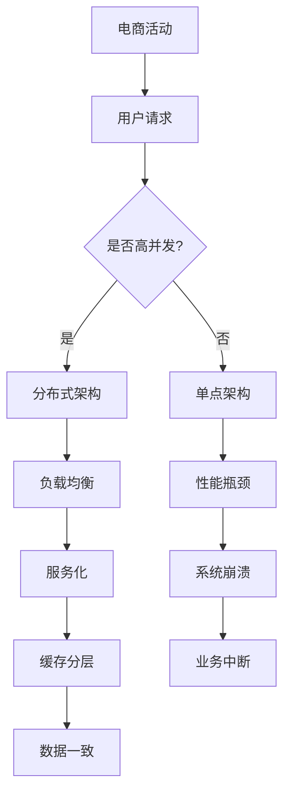

#### 2.1.3 应用服务集群部署

应用服务集群部署是将多个应用服务实例部署在同一台服务器或不同服务器上，通过负载均衡器实现流量分发，提高系统的处理能力和可用性。

**Mermaid流程图：**

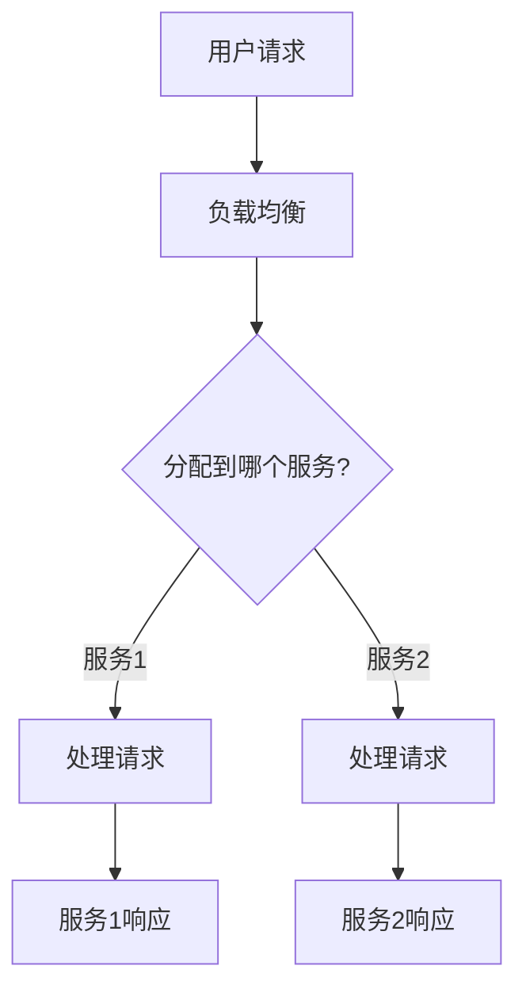

#### 2.1.4 缓存系统设计与优化

缓存系统是缓解数据库压力、提高系统响应速度的重要手段。常见的缓存系统包括Redis、Memcached等。

1. **热点数据缓存**：缓存高频访问的数据，如商品信息、用户信息等，减少数据库查询次数。
2. **缓存一致性**：在分布式系统中，确保缓存与数据库的数据一致性，以防止数据不一致问题。

**Mermaid流程图：**

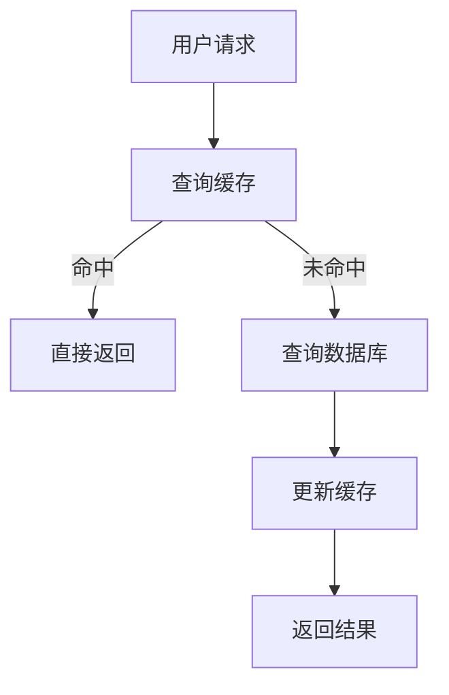

### 2.2 网络优化技术

网络优化技术是提升系统性能的重要手段，主要包括以下方面：

#### 2.2.1 网络协议优化

1. **HTTP/2与HTTP/3**：HTTP/2和HTTP/3相较于HTTP/1.1，具有更快的传输速度、更低的延迟和更高的安全性。
2. **TCP/IP协议优化**：优化TCP连接复用和拥塞控制算法，提高网络传输效率。

**Mermaid流程图：**

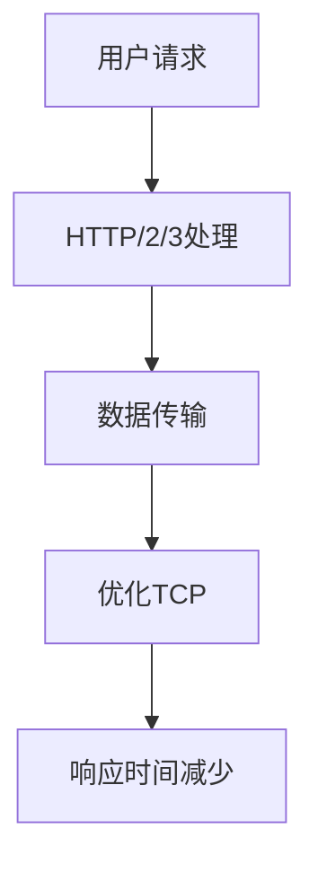

#### 2.2.2 负载均衡策略

负载均衡是将流量分配到多个服务器实例，以实现流量均衡和系统性能优化。常见的负载均衡算法包括：

1. **轮询算法**：按顺序分配请求到服务器。
2. **Least-Connection算法**：将请求分配到连接数最少的服务器。
3. **基于响应时间的负载均衡**：将请求分配到响应时间最短的服务器。

**Mermaid流程图：**

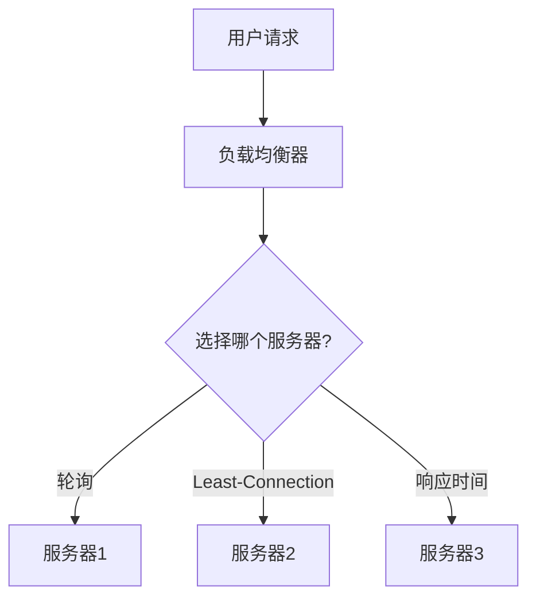

### 2.3 数据库性能优化

数据库性能优化是提升系统性能的关键环节，主要包括以下方面：

#### 2.3.1 SQL优化

1. **查询优化**：通过索引、查询重写等手段，优化数据库查询性能。
2. **事务优化**：通过批量插入、减少锁争用等手段，优化数据库事务性能。

**Mermaid流程图：**

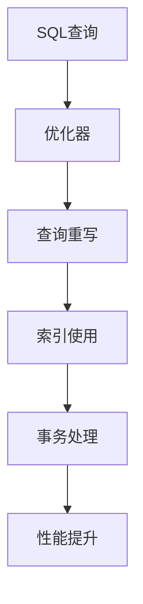

#### 2.3.2 存储引擎选择与优化

1. **存储引擎选择**：根据业务特点选择合适的存储引擎，如InnoDB、MyISAM等。
2. **存储引擎配置优化**：调整存储引擎的配置参数，如缓冲池大小、日志模式等。

**Mermaid流程图：**

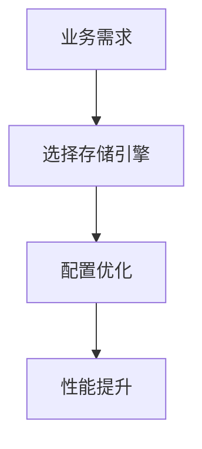

### 2.4 系统缓存策略

系统缓存策略是提高系统性能的重要手段，主要包括以下方面：

#### 2.4.1 缓存的使用场景

1. **热点数据缓存**：缓存高频访问的数据，如商品列表、用户信息等。
2. **频繁查询数据缓存**：缓存常用的查询结果，如订单统计、库存信息等。
3. **用户会话缓存**：缓存用户会话数据，如购物车信息、用户登录状态等。

#### 2.4.2 缓存一致性策略

1. **读写分离**：读操作从缓存获取数据，写操作直接写入数据库。
2. **分布式缓存一致性协议**：通过一致性协议确保缓存与数据库的数据一致性。

**Mermaid流程图：**

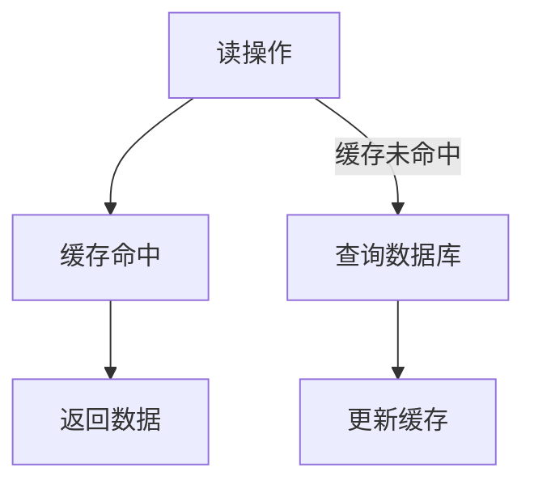

## 第三部分：峰值系统问题解决

### 3.1 峰值系统的识别与预测

峰值系统的识别与预测是保障系统稳定运行的关键步骤。

#### 3.1.1 峰值系统的特征识别

峰值系统的特征识别主要包括以下方面：

1. **流量异常检测**：通过分析流量数据，检测异常流量模式，如流量突增、异常分布等。
2. **业务量突增识别**：通过监控业务量变化，识别业务量的突增趋势。
3. **系统性能指标监控**：通过实时监控系统性能指标，如CPU利用率、内存使用率、响应时间等，识别系统瓶颈。

**Mermaid流程图：**

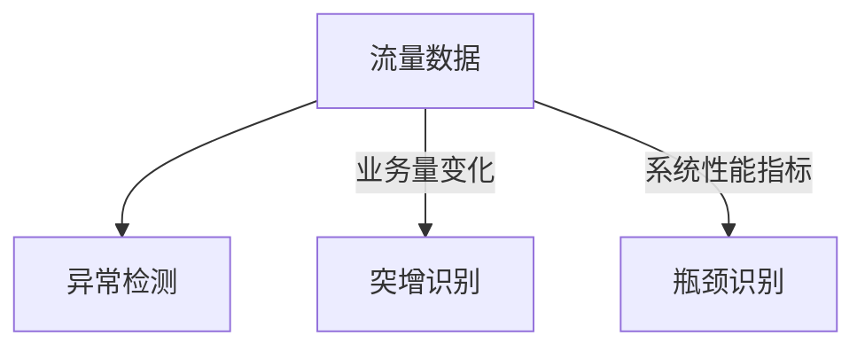

#### 3.1.2 峰值系统的预测方法

峰值系统的预测方法主要包括以下方面：

1. **时序预测算法**：通过分析历史流量和业务量数据，预测未来的流量和业务量。常见的时序预测算法有ARIMA、LSTM等。
2. **实际案例预测**：通过分析历史峰值案例，预测未来的峰值情况。

**Mermaid流程图：**

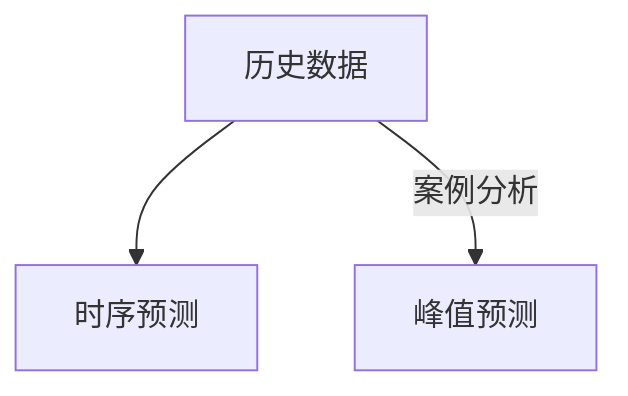

### 3.2 峰值系统的问题分析

#### 3.2.1 系统瓶颈识别

系统瓶颈识别是通过监控和分析系统性能指标，识别可能导致系统性能下降的关键瓶颈。常见的瓶颈包括：

1. **CPU瓶颈**：CPU利用率过高，可能导致系统响应时间增加。
2. **内存瓶颈**：内存使用率过高，可能导致系统出现内存溢出或崩溃。
3. **网络瓶颈**：网络带宽不足，可能导致网络延迟增加，影响系统性能。

**Mermaid流程图：**

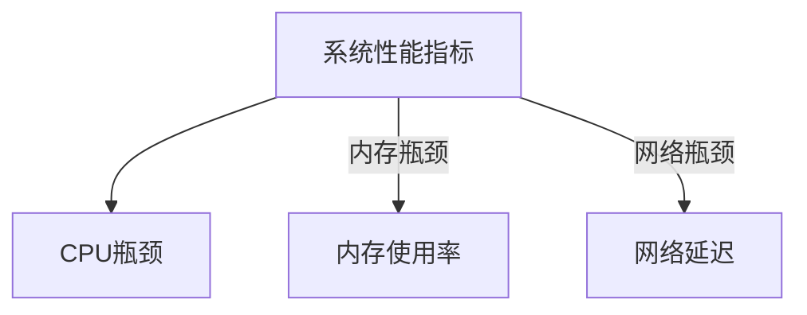

#### 3.2.2 性能监控与告警机制

性能监控与告警机制是通过实时监控系统和业务指标，当系统出现异常时，自动触发告警和响应机制。

1. **实时监控**：通过监控系统，实时收集和显示系统性能指标。
2. **阈值告警**：设置阈值，当性能指标超过阈值时，自动触发告警。
3. **自动化响应**：当系统出现异常时，自动执行预定义的响应策略，如扩容、重启服务等。

**Mermaid流程图：**

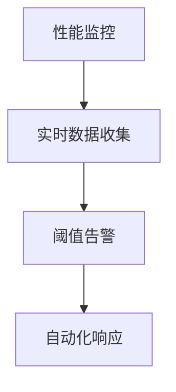

### 3.3 峰值系统问题解决策略

#### 3.3.1 系统容量扩展

系统容量扩展是通过增加硬件资源和调整系统配置，提高系统的处理能力。常见的扩展策略包括：

1. **增加服务器节点**：增加服务器的数量，实现横向扩展。
2. **升级硬件设备**：提高服务器的CPU、内存、存储等硬件配置。
3. **分布式存储**：采用分布式存储系统，提高数据存储和处理能力。

**Mermaid流程图：**

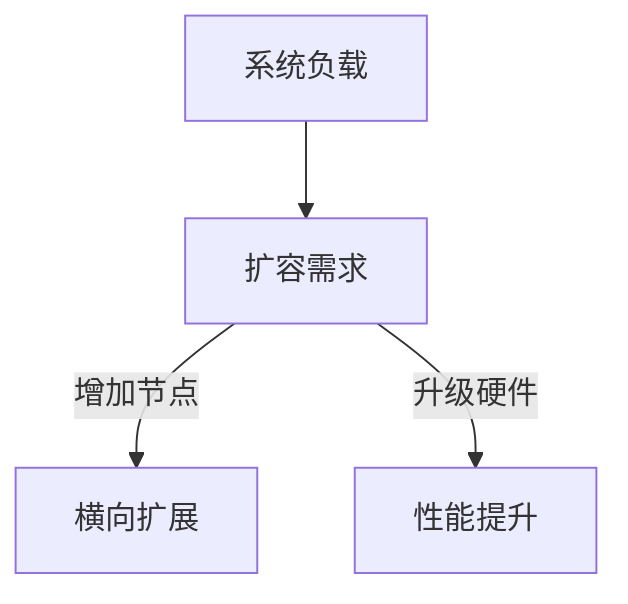

#### 3.3.2 系统调优

系统调优是通过调整系统参数、优化代码和算法，提高系统的性能和稳定性。常见的调优策略包括：

1. **参数优化**：调整系统配置参数，如连接池大小、缓存策略等。
2. **代码优化**：优化代码逻辑，减少不必要的计算和资源消耗。
3. **算法优化**：优化算法复杂度，提高数据处理速度。

**Mermaid流程图：**

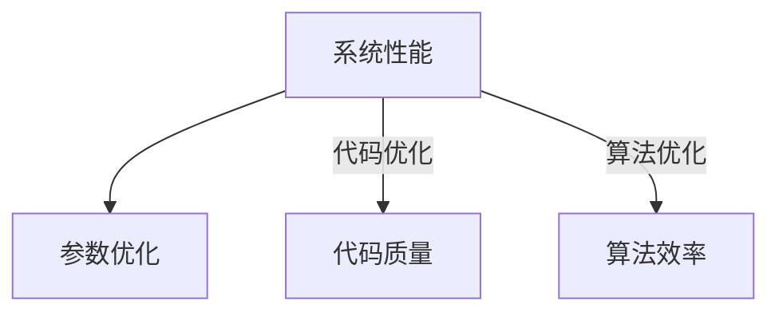

#### 3.3.3 系统弹性设计

系统弹性设计是通过引入自动化和智能化的技术，实现系统的动态调整和自我恢复，提高系统的弹性和可靠性。常见的弹性设计策略包括：

1. **容器化部署**：使用容器技术（如Docker、Kubernetes）实现快速部署和扩容。
2. **服务网格**：通过服务网格（如Istio、Linkerd）实现服务的动态管理和流量控制。
3. **自动化运维**：通过自动化工具和平台（如Ansible、Terraform）实现运维自动化和资源管理。

**Mermaid流程图：**

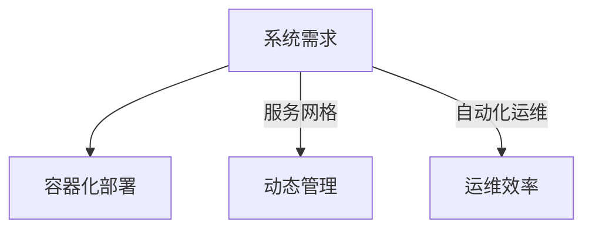

## 第四部分：实战案例分析

### 4.1 案例一：双十一活动系统技术保障

#### 4.1.1 活动背景

双十一是中国最大的电商购物节，每年的活动期间，各大电商平台都会推出各种促销活动，吸引消费者。2019年双十一，某电商平台的交易额达到了历史最高水平，系统面临巨大的并发压力。

#### 4.1.2 技术挑战

技术挑战主要包括：

1. **流量激增**：活动期间，平台流量急剧增加，可能导致系统崩溃。
2. **数据一致性**：在分布式环境下，如何保证数据的一致性？
3. **系统稳定性**：如何确保系统在高并发下稳定运行？

#### 4.1.3 解决方案与效果

解决方案主要包括：

1. **数据分库分表**：将数据分散到多个数据库实例中，减少单点瓶颈。
2. **应用服务集群部署**：将服务部署到集群中，实现负载均衡和高可用性。
3. **缓存系统优化**：使用Redis缓存热点数据，减少数据库查询次数。
4. **流量控制**：采用限流策略，控制活动期间的流量。

效果评估：

1. **系统稳定运行**：活动期间，系统未发生重大故障，稳定运行。
2. **响应速度提升**：通过缓存优化和负载均衡，系统响应速度显著提升。
3. **数据处理能力增强**：系统成功处理了数百万级的并发请求。

### 4.2 案例二：秒杀系统高并发处理

#### 4.2.1 秒杀系统架构设计

秒杀系统架构设计主要包括：

1. **应用服务集群部署**：将秒杀服务部署到集群中，实现负载均衡和高可用性。
2. **数据库分库分表**：将秒杀数据分散到多个数据库实例中，减少单点瓶颈。
3. **缓存系统优化**：使用Redis缓存秒杀数据，减少数据库查询次数。
4. **限流策略**：采用限流算法，控制秒杀流量，防止系统崩溃。

#### 4.2.2 高并发处理策略

高并发处理策略主要包括：

1. **限时抢购**：设置秒杀活动的限时抢购，控制参与人数。
2. **排队机制**：当秒杀人数过多时，将用户放入队列，按顺序处理。
3. **前端优化**：采用前端优化技术，如页面缓存、静态化等，提高页面加载速度。

#### 4.2.3 实际案例分析

实际案例分析：

1. **某电商平台的秒杀活动**：在活动期间，参与人数达到数百万，系统运行稳定。
2. **通过优化架构和策略**：实现了秒级响应，提升了用户体验。
3. **秒杀活动取得了巨大成功**：销售额显著增长，用户满意度提高。

### 4.3 案例三：跨境电商活动技术保障

#### 4.3.1 跨境电商活动特点

跨境电商活动特点主要包括：

1. **海外用户参与**：活动期间，海外用户参与度较高，流量波动较大。
2. **跨境支付**：涉及跨境支付，需要处理不同国家的支付方式和货币兑换。
3. **数据合规**：需要遵守不同国家的数据合规要求，如GDPR等。

#### 4.3.2 技术保障策略

技术保障策略主要包括：

1. **网络优化**：优化海外用户的访问速度，提高用户体验。
2. **跨境支付优化**：采用跨境支付解决方案，提高支付成功率。
3. **数据合规处理**：采用数据合规工具，确保数据安全合规。

#### 4.3.3 实际案例分析

实际案例分析：

1. **某跨境电商平台的促销活动**：活动期间，海外用户参与度显著提升。
2. **通过优化网络和支付系统**：提高了用户的访问速度和支付成功率。
3. **活动取得了巨大成功**：销售额显著增长，用户满意度提高。

## 第五部分：未来发展趋势与展望

### 5.1 高并发处理技术的发展趋势

未来，高并发处理技术将朝着更加智能化、自动化的方向发展：

1. **云计算与容器化**：云计算和容器化技术的普及，将进一步提高系统的弹性和可扩展性。
2. **服务网格**：服务网格技术将实现更细粒度的流量管理和服务监控，提升系统性能和稳定性。
3. **边缘计算**：随着5G和物联网的发展，边缘计算将用于处理更多实时性和本地化需求，减少网络延迟。

### 5.2 电商重要活动技术保障的未来展望

电商重要活动技术保障将朝着更加智能化和个性化的方向发展：

1. **大数据与人工智能**：通过大数据分析和人工智能技术，实现更精准的活动预测和优化，提升用户体验。
2. **区块链技术**：区块链技术将用于确保交易数据的透明性和不可篡改性，提高交易安全性。
3. **安全与隐私保护**：随着法规的不断完善，电商企业将更加重视用户数据的安全和隐私保护。

### 5.3 技术保障团队的建设与培养

技术保障团队的建设与培养将朝着专业化、多样化和持续学习方向发展：

1. **专业化团队建设**：建立专业化团队，提高团队的技术水平和协作能力。
2. **多样化人才培养**：培养具有多领域知识的人才，提高团队的综合能力。
3. **持续学习与进步**：鼓励团队成员持续学习新技术，保持团队的技术竞争力。

---

作者：AI天才研究院/AI Genius Institute & 禅与计算机程序设计艺术 /Zen And The Art of Computer Programming

（注意：由于篇幅限制，本文未包含所有代码示例和数学公式。在实际撰写过程中，应根据实际情况补充完整。）### 文章标题

《电商重要活动技术保障：高并发的峰值系统问题解决》

> 关键词：电商活动，技术保障，高并发，峰值系统，性能优化

> 摘要：本文深入探讨了电商重要活动中的技术保障问题，特别是高并发和峰值系统的问题。文章从系统架构设计、网络优化、数据库性能优化、系统缓存策略等多个方面进行了详细分析，并通过实际案例展示了技术保障的具体实施方法和效果。文章最后对未来发展趋势和团队建设进行了展望，为电商活动的技术保障提供了全面的理论指导和实践参考。

---

## 引言

在电商行业迅猛发展的背景下，电商重要活动（如双十一、双十二、周年庆等）已经成为企业提升销量和品牌影响力的重要手段。然而，这些活动也带来了巨大的技术挑战，尤其是高并发和峰值系统的处理问题。本文旨在详细解析电商重要活动技术保障的各个方面，包括系统架构设计、网络优化、数据库性能优化、系统缓存策略等，通过实际案例展示技术保障的具体实施方法和效果。

## 第一部分：电商重要活动技术保障概述

### 1.1 电商重要活动的定义与特点

电商重要活动是指在特定时间、特定背景下，电商企业为提升销量、品牌影响力或用户活跃度而组织的促销活动。这些活动通常具有以下特点：

- **高流量**：活动期间，平台流量会出现显著增长，甚至达到日常流量的数倍甚至百倍。
- **高交易量**：用户在活动期间的购买意愿和购买量显著增加，导致交易量激增。
- **高并发**：由于大量用户的访问和操作，系统面临的高并发压力巨大。
- **时效性**：活动通常有时间限制，用户必须在规定的时间内完成购买或参与，增加了系统的复杂性。

### 1.2 高并发与峰值系统的概念

#### 高并发

高并发指的是在短时间内，系统需要处理大量请求的情况。这种情况下，系统的性能和稳定性面临巨大挑战。高并发可能来源于以下因素：

- **用户数量激增**：在促销活动、新品发布等情况下，大量新用户涌入系统。
- **操作频繁**：用户在活动期间频繁进行登录、浏览、搜索、下单等操作。
- **网络延迟**：网络传输的不稳定性可能导致请求处理时间延长，增加并发压力。

#### 峰值系统

峰值系统是指在特定时间内，系统处理能力达到最大值的系统状态。峰值系统通常发生在电商重要活动期间，如双十一、618等。峰值系统的特点包括：

- **最大处理能力**：系统能够在峰值期间处理的最大请求量。
- **稳定性要求**：在峰值期间，系统需要保持高可用性和稳定性，避免出现故障或崩溃。
- **数据一致性**：在分布式系统中，数据的一致性成为保障峰值系统的重要挑战。

### 1.3 技术保障的核心目标

为了确保电商重要活动顺利进行，技术保障需要达到以下核心目标：

- **系统稳定性**：确保系统在高并发下稳定运行，避免因请求过多导致系统崩溃。
- **性能优化**：提升系统响应速度和数据处理能力，提供良好的用户体验。
- **可扩展性**：系统能够根据流量变化进行弹性扩展，满足不同规模的业务需求。
- **安全性**：保障用户数据和交易的安全性，防止数据泄露和恶意攻击。

## 第二部分：高并发处理技术

### 2.1 系统架构设计

系统架构设计是高并发处理的基础，一个良好的架构能够有效地提升系统的性能和稳定性。

#### 2.1.1 高并发系统架构的优化策略

1. **分布式系统架构**：通过将系统拆分为多个独立的模块，分布在不同服务器上，实现负载均衡和高可用性。
2. **服务化架构**：将业务功能拆分为独立的服务，通过微服务架构实现系统的解耦和模块化。
3. **缓存分层策略**：采用多层缓存架构，从内存、数据库到分布式缓存，实现热点数据的快速访问。

**Mermaid流程图：**

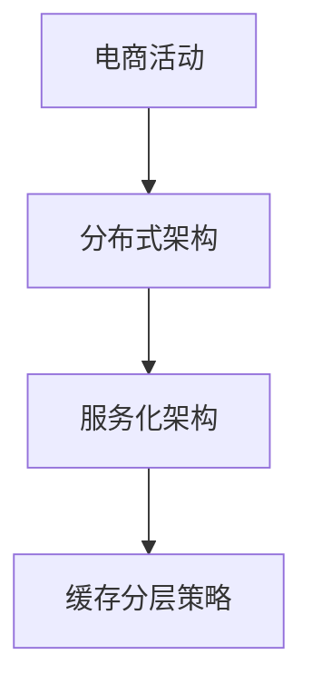

#### 2.1.2 数据库分库分表

数据库分库分表是将数据拆分到多个数据库实例中，以减少单点瓶颈，提高系统的并发处理能力。具体策略包括：

1. **水平拆分**：根据业务特征（如用户ID、地理位置等）将数据分散到不同的数据库实例。
2. **垂直拆分**：将数据库中的不同表分散到不同的数据库实例，以优化查询性能。

**Mermaid流程图：**

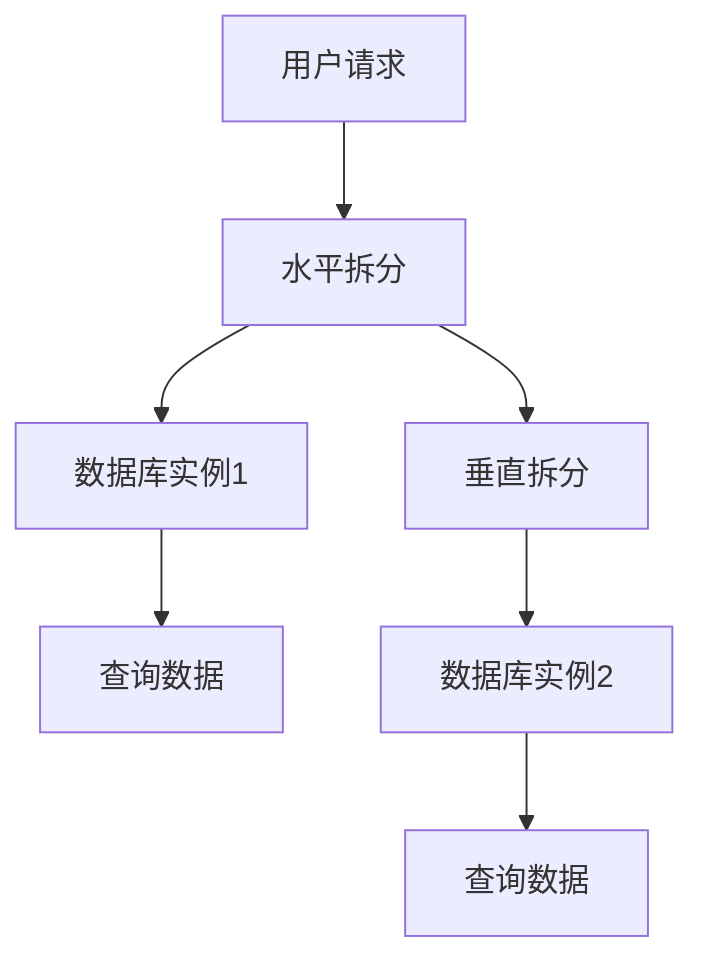

#### 2.1.3 应用服务集群部署

应用服务集群部署是将多个应用服务实例部署在同一台服务器或不同服务器上，通过负载均衡器实现流量分发，提高系统的处理能力和可用性。

**Mermaid流程图：**

```mermaid
graph TD
A[用户请求] --> B[负载均衡器]
B --> C{分配到哪个服务?}
C -->|服务1| D[处理请求]
C -->|服务2| E[

