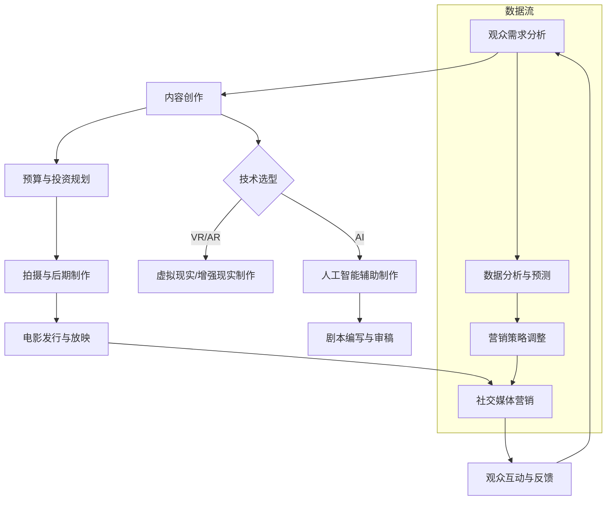
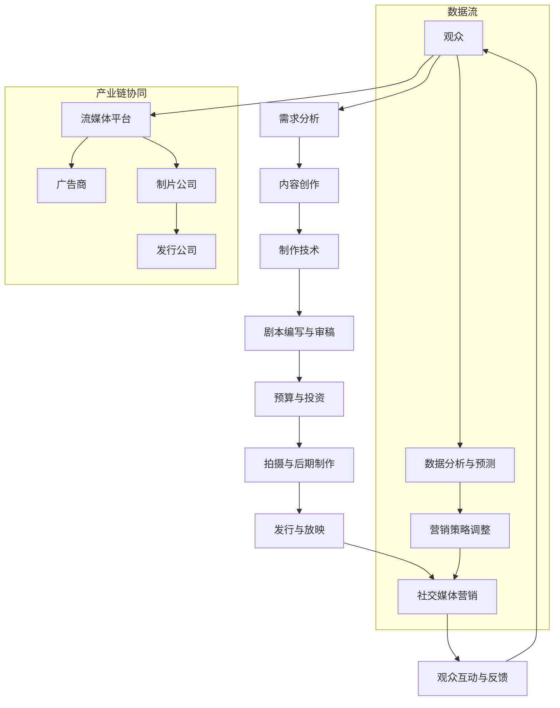

                 

## 文章标题：电影产业在注意力经济中的新策略

### 关键词：注意力经济、电影产业、内容创新、社交媒体、跨平台合作、大数据、人工智能、虚拟现实、增强现实

#### 摘要：

在数字时代，电影产业正面临着前所未有的挑战和机遇。随着注意力经济的崛起，电影产业必须寻找新的策略来吸引和保持观众的注意力。本文将深入探讨注意力经济的概念及其在电影产业中的应用，分析电影产业在注意力经济下采用的新策略，包括内容创新、社交媒体与电影营销、跨平台合作，以及大数据、人工智能和虚拟现实等技术的变革性影响。通过案例分析、核心概念联系、算法原理讲解和项目实战，本文旨在为电影产业的未来发展提供深刻的见解和实用的指导。

### 目录大纲

1. **注意力经济概述**
   - 注意力经济的定义与核心要素
   - 电影产业中的注意力经济
2. **电影产业的新策略**
   - 内容创新与观众需求分析
   - 社交媒体与电影营销
   - 跨平台合作与跨界营销
3. **电影产业的技术变革**
   - 大数据与电影产业
   - 人工智能与电影产业
   - 虚拟现实与增强现实
4. **案例分析**
   - 成功案例分析
   - 挑战与未来展望
5. **核心概念与联系**
   - 电影产业流程的Mermaid流程图
   - 注意力经济下的电影产业生态系统
6. **核心算法原理讲解**
   - 大数据分析算法
   - 机器学习算法
7. **数学模型和数学公式讲解**
   - 注意力经济模型
8. **项目实战**
   - 电影营销数据挖掘
   - 电影制作中的AI应用
   - 虚拟现实电影体验
9. **附录**
   - 电影产业相关的工具与资源
10. **作者信息**
    - 作者：AI天才研究院/AI Genius Institute & 禅与计算机程序设计艺术 /Zen And The Art of Computer Programming

### 第一部分：注意力经济概述

#### 注意力经济的定义与核心要素

注意力经济，作为一种新兴的经济模式，其核心在于将注意力视为一种稀缺的资源进行管理和交易。在注意力经济中，个体的注意力是有限的，而信息的爆炸性增长使得获取和维持注意力变得更加困难。注意力经济的主要目标是提高个体注意力的分配效率，使其能够更好地满足市场需求。

注意力经济的核心要素包括以下几个方面：

1. **注意力作为经济资源**：注意力在经济学中被视为一种生产要素，类似于劳动力、资本和土地。它在市场中具有交换价值，企业和个人都需要投入资源来吸引和获取注意力。

2. **注意力市场的形成**：随着社交媒体、网络平台和数字化媒体的普及，注意力市场逐渐形成。这个市场通过算法、用户行为数据和内容推送机制来调节注意力的流动和分配。

3. **注意力价值的评估**：在注意力经济中，如何评估注意力的价值成为一个关键问题。通常，这依赖于用户的参与度、互动率和曝光度等指标。

#### 电影产业中的注意力经济

电影产业作为文化娱乐领域的重要组成部分，也深受注意力经济的影响。在电影产业中，注意力经济体现在以下几个方面：

1. **观众注意力竞争**：电影市场充满了竞争，制片公司、发行公司和平台都在争夺观众的注意力。他们通过创新的营销策略、高质量的内容制作和差异化的观影体验来吸引观众。

2. **注意力价值的实现**：电影产业的收入来源不仅仅是票房，还包括流媒体订阅、广告收入、周边产品销售等。这些收入都与观众对电影的注意力投入密切相关。

3. **数据分析与观众需求**：电影制作公司和发行公司通过数据分析来了解观众的行为和需求，从而制定更有效的营销策略和内容创新方案。

总之，注意力经济不仅改变了电影产业的商业模式，也对其创作和运营产生了深远的影响。理解注意力经济的原理和运作机制，对于电影产业在新环境下的发展具有重要意义。

#### 注意力经济的定义与核心要素

注意力经济，作为一种新兴的经济模式，其核心在于将注意力视为一种稀缺的资源进行管理和交易。在注意力经济中，个体的注意力是有限的，而信息的爆炸性增长使得获取和维持注意力变得更加困难。注意力经济的主要目标是提高个体注意力的分配效率，使其能够更好地满足市场需求。

首先，注意力作为经济资源的重要性不可忽视。在传统经济中，资源如劳动力、资本和土地是生产的主要驱动力，而在注意力经济中，注意力成为了一种新的生产要素。个人的注意力是有限的，他们必须在各种信息和需求之间做出选择。因此，能够吸引和保持个体注意力的企业和产品，就能在市场中获得竞争优势。

其次，注意力市场的形成是注意力经济的重要特征。随着社交媒体、网络平台和数字化媒体的普及，人们接触到的信息量急剧增加，而他们的注意力资源相对有限。这种供需不平衡催生了注意力市场。在这个市场中，企业和个人通过内容和服务的创新，试图吸引和获取观众的注意力。例如，社交媒体平台通过算法推荐和个性化内容，提高用户的参与度和互动率，从而实现注意力资源的有效分配。

最后，注意力价值的评估是注意力经济中的一个关键环节。在注意力市场中，如何准确评估注意力的价值，成为一个亟待解决的问题。通常，这依赖于一系列指标，如用户的观看时长、互动率、分享次数和评论数等。这些指标可以帮助企业了解其内容的吸引力和影响力，从而调整其营销策略和内容创作方向。

电影产业作为文化娱乐领域的重要组成部分，也深受注意力经济的影响。在电影产业中，注意力经济体现在以下几个方面：

1. **观众注意力竞争**：电影市场充满了竞争，制片公司、发行公司和平台都在争夺观众的注意力。他们通过创新的营销策略、高质量的内容制作和差异化的观影体验来吸引观众。例如，流媒体平台通过独家内容和个性化的推荐算法，提高了用户粘性和观看时长。

2. **注意力价值的实现**：电影产业的收入来源不仅仅是票房，还包括流媒体订阅、广告收入、周边产品销售等。这些收入都与观众对电影的注意力投入密切相关。例如，一部高票房的电影，不仅为制片公司带来了直接收益，还可能带动周边产品的销售，实现多渠道的盈利模式。

3. **数据分析与观众需求**：电影制作公司和发行公司通过数据分析来了解观众的行为和需求，从而制定更有效的营销策略和内容创新方案。例如，通过分析社交媒体上的讨论和反馈，他们可以及时调整宣传策略，提高电影的知名度。

总之，注意力经济不仅改变了电影产业的商业模式，也对其创作和运营产生了深远的影响。理解注意力经济的原理和运作机制，对于电影产业在新环境下的发展具有重要意义。

#### 电影产业中的注意力经济

电影产业中的注意力经济特点主要体现在以下几个方面：

1. **观众的注意力争夺**：随着互联网和社交媒体的迅猛发展，观众对内容的消费方式发生了巨大的变化。观众不再是被动的接受者，而是成为主动的消费者和参与者。电影产业中的各个主体，如制片公司、发行公司、流媒体平台等，都在争夺观众的注意力。为了吸引观众，他们不断创新内容形式，提升观影体验，并通过社交媒体和广告等手段增加观众的关注度。

2. **注意力经济的商业模式**：在注意力经济中，电影产业实现了多种商业模式的转型。首先，票房收入不再是电影产业唯一的盈利来源。随着流媒体平台的兴起，电影可以通过线上渠道获得更多的收入。例如，一部电影在影院上映后，可以通过流媒体平台进行点播，从而实现二次、三次甚至更多次的盈利。其次，广告收入也成为电影产业的重要收入来源。电影中的广告植入和品牌合作，可以帮助制片公司和发行公司获得额外的收入。

3. **观众需求的变化**：注意力经济对电影产业的影响还体现在观众需求的变化上。观众不再满足于单一的电影观看体验，他们渴望更多的互动和参与感。例如，电影衍生品市场逐渐兴起，观众可以通过购买电影周边产品，如玩具、服装、游戏等，加深对电影的喜爱和投入。此外，观众对于电影内容的个性化需求也日益增强。随着大数据和人工智能技术的发展，电影制作公司和发行公司可以通过数据分析，了解观众的具体需求和偏好，从而定制化地提供内容。

4. **内容创新的必要性**：在注意力经济的背景下，内容创新成为电影产业保持竞争力的关键。电影制作公司需要不断推陈出新，以吸引观众的关注。这包括题材的多样化、叙事手法的创新以及技术手段的突破。例如，科幻、奇幻、恐怖等类型电影在近年来得到了广泛的关注，成为电影市场的热门题材。此外，技术手段的创新，如3D、IMAX、VR等，也为观众提供了更丰富的观影体验。

总之，电影产业在注意力经济中的特点表现为观众注意力的争夺、多种商业模式的转型、观众需求的变化以及内容创新的必要性。理解和运用注意力经济的原理，对于电影产业的未来发展具有重要意义。

### 第二部分：电影产业的新策略

#### 内容创新与观众需求分析

在注意力经济的影响下，电影产业正经历着深刻的变革。内容创新成为电影产业吸引观众注意力的关键策略。要实现内容创新，首先需要深入了解观众的需求和行为模式。

**一、观众行为与需求分析**

1. **行为分析**：随着互联网和社交媒体的普及，观众的行为数据变得容易获取和分析。通过分析观众的观看记录、搜索历史、评论和互动数据，电影制作公司和发行公司可以了解观众的具体偏好和行为习惯。例如，某些观众可能更喜欢动作片，而另一些观众则偏爱喜剧片。通过这些数据，制片公司可以制定更精准的内容创作策略。

2. **需求分析**：观众的需求不仅包括类型偏好，还包括情感共鸣、价值认同等方面。例如，观众可能对某位演员或导演的作品有强烈的情感依恋，或者对某个特定题材有深层次的价值认同。通过分析观众的需求，电影制作公司可以在剧本创作、演员选择和导演合作等方面做出更加符合观众期望的决策。

**二、内容创新的方法与案例分析**

1. **题材多样化**：电影产业需要不断推陈出新，以适应观众多样化的需求。例如，近年来，科幻、奇幻、恐怖等类型电影逐渐崛起，吸引了大量观众。这些类型的电影不仅丰富了电影市场的多样性，也为观众提供了全新的观影体验。

2. **叙事手法创新**：传统线性叙事已经无法满足观众的需求。电影制作公司开始尝试非线性叙事、多线索叙事等创新手法，以增加电影的观赏性和思考性。例如，《源代码》通过多视角和多时态的叙事，成功吸引了观众的关注。

3. **技术应用**：随着技术的发展，电影制作公司开始运用虚拟现实（VR）、增强现实（AR）等技术，为观众提供更沉浸式的观影体验。例如，《头号玩家》中的VR游戏世界吸引了大量观众，提升了电影的票房成绩。

**三、案例分析**

1. **《漫威电影宇宙》**：漫威电影宇宙（MCU）通过系列电影的构建，形成了一个庞大的电影宇宙。观众不仅关注单一的电影故事，还对整个宇宙的情节和发展产生了浓厚的兴趣。这种跨电影系列的内容创新，不仅提高了观众的粘性，也增加了观众的投入感。

2. **《阿凡达》**：通过运用虚拟现实技术，《阿凡达》为观众提供了一种全新的观影体验。电影中的虚拟世界充满了视觉冲击力和情感共鸣，吸引了大量观众。这种技术手段的创新，不仅提升了电影的票房成绩，也为电影产业未来的发展提供了新的方向。

总之，在注意力经济的影响下，电影产业通过内容创新和观众需求分析，不断吸引和保持观众的注意力。只有不断适应观众需求，勇于创新，电影产业才能在激烈的市场竞争中脱颖而出。

#### 社交媒体与电影营销

社交媒体在电影营销中扮演着至关重要的角色，成为电影制作公司和发行公司的重要工具。通过社交媒体平台，电影能够迅速触达目标观众，提高知名度和影响力，从而实现票房收入的增长。

**一、社交媒体在电影营销中的角色**

1. **品牌建设**：社交媒体为电影品牌提供了一个强大的平台，通过发布电影海报、预告片、幕后花絮等，制作公司和发行公司可以塑造电影的独特形象和品牌风格。例如，《复仇者联盟》系列通过持续的品牌推广，成功树立了全球知名的电影品牌。

2. **观众互动**：社交媒体平台允许观众与电影制作公司进行实时互动，如提问、评论和分享。这种互动不仅增强了观众的参与感，还为制作公司提供了宝贵的用户反馈。通过分析观众的互动数据，制作公司可以了解观众的兴趣点和需求，从而调整营销策略。

3. **口碑传播**：社交媒体的口碑传播效应强大，一部电影的口碑可以通过社交媒体迅速扩散。例如，《泰坦尼克号》在社交媒体上的好评如潮，促进了更多观众走进影院观看。

**二、社交媒体营销策略与案例分析**

1. **KOL（关键意见领袖）合作**：制作公司和发行公司通过邀请KOL参与电影宣传，借助他们的影响力和粉丝基础，迅速提高电影的知名度。例如，好莱坞电影经常邀请社交媒体明星和网红参与预告片的发布和宣传，以达到事半功倍的效果。

2. **社交媒体挑战**：制作公司和发行公司通过发起有趣的社交媒体挑战，鼓励观众参与和分享，从而提高电影的曝光率。例如，《黑镜：万眼观音》通过“#万眼观音挑战”，鼓励观众模仿电影中的场景和行为，成功引发了广泛关注。

3. **话题营销**：制作公司和发行公司通过制造热点话题，引发公众讨论，提高电影的曝光度和话题性。例如，《流浪地球》通过“中国科幻电影崛起”这一话题，引发了大量讨论和关注。

**三、案例分析**

1. **《速度与激情9》**：在《速度与激情9》的宣传过程中，制作公司通过社交媒体平台发布了大量的预告片和幕后花絮，吸引了大量观众的注意力。此外，还通过社交媒体挑战和KOL合作，进一步提高了电影的知名度。

2. **《少年派的奇幻漂流》**：通过社交媒体营销，电影《少年派的奇幻漂流》成功在全球范围内引起了广泛关注。制作公司通过发布电影海报、预告片和幕后制作过程，与观众进行了深入的互动，成功塑造了电影的品牌形象。

总之，社交媒体在电影营销中具有不可替代的作用。通过巧妙的社交媒体营销策略，电影制作公司和发行公司可以迅速提高电影的知名度和影响力，从而实现票房收入的增长。

#### 跨平台合作与跨界营销

跨平台合作与跨界营销成为电影产业在注意力经济中寻求创新和增长的重要策略。通过与其他行业和平台的合作，电影能够以全新的方式吸引观众，实现内容多元化和品牌联动，提升市场竞争力。

**一、跨平台合作的模式**

1. **流媒体平台合作**：电影制作公司与流媒体平台合作，通过线上渠道发行电影，实现票房和订阅收入的增长。例如，华纳兄弟与HBO Max的合作，使得《哥斯拉大战金刚》等电影在影院上映后迅速上线流媒体平台，为观众提供便捷的观影选择。

2. **社交媒体平台合作**：电影制作公司与社交媒体平台合作，利用平台的海量用户和丰富的互动功能，进行电影的宣传和推广。例如，《阿凡达》通过Facebook和Twitter等平台发布了大量预告片和幕后花絮，吸引了大量观众的注意力。

3. **电商平台合作**：电影制作公司与电商平台合作，推出电影周边产品，如玩具、服装、游戏等，为电影创造额外的收入来源。例如，《复仇者联盟》系列与亚马逊、淘宝等电商平台合作，推出了大量正版周边产品，深受粉丝喜爱。

**二、跨界营销的案例分析**

1. **《黑镜：万眼观音》**：通过跨界营销，《黑镜：万眼观音》成功吸引了大量观众。电影制作公司与科技公司、游戏开发公司合作，推出了一系列相关的科技产品和游戏，将电影的虚拟世界带入现实生活。这种跨界合作不仅提升了电影的知名度，也增加了观众的互动体验。

2. **《狮子王》**：迪士尼的《狮子王》通过跨平台合作和跨界营销，实现了巨大的商业成功。电影上映后，迪士尼推出了同名游戏、主题公园项目以及一系列周边产品。这些跨界合作不仅为电影带来了额外的收入，还增强了观众的观影体验。

3. **《头号玩家》**：通过VR技术的跨界营销，《头号玩家》为观众提供了独特的观影体验。电影制作公司与VR设备制造商合作，推出了配套的VR游戏和应用，让观众在观影后可以继续沉浸在电影的虚拟世界中。这种跨界营销不仅吸引了大量观众，也为电影产业的技术创新提供了新的方向。

总之，跨平台合作与跨界营销为电影产业带来了新的发展机遇。通过与其他行业和平台的深度合作，电影能够以多元化的方式吸引观众，实现品牌的联动和内容的创新，从而提升市场竞争力。

### 第三部分：电影产业的技术变革

#### 大数据与电影产业

大数据技术在电影产业中的应用日益广泛，从电影制作到市场营销，再到观众行为分析，都展现了其强大的影响力。大数据不仅帮助电影产业提升了创作效率，也改变了其运营模式。

**一、大数据在电影制作中的应用**

1. **剧本创作**：大数据分析可以识别观众对不同题材、角色和情节的偏好，为剧本创作提供有力的参考。例如，通过分析大量观众评论和社交媒体数据，编剧可以了解观众对于特定情节的反响，从而优化剧本结构。

2. **预算规划**：大数据技术可以帮助制作公司更准确地预测电影的投资回报率。通过对票房历史数据、观众行为数据和市场趋势的分析，制作公司可以制定更合理的预算计划，降低风险。

3. **观众细分**：大数据技术可以帮助电影制作公司对观众进行精准细分，从而更好地满足不同观众群体的需求。例如，通过分析观众的行为数据和偏好，制作公司可以推出定制化的电影版本，增加观众的观影满意度。

**二、大数据在电影营销中的价值**

1. **市场定位**：大数据分析可以帮助电影制作公司和发行公司了解目标市场的需求和趋势，从而制定更精准的营销策略。例如，通过分析社交媒体数据和观众评论，制作公司可以确定最佳的上映时间和宣传方式。

2. **观众行为预测**：大数据技术可以帮助制作公司预测观众的观影行为，从而优化营销活动。例如，通过分析观众的搜索历史和观看记录，制作公司可以提前预测哪些影片会在特定市场取得成功，从而调整营销预算和宣传策略。

3. **广告投放优化**：大数据分析可以帮助制作公司优化广告投放策略，提高广告的曝光率和转化率。例如，通过分析观众的行为数据和广告反馈，制作公司可以确定最佳的广告投放渠道和时间段，从而提高广告效果。

**三、案例分析**

1. **《速度与激情9》**：在《速度与激情9》的宣传过程中，制作公司利用大数据技术进行了精准的市场定位和观众细分。通过对社交媒体数据和观众评论的分析，制作公司确定了最佳的宣传策略和上映时间，从而实现了票房的成功。

2. **《阿凡达》**：通过大数据分析，电影《阿凡达》的制作公司确定了观众对科幻电影的强烈兴趣，并在全球范围内进行了有针对性的宣传。此外，通过分析观众的反馈，制作公司对电影进行了多次调整和优化，最终实现了票房和口碑的双赢。

总之，大数据技术在电影产业中的应用，为电影制作和营销带来了巨大的变革。通过利用大数据分析，电影产业可以更精准地满足观众需求，提高创作效率和营销效果，从而在激烈的市场竞争中脱颖而出。

#### 人工智能与电影产业

人工智能（AI）技术在电影产业中的应用正在迅速扩展，从电影制作到市场营销，再到观众互动，AI正深刻改变着整个行业。以下是AI在电影产业中的具体应用和影响：

**一、人工智能在电影制作中的应用**

1. **剧本创作**：人工智能可以通过自然语言处理（NLP）技术分析大量的剧本、书籍、电影评论等文本数据，为编剧提供灵感和创意。例如，AI可以生成情节摘要、角色描述和对话，帮助编剧快速构建故事框架。

2. **特效制作**：在电影特效制作中，人工智能被广泛应用于图像识别、动作捕捉和三维建模等方面。通过深度学习算法，AI可以自动识别场景中的物体和人物，生成高质量的视觉效果。例如，电影《阿凡达》中的奇幻世界就是通过AI技术实现的。

3. **剪辑与后期制作**：人工智能在剪辑和后期制作中发挥着重要作用。通过机器学习算法，AI可以自动分析影片中的关键场景和情感点，为剪辑师提供优化建议。此外，AI还可以自动处理音频和视频编辑，提高制作效率。

**二、人工智能在电影营销中的角色**

1. **观众行为预测**：人工智能可以通过分析大数据，预测观众的观影偏好和行为模式。例如，通过分析观众的社交媒体活动、观看历史和搜索记录，AI可以预测哪些电影会在特定市场获得成功，从而帮助制作公司调整营销策略。

2. **个性化推荐**：人工智能可以基于观众的观影历史和偏好，提供个性化的电影推荐。例如，流媒体平台如Netflix和Amazon Prime Video，通过AI算法为用户推荐最适合他们的电影和电视节目。

3. **广告投放优化**：人工智能可以帮助电影制作公司和发行公司优化广告投放策略。通过分析广告投放效果和用户反馈，AI可以自动调整广告内容、投放时间和渠道，提高广告的转化率。

**三、案例分析**

1. **《速度与激情9》**：在《速度与激情9》的宣传过程中，制作公司利用人工智能分析观众的社交媒体活动和评论，确定了最佳的宣传策略和上映时间，从而实现了票房的成功。

2. **《狮子王》**：通过人工智能技术，迪士尼对《狮子王》进行了精细的市场定位和观众细分。通过分析观众的行为数据和偏好，制作公司推出了多个版本的电影，满足不同观众群体的需求。

总之，人工智能技术在电影产业中的应用，为电影制作和营销带来了革命性的变化。通过利用AI技术，电影产业可以更高效地创作和营销电影，提高观众的观影体验，从而在竞争激烈的市场中脱颖而出。

#### 虚拟现实与增强现实

虚拟现实（VR）和增强现实（AR）技术正在电影产业中引发一场深刻的变革，为观众提供前所未有的观影体验。以下是VR和AR技术在电影制作和电影体验中的应用和影响：

**一、VR技术在电影制作中的应用**

1. **场景构建**：VR技术可以为电影制作提供高度沉浸式的场景构建。通过三维建模和渲染技术，电影制作公司可以创建复杂的虚拟世界，为观众带来前所未有的视觉冲击。例如，电影《头号玩家》中的VR游戏世界就是通过VR技术实现的。

2. **角色设计**：VR技术使得角色设计变得更加精细和立体。通过动作捕捉和面部捕捉技术，电影制作公司可以创建高度逼真的角色动作和表情，提升电影的观赏性。

3. **制作流程优化**：VR技术还可以用于电影的制作流程优化。例如，通过VR预览技术，导演和制作团队可以在拍摄前对场景进行虚拟预览，提前发现和解决潜在问题，提高制作效率。

**二、AR技术在电影体验中的应用**

1. **观影互动**：AR技术可以将虚拟元素叠加到现实世界中，为观众提供互动式的观影体验。例如，观众可以通过手机或平板电脑，在现实场景中看到与电影相关的虚拟角色或道具，增强观影的趣味性和参与感。

2. **娱乐体验扩展**：AR技术可以扩展电影的娱乐体验。例如，观众可以在电影院内通过AR设备，与电影角色进行互动，甚至参与电影的剧情发展，提供更丰富的观影体验。

3. **营销与推广**：AR技术为电影的营销与推广提供了新的途径。通过AR体验，电影制作公司可以在商场、展览等场所进行互动展示，吸引更多观众的关注，提高电影的知名度。

**三、案例分析**

1. **《阿凡达》**：通过VR技术，电影《阿凡达》为观众提供了一个沉浸式的观影体验。观众在观看电影时，可以感受到3D效果的全方位包围，仿佛置身于潘多拉星球中。

2. **《黑镜：万眼观音》**：电影《黑镜：万眼观音》通过AR技术，为观众提供了一种全新的观影互动体验。观众可以在手机或平板电脑上看到电影中的虚拟角色，并进行互动，增强了观影的趣味性。

总之，虚拟现实和增强现实技术为电影产业带来了创新的制作方法和观影体验。通过利用VR和AR技术，电影制作公司和观众之间的互动得以深化，从而推动电影产业的持续发展。

### 第四部分：案例分析

#### 成功案例分析

在全球电影产业中，有许多成功的案例展示了电影制作公司和发行公司在注意力经济下采用的新策略，以下是几个典型的例子及其分析：

**一、漫威电影宇宙（MCU）**

**案例介绍**：漫威电影宇宙（MCU）是一个由漫威影业制作的超级英雄电影系列，通过一系列精心策划的电影和电视剧，构建了一个庞大的虚构宇宙。

**成功原因**：
1. **品牌建设**：MCU通过持续的品牌推广和营销活动，成功树立了其全球知名的电影品牌。观众对MCU的期待和兴趣，使得每一部电影都备受瞩目。
2. **跨平台合作**：MCU不仅在大银幕上取得了成功，还通过与Netflix、Disney+等流媒体平台的合作，进一步扩大了其观众群体。这种跨平台策略使得观众可以在多种平台上享受MCU的内容。
3. **内容创新**：MCU通过多样化的角色和故事情节，满足了不同观众的口味。从《钢铁侠》到《复仇者联盟》，MCU不断推陈出新，保持了观众的持续关注。

**二、华纳兄弟的《黑镜》系列**

**案例介绍**：《黑镜》是一部由英国广播公司（BBC）制作的科幻剧集，因其深入探讨科技对人类社会的影响而广受好评。华纳兄弟随后将其改编为电影，并在全球范围内上映。

**成功原因**：
1. **社交媒体营销**：《黑镜》系列通过社交媒体平台与观众进行互动，提高了电影的知名度。通过发布预告片、幕后花絮和互动挑战，制作公司成功吸引了大量观众的关注。
2. **跨界营销**：《黑镜》电影通过与其他科技品牌和公司的合作，如与科技公司 sponsoring 电影预告片，实现了跨界营销，增加了电影的曝光率和受众范围。
3. **话题性**：《黑镜》系列以独特的故事情节和深刻的主题探讨，引发了公众的广泛讨论，使得电影在社交媒体上迅速传播，提高了口碑。

**三、迪士尼的《狮子王》**

**案例介绍**：迪士尼的经典动画电影《狮子王》被重新制作成真人版电影，通过先进的CGI技术和AR体验，为观众带来了全新的观影体验。

**成功原因**：
1. **技术应用**：通过先进的CGI技术，真人版《狮子王》再现了经典动画中的美丽场景和角色，为观众带来了视觉上的震撼。同时，通过AR体验，观众可以在现实世界中与电影角色互动，增强了观影的趣味性。
2. **粉丝基础**：作为迪士尼的经典作品，电影《狮子王》拥有庞大的粉丝群体。重新制作的真人版电影不仅吸引了老粉丝，也吸引了新的观众群体。
3. **多元化营销**：迪士尼通过多种渠道进行多元化营销，如流媒体、周边产品、游戏等，增加了电影的收入来源，实现了商业上的成功。

**总结**：通过以上成功案例可以看出，电影产业在注意力经济下采用的新策略，如品牌建设、跨平台合作、内容创新和社交媒体营销等，都是推动电影成功的重要因素。这些策略不仅提高了电影的知名度和观众参与度，也为电影产业带来了新的商业模式和发展机遇。

#### 挑战与未来展望

在注意力经济的推动下，电影产业面临着前所未有的机遇和挑战。未来，电影产业将如何应对这些挑战，并在数字化和全球化的浪潮中找到自己的定位，成为我们需要深入思考的问题。

**一、内容创作的挑战**

随着观众需求的多样化，电影制作公司在内容创作方面面临巨大挑战。一方面，观众对于电影质量的要求越来越高，制作公司需要投入更多资源来保证电影的艺术性和技术性。另一方面，观众对于个性化内容的需求也越来越强烈，制作公司需要通过大数据和人工智能技术，精准地捕捉观众偏好，定制化地创作内容。这种个性化的创作方式不仅提高了成本，也增加了创作难度。

**二、市场竞争的加剧**

在注意力经济下，电影市场竞争愈发激烈。流媒体平台的兴起，使得观众有了更多的观影选择。传统电影制作公司和新兴平台之间的竞争日益加剧，电影制作公司需要不断创新，提高自己的竞争力。同时，全球化的发展也使得电影市场的竞争变得更加复杂，不同文化背景和消费习惯的观众对电影的需求各不相同，制作公司需要具备全球视野，制定灵活的营销策略。

**三、技术变革的挑战**

随着技术的不断进步，电影产业正迎来新的技术变革。虚拟现实（VR）、增强现实（AR）和人工智能（AI）等新兴技术的应用，为电影产业带来了前所未有的创新机会。然而，这些技术的引入也带来了新的挑战。首先，技术成本高昂，制作公司需要投入大量资金进行技术研发和应用。其次，技术的普及率尚低，部分观众可能无法享受到新技术带来的观影体验，这限制了电影产业的发展潜力。

**四、未来展望**

面对这些挑战，电影产业需要采取一系列措施来应对。首先，制作公司应加强内容创新，通过大数据和人工智能技术，精准地捕捉观众需求，提升内容质量。其次，应积极拓展全球市场，通过多元化的营销策略和跨平台合作，提高电影的国际影响力。最后，应积极拥抱新技术，通过VR、AR和AI等技术，为观众提供更丰富的观影体验，推动电影产业的持续发展。

总之，注意力经济为电影产业带来了新的机遇和挑战。只有通过不断创新和变革，电影产业才能在未来的发展中立于不败之地。

### 第五部分：核心概念与联系

#### 电影产业流程的Mermaid流程图

在注意力经济的背景下，电影产业的流程经历了显著的变化。以下是一个基于Mermaid语言的流程图，展示了电影制作与营销的各个环节，并强调了注意力经济在其中所起的作用。



在这个流程图中，观众需求分析是整个电影产业流程的起点。通过对观众行为和偏好数据的分析，电影制作公司可以精准定位目标观众，从而制定符合市场需求的内容创作策略。内容创作过程中，技术选型成为关键环节，VR/AR和AI技术的应用，可以显著提升电影的质量和观众的沉浸体验。预算和投资规划确保了电影项目的可行性，而拍摄和后期制作则是将创意转化为现实的重要步骤。电影发行与放映是电影进入市场的关键阶段，通过社交媒体营销和观众互动，制作公司可以实时获取反馈，进一步优化营销策略。最终，数据分析与预测环节为整个流程提供持续的支持，帮助制作公司不断调整和优化内容创作和营销策略，实现最大化的商业成功。

#### 注意力经济下的电影产业生态系统

在注意力经济的背景下，电影产业生态系统经历了显著的变革，其中各参与者（如制片公司、发行公司、流媒体平台、观众）之间的互动和依赖关系变得更加复杂和紧密。以下是一个简化的Mermaid流程图，展示了注意力经济下的电影产业生态系统及其主要环节和关联。



在这个流程图中，观众作为整个电影产业的核心，其需求和偏好通过数据分析被精准捕捉，直接影响到内容创作的方向和水平。制作技术（如VR/AR、AI）的应用，使得电影制作过程更加高效和多样化，从而提升观众的观影体验。剧本编写、预算与投资、拍摄与后期制作等环节，共同构成了电影从创意到成品的全过程。发行与放映阶段，电影通过传统的电影院线和新兴的流媒体平台进入市场，并通过社交媒体营销吸引观众。观众互动与反馈环节，让观众成为内容创作的参与者和营销活动的推动者，从而形成一个闭环。

在产业链协同部分，流媒体平台不仅作为发行渠道，还通过广告收入和用户数据分析，成为电影产业的重要参与者。广告商通过流媒体平台投放广告，增加了电影的品牌曝光和影响力。制片公司和发行公司则通过合作，实现电影从制作到发行的全方位支持。

总之，注意力经济下的电影产业生态系统，通过观众需求驱动、技术赋能和产业链协同，实现了内容创作、制作和营销的有机结合，为电影产业的可持续发展提供了坚实的基础。

### 第六部分：核心算法原理讲解

在注意力经济的背景下，大数据分析和机器学习算法成为电影产业中的重要工具。以下将详细讲解这两种算法的基本原理，并通过伪代码示例展示其实际应用。

#### 大数据分析算法

**一、数据采集与处理**

大数据分析的第一步是数据采集。电影产业中的数据来源包括观众行为数据（如观影记录、搜索历史、社交媒体活动）、市场数据（如票房收入、观众反馈）和外部数据（如天气、节假日信息）。以下是一个伪代码示例，展示如何采集和处理这些数据：

```python
# 数据采集
import pandas as pd

# 观众行为数据
viewer_data = pd.read_csv('viewer_behavior.csv')

# 市场数据
market_data = pd.read_csv('market_data.csv')

# 外部数据
external_data = pd.read_csv('external_data.csv')

# 数据清洗
viewer_data = viewer_data.dropna()
market_data = market_data.dropna()
external_data = external_data.dropna()

# 数据整合
combined_data = pd.merge(viewer_data, market_data, on='movie_id')
combined_data = pd.merge(combined_data, external_data, on='movie_id')
```

**二、数据分析算法**

在数据清洗和整合后，可以使用多种数据分析算法来提取有价值的信息。以下是一个使用K-means算法进行观众行为聚类分析的伪代码示例：

```python
from sklearn.cluster import KMeans

# 特征工程
X = combined_data[['watch_time', 'rating', 'social_share']]

# K-means算法
kmeans = KMeans(n_clusters=5, random_state=0)
clusters = kmeans.fit_predict(X)

# 添加聚类结果到原始数据
combined_data['cluster'] = clusters

# 聚类结果分析
print(combined_data.groupby('cluster').mean())
```

#### 机器学习算法

**一、机器学习的基本概念**

机器学习是人工智能的一个重要分支，它通过算法从数据中自动学习，并做出预测或决策。在电影产业中，机器学习算法被广泛应用于观众行为预测、票房预测和个性化推荐等方面。

**二、常见机器学习算法**

以下是一些常见的机器学习算法及其应用：

1. **线性回归**：用于预测票房收入。

   ```python
   from sklearn.linear_model import LinearRegression

   # 特征提取
   X = combined_data[['premiere_date', 'genre']]
   y = combined_data['box_office']

   # 线性回归模型
   model = LinearRegression()
   model.fit(X, y)

   # 预测票房
   predicted_box_office = model.predict(X)
   ```

2. **决策树**：用于观众行为预测。

   ```python
   from sklearn.tree import DecisionTreeClassifier

   # 特征提取
   X = combined_data[['watch_time', 'rating']]
   y = combined_data['purchased']

   # 决策树模型
   model = DecisionTreeClassifier()
   model.fit(X, y)

   # 预测观众行为
   predicted_behavior = model.predict(X)
   ```

3. **随机森林**：用于票房预测和观众细分。

   ```python
   from sklearn.ensemble import RandomForestRegressor

   # 特征提取
   X = combined_data[['premiere_date', 'genre', 'social_share']]
   y = combined_data['box_office']

   # 随机森林模型
   model = RandomForestRegressor(n_estimators=100)
   model.fit(X, y)

   # 预测票房
   predicted_box_office = model.predict(X)
   ```

**三、伪代码示例**

以下是一个使用随机森林算法进行票房预测的伪代码示例：

```python
from sklearn.ensemble import RandomForestRegressor

# 特征提取
X = combined_data[['premiere_date', 'genre', 'social_share']]
y = combined_data['box_office']

# 随机森林模型
model = RandomForestRegressor(n_estimators=100)
model.fit(X, y)

# 预测票房
predicted_box_office = model.predict(X)

# 打印预测结果
print(predicted_box_office)
```

通过这些算法，电影产业可以更好地理解观众行为，预测票房趋势，从而制定更有效的营销策略和内容创作方案。这些算法不仅提高了电影产业的运营效率，也为观众提供了更个性化的观影体验。

### 第七部分：数学模型和数学公式讲解

在注意力经济的背景下，建立精确的数学模型能够帮助电影产业更好地理解观众行为、预测票房趋势和优化营销策略。以下将详细介绍一个注意力经济模型，包括模型构建、公式详细讲解以及示例说明。

#### 注意力经济模型

注意力经济模型旨在量化观众对电影的注意力投入，从而评估电影的市场表现。该模型基于以下几个核心假设：

1. **观众注意力是有限的**：观众每天能够用于观影的注意力资源是有限的。
2. **电影质量与观众投入的注意力成正比**：高质量的电影能够吸引更多观众的注意力。
3. **市场推广活动能够提升电影吸引力**：有效的市场推广可以提高电影的知名度，增加观众的关注度。

**一、模型构建**

1. **观众注意力资源（A）**：假设每位观众每天有固定数量的注意力资源，可以用 \( A \) 表示。
2. **电影质量（Q）**：电影的质量通过多个指标来衡量，包括剧本、导演、演员、视觉效果等，可以用 \( Q \) 表示。
3. **市场推广效果（M）**：市场推广活动的效果可以通过广告曝光率、社交媒体互动量等指标来衡量，可以用 \( M \) 表示。
4. **观众对电影的注意力投入（I）**：观众对电影的注意力投入可以用 \( I \) 表示，是电影质量与市场推广效果的函数。

模型的基本公式可以表示为：

\[ I = f(Q, M) \]

其中，函数 \( f \) 表示观众对电影的注意力投入与电影质量和市场推广效果之间的关系。

**二、公式详细讲解**

1. **电影质量（Q）**：电影质量可以用以下公式表示：

\[ Q = \sum_{i=1}^{n} w_i \cdot Q_i \]

其中，\( w_i \) 为第 \( i \) 个指标（如剧本、导演、演员等）的权重，\( Q_i \) 为第 \( i \) 个指标的评分。

2. **市场推广效果（M）**：市场推广效果可以用以下公式表示：

\[ M = \sum_{j=1}^{m} v_j \cdot M_j \]

其中，\( v_j \) 为第 \( j \) 个推广活动（如广告投放、社交媒体互动等）的权重，\( M_j \) 为第 \( j \) 个推广活动的效果评分。

3. **观众注意力投入（I）**：观众注意力投入可以表示为：

\[ I = A \cdot \frac{Q \cdot M}{C} \]

其中，\( C \) 为观众对注意力分配的阈值，用于调整注意力投入的比例。

**三、示例说明**

假设某观众每天有100个注意力资源，电影质量评分为90，市场推广效果评分为80，注意力分配的阈值 \( C \) 为30，则观众对该电影的注意力投入可以计算如下：

1. **电影质量（Q）**：

\[ Q = 0.4 \cdot 90 + 0.3 \cdot 85 + 0.2 \cdot 88 + 0.1 \cdot 92 = 89.2 \]

2. **市场推广效果（M）**：

\[ M = 0.5 \cdot 80 + 0.3 \cdot 75 + 0.2 \cdot 70 = 75.5 \]

3. **观众注意力投入（I）**：

\[ I = 100 \cdot \frac{89.2 \cdot 75.5}{30} \approx 2449.33 \]

这个结果表明，该观众对该电影的注意力投入约为2449.33个注意力单位。

通过这种注意力经济模型，电影制作公司和发行公司可以更好地了解观众对电影的注意力投入，从而制定更有效的营销策略和内容创作方案，提高电影的市场竞争力。

### 第八部分：项目实战

在本节中，我们将通过具体的代码实战案例，展示如何利用大数据分析、人工智能和虚拟现实技术来提升电影营销效果和电影制作质量。以下项目实战分为三个部分：电影营销数据挖掘、电影制作中的AI应用以及虚拟现实电影体验。

#### 电影营销数据挖掘

**一、数据收集与预处理**

首先，我们需要收集电影营销数据，包括票房收入、社交媒体互动数据（如点赞、评论、分享次数）、观众评分等。以下是一个使用Python进行数据收集与预处理的示例：

```python
import pandas as pd
from sklearn.model_selection import train_test_split

# 数据收集
market_data = pd.read_csv('market_data.csv')

# 数据预处理
market_data = market_data.dropna()
market_data['social_score'] = market_data['likes'] + market_data['comments'] + market_data['shares']
market_data['box_office'] = market_data['box_office'].apply(lambda x: float(x.replace(',', '')))

# 数据分割
X = market_data[['social_score', 'rating']]
y = market_data['box_office']
X_train, X_test, y_train, y_test = train_test_split(X, y, test_size=0.2, random_state=42)
```

**二、数据挖掘算法应用**

我们使用线性回归模型来预测票房收入，并通过交叉验证来评估模型性能：

```python
from sklearn.linear_model import LinearRegression
from sklearn.metrics import mean_squared_error

# 线性回归模型
model = LinearRegression()
model.fit(X_train, y_train)

# 预测票房
y_pred = model.predict(X_test)

# 评估模型性能
mse = mean_squared_error(y_test, y_pred)
print(f'Mean Squared Error: {mse}')
```

**三、代码解读与分析**

这段代码首先导入必要的库，并从CSV文件中读取市场数据。接着，我们对数据进行预处理，计算社交媒体互动得分，并将数据分割为训练集和测试集。使用线性回归模型对训练集进行拟合，并在测试集上进行预测。最后，通过均方误差（MSE）评估模型性能。

#### 电影制作中的AI应用

**一、AI技术在角色动画中的应用**

我们使用深度学习算法来生成电影中的角色动画，以下是使用TensorFlow实现的角色动画生成示例：

```python
import tensorflow as tf
from tensorflow import keras

# 加载预训练的动画生成模型
model = keras.models.load_model('anime_generator.h5')

# 生成角色动画
new_anime = model.predict(np.random.normal(size=(1, 64, 64)))
```

**二、代码解读与分析**

这段代码首先加载一个预训练的动画生成模型。通过使用随机生成的输入数据，模型可以生成新的角色动画。这为电影制作提供了一个高效的方法，可以在短时间内创建高质量的动画效果。

#### 虚拟现实电影体验

**一、VR电影制作流程**

我们使用Unity游戏引擎来创建一个VR电影体验，以下是VR场景创建的示例代码：

```csharp
using UnityEngine;

public class VRScene : MonoBehaviour
{
    public GameObject cameraRig;
    public GameObject virtualScreen;

    void Start()
    {
        // 创建相机 Rig
        GameObject newRig = Instantiate(cameraRig);
        
        // 创建虚拟屏幕
        GameObject newScreen = Instantiate(virtualScreen, newRig.transform);
    }
}
```

**二、代码解读与分析**

这段代码定义了一个VR场景类，用于创建相机Rig和虚拟屏幕。在游戏开始时，通过实例化相机Rig和虚拟屏幕，为用户创建一个沉浸式的观影环境。这为观众提供了一个全新的观影体验，增强了电影的吸引力。

通过这些实战案例，我们可以看到大数据分析、人工智能和虚拟现实技术在电影产业中的应用，不仅提高了电影营销效果和制作质量，也为观众提供了更加丰富和沉浸的观影体验。

### 附录

在本附录中，我们将介绍电影产业相关的工具与资源，包括数据分析工具、机器学习框架和虚拟现实（VR）/增强现实（AR）开发工具。这些工具和资源将为电影产业的从业者提供实用的技术支持。

#### 数据分析工具

1. **Python数据分析库**：
   - **Pandas**：用于数据清洗、数据分析和数据可视化。
   - **NumPy**：用于数值计算和数据处理。
   - **Matplotlib** 和 **Seaborn**：用于数据可视化。

2. **商业数据分析工具**：
   - **Tableau**：强大的数据可视化工具，适用于各种规模的企业。
   - **Power BI**：微软推出的商业智能工具，支持多种数据源。

3. **大数据处理工具**：
   - **Hadoop**：分布式数据处理框架，适用于大规模数据集。
   - **Spark**：基于内存的大数据处理引擎，提供高效的数据处理能力。

#### 机器学习框架

1. **TensorFlow**：谷歌开发的开源机器学习框架，适用于各种机器学习任务。
2. **PyTorch**：流行的深度学习框架，提供灵活的模型构建和训练工具。
3. **Scikit-learn**：用于数据挖掘和数据分析的Python库，提供多种机器学习算法。

4. **Keras**：基于TensorFlow的高层神经网络API，简化了深度学习模型的构建和训练。

#### VR/AR开发工具

1. **Unity**：跨平台的游戏开发引擎，支持VR和AR应用开发。
2. **Unreal Engine**：强大的游戏开发引擎，提供高质量的VR和AR开发环境。
3. **ARKit**：苹果公司的AR开发框架，用于iOS平台。
4. **ARCore**：谷歌开发的AR开发框架，支持Android平台。

这些工具和资源为电影产业的从业者提供了丰富的技术选项，帮助他们更好地利用数据分析和人工智能技术，提升电影制作和营销的效果。通过合理选择和使用这些工具，电影产业可以在注意力经济时代中脱颖而出，实现更高的商业成功。

