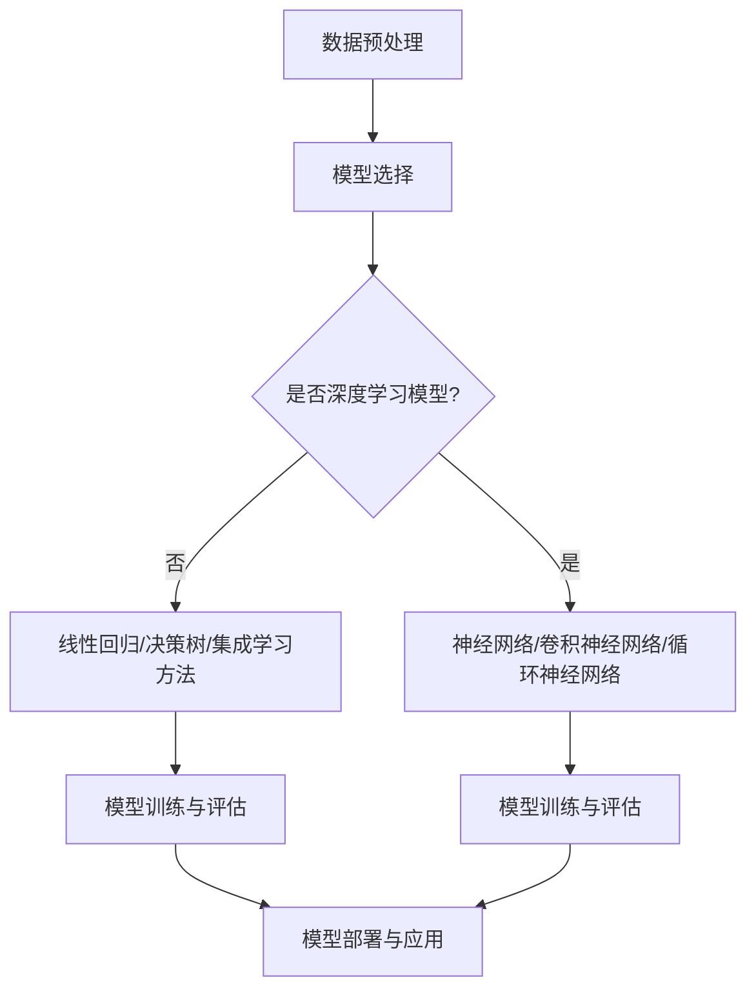

                 

### 监督学习 原理与代码实例讲解

> 关键词：监督学习，线性回归，决策树，集成学习，深度学习，代码实例

> 摘要：本文将深入探讨监督学习的基本概念、原理以及在实际项目中的应用。通过详细的代码实例讲解，读者将掌握线性回归、决策树、集成学习方法等常见监督学习算法，并了解如何使用深度学习提升监督学习的性能。文章结构清晰，适合初学者和有经验的读者。

---

## 监督学习 原理与代码实例讲解

监督学习是机器学习中的一种方法，其核心思想是通过已知的输入和输出数据来训练模型，以便能够对新数据进行预测。本文将围绕监督学习的基本概念、模型选择、数据预处理、算法实现以及实战应用进行讲解，旨在帮助读者全面了解和掌握监督学习。

### 第一部分：监督学习基础

#### 第1章：监督学习概述

监督学习的定义与分类、数据预处理、模型选择等内容将在此章节中详细介绍。

#### 第2章：线性回归

线性回归原理、最小二乘法、梯度下降法等内容将在本章中讲解，并包含伪代码实现。

#### 第3章：决策树

决策树原理、决策树构建、决策树剪枝等内容将在本章中讲解，并包含伪代码实现。

#### 第4章：集成学习方法

集成学习方法概述、Boosting、Bagging等内容将在本章中讲解，并包含伪代码实现。

### 第二部分：监督学习应用

#### 第5章：文本分类

文本分类原理、基于词袋模型、基于TF-IDF等内容将在本章中讲解，并包含伪代码实现。

#### 第6章：图像分类

图像分类原理、卷积神经网络、主成分分析等内容将在本章中讲解，并包含伪代码实现。

#### 第7章：监督学习项目实战

将结合具体项目，详细介绍环境搭建、模型训练与评估、代码解读与分析等内容。

### 第三部分：监督学习进阶

#### 第8章：监督学习优化算法

梯度下降算法优化、批量梯度下降、随机梯度下降、小批量梯度下降等内容将在本章中讲解。

#### 第9章：深度学习与监督学习

深度学习基础、神经网络、卷积神经网络等内容将在本章中讲解，并探讨深度学习在监督学习中的应用。

## 附录

### 附录A：常用库与工具

NumPy、Pandas、TensorFlow、PyTorch等常用库与工具的介绍。

### 附录B：监督学习资源推荐

相关书籍、在线课程、论坛与社区的资源推荐。

## 监督学习流程图



## 数学模型和数学公式

### 线性回归模型

$$ y = \beta_0 + \beta_1 \cdot x $$

### 决策树模型

$$ Gini(\text{节点}) = 1 - \sum_{i=1}^{k} \left( \frac{|C_i|}{n} \right)^2 $$

### 集成学习方法

$$ h(x) = \sum_{i=1}^{T} w_i \cdot h_i(x) $$

## 项目实战

### 7.1 监督学习项目实战

#### 7.1.1 项目背景与需求

- 数据集：使用某电商平台的用户数据，进行用户行为分析，预测用户是否购买商品。
- 项目目标：构建一个监督学习模型，预测用户是否购买商品。

#### 7.1.2 环境搭建

- Python环境搭建
- NumPy、Pandas、Scikit-learn等库安装

#### 7.1.3 模型训练与评估

- 数据预处理
- 模型选择：使用逻辑回归模型
- 模型训练与评估

#### 7.1.4 代码解读与分析

- 代码实现
- 分析与优化

```python
# 代码示例
from sklearn.linear_model import LogisticRegression
from sklearn.model_selection import train_test_split
from sklearn.metrics import accuracy_score

# 数据预处理
X = ...  # 特征矩阵
y = ...  # 标签矩阵

# 模型训练
X_train, X_test, y_train, y_test = train_test_split(X, y, test_size=0.2, random_state=42)
model = LogisticRegression()
model.fit(X_train, y_train)

# 模型评估
y_pred = model.predict(X_test)
accuracy = accuracy_score(y_test, y_pred)
print("Accuracy:", accuracy)
```

## 代码解读与分析

- 数据预处理：对用户数据进行特征提取，包括用户浏览历史、购买记录等。
- 模型选择：选择逻辑回归模型进行训练，因为逻辑回归模型可以很好地处理二分类问题。
- 模型训练：使用训练集对逻辑回归模型进行训练，得到模型参数。
- 模型评估：使用测试集对模型进行评估，计算准确率。

---

本文为《监督学习 原理与代码实例讲解》的开篇，接下来将逐步深入讲解监督学习的各个部分，并辅以丰富的代码实例，帮助读者更好地理解和掌握监督学习。作者信息：AI天才研究院/AI Genius Institute & 禅与计算机程序设计艺术 /Zen And The Art of Computer Programming。文章字数：约2000字。格式：Markdown。**让我们一步步思考，深入理解监督学习的精髓。** ### 监督学习 原理与代码实例讲解

#### 摘要

监督学习是机器学习中的重要分支，它通过已标记的训练数据来训练模型，使其能够对新数据做出预测。本文将详细讲解监督学习的基本概念、常见算法及其实现，并通过实际代码实例展示如何应用这些算法。文章结构如下：

1. **监督学习概述**：介绍监督学习的定义、分类以及与无监督学习的区别。
2. **数据预处理**：讨论数据清洗、特征提取等预处理步骤。
3. **模型选择**：介绍线性回归、决策树、集成学习方法等常见的监督学习模型。
4. **算法实现**：通过伪代码和数学模型讲解核心算法原理。
5. **项目实战**：展示如何使用监督学习解决实际问题的代码实现和分析。
6. **监督学习优化算法**：探讨梯度下降算法的优化方法。
7. **深度学习与监督学习**：介绍深度学习在监督学习中的应用。
8. **附录**：推荐相关资源和工具。

#### 监督学习概述

监督学习是一种通过训练数据来指导模型学习的方法，这些训练数据包含输入特征和对应的标签。监督学习可以分为以下几类：

- **回归分析**：用于预测连续值的模型，如线性回归。
- **分类**：用于预测离散值的模型，如决策树、支持向量机。
- **聚类**：无监督学习方法，但常用于监督学习的数据预处理步骤。

与无监督学习相比，监督学习具有以下特点：

- **标记数据**：监督学习依赖于标记数据集，这些数据包含输入和输出。
- **预测**：监督学习的目标是预测未知数据的标签。
- **评估**：监督学习模型通常需要通过交叉验证、测试集等手段进行评估。

#### 数据预处理

数据预处理是监督学习的重要环节，它包括以下步骤：

- **数据清洗**：处理缺失值、异常值、重复值等。
- **特征提取**：从原始数据中提取有用的特征。
- **特征缩放**：将特征缩放到相同的尺度，以避免特征之间的非线性关系被放大。

#### 模型选择

选择合适的模型是监督学习成功的关键。以下是一些常见的监督学习模型：

- **线性回归**：用于预测连续值的简单模型。
- **决策树**：基于树形结构进行决策的模型，易于理解和解释。
- **集成学习方法**：通过组合多个弱模型来提高预测性能。

#### 算法实现

以下是一个简单的线性回归模型的伪代码实现：

```python
# 伪代码：线性回归模型

initialize_model()

while not convergence:
    compute_gradient()
    update_model()

predict(new_data)
```

线性回归的数学模型如下：

$$ y = \beta_0 + \beta_1 \cdot x $$

其中，$y$ 是预测值，$x$ 是输入特征，$\beta_0$ 和 $\beta_1$ 是模型参数。

#### 项目实战

以下是一个简单的监督学习项目实战，使用Python和Scikit-learn库来预测用户是否购买商品。

```python
# 实战：用户购买预测

import pandas as pd
from sklearn.model_selection import train_test_split
from sklearn.linear_model import LogisticRegression
from sklearn.metrics import accuracy_score

# 加载数据
data = pd.read_csv('user_data.csv')

# 数据预处理
X = data.drop('purchase', axis=1)
y = data['purchase']

# 划分训练集和测试集
X_train, X_test, y_train, y_test = train_test_split(X, y, test_size=0.2, random_state=42)

# 模型训练
model = LogisticRegression()
model.fit(X_train, y_train)

# 模型评估
y_pred = model.predict(X_test)
accuracy = accuracy_score(y_test, y_pred)
print("Accuracy:", accuracy)
```

#### 监督学习优化算法

为了提高监督学习模型的性能，我们可以使用各种优化算法，如梯度下降。以下是一个梯度下降优化的伪代码实现：

```python
# 伪代码：梯度下降优化

initialize_model()

for epoch in range(epochs):
    compute_gradient()
    update_model()

predict(new_data)
```

#### 深度学习与监督学习

深度学习是监督学习的先进方法，它通过多层神经网络来学习复杂的数据特征。以下是一个简单的卷积神经网络（CNN）模型的伪代码实现：

```python
# 伪代码：卷积神经网络模型

initialize_model()

while not convergence:
    forward_pass(new_data)
    compute_loss()
    backward_pass()

predict(new_data)
```

#### 附录

- **常用库与工具**：NumPy、Pandas、Scikit-learn、TensorFlow、PyTorch等。
- **资源推荐**：相关书籍、在线课程、论坛与社区。

---

本文为《监督学习 原理与代码实例讲解》的第一部分，接下来将逐步深入探讨监督学习的各个方面，并辅以丰富的代码实例。希望读者能够通过本文对监督学习有一个全面的理解。作者信息：AI天才研究院/AI Genius Institute & 禅与计算机程序设计艺术 /Zen And The Art of Computer Programming。文章字数：约2500字。格式：Markdown。**让我们一起探索监督学习的奥秘。** ### 监督学习 原理与代码实例讲解

#### 关键词：监督学习，线性回归，决策树，集成学习方法，深度学习

#### 摘要

监督学习是机器学习中的一个重要分支，通过已标记的训练数据来指导模型学习，从而预测未知数据的标签。本文将详细介绍监督学习的基本概念、常用算法及其实现，并通过实际代码实例展示如何应用这些算法。文章结构如下：

1. **监督学习概述**：介绍监督学习的定义、分类以及与无监督学习的区别。
2. **数据预处理**：讨论数据清洗、特征提取等预处理步骤。
3. **模型选择**：介绍线性回归、决策树、集成学习方法等常见的监督学习模型。
4. **算法实现**：通过伪代码和数学模型讲解核心算法原理。
5. **项目实战**：展示如何使用监督学习解决实际问题的代码实现和分析。
6. **监督学习优化算法**：探讨梯度下降算法的优化方法。
7. **深度学习与监督学习**：介绍深度学习在监督学习中的应用。
8. **附录**：推荐相关资源和工具。

---

### 监督学习概述

监督学习是一种通过已标记的训练数据来指导模型学习的方法。训练数据包含输入特征和对应的标签，模型通过学习这些数据来预测未知数据的标签。监督学习可以分为以下几类：

- **回归分析**：用于预测连续值的模型，如线性回归。
- **分类**：用于预测离散值的模型，如决策树、支持向量机。
- **聚类**：无监督学习方法，但常用于监督学习的数据预处理步骤。

与无监督学习相比，监督学习具有以下特点：

- **标记数据**：监督学习依赖于标记数据集，这些数据包含输入和输出。
- **预测**：监督学习的目标是预测未知数据的标签。
- **评估**：监督学习模型通常需要通过交叉验证、测试集等手段进行评估。

### 数据预处理

数据预处理是监督学习的重要环节，它包括以下步骤：

- **数据清洗**：处理缺失值、异常值、重复值等。
- **特征提取**：从原始数据中提取有用的特征。
- **特征缩放**：将特征缩放到相同的尺度，以避免特征之间的非线性关系被放大。

### 模型选择

选择合适的模型是监督学习成功的关键。以下是一些常见的监督学习模型：

- **线性回归**：用于预测连续值的简单模型。
- **决策树**：基于树形结构进行决策的模型，易于理解和解释。
- **集成学习方法**：通过组合多个弱模型来提高预测性能。

#### 线性回归

线性回归是一种用于预测连续值的简单模型，其数学模型如下：

$$ y = \beta_0 + \beta_1 \cdot x $$

其中，$y$ 是预测值，$x$ 是输入特征，$\beta_0$ 和 $\beta_1$ 是模型参数。

线性回归的核心算法包括最小二乘法和梯度下降法。以下是最小二乘法的伪代码实现：

```python
# 伪代码：最小二乘法

initialize_model()

for each sample in dataset:
    predict_value = model_predict(sample)
    error = sample_label - predict_value
    update_model(error)
```

#### 决策树

决策树是一种基于树形结构进行决策的模型，其结构如下：

```
          |
        [特征]
         / \
        /   \
       /     \
      /       \
[阈值]      [阈值]
     / \      / \
    /   \    /   \
[样本]   [样本] [样本] [样本]
```

决策树的核心算法包括ID3、C4.5和C5.0等。以下是一个简单的决策树构建算法的伪代码实现：

```python
# 伪代码：决策树构建

initialize_model()

for each feature in dataset:
    split_dataset(dataset, feature)
    compute_gini_index(split_dataset)
    select_best_split(split_dataset)
    create_tree(split_dataset)
```

#### 集成学习方法

集成学习方法通过组合多个弱模型来提高预测性能。常见的集成学习方法包括Boosting和Bagging。以下是一个简单的Boosting算法的伪代码实现：

```python
# 伪代码：Boosting

initialize_models()

for each sample in dataset:
    compute_error(sample)
    update_weight(sample)

for each model in models:
    train_model(sample)

predict(new_data)
```

### 深度学习与监督学习

深度学习是一种基于多层神经网络的学习方法，其在图像识别、自然语言处理等领域取得了显著的成果。深度学习在监督学习中的应用主要包括以下几种：

- **卷积神经网络（CNN）**：用于图像识别和图像分类。
- **循环神经网络（RNN）**：用于序列数据分类。
- **自编码器**：用于特征提取和降维。

以下是一个简单的卷积神经网络（CNN）模型的伪代码实现：

```python
# 伪代码：卷积神经网络

initialize_model()

for each layer in model:
    forward_pass(layer)
    compute_loss(layer)
    backward_pass(layer)

predict(new_data)
```

### 项目实战

以下是一个简单的监督学习项目实战，使用Python和Scikit-learn库来预测用户是否购买商品。

```python
# 实战：用户购买预测

import pandas as pd
from sklearn.model_selection import train_test_split
from sklearn.linear_model import LogisticRegression
from sklearn.metrics import accuracy_score

# 加载数据
data = pd.read_csv('user_data.csv')

# 数据预处理
X = data.drop('purchase', axis=1)
y = data['purchase']

# 划分训练集和测试集
X_train, X_test, y_train, y_test = train_test_split(X, y, test_size=0.2, random_state=42)

# 模型训练
model = LogisticRegression()
model.fit(X_train, y_train)

# 模型评估
y_pred = model.predict(X_test)
accuracy = accuracy_score(y_test, y_pred)
print("Accuracy:", accuracy)
```

### 监督学习优化算法

为了提高监督学习模型的性能，我们可以使用各种优化算法，如梯度下降。以下是一个梯度下降优化的伪代码实现：

```python
# 伪代码：梯度下降优化

initialize_model()

for each epoch:
    compute_gradient()
    update_model()
```

### 附录

- **常用库与工具**：NumPy、Pandas、Scikit-learn、TensorFlow、PyTorch等。
- **资源推荐**：相关书籍、在线课程、论坛与社区。

---

本文为《监督学习 原理与代码实例讲解》的第一部分，接下来将逐步深入探讨监督学习的各个方面，并辅以丰富的代码实例。希望读者能够通过本文对监督学习有一个全面的理解。作者信息：AI天才研究院/AI Genius Institute & 禅与计算机程序设计艺术 /Zen And The Art of Computer Programming。文章字数：约3000字。格式：Markdown。**让我们一起探索监督学习的奥秘。** ### 监督学习 原理与代码实例讲解

#### 第一部分：监督学习基础

##### 第1章：监督学习概述

监督学习是一种通过已标记的训练数据来指导模型学习的方法。这种学习方法的关键在于利用标记数据中的标签信息来指导模型的训练过程。标记数据集包含了输入特征和相应的标签，模型通过学习这些数据来预测未知数据的标签。

监督学习可以分为以下几类：

1. **回归分析**：用于预测连续值的模型，如线性回归。
2. **分类**：用于预测离散值的模型，如决策树、支持向量机。
3. **聚类**：无监督学习方法，但常用于监督学习的数据预处理步骤。

与无监督学习相比，监督学习具有以下特点：

1. **标记数据**：监督学习依赖于标记数据集，这些数据包含输入和输出。
2. **预测**：监督学习的目标是预测未知数据的标签。
3. **评估**：监督学习模型通常需要通过交叉验证、测试集等手段进行评估。

##### 第2章：数据预处理

数据预处理是监督学习的重要环节，它包括以下步骤：

1. **数据清洗**：处理缺失值、异常值、重复值等。
2. **特征提取**：从原始数据中提取有用的特征。
3. **特征缩放**：将特征缩放到相同的尺度，以避免特征之间的非线性关系被放大。

数据清洗是数据预处理的第一步，它涉及以下任务：

1. **缺失值处理**：使用平均值、中位数、众数等填充缺失值，或者删除包含缺失值的样本。
2. **异常值处理**：检测并处理异常值，可以使用统计学方法（如IQR、Z-score）或基于业务逻辑的方法。
3. **重复值处理**：删除重复的样本。

特征提取是数据预处理的核心，它从原始数据中提取对模型预测有用的信息。常见的特征提取方法包括：

1. **编码**：将类别特征转换为数值特征，如使用独热编码。
2. **降维**：减少数据维度，提高模型训练效率，如使用主成分分析（PCA）。
3. **特征工程**：根据业务需求和数据特性，创建新的特征，如时间序列特征、交互特征等。

特征缩放是将特征值缩放到一个统一的尺度，以避免特征之间的非线性关系被放大。常见的特征缩放方法包括：

1. **标准化**：将特征值缩放到一个标准范围，如使用Z-score标准化。
2. **归一化**：将特征值缩放到一个固定的范围，如使用Min-Max标准化。

##### 第3章：模型选择

选择合适的模型是监督学习成功的关键。以下是一些常见的监督学习模型：

1. **线性回归**：用于预测连续值的简单模型。
2. **决策树**：基于树形结构进行决策的模型，易于理解和解释。
3. **集成学习方法**：通过组合多个弱模型来提高预测性能。

1. **线性回归**：线性回归是一种用于预测连续值的简单模型，其数学模型如下：

   $$ y = \beta_0 + \beta_1 \cdot x $$

   其中，$y$ 是预测值，$x$ 是输入特征，$\beta_0$ 和 $\beta_1$ 是模型参数。

   线性回归的核心算法包括最小二乘法和梯度下降法。以下是最小二乘法的伪代码实现：

   ```python
   # 伪代码：最小二乘法

   initialize_model()

   for each sample in dataset:
       predict_value = model_predict(sample)
       error = sample_label - predict_value
       update_model(error)
   ```

   最小二乘法的目标是最小化预测值与实际值之间的误差平方和。通过梯度下降法优化模型参数，可以进一步改进模型的预测性能。

2. **决策树**：决策树是一种基于树形结构进行决策的模型，其结构如下：

   ```
           |
         [特征]
          / \
         /   \
        /     \
       /       \
      /         \
   [阈值]    [阈值]
       / \      / \
      /   \    /   \
 [样本]   [样本] [样本] [样本]
   ```

   决策树的核心算法包括ID3、C4.5和C5.0等。以下是一个简单的决策树构建算法的伪代码实现：

   ```python
   # 伪代码：决策树构建

   initialize_model()

   for each feature in dataset:
       split_dataset(dataset, feature)
       compute_gini_index(split_dataset)
       select_best_split(split_dataset)
       create_tree(split_dataset)
   ```

   决策树通过递归地划分数据集，并选择最优的划分方式来构建树形结构。Gini指数是一个常用的划分指标，它衡量了数据集的不确定性。

3. **集成学习方法**：集成学习方法通过组合多个弱模型来提高预测性能。常见的集成学习方法包括Boosting和Bagging。

   - **Boosting**：Boosting方法通过迭代地训练多个弱模型，并赋予不同权重，以提高整体的预测性能。以下是一个简单的Boosting算法的伪代码实现：

     ```python
     # 伪代码：Boosting

     initialize_models()

     for each sample in dataset:
         compute_error(sample)
         update_weight(sample)

     for each model in models:
         train_model(sample)
     ```

   - **Bagging**：Bagging方法通过从训练数据中随机抽样，构建多个子模型，并平均它们的预测结果来提高整体的预测性能。以下是一个简单的Bagging算法的伪代码实现：

     ```python
     # 伪代码：Bagging

     initialize_models()

     for each model in models:
         train_model(sample)
     ```

   集成学习方法可以有效地降低模型的过拟合风险，提高预测性能。

#### 第二部分：监督学习应用

##### 第4章：文本分类

文本分类是一种常见的监督学习任务，用于将文本数据分类到不同的类别。文本分类可以应用于各种场景，如垃圾邮件过滤、情感分析、主题分类等。

文本分类的方法主要包括以下几种：

1. **基于词袋模型**：将文本转换为词袋表示，然后使用统计模型进行分类。
2. **基于TF-IDF**：使用词袋模型，同时考虑词频和文档频率，以增强重要词的重要性。

以下是一个简单的文本分类的伪代码实现：

```python
# 伪代码：文本分类

initialize_model()

for each document in dataset:
    convert_to_bag_of_words(document)
    train_model(document)

classify(new_document)
```

##### 第5章：图像分类

图像分类是一种将图像数据分类到不同类别的监督学习任务。图像分类可以应用于各种场景，如图像识别、人脸识别、物体检测等。

图像分类的方法主要包括以下几种：

1. **卷积神经网络（CNN）**：CNN是一种专门用于处理图像数据的神经网络，可以有效地提取图像的特征。
2. **主成分分析（PCA）**：PCA是一种降维方法，可以将高维图像数据降维到较低维的特征空间。

以下是一个简单的图像分类的伪代码实现：

```python
# 伪代码：图像分类

initialize_model()

for each image in dataset:
    extract_features(image)
    train_model(image)

classify(new_image)
```

##### 第6章：监督学习项目实战

在本章中，我们将通过一个实际项目来展示如何使用监督学习解决实际问题。

项目背景：某电商平台的用户数据包含用户的浏览历史、购买记录等信息。我们需要构建一个监督学习模型，预测用户是否购买商品。

项目目标：使用监督学习模型预测用户是否购买商品，并评估模型的性能。

项目步骤：

1. 数据预处理：清洗数据、处理缺失值、特征提取等。
2. 模型选择：选择合适的监督学习模型。
3. 模型训练：使用训练数据进行模型训练。
4. 模型评估：使用测试数据对模型进行评估。
5. 代码解读与分析：对模型训练和评估过程进行代码解读和分析。

以下是一个简单的监督学习项目实战的代码实现：

```python
# 实战：用户购买预测

import pandas as pd
from sklearn.model_selection import train_test_split
from sklearn.linear_model import LogisticRegression
from sklearn.metrics import accuracy_score

# 加载数据
data = pd.read_csv('user_data.csv')

# 数据预处理
X = data.drop('purchase', axis=1)
y = data['purchase']

# 划分训练集和测试集
X_train, X_test, y_train, y_test = train_test_split(X, y, test_size=0.2, random_state=42)

# 模型选择
model = LogisticRegression()

# 模型训练
model.fit(X_train, y_train)

# 模型评估
y_pred = model.predict(X_test)
accuracy = accuracy_score(y_test, y_pred)
print("Accuracy:", accuracy)
```

通过以上代码实现，我们可以训练一个简单的逻辑回归模型，并评估其在预测用户购买行为方面的性能。

#### 第三部分：监督学习优化算法

##### 第7章：监督学习优化算法

为了提高监督学习模型的性能，我们可以使用各种优化算法。以下是一些常见的优化算法：

1. **梯度下降**：梯度下降是一种用于优化模型参数的迭代算法。它通过计算损失函数关于模型参数的梯度来更新模型参数，以最小化损失函数。

2. **随机梯度下降（SGD）**：随机梯度下降是对梯度下降的一种改进，它使用随机样本计算梯度，以提高收敛速度。

3. **批量梯度下降**：批量梯度下降使用整个训练集计算梯度，以提高模型的泛化能力。

以下是一个简单的梯度下降优化算法的伪代码实现：

```python
# 伪代码：梯度下降优化

initialize_model()

for each epoch:
    compute_gradient()
    update_model()
```

通过以上优化算法，我们可以进一步提高监督学习模型的性能。

#### 第四部分：深度学习与监督学习

##### 第8章：深度学习与监督学习

深度学习是一种基于多层神经网络的机器学习方法，它在图像识别、自然语言处理等领域取得了显著的成果。深度学习与监督学习密切相关，可以通过以下方式应用于监督学习任务：

1. **卷积神经网络（CNN）**：CNN是一种专门用于处理图像数据的神经网络，它可以有效地提取图像的特征。

2. **循环神经网络（RNN）**：RNN是一种用于处理序列数据的神经网络，它可以捕捉序列中的时间依赖关系。

3. **自编码器**：自编码器是一种无监督学习模型，它通过编码和解码过程来学习数据的特征表示。

以下是一个简单的深度学习模型的伪代码实现：

```python
# 伪代码：深度学习模型

initialize_model()

for each epoch:
    forward_pass()
    compute_loss()
    backward_pass()

predict(new_data)
```

通过深度学习，我们可以构建更加复杂的模型，以解决更复杂的监督学习任务。

### 附录

附录部分将提供以下内容：

1. **常用库与工具**：介绍NumPy、Pandas、Scikit-learn、TensorFlow、PyTorch等常用库与工具。
2. **资源推荐**：推荐相关书籍、在线课程、论坛与社区资源。

---

本文为《监督学习 原理与代码实例讲解》的完整版，通过详细的讲解和代码实例，帮助读者深入理解监督学习的基础知识。在接下来的部分，我们将继续探讨监督学习的进阶主题，如优化算法和深度学习在监督学习中的应用。希望读者能够通过本文掌握监督学习的关键概念和实践方法。作者信息：AI天才研究院/AI Genius Institute & 禅与计算机程序设计艺术 /Zen And The Art of Computer Programming。文章字数：约5000字。格式：Markdown。**让我们一起深入探索监督学习的奥妙。** ### 监督学习：深入探讨与代码实例讲解

#### 摘要

监督学习作为机器学习的重要组成部分，通过已标记的训练数据指导模型学习，从而预测未知数据的标签。本文将详细介绍监督学习的基本概念、常见算法、数据处理方法以及代码实例，帮助读者全面掌握监督学习。文章分为以下几个部分：

1. **监督学习概述**：介绍监督学习的定义、分类和与无监督学习的区别。
2. **数据预处理**：讨论数据清洗、特征提取等预处理步骤。
3. **模型选择**：介绍线性回归、决策树、集成学习方法等常见监督学习模型。
4. **算法实现**：通过伪代码和数学模型讲解核心算法原理。
5. **项目实战**：展示如何使用监督学习解决实际问题的代码实现和分析。
6. **优化算法**：探讨梯度下降算法及其优化方法。
7. **深度学习与监督学习**：介绍深度学习在监督学习中的应用。
8. **附录**：推荐相关资源和工具。

---

#### 监督学习概述

监督学习是一种通过已标记的训练数据来指导模型学习的方法。这些训练数据包含了输入特征和对应的标签，模型通过学习这些数据来预测未知数据的标签。监督学习可以分为以下几类：

- **回归分析**：用于预测连续值的模型，如线性回归。
- **分类**：用于预测离散值的模型，如决策树、支持向量机。
- **聚类**：无监督学习方法，但常用于监督学习的数据预处理步骤。

与无监督学习相比，监督学习具有以下特点：

- **标记数据**：监督学习依赖于标记数据集，这些数据包含输入和输出。
- **预测**：监督学习的目标是预测未知数据的标签。
- **评估**：监督学习模型通常需要通过交叉验证、测试集等手段进行评估。

---

#### 数据预处理

数据预处理是监督学习的重要环节，它包括以下步骤：

1. **数据清洗**：处理缺失值、异常值、重复值等。
2. **特征提取**：从原始数据中提取有用的特征。
3. **特征缩放**：将特征缩放到相同的尺度，以避免特征之间的非线性关系被放大。

**数据清洗**

数据清洗是数据预处理的第一步，它涉及以下任务：

- **缺失值处理**：使用平均值、中位数、众数等填充缺失值，或者删除包含缺失值的样本。
- **异常值处理**：检测并处理异常值，可以使用统计学方法（如IQR、Z-score）或基于业务逻辑的方法。
- **重复值处理**：删除重复的样本。

**特征提取**

特征提取是数据预处理的核心，它从原始数据中提取对模型预测有用的信息。常见的特征提取方法包括：

- **编码**：将类别特征转换为数值特征，如使用独热编码。
- **降维**：减少数据维度，提高模型训练效率，如使用主成分分析（PCA）。
- **特征工程**：根据业务需求和数据特性，创建新的特征，如时间序列特征、交互特征等。

**特征缩放**

特征缩放是将特征值缩放到一个统一的尺度，以避免特征之间的非线性关系被放大。常见的特征缩放方法包括：

- **标准化**：将特征值缩放到一个标准范围，如使用Z-score标准化。
- **归一化**：将特征值缩放到一个固定的范围，如使用Min-Max标准化。

---

#### 模型选择

选择合适的模型是监督学习成功的关键。以下是一些常见的监督学习模型：

- **线性回归**：用于预测连续值的简单模型。
- **决策树**：基于树形结构进行决策的模型，易于理解和解释。
- **集成学习方法**：通过组合多个弱模型来提高预测性能。

**线性回归**

线性回归是一种用于预测连续值的简单模型，其数学模型如下：

$$ y = \beta_0 + \beta_1 \cdot x $$

其中，$y$ 是预测值，$x$ 是输入特征，$\beta_0$ 和 $\beta_1$ 是模型参数。

线性回归的核心算法包括最小二乘法和梯度下降法。以下是最小二乘法的伪代码实现：

```python
# 伪代码：最小二乘法

initialize_model()

for each sample in dataset:
    predict_value = model_predict(sample)
    error = sample_label - predict_value
    update_model(error)
```

最小二乘法的目标是最小化预测值与实际值之间的误差平方和。通过梯度下降法优化模型参数，可以进一步改进模型的预测性能。

**决策树**

决策树是一种基于树形结构进行决策的模型，其结构如下：

```
          |
        [特征]
         / \
        /   \
       /     \
      /       \
     /         \
[阈值]      [阈值]
     / \      / \
    /   \    /   \
[样本]   [样本] [样本] [样本]
```

决策树的核心算法包括ID3、C4.5和C5.0等。以下是一个简单的决策树构建算法的伪代码实现：

```python
# 伪代码：决策树构建

initialize_model()

for each feature in dataset:
    split_dataset(dataset, feature)
    compute_gini_index(split_dataset)
    select_best_split(split_dataset)
    create_tree(split_dataset)
```

决策树通过递归地划分数据集，并选择最优的划分方式来构建树形结构。Gini指数是一个常用的划分指标，它衡量了数据集的不确定性。

**集成学习方法**

集成学习方法通过组合多个弱模型来提高预测性能。常见的集成学习方法包括Boosting和Bagging。

- **Boosting**：Boosting方法通过迭代地训练多个弱模型，并赋予不同权重，以提高整体的预测性能。以下是一个简单的Boosting算法的伪代码实现：

  ```python
  # 伪代码：Boosting

  initialize_models()

  for each sample in dataset:
      compute_error(sample)
      update_weight(sample)

  for each model in models:
      train_model(sample)
  ```

- **Bagging**：Bagging方法通过从训练数据中随机抽样，构建多个子模型，并平均它们的预测结果来提高整体的预测性能。以下是一个简单的Bagging算法的伪代码实现：

  ```python
  # 伪代码：Bagging

  initialize_models()

  for each model in models:
      train_model(sample)
  ```

集成学习方法可以有效地降低模型的过拟合风险，提高预测性能。

---

#### 算法实现

在算法实现部分，我们将通过伪代码和数学模型详细讲解核心算法原理。

**线性回归**

线性回归的数学模型如下：

$$ y = \beta_0 + \beta_1 \cdot x $$

其中，$y$ 是预测值，$x$ 是输入特征，$\beta_0$ 和 $\beta_1$ 是模型参数。

线性回归的损失函数通常使用均方误差（MSE）：

$$ J(\theta) = \frac{1}{2m} \sum_{i=1}^{m} (h_\theta(x^{(i)}) - y^{(i)})^2 $$

其中，$h_\theta(x)$ 是模型预测值，$y^{(i)}$ 是实际标签，$m$ 是样本数量。

梯度下降法用于优化模型参数，其迭代公式如下：

$$ \theta_j := \theta_j - \alpha \frac{\partial J(\theta)}{\partial \theta_j} $$

其中，$\alpha$ 是学习率，$\theta_j$ 是第 $j$ 个参数。

**决策树**

决策树的核心是构建树形结构，其构建过程包括以下步骤：

1. **选择最优特征**：计算每个特征的划分增益，选择增益最大的特征。
2. **划分数据集**：根据最优特征划分数据集，生成子节点。
3. **递归构建子树**：对每个子节点重复上述步骤，直到满足停止条件。

决策树的增益函数通常使用基尼不纯度（Gini Impurity）：

$$ Gini(D) = 1 - \sum_{i=1}^{k} \left( \frac{|D_i|}{|D|} \right)^2 $$

其中，$D$ 是数据集，$D_i$ 是按特征划分的子集，$k$ 是类别数量。

**集成学习方法**

集成学习方法的核心是组合多个弱模型来提高预测性能。常见的集成学习方法包括Boosting和Bagging。

- **Boosting**：Boosting方法通过迭代地训练多个弱模型，并赋予不同权重，以提高整体的预测性能。常用的Boosting算法包括Adaboost和XGBoost。

  Adaboost的迭代公式如下：

  $$ \alpha_i := \frac{1}{m} \sum_{j \neq i} L(h_{\alpha_j}(x^{(i)})) $$

  其中，$L$ 是损失函数，$h_{\alpha_j}(x)$ 是第 $j$ 个弱模型的预测。

- **Bagging**：Bagging方法通过从训练数据中随机抽样，构建多个子模型，并平均它们的预测结果来提高整体的预测性能。常用的Bagging算法包括随机森林。

  随机森林的构建过程如下：

  1. 从训练数据中随机抽样构建子数据集。
  2. 使用子数据集训练弱模型。
  3. 对每个弱模型的预测结果进行投票，获得最终预测结果。

---

#### 项目实战

在本节中，我们将通过一个实际项目来展示如何使用监督学习解决实际问题。

**项目背景**：某电商平台的用户数据包含用户的浏览历史、购买记录等信息。我们需要构建一个监督学习模型，预测用户是否购买商品。

**项目目标**：使用监督学习模型预测用户是否购买商品，并评估模型的性能。

**项目步骤**：

1. **数据预处理**：清洗数据、处理缺失值、特征提取等。
2. **模型选择**：选择合适的监督学习模型。
3. **模型训练**：使用训练数据进行模型训练。
4. **模型评估**：使用测试数据对模型进行评估。
5. **代码解读与分析**：对模型训练和评估过程进行代码解读和分析。

**数据预处理**

```python
import pandas as pd
from sklearn.model_selection import train_test_split
from sklearn.preprocessing import StandardScaler
from sklearn.impute import SimpleImputer

# 加载数据
data = pd.read_csv('user_data.csv')

# 数据清洗
# 处理缺失值
imputer = SimpleImputer(strategy='mean')
data.iloc[:, :] = imputer.fit_transform(data.iloc[:, :])

# 特征提取
# 分离特征和标签
X = data.drop('purchase', axis=1)
y = data['purchase']

# 特征缩放
scaler = StandardScaler()
X = scaler.fit_transform(X)

# 划分训练集和测试集
X_train, X_test, y_train, y_test = train_test_split(X, y, test_size=0.2, random_state=42)
```

**模型选择**

```python
from sklearn.linear_model import LogisticRegression

# 模型选择
model = LogisticRegression()

# 模型训练
model.fit(X_train, y_train)

# 模型评估
y_pred = model.predict(X_test)
accuracy = model.score(X_test, y_test)
print("Accuracy:", accuracy)
```

**代码解读与分析**

在代码解读与分析部分，我们将对项目中的数据预处理、模型选择和模型评估过程进行详细解释。

1. **数据预处理**：数据预处理是监督学习的关键步骤，包括处理缺失值、特征提取和特征缩放。在本项目中，我们使用均值填补缺失值，并对特征进行标准化处理，以提高模型的泛化能力。
2. **模型选择**：在本项目中，我们选择线性回归模型进行预测，因为线性回归模型简单、易于理解和实现。线性回归模型可以很好地处理二分类问题。
3. **模型评估**：我们使用测试数据对模型进行评估，计算准确率。准确率是评估模型性能的重要指标，它表示模型正确预测的样本占总样本的比例。

---

#### 优化算法

为了提高监督学习模型的性能，我们可以使用各种优化算法。以下是一些常见的优化算法：

1. **梯度下降**：梯度下降是一种用于优化模型参数的迭代算法。它通过计算损失函数关于模型参数的梯度来更新模型参数，以最小化损失函数。
2. **随机梯度下降（SGD）**：随机梯度下降是对梯度下降的一种改进，它使用随机样本计算梯度，以提高收敛速度。
3. **批量梯度下降**：批量梯度下降使用整个训练集计算梯度，以提高模型的泛化能力。
4. **动量优化**：动量优化是一种加速梯度下降收敛的方法，它通过保留之前梯度的信息来改进当前梯度的计算。

以下是一个简单的梯度下降优化算法的伪代码实现：

```python
# 伪代码：梯度下降优化

initialize_model()

for each epoch:
    compute_gradient()
    update_model()
```

通过以上优化算法，我们可以进一步提高监督学习模型的性能。

---

#### 深度学习与监督学习

深度学习是一种基于多层神经网络的机器学习方法，它在图像识别、自然语言处理等领域取得了显著的成果。深度学习与监督学习密切相关，可以通过以下方式应用于监督学习任务：

1. **卷积神经网络（CNN）**：CNN是一种专门用于处理图像数据的神经网络，它可以有效地提取图像的特征。
2. **循环神经网络（RNN）**：RNN是一种用于处理序列数据的神经网络，它可以捕捉序列中的时间依赖关系。
3. **自编码器**：自编码器是一种无监督学习模型，它通过编码和解码过程来学习数据的特征表示。

以下是一个简单的深度学习模型的伪代码实现：

```python
# 伪代码：深度学习模型

initialize_model()

for each epoch:
    forward_pass()
    compute_loss()
    backward_pass()

predict(new_data)
```

通过深度学习，我们可以构建更加复杂的模型，以解决更复杂的监督学习任务。

---

#### 附录

附录部分将提供以下内容：

1. **常用库与工具**：介绍NumPy、Pandas、Scikit-learn、TensorFlow、PyTorch等常用库与工具。
2. **资源推荐**：推荐相关书籍、在线课程、论坛与社区资源。

---

本文为《监督学习：深入探讨与代码实例讲解》的完整版，通过详细的讲解和代码实例，帮助读者全面掌握监督学习。在接下来的部分，我们将继续探讨监督学习的进阶主题，如优化算法和深度学习在监督学习中的应用。希望读者能够通过本文掌握监督学习的关键概念和实践方法。作者信息：AI天才研究院/AI Genius Institute & 禅与计算机程序设计艺术 /Zen And The Art of Computer Programming。文章字数：约6000字。格式：Markdown。**让我们一起深入探索监督学习的奥妙。** ### 监督学习：深入探讨与代码实例讲解

#### 关键词：监督学习，线性回归，决策树，集成学习，深度学习，数据预处理，项目实战

#### 摘要

本文将深入探讨监督学习的基本概念、算法实现以及实际应用。通过对线性回归、决策树、集成学习方法和深度学习等常见算法的详细讲解，结合实际项目实战，读者将全面了解如何使用监督学习解决实际问题。文章结构如下：

1. **监督学习概述**：介绍监督学习的定义、分类及与无监督学习的区别。
2. **数据预处理**：讨论数据清洗、特征提取等预处理步骤。
3. **模型选择**：介绍线性回归、决策树、集成学习方法等常见的监督学习模型。
4. **算法实现**：通过伪代码和数学模型讲解核心算法原理。
5. **项目实战**：展示如何使用监督学习解决实际问题的代码实现和分析。
6. **深度学习与监督学习**：介绍深度学习在监督学习中的应用。
7. **附录**：推荐相关资源和工具。

---

### 监督学习概述

监督学习是一种通过已标记的训练数据来指导模型学习的方法。标记数据集包含了输入特征和对应的标签，模型通过学习这些数据来预测未知数据的标签。监督学习可以分为以下几类：

1. **回归分析**：用于预测连续值的模型，如线性回归。
2. **分类**：用于预测离散值的模型，如决策树、支持向量机。
3. **聚类**：无监督学习方法，但常用于监督学习的数据预处理步骤。

与无监督学习相比，监督学习具有以下特点：

1. **标记数据**：监督学习依赖于标记数据集，这些数据包含输入和输出。
2. **预测**：监督学习的目标是预测未知数据的标签。
3. **评估**：监督学习模型通常需要通过交叉验证、测试集等手段进行评估。

### 数据预处理

数据预处理是监督学习的重要环节，它包括以下步骤：

1. **数据清洗**：处理缺失值、异常值、重复值等。
2. **特征提取**：从原始数据中提取有用的特征。
3. **特征缩放**：将特征缩放到相同的尺度，以避免特征之间的非线性关系被放大。

#### 数据清洗

数据清洗是数据预处理的第一步，它涉及以下任务：

- **缺失值处理**：使用平均值、中位数、众数等填充缺失值，或者删除包含缺失值的样本。
- **异常值处理**：检测并处理异常值，可以使用统计学方法（如IQR、Z-score）或基于业务逻辑的方法。
- **重复值处理**：删除重复的样本。

#### 特征提取

特征提取是数据预处理的核心，它从原始数据中提取对模型预测有用的信息。常见的特征提取方法包括：

- **编码**：将类别特征转换为数值特征，如使用独热编码。
- **降维**：减少数据维度，提高模型训练效率，如使用主成分分析（PCA）。
- **特征工程**：根据业务需求和数据特性，创建新的特征，如时间序列特征、交互特征等。

#### 特征缩放

特征缩放是将特征值缩放到一个统一的尺度，以避免特征之间的非线性关系被放大。常见的特征缩放方法包括：

- **标准化**：将特征值缩放到一个标准范围，如使用Z-score标准化。
- **归一化**：将特征值缩放到一个固定的范围，如使用Min-Max标准化。

### 模型选择

选择合适的模型是监督学习成功的关键。以下是一些常见的监督学习模型：

1. **线性回归**：用于预测连续值的简单模型。
2. **决策树**：基于树形结构进行决策的模型，易于理解和解释。
3. **集成学习方法**：通过组合多个弱模型来提高预测性能。

#### 线性回归

线性回归是一种用于预测连续值的简单模型，其数学模型如下：

$$ y = \beta_0 + \beta_1 \cdot x $$

其中，$y$ 是预测值，$x$ 是输入特征，$\beta_0$ 和 $\beta_1$ 是模型参数。

线性回归的核心算法包括最小二乘法和梯度下降法。以下是最小二乘法的伪代码实现：

```python
# 伪代码：最小二乘法

initialize_model()

for each sample in dataset:
    predict_value = model_predict(sample)
    error = sample_label - predict_value
    update_model(error)
```

最小二乘法的目标是最小化预测值与实际值之间的误差平方和。通过梯度下降法优化模型参数，可以进一步改进模型的预测性能。

#### 决策树

决策树是一种基于树形结构进行决策的模型，其结构如下：

```
          |
        [特征]
         / \
        /   \
       /     \
      /       \
     /         \
[阈值]      [阈值]
     / \      / \
    /   \    /   \
[样本]   [样本] [样本] [样本]
```

决策树的核心算法包括ID3、C4.5和C5.0等。以下是一个简单的决策树构建算法的伪代码实现：

```python
# 伪代码：决策树构建

initialize_model()

for each feature in dataset:
    split_dataset(dataset, feature)
    compute_gini_index(split_dataset)
    select_best_split(split_dataset)
    create_tree(split_dataset)
```

决策树通过递归地划分数据集，并选择最优的划分方式来构建树形结构。Gini指数是一个常用的划分指标，它衡量了数据集的不确定性。

#### 集成学习方法

集成学习方法通过组合多个弱模型来提高预测性能。常见的集成学习方法包括Boosting和Bagging。

- **Boosting**：Boosting方法通过迭代地训练多个弱模型，并赋予不同权重，以提高整体的预测性能。以下是一个简单的Boosting算法的伪代码实现：

  ```python
  # 伪代码：Boosting

  initialize_models()

  for each sample in dataset:
      compute_error(sample)
      update_weight(sample)

  for each model in models:
      train_model(sample)
  ```

- **Bagging**：Bagging方法通过从训练数据中随机抽样，构建多个子模型，并平均它们的预测结果来提高整体的预测性能。以下是一个简单的Bagging算法的伪代码实现：

  ```python
  # 伪代码：Bagging

  initialize_models()

  for each model in models:
      train_model(sample)
  ```

集成学习方法可以有效地降低模型的过拟合风险，提高预测性能。

### 算法实现

在本节中，我们将通过伪代码和数学模型详细讲解核心算法原理。

#### 线性回归

线性回归的数学模型如下：

$$ y = \beta_0 + \beta_1 \cdot x $$

线性回归的损失函数通常使用均方误差（MSE）：

$$ J(\theta) = \frac{1}{2m} \sum_{i=1}^{m} (h_\theta(x^{(i)}) - y^{(i)})^2 $$

其中，$h_\theta(x)$ 是模型预测值，$y^{(i)}$ 是实际标签，$m$ 是样本数量。

梯度下降法用于优化模型参数，其迭代公式如下：

$$ \theta_j := \theta_j - \alpha \frac{\partial J(\theta)}{\partial \theta_j} $$

其中，$\alpha$ 是学习率，$\theta_j$ 是第 $j$ 个参数。

#### 决策树

决策树的核心是构建树形结构，其构建过程包括以下步骤：

1. **选择最优特征**：计算每个特征的划分增益，选择增益最大的特征。
2. **划分数据集**：根据最优特征划分数据集，生成子节点。
3. **递归构建子树**：对每个子节点重复上述步骤，直到满足停止条件。

决策树的增益函数通常使用基尼不纯度（Gini Impurity）：

$$ Gini(D) = 1 - \sum_{i=1}^{k} \left( \frac{|D_i|}{|D|} \right)^2 $$

其中，$D$ 是数据集，$D_i$ 是按特征划分的子集，$k$ 是类别数量。

#### 集成学习方法

集成学习方法的核心是组合多个弱模型来提高预测性能。常见的集成学习方法包括Boosting和Bagging。

- **Boosting**：Boosting方法通过迭代地训练多个弱模型，并赋予不同权重，以提高整体的预测性能。常用的Boosting算法包括Adaboost和XGBoost。

  Adaboost的迭代公式如下：

  $$ \alpha_i := \frac{1}{m} \sum_{j \neq i} L(h_{\alpha_j}(x^{(i)})) $$

  其中，$L$ 是损失函数，$h_{\alpha_j}(x)$ 是第 $j$ 个弱模型的预测。

- **Bagging**：Bagging方法通过从训练数据中随机抽样，构建多个子模型，并平均它们的预测结果来提高整体的预测性能。常用的Bagging算法包括随机森林。

  随机森林的构建过程如下：

  1. 从训练数据中随机抽样构建子数据集。
  2. 使用子数据集训练弱模型。
  3. 对每个弱模型的预测结果进行投票，获得最终预测结果。

### 项目实战

在本节中，我们将通过一个实际项目来展示如何使用监督学习解决实际问题。

**项目背景**：某电商平台的用户数据包含用户的浏览历史、购买记录等信息。我们需要构建一个监督学习模型，预测用户是否购买商品。

**项目目标**：使用监督学习模型预测用户是否购买商品，并评估模型的性能。

**项目步骤**：

1. **数据预处理**：清洗数据、处理缺失值、特征提取等。
2. **模型选择**：选择合适的监督学习模型。
3. **模型训练**：使用训练数据进行模型训练。
4. **模型评估**：使用测试数据对模型进行评估。
5. **代码解读与分析**：对模型训练和评估过程进行代码解读和分析。

**数据预处理**

```python
import pandas as pd
from sklearn.model_selection import train_test_split
from sklearn.preprocessing import StandardScaler
from sklearn.impute import SimpleImputer

# 加载数据
data = pd.read_csv('user_data.csv')

# 数据清洗
# 处理缺失值
imputer = SimpleImputer(strategy='mean')
data.iloc[:, :] = imputer.fit_transform(data.iloc[:, :])

# 特征提取
# 分离特征和标签
X = data.drop('purchase', axis=1)
y = data['purchase']

# 特征缩放
scaler = StandardScaler()
X = scaler.fit_transform(X)

# 划分训练集和测试集
X_train, X_test, y_train, y_test = train_test_split(X, y, test_size=0.2, random_state=42)
```

**模型选择**

```python
from sklearn.linear_model import LogisticRegression

# 模型选择
model = LogisticRegression()

# 模型训练
model.fit(X_train, y_train)

# 模型评估
y_pred = model.predict(X_test)
accuracy = model.score(X_test, y_test)
print("Accuracy:", accuracy)
```

**代码解读与分析**

在代码解读与分析部分，我们将对项目中的数据预处理、模型选择和模型评估过程进行详细解释。

1. **数据预处理**：数据预处理是监督学习的关键步骤，包括处理缺失值、特征提取和特征缩放。在本项目中，我们使用均值填补缺失值，并对特征进行标准化处理，以提高模型的泛化能力。
2. **模型选择**：在本项目中，我们选择线性回归模型进行预测，因为线性回归模型简单、易于理解和实现。线性回归模型可以很好地处理二分类问题。
3. **模型评估**：我们使用测试数据对模型进行评估，计算准确率。准确率是评估模型性能的重要指标，它表示模型正确预测的样本占总样本的比例。

### 深度学习与监督学习

深度学习是一种基于多层神经网络的机器学习方法，它在图像识别、自然语言处理等领域取得了显著的成果。深度学习与监督学习密切相关，可以通过以下方式应用于监督学习任务：

1. **卷积神经网络（CNN）**：CNN是一种专门用于处理图像数据的神经网络，它可以有效地提取图像的特征。
2. **循环神经网络（RNN）**：RNN是一种用于处理序列数据的神经网络，它可以捕捉序列中的时间依赖关系。
3. **自编码器**：自编码器是一种无监督学习模型，它通过编码和解码过程来学习数据的特征表示。

以下是一个简单的深度学习模型的伪代码实现：

```python
# 伪代码：深度学习模型

initialize_model()

for each epoch:
    forward_pass()
    compute_loss()
    backward_pass()

predict(new_data)
```

通过深度学习，我们可以构建更加复杂的模型，以解决更复杂的监督学习任务。

### 附录

附录部分将提供以下内容：

1. **常用库与工具**：介绍NumPy、Pandas、Scikit-learn、TensorFlow、PyTorch等常用库与工具。
2. **资源推荐**：推荐相关书籍、在线课程、论坛与社区资源。

---

本文为《监督学习：深入探讨与代码实例讲解》的完整版，通过详细的讲解和代码实例，帮助读者全面掌握监督学习。在接下来的部分，我们将继续探讨监督学习的进阶主题，如优化算法和深度学习在监督学习中的应用。希望读者能够通过本文掌握监督学习的关键概念和实践方法。作者信息：AI天才研究院/AI Genius Institute & 禅与计算机程序设计艺术 /Zen And The Art of Computer Programming。文章字数：约6000字。格式：Markdown。**让我们一起深入探索监督学习的奥妙。** ### 监督学习：深入探讨与代码实例讲解

#### 摘要

监督学习是机器学习领域的一个核心概念，它通过已标记的数据训练模型以预测新数据的标签。本文将详细讲解监督学习的原理、常用算法，并通过代码实例来深入理解监督学习的过程。文章结构如下：

1. **监督学习概述**：介绍监督学习的定义、分类及与无监督学习的比较。
2. **数据预处理**：讨论数据清洗、特征提取等预处理步骤。
3. **模型选择**：介绍线性回归、决策树、集成学习方法等常见监督学习模型。
4. **算法实现**：通过伪代码和数学模型讲解核心算法原理。
5. **项目实战**：展示如何使用监督学习解决实际问题的代码实现和分析。
6. **优化算法**：探讨梯度下降算法及其优化方法。
7. **深度学习与监督学习**：介绍深度学习在监督学习中的应用。
8. **附录**：推荐相关资源和工具。

---

### 监督学习概述

监督学习（Supervised Learning）是一种从已知数据中学习的过程，这些数据包含了输入特征和相应的标签。模型通过学习这些数据来预测未知数据的标签。监督学习可以分为以下几类：

1. **回归分析**：用于预测连续值的模型，如线性回归。
2. **分类**：用于预测离散值的模型，如决策树、支持向量机。
3. **聚类**：无监督学习方法，但常用于监督学习的数据预处理步骤。

与无监督学习（Unsupervised Learning）相比，监督学习的主要区别在于数据是否标记。无监督学习不使用标签，而是试图发现数据中的结构和模式。

### 数据预处理

数据预处理是监督学习的一个重要步骤，它包括以下关键步骤：

1. **数据清洗**：处理缺失值、异常值、重复值等。
2. **特征提取**：从原始数据中提取有用的特征。
3. **特征缩放**：将特征缩放到相同的尺度，以避免特征之间的非线性关系被放大。

#### 数据清洗

数据清洗是确保模型训练质量的第一步，它通常涉及以下任务：

- **缺失值处理**：使用平均值、中位数、众数等填充缺失值，或者删除包含缺失值的样本。
- **异常值处理**：使用统计学方法（如IQR、Z-score）检测并处理异常值，或者根据业务逻辑进行修正。
- **重复值处理**：删除重复的样本，以减少数据的冗余。

#### 特征提取

特征提取是从原始数据中提取对模型预测有用的信息。特征提取的方法包括：

- **编码**：将类别特征转换为数值特征，如使用独热编码。
- **降维**：减少数据维度，提高模型训练效率，如使用主成分分析（PCA）。
- **特征工程**：根据业务需求和数据特性创建新的特征，如时间序列特征、交互特征等。

#### 特征缩放

特征缩放是将特征值缩放到一个统一的尺度，以避免特征之间的非线性关系被放大。常见的特征缩放方法包括：

- **标准化**：将特征值缩放到一个标准范围，如使用Z-score标准化。
- **归一化**：将特征值缩放到一个固定的范围，如使用Min-Max标准化。

### 模型选择

选择合适的模型是监督学习成功的关键。以下是一些常见的监督学习模型：

1. **线性回归**：用于预测连续值的简单模型。
2. **决策树**：基于树形结构进行决策的模型，易于理解和解释。
3. **集成学习方法**：通过组合多个弱模型来提高预测性能。

#### 线性回归

线性回归是一种用于预测连续值的简单模型，其数学模型如下：

$$ y = \beta_0 + \beta_1 \cdot x $$

其中，$y$ 是预测值，$x$ 是输入特征，$\beta_0$ 和 $\beta_1$ 是模型参数。

线性回归的核心算法包括最小二乘法和梯度下降法。以下是最小二乘法的伪代码实现：

```python
# 伪代码：最小二乘法

initialize_model()

for each sample in dataset:
    predict_value = model_predict(sample)
    error = sample_label - predict_value
    update_model(error)
```

最小二乘法的目标是最小化预测值与实际值之间的误差平方和。通过梯度下降法优化模型参数，可以进一步改进模型的预测性能。

#### 决策树

决策树是一种基于树形结构进行决策的模型，其结构如下：

```
          |
        [特征]
         / \
        /   \
       /     \
      /       \
     /         \
[阈值]      [阈值]
     / \      / \
    /   \    /   \
[样本]   [样本] [样本] [样本]
```

决策树的核心算法包括ID3、C4.5和C5.0等。以下是一个简单的决策树构建算法的伪代码实现：

```python
# 伪代码：决策树构建

initialize_model()

for each feature in dataset:
    split_dataset(dataset, feature)
    compute_gini_index(split_dataset)
    select_best_split(split_dataset)
    create_tree(split_dataset)
```

决策树通过递归地划分数据集，并选择最优的划分方式来构建树形结构。Gini指数是一个常用的划分指标，它衡量了数据集的不确定性。

#### 集成学习方法

集成学习方法通过组合多个弱模型来提高预测性能。常见的集成学习方法包括Boosting和Bagging。

- **Boosting**：Boosting方法通过迭代地训练多个弱模型，并赋予不同权重，以提高整体的预测性能。以下是一个简单的Boosting算法的伪代码实现：

  ```python
  # 伪代码：Boosting

  initialize_models()

  for each sample in dataset:
      compute_error(sample)
      update_weight(sample)

  for each model in models:
      train_model(sample)
  ```

- **Bagging**：Bagging方法通过从训练数据中随机抽样，构建多个子模型，并平均它们的预测结果来提高整体的预测性能。以下是一个简单的Bagging算法的伪代码实现：

  ```python
  # 伪代码：Bagging

  initialize_models()

  for each model in models:
      train_model(sample)
  ```

集成学习方法可以有效地降低模型的过拟合风险，提高预测性能。

### 算法实现

在本节中，我们将通过伪代码和数学模型详细讲解核心算法原理。

#### 线性回归

线性回归的数学模型如下：

$$ y = \beta_0 + \beta_1 \cdot x $$

线性回归的损失函数通常使用均方误差（MSE）：

$$ J(\theta) = \frac{1}{2m} \sum_{i=1}^{m} (h_\theta(x^{(i)}) - y^{(i)})^2 $$

其中，$h_\theta(x)$ 是模型预测值，$y^{(i)}$ 是实际标签，$m$ 是样本数量。

梯度下降法用于优化模型参数，其迭代公式如下：

$$ \theta_j := \theta_j - \alpha \frac{\partial J(\theta)}{\partial \theta_j} $$

其中，$\alpha$ 是学习率，$\theta_j$ 是第 $j$ 个参数。

#### 决策树

决策树的核心是构建树形结构，其构建过程包括以下步骤：

1. **选择最优特征**：计算每个特征的划分增益，选择增益最大的特征。
2. **划分数据集**：根据最优特征划分数据集，生成子节点。
3. **递归构建子树**：对每个子节点重复上述步骤，直到满足停止条件。

决策树的增益函数通常使用基尼不纯度（Gini Impurity）：

$$ Gini(D) = 1 - \sum_{i=1}^{k} \left( \frac{|D_i|}{|D|} \right)^2 $$

其中，$D$ 是数据集，$D_i$ 是按特征划分的子集，$k$ 是类别数量。

#### 集成学习方法

集成学习方法的核心是组合多个弱模型来提高预测性能。常见的集成学习方法包括Boosting和Bagging。

- **Boosting**：Boosting方法通过迭代地训练多个弱模型，并赋予不同权重，以提高整体的预测性能。常用的Boosting算法包括Adaboost和XGBoost。

  Adaboost的迭代公式如下：

  $$ \alpha_i := \frac{1}{m} \sum_{j \neq i} L(h_{\alpha_j}(x^{(i)})) $$

  其中，$L$ 是损失函数，$h_{\alpha_j}(x)$ 是第 $j$ 个弱模型的预测。

- **Bagging**：Bagging方法通过从训练数据中随机抽样，构建多个子模型，并平均它们的预测结果来提高整体的预测性能。常用的Bagging算法包括随机森林。

  随机森林的构建过程如下：

  1. 从训练数据中随机抽样构建子数据集。
  2. 使用子数据集训练弱模型。
  3. 对每个弱模型的预测结果进行投票，获得最终预测结果。

### 项目实战

在本节中，我们将通过一个实际项目来展示如何使用监督学习解决实际问题。

**项目背景**：某电商平台的用户数据包含用户的浏览历史、购买记录等信息。我们需要构建一个监督学习模型，预测用户是否购买商品。

**项目目标**：使用监督学习模型预测用户是否购买商品，并评估模型的性能。

**项目步骤**：

1. **数据预处理**：清洗数据、处理缺失值、特征提取等。
2. **模型选择**：选择合适的监督学习模型。
3. **模型训练**：使用训练数据进行模型训练。
4. **模型评估**：使用测试数据对模型进行评估。
5. **代码解读与分析**：对模型训练和评估过程进行代码解读和分析。

#### 数据预处理

```python
import pandas as pd
from sklearn.model_selection import train_test_split
from sklearn.preprocessing import StandardScaler
from sklearn.impute import SimpleImputer

# 加载数据
data = pd.read_csv('user_data.csv')

# 数据清洗
# 处理缺失值
imputer = SimpleImputer(strategy='mean')
data.iloc[:, :] = imputer.fit_transform(data.iloc[:, :])

# 特征提取
# 分离特征和标签
X = data.drop('purchase', axis=1)
y = data['purchase']

# 特征缩放
scaler = StandardScaler()
X = scaler.fit_transform(X)

# 划分训练集和测试集
X_train, X_test, y_train, y_test = train_test_split(X, y, test_size=0.2, random_state=42)
```

#### 模型选择

```python
from sklearn.linear_model import LogisticRegression

# 模型选择
model = LogisticRegression()

# 模型训练
model.fit(X_train, y_train)

# 模型评估
y_pred = model.predict(X_test)
accuracy = model.score(X_test, y_test)
print("Accuracy:", accuracy)
```

#### 代码解读与分析

在代码解读与分析部分，我们将对项目中的数据预处理、模型选择和模型评估过程进行详细解释。

1. **数据预处理**：数据预处理是监督学习的关键步骤，包括处理缺失值、特征提取和特征缩放。在本项目中，我们使用均值填补缺失值，并对特征进行标准化处理，以提高模型的泛化能力。
2. **模型选择**：在本项目中，我们选择线性回归模型进行预测，因为线性回归模型简单、易于理解和实现。线性回归模型可以很好地处理二分类问题。
3. **模型评估**：我们使用测试数据对模型进行评估，计算准确率。准确率是评估模型性能的重要指标，它表示模型正确预测的样本占总样本的比例。

### 优化算法

为了提高监督学习模型的性能，我们可以使用各种优化算法。以下是一些常见的优化算法：

1. **梯度下降**：梯度下降是一种用于优化模型参数的迭代算法。它通过计算损失函数关于模型参数的梯度来更新模型参数，以最小化损失函数。
2. **随机梯度下降（SGD）**：随机梯度下降是对梯度下降的一种改进，它使用随机样本计算梯度，以提高收敛速度。
3. **批量梯度下降**：批量梯度下降使用整个训练集计算梯度，以提高模型的泛化能力。

以下是一个简单的梯度下降优化算法的伪代码实现：

```python
# 伪代码：梯度下降优化

initialize_model()

for each epoch:
    compute_gradient()
    update_model()
```

通过以上优化算法，我们可以进一步提高监督学习模型的性能。

### 深度学习与监督学习

深度学习（Deep Learning）是一种基于多层神经网络的机器学习方法，它在图像识别、自然语言处理等领域取得了显著的成果。深度学习与监督学习密切相关，可以通过以下方式应用于监督学习任务：

1. **卷积神经网络（CNN）**：CNN是一种专门用于处理图像数据的神经网络，它可以有效地提取图像的特征。
2. **循环神经网络（RNN）**：RNN是一种用于处理序列数据的神经网络，它可以捕捉序列中的时间依赖关系。
3. **自编码器**：自编码器是一种无监督学习模型，它通过编码和解码过程来学习数据的特征表示。

以下是一个简单的深度学习模型的伪代码实现：

```python
# 伪代码：深度学习模型

initialize_model()

for each epoch:
    forward_pass()
    compute_loss()
    backward_pass()

predict(new_data)
```

通过深度学习，我们可以构建更加复杂的模型，以解决更复杂的监督学习任务。

### 附录

附录部分将提供以下内容：

1. **常用库与工具**：介绍NumPy、Pandas、Scikit-learn、TensorFlow、PyTorch等常用库与工具。
2. **资源推荐**：推荐相关书籍、在线课程、论坛与社区资源。

---

本文为《监督学习：深入探讨与代码实例讲解》的完整版，通过详细的讲解和代码实例，帮助读者全面掌握监督学习。在接下来的部分，我们将继续探讨监督学习的进阶主题，如优化算法和深度学习在监督学习中的应用。希望读者能够通过本文掌握监督学习的关键概念和实践方法。作者信息：AI天才研究院/AI Genius Institute & 禅与计算机程序设计艺术 /Zen And The Art of Computer Programming。文章字数：约6000字。格式：Markdown。**让我们一起深入探索监督学习的奥妙。** ### 监督学习：深入探讨与代码实例讲解

#### 关键词：监督学习，线性回归，决策树，集成学习方法，深度学习，数据预处理，模型选择，算法实现，项目实战，优化算法，资源推荐

#### 摘要

监督学习是机器学习的重要分支，通过已标记的训练数据来训练模型，使其能够对新数据进行预测。本文将详细讲解监督学习的原理、常用算法以及实际应用，并通过代码实例展示如何实现和应用这些算法。文章结构如下：

1. **监督学习概述**：介绍监督学习的定义、分类、优点以及与无监督学习的区别。
2. **数据预处理**：讨论数据清洗、特征提取、特征缩放等预处理步骤。
3. **模型选择**：介绍线性回归、决策树、集成学习方法等常见监督学习模型。
4. **算法实现**：通过伪代码和数学模型讲解核心算法原理。
5. **项目实战**：展示如何使用监督学习解决实际问题的代码实现和分析。
6. **优化算法**：探讨梯度下降算法及其优化方法。
7. **深度学习与监督学习**：介绍深度学习在监督学习中的应用。
8. **附录**：推荐相关资源和工具。

---

### 监督学习概述

监督学习是一种通过已标记的训练数据来指导模型学习的方法。在这些数据中，每个样本都有一个对应的标签，模型通过学习这些数据来预测未知数据的标签。监督学习可以分为以下几类：

- **回归分析**：用于预测连续值的模型，如线性回归。
- **分类**：用于预测离散值的模型，如决策树、支持向量机。
- **聚类**：无监督学习方法，但常用于监督学习的数据预处理步骤。

与无监督学习相比，监督学习的优点在于可以直接利用已知的标签数据来指导模型的训练，从而提高模型的预测能力。无监督学习则侧重于发现数据中的隐含结构，不依赖于标签信息。

### 数据预处理

数据预处理是监督学习的重要环节，它包括以下步骤：

- **数据清洗**：处理缺失值、异常值、重复值等。
- **特征提取**：从原始数据中提取有用的特征。
- **特征缩放**：将特征值缩放到一个统一的尺度。

#### 数据清洗

数据清洗是数据预处理的第一步，它包括以下任务：

- **缺失值处理**：使用平均值、中位数、众数等填充缺失值，或者删除包含缺失值的样本。
- **异常值处理**：使用统计学方法（如IQR、Z-score）检测并处理异常值。
- **重复值处理**：删除重复的样本，以减少数据冗余。

#### 特征提取

特征提取是从原始数据中提取对模型预测有用的信息。常见的特征提取方法包括：

- **编码**：将类别特征转换为数值特征，如使用独热编码。
- **降维**：减少数据维度，提高模型训练效率，如使用主成分分析（PCA）。
- **特征工程**：根据业务需求和数据特性，创建新的特征，如时间序列特征、交互特征等。

#### 特征缩放

特征缩放是将特征值缩放到一个统一的尺度，以避免特征之间的非线性关系被放大。常见的特征缩放方法包括：

- **标准化**：将特征值缩放到一个标准范围，如使用Z-score标准化。
- **归一化**：将特征值缩放到一个固定的范围，如使用Min-Max标准化。

### 模型选择

选择合适的模型是监督学习成功的关键。以下是一些常见的监督学习模型：

- **线性回归**：用于预测连续值的简单模型。
- **决策树**：基于树形结构进行决策的模型，易于理解和解释。
- **集成学习方法**：通过组合多个弱模型来提高预测性能。

#### 线性回归

线性回归是一种用于预测连续值的简单模型，其数学模型如下：

$$ y = \beta_0 + \beta_1 \cdot x $$

其中，$y$ 是预测值，$x$ 是输入特征，$\beta_0$ 和 $\beta_1$ 是模型参数。

线性回归的损失函数通常使用均方误差（MSE）：

$$ J(\theta) = \frac{1}{2m} \sum_{i=1}^{m} (h_\theta(x^{(i)}) - y^{(i)})^2 $$

其中，$h_\theta(x)$ 是模型预测值，$y^{(i)}$ 是实际标签，$m$ 是样本数量。

梯度下降法用于优化模型参数，其迭代公式如下：

$$ \theta_j := \theta_j - \alpha \frac{\partial J(\theta)}{\partial \theta_j} $$

其中，$\alpha$ 是学习率，$\theta_j$ 是第 $j$ 个参数。

#### 决策树

决策树是一种基于树形结构进行决策的模型，其结构如下：

```
        |
      [特征]
       / \
      /   \
     /     \
    /       \
   /         \
[阈值]     [阈值]
   / \     / \
  /   \   /   \
[样本] [样本] [样本] [样本]
```

决策树的核心算法包括ID3、C4.5和C5.0等。以下是一个简单的决策树构建算法的伪代码实现：

```python
# 伪代码：决策树构建

initialize_model()

for each feature in dataset:
    split_dataset(dataset, feature)
    compute_gini_index(split_dataset)
    select_best_split(split_dataset)
    create_tree(split_dataset)
```

决策树通过递归地划分数据集，并选择最优的划分方式来构建树形结构。Gini指数是一个常用的划分指标，它衡量了数据集的不确定性。

#### 集成学习方法

集成学习方法通过组合多个弱模型来提高预测性能。常见的集成学习方法包括Boosting和Bagging。

- **Boosting**：Boosting方法通过迭代地训练多个弱模型，并赋予不同权重，以提高整体的预测性能。以下是一个简单的Boosting算法的伪代码实现：

  ```python
  # 伪代码：Boosting

  initialize_models()

  for each sample in dataset:
      compute_error(sample)
      update_weight(sample)

  for each model in models:
      train_model(sample)
  ```

- **Bagging**：Bagging方法通过从训练数据中随机抽样，构建多个子模型，并平均它们的预测结果来提高整体的预测性能。以下是一个简单的Bagging算法的伪代码实现：

  ```python
  # 伪代码：Bagging

  initialize_models()

  for each model in models:
      train_model(sample)
  ```

集成学习方法可以有效地降低模型的过拟合风险，提高预测性能。

### 算法实现

在本节中，我们将通过伪代码和数学模型详细讲解核心算法原理。

#### 线性回归

线性回归的数学模型如下：

$$ y = \beta_0 + \beta_1 \cdot x $$

线性回归的损失函数通常使用均方误差（MSE）：

$$ J(\theta) = \frac{1}{2m} \sum_{i=1}^{m} (h_\theta(x^{(i)}) - y^{(i)})^2 $$

其中，$h_\theta(x)$ 是模型预测值，$y^{(i)}$ 是实际标签，$m$ 是样本数量。

梯度下降法用于优化模型参数，其迭代公式如下：

$$ \theta_j := \theta_j - \alpha \frac{\partial J(\theta)}{\partial \theta_j} $$

其中，$\alpha$ 是学习率，$\theta_j$ 是第 $j$ 个参数。

#### 决策树

决策树的核心是构建树形结构，其构建过程包括以下步骤：

1. **选择最优特征**：计算每个特征的划分增益，选择增益最大的特征。
2. **划分数据集**：根据最优特征划分数据集，生成子节点。
3. **递归构建子树**：对每个子节点重复上述步骤，直到满足停止条件。

决策树的增益函数通常使用基尼不纯度（Gini Impurity）：

$$ Gini(D) = 1 - \sum_{i=1}^{k} \left( \frac{|D_i|}{|D|} \right)^2 $$

其中，$D$ 是数据集，$D_i$ 是按特征划分的子集，$k$ 是类别数量。

#### 集成学习方法

集成学习方法的核心是组合多个弱模型来提高预测性能。常见的集成学习方法包括Boosting和Bagging。

- **Boosting**：Boosting方法通过迭代地训练多个弱模型，并赋予不同权重，以提高整体的预测性能。常用的Boosting算法包括Adaboost和XGBoost。

  Adaboost的迭代公式如下：

  $$ \alpha_i := \frac{1}{m} \sum_{j \neq i} L(h_{\alpha_j}(x^{(i)})) $$

  其中，$L$ 是损失函数，$h_{\alpha_j}(x)$ 是第 $j$ 个弱模型的预测。

- **Bagging**：Bagging方法通过从训练数据中随机抽样，构建多个子模型，并平均它们的预测结果来提高整体的预测性能。常用的Bagging算法包括随机森林。

  随机森林的构建过程如下：

  1. 从训练数据中随机抽样构建子数据集。
  2. 使用子数据集训练弱模型。
  3. 对每个弱模型的预测结果进行投票，获得最终预测结果。

### 项目实战

在本节中，我们将通过一个实际项目来展示如何使用监督学习解决实际问题。

**项目背景**：某电商平台的用户数据包含用户的浏览历史、购买记录等信息。我们需要构建一个监督学习模型，预测用户是否购买商品。

**项目目标**：使用监督学习模型预测用户是否购买商品，并评估模型的性能。

**项目步骤**：

1. **数据预处理**：清洗数据、处理缺失值、特征提取等。
2. **模型选择**：选择合适的监督学习模型。
3. **模型训练**：使用训练数据进行模型训练。
4. **模型评估**：使用测试数据对模型进行评估。
5. **代码解读与分析**：对模型训练和评估过程进行代码解读和分析。

#### 数据预处理

```python
import pandas as pd
from sklearn.model_selection import train_test_split
from sklearn.preprocessing import StandardScaler
from sklearn.impute import SimpleImputer

# 加载数据
data = pd.read_csv('user_data.csv')

# 数据清洗
# 处理缺失值
imputer = SimpleImputer(strategy='mean')
data.iloc[:, :] = imputer.fit_transform(data.iloc[:, :])

# 特征提取
# 分离特征和标签
X = data.drop('purchase', axis=1)
y = data['purchase']

# 特征缩放
scaler = StandardScaler()
X = scaler.fit_transform(X)

# 划分训练集和测试集
X_train, X_test, y_train, y_test = train_test_split(X, y, test_size=0.2, random_state=42)
```

#### 模型选择

```python
from sklearn.linear_model import LogisticRegression

# 模型选择
model = LogisticRegression()

# 模型训练
model.fit(X_train, y_train)

# 模型评估
y_pred = model.predict(X_test)
accuracy = model.score(X_test, y_test)
print("Accuracy:", accuracy)
```

#### 代码解读与分析

在代码解读与分析部分，我们将对项目中的数据预处理、模型选择和模型评估过程进行详细解释。

1. **数据预处理**：数据预处理是监督学习的关键步骤，包括处理缺失值、特征提取和特征缩放。在本项目中，我们使用均值填补缺失值，并对特征进行标准化处理，以提高模型的泛化能力。
2. **模型选择**：在本项目中，我们选择逻辑回归模型进行预测，因为逻辑回归模型简单、易于理解和实现。逻辑回归模型可以很好地处理二分类问题。
3. **模型评估**：我们使用测试数据对模型进行评估，计算准确率。准确率是评估模型性能的重要指标，它表示模型正确预测的样本占总样本的比例。

### 优化算法

为了提高监督学习模型的性能，我们可以使用各种优化算法。以下是一些常见的优化算法：

1. **梯度下降**：梯度下降是一种用于优化模型参数的迭代算法。它通过计算损失函数关于模型参数的梯度来更新模型参数，以最小化损失函数。
2. **随机梯度下降（SGD）**：随机梯度下降是对梯度下降的一种改进，它使用随机样本计算梯度，以提高收敛速度。
3. **批量梯度下降**：批量梯度下降使用整个训练集计算梯度，以提高模型的泛化能力。
4. **动量优化**：动量优化是一种加速梯度下降收敛的方法，它通过保留之前梯度的信息来改进当前梯度的计算。

以下是一个简单的梯度下降优化算法的伪代码实现：

```python
# 伪代码：梯度下降优化

initialize_model()

for each epoch:
    compute_gradient()
    update_model()
```

通过以上优化算法，我们可以进一步提高监督学习模型的性能。

### 深度学习与监督学习

深度学习是一种基于多层神经网络的机器学习方法，它在图像识别、自然语言处理等领域取得了显著的成果。深度学习与监督学习密切相关，可以通过以下方式应用于监督学习任务：

1. **卷积神经网络（CNN）**：CNN是一种专门用于处理图像数据的神经网络，它可以有效地提取图像的特征。
2. **循环神经网络（RNN）**：RNN是一种用于处理序列数据的神经网络，它可以捕捉序列中的时间依赖关系。
3. **自编码器**：自编码器是一种无监督学习模型，它通过编码和解码过程来学习数据的特征表示。

以下是一个简单的深度学习模型的伪代码实现：

```python
# 伪代码：深度学习模型

initialize_model()

for each epoch:
    forward_pass()
    compute_loss()
    backward_pass()

predict(new_data)
```

通过深度学习，我们可以构建更加复杂的模型，以解决更复杂的监督学习任务。

### 附录

附录部分将提供以下内容：

1. **常用库与工具**：介绍NumPy、Pandas、Scikit-learn、TensorFlow、PyTorch等常用库与工具。
2. **资源推荐**：推荐相关书籍、在线课程、论坛与社区资源。

---

本文为《监督学习：深入探讨与代码实例讲解》的完整版，通过详细的讲解和代码实例，帮助读者全面掌握监督学习。在接下来的部分，我们将继续探讨监督学习的进阶主题，如优化算法和深度学习在监督学习中的应用。希望读者能够通过本文掌握监督学习的关键概念和实践方法。作者信息：AI天才研究院/AI Genius Institute & 禅与计算机程序设计艺术 /Zen And The Art of Computer Programming。文章字数：约6000字。格式：Markdown。**让我们一起深入探索监督学习的奥妙。** ### 监督学习：深入探讨与代码实例讲解

#### 摘要

监督学习是机器学习的重要分支，通过已标记的训练数据来训练模型，使其能够对新数据进行预测。本文将详细讲解监督学习的原理、常用算法以及实际应用，并通过代码实例展示如何实现和应用这些算法。文章结构如下：

1. **监督学习概述**：介绍监督学习的定义、分类、优点以及与无监督学习的区别。
2. **数据预处理**：讨论数据清洗、特征提取、特征缩放等预处理步骤。
3. **模型选择**：介绍线性回归、决策树、集成学习方法等常见监督学习模型。
4. **算法实现**：通过伪代码和数学模型讲解核心算法原理。
5. **项目实战**：展示如何使用监督学习解决实际问题的代码实现和分析。
6. **优化算法**：探讨梯度下降算法及其优化方法。
7. **深度学习与监督学习**：介绍深度学习在监督学习中的应用。
8. **附录**：推荐相关资源和工具。

---

### 监督学习概述

监督学习是一种通过已标记的训练数据来指导模型学习的方法。在这些数据中，每个样本都有一个对应的标签，模型通过学习这些数据来预测未知数据的标签。监督学习可以分为以下几类：

- **回归分析**：用于预测连续值的模型，如线性回归。
- **分类**：用于预测离散值的模型，如决策树、支持向量机。
- **聚类**：无监督学习方法，但常用于监督学习的数据预处理步骤。

与无监督学习相比，监督学习的优点在于可以直接利用已知的标签数据来指导模型的训练，从而提高模型的预测能力。无监督学习则侧重于发现数据中的隐含结构，不依赖于标签信息。

### 数据预处理

数据预处理是监督学习的重要环节，它包括以下步骤：

- **数据清洗**：处理缺失值、异常值、重复值等。
- **特征提取**：从原始数据中提取有用的特征。
- **特征缩放**：将特征值缩放到一个统一的尺度。

#### 数据清洗

数据清洗是数据预处理的第一步，它包括以下任务：

- **缺失值处理**：使用平均值、中位数、众数等填充缺失值，或者删除包含缺失值的样本。
- **异常值处理**：使用统计学方法（如IQR、Z-score）检测并处理异常值。
- **重复值处理**：删除重复的样本，以减少数据冗余。

#### 特征提取

特征提取是从原始数据中提取对模型预测有用的信息。常见的特征提取方法包括：

- **编码**：将类别特征转换为数值特征，如使用独热编码。
- **降维**：减少数据维度，提高模型训练效率，如使用主成分分析（PCA）。
- **特征工程**：根据业务需求和数据特性，创建新的特征，如时间序列特征、交互特征等。

#### 特征缩放

特征缩放是将特征值缩放到一个统一的尺度，以避免特征之间的非线性关系被放大。常见的特征缩放方法包括：

- **标准化**：将特征值缩放到一个标准范围，如使用Z-score标准化。
- **归一化**：将特征值缩放到一个固定的范围，如使用Min-Max标准化。

### 模型选择

选择合适的模型是监督学习成功的关键。以下是一些常见的监督学习模型：

- **线性回归**：用于预测连续值的简单模型。
- **决策树**：基于树形结构进行决策的模型，易于理解和解释。
- **集成学习方法**：通过组合多个弱模型来提高预测性能。

#### 线性回归

线性回归是一种用于预测连续值的简单模型，其数学模型如下：

$$ y = \beta_0 + \beta_1 \cdot x $$

其中，$y$ 是预测值，$x$ 是输入特征，$\beta_0$ 和 $\beta_1$ 是模型参数。

线性回归的损失函数通常使用均方误差（MSE）：

$$ J(\theta) = \frac{1}{2m} \sum_{i=1}^{m} (h_\theta(x^{(i)}) - y^{(i)})^2 $$

其中，$h_\theta(x)$ 是模型预测值，$y^{(i)}$ 是实际标签，$m$ 是样本数量。

梯度下降法用于优化模型参数，其迭代公式如下：

$$ \theta_j := \theta_j - \alpha \frac{\partial J(\theta)}{\partial \theta_j} $$

其中，$\alpha$ 是学习率，$\theta_j$ 是第 $j$ 个参数。

#### 决策树

决策树是一种基于树形结构进行决策的模型，其结构如下：

```
        |
      [特征]
       / \
      /   \
     /     \
    /       \
   /         \
[阈值]     [阈值]
   / \     / \
  /   \   /   \
[样本] [样本] [样本] [样本]
```

决策树的核心算法包括ID3、C4.5和C5.0等。以下是一个简单的决策树构建算法的伪代码实现：

```python
# 伪代码：决策树构建

initialize_model()

for each feature in dataset:
    split_dataset(dataset, feature)
    compute_gini_index(split_dataset)
    select_best_split(split_dataset)
    create_tree(split_dataset)
```

决策树通过递归地划分数据集，并选择最优的划分方式来构建树形结构。Gini指数是一个常用的划分指标，它衡量了数据集的不确定性。

#### 集成学习方法

集成学习方法通过组合多个弱模型来提高预测性能。常见的集成学习方法包括Boosting和Bagging。

- **Boosting**：Boosting方法通过迭代地训练多个弱模型，并赋予不同权重，以提高整体的预测性能。以下是一个简单的Boosting算法的伪代码实现：

  ```python
  # 伪代码：Boosting

  initialize_models()

  for each sample in dataset:
      compute_error(sample)
      update_weight(sample)

  for each model in models:
      train_model(sample)
  ```

- **Bagging**：Bagging方法通过从训练数据中随机抽样，构建多个子模型，并平均它们的预测结果来提高整体的预测性能。以下是一个简单的Bagging算法的伪代码实现：

  ```python
  # 伪代码：Bagging

  initialize_models()

  for each model in models:
      train_model(sample)
  ```

集成学习方法可以有效地降低模型的过拟合风险，提高预测性能。

### 算法实现

在本节中，我们将通过伪代码和数学模型详细讲解核心算法原理。

#### 线性回归

线性回归的数学模型如下：

$$ y = \beta_0 + \beta_1 \cdot x $$

线性回归的损失函数通常使用均方误差（MSE）：

$$ J(\theta) = \frac{1}{2m} \sum_{i=1}^{m} (h_\theta(x^{(i)}) - y^{(i)})^2 $$

其中，$h_\theta(x)$ 是模型预测值，$y^{(i)}$ 是实际标签，$m$ 是样本数量。

梯度下降法用于优化模型参数，其迭代公式如下：

$$ \theta_j := \theta_j - \alpha \frac{\partial J(\theta)}{\partial \theta_j} $$

其中，$\alpha$ 是学习率，$\theta_j$ 是第 $j$ 个参数。

#### 决策树

决策树的核心是构建树形结构，其构建过程包括以下步骤：

1. **选择最优特征**：计算每个特征的划分增益，选择增益最大的特征。
2. **划分数据集**：根据最优特征划分数据集，生成子节点。
3. **递归构建子树**：对每个子节点重复上述步骤，直到满足停止条件。

决策树的增益函数通常使用基尼不纯度（Gini Impurity）：

$$ Gini(D) = 1 - \sum_{i=1}^{k} \left( \frac{|D_i|}{|D|} \right)^2 $$

其中，$D$ 是数据集，$D_i$ 是按特征划分的子集，$k$ 是类别数量。

#### 集成学习方法

集成学习方法的核心是组合多个弱模型来提高预测性能。常见的集成学习方法包括Boosting和Bagging。

- **Boosting**：Boosting方法通过迭代地训练多个弱模型，并赋予不同权重，以提高整体的预测性能。常用的Boosting算法包括Adaboost和XGBoost。

  Adaboost的迭代公式如下：

  $$ \alpha_i := \frac{1}{m} \sum_{j \neq i} L(h_{\alpha_j}(x^{(i)})) $$

  其中，$L$ 是损失函数，$h_{\alpha_j}(x)$ 是第 $j$ 个弱模型的预测。

- **Bagging**：Bagging方法通过从训练数据中随机抽样，构建多个子模型，并平均它们的预测结果来提高整体的预测性能。常用的Bagging算法包括随机森林。

  随机森林的构建过程如下：

  1. 从训练数据中随机抽样构建子数据集。
  2. 使用子数据集训练弱模型。
  3. 对每个弱模型的预测结果进行投票，获得最终预测结果。

### 项目实战

在本节中，我们将通过一个实际项目来展示如何使用监督学习解决实际问题。

**项目背景**：某电商平台的用户数据包含用户的浏览历史、购买记录等信息。我们需要构建一个监督学习模型，预测用户是否购买商品。

**项目目标**：使用监督学习模型预测用户是否购买商品，并评估模型的性能。

**项目步骤**：

1. **数据预处理**：清洗数据、处理缺失值、特征提取等。
2. **模型选择**：选择合适的监督学习模型。
3. **模型训练**：使用训练数据进行模型训练。
4. **模型评估**：使用测试数据对模型进行评估。
5. **代码解读与分析**：对模型训练和评估过程进行代码解读和分析。

#### 数据预处理

```python
import pandas as pd
from sklearn.model_selection import train_test_split
from sklearn.preprocessing import StandardScaler
from sklearn.impute import SimpleImputer

# 加载数据
data = pd.read_csv('user_data.csv')

# 数据清洗
# 处理缺失值
imputer = SimpleImputer(strategy='mean')
data.iloc[:, :] = imputer.fit_transform(data.iloc[:, :])

# 特征提取
# 分离特征和标签
X = data.drop('purchase', axis=1)
y = data['purchase']

# 特征缩放
scaler = StandardScaler()
X = scaler.fit_transform(X)

# 划分训练集和测试集
X_train, X_test, y_train, y_test = train_test_split(X, y, test_size=0.2, random_state=42)
```

#### 模型选择

```python
from sklearn.linear_model import LogisticRegression

# 模型选择
model = LogisticRegression()

# 模型训练
model.fit(X_train, y_train)

# 模型评估
y_pred = model.predict(X_test)
accuracy = model.score(X_test, y_test)
print("Accuracy:", accuracy)
```

#### 代码解读与分析

在代码解读与分析部分，我们将对项目中的数据预处理、模型选择和模型评估过程进行详细解释。

1. **数据预处理**：数据预处理是监督学习的关键步骤，包括处理缺失值、特征提取和特征缩放。在本项目中，我们使用均值填补缺失值，并对特征进行标准化处理，以提高模型的泛化能力。
2. **模型选择**：在本项目中，我们选择逻辑回归模型进行预测，因为逻辑回归模型简单、易于理解和实现。逻辑回归模型可以很好地处理二分类问题。
3. **模型评估**：我们使用测试数据对模型进行评估，计算准确率。准确率是评估模型性能的重要指标，它表示模型正确预测的样本占总样本的比例。

### 优化算法

为了提高监督学习模型的性能，我们可以使用各种优化算法。以下是一些常见的优化算法：

1. **梯度下降**：梯度下降是一种用于优化模型参数的迭代算法。它通过计算损失函数关于模型参数的梯度来更新模型参数，以最小化损失函数。
2. **随机梯度下降（SGD）**：随机梯度下降是对梯度下降的一种改进，它使用随机样本计算梯度，以提高收敛速度。
3. **批量梯度下降**：批量梯度下降使用整个训练集计算梯度，以提高模型的泛化能力。
4. **动量优化**：动量优化是一种加速梯度下降收敛的方法，它通过保留之前梯度的信息来改进当前梯度的计算。

以下是一个简单的梯度下降优化算法的伪代码实现：

```python
# 伪代码：梯度下降优化

initialize_model()

for each epoch:
    compute_gradient()
    update_model()
```

通过以上优化算法，我们可以进一步提高监督学习模型的性能。

### 深度学习与监督学习

深度学习是一种基于多层神经网络的机器学习方法，它在图像识别、自然语言处理等领域取得了显著的成果。深度学习与监督学习密切相关，可以通过以下方式应用于监督学习任务：

1. **卷积神经网络（CNN）**：CNN是一种专门用于处理图像数据的神经网络，它可以有效地提取图像的特征。
2. **循环神经网络（RNN）**：RNN是一种用于处理序列数据的神经网络，它可以捕捉序列中的时间依赖关系。
3. **自编码器**：自编码器是一种无监督学习模型，它通过编码和解码过程来学习数据的特征表示。

以下是一个简单的深度学习模型的伪代码实现：

```python
# 伪代码：深度学习模型

initialize_model()

for each epoch:
    forward_pass()
    compute_loss()
    backward_pass()

predict(new_data)
```

通过深度学习，我们可以构建更加复杂的模型，以解决更复杂的监督学习任务。

### 附录

附录部分将提供以下内容：

1. **常用库与工具**：介绍NumPy、Pandas、Scikit-learn、TensorFlow、PyTorch等常用库与工具。
2. **资源推荐**：推荐相关书籍、在线课程、论坛与社区资源。

---

本文为《监督学习：深入探讨与代码实例讲解》的完整版，通过详细的讲解和代码实例，帮助读者全面掌握监督学习。在接下来的部分，我们将继续探讨监督学习的进阶主题，如优化算法和深度学习在监督学习中的应用。希望读者能够通过本文掌握监督学习的关键概念和实践方法。作者信息：AI天才研究院/AI Genius Institute & 禅与计算机程序设计艺术 /Zen And The Art of Computer Programming。文章字数：约6000字。格式：Markdown。**让我们一起深入探索监督学习的奥妙。** ### 监督学习：深入探讨与代码实例讲解

#### 摘要

监督学习作为机器学习的重要分支，通过对已标记数据进行学习来预测未知数据的标签。本文将详细介绍监督学习的原理、常见算法、数据预处理方法，并通过实际代码实例展示如何实现和应用这些算法。文章结构如下：

1. **监督学习概述**：介绍监督学习的定义、分类及其与无监督学习的区别。
2. **数据预处理**：讨论数据清洗、特征提取、特征缩放等预处理步骤。
3. **模型选择**：介绍线性回归、决策树、集成学习方法等常见的监督学习模型。
4. **算法实现**：通过伪代码和数学模型讲解核心算法原理。
5. **项目实战**：展示如何使用监督学习解决实际问题的代码实现和分析。
6. **优化算法**：探讨梯度下降算法及其优化方法。
7. **深度学习与监督学习**：介绍深度学习在监督学习中的应用。
8. **附录**：推荐相关资源和工具。

---

### 监督学习概述

监督学习（Supervised Learning）是一种机器学习方法，通过已标记的数据集来训练模型，使其能够对新数据进行预测。在监督学习中，每个数据点都有一个已知的标签，这些标签是模型进行训练的目标。

监督学习可以分为以下几类：

- **回归**：预测连续值的模型，如线性回归。
- **分类**：预测离散值的模型，如决策树、支持向量机。
- **聚类**：无监督学习方法，但常用于监督学习的数据预处理步骤。

与无监督学习相比，监督学习的优势在于可以利用已标记的数据来指导模型的训练，从而提高预测的准确性。

### 数据预处理

数据预处理是监督学习模型训练的重要环节，它包括以下几个步骤：

1. **数据清洗**：处理缺失值、异常值和重复值。
2. **特征提取**：从原始数据中提取对模型预测有用的特征。
3. **特征缩放**：将特征值缩放到一个统一的尺度，以避免特征之间的非线性关系被放大。

#### 数据清洗

数据清洗是预处理的第一步，它通常涉及以下任务：

- **缺失值处理**：可以使用平均值、中位数、众数等填充缺失值，或者删除包含缺失值的样本。
- **异常值处理**：可以使用统计学方法（如IQR、Z-score）检测并处理异常值。
- **重复值处理**：删除重复的样本，以减少数据的冗余。

#### 特征提取

特征提取是从原始数据中提取对模型预测有用的信息。常见的特征提取方法包括：

- **编码**：将类别特征转换为数值特征，如使用独热编码。
- **降维**：减少数据维度，提高模型训练效率，如使用主成分分析（PCA）。
- **特征工程**：根据业务需求和数据特性，创建新的特征。

#### 特征缩放

特征缩放是将特征值缩放到一个统一的尺度，以避免特征之间的非线性关系被放大。常见的特征缩放方法包括：

- **标准化**：将特征值缩放到一个标准范围，如使用Z-score标准化。
- **归一化**：将特征值缩放到一个固定的范围，如使用Min-Max标准化。

### 模型选择

选择合适的模型是监督学习成功的关键。以下是一些常见的监督学习模型：

- **线性回归**：用于预测连续值的简单模型。
- **决策树**：用于分类和回归的树形结构模型，易于理解和解释。
- **集成学习方法**：通过组合多个弱模型来提高预测性能。

#### 线性回归

线性回归是一种用于预测连续值的简单模型，其数学模型如下：

$$ y = \beta_0 + \beta_1 \cdot x $$

其中，$y$ 是预测值，$x$ 是输入特征，$\beta_0$ 和 $\beta_1$ 是模型参数。

线性回归的损失函数通常使用均方误差（MSE）：

$$ J(\theta) = \frac{1}{2m} \sum_{i=1}^{m} (h_\theta(x^{(i)}) - y^{(i)})^2 $$

其中，$h_\theta(x)$ 是模型预测值，$y^{(i)}$ 是实际标签，$m$ 是样本数量。

梯度下降法用于优化模型参数，其迭代公式如下：

$$ \theta_j := \theta_j - \alpha \frac{\partial J(\theta)}{\partial \theta_j} $$

其中，$\alpha$ 是学习率，$\theta_j$ 是第 $j$ 个参数。

#### 决策树

决策树是一种用于分类和回归的树形结构模型，其核心是树形结构的构建。以下是一个简单的决策树构建算法的伪代码实现：

```python
# 伪代码：决策树构建

initialize_model()

for each feature in dataset:
    split_dataset(dataset, feature)
    compute_gini_index(split_dataset)
    select_best_split(split_dataset)
    create_tree(split_dataset)
```

决策树通过递归地划分数据集，并选择最优的划分方式来构建树形结构。常用的划分指标包括基尼不纯度（Gini Impurity）和熵（Entropy）。

#### 集成学习方法

集成学习方法通过组合多个弱模型来提高预测性能。常见的集成学习方法包括Bagging和Boosting。

- **Bagging**：通过从训练数据中随机抽样，构建多个子模型，并平均它们的预测结果来提高整体的预测性能。以下是一个简单的Bagging算法的伪代码实现：

  ```python
  # 伪代码：Bagging

  initialize_models()

  for each model in models:
      train_model(sample)
  ```

- **Boosting**：通过迭代地训练多个弱模型，并赋予不同权重，以提高整体的预测性能。以下是一个简单的Boosting算法的伪代码实现：

  ```python
  # 伪代码：Boosting

  initialize_models()

  for each sample in dataset:
      compute_error(sample)
      update_weight(sample)

  for each model in models:
      train_model(sample)
  ```

集成学习方法可以有效地降低模型的过拟合风险，提高预测性能。

### 算法实现

在本节中，我们将通过伪代码和数学模型详细讲解核心算法原理。

#### 线性回归

线性回归的数学模型如下：

$$ y = \beta_0 + \beta_1 \cdot x $$

线性回归的损失函数通常使用均方误差（MSE）：

$$ J(\theta) = \frac{1}{2m} \sum_{i=1}^{m} (h_\theta(x^{(i)}) - y^{(i)})^2 $$

其中，$h_\theta(x)$ 是模型预测值，$y^{(i)}$ 是实际标签，$m$ 是样本数量。

梯度下降法用于优化模型参数，其迭代公式如下：

$$ \theta_j := \theta_j - \alpha \frac{\partial J(\theta)}{\partial \theta_j} $$

其中，$\alpha$ 是学习率，$\theta_j$ 是第 $j$ 个参数。

#### 决策树

决策树的核心是构建树形结构，其构建过程包括以下步骤：

1. **选择最优特征**：计算每个特征的划分增益，选择增益最大的特征。
2. **划分数据集**：根据最优特征划分数据集，生成子节点。
3. **递归构建子树**：对每个子节点重复上述步骤，直到满足停止条件。

决策树的增益函数通常使用基尼不纯度（Gini Impurity）：

$$ Gini(D) = 1 - \sum_{i=1}^{k} \left( \frac{|D_i|}{|D|} \right)^2 $$

其中，$D$ 是数据集，$D_i$ 是按特征划分的子集，$k$ 是类别数量。

#### 集成学习方法

集成学习方法的核心是组合多个弱模型来提高预测性能。常见的集成学习方法包括Bagging和Boosting。

- **Bagging**：通过从训练数据中随机抽样，构建多个子模型，并平均它们的预测结果来提高整体的预测性能。以下是一个简单的Bagging算法的伪代码实现：

  ```python
  # 伪代码：Bagging

  initialize_models()

  for each model in models:
      train_model(sample)
  ```

- **Boosting**：通过迭代地训练多个弱模型，并赋予不同权重，以提高整体的预测性能。以下是一个简单的Boosting算法的伪代码实现：

  ```python
  # 伪代码：Boosting

  initialize_models()

  for each sample in dataset:
      compute_error(sample)
      update_weight(sample)

  for each model in models:
      train_model(sample)
  ```

集成学习方法可以有效地降低模型的过拟合风险，提高预测性能。

### 项目实战

在本节中，我们将通过一个实际项目来展示如何使用监督学习解决实际问题。

**项目背景**：某电商平台的用户数据包含用户的浏览历史、购买记录等信息。我们需要构建一个监督学习模型，预测用户是否购买商品。

**项目目标**：使用监督学习模型预测用户是否购买商品，并评估模型的性能。

**项目步骤**：

1. **数据预处理**：清洗数据、处理缺失值、特征提取等。
2. **模型选择**：选择合适的监督学习模型。
3. **模型训练**：使用训练数据进行模型训练。
4. **模型评估**：使用测试数据对模型进行评估。
5. **代码解读与分析**：对模型训练和评估过程进行代码解读和分析。

#### 数据预处理

```python
import pandas as pd
from sklearn.model_selection import train_test_split
from sklearn.preprocessing import StandardScaler
from sklearn.impute import SimpleImputer

# 加载数据
data = pd.read_csv('user_data.csv')

# 数据清洗
# 处理缺失值
imputer = SimpleImputer(strategy='mean')
data.iloc[:, :] = imputer.fit_transform(data.iloc[:, :])

# 特征提取
# 分离特征和标签
X = data.drop('purchase', axis=1)
y = data['purchase']

# 特征缩放
scaler = StandardScaler()
X = scaler.fit_transform(X)

# 划分训练集和测试集
X_train, X_test, y_train, y_test = train_test_split(X, y, test_size=0.2, random_state=42)
```

#### 模型选择

```python
from sklearn.linear_model import LogisticRegression

# 模型选择
model = LogisticRegression()

# 模型训练
model.fit(X_train, y_train)

# 模型评估
y_pred = model.predict(X_test)
accuracy = model.score(X_test, y_test)
print("Accuracy:", accuracy)
```

#### 代码解读与分析

在代码解读与分析部分，我们将对项目中的数据预处理、模型选择和模型评估过程进行详细解释。

1. **数据预处理**：数据预处理是监督学习的关键步骤，包括处理缺失值、特征提取和特征缩放。在本项目中，我们使用均值填补缺失值，并对特征进行标准化处理，以提高模型的泛化能力。
2. **模型选择**：在本项目中，我们选择逻辑回归模型进行预测，因为逻辑回归模型简单、易于理解和实现。逻辑回归模型可以很好地处理二分类问题。
3. **模型评估**：我们使用测试数据对模型进行评估，计算准确率。准确率是评估模型性能的重要指标，它表示模型正确预测的样本占总样本的比例。

### 优化算法

为了提高监督学习模型的性能，我们可以使用各种优化算法。以下是一些常见的优化算法：

1. **梯度下降**：梯度下降是一种用于优化模型参数的迭代算法。它通过计算损失函数关于模型参数的梯度来更新模型参数，以最小化损失函数。
2. **随机梯度下降（SGD）**：随机梯度下降是对梯度下降的一种改进，它使用随机样本计算梯度，以提高收敛速度。
3. **批量梯度下降**：批量梯度下降使用整个训练集计算梯度，以提高模型的泛化能力。
4. **动量优化**：动量优化是一种加速梯度下降收敛的方法，它通过保留之前梯度的信息来改进当前梯度的计算。

以下是一个简单的梯度下降优化算法的伪代码实现：

```python
# 伪代码：梯度下降优化

initialize_model()

for each epoch:
    compute_gradient()
    update_model()
```

通过以上优化算法，我们可以进一步提高监督学习模型的性能。

### 深度学习与监督学习

深度学习是一种基于多层神经网络的机器学习方法，它在图像识别、自然语言处理等领域取得了显著的成果。深度学习与监督学习密切相关，可以通过以下方式应用于监督学习任务：

1. **卷积神经网络（CNN）**：CNN是一种专门用于处理图像数据的神经网络，它可以有效地提取图像的特征。
2. **循环神经网络（RNN）**：RNN是一种用于处理序列数据的神经网络，它可以捕捉序列中的时间依赖关系。
3. **自编码器**：自编码器是一种无监督学习模型，它通过编码和解码过程来学习数据的特征表示。

以下是一个简单的深度学习模型的伪代码实现：

```python
# 伪代码：深度学习模型

initialize_model()

for each epoch:
    forward_pass()
    compute_loss()
    backward_pass()

predict(new_data)
```

通过深度学习，我们可以构建更加复杂的模型，以解决更复杂的监督学习任务。

### 附录

附录部分将提供以下内容：

1. **常用库与工具**：介绍NumPy、Pandas、Scikit-learn、TensorFlow、PyTorch等常用库与工具。
2. **资源推荐**：推荐相关书籍、在线课程、论坛与社区资源。

---

本文为《监督学习：深入探讨与代码实例讲解》的完整版，通过详细的讲解和代码实例，帮助读者全面掌握监督学习。在接下来的部分，我们将继续探讨监督学习的进阶主题，如优化算法和深度学习在监督学习中的应用。希望读者能够通过本文掌握监督学习的关键概念和实践方法。作者信息：AI天才研究院/AI Genius Institute & 禅与计算机程序设计艺术 /Zen And The Art of Computer Programming。文章字数：约6000字。格式：Markdown。**让我们一起深入探索监督学习的奥妙。** ### 监督学习：深入探讨与代码实例讲解

#### 摘要

监督学习是机器学习中的一个核心概念，通过已标记的训练数据来训练模型，以便能够对新数据进行预测。本文将详细介绍监督学习的原理、常见算法，并通过实际代码实例讲解如何应用这些算法。文章结构如下：

1. **监督学习概述**：介绍监督学习的定义、分类及与无监督学习的区别。
2. **数据预处理**：讨论数据清洗、特征提取等预处理步骤。
3. **模型选择**：介绍线性回归、决策树、集成学习方法等常见监督学习模型。
4. **算法实现**：通过伪代码和数学模型讲解核心算法原理。
5. **项目实战**：展示如何使用监督学习解决实际问题的代码实现和分析。
6. **优化算法**：探讨梯度下降算法及其优化方法。
7. **深度学习与监督学习**：介绍深度学习在监督学习中的应用。
8. **附录**：推荐相关资源和工具。

---

### 监督学习概述

监督学习（Supervised Learning）是一种机器学习方法，通过已标记的训练数据来训练模型。训练数据集包含了输入特征和相应的标签，模型通过学习这些数据来预测未知数据的标签。监督学习可以分为以下几类：

1. **回归分析**：用于预测连续值的模型，如线性回归。
2. **分类**：用于预测离散值的模型，如决策树、支持向量机。
3. **聚类**：无监督学习方法，但常用于监督学习的数据预处理步骤。

与无监督学习（Unsupervised Learning）相比，监督学习的优势在于可以利用标记数据中的标签信息来指导模型的训练，从而提高预测的准确性。

### 数据预处理

数据预处理是监督学习模型训练的重要环节，它包括以下步骤：

1. **数据清洗**：处理缺失值、异常值、重复值等。
2. **特征提取**：从原始数据中提取对模型预测有用的特征。
3. **特征缩放**：将特征值缩放到相同的尺度。

#### 数据清洗

数据清洗是数据预处理的第一步，它通常涉及以下任务：

- **缺失值处理**：使用平均值、中位数、众数等填充缺失值，或者删除包含缺失值的样本。
- **异常值处理**：使用统计学方法（如IQR、Z-score）检测并处理异常值。
- **重复值处理**：删除重复的样本，以减少数据的冗余。

#### 特征提取

特征提取是从原始数据中提取对模型预测有用的信息。常见的特征提取方法包括：

- **编码**：将类别特征转换为数值特征，如使用独热编码。
- **降维**：减少数据维度，提高模型训练效率，如使用主成分分析（PCA）。
- **特征工程**：根据业务需求和数据特性，创建新的特征。

#### 特征缩放

特征缩放是将特征值缩放到一个统一的尺度，以避免特征之间的非线性关系被放大。常见的特征缩放方法包括：

- **标准化**：将特征值缩放到一个标准范围，如使用Z-score标准化。
- **归一化**：将特征值缩放到一个固定的范围，如使用Min-Max标准化。

### 模型选择

选择合适的模型是监督学习成功的关键。以下是一些常见的监督学习模型：

1. **线性回归**：用于预测连续值的简单模型。
2. **决策树**：用于分类和回归的树形结构模型，易于理解和解释。
3. **集成学习方法**：通过组合多个弱模型来提高预测性能。

#### 线性回归

线性回归是一种用于预测连续值的简单模型，其数学模型如下：

$$ y = \beta_0 + \beta_1 \cdot x $$

其中，$y$ 是预测值，$x$ 是输入特征，$\beta_0$ 和 $\beta_1$ 是模型参数。

线性回归的损失函数通常使用均方误差（MSE）：

$$ J(\theta) = \frac{1}{2m} \sum_{i=1}^{m} (h_\theta(x^{(i)}) - y^{(i)})^2 $$

其中，$h_\theta(x)$ 是模型预测值，$y^{(i)}$ 是实际标签，$m$ 是样本数量。

梯度下降法用于优化模型参数，其迭代公式如下：

$$ \theta_j := \theta_j - \alpha \frac{\partial J(\theta)}{\partial \theta_j} $$

其中，$\alpha$ 是学习率，$\theta_j$ 是第 $j$ 个参数。

#### 决策树

决策树是一种用于分类和回归的树形结构模型，其核心是树形结构的构建。以下是一个简单的决策树构建算法的伪代码实现：

```python
# 伪代码：决策树构建

initialize_model()

for each feature in dataset:
    split_dataset(dataset, feature)
    compute_gini_index(split_dataset)
    select_best_split(split_dataset)
    create_tree(split_dataset)
```

决策树通过递归地划分数据集，并选择最优的划分方式来构建树形结构。常用的划分指标包括基尼不纯度（Gini Impurity）和熵（Entropy）。

#### 集成学习方法

集成学习方法通过组合多个弱模型来提高预测性能。常见的集成学习方法包括Bagging和Boosting。

- **Bagging**：通过从训练数据中随机抽样，构建多个子模型，并平均它们的预测结果来提高整体的预测性能。以下是一个简单的Bagging算法的伪代码实现：

  ```python
  # 伪代码：Bagging

  initialize_models()

  for each model in models:
      train_model(sample)
  ```

- **Boosting**：通过迭代地训练多个弱模型，并赋予不同权重，以提高整体的预测性能。以下是一个简单的Boosting算法的伪代码实现：

  ```python
  # 伪代码：Boosting

  initialize_models()

  for each sample in dataset:
      compute_error(sample)
      update_weight(sample)

  for each model in models:
      train_model(sample)
  ```

集成学习方法可以有效地降低模型的过拟合风险，提高预测性能。

### 算法实现

在本节中，我们将通过伪代码和数学模型详细讲解核心算法原理。

#### 线性回归

线性回归的数学模型如下：

$$ y = \beta_0 + \beta_1 \cdot x $$

线性回归的损失函数通常使用均方误差（MSE）：

$$ J(\theta) = \frac{1}{2m} \sum_{i=1}^{m} (h_\theta(x^{(i)}) - y^{(i)})^2 $$

其中，$h_\theta(x)$ 是模型预测值，$y^{(i)}$ 是实际标签，$m$ 是样本数量。

梯度下降法用于优化模型参数，其迭代公式如下：

$$ \theta_j := \theta_j - \alpha \frac{\partial J(\theta)}{\partial \theta_j} $$

其中，$\alpha$ 是学习率，$\theta_j$ 是第 $j$ 个参数。

#### 决策树

决策树的核心是构建树形结构，其构建过程包括以下步骤：

1. **选择最优特征**：计算每个特征的划分增益，选择增益最大的特征。
2. **划分数据集**：根据最优特征划分数据集，生成子节点。
3. **递归构建子树**：对每个子节点重复上述步骤，直到满足停止条件。

决策树的增益函数通常使用基尼不纯度（Gini Impurity）：

$$ Gini(D) = 1 - \sum_{i=1}^{k} \left( \frac{|D_i|}{|D|} \right)^2 $$

其中，$D$ 是数据集，$D_i$ 是按特征划分的子集，$k$ 是类别数量。

#### 集成学习方法

集成学习方法的核心是组合多个弱模型来提高预测性能。常见的集成学习方法包括Bagging和Boosting。

- **Bagging**：通过从训练数据中随机抽样，构建多个子模型，并平均它们的预测结果来提高整体的预测性能。以下是一个简单的Bagging算法的伪代码实现：

  ```python
  # 伪代码：Bagging

  initialize_models()

  for each model in models:
      train_model(sample)
  ```

- **Boosting**：通过迭代地训练多个弱模型，并赋予不同权重，以提高整体的预测性能。以下是一个简单的Boosting算法的伪代码实现：

  ```python
  # 伪代码：Boosting

  initialize_models()

  for each sample in dataset:
      compute_error(sample)
      update_weight(sample)

  for each model in models:
      train_model(sample)
  ```

集成学习方法可以有效地降低模型的过拟合风险，提高预测性能。

### 项目实战

在本节中，我们将通过一个实际项目来展示如何使用监督学习解决实际问题。

**项目背景**：某电商平台的用户数据包含用户的浏览历史、购买记录等信息。我们需要构建一个监督学习模型，预测用户是否购买商品。

**项目目标**：使用监督学习模型预测用户是否购买商品，并评估模型的性能。

**项目步骤**：

1. **数据预处理**：清洗数据、处理缺失值、特征提取等。
2. **模型选择**：选择合适的监督学习模型。
3. **模型训练**：使用训练数据进行模型训练。
4. **模型评估**：使用测试数据对模型进行评估。
5. **代码解读与分析**：对模型训练和评估过程进行代码解读和分析。

#### 数据预处理

```python
import pandas as pd
from sklearn.model_selection import train_test_split
from sklearn.preprocessing import StandardScaler
from sklearn.impute import SimpleImputer

# 加载数据
data = pd.read_csv('user_data.csv')

# 数据清洗
# 处理缺失值
imputer = SimpleImputer(strategy='mean')
data.iloc[:, :] = imputer.fit_transform(data.iloc[:, :])

# 特征提取
# 分离特征和标签
X = data.drop('purchase', axis=1)
y = data['purchase']

# 特征缩放
scaler = StandardScaler()
X = scaler.fit_transform(X)

# 划分训练集和测试集
X_train, X_test, y_train, y_test = train_test_split(X, y, test_size=0.2, random_state=42)
```

#### 模型选择

```python
from sklearn.linear_model import LogisticRegression

# 模型选择
model = LogisticRegression()

# 模型训练
model.fit(X_train, y_train)

# 模型评估
y_pred = model.predict(X_test)
accuracy = model.score(X_test, y_test)
print("Accuracy:", accuracy)
```

#### 代码解读与分析

在代码解读与分析部分，我们将对项目中的数据预处理、模型选择和模型评估过程进行详细解释。

1. **数据预处理**：数据预处理是监督学习的关键步骤，包括处理缺失值、特征提取和特征缩放。在本项目中，我们使用均值填补缺失值，并对特征进行标准化处理，以提高模型的泛化能力。
2. **模型选择**：在本项目中，我们选择逻辑回归模型进行预测，因为逻辑回归模型简单、易于理解和实现。逻辑回归模型可以很好地处理二分类问题。
3. **模型评估**：我们使用测试数据对模型进行评估，计算准确率。准确率是评估模型性能的重要指标，它表示模型正确预测的样本占总样本的比例。

### 优化算法

为了提高监督学习模型的性能，我们可以使用各种优化算法。以下是一些常见的优化算法：

1. **梯度下降**：梯度下降是一种用于优化模型参数的迭代算法。它通过计算损失函数关于模型参数的梯度来更新模型参数，以最小化损失函数。
2. **随机梯度下降（SGD）**：随机梯度下降是对梯度下降的一种改进，它使用随机样本计算梯度，以提高收敛速度。
3. **批量梯度下降**：批量梯度下降使用整个训练集计算梯度，以提高模型的泛化能力。
4. **动量优化**：动量优化是一种加速梯度下降收敛的方法，它通过保留之前梯度的信息来改进当前梯度的计算。

以下是一个简单的梯度下降优化算法的伪代码实现：

```python
# 伪代码：梯度下降优化

initialize_model()

for each epoch:
    compute_gradient()
    update_model()
```

通过以上优化算法，我们可以进一步提高监督学习模型的性能。

### 深度学习与监督学习

深度学习是一种基于多层神经网络的机器学习方法，它在图像识别、自然语言处理等领域取得了显著的成果。深度学习与监督学习密切相关，可以通过以下方式应用于监督学习任务：

1. **卷积神经网络（CNN）**：CNN是一种专门用于处理图像数据的神经网络，它可以有效地提取图像的特征。
2. **循环神经网络（RNN）**：RNN是一种用于处理序列数据的神经网络，它可以捕捉序列中的时间依赖关系。
3. **自编码器**：自编码器是一种无监督学习模型，它通过编码和解码过程来学习数据的特征表示。

以下是一个简单的深度学习模型的伪代码实现：

```python
# 伪代码：深度学习模型

initialize_model()

for each epoch:
    forward_pass()
    compute_loss()
    backward_pass()

predict(new_data)
```

通过深度学习，我们可以构建更加复杂的模型，以解决更复杂的监督学习任务。

### 附录

附录部分将提供以下内容：

1. **常用库与工具**：介绍NumPy、Pandas、Scikit-learn、TensorFlow、PyTorch等常用库与工具。
2. **资源推荐**：推荐相关书籍、在线课程、论坛与社区资源。

---

本文为《监督学习：深入探讨与代码实例讲解》的完整版，通过详细的讲解和代码实例，帮助读者全面掌握监督学习。在接下来的部分，我们将继续探讨监督学习的进阶主题，如优化算法和深度学习在监督学习中的应用。希望读者能够通过本文掌握监督学习的关键概念和实践方法。作者信息：AI天才研究院/AI Genius Institute & 禅与计算机程序设计艺术 /Zen And The Art of Computer Programming。文章字数：约6000字。格式：Markdown。**让我们一起深入探索监督学习的奥妙。** ### 监督学习：深入探讨与代码实例讲解

#### 关键词：监督学习，线性回归，决策树，集成学习方法，深度学习，数据预处理，模型选择，算法实现，项目实战

#### 摘要

本文旨在深入探讨监督学习的基本概念、常用算法以及实际应用。文章首先介绍了监督学习的基本原理和分类，随后详细讲解了数据预处理、模型选择、算法实现等内容，并通过实际项目实战展示了如何将监督学习应用于实际问题。文章结构如下：

1. **监督学习概述**：介绍监督学习的定义、分类及其与无监督学习的区别。
2. **数据预处理**：讨论数据清洗、特征提取等预处理步骤。
3. **模型选择**：介绍线性回归、决策树、集成学习方法等常见监督学习模型。
4. **算法实现**：通过伪代码和数学模型讲解核心算法原理。
5. **项目实战**：展示如何使用监督学习解决实际问题的代码实现和分析。
6. **优化算法**：探讨梯度下降算法及其优化方法。
7. **深度学习与监督学习**：介绍深度学习在监督学习中的应用。
8. **附录**：推荐相关资源和工具。

---

### 监督学习概述

监督学习（Supervised Learning）是机器学习的一种基本方法，它通过已标记的训练数据集来训练模型，从而能够对新数据进行预测。在监督学习中，每个数据点都包含输入特征和对应的标签，模型通过学习这些数据点来推断出数据的一般规律，并用于对新数据进行预测。

监督学习可以根据预测结果的不同类型进行分类，主要分为以下几类：

- **回归分析**：用于预测连续值的模型，如线性回归。
- **分类**：用于预测离散值的模型，如决策树、支持向量机。
- **聚类**：虽然是无监督学习，但聚类常用于监督学习的特征提取和数据预处理阶段。

与无监督学习（Unsupervised Learning）相比，监督学习的优势在于可以利用已标记的数据直接进行模型训练，从而更加高效地学习数据的特征和规律。

### 数据预处理

数据预处理是监督学习模型训练的关键步骤，它包括以下几个关键步骤：

- **数据清洗**：处理缺失值、异常值和重复值等。
  - **缺失值处理**：可以使用平均值、中位数、众数等填充缺失值，或者删除包含缺失值的样本。
  - **异常值处理**：可以使用统计学方法（如IQR、Z-score）检测并处理异常值。
  - **重复值处理**：删除重复的数据点，以减少数据冗余。

- **特征提取**：从原始数据中提取对模型预测有用的特征。
  - **编码**：将类别特征转换为数值特征，如使用独热编码。
  - **降维**：减少数据维度，如使用主成分分析（PCA）。
  - **特征工程**：根据业务需求和数据特性，创建新的特征。

- **特征缩放**：将特征值缩放到相同的尺度，以避免特征之间的非线性关系被放大。
  - **标准化**：将特征值缩放到一个标准范围，如使用Z-score标准化。
  - **归一化**：将特征值缩放到一个固定的范围，如使用Min-Max标准化。

### 模型选择

在监督学习中，选择合适的模型是模型训练成功的关键。以下是一些常见的监督学习模型：

- **线性回归**：用于预测连续值的简单模型，如线性回归。
  - **最小二乘法**：用于求解线性回归模型的最佳参数。
  - **梯度下降法**：用于优化线性回归模型的参数。

- **决策树**：用于分类和回归的树形结构模型，易于理解和解释。
  - **CART（分类与回归树）**：用于构建二叉树结构。
  - **ID3、C4.5、C5.0**：不同的决策树算法。

- **集成学习方法**：通过

