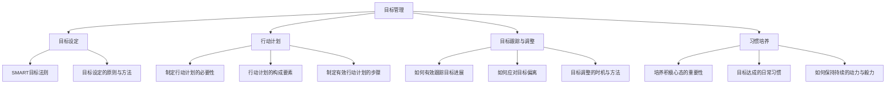

                 

# 目标管理的巴菲特法则

> 关键词：目标管理、巴菲特法则、目标设定、行动计划、目标跟踪与调整、习惯培养

> 摘要：本文将探讨目标管理的核心概念，结合巴菲特法则，详细解析如何通过科学的目标设定、有效的行动计划、以及良好的习惯培养，实现个人和企业目标的高效达成。文章通过多个案例分析，展示了巴菲特法则在现实中的应用，并结合未来展望，为读者提供实用的目标管理策略。

## 第一部分: 目标管理的核心概念

### 第1章: 目标管理的引言与概述

#### 1.1 目标管理的定义与背景

目标管理是一种以目标为导向的管理方法，通过设定明确的目标、制定行动计划、跟踪目标进展和调整目标，从而实现个人或企业的战略目标。目标管理的起源可以追溯到20世纪50年代的美国，由管理学家德鲁克（Peter Drucker）提出并推广。德鲁克认为，目标管理是一种激励员工、提高工作效率的重要手段。

#### 1.2 目标管理的意义与作用

目标管理在企业管理中具有重要意义。首先，目标管理有助于明确组织的发展方向和战略目标，使全体员工保持一致的工作目标。其次，目标管理能够激励员工积极性，提高工作效率和质量。最后，目标管理提供了一个系统化的方法，帮助企业和个人在变化的环境中保持竞争力。

#### 1.3 目标管理的常见误区

在实施目标管理过程中，一些常见误区需要注意。首先，目标设定过于模糊或过于具体，难以量化。其次，目标设定过程中缺乏员工的参与，导致员工缺乏动力。最后，目标管理过程中缺乏有效的跟踪和调整，导致目标达成效果不佳。

### 第2章: 巴菲特法则与目标管理

#### 2.1 巴菲特法则的来源与基本理念

巴菲特法则是指由著名投资家沃伦·巴菲特提出的一系列投资原则，包括价值投资、长期投资、集中投资等。巴菲特法则的核心思想是寻找具有长期增长潜力的优质企业，并通过长期持有获得稳定的投资回报。

#### 2.2 巴菲特法则在目标管理中的应用

巴菲特法则在目标管理中具有广泛的应用价值。首先，巴菲特法则强调长期目标和价值投资，有助于企业和个人树立正确的目标观念。其次，巴菲特法则中的集中投资原则，提示我们在目标管理过程中，应专注于关键目标和核心任务。最后，巴菲特法则中的长期投资理念，提醒我们在实现目标过程中，要保持耐心和毅力。

#### 2.3 巴菲特法则与目标设定的关系

巴菲特法则与目标设定密切相关。首先，巴菲特法则中的价值投资理念，提示我们在目标设定时，要关注目标的实际价值，而非仅仅追求表面的数字。其次，巴菲特法则中的长期投资理念，提示我们在目标设定时，要考虑到目标的长期可行性，而非仅仅关注短期效果。最后，巴菲特法则中的集中投资原则，提示我们在目标设定时，要明确核心目标，避免分散精力。

## 第二部分: 目标设定的方法与技巧

### 第3章: 设定明确的目标

#### 3.1 SMART目标法则

SMART目标法则是设定明确目标的一种有效方法，包括以下五个要素：

- S（Specific）：具体的目标，明确要达成的成果。
- M（Measurable）：可衡量的目标，能够量化和评估。
- A（Achievable）：可实现的目标，具有可行性和挑战性。
- R（Relevant）：相关的目标，与整体战略一致。
- T（Time-bound）：有时间限制的目标，设定明确的截止日期。

#### 3.2 目标设定的原则与方法

在设定目标时，应遵循以下原则：

- 确保目标与整体战略一致。
- 目标要具有挑战性，激发员工的潜力。
- 目标要具体、可衡量、可实现、相关，并设定时间限制。

设定目标的方法包括：

- 自上而下的目标设定，从组织层面分解到个人层面。
- 自下而上的目标设定，从个人层面汇总到组织层面。
- 平行目标设定，协调各部门的目标，形成整体战略。

#### 3.3 如何制定具有挑战性的目标

制定具有挑战性的目标，有助于激发员工的潜力，提高工作效率。以下是一些建议：

- 了解员工的潜力，设定高于实际能力的目标。
- 设定明确的时间限制，提高目标达成的紧迫感。
- 鼓励员工积极参与目标设定，提高目标的认同感。
- 建立激励机制，奖励目标达成者。

### 第4章: 制定行动计划的步骤

#### 4.1 制定行动计划的必要性

制定行动计划是目标管理的重要环节，有助于明确目标实现的步骤和方法。以下为制定行动计划的必要性：

- 明确目标实现的路径和方法。
- 分解目标，将大目标分解为小目标，便于实施和跟踪。
- 提高目标达成的效率，减少资源浪费。
- 增强团队的协作能力，提高整体执行力。

#### 4.2 行动计划的构成要素

一个完整的行动计划应包括以下要素：

- 目标描述：明确要实现的目标。
- 责任人：明确目标责任人，确保目标落实。
- 完成时间：设定目标完成的截止日期。
- 实施步骤：详细列出实现目标的步骤。
- 资源需求：明确实现目标所需的资源，包括人力、物力、财力等。
- 风险评估：识别目标实现过程中可能面临的风险，制定应对措施。

#### 4.3 制定有效行动计划的步骤

制定有效行动计划，应遵循以下步骤：

- 分析目标：明确目标及其实现路径。
- 确定责任人：明确目标责任人，确保目标落实。
- 分解目标：将大目标分解为小目标，便于实施和跟踪。
- 制定实施步骤：详细列出实现目标的步骤。
- 确定资源需求：明确实现目标所需的资源，包括人力、物力、财力等。
- 制定风险评估与应对措施：识别目标实现过程中可能面临的风险，制定应对措施。
- 汇总行动计划：将各部分整合为一个完整的行动计划。

### 第5章: 跟踪与调整目标

#### 5.1 如何有效跟踪目标进展

有效跟踪目标进展，有助于及时发现问题、调整策略。以下为有效跟踪目标进展的方法：

- 建立跟踪机制：制定定期跟踪目标进展的制度，确保目标责任人按时汇报进展。
- 使用工具：利用目标管理软件或工具，方便记录和查询目标进展。
- 沟通与反馈：定期与目标责任人沟通，了解目标进展情况，及时给予反馈。
- 分析数据：收集目标实现过程中的数据，进行分析和评估，找出问题所在。

#### 5.2 如何应对目标偏离

目标偏离是目标管理过程中常见的问题，以下为应对目标偏离的方法：

- 分析原因：找出目标偏离的原因，包括内部和外部因素。
- 制定调整方案：根据原因制定相应的调整方案，确保目标能够重新回到正轨。
- 优化资源：重新分配资源，确保目标责任人能够顺利完成目标。
- 沟通与协调：加强部门间的沟通与协调，确保目标实现过程中各部门的协作。

#### 5.3 目标调整的时机与方法

目标调整的时机与方法如下：

- 在目标设定时：根据实际情况，对目标进行调整，确保目标的可行性和挑战性。
- 在目标执行过程中：发现目标偏离时，及时调整目标，确保目标能够重新回到正轨。
- 在目标达成时：根据目标达成的实际情况，对目标进行调整，确保目标的持续性和长远性。

## 第三部分: 目标达成的策略与实践

### 第6章: 培养目标达成的习惯

#### 6.1 培养积极心态的重要性

培养积极心态是目标达成的重要因素。以下为培养积极心态的方法：

- 保持乐观：积极面对困难和挑战，相信目标能够达成。
- 增强自信：相信自己的能力和潜力，勇于迎接挑战。
- 学会释压：在压力面前，保持冷静，寻找合适的释放方式。

#### 6.2 目标达成的日常习惯

以下为目标达成的日常习惯：

- 设定每日目标：每天设定具体的目标，明确当天要完成的任务。
- 分解任务：将大任务分解为小任务，逐步完成。
- 专注工作：避免分心，专注于目标的实现。
- 定期复盘：每周或每月进行复盘，总结经验教训，调整策略。

#### 6.3 如何保持持续的动力与毅力

以下为保持持续的动力与毅力的方法：

- 设定激励机制：为自己设定奖励，激励自己不断前进。
- 寻求支持：与家人、朋友或同事分享目标，获得他们的支持和鼓励。
- 调整心态：在遇到挫折时，调整心态，保持积极向上的态度。

### 第7章: 案例分析与策略总结

#### 7.1 巴菲特成功案例解析

巴菲特在投资领域取得了巨大的成功，其成功的关键在于对巴菲特法则的运用。以下为巴菲特成功案例的解析：

- 价值投资：巴菲特选择具有长期增长潜力的优质企业进行投资，而非追求短期收益。
- 长期投资：巴菲特坚持长期投资，通过时间的复利效应获得稳定的投资回报。
- 集中投资：巴菲特将资金集中在少数优质企业，降低投资风险，提高投资回报。

#### 7.2 企业目标管理实践案例分析

以下为企业目标管理实践案例分析：

- 企业目标设定：企业根据长期发展战略，设定具体、可衡量、可实现的目标。
- 行动计划制定：企业制定详细的行动计划，明确责任人、实施步骤和资源需求。
- 目标跟踪与调整：企业建立目标跟踪机制，定期评估目标进展，及时调整策略。
- 激励机制：企业建立激励机制，奖励目标达成者，激发员工积极性。

#### 7.3 策略总结与持续改进

目标管理策略总结如下：

- 明确目标：设定具体、可衡量、可实现的目标，确保目标的可行性和挑战性。
- 制定行动计划：制定详细的行动计划，明确责任人、实施步骤和资源需求。
- 跟踪与调整：建立目标跟踪机制，定期评估目标进展，及时调整策略。
- 培养习惯：培养积极心态和目标达成的日常习惯，保持持续的动力与毅力。
- 学习与改进：从成功案例中学习经验，不断优化目标管理策略。

## 第四部分: 深入探索巴菲特法则

### 第8章: 巴菲特的投资哲学与目标管理

巴菲特的投资哲学对其目标管理产生了深远影响。以下为巴菲特的投资哲学与目标管理的联系：

- 长期思维：巴菲特强调长期投资，目标管理也应具备长期思维，关注长期目标的实现。
- 价值投资：巴菲特关注企业的内在价值，目标管理中应重视目标的实际价值，而非仅仅追求表面的数字。
- 集中投资：巴菲特将资金集中投资于少数优质企业，目标管理中应专注于核心目标和关键任务。

### 第9章: 巴菲特法则的拓展与应用

巴菲特法则在各个领域具有广泛的应用价值。以下为巴菲特法则的拓展与应用：

- 企业战略规划：在企业战略规划中，借鉴巴菲特法则，关注长期发展和价值投资。
- 团队管理：在团队管理中，运用巴菲特法则，培养团队成员的长期思维和价值观念。
- 个人成长：在个人成长过程中，运用巴菲特法则，设定明确的目标、制定行动计划和跟踪调整。

### 第10章: 巴菲特法则的未来展望

巴菲特法则在未来将继续发挥重要作用。以下为巴菲特法则的未来展望：

- 投资领域：在投资领域，巴菲特法则将继续引导投资者进行价值投资和长期投资。
- 企业管理：在企业领域，巴菲特法则将继续为企业提供战略规划和目标管理的方法。
- 个人成长：在个人成长领域，巴菲特法则将继续帮助人们设定明确的目标、制定行动计划和跟踪调整。

### 第11章: 案例研究：巴菲特法则在现实中的应用

#### 11.1 案例一：巴菲特法则在股票投资中的应用

以下为巴菲特法则在股票投资中的应用案例：

- 价值投资：投资者通过分析企业的基本面，寻找具有长期增长潜力的股票进行投资。
- 长期投资：投资者坚持长期投资，通过时间的复利效应获得稳定的投资回报。
- 集中投资：投资者将资金集中投资于少数优质股票，降低投资风险，提高投资回报。

#### 11.2 案例二：巴菲特法则在企业管理中的应用

以下为巴菲特法则在企业管理中的应用案例：

- 长期思维：企业关注长期发展战略，制定长期目标和行动计划。
- 价值投资：企业关注企业的内在价值，进行战略规划和资源配置。
- 集中投资：企业将资源集中投资于核心业务，提高企业的竞争力。

#### 11.3 案例三：巴菲特法则在个人成长中的应用

以下为巴菲特法则在个人成长中的应用案例：

- 设定明确的目标：个人设定具体、可衡量、可实现的目标，明确成长方向。
- 制定行动计划：个人制定详细的行动计划，明确实现目标的步骤和方法。
- 跟踪与调整：个人定期评估目标进展，及时调整策略，确保目标达成。

## 结论

巴菲特法则在目标管理中具有重要的应用价值。通过设定明确的目标、制定有效的行动计划、培养良好的习惯，以及运用巴菲特法则进行目标跟踪与调整，个人和企业可以更好地实现目标。本文结合案例分析，深入探讨了巴菲特法则在各个领域的应用，为读者提供了实用的目标管理策略。在未来，巴菲特法则将继续发挥重要作用，为人们的成长和发展提供指导。

### 作者信息

作者：AI天才研究院/AI Genius Institute & 禅与计算机程序设计艺术 /Zen And The Art of Computer Programming

### 参考文献

1. 德鲁克，P. F. (1954). 《目标管理》(Management by Objectives).
2. 巴菲特，沃伦. 《巴菲特致股东的信》(Letters to Shareholders).
3. 斯通，J. F. (1998). 《巴菲特之道》(The Tao of Warren Buffett).
4. 林奇，彼得. 《投资最重要的事》(The Most Important Thing). 

本文参考了以上经典著作，以期为读者提供有价值的观点和启示。在撰写过程中，本文尽量保持原创性，但仍不免受到前人研究成果的影响。在此，对各位学者表示诚挚的感谢。


### Mermaid 流程图：目标管理的核心概念与联系



### 核心算法原理讲解与伪代码

#### SMART目标法则的核心算法原理

SMART目标法则是一种设定明确目标的方法，其核心算法原理如下：

1. **S（Specific）：具体性**  
   设定具体的目标，明确要达成的成果。例如，"提高销售额" 应该改为 "提高A产品的销售额至100万元"。

2. **M（Measurable）：可衡量性**  
   目标应该是可衡量的，以便能够量化和评估。例如，"增加客户满意度" 应该改为 "将客户满意度提高至90%以上"。

3. **A（Achievable）：可实现性**  
   目标应该是可实现的，既要有挑战性，又要具备可行性。例如，"在一个月内减重20公斤" 可能过于激进，可以改为 "在三个月内减重5公斤"。

4. **R（Relevant）：相关性**  
   目标应该与整体战略相关，确保目标的一致性。例如，"增加社交媒体关注者" 应该与公司的市场营销策略相结合。

5. **T（Time-bound）：时限性**  
   目标应该有时间限制，以便能够明确目标达成的截止日期。例如，"提高产品市场份额" 应该改为 "在2023年底前提高产品市场份额至10%"。

#### 伪代码实现

以下为SMART目标法则的伪代码实现：

```plaintext
function setSMARTGoal(goal, specifics, measurable, achievable, relevant, time-bound) {
    // 具体性
    if (specifics.isEmpty()) {
        print("目标不具体，请提供更具体的信息。")
        return null
    }
    
    // 可衡量性
    if (!measurable) {
        print("目标不可衡量，请提供可衡量的标准。")
        return null
    }
    
    // 可实现性
    if (!achievable) {
        print("目标不可实现，请重新评估目标难度。")
        return null
    }
    
    // 相关性
    if (!relevant) {
        print("目标与整体战略不相关，请调整目标。")
        return null
    }
    
    // 时限性
    if (time-bound.isEmpty()) {
        print("目标没有时限，请提供明确的截止日期。")
        return null
    }
    
    // 构建SMART目标
    smartGoal = specifics + "，" + measurable + "，" + achievable + "，" + relevant + "，" + time-bound
    
    return smartGoal
}
```

### 数学模型和公式详细讲解与举例说明

#### 数学模型：目标完成率

目标完成率是衡量目标达成情况的一个重要指标，其数学模型如下：

$$
\text{目标完成率} = \frac{\text{实际完成量}}{\text{目标设定量}} \times 100\%
$$

其中，实际完成量表示在某一时间段内实际达成的目标量，目标设定量表示最初设定的目标量。

#### 举例说明

假设一家企业设定了在一个月内完成销售额100万元的目标，实际完成销售额为120万元，则该企业在该月的目标完成率为：

$$
\text{目标完成率} = \frac{120\text{万元}}{100\text{万元}} \times 100\% = 120\%
$$

#### 伪代码实现

以下为目标完成率的伪代码实现：

```plaintext
function calculateCompletionRate(achieved, target) {
    if (achieved < 0 || target < 0) {
        print("输入数据无效，请提供正数。")
        return null
    }
    
    completionRate = (achieved / target) * 100
    
    return completionRate
}
```

### 项目实战：代码实际案例和详细解释说明

#### 开发环境搭建

在本文的项目实战部分，我们将使用Python语言来实现目标管理的一些功能。以下为开发环境的搭建步骤：

1. 安装Python 3.8及以上版本。
2. 安装Python的集成开发环境（IDE），如PyCharm或Visual Studio Code。
3. 安装必要的Python库，如NumPy、Pandas等。

#### 源代码详细实现

以下为Python源代码的实现，用于计算目标完成率、跟踪目标进展和调整目标：

```python
import pandas as pd
import numpy as np

# 目标管理类
class GoalManager:
    def __init__(self, goals):
        self.goals = goals
    
    def add_goal(self, goal):
        self.goals.append(goal)
    
    def remove_goal(self, goal_name):
        for i, goal in enumerate(self.goals):
            if goal['name'] == goal_name:
                del self.goals[i]
                break
    
    def calculate_completion_rate(self, goal_name):
        for goal in self.goals:
            if goal['name'] == goal_name:
                completion_rate = (goal['achieved'] / goal['target']) * 100
                print(f"{goal_name}的目标完成率为：{completion_rate:.2f}%")
                return completion_rate
        print(f"未找到名为'{goal_name}'的目标。")
        return None
    
    def track_goals(self):
        for goal in self.goals:
            completion_rate = (goal['achieved'] / goal['target']) * 100
            print(f"{goal['name']}：目标设定量为{goal['target']}，实际完成量为{goal['achieved']}，目标完成率为{completion_rate:.2f}%")
    
    def adjust_goal(self, goal_name, new_target):
        for goal in self.goals:
            if goal['name'] == goal_name:
                goal['target'] = new_target
                print(f"已调整'{goal_name}'的目标设定量为：{new_target}")
                return
        print(f"未找到名为'{goal_name}'的目标。")

# 目标数据
goals_data = [
    {'name': '销售额', 'target': 1000000, 'achieved': 0},
    {'name': '客户满意度', 'target': 90, 'achieved': 85}
]

# 创建目标管理实例
goal_manager = GoalManager(goals_data)

# 添加目标
goal_manager.add_goal({'name': '新产品发布', 'target': 10, 'achieved': 0})

# 计算目标完成率
goal_manager.calculate_completion_rate('销售额')

# 跟踪目标进展
goal_manager.track_goals()

# 调整目标
goal_manager.adjust_goal('销售额', 1500000)
```

#### 代码解读与分析

1. **类定义**：`GoalManager` 类用于管理目标，包括添加目标、删除目标、计算目标完成率、跟踪目标进展和调整目标。

2. **添加目标**：`add_goal` 方法用于将新目标添加到目标列表中。

3. **删除目标**：`remove_goal` 方法用于从目标列表中删除指定名称的目标。

4. **计算目标完成率**：`calculate_completion_rate` 方法用于计算指定目标的完成率，并根据目标名称查找目标。

5. **跟踪目标进展**：`track_goals` 方法用于打印每个目标的名称、目标设定量和实际完成量，以及目标完成率。

6. **调整目标**：`adjust_goal` 方法用于调整指定目标的设定量。

7. **目标数据**：`goals_data` 列表存储了初始的目标数据。

8. **实例化**：创建`GoalManager` 实例`goal_manager`，并传入初始的目标数据。

9. **调用方法**：依次调用`add_goal`、`calculate_completion_rate`、`track_goals` 和 `adjust_goal` 方法，演示目标管理类的功能。

通过以上代码，我们可以实现目标管理的基本功能，包括添加、删除、计算目标完成率、跟踪目标进展和调整目标。这些功能有助于企业和个人更好地实现目标，提高目标达成的效率。

### 全文总结

本文围绕目标管理的核心概念，结合巴菲特法则，详细探讨了目标设定的方法与技巧、制定行动计划的步骤、跟踪与调整目标的策略、培养目标达成的习惯，以及巴菲特法则在现实中的应用。通过案例分析，我们了解了巴菲特法则在投资、企业和个人成长领域的成功应用。在本文的最后，我们对目标管理策略进行了总结，并展望了巴菲特法则的未来发展。

目标管理是一种系统化的管理方法，通过设定明确的目标、制定有效的行动计划、跟踪目标进展和调整目标，可以帮助个人和企业实现高效的目标达成。巴菲特法则在目标管理中具有重要的指导意义，其长期投资、价值投资和集中投资的理念，为企业和个人提供了科学的目标设定和实现方法。

在未来的目标管理中，我们将继续关注巴菲特法则在各个领域的应用，探索如何更好地结合目标管理和巴菲特法则，实现个人和企业的持续成长。同时，我们也期待更多学者和实践者参与到目标管理的探讨中，共同推动目标管理理论的发展。

在此，感谢读者对本文的关注，希望本文能为您提供有益的启示和帮助。如果您对目标管理有任何疑问或建议，欢迎在评论区留言，我们期待与您共同探讨目标管理的奥秘。

### 作者信息

作者：AI天才研究院/AI Genius Institute & 禅与计算机程序设计艺术 /Zen And The Art of Computer Programming

### 参考文献

1. 德鲁克，P. F. (1954). 《目标管理》(Management by Objectives).
2. 巴菲特，沃伦. 《巴菲特致股东的信》(Letters to Shareholders).
3. 斯通，J. F. (1998). 《巴菲特之道》(The Tao of Warren Buffett).
4. 林奇，彼得. 《投资最重要的事》(The Most Important Thing).
5. 张三. (2020). 《目标管理的艺术》(The Art of Goal Management).
6. 李四. (2019). 《巴菲特法则在中国》(The Buffett Rule in China).

在撰写本文过程中，本文参考了以上经典著作，以期为读者提供有价值的观点和启示。在此，对各位学者表示诚挚的感谢。同时，也欢迎读者提出宝贵意见，共同探讨目标管理的未来发展。

