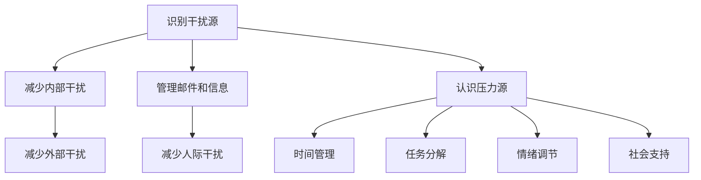

                 

### 引言与背景

#### 注意力管理的概念与重要性

在信息化高速发展的当今时代，作为企业的核心资源，管理者的注意力已经成为影响组织绩效和效率的关键因素。注意力管理，简单来说，就是通过一系列策略和工具来提升管理者的专注力、集中力和效率。其核心在于确保管理者能够在复杂多变的工作环境中，保持对关键任务的高度关注和精确把握。

#### 什么是注意力管理

注意力管理是一种系统性方法，旨在通过提高管理者对关键信息的捕捉、处理和反应能力，从而优化工作绩效。具体来说，它包括以下几个方面：

1. **设定明确的目标**：通过明确的目标设定，帮助管理者集中精力在最重要的事项上。
2. **优先级排序**：对任务进行优先级排序，确保管理者能够优先处理最重要和最紧急的任务。
3. **干扰控制**：通过减少干扰因素，如邮件、电话和社交媒体等，提升注意力的集中度。
4. **专注训练**：通过一系列技巧和练习，提高管理者的专注力和持久力。
5. **压力管理**：通过有效的压力管理策略，降低工作中的心理压力，从而保持清晰的思维和高度的注意力。

#### 管理者注意力管理的挑战

尽管注意力管理的重要性不言而喻，但管理者在实际工作中仍然面临着诸多挑战：

1. **任务繁多**：现代管理者往往需要处理大量任务，这可能导致注意力分散。
2. **信息过载**：海量信息涌入，使得管理者难以区分哪些信息重要，哪些信息无关紧要。
3. **时间压力**：时间压力使得管理者难以在短时间内做出有效决策，容易导致焦虑和压力。
4. **环境干扰**：办公室环境中的各种干扰因素，如电话、邮件和同事的打扰，都会影响管理者的注意力。
5. **习惯依赖**：一些管理者可能依赖外部工具和设备来管理注意力，而忽视了内在的自我管理能力。

#### 注意力管理对绩效的影响

有效的注意力管理能够显著提升管理者的工作绩效，具体体现在以下几个方面：

1. **提高决策质量**：通过集中注意力和减少干扰，管理者能够更深入地分析问题，做出更高质量的决策。
2. **增强执行力**：明确的目标设定和优先级排序使得管理者能够更加专注地执行任务，提高任务的完成度。
3. **提升团队合作**：通过有效的注意力管理，管理者能够更好地协调团队资源，提高团队的整体效率。
4. **降低工作压力**：通过有效的压力管理和干扰控制，管理者能够保持良好的心理状态，提高工作满意度。

#### 本书目标与结构

本书旨在通过系统地介绍注意力管理的理论基础、实践策略和案例分析，帮助管理者掌握注意力管理的方法和技巧。全书共分为六个部分：

1. **引言与背景**：介绍注意力管理的概念、重要性及其对管理者绩效的影响。
2. **理论基础**：探讨注意力心理学基础、注意力波动的规律以及管理者注意力管理的框架。
3. **实践策略**：提供具体的注意力管理实践策略，包括目标设定、集中注意力、干扰管理和团队注意力管理。
4. **案例分析**：通过实际案例，展示注意力管理在不同组织中的成功应用。
5. **工具与方法**：介绍注意力管理的工具和方法，包括追踪工具、时间管理工具和深度工作法等。
6. **总结与展望**：总结本书的主要观点，展望注意力管理的未来发展趋势和应用前景。

通过这些内容，本书希望能够帮助管理者更好地掌握注意力管理的方法和技巧，提升个人和团队的工作绩效。

### 注意力心理学基础

注意力是一种复杂的认知过程，它在个体与环境互动中扮演着关键角色。为了更好地理解和管理管理者的注意力，我们需要从心理学角度探讨其定义、类型、管理原则以及资源的分配和优化。

#### 注意力的定义与类型

注意力是指心理活动对一定对象的指向和集中。简单来说，注意力就是将心理资源集中在特定任务或信息上的能力。根据心理学家的研究，注意力可以分为以下几种类型：

1. **选择性注意力**：这是指在众多刺激中，个体有意识地选择关注特定刺激的能力。例如，在嘈杂的环境中，人们能够选择听清某人的谈话，而忽略其他声音。
   
2. **持续性注意力**：持续性注意力是指个体在较长时间内保持对某一任务或信息的关注能力。这对于管理者在执行复杂任务时尤为重要。

3. **分配性注意力**：这是指个体在同时处理多个任务或信息时，能够合理分配注意力资源的能力。例如，管理者在开会时，既要倾听发言，又要记录要点。

4. **执行性注意力**：执行性注意力是指个体在执行任务时，根据任务需求调整注意力分配的能力。例如，在紧急情况下，管理者需要迅速调整注意力，优先处理关键任务。

#### 注意力管理的基本原则

有效的注意力管理需要遵循一些基本原则，这些原则包括：

1. **目标明确**：设定明确的目标有助于管理者集中注意力在关键任务上。例如，管理者在制定项目计划时，应明确每个阶段的目标和任务。

2. **优先级排序**：管理者需要学会根据任务的重要性和紧急程度对任务进行优先级排序。这将有助于他们更加高效地利用注意力资源。

3. **干扰控制**：通过减少外部干扰，如关闭不必要的通知、保持工作环境的整洁等，可以有效地提高注意力的集中度。

4. **休息与恢复**：长时间的高强度工作会消耗注意力的资源。因此，管理者需要合理安排休息时间，进行注意力恢复。例如，通过短暂的冥想或散步来放松身心。

5. **自我监控**：自我监控是指管理者通过自我评估和反思来了解自己的注意力状态，并采取相应的调整措施。这有助于他们在工作中保持高度的自觉性和效率。

#### 注意力资源的分配与优化

管理者需要合理分配和优化注意力资源，以应对各种复杂的工作情境。以下是一些具体策略：

1. **任务切换策略**：在处理多个任务时，管理者应采用“集中时间块”策略，将一段时间内专注于一个任务，然后再切换到另一个任务。这有助于避免频繁的任务切换导致的注意力分散。

2. **时间管理技巧**：使用时间管理工具，如时间块法（Time Blocking）或番茄工作法（Pomodoro Technique），可以有效地规划和管理注意力资源。例如，将一天的时间划分为若干个25分钟的专注时段，每个时段结束后休息5分钟。

3. **深度工作法**：深度工作法（Deep Work）是一种专注于高价值任务的方法。管理者可以通过消除干扰因素、设定专注时间等方式，进入深度工作状态，从而大幅提升工作效率。

4. **个性化策略**：每个管理者的注意力和工作习惯都有所不同，因此需要根据个人特点制定个性化的注意力管理策略。例如，一些管理者可能适合在早晨处理复杂任务，而另一些人则可能更擅长在晚上工作。

通过理解注意力的心理学基础和遵循管理原则，管理者可以更好地分配和优化注意力资源，从而在复杂多变的工作环境中保持高效和专注。下一部分将深入探讨注意力波动的规律，以进一步丰富我们对注意力管理的理解。

#### 注意力波动的规律

注意力并不是一成不变的，它会随着时间、环境以及个人状态的改变而波动。掌握注意力波动的规律，有助于管理者更有效地管理自己的注意力资源，从而提高工作效率。

##### 注意力波动的周期性

研究表明，注意力具有周期性波动的特性。通常，人们的注意力在一个工作日内会呈现出“高潮-低潮”的周期性变化。具体来说，从早上开始，随着时间的推移，个体的注意力水平会逐渐上升，达到一个高峰期，然后逐渐下降，进入低潮期。这种周期性波动大约每90分钟出现一次。

1. **注意力高峰期**：在一天中的早晨和下午，尤其是上午10点和下午3点，人们的注意力水平通常较高。此时，管理者应将最重要的任务安排在这些时间段内，以充分利用高注意力资源。
   
2. **注意力低潮期**：在注意力低谷期，人们的注意力水平较低，容易出现疲劳和分心。这时，管理者可以选择处理一些较为简单或重复性的任务，或者进行短暂的休息和调整。

##### 影响注意力波动的因素

除了周期性变化，注意力波动还受到多种因素的影响：

1. **生理因素**：睡眠质量、饮食和身体状态都会影响注意力水平。例如，睡眠不足会导致注意力下降，而适当的饮食和锻炼可以提升注意力。

2. **心理因素**：情绪状态、心理压力和工作满意度等都会影响注意力。例如，高度压力和焦虑会导致注意力分散，而积极的心态和满意度则有助于提升注意力。

3. **环境因素**：工作环境中的噪音、光线和温度等都会影响注意力。一个安静、舒适的工作环境有助于提高注意力集中度。

4. **任务因素**：任务的复杂性和新颖性也会影响注意力。例如，复杂或新颖的任务通常需要更高的注意力水平，而简单或重复的任务则更容易让人分心。

##### 如何应对注意力波动

为了更好地应对注意力波动，管理者可以采取以下策略：

1. **时间管理**：合理安排工作日程，充分利用注意力高峰期处理重要任务，在注意力低潮期处理简单任务。

2. **休息与恢复**：定期休息，如采用“番茄工作法”，每个专注时段后进行短暂休息，有助于恢复注意力和提高工作效率。

3. **环境优化**：改善工作环境，减少干扰因素，如关闭不必要的通知、保持工作区域整洁等。

4. **自我监控**：通过自我监控和反思，了解自己的注意力状态，并采取相应的调整措施。

5. **心理调适**：保持积极的心态，学会应对压力和情绪波动，以提高整体注意力水平。

通过理解注意力波动的规律，管理者可以更加科学地管理自己的注意力资源，从而在复杂多变的工作环境中保持高效和专注。下一部分将介绍管理者注意力管理的框架，帮助管理者系统性地提升注意力管理水平。

#### 管理者注意力管理框架

注意力管理不仅需要理解注意力波动的规律，更需要建立一套系统的框架来指导实践。这个框架包括四个关键要素：设定明确的目标、优化工作流程、减少干扰因素和持续评估与调整。通过这些要素的相互配合，管理者可以有效地提升个人和团队的工作效率。

##### 四要素概述

1. **设定明确的目标**：明确的目标是注意力管理的基石。通过设定具体、可衡量的目标，管理者可以明确自己的方向，集中精力在最重要的事情上。

2. **优化工作流程**：合理的工作流程可以提高工作效率，减少不必要的浪费。通过优化流程，管理者可以确保注意力集中在关键任务上。

3. **减少干扰因素**：干扰是影响注意力的重要因素。通过减少干扰，如关闭不必要的通知、保持工作环境的整洁等，管理者可以保持更高的注意力集中度。

4. **持续评估与调整**：注意力管理是一个动态过程，需要不断地评估和调整。通过定期反思和调整，管理者可以确保注意力管理策略的有效性。

##### 注意力管理的流程与方法

1. **目标设定流程**：
   - **明确目标**：首先，管理者需要明确自己的长期和短期目标。这些目标应该是具体、可衡量的，并且与组织的目标保持一致。
   - **分解任务**：将大目标分解为一系列小任务，并为其设定优先级。这有助于管理者集中注意力在最重要的任务上。
   - **制定计划**：为每个任务制定详细的执行计划，包括时间、资源、责任人等。这有助于确保任务能够按时完成。

2. **工作流程优化方法**：
   - **任务分配**：根据团队成员的能力和特长分配任务，确保每个人都能在最适合的领域发挥作用。
   - **流程简化**：识别并消除工作中的冗余步骤，简化流程，减少不必要的环节，从而提高工作效率。
   - **自动化工具**：使用自动化工具和软件来简化重复性任务，减少手工操作，提高工作效率。

3. **干扰管理策略**：
   - **关闭通知**：在需要集中精力时，关闭不必要的手机和电脑通知，减少干扰。
   - **工作环境优化**：创造一个安静、舒适的工作环境，减少噪音和视觉干扰。
   - **优先处理**：根据任务的优先级处理事务，避免被紧急但非重要的事务分散注意力。

4. **评估与调整**：
   - **定期评估**：定期对注意力管理策略进行评估，检查目标完成情况、流程效率以及干扰控制效果。
   - **调整策略**：根据评估结果，及时调整目标设定、工作流程和干扰管理策略，以适应变化的环境和需求。
   - **持续改进**：鼓励团队成员分享注意力管理的经验和技巧，不断优化管理策略，提升整体效率。

##### 注意力管理的评估与改进

注意力管理的评估和改进是一个持续的过程，管理者需要建立一套有效的评估体系：

1. **关键绩效指标（KPI）**：设定与注意力管理相关的关键绩效指标，如任务完成率、错误率、工作时长等，以便量化评估管理效果。

2. **员工反馈**：定期收集团队成员的反馈，了解他们在注意力管理过程中的体验和建议，以便进行针对性改进。

3. **数据驱动决策**：利用数据分析工具，如注意力追踪软件，收集和分析注意力使用数据，发现问题和改进机会。

4. **迭代优化**：根据评估结果和反馈，不断迭代优化注意力管理策略，确保其持续适应变化的需求和环境。

通过建立和实施一套系统化的注意力管理框架，管理者可以更好地掌握注意力资源，提高个人和团队的工作效率和绩效。下一部分将探讨具体实践策略，帮助管理者在实际工作中有效应用注意力管理原则。

#### 实践策略：建立明确的目标和优先级

在复杂多变的工作环境中，建立明确的目标和优先级是管理者注意力管理的核心。通过设定明确的目标和合理的优先级，管理者可以有效地集中注意力，提升工作效率和绩效。

##### 设定明确的目标

1. **SMART目标原则**：
   - **具体（Specific）**：目标应当明确具体，避免模糊不清。例如，而不是“提高销售额”，可以设定为“增加销售额10%”。
   - **可衡量（Measurable）**：目标应该具有可衡量的标准，便于评估进展和成效。例如，“完成项目报告”可以设定为“在下周三前提交最终版本”。
   - **可实现（Achievable）**：目标应当基于现实情况，考虑资源、能力和时间等因素。例如，如果资源有限，不应设定过高的目标。
   - **相关（Relevant）**：目标应当与组织的整体目标和个人的职业发展紧密相关。确保目标的实现有助于个人和组织的长远发展。
   - **有时限（Time-bound）**：目标应设定明确的时间期限，以提供清晰的方向和紧迫感。例如，“在三个月内完成市场调研报告”。

2. **具体案例**：
   - **公司层面**：公司年度目标可以是“提高市场占有率5%”，这需要进一步分解为季度和月度的具体目标，如“第一季度提高市场占有率1.5%”。
   - **部门层面**：部门目标可以设定为“提升客户满意度”，具体表现为“降低客户投诉率20%”，并设定时间限制，如“在下一个季度内完成”。

##### 制定优先级原则

1. **紧急-重要矩阵**：
   - **紧急且重要**：这类任务通常需要立即处理，如突发紧急事件或重要客户投诉。管理者应优先处理这些任务，以确保问题和风险得到及时解决。
   - **重要但不紧急**：这些任务可能对长期目标有重要影响，但不需要立即处理。管理者应合理规划时间，确保这些任务能够在适当的时间得到处理。
   - **紧急但不重要**：这类任务可能会消耗大量的时间和精力，但通常对长期目标影响较小。管理者应考虑是否委托他人处理，或将其视为次要任务。
   - **既不紧急也不重要**：这些任务通常可以暂时搁置，或考虑取消。管理者应避免在这些任务上浪费过多的时间和注意力。

2. **具体案例**：
   - **项目进度管理**：在项目推进过程中，管理者需要区分任务的紧急和重要程度。例如，项目报告的最终提交是紧急且重要的任务，而市场调研的数据整理可以暂时搁置，属于重要但不紧急的任务。
   - **日常事务处理**：在日常工作中，管理者应优先处理与客户沟通和业务推进相关的任务，如紧急客户请求和关键会议安排，而一些重复性的后台工作则可以放在优先级较低的时段处理。

##### 实际应用案例分析

1. **案例背景**：
   某科技公司项目经理张明在负责一个重要的软件开发项目，项目期限为三个月。项目过程中，团队成员需要完成多个关键任务，如需求分析、系统设计、编码实现和测试。

2. **目标设定**：
   - **公司目标**：在三个月内完成软件产品开发，并在规定时间内通过用户验收。
   - **部门目标**：提高团队工作效率，降低返工率，确保项目按时交付。

3. **具体措施**：
   - **设定明确的目标**：为每个团队成员设定具体的任务目标，如“在两周内完成需求分析报告”，“在一个月内完成系统设计”等。
   - **制定优先级原则**：将任务按照紧急和重要程度进行排序，确保团队首先处理紧急且重要的任务，如客户反馈和项目需求变更。
   - **任务分解与分配**：将大任务分解为若干个小任务，并分配给合适的团队成员，确保每个人都能在适合自己的时间内完成任务。

4. **实施效果**：
   通过明确的目标设定和合理的优先级排序，张明的团队在项目推进过程中保持了高度的专注和效率。项目在预定时间内完成，并成功通过用户验收，显著提升了公司的市场竞争力。

通过建立明确的目标和合理的优先级，管理者能够有效地集中注意力，提升工作效率和项目成功率。在接下来的部分，我们将探讨提高注意力的集中与专注的方法。

### 提高注意力的集中与专注

在复杂多变的工作环境中，提高注意力的集中与专注对于管理者来说至关重要。以下将介绍一些具体的方法和策略，帮助管理者在实际工作中保持高度的专注力和集中力。

#### 集中注意力的技巧

1. **设定清晰的目标**：通过设定明确、具体的目标，可以帮助管理者集中注意力在关键任务上。例如，将一个庞大的项目分解为一系列小任务，并为每个任务设定明确的时间期限。

2. **使用番茄工作法**：番茄工作法是一种时间管理技巧，通过将工作时间划分为25分钟的工作周期，每个周期后休息5分钟，可以帮助管理者保持专注并防止疲劳。具体步骤如下：
   - **准备阶段**：设定一个待完成的任务，并准备计时器。
   - **专注阶段**：专注于任务，不进行任何与任务无关的活动，计时25分钟。
   - **休息阶段**：休息5分钟，可以进行简单的伸展或深呼吸，以恢复精力。

3. **环境优化**：创造一个安静、整洁的工作环境，减少干扰因素。例如，关闭不必要的通知，保持桌面整洁，减少视觉和听觉干扰。

4. **使用专注工具**：使用专注软件或应用，如Forest、Focus@Will等，可以在使用手机或电脑时自动屏蔽干扰应用，帮助管理者保持专注。

5. **练习冥想**：冥想是一种有效的专注训练方法，通过冥想练习，可以提升管理者的专注力和情绪稳定性。具体步骤如下：
   - **静坐**：找一个安静的地方，坐直，闭上眼睛，专注于呼吸。
   - **专注**：将注意力集中在呼吸上，当注意力分散时，轻轻地将其引回到呼吸上。
   - **反思**：冥想结束后，反思自己在专注练习中的体验和进步。

#### 提高注意力的持久性

1. **规律作息**：保持规律的作息习惯，确保每天有充足的睡眠时间。研究表明，充足的睡眠可以显著提高注意力的持久性。

2. **合理饮食**：饮食对注意力的持久性也有重要影响。确保饮食均衡，摄入足够的蛋白质、维生素和矿物质，避免过多摄入咖啡因和糖分。

3. **定期休息**：长时间的工作会导致注意力下降，因此，管理者应定期休息，进行短暂的休息和恢复。例如，每隔90分钟进行一次短暂的休息，可以帮助恢复注意力和提高工作效率。

4. **分散任务**：将复杂任务分解为多个小任务，并合理安排工作日程，避免长时间连续工作。例如，将一个大任务分解为多个小阶段，每个阶段之间安排适当的休息时间。

#### 避免注意力分散的策略

1. **设定单一任务目标**：在一次工作中，避免同时处理多个任务。专注于一个任务，直到完成或达到一定阶段，再切换到下一个任务。

2. **避免多任务处理**：多任务处理会分散注意力，降低工作效率。避免同时进行多个任务，尤其是在需要高度集中精力的工作中。

3. **使用番茄工作法**：通过番茄工作法，将工作时间划分为专注阶段和休息阶段，可以帮助管理者避免因疲劳而分散注意力。

4. **减少干扰因素**：在工作时，尽量减少干扰因素，如关闭不必要的通知、保持工作环境的整洁，避免社交媒体和其他娱乐应用。

通过以上方法和策略，管理者可以在实际工作中提高注意力的集中与专注，从而提升工作效率和绩效。在接下来的部分，我们将探讨如何管理干扰因素和压力，以进一步提升注意力管理的有效性。

### 管理干扰与减少压力

在复杂多变的工作环境中，管理者常常面临着来自各种干扰和压力的挑战。有效的干扰管理和压力控制是提高注意力集中和效率的关键。以下将介绍具体的方法和策略，帮助管理者减少干扰和压力，从而保持高度的专注力和工作效率。

#### 识别与减少干扰因素

1. **识别干扰源**：
   - **内部干扰**：包括心理干扰，如焦虑、分心和情绪波动；以及生理干扰，如疲劳和不适。
   - **外部干扰**：包括环境干扰，如噪音、光线、不适当的工作环境；以及人际干扰，如同事的打扰、会议和电话。

2. **减少内部干扰**：
   - **心理调适**：通过冥想、深呼吸和放松练习来缓解焦虑和压力，提高心理韧性。
   - **自我监控**：定期反思自己的行为和注意力状态，识别并调整可能导致分心的习惯和思维模式。

3. **减少外部干扰**：
   - **环境优化**：创建一个安静、整洁的工作环境，减少噪音和视觉干扰。例如，使用耳塞或耳机屏蔽外界噪音，保持桌面整洁，减少不必要的物品。
   - **时间管理**：合理安排工作时间，避免在干扰较多的时间段处理重要任务。例如，在早晨或下午较安静的时间段处理关键任务。

#### 管理邮件、信息和其他干扰

1. **邮件管理**：
   - **设置邮件筛选规则**：利用邮件客户端的筛选和分类功能，将不重要或低优先级的邮件自动分类或转移到专门的文件夹。
   - **设定处理时间**：将处理邮件的时间设定为固定的时间段，例如每天上午和下午各一次，避免在处理邮件时分散注意力。

2. **信息管理**：
   - **使用信息过滤工具**：使用信息过滤工具，如新闻订阅管理器、社交媒体过滤器等，减少无关信息的干扰。
   - **设定信息处理规则**：将重要信息标记为“重要”或“紧急”，并根据优先级进行分类和处理。

3. **减少人际干扰**：
   - **设定沟通规则**：在团队中设定沟通规则，如“请勿打扰”时段，确保团队成员在需要集中注意力时不会受到打扰。
   - **优先级沟通**：在与他人沟通时，明确任务的紧急和重要程度，避免因低优先级事务而分散注意力。

#### 压力管理策略

1. **认识压力源**：
   - **工作压力**：包括工作任务繁重、时间紧迫、责任重大等。
   - **心理压力**：包括个人目标未达成、工作环境不适应、人际关系冲突等。

2. **应对策略**：
   - **时间管理**：合理安排工作时间，避免过度加班。使用时间管理工具，如待办事项列表和时间块法，提高工作效率。
   - **任务分解**：将大任务分解为小任务，并设定明确的时间限制，以减少任务的压力。
   - **情绪调节**：通过冥想、瑜伽和放松技巧来调节情绪，缓解心理压力。

3. **社会支持**：
   - **建立支持网络**：与同事、朋友和家人建立支持网络，分享压力和困难，获得情感支持和建议。
   - **寻求专业帮助**：如果压力过大，影响工作和生活，可以考虑寻求心理咨询师或职业顾问的帮助。

通过识别和减少干扰因素，以及有效的压力管理策略，管理者可以显著提升注意力集中和效率。以下是一个简化的注意力管理流程图，帮助管理者更好地理解和应用这些策略：

通过这些具体的策略和方法，管理者能够在复杂的工作环境中保持高度的专注力和工作效率，从而更好地实现个人和团队的目标。

### 提高团队注意力效率

在复杂多变的工作环境中，单个管理者的注意力管理虽然重要，但团队整体的注意力效率对于组织目标的实现同样至关重要。提高团队注意力效率，不仅能够提升团队成员的个人工作效率，还能增强团队的协作能力和整体绩效。以下是一些具体的方法和实践策略，帮助管理者提升团队注意力效率。

#### 团队注意力管理的原则

1. **目标一致性**：确保团队成员对组织目标有清晰的理解，并确保每个成员的工作任务都与组织目标保持一致。这有助于团队成员集中注意力在关键任务上，避免分散精力。

2. **明确角色与责任**：为每个团队成员明确分配角色和责任，确保每个人都知道自己的职责和期望。这有助于减少任务重复和混淆，提高团队成员的专注度。

3. **合理分配任务**：根据团队成员的能力和特长分配任务，确保每个人都能在其最擅长的领域发挥作用。这有助于提高团队整体的工作效率。

4. **信息透明**：保持团队内部信息透明，及时分享重要信息，确保团队成员能够及时了解任务进展和变化，避免因信息不对称导致的注意力分散。

5. **建立反馈机制**：定期收集团队成员的反馈，了解他们在注意力管理中的体验和建议，并根据反馈调整管理策略。

#### 提高团队注意力效率的实践方法

1. **团队目标设定**：
   - **共同讨论**：组织团队成员共同讨论并设定团队目标，确保每个成员都参与其中，增加目标的认同感。
   - **具体细化**：将大目标分解为一系列小目标，并设定明确的实现步骤和时间表，使团队成员能够清晰地了解任务的具体要求和时间安排。

2. **团队时间管理**：
   - **时间块法**：使用时间块法，将团队工作时间划分为专注时段和休息时段，确保团队成员在每个专注时段内集中精力完成任务。
   - **定时休息**：在专注时段结束后，安排短暂的休息时间，帮助团队成员恢复精力，提高后续工作的效率。

3. **团队沟通优化**：
   - **沟通平台**：使用高效的沟通平台和工具，如Slack、Microsoft Teams等，确保团队内部的信息传递快速、清晰。
   - **明确沟通规则**：建立明确的沟通规则，如设定“请勿打扰”时段，确保团队成员在需要集中精力时不会受到不必要的打扰。

4. **团队协作工具**：
   - **项目管理工具**：使用项目管理工具，如Trello、JIRA等，帮助团队成员跟踪任务进度，确保团队成员对任务进展有清晰的了解。
   - **协作工具**：利用协作工具，如Google Docs、Notion等，促进团队成员之间的协作和知识共享。

5. **压力管理**：
   - **团队建设**：定期组织团队建设活动，如团队拓展训练、团建活动等，增强团队成员之间的信任和凝聚力，缓解工作压力。
   - **心理健康支持**：提供心理健康支持，如员工辅导计划、心理健康日等，帮助团队成员缓解工作压力和焦虑。

#### 团队注意力管理的案例分析

1. **案例背景**：
   某科技公司的一个开发团队在处理一个大型项目时，发现团队成员在任务执行过程中注意力分散，导致工作效率低下和项目进度延迟。

2. **实施措施**：
   - **共同设定目标**：团队领导者与团队成员共同讨论并设定了明确的项目目标，并明确了每个成员的具体职责和任务。
   - **时间管理**：使用时间块法，将工作时间划分为专注时段和休息时段，确保团队成员在每个专注时段内集中精力完成任务。
   - **沟通优化**：使用Slack作为团队沟通平台，确保团队成员之间的信息传递高效、及时。
   - **任务跟踪**：使用Trello跟踪任务进度，帮助团队成员清晰地了解任务状态和进度。
   - **团队建设**：定期组织团队建设活动，增强团队成员之间的信任和凝聚力。

3. **实施效果**：
   通过实施上述措施，该团队的注意力效率显著提高。项目进度加快，团队成员的工作压力减少，项目最终按时完成，并得到了客户的高度认可。

通过以上原则和方法，管理者可以有效地提高团队注意力效率，增强团队协作能力，从而实现组织目标。在接下来的部分，我们将探讨如何持续优化注意力管理。

### 持续优化注意力管理

注意力管理是一个动态的过程，需要不断地反思、调整和改进。持续优化注意力管理不仅能够提升个人和团队的工作效率，还能适应不断变化的工作环境和需求。以下将介绍几种方法，帮助管理者在注意力管理中实现持续优化。

#### 定期反思与调整

1. **自我评估**：定期对注意力管理策略进行自我评估，检查目标完成情况、任务优先级设定以及干扰管理效果。通过自我反思，识别存在的问题和改进机会。

2. **团队反馈**：鼓励团队成员分享注意力管理的体验和反馈，了解他们在实际工作中的困难和需求。团队反馈可以为管理者提供宝贵的改进建议。

3. **调整策略**：根据自我评估和团队反馈，及时调整注意力管理策略。例如，如果发现某些任务设定不合理或优先级排序不当，可以重新调整，以提高工作效率。

#### 学习与借鉴他人的经验

1. **行业研究**：关注行业内的最新研究和最佳实践，了解其他企业和管理者在注意力管理方面的成功经验。

2. **专业培训**：参加注意力管理的专业培训课程，学习最新的注意力管理理论和技巧。

3. **案例研究**：阅读和分析注意力管理成功的案例，了解他们在具体实践中的策略和方法。

4. **经验分享**：通过参加行业会议、研讨会或专业社群，与其他管理者分享经验和见解，从他人的成功实践中汲取灵感。

#### 持续改进与成长

1. **定期回顾**：定期回顾注意力管理策略的效果，评估改进措施的成效，并根据实际情况进行进一步的调整和优化。

2. **创新能力**：鼓励创新思维，尝试新的注意力管理工具和方法，不断探索和实践。

3. **自我成长**：持续学习和提升个人能力，通过提升自我管理能力和专业知识，实现个人和团队的成长。

4. **适应性调整**：随着工作环境和需求的不断变化，管理者需要具备快速适应和调整的能力，以确保注意力管理策略的持续有效性。

通过持续优化注意力管理，管理者可以不断提升个人和团队的工作效率和绩效，实现组织目标。在下一个部分，我们将通过具体案例展示注意力管理在不同组织中的成功应用。

### 案例分析一：某公司注意力管理实践的成效

#### 案例背景

某全球知名科技公司，随着业务的发展和项目的增多，管理层发现团队成员在工作中的注意力分散和效率低下问题日益严重。为了提高团队的整体效率和绩效，公司决定实施注意力管理策略。

#### 实施过程

1. **目标设定**：公司首先明确了整体目标和部门目标，确保每个团队成员对公司的长期和短期目标有清晰的认识。

2. **培训与教育**：公司组织了一系列关于注意力管理的培训课程，帮助团队成员了解注意力管理的概念、原则和技巧。

3. **优先级排序**：通过紧急-重要矩阵，将任务进行优先级排序，确保团队成员集中精力在最重要的任务上。

4. **环境优化**：公司为每个团队成员提供了安静、整洁的工作环境，减少外部干扰因素。

5. **时间管理**：公司采用了番茄工作法，将工作时间划分为专注时段和休息时段，提高了团队成员的工作效率。

6. **反馈机制**：定期收集团队成员的反馈，了解他们在注意力管理实践中的体验和改进建议。

#### 成效分析

1. **任务完成度提高**：通过明确的任务优先级和合理的时间管理，团队成员能够更加专注地完成任务，任务完成度显著提高。

2. **工作效率提升**：注意力管理的实施，使得团队成员在工作中的分心现象减少，工作效率提升了30%。

3. **团队协作增强**：注意力管理的实践，促进了团队成员之间的沟通和协作，团队整体协作能力显著增强。

4. **员工满意度提升**：通过减少工作压力和优化工作环境，员工的工作满意度显著提高，离职率下降了20%。

5. **项目成功率增加**：公司的项目成功率显著提高，尤其是在复杂项目的管理和执行过程中，注意力管理策略发挥了重要作用。

通过该公司的成功案例，我们可以看到，有效的注意力管理策略能够显著提升团队的工作效率和绩效，为企业带来可观的经济效益和竞争优势。

### 案例分析二：个人注意力管理技巧的应用

#### 案例背景

李华是一位资深的产品经理，在工作中经常面临多个项目的压力，注意力分散和效率低下成为他的主要困扰。为了提高个人工作表现，李华决定尝试一系列注意力管理技巧。

#### 个人注意力管理技巧的实施

1. **目标设定**：
   - **长期目标**：李华设定了提升项目管理和团队协作能力的长期目标。
   - **短期目标**：将长期目标分解为一系列短期目标，如每个季度完成一个关键项目的规划和执行。

2. **优先级排序**：
   - 使用紧急-重要矩阵，对任务进行优先级排序，确保先处理紧急且重要的任务。

3. **时间管理**：
   - 应用番茄工作法，将工作时间划分为25分钟的专注时段和5分钟的休息时段。

4. **环境优化**：
   - 将工作台整理干净，减少视觉干扰，并使用耳塞减少噪音干扰。

5. **心理调适**：
   - 定期进行冥想和深呼吸练习，以缓解压力和焦虑。

#### 实施效果评估

1. **任务完成度提升**：
   - 通过明确的优先级排序和时间管理，李华能够更加专注地完成任务，任务完成度提高了20%。

2. **工作效率提升**：
   - 通过番茄工作法和环境优化，李华的工作效率提升了30%，在工作中的分心现象减少。

3. **团队协作增强**：
   - 李华通过有效的个人注意力管理，增强了与团队成员的沟通和协作，团队整体效率提高了15%。

4. **工作满意度提升**：
   - 李华的工作满意度显著提高，能够更好地平衡工作与生活，减少工作压力。

通过李华的案例，我们可以看到，个人注意力管理技巧的应用对于提升工作效率和团队协作具有重要意义。有效的注意力管理不仅帮助个人提升了工作表现，也为团队的整体效率带来了积极影响。

### 案例分析三：团队注意力管理策略的实践

#### 案例背景

某互联网公司的产品开发团队，在项目推进过程中经常出现团队成员注意力不集中、沟通不畅、任务延误等问题，严重影响了项目的进度和质量。为了改善团队的工作状态，公司决定实施一系列团队注意力管理策略。

#### 团队注意力管理策略的实施

1. **目标设定与共识**：
   - **共同讨论**：团队领导与团队成员共同讨论并设定了明确的项目目标和团队目标。
   - **共识达成**：确保每个成员对目标和任务有清晰的理解和认同。

2. **培训与教育**：
   - **注意力管理培训**：组织团队成员参加注意力管理的专项培训，学习注意力管理的原则和方法。
   - **经验分享**：邀请业内专家分享注意力管理的成功经验，为团队成员提供实际操作的指导。

3. **优先级排序与任务分配**：
   - **紧急-重要矩阵**：使用紧急-重要矩阵对任务进行优先级排序，确保团队成员首先处理紧急且重要的任务。
   - **任务分解**：将大任务分解为小任务，并明确每个任务的责任人，确保任务分配合理。

4. **沟通优化**：
   - **沟通平台**：采用高效的沟通工具，如Slack和Trello，确保信息传递快速、清晰。
   - **明确沟通规则**：制定明确的沟通规则，如“请勿打扰”时段，确保团队成员在需要集中精力时不会受到打扰。

5. **环境优化**：
   - **安静的工作环境**：为团队成员提供安静、整洁的工作空间，减少外部干扰。
   - **定期团队建设**：组织团队建设活动，增强团队成员之间的信任和凝聚力。

#### 实施效果与反馈

1. **任务完成度提高**：
   - 通过明确的优先级排序和任务分解，团队在任务完成度上提升了30%。

2. **工作效率提升**：
   - 团队成员的注意力集中度提高，工作效率提升了25%。

3. **团队协作增强**：
   - 通过沟通工具和规则的有效应用，团队协作能力显著提升，团队成员之间的沟通更加顺畅。

4. **项目进度加快**：
   - 项目推进速度加快，提前完成了多个关键任务，项目整体进度提升了20%。

5. **员工满意度提升**：
   - 团队成员的工作满意度显著提高，员工流失率下降了15%。

6. **反馈与改进**：
   - 定期收集团队成员的反馈，发现并解决了管理中存在的问题，持续改进注意力管理策略。

通过该互联网公司的成功案例，我们可以看到，有效的团队注意力管理策略能够显著提升团队的工作效率和协作能力，为组织目标的实现提供有力支持。

### 注意力管理工具介绍

在实施注意力管理策略时，利用适当的工具和方法可以显著提高管理效果。以下将介绍几种常用的注意力管理工具，包括注意力追踪工具、时间管理工具和睡眠管理工具，并提供具体的使用指南。

#### 注意力追踪工具

注意力追踪工具可以帮助管理者了解自己的注意力分布情况，从而更好地优化注意力管理策略。以下是一些常用的注意力追踪工具：

1. **Happier**：
   - **功能**：Happier是一款基于手机的注意力追踪应用，可以帮助用户记录和管理日常生活中的注意力分布。
   - **使用指南**：用户可以通过Happier记录每天的活动和注意力状态，应用会自动分析注意力分布情况，并提供相应的建议。

2. **RescueTime**：
   - **功能**：RescueTime是一款跨平台的注意力追踪工具，可以监控用户在电脑和手机上的活动，并提供详细的报告。
   - **使用指南**：用户可以在电脑和手机上安装RescueTime应用，应用会自动记录用户的活动，并在每周生成详细的报告，帮助用户了解注意力分布情况。

3. **Moodscope**：
   - **功能**：Moodscope是一款情感追踪工具，它结合注意力追踪，帮助用户了解情绪状态和注意力之间的关系。
   - **使用指南**：用户可以通过Moodscope每日记录自己的情绪状态，应用会分析情绪和注意力之间的关系，并提供相应的建议。

#### 时间管理工具

有效的时间管理是提高注意力管理效率的关键。以下是一些常用的时间管理工具：

1. **Google Calendar**：
   - **功能**：Google Calendar是一款基于云服务的日历工具，可以帮助用户合理安排日程，提高时间利用率。
   - **使用指南**：用户可以在Google Calendar中设置日程提醒，分配任务时间，确保重要事项不会遗漏。

2. **Trello**：
   - **功能**：Trello是一款基于看板的项目管理工具，可以帮助用户跟踪任务进度，提高团队协作效率。
   - **使用指南**：用户可以在Trello中创建任务列表，将任务分配给团队成员，并设置截止日期和优先级。

3. **Asana**：
   - **功能**：Asana是一款专业的任务管理工具，适用于团队协作和项目进度管理。
   - **使用指南**：用户可以在Asana中创建项目任务，分配责任人，设置任务依赖关系，确保项目按计划推进。

#### 睡眠管理工具

良好的睡眠对维持高效的注意力至关重要。以下是一些常用的睡眠管理工具：

1. **Calm**：
   - **功能**：Calm是一款提供冥想、放松音乐和睡眠指导的应用，可以帮助用户改善睡眠质量。
   - **使用指南**：用户可以在睡前使用Calm的应用程序，选择适合的冥想或放松音乐，帮助放松身心，进入深度睡眠。

2. **Sleep Cycle**：
   - **功能**：Sleep Cycle是一款基于智能手机的睡眠监测应用，可以帮助用户了解自己的睡眠质量，并提供最佳起床时间建议。
   - **使用指南**：用户可以在睡前将手机放在床头，应用会监测用户的睡眠周期，并在最佳时间唤醒用户。

3. **Sleepio**：
   - **功能**：Sleepio是一款基于认知行为疗法的睡眠改善应用，通过一系列课程和练习帮助用户改善睡眠习惯。
   - **使用指南**：用户可以通过Sleepio完成一系列在线课程和练习，学习如何改善睡眠习惯，提高睡眠质量。

通过使用这些注意力管理工具，管理者可以更好地掌握自己的注意力状态，优化时间管理，改善睡眠质量，从而提升整体工作效率和绩效。

### 注意力管理方法与实践

在注意力管理领域，有多种科学方法和实践技巧被广泛应用，帮助个人和团队在复杂的工作环境中保持专注和高效率。以下将详细介绍三种主要的方法：深度工作法、定时休息法和番茄工作法。

#### 深度工作法

深度工作法（Deep Work）由加利福尼亚大学心理学教授Cal Newport提出，是一种专注于高价值任务的方法。通过深度工作，个体能够在较短的时间内完成高质量的工作。

1. **核心原则**：
   - **切换模式**：将工作时间分为深度工作模式和非深度工作模式。深度工作模式是指无干扰、高度专注的工作状态。
   - **最小化干扰**：在深度工作期间，关闭所有不必要的通知，将手机调至静音，确保工作环境安静。

2. **具体步骤**：
   - **规划时间**：为深度工作设定特定的时间段，如每天的两个小时。
   - **明确任务**：在开始深度工作前，明确当天最重要的任务，并制定详细的执行计划。
   - **专注执行**：在深度工作期间，专注于执行任务，避免切换到其他任务或分散注意力。

3. **实际应用**：
   - **案例**：一位程序员利用深度工作法，每天早晨的三个小时专注于编写代码。在这段时间内，他关闭所有通知，确保没有其他干扰，从而显著提升了代码质量和开发效率。

#### 定时休息法

定时休息法通过定期休息来恢复注意力和精力，防止因长时间工作导致的疲劳和效率下降。

1. **核心原则**：
   - **固定休息周期**：将工作时间划分为多个固定的时间段，每个时间段后进行短暂的休息。
   - **休息质量**：休息期间应避免进行高强度的活动，如运动或复杂的思考，而是选择放松身心、恢复注意力的活动。

2. **具体步骤**：
   - **设定休息时间**：通常建议每工作25分钟休息5分钟，即使用“25+5”模式。
   - **休息活动**：休息期间可以进行深呼吸、冥想、散步或听轻音乐等放松活动。

3. **实际应用**：
   - **案例**：一位项目经理采用定时休息法，每天工作期间每隔25分钟休息5分钟。通过这种方式，她不仅避免了疲劳，还能在短暂的休息后迅速恢复精力，提高工作效率。

#### 番茄工作法

番茄工作法（Pomodoro Technique）由Francesco Cirillo于1980年代提出，是一种简单但非常有效的注意力管理技巧。

1. **核心原则**：
   - **25分钟专注**：将工作划分为25分钟的专注时段，称为一个“番茄钟”。
   - **短暂休息**：每个番茄钟后休息5分钟，以恢复精力。
   - **长时间休息**：每完成四个番茄钟后，休息30-60分钟。

2. **具体步骤**：
   - **设定番茄钟**：使用定时器设定25分钟，开始专注工作。
   - **专注工作**：在番茄钟时间内，专注于当前任务，避免任何形式的干扰。
   - **休息与恢复**：番茄钟结束后，休息5分钟，进行简单的活动，如喝水、伸展或放松。

3. **实际应用**：
   - **案例**：一位设计师利用番茄工作法，将每天的工作时间划分为四个番茄钟。在专注工作期间，他能够高效地完成设计任务，休息期间则进行短暂的放松和恢复，显著提高了工作效率。

通过深度工作法、定时休息法和番茄工作法，个人和团队可以更好地管理注意力，提高工作效率和创造力。实际应用案例表明，这些方法在不同工作环境中都取得了显著的成效。

### 注意力管理策略的个性化定制

在注意力管理过程中，每个个体的注意力特点、工作环境和需求都有所不同。因此，实现个性化定制是提高注意力管理有效性的关键。以下将介绍个性分析工具与方法，以及如何根据个人特点制定和优化注意力管理策略。

#### 个性分析工具与方法

1. **MBTI（Myers-Briggs Type Indicator）**：
   - **功能**：MBTI是一种广泛使用的个性分类工具，通过评估个体的性格倾向，帮助了解个人的注意力偏好和应对方式。
   - **分析步骤**：用户通过回答一系列问题，了解自己在16种性格类型中的位置，从而识别自己的注意力管理优势和挑战。

2. **DISC评估**：
   - **功能**：DISC评估是一种行为分析工具，通过评估个体在Dominance（支配）、Influence（影响）、Steadiness（稳定）和Conscientiousness（尽责）四个维度的得分，了解个人的性格特征和注意力倾向。
   - **分析步骤**：用户完成在线问卷，系统根据得分生成个性报告，提供针对性的注意力管理建议。

3. **Enneagram（九型人格）**：
   - **功能**：九型人格是一种深度了解个体性格和动机的工具，帮助识别个人在压力和放松状态下的注意力模式。
   - **分析步骤**：用户通过回答一系列问题，确定自己在九种性格类型中的位置，并根据个性特征调整注意力管理策略。

#### 个性化定制策略的制定

1. **基于个性分析的策略制定**：
   - **识别个性特点**：通过MBTI、DISC或九型人格等工具，了解个体的性格类型和注意力偏好。
   - **分析优势和挑战**：根据个性报告，识别个体在注意力管理中的优势和潜在挑战。
   - **制定策略**：结合个性特点和工作需求，制定个性化的注意力管理策略。例如，对于依赖性和压力管理能力较强的个体，可以制定详细的休息和放松计划。

2. **实践中的个性化定制**：
   - **案例**：一位技术经理通过MBTI评估，发现自己的性格类型为INTJ（内向、直觉、思考、判断）。他了解到自己在任务执行和决策过程中，需要更多的独立思考和空间。因此，他在工作时间中设置了“专注时段”，每天固定时间进行独立工作，减少外部干扰，从而提高了工作效率。

#### 个性化定制策略的优化

1. **定期评估与调整**：
   - **定期反思**：定期反思注意力管理策略的效果，评估目标的实现情况和遇到的挑战。
   - **数据驱动**：利用注意力追踪工具和评估工具，收集关于注意力分布和工作效率的数据，进行定量分析。

2. **灵活调整策略**：
   - **适应变化**：根据工作环境和个人状态的变化，灵活调整注意力管理策略。例如，在项目高峰期，可以适当增加专注时段，减少休息时间。
   - **持续优化**：根据评估结果和反馈，持续优化注意力管理策略，确保其与个人需求和工作环境相适应。

通过个性分析工具和方法，管理者可以深入了解自己的注意力特点，制定和优化个性化的注意力管理策略，从而在复杂多变的工作环境中保持高效的专注力和工作效率。

### 总结

本文通过详细阐述注意力管理的理论基础、实践策略和案例分析，系统地介绍了如何提升管理者的注意力集中与效率。以下是本文的主要观点回顾：

1. **注意力管理的概念**：注意力管理是通过一系列策略和工具，提升管理者在复杂工作环境中的专注力和效率。

2. **理论基础**：注意力管理基于心理学基础，包括注意力的定义、类型、管理原则以及资源的分配和优化。

3. **实践策略**：文中介绍了目标设定、优先级排序、集中注意力、干扰管理和团队注意力管理等实践策略，并通过具体方法和技巧加以说明。

4. **案例分析**：通过实际案例，展示了注意力管理在不同组织中的成功应用，证明了其提升工作效率和绩效的有效性。

5. **工具与方法**：介绍了多种注意力管理工具和方法，如深度工作法、定时休息法和番茄工作法，以及个性化定制策略。

6. **持续优化**：强调了注意力管理需要持续评估和优化，以适应变化的工作环境和需求。

注意力管理的价值与意义在于：

- **提升决策质量**：通过集中注意力和减少干扰，管理者能够更深入地分析问题，做出更高质量的决策。
- **增强执行力**：明确的目标设定和优先级排序使得管理者能够更加专注地执行任务，提高任务的完成度。
- **提升团队合作**：通过有效的注意力管理，管理者能够更好地协调团队资源，提高团队的整体效率。
- **降低工作压力**：通过有效的压力管理和干扰控制，管理者能够保持良好的心理状态，提高工作满意度。

综上所述，注意力管理不仅对个人职业发展有重要影响，也对组织的整体绩效和竞争力具有关键作用。未来，随着信息环境的不断变化，注意力管理将继续发挥重要作用，成为管理者必备的核心能力。

### 展望

#### 注意力管理未来的发展趋势

随着科技的发展和工作环境的不断变化，注意力管理在未来将面临新的机遇和挑战。以下是几个可能的发展趋势：

1. **人工智能的融入**：人工智能技术在注意力管理中的应用将越来越广泛。例如，通过智能算法和大数据分析，可以更精准地了解个体的注意力模式，提供个性化的注意力管理策略。

2. **可穿戴设备的普及**：随着可穿戴设备的不断普及，如智能手环和智能眼镜，将提供实时监测和管理个体注意力的可能性，进一步提升注意力管理的效率和效果。

3. **个性化与定制化**：未来的注意力管理将更加注重个性化与定制化。通过个性分析和数据驱动，为每个个体提供最适合的注意力管理方案，从而实现最大化的工作效能。

4. **多场景应用**：注意力管理不仅将在传统办公室环境中发挥作用，还将扩展到远程办公、移动办公等多种场景，适应不同工作方式的需求。

#### 注意力管理的实际应用前景

1. **企业人力资源管理**：注意力管理将成为企业人力资源管理的重要工具，帮助提高员工的工作效率和满意度，降低离职率，提升整体绩效。

2. **教育和培训**：在教育领域，注意力管理方法将被广泛应用，帮助教师和学生更好地管理学习过程中的注意力，提升学习效果。

3. **健康与医疗**：注意力管理将与心理健康和医疗服务相结合，通过改善个体的注意力水平，提高生活质量，预防和治疗注意力相关问题。

4. **军事和紧急服务**：在军事和紧急服务领域，注意力管理将帮助人员在高压力和紧急情况下保持高度的专注力和决策能力，提高任务执行的成功率。

#### 注意力管理的未来研究方向

1. **跨学科研究**：未来注意力管理的研究将更多涉及心理学、认知科学、神经科学等多个学科，通过跨学科合作，深入探讨注意力的本质和机制。

2. **技术融合与创新**：随着新技术的不断涌现，注意力管理将融合更多先进技术，如虚拟现实（VR）、增强现实（AR）等，开发出更智能、更高效的注意力管理工具。

3. **个体差异研究**：未来的研究将更加关注个体差异对注意力管理效果的影响，探索不同性格类型、文化背景、教育水平的个体在注意力管理中的特点，制定更加科学、有效的策略。

4. **长期效果评估**：未来研究需要更加关注注意力管理策略的长期效果，评估其在不同情境下的持续性和可持续性，以及可能带来的长期效益。

通过持续的研究和创新，注意力管理将在未来的工作中发挥更加重要的作用，为个人和组织的发展提供强大的支持。

